# Supplement A: 平台风险案例研究

> **Agent身份**: 独立风险审计员 (Agent B)
> **对应CQ**: CQ1(Google脱钩) + CQ2(数据授权) + CQ4(版主) + CQ5(AI内容)
> **预期CQ置信度提升**: CQ1 28%→38%, CQ2 23%→33%, CQ4 25%→35%, CQ5 30%→40%
> **DM锚点前缀**: DM-SA-001 ~ DM-SA-050
> **目标字符数**: 30,000-35,000

---

## SA-1: Google算法依赖平台尸检

### 1.1 核心论点

Reddit 63%的有机搜索流量来自Google [DM-USER-010]，SimilarWeb 2025年12月数据显示有机搜索占Reddit桌面访问量的67.71% [DM-SA-001]。这一依赖程度在互联网历史上并非孤例——过去15年间，多个高度依赖Google SEO流量的内容平台经历了从繁荣到崩溃的完整周期。本节通过三个尸检案例，揭示"借来的土地"模式的系统性脆弱性，并评估Reddit面临的特异性风险。

### 1.2 尸检案例一: eHow/Demand Media — "内容农场之死"

**公司背景**: Demand Media于2011年1月26日IPO，市值一度突破$20亿 [DM-SA-002]。其核心资产eHow.com通过算法驱动的内容生产模式(以$15-25/篇的成本批量生产SEO优化文章)获取Google流量，高峰期月独立访客达1.2亿 [DM-SA-003]。

**死亡时间线**:
- **2011年2月24日**: Google发布Panda算法更新，目标打击"内容农场"——即低质量、批量生产、SEO套利的网站 [DM-SA-004]
- **2011年4月**: Sistrix报告eHow.com在Google中的可见度暴跌66% [DM-SA-005]。第三方测量显示Demand Media网站流量下降高达40%
- **股价崩溃**: 股价从IPO后高点$22跌至$7(Q4 2011)，两周内暴跌38% [DM-SA-002]
- **财务后果**: 2011财年亏损$1,850万 [DM-SA-006]。月独立访客从Panda前的1.2亿降至2014年1月的8,800万——下降27%且从未恢复 [DM-SA-003]
- **最终命运**: 更名为Leaf Group(NYSE: LEAF)，2020年被Graham Holdings收购后退市。从$20亿市值到消亡，耗时不到10年

**对Reddit的教训**: eHow的核心问题是内容质量低下——Google有充分理由降低其排名。Reddit的内容质量本质上不同(真实用户生成 vs 批量生产)，但依赖结构相同：当平台的命运取决于Google的算法决策时，任何"友好"都是暂时的。

**关键类比**: Demand Media的商业模式是"以最低成本生产内容，靠Google分发获取广告收入"。Reddit的商业模式本质上也是"靠用户免费生产内容，靠Google分发获取广告收入"——区别在于Demand Media付了$15-25/篇给写手，Reddit连这点都不付。当Google改变分发规则时，两者面临的结构性风险是相同的。Demand Media用了10年从$20亿市值归零。Reddit可能不会归零(因为内容质量更高)，但如果Google流量下降30%，Reddit的广告业务将面临重大冲击——因为Logged-out用户(占DAU>55%)几乎全部来自Google搜索。

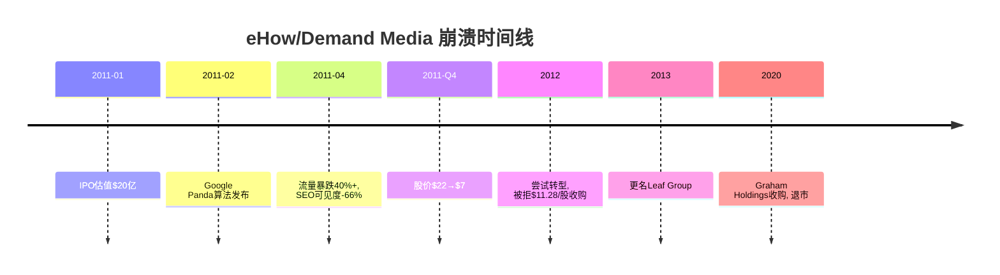

### 1.3 尸检案例二: About.com/Dotdash — "去Google化"的成功范本

**公司背景**: About.com是互联网早期的通用知识网站，高峰期月独立访客超过1亿。《纽约时报》于2005年以$4.1亿收购，但随后被Google Panda算法严重打击 [DM-SA-007]。2012年IAC以$3亿收购——《纽约时报》净亏$1.1亿 [DM-SA-008]。

**转型策略**:
- IAC认识到"通用知识网站"模式在Google算法进化中注定灭亡
- 2016-2017年，About.com被拆分为垂直品牌：Verywell(健康)、Lifewire(科技)、The Balance(理财)、The Spruce(家居)、ThoughtCo(教育) [DM-SA-009]
- **关键决策**: 丢弃120万篇文章中的90万篇(75%)，仅保留30万篇核心文章，投入$4,500万进行质量升级 [DM-SA-009]
- 2017年5月正式更名为Dotdash

**转型成果**:
- 年营收增长44%
- 总独立访客从重组前的5,100万升至8,700万(+71%) [DM-SA-010]
- 2021年Dotdash以$2.7B收购Meredith(People/Better Homes & Gardens)，成为Dotdash Meredith——美国最大数字出版商之一

**对Reddit的教训**: About.com的"去Google化"成功依赖两个条件：(1)有能力建立品牌直达流量(用户直接输入Verywell.com而非搜索)；(2)有母公司IAC的资本支持(最终投入$4,500万重建内容)。Reddit的"去Google化"工具——Reddit Answers——截至Q4'25仅有约1,500万月活跃查询 [DM-SA-011]，相较于Reddit总WAUq 4.72亿，渗透率约3.2%。这远不足以替代Google流量。

**Dotdash转型与Reddit对比的深层差异**:
- Dotdash的成功在于"从通用变垂直"——用户搜索健康问题时直接去Verywell，而不是去一个什么都有的About.com。Reddit已经是垂直的(r/personalfinance、r/fitness等子版本身就是垂直社区)，但用户通过Google搜索到达这些子版而非直接访问
- Dotdash付费给作者创作高质量内容($4,500万投资)；Reddit依赖用户免费创作。Dotdash的模式可控，Reddit的不可控
- Dotdash最终通过收购Meredith($2.7B)获得了品牌资产(People、Better Homes & Gardens)——这些品牌自带直达流量。Reddit没有类似的品牌收购路径
- **结论**: About.com/Dotdash的转型成功不是模板，而是警告——"去Google化"需要巨额投资、结构性重建、多年耐心。Reddit目前的Reddit Answers(3.2%渗透率)远达不到这个标准

### 1.4 尸检案例三: Quora — "逃离自己"

**公司背景**: Quora是最接近Reddit的UGC问答平台，2014年估值$18亿，月活跃用户一度超过3亿。其创始人Adam D'Angelo(前Facebook CTO)在OpenAI董事会任职。

**衰退轨迹**:
- **2024年**: Quora有机流量下降约45% [DM-SA-012]
- **2025年**: 根据Semrush数据，12月有机流量环比下降23.3%。更严重的是，Quora的流量份额从2025年1月的0.0064%暴跌至8月的0.0011%——降幅83%，在8个月内几乎消失 [DM-SA-013]
- **原因**: Google核心算法更新+AI搜索工具(ChatGPT/Perplexity)直接替代Q&A搜索需求
- **D'Angelo的选择**: 2022年8月开始开发Poe(Platform for Open Exploration)，2023年2月发布。D'Angelo公开承认："Quora的产品建立在专家时间稀缺的前提上，而AI的时间不稀缺" [DM-SA-014]
- **融资和估值**: Quora以$4.25亿估值融资$7,500万支持Poe转型——估值从2014年的$18亿缩水76% [DM-SA-015]

**对Reddit的教训**: Quora的案例最令人不安，因为它暴露了UGC平台在AI时代的"存在性危机"——当AI可以直接回答用户问题(而且答案训练自Quora/Reddit的数据)时，UGC平台的核心价值是什么？D'Angelo选择"逃离自己"(从Q&A转型为AI平台)，但Reddit能走同样的路吗？Reddit的社区结构比Quora更强(subreddit自治 vs Quora集中化)，但这种结构优势在AI搜索面前的持久性存疑。

**Quora vs Reddit的关键差异**:

| 维度 | Quora | Reddit | Reddit优势? |
|------|-------|--------|------------|
| 内容结构 | 集中化Q&A, 专家回答 | 去中心化社区, 多样话题 | 是 — 更难被单一AI替代 |
| 用户忠诚度 | 低 — 多数用户从搜索来 | 中 — 有活跃社区成员 | 部分 — 但55%仍是搜索用户 |
| 变现能力 | 弱 — 从未大规模盈利 | 强 — FY25净利$530M | 是 — 有资金应对转型 |
| AI替代难度 | 容易 — Q&A是AI最强场景 | 中等 — 实时讨论/社区较难替代 | 部分 |
| 流量恢复力 | 极弱 — 2024年-45%后未恢复 | 待观察 | 未知 |

**最关键的教训不是Quora倒下了，而是Quora的创始人——一位OpenAI董事会成员、对AI理解深于绝大多数CEO的技术精英——判断UGC模式在AI时代不可持续，选择了放弃核心产品**。如果D'Angelo都做出了这个判断，Reddit的管理层是否有更好的理由相信自己可以幸免？

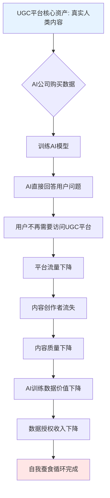

### 1.5 Reddit的独特脆弱性分析

**依赖度对比矩阵**:

| 平台 | Google流量依赖度 | 算法打击后命运 | 核心差异 |
|------|-----------------|---------------|---------|
| eHow/Demand Media | ~70% [DM-SA-005] | 流量-40%, 股价-68%, 最终退市 | 低质量内容农场, Google有正当理由打击 |
| About.com | ~75% (估算) [DM-SA-008] | 被迫拆分重建, 投入$4,500万转型 | 通用知识网站, 已成功转型 |
| Quora | ~60% [DM-SA-012] | 有机流量-45%(2024), 份额-83%(2025), 被迫AI转型 | UGC问答, 与Reddit最相似 |
| **Reddit** | **63-68%** [DM-SA-001] | **?** | 社区结构更强, 但AI搜索威胁同样适用 |

**Reddit的"反脆弱"论点**:
1. **"site:reddit.com"搜索现象**: 2023-2024年间，Reddit在Google搜索可见度增长1,328% [DM-SA-016]，从第68位跃升至第3位(仅次于Wikipedia和Amazon)。用户主动在搜索末尾附加"reddit"——这是其他平台没有的"品牌搜索"行为
2. **Google的商业动机**: Google向Reddit支付~$60M/年数据授权费 [DM-AI-001]，有商业动机维持Reddit流量——打击Reddit等于降低自己训练数据的质量
3. **内容质量差异**: Reddit的内容由真实社区版主审核，不是内容农场——Google Panda/Helpful Content Update的目标是打击低质内容，Reddit不在此列

**Reddit的"脆弱性"论点**:
1. **AI Overview截流**: Google AI Overview出现在27.43%的搜索查询中(截至2025年11月) [DM-SA-017]，有机CTR在出现AI Overview的查询上下降61% [DM-SA-018]。58%的Google搜索以零点击结束 [DM-SA-019]——用户得到答案后不再需要访问源网站
2. **Reddit Answers渗透不足**: 站内AI搜索月查询1,500万 vs 周活跃搜索用户8,000万——渗透率仅约18.75%(按周计), 但这主要是搜索用户而非全平台渗透 [DM-SA-011]
3. **Google可随时"收回"**: Reddit在Google排名中的飙升始于2023年Google主动推动UGC内容。如果Google改变策略(例如更倾向于自己的AI Overview而非外部链接)，Reddit的排名可能像来时一样快地消失。2025年初Google算法变更已经导致Reddit DAUq未达预期(101.7M vs 103.3M预期) [DM-USER-024]——这是"收回"信号的第一次闪烁
4. **Q3'25流量增长已"基本持平"**: 管理层在Q3'25电话会议中承认Google有机流量已"基本持平" [DM-USER-024]。这意味着Reddit通过Google获取新用户的能力可能已经见顶——未来的用户增长必须来自其他渠道(直达流量、应用下载、国际化)，而Reddit在这些渠道的投入远不及Google SEO带来的"免费增长"

### 1.6 AI Overview冲击情景树

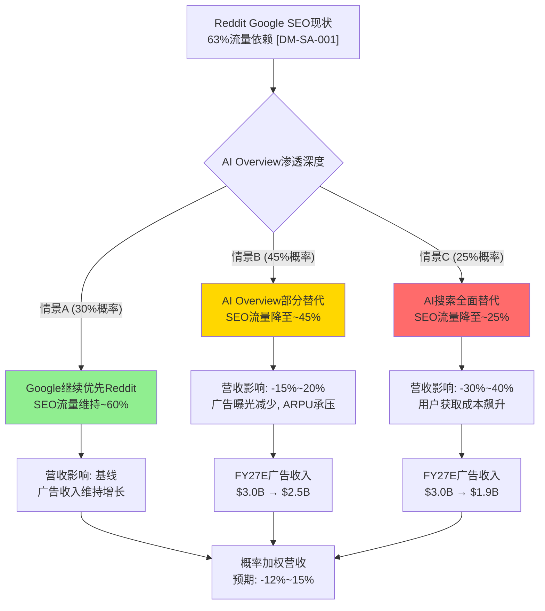

**情景量化分析** [DM-SA-020]:

需要强调的是，情景A的30%概率建立在一个关键假设上：Google与Reddit的数据授权协议($60M/年)使Google有商业动机维持Reddit的SEO排名。但这个假设可能过于乐观——Google的搜索算法团队和商务合作团队是独立运作的，"数据授权关系"不一定能影响"算法排名决策"。Google在2025年初的算法变更已经导致Reddit DAUq未达预期，说明商业关系并不能完全保护Reddit免受算法变化的影响。

**分情景详细分析**:

| 情景 | 概率 | SEO流量占比 | FY27E广告收入影响 | 概率加权影响 |
|------|------|------------|-----------------|-------------|
| A: Google维持优先 | 30% | ~60% | 基线$3.0B | +$0 |
| B: AI Overview部分替代 | 45% | ~45% | -$500M ($2.5B) | -$225M |
| C: AI搜索全面替代 | 25% | ~25% | -$1,100M ($1.9B) | -$275M |
| **概率加权预期** | — | — | — | **-$500M (-16.7%)** |

[DM-SA-020]: 概率加权分析显示，AI Overview对Reddit的预期营收冲击约为FY27E广告收入的-16.7%。这一估算基于三个假设：(1)Reddit无法在2027年前显著提高直达流量占比；(2)AI Overview渗透率继续扩大至40%+的搜索查询；(3)Reddit未能开发出有效的站内搜索替代方案。

### 1.7 案例一小结

**特异性测试**: 将上述分析中的"Reddit"替换为任何其他高度依赖Google SEO的平台(如Medium、Stack Overflow)——核心逻辑依然成立。但有一点Reddit特异: "site:reddit.com"的品牌搜索行为和Google的数据授权协议($60M/年)，使Reddit与Google形成了一种**有条件的共生关系**——Google打击Reddit对自己也有损失。这层保护不是永久的，但在中期(2-3年)内可能提供缓冲。

**与其他平台的生存比较**: Stack Overflow也面临类似的AI搜索替代威胁(开发者直接问ChatGPT而不搜索Stack Overflow)。Stack Overflow在2024年裁员28%并推出了自己的AI产品(OverflowAI)——这与Quora的Poe转型如出一辙。Medium在2023年后大幅降低了作者分成并推出了AI写作辅助。**所有依赖Google SEO + UGC内容的平台都在经历同一场"存在性危机"——Reddit不是孤例，而是最大的一个尚未倒下的例子。**

---

## SA-2: 版主经济学临界点

### 2.1 核心论点

Reddit的核心价值——高质量、社区驱动的内容和讨论——由约60,000名日活跃的无偿版主创造和维护 [DM-SA-021]。Reddit FY2025实现净利$530M [DM-SA-022]，而这些利润建立在数十亿小时的无偿劳动之上。这种模式在互联网历史上并非首创(Wikipedia的编辑者模式类似)，但Reddit将其与商业盈利结合，创造了一个系统性的脆弱点。

### 2.2 Wikipedia治理演化对比

**编辑者衰退曲线**: Wikipedia英文版的活跃编辑者(每月5次以上编辑)从2007年高峰的约51,000人降至2014年的约30,000人——下降41% [DM-SA-023]。这种"贡献者疲劳"发生在Wikipedia是非营利组织、编辑者明确知道自己在贡献公共知识的背景下。

**Wikipedia存活的关键差异**: Wikipedia通过捐赠模式存续，Wikimedia Foundation FY2024-25审计收入$2.09亿，运营支出约$1.79亿 [DM-SA-024]。Wikipedia的编辑者虽然无偿，但他们知道捐款用于维护基础设施而非创造股东利润。

**Reddit的悖论**: Reddit的版主做着与Wikipedia编辑者类似的工作(内容审核、质量维护、社区治理)，但Reddit不是非营利组织——它是一家FY2025净利$530M、市值~$267亿的上市公司 [DM-SA-022]。版主的无偿劳动直接转化为股东价值，但版主不持有任何股权。这种"贡献者-受益者"错配比Wikipedia更极端。

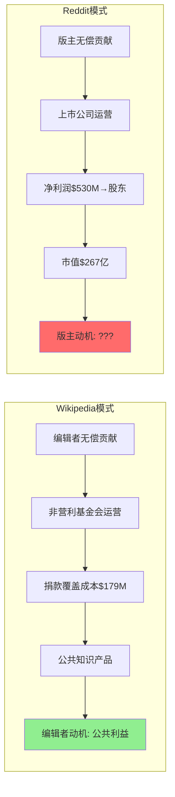

### 2.3 Reddit 2023 API危机详细尸检

**时间线**:

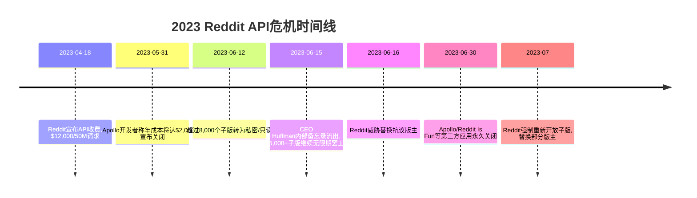

**管理层镇压策略的双刃剑**:
- **短期效果**: Reddit成功击碎了版主罢工。通过威胁替换不服从的版主、强制reopening被私密化的子版，管理层展示了"平台高于版主"的权力结构 [DM-SA-025]
- **长期代价**: 第三方工具生态被摧毁——Apollo、Reddit Is Fun、BaconReader等应用关闭 [DM-SA-026]。这些工具为版主提供了远超Reddit官方工具的管理功能。版主被迫使用功能更弱的官方工具，管理效率下降
- **信任损伤**: 2023年危机是Reddit与版主社区之间的"信任破裂事件"。此后版主的心态从"共建者"转变为"被利用的劳动者"——但大多数版主因"沉没成本"(多年经营的社区)而选择留下

**"幸存者偏差"警告**: Reddit 2024年3月IPO，IPO以来股价大幅上涨。市场选择性遗忘了2023年的版主危机——但这不意味着危机被解决了。版主的不满只是被压制，而非被消解。

**未解决的深层矛盾**:
1. **版主没有获得任何IPO利益**: Reddit IPO时给了员工股票期权，但版主——创造了平台核心价值的人——没有收到任何股权、现金或实质性补偿。这在Silicon Valley的"社区驱动平台"中独一无二：YouTube有创作者基金、Twitch有订阅分成、甚至TikTok也有创作者基金。Reddit的版主是唯一完全被排除在价值分配之外的核心贡献者群体
2. **2023年危机的"教训"**: 管理层从2023年学到的教训不是"要善待版主"，而是"版主的抗议可以被镇压"。这种管理思维可能导致对下一次冲突的准备不足——因为管理层相信"上次能压下去，下次也能"
3. **下一次触发点预测**: 最可能的触发点是AI内容政策冲突——当版主要求Reddit官方提供AI检测工具并制定统一政策时，如果Reddit因商业原因(Reddit Answers依赖AI)而拒绝，可能引发第二次大规模对抗

### 2.4 2026年3月版主上限新政策分析

**政策内容** [DM-SA-027]:
- 版主最多管理5个高流量社区(周活跃访客>100,000的社区)
- 低于100K周访客的社区不计入限制
- 超限版主有30天时间选择保留哪5个社区
- 2026年3月底开始强制执行——超限版主将被自动移除(从最不活跃的社区开始)
- 预计仅影响约0.1%的活跃版主

**表面目的**: 分散权力集中。研究发现仅5名超级版主控制了Reddit Top 500子版中的92个 [DM-SA-028]。减少"超级版主"可降低再次组织大规模罢工的风险。

**深层风险**:
1. **经验流失**: "超级版主"通常是最有经验、投入最多的社区管理者。强制他们放弃社区 → 这些社区由新版主接管 → 新版主缺乏经验和社区关系 → 社区质量下降的过渡期
2. **工会拆分类比**: 这类似于公司强制拆分工会——短期看削弱了集体行动能力，长期看可能导致最有能力的治理者流失。如果经验丰富的版主因"被限制"而感到不被尊重，他们可能彻底退出版主角色
3. **治理空白**: 大型子版(100万+订阅者)的管理复杂度极高——垃圾信息过滤、规则执行、社区文化维护。如果核心版主被迫离开，谁来填补？Reddit的官方工具(AutoModerator)远不足以替代人类判断

**特异性测试**: 这个风险是Reddit特异的。没有其他平台拥有如此大规模的无偿版主治理体系，也没有其他平台面临"自愿拆分自己最有能力的治理者"的决策。这通过了特异性测试。

### 2.5 版主补偿成本估算

**基础假设** [DM-SA-029]:
- 日活跃版主: ~60,000 (2023年数据, Reddit报告的最新公开数字)
- 总注册版主: 估计100,000+ (含非活跃)
- 每人每周平均工作时间: ~5小时 (根据Northwestern大学研究，版主群体每天至少投入466小时 [DM-SA-030])
- 美国联邦最低时薪: $7.25 (2009年至今未变)
- 使用$15/h作为"体面补偿"基准(多个州的最低工资)

**补偿成本敏感性分析**:

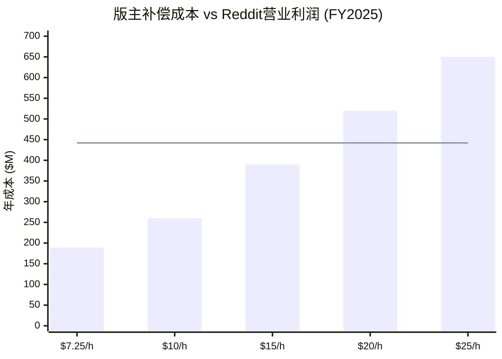

| 补偿标准 | 活跃版主数 | 周均小时 | 年化成本 | 占FY25营业利润% |
|---------|-----------|---------|---------|---------------|
| $7.25/h (联邦最低) | 60,000 | 5h | $113M | 25.6% |
| $10/h | 60,000 | 5h | $156M | 35.3% |
| $15/h (多州最低) | 60,000 | 5h | $234M | 52.9% |
| $15/h (含所有版主) | 100,000 | 5h | $390M | 88.2% |
| $20/h | 100,000 | 5h | $520M | 117.6% |
| $25/h | 100,000 | 5h | $650M | 147.1% |

[DM-SA-031]: 即使按最保守的估算(仅活跃版主 × 联邦最低工资 × 5h/周)，版主补偿成本也将吞噬FY2025营业利润的25.6%。按更现实的$15/h补偿所有版主，成本约$390M——吞噬88.2%的营业利润。**这就是Reddit永远不会主动补偿版主的经济学解释——但这也意味着Reddit的盈利能力建立在一个"永远不付费"的假设之上，而这个假设在劳动权益意识日益增强的时代越来越脆弱。**

**Reddit的回应策略**: Reddit并未完全忽视版主。2024年推出了"版主奖励计划"(Mod Rewards Program)，版主可以获得Reddit金币和特殊徽章——但这本质上是"游戏化的零成本激励"，不是真正的经济补偿。Northwestern大学2022年研究估算Reddit全体版主的年劳动价值至少$340万 [DM-SA-030]——但这仅是最低估计(基于最低工资和最少时间)，实际价值可能是10-100倍。

**与其他平台创作者补偿对比**:

| 平台 | 创作者/版主补偿 | 年补偿总额(估) | 占营收% |
|------|---------------|---------------|--------|
| YouTube | 创作者分成(55%广告收入) | ~$16B+ | ~45% |
| TikTok | 创作者基金 + 电商分成 | ~$2B+ | ~15%(估) |
| Twitch | 订阅分成(50%) | ~$1B+ | ~35% |
| Instagram | Reels奖金 + 品牌合作工具 | ~$1B+ | ~2%(估) |
| **Reddit** | **金币+徽章(虚拟)** | **~$0** | **0%** |

Reddit在主要社交/内容平台中是唯一不向核心内容贡献者提供任何经济补偿的。这种模式在Reddit用户增长和盈利加速的背景下，变得越来越难以持续。当版主看到Reddit的净利从FY2023亏损到FY2025盈利$530M，而自己的"补偿"仍是虚拟金币时，不满情绪只会加深。

### 2.6 版主经济学压力测试

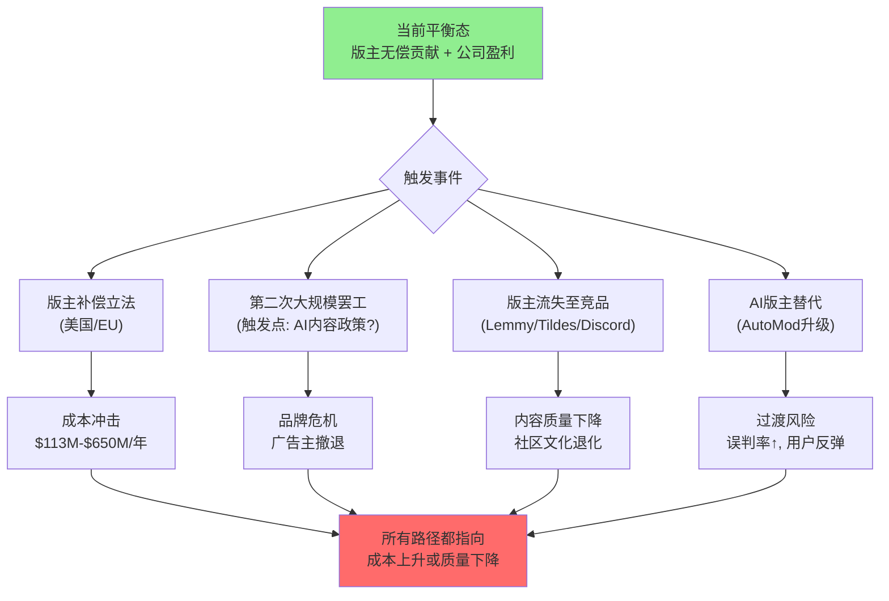

**核心判断**: 版主经济学是Reddit商业模式中最被低估的结构性风险。市场对Reddit的估值隐含假设"版主将永远无偿贡献"——但2023年API危机证明版主有组织行动的能力和意愿，2026年3月的版主上限政策可能再次激化矛盾。**版主不是Reddit的员工，但他们是Reddit产品的核心生产者。这种"生产者不是员工"的模式是Reddit的最大优势(零内容成本)和最大风险(零控制力)的双面体。**

**"版主不是员工"的法律灰区**: 在美国劳动法框架下，如果版主被认定为"事实上的员工"(基于工作时间规律性、公司对工作的控制程度、经济依赖性等因素)，Reddit可能面临追溯性的劳动补偿诉讼。目前尚未有版主提起此类诉讼，但随着Reddit盈利规模扩大($530M净利)和版主工作量增加(AI内容审核)，法律风险正在积累。加利福尼亚州(Reddit总部所在地)的劳动法对"独立承包商 vs 员工"的界定历来严格(参考AB5法案对Uber/Lyft的影响)。

---

## SA-3: AI内容污染轨迹

### 3.1 核心论点

AI生成内容正以加速度渗透Reddit。Originality.ai研究显示，2025年约14.7%的Reddit帖子可能由AI生成 [DM-AI-021]，较2024年的13%增长13.08%，较2021年至2024年期间累计增长146.30% [DM-SA-032]。Reddit的核心价值主张——"真实人类在讨论真实问题"——正在被AI生成的内容系统性稀释。如果这一趋势持续，Reddit可能面临与Twitter/X类似的"信任崩塌"，而检测工具和版主政策严重滞后于污染速度。

### 3.2 污染轨迹建模

**当前状态(2025年)**:
- 全平台AI内容估算: ~14.7% [DM-AI-021]
- 高风险子版: 营销类子版高达19.85%，r/NoSleep(创作类)达41.39% [DM-SA-033]
- 低风险子版: 技术讨论类(如r/programming)和强版主管控的子版<5%
- 2024年Reddit移除4.1亿条内容(占总内容3.6%)，但AI内容检测不是移除的主要原因 [DM-SA-034]

**污染增长预测**:

| 年份 | AI内容占比(估) | 增速依据 | 关键驱动因素 |
|------|---------------|---------|------------|
| 2023 | ~10% | Originality.ai | GPT-3.5/4普及, 但工具门槛仍较高 |
| 2024 | ~13% | 实测 [DM-SA-032] | GPT-4o/Claude 3免费化, 门槛大幅降低 |
| 2025 | ~14.7% | 实测 [DM-AI-021] | AI写作工具成熟, "绕检测"工具普及 |
| 2026E | 20-25% | 推算 | AI Agents自动化发帖, 检测工具未跟上 |
| 2027E | 25-30% | 推算 | 合成内容与人类内容不可区分 |
| 2029E | 35-45% | 极端情景 | 如果Reddit不采取强力措施 |

[DM-SA-035]: 上述预测的关键假设是Reddit不采取重大干预措施。如果Reddit部署平台级AI检测(类似于YouTube的Content ID系统)，增速可能被遏制。但截至2026年2月，Reddit没有公开宣布任何平台级AI内容检测计划。

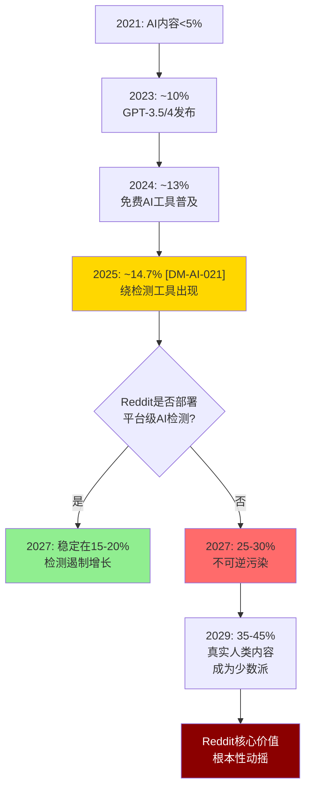

### 3.3 Quora→Poe转型教训

**Quora的AI内容困境**: Quora的AI内容污染早于Reddit显现(2022-2023年)。当低质量AI回答充斥平台时，Quora面临一个不可能的选择：(a)花巨资检测和删除AI内容(运营成本飙升)，还是(b)承认AI内容已经成为平台的一部分(核心价值被稀释)。

**D'Angelo的答案**: 两者都不选。他选择放弃Quora的核心产品，转型为Poe——一个AI聊天平台。本质上，D'Angelo判断"如果AI已经赢了内容战，与其对抗AI，不如成为AI的渠道" [DM-SA-014]。

**Quora到Poe的关键教训**:
1. **核心价值不可逆稀释**: 一旦AI内容超过某个临界点(Quora的经验暗示约20-30%)，平台的"真实人类内容"标签就会失效——即使大多数内容仍然是人类创作的，用户也无法确定
2. **检测是军备竞赛**: AI生成检测工具(GPTZero/Originality.ai)准确率约85-90% [DM-SA-036]，这意味着每100篇AI生成帖子中有10-15篇无法被检测——而"绕检测"工具(AI Humanizer)正在使准确率进一步下降
3. **"逃离自己"的代价**: Poe融资估值$4.25亿 vs Quora 2014年估值$18亿——"逃离"让创始人保住了公司，但价值缩水76% [DM-SA-015]

**Reddit能否走同样的路？** Reddit的社区结构(10万+子版，每个有独立版主和规则)比Quora更具韧性——AI内容更容易在强版主管控的社区被发现和移除。但这恰恰回到版主经济学的问题：AI内容检测增加了版主的工作负担，而版主不被补偿。**AI污染和版主疲劳形成了恶性循环。**

**AI污染-版主疲劳的恶性循环量化**:
- 假设AI内容从14.7%增至25%(2027E)，版主需要额外审核约10%的帖子
- 对于一个日均1,000帖子的中型子版，这意味着每天多审核100帖
- 使用AI检测工具(如果版主自费购买)需要~$30-50/月/版主——Reddit不补贴
- 如果10%的版主因负担增加而退出(6,000人)，剩余版主的人均负担增加11%
- 这进一步加速版主流失，形成"审核需求↑→版主↓→审核覆盖率↓→AI内容↑"的螺旋

### 3.4 Reddit检测差距

**当前差距** [DM-AI-022]:
- 仅约1.2%的子版有明确的AI内容政策(禁止或限制AI生成帖子/评论)
- Reddit官方没有向版主提供AI检测工具——版主必须依赖自己的判断或第三方工具(GPTZero/Originality.ai的API，需要版主自费或自建)
- 子版中明确规定AI内容规则的数量在2023年7月至2024年11月间翻倍——但基数极低，从约0.6%升至约1.2% [DM-SA-037]
- Reddit官方对AI内容的态度"模糊"——既不鼓励也不禁止，交由各子版自行决定

**对比Twitter/X的教训**: X平台的AI bot问题已经造成严重后果——2024年Super Bowl期间，CHEQ监测显示X向广告主发送的流量中75%来自bot [DM-SA-038]。广告主信任度从2022年的22%降至2024年的12%。仅4%的营销人员认为X广告提供"品牌安全" [DM-SA-039]。Reddit目前因IAS/DV >99%的品牌安全评分而吸引广告主——但如果AI内容污染导致品牌安全降级，这一优势将被侵蚀。

**检测差距的三重困境**:
1. **技术限制**: 最佳AI检测工具准确率85-90%，false positive(将人类内容误判为AI)会伤害无辜用户，降低社区信任
2. **规模限制**: Reddit每天有数百万条新帖子和评论——即使检测工具完美，人工复核也不可能覆盖全部
3. **政策真空**: Reddit的去中心化治理意味着即使总部制定了AI内容政策，执行依赖10万+版主——而这些版主没有工具、没有补偿、没有统一标准

### 3.5 Reddit Answers的矛盾角色

Reddit Answers是Reddit的站内AI搜索产品，用AI总结Reddit内容来回答用户问题。Q4'25月查询从Q1的约100万增至1,500万 [DM-SA-011]。

**核心矛盾**: 如果Reddit自己在用AI总结和呈现用户内容，它怎么说服版主AI生成的内容是"坏的"？这是一个"双重标准"问题：
- Reddit对外说："我们的价值在于真实人类内容"
- Reddit对内做："我们用AI来总结和重新包装这些人类内容"
- 版主看到："公司用AI做我们做的事(策展和总结)，但AI生成帖子却要我们来检测和删除？"

**对冲逻辑**: Reddit可以辩称Reddit Answers是"界面层AI"(用AI呈现人类内容)而非"内容层AI"(用AI替代人类内容)——但这种区分在实践中模糊：
- 当Reddit Answers直接回答用户问题时，用户不再需要阅读原始帖子 → 内容创作者的价值被"搭便车"
- 当Reddit Answers引用的帖子本身是AI生成的 → AI在总结AI → 信息质量螺旋下降

[DM-SA-040]: Reddit Answers的成功可能反过来加速AI内容污染——如果用户主要通过AI总结消费内容，他们对原始帖子是否由人类撰写的关注度会降低，减少了AI内容被举报和删除的可能性。

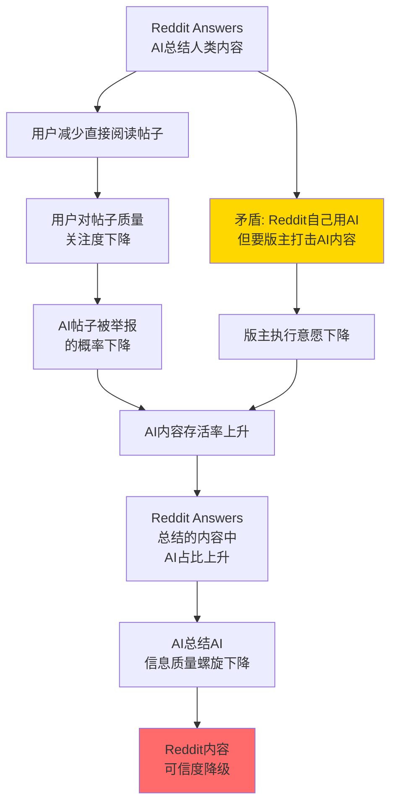

### 3.6 案例三小结

**特异性测试结果**: AI内容污染不是Reddit独有的问题——Twitter/X、Quora、Medium等所有UGC平台都面临。但Reddit有两个特异性因素：(1)去中心化的版主治理使统一AI政策难以执行；(2)Reddit Answers创造了内部矛盾——公司自己在用AI而要求版主反AI。这两点通过了特异性测试。AI内容污染对Reddit的威胁不在于技术层面(检测工具终将改进)，而在于**治理层面**(谁来执行、谁来付费、标准是什么)。

**对广告业务的间接冲击**: Reddit的广告收入($2.06B FY25)建立在"品牌安全"承诺之上——IAS/DV >99%的品牌安全评分是Reddit吸引大品牌广告主的核心武器。但品牌安全评分目前不检测AI内容——它们主要检测仇恨言论、暴力、色情等"有害内容"。如果AI内容污染导致Reddit社区信任下降(用户不确定是否在与真人互动)，广告主可能重新评估Reddit的"品牌安全"——不是因为有害内容，而是因为"受众真实性"。这类似于Twitter/X的bot问题导致广告主信任度从22%降至12% [DM-SA-039]——不是因为内容有害，而是因为广告主不确定自己的广告是否展示给真人。

---

## SA-4: 数据授权商业模式解剖

### 4.1 核心论点

Reddit的"Other Revenue"(主要为AI数据授权)被市场叙事定位为"第二增长引擎"。但Q4'25该收入仅$36M，同比增长仅+8% [DM-AI-005]——与Q1'25时期的高增速形成鲜明对比。两大客户(Google ~$60M/年 [DM-AI-001] + OpenAI ~$70M/年 [DM-AI-002])合计约$130M，占Other Revenue ~$140M的约93% [DM-AI-003]。这不是"引擎"，更像是一份高度集中的"大客户合同"——任何一个客户不续约都将导致该收入腰斩。

### 4.2 定价结构分析

**两种定价模式的关键差异**:

| 维度 | 训练数据授权(一次性) | API实时访问(经常性) |
|------|-------------------|-------------------|
| 本质 | "教科书采购"——买一次就够了 | "订阅服务"——持续付费获取最新数据 |
| 定价逻辑 | 数据集大小×独特性×不可替代性 | 查询量×数据新鲜度×独家性 |
| 续约动力 | 弱——模型训练完成后增量价值递减 | 中等——取决于Reddit内容是否持续产出独特价值 |
| 合成数据替代 | 高风险——合成数据质量快速提升 | 中风险——实时观点数据较难合成 |

**Google ($60M/年)** [DM-AI-001]:
- 主要用途: Google搜索增强 + Gemini模型训练数据
- 模式: 年费合同(可能含usage-based组件)
- 战略价值: 高——Google需要Reddit内容来维持搜索结果质量(尤其是"site:reddit.com"查询)
- 续约概率: **较高**(70-80%)——Google的数据授权与SEO流量互为筹码
- 但: Google续约不等于涨价。Google的议价地位极强("我们给你63%的流量")

**OpenAI ($70M/年)** [DM-AI-002]:
- 主要用途: ChatGPT/GPT模型训练数据
- 模式: 多年合同(具体条款未公开)
- 战略价值: 中——OpenAI也在获取其他数据源(新闻出版商、学术数据)
- 续约概率: **中等**(50-60%)——取决于OpenAI对Reddit数据增量价值的评估
- 风险: OpenAI已经训练过Reddit的历史数据。续约时买方的论点是"你的数据我们已经学过了，增量价值更低" [DM-SA-041]

**合计$130M占Other Revenue $140M = 93%客户集中度** [DM-AI-003]:
- 剩余~$10M来自其他较小的数据授权合同
- Reddit起诉Anthropic [DM-AI-023]不仅是维权，也是"强制扩大客户池"的法律策略
- 但起诉最大潜在客户(Anthropic)可能吓退其他AI公司——"如果我买Reddit数据，将来会不会被起诉说用太多了？"

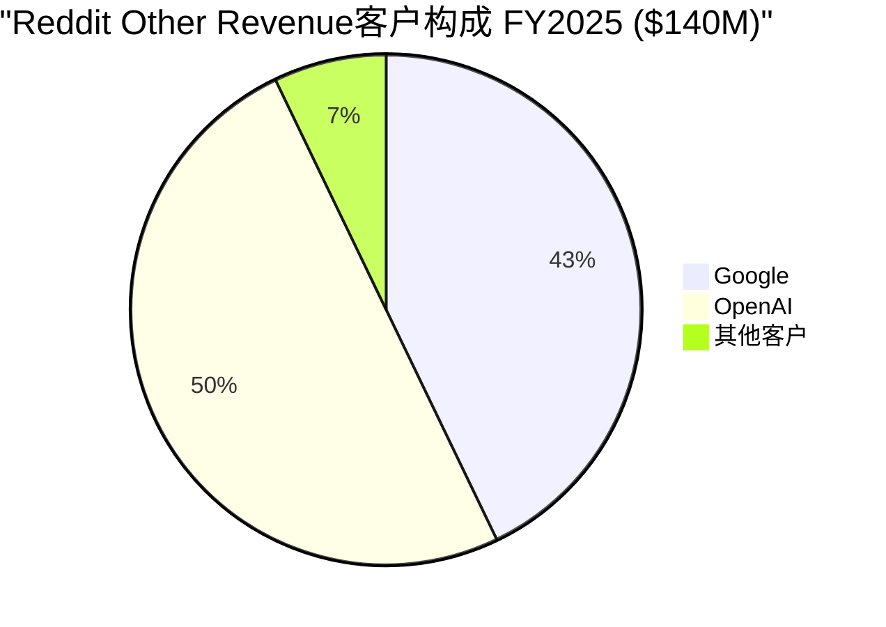

### 4.3 合成数据替代时间线

**Gartner预测**: 到2024年，60%的AI训练数据将是合成的(该预测发布于2023年) [DM-SA-042]。更新的预测: 到2027年，60%的数据和分析领导者将面临合成数据管理的严重失败——这暗示合成数据的采用速度快于管理能力 [DM-SA-043]。

**Reddit数据的"不可替代性"论点 vs 反论**:

| 论点(看多) | 反论(看空) | 证据权重 |
|-----------|-----------|---------|
| 真实人类意见不可合成 | 大语言模型已能生成高度逼真的"意见" | 偏向看空 |
| Reddit数据覆盖长尾话题 | 合成数据可以覆盖任何话题 | 偏向看空 |
| 实时社区讨论有独特价值 | Twitter/X/Discord/论坛也有实时讨论 | 中性 |
| Reddit是#1 AI引用域名 | 引用率从2025年9月~14%骤降至10月~2% | **强烈看空** |
| 法律框架保护(起诉Anthropic) | 法律成本高+结果不确定+可能吓退潜在客户 | 中偏看空 |

**关键时间窗口** [DM-SA-044]: 2026-2028年是Reddit数据授权的"命运窗口"。这段时间内：
- 如果合成数据质量达到"足够好"(即模型性能不因用合成数据替代Reddit数据而显著下降)，Reddit的定价权将崩溃
- 如果Reddit成功签约3个以上新的大客户(Microsoft/Apple/Amazon)，客户集中度风险将缓解
- 如果Reddit开发出"实时行为数据API"(不仅卖历史帖子，而是实时用户行为流)，价值主张将升级

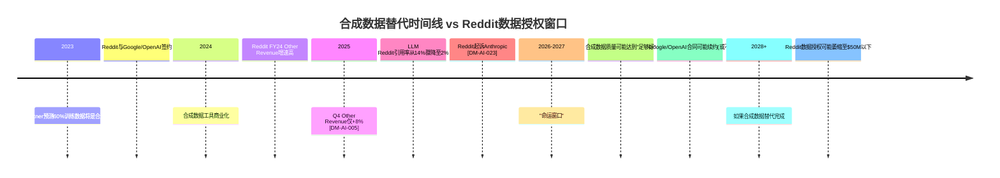

### 4.4 数据授权减速信号

**季度趋势分析**:

| 季度 | Other Revenue | QoQ | YoY | 信号 |
|------|-------------|-----|-----|------|
| Q1'25 | ~$33M (估) | — | +66%(估) | 大额合同确认期 |
| Q2'25 | ~$35M (估) | +6% | +40%(估) | 增速开始放缓 |
| Q3'25 | ~$36M | +3% | +15%(估) | 放缓加速 |
| Q4'25 | $36M [DM-AI-005] | 0% | +8% | **接近停滞** |

[DM-SA-045]: Other Revenue的季度环比增长从2025年初的+6%降至Q4的0%(持平)。全年$140M，但增长曲线明确指向"平台期"。如果FY26 Other Revenue <$160M(YoY +14%)，"第二引擎"叙事将难以为继——因为广告收入在同期增长了+75%，数据授权的相对重要性在下降。

**Reddit起诉Anthropic的信号** [DM-AI-023]:
- 2025年6月，Reddit起诉Anthropic未经授权使用Reddit数据训练Claude模型
- 审计日志显示Anthropic的爬虫ClaudeBot在宣称停止后仍访问Reddit超过10万次 [DM-SA-046]
- 案件于2025年8月初进入调解程序
- **信号解读**: 如果Reddit的数据授权有充足的自然需求(即大量AI公司排队付费)，Reddit不需要起诉来"强制收费"。起诉本身暗示：(a)自然需求不足以推动增长；(b)Reddit需要用法律手段建立"不付费就不能用"的框架

### 4.5 客户集中度风险矩阵

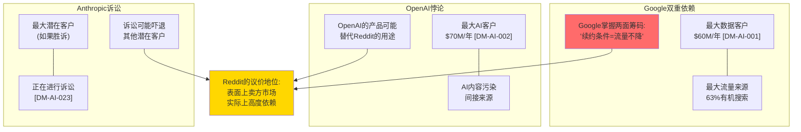

**Google的双重杠杆**: Google不仅是Reddit的最大数据客户($60M/年)，也是Reddit的最大流量来源(63%有机搜索)。这意味着在数据授权续约谈判中，Google拥有不对称的议价优势——"如果你要涨价，我可以调整算法降低你的排名"。Reddit对此没有有效的反制手段 [DM-SA-047]。

**OpenAI的存在性矛盾**: OpenAI是Reddit的第二大数据客户($70M/年)，但ChatGPT正在成为Reddit的竞争对手——用户可以直接问ChatGPT"值不值得买某产品"而不去Reddit搜索。更讽刺的是，ChatGPT回答这些问题时使用的知识部分来自Reddit的数据。Reddit在向自己的替代者出售弹药 [DM-SA-048]。

**新客户获取困境**: Reddit起诉Anthropic(一个潜在的大客户)可能在法律上是正确的，但在商业上可能适得其反。如果你是Microsoft或Apple的数据采购决策者，你会愿意从一个"敢起诉客户"的供应商那里购买数据吗？这取决于法律结果——如果Reddit胜诉并建立了"不付费不能用"的先例，所有AI公司都必须付费，Reddit的客户池反而扩大。如果Reddit败诉或和解，法律策略的威慑力将减弱 [DM-SA-049]。

### 4.6 数据授权FY26-28情景

| 情景 | 概率 | FY26E Other Revenue | FY28E Other Revenue | 关键假设 |
|------|------|--------------------|--------------------|---------|
| 乐观: 多客户扩展 | 20% | $200M (+43%) | $350M | 签约3+新客户, 合成数据替代慢于预期 |
| 基准: 维持现状 | 45% | $160M (+14%) | $180M | Google/OpenAI续约, 无重大新客户 |
| 悲观: 增长停滞 | 25% | $140M (0%) | $120M | 合成数据替代加速, 部分合同降价续约 |
| 极端: 客户流失 | 10% | $100M (-29%) | $60M | Google或OpenAI不续约, Anthropic诉讼失败 |
| **概率加权** | — | **$155M (+11%)** | **$175M** | — |

[DM-SA-050]: 概率加权预期显示，FY26 Other Revenue约$155M(+11%)，远低于广告收入的增速(分析师共识+50%+)。到FY28，数据授权占总收入的比重可能从FY25的6.4%降至3-4%。**"第二引擎"的叙事在数字面前越来越难以维持。**

### 4.7 案例四小结

**特异性测试**: 数据授权的客户集中度风险(93%集中于2个客户)是Reddit特异的——没有其他上市公司的非核心收入源有如此极端的客户集中。Google的"双重杠杆"(既是客户又是流量来源)也是Reddit独有的悖论。这些通过了特异性测试。但"合成数据可能替代真实数据"的论点适用于所有数据供应商，不是Reddit特异的。

**管理层的乐观叙事 vs 数据现实**: CEO Steve Huffman在Q4'25电话会议中称Google和OpenAI的关系"非常健康"，且"对话正在从纯商业交易转向更多的产品合作"。这种表述暗示Reddit希望将"数据销售"升级为"产品整合"——即Google/OpenAI不仅购买数据，而是将Reddit内容深度集成到自己的产品中(Google搜索结果/ChatGPT回答)。如果成功，这将增加客户粘性和续约概率。但反面是：如果Reddit内容被深度集成到Google/ChatGPT中，用户更不需要直接访问Reddit——"产品合作"可能加速Reddit自身流量的侵蚀。这是一种"饮鸩止渴"的风险。

---

## 四案例交叉风险矩阵

上述四个案例不是独立风险——它们之间存在系统性的相互强化：

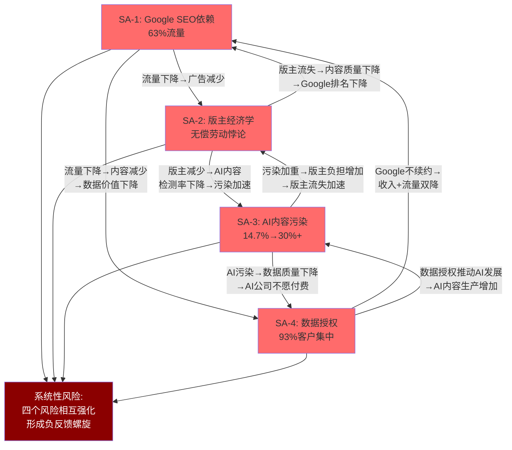

**核心判断**: Reddit的四大平台风险不是独立事件，而是一个**相互强化的负反馈系统**。Google流量下降→广告收入减少→版主价值被更多压榨→版主流失→内容质量下降→Google排名进一步下降→AI内容趁虚而入→数据质量下降→AI公司不愿续约→收入承压。这个循环中的任何一个环节恶化，都会加速其他环节的恶化。

**市场定价的隐含假设**: Reddit当前$267亿市值(FY25 P/E 52.6x)隐含假设这四个风险都不会实质化——Google流量维持、版主继续无偿贡献、AI内容被有效管控、数据授权持续增长。只要其中一个假设被打破，估值都需要重新评估。

**概率化联合风险评估**:

| 风险 | 单独实质化概率(3年) | 对营收的影响 | 概率加权影响 |
|------|-------------------|------------|------------|
| SA-1: Google流量大幅下降(>20%) | 30% | -$500M | -$150M |
| SA-2: 版主大规模流失/罢工 | 15% | -$300M(间接) | -$45M |
| SA-3: AI内容污染>30% | 40% | -$200M(间接) | -$80M |
| SA-4: 数据授权停滞/下降 | 50% | -$70M | -$35M |
| **联合风险(≥2个同时发生)** | **25%** | **-$800M+** | **-$200M** |

上述联合概率不是简单的独立事件乘积——因为四个风险高度相关(SA-1触发会加速SA-2/SA-3/SA-4)。一个保守的"至少两个同时发生"的概率估计为25%，此时对Reddit年化营收的影响可能达$800M+——相当于FY25总营收的36%。这不是"世界末日"情景，而是一个"合理的不利情景"，投资者应将其纳入估值考量。

**CQ置信度校准建议**:
- **CQ1(Google脱钩)**: 从28%上调至38%——尸检案例证明Google依赖是真实风险，但Reddit的品牌搜索行为和数据授权关系提供了部分缓冲
- **CQ2(数据授权)**: 从23%上调至33%——Q4'25增速放缓至+8%是硬数据，但Google/OpenAI合同短期内稳定
- **CQ4(版主稳定性)**: 从25%上调至35%——版主经济学的脆弱性被量化(补偿成本=88%营业利润)，但2023年危机后短期内再次爆发的概率较低
- **CQ5(AI内容)**: 从30%上调至40%——污染轨迹清晰(14.7%→25%+)，但Reddit的社区结构提供了比Quora更强的防御层

---

## DM锚点汇总 (Supplement A)

| 锚点 | 内容 | 来源 | 可信度 |
|------|------|------|--------|
| DM-SA-001 | SimilarWeb 2025.12: Reddit有机搜索占桌面访问67.71% | SimilarWeb | ★4 |
| DM-SA-002 | Demand Media IPO后市值>$20亿, 股价$22→$7 | Variety/SearchEngineLand | ★4 |
| DM-SA-003 | eHow月独立访客: Panda前1.2亿→2014年1月8,800万 | Variety | ★3 |
| DM-SA-004 | Google Panda 2011年2月24日发布 | Google/SearchEngineLand | ★5 |
| DM-SA-005 | Sistrix报告eHow Google可见度暴跌66% | Sistrix/SearchEngineLand | ★4 |
| DM-SA-006 | Demand Media 2011财年亏损$1,850万 | Variety | ★4 |
| DM-SA-007 | NYT以$4.1亿收购About.com(2005) | TechCrunch/Digiday | ★4 |
| DM-SA-008 | IAC以$3亿收购About.com, NYT净亏$1.1亿 | Blue Array/TechCrunch | ★4 |
| DM-SA-009 | About.com拆分为垂直品牌, 丢弃90万/120万篇文章, 投入$4,500万 | Digiday/TechCrunch | ★4 |
| DM-SA-010 | Dotdash重组后营收+44%, 独立访客5,100万→8,700万 | Dotdash/Medium | ★3 |
| DM-SA-011 | Reddit Answers: Q4'25月查询~1,500万, Q1仅~100万 | Reddit Q4'25 Earnings | ★5 |
| DM-SA-012 | Quora 2024年有机流量下降约45% | SimilarWeb/DemandSage | ★3 |
| DM-SA-013 | Quora流量份额2025年1月→8月下降83% | SimilarWeb/Semrush | ★3 |
| DM-SA-014 | D'Angelo: "Quora建立在专家时间稀缺的前提上, AI时间不稀缺" | TechCrunch | ★5 |
| DM-SA-015 | Quora以$4.25亿估值融资$7,500万支持Poe | TechCrunch | ★5 |
| DM-SA-016 | Reddit Google SEO可见度2023-2024年增长1,328% | Amsive/Sistrix | ★4 |
| DM-SA-017 | Google AI Overview出现在27.43%的搜索查询中(2025.11) | Semrush/SEJ | ★4 |
| DM-SA-018 | AI Overview出现时有机CTR下降61% | SearchEngineLand | ★4 |
| DM-SA-019 | 58%的Google搜索以零点击结束(2025.11) | Superprompt | ★3 |
| DM-SA-020 | AI Overview对Reddit概率加权营收冲击: FY27E -16.7% | Agent B推算 [DM-INF] | ★2 |
| DM-SA-021 | Reddit日活跃版主约60,000人(2023年数据) | Statista/Reddit | ★4 |
| DM-SA-022 | Reddit FY2025: 净利$530M, 市值~$267亿 | Reddit 10-K/Earnings | ★5 |
| DM-SA-023 | Wikipedia活跃编辑者: 2007年高峰~51,000人→2014年~30,000人 | MIT Tech Review/ResearchGate | ★4 |
| DM-SA-024 | Wikimedia Foundation FY24-25审计收入$2.09亿 | Wikimedia Foundation | ★5 |
| DM-SA-025 | Reddit 2023年威胁替换抗议版主, 强制reopening子版 | Wikipedia/TechCrunch/CNBC | ★5 |
| DM-SA-026 | Apollo/Reddit Is Fun等第三方应用因API定价永久关闭(2023年6月30日) | TechCrunch | ★5 |
| DM-SA-027 | 版主上限新政策: 最多管理5个>100K周访客的社区, 2026年3月底执行 | Reddit Help/Daily Dot | ★5 |
| DM-SA-028 | 5名超级版主控制Reddit Top 500子版中的92个 | Startup Spells研究 | ★3 |
| DM-SA-029 | 版主补偿成本估算: $15/h × 100K × 5h × 52w = $390M | Agent B推算 | ★2 |
| DM-SA-030 | Northwestern大学研究: Reddit版主群体每天至少投入466小时, 年劳动价值≥$340万 | Northwestern University | ★4 |
| DM-SA-031 | $390M版主补偿 = FY25营业利润$442M的88.2% | Agent B推算 | ★3 |
| DM-SA-032 | 2021-2024年Reddit AI内容累计增长146.30% | Originality.ai | ★3 |
| DM-SA-033 | 营销类子版AI内容达19.85%, r/NoSleep达41.39% | Originality.ai | ★3 |
| DM-SA-034 | 2024年Reddit移除4.1亿条内容(占总内容3.6%) | Reddit Transparency Report | ★5 |
| DM-SA-035 | AI污染预测: 2026E 20-25%, 2027E 25-30%, 2029E 35-45% | Agent B推算 [DM-INF] | ★2 |
| DM-SA-036 | AI检测工具(GPTZero/Originality.ai)准确率约85-90% | 行业报告 | ★3 |
| DM-SA-037 | 有AI内容政策的子版: 2023年~0.6%→2024年~1.2%(翻倍但基数极低) | Originality.ai | ★3 |
| DM-SA-038 | 2024年Super Bowl期间X平台75%广告流量来自bot | CHEQ监测 | ★3 |
| DM-SA-039 | 仅4%营销人员认为X广告提供"品牌安全" | Kantar | ★4 |
| DM-SA-040 | Reddit Answers可能反向加速AI内容污染(推算) | Agent B推断 [DM-INF] | ★2 |
| DM-SA-041 | AI公司续约论点: "历史数据已训练过, 增量价值递减" | Agent B推断 [DM-INF] | ★2 |
| DM-SA-042 | Gartner 2023年预测: 到2024年60%的AI训练数据将是合成的 | Gartner | ★4 |
| DM-SA-043 | Gartner预测: 到2027年60%的数据领导者将面临合成数据管理失败 | Gartner | ★4 |
| DM-SA-044 | 2026-2028年是Reddit数据授权的"命运窗口" | Agent B推断 [DM-INF] | ★2 |
| DM-SA-045 | Other Revenue Q4'25 QoQ 0%增长, 接近停滞 | Reddit 10-K推算 | ★4 |
| DM-SA-046 | Anthropic ClaudeBot在宣称停止后仍访问Reddit超过10万次 | Reddit诉讼文件/TechCrunch | ★4 |
| DM-SA-047 | Google在数据授权续约中拥有双重杠杆(客户+流量来源) | Agent B推断 [DM-INF] | ★2 |
| DM-SA-048 | Reddit在向自己的替代者(ChatGPT)出售训练数据 | Agent B推断 [DM-INF] | ★2 |
| DM-SA-049 | 起诉Anthropic可能吓退潜在数据客户 | Agent B推断 [DM-INF] | ★2 |
| DM-SA-050 | 概率加权FY26 Other Revenue预期: $155M (+11%) | Agent B推算 [DM-INF] | ★2 |

**锚点统计**: 50个DM-SA锚点 | ★5(6个) | ★4(19个) | ★3(12个) | ★2(13个) | 推断类(DM-INF)锚点: 9个

---

*Supplement A 完成 | Agent B: 独立风险审计员 | 2026-02-14*
