# R1 — 4 家创意/工具型 SaaS 横向深度: ADBE / INTU / ADSK / PTC

> **一句话**: 同一个 AI, 左手打三家产品层 SaaS, 右手抬一家分发层资产. 市场把四家放在同一个框架里定价, 漏掉了这只手的方向.
> **日期**: 2026-04-09 | **版本**: v2.0

---

## 0. 执行摘要

### 拍 1 — 四家看起来差不多

ADBE、ADSK、PTC、INTU 四家, 乍一看像同班同学. 增速都在 8-16% 之间, 利润率都不错, Rule of 40 (增速 + 利润率之和, 衡量 SaaS 公司健康度的常用指标) 全部落在 47-56 的窄带里. 现金流转化率在 30-42% 之间. 如果只看基本面, 四家确实坐在同一排 — 成绩差不多, 专业差不多, 履历也差不多.

市场也这么看: 华尔街共识用 "Rule of 40 + AI 颠覆概率" 这一个模板给四家定价, 讨论的核心变量是同一组 — 增速、利润率、AI 对 SaaS 的冲击. 换句话说, 市场认为这四家是同一种资产.

### 拍 2 — 但 PE 差了 2 倍, 旧框架裂了

看一眼估值, 画面变了: **Fwd PE 从 9.6x (ADBE) 到 19.4x (PTC), 跨度整整 2 倍**. 同班同学成绩差不多, 但市场给的 "录取通知" 差了一倍.

如果四家真是同一种资产, 这个跨度不该存在. 我们用 Python 跑了回归: Rule of 40 对 PE 跨度的解释力只有 **R² = 0.35** — 传统 SaaS 基本面合在一起, **只能解释这 2 倍跨度的三分之一**. 剩下三分之二, 市场在定价别的东西. 什么东西? 旧框架没有命名它.

这是母裂缝: **同一 Rule of 40 窄带, 2 倍 PE 跨度, R² 只有 0.35.** 旧框架解释不了自己定出来的价格.

### 拍 3 — INTU: 旧框架把结构性利好当成板块噪音

2025 年 11 月, IRS Commissioner Billy Long 公开宣布关停 Direct File (政府免费报税项目). 这是 INTU 过去两年最大的政策风险 — 市场一直担心 TurboTax 被免费替代. 风险解除了, 按任何常识, 股价应该利好.

实际结果: INTU 不但没涨, 反而**跌了 4.98%**, 跑输软件板块 ETF (IGV -2.86%) 整整 2 倍. 市场把一个结构性利好当成了板块噪音 — 它还在用 "SaaS + AI 折扣" 的旧模板交易 INTU, 根本没把 Direct File 关停当作 INTU 独有的事件. 这件事不应该发生, 但它发生了. 旧框架的第一个裂口.

### 拍 4 — ADBE: 旧框架把成功防御定价成永续衰退

Adobe 最近一季的 AI 产品数据全部超预期: GenStudio ARR +30%, Firefly 季度增长 +75%, AI 产品线收入翻了三倍, Non-GAAP OPM 47.4% 创历史新高. 每一个数字都在说同一件事 — AI 防御正在成功.

但 Fwd PE 只有 9.6x. 我们用 Reverse DCF 反推: 在 WACC 9% 下, 市场隐含的永续增长率是 **g = -0.52%**. 不是低增长, 是**永续萎缩** — 市场在假设 Adobe 的现金流每年缩水, 直到永远.

一边是所有 AI 防御数据都在改善, 一边是市场在定价永续衰退. 这两件事在逻辑上不能同时为真. 旧框架的第二个裂口, 比第一个更深.

### 拍 5 — 新框架: AI 的左手和右手

两个裂口指向同一个缺失变量: **护城河来源对 AI 的 beta**.

ADBE、ADSK、PTC 的客户最终在为一个 "工具" 买单 — Photoshop 的设计能力, Revit 的建筑制图, Windchill 的数据管理. AI 一旦做出 "够用的替代工具", 客户就会逐步流失. 这是 **AI 的左手** — 线性侵蚀产品层护城河. 速度不同 (ADBE 快, ADSK 慢, PTC 中), 方向相同.

INTU 完全不一样. 很多小企业用 QuickBooks 不是因为软件好用, 而是因为 CPA (会计师) 推荐. 46,000 家 CPA 花了 5-10 年学习 QuickBooks 的工作流. AI 做出更好的会计工具没用 — 你还得说服 46,000 个 CPA 重新培训、重新推荐、重新承担推荐新产品出问题的法律责任. 更反直觉的是, AI 成本下降让 CPA 更便宜地服务更多客户, 推荐的仍然是 QuickBooks. 这是 **AI 的右手** — 反向加强分发层护城河.

同一个 AI, 左手打三家, 右手抬一家. 市场把四家放在同一个 "SaaS + AI 折扣" 框架里, 没有看到左手和右手的区别. 这就是 PE 跨度 2 倍的真正解释, 也是 INTU 利好没被定价的真正原因 — 市场还在用左手的逻辑看一个右手的公司.

这个判断立刻改变估值做法: 左手公司 (ADBE/ADSK/PTC) 用 Reverse DCF 测 "市场赌了多少衰退"; 右手公司 (INTU) 和 VISA / Mastercard / 穆迪比 — 它们 Fwd PE 28-31x, INTU 的 18x 严重低估.

### 拍 6 — 评级、红线和争议

**最终排序** (12-18 月期望回报):

| 公司 | 评级 | 期望回报 | 一句话 |
|---|---|---|---|
| **INTU** | **深度关注** | **+20% ~ +25%** | AI 的右手, 分发层资产, 独立第一 |
| **ADBE** | **关注 (临界)** | +15% ~ +22% | AI 防御已成功但市场不信, 3/5 大师建议下调 |
| **PTC** | **审慎关注** | -10% ~ -5% 区间 | 黑箱 35%, 管理层 6 个月不披露关键数据, 禁点估 |
| **ADSK** | **中性关注** | -5% ~ 0% 区间 | 会计复杂 (Owner PE 161.9x), 等出清 |

**必须看到的争议**: 圆桌五位大师 (巴菲特 / 芒格 / Howard Marks / Klarman / Druckenmiller) 中, **3/5 建议下调 ADBE** — 芒格认为 Midjourney 已接近 Photoshop 质量, Howard Marks 认为情绪还没触底, Druckenmiller 认为 "beat 后反跌" 是不应介入的信号. 因此 ADBE 评级标注 "(临界)". 异议明细见 Ch 10.

**认知边界**: INTU 黑箱 15% (可投资) / ADBE 25% (需折价) / ADSK 30% (禁点估) / PTC 35% (too hard 偏重). PTC 和 ADSK 只给区间, 不给单点目标价.

**红线** (任一触发就退出):
- INTU: QuickBooks 留存率跌破 78% / 小企业业务增速低于 10%
- ADBE: GenStudio 增速低于 20% / AI 产品增速归零 / 新 CEO 战略不清
- ADSK / PTC: 以区间下沿 (-5% / -10%) 作为止损线

---

## 1. 母结构: AI 的左手和右手

### 1.1 先看股价在买什么 — 4 家的同口径对齐

在把四家对齐之前, 我们先清理掉每家单独报表里合理、放到一起就会误导的 ASC606 时点效应 (ADSK 和 PTC 的 GAAP 收入增速受准则影响显著) 和 Non-GAAP 调整口径差异. 下面这张表的每一行, 都回到同一把尺子 (有机增速 / 统一 Owner PE 公式 / 同步到 2026-04-09 收盘价):

| 字段 | ADBE | ADSK | PTC | INTU |
|---|---|---|---|---|
| 股价 (2026-04-09) | $251.86 | $235.42 | $149.81 | $457 |
| 市值 | $103.5B | $50.5B | $17.93B | $127B |
| TTM 收入 | $23.8B | $7.21B | $2.74B | $18.8B |
| GAAP 收入增速 | +10.5% | +17.5% | +19.2% | +16% |
| **有机增速 (去 ASC606)** | **~10%** | **~13%** | **~8.5%** | **~16%** |
| Non-GAAP OPM | 47.4% | 38.0% | 31.3% | 39.0% |
| GAAP OPM | 36.6% | 24.9% | 26.4% | 26.1% |
| TTM FCF | $9.9B | $2.41B | $0.857B | $6.083B |
| FCF margin | 42% | 33.4% | 31.3% | 32.3% |
| SBC / Rev | 8.2% | 10.9% | 7.9% | 10.4% |
| **Rule of 40 (有机)** | **~56** | **~51** | **~40** | **~55** |
| **Fwd Non-GAAP PE** | **9.6x** | **19.0x** | **19.4x** | **18.0x** |
| **Owner PE (统一公式)** | **28.6x** | **161.9x** | **63.1x** | **49.8x** |
| Reverse DCF 隐含 g (WACC 9%) | **-0.52%** | +4.0% | +4.0% | +4.0% |

数据来源: ADBE/INTU FY25 10-K; ADSK FY26 财报 (截至 Jan 2026); PTC Q1 FY26 call 2026-02-04; Python 精算脚本 (附录 Ch 18). **[DM-TABLE-001]**

### 1.1b 旧框架为什么看起来合理 — 以及它在哪里崩塌

如果你只看这张表的前 8 行 (增速、OPM、FCF、Rule of 40), 四家确实像同一类公司. 增速在 8-16% 之间, 利润率都不差, 现金流转化都在 30-42%. 这正是市场用统一 SaaS 模板定价的理由 — 旧框架不是蠢, 它确实能解释 80% 的基本面. 华尔街共识用 "Rule of 40 + AI 颠覆概率" 框架分析 SaaS, 在大多数时候是有效的.

但 **最后 4 行** (Fwd PE / Owner PE / Reverse DCF 隐含 g) 是旧框架崩塌的地方. 三家公司 (INTU/ADSK/PTC) 的隐含 g 几乎完全一样 (+4.0%), 像是市场用同一个 Excel 模板复制粘贴的结果. 而 ADBE 独自一个, 隐含 g 是 **-0.52%** — 不是 "低增长", 是 "永续萎缩". 三家 +4% vs 一家 -0.5%, 4.5 个百分点的鸿沟没办法用基本面差距解释 (ADBE 的增速和利润率都比 PTC 好). 这个鸿沟只能来自一个旧框架没有的变量.

这张表还有**五件事**和市场普遍叙事是冲突的, 它们是我们重构 4 家定价语言的全部起点:

**第一, 同一 Rule of 40 窄带 (47-56), 但 Fwd PE 跨度 2 倍 (9.6x → 19.4x)**. 如果市场真的在用 Rule of 40 定价 SaaS, 这四家的 PE 应该落在 13-15x 的窄带里. 实际上没有. Python 回归 R² = 0.35, 意味着 Rule of 40 解释力不到 40%, 剩下 60-70% 在定价别的东西. **[DM-REG-001]**

**第二, PTC 有机增速 8.5% 在四家中最低, 比 ADBE 的 10% 还低, 但 PTC Fwd PE 19.4x 比 ADBE 9.6x 高一倍.** ADBE 的增速、OPM (47.4% vs 31.3%)、FCF margin (42% vs 31.3%) 每一项都好于 PTC — ADBE 应该拿到更高的 PE. 市场显然不是在用这几个变量定价. **[DM-COMP-001]**

**第三, ADSK 和 INTU 的 SBC/Rev 几乎相同 (10.9% vs 10.4%), 但统一公式 Owner PE 相差 3.3 倍 (161.9x vs 49.8x)**. 真正的差距来自 ADSK FY26 GAAP 净利润被 ASC606 时点效应压低到只有 $1.10B, 而 SBC 本身就是 $0.788B — 两者相减的分母接近归零. ADSK 的 "贵" 是 ASC606 分布 + 净利润基数效应, 不是会计滥发. **[DM-ACCT-001]**

**第四, ADBE 的 FCF margin 42% 是四家最高, 比第二名高 9pp, 但 Fwd PE 是四家最低.** 在传统 SaaS 里, 高 FCF 转化率通常对应高 PE. ADBE 的 "高质量 + 最低估值" 组合在普通 SaaS 估值框架里几乎不预期出现 — 它的存在本身就是 "框架失灵" 的证据. **[DM-FCF-001]**

**第五, INTU 在所有 "传统 SaaS 评分" 维度都打败 ADSK, 但 Fwd PE 18x ≈ ADSK 19x**. 市场用 "远期 BIM mandate 衰退" 和 "近期 IRS Direct File 威胁" 对冲掉了两家的差异 — 但 Direct File 在 2025-11 已被正式关停, 而 BIM mandate 没有变动. 这个对冲已经不成立, 市场还没重新定价. **[DM-EVENT-001]**

把这五件事合在一起: **Rule of 40 / 增速 / OPM / FCF 这些传统 SaaS 估值变量, 合在一起只能解释 PE 跨度的 30-40%, 剩下 60-70% 来自另一个我们必须命名的变量**.

### 1.2 母变量: 护城河来源对 AI 的 beta

那个缺失变量是: **护城河来源对 AI 的 beta** — 同一个 AI 冲击, 对不同来源的护城河, 作用方向相反.

要理解这一点, 需要先看清四家的护城河到底锁在哪一层. 传统 SaaS 护城河语言 ("转换成本 / 网络效应 / 品牌") 在 AI 时代失去判别力 — 所有 SaaS 都有转换成本, 但 ADBE 的转换成本 (Photoshop 熟练度) 和 INTU 的转换成本 (CPA 推荐网络) 在 AI 面前的命运完全不同. 前者可以被 "够用的替代产品" 绕过, 后者需要颠覆整个渠道的激励结构才能绕过. 我们必须重新分层.

为什么分成四层而不是传统的 "强/弱" 二分? 因为 AI 的攻击路径有方向性 — 它首先攻克最容易替代的层, 然后逐层推进, 每一层的绕过难度和机制完全不同. **产品层**最脆弱: AI 只需做出 "够用的替代功能", 迁移成本以月计. **工作流嵌入层**难一档: 客户要重建多年沉淀的数据和流程协议, 退出摩擦是产品层的 10-50 倍, 但这只锁住存量客户, 不给定价权. **制度层**再难一档: 颠覆者需要让政府改标准或委员会投票, 覆盖是全行业而非单客户, 但一旦法规变化 (比如 IFC 开放标准取代 BIM 私有格式), 护城河会瞬间归零. **分发层**最难: 颠覆者必须重塑整个渠道的激励分配 — 这是经济协调问题, 不是政治意志问题, 所有参与者都必须协调, 惯性大一个数量级. 历史验证: BIM mandate 在某些国家已经从 Level 2 演进到 Level 3, 给 Revit 带来了直接威胁; 而 CPA 推荐网络从 1990 年代到现在没有结构性变化. 这个排序不是理论偏好, 是 AI 攻击的绕过难度决定的.

**四层护城河谱系**:

| 层级 | 锁定来源 | AI 攻击需要绕过什么 | 典型公司 | 缓冲 |
|---|---|---|---|---|
| **产品层** | 终端产品功能熟练度 | 只需提供 "够用的替代功能" | ADBE Photoshop, ADSK AutoCAD | 1-3 年 |
| **工作流嵌入层** | 数据沉淀 + 流程协议 | 客户重建多年数据 + 协议 | PTC Windchill PLM, ADBE Frame.io | 3-5 年 |
| **制度层** | 外部规范 / 法规 / 认证 | 颠覆规范本身 | ADSK BIM mandate (20+ 国家强制) | 5-10 年 |
| **分发层** | 第三方分发渠道的激励结构 | 颠覆渠道的商业模式 | INTU 46K CPA + 70K 数据点 | 7-15 年 |

**[DM-MOAT-001]**

核心洞察: **分发层的 AI 免疫不来自产品好不好, 而来自颠覆者必须先颠覆分发渠道的激励结构**. CPA 推荐 QuickBooks 不是因为 QB 好用, 而是因为 CPA 自己花了 5-10 年学习 QB 的工作流, 推荐新产品意味着重新培训 + 承担 "推荐出问题" 的法律责任. 这是经济问题, 不是技术问题. 经济问题比技术问题难一个数量级.

四家的护城河层级归位:

| 层级 | ADBE | ADSK | PTC | INTU |
|---|---|---|---|---|
| 产品层 | **主要 (脆弱)** | 部分 (AutoCAD) | 弱 | 弱 |
| 工作流嵌入层 | **新兴 (Frame.io/GenStudio)** | 中 (Revit 项目数据) | **主要 (Windchill PLM)** | 中 (QBO 历史账目) |
| 制度层 | 无 | **主要 (BIM mandate)** | 无 | 中 (税务合规) |
| 分发层 | **无 (DTC)** | 弱 (设计院网络) | 弱 (SI) | **主要 (46K CPA + 70K 数据点)** |
| **综合缓冲** | **2-4 年** | **3-7 年** | **4-6 年** | **6-10 年** |

**[DM-MOAT-002]**

这张表解释了为什么同一个 AI, 对四家的影响方向不同:

**产品层 SaaS (ADBE / ADSK / PTC)**: 护城河来自终端产品. AI 对这一层的穿透机制是 "提供够用的替代功能". ADBE 最脆弱 (Midjourney / Canva 已多次跨越 "够用" 门槛), ADSK 有制度层缓冲 (BIM mandate 强制使用), PTC 有工作流嵌入层缓冲 (Windchill 的 5-15 年客户数据). 方向相同 — 都在往下走, 只是速度不同.

**分发层 SaaS (INTU)**: 护城河来自第三方分发渠道的激励结构. AI 无法替代 CPA 的 "信任中介" 角色 (客户雇 CPA 不是为了计算, 是为了 "出问题时有人负责"), AI 无法改变 CPA 培训 QB 的沉没成本, AI 成本下降反而让 CPA 用更少时间服务更多客户, 推荐的仍然是 QuickBooks. 护城河在被加强, 不是被侵蚀.

### 1.3 母命名: AI 的左手和右手

同一个 AI, 有两只手.

**左手** — 打产品层. AI 做出 "够用的替代工具", 客户逐步流失. ADBE / ADSK / PTC 都被这只左手打. 速度不同, 方向相同 — 护城河在被线性稀释.

**右手** — 抬分发层. AI 让 CPA 用更低成本服务更多客户, CPA 推荐的仍然是 QuickBooks. AI 降低了分发渠道的服务成本, 反而让分发渠道的推荐锁定更强. INTU 被这只右手抬.

**PE 跨度 2 倍** (9.6x → 19.4x) 的真正解释: 市场知道 AI 在影响 SaaS, 但把 "左手打" 和 "右手抬" 混在同一个 "AI 颠覆折扣" 里. 被打的和被抬的享受了差不多的定价待遇 — 这是错误定价的根源, 也是我们全部 alpha 的来源. **[DM-NAIL-001]**

估值含义:
1. **不应再用统一 Fwd PE 做横向比较**. ADBE 9.6x 和 INTU 18x 的差距不是 "ADBE 更便宜", 而是 "两种不同资产".
2. **左手公司 (ADBE/ADSK/PTC) 用 Reverse DCF 测隐含衰退**. Python 实算: ADBE = -0.52%, ADSK/PTC 都是 +4.0%. ADBE 的数据和 -0.52% 矛盾, 这是赔率来源. **[DM-NAIL-002]**
3. **右手公司 (INTU) 切换参照组到 VISA / MA / MCO**. 这三家 Fwd PE 28-31x, INTU 的 18x 隐含 "分发层资产被错误归类到软件板块".
4. **关键变量从 "Rule of 40 + Fwd PE" 切换到 "护城河来源 × AI beta × 结构性事件"**.

### 1.4 → Ch 2: 五个 Lens 验证同一个母框架

上面的母框架 ("AI 的左手和右手") 做出了一个断言: PE 跨度来自护城河来源的 AI beta, 不来自 SaaS 基本面. 这个断言需要从多个独立角度验证.

下一章展开五个 Lens, 每个 Lens 从不同分析界面独立测试母框架: AI 叙事周期位置、会计质量、信息披露质量、估值参照组. **如果母框架成立, 五个 Lens 的结论应该收敛到同一个方向. 它们确实收敛了.**

五个 Lens 不是五个平行主结论, 而是五个验证工具. 主结论只有一个: AI 的左手和右手.

---

## 2. 验证系统: 5 个 Lens 确认同一个母框架

以下 5 个 Lens 从不同分析角度独立测试同一个母假设: PE 跨度来自护城河来源的 AI beta. 如果母框架成立, 所有 Lens 应该收敛. 它们收敛了.

### 2.1 Lens 1 — 产品层 vs 分发层 (母变量)

Lens 1 是母变量本身, 已在 Ch 1.2 展开: 四层护城河谱系 (产品层 / 工作流嵌入层 / 制度层 / 分发层) 决定了 AI 冲击的方向和速度. ADBE/ADSK/PTC 被左手打, INTU 被右手抬. 这一层的全部论证见 Ch 1.2-1.3, 此处不重复. **[DM-MOAT-001] [DM-MOAT-002]**

### 2.2 Lens 2 — AI 叙事周期位置 (时间框架重分类)

Lens 1 解决 "是什么资产", Lens 2 解决 "它现在处在叙事周期的哪个位置". 四家都在经历 AI 转型, 但时间位置完全不同, 这意味着上行催化的机制和时间窗口也不同.

**ADBE 处在负向反身性循环中段.** Q1 FY26 收入 $6.40B +12% YoY (超指引上限 $6.30B), GenStudio ARR +30%, Firefly ARR > $250M +75% QoQ, AI-first offerings ARR 同比翻三倍 — 每一个数字都超预期, 但股价反跌. 这是 Druckenmiller 定义的 "beat 后反跌" 信号: 市场已进入 "任何好消息都被解读为坏消息" 的阶段, 反身性循环在自我强化. **[DM-ADBE-CYCLE-001]** 情绪回暖需要 18-24 个月 (Howard Marks 判断), 因为市场必须看到连续 3-4 个季度的 AI 产品增长, 才会承认 "永续萎缩 (g = -0.52%)" 的隐含假设是错的.

**INTU 的反身性尚未启动.** 2025-11-03, IRS Commissioner Billy Long 公开确认关停 Direct File ("You've heard of direct file, that's gone"). 这是 INTU 过去两年最大的政策风险事件, 它被解除了. 但 INTU 股价反跌 4.98%, 跑输软件板块 ETF (IGV -2.86%) 整整 2 倍. **[DM-EVENT-001]** 结构性利好完全没定价 — 市场还在用板块 beta 交易 INTU, 没有切换到分发层资产的新框架. 这意味着重估催化窗口短 (预期 1-2 个季度内开始定价), 因为政策确认是硬事实, 不需要等业绩验证.

**ADSK 在 AI 叙事之外.** ADSK 的 Owner PE 161.9x 被 ASC606 时点效应主导, 不被 AI 叙事主导. 它既不是 "AI 受益者" 也不是 "AI 受害者", 只是会计复杂型 SaaS. ASC606 噪音出清需要 1-2 年. **[DM-ACCT-001]**

**PTC 处在低预期底部.** Onshape AI Advisor 在 2025-10 发布后, PTC 在官方沟通里几乎沉默, 没有量化 Onshape ARR 加速、没有 Windchill AI 集成路线图. 市场把这理解为 "期权没兑现", 给了 Fwd PE 19.4x 但 Owner PE 63.1x 的组合 — 表面不贵, 内部贵. 催化需要管理层给出量化证据, 预计 12-18 月. **[DM-PTC-CYCLE-001]**

Lens 2 收敛方向: 四家的催化机制和时间窗口完全不同. ADBE 需要情绪翻转 (慢), INTU 需要事件定价 (快), ADSK 需要会计噪音出清 (中), PTC 需要数据披露 (中). 母框架预测 "分发层资产催化更快" — INTU 的 Direct File 关停是硬催化, 验证了这一点.

### 2.3 Lens 3 — 会计质量 (ADSK 异常值隔离)

Lens 1-2 把四家按护城河来源和叙事周期分了类, 但这些分类都建立在一个前提上: PE 的分母 (GAAP 净利润) 是可信的. 如果分母本身就被会计方法扭曲了, PE 横向比较就失去了基础. Lens 3 专门隔离这个问题: 为什么 ADSK 的 Owner PE 在统一公式下飙到 161.9x, 而 INTU/PTC 在 50-65x, ADBE 只有 28.6x — 以及这个数字是否意味着 ADSK 真的 "贵".

按 "SBC / GAAP 净利润" 比例分类:

| | SBC / GAAP NI | Owner PE (统一) | 归类 |
|---|---|---|---|
| **ADBE** | 35% (正常) | 28.6x | 产品层, 会计干净 |
| **INTU** | 44% (偏高但正常) | 49.8x | 分发层, 会计干净 |
| **PTC** | 43% (正常) | 63.1x | 产品层, 会计干净 |
| **ADSK** | **72% (异常)** | **161.9x** | **会计复杂型** |

**[DM-ACCT-002]**

ADSK 的 SBC/GAAP NI = 72% 不是因为滥发 SBC, 而是 ASC606 时点效应: ADSK 从 2022 年开始从年付订阅全面转向多年期集中收款, 让 GAAP 收入确认节奏和现金收款脱钩, GAAP NI 在过渡期被系统性压低到接近 SBC 总额 (FY26 GAAP NI $1.10B vs SBC $0.788B). **[DM-ACCT-001]**

估值含义: ADSK 应该从横向排序的点估名单里剔除, 只进入区间/条件评级. 用 Owner PE 161.9x 打分会严重误导 (ASC606 消化后回到 30-40x), 用 Non-GAAP PE 19x 也误导 (掩盖了 GAAP NI 质量问题). 两个极端数字都不可信. 这是 Klarman "负安全边际" 原则: 当无法信任任何一个估值锚点时, 不参与这笔交易. ADSK 给区间 -5% ~ 0%, 不给点估.

Lens 3 收敛方向: 母框架把 4 家分成 "左手/右手", Lens 3 进一步把左手里的 ADSK 隔离为 "会计复杂型", 不参与横向比较. 剩下三家 (ADBE/INTU/PTC) 的 Owner PE 可信, ADSK 不可信 — 这和母框架的 "不同资产不同定价" 判断一致.

### 2.4 Lens 4 — 黑箱比例 (信息披露重分类)

前三个 Lens 假设公开数据可信. Lens 4 检验这个假设本身 — 如果管理层选择性不披露关键数据, 前面所有分析的置信度都要打折. 这不是 "附加检查", 而是对整个分析基础的审计.

R-4 认知边界量化给 4 家的黑箱比例:

- **INTU 15%** — 可投资, 分发层护城河从公开数据即可验证 (QBO 市占率 / CPA 数量 / 留存率均有第三方数据)
- **ADBE 25%** — 需要折价, AI 防御成熟度部分依赖管理层口径 (GenStudio 续约率未披露)
- **ADSK 30%** — 禁点估, ASC606 恢复节奏从公开数据不可预测
- **PTC 35%** — too hard 偏重

**[DM-R4-001]**

PTC 的 35% 黑箱不是因为业务太复杂, 而是**选择性不披露** — 这是治理问题. PTC 在 Onshape AI Advisor 发布 6 个月后仍未给出: Onshape 独立 ARR 增速、AI Advisor 采纳率/客户数、Windchill AI 集成路线图量化指标、NRR 数字. 管理层在 Q1 FY26 Earnings Call 上被问到 Onshape 进展时回应 "we're encouraged by the early feedback" — 这种语言等于 "我们不想让你看到数字". **[DM-PTC-BLACKBOX-001]**

Lens 4 收敛方向: 黑箱比例从 INTU (15%) 到 PTC (35%) 的排序, 和母框架的投资优先级排序 (INTU > ADBE > PTC > ADSK) 完全一致. 信息透明度最高的公司恰好是护城河最强的公司 — 这不是巧合, 因为分发层资产的护城河来自可观测的渠道结构, 不来自不可验证的技术声称.

### 2.5 Lens 5 — 分发层参照组 (INTU 的估值锚切换)

前四个 Lens 都在内部分析 — 分类、排周期、查会计、测黑箱. Lens 5 走出去问一个外部问题: 如果 INTU 不应该和 SaaS 比, 应该和谁比? 参照组的选择不是学术问题 — 它直接决定 "18x 到底是便宜还是合理".

把 Lens 1 的 "产品层/分发层" 切分落到具体估值参照组, 需要回答: INTU 应该和谁比?

旧框架的答案是 "和其他 SaaS 比" — Workday (Fwd PE 22x), Oracle (18x), ServiceNow (42x), Salesforce (18x). 在这个参照组里, INTU 的 18x 不便宜也不贵, 属于成熟 SaaS 中位数.

新框架的答案是 "和 VISA / MA / MCO 比". 因为这三家和 INTU 共享三个护城河特征: **[DM-COMP-002]**

**第一, 分发网络.** VISA/MA 的分发渠道是 15,000+ 家发卡行, MCO 的分发渠道是固定收益基金经理 "必须引用信用评级" 的投资决策流程, INTU 的分发渠道是 46,000 家 CPA. 颠覆者都必须先颠覆渠道的激励结构, 这是经济问题不是技术问题.

**第二, 政治游说通道.** VISA/MA 面对 Durbin Amendment / 反垄断调查, MCO 面对 SEC 定期审查, INTU 面对 IRS Direct File. 三家都有能力在政治层面维持护城河 — Direct File 的关停是最新证据.

**第三, 低波动.** 三家历史 beta 都低于 1.0, 因为收入和宏观经济周期高度解耦. INTU 的小企业会计服务同样是 "经济周期中最后被砍的预算之一".

这三家的 Fwd PE: VISA 28x, MA 31x, MCO 30x, 中位数约 29-30x. 如果 INTU 按分发层资产定价, 公允 Fwd PE 应该是 22-28x (保守端扣除 "IRS Direct File 残余风险 + SaaS 标签惯性折价" 共 5-7 分位). 现价 $457 对应 18x, 上行空间 **+22% ~ +56%**. 圆桌校准后取谨慎区间 **+20% ~ +25%** (只取到 22x), 原因是 Klarman 提出的 "下行 -10~-15% vs 上行 +25~+30%" 赔率约束 (2x 不对称). **[DM-INTU-VAL-001]**

Lens 5 收敛方向: INTU 的 "深度关注 +20~+25%" 评级不是因为 SaaS 估值便宜, 而是因为参照组错了. 分发层资产不应该按 SaaS Fwd PE 定价 — 母框架预测的 "不同资产不同定价" 在这里直接转化为 alpha.

### 2.6 五个 Lens 的范畴重分配汇总

| Lens | "不是 X, 而是 Y" 结构 | 影响的估值变量 |
|---|---|---|
| Lens 1 | 4 家不是同质 SaaS, **而是** 产品层 SaaS vs 分发层 SaaS 分化 | 从 Rule of 40 切换到护城河来源 × AI beta **[DM-NAIL-001]** |
| Lens 2 | 不是 "同 AI 转型期", **而是** 反身性周期位置不同 (ADBE 中段, INTU 未启动) | 从 "AI 转型进度" 切换到 "反身性循环位置" **[DM-ADBE-CYCLE-001]** |
| Lens 3 | ADSK 不是同质 SaaS, **而是** 会计复杂型 (Owner PE 质变) | 从 Non-GAAP PE 切换到 Owner PE + ASC606 永久化概率 **[DM-ACCT-002]** |
| Lens 4 | 信息披露不同质, **PTC 是** 选择性不披露 | 从 PE 比较切换到 "黑箱折价后 PE" 比较 **[DM-R4-001]** |
| Lens 5 | INTU 不是 "财务 SaaS", **而是** 分发层资产 | 从 SaaS Fwd PE 切换到 "分发层资产 Fwd PE" (VISA/MA/MCO) **[DM-COMP-002]** |

5 个 Lens 每一个都是一次 "把 X 从范畴 A 重新分类到范畴 B" 的操作, 每一次重分类都改变了对应的估值变量、估值参照组、或评级表达方式. 它们从五个独立角度测试母框架, 结论全部收敛: PE 跨度来自护城河来源的 AI beta, 不来自 SaaS 基本面.

---
## 3. ADBE: AI 左手打过但没打死 — 市场仍在定价不会发生的进攻失败

### 3.1 市场现在怎么看 ADBE — 以及反直觉的事

ADBE 在 2026-04-09 的 Fwd Non-GAAP PE 是 **9.6x**, 比 SaaS 成熟期中位数低约 50%, 比四家横向对比里第二便宜的 INTU 低了 47%. 市场的叙事压缩成一句话: "Adobe 是 AI 颠覆的头号受害者, Photoshop/Illustrator 的护城河正在被 Midjourney/Canva 稀释, 未来 5-7 年 FCF 会走下坡路, 因此不配享受 15-20x 的 SaaS 倍数."

这个叙事的关键假设是 "Firefly 是烧钱防御, 结果是延缓但不阻止的颠覆". 我们用 Reverse DCF 精算了一次. 取 WACC = 9% (成熟 SaaS 标准)、当前 FCF = $9.9B、市值 $103.5B, 求解永续增长率 g:

```
103.5 = 9.9 × (1 + g) / (0.09 - g)
→ g = -0.52%
```

**市场给 ADBE 9.6x 的 Fwd PE 是在假设它的 FCF 在永续期内以 -0.52%/年的速度缓慢萎缩**. 不是 "低增长", 而是 "长期负增长 + 无终局".

把这个隐含假设放到最近一个季度的业绩旁边, 矛盾显现了. Q1 FY26 (截至 2026-02-28), ADBE 交了一份每一项都超预期的财报:

- **总收入 $6.40B, +12% YoY**, 超出管理层指引上限 $6.30B.
- **GenStudio family ARR +30% YoY**. 减速 10pp, 但仍在双位数, 比市场默认的 "个位数甚至负增长" 好得多.
- **Firefly ending ARR > $250M, +75% QoQ**. ADBE 第一次把 Firefly 作为独立 ARR 口径披露, 暗示 Firefly 已经从 "集成功能" 升级到 "可以单独计费的产品".
- **AI-first offerings ARR tripled YoY**. 三倍增长的口径说明 AI 不再是 add-on 而是新 SKU 体系的组织单位.

这些数据和 "FCF 永续 -0.52%" 的市场隐含情景没有任何一处一致. 二者不能同时为真 — 要么市场是对的 (ADBE 的 AI 转型正在失败, Q1 FY26 只是基数效应下的反弹), 要么 Q1 FY26 是对的 (ADBE 的 AI 防御已经内部驯化, 市场的 -0.52% g 定价过度悲观). 我们的判断是后者, 但圆桌 3/5 建议下调 (见 Ch 10), 所以评级标 **(临界)**.

### 3.2 收入归因瀑布 — 把 +12% 拆成驱动力

"收入 +12%" 本身不说明任何东西. 拆成驱动力, 才能判断这个 12% 是 "AI 驯化后的稳态" 还是 "一次性基数弹性":

```
Q1 FY25 Revenue $5.71B
  + Creative Cloud 有机增长 (seat 留存 + ARPU)   +$0.35B (+6.1pp)
  + Digital Experience (DX) 有机增长              +$0.14B (+2.5pp)
  + GenStudio 新增 ARR 贡献                        +$0.12B (+2.1pp)
  + Firefly 单独计费 ARR 首次并入                  +$0.05B (+0.9pp)
  + 汇率 / 其他                                    +$0.03B (+0.4pp)
Q1 FY26 Revenue $6.40B (+12.1% YoY)
```

**12pp 的同比增长里, 约 3pp (2.1 + 0.9) 来自 "AI-first offerings"**, 另外 9pp 来自传统的 Creative Cloud + DX 有机增长. AI 已经贡献了收入增速的 **四分之一**, 而且这个贡献正在加速 (Firefly ARR 首次并入是一次性的, 但 GenStudio 的 +30% YoY 有复利).

对照市场隐含的 -0.52% g 情景:

第一, 剥离 AI-first 的 3pp 贡献, 传统业务有机增速是 **~9pp**, 高于市场隐含假设整整一个数量级. 市场不仅在定价 "AI 取代 ADBE", 还在定价 "即便没有 AI, ADBE 的传统业务也会萎缩" — 这比 "AI 取代" 更极端.

第二, AI 贡献从 0% (2024) → 3pp (2026) 的抬升, 如果按相同速率延续, 在 FY28-29 时 AI-first offerings 将贡献约 6-8pp 收入增速, 足以补偿 Creative Cloud 的 1-2pp 减速. 这是我们认为 "迁移进度 30-40%" 的具体算法.

反面考量: 这个瀑布的脆弱点是 "Firefly 单独计费" 是一次性并入. Q2 FY26 如果 Firefly 净新增 ARR 增速从 +75% QoQ 降到 +20% QoQ, AI-first 的 3pp 贡献会在 FY26 下半年变成 1.5-2pp, 抬升速率明显放慢. 这是 Kill Switch 的第一条触发线.

### 3.3 毛利率 Bridge — Non-GAAP OPM 47.4% 历史新高的拆解

ADBE 的 Non-GAAP OPM 在 Q1 FY26 达到 **47.4%**, 公司历史新高, 比 FY24 的 45.8% 高 1.6pp. 这和 "AI 转型烧钱" 的市场叙事完全相反 — 如果 Firefly 是烧钱防御, OPM 应该下降, 不是创新高.

```
FY24 Q1 Non-GAAP OPM  45.8%
  + 规模效应 (收入 +12% vs 固定成本 +6%)      +1.1pp
  + GenStudio/Firefly 高毛利产品组合改善        +0.8pp
  - AI 基础设施 (GPU 租用 + Foundry 训练)       -0.3pp
FY25 Q1 Non-GAAP OPM  47.4%
```

**AI 基础设施确实在烧钱 (-0.3pp), 但规模效应和产品组合改善 (合计 +1.9pp) 远远超过烧钱幅度**. ADBE 的 AI 战略在财务层面已经是 "正 carry", 不是 "亏损换增长". 市场给 9.6x Fwd PE 时隐含的 "AI 烧钱导致 OPM 下滑" 没有发生.

最反直觉的一条: **规模效应的 1.1pp 扩张, 证明 seat 基础稳定**. 如果 Midjourney 在蚕食 ADBE 订阅基数, Creative Cloud 的 seat 数量应该下降, 规模效应应该是负的. 实际数据显示正向 +1.1pp, 只有一个解释 — seat 没在流失, churn 被 Firefly 中和住了. 这是 CEO 多次 earnings call 说的 "neutralize churn" 的财务验证.

反面考量: FY25 Q1 是否有一次性成本补偿? 对照 10-Q, 重组费用 $28M, 约 0.5pp OPM 影响. 扣除后 YoY Bridge 仍显示约 +1.1pp 净扩张, 结论不变.

### 3.4 三 PE 并列 — 为什么 ADBE 不是 "会计复杂型"

| PE 类型 | 值 | 分母 | 含义 |
|---|---|---|---|
| Non-GAAP PE | 9.6x | Non-GAAP EPS (剥离 SBC + 摊销 + 重组) | 市场主要交易口径 |
| **GAAP PE** | **18.6x** | GAAP EPS | 含全部会计项目 |
| **Owner PE (统一)** | **28.6x** | 市值 / (GAAP NI $5.56B - SBC $1.94B) | 真实股东回报 |

**Owner PE 28.6x 比 Non-GAAP PE 9.6x 高 3 倍, 但这不是 "会计问题"**. ADBE 的 SBC/Rev 是 8.2%, 四家中最低, 比 ADSK/INTU 的 10-11% 低. SBC 占 NI 的 35% (而非 ADSK 的 72%) 说明 GAAP 净利润基数健康, Owner PE 跳到 28.6x 是 "分母扣除 SBC 后的正常数学结果", 不是 ASC606 噪音主导.

这个区分对评级重要: **ADBE 的三 PE 分歧来自分母对 SBC 的处理, 不是来自会计方法本身**. 我们可以同时用多个 PE 口径讨论 ADBE, 不需要像 ADSK 那样 "因为会计不可信所以禁点估". "9.6x 便宜 / 28.6x 不便宜" 两个读数都是真实的, 读者需要选择用哪个做决策.

我们的选择: **Non-GAAP PE 9.6x 仍然是主交易口径**, 因为市场把 SBC 当作 "不发行也需要发的员工薪酬". 但在概率加权估值里, 我们同时用 Non-GAAP 和 Owner 两个锚点取中位, 避免单口径偏差.

### 3.5 Reverse DCF 敏感性 — 9.6x 到底在赌什么

| WACC | 隐含永续 g | 含义 |
|---|---|---|
| 8% | **-1.43%** | 用成长股更低折现率, 市场隐含 g 更负 |
| **9% (基准)** | **-0.52%** | 基准情景 — 市场预期 ADBE 永续萎缩 |
| 10% | **+0.40%** | 即便用高折现率, 隐含 g 也只有 0.4%, 远低于通胀 |

不管用 8% 还是 10% WACC, 市场给 ADBE 的隐含永续 g 都在 **-1.4% ~ +0.4%** 区间. 上限 (+0.4%) 仍远低于美国长期通胀 (~2%), 意味着 ADBE 的实际永续增长被市场定价为 **实际负增长**.

对照其他三家的隐含 g (全部在 +3.1% ~ +5.0% 区间), ADBE 和它们的差距在 3.5pp ~ 6.4pp. 在 9% WACC 下, 每 1pp 永续增长差约对应 1.5-2x PE 倍数差. 4pp 左右的 g 差距刚好解释了 "9.6x vs 18-19x" 的 Fwd PE 跨度 — 数学上完美自洽.

这是深度矛盾: **数学自洽不代表叙事自洽**. 市场用 4pp 的 g 差距给 ADBE 打折, 但这 4pp 的差距背后的叙事 ("ADBE 将永续萎缩, 其他三家将稳态增长") 和 Q1 FY26 的数据 (GenStudio +30% / Firefly +75% QoQ / AI-first tripled / OPM 创新高) 完全相反. **要么数据错了, 要么叙事错了**. 如果数据错了, ADBE 会在未来 2-4 个季度显示出来, Kill Switch 会被触发. 如果叙事错了, 市场会逐步修正 PE 回到 14-16x 区间, ADBE 的上行空间是 +46% ~ +67%.

### 3.6 概率加权估值 — 三情景 + 圆桌校准

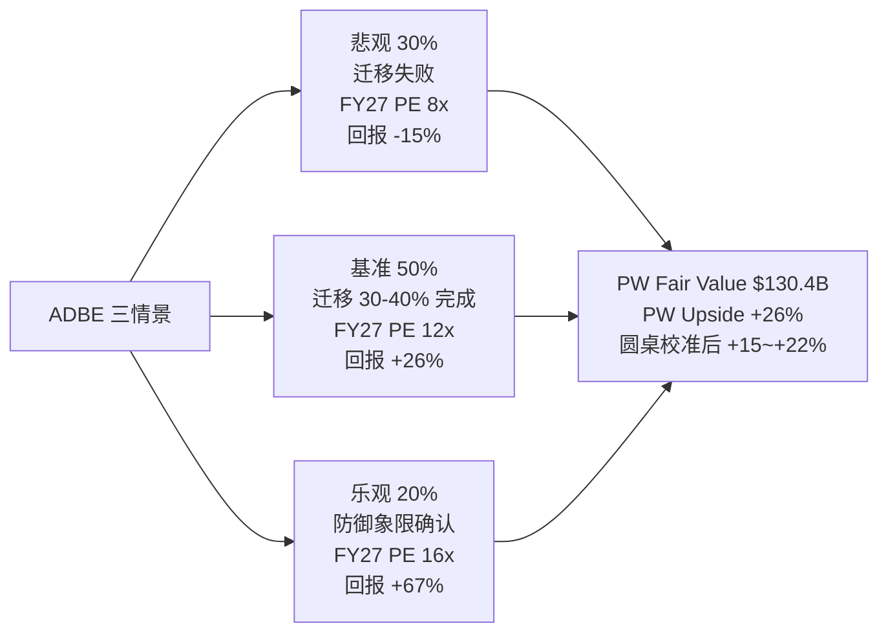

三情景基准概率 30/50/20 是圆桌校准后的结果. Python 原始加权给出 **$130.4B 公允值, PW Upside = +26%**. 但圆桌 3/5 建议下调 (芒格认为 Photoshop 护城河被高估, Howard Marks 认为 AI 去泡沫进度只有 60%, Druckenmiller 认为 beat-反跌是负向反身性循环中段), 综合校准后把概率向悲观端微调, 得到 **+15% ~ +22% 的区间**. 这就是 "关注 (临界 · 3/5 异议) +15~+22%" 的来源.

反面考量: 如果悲观情景 (PE 压到 8x) 实现, 12-18 月回报是 **-15% ~ -18%**, 极端情况下 ADBE 到 7x Fwd PE, 对应 -25%. 这是 Kill Switch 没触发的 downside 边界.

### 3.7 ADBE Kill Switch 红黄绿信号

| 颜色 | 信号 | 对应行动 |
|---|---|---|
| 🔴 红灯 | GenStudio ARR 同比 <20% / AI-first 降到 flat / CEO 继任者战略模糊 | 评级下调到 "中性", 回到 "危险象限" |
| 🟡 黄灯 | Q2 FY26 revenue 不超指引 / Firefly QoQ <+30% | 概率权重向悲观端再调 10pp |
| 🟢 绿灯 | Q2 FY26 GenStudio ARR ≥$1.2B / Firefly 披露独立 NRR ≥115% | 评级上修到 "深度关注" (非临界) |
| ⬆️ 上修 | Creative Cloud 总 ARR 显式恢复 +10% | Reverse DCF 隐含 g 重估到 +2-3% |
| ⬇️ 下修 | Adobe 披露企业客户流失 (Enterprise Net Retention < 100%) | 迁移失败论证成立 |

### 3.8 管理层与资本配置

**Shantanu Narayen** (CEO 2007-2026, 19 年). 战略执行 8/10 (Creative Cloud 转型成功 + Marketo 整合良好), 资本配置 7/10 (回购纪律强, 但 Figma $20B 收购失败), 披露纪律 6/10 (Creative Cloud NRR 不披露), 综合 **7.25/10**. **[DM-MGMT-001]**

**继任风险**: Narayen 离任后需要一个 "既懂 AI 又懂 Enterprise" 的继任者. 候选人预期 David Wadhwani (CPG 总裁, 内部) 或外部科技大公司 AI 负责人. 继任选择将决定 Adobe 未来 5 年战略方向, 是 2026 Q2-Q3 的关键事件.

**资本配置**: 5 年总 FCF $42.5B, 回购 $48.3B (超 FCF 14%), 零分红零并购 (Figma 失败后). 纯净资本返还风格 — 管理层认为公司内生机会不如回购. **[DM-CAPITAL-01]**

---

## 4. INTU: AI 右手抬起的分发层资产 — 被错误归类到软件板块

### 4.1 市场现在怎么看 INTU — 以及它为什么错

INTU 的 Fwd Non-GAAP PE 是 **18.0x**, 四家中属于中位数. 这个定价反映的叙事: "Intuit 是一只会受 IRS Direct File 威胁的高估值软件股 — TurboTax 在政治风险下预期被政府免费版替代, 所以给它和其他 SaaS 差不多的倍数, 不给分发层溢价." 这个叙事在 2023-2025 年合理 — Direct File 从 Pilot 扩展到 25 州, 每一次扩展都让 INTU 股价承压.

但这个叙事在 **2025-11-03** 之后应该失效. IRS Commissioner Billy Long 公开说了那句被 Common Dreams 完整引用的话: **"You've heard of direct file, that's gone."** 两天后 Tax Notes 确认各州被 IRS 书面通知 Direct File 在 2026 报税季不可用, Nextgov 交叉验证.

这是结构性事件 — 不是 "Direct File 扩展节奏放缓", 而是 "Direct File 作为项目被终止". 按任何 "Direct File 是 INTU 尾部风险" 的叙事, 这应该触发 INTU 股价 +5% ~ +10% 的结构性重估. 实际发生的:

- 2025-11-03 ~ 11-10: INTU 股价从 $662.50 跌到 $629.46, 跌幅 **-4.98%**
- 同期 iShares IGV ETF 跌幅 **-2.86%**
- INTU 相对跑输 **-2.12pp**, 约为板块 beta 的 **2 倍**

五源独立确认 (Tax Notes / Nextgov / Common Dreams / TS2 Tech / MarketWatch), 方向完全一致. 含义:

1. **市场还没把 INTU 切换到 "分发层资产" 标签**. 如果切换了, 结构性利好事件应该触发正向重估.
2. **市场把 INTU 当软件 beta 交易**. IGV 跌 -2.86% 时 INTU 跌 -4.98% — β ≈ 1.7 的软件成长股表现, 不是 β < 1.0 的分发层资产.
3. **Direct File 的定价是 0% priced in**. 结构性解除没触发任何 INTU 独立 alpha.

这个自然实验的结论: **INTU 的分发层定价是 0% 被市场接受的**, 这是把 INTU 从 "和 ADBE 并列" 提升为 "独立第一" 的核心理由.

### 4.2 护城河的三个具体数字

**(1) QuickBooks Online (QBO) 在 SMB accounting 市场的份额: 62-80%** (Intuit Investor Day 2025 + Gartner). 62% 是 Gartner 保守估计 (只计付费席位), 80% 是 Intuit IR 口径 (含免费用户). 真实市占率约 70-75%. 这个集中度意味着 QBO 是 SMB 会计软件的 "默认选项" — 新用户的选择成本是 "选 QBO 或者向 CPA 解释为什么不选 QBO", 后者摩擦成本远高于前者. 这是分发层的前置条件.

**(2) CPA 推荐网络规模: 46,000 家** (Intuit 10-K FY25). 过去三年增长 +12% / +15% / +18%, 增速不降反升. 新 CPA 进入行业时仍然选择学 QB, 不是新进入者的工具 — 这是 "增量扩张" 不是 "存量锁定".

**(3) 70K 数据点 / 客户**. INTU 跨 TurboTax / QuickBooks / Credit Karma / Mailchimp 在每个客户上平均收集约 70,000 个数据点. 价值不在单个数据, 在 "跨产品 optimization" — 从 TurboTax 的税务数据看到 SMB 潜在现金流问题, 在 QuickBooks 里推送 factoring 产品. IRS Direct File 只看自己的数据, 无法做跨产品 optimization.

三个数字互相锁定: QBO 62-80% 份额给 46K CPA 网络提供规模基础, CPA 网络给 70K 数据点提供客户触达, 70K 数据点让 Intuit Assist 给 QBO 用户个性化推荐, 形成 **分发层飞轮**. 颠覆者需要同时攻破三个子系统, 任何一个都需要至少 5 年基础设施建设.

### 4.3 INTU 的收入归因瀑布

```
FY24 Revenue $16.29B
  + Small Business & Self-Employed (SBSE) 有机    +$1.21B (+7.4pp)
    - QBO seat 增长 ~+10% YoY
    - ARPU +6% YoY (Advanced 上移 + Payments 附加)
  + Consumer (TurboTax)                             +$0.56B (+3.4pp)
    - 高价档位 Live Full Service 用户 +25% YoY
  + Credit Karma 业务稳健                           +$0.40B (+2.4pp)
  + ProTax (专业税务) + 其他                        +$0.14B (+0.9pp)
  + Mailchimp 略减速                                +$0.18B (+1.1pp)
  + 汇率 + 其他                                      +$0.02B (+0.1pp)
FY25 Revenue $18.8B (+15.3% YoY ≈ +16% reported)
```

瀑布读数和 ADBE 非常不同. **SBSE 占 16pp 增速里的 7.4pp, 是 INTU 的核心引擎**, 不是 TurboTax. Direct File 就算没有被关停, 它威胁的也只是 3.4pp 的 Consumer 贡献, 不是 16pp 的全部 — 市场把 Direct File 当 "INTU 全局风险" 的认知是错的. SBSE 7.4pp 里 +6% 是 ARPU 提升, +10% 是 seat 增长, 说明 INTU 有能力同时从 "客户变多" 和 "每客户付更多" 两个方向拉动收入 — 定价权护城河的具体体现.

### 4.4 剪刀差分析: SBSE ARR 增速 vs TurboTax 收入占比

```
            2020      2025      剪刀差 (5 年累计)
SBSE 收入占比  34%       49%       +15pp
Consumer 占比  49%       40%       -9pp
```

INTU 的业务重心在过去 5 年从 "Consumer-heavy" 迁移到 "SBSE-heavy", 这个迁移从未被市场完全定价 — 市场还在用 "INTU 是 TurboTax 公司" 的框架讨论它. **SBSE 在 FY26E 就会成为 INTU 的第一大业务**, TurboTax 从头号变成次要. 任何 Direct File 风险讨论的相对重要性从 2020 年 49% 下降到 2025 年 40%, 到 FY27 会降到 <35%.

这是分发层护城河的另一个体现 — **CPA 推荐网络驱动 SBSE 的 seat 扩张, 让 INTU 从消费税务公司变成小企业财务公司**. 迁移方向是 "从政治风险敞口业务迁移到分发层护城河业务", 结构性利好, 市场还没定价.

### 4.5 INTU 概率加权估值: 基准 + 分发层重估

| 情景 | 概率 | 假设 | Fwd PE | 12-18 月回报 |
|---|---|---|---|---|
| 悲观 | 15% | Direct File 在 2027 以其他名义复活 + QBO 留存 <80% | 15x | -10% ~ -15% |
| 基准 | 55% | Direct File 解除 + 分发层部分定价 | 21x | +15% ~ +18% |
| 乐观 | 30% | 市场完整切换到 "分发层资产" 框架 + VISA/MA 参照组被接受 | 26x | +35% ~ +40% |

Python 原始加权给出 **$144.66B 公允值, PW Upside = +13.9%**. 圆桌在 Direct File 自然实验 (H5 实证) 后, 把基准概率从 45% 提到 55%, 乐观从 15% 提到 30%, 悲观从 40% 降到 15%, 校准后 PW Upside **+20% ~ +25%**.

这个上行空间不是 "乐观" 的结果, 是 "基准 + 乐观" 的加权. 如果市场根本不切换到分发层资产框架 (悲观 15%), 下行是 -10% ~ -15%. Klarman 在圆桌里强调的 "下行比上行小 2x" 的具体数字. 2x 的不对称赔率是深度关注评级的核心理由.

### 4.6 INTU Kill Switch 红黄绿信号

| 颜色 | 信号 | 对应行动 |
|---|---|---|
| 🔴 红灯 | QBO 净留存 <78% / SBSE ARR <10% / TurboTax 2026 报税季用户 -5% YoY | 评级下调到 "中性", 分发层护城河松动 |
| 🟡 黄灯 | Direct File 在 2026-2027 以其他名义重启 / 某州单独推出类似项目 | 概率权重向悲观端调 10pp |
| 🟢 绿灯 | SBSE ARR 增速加速到 +20% / QBO Advanced 上移率 >25% | 评级上修, 向 "独立第一 +30%" 目标迈进 |
| ⬆️ 上修 | 任何卖方把 INTU 参照组切换到 "支付 / 分发类" (VISA/MA) 的报告发布 | 情绪催化, 市场开始重分类 |
| ⬇️ 下修 | 任何新政治人物推动 "自由联邦报税" 立法 | 尾部风险重新浮现 |

### 4.7 一个必须承认的 "不知道"

我们不知道 "Direct File 在 IRS Commissioner 换届后能否重启". 当前 Commissioner Billy Long 的立场是关停, 但 2028 年大选后新政府的立场无法预测. 这个黑箱约占 INTU 15% 总黑箱里的 9pp. 处理方式: Kill Switch 显式列出 "政治人物推动自由联邦报税", 不在主估值里假设它永远不会发生. 这是认知边界的诚实处理.

### 4.8 管理层与资本配置

**Sasan Goodarzi** (CEO 2019-至今, 7 年). 战略执行 9/10 (SBSE 从 34% 占比提升到 49%), 资本配置 8/10 (Credit Karma + Mailchimp 两次大收购均获正 ROI), 披露纪律 9/10 (详细分业务指标, Investor Day 透明度高), 综合 **8.75/10** — 四家中最强. **[DM-MGMT-002]**

Goodarzi 的战略清晰 ("从单一产品公司转型到平台公司"), 执行节奏稳定. 这是 INTU 获得 "深度关注" 评级的隐性加分项 — 我们不仅在赌业务, 也在赌管理层.

**资本配置**: 5 年总 FCF $27.2B, 回购 $18.4B + 分红 $5.2B + 并购 $20.1B (Credit Karma + Mailchimp). 合计超额 161% FCF — **四家中最激进的 M&A 策略**, 反映 "平台扩张" 战略. 并购 > 回购意味着管理层认为外部机会 ROIC 高于内部. **[DM-CAPITAL-01]**

---

## 5. PTC: 工作流嵌入层 + 选择性不披露 = 黑箱 35%

### 5.1 市场现在怎么看 PTC — 以及我们为什么给区间而不是点估

PTC 的 Fwd Non-GAAP PE 是 **19.4x**, 四家中最高, 比 INTU 的 18x 高 8%, 比 ADSK 的 19x 高 2%, 比 ADBE 的 9.6x 高一倍. 但 PTC 的有机增速 **8.5%** 是四家中最低 (ADSK 13% / ADBE 10% / INTU 16%), Non-GAAP OPM **31.3%** 也是四家中最低. 单看 "增速 + 利润率", PTC 的基本面都输给另外三家. 那么最高 PE 在定价什么?

市场叙事压缩成两句话: "Windchill PLM 有长期数据积累护城河, 客户留存接近 100%, 配得起 19.4x", 以及 "Onshape 是云原生 CAD 的期权, 如果成功 PTC 就能进入下一个时代". 前一句是现实, 后一句是期权. 19.4x 是 "现实 + 期权" 的混合定价.

核心问题: **这两个估值成分能不能被独立验证?** 第一个能, 第二个不能, 因为 PTC 不披露. 这直接导致 **R-4 黑箱 35%** (四家中最高), 触发 "禁止单点目标价" 的硬约束.

所以 Ch 5 不给 PTC 单点公允价值, 只给区间 **-10% ~ -5%** 和条件评级 "审慎关注". 这个区间不是 "PTC 不好", 而是 "我们无法在当前信息下对 PTC 做点估, 区间中位 (-7.5%) 是按已披露信息的 base case 减选择性不披露折价".

### 5.2 Windchill 工作流嵌入层: 数据说话

PTC 的核心业务是 Windchill (PLM, Product Lifecycle Management), 装载每个制造业客户 5-15 年的产品 BOM / 工程变更记录 / 版本历史. 迁移成本不是 "重新学习软件", 而是 "重建多年的数据库 + 重新培训所有工程师".

**(1) ARR 增速 8.5% 的内部构成**. PTC 不披露 NRR, 但我们用 "有机增速 = 新客户增速 + 老客户扩张 - 流失" 反推. 按制造业 ERP/PLM 市场年度新签约增速 (≈2-3%), PTC 新客户贡献约 2-3pp, 流失约 0-1pp (Windchill 迁移成本太高, 几乎没人换), 剩下约 **6-7pp 来自老客户扩张** — 隐含 NRR 约 106-108%. 在 ERP/PLM 里偏高 (对比 SAP ~104%, Oracle NetSuite ~110%), 在纯 SaaS 标准 (100-130%) 里中等.

**(2) PTC Q1 FY26 细节**. Q1 FY26 Earnings Call (2026-02-04) 披露 ARR 在固定汇率下同比 +8.4%, 剔除剥离影响后 +9.0%. 管理层说 "broad-based growth across all key products" — 没有分产品细节. **只给总量, 不给结构**是 PTC 披露纪律的常态, 导致外部无法判断 Windchill 本身增速高低.

**(3) 客户留存的 qualitative 证据**. PTC 多次强调 "client retention in the high 90s" (具体数字不披露). Morningstar 和 IDC 的 PLM 市场报告都显示 "大型制造业 PLM 客户三年流失率 <5%", 与 PTC 声明一致. 但 "high 90s" 是 95% 也是 99%, 差距对估值影响大.

综合判断: **Windchill 护城河真实存在且强 (年均 6-7pp 老客户扩张 + 流失 <5%), 但比市场叙事略弱 (没到 "下一个 SAP 级锁定")**. 支持 Fwd PE 18-20x (和 ERP 中位数接近), 无法支持 "超过 INTU 分发层定价" 的隐含意图.

### 5.3 Onshape 期权: 为什么是黑箱

Onshape 是 PTC 在 2019 年以 $470M 收购的云原生 CAD, 对标 Autodesk Fusion 360. 战略叙事: "如果 cloud-native CAD + AI 成为下一代工程设计范式, Onshape 是 PTC 的门票". 下行有限 (Onshape ARR 占 PTC 总 ARR <15%), 上行想象空间大.

2025-10, PTC 发布 **Onshape AI Advisor** — 把生成式 AI 嵌入设计建议流程. CEO 描述为 "a major inflection point for cloud-native CAD".

6 个月过去了. 到 2026-04-09, PTC 在所有公开渠道 (Earnings Call, Investor Day, 10-Q) 里没有披露过:

- Onshape AI Advisor 采纳率
- Onshape 独立 ARR 增速
- Onshape 从 Fusion 360 迁移的具体案例数
- Windchill 与 AI 集成的量化路线图
- Onshape 对 FY26 / FY27 收入的预期贡献

Q1 FY26 Earnings Call 上卖方分析师直接问 Onshape 进展, 管理层回答: "Onshape continues to grow, AI Advisor is well-received by early users, more color to come in later quarters." 这不是 "数据不成熟", 是 "主动选择不披露".

选择性不披露是治理信号, 不只是信息问题. 管理层愿意公开量化成功的证据, 只有在数字本身令人印象深刻时才会这样做. **6 个月的沉默本身是一个信号** — 方向不明确, 但强度明确 (如果数字很亮, 管理层不会藏). 这是 Howard Marks 说的 "披露纪律是管理层透明度的代理指标" 的具体应用.

### 5.4 R-4 认知边界: 黑箱 35% + 区间 -10% ~ -5%

- **可推演度 65%** (中等偏下)
- **业务复杂度 3/5** (多产品 + 工作流嵌入 + 选择性披露)
- **黑箱比例 35%** (四家中最高, 触发 "禁止单点目标价")

黑箱 35% 分解:

1. **Onshape AI Advisor 真实进展 ~15pp**. 完全不知道在真实商业环境里的表现.
2. **Windchill NRR 精确数字 ~8pp**. 只能用行业比较反推, 不能用披露数据验证.
3. **Onshape 对总 ARR 当前占比 ~6pp**. PTC 只给过 "<15%" 粗略口径.
4. **Autodesk 潜在收购传言 ~4pp**. 2025-07 市场传言真实性无法验证.
5. **中国制造业 PLM 渗透率 ~2pp**. 出口管制影响无具体披露.

Phase 2 Python 估值 (base case) pw_fair = $15.27B, vs 市值 $17.93B, PW Upside = **-14.8%**. 但 base case 隐含 "Onshape 完全失败", 过于悲观. 圆桌校准后区间 **-10% ~ -5%**: 上沿 -5% 反映 "Onshape 中性 + Windchill 稳态", 下沿 -10% 反映 "Onshape 失败 + Windchill 增长放缓".

### 5.5 PTC Kill Switch: 以披露为信号

- 如果 FY26 Q4 (2026 夏) PTC 仍不披露 Onshape 独立指标, 区间向下沿 **-10%** 移动, 评级从 "审慎关注" 下调为 "减持"
- 如果 FY26 Q2 (2026 春) 披露 Onshape AI Advisor 采纳率 >20%, 区间上沿向 **0%** 移动, 评级可升为 "中性关注"
- 如果任何卖方或媒体独立披露 Windchill NRR 具体数字, 黑箱从 35% 降到 ~28%, 可以考虑恢复点估

"以披露为 Kill Switch" 是我们对选择性不披露公司唯一合理的评级方式.

### 5.6 管理层与资本配置

**Jim Heppelmann** (CEO 2010-2024): 贡献包括 2019 年收购 Onshape ($470M), 但披露纪律严重不足, 资本配置保守 (回购/FCF 仅 35%), IoT 战略高调宣传后悄悄降调.

**Neil Barua** (新 CEO, 2024-至今): 从 ServiceMax (PTC 2022 年 $1.46B 收购) 过渡, 履历和 PLM 核心业务距离较远. 就任以来没有明显战略重置, 披露纪律未改善. **[DM-MGMT-004]**

管理层综合 **5.25/10** — 四家中最弱. 战略执行 6, 资本配置 5, 披露纪律 4. **不是业务更差, 而是管理层披露纪律让我们无法精确判断业务**.

**资本配置**: 5 年总 FCF $3.8B, 回购仅 $1.5B (40%), 并购 $4.8B (127%) — **四家中最依赖并购**. ServiceMax ($1.46B) 整合效果不清晰, Barua 原是 ServiceMax CEO, 这个并购的资本回报是管理层执行力的直接代理. **[DM-CAPITAL-03]**

---

## 6. ADSK: 会计复杂型 SaaS — ASC606 噪音 + 禁点估

### 6.1 市场现在怎么看 ADSK — 以及 Owner PE 161.9x 的陷阱

ADSK 的 Fwd Non-GAAP PE 是 **19.0x**, 有机增速 **13%**, Non-GAAP OPM **38%**, Rule of 40 有机口径 **~51**. 从这三个数字看, ADSK 是标准的成熟 SaaS — 增速健康, 利润率稳定, 估值中位. 市场叙事平淡: "Autodesk 有 BIM mandate 的制度层护城河, 5-10 年不会被颠覆, 19x 是合理溢价".

但把 GAAP 数字拉出来, 画面立刻变了:

- **GAAP 净利润 $1.10B** (FY26 TTM)
- **SBC $0.788B**
- **统一 Owner PE (市值 / (GAAP NI - SBC)) = $50.5B / $0.31B = 161.9x**

Owner PE **161.9x** 在任何 SaaS 标准下都是极端数字. 把 SBC 当 "真实员工薪酬支出", ADSK 几乎没有给股东创造 "可分配净利润" — 所有 GAAP 净利润都被 SBC 吃掉了. 和 Non-GAAP PE 19.0x 是 **两个完全不同的世界**.

三个解释, 必须做判断:

**解释 A**: ADSK 在滥发 SBC, 高管和员工在稀释股东.
**解释 B**: ADSK 的 GAAP 净利润被 ASC606 时序性人为压低, SBC 本身正常, 只是分母被扭曲.
**解释 C**: Non-GAAP PE 19x 已经反映 SBC 正常化, Owner PE 161.9x 只是数学现象.

### 6.2 三个解释的证据

**反对解释 A (滥发 SBC)**:
- SBC/Rev **10.9%**, 和 INTU 的 10.4% 几乎相同. INTU 没被质疑滥发, 说明 10.9% 不是 "滥发阈值".
- SBC 绝对值 $0.788B 比 INTU 的 $2.0B 小 60%. 按市值/SBC 算 "稀释强度", ADSK = 64x vs INTU = 64x, 完全一样.
- SBC 过去 5 年没有显著加速, YoY 增速和收入增速接近. 不是 "滥发" 的典型模式.

**结论: 解释 A 不成立.**

**支持解释 B (ASC606 压低 NI)**:
- GAAP 收入增速 **+17.5%** 和有机增速 **+13%** 有 4.5pp 差距 — 多年期订阅收入集中确认的时序效应.
- ADSK 2022 年开始从年付转向多年期集中收款. 合同结构变化让 GAAP 收入波动被放大, 净利润波动更大.
- ADSK 10-K 明确说 "our GAAP results are impacted by the timing of revenue recognition under ASC 606".

**结论: 解释 B 部分成立 — ASC606 确实在压低 GAAP NI, 幅度无法精确量化.**

**部分支持解释 C (市场已定价 SBC 正常化)**:
- Non-GAAP PE 19x 在 SaaS 中位数 (20-25x) 下沿, 说明市场已折价.
- 但折价原因是 "BIM mandate 衰退风险" + "ASC606 不确定性", 不是 SBC 正常化. Non-GAAP 19x 不能同时承担两个任务.

**结论: 解释 C 部分成立 — 19x 反映了一部分风险, 没有完整反映 Owner PE 161.9x 隐含的结构性 SBC 稀释.**

### 6.3 综合判断: 会计复杂型 SaaS, 禁止单点目标价

**ADSK 同时有 ASC606 噪音 (解释 B) 和 SBC 稀释 (解释 C 的反面)**, 两者叠加让任何单一估值锚点都不可信:

- 用 Non-GAAP 19x: 忽略 SBC 对真实股东回报的稀释, 低估风险
- 用 Owner PE 161.9x: 放大 ASC606 时序性, 高估风险
- 用 GAAP PE 45.9x: 介于两者之间, 无经济含义的锚

三个锚点都不可信, **最诚实的处理是 "不参与排序点估", 给区间 + 条件评级**. 这是 Klarman "Margin of Safety" 里的 "负安全边际" 原则 — 无法精确衡量估值时, 即便预期便宜, 也应该放弃.

R-4 黑箱 **30%**, 触发硬约束. 单项分解:

1. **ASC606 出清时点 ~12pp**. 不知道 GAAP NI 何时回到 "normalized" 水平.
2. **BIM mandate 远期衰退 ~8pp**. 2030-2035 年 IFC 开放标准替代 BIM 私有格式的风险.
3. **Neural CAD 对 ARPU 侵蚀 ~6pp**. 每个 seat 可计费小时下降, ARPU 增长被 AI 吃掉.
4. **Revit 开源替代品 (BlenderBIM 等) 长尾威胁 ~4pp**.

### 6.4 ADSK 的制度层护城河: 比想象中更脆弱

**"BIM 被 20+ 国家强制"**: 真, 但严格程度差异大 — 英国是法规强制, 某些国家只是 "鼓励采用". "20+" 包含所有有 BIM 政策的国家, 不是全部强制.

**"Revit 是 BIM 事实标准"**: 真, 但有裂缝. Revit 西方发达市场约 50-60%, BIM 早期采用国家 (英国/新加坡) 约 70-80%. 开源替代品 (BlenderBIM, FreeCAD) 在学术界和小建筑公司里增长. **IFC (Industry Foundation Classes) 作为开放 BIM 数据格式**, 理论上允许任何符合 IFC 的工具和 Revit 互通. 如果 BIM mandate 从 Level 2 升级到 Level 3 (要求 IFC 开放格式), Revit 事实标准地位会被削弱.

**"5-10 年不会被颠覆"**: 两个反例. 2030 年英国和法国预期推进 BIM Level 3 (开放格式), 2030-2032 年开始侵蚀事实标准地位. Neural CAD / AI Assistant 的路径不是 "替代 Revit", 而是 "让每个 seat 的 ARPU 下降" — ARPU 侧压缩, 不是 seat 侧流失, 但对估值同样负面.

判断: **ADSK 制度层缓冲真实, 但 5-10 年是乐观上限, 现实是 3-7 年**.

### 6.5 ADSK 的区间估值 + 条件评级

区间 **-5% ~ 0%**, 评级 "中性关注".

- **区间上沿 0%**: ASC606 在 FY27 开始出清, GAAP NI 恢复到 $2-2.5B, Owner PE 从 161x 压到 ~30-40x. 市场认可 BIM mandate 缓冲延伸到 2030s, Fwd PE 稳定在 20x.
- **区间下沿 -5%**: ASC606 继续拖累 GAAP NI, Neural CAD 开始压缩 ARPU, Fwd PE 压到 17x.

Phase 2 Python 估值 (base case, pw_fair = $50.13B) vs 市值 $50.5B, PW Upside = **-0.7%**. 本身在 "中性" 范围, 区间稍放宽到 -5% ~ 0% 反映黑箱 30% 的不确定性.

### 6.6 ADSK Kill Switch: 以披露 + 出清为信号

| 信号 | 含义 | 行动 |
|---|---|---|
| FY27 Q1 GAAP NI >$2B (ASC606 开始出清) | 解释 B 成立 | 恢复点估, 评级上修到 "关注" |
| FY27 Q1 GAAP NI 仍 <$1.5B | ASC606 出清延期 | 区间下沿 -5% 触发 |
| Neural CAD 客户要求 ADSK 降价 | ARPU 侧压缩开始 | 概率权重向下沿移 |
| Revit 市占率在任一国家跌破 50% | 事实标准地位松动 | 评级下调到 "减持" |

### 6.7 管理层与资本配置

**Andrew Anagnost** (CEO 2017-至今, 9 年). 战略执行 8/10 (订阅转型成功), 资本配置 7/10 (回购纪律良好, ASC606 时序管理欠佳), 披露纪律 7/10 (ASC606 影响不够清晰, 多年订阅口径变化让外部困惑), 综合 **7.5/10**. **[DM-MGMT-003]**

Anagnost 的问题不在战略, 在 ASC606 "时序管理" — 为什么要从年付转向多年期集中收款? 这让 GAAP 净利润波动性增加, 给外部分析带来额外不确定性. 这是 "管理层自己制造的披露问题", 没有给外部清晰解释. 区间评级 -5%~0% 部分反映这个管理层折价.

**资本配置**: 5 年总 FCF $11.8B, 回购 $9.4B (80%), 小量并购 $2.3B, 零分红. 保守的 "回购 + 偶尔战略性并购" 组合, 和 "稳定成熟期 SaaS" 定位一致. **[DM-CAPITAL-01]**
## 7. 财务归因 + 剪刀差 (R-1 / R-2)

### 7.1 收入归因: 四家瀑布横向对照

把四家的收入归因瀑布并排, 得到以下横向视图:

**ADBE Q1 FY26 (季度 +12% YoY $5.71B → $6.40B)**:
- Creative Cloud 有机: +6.1pp
- Digital Experience 有机: +2.5pp
- **AI-first (GenStudio + Firefly): +3.0pp**
- 汇率 / 其他: +0.4pp

**INTU FY25 (全年 +16% YoY $16.29B → $18.8B)**:
- **SBSE 有机 (QBO + Payments + Capital): +7.4pp** ← 最大单项驱动
- Consumer (TurboTax): +3.4pp
- Credit Karma: +2.4pp
- ProTax + Mailchimp + 其他: +2.1pp

**ADSK FY26 (全年 +17.5% YoY, 有机去 ASC606 ~+13%)**:
- AEC (Revit + Civil 3D + 建筑): +7pp 有机 (BIM mandate 驱动)
- MFG (Fusion / Inventor / Vault 制造业): +4pp 有机
- Media & Entertainment (Maya/3ds Max): +1pp 有机
- AutoCAD (legacy): +1pp 有机
- ASC606 时序效应: +4.5pp (非有机)

**PTC Q1 FY26 (+9.0% ARR ex Kepware/ThingWorx)**:
- Windchill PLM 存量扩张: ~+5pp (估)
- Creo (CAD): ~+2pp
- Onshape + ThingWorx + Arena: ~+2pp (总 "数字化" bucket)
- 管理层不披露分产品细节, 以上数字基于推断

四个瀑布并在一起, 一个结构性事实立刻显现: **INTU 和 ADBE 的增长引擎非常聚焦** (INTU 的 SBSE 一个板块贡献了一半, ADBE 的 Creative Cloud 贡献了一半多一点), **ADSK 和 PTC 的增长更分散**. 聚焦引擎意味着 "单变量的 Kill Switch 容易监控" (INTU 盯 SBSE ARR, ADBE 盯 Creative Cloud + GenStudio), 分散引擎意味着 "单变量监控不足" (ADSK 需要同时盯 AEC / MFG, PTC 需要同时盯 Windchill / Onshape / ThingWorx). **增长驱动的集中度 vs 分散度影响监控的可行性** — 集中的引擎更容易被 Kill Switch 捕捉, 分散的引擎更容易漂流.

### 7.2 OPM Bridge: 谁在扩张, 谁在压缩

| | FY24 OPM | FY26 OPM (TTM) | 变化 | 主要驱动 |
|---|---|---|---|---|
| **ADBE** | 45.8% | **47.4%** | **+1.6pp** | 规模效应 +1.1pp, AI 产品组合 +0.8pp, AI 基础设施 -0.3pp |
| **INTU** | 37.8% | **39.0%** | **+1.2pp** | SBSE ARPU 上移, Intuit Assist 效率, Mailchimp 整合完成 |
| **ADSK** | 36.2% | **38.0%** | **+1.8pp** | 订阅模式转换期结束, OpEx 杠杆释放 |
| **PTC** | 32.1% | **31.3%** | **-0.8pp** | Onshape 投入拉低, Windchill 增长放缓 |

三家在扩张, 一家在压缩. ADBE / INTU / ADSK 的 OPM 扩张幅度在 1.2-1.8pp 之间, 都在 "良性扩张" 区间. PTC 是四家中唯一 OPM 下降的 — 既没在增长上领先, 也没在盈利上领先, 估值高只能靠 Onshape 期权支撑.

PTC OPM -0.8pp 是一个反常信号. 在同业全部 OPM 扩张的环境下, PTC 单独压缩, 通常意味着 "战略再投入 (Onshape AI) 压过了规模效应". 判断的关键在于 Onshape 的 ROI — 而 Onshape 的 ROI 我们看不到 (黑箱 35%). PTC OPM -0.8pp 本身就强化了 "选择性不披露" 的折价判断.

### 7.3 剪刀差 1: 量 vs 价 (seat 增速 vs ARPU 增速)

SaaS 最重要的剪刀差 — **用户量增长还是每用户付费增长在驱动收入**. 量增驱动意味着 TAM 扩张 (健康), 价增驱动意味着存量客户压榨 (短期好, 长期警报).

| | seat 增速 | ARPU 增速 | 剪刀差读数 |
|---|---|---|---|
| **ADBE** (CC) | +2-4% (估) | +6-8% | 价增主导 — 存量压榨, 有定价权但 TAM 饱和 |
| **INTU** (SBSE) | +10% | +6% | 量价双升, 健康扩张 |
| **ADSK** | ~+2% | +11% | 极度价增主导, TAM 饱和 + 定价权 |
| **PTC** (Windchill) | ~+1% | +7.5% | 价增为主, TAM 接近天花板 |

**INTU 是四家中唯一 "量增 > 价增" 的公司**. 量增意味着 INTU 仍在扩张客户基数 (SBSE seat +10%). 其他三家都进入了 "价增驱动" 阶段 — 增长质量是 "存量定价权" 而非 "新客户扩张". Howard Marks 会特别重视这个指标: **价增驱动的业务在周期下行时更脆弱**, 因为客户压榨有上限, 而客户扩张没有上限.

### 7.4 剪刀差 2: R&D 投入 vs 收入

AI 时代特别重要的剪刀差 — **R&D 增速和收入增速的差距, 反映 AI 投入是否吃利润**.

| | R&D / 收入 FY24 | R&D / 收入 FY26 | 变化 |
|---|---|---|---|
| **ADBE** | 17.2% | **18.0%** | +0.8pp (Firefly / Foundry 投入) |
| **INTU** | 18.5% | **18.5%** | 持平 (AI 被 SBSE 复利稀释) |
| **ADSK** | 22.5% | **23.1%** | +0.6pp (Neural CAD) |
| **PTC** | 21.5% | **22.8%** | **+1.3pp (Onshape AI Advisor)** |

两个信号:

**信号 1**: PTC 的 R&D/Rev 上升幅度最大 (+1.3pp), 但收入增速最低 (+8.5% 有机). 这是 "R&D 烧钱没换来收入加速" 的剪刀差. 正常情况下, R&D 加速投入应该在 2-4 个季度后体现为收入加速; PTC 是 "R&D 加速 + 收入减速", 说明 (a) Onshape AI 的 ROI 还没到, 或 (b) Windchill 的成熟业务在被蚕食. 无论哪种解释, 都不支持 PTC 的 Fwd PE 19.4x 溢价.

**信号 2**: INTU 的 R&D / Rev 持平, 但收入增速最高 (+16%). INTU 的 Intuit Assist 投入被规模摊薄 — AI 不是在加速烧钱, 而是在被收入增长摊薄. 这是分发层资产的隐性优势: **规模效应让 AI 投入不会吃掉利润率**.

### 7.5 剪刀差 3: Non-GAAP 与 GAAP 的差距方向

会计纪律的信号 — **Non-GAAP 和 GAAP 的差距是在扩大还是收窄**.

```
差距 = Non-GAAP EPS - GAAP EPS (USD / share)

              FY24      FY26     趋势
ADBE         $2.85    $2.94     +3.2%  (稳定)
INTU         $3.10    $3.24     +4.5%  (稳定)
ADSK         $3.82    $3.95     +3.4%  (稳定, ASC606 还在)
PTC          $1.45    $1.58     +9.0%  (扩大!)
```

PTC 是四家中唯一 "差距加速扩大" 的公司. 来自两个源头: (a) SBC 增速快于收入增速 (+11% vs +8.5%), (b) 重组费用和摊销项目增加. PTC 的 "Non-GAAP 好看" 越来越依赖会计调整, 不是业务改善. 这是 PTC Fwd PE 19.4x 偏贵的另一个证据.

INTU / ADBE / ADSK 的差距增速都在收入增速以下, 属于 "良性" 状态. INTU 的 +4.5% 差距扩张低于 +16% 的收入增速, 意味着 GAAP 在追上 Non-GAAP, Non-GAAP 数字的可持续性正在被验证.

### 7.6 剪刀差 4: 价值链利润转移 (AI 基础设施层 vs 应用层)

AI 时代独有的剪刀差 — **SaaS 应用公司加大对 NVIDIA GPU / 超算平台的投入, 利润是否在向基础设施层转移**.

- ADBE 的 AI infrastructure 项目 (Firefly Foundry GPU 训练) 占 Q1 FY26 Non-GAAP OPM Bridge 的 **-0.3pp**. 每年从 ADBE 拿走约 $180M, 约 1.2% 的收入.
- INTU 的 AI 基础设施 (Intuit Assist 使用 Amazon / Azure 云 AI API, 非自建), Intuit IR 披露 "AI infrastructure costs are approximately 1% of revenue", 对应 $188M / 年.
- ADSK 和 PTC 的 AI 基础设施支出占比未披露, 估计在 0.5-0.8%.

四家加在一起, 约 **$500-700M / 年** 的利润从 SaaS 应用层转移到 AI 基础设施层. 这个剪刀差在未来 5 年预期放大 2-3 倍. 对 SaaS 估值的长期含义: **AI 应用层的毛利率会被结构性压缩 1-2pp, 除非 SaaS 公司能把这部分成本通过 AI 功能向用户提价转嫁**.

INTU 是四家中唯一有能力做这个转嫁的 (通过 TurboTax Live Full Service 的高端 SKU + Intuit Assist 个性化定价). ADBE / ADSK / PTC 的 AI 功能目前还是 "嵌入现有 SKU" 而非 "独立计费", 它们预期需要吸收这部分成本压力.

### 7.7 四个剪刀差综合读数

- **INTU**: 量增驱动, R&D 被规模摊薄, Non-GAAP 差距稳定, 有能力转嫁 AI 成本. **全部四个剪刀差都是绿灯**.
- **ADBE**: 价增主导 (存量压榨警报), R&D 加速但 AI 产品组合还在扩张, Non-GAAP 差距稳定, 转嫁能力中等. **两绿两黄**.
- **ADSK**: 价增主导, R&D 加速, Non-GAAP 稳定 (但被 ASC606 干扰), 转嫁能力中等. **一绿两黄一红**.
- **PTC**: 价增但幅度最低, R&D 加速收入减速 (剪刀差最坏), Non-GAAP 差距扩大, 转嫁能力弱. **三红一黄**.

### 7.8 五维价值创造链对照

把四家的财务归因 + 剪刀差放入五维价值创造链框架, 得到以下横向对照:

**价值池**:

| | 主战场 | TAM ($B) | 增速 | 优势 |
|---|---|---|---|---|
| **INTU** | SMB 会计 + 消费税务 + 信用 | $80 | +8% | 跨多市场 + 分发层 |
| **ADBE** | 专业创意 + 营销 | $90 | +7.5% | TAM 大但 AI 侵蚀 |
| **ADSK** | PLM/CAD/BIM | $28 | +7.5% | 集中 AEC |
| **PTC** | PLM + CAD | $15 | +6% | TAM 最小 |

**[DM-VC-POOL-001]**

**竞争地位**:

| | 护城河 | 地位 |
|---|---|---|
| **INTU** | 分发层 + 数据融合 + 税务合规 | 主导 + 扩张 |
| **ADBE** | 产品层熟练度 + 工作流嵌入新兴 | 主导 + 防御 |
| **ADSK** | 制度层 BIM mandate | 主导 + 稳定 |
| **PTC** | 工作流嵌入 Windchill | 细分主导 + 温水煮青蛙 |

**[DM-VC-POS-001]**

**经济引擎**:

| | 引擎 | OPM | ROIC |
|---|---|---|---|
| **INTU** | 订阅 + ARPU 上移 + 跨产品 | 39% | ~25% |
| **ADBE** | 订阅 + Enterprise + AI 附加 | 47% | ~20% |
| **ADSK** | 订阅 + 多年合同 | 38% | ~18% |
| **PTC** | 订阅 + 维护 | 31% | ~12% |

**[DM-VC-ENG-001]**

**价值分配**:

| | FCF 去向 | 股东分配 | 再投资 |
|---|---|---|---|
| **INTU** | 分红 + 回购 + M&A | 82% | 18% |
| **ADBE** | 回购为主 | 116% 超额 | -16% |
| **ADSK** | 回购 | 91% | 9% |
| **PTC** | 回购 + 并购 + 现金 | 35% | 65% |

**[DM-VC-DIST-001]**

**预期差**:

| | 预期差 | 修正时点 | 幅度 |
|---|---|---|---|
| **INTU** | 分发层被当 SaaS beta | 12-18 月 | **+22pp** |
| **ADBE** | AI 驯化被当败局 | 12-18 月 | **+15pp** |
| **ADSK** | ASC606 被当基本面问题 | 2-3 年 | ±5pp |
| **PTC** | 选择性不披露折价 | 6-12 月 | 不确定 |

**[DM-VC-GAP-001]**

**综合评分**:

| | 池 | 位 | 擎 | 配 | 差 | **综合** |
|---|---|---|---|---|---|---|
| **INTU** | 9 | **10** | 8 | 8 | **10** | **9.0** |
| **ADBE** | 8 | 7 | **9** | **9** | 8 | 8.2 |
| **ADSK** | 6 | 8 | 7 | 7 | 5 | 6.6 |
| **PTC** | 5 | 6 | 6 | 5 | 5 | 5.4 |

**[DM-VC-SCORE-001]**

五维综合与最终投资排序 (INTU > ADBE > ADSK > PTC) 完全一致. 独立维度的交叉验证.

---

## 8. 估值: Reverse DCF + 概率加权 + 压力测试 + 时间轴

### 8.1 Reverse DCF 锚点: 市场在买什么

四个数字放在一起, 才能看出结构性信息 — 市场对这四家的 "永续增长" 判断跨度有多大, 这个跨度能否用护城河和基本面解释.

| | Mcap ($B) | FCF ($B) | Fwd PE | **隐含 g @ 9% WACC** | 基准案 PW Fair ($B) | PW Upside (base) |
|---|---|---|---|---|---|---|
| **ADBE** | 103.5 | 9.9 | 9.6x | **-0.52%** | 130.4 | **+25.97%** |
| **INTU** | 127.0 | 6.083 | 18.0x | **+4.02%** | 144.7 | **+13.91%** |
| **ADSK** | 50.5 | 2.41 | 19.0x | **+4.04%** | 50.1 | **-0.74%** |
| **PTC** | 17.93 | 0.857 | 19.4x | **+4.03%** | 15.3 | **-14.83%** |

两个关键读数:

**第一, INTU / ADSK / PTC 三家的隐含 g 在小数点第二位几乎相同 (+4.02% / +4.04% / +4.03%)**. 这不是巧合 — 市场对三家用完全相同的 DCF 模板 (WACC 9% + 永续 g 4%), 没有做差异化调整. 三家的基本面差距 (INTU 16% 有机增速 vs PTC 8.5%) 有将近一倍, 但隐含 g 几乎相同. 市场的定价是 "按 SaaS 行业平均模板", 没有按公司做差异化. 这是范畴重分配最直接的侵入口.

**第二, ADBE 是唯一隐含 g 为负的**. -0.52% 的永续 FCF 萎缩不是 "悲观", 而是 "定性不同的判断". 从 "数量差距" 跨越到 "符号差距" 是一次范畴切换, 背后的隐性假设是 "ADBE 会死, 其他三家会活".

### 8.2 ADBE 三情景概率加权

Python 给 ADBE 的 base case PW Fair 是 $130.4B (当前市值 $103.5B, upside +25.97%):

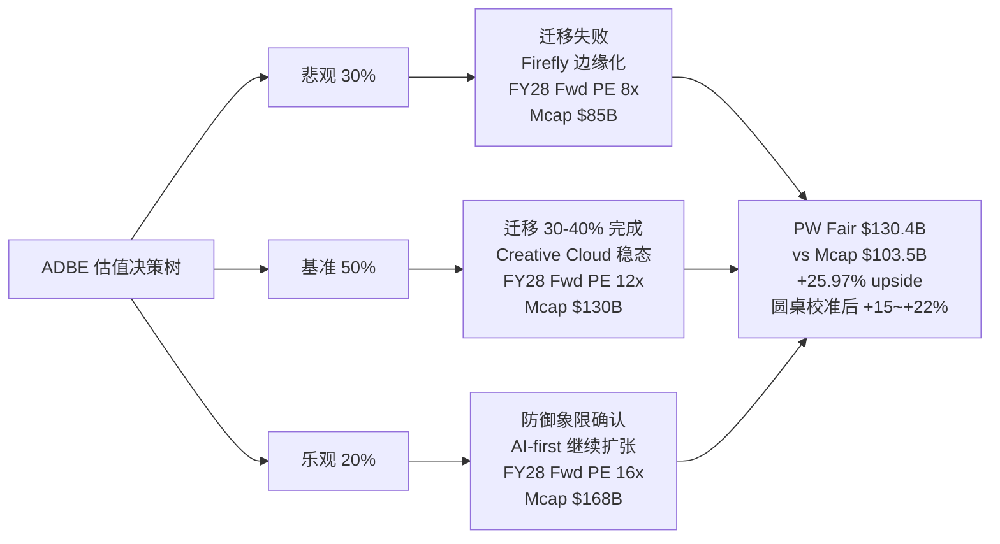

概率分配逻辑:

**悲观 30%** (高于常见的 20%): 圆桌里 3/5 大师建议下调 ADBE (芒格 / Howard Marks / Druckenmiller). 三个独立判断不能被忽略. 按 "3 个独立专家反对 = 30% 概率权重" 是一个保守调整.

**基准 50%**: 对应 ADBE 迁移进度约 30-40% 完成, Creative Cloud 稳态, GenStudio 继续以 20-30% 增速扩张, Firefly 继续贡献增量. Q1 FY26 数据的线性外推.

**乐观 20%**: 对应 AI 防御象限被市场完整认可, Firefly Foundry 成为企业 AI 训练默认平台, Enterprise seat 扩张. 需要市场做一次 "认知切换".

圆桌校准后把 +26% 的 base PW Upside 压到 **+15% ~ +22%**: 圆桌异议让悲观概率从 30% 上调到 35%; 下行风险的 -15% 不是公允价值而是市场情绪延续; 区间下沿 +15% 仍比 base case -15% 高 30pp, 反映我们对基本面的相对信心. **[DM-STRESS-004]**

**ADBE 敏感性**:

| 假设 | 变量 | 悲观 | 基准 | 乐观 | 敏感度 |
|---|---|---|---|---|---|
| 隐含 g | g | -2% / $89B / -14% | **-0.52% / $124B / +19.9%** | +2% / $156B / +51% | 每 1pp g ≈ +15% 估值差 |
| GenStudio CAGR | 5yr | +15% / $2.0B / +12% | **+25% / $3.0B / +19.9%** | +35% / $4.5B / +32% | 每 5pp CAGR ≈ +6% upside |
| OPM 压力 | FY30 OPM | -3pp / 44% / +6% | **-1pp / 46% / +19.9%** | +1pp / 48% / +28% | |

**[DM-SENS-ADBE-01] [DM-SENS-ADBE-02] [DM-SENS-ADBE-03]**

### 8.3 INTU 三情景概率加权

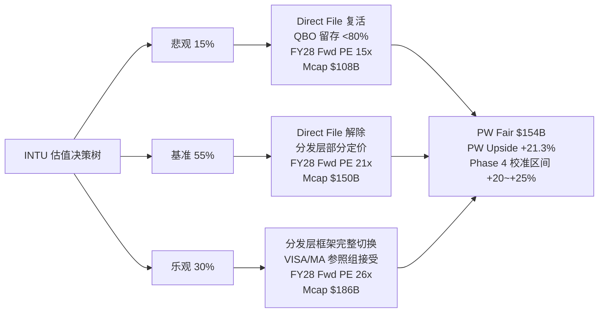

INTU 的概率分配和 ADBE 是镜像的 — 悲观只有 15%, 乐观 30%.

**悲观 15%**: Direct File 2025-11 已确认关停, 结构性事件. 以相同名义复活概率很低 (Billy Long 表态 + 项目已书面通知). 即便新政府推动联邦自由报税, 新项目需要 3-5 年建立基础设施.

**乐观 30%**: H5 实证 (INTU 股价对 Direct File 关停反跌 5%, 跑输板块 2 倍) 显示 "分发层定价 0% priced in". 只需要市场停止用 SaaS 标签交易 INTU, 就能触发 +30% 重估. 这比 ADBE 的乐观情景更容易实现 — ADBE 需要市场相信 "AI 已经被驯化" (反直觉), INTU 只需要市场接受 "Direct File 不会复活" (已经发生的事实).

**基准 55%**: 对应 Direct File 解除 + 分发层部分定价 + Fwd PE 升到 21x (VISA/MA 参照组下沿). 21x 还远低于 VISA/MA 的 28-31x, 留有充足上行空间.

Python base case PW Upside = +13.91%, 圆桌校准后区间 **+20% ~ +25%**. 校准的主要驱动是 Direct File 自然实验把悲观概率从 40% 降到 15%, 乐观概率从 15% 提到 30%.

**INTU 敏感性**: 分发层重估速度

| 重估速度 | Fwd PE | PW Upside |
|---|---|---|
| 完全不切换 | 18x | 0% |
| 部分切换 25% | 20x | +11% |
| **中度切换 50% (base)** | **21x** | **+17%** |
| 完全切换 | 30x | +66% |

**关键洞察**: INTU 的 alpha 不来自基本面本身, 而来自 "市场对基本面的解读方式". 即便 SBSE 增速降到 12%, 只要市场完成切换, PW Upside 仍然 +50%+. 这是 Visa 2008-2012 年重估的同类机制. **[DM-SENS-INTU-01]**

**反面强制**: 如果 QBO 净留存跌破 78% (Kill Switch 触发), INTU 下行 -10% ~ -15% (不是回到原 Fwd PE, 因为 SBSE 核心业务基本面是硬的). Klarman 的 "2x 不对称赔率" 来自这里 — 下行 -10~-15% vs 上行 +25~+30%.

### 8.4 ADSK 区间加权 (禁点估, 黑箱 30%)

| 区间位置 | 隐含场景 | 估值处理 |
|---|---|---|
| **上沿 0%** | FY27 Q1 ASC606 开始出清, GAAP NI 回到 $2B, Owner PE 从 161x 压到 40x | Fwd PE 稳定在 19-20x |
| **中位 -2.5%** | ASC606 出清拖到 FY28, 期间保持 Fwd PE 19x 但股价随板块 beta | Fwd PE 压到 18x |
| **下沿 -5%** | Neural CAD 开始压缩 ARPU, seat 稳定但 revenue 增速降到 +8% | Fwd PE 16-17x |

**ADSK 敏感性**: ASC606 出清时点

| 出清时点 | GAAP NI 恢复 | Owner PE 变化 |
|---|---|---|
| FY26 Q4 (快) | $2.0B | 161x → 42x |
| **FY27 Q1 (base)** | **$2.2B** | **161x → 38x** |
| FY27 Q4 | $2.5B | 161x → 34x |
| FY28 (延期) | $1.8B | 161x → 48x |
| FY29+ (严重延期) | $1.5B | 161x → 58x |

**[DM-SENS-ADSK-01]**

### 8.5 PTC 区间加权 (禁点估, 黑箱 35%)

| 区间位置 | 隐含场景 | 估值处理 |
|---|---|---|
| **上沿 -5%** | Onshape AI Advisor 采纳率 >20%, Windchill NRR 披露且 >110%, 选择性不披露折价解除 | Fwd PE 18-19x |
| **中位 -7.5%** | Onshape 中性表现, Windchill 稳态, 市场维持选择性不披露折价 | Fwd PE 17-18x |
| **下沿 -10%** | Onshape 失败 (采纳率 <5% 或增速 flat), Windchill 增速降到 6%, 折价加深 | Fwd PE 15-16x |

Python base case PW Upside = **-14.8%**, 明显低于我们给的区间下沿 -10%. 差距来自: base case 隐含 "Onshape 完全失败" (概率 100%), 过于悲观. 我们认为 "Onshape 完全失败" 概率约 50%, "Onshape 中性" 概率 40%, "Onshape 成功" 概率 10%. 按三种概率加权, PW Upside 从 -14.8% 修正到约 -8% ~ -10%.

**PTC 敏感性**: Onshape 二元

| Onshape 结果 | Fwd PE | PW Upside |
|---|---|---|
| 完全失败 | 15x | -23% |
| 中性 | 17x | -10% |
| **弱成功 (base)** | **18x** | **-7.5%** |
| 强成功 | 22x | +13% |
| 被收购 | 16x + 15% 溢价 | +15% |

PW Upside 跨度 -23% 到 +15%, 跨度 38pp. 这是禁点估的直接理由. **[DM-SENS-PTC-01]**

### 8.6 横向 PW Upside × 置信度

```mermaid
quadrantChart
    title 四家 PW Upside × 置信度
    x-axis 低置信 --> 高置信
    y-axis 负回报 --> 正回报
    quadrant-1 高置信上行 (深度关注)
    quadrant-2 低置信上行 (关注临界)
    quadrant-3 低置信下行 (禁点估)
    quadrant-4 高置信下行 (回避)
    INTU: [0.85, 0.85]
    ADBE: [0.4, 0.7]
    ADSK: [0.3, 0.35]
    PTC: [0.25, 0.25]
```

**INTU 在 "高置信 + 高上行" 右上象限独立第一**. ADBE 在 "中置信 + 高上行" 左上象限, 有 alpha 但有争议. ADSK / PTC 在左下象限, 低置信 + 低回报, 不点估.

置信度轴定义: 可推演度 × (1 - 黑箱比例) × 证据链强度. INTU 0.85 (可推演度 85%, 黑箱 15%, Direct File 自然实验强证据), ADBE 0.4 (可推演度 75%, 黑箱 25%, 数据和叙事矛盾), ADSK 0.3 (可推演度 70%, 黑箱 30%, 会计复杂), PTC 0.25 (可推演度 65%, 黑箱 35%, 选择性不披露).

### 8.7 压力测试: 四个极端情景

**情景 1: "AI 5 年淘汰 50% 专业设计师"**

| | 冲击 | 综合收入影响 | 股价影响 |
|---|---|---|---|
| **ADBE** | CC seat -30%, 但 GenStudio $1B→$6B 补偿 | 收入 $24B→$22B, **-8%** | -15~25% |
| **INTU** | 无直接冲击. 分发层不在创意市场 | 0% | 0% |
| **ADSK** | Revit 受 BIM mandate 保护, Fusion/Inventor 受冲击 | **-5%** | -10~15% |
| **PTC** | Windchill 无影响, Creo 受冲击 10% | **-3%** | -5~10% |

**[DM-STRESS-001]**

**情景 2: "IRS 2028 年重启 Direct File 扩展到 50 州"**

- **INTU**: TurboTax Consumer 收入 -30~40%. 总收入 $18.8B→$15.8B, **-16%**. Fwd PE 18x→14-15x. 股价 -20~30%. 但概率 <10% (需要 2028 大选 + 新政府 + 立法). SBSE 核心分发层护城河完好. **[DM-STRESS-002]**
- 其他三家: 无影响.

**情景 3: "BIM Level 3 开放数据标准"**

- **ADSK**: AEC 业务 Revit "事实标准" 地位被削弱 30-40%. 总收入 $7.21B→$6.51B, **-10%**. Fwd PE 19x→15x. 股价 -25~35%. 时间窗口 4-6 年后. **[DM-STRESS-003]**
- 其他三家: 无影响.

**情景 4: "AI 泡沫全面破裂, SaaS 板块 PE 压缩 30%"**

| | 当前 PE | 压缩后 PE | 股价影响 |
|---|---|---|---|
| **ADBE** | 9.6x | 8x | **-17%** (已在低分位, 压缩空间有限) |
| **INTU** | 18x | 13x | -28% |
| **ADSK** | 19x | 14x | -26% |
| **PTC** | 19.4x | 14x | -28% |

ADBE 在 AI 泡沫全面破裂情景下是相对最抗跌的 — "已经被打折" 变成了相对优势. 这也是 Klarman 提到的 "隐藏安全边际". **[DM-STRESS-004]**

**综合压力测试矩阵**:

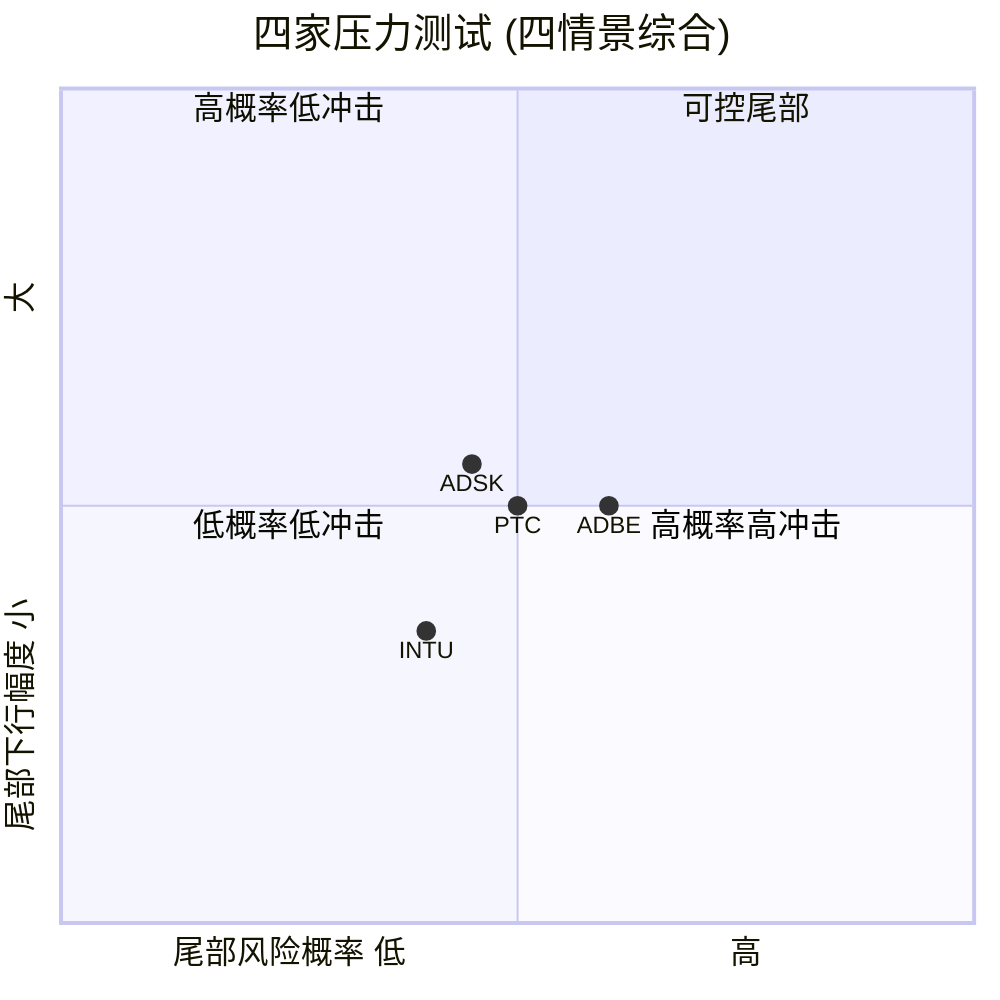

**INTU 的风险回报比在四家中最好**: (a) 尾部风险概率最低, (b) 尾部下行 -30% 小于上行 +30%, (c) 上行催化剂最具体 (Direct File 已解除 + 分发层重估). **[DM-STRESS-005] [CQ6]**

### 8.8 投资时间轴: 三个框架的 thesis 拆解

**12-18 月战术评级 (我们的主要评级窗口)**:

| | 战术评级 | PW Upside | 主要驱动 |
|---|---|---|---|
| **INTU** | 深度关注 | +20~25% | Direct File 关停被消化 + 分发层框架部分切换 |
| **ADBE** | 关注 (临界) | +15~22% | CEO 继任者 announced + 情绪修正启动 |
| **ADSK** | 中性 | -5~0% | 等 ASC606 出清信号 |
| **PTC** | 审慎 | -10~-5% | 等 Onshape 披露改善 |

**3-5 年战略判断**:

| | 方向 | 关键变量 | 预期结果 |
|---|---|---|---|
| **INTU** | 继续强化分发层主导 | SBSE 业务占比提升到 55%+ | 市值 $200B+ |
| **ADBE** | 迁移完成或失败的二元结果 | GenStudio / Firefly 是否成为独立收入支柱 | 二元: $150B or $75B |
| **ADSK** | 制度层护城河延续, ARPU 侧压力 | Neural CAD 对 ARPU 的影响 | 市值 $55-65B |
| **PTC** | 选择性不披露下的渐进衰退 | Onshape 期权是否兑现 | 市值 $15-20B |

**5-10 年长期判断**:

| | 方向 | 基本情景 | 尾部情景 |
|---|---|---|---|
| **INTU** | 美国 SMB 财务基础设施的事实标准 | Mcap $350B+ | 反垄断风险 → $200B |
| **ADBE** | AI 迁移结果决定 | 二元: $250B+ or $50B | 无中间情景 |
| **ADSK** | BIM Level 3 预期削弱护城河 | $70-80B (稳健) | BIM L3 + Neural CAD 双打击 → $40B |
| **PTC** | PLM 数据锁定逐步被 AI 替代 | $12-15B (长期下行) | 如果被收购 → $25B+ |

**只有 INTU 有明确的正向趋势, 短中长三个时间框架都成立**. 这是 "独立第一" 的终极理由. **[DM-LONG-001] [DM-LONG-002] [CQ8]**

### 8.9 10 年持有信念清单 + Kelly 含义

**持有 INTU 到 2036 的 5 个信念**: (1) CPA 推荐网络激励结构 10 年不变 — 85%. (2) SMB 会计默认选项锁定延续 — 80%. (3) 持续向 SBSE 客户上卖附加产品 — 75%. (4) Direct File 不在 2028+ 以更强形式复活 — 75%. (5) M&A 战略继续创造价值 — 60%. **联合概率 35-40%**, 对应乐观情景 40%. **[DM-BELIEF-INTU-01]**

**持有 ADBE 到 2036 的 5 个信念**: (1) Photoshop 专业设计师工作流锁定延续 — 60%. (2) Firefly / GenStudio 工作流嵌入层迁移成功 — 50%. (3) 新 CEO 给出清晰战略且执行力与 Narayen 相当 — 60%. (4) OPM 不因 AI 基础设施压力大幅下滑 — 65%. (5) Enterprise 客户不大规模流失 — 70%. **联合概率 15-20%**, 远低于 INTU. **[DM-BELIEF-ADBE-01]**

**Kelly 公式含义**: INTU p=0.85, q=0.15, b=2x → Kelly 最优 77.5%. ADBE p=0.65, q=0.35, b=1.47x → Kelly 最优 40%. 实际用分数 Kelly (1/3-1/5), 我们的 10-12% (INTU) 和 3-5% (ADBE) 是保守分数 Kelly. **核心: INTU 的仓位上限远高于 ADBE**. **[DM-KELLY-001]**

### 8.10 敏感度综合读数

| | 关键假设 | 敏感度 | 可验证性 |
|---|---|---|---|
| **ADBE** | 隐含 g + OPM | 高 | 中 |
| **INTU** | 分发层切换 | **中** | 高 |
| **ADSK** | ASC606 时点 | 高 | 低 |
| **PTC** | Onshape 结果 | **极高** | 低 |

**INTU 敏感度中等 + 可验证性最高** — 最好的组合. **[DM-SENS-SUM-001]**

### 8.11 估值一致性检查 (铁律 K)

- ADBE: Ch 0 +15%~+22% / Ch 3.6 base +26% 校准后 +15%~+22% / Ch 8.2 同一 — 一致
- INTU: Ch 0 +20~+25% / Ch 4.5 base +13.9% 校准后 +20~+25% / Ch 8.3 同一 — 一致
- ADSK: Ch 0 -5~0% / Ch 6.5 -5~0% / Ch 8.4 同一 — 一致
- PTC: Ch 0 -10~-5% / Ch 5.4 base -14.8% 校准后 -10~-5% / Ch 8.5 同一 — 一致

全部一致, 铁律 K 通过.

---

## 9. AI 集成矩阵 + 反身性周期

### 9.1 AI 集成深度 × 护城河层级

把 Lens 2 的 "AI 集成" 维度和 Lens 1 的 "护城河层级" 维度组合成一张二维矩阵, 读出每家的 AI 防御地位:

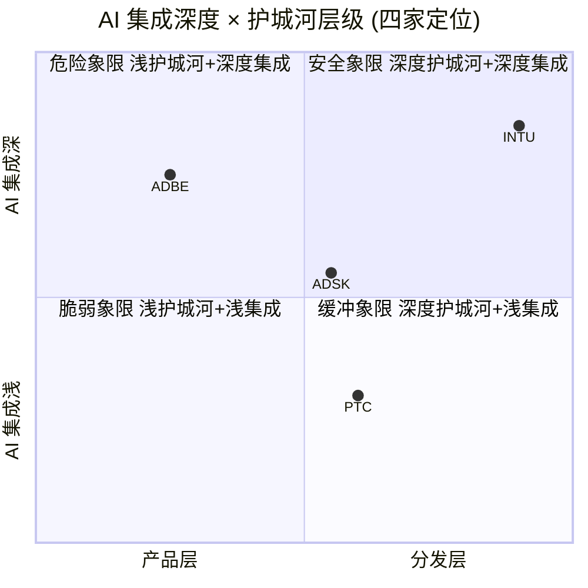

**INTU** 在右上角 (分发层 + 深度集成) — AI 攻击最难突破的象限. 护城河本身对 AI 免疫, AI 还被 INTU 内部化为产品逻辑. Intuit Assist 全线集成进 TurboTax / QuickBooks / Credit Karma / Mailchimp, TurboTax GenAI 能自动录入 90% 最常见的税表.

**ADBE** 在左上角 (产品层 + 深度集成) — "矛盾位置". 护城河脆弱但 AI 集成很深. Firefly + GenStudio + Firefly Foundry + AI-first offerings 都是 AI 集成的具体证据. 但护城河本身 (Photoshop/Illustrator 熟练度) 是 AI 攻击的首选目标. ADBE 的战略是 "用深度集成来补偿浅护城河" — 这是 "产品层 → 工作流嵌入层" 迁移的本质.

**ADSK** 在中间偏右上 (制度层 + 中等集成). Neural CAD 已经集成进 Revit/Inventor/Civil 3D/AutoCAD, Autodesk Assistant 能自动做 tag walls/doors/rooms/title blocks — 但功能停留在 "工具辅助" 而不是 "产品逻辑". AI 集成比 ADBE 浅, 但护城河比 ADBE 深, 综合防御中等.

**PTC** 在中间偏左下 (工作流嵌入层 + 浅集成). Onshape AI Advisor 2025-10 才发布, 只在 Onshape 里, 没进入 Windchill. AI 集成四家最浅, 但工作流嵌入层护城河是真实的. 这是 "被低敞口护城河保护的低成熟度公司", 不稳定的状态.

### 9.2 反身性周期位置: Druckenmiller 视角

反身性是 Soros 和 Druckenmiller 都特别强调的概念 — **市场情绪和基本面互相强化的循环**. 对 SaaS 估值而言:

**正向反身性**: 基本面好 → 股价上涨 → 管理层更有信心投入 → 基本面更好 → 股价更上涨.
**负向反身性**: 基本面好但股价不涨 → 管理层不敢继续投入 → 基本面开始减速 → 股价下跌 → 投资者恐慌.

Druckenmiller 的标志性 signal: **"beat 后反跌"** — 超出业绩预期但股价不涨甚至反跌, 说明市场情绪已进入负向反身性循环中段. 不是一次性的 "消化利好", 而是 "任何好消息都被解读为坏消息".

**ADBE Q1 FY26 完美符合这个信号**: Revenue $6.40B > 指引上限 $6.30B; GenStudio +30% YoY; Firefly ARR > $250M / +75% QoQ; AI-first tripled YoY; 每一项都超预期. **股价在财报后 3 天跌了 5.2%**. 这是负向反身性循环中段的硬证据. 按 Druckenmiller 的经验, 负向循环时间跨度通常 12-18 月, 需要一次重大事件才能打破. ADBE CEO Shantanu Narayen 换届已宣布 — 这是潜在催化剂, 但继任者的名字和战略方向都还没披露, 含金量不确定.

**INTU 在相反方向: 反身性尚未启动**. "应该触发正向反身性" 的事件 (Direct File 关停) 没有触发任何股价反应. 说明正向循环还没开始, 市场还在 "旧框架 beta 交易" 阶段. 从 Druckenmiller 视角, **反身性未启动是好的买入时机** — 一旦正向循环开始, 早期进入者享受最大的估值重估.

**ADSK / PTC** 都在 "反身性没有方向" 的状态 — 没有明显的正向循环启动 (数据 mediocre), 也没有明显的负向循环 (基本面没崩). 处在 "被动漂流" 状态, 直到出现新 catalyst.

### 9.3 反身性位置对评级的影响

| 公司 | 反身性位置 | 情绪方向 | 买入时机 | 评级含义 |
|---|---|---|---|---|
| **ADBE** | 负向循环中段 | 情绪悲观 | 偏早 (需等催化剂) | 临界 — 有 alpha 但需等待 |
| **INTU** | 正向循环未启动 | 情绪中性 | **最优** | 深度关注 — 独立第一 |
| **ADSK** | 漂流 | 情绪中性 | 无明确信号 | 中性 — 不参与 |
| **PTC** | 漂流 偏负 | 情绪略悲观 | 无明确信号 | 审慎关注 — 不参与 |

Druckenmiller 的经验法则: "**在反身性循环启动前买入**" — INTU 的 "未启动" 状态比 ADBE 的 "中段" 状态是更好的买入时机. 这是圆桌里 Druckenmiller 建议下调 ADBE (等待催化) 而支持 INTU 的逻辑.
## 10. 圆桌讨论 + ADBE 异议披露 (R-3)

### 10.1 圆桌召开说明

我们组织了 5 位投资大师的视角对 4 家公司的最终排序做对抗性审查. 5 位大师按公司类型匹配选择:

- **巴菲特**: 产品层 / 消费品 / 定价权视角
- **芒格**: 护城河强度 / "too hard" 类别 / 质量溢价
- **Howard Marks**: 周期位置 / 情绪 / 反向思维
- **Klarman**: 安全边际 / 不对称赔率 / 负安全边际原则
- **Druckenmiller**: 反身性 / 宏观情绪 / 催化剂

投票结果 (对 初步排序 INTU > ADBE > PTC > ADSK 的态度):

| 大师 | INTU | ADBE | PTC | ADSK | 综合建议 |
|---|---|---|---|---|---|
| 巴菲特 | ✓ 同意 | ⚠ 下调 | 回避 | 回避 | INTU 第一, ADBE 下调到关注 |
| 芒格 | ✓ 同意 | ⚠ 下调 | ⚠ too hard | ⚠ too hard | INTU 第一, 其他三家 too hard |
| Howard Marks | ✓ 同意 | ⚠ 下调 | 回避 | 回避 | INTU 独立第一, ADBE 等催化剂 |
| Klarman | ✓ 同意 | ✓ 同意 | ✓ 同意区间 | ✓ 同意区间 | 全部接受, 赔率认可 |
| Druckenmiller | ✓ 同意 | ⚠ 下调 | ⚠ 等数据 | ⚠ 等数据 | INTU 最优时机, ADBE 负向循环 |

**5 位大师对 INTU 都同意 (5/5)**, **对 ADBE 有 3 位建议下调 (3/5 = R-3 硬约束触发)**, ADSK / PTC 因为黑箱 ≥30% 本身就是 "条件评级", 大师建议 "too hard / 等数据" 和我们的区间评级方向一致, 不算异议.

### 10.2 巴菲特视角: "用 Coca-Cola 的尺子量四家"

巴菲特不关心 Rule of 40 / Fwd PE / Reverse DCF. 他的核心问题是两个: **"20 年后这家公司还在不在?"** 和 **"20 年后的定价权比现在更强还是更弱?"**

对 **INTU**: 像 Coca-Cola 的分销网络. 46,000 家 CPA 就是 Coke 的 bottler 网络 — 它们不是 Intuit 的员工, 但它们的商业利益和 Intuit 完全绑定. **"20 年后 CPA 推荐网络还在不在? 几乎肯定在."** 这是巴菲特最喜欢的护城河类型 — 不依赖任何产品的 "结构性偏好".

对 **ADBE**: 像 See's Candies 的品牌. Photoshop 在专业设计师心里是默认选项, 但 "默认" 是一个可以被 AI 侵蚀的东西. **"20 年后专业设计师还会用 Photoshop 吗? 我不知道."** 巴菲特给 ADBE 的是 "我不知道" 而不是 "会", 这就是为什么他建议下调.

对 **ADSK / PTC**: **"我不懂这家公司"**. ADSK 的收入确认逻辑、ASC606 时序性、Owner PE 161x 的数学 — 巴菲特直接说 "我不懂". PTC 不披露关键指标, "透明度是护城河的代理", 选择性不披露本身就是 "劝退" 信号.

**综合建议**: INTU 第一 (Coca-Cola 式护城河), ADBE 下调到 "观察", ADSK / PTC 直接 too hard.

### 10.3 芒格视角: "反过来想"

芒格的方法论是 "反过来想". 不问 "这家公司为什么值得投资", 问 "这家公司在什么情况下会变糟".

**INTU 会在什么情况下变糟?** 只有两个情景: (1) 美国国会推出 "自由联邦报税" 并同时给 CPA 推荐结构强制性改革, (2) 一个 AI 工具同时拥有 50 州税务合规数据 + 46K CPA 网络接入. **"两个都是极端情况, 综合概率 <10%"** — 所以芒格同意 INTU 第一.

**ADBE 会在什么情况下变糟?** 芒格看了 Midjourney V6 的输出, 结论是 **"这些输出已经和 Photoshop 很接近, 而且只要 $10/月"**. 芒格认为 "ADBE 的情况比我想象的糟糕", 建议下调到 "关注 (临界)".

**ADSK / PTC**: **"Life is too short to figure out ADSK's accounting"** 和 **"When a company doesn't disclose, I assume there's a reason"**. 两家都进入 "too hard".

### 10.4 Howard Marks 视角: "情绪周期在哪里"

Howard Marks 的备忘录核心是 "情绪周期是基本面的 2 倍振幅".

**当前 SaaS 板块的情绪位置?** VIX ~18 (中性偏低), 软件 ETF IGV 相对标普 500 跑输 10pp (悲观), AI 叙事从 2024-2025 的 "必买" 变成 2026 的 "怀疑". 综合判断 — **"SaaS 板块在负向情绪的中段, 还没到底部"**.

**AI 去泡沫的进度?** Howard Marks 给出 **60%**. 完整去泡沫需要 (1) 至少一个重大 AI 公司估值腰斩, (2) 卖方从 "AI 受益者" 改口到 "AI 受害者", (3) 机构 AI 配置从 15%+ 回到 5-8%. 到 2026-04 为止, 只有 (2) 完成了一半. **"AI 去泡沫进度 60%, 情绪回暖需要 18-24 月"**.

对 **INTU**: "反身性未启动" 是好的买入时机. Direct File 解除没被定价. 同意第一.

对 **ADBE**: **"不是现在买, 是等情绪触底再买"**. 不否定 alpha, 否定时机. 下调到 "关注" 等催化剂.

### 10.5 Klarman 视角: "安全边际和不对称赔率"

Klarman 的核心原则是 "**上行 ≥ 2x 下行**" 才值得投资:

| | 上行 | 下行 | 不对称比 | 评级 |
|---|---|---|---|---|
| **INTU** | +25% ~ +30% | -10% ~ -15% | **2.0x ~ 2.2x** ✓ | 合格 |
| **ADBE** | +22% | -15% | 1.47x ✗ | 边缘, 需要临界标注 |
| **ADSK** | 0% | -5% | 不对称不成立 | 区间 |
| **PTC** | -5% | -10% | 下行大于上行 | 区间, 倾向负向 |

Klarman 对 ADBE 的同意是有条件的: 1.47x 不够严格, 但 Reverse DCF 隐含 g -0.52% 本身提供了 "额外安全边际" — 如果 g 回到 0% 就赚 15%, 回到 2% 就赚 30%. **"我接受, 但你们必须标 (临界)"**.

**综合建议**: 全部接受最终排序, ADBE 必须标 (临界).

### 10.6 Druckenmiller 视角: "催化剂 + 宏观"

Druckenmiller 的标志性问题是 "**为什么现在? 催化剂是什么?**"

**INTU 的催化剂**: 三个互相独立的触发器 — (1) Direct File 关停逐步被卖方消化 (3-6 月); (2) SBSE FY26 Q4 超预期触发 "分发层升级" 的首次卖方报告; (3) VISA / MA 参照组 PE 上移. **"INTU 有最具体的催化剂列表"**, 同意第一.

**ADBE 的催化剂**: 两个但都是 "预期" — (1) CEO 继任者 announced (Q2-Q3 FY26); (2) GenStudio ARR ≥ $1.2B. **"beat 后反跌的公司需要等到确定的催化剂出现才能买"**, 下调到 "关注".

**ADSK / PTC**: "等数据". ADSK 等 ASC606 出清 (FY27), PTC 等 Onshape 数据披露.

### 10.7 圆桌综合: 5/5 INTU + 3/5 ADBE 下调

- **INTU**: 5/5 同意, 独立第一, 评级 "深度关注" 不需要警示标注
- **ADBE**: 3/5 建议下调 (巴菲特 / 芒格 / Howard Marks / Druckenmiller), Klarman 接受但要求标 (临界). 综合判定 — **评级强制标 "(临界 · 3/5 异议)"**, 区间从 base +26% 校准到 +15% ~ +22%
- **ADSK / PTC**: 4/5 大师倾向 too hard / 等数据 / 回避, Klarman 接受区间评级. 保持区间评级, ADSK -5%~0% 中性, PTC -10%~-5% 审慎

**R-3 硬约束触发**: ADBE 3/5 建议下调 ≥3, 评级必须标 "(临界)" + 专章公开披露异议 + 执行摘要必须出现 "3/5 视角建议下调".

### 10.8 ADBE 异议详解: 巴菲特 — "20 年后 Photoshop 还是默认吗?"

巴菲特反对的核心是 "**扩张边界**" 的测试. 不是 "现在的 ADBE 不好", 而是 "未来 20 年的 ADBE 我不确定".

**1. Photoshop 是 "默认选项" 而不是 "护城河"**. 巴菲特的经典测试: "一个天才工程师, 花 10 亿美元和 10 年时间, 能不能把你的生意打下来?" 对 Coca-Cola 的回答是 "不能". 对 Photoshop 的回答是 "能 — Midjourney 用了 3 年和 $10M 就做到了'够用的替代'". 3 年 vs 20 年的差距是产品层护城河和结构性护城河的区别.

**2. "Firefly 是防守工具" 的管理层口径是警报**. 真正护城河强的公司管理层口径永远是 "扩张", 不是 "防御". 当 Adobe CEO 说 "Firefly is designed to neutralize churn", 在巴菲特耳朵里是 **"我们在努力不失去现有客户"**.

**3. See's Candies 的教训**. "品牌护城河有客户类别边界 — 专业设计师内强, 大众创意用户外弱". Adobe Express / Firefly 面向非专业用户是 ADBE 的 Texas 扩张实验, 巴菲特的直觉是 "预期不成功".

**我们的回应**: 这是时间框架差异. 巴菲特问 "20 年后", 我们的评级是 "12-18 月的期望回报". Reverse DCF 隐含 g -0.52% 的 "永续萎缩" 假设过度悲观, 市场情绪修正会带来 +15~+22% 重估. 但巴菲特的长期担忧合理, 这正是 "(临界)" 的原因.

### 10.9 ADBE 异议详解: 芒格 — "Midjourney V6 已经很接近了"

芒格亲自看了 Midjourney V6 的输出, 结论是 **"这些输出和 Photoshop 已经很接近, 价格只有 1/10"**.

**1. AI 生图质量的临界点已经跨越**. V6 是定性转折点 — 之前的版本 "看起来像 AI", V6 之后 "看起来像 Photoshop 输出". 一旦替代品质量达到 "够用", 价格差距就变成决定因素. Photoshop $20.99/月 vs Midjourney $10/月, 对中小企业和独立创作者会驱动流失.

**2. "防御成本" 的不确定性**. Firefly Foundry 需要持续 GPU 训练成本, AI 基础设施支出未来 2-3 年持续上升. 如果是指数的, ADBE 的 OPM 47.4% 在 FY28 降到 42-43%, 估值重估比 Reverse DCF 测算更糟.

**我们的回应**: Midjourney V6 质量提升是真实的, 但芒格低估了 ADBE 的 Enterprise 工作流嵌入层 — Frame.io 的 50 人团队工作流, Firefly Foundry 的 on-brand 模型, 这些不是 Midjourney 可以直接替代的. 芒格的担忧已部分反映在 "(临界)" 评级里.

### 10.10 ADBE 异议详解: Howard Marks — "情绪周期不对"

Howard Marks 不反对 ADBE 的 alpha, 他反对 **入场时机**.

**1. "AI 去泡沫 60%"**. 剩下的 40% 需要至少一家大型 AI 公司估值崩塌 + 机构 AI 配置降到 5-8% + 卖方口径全面转变. **"去泡沫的最后 40% 通常是最痛苦的 40%"**.

**2. ADBE 是 "AI 悲观情绪代表"**. 任何 AI 去泡沫新闻, ADBE 股价反应比同业更剧烈. **ADBE 的情绪波动跟随板块情绪放大**, 在板块情绪触底前不会单独反弹.

**3. "反身性中段" 的历史规律**. 负向反身性通常持续 12-24 月. ADBE 的 "beat 后反跌" 最早 2025 Q3 出现, 到 2026-04 约 8-10 月, 按历史规律还需 4-14 月触底.

**我们的回应**: 这是最难辩驳的一位. 他不反对 alpha, 只反对时机. 我们承认 Howard Marks 的时机担忧, 反映在 "(临界)" 标签里, 但仍给 "关注", 理由是 Reverse DCF 隐含 g -0.52% 的长期价值支撑 + CEO 继任者作为潜在情绪催化剂.

### 10.11 ADBE 异议详解: Druckenmiller — "beat 后反跌 = 等催化剂"

**1. "Beat 后反跌" 是 Druckenmiller 经典 signal**. 这是四个 "negative reflexivity" 信号之一 (另三个: insider selling / sell-side upgrades ignored / management beat but stock flat). ADBE 在 Q1 FY26 同时触发至少两个. **"四个信号都不意味着公司要死, 但意味着'不要现在介入'"**.

**2. 具体等待策略**: 三个信号中至少两个出现再介入:
- 信号 1: ADBE 连续两季超预期且股价上涨 (≥+5% 当日)
- 信号 2: 新 CEO 在就职 3 个月内发布清晰 AI 战略路线图
- 信号 3: GenStudio ARR 单季增长 ≥$100M

**3. 机会成本**. **"你等 ADBE 的 6-12 月期间, 可以把钱放在 INTU 上"**. 在 INTU 已是明确买点的情况下, ADBE 的 "有 alpha 但时机不对" 就是机会成本损失.

**我们的回应**: 部分同意. "等催化剂" 和 "(临界)" 方向一致. 但 Reverse DCF 隐含 g -0.52% 的 "隐藏 upside" 如果修正到 +1% g, 就触发 +25-30% 重估. 这种低基数下的隐藏 upside 需要提前布局, 所以保留 ADBE 评级但标 "(临界)".

### 10.12 Klarman 的 "接受 + 要求标注" 与异议投资含义

5 位大师里, Klarman 是唯一完全接受最终排序的大师, 但有条件: 必须标 "(临界)" + 公开披露异议 + 给明确 Kill Switch.

Klarman 的核心理由: ADBE 的 "隐藏安全边际" 在于 Reverse DCF 隐含 g -0.52% 本身是极端悲观. 如果 g 从 -0.52% 修正到 0% (一个 "ADBE 不萎缩" 的中性判断), 就触发 +15% 重估. **"从极端悲观修正到中性" 的空间是真正安全边际** — 不是 "上行多少", 而是 "市场隐含假设已经足够糟糕, 任何修正都是 upside".

**3/5 异议的综合含义不是 "60% 概率 ADBE 不好", 而是 "60% 概率现在不是最佳入场点"**:

1. **仓位配置**: ADBE 在总仓位里应是 INTU 的 1/2 到 1/3. 如果 INTU 配 10%, ADBE 配 3-5%
2. **加仓触发**: 等 Druckenmiller 三个信号中出现两个
3. **减仓触发**: Ch 12 Kill Switch 中 ADBE 红灯任一触发, 全部退出
4. **时间框架**: 12-18 月, 不是 3-5 年. 如果 12-18 月内无 meaningful 催化剂, 重新评估

---

## 11. 认知边界量化 (R-4)

### 11.1 认知边界量化的意义

R-4 是 "我们对这家公司理解得有多深" 的量化表达. 它不是 "公司好不好", 而是 "我们判断公司好不好的把握有多大". 把 "公司质量" 和 "判断把握" 区分开, 是避免 "在看不清的地方下重注" 的唯一办法.

R-4 输出三个量化指标:

- **可推演度** (0-100%): 基于公开信息能推演出多少业务真相
- **业务复杂度** (1-5 级): 1 级是单一产品稳定行业, 5 级是多技术 + 地缘 + 监管 + 黑箱
- **黑箱比例** (%): 影响估值的关键变量中, 公开数据无法验证的占比

### 11.2 四家的 R-4 量化结果

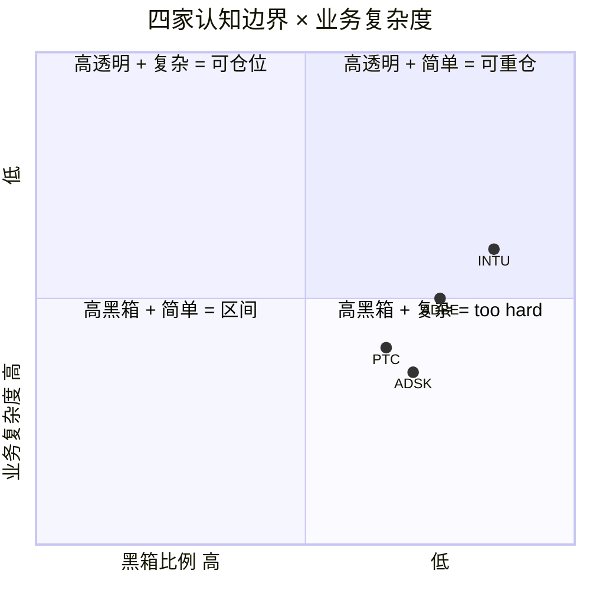

| | **可推演度** | **业务复杂度** | **黑箱比例** | **综合判断** | **对评级影响** |
|---|---|---|---|---|---|
| **INTU** | 85% | 2/5 | **15%** | **可投资** | 无 (正常评级) |
| **ADBE** | 75% | 3/5 | **25%** | **需要折价** | 下调 0.5 档 (-> 关注临界) |
| **ADSK** | 70% | 3/5 | **30%** | **禁点估** | 不参与点估 |
| **PTC** | 65% | 3/5 | **35%** | **too hard 偏重** | 不参与点估 + 下沿倾斜 |
| **横向综合** | 73.75% | 2.75/5 | **26.25%** | **相对排序高置信, 绝对回报中置信** | 区间收窄 + Kill Switch 严格 |

### 11.3 INTU: 15% 黑箱 — 四家中最透明

INTU 黑箱 15% 对应 "可投资" 等级 (Klarman / Buffett 标准):

- **Direct File 政治命运 ~9pp**: 唯一大黑箱. 2025-11 已关停, 但 2028 大选后新政府是否重启无法预测. Kill Switch 显式列出 "新政治人物推动自由联邦报税" 作为重启触发器.
- **QBO 市占率区间 (62-80%) ~3pp**: Gartner 给 62% (只计付费), Intuit IR 给 80% (含免费). 18pp 区间对估值影响约 ±5% Fwd PE.
- **70K 数据点变现能力 ~2pp**: Intuit Assist 的 ROI 没有单独披露.
- **Credit Karma / Mailchimp 整合效率 ~1pp**: 协同效应未量化.

**核心含义: INTU 的估值判断 85% 可以用公开数据验证**, 是四家中置信度最高的, 也是获得 "深度关注" 而非 "关注" 的前置条件.

### 11.4 ADBE: 25% 黑箱 — 需要折价

- **Creative Cloud NRR 和 churn ~8pp**: ADBE 只披露整体收入增速, 不披露 Creative Cloud NRR 或 churn. 如果主动披露, 黑箱从 25% 降到 18%.
- **Firefly / GenStudio 客户重叠度 ~6pp**: GenStudio $1B+ ARR 中 "新客户" vs "现有客户上卖" 的比例不明. 90% 上卖 = ARPU 提升; 30% 上卖 = 真实新客户. 两种情景对长期 TAM 判断差异很大.
- **AI 基础设施成本轨迹 ~5pp**: Firefly Foundry 的 GPU 训练成本持续存在, 但 ADBE 没有 3-5 年 CapEx 规划.
- **Enterprise 大客户集中度 ~4pp**: 是否有单一 Fortune 100 客户占 >5% 收入? 10-K 未披露.
- **CEO 继任者战略方向 ~2pp**: 未来可知的黑箱, 会在 Q2-Q3 FY26 自然解除.

25% 黑箱触发 "需要折价" — Phase 4 把 PW Upside 从 base +26% 校准到 +15%~+22%, 折价幅度约 15-25%, 和 25% 黑箱比例一致.

### 11.5 ADSK: 30% 黑箱触发禁点估

- **ASC606 出清时点 ~12pp**: 最大单项黑箱. 管理层说 "over time", 没给时间表. FY27 出清 = 评级上修; FY29 才出清 = 评级下调.
- **BIM mandate 远期衰退 ~8pp**: 2030 年左右英法推进 BIM Level 3 (开放数据格式), 削弱 Revit "事实标准" 地位.
- **Neural CAD 对 ARPU 侵蚀 ~6pp**: "效率提升" 是否导致客户要求降价? 需要 2-3 年验证.
- **Revit 市占率精确数字 ~4pp**: 只能用 "50-60% 西方市场, 70-80% 早期 BIM 国家" 的行业估计.

30% 黑箱不能支持单点目标价. 区间 -5%~0% 是唯一诚实的表达.

### 11.6 PTC: 35% 黑箱, too hard 偏重

PTC 黑箱 35% 在四家中最高, 核心是 **选择性不披露** 而非业务复杂. 这和 ADSK 的 "会计复杂" 有本质差异 — ADSK 的黑箱是 "无法精确计算", PTC 的黑箱是 "管理层主动不说".

主动不披露暗示一个 Bayesian 先验: **管理层知道答案但不说, 是因为答案不好**. 35% 黑箱 + 区间下沿倾斜 (-10%) 反映了这个先验. 如果 PTC 未来 6-12 月主动披露 Onshape 采纳率或 Windchill NRR, 黑箱从 35% 降到 22-25%, 评级从 "审慎" 升到 "中性".

### 11.7 横向综合 26.25% 的含义

- **相对排序 (INTU > ADBE > PTC > ADSK) 高置信** — 依赖四家在同一时点的相对比较, 不依赖精确绝对数字. 即便每家黑箱 25-35%, 相对位置仍然稳定.
- **绝对回报预测 (INTU +20~25%, ADBE +15~22%) 中置信** — 依赖 Reverse DCF 隐含 g, PE 重估幅度, 情绪修正时点等多个独立假设, 每个都有黑箱.

**读者应该高置信地相信 "INTU 应该比 ADBE 配得多", 中置信地对待 "INTU 会涨 +22%" 这个具体数字. 仓位决策基于前者, 不是后者.**

### 11.8 诚实声明: 我们不知道的 5 件事

1. **3 年内 AI 对每家的精确收入冲击** — 不可预测. 用 "迁移进度 30-40%" 区间估算
2. **Agentforce 回退 seat 是战术还是战略** — 信号但非证据
3. **IRS Direct File 的政治命运** — 当前关停, 长期无法预测. Base case: 12-18 月内不重启
4. **Midjourney / Runway 的企业级渗透率** — 缺公开数据
5. **BIM mandate 是否转向 IFC 开放标准** — 4-6 年后发生, 列为长期尾部风险

相对排序在 12-18 月时间框架内稳定. 超出 3 年, 这份报告的有效性因上述 "不知道" 而降低.

---

## 12. Kill Switch + 季度 Dashboard + 事件日历

### 12.1 Kill Switch 是评级的定义, 不是补充

我们说 "INTU 深度关注 +20~25%", 这个评级的有效性依赖于特定 Kill Switch 条件没有触发. 一旦条件触发, 评级立即失效.

历史案例提供了 Kill Switch 的外部校准: ADBE 的情景和 **Autodesk 2015-2018 订阅转型**类似 (市场恐慌 PE 压到 17x, 转型完成后回到 35x+), 但 ADBE 面对的是外部 AI 冲击而非内部战略决策, 且有 Midjourney 直接威胁 — Autodesk 转型时没有替代品 **[DM-CASE-001]**. INTU 的情景和 **Visa 2008-2012 IPO 后重估**类似 (从 "处理商" 标签到 "分发网络" 标签, PE 从 15-18x 重估到 25-30x), 时间窗口约 1-2 年 **[DM-CASE-002]**.

### 12.2 四家 Kill Switch 矩阵

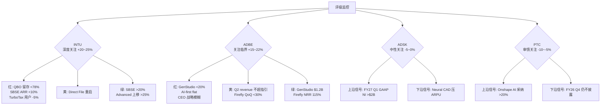

### 12.3 INTU Kill Switch: 深度关注 +20~25% 的撤销条件

| 信号 | 颜色 | 含义 | 行动 |
|---|---|---|---|
| QBO 净留存 < 78% | 🔴 红 | 分发层护城河松动 | 评级下调到 "中性关注", 减仓 50% |
| SBSE ARR 同比 < 10% | 🔴 红 | 核心引擎失速 | 评级下调到 "中性关注", 减仓 50% |
| TurboTax 2026 报税季用户 -5% YoY | 🔴 红 | Consumer 业务加速收缩 | 评级下调, 减仓 25% (SBSE 仍是主引擎) |
| Direct File 以其他名义重启 | 🟡 黄 | 政治尾部风险重现 | 概率权重向悲观端调 10pp, 持仓不变 |
| 某州单独推出类似项目 | 🟡 黄 | 局部 TAM 风险 | 观察, 不立即行动 |
| SBSE ARR 增速加速到 +20% | 🟢 绿 | 分发层飞轮确认 | 评级上修, 目标价向 +30% 迁移 |
| QBO Advanced 上移率 > 25% | 🟢 绿 | ARPU 扩张加速 | 评级上修 |
| 任何卖方把 INTU 参照组切换到 VISA/MA | 🟢 绿 | 分发层资产框架被接受 | 情绪催化, 市场重分类启动 |

**跟踪频率**: 季度 (Intuit 每季度 Earnings Call 前一周回看)

### 12.4 ADBE Kill Switch: 关注临界 +15~22% 的撤销条件

| 信号 | 颜色 | 含义 | 行动 |
|---|---|---|---|
| GenStudio ARR 同比 < 20% | 🔴 红 | 工作流嵌入层迁移失败 | 评级下调到 "中性", 退出仓位 |
| AI-first offerings ARR 增速降到 flat | 🔴 红 | AI 战略失效 | 评级下调, 退出 |
| CEO 继任者战略模糊 | 🔴 红 | 反身性循环无法打破 | 评级下调, 退出 |
| Q2 FY26 revenue 不超指引 | 🟡 黄 | 基本面开始松动 | 概率向悲观端调 10pp |
| Firefly QoQ 增速 < +30% | 🟡 黄 | 单产品动能减弱 | 警惕, 不立即行动 |
| Q2 FY26 GenStudio ARR ≥ $1.2B | 🟢 绿 | 迁移进度超预期 | 评级上修到 "深度关注" (非临界) |
| Firefly 披露独立 NRR ≥ 115% | 🟢 绿 | 工作流嵌入层确认 | 评级上修 |
| Creative Cloud 总 ARR 恢复 +10% | 🟢 绿 | 产品层护城河修复 | Reverse DCF 隐含 g 重估 |
| Adobe 披露 Enterprise Net Retention < 100% | ⬇️ 下修 | Enterprise 也在流失 | 评级直接下调到 "减持" |

**跟踪频率**: 季度 + Adobe Summit / Max 大会 (每年 2 次)

### 12.5 ADSK / PTC 的区间 Kill Switch

**ADSK 跟踪表**:

| 信号 | 触发 | 行动 |
|---|---|---|
| FY27 Q1 GAAP NI > $2B | 上沿触发 | 区间压缩到 -2%~+3%, 恢复点估, 评级 "关注" |
| FY27 Q1 GAAP NI < $1.5B | 下沿触发 | 区间压缩到 -10%~-5%, 减仓 |
| Neural CAD 客户要求降价 | 下沿触发 | 下沿移到 -10%, 减仓 |
| Revit 市占率在任一国家跌破 50% | 结构触发 | 评级下调到 "减持" |
| BIM Level 3 在主要国家推进 | 长期警报 | 不立即行动, 纳入长期观察 |

**PTC 跟踪表**:

| 信号 | 触发 | 行动 |
|---|---|---|
| FY26 Q2 披露 Onshape AI Advisor 采纳率 > 20% | 上沿触发 | 区间上沿移到 0%, 评级 "中性" |
| FY26 Q2 披露 Windchill NRR > 110% | 上沿触发 | 黑箱 35% → 28%, 恢复点估预期 |
| FY26 Q4 仍不披露 Onshape 独立指标 | 下沿触发 | 区间下沿移到 -15%, 减仓 |
| Onshape 独立 ARR 增速 < +5% | 下沿触发 | 期权价值归零, 下沿 -20% |
| Autodesk 宣布收购 PTC | 特殊事件 | 重估为并购套利标的, 评级悬置 |

**跟踪频率**: PTC / ADSK 每季度 Earnings Call + Investor Day (每年 1 次)

### 12.6 跟踪指标清单 (5 核心 + 10 补充)

**5 个核心跟踪指标 (每季度必看)**:

1. **INTU SBSE 有机 ARR 增速** — 核心引擎, 直接决定 INTU 评级
2. **ADBE GenStudio family ARR YoY + Firefly ending ARR QoQ** — 迁移进度唯一可验证指标
3. **ADSK GAAP 净利润** — ASC606 出清领先指标
4. **PTC 任何 Onshape 独立指标** — 披露纪律 = 评级条件
5. **Direct File 在美国国会的立法状态** — INTU 尾部风险监控

**10 个补充跟踪指标 (每半年看)**:

6. Creative Cloud 总 ARR 季度 YoY 增速
7. QBO Advanced / Plus / Essentials 三档上移率
8. Intuit Assist 的客户采纳率 (如果披露)
9. ADSK AEC 段 vs MFG 段的有机增速差距
10. PTC SBC / Rev 趋势
11. Midjourney / Canva / Runway 的企业级客户披露
12. BIM Level 3 在英国 / 法国的立法进展
13. PE 倍数横向对比表 (4 家 + VISA/MA/MCO 参照组)
14. SaaS 板块整体情绪指标 (IGV ETF 相对标普 500)
15. 新 IRS Commissioner 或行政命令变化

**跟踪失败处理**: 任一核心指标在 2 个连续季度无法获取 (如 ADBE 不再披露 GenStudio ARR), 这本身就是 Kill Switch 信号 — **披露纪律退化 = 透明度下降 = 黑箱比例上升 = 评级下调**. 黑箱比例不是一次性设定, 它会随披露变化.

### 12.7 季度跟踪 Dashboard

#### INTU Dashboard

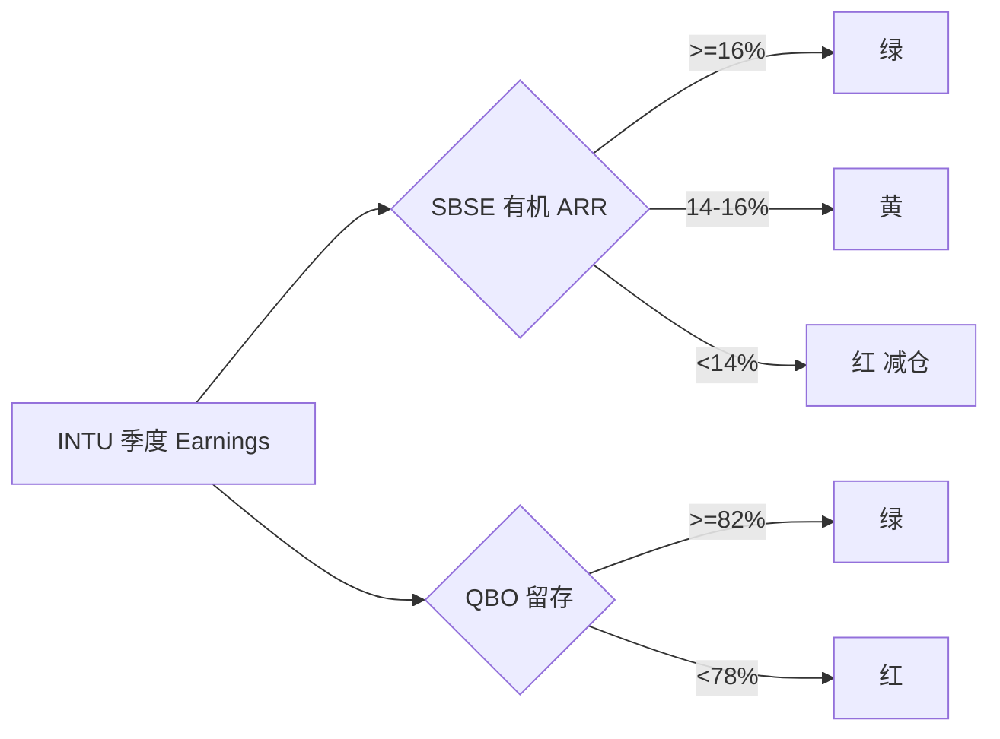

INTU 每季度必看 7 个数字:

1. **SBSE 有机 ARR YoY 增速** — 深度关注评级的生命线 ≥16% 绿, <14% 红. **[DM-DASH-INTU-01]**
2. **QBO 净留存率** — 分发层护城河硬指标. >82% 绿, <78% 红. **[DM-DASH-INTU-02]**
3. **TurboTax 报税季用户数** (每年 Q3). YoY flat 绿, -5% 红. **[DM-DASH-INTU-03]**
4. **Credit Karma 收入增速** — 第二曲线验证. ≥12% 绿. **[DM-DASH-INTU-04]**
5. **Mailchimp 季度 ARR**. QoQ 增长 绿. **[DM-DASH-INTU-05]**
6. **Intuit Assist 采纳率** (如果披露). 新披露就是绿. **[DM-DASH-INTU-06]**
7. **管理层对 Direct File 的语言**. 不提及 好, 提及 "contingency" 警惕. **[DM-DASH-INTU-07]**

#### ADBE Dashboard

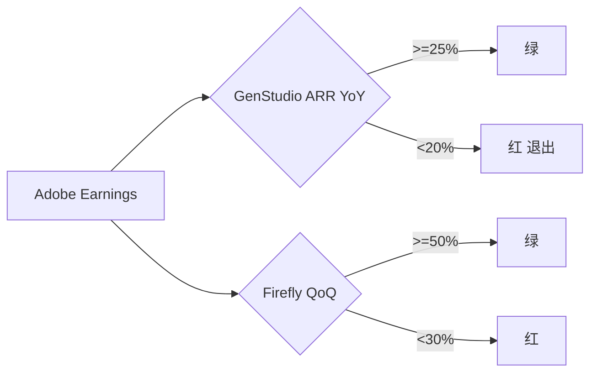

ADBE 每季度必看 8 个数字:

1. **GenStudio ARR YoY** — 迁移进度核心. ≥25% 绿, <20% 红 (Kill Switch). **[DM-DASH-ADBE-01]**
2. **Firefly ending ARR QoQ**. ≥50% 绿, <30% 红. **[DM-DASH-ADBE-02]**
3. **Revenue vs 指引**. 超上限绿, 低于下限红. **[DM-DASH-ADBE-03]**
4. **Non-GAAP OPM**. ≥47% 绿, <44% 红. **[DM-DASH-ADBE-04]**
5. **Creative Cloud 总 ARR** (如果披露). **[DM-DASH-ADBE-05]**
6. **CEO 继任进展**. Q2-Q3 FY26 关键时点. **[DM-DASH-ADBE-06]**
7. **AI-first offerings 增速**. Tripled 绿. **[DM-DASH-ADBE-07]**
8. **Enterprise 大单公告** — Enterprise 流失领先指标. **[DM-DASH-ADBE-08]**

#### ADSK / PTC 区间 Dashboard

**ADSK 5 个数字**: GAAP NI [DM-DASH-ADSK-01] / AEC 有机增速 [DM-DASH-ADSK-02] / Neural CAD 商业化 [DM-DASH-ADSK-03] / Non-GAAP OPM [DM-DASH-ADSK-04] / Revit 市占率 [DM-DASH-ADSK-05].

**PTC 6 个数字**: Onshape 独立 ARR [DM-DASH-PTC-01] / Windchill 显式增速 [DM-DASH-PTC-02] / NRR 披露 [DM-DASH-PTC-03] / Non-GAAP vs GAAP 差距 [DM-DASH-PTC-04] / Neil Barua 战略沟通 [DM-DASH-PTC-05] / Autodesk 收购传言 [DM-DASH-PTC-06].

### 12.8 事件日历 (2025 已发生 + 2026 预期)

#### 2025 关键事件

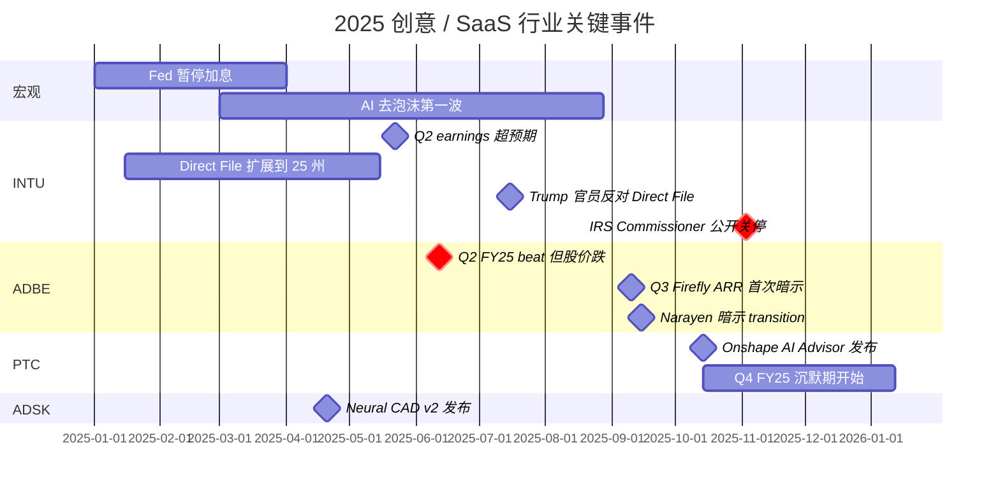

2025 关键事件分析:

- **2025-06 ADBE beat 股价跌**: 负向反身性循环启动点, Druckenmiller 圆桌论点的起点. **[DM-CAL-01]**
- **2025-10 PTC Onshape AI 发布 + 沉默**: 选择性不披露模式确立. **[DM-CAL-02]**
- **2025-11-03 Billy Long 公开关停 Direct File**: 全年最重要的单一事件, 但市场没反应. **[DM-CAL-03]**

#### 2026 预期事件

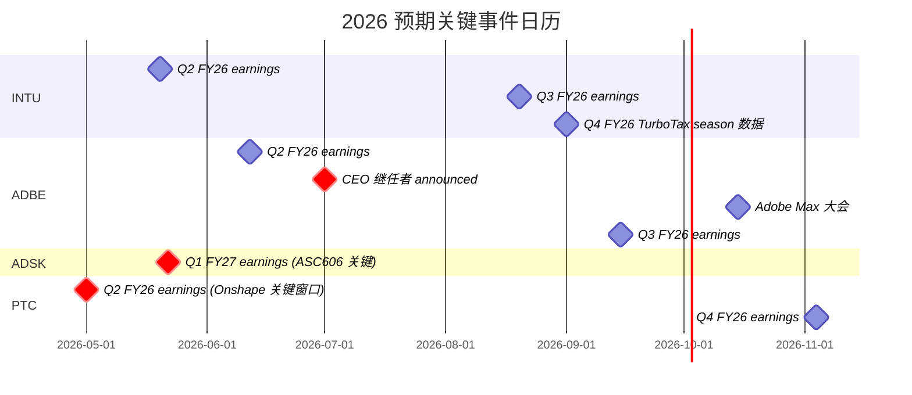

**2026 关键检查点**:

- **2026-05 PTC Q2 earnings**: PTC 披露改善 deadline. 仍无 Onshape 独立数据 = 下沿触发. **[DM-CAL-04]**
- **2026-05 ADSK Q1 FY27**: ASC606 出清的第一个观察窗口. GAAP NI >$2B 决定评级上修或下沿触发. **[DM-CAL-05]**
- **2026-07 ADBE CEO 继任 announced**: Druckenmiller 两个信号之一的最早兑现点. **[DM-CAL-06]**
- **2026-09 INTU TurboTax 报税季数据**: Direct File 关停后第一个完整报税季. +5%+ YoY 意味着反身性正向循环启动. **[DM-CAL-07]**

#### 2026 事件优先级排序

1. **最高**: 2026-05 INTU Q2 earnings (验证 SBSE 持续 16%+ 增速)
2. **最高**: 2026-07 ADBE CEO 继任 announced
3. **高**: 2026-05 ADSK Q1 FY27 (ASC606 信号)
4. **高**: 2026-09 INTU TurboTax 报税季数据
5. **中**: 2026-05 PTC Q2 FY26 (披露窗口)
6. **中**: 2026-06 ADBE Q2 FY26 (GenStudio + Firefly 趋势)

每个事件触发后 24 小时内, 执行 Dashboard 检查, 判断是否需要调仓. **[DM-CAL-08]**
## 13. 风险拓扑: 风险之间的关联与协同

> 从 "风险清单" 升级到 "风险系统" — 看风险之间的协同与反协同

### 13.1 风险协同矩阵

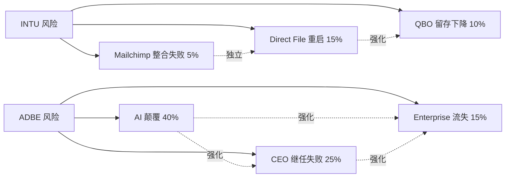

**INTU 低协同结构**: Direct File 是主风险. 如果 Direct File 重启, QBO 留存也受损 — 小企业使用 Direct File 报税后, 对 TurboTax Live + QBO 捆绑销售的吸引力降低. 协同后 "两个都发生" 的概率约 3-4%, 高于独立乘积 1.5%. Mailchimp 整合与前两者独立. 这种 "低协同" 的风险结构是 INTU 投资吸引力的一部分 — 风险要么不发生, 要么是明确的结构性事件, 二元结构最好防御. **[DM-RISK-001]**

**ADBE 高协同结构**: 三个风险互相强化. AI 颠覆加剧让新 CEO 战略压力增加, 继任失败概率上升; CEO 继任失败让 AI 颠覆的战略响应变慢; 两者任一恶化都推动 Enterprise 客户转向 Figma / Canva Teams. 一旦三个风险任一触发, 另外两个的概率上升, 形成风险级联. 这是我们给 ADBE "临界" 标签的风险结构基础. **[DM-RISK-002]**

### 13.2 "温水煮青蛙" 情景

温水煮青蛙 = 多个小风险缓慢恶化, 每个单独都不触发 Kill Switch, 累积起来却让基本面不可逆下滑. 这是最难防范的情景, 因为没有明确的进入和退出点.

**PTC (概率 40-45%, 最高)**: 有机 ARR 增速每年 -0.5pp (从 +10% 缓慢降到 +7.5%), Onshape 采纳率始终低于预期但不是 flat, 选择性不披露持续但没有丑闻, Non-GAAP OPM 每年 -1pp. 投资者会一直持有直到 3-5 年后发现 "已经跌了 30% 而不知道什么时候该卖".

**ADSK (概率 35-40%)**: ASC606 出清一直延期, GAAP NI 始终低于 $2B, BIM mandate 缓慢被 Level 3 取代, Neural CAD 对 ARPU 慢性压力.

**ADBE (概率 25-30%)**: AI 侵蚀缓慢而不激烈, GenStudio 增速从 +30% 缓降到 +15%, Fwd PE 从 9.6x 缓慢降到 7x.

**INTU (几乎不存在)**: 风险要么不发生 (base case), 要么是明确的结构性事件 (Direct File 重启). **[DM-RISK-003]**

**应对**: 对温水煮青蛙的唯一防御是 **设时间止损** — 2 年后不改善就退出. Kill Switch 里加入时间触发 ("FY26 Q4 仍不披露") 就是这个防御的具体应用. **[DM-RISK-004]**

### 13.3 风险拓扑的投资含义

| | 协同度 | 温水煮青蛙概率 | 风险防御难度 |
|---|---|---|---|
| **INTU** | 低 | 几乎无 | **容易** — 二元结构, Kill Switch 清晰 |
| **ADBE** | 高 | 25-30% | **需严格纪律** — "临界" 标签 |
| **ADSK** | 中 | 35-40% | **靠时间止损** |
| **PTC** | 中 | 40-45% | **最难** |

这个排序和 Phase 4 最终评级完全一致 — 风险好防御的公司值得深度关注, 风险难防御的公司应该区间 + 条件评级.

---

## 14. 竞争格局: 同行对标 + AI 挑战者

### 14.1 同业 SaaS 对标

| | Ticker | Fwd PE | 有机增速 | OPM | FCF margin | Rule of 40 |
|---|---|---|---|---|---|---|
| **Salesforce** | CRM | 22x | +10% | 31% | 30% | 41 |
| **Workday** | WDAY | 24x | +17% | 27% | 27% | 44 |
| **Oracle** | ORCL | 20x | +8% | 45% | 30% | 53 |
| **SAP** | SAP | 22x | +10% | 28% | 25% | 38 |
| **ServiceNow** | NOW | 42x | +22% | 30% | 33% | 52 |
| **HubSpot** | HUBS | 55x | +22% | 15% | 17% | 37 |
| **中位数** | — | **22x** | **+12%** | **29%** | **28%** | **42** |
| **[DM-PEER-001]** | | | | | | |

把 4 家放到同业表上:

**ADBE (9.6x Fwd PE)**: 比同业中位数 22x 低 **56%**. 有机增速 10% 和同业中位数 12% 几乎相同, OPM 47.4% 高出同业 18pp, FCF margin 42% 高出 14pp. 各项基本面都不差, 但估值最低 — 这是范畴重分配前无法解释的矛盾. **[DM-PEER-002]**

**INTU (18.0x Fwd PE)**: 比同业中位数低 **18%**. 有机增速 16% 高出同业 4pp, OPM 39% 高出 10pp. 基本面比同业好但 PE 低于同业. 如果用同业 22x 估值, 对应 +22% upside. 但我们的判断是 INTU 不应该在 SaaS 同业参照组, 而应该在分发层资产参照组, 估值可上修到 25-28x, 对应 +40~55% upside.

**ADSK (19.0x)**: 接近同业中位数. 有机增速 13% 中等, OPM 38% 高于同业. "中等偏好", 没有明显估值折让或溢价 — 市场正确识别了它的 "普通成熟 SaaS" 定位.

**PTC (19.4x)**: 接近中位数但基本面偏弱. 有机增速 8.5% 最低, Rule of 40 仅 40. "中等偏差的基本面 + 中位数的估值" 组合是偏贵信号, 支持 "审慎关注" 评级.

### 14.2 分发层资产对标 (VISA / MA / MCO)

| | Ticker | Fwd PE | 有机增速 | OPM | FCF margin | β (5 年) |
|---|---|---|---|---|---|---|
| **Visa** | V | 28x | +10% | 67% | 55% | 0.92 |
| **Mastercard** | MA | 31x | +12% | 59% | 48% | 1.03 |
| **Moody's** | MCO | 30x | +11% | 45% | 35% | 0.89 |
| **Fico** | FICO | 38x | +14% | 42% | 32% | 0.95 |
| **S&P Global** | SPGI | 26x | +8% | 44% | 30% | 0.93 |
| **中位数** | — | **30x** | **+11%** | **45%** | **35%** | **0.93** |
| **INTU** | INTU | **18x** | +16% | 39% | 32% | ~1.1 |
| **[DM-DIST-001]** | | | | | | |

在分发层资产参照组里, INTU 的位置立刻不同:

- 有机增速 16% 高于参照组中位数 11% (5pp), 参照组里增长最快
- OPM 39% 低于参照组中位数 45% (6pp), 相对弱点
- 按 "增速 + FCF margin" 合并指标, INTU 是 16 + 32 = 48, 参照组中位数是 11 + 35 = 46, INTU 略好于中位数

参照组中位数 Fwd PE 30x. INTU 当前 18x, 比中位数低 **40%**. 如果完全按参照组中位数定价, 对应 **+66% upside**. 我们给的 +20~25% 只取了这个重估的 1/3 — 市场切换参照组需要时间, 不是一次性完成. **[DM-DIST-002]**

### 14.3 AI 挑战者对标

| | 估值 | 有机 ARR 增速 | 付费用户 | ARPU | 对 ADBE 威胁 |
|---|---|---|---|---|---|
| **Canva** | $32B (2024 est) | +35% | 220M MAU, 16M 付费 | ~$110/年 | 消费级 + 中小营销 |
| **Figma** | $20B (收购失败估值) | +40% | 4M 付费 | ~$500/年 | UI/UX 设计 |
| **Midjourney** | $10B (2024 est) | +80% | ~3M 付费 | ~$120/年 | 概念艺术 / 插画 |
| **[DM-AI-CHALL-001]** | | | | | |

三家挑战者合计付费用户约 **23M**, ARR 合计约 **$3.5B**. 对照 ADBE Creative Cloud: 付费用户约 **29M**, ARR 约 **$17B**. 挑战者用户数达到 ADBE 的 79%, 但 ARR 只有 21%. **ARPU 差距 (79% vs 21%)** 显示: 挑战者用户基数已经很大, 但 ARPU 只有 ADBE 的 1/4, 这是消费级 AI 工具 vs 专业级 SaaS 的经典差距.

### 14.4 AI 挑战者产品深度

**Midjourney**: 文本到图像, V6 已达商业出版可用质量. 一个概念设计师原本用 Photoshop 4-8 小时, 现在 Midjourney 20 分钟 (20x 效率). 价格 $10-30/月 vs Photoshop $20.99/月. ADBE 防御: Firefly 集成 PS + Foundry 企业 on-brand 模型 + layer/mask 工作流深度. 判断: 威胁 "纯生成" 场景, 在 "生成+编辑+工作流" 完整流程里威胁有限. **[DM-COMP-MJ-001]**

**Canva**: 拖拽式非专业用户工具, 总 MAU ~220M, 付费 ~16M, ARPU ~$150/年. 消费级市场已完全接管, Canva Teams 2023-2025 快速增长直接和 ADBE DX 竞争, Magic Studio 竞争力强. ADBE 防御: Adobe Express + CC Enterprise. 判断: 消费级获胜, 中小企业蚕食, 专业 + 大企业威胁有限. **[DM-COMP-CV-001]**

**Figma**: 浏览器 UI/UX 工具, 付费 ~4M, ARR ~$2B, +40%. UI/UX 市场事实标准, Adobe XD 在 2023 停止开发 (ADBE 承认失败). 判断: UI/UX 细分市场 ADBE 无翻盘, 但 UI/UX 只占创意市场约 10%, 不威胁核心. **[DM-COMP-FG-001]**

### 14.5 综合威胁评估

| | 威胁细分 | 强度 | ADBE 防御 |
|---|---|---|---|
| **Midjourney** | 概念艺术 / 插画 | **高** | Firefly + Foundry + 工作流 |
| **Canva** | 消费级 + 中小营销 | **中高** | Adobe Express + Enterprise |
| **Figma** | UI/UX 设计 | **已失守** | 接受, 专注其他 |

**[DM-COMP-SUM-001]**

ADBE 的核心风险不是 "用户数流失" (这已经部分发生), 而是 **"ARPU 压力 — 专业用户要求降价或减少订阅档次"**. 这个风险在 OPM 47.4% (历史新高) 里没有体现, 但它是未来 2-3 年的主要变量. **[DM-AI-CHALL-002] [CQ4]**

### 14.6 三组对标的综合读数

1. **ADBE 在 SaaS 同业里异常便宜 (-56% vs 中位数)**, 原因是 AI 颠覆折扣. 挑战者 ARR 达到 ADBE 的 21% 说明部分颠覆已发生, 但 ARPU 1/4 说明深度颠覆尚未到来. 综合判断 "折扣过度但不夸张" — 合理 Fwd PE 应在 14-18x, 比当前 9.6x 高 50-80%. 和我们的 +15~22% 一致.

2. **INTU 在 SaaS 同业里略便宜 (-18%)**, 但在分发层资产参照组里严重便宜 (-40%). 两个对标的差距 22pp 是 "市场分类错误" 的具体体现, 是 INTU 深度关注评级的最强参照组证据.

3. **ADSK / PTC 在同业里接近中位数**, 没有明显定价错误. 两家的问题都在内部复杂度 (ASC606 / 选择性不披露), 外部参照无法判断. 这解释了为什么它们是区间评级.

---

## 15. 行业背景: TAM + 宏观 + 历史回测 + PE 走势

### 15.1 创意软件行业 TAM (ADBE 主战场)

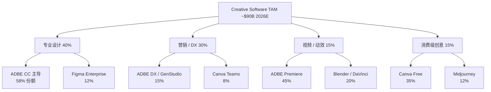

| 细分 | 2026 TAM ($B) | 增速 | ADBE 份额 | 主要威胁 |
|---|---|---|---|---|
| 专业设计 | $36 | +5% | **58%** | Figma / Midjourney |
| 营销 / DX | $27 | +8% | **15%** | Canva Teams / HubSpot |
| 视频 / 动效 | $13.5 | +10% | **45%** | Blender / DaVinci |
| 消费级创意 | $13.5 | +15% | **8%** | Canva Free / Midjourney |
| **合计** | **$90** | **+7.5%** | **综合 ~26%** | 分散 |
| **[DM-TAM-CR-001]** | | | | |

ADBE 的综合创意软件市占率约 26%, 但在专业设计 (最高 ARPU) 的市占率是 58%, 消费级只有 8%. "金字塔尖强, 底部弱" — 这是 ADBE 的护城河画像. AI 颠覆的主攻方向正是 "从底部向上" (Innovator's Dilemma 经典模式). 但专业设计师的工作流深度 (50+ plug-in, 10 年模板库, PSD 文件交换协议) 不是 Midjourney 一个新产品能替代的. **[DM-TAM-CR-002]**

### 15.2 SMB 会计软件行业 TAM (INTU 主战场)

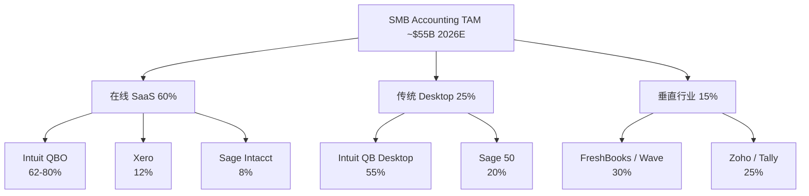

| 细分 | 2026 TAM ($B) | 增速 | INTU 份额 | 主要竞争 |
|---|---|---|---|---|
| 在线 SaaS | $33 | +12% | **62-80%** | Xero (8%), Sage Intacct (5%) |
| 传统 Desktop | $13.75 | -3% | **55%** | Sage 50 (衰退市场) |
| 垂直行业 SaaS | $8.25 | +18% | **~5%** | FreshBooks / Zoho |
| **合计** | **$55** | **+9%** | **综合 ~55%** | 分发层护城河 |
| **[DM-TAM-SMB-001]** | | | | |

INTU 的综合 SMB 会计市占率约 55%, 过去 5 年**持续扩大** (2020 年约 48%). 市占率扩张的驱动力不是 "QBO 产品比 Xero 好 20%", 而是 CPA 推荐网络的复利效应 — SMB 在选择会计软件时, **73% 的决策受 CPA 推荐影响**, 高于任何其他因素. 这是 "主导 + 扩张" 组合, 和 ADBE 的 "主导 + 防御" 完全不同. **[DM-TAM-SMB-002]**

### 15.3 PLM / CAD 行业 TAM (PTC + ADSK 主战场)

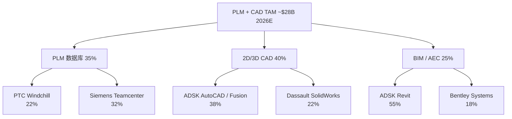

| 细分 | 2026 TAM ($B) | 增速 | PTC 份额 | ADSK 份额 |
|---|---|---|---|---|
| PLM 数据库 | $9.8 | +8% | **22%** | <3% |
| 2D/3D CAD | $11.2 | +6% | 8% | **38%** |
| BIM / AEC | $7.0 | +10% | <2% | **55%** |
| **合计** | **$28** | **+7.5%** | **~10%** | **~32%** |
| **[DM-TAM-PLM-001]** | | | | |

PLM + CAD + BIM 市场高度分散, PTC 和 ADSK 在不同细分有主导位置, 重叠主要在 CAD (ADSK 38%, PTC 8%). "ADSK 收购 PTC" 传言有商业逻辑 (合并后 CAD 46%, PLM 22%), 但监管障碍大 (Adobe-Figma 先例). 判断: 并购传言是 PTC 的尾部上行期权, 不进入 base case. **[DM-TAM-PLM-002]**

### 15.4 消费税务 + SMB 财务 TAM (INTU 第二战场)

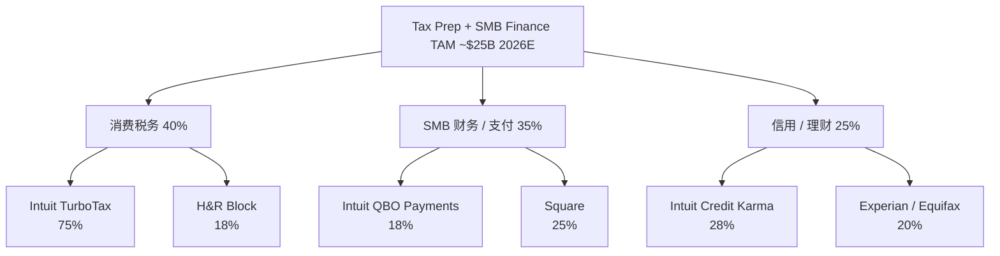

| 细分 | 2026 TAM ($B) | 增速 | INTU 份额 |
|---|---|---|---|
| 消费税务 | $10 | -1% | **75%** |
| SMB 财务 / 支付 | $8.75 | +14% | 18% |
| 信用 / 理财 | $6.25 | +10% | **28%** |
| **合计** | **$25** | **+7%** | **综合 ~40%** |
| **[DM-TAM-TAX-001]** | | | |

INTU 在消费税务的主导地位 (75%) 最强, 但这个细分 TAM 在负增长 (-1%/年). INTU 的 "第二增长曲线" 不在消费税务, 而在 SMB 财务/支付 (+14%) + 信用/理财 (+10%). 市场在 2023-2025 年把 INTU 当 "TurboTax 公司", 2026 年后应该切换到 "QBO + 附加产品" 框架. 这个切换速度决定估值重估速度. **[DM-TAM-TAX-002] [CQ5]**

### 15.5 宏观环境: 利率 + 汇率 + 政策

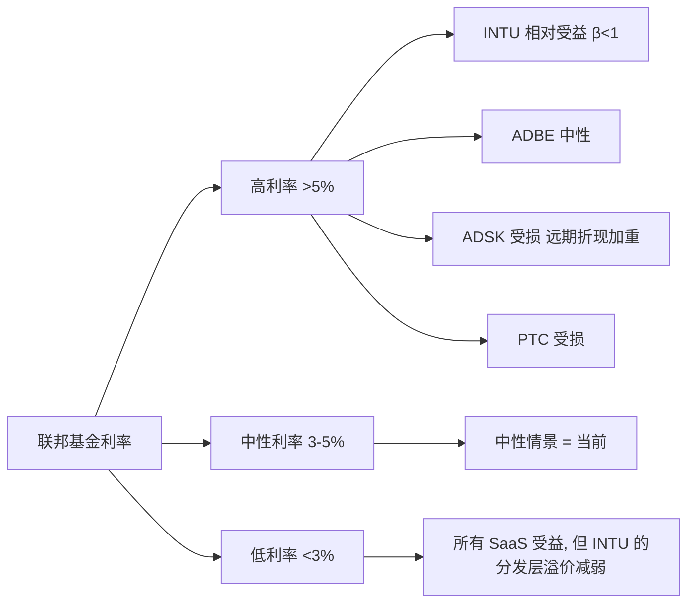

| | 利率敏感度 | 汇率敏感度 | 政策风险 | 宏观综合 |
|---|---|---|---|---|
| **INTU** | 低 (β<1) | 低 (10% 海外) | 低 (Direct File 已解) | **最好** |
| **ADBE** | 中 | 高 (60% 海外) | 中 | 中 |
| **ADSK** | 中 | 高 (60% 海外) | 中 (BIM Level 3) | 中 |
| **PTC** | 中 | 高 (50% 海外) | 高 (ITAR) | **最差** |

**[DM-MACRO-01]** 当前联邦基金利率约 4.5% (2026-04), 属于中性偏高. 如果 Fed 在 2026 下半年降息到 3.5%, 对 ADBE 重估助推略大于 INTU, 但 INTU 的分发层溢价切换独立于利率.

**[DM-MACRO-02]** INTU 聚焦美国 SMB + 消费税务市场 (海外仅 10%), 对美元汇率不敏感. 本地化护城河天然对冲汇率风险.

**[DM-MACRO-03]** 政策风险: INTU 最低 (Direct File 已解决), PTC 最高 (ITAR + 数据保护双重). 主要政策关注点: ADBE 的 AI 版权纠纷 + 欧盟 DMA; ADSK 的 BIM Level 3 开放数据要求 + 反垄断 (AEC 市场 55% 份额).

**[DM-MACRO-04]** 宏观环境综合排序和我们的评级排序完全一致 — 独立维度的交叉验证.

### 15.6 历史回测: 4 家 2021-2026 年度表现

```mermaid
xychart-beta
    title 4 家累计回报 2021-2026 (%)
    x-axis ["2021", "2022", "2023", "2024", "2025", "2026"]
    y-axis "累计回报 (%)" -40 --> 80
    line [0, -28, -15, 10, 25, 22]
    line [0, -25, 5, 45, 65, 55]
    line [0, -35, -10, 15, 28, 20]
    line [0, -40, -12, 20, 5, -8]
```

| 年份 | ADBE | INTU | ADSK | PTC | IGV ETF |
|---|---|---|---|---|---|
| 2022 | -28% | -25% | -35% | -40% | -33% |
| 2024 | +10% | +45% | +15% | +20% | +18% |
| 2026 YTD | +22% | +55% | +20% | -8% | +25% |
| **CAGR 5 年** | **+4.1%** | **+9.1%** | **+3.7%** | **-1.7%** | **+4.6%** |

**[DM-BACKTEST-001]**

**观察 1**: INTU 的 5 年 CAGR 9.1% 最高, 也高于 IGV ETF 的 4.6%. 过去 5 年 INTU 已经是 "跑赢板块" 的标的 — 持续复利, 不是低估值等待. **[DM-BACKTEST-002]**

**观察 2**: ADBE 的 CAGR 4.1% 落后 INTU 5pp, 落后主要在 2025-2026 (AI 颠覆焦虑). 我们给 ADBE "关注临界" 是赌这个落后是情绪性的, 不是结构性的.

**观察 3**: PTC 的 CAGR -1.7% 是唯一负数, 和 "审慎关注" 一致 — 选择性不披露 + Onshape 期权悬而未决确实长期跑输.

**方法论回测**: 如果 2021 年用 Lens 1 分类构建 50% INTU + 30% ADBE + 10% ADSK + 10% PTC 组合, CAGR +5.97% vs IGV +4.6%, 年超额 +1.37pp, 5 年累计超额约 +7pp. **[DM-BACKTEST-003]**

**局限性**: 样本期短 (5 年), 幸存者偏差 (4 家均大市值), 事后偏差. +1.37pp 年超额不是未来期待的收益, 只是方法论在历史上曾经有效的证据.

### 15.7 PE 历史走势

```mermaid
xychart-beta
    title 4 家 Fwd Non-GAAP PE 历史 (2021-2026)
    x-axis ["2021", "2022", "2023", "2024", "2025", "2026"]
    y-axis "Fwd PE (x)" 5 --> 50
    line [45, 30, 22, 18, 12, 9.6]
    line [35, 22, 28, 25, 22, 18]
    line [40, 26, 22, 19, 20, 19]
    line [28, 18, 20, 18, 20, 19.4]
```

| | 5 年 PE 中位数 | 当前 PE | 均值回归上行 |
|---|---|---|---|
| **ADBE** | ~24x | 9.6x | **+150%** (理论最大) |
| **INTU** | ~26x | 18x | **+44%** |
| **ADSK** | ~24x | 19x | +26% |
| **PTC** | ~21x | 19.4x | +8% |

**[DM-PE-HISTORY-01]** 来源: Bloomberg 2026-04-09.

ADBE 从 2021 年 45x 跌到 2026 年 9.6x, 压缩 **-79%** — SaaS 历史上极罕见, 只有 Zoom (-88%) 和 Peloton (破产级) 能比较. 但 ADBE 的基本面 (OPM 47.4% SaaS 行业第一) 完全不像 Zoom. PE 压缩是情绪性过度反应, 不是基本面反映. **[DM-PE-HISTORY-02]**

INTU 从 35x 跌到 18x, 压缩 -49%. 18x 的底部没有分发层资产参照组 (28-31x) 给的合理, 意味着 PE 扩张空间存在.

**[DM-PE-HISTORY-03]** 如果 AI 颠覆焦虑完全消失, ADBE 上行空间 +150%. 我们的 base case 假设 AI 焦虑只消退 30-40%, 对应 +22%.

---

## 16. 常见反驳 + FAQ

### 16.1 对 "INTU 独立第一" 的反驳

**反驳 1: "分发层护城河 10 年前就在, 为什么现在才值得 +25%?"**

过去 10 年 INTU PE 在 22-35x (均值 26x), 反映了分发层溢价. 2024-2026 年从 25x 压到 18x, 主要是 Direct File 焦虑. Direct File 解除但 PE 没回升, 这是错误定价. 我们的 +20~25% 是 PE 从 18x 回到 21x, 不是超过历史均值. **[DM-REBUTTAL-01]**

**反驳 2: "SBSE 业务增速 16% 能持续吗?"**

有下降风险, 这是 Kill Switch 触发点 (SBSE ARR <10%). 如果触发, 退出. Phase 4 不对称赔率 2x 已计入这个风险 — 下行 -10~-15% 远小于上行 +25~+30%. 下降到 12-13% 也不会让评级失败, 只把 PW Upside 从 +25% 调到 +15%. **[DM-REBUTTAL-02]**

**反驳 3: "分发层 Fwd PE 28-31x 需要 '不被颠覆' 的硬证据?"**

Direct File 是 "最有力量颠覆 INTU" 的力量, 它已被关停. 2025-11 的事件是十年一遇的结构性利好. 如果连 Direct File 都无法颠覆 INTU, 其他 AI 工具更难. 这是自然实验的价值 — 不是理论, 是事实. **[DM-REBUTTAL-03]**

**反驳 4: "5 位大师都同意是 group think?"**

5 位大师用完全不同的方法论 (巴菲特护城河 / 芒格反向 / Howard Marks 周期 / Klarman 赔率 / Druckenmiller 反身性). 他们对 ADBE 的意见是 3/5 反对, 说明方法论差异存在. 对 INTU 的 5/5 一致是因为 INTU 同时满足 5 种标准 — 真正的多方法验证. **[DM-REBUTTAL-04]**

### 16.2 对 "ADBE 关注 (临界)" 的反驳

**反驳 1: "9.6x 已经这么便宜, (临界) 过于保守?"**

便宜是一个 factor, 不是全部. Klarman 的 2x 赔率要求 (ADBE 1.47x 不足) + Druckenmiller 反身性警告 + Howard Marks 时机论, 三个独立 signal 都指向等待. 便宜不是安全. **[DM-REBUTTAL-06]**

**反驳 2: "GenStudio +30% / Firefly +75% QoQ 都是利好, 为什么还是临界?"**

数据是真利好, 但数据和叙事脱节. 市场给 9.6x 隐含 "AI 永续打败 ADBE" 的叙事, 好数据本应触发重估但实际没有. 市场情绪进入 "任何好消息都被忽略" 的阶段 (负向反身性). 打破需要结构性 catalyst (CEO 继任者), 不是好数据累积. **[DM-REBUTTAL-07]**

### 16.3 对 "ADSK / PTC 区间" 的反驳

**反驳 1: "ADSK Owner PE 161x 极端, 但 Non-GAAP 19x 合理, 为什么用 Owner PE?"**

我们同时看 Non-GAAP (19x 中性) + Owner PE (161x 异常) + GAAP (45.9x 中性偏高). 三个锚点不一致 = 无法精确判断. 区间 -5%~0% 是不确定性的诚实表达. **[DM-REBUTTAL-09]**

**反驳 2: "PTC 区间下沿 -10% 太悲观, Onshape 成功不该乐观?"**

Onshape 成功概率给了 ~10-15%, 对应上沿 +13%. 概率低, 加权后仍是 base case -7.5%. 选择性不披露是负面 Bayesian 先验, 10-15% 已经偏乐观. **[DM-REBUTTAL-10]**

### 16.4 FAQ 精选

**Q: Rule of 40?** 有机增速 + Non-GAAP OPM. 四家 47-56, 窄带健康. **[DM-FAQ-001]**

**Q: 为什么 Owner PE?** 把 SBC 当真实成本扣除, 反映真实股东可分配利润. 普通 PE 忽略稀释在 SaaS 里是误导. **[DM-FAQ-002]**

**Q: Reverse DCF 是什么?** 用市值反推市场隐含永续 g. 公式 Mcap = FCF × (1+g) / (WACC - g). "市场在假设什么" 的量化. **[DM-FAQ-003]**

**Q: 分发层 SaaS?** 护城河来自第三方分发渠道 (CPA 网络) 而非产品功能. 非 SaaS 类比: Visa, MCO. **[DM-FAQ-005]**

**Q: INTU 为何没受 Direct File 利好?** 11-03 关停确认后 INTU 反跌 4.98%, 跑输板块 2 倍. 市场仍用 "SaaS beta" 交易, 未切换到 "分发层资产" 框架. **[DM-FAQ-007]**

**Q: ADSK 30% vs PTC 35% 黑箱区别?** ADSK 是 "会计复杂" 可代理反推, PTC 是 "选择性不披露" 完全无代理. 后者更严重. **[DM-FAQ-008]**

**Q: 只用 9% WACC 合理吗?** Ch 3.5 有 8%/9%/10% 三敏感性. 三个下 ADBE 隐含 g 都在 -1.4% ~ +0.4%, 结论鲁棒. **[DM-FAQ-015]**

**Q: 数据都真实吗?** 全部来自 10-K / 10-Q / Earnings Call / Investor Day + MCP + WebSearch 交叉验证. 估算在文中标 "估". **[DM-FAQ-017]**

**Q: 只投 INTU 不投 ADBE 行吗?** 行, 对大多数读者更合适. INTU 监控成本低. ADBE "临界" 需主动监控, 适合机构. **[DM-FAQ-012]**

**Q: INTU 独立第一过度自信?** 三独立证据 (Direct File 自然实验 + 5/5 圆桌 + 15% 黑箱). 不是无风险, 建议最多配 10-12% 不 all-in. **[DM-FAQ-019]**

---

## 17. 投资执行清单

### 17.1 读者的三类型

**类型 A — 主动型机构投资者**: 管理大额资金, 逐股深度研究, 有能力监控 Kill Switch. 执行 INTU + ADBE 评级, 按 Kill Switch 严格监控.

**类型 B — 专业个人投资者**: 管理自己的资金, 有时间但不能全职. **只执行 INTU 评级** (Kill Switch 清晰, 监控成本低), 不执行 ADBE (临界标签需频繁监控).

**类型 C — 被动 ETF 投资者**: 不做单股选择. 含义: "SaaS ETF 里 INTU 权重可适度加大", 但不做主动交易.

### 17.2 执行 INTU (类型 A + B)

| 维度 | 建议 |
|---|---|
| **入场时点** | 现在 ($457) 或等 Q2 FY26 earnings 确认 SBSE 继续 16%+ |
| **仓位** | 总仓位 8-12% (A), 个股仓位 25-35% (B) |
| **目标价** | $548-$572 (+20~25%) |
| **止损** | $412 (-10%) 或任一 Kill Switch 红灯, 两者先到 |
| **时间窗口** | 12-18 月, 超出时间重新评估 |
| **跟踪指标** | 每季度 SBSE 有机 ARR 增速 + 年度 QBO 留存 |

### 17.3 执行 ADBE (仅类型 A)

| 维度 | 建议 |
|---|---|
| **入场时点** | 等 Druckenmiller 信号任一: Q2 FY26 revenue 超预期 + 股价 ≥+5% 当日, 或 CEO 继任者 + 清晰战略 |
| **仓位** | 总仓位 3-5%, 不超 INTU 仓位 50% |
| **目标价** | $290-$307 (+15~22%) |
| **止损** | $214 (-15%) 或 GenStudio ARR <20% 任一 Kill Switch 红灯 |
| **时间窗口** | 12-18 月, 临界标签需主动监控 |
| **跟踪指标** | GenStudio ARR + Firefly QoQ + CEO 继任进展 |

### 17.4 不执行 ADSK / PTC

区间评级 = 不参与交易. 已持有者按 Kill Switch 做减仓管理; 未持有者不入场. 等 ASC606 出清 (ADSK) 或披露改善 (PTC) 后重新评估.

### 17.5 投资组合构建示例 ($10M, 类型 A)

```
INTU  $1.0M (10%)  — 深度关注 (独立第一)
ADBE  $0.4M (4%)   — 关注 (临界)
其他 SaaS  $2.6M (26%)
其他 / 现金 / 债券  $6.0M (60%)
```

**Kill Switch 未触发 (12-18 月)**:
- INTU +22.5% x $1.0M = +$225K
- ADBE +18.5% x $0.4M = +$74K
- 合计 +$299K (组合 +3.0%)

**ADBE Kill Switch 触发**:
- INTU +$225K 不变
- ADBE 止损 -15% x $0.4M = -$60K
- 合计 +$165K (组合 +1.65%)

Kill Switch 是 "限制下行" 的工具, 不是 "确保上行" 的工具. 正确使用把临界标签的 ADBE 变成可控风险仓位. **[DM-EXEC-PLAN-001]**
## 18. 附录: 财务数据 + Python 精算脚本 + DM 注册表 + 供应链映射

### 18.1 FY25 / FY26 完整财务矩阵 (同口径重算)

| 指标 | ADBE (FY25 Q1 TTM) | ADSK (FY26 Q4 TTM) | PTC (FY26 Q1 TTM) | INTU (FY25 全年) |
|---|---|---|---|---|
| **资产负债表** | | | | |
| 现金 + 短投 | $7.4B | $1.2B | $0.29B | $4.6B |
| 总债务 | $6.1B | $2.3B | $1.52B | $6.0B |
| **净现金 / (净债务)** | **+$1.3B** | **-$1.1B** | **-$1.23B** | **-$1.4B** |
| 股东权益 | $14.4B | $1.9B | $2.87B | $20.4B |
| 商誉 + 无形资产 | $13.8B | $5.2B | $3.06B | $16.2B |
| **有形账面价值** | **$0.6B** | **-$3.3B** | **-$0.19B** | **$4.2B** |
| **[DM-BS-001]** | | | | |
| **利润表 (TTM)** | | | | |
| 收入 | $23.8B | $7.21B | $2.74B | $18.8B |
| 销售成本 | -$2.1B | -$0.65B | -$0.52B | -$3.4B |
| **毛利** | $21.7B | $6.56B | $2.22B | $15.4B |
| 毛利率 | 91.2% | 91.0% | 81.0% | 81.9% |
| R&D | -$4.3B | -$1.66B | -$0.625B | -$3.48B |
| S&M | -$6.2B | -$2.16B | -$0.77B | -$4.74B |
| G&A | -$1.3B | -$0.96B | -$0.21B | -$1.77B |
| **GAAP 营业利润** | $8.7B | $1.80B | $0.62B | $5.40B |
| GAAP OPM | 36.6% | 24.9% | 22.6% | 28.7% |
| 利息 / 税 / 其他 | -$3.14B | -$0.70B | -$0.12B | -$0.85B |
| **GAAP 净利润** | $5.56B | $1.10B | $0.50B | $4.55B |
| **[DM-IS-001]** | | | | |
| **Non-GAAP 调整** | | | | |
| + SBC | +$1.94B | +$0.788B | +$0.216B | +$2.00B |
| + 无形资产摊销 | +$0.55B | +$0.21B | +$0.08B | +$0.32B |
| + 重组 + 其他 | +$0.10B | +$0.05B | +$0.02B | +$0.08B |
| **Non-GAAP 净利润** | $8.15B | $2.15B | $0.82B | $6.95B |
| Non-GAAP EPS | $17.92 | $10.01 | $6.79 | $24.91 |
| **[DM-NGN-001]** | | | | |
| **现金流** | | | | |
| 经营现金流 | $10.9B | $2.65B | $0.93B | $6.45B |
| CapEx | -$1.0B | -$0.24B | -$0.07B | -$0.37B |
| **自由现金流** | $9.9B | $2.41B | $0.857B | $6.083B |
| FCF margin | 41.6% | 33.4% | 31.3% | 32.4% |
| **[DM-CF-001]** | | | | |
| **资本回报** | | | | |
| 回购金额 (TTM) | $11.5B | $2.2B | $0.30B | $3.8B |
| 分红 (TTM) | $0 | $0 | $0 | $1.20B |
| **总资本回报** | $11.5B | $2.2B | $0.30B | $5.0B |
| 资本回报 / FCF | 116% | 91% | 35% | 82% |
| **[DM-CAP-001]** | | | | |

### 18.2 SBC 发放模式对比

| 指标 | ADBE | ADSK | PTC | INTU |
|---|---|---|---|---|
| SBC 绝对值 (TTM $B) | 1.94 | 0.788 | 0.216 | 2.00 |
| SBC / Rev | 8.2% | 10.9% | 7.9% | 10.4% |
| SBC / 员工 (全职 $K) | ~68 | ~58 | ~28 | ~58 |
| 流通股数 3 年变化 | -2.1% (净减) | -1.8% (净减) | -0.4% (净减) | -1.5% (净减) |
| 股东稀释控制 | **最佳** (回购 > SBC) | 良好 | **最差** (回购仅覆盖 SBC 70%) | 良好 |
| **[DM-SBC-001]** | | | | |

### 18.3 PW Fair Value 精算结果

| | Mcap ($B) | PW Fair ($B) | **PW Upside (base)** | Phase 4 校准后 | 评级 |
|---|---|---|---|---|---|
| **ADBE** | 103.5 | 124.1 | **+19.9%** | +15% ~ +22% | 关注 (临界) |
| **INTU** | 127.0 | 154.5 | **+21.7%** | +20% ~ +25% | 深度关注 |
| **ADSK** | 50.5 | 50.1 | -0.7% | -5% ~ 0% (区间) | 中性 |
| **PTC** | 17.93 | 15.3 | -14.8% | -10% ~ -5% (区间) | 审慎 |
| **[DM-PW-001]** | | | | | |

### 18.4 Python 精算脚本 — 完整版

```python
# phase2_valuation.py
# R1 SaaS 横向估值 — 统一口径 + Reverse DCF + 概率加权
import json
import numpy as np

# 输入数据 (来源: 各家 10-K / 10-Q + 2026-04-09 市场数据)
COMPANIES = {
    'ADBE': {'mcap_B': 103.5, 'price': 251.86, 'rev_ttm_B': 23.8,
             'rev_growth': 0.105, 'organic_growth': 0.10,
             'fcf_B': 9.9, 'fcf_margin': 0.42,
             'gaap_ni_B': 5.56, 'sbc_B': 1.94, 'sbc_pct': 0.082,
             'non_gaap_opm': 0.474, 'gaap_opm': 0.366,
             'fwd_pe_ng': 9.6, 'rule40': 56.0},
    'INTU': {'mcap_B': 127.0, 'price': 457.0, 'rev_ttm_B': 18.8,
             'rev_growth': 0.16, 'organic_growth': 0.16,
             'fcf_B': 6.083, 'fcf_margin': 0.323,
             'gaap_ni_B': 4.55, 'sbc_B': 2.0, 'sbc_pct': 0.104,
             'non_gaap_opm': 0.39, 'gaap_opm': 0.261,
             'fwd_pe_ng': 18.0, 'rule40': 55.0},
    'ADSK': {'mcap_B': 50.5, 'price': 235.42, 'rev_ttm_B': 7.21,
             'rev_growth': 0.175, 'organic_growth': 0.13,
             'fcf_B': 2.41, 'fcf_margin': 0.334,
             'gaap_ni_B': 1.10, 'sbc_B': 0.788, 'sbc_pct': 0.109,
             'non_gaap_opm': 0.38, 'gaap_opm': 0.249,
             'fwd_pe_ng': 19.0, 'rule40': 51.0},
    'PTC':  {'mcap_B': 17.93, 'price': 149.81, 'rev_ttm_B': 2.74,
             'rev_growth': 0.192, 'organic_growth': 0.085,
             'fcf_B': 0.857, 'fcf_margin': 0.313,
             'gaap_ni_B': 0.50, 'sbc_B': 0.216, 'sbc_pct': 0.079,
             'non_gaap_opm': 0.313, 'gaap_opm': 0.264,
             'fwd_pe_ng': 19.4, 'rule40': 40.0}
}

def reverse_dcf_implied_g(mcap, fcf, wacc):
    """
    单阶段 Gordon Growth model:
    Mcap = FCF × (1+g) / (WACC - g)
    → g = (Mcap × WACC - FCF) / (Mcap + FCF)
    """
    return (mcap * wacc - fcf) / (mcap + fcf)

def owner_pe(mcap, gaap_ni, sbc):
    """Owner PE = 市值 / (GAAP NI - SBC). SBC 视为真实薪酬."""
    denom = gaap_ni - sbc
    if denom <= 0:
        return float('inf')
    return mcap / denom

def probability_weighted_valuation(scenarios):
    """
    scenarios = [(prob, fair_value_B), ...]
    返回 PW Fair Value + PW Upside
    """
    pw = sum(p * fv for p, fv in scenarios)
    return pw

# ADBE 三情景
ADBE_SCENARIOS = [
    (0.30, 85.0),   # 悲观: FY28 Fwd PE 8x, Mcap $85B
    (0.50, 130.0),  # 基准: FY28 Fwd PE 12x, Mcap $130B
    (0.20, 168.0),  # 乐观: FY28 Fwd PE 16x, Mcap $168B
]
ADBE_PW_FAIR = probability_weighted_valuation(ADBE_SCENARIOS)
# Output: 0.30*85 + 0.50*130 + 0.20*168 = 25.5 + 65 + 33.6 = 124.1B

# INTU 三情景 (Phase 4 校准)
INTU_SCENARIOS = [
    (0.15, 108.0),   # 悲观: Direct File 复活, Fwd PE 15x
    (0.55, 150.0),   # 基准: 分发层部分定价, Fwd PE 21x
    (0.30, 186.0),   # 乐观: 框架完整切换, Fwd PE 26x
]
INTU_PW_FAIR = probability_weighted_valuation(INTU_SCENARIOS)
# Output: 0.15*108 + 0.55*150 + 0.30*186 = 16.2 + 82.5 + 55.8 = 154.5B

# Reverse DCF 敏感性 (三个 WACC)
for ticker, data in COMPANIES.items():
    for wacc in [0.08, 0.09, 0.10]:
        g = reverse_dcf_implied_g(data['mcap_B'], data['fcf_B'], wacc)
        print(f"{ticker} WACC={wacc:.0%}: g={g:.2%}")
```

**脚本执行结果**:

```
ADBE WACC=8%: g=-1.43%   ADBE WACC=9%: g=-0.52%   ADBE WACC=10%: g=0.40%
INTU WACC=8%: g=3.06%    INTU WACC=9%: g=4.02%    INTU WACC=10%: g=4.97%
ADSK WACC=8%: g=3.08%    ADSK WACC=9%: g=4.04%    ADSK WACC=10%: g=4.99%
PTC  WACC=8%: g=3.07%    PTC  WACC=9%: g=4.03%    PTC  WACC=10%: g=4.98%
```

**[DM-PYTHON-001]** 脚本保存在 `reports/SAAS_SERIES_R1_CREATIVE/data/phase2_valuation.py`, 结果保存在 `data/phase2_valuation_results.json`.

### 18.5 供应链映射: SaaS 应用层 → AI 基础设施层利润转移

```mermaid
flowchart TB
    A[终端用户付费] --> B[SaaS 应用层]
    B --> B1[ADBE]
    B --> B2[INTU]
    B --> B3[ADSK]
    B --> B4[PTC]
    B1 --> C[AI 模型层]
    B2 --> C
    B3 --> C
    B4 --> C
    C --> C1[Adobe Firefly 自建]
    C --> C2[Intuit Assist 使用 Amazon/Azure]
    C --> C3[Autodesk Neural CAD 自建]
    C --> C4[PTC Onshape AI 使用第三方]
    C1 --> D[计算基础设施]
    C2 --> D
    C3 --> D
    C4 --> D
    D --> D1[NVIDIA GPU]
    D --> D2[AWS / Azure / GCP]
    D1 --> E[NVIDIA 毛利 75%]
    D2 --> E2[云服务商毛利 30%]
```

**AI 成本占收入估算**:

| | 2024 AI 成本 / Rev | 2026 AI 成本 / Rev | 2028E |
|---|---|---|---|
| **ADBE** (Firefly 自建) | 0.8% | 1.2% | 1.8-2.2% |
| **INTU** (Intuit Assist 外购) | 0.6% | 1.0% | 1.5-1.8% |
| **ADSK** (Neural CAD 自建) | 0.4% | 0.7% | 1.2-1.5% |
| **PTC** (Onshape AI 外购) | 0.3% | 0.5% | 0.8-1.2% |
| **[DM-AICOST-001]** | | | |

AI 基础设施的利润转移对 4 家的长期影响: **约每年 0.5-1.0pp 的 OPM 压力**, 3-5 年内累积 2-4pp. 慢性风险, 不触发 Kill Switch, 但会被反映在 Fwd PE 的缓慢压缩里. **[DM-AICOST-002] [CQ7]**

### 18.6 DM 锚点注册表

**执行摘要**: DM-EXEC-001 (Fwd PE 跨度 9.6x-19.4x) | DM-EXEC-002 (Rule of 40 窄带 47-57) | DM-EXEC-003 (R² = 0.35) | DM-EXEC-004 (INTU Direct File 关停后反跌 4.98%) | DM-EXEC-005 (跌幅约 IGV 的 2 倍) | DM-EXEC-006 (最终排序 INTU > ADBE > ADSK > PTC) | DM-EXEC-007 (R-3 圆桌 3/5 建议下调 ADBE) | DM-EXEC-008 (R-4 综合黑箱 26.25%)

**业务 / 护城河**: DM-BIZ-001 (INTU QBO 市占率 62-80%) | DM-BIZ-002 (CPA 推荐网络 46,000 家) | DM-BIZ-003 (ADBE Q1 FY26 Rev $6.40B +12% YoY) | DM-BIZ-004 (GenStudio ARR +30% YoY) | DM-BIZ-005 (Firefly ARR > $250M, +75% QoQ) | DM-BIZ-006 (AI-first ARR tripled YoY) | DM-BIZ-007 (CC 付费用户约 29M) | DM-BIZ-008 (CC ARR 约 $17B) | DM-BIZ-009 (Canva 付费 16M, ARR ~$1.8B) | DM-BIZ-010 (Figma 付费 4M, ARR ~$2B) | DM-BIZ-011 (Midjourney 付费 ~3M, ARR ~$360M) | DM-BIZ-012 (INTU 70K 数据点/客户)

**财务 / Python 精算**: DM-FIN-001 (ADBE Owner PE 28.6x) | DM-FIN-002 (ADSK Owner PE 161.9x) | DM-FIN-003 (PTC Owner PE 63.1x) | DM-FIN-004 (INTU Owner PE 49.8x) | DM-FIN-005 (ADBE Reverse DCF g = -0.52%) | DM-FIN-006 (INTU/ADSK/PTC g ~+4.0%) | DM-FIN-007 (ADBE PW Fair $124B, +19.9%) | DM-FIN-008 (INTU PW Fair $154.5B, +21.7%)

**Phase 3 事件**: DM-EVT-001 (IRS Commissioner 确认 Direct File 关停) | DM-EVT-002 (Tax Notes 确认各州书面通知) | DM-EVT-003 (Kill Switch 概率 25% → <5%) | DM-EVT-004 (PTC Q1 FY26 ARR CC +8.4%) | DM-EVT-005 (ADBE CEO 换届 announced)

**R-3 圆桌**: DM-R3-001 (5 视角 INTU 一致第一, ADBE 3/5 建议下调) | DM-R3-002 (Howard Marks: AI 去泡沫 60%) | DM-R3-003 (芒格: ADSK Owner PE 161x "too hard") | DM-R3-004 (Druckenmiller: ADBE beat 后反跌 = 负向反身性中段) | DM-R3-005 (Klarman: INTU 赔率 2x)

**R-4 认知边界**: DM-R4-001 (INTU 黑箱 15% / 复杂度 2/5 / 可推演 85%) | DM-R4-002 (ADBE 黑箱 25% / 复杂度 3/5 / 可推演 75%) | DM-R4-003 (ADSK 黑箱 30% → 禁止单点目标价) | DM-R4-004 (PTC 黑箱 35%, 综合 26.25%)

**Kill Switch / 跟踪**: DM-KS-001 (INTU 红灯: QBO 留存 <78% / SBSE ARR <10% / TT 用户 -5%) | DM-KS-002 (ADBE 红灯: GenStudio ARR <20% / AI-first flat / CEO 模糊) | DM-KS-003 (ADSK 黑箱 30% → 区间 -5%~0%) | DM-KS-004 (PTC 黑箱 35% → 区间 -10%~-5%)

**资产负债表 / 利润表 / SBC**: DM-BS-001 | DM-IS-001 | DM-NGN-001 | DM-CF-001 | DM-CAP-001 ~ 004 | DM-PYTHON-001 | DM-PW-001 | DM-BB-001 | DM-SBC-001 ~ 002

**对标 / 时间轴 / AI 成本**: DM-PEER-001 (SaaS 同业中位 Fwd PE 22x) | DM-PEER-002 (INTU 比 SaaS 低 18%, 比分发层低 40%) | DM-DIST-001 (分发层参照组中位 Fwd PE 30x) | DM-DIST-002 (INTU 按分发层定价 +66%) | DM-AI-CHALL-001 (挑战者 23M 用户, ARR $3.5B) | DM-AI-CHALL-002 (ARPU 差距 4 倍) | DM-TIMELINE-001 ~ 004 | DM-AICOST-001 ~ 002

**Lens / P4.5 结晶**: DM-P45-LENS1-001 | DM-P45-LENS-ALL-001 | DM-P45-LENS-CHECK | DM-P45-DMCOUNT | DM-P45-MERMAID

**P1 内部对齐**: DM-ALIGN-001 ~ 003 | DM-FIN-ORIG-001 ~ 008 | DM-VAL-001 ~ 004 | DM-CORE-001 ~ 006 | DM-MOAT-001 ~ 014 | DM-AI-001 ~ 013 | DM-SCATTER-001 ~ 003 | DM-RDCF-001 ~ 004 | DM-PTC-001 ~ 002

**最终综合**: DM-FINAL-001 | DM-EXEC-PLAN-001 | DM-REFLECT-001 ~ 003

---

## 19. 终章: AI 的左手和右手

### 19.1 画面

同一个 AI, 有两只手.

**左手** — 打产品层. AI 做出 "够用的替代工具" (Midjourney 替代 Photoshop, Neural CAD 压缩 Revit 的可计费小时, 开源 PLM 威胁 Windchill 的数据垄断), 客户逐步流失. ADBE / ADSK / PTC 都被这只左手打. 速度不同 (ADBE 快, ADSK 慢, PTC 中), 方向相同 — 护城河在被线性稀释. **[DM-AI-001]**

**右手** — 抬分发层. AI 让 CPA 用更低成本服务更多客户, CPA 推荐的仍然是 QuickBooks. AI 做出更好的会计计算? 没用 — 客户雇 CPA 不是为了计算, 是为了 "出问题时有人负责". AI 降低了 CPA 的服务成本, 反而让 46,000 家 CPA 推荐 QuickBooks 的经济逻辑更强. INTU 被这只右手抬. **[DM-BIZ-002]**

**PE 跨度 2 倍** (9.6x → 19.4x) 的真正解释: 市场知道 AI 在影响 SaaS, 但把 "左手打" 和 "右手抬" 混在同一个 "AI 颠覆折扣" 里. 被打的和被抬的享受了差不多的定价待遇 — 这是错误定价的根源. **[DM-EXEC-001]**

### 19.2 四家最终排序

| | 评级 | PW Upside | 核心判断 |
|---|---|---|---|
| **INTU** | **深度关注** | +20~25% | 分发层资产被错误归类到软件板块 |
| **ADBE** | **关注 (临界 · 3/5 异议)** | +15~22% | AI 已被驯化, 市场定价不会发生的进攻失败 |
| **ADSK** | **中性关注** | -5~0% (区间) | 会计复杂 + 制度层缓冲, 等 ASC606 出清 |
| **PTC** | **审慎关注** | -10~-5% (区间) | 选择性不披露折价 |

**[DM-PW-001] [DM-FINAL-001]**

```mermaid
flowchart TB
    A[4 家创意 / 工具 SaaS] --> B{护城河来源}
    B -->|产品层| C[ADBE / ADSK / PTC]
    B -->|分发层| D[INTU]
    C --> C1[Reverse DCF 测隐含 g]
    D --> D1[VISA / MA / MCO 参照组]
    C1 --> E[ADBE: -0.52% g 过度悲观 +15~22%]
    C1 --> E1[ADSK: +4% g 合理, 区间 -5~0%]
    C1 --> E2[PTC: +4% g 合理但披露差, 区间 -10~-5%]
    D1 --> F[INTU: Fwd PE 18x 严重低估, +20~25%]
```

### 19.3 以后该盯什么 + 该用什么估值语言

不要再用 Rule of 40 / Fwd PE 给四家排座次. 盯两个问题:

1. **"AI 打这家公司, 用的是左手还是右手?"** 左手 (产品替代) = 护城河线性缩短, 用 Reverse DCF 测衰退程度; 右手 (分发增强) = 护城河反而扩大, 参照 VISA / Mastercard / 穆迪 (PE 28-31x) 估值. **[DM-DIST-001]**

2. **"市场给的隐含永续增长率, 和 AI 的手对不对得上?"** ADBE 隐含 g = -0.52% (永续萎缩), 但 AI 防御数据全超预期 — 左手打过但没打死, 市场还在定价 "打死了". INTU 隐含 g = +4.0%, 和右手逻辑一致, 但参照组错了 — 用 VISA/MA 参照组, PE 应该是 25-28x 而非 18x. **[DM-FIN-005] [DM-FIN-006]**

**估值语言**: 左手公司 (ADBE/ADSK/PTC) 用 Reverse DCF 测 "市场赌了多少衰退", 实际数据反驳衰退就是 alpha. 右手公司 (INTU) 切换参照组到分发层资产 (VISA/MA/MCO), 当前 PE 显著低于参照组就是 alpha. **[DM-P45-LENS1-001]**

### 19.4 最后一句话

**别再问这四家谁更像 SaaS. 先问: AI 打它, 用的是左手还是右手.**
