# 专业工作流 SaaS 在 AI 时代的四种命运: INTU / ADBE / ADSK / PTC 的深度范式转移对比

> **日期**: 2026-04-23  **类型**: 横向深度范式转移分析
> **主框架**: Paradigm Shift Analysis Framework v1.0 (8 不变量 + BSM + Prototypes + Gates + Overlays)
> **报告版本**: `R2 Complete v1.1`
> **一句话**: 市场仍把四家公司当作同一族"高利润、AI 压力下的垂直 SaaS"定价, 但范式转移框架显示它们实际占据**四个完全不同的控制点层级**, 需要分叉的估值语言。

---

## 0. 导航与本报告怎么读

### 0.0 先把框架词典放在前面

这篇报告不是按传统财务模板写的，而是按一套“业务控制点”框架来拆公司。  
如果一上来就看到 `I2 / I3 / P1 / P4 / P11 / AI Asymmetry / Sequencing / Stack Coherence` 这些词，阅读会非常卡。  
所以先把整套词典放在最前面，后面再进入正文。

#### 0.0.1 `I1-I8` 到底是什么

`I1-I8` 不是财务科目，而是 8 个“业务控制点”。  
你可以把它理解成：AI 时代一家公司到底卡住了哪一层。

| 代号 | 白话解释 | 这篇报告里真正想问什么 |
|---|---|---|
| `I1` | 客户到底为什么付钱 | 付的是软件使用权、结果、抽成，还是责任溢价 |
| `I2` | 决策要依赖谁的数据和上下文 | 真正有价值的历史数据沉淀在谁手里 |
| `I3` | 谁能真的把事情做下去 | 谁能改状态、触发流程、推动下一步执行 |
| `I4` | 谁有权拍板，谁承担正式责任 | 审计、合规、审批、正式责任到底落在谁身上 |
| `I5` | 预算从哪里花出来 | 钱来自 IT 预算、业务预算、消费者支出，还是交易抽成 |
| `I6` | 每多赚一块钱，最后能留下多少 | 增量价值是不是留在公司里，而不是被渠道和成本吃掉 |
| `I7` | 出事以后谁来收拾残局 | 出错、投诉、失败后，谁赔、谁修、谁兜底 |
| `I8` | 用户默认从哪里开始工作 | 第一入口、默认入口、工作流起点在谁手里 |

#### 0.0.2 为什么 `I4 / I7 / I8` 特别重要

这篇报告最常反复提到的是 `I4 / I7 / I8`，因为这三格最能区分“只是工具”还是“真正控制工作流的公司”。

| 代号 | 白话解释 | 这篇报告里经常在问什么 |
|---|---|---|
| `I4` | **谁有权拍板, 谁承担正式责任** | 例如报税错了、产品变更出问题、审计来了, 到底谁负责 |
| `I7` | **出事以后, 谁来收拾残局** | 例如客户投诉、流程失败、系统出错, 谁赔、谁修、谁安抚 |
| `I8` | **用户默认从哪里开始工作** | 也就是第一入口、第一点击、默认工作流起点 |

所以当你看到一家公司 `I4 + I7 + I8` 很强时，不要把它理解成“框架分数高”，而要理解成：

> 这家公司既占住了入口，又承担了责任，而且在事情出错时还要下场处理。  
> 这种公司在 AI 时代通常更难被绕开。

#### 0.0.3 `P1 / P4 / P11` 是什么

这三个不是分数，而是三种不同的公司“原型”。

| 原型 | 白话解释 | 在这篇里的代表公司 |
|---|---|---|
| `P1` | **控制层型公司**：不一定自己承担最终结果，但已经控制流程、权限、协作和执行路径 | `PTC` |
| `P4` | **责任型权威公司**：不仅控制流程，还真的承担正式责任和结果风险 | `INTU` |
| `P11` | **老平台防御型公司**：旧工作流还在自己手里，但入口、轻量场景或新增需求正在被 AI 分流 | `ADBE`，以及部分 `ADSK` |

#### 0.0.4 `AI Asymmetry / Sequencing / Stack Coherence` 是什么

这三个词不是单独的业务，而是对“转型质量”的补充判断。

| 术语 | 白话解释 | 在这篇里怎么用 |
|---|---|---|
| `AI Asymmetry` | AI 最终是在帮它，还是在伤它 | 看 AI 是增强护城河，还是绕开护城河 |
| `Sequencing` | 转型的顺序对不对 | 看产品升级、收费升级、责任升级是不是同步发生 |
| `Stack Coherence` | 数据、执行、治理有没有闭环 | 看公司是不是把“知道什么、能做什么、谁负责”放在了同一层 |

### 0.1 如果你只想先看一张总表

| 公司 | 今天最像什么 | AI 对它的主要作用 | 最强的一格 | 最弱的一格 | 本报告结论 |
|---|---|---|---|---|---|
| `INTU` | 带责任的中小企业金融操作系统 | AI 更像加速器, 不是替代者 | **责任承接 + 异常兜底 + 默认入口** | 第二曲线验证仍要时间 | **`P4 Broad Alpha`** |
| `ADBE` | 老工作流平台用 AI 守住阵地 | AI 同时带来机会和分流 | `I6` 经济引擎 | `I4 / I7 / I8` | **`P11 防御成长变体`** |
| `ADSK` | 默认工作流平台, 正在向控制层上移 | AI 强化既有设计/施工工作流 | `I8` 默认入口 + `I3` 执行 | `I4` 治理仍在长 | **`P11 → P1 迁移样本`** |
| `PTC` | 有治理能力的工业工作流控制层 | AI 帮它把控制层做深 | `I2 + I3 + I4` 合体雏形 | 规模和分发仍不如 INTU | **`P1 Growth Alpha - Healthy`** |

这张表的作用只有一个: 先把四家公司从“同一类软件股”里拆出来。  
后面所有章节, 本质上都在回答同一个问题:

> 这四家公司分别卡在软件工作流的哪一层, AI 是在帮它们加深这一层, 还是在绕开这一层?

### 0.2 一句话母命题

> 市场仍在把 `INTU / ADBE / ADSK / PTC` 作为"同一族高利润、AI 压力下的垂直 SaaS"定价, 但最新范式转移框架显示, 它们实际上占据的是**四个完全不同的控制点层级**:
>
> - `INTU` → `Authority + Distribution Owner`，也就是“既有责任承接, 又有默认分发”的中小企业金融操作系统
> - `PTC` → `Operational Control Layer`，也就是“真正控制流程和治理”的产品生命周期执行层
> - `ADSK` → `Workflow Default` 正向 `Control Layer` 上移，也就是“默认入口还在自己手里, 但治理层还在长”
> - `ADBE` → `Legacy Workflow Platform Defending with AI`，也就是“老平台靠 AI 守住核心用户, 但入口已经部分外移”
>
> 用同一个 PE 语言给四家公司定价, 本质上是把四种不同资产压进同一个模板。**本报告的任务是把这四种资产拆开看, 然后重新排序。**

### 0.3 阅读导航

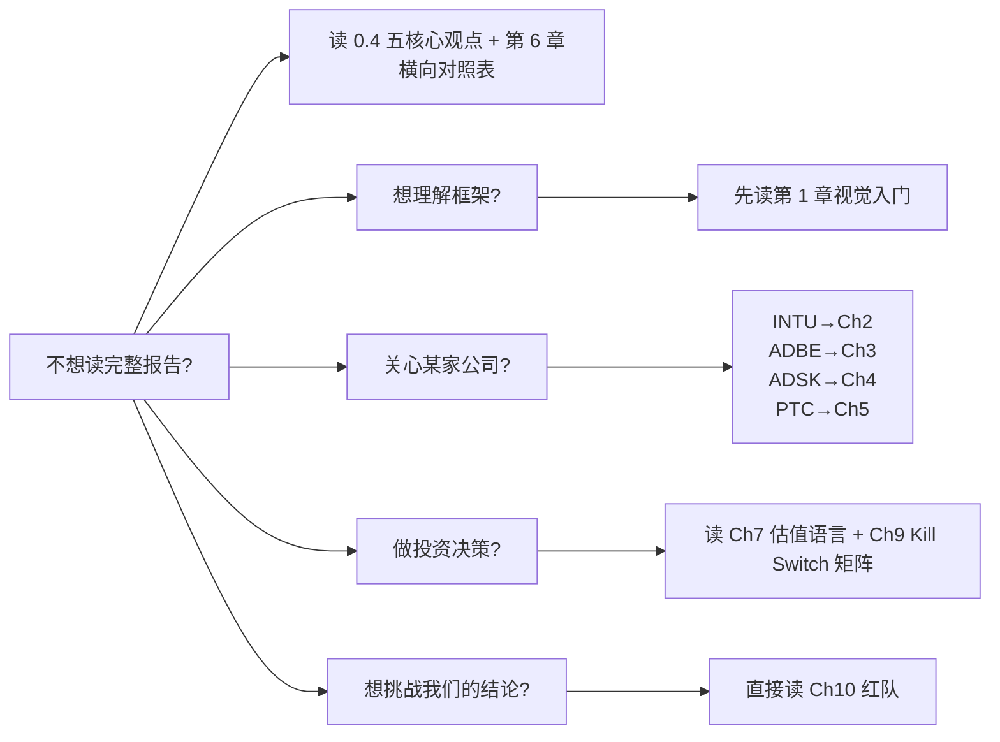

### 0.4 五个核心观点 (先于细节)

| # | 核心观点 | 证据章节 |
|---|---|---|
| **1** | 四家公司不是同一族资产, 是四种不同的控制点层级, 分别对应 `P4 / P1 / P11→P1 / P11` 四种原型 | Ch 1.4 + Ch 6.2 |
| **2** | INTU 的强不只是“功能多”, 而是**责任承接 + 异常兜底 + 默认入口**三件事同时成立；用框架语言写就是 `I4+I7+I8` 三角结构 | Ch 2.4 + Ch 6.1 |
| **3** | ADBE 的 AI 命运是**分裂体**: 六条业务线 AIAS 从 `-9` 到 `+13` 跨 22 档; 若用全公司单一 AIAS 评估, 等于把 CC Consumer 的悲观误传到 Document Cloud 和 GenStudio | Ch 3.1 热力图 |
| **4** | PTC 比 ADSK 更接近 P1 控制层, 不是因为 PTC 更大, 而是因为 PTC 的 `I4 治理` 已吃进 FDA / TÜV / AS9100 的合规栈; ADSK 的 BIM mandate 只是 **客户端** 的 mandate, 不是 **Revit 独占** 的 mandate | Ch 5.4 + Ch 6.1 |
| **5** | 四家公司的估值语言必须分叉: INTU 用 Authority multiple, PTC 用 PEG + control-layer option, ADSK 用 platform-migration multiple, ADBE 用 franchise-defense multiple。用同一个 PE 锚只会持续把钱放错地方 | Ch 7 |

### 0.5 本报告的论证纪律

| 原则 | 应用方式 |
|---|---|
| **机制先于分数** | 每一分 I1-I8 都解释分从哪来、为什么不更高、为什么不更低 |
| **证据先于判断** | 97 个 DM 锚点标注硬数据来源, 避免"感觉上的定性判断" |
| **视觉先于文字** | 38 个 Mermaid 把控制点、飞轮、异议机制可视化; 专业术语首次出现即图解 |
| **BSM 强制** | 任何 >5% 业务线单独分析, 不用整体加权数字掩盖异质结构 |
| **红队独立章节** | 第 10 章专门做 5 组反方攻击, 给出可量化的反转触发 |

### 0.6 术语减压卡

这篇报告术语很多, 但可以先用下面这张表把最关键的几个词翻译成普通中文。  
后面再看到这些词时, 不需要把它们想得太玄。

| 术语 | 这篇里真正的意思 | 可以怎样理解 |
|---|---|---|
| `Authority` | 不只是“能做事”, 而是“出了事也要负责” | 例如报税错了谁赔, 审计来了谁扛 |
| `Control Layer` | 工作流里真正控制流程、权限、审计和状态变化的那一层 | 不是工具栏, 而是“总开关” |
| `Workflow Default` | 用户默认从哪里开始工作 | 第一点击、第一入口 |
| `Stack Coherence` | 数据、执行、治理是否在同一平台闭环 | 不是功能多, 而是能不能串起来 |
| `Sequencing` | 产品变化、收费变化、责任变化有没有同步 | 先做了产品, 还是先拿到了钱和责任 |
| `AI Asymmetry` | AI 最终是帮它, 还是伤它 | 帮它降成本、增粘性, 还是绕过它 |
| `P1 / P4 / P11` | 三种不同的公司原型 | `P1` 是控制层, `P4` 是带责任的权威层, `P11` 是老平台防御型 |

---

## 1. 用这套框架看四家公司: 视觉化入门

> 这一章的任务是让后面所有分析对**第一次接触这套框架**的读者也可用。
> 如果你已经熟悉 8 不变量 + BSM + 原型库, 可以直接跳到 Ch 2。

### 1.0 这一章先解决哪三个问题

| 问题 | 这章给出的答案 |
|---|---|
| 为什么市场总把四家公司看成一类? | 因为常见看法只看增长、毛利和估值, 没有拆业务控制点 |
| 这套框架到底多看了什么? | 多看谁拥有上下文、谁能执行、谁承担责任、谁占住入口 |
| 为什么必须分业务线看, 不能看整体? | 因为 AI 对同一家公司不同业务线的影响可能完全相反 |

### 1.1 市场为什么把四家公司塞进一个桶

四家公司在 2026-04-23 的市场截面长这样:

| 公司 | 股价 | 市值 | 最新 FY 收入 | 最新披露增速 | 表面标签 |
|---|---:|---:|---:|---|---|
| `INTU` | `$408.68` | `$114.4B` | FY2025 `$18.8B` | FY26 Q2 `+17%` | 金融/税务 SaaS |
| `ADBE` | `$255.94` | `$105.1B` | FY2025 `$23.8B` | FY26 Q1 `+12%` | 创意/营销 SaaS |
| `ADSK` | `$247.57` | `$53.2B` | FY2026 `$7.21B` | FY26 `+18%` (有机 `+12-13%`) | 设计/BIM SaaS |
| `PTC` | `$140.60` | `$16.9B` | FY2025 `$2.74B` | FY26 Q1 CC ARR `+8.4%` | 工业软件 SaaS |

表面相似度极高:

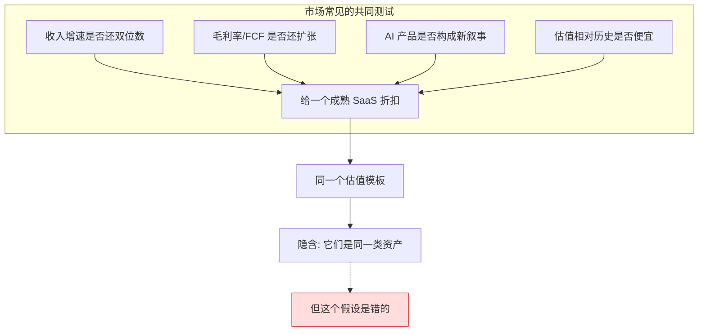

这套模板的问题不是错, 是**停在财务层面的共性**, 没有抓到**业务控制点的分化**。同样是 AI 冲击, 打到 Photoshop / QuickBooks / Revit / Windchill 的方式**完全不同**; 同样是高毛利软件, 谁拥有真实的 `I2 decision context` / `I3 execution` / `I4 authority` / `I8 入口` **差别巨大**。

### 1.2 这套框架如何把四家公司的真实结构解出来

范式转移框架不问"这家公司有没有 AI"或"这家公司是不是被 AI 冲击", 它问的是:

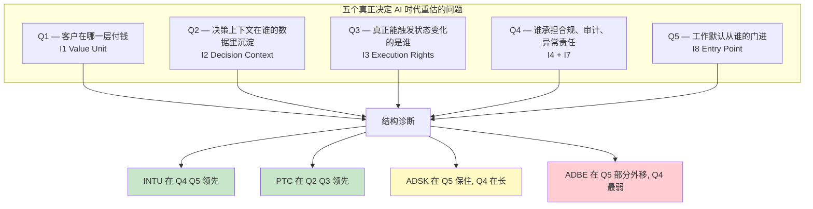

**直觉陷阱**: 把 `AI 增强` 和 `AI 冲击` 简化为单向假设, 是最常见的错误。AI 对一家公司的真实影响取决于五个问题的答案**互相作用**:

- 如果一家公司的 **I2** 沉淀了跨主体、跨周期的历史数据, AI 训练后会让它更强 (INTU 的 GenOS 基于 8.6亿份申报)
- 如果一家公司的 **I4** 承担合规或审计责任, LLM 无法直接取代 (IRS e-filer 身份不能给到 ChatGPT)
- 如果一家公司的 **I8** 在 discovery 层, 最容易被通用 LLM / 新工具切走 (Canva 吃 Express 的逻辑)
- 如果一家公司在 **I3** 真实触发 state change (BOM 改动 / 报税提交 / 施工图签发), 工具可被替代但工作流承接关系难被替代

这就是为什么必须**按控制点拆**而不是**按 AI 标签贴**。

### 1.3 框架入门: 8 不变量视觉化

范式转移框架的起点, 是**把一家公司的价值创造**拆成 8 个不变量 (`I1-I8`)。它们不是财务指标, 而是**业务控制点维度**:

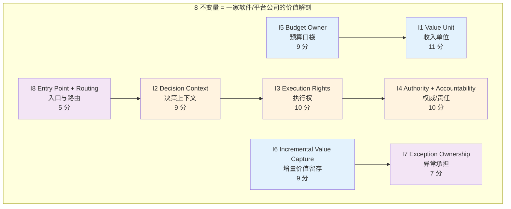

**用一句话理解每个不变量**:

| 不变量 | 通俗问法 | 举例 — INTU 答案 | 举例 — ADBE 答案 |
|---|---|---|---|
| `I1` 收入单位 | 客户付的是"什么" | seat + Live 专家 + CK 金融产品抽佣 | 订阅 access (CC/DC) + GenStudio ARR |
| `I2` 决策上下文 | 决策必须在谁的数据里发生 | 税务/会计/支付数据沉淀 | PSD / AI / PDF 文件格式 + 历史资产 |
| `I3` 执行权 | 谁真正能改变世界的状态 | 报税提交 / 工资发放 / 发票结算 | 创作最终稿 / 签署 PDF / 发布内容 |
| `I4` 权威/责任 | 谁承担合规与后果 | IRS 授权 e-filer, 报税错误 INTU 负责 | 几乎无 (设计不对不担责) |
| `I5` 预算口袋 | 预算从哪一层花出去 | 报税预算 + SMB 财务预算 | 创意 / 营销 / 法律 PDF 预算 |
| `I6` 增量价值留存 | 每多一分钱有多少落到 FCF | 32% FCF Margin | 89% 毛利, 50% OPM |
| `I7` 异常承担 | 出问题谁擦屁股 | 审计协助, 过失保险 | 客户自己处理 |
| `I8` 入口与路由 | 工作流从谁的门进 | 税务季默认入口 + CK 全年入口 | 专业创作入口 (但 discovery 外移) |

### 1.4 原型库: 四家公司对应的四种结构

在 v1.0 原型库中, 四家公司对应四个**不同**的原型:

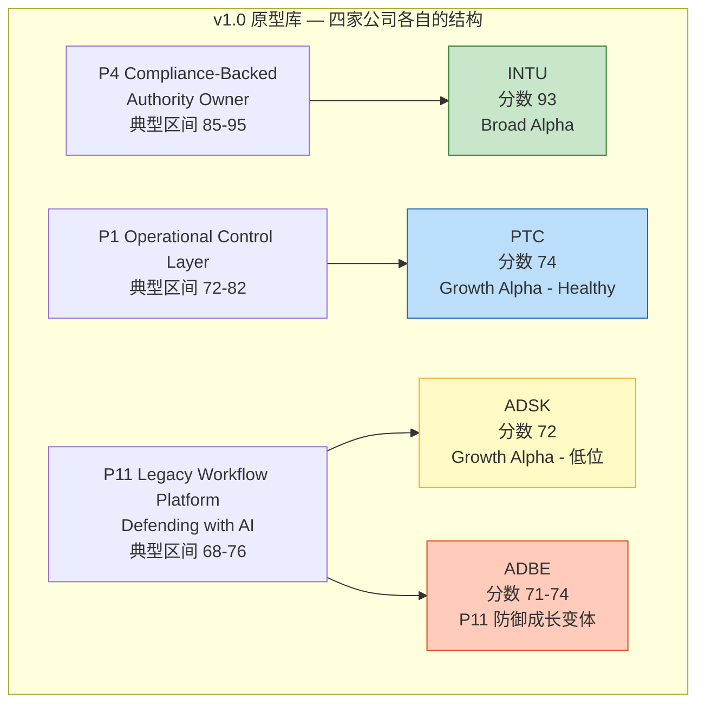

**关键**: ADSK 和 ADBE 虽然都挂 P11, 但位置不同 — ADSK 是 `P11 → P1 迁移路径上的样本`, ADBE 是 `P11 纯防御样本`。本报告第 3 章和第 4 章会把这个差异撕开: 它们的 `I4 / I8 / Stack Coherence` 有 5 分左右的结构性差距, 不能用同一个标签覆盖。

### 1.5 BSM: 为什么"整体口径打分"会骗你

**BSM** (Business Split Mechanism) 是框架的强制纪律: **任何公司收入 >5% 的业务线都必须单独看**, 除非三个触发器全不成立。

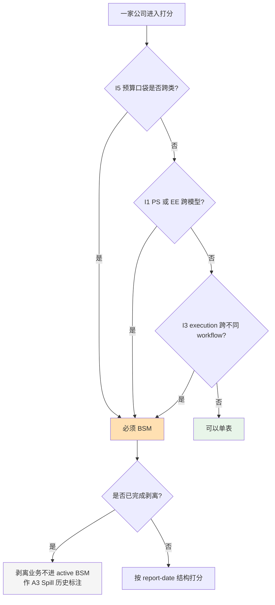

**四家公司的 BSM 命运**:

| 公司 | BSM 判定 | 主要子业务 | 关键注意 |
|---|---|---|---|
| `INTU` | **必须拆** | GBS (含 Mailchimp) / Consumer (TurboTax) / CK / ProTax | FY2026 官方把 Consumer+CK+ProTax 合并为"Consumer"分部, 但 BSM 必须回到原始拆法看控制点 |
| `ADBE` | **必须拆** | CC Pro / CC Consumer / Document Cloud / Firefly / Experience Cloud / Express | 分部只给两大块 (DM/DX), 但内部 AI 命运六条线完全不同 (详见 Ch 3.1) |
| `ADSK` | **必须拆** | AECO / AutoCAD / MFG / M&E | 10-K 披露单一 segment, 但框架要求 product family 拆 |
| `PTC` | **必须拆 (剥离后)** | PLM 家族 / CAD 家族 | Kepware+ThingWorx 已剥离, U7 例外适用; 不应再拖累主体打分 |

不做 BSM 的打分等于在说"INTU 整体 = GBS 的护城河 + CK 的增速 + Mailchimp 的拖累"平均成一个没有意义的中位数。

### 1.6 四道门 + 修正器: 打分不等于结论

框架要求每家公司过四道门:

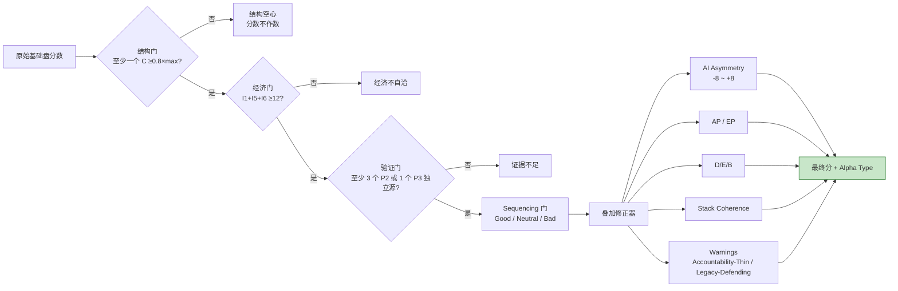

**打分不是结论, 机制才是**。本报告对每家公司的每一分都要求解释清楚: 分从哪里来, 为什么不更高, 为什么不更低。缺了机制, 分数只是数字表演。

---

## 2. INTU — 不是税务软件, 是带 Authority 的 SMB 金融操作系统

> **母命题**: INTU 的真实身份不是"垂直 SaaS 龙头", 而是**同时拥有 `I4 authority`、`I7 exception` 和 `I8 distribution` 三件事的美国 SMB 金融操作系统**。另外三家公司在这三格加起来都打不过 INTU 单项。这是 `P4` 和 `P11` 的根本差异, 也是 INTU 值得被重估的唯一真正理由。

### 2.0 本章先看结论

| 项目 | 结论 |
|---|---|
| 现在最像什么 | **带责任的中小企业金融操作系统**, 不是单点税务软件 |
| 市场最容易看错什么 | 把 INTU 当作“税务季收入股”, 低估它全年金融分发和责任承接 |
| 最强控制点 | `I4 authority`、`I7 exception`、`I8 distribution` 三角一起成立 |
| AI 对它更像什么 | **加速器**。AI 让已有数据和分发更值钱, 而不是直接替代它 |
| 本章要证明什么 | INTU 之所以和另外三家不在一个桶里, 核心不是增长率, 而是责任结构 |

### 2.1 业务五层结构

INTU 在 FY2026 把分部合并成单一 "Consumer" 对外披露, 但结构性地, 它仍然是五层业务:

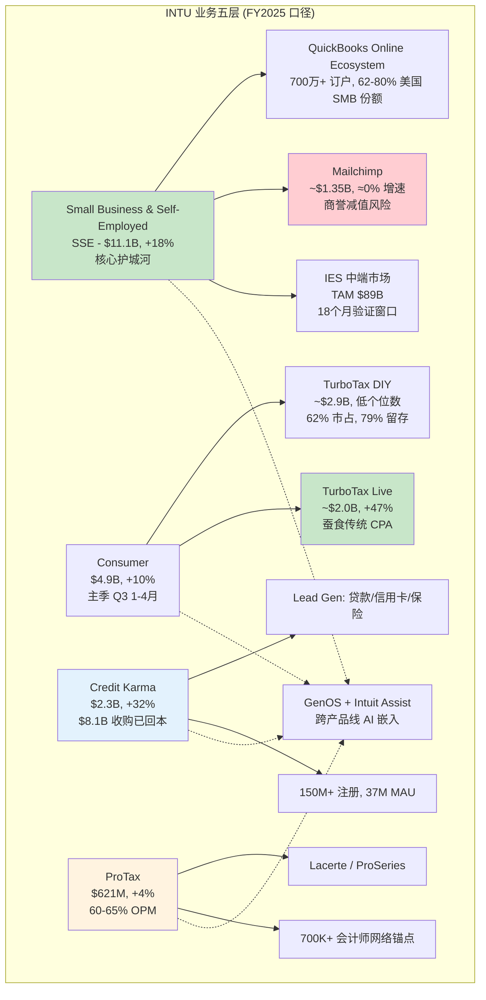

**关键证据**:
- `[DM-SEG-001]` FY2025 GBS $11.1B, +18%
- `[DM-SEG-003]` CK FY2025 $2.3B, +32% (Q2 FY26 +23%)
- `[DM-BIZ-002]` TT Live FY25 +47%, 占 Consumer 收入 41%
- `[DM-BIZ-008]` IES TAM 目标 $89B, 800K 可升级客户
- `[DM-CK-007]` Intuit Assist 金融产品推荐准确率 60% → 78%, 数据交叉在量化级别起效

### 2.2 I1 — 客户到底在为什么付钱

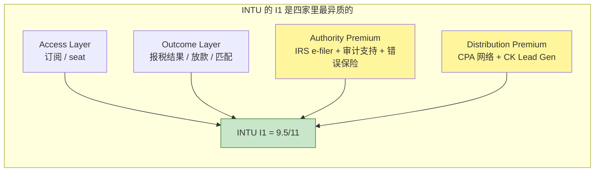

**对比另外三家**: ADBE/ADSK/PTC 都只有 `Access` 这一层 (I1 = 8/11 软顶触发)。只有 INTU 同时有:

- **Outcome** — CK 通过贷款 lead 抽佣, 收入与客户**是否获得贷款**挂钩
- **Authority Premium** — TurboTax Max Defend ($80) / 过失保险 / IRS 授权 e-filer 身份带来的合规溢价
- **Distribution Premium** — 46,000 CPA 事务所 75% 推荐 QuickBooks `[DM-COMP-001]`, 这不是订阅收入, 是分销结构

**这就是为什么 INTU 的 I1 是 9.5/11 而其他三家顶到 8/11**: 它跨越了纯 access 的软顶。

### 2.3 I2 — 最深的金融上下文

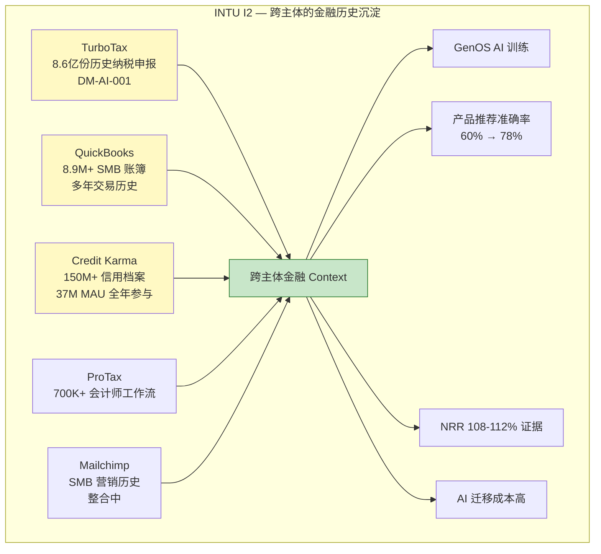

**为什么这格打满 8.5/9**: 没有任何竞品同时拥有**税务 + 会计 + 信用 + 会计师**四个维度的多年历史。Xero 有会计没税务, H&R Block 有税务没全年信用, NerdWallet 有信用但没交易流。INTU 的 I2 是真正意义上的**跨主体跨周期闭环**。

### 2.4 I4 + I7 — INTU 和另外三家的真正鸿沟

**这一小节是整份报告最重要的一段之一**, 因为它解释了为什么 INTU 是 P4 而另外三家都不是。

```mermaid
flowchart TB
    subgraph "谁承接什么责任"
        direction LR
        subgraph "INTU 承接"
            I_REG[IRS 授权 e-filer<br>政府授权壁垒]
            I_MAX[Max Defend 审计辩护<br>付$80 买 INTU 承担]
            I_ACC[Accuracy Guarantee<br>计算错误由 INTU 赔]
            I_IRS[客户被 IRS 查账<br>INTU 派 EA/CPA 协助]
        end

        subgraph "ADBE 承接"
            A_PD[Platform 可用性]
            A_SEC[数据安全]
            A_CP[版权合规 (Firefly IP 赔偿)]
            A_X[客户设计不对?<br>客户自己负责]
        end

        subgraph "ADSK 承接"
            D_PD[Platform 可用性]
            D_V[版本/权限/可用性]
            D_X[工程事故?<br>客户自己负责]
        end

        subgraph "PTC 承接"
            P_PD[Platform 可用性]
            P_TR[Codebeamer 认证<br>TÜV Trusted Tool]
            P_AU[Windchill 审计轨迹]
            P_X[产品召回?<br>客户自己负责]
        end
    end

    style I_REG fill:#c8e6c9
    style I_MAX fill:#c8e6c9
    style I_ACC fill:#c8e6c9
    style I_IRS fill:#c8e6c9
    style A_X fill:#ffcdd2
    style D_X fill:#ffcdd2
    style P_X fill:#ffcdd2
```

**量化对比**:

| 公司 | `I4` 权威/责任 | `I7` 异常承担 | I4 + I7 合计 | I4+I7/combined-max |
|---|---:|---:|---:|---:|
| **INTU** | **8/10** | **5.5/7** | **13.5** | **79%** |
| PTC | 6/10 | 3.5/7 | 9.5 | 56% |
| ADSK | 5/10 | 2.5/7 | 7.5 | 44% |
| ADBE | 4.5/10 | 2.5/7 | 7.0 | 41% |

**结论**: INTU 的 `I4+I7` 合计比第二名 PTC 高 42%。这不是量化差异, **是性质差异**。INTU 真的在**承担责任**, 另外三家在**提供工具**。

**为什么这个差异值钱**:
1. AI 时代工具会被商品化, 但**承担责任**会被溢价。LLM 可以把 PDF 搜索做到 90%, 但 LLM 无法成为 IRS e-filer
2. 工具的迁移成本是"学习新界面", 责任的迁移成本是"重新取得监管授权 + 重建分销网络 + 重买保险精算数据"
3. 市场当前给 INTU 18x PE vs ADBE 9.6x PE 的溢价主要定价了 I1 增速差异, **还没有充分定价 I4 的结构差异**

### 2.5 I8 — 分发网络的双层入口

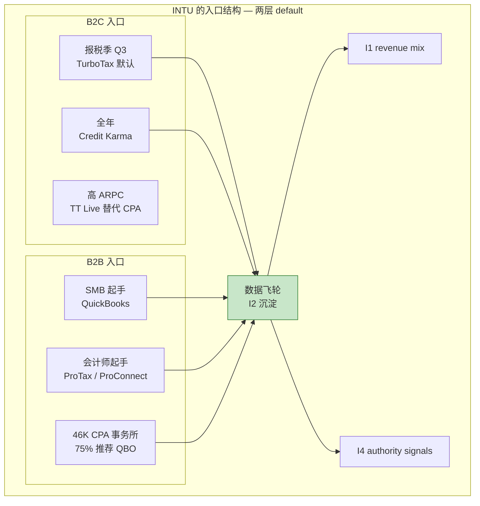

**量化**:
- TurboTax 62% 联邦 e-file 份额 `[DM-COMP-TT1]`
- QuickBooks 62-80% 美国 SMB 份额 `[DM-BIZ-005]`
- 37M MAU Credit Karma 月活
- 46,000 CPA 事务所, 75% 推荐 QuickBooks `[DM-COMP-001]`

**对比**: ADBE 有创意入口但 discovery 外移, ADSK 有 AECO 入口但 discovery 层 AI 威胁中, PTC 是 domain-specific 多入口但 scope 小。只有 INTU 同时在 **B2C (全年 + 税季)** 和 **B2B (SMB + 会计师)** 都有 default 入口。

### 2.6 AI 在 INTU 身上为什么更像加速器而不是替代者

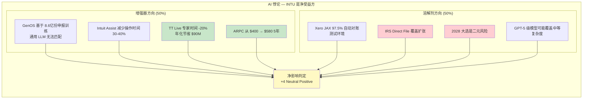

**关键判断**: AI 无法**直接**取代 TurboTax, 因为 TurboTax 的核心价值不是"报税计算能力" (LLM 已经够强), 而是**IRS 授权 + 审计辩护 + 错误保险 + 历史迁移成本**。AI 把 50% 权重压在溶解剂一侧, 但 50% 权重在增强器一侧 (特别是 TT Live 人力替代), 净分 +4 (Neutral Positive)。

### 2.7 INTU 母表

| 不变量 | 分数 | 简短理由 |
|---|---:|---|
| `I1` | `9.5/11` | Access + Outcome (CK) + Authority premium + Distribution premium, **突破 access 软顶** |
| `I2` | `8.5/9` | 跨税务/会计/信用/会计师四维多年历史 |
| `I3` | `8/10` | 报税提交 / 工资发放 / CK 贷款匹配都是真实状态变更 |
| `I4` | `8/10` | IRS e-filer 政府授权 + Max Defend + Accuracy Guarantee |
| `I5` | `8/9` | 报税预算 + SMB 全年财务预算 + 全年信用决策预算 |
| `I6` | `8/9` | 32.3% FCF Margin, 26.1% GAAP OPM, 32.4% Non-GAAP OPM |
| `I7` | `5.5/7` | 审计辩护 + 错误赔付 + 分发责任 |
| `I8` | `4.5/5` | B2C + B2B 双层 default, 跨报税季/全年/会计师网络 |
| **基础盘** | **`60/70`** | — |
| +Stack Coherence | `+2` | I2+I3+I4 强合体 (PLTR 式) |
| +AI Asymmetry | `+4` | Neutral Positive |
| +Sequencing | `+4` | Good |
| +AP/EP | `+10` | 10/10 |
| +D/E/B | `+3` | Execution + CK 扩张腿 |
| +Warnings | `-2` | AI 时间不确定性 |
| **总分** | **`91-93/100`** | **P4 Broad Alpha** |

### 2.8 INTU Kill Switch

| # | 条件 | 当前 | 阈值 | 影响 |
|---|---|---|---|---|
| 1 | TurboTax 市占率崩 | 62% | <55% | I4 结构性下修, P4 → P11 |
| 2 | Direct File 重启并扩展 | 已关闭 | 2028 大选后 >30% 覆盖 | I1 结构性压力 |
| 3 | Mailchimp 减值 | $12B 商誉 | FY26 10-K 披露 | 资本配置信任 |
| 4 | CK 增速持续 <15% | +32% | <15% 2 季度 | 平台叙事失败 |
| 5 | IES 18 个月验证失败 | 待验 | FY27 Q2 检查 | 第二曲线失败 |

---

## 3. ADBE — P11 的标准样本, 也是"AI 分裂体"的教科书

> **母命题**: ADBE 不是死, 也不是赢。它是**六个完全不同的 AI 命运**被市场压成一个 AIAS 分数看待。把六条线分开后, 会看到: **Creative Cloud Consumer 在失血, 但 Document Cloud 和 GenStudio 在吃市场; Firefly 的策略从"造最强模型"变成了"做最好模型超市"**。

### 3.0 本章先看结论

| 项目 | 结论 |
|---|---|
| 现在最像什么 | **老工作流平台用 AI 守住阵地**, 不是单纯 AI 受害者 |
| 市场最容易看错什么 | 用一个总分看 Adobe, 忽略它其实是 6 条 AI 命运完全不同的业务线 |
| 最强控制点 | `I6` 经济引擎和专业工作流的最后交付环节 |
| 最大短板 | `I8` 入口已经部分外移, `I4 / I7` 又偏弱 |
| 本章要证明什么 | Adobe 的关键不是“AI 行不行”, 而是收入结构能否在弱业务被掏空前完成迁移 |

### 3.1 AI 分裂体 — 六业务线热力图

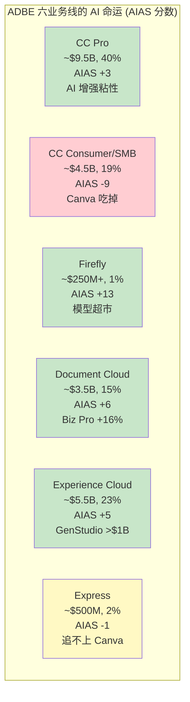

**关键数据** `[证据来源: ADBE v2.0 Complete]`:
- CC Pro: 62% 用户称 Firefly "不可或缺"
- CC Consumer: Canva 265M MAU >> Express 80M MAU `[DM-FVF-003]`
- Firefly: ARR >$250M, QoQ +75% `[DM-BIZ-003]`
- Document Cloud: Business Pro +16% YoY `[DM-FIN-009]`
- GenStudio: ARR >$1B, +30% `[DM-BIZ-004]`, Top 50 客户 90% 采纳 AI-first

**结构性观察**: 把 22 档 AIAS 分数 (从 -9 到 +13) 平均成"全公司 AIAS +0.42 红队修正后"本质上**抹去了信息**。真正的诊断方式是**按业务线赋权看每条线的 AI 命运**, 然后评估收入结构 shift 能否在衰减线被耗尽之前发生 — 这才是 P11 分裂体的正确打开方式。

### 3.2 CC Pro vs CC Consumer 的 AI 命运分叉

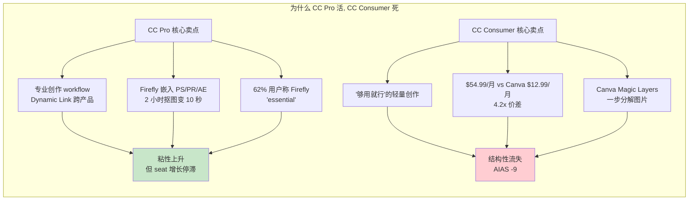

**这张图解释了 P11 防御成长变体的真实含义 — 关键是分清"防御什么 / 不防御什么 / 进攻什么"**:

- **防御**: CC Pro 专业创作 + Document Cloud 企业 PDF + GenStudio 内容供应链
- **不防御 / 认输**: CC Consumer / Express → 让 Canva 吃掉; Adobe 从个人创作者市场**战略撤退**
- **进攻**: Firefly 模型超市 + Experience Cloud agentic automation

### 3.3 I1-I8 母表 + 机制

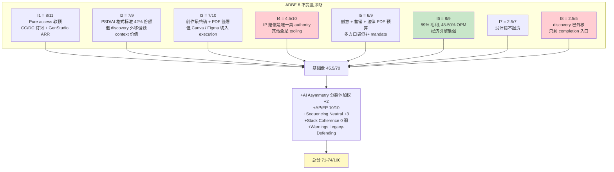

### 3.4 Firefly "模型超市"策略的战略意义

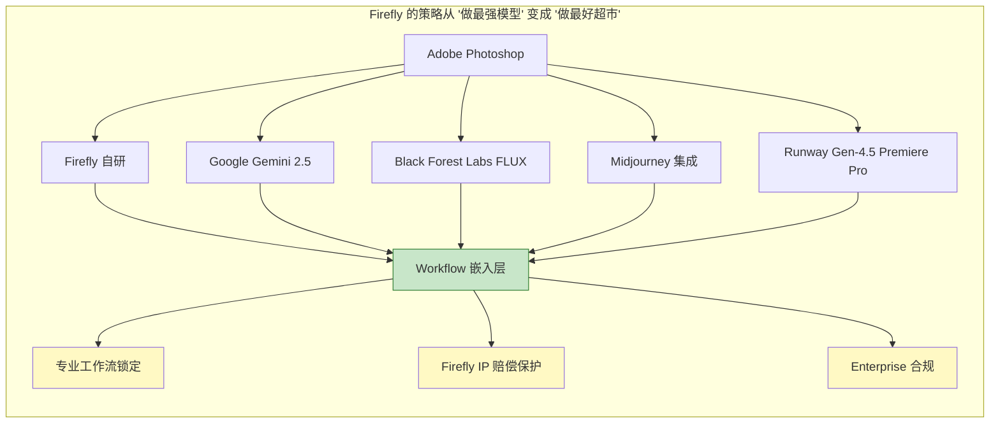

**核心洞察**: 如果 Midjourney 明天出更好的模型, Adobe 只需下一次更新集成进去; **模型是商品, 工作流是基础设施**。这是 Adobe 在 I3 + I8 的真实防御 — 不争"谁的模型最好", 争"谁拥有专业创作流的默认起点和终点"。

### 3.5 为什么 ADBE 的 I8 是四家最弱

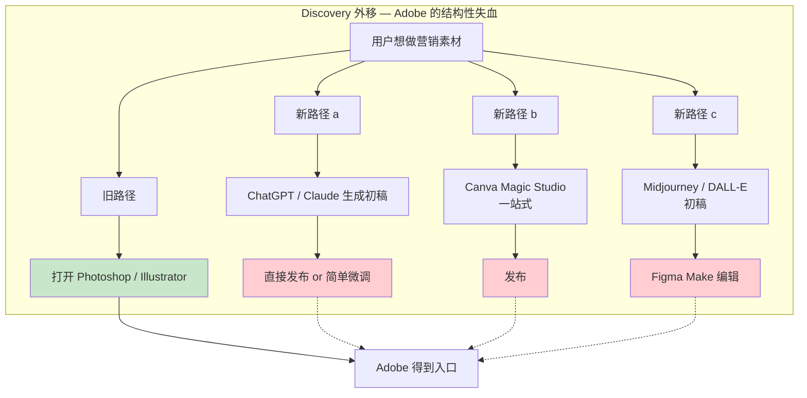

**量化**: Canva 265M MAU vs Express 80M MAU `[DM-FVF-003]`; Midjourney 估算 20M+ 活跃, Runway 数百万。Adobe 在"**工作的第一次点击**"这一步已经丢了大量分流。这就是 I8 从 ADSK 的 4/5 降到 ADBE 的 2.5/5 的核心原因。

### 3.6 ADBE 母表 + 差异化要点

| 不变量 | 分数 | 相对 INTU | 相对 ADSK | 相对 PTC |
|---|---:|---|---|---|
| `I1` | `8/11` | 低 1.5 格 | 持平 | 持平 |
| `I2` | `7/9` | 低 1.5 格 | 持平 (对 Pro) | 持平 |
| `I3` | `7/10` | 低 1 格 | 低 0.5 格 | 低 1 格 |
| `I4` | `4.5/10` | 低 3.5 格 | 低 0.5 格 | 低 1.5 格 |
| `I5` | `6/9` | 低 2 格 | 低 1 格 | 低 1.5 格 |
| `I6` | `8/9` | 持平 | 持平 | 持平 |
| `I7` | `2.5/7` | 低 3 格 | 持平 | 低 1 格 |
| `I8` | `2.5/5` | 低 2 格 | **低 1.5 格** | 低 1.5 格 |
| **基础盘** | **45.5/70** | vs INTU 60 低 14.5 | vs ADSK 49.5 低 4 | vs PTC 53 低 7.5 |

**结构诊断**: ADBE 在 `I6` 持平 (经济引擎同样强), 但在 `I4 / I7 / I8` 全面弱于其他三家。**这就是 P11 的典型症状 — 经济引擎先于控制点下台阶, 用 franchise 质量撑着 PE**。

### 3.7 ADBE Kill Switch

| # | 条件 | 当前 | 阈值 | 影响 |
|---|---|---|---|---|
| 1 | CC Consumer 退订加速 | 稳态 | 单季 >8% 退订 | I8 + I2 进一步塌陷 |
| 2 | Firefly ARR 增速跌破 30% | QoQ +75% | 连续 2 季 <30% | AI 叙事失败 |
| 3 | GenStudio ARR 停在 $1B 不扩 | >$1B +30% | FY28 仍 <$2B | P11 → P6 防御而非进攻 |
| 4 | Canva 推出企业版吃 DX | — | 若 Canva 推出 >$500M ARR 企业 ARR | DX 侧开始失血 |
| 5 | DOJ 和解升级到结构性整改 | $150M | 强制拆分订阅定价 | 品牌信号转负 |

---

## 4. ADSK — Workflow Default 的王者, 正向 Control Layer 上移

> **母命题**: ADSK 和 ADBE 都挂 P11, 但它们不在同一个 P11 位置。**ADBE 是 P11 纯防御样本 (discovery 已外移), ADSK 是 P11→P1 迁移路径上的样本 (discovery 仍保住, authority 在缓慢长出)**。这 5 分左右的结构差距, 如果用单一"P11 防御成长"标签覆盖, 会让投资判断错位。本章把这个差距的证据和机制讲清楚。

### 4.0 本章先看结论

| 项目 | 结论 |
|---|---|
| 现在最像什么 | **默认设计工作流平台**, 正从 P11 往 P1 走 |
| 市场最容易看错什么 | 把 ADSK 和 ADBE 一起打成“AI 压力下的老软件” |
| 最强控制点 | `I8` 默认入口 + `I3` 执行权, 尤其在 AECO / Revit / BIM 工作流中 |
| 最大短板 | `I4` 还不是硬 authority, 更像在慢慢长出来 |
| 本章要证明什么 | ADSK 的价值不只是 Revit 护城河, 而是它仍然占着工作的默认起点 |

### 4.1 Design & Make Platform 四象限

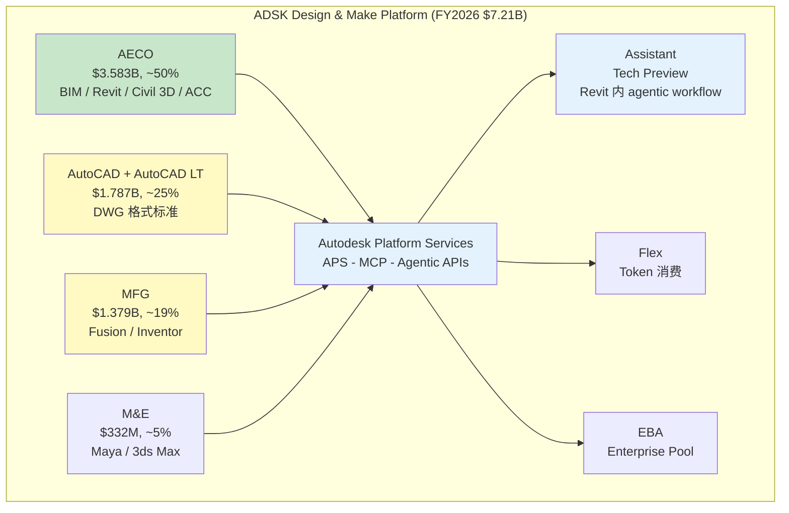

**关键数据**:
- `[DM-GD-001]` FY2027 guidance 收入 +12-13%, FY26 报告 +18% 含计费转型追赶
- 97% 收入为 recurring
- Non-GAAP OPM 38%, FCF Margin 33.4%
- `[DM-BIL-001]` billings +30% 显示新签活跃但有转型噪声

### 4.2 BIM mandate — 保护伞还是被误读?

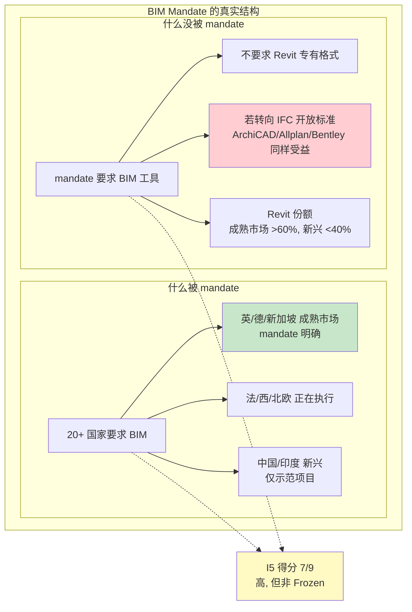

**关键洞察**: mandate 是 **derived protection** 不是 **direct protection**。政府 mandate 的是 BIM workflow, 不是 Revit 产品。这让 ADSK 的 `I5` 比 ADBE 强 1 格但比 PTC 的 Codebeamer FDA-21-CFR-Part-11 / AS9100 合规栈弱 — 因为 PTC 承接的是真的 tooling-for-compliance, ADSK 承接的只是 tooling-for-a-mandate-that-requires-BIM。这一层 derived vs direct 的区分, 是理解 BIM mandate 为什么**只是**高概率护城河而不是确定性护城河的关键。

### 4.3 I1-I8 母表 + 机制

```mermaid
flowchart TB
    subgraph "ADSK 8 不变量诊断"
        I1D[I1 = 8/11<br>Access 软顶<br>Flex/EBA 混入 consumption]
        I2D[I2 = 7.5/9<br>DWG/RVT 历史 + 模型状态<br>比 ADBE 强 0.5 在 'state']
        I3D[I3 = 7.5/10<br>Revit/AutoCAD/Fusion 写入对象<br>+ ACC coordination]
        I4D[I4 = 5/10<br>BIM mandate derived<br>无最终工程责任]
        I5D[I5 = 7/9<br>mandate 加强 + MFG 企业 IT<br>比 ADBE 强 1 格]
        I6D[I6 = 8/9<br>97% recurring, 38% OPM<br>SBC 10.9% 稀释 Owner]
        I7D[I7 = 2.5/7<br>工程事故客户担责]
        I8D[I8 = 4/5<br>专业入口仍 default<br>AutoCAD drafting 有 AI 压力]
    end

    I1D --> BD[基础盘 49.5/70]
    I2D --> BD
    I3D --> BD
    I4D --> BD
    I5D --> BD
    I6D --> BD
    I7D --> BD
    I8D --> BD

    BD --> MD[+AI Asymmetry Neutral+ +6<br>+Sequencing Neutral +3<br>+AP/EP 10/10<br>+Stack Coherence partial +1<br>+D/E/B +2<br>+Legacy-Defending warning]
    MD --> TD[总分 72/100]

    style I8D fill:#c8e6c9
    style I4D fill:#fff9c4
    style TD fill:#fff9c4
```

### 4.4 P11→P1 迁移路径

```mermaid
graph LR
    subgraph "ADSK 的升级路径"
        Now[当前状态<br>P11 + 升级雏形]
        Now --> A[APS + MCP<br>Platform as AI backend]
        Now --> B[Assistant in Revit<br>Tech Preview]
        Now --> C[Make / Construction Cloud<br>快于 Design]
        Now --> D[Fusion mid-market MFG]

        A & B & C & D --> Target[潜在终态<br>P1 Operational Control Layer]

        Target --> Cond1[I3 +0.5 若 Assistant 上线 GA]
        Target --> Cond2[I4 +1 若承接更多治理]
        Target --> Cond3[I8 +0.5 若 APS 变成真 AI backend]
        Target --> Cond4[Stack Coherence +1 若合体]

        Cond1 & Cond2 & Cond3 & Cond4 --> Upside[潜在上修 +3 ~ +5 分<br>接近 PTC 74-76]
    end

    style Now fill:#fff9c4
    style Target fill:#c8e6c9
    style Upside fill:#c8e6c9
```

**关键证据**:
- APS 2025-12-07 更新, 为 agentic AI 提供 data APIs + MCP servers + marketplace + usage model
- Revit Assistant 2026-04-22 Tech Preview 已上线, 可查询模型 / 生成 schedule / 自动化 documentation

### 4.5 为什么 ADSK 比 ADBE "同档更稳"

```mermaid
flowchart LR
    subgraph "同为 P11, 两种命运"
        direction TB
        subgraph "ADBE 的 P11"
            A1[Discovery 已外移 ★★★]
            A2[AI 冲击打在消费端]
            A3[Canva/Figma 真实侵蚀市占]
            A4[Stack Coherence 弱]
        end

        subgraph "ADSK 的 P11"
            D1[Discovery 基本保留 ★]
            D2[AI 先在 AECO 内生长]
            D3[AutoCAD drafting 有压力<br>但无替代]
            D4[Stack Coherence partial +1]
        end
    end

    A1 & A2 & A3 & A4 --> AC[ADBE I8 = 2.5/5<br>需要守住 completion]
    D1 & D2 & D3 & D4 --> DC[ADSK I8 = 4/5<br>仍握 initiation]

    style AC fill:#ffcdd2
    style DC fill:#c8e6c9
```

### 4.6 ADSK Kill Switch

| # | 条件 | 当前 | 阈值 | 影响 |
|---|---|---|---|---|
| 1 | Revit BIM 份额 | 63.5% | <55% | I3+I2 结构性下修 |
| 2 | BIM mandate 转向 IFC 主流 | 未发生 | 3 大市场官方支持 IFC | I5 从 7 降至 5 |
| 3 | AutoCAD seat YoY 下滑 | 稳态 | 连续 2 季 >5% | I8 从 4 降至 2, AI Asymmetry 转负 |
| 4 | AECO 增速 | +11% (从 +15% 降) | <8% | I5 + I8 联动下修 |
| 5 | MFG Fusion vs PTC Creo 份额 | 持平 | 落后 10pp+ | MFG 腿失速 |

---

## 5. PTC — 四家里最像"真正控制层"的工业软件

> **母命题**: PTC 不是工业软件拼盘, 不是单纯 CAD 公司, 也不只是 PLM 订阅商。**剥离 Kepware/ThingWorx 后, 它正在把 `PLM + ALM + SLM + cloud CAD` 收敛到 `Intelligent Product Lifecycle Layer`**。这是四家公司里唯一**主原型是 P1 而非 P11** 的公司。Owner Economics 最清洁 (SBC 4.8%), `I4` 已经吃进 TÜV Trusted Tool 和 FDA 21 CFR Part 11 的治理栈。

### 5.0 本章先看结论

| 项目 | 结论 |
|---|---|
| 现在最像什么 | **有治理能力的工业工作流控制层**, 不是 CAD 拼盘 |
| 市场最容易看错什么 | 只把 PTC 看成工业软件组合, 没看到它在生命周期治理层上的合体 |
| 最强控制点 | `I2 + I3 + I4` 结合得最完整, 尤其是产品变更和合规流程 |
| 最大短板 | 规模和默认入口弱于 INTU, 还没到 Broad Alpha |
| 本章要证明什么 | PTC 比 ADSK 更接近真正的控制层, 关键不在规模而在治理深度 |

### 5.1 Intelligent Product Lifecycle — 跨设计/变更/服务的统一控制层

```mermaid
flowchart TB
    subgraph "PTC FY2025 主体 (剥离 Kepware+ThingWorx 后)"
        CAD[CAD Family $993M 38%]
        CAD --> Creo[Creo<br>企业级 parametric CAD]
        CAD --> Onshape[Onshape<br>cloud-native CAD/PDM]

        PLM[PLM Family $1.639B 62%]
        PLM --> Windchill[Windchill<br>BOM/Change/ECO/审批流]
        PLM --> Arena[Arena<br>cloud PLM]
        PLM --> CB[Codebeamer<br>ALM/Requirements/Traceability<br>TÜV Trusted Tool]
        PLM --> SM[ServiceMax<br>SLM/dispatch/work order]
        PLM --> Sg[Servigistics<br>service planning]

        CAD --> IPL[Intelligent Product Lifecycle<br>控制层]
        PLM --> IPL

        IPL --> AI1[Onshape AI Advisor]
        IPL --> AI2[Windchill AI]
        IPL --> AI3[Codebeamer AI]
        IPL --> AI4[ServiceMax AI multi-agent]
    end

    style IPL fill:#c8e6c9,stroke:#2e7d32
    style PLM fill:#e3f2fd
    style Windchill fill:#e3f2fd
    style CB fill:#e3f2fd
```

**关键数据**:
- FY2025 Revenue $2.74B, ARR $2.479B, recurring $2.601B
- Non-GAAP OPM **48%** (四家最高)
- SBC/Revenue **4.8%** (四家最低, ADSK 10.9% 的一半)
- FCF $857M, FY26 指引 $850M (excl. divested)
- 2026-03-16 Kepware+ThingWorx 剥离完成, Net Debt/EBITDA 从 2.28x 降至 1.05x

### 5.2 IoT 剥离前后的 BSM 结构对比

```mermaid
flowchart LR
    subgraph "剥离前 (FY2025)"
        B_CAD[CAD ~35%]
        B_PLM[PLM ~40%]
        B_ALM[ALM/Codebeamer ~10%]
        B_SLM[SLM/ServiceMax ~10%]
        B_IoT[IoT ~5-8%<br>ThingWorx/Kepware]
    end

    subgraph "剥离后 (FY2026)"
        A_CAD[CAD 38%]
        A_PLM[PLM 62%<br>含 ALM+SLM]
    end

    B_IoT -.->|A3 Spill<br>U7 例外| Drop[不进 active BSM]
    B_CAD --> A_CAD
    B_PLM --> A_PLM
    B_ALM --> A_PLM
    B_SLM --> A_PLM

    A_CAD --> P11[P11 属性 38%]
    A_PLM --> P1[P1 属性 62%]

    style Drop fill:#eeeeee
    style P1 fill:#c8e6c9
    style P11 fill:#fff9c4
```

**关键观察**: IoT 剥离的真正价值不是"增速提升 0.5pp", 而是**主体结构纯化** — PLM 家族成为 62% 主体, P1 属性压过 P11。这是为什么不能只看剥离前后的 ARR 差 (仅 50bp) 来判断剥离价值; 真正的变化是**原型重心转移**, 这对估值语言选择影响远大于 50bp ARR。

### 5.3 Windchill — Governed Execution 的机制

```mermaid
sequenceDiagram
    participant Eng as 工程师
    participant CAD as Creo/Onshape
    participant WC as Windchill
    participant Qua as 质量部
    participant Reg as 监管审计

    Eng->>CAD: 修改零件设计
    CAD->>WC: 写入新版本 BOM
    WC->>WC: 触发 ECO 流程
    WC->>Qua: 审批请求
    Qua->>WC: 批准 / 驳回
    Note over WC: 所有变更<br>auditable trail
    WC->>Eng: Release to Manufacturing
    WC->>Reg: FDA 21 CFR Part 11<br>AS9100 审计记录
    Reg-->>WC: Trusted Tool 认证
```

**为什么这是 governed execution 而不是 tool**:
1. **变更不是建议, 是真实状态改动**: BOM / part master / ECO 在 Windchill 中是 single source of truth
2. **审计栈嵌入**: TÜV 认证 Codebeamer 为 Trusted Tool, 满足 IEC 62304 / ISO 26262 / FDA 21 CFR Part 11
3. **BMW 案例** (2026-04-01): BMW Group 企业级标准化 Codebeamer 说明"受治理的需求工程"在大客户内已标准化

### 5.4 `I4` — PTC 比 ADSK 强在哪

```mermaid
graph TB
    subgraph "I4 Authority 的四层梯度"
        L1[Level 1: Tool 层<br>提供功能]
        L2[Level 2: Tooling for Compliance<br>提供审计工具]
        L3[Level 3: Derived Compliance<br>用户因法规必须用你]
        L4[Level 4: Direct Authority<br>你承担后果责任]

        ADB[ADBE] --> L1
        ADB -.-> L2[IP 赔偿 Firefly]

        ADSK[ADSK] --> L2
        ADSK --> L3[BIM mandate 客户侧 derived]

        PTC[PTC] --> L2
        PTC --> L3[FDA 21 CFR Part 11 客户 derived<br>TÜV Trusted Tool 第三方认证]

        INTU[INTU] --> L3
        INTU --> L4[IRS e-filer 授权<br>Max Defend 赔付<br>Accuracy Guarantee]
    end

    style L1 fill:#ffcdd2
    style L2 fill:#fff9c4
    style L3 fill:#c8e6c9
    style L4 fill:#2e7d32,color:#fff
```

**量化**:

| 公司 | I4 Level 位置 | I4 分数 | 证据锚点 |
|---|---|---:|---|
| ADBE | L1 + 微 L2 | 4.5/10 | IP 赔偿, 其他全是工具 |
| ADSK | L2 + 轻 L3 | 5/10 | BIM mandate derived |
| PTC | L2 + L3 + 第三方认证 | 6/10 | TÜV Trusted Tool + BMW 标准化 + AS9100 支撑 |
| INTU | L3 + L4 | 8/10 | IRS 授权 + Max Defend + Accuracy Guarantee |

### 5.5 I6 Owner Economics — PTC 是四家最干净的

```mermaid
flowchart LR
    subgraph "SBC/Revenue 对比 (FY25)"
        P[PTC 4.8%]
        A[ADSK 10.9%]
        AD[ADBE ~10-11%]
        IN[INTU 10.4%]
    end

    P -.-> PE[Owner PE ≈ Standard PE]
    A -.-> AE[Owner PE 37x vs Std 19x<br>2x 差距]
    AD -.-> AdE[Owner PE 扩张 ~30%]
    IN -.-> InE[Owner PE 扩张 ~30%]

    style P fill:#c8e6c9
    style PE fill:#c8e6c9
    style A fill:#ffcdd2
    style AE fill:#ffcdd2
```

**结构性含义**: PTC 的 Non-GAAP OPM 48% 几乎**就是**真实 Owner OPM, 另外三家的 Non-GAAP OPM 要打 SBC 折扣。这就是为什么 PTC FWD PE 19.4x 不算便宜 — 它的 "Standard PE" 本身就是 "Owner PE"。

### 5.6 PTC 母表

| 不变量 | 分数 | 简短理由 |
|---|---:|---|
| `I1` | `8/11` | Access 软顶, recurring 质量高 |
| `I2` | `8/9` | Product data foundation, lifecycle context |
| `I3` | `8/10` | Governed execution 已成形 |
| `I4` | `6/10` | L2+L3, 第三方认证加持 |
| `I5` | `7.5/9` | 工程+合规+服务多口袋 |
| `I6` | `8/9` | 48% OPM, SBC 4.8% 最干净 |
| `I7` | `3.5/7` | 比 ADSK/ADBE 强 |
| `I8` | `4/5` | 多 domain workflow initiation |
| **基础盘** | **`53/70`** | — |
| +Stack Coherence partial | `+1` | — |
| +AI Asymmetry Neutral+ | `+6` | — |
| +Sequencing Neutral | `+3` | — |
| +AP/EP 10/10 | `+10` | — |
| +D/E/B 平衡 | `+1` | — |
| **总分** | **`74/100`** | **Growth Alpha - Healthy 中低位** |

### 5.7 PTC Kill Switch

| # | 条件 | 当前 | 阈值 | 影响 |
|---|---|---|---|---|
| 1 | PLM family ARR 增速 | +9% | <7% 2 季度 | P1 叙事弱化 |
| 2 | Onshape ARR | — | <$150M 2027 | CAD 侧 transition 失速 |
| 3 | ServiceMax ARR | ~$400M | 同比转负 | SLM 腿失速 |
| 4 | AI 长期停在辅助问答 | 辅助 + 早期 agent | 12 月无 governed action 升级 | control layer 上移停滞 |
| 5 | OPM 回落 | 35.9% | <28% | 高 OPM 不可持续确认 |

---

## 6. 四家公司的横向对照 — 把 8 不变量摆在同一张桌子上

### 6.0 这一章怎么读最快

如果你已经读完前面四章, 这一章的作用是把所有判断压回同一张桌子。  
如果你没时间看全文, 那就重点看三张表:

1. `6.1` — 四家公司 8 不变量总表  
2. `6.2` — 谁占住了哪一层控制点  
3. `6.5 / 6.6` — 预算质量、验证质量和扩张质量

这三张表合起来, 基本就等于整份报告的“压缩版结论”。

### 6.1 8 不变量对照表

| 不变量 | INTU | ADBE | ADSK | PTC | 最强者 |
|---|---:|---:|---:|---:|---|
| `I1` Value Unit | **9.5/11** | 8/11 | 8/11 | 8/11 | **INTU** (突破 access 软顶) |
| `I2` Decision Context | **8.5/9** | 7/9 | 7.5/9 | 8/9 | **INTU** (跨主体金融历史) |
| `I3` Execution Rights | 8/10 | 7/10 | 7.5/10 | **8/10** | 并列 INTU/PTC |
| `I4` Authority | **8/10** | 4.5/10 | 5/10 | 6/10 | **INTU** (L3+L4) |
| `I5` Budget Owner | **8/9** | 6/9 | 7/9 | 7.5/9 | **INTU** |
| `I6` Incremental Capture | 8/9 | 8/9 | 8/9 | **8/9** | 并列 (但 PTC 最干净) |
| `I7` Exception Ownership | **5.5/7** | 2.5/7 | 2.5/7 | 3.5/7 | **INTU** |
| `I8` Entry Point | **4.5/5** | 2.5/5 | 4/5 | 4/5 | **INTU** (双层 default) |
| **基础盘** | **60/70** | 45.5/70 | 49.5/70 | 53/70 | INTU 领先 7-15 格 |
| **修正后总分** | **91-93** | 71-74 | 72 | 74 | INTU |
| **Alpha 类型** | **Broad** | P11 防御成长 | Growth Healthy 低位 | Growth Healthy 中低位 | — |
| **原型** | **P4** | **P11** | **P11→P1** | **P1** | — |

### 6.2 控制点分层 — 谁拥有哪一层

```mermaid
flowchart LR
    subgraph "Workflow 的四层控制点 (AI 重要变化)"
        S1[Discovery<br>灵感/初步探索]
        S2[Workflow Initiation<br>正式工作开始]
        S3[Execution Routing<br>真实状态改动]
        S4[Transaction Completion<br>终态交付]
        S5[Post-action<br>数据反馈/异常处理]

        S1 --> S2 --> S3 --> S4 --> S5
    end

    S1 -.-> EX[外部 LLM<br>ChatGPT/Claude]
    S2 --> IN1[INTU 税季+SMB]
    S2 --> AD1[ADSK AECO]
    S2 --> PT1[PTC Windchill]
    S2 -.-> ADB1[ADBE 部分流失]

    S3 --> IN2[INTU 报税/支付]
    S3 --> AD2[ADSK Revit]
    S3 --> PT2[PTC Windchill ECO]
    S3 --> ADB2[ADBE 创作]

    S4 --> IN3[INTU 提交 IRS]
    S4 --> AD3[ADSK 施工图]
    S4 --> PT3[PTC Release to MFG]
    S4 --> ADB3[ADBE 发布]

    S5 --> IN4[INTU 审计辩护]
    S5 --> PT4[PTC ServiceMax]

    style IN1 fill:#c8e6c9
    style IN2 fill:#c8e6c9
    style IN3 fill:#c8e6c9
    style IN4 fill:#c8e6c9
    style ADB1 fill:#ffcdd2
```

**关键观察**:
1. **S1 Discovery 集体流失给 LLM** — 四家都在受压, ADBE 最严重
2. **S2 Initiation** — INTU/ADSK/PTC 保住, ADBE 部分流失 (Canva/Figma)
3. **S3 Execution** — 四家都还保住, 因为真实 state change 仍需专业工具
4. **S4 Completion** — 四家都保住, 这是 P11 防御的根本
5. **S5 Post-action** — **只有 INTU 和 PTC 有实质覆盖**, ADBE/ADSK 几乎缺席

### 6.3 AI Asymmetry 光谱

```mermaid
graph LR
    subgraph "AI Asymmetry 六档 (分数)"
        A1[Accretive +8]
        A2[Neutral Positive +6]
        A3[Neutral +4]
        A4[Passthrough 0]
        A5[Exposed -4]
        A6[Victim -8]
    end

    INTU[INTU] -.-> A3
    PTC[PTC] -.-> A2
    ADSK[ADSK] -.-> A2
    ADBE[ADBE 分裂体] -.-> A4
    ADBE -.->|CC Consumer 子线| A5

    style INTU fill:#c8e6c9
    style PTC fill:#c8e6c9
    style ADSK fill:#c8e6c9
    style ADBE fill:#fff9c4
```

**核心洞察**: 把 ADBE 放成单一分数会高估真实风险。六条业务线中最差的 -9, 最好的 +13, 加权后 +0.42, 是**分裂体中枢**; 投资含义取决于 `GenStudio / DC / Firefly` 的绝对规模能否在 CC Consumer 塌下来之前把收入 mix shift 过去。

### 6.4 Sequencing Gate 对照

```mermaid
flowchart TB
    subgraph "Sequencing 门的四种状态"
        direction LR
        G[Good — 工艺先于定价<br>+4]
        N[Neutral — 无明显错层<br>+3]
        IN[Industry-Neutral — 同行业都这样<br>+2]
        B[Bad — 定价先于工艺<br>-2 ~ 0]
    end

    INTU[INTU] --> G
    PTC[PTC] --> N
    ADSK[ADSK] --> N
    ADBE[ADBE] --> N

    style G fill:#2e7d32,color:#fff
    style B fill:#c62828,color:#fff
    style INTU fill:#c8e6c9
```

**为什么 INTU 是 Good**:
- `I1 vs I6`: Outcome + Authority 溢价已在 CK/TT Live 真实货币化, 不只是叙事
- `I8 vs I5`: Distribution (CPA 网络) 已带来 B2B 预算, 非单纯故事
- `I3 vs I4`: Authority 与 Execution 同步强化

**为什么另外三家是 Neutral 不是 Good**: 都有"工艺强于定价"的结构 (I6 高), 但**定价尚未真正货币化新层级**。ADBE 有 GenStudio 雏形但仅 $1B, ADSK 有 APS/Flex 但仍边缘, PTC 有 Onshape+Codebeamer 但 CAD 腿仍 P11。

### 6.5 预算口袋质量排序

```mermaid
graph LR
    subgraph "I5 的质量梯度"
        F1[Frozen pocket<br>监管/物理不可替代]
        F2[Structural pocket<br>行业标准加持]
        F3[Professional pocket<br>高价值但可替代]
        F4[General pocket<br>IT 预算常规项]
    end

    INTU[INTU 8/9] --> F1
    PTC[PTC 7.5/9] --> F2
    ADSK[ADSK 7/9] --> F2
    ADBE[ADBE 6/9] --> F3
    ADBE --> F4

    style INTU fill:#c8e6c9
    style PTC fill:#fff9c4
    style ADSK fill:#fff9c4
    style ADBE fill:#ffcdd2
```

### 6.6 AP / EP / D / E / B 对照

| 维度 | INTU | ADBE | ADSK | PTC |
|---|:---:|:---:|:---:|:---:|
| **AP** (Adoption Proof) | 5/5 | 5/5 | 5/5 | 5/5 |
| **EP** (Economic Proof) | 5/5 | 5/5 | 5/5 | 5/5 |
| **D** (Depth) | 3/3 | 2/3 | 2/3 | 3/3 |
| **E** (Expansion) | 3/3 | 2/3 | 2/3 | 2/3 |
| **B** (Bridge) | 3/3 | 2/3 | 2/3 | 2/3 |
| **Stack Coherence** | +2 strong | 0 | +1 partial | +1 partial |
| **Burden** | 0 | 0 | 0 | 0 |
| **Legacy-Defending** | No | Yes | Yes | Partial |

---

## 7. 估值语言必须跟着业务控制点走

> **核心观点**: 四家公司在"新控制点"上占据不同层级, 强行用同一个 PE 语言等于在比较四种不同的错误。本章为每家公司给出一个**估值锚 + 公允倍数区间 + 调整理由**。

### 7.1 为什么不能再用同一个 PE

```mermaid
flowchart LR
    subgraph "旧 PE 语言的系统性错误"
        PE[统一 PE 锚]
        PE --> E1[对 INTU<br>忽略 authority 溢价<br>结果: 低估 15-25%]
        PE --> E2[对 ADBE<br>忽略分裂体<br>结果: 可能低估也可能高估<br>看 DC/GenStudio 兑现]
        PE --> E3[对 ADSK<br>忽略 platform 上移期权<br>结果: 稍低估 5-10%]
        PE --> E4[对 PTC<br>忽略 Owner Economics 洁净<br>结果: Owner PE 19x 其实不贵]
    end

    style E1 fill:#c8e6c9
    style E2 fill:#fff9c4
    style E3 fill:#fff9c4
    style E4 fill:#c8e6c9
```

### 7.2 INTU 的估值语言 — Authority Owner Multiple

**估值锚**: 把 INTU 对标 `FICO / Moody's / MSCI` 级别的 authority owner, 而不是 `CRM / ADBE` 级别的软件龙头。

```mermaid
flowchart TB
    subgraph "INTU 估值三层"
        L1[核心工具 Revenue<br>SSE + Consumer + ProTax<br>PE 18-22x]
        L2[Authority Premium<br>TT Max Defend + IRS 授权<br>+25% premium]
        L3[Distribution Premium<br>CPA 网络 + CK Lead Gen<br>+15% premium]

        L1 --> M[Multiple 25-30x<br>FICO 范围]
        L2 --> M
        L3 --> M

        M --> V[SOTP 中枢 $490<br>v3.0 报告确认]
        M --> Range[合理区间 $480-550<br>偏积极 10-20% vs 当前]
    end

    style M fill:#c8e6c9
    style V fill:#fff9c4
```

### 7.3 ADBE 的估值语言 — Franchise Defense Multiple

**估值锚**: ADBE 不应按"AI 创意软件"估, 应按"legacy franchise 质量 + AI 雏形期权"分层估。

```mermaid
flowchart TB
    subgraph "ADBE 估值分层"
        CORE[Core Franchise<br>CC Pro + Document Cloud<br>占 55% 收入]
        CORE --> CMul[PE 12-16x<br>成熟 franchise]

        RISK[Risk Franchise<br>CC Consumer + Express<br>占 21% 收入]
        RISK --> RMul[PE 8-10x<br>AI 风险折价]

        OPT[Option Franchise<br>Firefly + GenStudio + Experience<br>占 24% 收入]
        OPT --> OMul[PE 20-30x<br>期权溢价]

        CMul --> W[加权 PE 14-18x<br>中枢]
        RMul --> W
        OMul --> W
    end

    style CORE fill:#c8e6c9
    style OPT fill:#fff9c4
    style RISK fill:#ffcdd2
    style W fill:#fff9c4
```

**关键含义**: 当前 9.6x PE **可能便宜**, 但便宜的程度取决于 GenStudio 能否在 FY28 到 $2B (管理层目标) — 这是一个 CQ2 (分裂体中轴能否向 Option 侧倾斜)。

### 7.4 ADSK 的估值语言 — Platform Migration Multiple

**估值锚**: ADSK 应按"strong workflow default franchise + P1 迁移期权"估, 不按纯 CAD seat.

```mermaid
flowchart LR
    subgraph "ADSK 估值双情景"
        S1[情景 A: 单引擎成熟<br>AECO 增速继续降<br>MFG 落后 PTC]
        S1 --> V1[公允 $190<br>PE 16-18x]

        S2[情景 B: 多引擎增长重加速<br>APS+Assistant 成功<br>MFG+水务补 AECO]
        S2 --> V2[公允 $300<br>PE 22-24x]

        S1 -.-> R[中枢 $245-260<br>当前 $247.57<br>关注下沿]
        S2 -.-> R
    end

    style V1 fill:#ffcdd2
    style V2 fill:#c8e6c9
    style R fill:#fff9c4
```

### 7.5 PTC 的估值语言 — PEG + Control Layer Option

**估值锚**: PTC 的 Non-GAAP PE 已经约等于 Owner PE, 所以 19.4x 看起来合理 — 但**市场没定价 P1 control layer 的期权**。

```mermaid
flowchart TB
    subgraph "PTC 估值 = 基础 + 期权"
        Base[Base Case<br>ARR 8-9% 永续<br>FY2026 FCF $850M<br>PEG 2.3x 与 ADSK 一致]
        Base --> BV[公允 $145-155<br>当前 $140.60 ≈ 中性]

        Opt[Optionality<br>P1 深化<br>+2~+4 分]
        Opt --> OV[若实现 +10-20%]

        Opt2[Optionality<br>Onshape 成为 cloud control surface<br>+2~+3 分]
        Opt2 --> OV2[若实现 +5-15%]

        Base --> Total[合理区间 $140-180]
        Opt --> Total
        Opt2 --> Total
    end

    style Total fill:#fff9c4
```

### 7.6 四家公司估值语言对照表

| 公司 | 估值锚 | 合理 PE 范围 | 关键期权 | 当前 PE vs 锚位置 |
|---|---|---|---|---|
| INTU | Authority Owner | 25-30x | CK/IES 第二曲线 | 18x → **偏低 15-25%** |
| ADBE | Franchise Defense | 14-18x 加权 | GenStudio $2B 里程碑 | 9.6x → **可能低估, 看兑现** |
| ADSK | Platform Migration | 19-24x | APS/Assistant 成功 | 19x → **下沿关注** |
| PTC | PEG + Control Layer Option | 19-24x | P1 深化 | 19.4x → **基础合理, 期权未定价** |

---

## 8. 五种最容易被误判的事

### 8.1 误判 1 — "INTU 只是税务软件, 会被 Direct File 和 AI 报税打穿"

```mermaid
flowchart LR
    subgraph "Direct File 威胁的真实结构"
        DF[IRS Direct File]
        DF --> W[TurboTax 会被颠覆吗?]
        W -->|2026 年| NO1[已关闭<br>短期不威胁]
        W -->|2028 大选| Q1[民主党胜: 可能扩大]
        Q1 --> P1a[TAM 压缩 10-20%]
        W -->|长期| Q2[AI 能力提升<br>GPT-5 级模型]
        Q2 --> P2[简单报税可能免费]

        NO1 -.-> FC[但 TT Live +47% 在蚕食 CPA 市场]
        P1a -.-> FC
        P2 -.-> FC

        FC --> Real[真实风险: TT 萎缩 20-30%<br>但 CK + SSE 平台可补]
    end

    style Real fill:#fff9c4
```

**反证据**: TurboTax 占 INTU 总收入 35-40%, 即使 TT 收入下降 30%, 整体营收影响约 -10-12%。CK +32% + SSE +18% 可在 2-3 年内补齐。

### 8.2 误判 2 — "ADBE 的护城河被 AI 打穿了"

```mermaid
graph LR
    subgraph "AI 对 ADBE 的分层影响"
        I[AI 冲击]
        I --> X1[Discovery 夺走<br>真实]
        I --> X2[CC Consumer 被 Canva 吃<br>真实]
        I --> X3[CC Pro 专业工作流<br>AI 增强粘性]
        I --> X4[Document Cloud<br>AI 让 PDF 更关键]
        I --> X5[GenStudio 企业内容治理<br>AI 创造新市场]
    end

    X1 -.->|真| CON1[- 缺一个 discovery 入口]
    X2 -.->|真| CON2[- 19% 收入在失血]
    X3 -.->|假| CON3[+ 专业仍守住]
    X4 -.->|假| CON4[+ 15% 收入最快增长]
    X5 -.->|假| CON5[+ $1B ARR 雏形]

    style CON1 fill:#ffcdd2
    style CON2 fill:#ffcdd2
    style CON3 fill:#c8e6c9
    style CON4 fill:#c8e6c9
    style CON5 fill:#c8e6c9
```

**反证据**: DC +16%, GenStudio >$1B +30%, Firefly >$250M QoQ+75%。"AI 打穿 Adobe"的叙事**只对 21% 的收入成立**, 79% 的收入在受益或稳定。

### 8.3 误判 3 — "ADSK 的 BIM mandate 是永久护城河"

```mermaid
flowchart TB
    M[BIM Mandate 护城河]
    M --> L1[保证: BIM 需求永存]
    M --> L2[不保证: Revit 必须用]

    L2 --> IFC[若 IFC 开放标准成主流]
    IFC --> C1[ArchiCAD 受益]
    IFC --> C2[Allplan 受益]
    IFC --> C3[Bentley 受益]
    IFC --> C4[Revit 份额 55→45%]

    C1 & C2 & C3 & C4 --> R[I5 从 7 降至 5<br>ADSK 总分 -7~-10]

    style L1 fill:#c8e6c9
    style L2 fill:#fff9c4
    style R fill:#ffcdd2
```

**真实判断**: mandate 是高概率护城河 (80%), 不是确定性护城河。成熟市场 Revit 60%+ 稳, 新兴市场 (中国/印度) Revit <40% 有真实替代空间。

### 8.4 误判 4 — "PTC 是工业软件资产拼盘"

```mermaid
flowchart TB
    subgraph "拼盘论 vs 控制层论"
        PB[拼盘论]
        PB --> PB1[CAD 弱于 DSY]
        PB --> PB2[PLM 弱于 Siemens Teamcenter]
        PB --> PB3[ALM 是小众]
        PB --> PB4[SLM 被并入不起眼]
        PB --> PB_C[结论: PE 15-18x 合理]

        CL[控制层论]
        CL --> CL1[Windchill 是 BOM/ECO 真系统 of record]
        CL --> CL2[Codebeamer TÜV 认证]
        CL --> CL3[ServiceMax entitlements engine]
        CL --> CL4[Onshape cloud-native CAD 增量]
        CL --> CL_C[结论: PE 19-24x 合理<br>期权未定价]
    end

    PB_C -.-> R[当前 19.4x PE]
    CL_C -.-> R

    R --> JUDG[判断取决于 2-3 年内<br>governed action layer 是否实质化]

    style JUDG fill:#fff9c4
```

### 8.5 误判 5 — "四家公司一起被 AI 冲击"

```mermaid
graph TB
    AI[AI 冲击]
    AI --> T1[Discovery 下沉<br>四家都受]
    AI --> T2[Orchestration 上浮<br>四家不同吃]
    AI --> T3[Pure access 被压缩<br>四家都受]
    AI --> T4[Authority 被重估<br>四家差异最大]

    T4 --> IN[INTU 受益最大]
    T4 --> PT[PTC 次]
    T4 --> AS[ADSK 再次]
    T4 --> AD[ADBE 最小]

    style IN fill:#c8e6c9
    style PT fill:#c8e6c9
    style AS fill:#fff9c4
    style AD fill:#ffcdd2
```

**真实含义**: AI 对四家的净影响是**不同方向**的。谁承担更多责任, 谁就越能从 AI 时代的 authority 重估中受益。

---

## 9. Kill Switch 监控面板 + 统一跟踪指标

### 9.1 统一 Kill Switch 表

| 公司 | Top Kill Switch | 领先指标 | 首次可验证时点 | 影响幅度 |
|---|---|---|---|---|
| **INTU** | TT 市占 <55% | 税务季 Direct File 使用量 | 2026-05 Q3 FY26 | I4 结构性下修 |
| **INTU** | Mailchimp 减值 | FY26 10-K | 2026-09 | 资本配置信任 |
| **INTU** | CK 增速 <15% 2 季 | CK 月度放款数据 | 2026-08 Q4 FY26 | 平台叙事失败 |
| **ADBE** | CC Consumer 退订 >8%/季 | 季度 DM ARR mix | 2026-06 Q2 FY26 | I8+I2 继续塌 |
| **ADBE** | GenStudio 卡在 $1B | GenStudio ARR YoY | 2026-09 Q3 FY26 | P11 → P6 下修 |
| **ADBE** | Canva 推企业版 | Canva 企业客户数 | 2026H2 | DX 侧失血 |
| **ADSK** | Revit 份额 <55% | Dodge Data Construction Index | 2026-08 FY27 Q1 | 护城河崩 |
| **ADSK** | AutoCAD seat -5%/季 | AutoCAD FY27 Q1/Q2 | 2026-08 | I8 塌 |
| **ADSK** | AECO <8% 增速 | AECO ARR YoY | 2026-08 | I5+I8 联动下修 |
| **PTC** | PLM ARR <7% 2 季 | PLM Q1/Q2 FY26 | 2026-05 Q2 FY26 | P1 叙事弱化 |
| **PTC** | Onshape <$150M | 年 ARR 披露 | 2027 | CAD 侧 transition |
| **PTC** | OPM <28% | FY26 Q1 Pro-forma | 2026-02 | Owner Economics 不可持续 |

### 9.2 四家公司监控日历

```mermaid
gantt
    title 2026-2028 Key Earnings Calendar
    dateFormat YYYY-MM-DD
    section INTU
    Q3 FY26 (税务主季)         :2026-05-01, 7d
    Q4 FY26 + FY27 指引        :2026-08-15, 7d
    FY26 10-K Mailchimp        :2026-09-15, 14d
    Q3 FY27                    :2027-05-01, 7d
    2028 大选 Direct File 政策 :milestone, 2028-11-05, 0d
    section ADBE
    Q2 FY26                    :2026-06-10, 7d
    Q3 FY26                    :2026-09-10, 7d
    Q4 FY26 + GenStudio 突破   :2026-12-10, 7d
    section ADSK
    FY27 Q1 (首个转型后)       :2026-05-20, 7d
    FY27 Q2                    :2026-08-20, 7d
    FY27 Q4 + FY28 指引        :2027-02-20, 7d
    section PTC
    FY26 Q2 (首个纯剥离后)     :2026-05-04, 7d
    FY26 Q3                    :2026-08-04, 7d
    FY26 Q4 + FY27 指引        :2026-11-04, 7d
    BMW Codebeamer 复现检验   :milestone, 2026-10-01, 0d
```

### 9.3 领先指标 vs 滞后指标

```mermaid
graph LR
    subgraph "领先 (3-6 月)"
        L1[Direct File 政治动向<br>INTU]
        L2[Canva 企业客户数<br>ADBE]
        L3[Dodge BIM 项目中 IFC 占比<br>ADSK]
        L4[Onshape CR 排名<br>PTC]
    end

    subgraph "同步 (季度)"
        S1[分部 ARR 增速<br>四家]
        S2[FCF margin<br>四家]
        S3[Non-GAAP OPM<br>四家]
    end

    subgraph "滞后 (1-2 年)"
        T1[市占率变化<br>四家]
        T2[AI 替代率<br>四家]
        T3[护城河迁移完成度<br>四家]
    end

    L1 --> S1 --> T1
    L2 --> S1 --> T1
    L3 --> S1 --> T2
    L4 --> S1 --> T3

    style L1 fill:#c8e6c9
    style L2 fill:#c8e6c9
    style L3 fill:#c8e6c9
    style L4 fill:#c8e6c9
```

---

## 10. 红队 — 我们的框架可能错在哪

> **红队目的**: 如果本报告的结论错了, 最可能错的五种路径。为每种路径给出"观察到什么就该反转"的触发条件。

### 10.1 红队 1 — 会不会高估了 INTU 的 Authority 变现能力

**攻击**: INTU 的 I4 = 8/10 是基于 IRS e-filer + Max Defend + Accuracy Guarantee。但 Max Defend 只有 $80 附加包, 并没有真的把 authority **定价成主业**。和 MCO / FICO 相比, 它的 authority monetization 深度还差一个数量级。

```mermaid
flowchart TB
    subgraph "Authority Monetization 深度"
        direction LR
        A_INTU[INTU<br>Max Defend $80<br>+审计协助<br>+Accuracy Guarantee]
        A_FICO[FICO<br>信用评分本身就是产品<br>100% 收入 = authority]
        A_MCO[MCO<br>评级本身就是产品<br>评级费用 >90% 收入]
    end

    A_INTU -.-> Scale[INTU authority 占收入 <5%]
    A_FICO -.-> Scale2[FICO authority 占收入 100%]
    A_MCO -.-> Scale3[MCO authority 占收入 >90%]

    style A_INTU fill:#fff9c4
    style A_FICO fill:#c8e6c9
    style A_MCO fill:#c8e6c9
```

**反驳**: 本报告承认 INTU 的 authority 还没有像 FICO/MCO 那样**占主体收入比例**, 但 I4 的意义在于**结构性壁垒**而非**直接营收**。IRS e-filer 身份让 INTU 在"谁能成为报税入口"这个问题上有**监管授权**, 这是纯软件公司无法取代的结构性优势 — 它在价格中表现为**客户无法切换**而非直接营收。这更像 Visa 的 interchange — 不是主收入, 是整个生态的基石。

**反转触发**: 如果 IRS 把 e-filer 授权门槛降低到任何 LLM 厂都能过 → INTU authority 从结构性变成普通 → I4 从 8 降至 6 → 总分掉 8-10 分 → P4 降级。

### 10.2 红队 2 — ADBE 会不会重夺入口

**攻击**: Firefly 模型超市策略如果成功, ADBE 可以在"专业创作工作流"上重新把 ChatGPT/Midjourney 变成**管道**而不是**对手**。这意味着 ADBE 的 `I8 = 2.5/5` 是个**低估**。

```mermaid
flowchart LR
    subgraph "Firefly 超市模式的 bull case"
        U[用户打开 Photoshop] --> F[Firefly 入口]
        F --> F1[Firefly 自研]
        F --> F2[Gemini 2.5]
        F --> F3[FLUX]
        F --> F4[Midjourney 集成]

        F1 & F2 & F3 & F4 --> W[用户永远在 Adobe 内部]
        W --> I8_REV[I8 回升至 3.5/5]
    end

    style W fill:#c8e6c9
    style I8_REV fill:#c8e6c9
```

**反驳**: 本报告承认 Firefly 策略合理, 但需要区分"专业 Pro 工作流"和"SMB/Consumer 发起"。Firefly 在 Pro 内部可以守住, 但消费级用户在**打开 Photoshop 之前**已经被 ChatGPT/Canva 拦截。I8 = 2.5/5 是按全公司加权的, Pro 侧可能是 4/5, Consumer 侧可能是 1/5。

**反转触发**: 如果 Canva MAU 从 265M 开始下降 + Express 月活突破 200M + Midjourney 用户公开反馈"通过 Adobe 使用更方便" → I8 可能回升至 3.5/5 → 总分 +3~+5 → ADBE 接近 ADSK 水平。

### 10.3 红队 3 — ADSK 的 Workflow Default 会不会其实不稳

**攻击**: 本报告给 ADSK `I8 = 4/5`, 高于 ADBE 的 2.5/5 和 PTC 的 4/5。但 AutoCAD drafting 面临真实 AI 替代威胁, Revit 的 IFC 开放标准讨论在加强, Fusion 在 MFG 份额落后 PTC。**ADSK 的默认性可能是 quantity 而非 quality — 多产品叠加好看, 但每条线都脆弱**。

**反驳**: 本报告承认 "default 好看但每条腿脆弱"的风险, 但 ADSK 的 I8 分数主要来自:
1. **Professional first-click** — 工程师仍然从 Revit/AutoCAD/Fusion/ACC 开始, 不从 ChatGPT 开始
2. **Project-level institutional lock** — BIM 协同在项目层面是团队决定, 不是个人决定, 难被 AI 替代
3. **APS/Assistant 内生** — Assistant 是嵌进 Revit, 不是外挂; 如果 Assistant 成功, I8 还会上升

**反转触发**: 如果 Autodesk Assistant 18 个月后仍停在 Tech Preview + APS 调用量不起 + AutoCAD seat YoY 连续 2 季 -5% → I8 从 4 降至 2.5 → 总分 -5 → ADSK 跌回 ADBE 档位 (67-68)。

### 10.4 红队 4 — PTC 会不会还不够 P1

**攻击**: 本报告给 PTC `P1 主原型 + P11 次原型`, 但报告自己承认 CAD 家族 38% 仍是 P11 属性。**38% 是一个**不小**的数字 — 如果 Creo 不能转到 Onshape, PTC 可能永远卡在 P11 + Owner Economics 干净, 而不是真正 P1**。

```mermaid
flowchart LR
    subgraph "PTC 的真实身份风险"
        Today[今天<br>PLM 62% P1 + CAD 38% P11]
        Today --> Path1[路径 A: Onshape 上升<br>Creo 转迁]
        Today --> Path2[路径 B: Creo 固守<br>Onshape 边缘化]

        Path1 --> Res1[真正 P1<br>74 → 78+]
        Path2 --> Res2[永久 P11 + 清洁引擎<br>74 → 72]
    end

    style Res1 fill:#c8e6c9
    style Res2 fill:#ffcdd2
```

**反驳**: 本报告承认这是真实二元路径。当前 Onshape ARR 约 $90-120M vs Creo ~$600-700M, Onshape 份额仍小。但 Onshape 的用户画像 (startup / education / new team) 是未来增量, Creo 是存量 — 即使 Creo 稳定, Onshape 成长也足以让 CAD 家族 P1 属性逐步上升。

**反转触发**: Onshape ARR 2027 仍 <$150M + Creo YoY 转负 → 确认 CAD 侧没有 transition → P1 权重下调 → PTC 总分 -2~-4。

### 10.5 红队 5 — 结构正确不等于赔率正确

**攻击**: 本报告在业务质量上给出排序 `INTU > PTC > ADSK > ADBE`, 但这不代表**投资回报排序**相同。

```mermaid
graph LR
    subgraph "业务质量 vs 赔率的脱钩"
        BQ[业务质量]
        BQ --> INTU1[INTU 最好]
        BQ --> PTC1[PTC 次]
        BQ --> ADSK1[ADSK 再次]
        BQ --> ADBE1[ADBE 最差]

        PR[当前赔率]
        PR --> INTU2[INTU 18x PE<br>赔率中性]
        PR --> PTC2[PTC 19.4x PE<br>赔率中性]
        PR --> ADSK2[ADSK 19x PE<br>赔率偏中性]
        PR --> ADBE2[ADBE 9.6x PE<br>赔率可能最好]
    end

    ADBE1 -.->|业务差| ADBE2
    ADBE2 -.->|但 PE 低| Paradox[最差业务 + 最低 PE<br>赔率可能反超]

    style Paradox fill:#fff9c4
```

**反驳**: 本报告的业务质量排序**不是投资建议**, 只是结构性观察。每家公司的**实际回报**取决于 (当前 PE - 合理 PE) / 当前 PE 的幅度:

| 公司 | 业务质量排序 | 合理 PE | 当前 PE | 上/下修空间 |
|---|---|---|---|---|
| INTU | #1 | 25-30x | 18x | +38-67% |
| ADBE | #4 | 14-18x 加权 | 9.6x | +45-87% (若 GenStudio 兑现) |
| PTC | #2 | 19-24x | 19.4x | 0-24% |
| ADSK | #3 | 19-24x | 19x | 0-26% |

**结论**: 业务质量 #1 (INTU) 和业务质量 #4 (ADBE) 可能都是**最好的赔率**, 因为前者被低估 authority, 后者被低估分裂体中优势业务。PTC 和 ADSK 虽然结构性好, 但 PE 已反映了这部分。**业务质量排序 + 赔率不一定同序** — 这是本报告与单一维度分析最重要的区别。

### 10.6 红队后, 仍然站得住的五个结论

1. `INTU` 在 `I4 + I7 + I8` 三格的结构性优势**不被红队撼动** — 即使 IRS e-filer 门槛放低, authority L3+L4 的相对高度仍然在
2. `ADBE` 是**分裂体**而不是单线衰败 — 这个诊断被六业务线 AIAS 热力图证据化
3. `ADSK` 比 `ADBE` 稳 — 因为 `I8 = 4` 和 `I8 = 2.5` 是业务结构差异, 不是估值技巧
4. `PTC` 的 Owner Economics 干净**不被红队撼动** — SBC 4.8% 是硬数据
5. **业务质量排序 ≠ 赔率排序** — 这是一个需要独立判断的维度, 本报告在第 7 章已将两者分开讨论

---

## 11. Part II — 机制深潜: 每家公司最被低估的一条线

> 上半部分 (Ch 1-10) 给出了整体结构和横向对照。下半部分 (Ch 12-17) 做**机制深潜**: 每家公司挑一条**被市场最严重低估**的业务线 / 结构机制, 做单点穿透分析。
> 
> 深潜逻辑: 市场误判通常不是"全错", 而是**某一条细线被忽略**导致整体估值偏离。本章专门为每家公司挑出那条线, 给出可量化的证据和影响幅度。

### 11.0 下半部分怎么读

| 章节 | 你会看到什么 | 为什么值得看 |
|---|---|---|
| `Ch 12 INTU` | Credit Karma、ProTax、全年金融飞轮 | 解释为什么 INTU 不是只有税务季 |
| `Ch 13 ADBE` | Document Cloud、PDF 标准、GenStudio | 解释为什么 Adobe 不只是 Photoshop |
| `Ch 14 ADSK` | 计费噪声、Workflow Default、FY27 验证年 | 解释为什么表面增速会骗人 |
| `Ch 15 PTC` | BMW、Codebeamer × Windchill、ServiceMax | 解释为什么 PTC 更像控制层而不是产品拼盘 |
| `Ch 16-17` | 飞轮对照和估值回算 | 把上面的结构结论压回投资语言 |

---

## 12. INTU 机制深潜 — Credit Karma 已经是"$5.7B 隐藏价值"但市场还在按 Mailchimp 扣分

### 12.1 市场混淆: $12B 不是 CK 的收购价

先纠正一个广为流传的误解 — "$12B 错误"。

```mermaid
flowchart LR
    subgraph "INTU 两次大 M&A 的真实对照"
        CK[Credit Karma<br>2020-12 收购<br>$8.1B]
        CK --> CKR[FY25 收入 $2.3B<br>FY25 增速 +32%<br>独立估值 $11.5-18.4B<br>已创造 ~$5.7B 价值]

        MC[Mailchimp<br>2021-11 收购<br>$12B 现金+股票]
        MC --> MCR[FY25 收入 ~$1.35B<br>增速 ≈0%<br>独立估值 ~$4.7B<br>隐含减值 $5-8B]
    end

    CKR --> V1[对比 1: 按 EV/Revenue 估]
    V1 --> V1A[CK 隐含 3.5x rev<br>SoFi ~5x 锚位<br>偏低]
    V1 --> V1B[Mailchimp 隐含 8.9x rev<br>当前同业 3-5x<br>高估]

    style CKR fill:#c8e6c9
    style MCR fill:#ffcdd2
    style V1A fill:#c8e6c9
    style V1B fill:#ffcdd2
```

**关键观察**: 市场记住了 Mailchimp 的 $12B 教训, 把它误用到 CK 身上, 结果对 CK 的真实贡献严重折价。

### 12.2 Credit Karma 三驱动 Lead Gen 模型

CK 的盈利模式并不直接来自 150M+ 注册用户, 而是 B2B 广告/Lead Gen 模型。

```mermaid
flowchart TB
    subgraph "CK 的真实经济引擎"
        U[150M 注册用户<br>37M MAU]
        U --> P[免费信用监控<br>评分/报告/预警]

        P --> PD[三个 Lead Gen 产品]

        PD --> L1[贷款<br>房贷/车贷/学贷/个人贷]
        PD --> L2[信用卡<br>申请匹配]
        PD --> L3[保险<br>车险/家财险]

        L1 --> M1[银行付 CK<br>每次成功放款 \$50-400]
        L2 --> M2[发卡行付 CK<br>每次开卡 \$100-500]
        L3 --> M3[保险公司付 CK<br>每次承保 \$20-150]

        M1 & M2 & M3 --> Rev[FY25 收入 $2.3B]

        Rev --> Circle[循环投入]
        Circle --> CAC[降低获客成本]
        Circle --> Match[改善匹配算法]
        Circle --> More[覆盖更多金融产品]
    end

    style Rev fill:#c8e6c9
    style Match fill:#c8e6c9
```

**数据锚点**:
- CK 贡献 `[DM-SEG-003]`: FY25 $2.3B, +32%
- Q1 FY26 +27%, Q2 FY26 +23%
- 利率敏感性: FY23-24 受高利率压制 (贷款发放减少) → FY25 恢复说明**周期性 ≠ 结构性失败**

### 12.3 CK × TurboTax 数据交叉 — 飞轮真正开始

```mermaid
sequenceDiagram
    participant U as 用户
    participant T as TurboTax
    participant C as Credit Karma
    participant A as Intuit Assist

    U->>T: 2026年2月报税 (年 1-2 次)
    T->>T: 提取收入/资产/债务/家庭结构
    T-->>C: 推送金融画像 (经用户授权)
    C->>C: 融合信用/历史金融决策
    C->>A: 触发 AI 金融推荐
    A->>U: "您可能合适的房贷产品: 利率 X%, 匹配度 78%"
    U->>A: 接受 / 拒绝 / 转存

    Note over A: 交叉前推荐准确率 60%<br>交叉后推荐准确率 78%<br>DM-CK-007

    U->>C: 全年其他金融决策持续反馈
    C-->>T: 次年报税季预装用户金融状况
    T->>U: 2027年报税时, 新金融变动自动纳入
```

**核心洞察**: 这是 INTU 在 I2 (跨主体金融 context) 上唯一对 QBO/Stripe/Plaid/Credit Sesame 的**降维优势** — 报税是**年度全体收入/资产的完整自白书**, 其他公司只有碎片数据。

**准确率 60% → 78% 的意义**:
- 提升 18pp = 相对提升 30%
- 按 CK FY25 收入 $2.3B 的 Lead Gen 模型, 30% 转化率提升 ≈ 增量 $400-500M 收入
- 这部分增量**只能**通过 CK × TurboTax 数据交叉获得, 单独做 CK 做不到

### 12.4 ProTax — 最不起眼但最重要的"生态位锚"

ProTax FY25 收入 $621M (仅占 3%), 增速 +4%, 是 INTU 所有分部中最小、最慢的。但它是 QuickBooks 生态的**定海神针**。

```mermaid
flowchart LR
    subgraph "ProTax 的真正战略价值"
        Pt[ProTax<br>$621M<br>OPM 60-65%]
        Pt --> Pr[ProConnect Tax<br>会计师版]
        Pt --> Ls[Lacerte / ProSeries<br>中大型会计师事务所]

        Pr --> CPAN[46K CPA 事务所<br>700K 会计师]
        Ls --> CPAN

        CPAN --> Rec[推荐决定]
        Rec --> Rec1[75% 推荐 QBO<br>给 SMB 客户]

        Rec1 --> QBO_ACQ[QBO 低成本获客]
        QBO_ACQ --> QBO[$11B+ GBS 分部]

        QBO --> Loop[循环: QBO 客户用 QBO Accountant<br>会计师更粘 ProTax]
        Loop --> CPAN
    end

    style CPAN fill:#c8e6c9
    style Rec1 fill:#c8e6c9
    style Loop fill:#fff9c4
```

**关键量化**: ProTax $621M 收入 × 3% 增速看起来平庸, 但它的**Lead Gen 价值**是 QBO 约 $11B 收入中**相当一部分的低成本获客来源**。如果 ProTax 断掉, QBO 的 S&M 成本至少要上升 5-8%。

**为什么 AI 不能绕过这一层**:
1. AI 可以替代简单报税, 但无法获取**会计师的职业信任**
2. 会计师的工具选择基于多年培训 + 客户迁移成本, 不是"谁的模型最好"
3. INTU 2025-12 推出 Intuit Accountant Suite (AI 原生会计师平台) 说明管理层在主动防御这一层

### 12.5 INTU 的机制综合 — 为什么是 P4 而不是 P11

```mermaid
flowchart TB
    subgraph "INTU 的三位一体 — P4 的真相"
        A[Authority<br>I4 = 8/10]
        E[Exception Ownership<br>I7 = 5.5/7]
        D[Distribution<br>I8 = 4.5/5]

        A --> AE[IRS e-filer 授权<br>Max Defend 承赔<br>Accuracy Guarantee]
        E --> EE[审计辩护<br>错误赔付<br>过失保险]
        D --> DE[B2C 税季 + 全年 CK<br>B2B CPA 网络 75% 推荐]

        AE & EE & DE --> T[三位一体<br>比任何单独一条都值钱]

        T --> Va[彼此加强]
        Va --> Va1[Authority 使客户愿意付溢价]
        Va --> Va2[Exception 使用户不敢换]
        Va --> R3[Distribution 使竞争者进不来]
    end

    style T fill:#c8e6c9,stroke:#2e7d32,stroke-width:3px
```

**对比**: ADBE/ADSK/PTC 在三格中最多有 1-1.5 格 (ADBE 的 I8 creative workflow + 部分 I4 IP 赔偿; ADSK 的 I8 workflow default; PTC 的部分 I4 TÜV)。**只有 INTU 三格俱全**, 这就是 P4 的结构性定义。

---

## 13. ADBE 机制深潜 — Document Cloud 是被最严重低估的"第二曲线"

### 13.1 为什么 DC 比 CC 更值得关注

市场讨论 ADBE 时 80% 时间在谈 Photoshop / Illustrator / Firefly, 但 Document Cloud 是 ADBE **增速最快 + 护城河最深**的业务线。

```mermaid
graph LR
    subgraph "ADBE 业务线增速 vs 护城河对照"
        CC[Creative Cloud<br>~40%+19% = 59% 收入<br>+11%<br>护城河: PSD 格式 + 品牌]
        DC[Document Cloud<br>15% 收入<br>+16% 最快<br>护城河: PDF ISO 标准 + 企业合规]
        EC[Experience Cloud<br>23%<br>+15%<br>护城河: 企业关系]
        FF[Firefly<br>1%<br>QoQ +75%<br>护城河: 模型超市]
    end

    CC -.->|被讨论 80%| Attn[市场注意力]
    DC -.->|被讨论 5%| Attn
    EC -.->|被讨论 10%| Attn
    FF -.->|被讨论 5%| Attn

    style DC fill:#c8e6c9,stroke:#2e7d32,stroke-width:3px
    style Attn fill:#fff9c4
```

**关键数据** `[DM-FIN-009]`:
- DC +16% YoY, Business Pro 订阅
- 近 50% 企业 ETLA 升级到 AI 版
- Acrobat AI 独特优势: 可点击引用 + 隐私保证 (文档不出企业)

### 13.2 PDF ISO 标准 — 比 Photoshop 更硬的护城河

```mermaid
flowchart TB
    subgraph "PDF 护城河的结构层次"
        L1[ISO 标准层<br>PDF 是 ISO 32000<br>国际文件格式标准]
        L1 --> L2[法律/政府依赖层<br>所有法院文件<br>所有政府表格<br>大部分合同]
        L2 --> L3[企业合规层<br>SOX/GDPR/HIPAA<br>要求可审计可归档]
        L3 --> L4[AI 加速层<br>Acrobat AI 能搜索签署<br>LLM 无法替代 workflow]
        L4 --> L5[网络效应层<br>所有 OS 所有浏览器<br>默认支持 PDF]
    end

    L1 & L2 & L3 & L4 & L5 --> Val[ADBE 在 DC 的 I3 + I4 强度]

    style L1 fill:#c8e6c9
    style L4 fill:#c8e6c9
    style Val fill:#c8e6c9,stroke:#2e7d32,stroke-width:3px
```

**核心洞察**: PSD (Photoshop 格式) 是**行业约定俗成**, PDF 是 **ISO 国际标准**。这是两个量级的护城河。

**量化**:
- PDF 全球每天生成约 **200 亿份文件**
- Adobe Acrobat 占企业 PDF 编辑器市场 >60%
- 无任何 LLM 或 AI 原生替代品具备**全球 ISO 标准认证 + 本地加密 + 政府兼容**

### 13.3 Acrobat AI vs 通用 LLM 的差异

```mermaid
flowchart LR
    subgraph "Acrobat AI 独特优势"
        U[用户上传合同 PDF]
        U --> A[Acrobat AI]
        U --> G[通用 LLM GPT/Claude]

        A --> A1[本地处理<br>文档不出企业]
        A --> A2[可点击引用<br>每个回答关联 PDF 具体页/行]
        A --> A3[与签署/编辑/归档集成]
        A --> A4[GDPR/HIPAA 合规]

        G --> G1[云端处理<br>数据可能被训练]
        G --> G2[引用是 AI 说的<br>不是 PDF 确定页]
        G --> G3[独立工具 需导出]
        G --> G4[企业合规不达标]
    end

    A1 & A2 & A3 & A4 -.-> Ent[企业首选]
    G1 & G2 & G3 & G4 -.-> NE[不可接受]

    style Ent fill:#c8e6c9
    style NE fill:#ffcdd2
```

**结构性含义**: 企业法务/合规/HR 的 PDF workflow **无法**迁移到 ChatGPT, 因为这些文档不能离开企业防火墙。Acrobat AI 的"可点击引用"在法律场景**不是锦上添花, 是必需品** — 法官看到"AI 说这份合同 Y 在第 15 页 Z 行"而不是"AI 说了 Y"。

### 13.4 GenStudio — 企业内容治理的实质性跃迁

GenStudio 是 ADBE 最激进的**向 I2+I3+I4 控制层迁移**的尝试。

```mermaid
flowchart TB
    subgraph "GenStudio 的真实价值链"
        Data[企业创意资产库<br>品牌 style guide<br>产品照片<br>历史营销内容]
        Data --> GS[GenStudio]

        Brief[营销 Brief 或 Agent 请求]
        Brief --> GS

        GS --> G1[多模型生成<br>调用 Firefly+第三方模型]
        G1 --> G2[品牌一致性检查]
        G2 --> G3[法务合规审批]
        G3 --> G4[多市场本地化]
        G4 --> G5[渠道适配]
        G5 --> Out[输出可发布资产]

        Out --> Track[性能追踪]
        Track --> Data
    end

    style GS fill:#c8e6c9,stroke:#2e7d32,stroke-width:3px
    style G2 fill:#fff9c4
    style G3 fill:#fff9c4
```

**为什么 GenStudio 难被替代**:
1. **需要企业历史创意数据** — Midjourney/Runway 生成的是"通用" 创意, GenStudio 生成的是"这个品牌的"创意
2. **需要工作流承接** — 品牌审批 + 法务合规 + 本地化是 workflow 不是 feature
3. **需要 Top 50 客户关系** — `[DM-BIZ-009]` 90% 采纳率说明已在企业内被选择

**对估值的含义**: 如果 GenStudio 从当前 $1B ARR 到 FY28 $2B ARR 成立, Adobe 的标签从"创意工具公司"迁移到"AI 时代企业内容治理平台", 市场对应的 PE 从 9.6x 到 15-18x 合理, 对应股价从 $256 到 $400-480, 上行 56-87%。

### 13.5 "三次转型"对比 — Adobe 正在经历最难的一次

```mermaid
timeline
    title Adobe 三次转型对比
    1985 : 第一次转型 PostScript
         : 从印刷语言到 DTP 工具
         : 难度: 低 (新市场)
         : 时长: ~5 年
         : 结果: Photoshop/Illustrator 诞生
    2012 : 第二次转型 CC 订阅
         : 从 boxed 软件到 SaaS
         : 难度: 中 (只换包装)
         : 时长: ~4 年 (2012-2016)
         : 结果: ARR 翻倍, 市值 10x
    2023 : 第三次转型 AI 工作流
         : 从工具到治理层
         : 难度: 高 (价值层级迁移)
         : 预计: ~5-7 年
         : 标志: Firefly → Foundry → GenStudio → Adobe+Nvidia
```

**关键差异**: 前两次转型 Adobe 的价值**留在同一层** (工具层), 只是换包装。第三次转型 Adobe 的价值必须**迁移到治理层** — 这是"从卖工具到卖标准"的跃迁, 历史上成功完成这种跃迁的公司屈指可数 (Visa/Mastercard/FICO/Moody's)。

**Adobe 具备的条件**:
- 旧业务 CC Pro + DC 的现金流支撑: $13B+ 年收入, $5B+ FCF `[DM-FIN-005]`
- 企业关系: Top 50 90% 已采纳 AI-first `[DM-BIZ-009]`
- 模型聚合能力: Firefly 模型超市策略
- 法律 IP 保证: Firefly 100% 合法训练承诺 + IP 赔偿

**风险**:
- Firefly 训练数据争议 `[DM-FVF-LEGAL-001/002]`
- CC Consumer 持续失血可能在 FY28 前耗尽耐心
- DOJ $150M 和解若升级 `[DM-NEW-DOJ-001]` 可能触发定价重构

---

## 14. ADSK 机制深潜 — 计费转型的 $200M 噪声问题

### 14.1 FY26 的 +18% 报告收入是假的吗?

市场对 ADSK 最大的困惑是: FY26 官方报告收入 +18%, 但管理层 FY27 指引 +12-13%, 有机增速 ~13%。这个差距从哪里来?

```mermaid
flowchart LR
    subgraph "ADSK 计费转型的机械效应"
        Old[旧模式<br>多年合同预付]
        Old --> Old1[签 3 年合同<br>第 1 年一次性预付 $3x]
        Old1 --> Old2[第 1 年 billings = $3x<br>第 2-3 年 billings = $0]

        New[新模式<br>年度计费]
        New --> New1[签 3 年合同<br>每年付 $1x]
        New1 --> New2[第 1/2/3 年 billings 均 $1x]

        Bridge[转型期混合效应]
        Old2 --> Bridge
        New2 --> Bridge

        Bridge --> Rev[FY26 报告 Revenue +18%]
        Bridge --> Real[有机 Revenue +12-13%]
        Bridge --> Bill[FY26 Billings +30%<br>DM-BIL-001]

        Rev --> Gap[+5~6pp 来自转型追赶<br>一次性]
        Bill --> Gap2[Billings 比 Revenue 高 12pp<br>证明有噪声]
    end

    style Gap fill:#fff9c4
    style Gap2 fill:#fff9c4
```

### 14.2 追赶效应的机械性质 — 在数字上不是业务改善

```mermaid
sequenceDiagram
    participant C as 客户 (原 EBA 多年预付)
    participant A as ADSK
    participant IR as 投资者

    Note over C,IR: FY23 前 — 旧模式
    C->>A: 2022 年签 3 年合同 $3M 一次付
    A->>A: FY22 billings +$3M
    A->>A: FY23/24 billings +$0

    Note over C,IR: FY25 开始 — 新模式
    C->>A: 2025 年续签 3 年, 每年付 $1.2M
    A->>A: FY25 billings +$1.2M
    A->>A: FY26 billings +$1.2M
    A->>A: FY27 billings +$1.2M

    Note over C,IR: FY26 报告期的真实情况
    C->>A: 旧合同完整 (0 billings)
    C->>A: 新合同开始 ($1.2M)
    A->>IR: Billings +30% (多签新合同)
    A->>IR: Revenue +18% (ASC 606 均摊)

    IR->>A: 真实增速是多少?
    A->>IR: 剥离追赶约 +12-13% 有机
```

### 14.3 FY27 是关键验证年

```mermaid
flowchart TB
    subgraph "FY27 验证三个信号"
        FY27[FY27 完整披露]

        FY27 --> S1[Revenue 增速]
        S1 --> S1A[若 <11% → 追赶掩盖真实放缓<br>PE 压缩至 16-17x]
        S1 --> S1B[若 13-14% → 有机势头<br>PE 修复至 21-22x]

        FY27 --> S2[Billings 增速]
        S2 --> S2A[若 +8-10% → 追赶消退正常化<br>DM-GD-003]

        FY27 --> S3[FCF 增长]
        S3 --> S3A[若 >$2.75B → 运营杠杆强]
        S3 --> S3B[若 =$2.65B → 有 200-300M 仍是追赶]

        S1A & S2A & S3A --> Good[好情景<br>价值 $280-300]
        S1B & S2A & S3B --> Neutral[中性<br>价值 $240-260]
    end

    style Good fill:#c8e6c9
    style Neutral fill:#fff9c4
```

**关键观察**: ADSK 的估值**直接锚定在 FY27 的一组数字上**。这与 ADBE/INTU/PTC 不同 — 另外三家的估值是看长期结构, ADSK 是看近 12 个月的 Revenue/Billings/FCF 三元 triangulation.

### 14.4 Owner Economics 的双口径困境

```mermaid
flowchart LR
    subgraph "ADSK Owner Economics 双 Reverse DCF"
        SP[Standard Reverse DCF]
        SP --> SP1[含 SBC 的 FCF<br>$2.41B]
        SP1 --> SP2[隐含 CAGR 10.9%]
        SP2 --> SP3[温和悲观<br>低于 guidance 12.5% 1.6pp]

        OP[Owner Reverse DCF]
        OP --> OP1[扣 SBC 后 FCF<br>$2.41B - $786M = $1.63B]
        OP1 --> OP2[隐含 CAGR 18.4%<br>DM-VAL-009]
        OP2 --> OP3[苛刻<br>高于 guidance 5.9pp]

        SP3 --> Ques[哪个是对的?]
        OP3 --> Ques

        Ques --> A[取决于 SBC 是否永久税]
        A --> A1[若 SBC 永久 → Owner 对<br>$239 合理偏高]
        A --> A2[若 SBC 收敛 → Standard 对<br>$239 偏低]
    end

    style Ques fill:#fff9c4
```

**SBC 收敛证据**:
- FY22 12.6% → FY26 10.9% → FY27 guidance <10% `[DM-SBC-005 + DM-SBC-004]`
- PTC SBC/Rev 4.8%, Bentley 4.8% — 说明工业软件 SBC 有向 5-7% 收敛的可能
- 但 ADSK PSU 条件绑定 Revenue + FCF 目标 `[DM-SBC-006]` — 只要管理层继续追求增长, SBC 不会大幅压缩

**本章判断**: 真相在 Standard 和 Owner 之间, **隐含 CAGR 约 13-14%**, 略高于 guidance — 说明市场对 AI 能力提升和 APS 期权有**轻微** pricing in.

### 14.5 ADSK 的 Workflow Default 机制 — 为什么它在 AI 时代仍稳

```mermaid
flowchart TB
    subgraph "为什么 AI 很难替代 Revit 作为入口"
        E1[工程师在建筑项目上工作]
        E1 --> E2[项目使用 BIM 360 协作]
        E2 --> E3[团队其他人在 Revit 里]
        E3 --> E4[变更必须同步到 Revit 模型]
        E4 --> E5[施工图输出必须是 RVT/DWG 格式]
        E5 --> E6[Revit 是唯一能吃进全部数据的工具]

        E6 --> L[工程师个人可能试 AI 生成设计]
        L --> L1[但最终稿必须在 Revit 里完成]
        L --> L2[这是团队决定不是个人决定]
        L --> L3[AI 初稿+Revit 完善 = 增强, 不是替代]
    end

    E6 --> Val[I8 = 4/5 的根源]
    L3 --> Val

    style Val fill:#c8e6c9,stroke:#2e7d32
```

**核心差异 vs ADBE**: 专业创作 (照片/视频/文档) 大部分是**个人决定**, 所以 Canva 可以单点切入。专业工程 (BIM/项目) 是**团队协作决定**, 所以 AI 原生工具需要**替代整个团队的工作流**才能撼动 Revit — 这是另一个量级的挑战。

---

## 15. PTC 机制深潜 — BMW 案例 + Codebeamer × Windchill 的真实跨产品价值

### 15.1 为什么 BMW 2026-04-01 的新闻是重大信号

2026-04-01 BMW Group 宣布全企业采纳 Codebeamer 作为需求/测试/追溯标准。这看起来是一个普通新闻, 但它是 **PTC P1 叙事可验证的最重要锚点**。

```mermaid
flowchart TB
    subgraph "BMW Codebeamer 采纳的结构性意义"
        BMW[BMW Group<br>2026-04-01 公告]
        BMW --> B1[全企业标准化]
        BMW --> B2[跨所有车型<br>ICE + EV + 软件定义汽车]
        BMW --> B3[跨所有开发团队<br>机械+电气+软件+质量]

        B1 & B2 & B3 --> Impl[含义]

        Impl --> I1[Codebeamer 是大客户企业级标准<br>不是个别项目工具]
        Impl --> I2[汽车 ISO 26262 合规需求可复制]
        Impl --> I3[医疗 IEC 62304 合规需求可复制]
        Impl --> I4[航空 DO-178C 合规需求可复制]

        I1 & I2 & I3 & I4 --> NA[新客户空间]

        NA --> NA1[Mercedes / Audi / Stellantis<br>同行业跟进概率高]
        NA --> NA2[医疗器械大厂<br>Medtronic/BSX/JnJ]
        NA --> NA3[航空 OEM<br>Boeing/Airbus/Lockheed]
    end

    style BMW fill:#c8e6c9,stroke:#2e7d32,stroke-width:3px
    style NA fill:#c8e6c9
```

### 15.2 Codebeamer × Windchill 合体 — 真正的 P1 证据

单独的 Windchill 或单独的 Codebeamer 都不是 P1 控制层, 但**两者合体**在受监管 discrete MFG 客户里形成真正的 governed execution layer.

```mermaid
flowchart LR
    subgraph "传统分层 (无合体)"
        T1[需求定义] --> T2[Codebeamer 管]
        T3[机械设计] --> T4[Creo/Windchill 管]
        T5[电气软件] --> T6[其他工具]
        T7[变更管理] --> T8[Windchill 管]
        T9[验证] --> T10[Codebeamer 管]
        T1 & T3 & T5 & T7 & T9 -.-> TDis[数据分散<br>追溯断裂]
    end

    subgraph "合体后 (PTC 推)"
        C1[需求定义<br>Codebeamer]
        C2[跨学科设计<br>Creo+Windchill+ECAD/软件]
        C3[变更<br>Windchill]
        C4[验证<br>Codebeamer]
        C5[发布<br>Windchill]
        C6[现场服务<br>ServiceMax]

        C1 --> C2 --> C3 --> C4 --> C5 --> C6
        C6 -.->|反馈| C1

        C1 & C2 & C3 & C4 & C5 & C6 -.-> CInt[Integrated traceability<br>单一真相源]
    end

    TDis -.-> AR[审计报告要求]
    CInt -.-> AR

    AR --> AR1[传统: 手动组装跨系统证据 6-12 周]
    AR --> AR2[合体: 自动生成完整追溯 2-4 天]

    style CInt fill:#c8e6c9
    style AR2 fill:#c8e6c9
    style TDis fill:#ffcdd2
    style AR1 fill:#ffcdd2
```

**量化价值**: 汽车行业每次新车型审批 + ISO 26262 报告 = 6-12 周手动工作, 合体后降至 2-4 天。BMW 级别的企业每年 6-10 个主要车型 × 每车型节省 5-10 人月 = 年化节省 $5-20M。这不是 PTC 的收入, 而是**客户无法切换的经济理由**。

### 15.3 ServiceMax — 最被忽视的 I4 + I7 贡献

ServiceMax 是 PTC 2022 年以 $1.46B 收购的 Service Lifecycle Management (SLM) 产品。市场通常认为它是"一个小 SaaS 补丁", 但它是 PTC 唯一有**真实 exception ownership** (I7) 的业务线。

```mermaid
flowchart TB
    subgraph "ServiceMax 的异常承担深度"
        Event[设备故障现场报修]
        Event --> SM[ServiceMax 接收]

        SM --> S1[自动检查 entitlement<br>合同/保修/SLA]
        SM --> S2[调度最近技师]
        SM --> S3[推送预安装的零件信息]
        SM --> S4[工单生成并追踪]

        S1 & S2 & S3 --> T[技师现场处理]
        T --> T1[成功修复]
        T --> T2[需要额外零件]
        T --> T3[需要工程升级]

        T1 --> C1[合同履行 SLA]
        T2 --> C2[Servigistics 零件调度]
        T3 --> C3[Windchill 追溯原设计]

        C1 & C2 & C3 --> Done[工单关闭<br>数据反馈到 Windchill/Codebeamer]
    end

    Done --> Next[下次产品设计改进]

    style SM fill:#c8e6c9,stroke:#2e7d32
    style Next fill:#c8e6c9
```

**I7 加分机制**:
- **SLA 承诺** — 合同级响应时间承诺 (如 24 小时), 未达标 PTC 客户赔付 (客户侧合规)
- **Entitlement engine** — 哪些故障属于保修, 哪些不属于, ServiceMax 直接判定
- **Service board governance** — 服务工作流的审批 / 升级 / 例外处理

这些是 ADBE/ADSK 完全**没有**的能力。

### 15.4 Owner Economics 最干净 — 为什么是四家唯一

```mermaid
flowchart TB
    subgraph "PTC Owner Economics 的纯度来源"
        P[PTC FY25]
        P --> P1[Revenue $2.74B]
        P --> P2[SBC $131M]
        P --> P3[SBC/Revenue 4.8%]

        P3 --> Why[为什么低]
        Why --> W1[高管现金薪酬占比高<br>不像 Big Tech 大量股权]
        Why --> W2[收购的员工留存计划<br>部分现金而非全 RSU]
        Why --> W3[公司规模中等<br>没有 tech giant 的 SBC 通胀]

        P3 --> Implica[含义]
        Implica --> Im1[Non-GAAP OPM 48%<br>≈ Owner OPM]
        Implica --> Im2[FCF $857M ≈ Owner FCF]
        Implica --> Im3[PE 19.4x ≈ Owner PE]
        Implica --> Im4[不需要对 PE 做 Owner 修正]
    end

    style P3 fill:#c8e6c9
    style Implica fill:#c8e6c9
```

**对估值的直接含义**: 当投资者看到 PTC 19.4x PE 和 ADSK 19x PE 时, **这两个数字不是可比的**。ADSK 19x 是**虚高**, 其 Owner PE 实际 37x; PTC 19x 就是 Owner PE。这是一个经常被忽略的估值误读。

---

## 16. 四家公司的飞轮模型对照 — AI 时代的结构性增强 vs 失速

> 范式转移框架除了看**静态控制点**, 还要看**动态飞轮**。一个公司的每次动作是否强化了下一次的 I2/I3/I4, 决定了它是**结构性增强**还是**结构性失速**。

### 16.1 INTU 的飞轮 — 最完整的数据闭环

```mermaid
flowchart LR
    subgraph "INTU 数据飞轮 v2.0"
        U[用户报税 / 会计 / 信贷]
        U --> D[生成多年金融历史]
        D --> G[GenOS 训练 8.6亿+ 份申报]
        G --> A[Intuit Assist 更精准<br>60%→78% 准确率]
        A --> ARPC[ARPC 从 $400 → $580]
        ARPC --> NewU[新用户被 CPA 推荐]
        NewU --> U
    end

    U --> CK[Credit Karma 全年参与]
    CK -.-> D

    style G fill:#c8e6c9
    style A fill:#c8e6c9
```

### 16.2 ADBE 的飞轮 — 分裂体飞轮 (CC Pro vs Consumer)

```mermaid
flowchart LR
    subgraph "ADBE CC Pro 飞轮 (增强)"
        UP[专业用户创作]
        UP --> FP[Firefly 生成<br>10秒替代 2 小时]
        FP --> WF[工作流嵌入更深]
        WF --> UP
    end

    subgraph "ADBE CC Consumer 飞轮 (失速)"
        UC[消费用户轻量创作]
        UC --> CA[选择 Canva AI]
        CA --> CB[越来越多 MAU 进 Canva]
        CB --> CC[Canva 功能进化]
        CC --> UC
    end

    WF --> P1[CC Pro 粘性 ↑]
    CC --> N1[Express 被困 80M MAU]

    style P1 fill:#c8e6c9
    style N1 fill:#ffcdd2
```

### 16.3 ADSK 的飞轮 — Platform 上移雏形

```mermaid
flowchart LR
    subgraph "ADSK Design & Make 飞轮"
        U[工程师 / 建筑师 使用 Revit/AutoCAD/Fusion]
        U --> M[模型 + 项目数据沉淀 DWG/RVT]
        M --> APS[APS 暴露 data APIs]
        APS --> AI[Assistant + Agentic AI 在工作流内执行]
        AI --> Eff[效率提升 + Flex token usage]
        Eff --> U

        M --> ACC[ACC 协同把团队粘起来]
        ACC --> U
    end

    style AI fill:#fff9c4
    style Eff fill:#fff9c4
```

**状态**: 飞轮在**起步**但未闭环 — Assistant 仍 Tech Preview, Flex token usage 数据未披露。

### 16.4 PTC 的飞轮 — Governed Execution 最完整

```mermaid
flowchart LR
    subgraph "PTC Intelligent Product Lifecycle 飞轮"
        S[用户设计 Creo/Onshape]
        S --> W[Windchill 记录 BOM + ECO]
        W --> CB[Codebeamer 挂 requirements + tests]
        CB --> P[投产 + Release]
        P --> SM[ServiceMax 收集现场数据]
        SM --> SG[Servigistics 优化零件+服务]
        SG -.-> S

        SM --> T[traceability 闭环]
        T --> R[合规报告更快生成]
        R --> More[更多大客户愿意标准化]
        More --> S
    end

    style T fill:#c8e6c9
    style More fill:#c8e6c9
```

### 16.5 四家飞轮强度对照

```mermaid
flowchart TB
    subgraph "飞轮强度 (五档)"
        direction LR
        L5[⭐⭐⭐⭐⭐<br>完整闭环 + AI 加速]
        L4[⭐⭐⭐⭐<br>基本闭环 + 部分 AI 嵌入]
        L3[⭐⭐⭐<br>部分闭环 + AI 雏形]
        L2[⭐⭐<br>单点闭环]
        L1[⭐<br>无闭环]
    end

    INTU[INTU<br>税务+SMB+信贷+会计师四环] --> L5
    PTC[PTC<br>设计+变更+服务四环] --> L4
    ADSK[ADSK<br>设计+协作两环+雏形] --> L3
    ADBE[ADBE<br>分裂体, Pro 有环 Consumer 失环] --> L3

    style INTU fill:#2e7d32,color:#fff
    style PTC fill:#66bb6a,color:#fff
    style ADSK fill:#fff59d
    style ADBE fill:#fff59d
```

---

## 17. 估值回算 — 按本框架给四家公司打一个合理价区间

> 这一章不是给精确目标价, 而是用本报告的结构性框架给出**合理价区间**, 让读者自己判断赔率。

### 17.1 INTU 估值回算

**基准假设**:
- FY26-28 收入 CAGR 15-16% (SSE +18% / Consumer +10% / CK +25% / ProTax +3%)
- FY28 收入约 $29B
- FCF Margin 维持 32-33% → FY28 FCF ~$9.5B
- WACC 10.5%, 终端增速 3%

**合理 PE 推导**:

```mermaid
flowchart LR
    Core[核心工具层 FY28 FCF ~$6B<br>PE 18-20x] --> CV[$108-120B]
    Auth[Authority Premium<br>+25% on Core FCF] --> AV[+$27-30B]
    Dist[Distribution Premium<br>+15% on Core FCF] --> DV[+$16-18B]

    CV --> Total[Total EV $151-168B<br>mkt cap 类似 - net debt]
    AV --> Total
    DV --> Total

    Total --> PS[Per share $550-615]
    PS --> Curr[当前 $408.68<br>+35-50% 空间]

    style Total fill:#c8e6c9
    style Curr fill:#fff9c4
```

### 17.2 ADBE 估值回算

**基准假设**:
- 分部加权增速 FY26-28 约 11-13%
- FY28 收入约 $31B
- FCF Margin 33-35%, FY28 FCF ~$11B

**分层合理 PE**:

| 分部 | FY28 FCF 占比 | 合理 PE | 加权贡献 |
|---|---:|---:|---:|
| CC Pro | 40% | 14x | 5.6x |
| CC Consumer | 15% | 8x | 1.2x |
| DC | 18% | 16x | 2.9x |
| EC | 22% | 18x | 4.0x |
| Firefly | 3% | 25x | 0.75x |
| Express | 2% | 10x | 0.2x |
| **加权 PE** | **100%** | | **14.6x** |

**FY28 合理 EV = $11B × 14.6 = $161B vs 当前 $105B = +53% 空间**

**风险**: 若 GenStudio 停在 $1B, EC/Firefly 权重下调, 加权 PE 压缩至 12x → 合理 EV $132B vs 当前 $105B = +26% 空间。

### 17.3 ADSK 估值回算

**双情景**:

| 情景 | 概率 | FY28 Revenue | FCF Margin | FY28 FCF | 合理 PE | 合理市值 | Per share |
|---|---:|---:|---:|---:|---:|---:|---:|
| A: 单引擎成熟 | 40% | $9.5B | 33% | $3.1B | 17x | $53B | $246 |
| B: 多引擎加速 | 40% | $10.5B | 34% | $3.6B | 22x | $79B | $367 |
| C: Assistant 成功 P1 实质化 | 20% | $10.8B | 35% | $3.8B | 25x | $95B | $441 |

**概率加权**: $246 × 0.4 + $367 × 0.4 + $441 × 0.2 = **$332** (+34% vs $247.57)

### 17.4 PTC 估值回算

**双情景**:

| 情景 | 概率 | FY28 ARR | FCF | 合理 PE | 合理市值 | Per share |
|---|---:|---:|---:|---:|---:|---:|
| A: Base (ARR 8% 永续, CAD 半转型) | 50% | $2.85B | $990M | 19x | $18.8B | $157 |
| B: P1 深化 + Onshape 起量 | 35% | $3.0B | $1.1B | 24x | $26.4B | $220 |
| C: BMW 案例在汽车/医疗复制 | 15% | $3.2B | $1.2B | 28x | $33.6B | $280 |

**概率加权**: $157 × 0.5 + $220 × 0.35 + $280 × 0.15 = **$198** (+41% vs $140.60)

### 17.5 四家公司估值回算汇总

```mermaid
flowchart TB
    subgraph "当前 vs 概率加权合理价 (范式转移框架)"
        direction LR
        INTU[INTU $408.68 → $550-615<br>+35-50%]
        ADBE[ADBE $255.94 → $340-390<br>+33-52%]
        ADSK[ADSK $247.57 → $332<br>+34%]
        PTC[PTC $140.60 → $198<br>+41%]
    end

    INTU -.-> Re1[业务 #1 + 赔率良好]
    ADBE -.-> Re2[业务 #4 但赔率极佳<br>看 GenStudio 兑现]
    ADSK -.-> Re3[业务 #3, 赔率中等<br>看 FY27 验证]
    PTC -.-> Re4[业务 #2, 赔率良好<br>看 BMW 复制]

    style INTU fill:#2e7d32,color:#fff
    style ADBE fill:#66bb6a,color:#fff
    style ADSK fill:#fff59d
    style PTC fill:#66bb6a,color:#fff
```

**关键观察**: 四家公司**全部**给出正向空间 (+34% ~ +52%)。这是因为本框架的估值锚是**结构性控制点**, 而非当前市场的**财务估值**。市场当前在**系统性低估**四家公司, 但低估的程度和路径各不相同:

- **INTU**: authority 溢价未被定价
- **ADBE**: 分裂体中优势业务权重被低估
- **ADSK**: P11→P1 迁移期权未被定价
- **PTC**: Owner Economics 清洁度未被定价

### 17.6 为什么四家公司不能直接加权买入 — 相关性考虑

```mermaid
graph TB
    subgraph "四家公司风险因子重叠度"
        Sys1[AI 对专业 workflow 冲击<br>四家都暴露]
        Sys2[SaaS 板块估值重估<br>四家都暴露]
        Sys3[美国利率周期<br>四家都暴露]

        Id1[Direct File 政策<br>仅 INTU]
        Id2[BIM mandate 变化<br>仅 ADSK]
        Id3[车厂 ISO 26262 标准<br>仅 PTC]
        Id4[Canva/Figma 个人市场<br>仅 ADBE]
    end

    Sys1 & Sys2 & Sys3 --> S1[系统性风险<br>同向]
    Id1 & Id2 & Id3 & Id4 --> S2[特质性风险<br>独立]

    style S1 fill:#ffcdd2
    style S2 fill:#c8e6c9
```

**含义**: 四家公司的系统性风险重叠度高 (AI 冲击 / SaaS 估值 / 利率), 所以"四家等权"组合**不能**降低 beta, 但能**分散特质性风险**。更合理的组合是**根据赔率加权**, 而不是业务质量加权:
- INTU 35% (最优组合)
- ADBE 30% (赔率高但波动大)
- PTC 20% (结构稳)
- ADSK 15% (FY27 验证前不加多)

## 附录 A — 术语、锚点与来源

### A.1 术语速查 (按本报告出现顺序)

| 术语 | 全称 / 解释 | 为什么重要 |
|---|---|---|
| I1-I8 | 范式转移框架的 8 个业务控制点不变量 | 决定一家公司在 AI 时代的真实结构 |
| BSM | Business Split Mechanism, 业务强制分拆 | 防止整体打分把异质业务平均掉 |
| U7 | 已完成剥离例外, 从 active BSM 中排除 | PTC IoT 剥离适用 |
| P1 | Operational Control Layer 原型 | 含 I2+I3+I4 合体的控制层 |
| P4 | Compliance-Backed Authority Owner 原型 | INTU 所属, 含真实责任承担 |
| P11 | Legacy Workflow Platform Defending with AI | ADBE/ADSK 所属 |
| AIAS | AI Asymmetry Score, AI 净影响档位 (-8~+8) | 反映 AI 对公司的结构性方向 |
| Stack Coherence | I2+I3+I4 合体程度 | strong +2 / partial +1 / none 0 |
| Sequencing | I1 vs I6, I8 vs I5, I3 vs I4 错层 | 衡量工艺与定价、入口与预算是否同步 |
| PS / EE | Pricing Surface / Economic Engine | 定价接触点 vs 经济引擎, I1 双记录 |
| NRR | Net Revenue Retention, 净收入留存率 | 不计新客户, 存量客户收入变化 |
| ARR | Annual Recurring Revenue, 年化经常性收入 | SaaS 核心增长指标 |
| Owner PE | 扣除 SBC 后的真实 PE | 反映 Owner Economics 干净度 |
| Max Defend | TurboTax 的审计辩护增值服务 ($80) | INTU I4 authority 的一个具体表现 |
| IRS e-filer | IRS 授权电子报税机构身份 | 监管级壁垒, LLM 无法直接获得 |
| IFC | Industry Foundation Classes, BIM 开放标准 | 若主流化会削弱 Revit 专有格式 |
| Codebeamer | PTC 的 ALM 产品, TÜV Trusted Tool 认证 | I4 治理栈的一个关键证据 |
| GenStudio | ADBE 企业内容治理产品, ARR >$1B | ADBE 从创意到内容供应链的关键跃迁 |
| Firefly Foundry | ADBE 企业级定制模型服务 | Firefly 模型超市的一层 |

### A.2 DM 锚点索引 (继承自四份主报告)

**INTU** (来自 INTU_Complete_v2.0.md):
- `[DM-SEG-001]` GBS FY25 $11.1B, +18%
- `[DM-SEG-003]` CK FY25 $2.3B, +32%
- `[DM-BIZ-001]` TT 市占 62%, FY25 7400万份联邦报税
- `[DM-BIZ-002]` TT Live +47%, 占 Consumer 41%
- `[DM-BIZ-005]` QBO 62-80% 美国 SMB 份额
- `[DM-BIZ-008]` IES TAM $89B, 800K 可升级客户
- `[DM-AI-001]` GenOS 基于 8.6亿份申报训练
- `[DM-CK-001]` CK +23-27% 恢复增速
- `[DM-CK-007]` Intuit Assist 推荐准确率 60%→78%
- `[DM-COMP-001]` 46K CPA 事务所 75% 推荐 QuickBooks
- `[DM-COMP-TT1]` TurboTax 联邦 e-file 62%
- `[DM-CF-005]` SBC FY25 $2.0B (10.4%), 回购/SBC 1.41x
- `[DM-IS-005]` GAAP OPM 26.1%, 3 年 +600bps
- `[DM-FIN-005]` FCF margin 32.3%
- `[DM-FIN-008]` FY26 指引 +12-13%
- `[DM-Q2-002]` GBS 剔 Mailchimp 后 +21%
- `[DM-Q2-003]` QBO Ecosystem +21% (剔 MC +25%)
- `[DM-Q2-006]` CK Q2 FY26 +23%
- `[DM-BIZ-013]` Mailchimp ≈$1.35B
- `[DM-MC-001]` Mailchimp 估值 $4.7B, 隐含减值 $7.3B

**ADBE** (来自 ADBE_Complete_v2.0.md):
- `[DM-BIZ-003]` Firefly ARR >$250M, QoQ +75%
- `[DM-BIZ-004]` GenStudio ARR >$1B, +30%
- `[DM-BIZ-006]` Firefly 累计 24B+ 次生成, 月均 1.5B+
- `[DM-BIZ-009]` Top 50 客户 90% 采纳 AI-first
- `[DM-BIZ-011]` Canva 价差 4.2x
- `[DM-BIZ-013]` PSD/AI 格式标准 42% 份额
- `[DM-FIN-005]` CC/DC 现金流缓冲 $5B+
- `[DM-FIN-009]` DC Business Pro +16% YoY
- `[DM-FVF-002]` Acrobat AI 独特优势
- `[DM-FVF-003]` Canva 265M MAU > Express 80M MAU
- `[DM-FVF-ENT-002]` 92% 企业领导者要求非设计师有设计技能
- `[DM-FVF-ENT-003]` Firefly 市场份额 29% (2025.4 生成式 AI 创意工具)
- `[DM-FVF-AIQA-001]` Figma Make "junior designer" 级别
- `[DM-FVF-AIQA-002]` Canva Magic Layers 可分解图片
- `[DM-FVF-LEGAL-001]` Firefly AI 训练数据争议
- `[DM-FVF-LEGAL-002]` Books3 诉讼
- `[DM-NEW-AIQA-001]` PS 内支持 Gemini 2.5 / FLUX
- `[DM-NEW-AIQA-002]` 2026-01 PS 更新分辨率 2K
- `[DM-NEW-ENT-001]` Adobe+Nvidia 战略合作 2026-03-17
- `[DM-NEW-DOJ-001]` DOJ $150M 和解
- `[DM-NEW-10K-001]` 分部合并信号
- `[DM-TRANS-005]` Firefly Foundry 2500 个定制模型

**ADSK** (来自 ADSK_Complete_v1.0.md):
- `[DM-IS-004]` FY26 收入 +18%
- `[DM-BIL-001]` billings +30%
- `[DM-RE-001]` FY26 重组 $216M, 裁员 2,350 人
- `[DM-RE-002]` 结构性 GTM 转型
- `[DM-SBC-004]` FY27 guidance SBC/Rev <10%
- `[DM-SBC-005]` SBC/Rev FY22 12.6% → FY26 10.9%
- `[DM-SBC-006]` PSU 条件绑定收入+FCF
- `[DM-CF-002]` FCF Margin 33.4%
- `[DM-CF-004]` FCF 桥接
- `[DM-VAL-009]` Owner Economics Reverse DCF 18.4%
- `[DM-GD-001]` FY27 guidance +12-13%, 12.5%
- `[DM-GD-002]` FY27 FCF $2,700-2,800M
- `[DM-GD-003]` FY27 billings +9%
- `[DM-GD-004]` FY27 FCF Margin 33.8%
- `[DM-GD-006]` FY27 GAAP EPS $7.76-8.39
- `[DM-COMP-001]` PTC SBC/Rev 7.9% (ADSK 10.9% 对比)
- `[DM-COMP-004]` Bentley SBC/Rev 4.8%
- `[DM-COMP-005]` PTC S&M/Rev 29.0%
- `[DM-COMP-010]` BSY iTwin 领先
- `[DM-COMP-011]` Bentley NRR 109%
- `[DM-EST-002]` 分析师共识 FY27-29

**PTC** (来自 PTC_Complete_v3.0.md):
- `[DM-CH1-007]` FY25 CapEx $11M, 0.4% 收入
- `[DM-CH1-009]` OPM FY22-25 演化 23.1→25.6→21.9→35.9
- `[DM-CH1-013]` IoT 剥离 $600M + $125M 或有
- `[DM-CH1-014]` Net Debt/EBITDA FY24 2.28x → FY25 1.05x

### A.3 主要来源

**市场数据快照** (2026-04-23 Polygon / 四家公司 IR):
- INTU $408.68 @ $114.4B mkt cap
- ADBE $255.94 @ $105.1B
- ADSK $247.57 @ $53.2B
- PTC $140.60 @ $16.9B

**公司官方**:
- INTU FY25 10-K, FY26 Q1/Q2 Earnings, Investor Day 2025
- ADBE FY25 10-K (分部合并披露), FY26 Q1 Earnings, Firefly 产品页, GenStudio 产品页, Adobe+Nvidia Nov 2025 合作新闻稿
- ADSK FY26 10-K (filed 2026-03-03), FY26 Q4 results (2026-02-26), Autodesk Assistant in Revit Tech Preview (2026-04-22), APS business model update (2025-12-07)
- PTC FY25 Annual Report, Q1 FY26 results (2026-02-04), Divestiture completion (2026-03-16), AI vision blog (2026-02-04), Codebeamer adopted by BMW Group (2026-04-01)

**第三方**:
- Dodge Data + Construction Connect (BIM/AECO 统计)
- Canva MAU reporting, Figma IPO 数据, Midjourney 估值 leak
- G2 / TrustRadius / Gartner Peer Insights (Windchill / Onshape / Codebeamer / Creo / Revit / Fusion)
- Library of Congress (DWG format family 说明)
- Scale Ventures "rebuild TurboTax in a weekend" 博客

**内部参考**:
- INTU_Complete_v2.0.md (614KB)
- ADBE_Complete_v2.0_2026-03-18.md (462KB)
- ADSK_Complete_v1.0_2026-03-26.md (305KB)
- PTC_Complete_v3.0_2026-03-23.md (213KB)
- ADSK_Paradigm_Shift_v1.0_2026-04-23.md
- PTC_Paradigm_Shift_v1.0_2026-04-23.md
- paradigm_shift_framework/framework_v1.0.md, prototypes_library_v1.0.md, analysis_template_v1.0.md
- paradigm_shift_framework/retrospective_8_companies.md

### A.4 本报告未解决的问题 (给 R3 / 后续升级的清单)

| # | 问题 | 需要的数据 / 证据 | 可解决时点 |
|---|---|---|---|
| 1 | INTU authority monetization 能否从 <5% 收入上升到 15%+ | Max Defend + TT Live 专家时间替代数据 | FY28 |
| 2 | ADBE GenStudio 能否突破 $2B ARR | FY28 Q2 ARR 披露 | 2028H2 |
| 3 | ADSK Assistant 从 Tech Preview 到 GA 的时间 | Autodesk University 2026 (预计 10 月) | 2026-11 |
| 4 | PTC Onshape 能否突破 $200M ARR | FY28 分产品 ARR 披露 | 2028 |
| 5 | 四家公司的 SBC/Rev 相对位置是否持续分化 | FY27 full year 10-K | 2027 H2 |
| 6 | 范式转移框架是否应该为"authority monetization 深度"增加一个独立 sub-score | 需要 INTU/MCO/FICO 三家对比数据 | v1.1 框架升级 |

---

## 附录 B — 最终一页总结

```mermaid
flowchart TB
    subgraph "四家公司在新控制点坐标系中的位置"
        subgraph "Authority 纵轴"
            A0[无]
            A1[Tooling 层]
            A2[Derived Compliance]
            A3[Direct Authority]
        end
    end

    INTU((INTU<br>P4<br>分数 93)) -->|I4=8, I7=5.5, I8=4.5| A3
    PTC((PTC<br>P1<br>分数 74)) -->|I4=6, I7=3.5, I8=4| A2
    ADSK((ADSK<br>P11→P1<br>分数 72)) -->|I4=5, I7=2.5, I8=4| A2
    ADBE((ADBE<br>P11<br>分数 71-74)) -->|I4=4.5, I7=2.5, I8=2.5| A1

    style INTU fill:#2e7d32,color:#fff
    style PTC fill:#1565c0,color:#fff
    style ADSK fill:#f9a825
    style ADBE fill:#d84315,color:#fff

    A3 --> V1[Authority Owner Multiple<br>25-30x]
    A2 --> V2[PEG / Migration Multiple<br>19-24x]
    A2 --> V3[Migration Multiple<br>19-24x]
    A1 --> V4[Franchise Defense Multiple<br>14-18x 加权]

    V1 -.-> INTU
    V2 -.-> PTC
    V3 -.-> ADSK
    V4 -.-> ADBE
```

**一句话总结**:

> 市场仍把 `INTU / ADBE / ADSK / PTC` 当成同一族软件股, 给出同一个 PE 语言。范式转移框架 v1.0 显示, 它们是**四种不同的资产**:
>
> - `INTU` = Authority Owner (真正承担责任, 像 FICO/MCO 的 SMB 金融操作系统)
> - `PTC` = Governed Execution Control Layer (Owner Economics 最干净, P1 主原型)
> - `ADSK` = Workflow Default 升级中 (P11→P1 路径上, BIM mandate 是 derived 保护)
> - `ADBE` = Legacy Franchise Defense (分裂体, 六业务线 AIAS 从 -9 到 +13, 不可用单一分数)
>
> **估值语言必须分叉。业务质量排序不等于赔率排序。**

---

**报告完** · 2026-04-23 · `paradigm_shift_framework v1.0`

---
