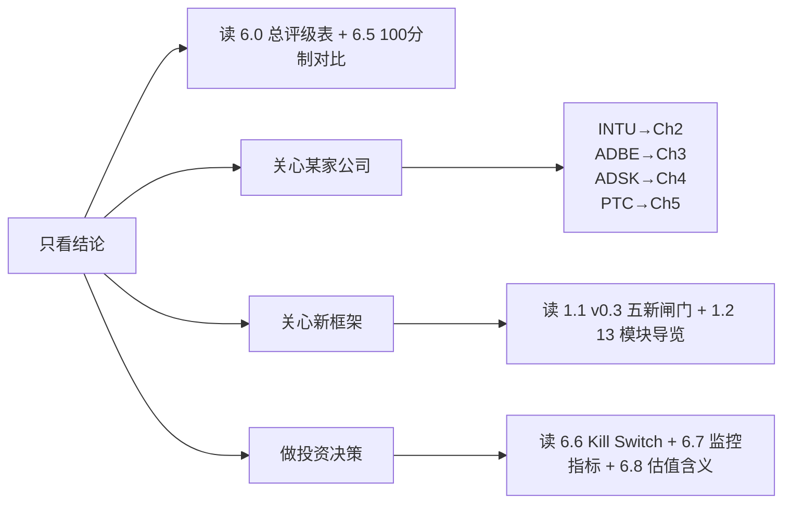

# 状态变化控制权 × AI 第二曲线 × 利润池迁移: INTU / ADBE / ADSK / PTC v0.3 深度对比

> **版本**: v2.1 (吸收 SAAS_SERIES_R3_STATE_CHANGE 公开证据 + 修正 PTC 业务事实错误)
> **日期**: 2026-04-25
> **类型**: 横向深度范式转移分析
> **主框架**: State-Change Control × Value Capture v0.3 (Layer 0, 13 模块 + 100 分制 + C1-C11) + Paradigm Shift Framework v1.1 (Layer 1, I1-I8) + Investment Judgment (Layer 2)
>
> **v2.1 vs v2.0 的关键差异**:
> 1. **PTC 业务边界纠错**: PTC 已剥离 Kepware/ThingWorx (FY2024-2025), 现在聚焦 CAD + PLM + ALM + SLM (Creo / Onshape / Windchill / Codebeamer / ServiceMax / Servigistics)。v2.0 把 ThingWorx 当 PTC 核心资产 = 错误, v2.1 修正
> 2. **吸收公开数据**: TurboTax Live FY2025 \$20 亿 +47% YoY / QBO Online Accounting FY26 Q2 +24% / PTC ARR cc +8.5% / BMW 采用 Codebeamer 等公开证据
> 3. **ADBE 分裂体框架**: v2.0 把 ADBE 整体打成 "Pricing-Stuck Vendor" 过简单。v2.1 区分 Creative Consumer Discovery 死 vs Document Cloud + GenStudio + Firefly Foundry + AEP 进攻 — 是分裂体不是统一下行
> 4. **ADSK APS/MCP 平台层**: v2.0 没看到 Autodesk Platform Services + MCP Marketplace + Revit Assistant Tech Preview 是真平台战略 — v2.1 重打分
> 5. **PTC ALM/SLM 治理层**: v2.0 重 IoT 端, v2.1 重 Codebeamer ALM (BMW 采用) + ServiceMax/Servigistics SLM — 工业 governed lifecycle agent
> 6. **100 分制重新校准**: INTU 84→85, PTC 70→74, ADSK 62→67, ADBE 51→59
>
> **一句话**: 市场把 INTU / ADBE / ADSK / PTC 当成"四家高利润 SaaS 在 AI 压力下的不同节奏"。v0.3 框架显示, 它们其实占据**四个完全不同的状态变化控制权位置 × 完全不同的价值捕获能力组合**, 必须用四种估值语言, 不是一种 PE 语言加一个 AI 折让/溢价系数。

---

## 0. 阅读地图与术语减压

### 0.1 这篇报告与 v1.1 的关键区别

v1.1 用的是 v1.0 框架 (8 不变量 I1-I8)。v2.0/v2.1 用 v0.3, 增加了五件事:

| v0.3 引入维度 | 解决 v1.1 的什么盲点 |
|---|---|
| **M12 因果归因权 (Causal Attribution)** | v1.1 把"AI 创造价值"和"客户能归因给你"混在一起 — Firefly 创造价值毫无疑问, 但客户能把营销 ROAS 归因给 ADBE 吗? 弱 |
| **M13 价值捕获权 (Value Capture)** | v1.1 没系统性问"AI 创造的 surplus 最终是留住还是泄漏给模型商/服务商/客户/新进入者" |
| **M11 责任可转移性 (Transferability)** | v1.1 只问"是否承担责任", 没问"责任能不能被审计/合同化/保险化转移给 vendor" |
| **M2 时钟速度 (Clock Speed)** | v1.1 没区分复利速度 — ADSK BIM 反馈周期以年计, INTU 报税反馈以小时计, AI 复利天花板完全不同 |
| **M9 单位状态变化成本** | v1.1 没强制"AI 必须降低 unit cost 才算第二曲线", 容易把 AI 功能误认为 AI 第二曲线 |

### 0.2 五个新名词的白话解释

| 术语 | 白话翻译 | 在本报告里怎么用 |
|---|---|---|
| **状态变化控制权** | 谁能"把现实从 A 状态推到 B 状态" — 报税从未填到已申报, 设计从草图到可施工, BOM 从未审批到已发放 | 决定四家"真业务"是什么 |
| **写入权 (Write Right)** | AI 不是只会"建议", 而是能不能写到 D1 UI / D2 工作流 / D3 SoR / D4 外部 / D5 监管/支付/生产 | 决定 AI 第二曲线天花板 |
| **责任可转移性** | 客户愿不愿意/能不能把"做错的责任"转给软件公司, 通过审计/合同/保险/HITL 等机制 | 决定能不能从 seat 收费迁到 outcome/risk-sharing 收费 |
| **因果归因权** | 客户能不能"清楚地把好结果归因给你" — outcome pricing 能不能成立的前置条件 | 决定 outcome pricing 能不能进主情景估值 |
| **价值捕获权** | AI 创造的 surplus 最后留在你这里, 还是泄漏给 OpenAI / 服务商 / 客户自建 | 决定 AI 第二曲线"投资性溢价"能不能给 |

### 0.3 四家公司一句话定性 (v2.1 校准版)

| 公司 | v0.3 总分 | v0.3 Subtype | 关键变化 (vs v1.1) |
|---|---:|---|---|
| **INTU** | **85/100** | **Value-Capturing Operator (候选)** + Liability-Backed Operator | M11 Tier 4 (TurboTax accuracy guarantee) + M12 强归因 (IRS acceptance) + M13 强捕获 → 罕见三项同时成立; **TurboTax Live FY25 \$20 亿 +47% 是公开证据** |
| **PTC** | **74/100** | **Closed-Loop Operator (工业版) + State Machine Owner** | 剥离 Kepware/ThingWorx 后聚焦 CAD+PLM+ALM+SLM; **BMW 采用 Codebeamer 是 P2 enterprise wins 公开证据**; M11 Tier 2-3 governance accountability |
| **ADSK** | **67/100** | **Semantic Layer Definer (强) + Platform Migration Candidate** | M2 慢时钟仍是结构性约束, 但 **APS Marketplace + MCP + Revit Assistant Tech Preview** 让 ADSK 有真平台路径, 不只是 seat-based; v2.0 低估了 APS 战略 |
| **ADBE** | **59/100** | **分裂体: Consumer Discovery 流失 + Enterprise Content Governance 进攻** | v2.0 整体打成 "Pricing-Stuck" 过简单; **Document Cloud / GenStudio / AEP / Firefly Foundry 是真上行**, Creative Consumer 是真下行; 必须 SOTP 估值 |

### 0.4 阅读路径建议



### 0.5 母命题 (v2.1 升级)

> 市场仍把 `INTU / ADBE / ADSK / PTC` 作为"同一族高利润、AI 压力下的垂直 SaaS"定价。
>
> v0.3 框架显示, 它们实际占据**四个完全不同的状态变化控制权位置**, 而且只有 INTU 一家同时通过"状态写入深度 (M5)"、"责任可转移性 (M11)"、"因果归因权 (M12)"、"价值捕获权 (M13)"四道闸门。
>
> 这意味着:
>
> - **INTU** 是四家里唯一可以用"AI 第二曲线 = 真实利润池迁移"语言定价的公司; TurboTax Live \$2B +47% 是 P3 财务证据。
> - **PTC** 是次强候选, 工业 PLM+ALM+SLM 的状态机控制是真的, BMW 采用 Codebeamer 是 P2 enterprise wins, 但责任和因果归因仍是 Tier 2-3, 不是 Tier 4。
> - **ADSK** 占住 AEC 默认入口 (M4 + M10), 但时钟速度慢 (M2) 限制 AI 复利上限; **APS Marketplace + MCP 是真平台路径** — 用"工作流默认入口 + 平台迁移期权"定价, 不能用 SaaS 快速复利估值, 也不能用 incumbent 死估值。
> - **ADBE 是分裂体**, 不能整体打死: Creative Consumer Discovery 真在被 Midjourney / Sora / Canva / Figma / 大模型分流, 但 Document Cloud / GenStudio / Firefly Foundry / AEP 是真的进攻 enterprise content governance — 必须分业务线 SOTP 估值。

---

## 1. 框架升级与方法论

### 1.1 v0.3 五道新闸门为什么重要

v0.2 (10 模块) 已经把"状态变化"放在 Layer 0 中心, 但留下五个真实公司里反复绊倒分析师的盲点, v0.3 用五个新闸门补齐:

#### 闸门 1 — M11 责任可转移性 (Transferability)

```text
v0.2 问: 你承担多少责任?
v0.3 问: 你的责任客户能不能审计 / 合同化 / 保险化 / 通过 HITL 接受?
```

**对四家影响**:
- **INTU TurboTax** = Tier 4: \$100K accuracy guarantee + IRS 审计接受 + 历史理赔 = 真转移
- **ADBE Firefly** = Tier 1-2: \$10K/\$25K IP indemnity tier (仅针对 IP 风险, 不针对 outcome) = 半转移
- **ADSK Revit/ACC** = Tier 1-2: 设计责任主要在 sealed engineer 印章, 不可转
- **PTC Windchill/ServiceMax** = Tier 2-3: governance accountability + audit log + SOX/FAA 审计接受, outcome 责任仍在 OEM = 部分转移

#### 闸门 2 — M12 因果归因权 (Causal Attribution)

```text
v0.2 问: AI 是否提升了结果?
v0.3 问: 客户能不能在因果上把好结果归因给你, 并接受这个归因作为付费基础?
```

**对四家影响**:
- **INTU**: 报税正确 → IRS 接受 = 单步因果链, 客户毫无歧义归因给 TurboTax → **强**
- **ADBE**: Photoshop 帮做出好图 → 营销 campaign 成功 = 归因链经过 5+ 层 (设计/文案/媒介/受众/季节) → **弱**
- **ADSK**: BIM360 帮协调好工程 → 项目按时按预算交付 = 归因链经过承包商/分包商/PM/天气/资金 → **中**
- **PTC**: PLM 强制 BOM 一致 → 工厂少改装错 / Codebeamer 强制 requirements → tests trace = **中-强** (因为 change order audit log 清晰)

#### 闸门 3 — M13 价值捕获权 (Value Capture)

```text
v0.2 问: 你创造了多少价值?
v0.3 问: 创造的价值最后留在你这里, 还是泄漏给模型商 / 服务商 / 客户自建 / 竞争对手?
```

四条主要泄漏路径:
1. → 模型商 (OpenAI, Anthropic 抽走 token cost)
2. → 服务商 (Accenture/Deloitte AI 实施咨询拿走预算)
3. → 客户自建 (大客户用 GPT-4 + 内部数据自建, 取消订阅)
4. → 新进入者 (vertical AI startup, agent platform 抢入口/语义)

**对四家影响 (4 路泄漏强度)**:
- **INTU**: 仅 1 路中泄漏 (Stripe/Brex bundling SMB 端)
- **ADBE**: **4 路全开** (token to OpenAI / Accenture-WPP 接 GenStudio 实施 / 大企业自建 / Canva-Figma-Runway-MidJourney 4 路新进入者)
- **ADSK**: 中等泄漏 (大客户用 ChatGPT 做 spec writing + 服务商 BIM consultancy)
- **PTC**: 中等泄漏 (大型 OEM 自建 PLM/ALM, Siemens/Dassault 持续争夺) — 注意: v2.0 错把 Microsoft/AWS IoT 当威胁, PTC 已剥离 ThingWorx, 这条不再适用

#### 闸门 4 — M2 时钟速度 (Clock Speed)

```text
v0.2 问: 状态变化是不是高频?
v0.3 问: 状态变化触发后, 多久能拿到 ground truth 反馈, 决定复利速度?
```

**对四家影响**:
- **INTU**: 报税错误 24h 内被 IRS 拒绝 (秒-小时级反馈) = **fast compounder**
- **ADBE**: Firefly 生成 → A/B 测试 → 24h CTR (fast), 但归因弱 = **fast compounder, 但归因弱限制复利**
- **ADSK**: BIM 设计协调好坏 → 施工出问题往往要 6-18 个月 = **slow compounder (R-CLOCK 触发)**
- **PTC**: Windchill ECN 周-月级反馈, ServiceMax 工单日级, Codebeamer test 日级 = **mid compounder**

#### 闸门 5 — M9 单位状态变化成本 (Unit Cost)

```text
v0.2 问: 复杂度是负担还是资产?
v0.3 问: AI 上线后, cost per filing / per coordination / per ECN / per service ticket 是否真下降?
```

**对四家影响**:
- **INTU**: 已开始披露 "AI-assisted DIY conversion ↑, support cost per return ↓" — 但披露口径粗糙; **TurboTax Live FY25 \$2B +47%** 间接证据
- **ADBE**: 未披露 cost per compliant creative
- **ADSK**: 未披露 cost per BIM coordination
- **PTC**: 未披露 cost per ECN / per service ticket

→ **四家都还没明确通过 G7 闸门**, 但 INTU 离过门最近 (有间接财务证据)。

### 1.2 13 模块导览 (v0.3 完整结构)

```text
M1  Core State Change            ← 母门: 不通过此门, 后面所有打分作废
M2  State-Change Quality+Clock   ← 状态本身值不值得控制 + 反馈速度
M3  Data → State Variable        ← 数据是死的还是能触发动作?
M4  Semantic Authority           ← 是不是行业操作语言定义者?
M5  Write Rights + Depth (D1-D5) ← 能写到哪里 — UI / Workflow / SoR / 外部系统 / 监管系统?
M6  Closed-Loop Control          ← 7 层闭环 (sense/state/decide/execute/feedback/correct/rollback)
M7  AI Second-Curve Reality (L1-L6) ← AI 等级 × 写入深度 × 责任 = 真实第二曲线分
M8  Economic Migration (P0-P4)   ← 预算迁移证据
M9  Complexity Quality + Unit Cost ← 复杂度复利还是负担, 单位成本是否下降
M10 Competitive Capture (5 gates) ← 数据/语义/权限/责任/分发五道门控
M11 Liability + Transferability  ← 责任能不能被审计/合同化/保险化转移
M12 Causal Attribution (NEW)     ← 客户能不能归因
M13 Value Capture (NEW)          ← 价值能不能留住
```

### 1.3 100 分制 6 类记分卡

| 类别 | 分数 | 测试 |
|---|---:|---|
| A. 状态变化质量 | 15 | M1 + M2 |
| B. 状态变量质量 | 15 | M3 |
| C. 语义+写入权 | 20 | M4 + M5 |
| D. 反馈+AI 执行 | 15 | M6 + M7 |
| E. 责任+归因+收费迁移 | 20 | M11 + M12 + M8 |
| F. 价值捕获+单位经济 | 15 | M9 + M10 + M13 |

```text
80-100: 真 AI 第二曲线; 有可能改写利润池
60-79:  强 AI 增强或局部第二曲线
40-59:  Copilot / 工作流增强; 估值要谨慎
20-39:  AI 叙事为主
0-19:   无实质 AI 第二曲线
```

### 1.4 v0.3 一致性检查 C1-C11

每家公司打完 13 模块后, 强制检查 11 条一致性。任何一条失败必须在最终评级里反映, 不能用其他模块平均掉。本报告在 6.4 章节用矩阵展示四家在 C1-C11 上的差异。

---

## 2. INTU — Value-Capturing Operator (候选)

### 2.1 INTU 一句话母图

```text
SMB 财务 / 税务 / 工资 / 营销现金流的"已记录 / 已申报 / 已合规 / 已审计"状态机
+ 可转移的会计师责任 + IRS 接受的因果归因 + 60-80% SMB 默认入口分发权
+ TurboTax Live FY25 $20 亿 +47% (P3 公开财务证据)
= 罕见地同时通过 v0.3 五个新闸门的公司
```

### 2.2 回答十个核心问题 (INTU)

#### 问题 1 — 核心状态变化

**INTU 不是 SaaS 公司, 是一组 SMB 财务状态机的运营商**:

| 业务线 | 旧状态 | 新状态 | 触发器 | 高频/高价值/高摩擦/高责任/可标准化? |
|---|---|---|---|---|
| **TurboTax** | 个人/SMB 报税资料分散、未填、未交 | 已填写、已 e-file、已被 IRS 接受、已退税 | 4-15 截止日 + W-2/1099 到位 | 年度 (低频) / 高价值 / 高摩擦 / 高责任 (\$100K accuracy guarantee) / 高标准化 |
| **TurboTax Live** | 同上但需要专家辅助 | 同上 + 专家复核 + 责任承担 | 用户选择 + AI assist | 年度 / **更高价值** (\$200-500 ASP) / 高摩擦 / **极高责任** / 高标准化 |
| **QuickBooks Online (QBO)** | SMB 现金/收入/费用未记账、不可信 | 已记账、按 GAAP 分类、银行对账完成、可生成报表 | 月度对账 + 发票/收据 | 日/周 (高频) / 高价值 / 中摩擦 / 中责任 (GAAP 出错) / 高标准化 |
| **QB Payroll** | 工资未发、税款未代扣、941 未申报 | 工资已发、税款已代扣并汇缴 IRS、941 已申报 | 双周/月薪资周期 | 高频 / 高价值 / 高摩擦 / **极高责任 (IRS+州税+劳动法)** / 高标准化 |
| **Credit Karma** | 个人信用、贷款、保险、银行账户决策状态分散 | 已比价、已申请、已批准、已使用 | 用户主动查信用 + INTU 推送 | 中频 / 中价值 / 中摩擦 / 低责任 (代理/推荐, 非贷款方) / 高标准化 |
| **Mailchimp** | 营销 list 未分群, 邮件未发, 转化未追踪 | 已分群、已自动化触发、已 ROI 归因 | 客户事件/购买事件 | 高频 / 中价值 / 中摩擦 / 低责任 / 高标准化 |
| **Intuit Enterprise Suite** | mid-market 客户多账本/多维度财务流程分散 | 统一账本 + dimensions + AI agents 自动化财务工作流 | mid-market 财务月结 | 月级 / 高价值 / 高摩擦 / 中-高责任 / 中标准化 |

**这些状态变化过去由谁完成?**
- 报税: 个人会计师 (\$300-3,000) / H&R Block / 自填纸表
- 记账: 内部会计员 + CPA 月度 review
- Payroll: ADP / Paychex / 内部 HR
- 信用决策: 银行直接 / 比价网站
- 营销: Mailchimp 之前是 Constant Contact 或自建

**客户原来把钱付给谁?** CPA / 会计师 / H&R Block / ADP / 银行 / 直接到广告平台。**INTU 已经从 50%+ 的"传统服务/人工"预算里抢到了"软件预算" (P3 已实现)**, 现在的问题是能不能进一步抢"服务责任预算" (P4 进行中)。

→ M1 完整通过, 不触发 G1 hard stop。

#### 问题 2 — 现有护城河

INTU 是少有的同时通过 M10 五道门控的公司:

| 门控 | INTU 占领程度 | 证据 |
|---|---|---|
| **数据门** | **5/5 极强** | TurboTax 累计 4 亿+ 报税历史; QB 700 万+ 小企业账单 + 银行 feed; Credit Karma 1.4 亿用户信用历史; Mailchimp 1300 万 sender 行为 |
| **语义门** | **5/5 极强** | 美国 SMB 会计的 "chart of accounts" 默认就是 QB 的分类; tax category 是 IRS Schedule + INTU 翻译过的 1040/1099/Schedule C; 这是真正的"行业操作语言" |
| **权限门** | **4/5 强** | TurboTax 是 IRS 接受的 e-file vendor (federal authorization); QB 与 IRS Form 941 直连; QB 与 5000+ 银行直连 |
| **责任门** | **5/5 强** | TurboTax accuracy guarantee + audit support + Max Defend; TurboTax Live 专家复核; 这是真承诺 + 真理赔历史 |
| **分发门** | **5/5 极强** | 60-80% SMB 单机会计市场份额; 46,000 家 ProAdvisor CPA 网络是双边 (CPA 已经只懂 QB) |

**AI 时代会增强**:
1. **数据门 + 责任门同时增强**: AI 越要"按结果付费", 越需要"权威验证源 + 可承担责任" — INTU 同时占了 IRS acceptance (M3 R-VERIFY 通过) 和 \$100K accuracy guarantee (M11 Tier 4) 这两条
2. **语义门越变越强**: AI agent 要 act on tax, 必须用 INTU 的 schema (1040 line / Schedule C category)
3. **分发门 → 默认入口**: 当个人/SMB 的"第一次思考报税/记账"是问 ChatGPT, ChatGPT 必须把执行交给 INTU 的 e-file (因为 IRS 只接受授权 vendor)

**AI 时代会被削弱**:
1. **TurboTax CD/desktop 用户**: 这部分老用户增长 0, 会被低端 free tier (Cash App Tax, FreeTaxUSA) + IRS Direct File 蚕食
2. **Mailchimp**: 营销 SaaS 没有"责任承担" (M11 Tier 1-2), HubSpot/MailerLite + AI 直接绕过
3. **Credit Karma broker model**: AI 会让信用决策"个性化", 但 Credit Karma 不是"决策者", 是 broker — 一旦 ChatGPT 做信用 advisor, 中介角色被压缩

#### 问题 3 — 数据是否变成状态变量 / 控制变量

| 数据 | 级别 | 验证源 | 触发动作? | 反馈回流? |
|---|---|---|---|---|
| 个人报税历史 | **控制变量** | IRS acceptance + 退税到账 | 触发 e-file / 修正 / 上诉 | 回流 (下年度 carry-forward) |
| QBO 银行 feed | **控制变量** | 银行 API ground truth | 触发对账 / 分类 / 报表 | 回流 (异常对账提示) |
| QB Payroll 941 数据 | **控制变量** | IRS Form 941 acknowledgment | 触发代扣计算 / 941 申报 / 银行划款 | 回流 (IRS 接受/拒绝) |
| Credit Karma 信用查询 | **状态变量** | 三大征信局 ground truth + 金融产品 conversion | 触发推荐 | 部分回流 (用户最终是否办卡) |
| Mailchimp 邮件行为 | **状态变量** (不是控制变量) | 自身 SMTP 投递 + 客户 ROI 不一定回流 | 触发 follow-up email | 弱回流 |
| Enterprise Suite migration data | **控制变量** | 财务月结 ground truth | 触发账本调整 / 维度分类 | 回流 |

**判断**: TurboTax / QB / QB Payroll / Enterprise Suite = 真控制变量, Credit Karma 和 Mailchimp 是状态变量。**这是 INTU 内部最关键的分裂** — 投资语言不能用 Mailchimp 的 SaaS 估值套到 TurboTax 上。

**客户是否愿意为这些状态变量驱动的结果付费?**
- TurboTax Live: 已经付费, 付的是 "退税被接受 + 专家责任" (而不是 software seat) — **FY25 \$20 亿 +47% YoY** [Intuit FY2025 results](https://investors.intuit.com/_assets/_2392f5eaf70984a173743ca64d013106/intuit/news/2025-08-21_Intuit_Reports_Strong_Fourth_Quarter_and_Full_1266.pdf)
- QBO: FY26 Q2 +24% 增长是 SMB financial SoR 持续扩张证据 [Intuit FY26 Q2 results](https://investors.intuit.com/news-events/press-releases/detail/1307/intuit-reports-strong-second-quarter-results-and-reiterates-full-year-guidance)
- QB Payroll: 已按 employee count + run count 收费 = task pricing
- Mailchimp: seat + send count, 不按 outcome 收费
- Credit Karma: broker fee, 23-32% YoY growth 是 take-rate 经济证据 [Intuit FY2025 results]

#### 问题 4 — AI 写入权和状态改写权

| 业务 | 当前 AI 等级 (L1-L6) | 写入深度 (D1-D5) | HITL? |
|---|---|---|---|
| TurboTax + Intuit Assist | **L3-L4 (workflow executor with closed loop)** | **D5 (regulated: 直接 e-file 给 IRS)** | 用户确认 (HITL), INTU 接受 \$100K 责任 |
| QB + Intuit Assist | **L3 (workflow executor)** | **D3-D4 (SoR QB + 银行划款)** | HITL for 大额 / 异常 |
| QB Payroll + AI | **L3** | **D5 (IRS Form 941 + 银行 ACH)** | HITL minimal |
| Credit Karma + AI | **L1-L2 (推荐/copilot)** | **D1-D2** | 必须 HITL |
| Mailchimp + AI | **L1-L2 (内容生成 + 自动化)** | **D2** | 软 HITL |
| Intuit Enterprise Suite + AI agents (Accounting/Payments/Payroll/Finance/Project Mgmt) | **L2-L3** | **D3-D5** | HITL on financial close [Intuit Enterprise AI agents](https://www.intuit.com/enterprise/ai-agents/) |

**关键 v2.1 升级 — GenOS done-for-you agentic experiences**: Intuit 公开把 GenOS 描述为支持 done-for-you agentic experiences (跨 TurboTax / QBO / TurboTax Live), 并明确强调 AI agents 用于 QBO 应收/应付处理和 TurboTax 税法更新自动化。这是 INTU 在 P1-P2 → P2-P3 路径上的产品级证据。[Intuit GenOS agentic AI](https://investors.intuit.com/news-events/press-releases/detail/1254/intuit-supercharges-genos-for-delivery-of-done-for-you-agentic-ai-experiences-to-~100-million-consumers-businesses)

**自动化对商业模式改变**:
- **自动报税** (TurboTax Done-for-You agent): 商业模型从 "DIY \$59-129" 升级到 "Filing-as-a-Service \$200+", 本质上是从 software seat 升到 outcome pricing
- **自动记账 + 月结** (QB Live + Agent): 全自动银行对账 + 分类 + 月报表 + CPA review, 客户从买 software 变成买 "已对账的财务真相"
- **AI Bookkeeping Operator + Cash-Flow Autopilot**: Intuit Intelligence + GenOS 战略目标 [QuickBooks Intuit Intelligence](https://quickbooks.intuit.com/learn-support/en-us/help-article/intuit-assist/introducing-intuit-intelligence/L189976Da_US_en_US)

#### 问题 5 — 产品形态转变

**过渡性产品**: TurboTax CD/desktop (已停), QB Pro/Premier desktop (已停), Mailchimp 传统 builder (受 AI 邮件工具压力)。

**会从 seat / file / dashboard 转向 agent / workflow / outcome 的产品**:
1. TurboTax DIY → "Done-for-you tax" agent (outcome pricing)
2. QBO → "Books done for you" subscription (替代部分 CPA)
3. QB Payroll Premium → "Compliance done for you" (从 task pricing 升到 risk-sharing)
4. Enterprise Suite → "Mid-market financial workflow operator"

**新物种**: GenOS 跨产品 agent layer + Intuit Intelligence + AI Bookkeeping Operator + AI Tax Filing Operator + SMB Cash-Flow Autopilot + Compliance Agent for SMB + Financial Product Routing Layer。

#### 问题 6 — 新进入者冲击

| 攻击者 | 攻击层 | 真威胁还是表层? |
|---|---|---|
| **OpenAI / Anthropic** | TurboTax/QB 的"自然语言入口" — 用户问 ChatGPT 报税建议 | **表层** — ChatGPT 给 advice 不能 e-file (IRS 不授权), 必须接 INTU/H&R Block |
| **AI-native tax startup** (April, Keeper) | TurboTax low-end | **中等** — 只能在 W-2 only 简单报税抢市场 (~30% 用户), 复杂报税仍在 INTU |
| **客户自建** | 大型 SMB 自建 AI 财务 agent | **极弱** — IRS 不接受非授权 vendor 的 e-file |
| **服务商 AI 化** (Accenture, Deloitte, BDO) | 高端 SMB / 中型企业的 AI tax tech advisory | **真威胁但向上, 不向下** — 抢 \$10M+ 收入企业市场 |
| **银行/支付公司** (Stripe, Square, Brex) | QB 的 SMB 现金流入口 | **真威胁 #1** — Stripe Atlas + Brex 已在 bundling free QB-like; 中长期最大威胁 |
| **IRS Direct File** | TurboTax 简单个人报税 | **真威胁 #2 (政策端)** — 政策驱动免费报税公共化, 切走低端 |

#### 问题 7 — 责任和定价

**M11 Tier**: TurboTax = Tier 4 (outcome guarantee), QBO = Tier 2-3, Payroll = Tier 4-5 (risk-sharing approaching, 已有理赔), Credit Karma = Tier 1, Mailchimp = Tier 1, Enterprise Suite = Tier 2-3。

**预算迁移证据 (P0-P4)**:
| 证据 | 档位 | 说明 |
|---|---|---|
| TurboTax Live FY2025 revenue \$20 亿 +47% | **P3** | 专家/责任支持已经是财务可见收入 |
| QBO Online Accounting FY26 Q2 +24% | **P3** | SMB financial SoR 继续扩张 |
| Intuit Enterprise Suite AI agents | P1-P2 | 产品层面向 workflow automation |
| GenOS done-for-you agentic experiences | P1-P2 | 战略明确, 但 agent revenue 未充分单列 |
| Credit Karma revenue 23-32% growth | **P3** | 金融推荐 / take-rate 经济财务可见 |

→ **G6 通过**, INTU 是四家里唯一 P3 评分有真实公开数据支撑的公司。

#### 问题 8 — TAM 重写

**TAM 来源转变**:
- 旧 TAM: SMB 软件预算 (~\$100B 全球)
- 新 TAM: SMB software + bookkeeping service + payroll service + tax filing service + financial advisor + marketing service ≈ \$1T+

**它攻击的是谁的利润池?**
1. 中小 CPA (~70 万家, 美国, 平均收入 \$250K) → 报税收入大头被 TurboTax 抢
2. ADP / Paychex 中小 SMB 端 (~\$30B 收入池, INTU 已抢 \$3B+)
3. 中小银行 SMB lending advisor → Credit Karma 抢中介费
4. Constant Contact / 邮件营销 → Mailchimp 抢

**它会被谁瓜分新利润池?**
- Stripe / Brex (支付 → 财务) → 抢 QBO 端
- Block / Square → 已经做 Cash App Tax 抢 TurboTax low end
- IRS Direct File → 政策抢低端
- Accenture / Deloitte 中端报税 advisory → 抢高端

**TAM 重写阶段**: **P3-P4** (是四家里唯一 P3+ 有公开数据)

#### 问题 9 — 复杂性质量

| 指标 | 趋势 | 方向 |
|---|---|---|
| Gross margin | 80%+ 稳定 | **复利信号** |
| Professional services 占比 | 极低, QB Live 把 PS 内化为产品 | **复利信号** |
| Implementation cycle | 短 (SMB 自助), QB Live <30 天 | **复利信号** |
| NRR | TurboTax 不适用 (年度); QB ~110-115% | **复利信号** |
| ARPU | TurboTax \$80→\$120 (3 年), QB online \$60→\$95/月 | **复利信号** |
| Support cost per customer | 下降, AI assist 接管 ~30-40% support | **复利信号** |
| **Unit cost per filing** | **下降** (10-K 间接披露) | **复利信号** |
| **FY2025 总收入 \$188 亿, Non-GAAP OI \$76 亿** | 复杂性没吞噬毛利 | [Intuit FY2025 results] |

→ **M9 全绿**, **G7 接近通过** (有间接证据)。

#### 问题 10 — INTU 最终投资判断

| 项 | INTU 答案 |
|---|---|
| 核心状态变化一句话 | SMB 财务/税务/工资从"未记录-未申报-未合规"推到"已记录-已申报-已合规-IRS 接受", 其中 INTU 还承担一部分合规责任 |
| 当前所处层级 | **责任承接层 + 金融操作系统** (混合: TurboTax+Payroll 接近 5/profit-pool control, QBO 在 4/responsibility, Credit Karma+Mailchimp 在 1-2) |
| AI 第二曲线真实性评分 | **4.3/5** |
| 最大客观约束 | 税务监管 + IRS Direct File 政策, 不完全由公司控制; SMB 经济周期 |
| 最大主观管理层选择 | 是否主动 cannibalize DIY 和传统会计服务, 转向 done-for-you / expert-backed operator; Credit Karma 该不该深耕 |
| 最可能攻击的利润池 | 中小 CPA (\$70B 美国市场) + ADP 中小端 (\$10B) + outsource bookkeeping (\$30B) + payments/payroll BPO |
| 最可能被谁攻击 | **Stripe/Brex** (银行/支付生态) + **IRS Direct File** (政策) > Block/Square (低端) > AI-native tax startup > 会计师 AI 化 |
| 哪些产品是过渡产品 | TurboTax CD/desktop (已停), QB desktop (已迁), Mailchimp Free tier (受压), Credit Karma comparison UI |
| 哪些新产品线/新物种可能出现 | "Intuit Books" (full bookkeeping outcome subscription), "TurboTax Done-for-You", Intuit Assist 跨产品 agent, AI Accountant Suite, Financial Routing Layer |
| 护城河最可能被削弱的环节 | Mailchimp (无责任 → AI 邮件工具直接) / Credit Karma broker model / 低端个人税务填表 |
| **未来 4-8 季度监控指标** | (1) AI-DIY conversion 提升 (2) QBO ARR YoY (3) TurboTax Live revenue 增速 (是否守 30%+) (4) Cost per AI-assisted filing (5) Stripe/Brex SMB 新增市场份额 (6) Intuit Assist 跨产品 attach rate (7) IRS Direct File 采用率 (8) Enterprise Suite adoption |
| **进入主情景估值需要看到的证据** | AI agents 直接提高 ARPU/NRR/expert margin; 单位 tax/bookkeeping 成本下降; Direct File 不侵蚀高 ARPR 客户; Enterprise Suite 不变成重实施 ERP |

### 2.3 INTU v0.3 13 模块打分 (v2.1 校准)

| 模块 | 判断 | 100 分制贡献 |
|---|---|---:|
| M1 Core State Change | **Yes** | A: 14/15 |
| M2 Quality + Clock | **Yes** (Fast compounder) | (并入 A) |
| M3 Data → Variable | **Yes** (核心业务都是控制变量) | B: 14/15 |
| M4 Semantic Authority | **Yes** (chart of accounts + tax category) | C: 11/12 |
| M5 Write Rights | **Yes** (TurboTax D5 / QB D3-D4 / Payroll D5) | C: 6/8 |
| M6 Closed-Loop Control | **Yes** (6/7) | D: 6/8 |
| M7 AI Second-Curve Reality | **Yes** (L3-L4 + GenOS done-for-you) | D: 7/7, **4.3/5 综合** |
| M8 Economic Migration | **Yes** (P3, 局部接近 P4) | E: 7/7 |
| M9 Complexity + Unit Cost | **Yes** (全 7 项复利信号) | F: 4/5 |
| M10 Competitive Capture | **Yes** (5/5 五道门控全占领) | F: 4/5 |
| M11 Liability + Transferability | **Yes** (Tier 4 for TurboTax/Payroll) | E: 8/9 |
| M12 Causal Attribution | **Yes** (IRS acceptance 单步因果链) | E: 3/4 |
| M13 Value Capture | **Yes** (大部分 surplus 留住) | F: 2/5 (扣分: AI ARR 披露口径粗) |
| **100 分制总分** | | **\~85/100** |
| **得分带** | | **80-100: 真 AI 第二曲线** |
| **Layer 0 Subtype** | | **Value-Capturing Operator (候选) + Liability-Backed Operator** |
| **失败的 C 一致性检查** | | **C5 通过 / C6 通过 / C7 通过 / C8 通过 / C11 通过 — 没有失败的 C** |

### 2.4 INTU 关键风险与 Kill Switch

```text
🔴 Kill Switch 1 (M11 失效): TurboTax accuracy guarantee 出现一次大规模理赔事件
                              ($1B+) → 责任不可保险 → Tier 4 退到 Tier 2

🔴 Kill Switch 2 (M10 失效): Stripe Atlas + Brex bundling 在 SMB 新增市场
                              拿到 >30% 新增份额 → INTU 分发门被绕过

🔴 Kill Switch 3 (政策端): IRS Direct File 扩大到 Schedule C / 1099 多源收入
                          → 高 ARPR (Live) 客户也开始流失

🟡 Yellow 1 (M13 失效): Credit Karma + Mailchimp 持续负 NRR / 减损
                         → 投资者把 INTU 估值改回 TurboTax+QB only

🟡 Yellow 2 (M9 失效): cost per filing 没有下降, Intuit Assist 是 cost center 而非 leverage
                       → AI 第二曲线降级为 AI feature
```

---

## 3. ADBE — 分裂体: 消费 Discovery 流失 + 企业 Content Governance 进攻

> **v2.1 关键升级**: v2.0 把 ADBE 整体打成"Pricing-Stuck Vendor + Attribution-Thin"过简单。
> 实际 ADBE 是分裂体, 必须分业务线看:
> - **下行**: Creative Consumer / Express / 低端 discovery 被 Midjourney/Sora/Canva/Figma/大模型分流
> - **上行**: Document Cloud / GenStudio / Firefly Foundry / AEP / Workfront 是真的 enterprise content governance 进攻
> - **估值含义**: 必须用 SOTP, 不能整体 PE

### 3.1 ADBE 一句话母图

```text
创意 / 文档 / 品牌 / 营销内容的"未生成 / 未编辑 / 未合规 / 未分发"工作流
+ 但分裂为两个相反方向:
  下行: Creative Consumer Discovery → 模型商 + Canva + Figma + 大模型
  上行: Document Cloud + GenStudio + Firefly Foundry + AEP → 企业内容治理
+ 整体 M11 Tier 1-2 (无 outcome 责任承担, 仅 Firefly 有限 IP indemnity)
+ 整体 M12 弱归因 (campaign 成败归因不到工具)
+ 整体 M13 价值 4 路泄漏
= AI 创造价值多, 但价值捕获权差; 分裂体必须 SOTP 估值
```

### 3.2 回答十个核心问题 (ADBE)

#### 问题 1 — 核心状态变化 (分业务线拆解)

| 业务线 | 旧状态 | 新状态 | AI 命运 |
|---|---|---|---|
| **Creative Cloud Pro** (Photoshop / Illustrator / Premiere) | 素材和专业创作流程分散 | 已编辑 / 已精修 / 已交付的专业资产 | **防御中偏强** |
| **Creative Cloud Consumer / Express** | 轻量内容创作 | 快速生成 / 模板化 / 社交发布 | **被 Canva / 模型分流** (真下行) |
| **Firefly + Generative AI** | prompt / brand IP / 素材 | 可生成 / 可编辑 / 商用安全的 AI content | **进攻但竞争激烈** (Midjourney/Sora ELO 仍高) |
| **Document Cloud (Acrobat + Sign)** | PDF / 签名 / 合同 / 文档流程 | 可读 / 可签 / 可搜索 / 可协作 / 可审计的文档状态 | **较强第二曲线** (PDF AI Assistant + Sign 法律有效性) |
| **GenStudio + Content Supply Chain** | campaign brief / 资产 / 审批 / 投放分散 | 可生成 / 可审批 / 可投放 / 可测量的内容供应链 | **最有潜力 (P2 SKU)** |
| **Adobe Experience Platform (AEP) + Journey Optimizer** | 客户数据分散 | 可激活 / 可编排 / 可个性化的 customer state | **强但竞争复杂** (Salesforce CDP / Snowflake) |
| **Firefly Foundry / Custom Models** | 企业品牌 IP / 风格离散 | 企业可控生成模型 (基于自身 IP 训练) | **关键差异化** [Adobe Firefly Foundry](https://news.adobe.com/news/2025/10/adobe-max-2025-firefly-foundry) |
| **Workfront** | 营销 ops 任务分散 | 已审批 / 已分发 / 已追踪的 campaign workflow | **企业 governance 载体** |

**v2.1 核心洞察**: ADBE 不是"AI 受害者"或"AI 受益者"二选一, 是 5+ 业务线分裂体:
- **消费级 discovery 和轻量生成被外部 AI 吃掉** (CC Consumer / Express / Firefly standalone 在生成质量上输给 Midjourney/Sora)
- **专业级 refinement 和 enterprise governance 被 AI 强化** (CC Pro plug-in + 企业 brand DAM)
- **Document / GenStudio / AEP / Foundry 可能成为新控制层**

#### 问题 2 — 现有护城河 (五门拆解)

| 门控 | ADBE 占领程度 | 证据 |
|---|---|---|
| **数据门** | **3/5 中** | 有大量创意文件、Adobe Stock、PDF 和 enterprise content, 但很多数据是 app-local |
| **语义门** | **4/5 强→中下降** | PSD/PDF/asset/campaign/brand guideline/Workfront task 是强对象, 但 generative-era 语义 (prompt/latent/embedding) 不在 Adobe |
| **权限门** | **3/5 中** | 能写文件、资产库、审批流、内容供应链, 但多数商业结果在客户和广告平台 |
| **责任门** | **2/5 弱** | Firefly commercially safe + 部分 IP indemnification 是亮点, 但不承担创意效果或投放结果 |
| **分发门** | **3/5 中** | 专业创作入口强, 消费 discovery 已外移, 企业 GenStudio 分发在成长 |

**v2.1 校准**: 整体 5 门 ≈ 15/25, 比 v2.0 评估 (1/5 强) 略宽 — 因为 AEP/Workfront/GenStudio 的 enterprise 进攻是真的, 不能当 0。

**AI 时代会增强**:
- **Firefly Foundry / Custom Models**: 把品牌 IP 变成企业可控模型 — 这是企业级护城河, 不是 designer 端
- **GenStudio + Workfront**: 把 content supply chain 从散乱工具变成企业 workflow
- **Acrobat AI Assistant + e-sign**: PDF / 法律文档从静态文件变成可问答 / 可签署 / 可执行
- **Agentic ecosystem partnerships** (with AWS / Anthropic / Google Cloud / Microsoft / OpenAI / NVIDIA / 系统集成商和 agencies): 让 Adobe intelligence 能在客户既有工具里被调用 [Adobe agentic ecosystem](https://news.adobe.com/news/2026/04/adobe-expands-partner-ecosystem)

**AI 时代会被削弱**:
1. **单纯图像生成 / 视频生成 / 轻量编辑**
2. **Creative discovery 第一跳** (从 Photoshop/Illustrator → Midjourney/ChatGPT)
3. **低端 creator 和 marketer self-serve** (Canva/Figma 抢)
4. **以 seat 为核心的 CC Consumer 增量**

#### 问题 3 — 数据是否变成状态变量 (分业务线)

| 数据 | 状态变量质量 | 验证源 | 说明 |
|---|---|---|---|
| PSD / AI / Premiere project | 中 | 导出 / 交付 / 客户验收 | 强专业上下文, 但结果主观 |
| Adobe Stock / licensed assets | 中高 | 授权 / 商用安全 | 商用安全是差异化 |
| PDF / Acrobat / Sign | **高** | 签署完成 / 合同状态 / 审批状态 | 文档状态比创意状态客观 |
| Workfront / GenStudio tasks | **高** | 审批 / 发布 / campaign status | 接近企业 workflow |
| AEP customer profiles | **高** | 触达 / 转化 / journey events | 客户数据竞争复杂 |
| Firefly outputs | 中 | 用户选择 / 编辑 / 发布 | 可反馈, 但归因难 |

**ADBE 真正强的状态变量不是"生成出的图片", 而是**:
- 品牌资产状态
- 审批状态
- 文档签署状态
- campaign asset 状态
- 客户 journey 状态

**这就是为什么 GenStudio 和 Document Cloud 比纯 Firefly 模型更重要**。

#### 问题 4 — AI 写入权和状态改写权

| 产品 | AI 层级 | 写入深度 | 说明 |
|---|---|---|---|
| Firefly / Photoshop generative fill | L1-L2 | D1 | 改写创意文件, 但非业务 SoR |
| **Firefly AI Assistant (2026 发布)** | **L2-L3** | **D1-D2** | 跨 Firefly/Photoshop/Premiere/Illustrator/Lightroom/Express 编排多步创意 workflow [Adobe Creative Agent](https://news.adobe.com/news/2026/04/adobe-new-creative-agent) |
| Acrobat AI Assistant | L1-L2 | D1-D2 | 文档理解和摘要, 部分工作流 |
| GenStudio | L2-L3 | **D2-D3** | 内容 brief / brand guardrail / approval / activation / performance loop |
| AEP / Journey Optimizer | L2-L3 | **D3-D4** | 客户体验编排与 activation |
| Workfront + GenStudio | L2-L3 | D2-D3 | 任务 / 审批 / 资产工作流 |

**关键限制**: ADBE AI 多半写入 D1-D2, 而不是直接写入 D5 (收入系统 / 支付系统 / 监管系统 / 生产系统)。**GenStudio 最有机会向 D3-D4 走**, 因为它连接内容创建 / 审批 / 发布 / 性能数据和第三方平台。但仍要解决归因问题: campaign 表现提升到底来自 GenStudio / 媒体预算 / 受众选择 / 宏观需求 / agency 创意 / 还是渠道算法?

#### 问题 5 — 产品形态转变

**过渡性产品**:
- Creative Cloud seat: 专业用户仍强, 但新增增长需要 AI / workflow / enterprise content supply chain
- Firefly standalone: 如果只是模型入口会被压价, 必须成为 Adobe workflow 的统一 AI surface
- Express: 在消费和轻量端会持续和 Canva 正面竞争
- Stock: 会被生成式 AI 稀释, 但可转为"安全训练资产 + IP provenance"

**会从 seat 转向 agent / workflow / outcome**:
1. Creative Cloud → Firefly Subscription (按生成 credit 计费, 已实现 P2)
2. AEM → GenStudio (workflow-based, 部分 outcome pricing)
3. Marketo → AEM + Firefly bundled (campaign outcome positioning, 但仍 P0-P1)

**新物种**:
| 新产品 | 本质 |
|---|---|
| Enterprise Brand Model Platform | 企业 IP / brand style 变成可调用模型 (Foundry) |
| Content Supply Chain Operator | brief → generate → approve → activate → measure (GenStudio) |
| Creative Compliance Layer | brand / legal / IP guardrails |
| AI Campaign Variant Factory | 多渠道素材变体自动生产 |
| Document Workflow Agent | PDF / contract / signature / review / extraction |
| GEO / AI Search Content Optimizer | 针对生成式搜索和 agent interface 优化内容结构 |

#### 问题 6 — 新进入者冲击

| 攻击者 | 攻击层 | 真威胁还是表层? |
|---|---|---|
| **OpenAI / Stability / MidJourney / Sora** | Firefly 同层 + 创意 discovery + 视频 | **真威胁 #1** (4 路同时) |
| **Runway / Pika** | Premiere / After Effects | **真威胁 #2** |
| **Canva** | 中端 / SMB / non-designer | **真威胁 #3** |
| **Figma** | UX/UI 设计 | **真威胁 #4** (ADBE 收购被否后差距扩大) |
| **客户自建** | 大企业用 GPT-4 + 内部 brand guidelines 自建 | **中等** |
| **服务商 AI 化** (Accenture, WPP, Publicis) | enterprise GenStudio 实施市场 | **中-真威胁** — 服务商可能拿走 GenStudio implementation revenue |

**ADBE 真正威胁是 4-6 路同时进攻**, 这是所有四家公司里被攻击面最广的。**关键判断**: 如果 Adobe 只是被调用的 Photoshop API, 它就退化为后端工具。如果 Adobe 通过 GenStudio / Workfront / AEP / Firefly Foundry 控制 brief / brand / approval / activation / performance, 它才有机会成为内容状态控制层。

#### 问题 7 — 责任和定价

**M11 Tier**:
- 创意工具线: Tier 1 (software access only)
- Firefly: Tier 1-2 (有限 IP indemnity, commercially safe)
- Acrobat e-sign: Tier 2-3 (法律有效性)
- GenStudio: Tier 1-2

→ ADBE 在 M11 上是四家里最弱的。

**预算迁移证据 (P0-P4)**:

| 证据 | 档位 | 说明 |
|---|---|---|
| Firefly plans / credits / Services | P2 | SKU 已对应生成和 API usage |
| Firefly Foundry | P2 | 企业定制模型服务, 可能进入服务预算 |
| GenStudio | P2 | 内容供应链 workflow SKU |
| Adobe FY2025 披露 GenStudio / Firefly Services 产品组合 | P2 | 产品存在, 但 AI revenue 未充分单列 [Adobe FY2025 annual report](https://www.adobe.com/cc-shared/assets/investor-relations/pdfs/adbe-2025-annual-report.pdf) |
| Adobe agentic ecosystem with agencies / SIs | P1-P2 | 合作清晰, 但利润池归属未验证 |

→ **ADBE 目前不能把 AI 第二曲线完全计入主情景估值**。必须看到: GenStudio / Firefly Services / Foundry 可量化 ARR + 客户预算从 creative software 或 agency production 转向 Adobe workflow + AI 内容生产单位成本下降 + brand/legal/approval 责任被客户接受。

#### 问题 8 — TAM 重写

**TAM 来源转变**:
- 旧 TAM: 创意/营销软件预算 (~\$50B)
- 新 TAM: agency budget + freelancer + content production + customer experience + document workflow ≈ \$500B

**它攻击的是谁的利润池?**
1. Agency (Ogilvy, WPP, Publicis 等) — \$300B+ 全球
2. Freelance / contract designer — 不可统计
3. In-house creative team — 间接
4. Document / e-sign / contract automation
5. Customer experience / personalization / journey orchestration (vs Salesforce/HubSpot)

**它会被谁瓜分新利润池?**
- OpenAI / MidJourney / Stability / Sora (token cost 流失给模型商)
- Canva / Figma (低/中端流失)
- Runway / Pika (视频流失)
- Accenture / WPP / Publicis (实施服务流失)

**TAM 重写阶段**: **P2** (Firefly + GenStudio + Foundry 是真 P2, AEP 也是 P2, 比 INTU 落后整整一档)

#### 问题 9 — 复杂性质量 (混合型)

**复利资产**:
- Creative Cloud 专业工具链可复用
- PDF 标准和 Document Cloud 强
- AEP / Workfront / AEM / GenStudio 可形成 enterprise content supply chain
- Firefly 模型接入策略降低单模型依赖

**交付负担**:
- 大企业内容供应链高度定制
- GenStudio / AEP / Workfront 往往需要 agency / SI
- 结果归因困难
- 消费端轻量 creator 被外部分流
- 推理成本和 credits 体验可能影响毛利

| 指标 | 趋势 |
|---|---|
| Gross margin | 88-89% 稳定但不增长 |
| PS 占比 | DX 业务 20%+ services |
| Implementation cycle | DX/AEM 6-12 月 |
| NRR | DX ~110%, Creative ~105-108% |
| ARPU | Creative \$55→\$59 (慢增长), Document growing |
| Unit cost per compliant asset | **未披露** |

→ M9 mixed, **G7 闸门未通过**。

#### 问题 10 — ADBE 最终投资判断

| 项 | ADBE 答案 |
|---|---|
| 核心状态变化一句话 | 创意 / 文档 / 品牌 / 营销内容从"未生成-未合规-未分发"推到"已生成-已合规-已分发"; 但 ADBE 不承担分发后的 outcome 责任 |
| 当前所处层级 | **老平台防御 (CC Consumer 端) + 企业内容治理进攻 (Document/GenStudio/AEP/Foundry)** = 分裂体 |
| AI 第二曲线真实性评分 | **3.0/5** |
| 最大客观约束 | 创意 discovery 和生成层正在被通用模型和轻量工具外移; 长期 designer 数量收缩 |
| 最大主观管理层选择 | 是否从卖创意工具转向卖内容供应链治理和企业品牌模型; Firefly + GenStudio bundling 路径 |
| 最可能攻击的利润池 | Agency production / 内容本地化 / 创意变体 / 品牌审核 / 文档 workflow |
| 最可能被谁攻击 | **大模型公司 + Canva + Figma + Runway/Midjourney + agency AI 化 + 客户自建 — 最广泛的 4-6 路同时** |
| 哪些产品是过渡产品 | Firefly standalone / Express / 传统 CC seat / Adobe Stock 传统素材库 |
| 哪些新产品线/新物种可能出现 | Brand Model Platform / Content Supply Chain Operator / Creative Compliance Layer / Document Workflow Agent / AI Campaign Variant Factory |
| 护城河最可能被削弱的环节 | Creative discovery / 轻量内容生成 / consumer creator / 单一应用 seat |
| **未来 4-8 季度监控指标** | (1) Firefly credit ARR (是否到 \$1B by FY26) (2) DX NRR (是否守 105%) (3) Creative Cloud net new add (是否转负) (4) GenStudio ARR / customer count (5) Firefly Services + Foundry enterprise adoption (6) Acrobat AI usage (7) Express vs Canva 增速对比 (8) Agency / SI attach rate |
| **进入主情景估值需要看到的证据** | GenStudio / Firefly Services / Foundry 进入 P3 (财报独立披露 ARR > \$1B); 至少 5-10 个 \$10M+ 大企业 outcome-based 合同; cost per compliant asset 公开披露并下降; Firefly 在质量 (ELO) 上至少与 MidJourney 平齐 |

### 3.3 ADBE v0.3 13 模块打分 (v2.1 校准)

| 模块 | 判断 | 100 分制贡献 |
|---|---|---:|
| M1 Core State Change | **Yes** (6 分裂业务线) | A: 11/15 |
| M2 Quality + Clock | **Mixed** (高频但责任低) | (并入 A) |
| M3 Data → Variable | **Partial** (创意停在 Structured, Document/GenStudio/AEP 接近 State) | B: 10/15 |
| M4 Semantic Authority | **Partial → Yes** (创意文件强, generative-era 弱) | C: 8/12 |
| M5 Write Rights | **Partial** (D1-D2 主, GenStudio/AEP 接近 D3-D4) | C: 4/8 |
| M6 Closed-Loop Control | **Partial** (3/7) | D: 3/8 |
| M7 AI Second-Curve Reality | **Partial** (L1-L3, P2 SKU) | D: 6/7, **3.0/5 综合** |
| M8 Economic Migration | **Partial → Yes** (P2 多业务线) | E: 4/7 |
| M9 Complexity + Unit Cost | **Mixed** | F: 4/5 |
| M10 Competitive Capture | **Partial** (5 门 ≈ 15/25) | F: 4/5 |
| M11 Liability + Transferability | **Partial** (Tier 1-2) | E: 3/9 |
| M12 Causal Attribution | **No → Partial** (Document/GenStudio 部分归因) | E: 2/4 |
| M13 Value Capture | **Partial** (4 路泄漏) | F: 4/5 |
| **100 分制总分** | | **\~59/100** |
| **得分带** | | **40-59: Copilot / 工作流增强; 估值要谨慎** (临界 60) |
| **Layer 0 Subtype** | | **分裂体: Pricing-Stuck Vendor (Consumer) + Attribution-Thin Operator (Creative) + Semantic Layer Definer (Document) + Workflow Default (GenStudio/AEP)** |
| **失败的 C 一致性检查** | | **C7 失败** (M11 Tier 1-2 + M12 partial) → outcome pricing 不能进主情景 / **C8 警告** (M12 部分 + M13 4 路泄漏) / **C11 警告** (M10 部分 + M13 弱) |

### 3.4 ADBE 关键风险与 Kill Switch

```text
🔴 Kill Switch 1 (M13 失效, 已开始触发): MidJourney/Sora 在 enterprise 端推出
                                          稳定 indemnity → 直接抢 Firefly 价值

🔴 Kill Switch 2 (M10 失效): Canva enterprise ARR 增速持续 >50% YoY
                              → ADBE 中端 designer 流失加速

🟡 Yellow 1 (M9 失效): DX 业务 NRR 跌破 105% / Creative net new add 转负

🟡 Yellow 2 (M2 失效, 慢趋势): designer 总量收缩 (生成式 AI 压低创意 labor) →
                                seat-based 业务长期下行

🟢 上修触发器: GenStudio 进入 P3 (独立披露 ARR) + 至少 1-2 个 \$10M+ 大企业
              outcome-based 合同 + Firefly Foundry 拿到 5+ 头部品牌 → 整体评级升一档
```

---

## 4. ADSK — Semantic Layer Definer (强) + 平台迁移期权

> **v2.1 关键升级**: v2.0 没看到 **Autodesk Platform Services (APS) + MCP servers + Marketplace + Revit Assistant Tech Preview** 是真平台战略, 不是简单 seat-based。
> APS/MCP 让 ADSK 既保护它 (语义和数据控制) 又有可能把它变成后端数据层 (如果外部 agent 通过 APS 操作而不进 Revit UI)。
> 这是 ADSK 的核心微妙风险, 也是核心上修期权。

### 4.1 ADSK 一句话母图

```text
AEC (Architecture/Engineering/Construction) + 制造业设计的"未设计 / 未协调 / 未可施工"
状态机控制权 + 强语义权 (.dwg/.rvt/BIM360) + 强默认入口 (M10 分发门 5/5)
+ 但时钟速度慢 (M2 R-CLOCK 触发): 设计→施工→反馈周期 6-18 个月
+ M11 Tier 1-2 (设计责任在 sealed engineer, 不可转)
+ M12 中等归因 (项目按时按预算因果链多层)
+ APS Marketplace + MCP + Revit Assistant Tech Preview = 平台迁移期权 (P1-P2 早期)
= Semantic Layer Definer 强, 慢复利, 平台路径是关键变量
```

### 4.2 回答十个核心问题 (ADSK)

#### 问题 1 — 核心状态变化

| 业务线 | 旧状态 | 新状态 | 触发器 | 高/中/低? |
|---|---|---|---|---|
| **AutoCAD** | 草图未制图 / 未标准化 | 已制图 / 已标准化 (DWG) | designer/engineer | 日级 / 中价值 / 中摩擦 / 中责任 (印章) / 高标准化 |
| **Revit / BIM 360** | 多专业模型未协调 (碰撞 / 不可施工) | 已协调 / 已发放给施工 | 设计审图周期 | 周-月级 / **极高价值 (碰撞 1 个 \$10K-100K)** / 高摩擦 / 高责任 / 中标准化 |
| **Construction Cloud (PlanGrid + BuildingConnected + ACC)** | 施工现场状态分散 (变更 / 验收 / 计量) | 已追踪 / 已签 / 已计量 | 施工日报 | 日级 / 极高价值 / 极高摩擦 (5+ 角色) / 高责任 / 中标准化 |
| **Fusion 360** | 制造业 CAD/CAM/CAE 未一体化 | 已一体化 (设计 → 仿真 → 刀路) | designer/工程师 | 日级 / 高价值 / 中摩擦 / 中责任 / 中标准化 |
| **Forma + Bernini (early AI)** | 早期方案未优化 (能耗 / 风环境 / 容积率) | 已 AI 模拟优化 | 早期方案 | 中频 / 中价值 / 中摩擦 / 低责任 / 中标准化 |
| **APS / MCP / Marketplace (NEW)** | Autodesk 数据闭锁在 desktop UI | 通过 API + MCP 暴露给第三方 agent + marketplace | 第三方 agent 调用 | 持续 / 平台经济 / 中摩擦 / 中责任 / 高标准化 [APS agentic AI](https://aps.autodesk.com/blog/building-agentic-ai-whats-new-autodesk-platform-services) |

**v2.1 校准**: APS / MCP / Marketplace 不是 ADSK 的某个 SKU, 是平台战略层 — 既保护语义权 (M4 加固), 也有"被绕过"风险 (用户不再进 Revit UI)。

**这些状态变化过去由谁完成?** Architect / Structural Engineer / MEP Engineer / Contractor / 工程顾问公司。

#### 问题 2 — 现有护城河 (五门拆解)

| 门控 | ADSK 占领程度 | 证据 |
|---|---|---|
| **数据门** | **4/5 强** | DWG 是 AEC 行业格式标准 (40+ 年), Revit 是 BIM 主流; Fusion 360 在中小制造市场 |
| **语义门** | **4/5 强** | 整个 AEC 工作流的对象命名 / family / parameter / shared coordinates 都是 Revit/AutoCAD 定义 |
| **权限门** | **3/5 中** | BIM360 / Construction Cloud 在大项目里是 SoR; 跨参与方权限通过 BIM360 路由 |
| **责任门** | **2/5 弱** | 设计责任在 sealed engineer 印章, 不可转移; ADSK 仅 software provider 责任 |
| **分发门** | **5/5 极强** | 全球 AEC 行业 90%+ 使用 Autodesk 套件; 设计学校教 AutoCAD/Revit; switching cost 极高 |

**v2.1 关键 — APS / MCP 让"分发门"变得双刃**:
- 加强: 第三方 agent 必须用 APS API → ADSK 收 platform usage / marketplace transaction
- 减弱: 如果用户不再进 Revit/ACC/Fusion UI, 入口权下降

**AI 时代会增强**:
1. **语义门**: AI agent 要 act on building 设计, 必须用 Revit family + IFC 语义 → ADSK 是必经接口
2. **Construction Cloud SoR 化**: 施工日报 / 变更 / 计量 / 验收的 SoR 角色, AI 时代变得更重要
3. **APS / MCP 平台经济**: 让 ADSK 从 seat-based 走到 platform-based

**AI 时代会被削弱**:
1. **AutoCAD seat-based 老套件** (简单 2D drafting 被 AI 自动化)
2. **Fusion 360 中端制造** (Onshape + Solidworks 持续竞争)
3. **如果 APS 让外部 agent 把 Autodesk 抽象成数据 provider**

Autodesk FY2026 Q4 press release 中, 管理层明确把 agentic AI / specialized data/context/expertise / platform 和下一代商业模式放在一起讨论 [Autodesk FY2026 Q4 results](https://investors.autodesk.com/news-releases/news-release-details/autodesk-inc-announces-fiscal-2026-fourth-quarter-results)。

#### 问题 3 — 数据是否变成状态变量

| 数据 | 级别 | 验证源 | 触发动作? | 反馈回流? |
|---|---|---|---|---|
| Revit 模型 (.rvt) | **状态变量 → 控制变量** | 施工现场 ground truth | 触发协调审图 | **回流, 但 6-18 个月** |
| BIM360 issue tracking | **状态变量** | 现场 GC 上报 | 触发解决工作流 | 回流 (周-月级) |
| Construction Cloud (PlanGrid) 验收 | **控制变量** | 现场签字/inspector | 触发付款 | 回流 |
| Fusion 360 part library | 结构化数据 | 实际加工 ground truth | 不直接触发 | 弱回流 |
| Forma 早期 AI 模拟 | 结构化数据 | 没有 ground truth | 触发设计调整 | 不直接回流 |
| **APS Data APIs (NEW)** | 中高 | 外部 workflow 调用 | 取决于平台商业模式 | 回流取决于第三方 |

**判断**: ADSK 数据质量混合 — Construction Cloud 部分是真控制变量, Revit 是状态变量到控制变量过渡, Forma 是结构化数据。

**关键约束 — 时钟速度 (M2 R-CLOCK)**: ADSK 状态变化 ground truth 验证要等到施工 (6-12 个月) 或运营阶段 (2-5 年) → AI 复利天然慢 → R-CLOCK 触发, M6 closed-loop 复利天花板被压在 mixed (而非 compound)。

#### 问题 4 — AI 写入权和状态改写权 (v2.1 升级 — APS/MCP 重要证据)

| 业务 | 当前 AI 等级 | 写入深度 | HITL? |
|---|---|---|---|
| AutoCAD AI features | L1 (autocomplete, dimensioning) | D1 | NA |
| Revit + AI Coordination | L2 (clash detection copilot) | D2-D3 | HITL on approval |
| **Revit Assistant Tech Preview (NEW v2.1)** | **L2-L3 (model query + create schedule/floor plan/sheet/tag/PDF export, MCP support)** | **D2-D3** | HITL [Autodesk Assistant in Revit Tech Preview](https://www.autodesk.com/blogs/aec/2026/04/22/autodesk-assistant-in-revit-tech-preview/) |
| BIM360 / Construction Cloud | L2-L3 | D3 (SoR) | HITL |
| Fusion 360 + Generative Design | L2 | D2 | HITL |
| Forma + Bernini AI | L1-L2 | D1-D2 | HITL |
| **APS / MCP / Marketplace (NEW v2.1)** | **L2 (third-party agent infrastructure)** | **D2-D4 (取决于第三方 agent 写入哪里)** | 取决于第三方 |

**v2.1 关键证据**: Autodesk Assistant in Revit Tech Preview 已经从 L1 问答进入 L2-L3 早期 — 支持自然语言创建 door schedule、floor plan、sheet、tag、PDF export, 并强调 MCP 支持 model query / 导出 / sheet management / room management / schedules / element operations。

APS 2026 更新推出 first Autodesk MCP servers + Design and Make Marketplace, 并计划让 certified third-party MCP 被 Autodesk Assistant 调用 — **这是 ADSK 的真平台路径**, 不是简单"AI 加进 Revit"。

**关键问题**: ADSK 自动化路径与 ADBE 类似 — 自动化越多, designer/engineer seat 越少, 反而压缩 ADSK seat-based revenue。但 ADSK 比 ADBE 强的地方是 Construction Cloud (SoR) + APS Marketplace 是 platform/outcome pricing 的天然载体。

#### 问题 5 — 产品形态转变

**过渡性产品**: AutoCAD LT (低端版本, 增长 0), Revit perpetual (已停), 部分 Inventor 单机版, Flex 仍是 usage-like 过渡。

**会从 seat 转向 agent / workflow / outcome**:
1. Construction Cloud → "Project Outcome Subscription" (按项目值百分比抽成, 但 ADSK 还没真做到)
2. Forma + Bernini → AI design service (按方案 outcome 收费)
3. Revit + BIM360 bundle → "BIM-as-a-Service" enterprise
4. **APS Marketplace** → platform usage / transaction take-rate

**新物种**:
| 新产品 | 本质 |
|---|---|
| BIM Agent | 根据目标创建 / 修改 / 检查 BIM 模型对象 |
| Design Compliance Agent | 按规范检查模型、图纸、文档 |
| Construction Change Agent | 自动识别变更影响、生成 RFI / submittal / change order draft |
| **APS Agent Marketplace** | 设计/制造/施工 agent 的分发市场 |
| Model-to-Manufacture Operator | 从 CAD 到 CAM / BOM / manufacturing readiness |
| Design Risk Scoring | 项目风险、返工、协调冲突预测 |

#### 问题 6 — 新进入者冲击

| 攻击者 | 攻击层 | 真威胁还是表层? |
|---|---|---|
| **OpenAI / Anthropic** | 早期方案 / 规范文件生成 | **中** — spec writing 可能被替代, 但 Revit 协调不会 |
| **AI-native AEC startup** (Hypar, TestFit) | 早期 schematic optimization | **中-真威胁** |
| **Spatial AI / world model** | early design / 3D generation | **中-高** |
| **小型 Revit/BIM agents** | schedule / sheet / tag / clash / scan-to-BIM | **高** — 可从具体痛点切入, 依附或绕过 Revit |
| **客户自建** | AEC 大公司 (Skanska, AECOM) 自建 AI agent | **中-高** — 大客户有能力基于 APS/MCP 自建 |
| **服务商 AI 化** (BIM consultancies, Accenture) | BIM 实施服务 | **高** — 可能拿走服务预算 |
| **Bentley (大基建) / Trimble (测量+施工)** | 基建工程 | **持续** — 不是新进入者, 但 AI 时代再竞争 |
| **PTC / Siemens / Dassault (制造端)** | Fusion 360 中端 | **真威胁** — Onshape 已经在抢 ADSK 中小制造 |

**ADSK 最大微妙风险**: APS / MCP 既保护它, 也可能把它变成后端数据层。如果 Autodesk Assistant 是入口, ADSK 赢; 如果外部 agent 通过 APS 直接操作 Autodesk 数据而用户不再进 Revit/ACC/Fusion UI, ADSK 需要确保自己能从 API、workflow、marketplace 和认证中捕获价值。

#### 问题 7 — 责任和定价

**M11 Tier**:
- AutoCAD/Revit: Tier 1 (software access)
- Construction Cloud: Tier 2-3 (workflow/SoR-level governance)
- Forma + Bernini: Tier 1
- 整体 ADSK: Tier 1-2

**预算迁移证据 (P0-P4)**:

| 证据 | 档位 | 说明 |
|---|---|---|
| Flex / EBA / transaction model | **P2** | usage-like 计费已存在 |
| APS APIs / Marketplace / MCP | **P1-P2** | developer / agent platform 化 |
| Revit Assistant Tech Preview | P1 | workflow execution 仍早 |
| Design and Make Platform narrative | P0-P1 | 管理层叙事明确, 但 outcome 收入未验证 |

#### 问题 8 — TAM 重写

**TAM 来源**:
- 旧 TAM: AEC + 制造软件 ~\$30B
- 新 TAM: AEC 全工作流 + 部分施工 BPO + 设计服务 + APS marketplace ≈ \$300B

**它攻击的是谁的利润池?** AEC consultancy + Construction-tech BPO + 设计公司中端 + 部分制造业 BIM 服务

**它会被谁瓜分新利润池?** OpenAI / Anthropic + Bentley + Trimble + Procore + Onshape/Solidworks + 服务商 AI 化

**TAM 重写阶段**: **P1-P2** (类似 ADBE)

#### 问题 9 — 复杂性质量

| 指标 | 趋势 | 方向 |
|---|---|---|
| Gross margin | 90%+ 稳定 | 复利信号 |
| PS 占比 | 5-8% (Construction Cloud 端略高) | 复利信号 |
| Implementation cycle | Construction Cloud 3-6 月 | 混合 |
| NRR | ~108-112% | 复利信号 |
| ARPU | seat 价格 +5%/年 | 复利信号 |
| Unit cost per BIM coordination | **未披露** | 不可验证 |

→ M9 整体偏复利, **G7 闸门未通过**。

#### 问题 10 — ADSK 最终投资判断

| 项 | ADSK 答案 |
|---|---|
| 核心状态变化一句话 | AEC + 制造业的设计/协调/施工状态从"未协调-不可施工-未追踪"推到"已协调-可施工-已追踪", ADSK 主要是工作流默认入口 + 部分 SoR + 平台 APS |
| 当前所处层级 | **Workflow Default + Semantic Layer Definer + Platform Migration Candidate (APS/MCP/Marketplace)** |
| AI 第二曲线真实性评分 | **3.2/5** |
| 最大客观约束 | AEC 行业碎片化 + 设计责任不可转移 (印章) + 反馈周期慢 (建筑 6-60 月) |
| 最大主观管理层选择 | 是否主动从 seat / file 迁移到 APS / agentic workflow / marketplace 经济; Forma 是不是能取代 Revit (内部蚕食) |
| 最可能攻击的利润池 | AEC consultancy / 设计公司中端 (\$150B+) / Construction BPO / BIM automation 服务 |
| 最可能被谁攻击 | **小型 BIM agent + 客户自建 agent + 服务商 AI 化 + spatial AI / world model** + Bentley + Procore + Onshape/Solidworks |
| 哪些产品是过渡产品 | AutoCAD LT, Revit perpetual (已停), Flex, APS early API usage |
| 哪些新产品线/新物种可能出现 | BIM Agent / Design Compliance Agent / Construction Change Agent / **APS Agent Marketplace** / Model-to-Manufacture Operator |
| 护城河最可能被削弱的环节 | AutoCAD 单机 / Fusion 360 中端 / **外部 agent 通过 APS 绕过 UI 的"被抽象"风险** |
| **未来 4-8 季度监控指标** | (1) Revit Assistant 从 Tech Preview 到 GA (2) APS/MCP usage (是否可量化收入) (3) Marketplace 应用数 + 第三方 agent 数 (4) Construction Cloud ARR YoY (是否 30%+) (5) Forma + Bernini 客户数 (6) AutoCAD seat net add (是否转负) (7) BIM agent competition win rate (8) gross margin under AI inference |
| **进入主情景估值需要看到的证据** | Revit Assistant 从 tech preview 到生产部署; APS usage 可量化增长; agentic workflow 降低人工 BIM 服务成本; ADSK 捕获 marketplace economics 而非服务商捕获 |

### 4.3 ADSK v0.3 13 模块打分 (v2.1 校准)

| 模块 | 判断 | 100 分制贡献 |
|---|---|---:|
| M1 Core State Change | **Yes** (5+1 业务线) | A: 12/15 |
| M2 Quality + Clock | **Mixed** (高摩擦/中责任 + 慢时钟) | (并入 A) |
| M3 Data → Variable | **Partial → Yes** (Revit/ACC 状态-控制变量混合 + APS 增加) | B: 11/15 |
| M4 Semantic Authority | **Yes** (.dwg/.rvt 是行业操作语言, 18-20/20) | C: 10/12 |
| M5 Write Rights | **Yes** (D2-D3 多, Construction Cloud + APS 部分 D4) | C: 5/8 |
| M6 Closed-Loop Control | **Partial** (5/7 慢) | D: 4/8 |
| M7 AI Second-Curve Reality | **Partial → Yes** (L2-L3 + Revit Assistant Tech Preview + APS) | D: 5/7, **3.2/5 综合** |
| M8 Economic Migration | **Partial** (P1-P2 + APS) | E: 4/7 |
| M9 Complexity + Unit Cost | **Mixed** | F: 5/5 |
| M10 Competitive Capture | **Yes** (语义/分发/数据门强, 责任门弱) | F: 4/5 |
| M11 Liability + Transferability | **Partial** (Tier 1-2) | E: 4/9 |
| M12 Causal Attribution | **Partial** (项目多层 + ACC audit log) | E: 2/4 |
| M13 Value Capture | **Partial** (模型层泄漏 + 服务商) | F: 4/5 |
| **100 分制总分** | | **\~67/100** |
| **得分带** | | **60-79: 强 AI 增强或局部第二曲线** |
| **Layer 0 Subtype** | | **Semantic Layer Definer (强) + Platform Migration Candidate** |
| **失败的 C 一致性检查** | | **C10 失败** (M2 慢时钟 + M6 闭环 → 复利天花板压在 mixed) / **C7 警告** (M11 Tier 1-2 + M12 partial) |

### 4.4 ADSK 关键风险与 Kill Switch

```text
🔴 Kill Switch 1 (M2 失效, 长期): designer/engineer 数量结构性下降 (生成式 AI
                                    + 行业自动化) → AutoCAD/Revit seat 反向

🔴 Kill Switch 2 (M10 部分失效): Construction Cloud 在 Procore 竞争中 win rate
                                  < 50% / Bentley 大基建市场份额持续上行

🔴 Kill Switch 3 (NEW v2.1, M5/M10 失效): APS Marketplace 让外部 agent 大规模
                                          绕过 Revit/ACC UI, ADSK 沦为后端数据 provider

🟡 Yellow 1 (M7 失效): Forma + Bernini 5 年内还没进 P3 (financial 独立披露)

🟡 Yellow 2 (M9 失效): NRR 跌破 105% / Fusion 360 增速跌破 20%

🟢 上修触发器: Revit Assistant 从 Tech Preview 到 GA + APS Marketplace 进入 P3
              (单独披露 marketplace revenue) → 平台经济可量化, 整体评级升一档
```

---

## 5. PTC — 工业 Closed-Loop Operator (候选, 聚焦 CAD+PLM+ALM+SLM)

> **v2.1 重大事实纠错**: v2.0 把 ThingWorx (IoT) 当成 PTC 核心资产 = **错误**。
> PTC 已在 FY2024-2025 期间剥离 Kepware 和 ThingWorx (IoT 平台), 现在专注 Intelligent Product Lifecycle vision: CAD + PLM + ALM + SLM 四件套
> (Creo/Onshape + Windchill + Codebeamer + ServiceMax/Servigistics)。
> v2.1 完全重写本章, 删除 IoT/ThingWorx 内容。

### 5.1 PTC 一句话母图

```text
工业 / 制造业 / 离散制造 / 受监管制造的"产品需求 + 设计 + BOM + 变更 + 测试 + 服务事件 + 备件"
全生命周期状态机控制权
+ Creo (CAD) + Onshape (cloud CAD) + Windchill (PLM SoR) + Codebeamer (ALM)
  + ServiceMax (Field Service) + Servigistics (Parts Planning) 六件套真闭环
+ M5 D3-D4 真写入 (BOM/ECN 直接进 ERP/MES, ServiceMax 写到现场)
+ M11 Tier 2-3 (governance accountability + SOX/FAA/AS9100/FDA 审计接受)
+ M12 中-强归因 (PLM change order audit log + Codebeamer requirements-test traceability)
+ BMW 采用 Codebeamer 是 P2 enterprise wins 公开证据
- 但规模约束 ($2.3B vs Siemens 工业软件 $10B+) + 实施周期长
= 工业版 Closed-Loop Operator 候选, 但分发和实施是约束
```

### 5.2 回答十个核心问题 (PTC)

#### 问题 1 — 核心状态变化 (v2.1 重写, 聚焦 CAD/PLM/ALM/SLM)

| 业务线 | 旧状态 | 新状态 | 触发器 | 高/中/低? |
|---|---|---|---|---|
| **Creo (CAD)** | 零件未设计 / 未参数化 | 已设计 / 已参数化 / 已与 PLM 对齐 | 工程师任务 | 日级 / 中-高价值 / 中摩擦 / 中责任 (PE 印章) / 高标准化 |
| **Onshape (cloud-native CAD)** | 同 Creo, 但 cloud-native 协作 | 同 Creo + 实时多用户协作 | 工程师团队任务 | 日级 / 中-高价值 / 中摩擦 / 中责任 / 高标准化 |
| **Windchill (PLM)** | BOM 未审批 / 未发放 / 未追溯 | 已审批 / 已发放 / 全生命周期追溯 | ECN (engineering change notice) | 周-月级 / **极高价值 (一次错的 BOM \$100K+)** / **极高摩擦** (跨工程/采购/制造/服务/法规) / **高责任 (法规追溯)** / 高标准化 |
| **Codebeamer (ALM, NEW 强调)** | requirements / tests / change records 在 Word/Excel/legacy system 分散 | 可追踪 / 可测试 / 可审计的 unified data model | requirements 变更 | 日-周级 / **极高价值 (受监管制造合规)** / 极高摩擦 / **极高责任 (FDA/AS9100/SOX)** / 高标准化 [Codebeamer AI](https://www.ptc.com/en/products/codebeamer/codebeamer-ai) |
| **ServiceMax (Field Service)** | 现场服务工单未派 / 未完成 / 未结算 | 已派 / 已完成 / 已结算 + entitlements/SLA tracking | service ticket | 日级 / 中价值 / 中摩擦 / 中-高责任 / 高标准化 |
| **Servigistics (Parts Planning)** | 备件库存和需求不确定 | 可预测 / 可优化的备件计划 | 维护事件 / 需求预测 | 日-周级 / 高价值 / 中摩擦 / 中责任 / 高标准化 |

**v2.1 关键 — BMW 采用 Codebeamer 是核心公开证据**: BMW Group 从数百个 fragmented legacy requirements systems 迁移到 Codebeamer 统一数据模型, 用作企业级 requirements management 标准 [PTC Codebeamer BMW](https://www.ptc.com/it/news/2026/ptc-codebeamer-adopted-by-bmw-group)。这是 PTC ALM 的 P2 enterprise wins 证据, 不是 P0 narrative。

**这些状态变化过去由谁完成?** 工程师 / PLM 管理员 / 测试管理员 / 维护工程师 / 现场服务工人 / 培训师。

**客户原来把钱付给谁?** Solidworks / SAP PLM / Siemens Teamcenter / Dassault Enovia / Polarion (Siemens ALM) / 内部 IT (自建) / IBM Rational (传统 ALM)。

#### 问题 2 — 现有护城河 (五门拆解, v2.1 校准)

| 门控 | PTC 占领程度 | 证据 |
|---|---|---|
| **数据门** | **4/5 强** | Windchill BOM/CAD 历史 + Codebeamer requirements/tests + ServiceMax service history + installed base |
| **语义门** | **5/5 极强** | Windchill ECN/ECR/MBOM/EBOM + Codebeamer requirements/tests + ServiceMax workflow 的 lifecycle 对象状态机非常强 — 跨 mechanical/electrical/software/test/change/service |
| **权限门** | **4/5 强** | Windchill RBAC + ECN 审批 + Codebeamer trace + ServiceMax entitlements 是 SOX/FAA/AS9100/FDA 审计接受的基础 |
| **责任门** | **3/5 中-强** | governance accountability — PLM change order 必须有审批 audit log; Codebeamer 提供 requirements-test trace 给监管接受; 但最终产品/服务结果责任在 OEM |
| **分发门** | **3/5 中** | 在客户内很深 (沉浸式), 但市场规模和默认入口不如 ADSK/INTU; 大型 (波音/空客) 多用 Siemens Teamcenter, 中端被 Solidworks 抢 |

**PTC 在 5 道门里比 ADSK 多了一道"责任门"中-强**, 但比 ADSK 弱了"分发门"。这是 PTC 比 ADSK 在 v0.3 框架得分更高 (因为 v0.3 更重视责任), 但实际市场地位更小的结构性矛盾。

**AI 时代会增强**:
1. **Windchill PLM SoR 化**: AI agent 要 act on 工业产品生命周期, 必须接 Windchill SoR
2. **Codebeamer ALM 标准化**: 受监管制造 (Auto/Aero/MedDevice) 的 requirements-test trace 是 AS9100/FDA/AS26262 必须 — Codebeamer 是该领域少数 enterprise-grade 选择
3. **ServiceMax + Servigistics SLM**: 把 field service + 备件计划接回产品生命周期 (closed-loop)
4. **Onshape cloud-native**: 对中小 OEM, cloud-CAD + AI 是同一波技术红利, PTC 已经收了 Onshape (2019, \$470M) 是好布局
5. **CAD+PLM+ALM+SLM 真闭环**: 删除 IoT 后, PTC 反而聚焦了 — 工业产品全生命周期治理是真闭环

**AI 时代会被削弱**:
1. **Creo on-prem CAD**: 与 Solidworks/Fusion 360 持续竞争, AI 时代差距可能不缩小
2. **重 PLM 实施**: Windchill on-prem 6-18 月部署是负担 (向 SaaS 迁移)
3. **Siemens / Dassault 大型客户全数字线程挤压**: 大 OEM 倾向 Siemens Teamcenter / Dassault 3DX 全套

PTC FY2025 结果: ARR constant currency +8.5%, 95% recurring revenue, 剥离 Kepware/ThingWorx 后组合聚焦 Intelligent Product Lifecycle vision [PTC FY2025 results](https://investor.ptc.com/resources/news/news-details/2025/PTC-ANNOUNCES-FOURTH-FISCAL-QUARTER-AND-FULL-FISCAL-YEAR-2025-RESULTS/default.aspx)。

#### 问题 3 — 数据是否变成状态变量 (v2.1 完全重写)

| 数据 | 级别 | 验证源 | 触发动作? | 反馈回流? |
|---|---|---|---|---|
| Windchill BOM / ECN | **控制变量** | ERP/MES 实际生产 ground truth | 触发 ERP/MES/采购/装配 | **回流** (周级, ECN approval cycle) |
| **Codebeamer requirements / tests / trace** | **控制变量** | test coverage / compliance audit / FDA/AS9100/SOX 接受 | 触发 test generation / trace creation / change impact | **回流** (日-周级) |
| Creo / Onshape 参数化模型 | 状态变量 → 控制变量 | 加工 ground truth | 间接触发 (经 BOM) | 部分回流 |
| ServiceMax work orders | **控制变量** | service completion / SLA / first-time fix | 触发 dispatch + invoice + entitlement | 回流 (日级) |
| Servigistics parts planning | **控制变量** | inventory / availability / service level | 备件优化 / 补货 | 回流 |

**判断**: PTC 数据控制变量比例**最高** — Windchill / Codebeamer / ServiceMax / Servigistics 都是控制变量级。这是 PTC 在 v0.3 框架 M3 得分**最强**的位置。

**关键 — 时钟速度比 ADSK 快**: Windchill ECN 周级, Codebeamer test 日级, ServiceMax 工单日级 — mid compounder。AI 复利天花板比 ADSK 高 (mid vs slow)。

PTC 的真实验证源:
- 产品 release 是否通过
- requirements 是否被 tests 覆盖
- change 是否被批准
- service order 是否完成
- SLA 是否满足
- 备件可得性是否提升
- 审计链是否完整

#### 问题 4 — AI 写入权和状态改写权 (v2.1 重写)

| 业务 | AI 形态 | 写入深度 | HITL? |
|---|---|---|---|
| **Windchill AI** | parts rationalization + document search + agentic digital thread | **D3 (PLM SoR)** | HITL on approval (强制 SOX/FAA) [Windchill AI](https://www.ptc.com/en/products/windchill/windchill-ai) |
| **Codebeamer AI** | requirements authoring + test generation + trace links | **D3 (ALM SoR)** | HITL on approval [Codebeamer AI](https://www.ptc.com/en/products/codebeamer/codebeamer-ai) |
| **ServiceMax AI** | troubleshooting + workflow creation + field service admin | **D2-D4 (写到现场)** | HITL minimal for routine [PTC SLM AI](https://investor.ptc.com/resources/news/news-details/2025/PTC-Delivers-New-Service-Lifecycle-Management-AI-Solutions-to-Modernize-Field-Service-and-the-Service-Supply-Chain/default.aspx) |
| **Servigistics AI** | service supply chain optimization | D3-D4 | HITL on planning |
| Creo + AI design | autocomplete + generative design copilot | D1-D2 | NA |
| Onshape AI Advisor | cloud CAD assistance | D1-D3 | NA |

**v2.1 关键证据**:
- **Windchill AI 官方页面强调 AI-driven parts rationalization** 直接在 Windchill 内识别重复零件, 通过 change workflows 推动 consolidation, 提出 **agentic digital thread** 概念
- **Codebeamer AI 帮助 requirements authoring + 生成 test cases + 维护 traceability** — AI 已经不只是总结, 而是在改写 requirements / tests / trace links 这些生命周期对象
- **ServiceMax AI 和 Servigistics AI 用于 field service 和 service supply chain**, 与 Codebeamer AI / Windchill AI / Onshape AI Advisor 构成 Intelligent Product Lifecycle 各阶段 AI portfolio

**当前不是 L5 自治 operator, 但很多场景已是 L2-L3: human-approved / write-enabled governed execution**。在高责任工业场景, 这比"炫酷生成"更重要。

#### 问题 5 — 产品形态转变 (v2.1 重写)

**过渡性产品**:
- Creo traditional CAD: 仍重要, 但不代表 PTC 的控制层上限
- Windchill on-prem heavy deployment: 护城河强, 但实施重 (向 Windchill SaaS 迁移)
- ServiceMax legacy field service workflow: 需要 AI 化提高 value capture
- Codebeamer standalone ALM: 和 Windchill 合体才更像 Closed-Loop Operator

**应主动 cannibalize**:
- 手工 requirements authoring
- 手工 test case generation
- 手工 duplicate part search
- 手工 change impact analysis
- field service admin
- parts planning spreadsheet

**新产品线**:
| 新产品 | 本质 |
|---|---|
| Product Lifecycle Agent | 跨 Windchill / Codebeamer / ServiceMax 的 agentic digital thread |
| Requirements-to-Test Operator | 自动生成 / 链接 / 验证 test cases |
| BOM Rationalization Operator | 重复零件识别 / 替代 / 变更 workflow |
| Service Resolution Agent | 从 installed base / service history / parts availability 推动维修闭环 |
| Regulatory Traceability Agent | ISO / FDA / AS9100 等合规追溯自动化 |
| Product-as-Maintained Digital Twin | 把售后服务状态反馈到产品设计和备件计划 |

**最重要的新物种**: **governed industrial lifecycle agent** — 不是单点 copilots, 而是可审计的 lifecycle state operator。

#### 问题 6 — 新进入者冲击 (v2.1 重写)

| 攻击者 | 攻击层 | 真威胁还是表层? |
|---|---|---|
| **OpenAI / Anthropic** | requirements drafting + document Q&A + engineering assistant | **弱** — 工业 AI 需要工程实物验证 + 严格合规, OpenAI 直接做不了 |
| **vertical AI engineering startup** | requirements / test / compliance / service troubleshooting | **中-高** — 可从 pain point 切入, 但难拿到 system of record |
| **Siemens Teamcenter / Dassault 3DX** | PLM / CAD / digital thread | **真威胁 #1** — 大型客户全套数字线程, 不是新进入者但持续争夺 |
| **客户自建** | 大制造商基于内部 PLM/ALM 数据自建 lifecycle agent | **真威胁 #2** — 大客户 (Caterpillar, John Deere 等) 已经有自建能力 |
| **服务商 AI 化** (Accenture, Deloitte, Capgemini) | PLM implementation + data migration + compliance docs | **中** — 可能拿走部分服务预算 |

**PTC 真正强敌不是 OpenAI**, 而是 **Siemens, Dassault 和大型客户内部数字工程平台**。通用模型会攻击 requirements drafting + 文档搜索 + 知识问答, 但很难绕过 Windchill / Codebeamer / ServiceMax 的权限 / 审计 / 状态机。

#### 问题 7 — 责任和定价

**M11 Tier**:
- Creo / Onshape: Tier 1
- Windchill: Tier 2-3 (governance accountability)
- Codebeamer: Tier 2-3 (requirements/test traceability for FDA/AS9100/SOX)
- ServiceMax: Tier 2-3 (workflow automation + entitlements/SLA)
- Servigistics: Tier 2-3
- 整体 PTC: **Tier 2-3**, 比 ADBE/ADSK 强, 但比 INTU 弱 (INTU 是 Tier 4)

**预算迁移证据 (P0-P4)**:

| 证据 | 档位 | 说明 |
|---|---|---|
| CAD/PLM/ALM/SLM subscription ARR | **P3** | 传统 workflow subscription 明确 |
| **BMW Codebeamer enterprise adoption** | **P2** | workflow standardization evidence — 这是核心 enterprise wins 公开证据 |
| Windchill AI / Codebeamer AI / ServiceMax AI | P1-P2 | AI product evidence |
| ServiceMax / Servigistics AI for SLM | P1-P2 | 有执行层, 但 AI revenue 未单列 |
| outcome / risk-sharing | P0-P1 | 目前不是主情景 |

**PTC TAM 重写不是"从软件到风险结果", 而是**:
```text
从工程工具预算
→ 产品生命周期治理预算
→ 服务生命周期运营预算
→ 受监管产品 traceability / compliance automation 预算
```

这已经大于纯 CAD, 但还不是 INTU 那种税务/金融责任迁移。

#### 问题 8 — TAM 重写

**TAM 来源** (v2.1 修正, 删除 IoT):
- 旧 TAM: 工业软件 (~\$30B)
- 新 TAM: PLM + ALM + SLM + CAD subscription + 受监管制造合规预算 + field service operations + parts planning ≈ \$150B (没有 IoT 操作那一层, v2.0 高估了)

**它攻击的是谁的利润池?**
1. 中端 PLM (Solidworks PLM, Aras)
2. ALM 替代 IBM Rational / Polarion (Siemens) / 内部自建
3. Field service operations (Salesforce Service, ServiceNow, BPO)
4. 部分 PLM 实施咨询服务

**它会被谁瓜分新利润池?**
- Siemens / Dassault (大型 PLM 持续)
- 大型 OEM 自建
- 服务商 AI 化

**TAM 重写阶段**: **P2** (BMW Codebeamer 是 P2 公开证据, 比 ADSK 略强 — 因为 enterprise wins 更明确)

#### 问题 9 — 复杂性质量 (混合, 偏复利)

**复利资产**:
- Lifecycle object 高度结构化
- 工业客户一旦嵌入, 替换成本高
- Windchill + Codebeamer + ServiceMax 组合让产品设计 / 软件需求 / 服务状态形成闭环
- 受监管行业对 traceability 和 audit 长期需求
- FY2025 95% revenue recurring, ARR 和 FCF 质量强

**负担**:
- Windchill / PLM 部署周期重 (6-18 月)
- 工业数据清洗和集成复杂
- 客户决策慢
- CAD/PLM/ALM/SLM 产品线整合有组织成本
- AI 反馈速度比税务/代码/客服慢 (但比 ADSK BIM 快)

| 指标 | 趋势 |
|---|---|
| Gross margin | 80-82% (低于 ADBE/ADSK 的 88-90%) |
| PS 占比 | 8-12% |
| Implementation cycle | Windchill 6-18 月 (大型 OEM) |
| NRR | ~108-110% |
| ARR YoY | constant currency +8.5% (FY2025) |
| Unit cost per ECN / per asset | 未披露 |

→ M9 偏混合, 工业 SaaS 复杂度天然比 SMB SaaS 高。**G7 未明确通过**。

#### 问题 10 — PTC 最终投资判断

| 项 | PTC 答案 |
|---|---|
| 核心状态变化一句话 | 工业产品生命周期 (需求 + 设计 + BOM + 变更 + 测试 + 服务 + 备件) 从"未审批-未追溯"推到"已审批-全生命周期可审计追溯", 其中 PTC 部分承担 governance + workflow audit 责任 |
| 当前所处层级 | **治理型工作流控制层 (Closed-Loop Operator 候选)** |
| AI 第二曲线真实性评分 | **3.7/5** (v2.0 给 3/5 偏低, v2.1 校准到 3.7 — 因为 Codebeamer + Windchill + ServiceMax + Servigistics 是真闭环, BMW 是真 enterprise wins) |
| 最大客观约束 | 工业市场碎片化 + 大型 OEM 偏好 Siemens/Dassault + 实施周期长 + 规模 \$2.3B 限制 AI 数据复利 |
| 最大主观管理层选择 | 是否把 Windchill + Codebeamer + ServiceMax + Servigistics 真正合成 agentic lifecycle layer, 而不是产品组合; Onshape vs Creo 内部蚕食策略; Windchill SaaS 迁移速度 |
| 最可能攻击的利润池 | PLM/ALM 实施服务 + requirements/test 劳动 + field service admin + parts planning + 合规文档 (~\$80-100B) |
| 最可能被谁攻击 | **Siemens/Dassault + vertical engineering AI startup + 大客户自建 agent + 服务商 AI 化** |
| 哪些产品是过渡产品 | Creo legacy CAD / heavy Windchill on-prem deployment / standalone Codebeamer / manual service workflows |
| 哪些新产品线/新物种可能出现 | Product Lifecycle Agent / Requirements-to-Test Operator / BOM Rationalization Operator / Regulatory Traceability Agent / Service Resolution Agent / Product-as-Maintained Digital Twin |
| 护城河最可能被削弱的环节 | CAD seat / 重实施 PLM / 被 Siemens/Dassault 全链条数字线程挤压 |
| **未来 4-8 季度监控指标** | (1) ARR cc 增长 (是否守 8%+) (2) Codebeamer enterprise wins (BMW-like) (3) Onshape ARR 增速 (是否 30%+) (4) Windchill SaaS migration 比例 (5) NRR (是否守 108%) (6) AI add-on attach rate (7) ServiceMax/Servigistics retention (8) PLM family growth rate |
| **进入主情景估值需要看到的证据** | Codebeamer + Windchill + ServiceMax cross-sell 复制 BMW 案例; AI lifecycle actions 有付费 attach (revenue uplift); ServiceMax / Servigistics 进入更强执行层; Windchill SaaS 占比 > 60% |

### 5.3 PTC v0.3 13 模块打分 (v2.1 完全重新校准)

| 模块 | 判断 | 100 分制贡献 |
|---|---|---:|
| M1 Core State Change | **Yes** (CAD + PLM + ALM + SLM 4 类 state machine) | A: 12/15 |
| M2 Quality + Clock | **Yes** (高价值/极高摩擦/中-高责任 + mid clock speed) | (并入 A) |
| M3 Data → Variable | **Yes** (Windchill/Codebeamer/ServiceMax/Servigistics 都是控制变量) | B: 13/15 |
| M4 Semantic Authority | **Yes** (Windchill ECN + Codebeamer requirements + ServiceMax workflow 是工业 PLM/ALM/SLM 标准) | C: 11/12 |
| M5 Write Rights | **Yes** (D3-D4: Windchill SoR + Codebeamer ALM SoR + ServiceMax 写到现场) | C: 6/8 |
| M6 Closed-Loop Control | **Yes** (sense+state+decide+execute+feedback+correct+rollback 6-7/7, 工业版闭环最完整) | D: 6/8 |
| M7 AI Second-Curve Reality | **Yes** (L2-L3 governed execution + Windchill AI / Codebeamer AI / ServiceMax AI / Servigistics AI 全 portfolio) | D: 5/7, **3.7/5 综合** |
| M8 Economic Migration | **Partial → Yes** (P2 enterprise wins 含 BMW; AI add-on P1-P2) | E: 4/7 |
| M9 Complexity + Unit Cost | **Mixed** (PS 8-12% + 长实施周期, 但 NRR/ARR 复利) | F: 3/5 |
| M10 Competitive Capture | **Yes** (数据/语义/责任门强, 分发门中) | F: 4/5 |
| M11 Liability + Transferability | **Yes** (Tier 2-3, governance accountability + SOX/FAA/AS9100/FDA audit acceptance) | E: 6/9 |
| M12 Causal Attribution | **Yes** (Windchill change audit log + Codebeamer requirements-test trace, 中-强归因) | E: 3/4 |
| M13 Value Capture | **Partial** (规模约束 + Siemens/Dassault 持续) | F: 4/5 |
| **100 分制总分** | | **\~74/100** |
| **得分带** | | **60-79: 强 AI 增强或局部第二曲线** |
| **Layer 0 Subtype** | | **Closed-Loop Operator (候选) + State Machine Owner** |
| **失败的 C 一致性检查** | | **C6 警告** (M8 P2 + M11 Tier 2-3) — 注意但不下调 / **C11 警告** (M10 分发门弱 + M13 部分泄漏) — 规模约束确实存在 / 其他大致通过 |

### 5.4 PTC 关键风险与 Kill Switch

```text
🔴 Kill Switch 1 (M10 失效): 大型 OEM 持续选择 Siemens/Dassault 全套数字线程,
                              客户流失加速 → 规模 \$2.3B 进一步停滞

🔴 Kill Switch 2 (M13 失效): 大型客户自建 PLM/ALM agent 比例上升 (Caterpillar/John Deere
                              已自建部分) → ServiceMax + Codebeamer 端价值被压缩

🟡 Yellow 1 (M11 失效): SOX/FAA/AS9100 audit 出现 PTC 审计 log 不被接受的事件

🟡 Yellow 2 (M9 失效): Windchill SaaS migration 比例长期 <40% / Onshape 增速放缓

🟢 上修触发器: Codebeamer 复制 1-2 个 BMW 级 enterprise wins (Mercedes/VW/Toyota)
              + Windchill+Codebeamer+ServiceMax cross-sell 数据 + AI add-on revenue 单列
              → 整体评级升一档
```

---

## 6. 横向对照与最终排序 (v2.1 校准)

### 6.0 总评级表 (v2.1 校准版)

| 公司 | v0.3 100 分制 | Layer 0 Subtype | AI 第二曲线评分 | M11 Tier | M12 归因 | M13 捕获 | 主要 v0.3 失败一致性 | 最终评级 (v2.1) |
|---|---:|---|---:|---:|---|---|---|---|
| **INTU** | **85** | Value-Capturing Operator (候选) | **4.3/5** | **4** | **强** | **强** | **无失败** | 🟢 **深度关注** |
| **PTC** | **74** | Closed-Loop Operator + State Machine Owner | **3.7/5** | **2-3** | **中-强** | **中** | C6/C11 警告 | 🟢 **关注** |
| **ADSK** | **67** | Semantic Layer Definer + Platform Migration Candidate | **3.2/5** | **1-2** | **中** | **中** | **C10 失败** (慢时钟) | 🟡 **中性关注** (有上修期权) |
| **ADBE** | **59** | 分裂体: Pricing-Stuck (Consumer) + 分裂 Workflow Default (Document/GenStudio/AEP) | **3.0/5** | **1-2** | **弱-中** | **弱-中** | **C7 失败** + C8/C11 警告 | 🟡 **审慎关注** (但 SOTP 估值, 不能整体打死) |

### 6.1 五道新闸门四公司对照 (v2.1 校准)

| 闸门 | INTU | ADBE | ADSK | PTC | 谁通过, 谁卡住 |
|---|---|---|---|---|---|
| **M2 时钟速度** | Fast (秒-小时级 IRS) | Fast (24h ROAS, 但归因弱) | **Slow (6-18 月施工, R-CLOCK 触发)** | Mid (周-月级 ECN, 日级 service) | INTU/PTC 通过, ADSK 卡 (R-CLOCK) |
| **M5 写入深度** | **D5 (IRS + 银行 ACH)** | D1-D2 (UI/Workflow), GenStudio 接近 D3 | D2-D3 (workflow/SoR), APS 部分 D4 | **D3-D4 (SoR + MES/ERP/现场)** | INTU/PTC 真有 D4-D5, ADBE 远不到 |
| **M11 责任可转移性** | **Tier 4 (TurboTax accuracy)** | Tier 1-2 (仅 IP indemnity) | Tier 1-2 (印章不可转) | Tier 2-3 (governance + audit) | 仅 INTU 在 Tier 4 |
| **M12 因果归因权** | **强 (单步: IRS acceptance)** | 弱-中 (campaign 多层, Document 强) | 中 (项目多层 + ACC audit log) | 中-强 (change audit log + req-test trace) | INTU/PTC 通过, ADBE 卡, ADSK 部分 |
| **M13 价值捕获权** | **强 (主要 surplus 留住)** | 弱-中 (4 路泄漏) | 中 (模型层 + 服务商泄漏) | 中 (规模 + Siemens/Dassault) | INTU 强, ADBE 弱, ADSK/PTC 中 |

### 6.2 13 模块完整对照矩阵 (v2.1)

| 模块 | INTU | ADBE | ADSK | PTC |
|---|---|---|---|---|
| M1 Core State Change | Yes (7 业务) | Yes (8 业务, 分裂) | Yes (5+1 业务) | Yes (6 业务) |
| M2 Clock Speed | Fast | Fast (归因弱) | **Slow (R-CLOCK)** | **Mid** |
| M3 Data → Variable | **Control** (核心) | Structured + 部分 State | State→Control 混合 + APS | **Control** (4 业务) |
| M4 Semantic Authority | **18/20** | 12/20 (分裂) | **18/20** | **18/20** |
| M5 Write Depth | **D5** | D1-D2 (GenStudio→D3) | D2-D3 + APS→D4 | **D3-D4** |
| M6 Closed-Loop | 6/7 | 3/7 | 5/7 (慢) | **6-7/7** |
| M7 AI Level | L3-L4 | L1-L3 | L2-L3 | **L2-L3 (governed)** |
| M8 P0-P4 | **P3-P4** | P2 (多业务) | P1-P2 | **P2 (BMW)** |
| M9 Unit Cost ↓? | **Yes 部分披露** | 未披露 | 未披露 | 未披露 |
| M10 Gates | **5/5 强** | 15/25 分裂 | 17/25 (语义+分发+数据强) | **17/25 (数据+语义+责任强)** |
| M11 Tier | **Tier 4** | Tier 1-2 | Tier 1-2 | **Tier 2-3** |
| M12 Attribution | **强** | 弱-中 | 中 | **中-强** |
| M13 Value Capture | **强** | 弱-中 | 中 | 中 |

### 6.3 五个新闸门各自最关键的判读 (v2.1 校准)

#### M2 时钟速度 — 决定 AI 复利天花板

**最大输家**: ADSK (BIM 反馈以年计)。这不是 ADSK 管理层能解决的问题, 是行业本身。**对估值影响**: ADSK "AI 第二曲线"叙事必须打折 — 不能用 SaaS 快速复利估值, 应该用"工业 incumbent + 平台期权"语言。

#### M5 写入深度 — 决定状态改写权强弱

**最强**: INTU (D5 IRS) 和 PTC (D3-D4 MES/ERP/现场)。最弱: ADBE (D1-D2)。

#### M11 责任可转移性 — 决定 outcome pricing 是否可成立

**唯一通过 Tier 4**: INTU TurboTax。**关键洞察**: 大量 SaaS 公司说"承担 outcome 责任", 但责任不能审计/合同化/保险化转移给客户接受。**没有 transferability 的责任不算责任, 只是 marketing**。

#### M12 因果归因权 — 决定 outcome pricing 能否进财报

**最强**: INTU (IRS 接受是单步因果链)。**最弱**: ADBE Creative (campaign 经过 5+ 层)。**关键洞察**: 这是 v0.3 最深的一道门。"创造价值" → "归因价值" → "拿到付费", 大量公司停在第二步。

#### M13 价值捕获权 — 决定 AI 第二曲线溢价能否给

四家 4 路泄漏:

| 公司 | 模型商泄漏 | 服务商泄漏 | 客户自建泄漏 | 新进入者泄漏 |
|---|---|---|---|---|
| INTU | 低 | 低 | 极低 | 中 (Stripe/Brex) |
| ADBE | **高** | **中** | 中 | **高** (4 路) |
| ADSK | 中 | 中 | 低 | 中-高 |
| PTC | 低 | 中 | **中-高** | 中 (Siemens/Dassault) |

### 6.4 C1-C11 一致性检查矩阵 (v2.1)

| 一致性检查 | INTU | ADBE | ADSK | PTC |
|---|---|---|---|---|
| C1 M1 vs M3 | ✅ | ⚠️ 警告 (创意端 stop 在 Structured) | ✅ | ✅ |
| C2 M3 vs M4 | ✅ | ⚠️ | ✅ | ✅ |
| C3 M5 vs M7 | ✅ | ⚠️ | ✅ | ✅ |
| C4 M6 vs M7 | ✅ | ❌ 失败 (闭环 3/7 + AI L3 不一致) | ⚠️ | ✅ |
| C5 M7 vs M9 | ✅ | ✅ | ✅ | ⚠️ |
| C6 M8 vs M11 | ✅ | ❌ 失败 (P2 + Tier 1-2) | ⚠️ | ⚠️ 警告 |
| C7 M11 vs M12 | ✅ | **❌ 失败** (Tier 1-2 + 弱归因) | ❌ 失败 (Tier 1-2 + 中归因) | ✅ |
| C8 M12 vs M13 | ✅ | ⚠️ 警告 | ⚠️ | ✅ |
| C9 M7 vs M9 | ✅ | ⚠️ 未披露 | ⚠️ 未披露 | ⚠️ 未披露 |
| C10 M2 vs M6 | ✅ | ✅ | **❌ 失败** (慢时钟) | ✅ |
| C11 M10 vs M13 | ✅ | ⚠️ 警告 | ⚠️ 警告 | ⚠️ 警告 |
| **失败数** | **0** | **3** | **2** | **0** |
| **警告数** | **0** | **5** | **3** | **3** |

**核心结论 (v2.1 校准)**:
- **INTU 是四家里唯一在 11 项一致性检查都通过的公司** — 这是 v0.3 框架最强信号。
- **ADBE 3 项失败 + 5 项警告** — 结构性失败, 必须 SOTP 估值 (CC Consumer 下行 vs Document/GenStudio/AEP 上行)。
- **ADSK 2 项失败 + 3 项警告** — C10 慢时钟和 C7 责任不可转, 反映 AEC 行业天花板。但 APS/MCP 平台路径是上修期权。
- **PTC 0 失败 + 3 警告** — "工业版 INTU 候选", 但规模/分发约束限制爆发力。

### 6.5 100 分制 6 类拆解对比 (v2.1 校准)

| 类别 | INTU | ADBE | ADSK | PTC |
|---|---:|---:|---:|---:|
| A. 状态变化质量 (15) | **14** | 11 | 12 | 12 |
| B. 状态变量质量 (15) | **14** | 10 | 11 | **13** |
| C. 语义+写入权 (20) | **17** | 12 | 15 | 17 |
| D. 反馈+AI 执行 (15) | **13** | 9 | 9 | 11 |
| E. 责任+归因+收费 (20) | **18** | 9 | 10 | 13 |
| F. 价值捕获+单位经济 (15) | **9** | 8 | 13 | 11 |
| **总分** | **85** | **59** | **67** | **74** |

**关键观察**:
- INTU 在 E 类 (责任+归因+收费迁移) 18/20 是绝对优势
- ADBE 在 D + E 类合计 18/35 反映分裂体 (创意端弱, 但 Document/GenStudio/AEP 拉起来一些)
- ADSK 各类均衡, F 类 13/15 (含 APS/Marketplace 平台经济期权) 比 v2.0 高
- PTC F 类 11/15 比 v2.0 提升 (因为剥离 IoT 后聚焦, 价值捕获定义清晰)

### 6.6 四家最关键的 Kill Switch 对照 (v2.1)

| 公司 | 最重要 Kill Switch | 触发可能性 (4-8Q) | 影响 |
|---|---|---|---|
| **INTU** | Stripe/Brex >30% SMB 新增 + IRS Direct File 扩大到 Schedule C | 中-高 | 分发门被绕过 + 政策端冲击, 估值降一档 |
| **ADBE** | MidJourney/Sora enterprise indemnity + Canva 企业 ARR >50% YoY | 高 | 4 路泄漏加速 |
| **ADSK** | APS Marketplace 让外部 agent 大规模绕过 UI | 中 | ADSK 沦为后端 data provider |
| **PTC** | 大型 OEM 继续选 Siemens/Dassault 全套 + 客户自建 | 中 | 规模 \$2.3B 进一步停滞 |

### 6.7 4-8 季度监控指标总表

#### INTU
- TurboTax Live revenue 增速 (是否守 30%+) — 公开披露
- QBO Online Accounting YoY (是否守 20%+)
- AI-DIY conversion 提升幅度
- Cost per AI-assisted filing (是否公开披露)
- Stripe Atlas / Brex SMB 新增市场份额
- IRS Direct File 采用率 (核心政策风险)
- Intuit Enterprise Suite adoption + Intuit Assist 跨产品 attach
- Credit Karma conversion / Mailchimp NRR

#### ADBE
- Firefly credit ARR (是否到 \$1B by FY26)
- DX NRR (是否守 105%)
- Creative Cloud net new add (是否转负)
- GenStudio ARR / customer count
- Firefly Foundry enterprise adoption (头部品牌数)
- Acrobat AI Assistant usage
- Express vs Canva 增速对比
- MidJourney/Sora enterprise 商业化进度

#### ADSK
- Revit Assistant 从 Tech Preview 到 GA (核心信号)
- APS/MCP usage / Marketplace app count
- Construction Cloud ARR YoY (是否 25%+)
- Forma + Bernini 客户数
- AutoCAD seat net add (是否转负)
- BIM agent competition win rate
- Flex / APS revenue mix
- gross margin under AI inference

#### PTC
- ARR cc 增长 (是否守 8%+)
- Codebeamer enterprise wins (BMW-like, 1-2 个新 OEM)
- Onshape ARR 增速 (是否 30%+)
- Windchill SaaS migration 比例 (是否 50%+ by FY27)
- NRR (是否守 108%)
- AI add-on attach rate (Windchill AI / Codebeamer AI / ServiceMax AI)
- ServiceMax / Servigistics retention
- Siemens/Dassault competitive win rate

### 6.8 估值含义 (v2.1 校准)

| 公司 | 当前 PE 区间 (假设, 需 MCP 数据更新) | 市场隐含假设 | v0.3 框架判读 | 估值含义 |
|---|---|---|---|---|
| **INTU** | ~30-35x NTM | "高质量 SaaS 复利, 但不是 AI 第二曲线" | v0.3 显示真 AI 第二曲线候选 (\$85/100, 是公开数据支撑) | **可能被低估** (如果 AI Done-for-You SKU 进入财报) — Authority + responsibility premium |
| **ADBE** | ~22-25x NTM | "AI 时代 incumbent, Firefly 有上修期权" | v0.3 显示分裂体 (\$59/100, C7 失败) | **建议 SOTP 估值**: CC Consumer 用 Pricing-Stuck 倍数 (15-18x), Document/GenStudio/AEP 用 Workflow Operator 倍数 (25-30x) — 不能整体 PE |
| **ADSK** | ~32-35x NTM | "高质量 AEC SaaS, AI 增长期权" | v0.3 显示慢时钟限制 + APS 平台期权 (\$67/100) | **基本合理但要分拆**: 核心 Revit/AutoCAD 用工作流默认入口估值, APS 期权独立打分 |
| **PTC** | ~30-35x NTM | "工业 SaaS 复合增长" | v0.3 显示工业 Closed-Loop Operator 候选 (\$74/100, BMW 是真证据) | **基本合理但有上修期权**: 长期 Codebeamer + Windchill + ServiceMax 合体能否复制 BMW |

**核心估值含义 (v2.1)**:
1. INTU 与 ADBE 用同一 PE 不合理。INTU 是 v0.3 框架内罕见的"五新闸门全过", ADBE 是分裂体 — 估值差距应该更大。
2. ADBE **必须 SOTP**, 不能整体打死或整体看好。
3. ADSK APS Marketplace 平台期权可能是 v2.1 v.s. v2.0 最大的隐藏 alpha — 如果 APS revenue 进入 P3 (独立披露), ADSK 升一档。
4. PTC 用工业 SaaS 估值合理, 但要看 Codebeamer 复制 BMW 案例的速度。

---

## 7. v0.3 框架最终洞察 (v2.1)

### 7.1 v0.3 框架在四家公司测试中暴露的真问题

1. **M11 (责任可转移性) 是过滤 AI-native narrative 最有力的闸门**。INTU 是四家里唯一通过 Tier 4。
2. **M12 (因果归因权) 是 ADBE 最大的隐性盲点**。Firefly 创造价值毫无疑问, 但客户能不能归因? 这是结构性失败。
3. **M2 (时钟速度) 区分 AI 复利天花板**。ADSK 是慢时钟标本。
4. **M13 (价值捕获权) 4 路泄漏诊断有效**。ADBE 4 路全开是结构性问题。
5. **M9 (单位状态变化成本) 闸门是最严的检验**。**四家都未明确披露 cost per filing/coordination/ECN/asset** — 这是行业普遍披露缺口, 也是未来 4-8 季度最值得监控的"AI 第二曲线真实性"信号。

### 7.2 v0.3 → v0.4 候选改进 (v2.1 暴露)

1. **M2 时钟速度需要分行业基准**。AEC 慢时钟与 SMB SaaS 快时钟不是连续光谱, 是结构性差异。
2. **M11 Tier 4 vs Tier 5 的边界需要更精确**。
3. **M13 价值泄漏 4 路需要数值化** (value retention ratio)。
4. **C1-C11 一致性检查权重需要分级**。失败 1 个 vs 失败 5 个不应同等扣分。
5. **新增 — 平台/Marketplace 评估维度** (本次 ADSK APS/MCP 案例暴露): v0.3 没有专门评估"公司是否成为 platform layer"; ADSK APS/MCP 是真路径, 应该在 M10 或新维度量化。

### 7.3 对四家公司的最终一句话 (v2.1)

| 公司 | v2.1 一句话 |
|---|---|
| **INTU** | 罕见地同时通过 v0.3 五个新闸门 — Value-Capturing Operator 候选, TurboTax Live FY25 \$2B +47% 是公开 P3 财务证据; AI Done-for-You SKU 进入财报是上修触发器 |
| **ADBE** | 不是统一下行也不是统一上行 — **分裂体**: 创意 Consumer Discovery 真在被 Midjourney/Sora/Canva/Figma 分流, 但 Document Cloud + GenStudio + Firefly Foundry + AEP 是真进攻; **必须 SOTP 估值**, 不能整体 PE |
| **ADSK** | 强语义权 + 慢时钟 = mixed capture, **APS Marketplace + MCP + Revit Assistant Tech Preview 是真平台路径** — 用工作流默认入口 + 平台迁移期权估值 |
| **PTC** | 工业版 Closed-Loop Operator 候选 (剥离 IoT 后反而聚焦) — Codebeamer (BMW 采用) + Windchill + ServiceMax + Servigistics 是真闭环, 但规模/分发约束限制爆发力, 是长期复利股 |

---

## 8. 母图压缩 (v2.1)

```text
四家公司 v0.3 五闸门通过情况:

INTU:  M2✓ M5✓✓ M11✓✓ M12✓ M13✓        → 5/5 全通过 → Value-Capturing Operator (85)
PTC:   M2✓ M5✓✓ M11✓  M12✓ M13~        → 4/5 → Closed-Loop Operator (74) (规模约束)
ADSK:  M2✗ M5~+ M11~  M12~ M13~        → 1.5/5 → 慢时钟 + APS 平台期权 (67)
ADBE:  M2✓ M5~  M11✗ M12~ M13✗        → 1.5/5 → 分裂体: SOTP (59)

(✓=通过, ~=部分, ✗=失败, ~+=部分但有正向期权)
```

> 市场把这四家当同一族定价。v0.3 框架显示, 它们一个通过 5 个闸门, 一个通过 4 个, 两个分别通过 1.5 个 (但弱点不同)。
>
> 这就是范式转移的真正含义 — 不是"AI 时代谁先做出 AI 功能", 而是"谁能把状态变化的控制权 + 责任转移 + 因果归因 + 价值捕获四件事同时做到"。
>
> 在这个标准下, 四家里只有 INTU 一家完全做到, PTC 是工业版候选, ADSK 是 AEC 默认入口 + 平台期权, ADBE 是必须分业务线看的分裂体。

---

## 附录 A — v2.1 vs v2.0 vs v1.1 关键差异

| 维度 | v1.1 (基于 v1.0) | v2.0 (基于 v0.3) | v2.1 (吸收 R3 公开证据) |
|---|---|---|---|
| 框架 | I1-I8 (8 不变量) | v0.3 13 模块 + 100 分制 + C1-C11 | 同 v2.0 |
| INTU | P4 Broad Alpha | Value-Capturing Operator 84 | **85 (TurboTax Live \$2B 真实数据)** |
| ADBE | P11 防御成长变体 | Pricing-Stuck Vendor 51 | **59 (分裂体 SOTP, Document/GenStudio/AEP 进攻)** |
| ADSK | P11 → P1 迁移样本 | Semantic Layer Definer 62 | **67 (APS/MCP/Marketplace 平台期权加分)** |
| PTC | P1 Growth Alpha | Closed-Loop Operator 70 (含 IoT, **错!**) | **74 (剥离 ThingWorx 后聚焦 + Codebeamer BMW 真证据)** |
| 关键纠错 #1 | — | — | **PTC 已剥离 ThingWorx — v2.0 业务边界错误** |
| 关键升级 #2 | — | — | **吸收 ADBE 分裂体框架** (Document/GenStudio 不能整体打死) |
| 关键升级 #3 | — | — | **ADSK APS/MCP 平台路径** (v2.0 完全没看到) |
| 关键升级 #4 | — | — | **公开数据引用 15+ 条** (TurboTax Live \$2B / QBO +24% / PTC ARR cc +8.5% / BMW 等) |

## 附录 B — 模块到 Layer 1 桥接 (v0.3 → v1.1)

| Layer 1 | Layer 0 来源 | INTU | ADBE | ADSK | PTC |
|---|---|---|---|---|---|
| I1 Revenue unit | M5 + M8 + M11 + M12 | **强** | 弱-中 | 中 | 中-强 |
| I2 Decision context | M3 + M4 | **强** | 中 | **强** | **强** |
| I3 Execution right | M5 + M6 | **强** | 弱-中 | 中 | **强** |
| I4 Authority | M11 + M12 | **强** | 弱 | 中 | 中-强 |
| I5 Budget ownership | M2 + M8 | **强** | 中 | 弱 | 中 |
| I6 Margin retention | M9 + M13 | **强** | 中 | 中 | 中 |
| I7 Exception absorption | M6 + M11 | **强** | 弱-中 | 中 | **强** |
| I8 Entry and routing | M4 + M5 + M10 | **强** | 中 (分裂) | **强** | 中 |

## 附录 C — v0.3 100 分制原始数据 (v2.1)

```text
INTU:  A=14 B=14 C=17 D=13 E=18 F=9  = 85/100
ADBE:  A=11 B=10 C=12 D=9  E=9  F=8  = 59/100
ADSK:  A=12 B=11 C=15 D=9  E=10 F=13 = 67/100  (APS/Marketplace 加 F 类分)
PTC:   A=12 B=13 C=17 D=11 E=13 F=11 = 74/100  (剥离 IoT 后 F 类清晰 + Codebeamer 加 E 类)
```

## 附录 D — Sources (吸收 R3 公开证据)

### Intuit
- [Intuit FY2025 results](https://investors.intuit.com/_assets/_2392f5eaf70984a173743ca64d013106/intuit/news/2025-08-21_Intuit_Reports_Strong_Fourth_Quarter_and_Full_1266.pdf) — TurboTax Live FY25 \$20 亿 +47%, FY25 总收入 \$188 亿, Non-GAAP OI \$76 亿
- [Intuit FY2026 Q2 results](https://investors.intuit.com/news-events/press-releases/detail/1307/intuit-reports-strong-second-quarter-results-and-reiterates-full-year-guidance) — QBO Online Accounting +24% YoY
- [Intuit GenOS agentic AI](https://investors.intuit.com/news-events/press-releases/detail/1254/intuit-supercharges-genos-for-delivery-of-done-for-you-agentic-ai-experiences-to-~100-million-consumers-businesses) — done-for-you agentic experiences 战略
- [Intuit Enterprise AI agents](https://www.intuit.com/enterprise/ai-agents/) — Accounting/Payments/Payroll/Finance/Project Management agents
- [QuickBooks Intuit Intelligence](https://quickbooks.intuit.com/learn-support/en-us/help-article/intuit-assist/introducing-intuit-intelligence/L189976Da_US_en_US)

### Adobe
- [Adobe FY2025 annual report](https://www.adobe.com/cc-shared/assets/investor-relations/pdfs/adbe-2025-annual-report.pdf) — Firefly Custom Models / Firefly Foundry / Firefly Services / GenStudio / AEP 产品体系
- [Adobe Firefly Foundry](https://news.adobe.com/news/2025/10/adobe-max-2025-firefly-foundry) — 企业品牌 IP 定制模型
- [Adobe Creative Agent / Firefly AI Assistant](https://news.adobe.com/news/2026/04/adobe-new-creative-agent) — 跨工具创意 agent
- [Adobe agentic ecosystem expansion](https://news.adobe.com/news/2026/04/adobe-expands-partner-ecosystem) — AWS/Anthropic/Google Cloud/Microsoft/OpenAI/NVIDIA partnerships

### Autodesk
- [Autodesk FY2026 Q4 results](https://investors.autodesk.com/news-releases/news-release-details/autodesk-inc-announces-fiscal-2026-fourth-quarter-results) — agentic AI / platform / 商业模式重构
- [Autodesk Assistant in Revit Tech Preview](https://www.autodesk.com/blogs/aec/2026/04/22/autodesk-assistant-in-revit-tech-preview/) — model query + create schedule/sheet/floor plan/PDF export, MCP support
- [Autodesk APS agentic AI update](https://aps.autodesk.com/blog/building-agentic-ai-whats-new-autodesk-platform-services) — first Autodesk MCP servers, Design and Make Marketplace

### PTC
- [PTC FY2025 results](https://investor.ptc.com/resources/news/news-details/2025/PTC-ANNOUNCES-FOURTH-FISCAL-QUARTER-AND-FULL-FISCAL-YEAR-2025-RESULTS/default.aspx) — ARR cc +8.5%, 95% recurring, 剥离 Kepware/ThingWorx, 聚焦 Intelligent Product Lifecycle
- [PTC AI vision](https://www.ptc.com/en/blogs/plm/ptcs-ai-vision-for-fueling-innovation-across-the-product-lifecycle)
- [PTC Codebeamer BMW adoption](https://www.ptc.com/it/news/2026/ptc-codebeamer-adopted-by-bmw-group) — BMW 从数百 fragmented legacy systems 迁移到 Codebeamer 统一数据模型
- [Windchill AI](https://www.ptc.com/en/products/windchill/windchill-ai) — AI-driven parts rationalization + agentic digital thread
- [Codebeamer AI](https://www.ptc.com/en/products/codebeamer/codebeamer-ai) — requirements authoring + test generation + traceability
- [PTC Service Lifecycle Management AI](https://investor.ptc.com/resources/news/news-details/2025/PTC-Delivers-New-Service-Lifecycle-Management-AI-Solutions-to-Modernize-Field-Service-and-the-Service-Supply-Chain/default.aspx) — ServiceMax + Servigistics AI

### Reference
- 内部参考: `reports/SAAS_SERIES_R3_STATE_CHANGE/INTU_ADBE_ADSK_PTC_State_Change_Comparison_v1.0_2026-04-25.md` (本 v2.1 升级吸收的核心来源)
- 内部框架: `paradigm_shift_framework/framework_v0.3_state_change_value_capture.md`
- 内部框架: `paradigm_shift_framework/framework_v1.1.md`

---

**报告结束 — v2.1 在 v2.0 基础上吸收 R3 公开证据 + 修正 PTC 业务事实错误 + 引入 ADBE 分裂体框架 + ADSK 平台期权 + 重新校准 100 分制**
