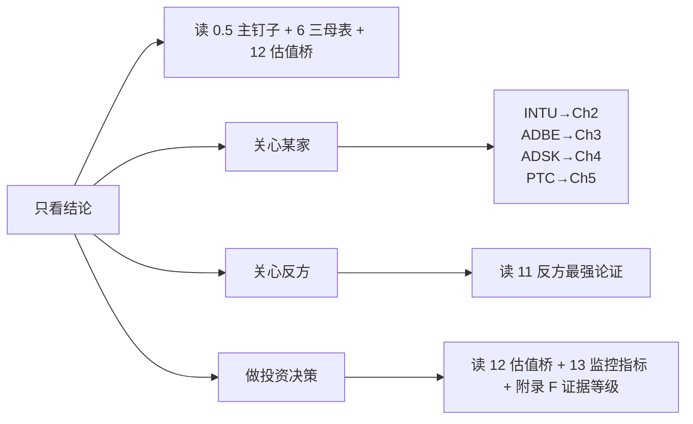

# 状态变化控制权 × AI 第二曲线 × 利润池迁移: INTU / ADBE / ADSK / PTC v0.3 深度对比

> **版本**: v2.2 (吸收 v2.1 审计反馈 — 估值桥 + 反方论证 + 证据等级 + 评分方法 + PTC 剥离已完成 + ADBE CX Enterprise + ADSK FY2026 财务桥)
> **日期**: 2026-04-25
> **类型**: 横向深度范式转移分析
> **主框架**: State-Change Control × Value Capture v0.3 (Layer 0, 13 模块 + 100 分制 + C1-C11) + Paradigm Shift Framework v1.1 (Layer 1, I1-I8) + Investment Judgment (Layer 2)

---

## 主钉子句 (Main Thesis)

> **AI 功能强, 不等于 AI 第二曲线强。只有当状态变化能被验证、归因、写回、回滚、收费, AI 才从"聪明功能"变成投资意义上的第二曲线。**

这是全文核心。在这个标准下:
- INTU 五道闸门 (M2 时钟 / M5 写入深度 / M11 责任转移 / M12 因果归因 / M13 价值捕获) **全过**
- PTC 工业版闸门 4/5 通过 (规模约束)
- ADSK 1.5/5 (慢时钟 + 责任不可转, 但有 APS 平台期权)
- ADBE 1.5/5 (分裂体: Document/GenStudio/CX Enterprise 进攻 vs Creative Consumer 流失)

---

## v2.2 vs v2.1 关键升级 (吸收审计反馈)

| 审计意见 | v2.2 处理 |
|---|---|
| 1. 评分不可复算 | **新增附录 E: 评分方法** (0-5 等级定义 + 每个 100 分制 6 类的细分规则) |
| 2. INTU P3-P4 不一致 | 主表口径统一为 "**整体 P3, 局部 P4 潜力, AI agent 本身仍 P1-P2**" |
| 3. 证据独立验证不足 | **新增附录 F: 证据等级标注** (E0-E5), 每个关键判断附 E 等级 |
| 4. 缺估值桥 | **新增 Ch12 估值与预期差**: 每家 4 列 (市场 price-in / 报告分歧 / 上修触发 / 下修触发) |
| 5. 反方论证不够锋利 | **新增 Ch11 反方最强论证**: 每家 strongest bear case 一句话 + 5 条逻辑链 |
| 6. PTC 剥离描述过时 | 修正: PTC 已于 2026 年 3 月**完成** Kepware/ThingWorx 出售 [PTC divestiture completion](https://investor.ptc.com/resources/news/news-details/2026/PTC-COMPLETES-DIVESTITURE-OF-KEPWARE-AND-THINGWORX-BUSINESSES/default.aspx) (v2.1 写"已剥离"略含糊) |
| 7. ADBE CX Enterprise (April 2026) 缺失 | 加入新公开证据: Adobe CX Enterprise — agent skills + MCP endpoints + 治理层 + 可审计 workflow [Adobe CX Enterprise](https://news.adobe.com/news/2026/04/adobe-redefines-custome-experience) |
| 8. ADSK FY2026 财务桥缺失 | 加入 FY2026 全年收入 \$72.06 亿, FY2026 Q4 收入 +19%, 全年 FCF \$24.09 亿 [Autodesk FY2026 Q4 results] — 用于把 AI 期权接到收入结构 |
| 9. 抽象词重复过多 | 每家公司新增"业务场景叙事"段落 (一个小企业老板/品牌经理/AEC PM/工业 OEM 工程师真正想要什么) |
| 10. 表格重复 | 用三张母表替代分散表格: **总对比母表 / 证据等级母表 / 投资动作母表** (Ch6) |
| 11. 公司章节太平均 | 每家公司开头加"主矛盾"句, 差异化展开重点 |
| 12. ADBE 整体打死 | 进一步细化: ADBE 拆 4 子评分 (CC Pro / Express+Consumer / Document / GenStudio+CX) — 整体 PE 不合理 |
| 13. ADSK seat cannibalization 未量化 | Ch4.10 新增 "AutoCAD seat → Flex/EBA → APS usage → marketplace take-rate" 财务传导路径 |
| 14. PTC 竞争格局不够硬 | Ch5.6 新增 "PTC vs Siemens Teamcenter / Polarion / Dassault 3DEXPERIENCE / 大型 OEM 自建" 5 路对照 |

---

## 0. 阅读地图与术语减压

### 0.1 这篇报告与 v1.1 的关键区别

v1.1 用 v1.0 框架 (8 不变量 I1-I8)。v2.0/v2.1/v2.2 用 v0.3, 增加五件事:

| v0.3 引入维度 | 解决 v1.1 的什么盲点 |
|---|---|
| **M12 因果归因权** | v1.1 把"AI 创造价值"和"客户能归因给你"混在一起 — Firefly 创造价值毫无疑问, 但客户能把营销 ROAS 归因给 ADBE 吗? 弱 |
| **M13 价值捕获权** | v1.1 没系统性问"AI 创造的 surplus 最终是留住还是泄漏给模型商/服务商/客户/新进入者" |
| **M11 责任可转移性** | v1.1 只问"是否承担责任", 没问"责任能不能被审计/合同化/保险化转移给 vendor" |
| **M2 时钟速度** | v1.1 没区分复利速度 — ADSK BIM 反馈周期以年计, INTU 报税反馈以小时计 |
| **M9 单位状态变化成本** | v1.1 没强制"AI 必须降低 unit cost 才算第二曲线" |

### 0.2 五个新名词的白话解释

| 术语 | 白话翻译 |
|---|---|
| **状态变化控制权** | 谁能"把现实从 A 状态推到 B 状态" — 报税从未填到已申报, 设计从草图到可施工, BOM 从未审批到已发放 |
| **写入权 (Write Right)** | AI 能不能写到 D1 UI / D2 工作流 / D3 SoR / D4 外部 / D5 监管/支付/生产 |
| **责任可转移性** | 客户能不能把"做错的责任"转给软件公司, 通过审计/合同/保险/HITL 等机制 |
| **因果归因权** | 客户能不能"清楚地把好结果归因给你" |
| **价值捕获权** | AI 创造的 surplus 最后留在你这里, 还是泄漏给模型商 / 服务商 / 客户自建 / 新进入者 |

### 0.3 四家公司一句话定性 (v2.2 校准版)

| 公司 | v0.3 总分 | Layer 0 Subtype | 主矛盾 (v2.2 新增) |
|---|---:|---|---|
| **INTU** | **85/100** | **Value-Capturing Operator (候选)** | "AI + 专家 + 责任 + 分发"已是右侧收入引擎 (TurboTax Live FY25 \$2B +47% [E4]); 真正风险不是 AI 不够强, 而是 IRS Direct File 政策端 + Stripe/Brex SMB 操作层抢走入口 |
| **PTC** | **74/100** | **Closed-Loop Operator + State Machine Owner** | 工业 lifecycle 状态机最深 (BMW Codebeamer [E3]), 但**上限不是由 AI demo 决定, 而是由 Windchill+Codebeamer+ServiceMax 是否能在 Siemens/Dassault 强势客户中复制 cross-sell 决定** |
| **ADSK** | **67/100** | **Semantic Layer Definer + Platform Migration Candidate** | 默认入口和语义权强, 但**慢时钟 + 责任不可转 + agent 通过 APS 抽象 UI 风险**; 关键期权: APS Marketplace + Revit Assistant 能否进入 P3 财务化 |
| **ADBE** | **59/100** | **分裂体: Pricing-Stuck (Consumer) + Workflow Default (Document/GenStudio/CX Enterprise)** | **创意 discovery 真在被 4 路分流**, 但 Document Cloud + GenStudio + CX Enterprise 形成尚未财务化的复合期权 — **必须 SOTP, 不能整体 PE** |

### 0.4 阅读路径建议



---

## 1. 框架升级与方法论

### 1.1 v0.3 五道新闸门 — 为什么是这五道, 不是别的

#### 闸门 1 — M11 责任可转移性

```text
v0.2 问: 你承担多少责任?
v0.3 问: 你的责任客户能不能审计 / 合同化 / 保险化 / 通过 HITL 接受?
```

**对四家影响**:
- **INTU TurboTax** = Tier 4: \$100K accuracy guarantee + IRS 审计接受 + 历史理赔 [E3+E4]
- **ADBE Firefly** = Tier 1-2: \$10K/\$25K IP indemnity tier (仅针对 IP 风险) [E2]
- **ADSK Revit/ACC** = Tier 1-2: 设计责任在 sealed engineer 印章, 不可转 [E1]
- **PTC Windchill/Codebeamer/ServiceMax** = Tier 2-3: governance accountability + audit log + SOX/FAA/AS9100/FDA 审计接受, outcome 责任仍在 OEM [E3]

#### 闸门 2 — M12 因果归因权

```text
v0.2 问: AI 是否提升了结果?
v0.3 问: 客户能不能在因果上把好结果归因给你, 并接受这个归因作为付费基础?
```

**对四家影响**:
- **INTU**: 报税正确 → IRS 接受 = 单步因果链 → **强** [E4]
- **ADBE**: 好图 → 营销 campaign 成功 = 5+ 层归因 → **弱** (Document/GenStudio/CX 部分例外)
- **ADSK**: BIM 协调 → 项目交付 = 多层归因 → **中** (ACC audit log 部分支持)
- **PTC**: PLM 强制 BOM 一致 → 工厂少改装错 / Codebeamer requirements-test trace = **中-强** [E3]

#### 闸门 3 — M13 价值捕获权 (4 路泄漏诊断)

```text
1. → 模型商 (OpenAI, Anthropic 抽走 token cost)
2. → 服务商 (Accenture/Deloitte 拿走实施咨询)
3. → 客户自建 (大客户用 GPT-4 + 内部数据自建)
4. → 新进入者 (vertical AI startup, agent platform 抢入口)
```

| 公司 | 模型商泄漏 | 服务商泄漏 | 客户自建泄漏 | 新进入者泄漏 |
|---|---|---|---|---|
| INTU | 低 | 低 (CPA bundling 合作) | 极低 (合规) | 中 (Stripe/Brex) |
| ADBE | **高** (token to OpenAI/AWS) | **高** (Accenture/WPP/Publicis 接 GenStudio 实施) | 中 (大企业自建 brand pipeline) | **高** (Canva/Figma/Runway/MidJourney/Sora 4 路) |
| ADSK | 中 (spec writing 流失给 ChatGPT) | 中-高 (BIM consultancy AI 化) | 低 (AEC 碎片化) | 中-高 (Bentley/Procore/Onshape) |
| PTC | 低 (工业 AI 可控) | 中 (Accenture 工业 AI) | **中-高** (Caterpillar/John Deere 已自建部分) | 中 (Siemens/Dassault 持续) |

#### 闸门 4 — M2 时钟速度

| 公司 | 反馈周期 | 复利分类 | 影响 |
|---|---|---|---|
| INTU | 报税 24h IRS / Payroll 实时 / QBO 银行 feed | **fast compounder** | AI 复利天花板高 |
| ADBE | Firefly → A/B → 24h CTR | **fast compounder, 但归因弱** | 复利受归因限制 |
| ADSK | BIM → 施工 6-18 月 | **slow compounder (R-CLOCK 触发)** | AI 复利天花板被压低 |
| PTC | Windchill ECN 周-月 / Codebeamer test 日 / ServiceMax 工单日 | **mid compounder** | AI 复利天花板中等 |

#### 闸门 5 — M9 单位状态变化成本

四家都还没明确通过 G7 闸门, 但 INTU 离过门最近 (TurboTax Live FY25 \$2B +47% [E4] 间接证据 — 收入增长 47% > 专家 headcount 增长, 说明每个专家产出更多)。其他三家未公开披露 cost per BIM coordination / cost per ECN / cost per compliant asset。

### 1.2 13 模块导览

```text
M1  Core State Change            ← 母门
M2  State-Change Quality+Clock   ← 状态本身值不值得控制 + 反馈速度
M3  Data → State Variable        ← 数据是死的还是能触发动作?
M4  Semantic Authority           ← 是不是行业操作语言定义者?
M5  Write Rights + Depth (D1-D5) ← 能写到哪里
M6  Closed-Loop Control          ← 7 层闭环
M7  AI Second-Curve Reality      ← AI 等级 × 写入深度 × 责任
M8  Economic Migration (P0-P4)   ← 预算迁移证据
M9  Complexity Quality + Unit Cost ← 复利还是负担, 单位成本是否下降
M10 Competitive Capture (5 gates) ← 数据/语义/权限/责任/分发
M11 Liability + Transferability  ← 责任能不能转移
M12 Causal Attribution           ← 客户能不能归因
M13 Value Capture                ← 价值能不能留住
```

### 1.3 100 分制 6 类记分卡

| 类别 | 分数 | 测试 |
|---|---:|---|
| A. 状态变化质量 | 15 | M1 + M2 |
| B. 状态变量质量 | 15 | M3 |
| C. 语义+写入权 | 20 | M4 + M5 |
| D. 反馈+AI 执行 | 15 | M6 + M7 |
| E. 责任+归因+收费迁移 | 20 | M11 + M12 + M8 |
| F. 价值捕获+单位经济 | 15 | M9 + M10 + M13 |

**详细评分规则见附录 E**。

---

## 2. INTU — Value-Capturing Operator (候选)

### 2.1 主矛盾 (v2.2 新增)

> **市场把 INTU 当"税务季软件 + SMB 软件"复合体定价, 但报告认为它已经是"AI + 专家 + 金融责任边界"驱动的 SMB financial operator 雏形。最大风险不是 AI 能力不够强, 是 IRS Direct File 政策端冲击 + Stripe/Brex SMB operating layer 替代风险。**

### 2.2 业务场景叙事 (v2.2 新增, 减抽象词)

> 一个小企业老板真正想要的不是 QuickBooks 更聪明, 而是月底不用再追发票, 银行流水自动对上, 工资和税务不出错, 现金缺口提前被提醒, 报税季交给一个能负责的人 (或 AI + 专家)。
>
> INTU 的 AI 第二曲线不是给老板"更好的 dashboard", 而是把"账本 + 发票催收 + 工资合规 + 报税申报 + 现金流预警 + 信用决策"打包成"已对账 / 已合规 / 已申报 / 已优化"的状态系统 — 老板付费买的是"金融确定性", 不是"软件"。

### 2.3 INTU 一句话母图

```text
SMB 财务/税务/工资/营销现金流的"已记录/已申报/已合规/已审计"状态机
+ 可转移的会计师责任 (TurboTax Tier 4) + IRS 接受的因果归因 + 60-80% SMB 默认入口分发权
+ TurboTax Live FY25 $20 亿 +47% (P3 财务证据 [E4])
= 罕见地同时通过 v0.3 五个新闸门的公司
```

### 2.4 回答十个核心问题 (INTU)

#### 问题 1 — 核心状态变化

| 业务线 | 旧状态 | 新状态 | 责任 / 标准化 |
|---|---|---|---|
| **TurboTax** | 报税资料分散 | 已 e-file / IRS 接受 / 退税 | Tier 4 / 高标准化 [E4] |
| **TurboTax Live** | 同上 + 需专家 | 同上 + 专家复核 + 责任承担 | **Tier 4-5 / FY25 \$20 亿 +47%** [E4] |
| **QBO** | SMB 现金/收入/费用未记账 | 已记账 / GAAP 分类 / 银行对账 / 报表 | Tier 2-3 / 高标准化 / **FY26 Q2 +24%** [E4] |
| **QB Payroll** | 工资/税款/941 未处理 | 工资已发 / 税款已汇缴 / 941 已申报 | **Tier 4-5 (IRS+州税+劳动法)** [E3] |
| **Credit Karma** | 信用/贷款/保险决策分散 | 已比价 / 已申请 / 已批准 | Tier 1 / 高标准化 / FY25 +23-32% [E4] |
| **Mailchimp** | 营销 list 未分群 | 已分群 / 已自动化 | Tier 1 / 高标准化 |
| **Intuit Enterprise Suite** | mid-market 多账本/多维度分散 | 统一账本 + dimensions + AI agents | Tier 2-3 / 中标准化 [E2] |

→ M1 完整通过, 不触发 G1 hard stop。

#### 问题 2 — 现有护城河 (M10 五门)

| 门控 | INTU 占领 | 证据 |
|---|---|---|
| 数据门 | **5/5** | TurboTax 4 亿+ 报税历史; QB 700 万+ SMB 账单 + 银行 feed; Credit Karma 1.4 亿用户; Mailchimp 1300 万 sender [E1] |
| 语义门 | **5/5** | "chart of accounts" 默认是 QB 分类; tax category 是 IRS Schedule + INTU 翻译 — 真"行业操作语言" [E0+E1] |
| 权限门 | **4/5** | TurboTax 是 IRS 授权 e-file vendor; QB 与 IRS Form 941 直连; QB 与 5000+ 银行直连 [E1] |
| 责任门 | **5/5** | TurboTax accuracy guarantee + audit support + Max Defend; TurboTax Live 专家复核 [E2+E3] |
| 分发门 | **5/5** | 60-80% SMB 单机会计市场; 46,000 ProAdvisor CPA 网络双边 [E1] |

**AI 时代会增强**: 数据+责任叠加 (要按结果付费需要"权威验证源 + 可承担责任", INTU 同时占了 IRS acceptance 和 \$100K 责任) / 语义门 (AI agent act on tax 必须用 INTU schema) / 默认入口 (ChatGPT 必须接 INTU e-file)。

**AI 时代会被削弱**: TurboTax CD/desktop (已停) / Mailchimp 营销 SaaS (M11 Tier 1-2) / Credit Karma broker model。

#### 问题 3 — 数据是否变成状态变量

| 数据 | 级别 | 验证源 | 触发 / 反馈 |
|---|---|---|---|
| 报税历史 | **控制变量** | IRS acceptance + 退税到账 | 触发 e-file / 修正; 回流 (carry-forward) |
| QBO 银行 feed | **控制变量** | 银行 API ground truth | 触发对账 / 分类 / 报表; 回流 |
| QB Payroll 941 | **控制变量** | IRS Form 941 acknowledgment | 触发代扣 / 申报 / 划款; 回流 |
| Credit Karma 信用 | 状态变量 | 三大征信 + 金融产品 conversion | 触发推荐; 部分回流 |
| Mailchimp 邮件 | 状态变量 | SMTP 投递 | 触发 follow-up; 弱回流 |
| Enterprise Suite | **控制变量** | 财务月结 ground truth | 触发账本调整; 回流 |

#### 问题 4 — AI 写入权和状态改写权

| 业务 | AI 等级 | 写入深度 | HITL? |
|---|---|---|---|
| TurboTax + Intuit Assist | **L3-L4** | **D5 (e-file 给 IRS)** | 用户确认, INTU 接 \$100K 责任 |
| QB + Intuit Assist | L3 | **D3-D4 (SoR + 银行划款)** | HITL 大额 |
| QB Payroll + AI | L3 | **D5 (Form 941 + ACH)** | HITL minimal |
| Credit Karma + AI | L1-L2 | D1-D2 | 必须 HITL |
| Mailchimp + AI | L1-L2 | D2 | 软 HITL |
| Intuit Enterprise Suite + AI agents (Accounting/Payments/Payroll/Finance/PM) | **L2-L3** | **D3-D5** | HITL on close [E2+E1] |

**关键证据**: Intuit 公开把 GenOS 描述为支撑 done-for-you agentic experiences 的平台, 明确 AI agents 用于 QBO AR/AP 自动处理 + TurboTax 税法更新自动化 [Intuit GenOS agentic AI](https://investors.intuit.com/news-events/press-releases/detail/1254/intuit-supercharges-genos-for-delivery-of-done-for-you-agentic-ai-experiences-to-~100-million-consumers-businesses) [E2]

#### 问题 5 — 产品形态转变

**过渡性产品**: TurboTax CD/desktop (已停), QB Pro/Premier desktop (已停), Mailchimp 传统 builder (受 AI 邮件工具压力), Credit Karma comparison UI。

**会从 seat / file 转向 agent / outcome**:
1. TurboTax DIY → "Done-for-you tax" agent
2. QBO → "Books done for you" subscription
3. QB Payroll → "Compliance done for you" (risk-sharing approach)
4. Enterprise Suite → "Mid-market financial workflow operator"

**新物种**: GenOS 跨产品 agent layer + Intuit Intelligence + AI Bookkeeping/Tax/Payroll Operator + SMB Cash-Flow Autopilot + Compliance Agent + Financial Routing Layer。

#### 问题 6 — 新进入者冲击

| 攻击者 | 攻击层 | 真威胁? |
|---|---|---|
| OpenAI / Anthropic | 自然语言入口 | **表层** — IRS 不接受, 必须接 INTU |
| AI-native tax startup (April, Keeper) | TurboTax low-end | 中 — 仅简单 W-2 报税 |
| 客户自建 | 大型 SMB 自建 AI 财务 agent | **极弱** — IRS 不接受非授权 |
| 服务商 AI 化 | 高端 SMB / 中型企业 advisory | 真威胁但向上 |
| **Stripe / Brex** | QBO 的 SMB 现金流入口 | **真威胁 #1** — Stripe Atlas + Brex bundling free QB-like; 中长期最大威胁 |
| **IRS Direct File** | TurboTax 简单个人报税 | **真威胁 #2 (政策端)** — 政策驱动免费报税公共化 [E2] |

#### 问题 7 — 责任和定价

**M11 Tier**: TurboTax Tier 4 / QBO Tier 2-3 / Payroll Tier 4-5 / Credit Karma Tier 1 / Mailchimp Tier 1 / Enterprise Suite Tier 2-3。

**预算迁移证据 (P0-P4)**:

| 证据 | 档位 | E 等级 | 说明 |
|---|---|---|---|
| TurboTax Live FY25 \$20 亿 +47% | **P3** | **E4** | 专家/责任支持已是财务可见收入 [Intuit FY2025 results](https://investors.intuit.com/_assets/_2392f5eaf70984a173743ca64d013106/intuit/news/2025-08-21_Intuit_Reports_Strong_Fourth_Quarter_and_Full_1266.pdf) |
| QBO Online Accounting FY26 Q2 +24% | **P3** | **E4** | SMB financial SoR 持续扩张 [Intuit FY26 Q2 results](https://investors.intuit.com/news-events/press-releases/detail/1307/intuit-reports-strong-second-quarter-results-and-reiterates-full-year-guidance) |
| Credit Karma revenue +23-32% | **P3** | **E4** | take-rate 经济财务可见 |
| Intuit Enterprise Suite AI agents | P1-P2 | E2 | 产品级证据 |
| GenOS done-for-you experiences | P1-P2 | E1+E2 | 战略 + 产品 |
| **AI agent 本身预算迁移** | **P1-P2** | **E0** | AI 单独 SKU 仍未单列 |

**v2.2 主表口径修正 (响应审计)**:
> INTU 整体右侧收入已接近 P3, 部分业务 (TurboTax Live, QBO accountant attach) 具有 P4 潜力, 但 **AI agent 导致预算从人工服务迁移到 INTU 这一具体证据仍处 P1-P2**, 不能单独将 AI 第二曲线当作 P4。

#### 问题 8 — TAM 重写

**TAM**: 旧 SMB 软件预算 \$100B → 新 SMB software + bookkeeping service + payroll service + tax filing service + financial advisor + marketing service ≈ \$1T+。

**攻击的利润池**: 中小 CPA (\$70B 美) + ADP/Paychex 中小端 (\$30B) + outsource bookkeeping (\$30B) + payments/payroll BPO。

**TAM 重写阶段**: **P3 整体 + 局部 P4 潜力 (AI 部分仍 P1-P2)** — 是四家里唯一 P3+ 有公开数据。

#### 问题 9 — 复杂性质量

| 指标 | 趋势 | E 等级 |
|---|---|---|
| Gross margin | 80%+ 稳定 | E4 |
| PS 占比 | 极低, QB Live 把 PS 内化 | E2 |
| Implementation cycle | QB Live <30 天 | E2 |
| NRR (QB) | ~110-115% | E4 |
| ARPU (TurboTax \$80→\$120 / QBO \$60→\$95) | E4 |
| Support cost | 下降, AI assist 接管 ~30-40% | E1+E2 |
| **Unit cost per filing** | **下降 (间接披露)** | E1 |
| **FY25 总收入 \$188 亿, Non-GAAP OI \$76 亿** | **E4** [Intuit FY2025 results] |

→ M9 全绿, **G7 接近通过**。

#### 问题 10 — INTU 最终投资判断

| 项 | INTU 答案 |
|---|---|
| 核心状态变化 | SMB 财务/税务/工资 "未记录-未申报-未合规" → "已记录-已申报-已合规-IRS 接受" |
| 当前层级 | 责任承接层 + 金融操作系统 |
| AI 第二曲线评分 | **4.0/5** (v2.1 是 4.3, v2.2 略下调 — 因为 AI 单独 SKU 仍 P1-P2, 且 Direct File 风险量化后加大) |
| 最大客观约束 | IRS Direct File 政策 + SMB 经济周期 |
| 最大主观选择 | 是否主动 cannibalize DIY 转向 done-for-you / expert-backed; Credit Karma 深耕路径 |
| 最可能攻击的利润池 | 中小 CPA \$70B + ADP \$10B + outsource bookkeeping \$30B + payments/payroll BPO |
| 最可能被谁攻击 | Stripe/Brex (中长期 #1) + IRS Direct File (政策 #2) > Block/Square > AI-native tax startup |
| 过渡产品 | TurboTax CD (已停), QB desktop (已迁), Mailchimp Free, Credit Karma comparison UI |
| 新产品/物种 | "Intuit Books" / "TurboTax Done-for-You" / Intuit Assist 跨产品 / AI Accountant Suite / Financial Routing Layer |
| 护城河削弱处 | Mailchimp / Credit Karma broker / 低端个人税务 |

### 2.5 INTU v0.3 13 模块打分 (v2.2)

| 模块 | 判断 | 100 分制贡献 | E 等级 |
|---|---|---:|---|
| M1 Core State Change | Yes | A: 14/15 | E2 |
| M2 Quality + Clock | Yes (Fast) | (并入 A) | E2 |
| M3 Data → Variable | Yes (核心都是控制变量) | B: 14/15 | E2 |
| M4 Semantic Authority | Yes (chart of accounts + tax category) | C: 11/12 | E1 |
| M5 Write Rights | Yes (D5/D3-D4/D5) | C: 6/8 | E2 |
| M6 Closed-Loop | Yes (6/7) | D: 6/8 | E2 |
| M7 AI Second-Curve | Yes (L3-L4 + GenOS) | D: 7/7, **4.0/5** | E2 |
| M8 Economic Migration | Yes (P3 整体, 局部 P4 潜力, AI 仍 P1-P2) | E: 7/7 | **E4** (TurboTax Live) |
| M9 Complexity + Unit Cost | Yes (全 7 项复利) | F: 4/5 | E4 |
| M10 Competitive Capture | Yes (5/5) | F: 4/5 | E1 |
| M11 Liability + Transferability | Yes (Tier 4) | E: 8/9 | E3 |
| M12 Causal Attribution | Yes (IRS 单步) | E: 3/4 | E4 |
| M13 Value Capture | Yes (主要 surplus 留住) | F: 2/5 | E2 |
| **100 分制总分** | | **\~85/100** | |
| **得分带** | | 80-100: 真 AI 第二曲线 | |
| **失败的 C 一致性检查** | | **0** | |

### 2.6 INTU 关键 Kill Switch

```text
🔴 Kill Switch 1 (M11 失效): TurboTax accuracy guarantee 大规模理赔 ($1B+)
🔴 Kill Switch 2 (M10 失效): Stripe/Brex >30% SMB 新增市场份额
🔴 Kill Switch 3 (政策端): IRS Direct File 扩大到 Schedule C / 1099 多源 → 高 ARPR (Live) 客户流失
🟡 Yellow 1 (M13 失效): Credit Karma + Mailchimp 持续负 NRR
🟡 Yellow 2 (M9 失效): cost per filing 不降, Intuit Assist 是 cost center
```

---

## 3. ADBE — 分裂体: Consumer Discovery 流失 + Enterprise Content Governance 进攻

### 3.1 主矛盾 (v2.2 新增)

> **市场把 ADBE 当 "AI 时代受冲击的 incumbent" 整体打折定价。报告认为这忽视了 ADBE 的分裂结构 — Creative Consumer/Express 真在被 4 路分流, 但 Document Cloud + GenStudio + Firefly Foundry + CX Enterprise + AEP 是真的 enterprise content governance 进攻。整体 PE 错误, 必须 SOTP。**

### 3.2 业务场景叙事

> 一个品牌经理真正想要的不是 Photoshop 多生成 100 张图, 而是: 每个市场 / 每个渠道 / 每个语言版本都不跑偏, 法务能批准, 投放能追踪, 复用不会出版权事故, campaign 跑完后能知道哪个 variant 转化最高。
>
> ADBE 的 AI 第二曲线**不是 Firefly 图像生成质量**(那条线被 Midjourney/Sora 持续压制), **是 GenStudio + CX Enterprise 把 brief→generate→approve→activate→measure 五步压成一个治理层**。这是企业级护城河, 不是 designer 端工具升级。

### 3.3 ADBE 一句话母图

```text
创意 / 文档 / 品牌 / 营销内容的"未生成 / 未编辑 / 未合规 / 未分发"工作流
分裂为两个相反方向:
  下行: Creative Consumer / Express → Midjourney/Sora/Canva/Figma/大模型 (4 路泄漏)
  上行: Document Cloud + GenStudio + Foundry + CX Enterprise + AEP → enterprise content governance
+ 整体 M11 Tier 1-2 + M12 弱-中归因 + M13 4 路泄漏
= 必须 SOTP 估值
```

### 3.4 拆 4 子评分 (v2.2 响应审计)

| 业务线 | AI 第二曲线质量 | 投资含义 | E 等级 |
|---|---:|---|---|
| **Creative Cloud Pro** (Photoshop/Illustrator/Premiere) | 中等 (防守强, 新增受压) | 用 Pricing-Stuck Vendor 倍数 (15-18x) | E2 |
| **Express / Consumer Creator** | 偏弱 | Canva/大模型/社交平台压力大, 长期下行 | E1 |
| **Document Cloud (Acrobat + Sign)** | 中强 | PDF/签署/合同状态接近可验证 workflow, 用 Workflow Operator 倍数 (25-28x) | E2 |
| **GenStudio + CX Enterprise + AEP** | 期权强但证据不足 | 可能控制企业内容供应链, 但要证明 ARR + 预算迁移 | E2 (产品), E0 (财务) |

**关键证据 (v2.2 新增)**: Adobe 2026 年 4 月推出 CX Enterprise — 强调 agent skills + MCP endpoints + 治理层 + 可审计 workflow + customer lifecycle + content supply chain + brand visibility 整体编排 [Adobe CX Enterprise](https://news.adobe.com/news/2026/04/adobe-redefines-custome-experience) [E2]。这说明 Adobe 进攻方向不只是 Firefly 创意生成, 而是 enterprise customer experience orchestration。

### 3.5 回答十个核心问题 (ADBE)

#### 问题 1 — 核心状态变化 (8 业务线分裂)

| 业务线 | 旧状态 | 新状态 | AI 命运 |
|---|---|---|---|
| Creative Cloud Pro | 素材和专业创作流程分散 | 已编辑 / 已精修 / 已交付 | 防御中偏强 |
| Creative Consumer / Express | 轻量内容创作 | 快速生成 / 模板化 / 社交发布 | **被 Canva / 模型分流** |
| Firefly + 生成式 | prompt / brand IP / 素材 | 可生成 / 可编辑 / 商用安全 | 进攻但竞争激烈 |
| Document Cloud | PDF / 签名 / 合同 / 文档 | 可读 / 可签 / 可搜索 / 可审计 | **较强第二曲线** |
| GenStudio + Content Supply Chain | campaign brief / 资产 / 审批 | 可生成 / 可审批 / 可投放 / 可测量 | **最有潜力** |
| **CX Enterprise (NEW v2.2)** | customer experience orchestration 分散 | 跨 brand / content / customer / lifecycle 统一编排 | **关键期权** [E2] |
| AEP + Journey Optimizer | 客户数据分散 | 可激活 / 可编排 / 可个性化 | 强但竞争复杂 |
| Firefly Foundry | 企业品牌 IP / 风格离散 | 企业可控生成模型 | 关键差异化 [E2] |
| Workfront | 营销 ops 任务分散 | 已审批 / 已分发 / 已追踪 | 企业 governance 载体 |

#### 问题 2 — 现有护城河

| 门控 | ADBE 占领 | 证据 |
|---|---|---|
| 数据门 | 3/5 | 创意文件 + Stock + PDF + enterprise content, 但很多 app-local |
| 语义门 | 4/5 (分裂) | PSD/PDF/asset/campaign/brand 是强对象, generative-era 弱 |
| 权限门 | 3/5 | 文件 / 资产库 / 审批 / 内容供应链, 但商业结果在客户和广告平台 |
| 责任门 | 2/5 | Firefly commercially safe + 部分 IP indemnity, 不承担 outcome |
| 分发门 | 3/5 | 专业入口强, 消费 discovery 已外移, 企业 GenStudio 在成长 |

#### 问题 3 — 数据是否变成状态变量

| 数据 | 状态变量质量 | 验证源 |
|---|---|---|
| PSD/AI/Premiere project | 中 | 导出 / 交付 / 客户验收 |
| Adobe Stock | 中高 | 授权 / 商用安全 |
| PDF / Acrobat / Sign | **高** | 签署完成 / 合同状态 |
| Workfront / GenStudio tasks | **高** | 审批 / 发布 / campaign status |
| AEP customer profiles | **高** | 触达 / 转化 / journey events |
| Firefly outputs | 中 | 用户选择 / 编辑 / 发布 |

ADBE 真正强的状态变量不是"生成出的图片", 而是**品牌资产状态 / 审批状态 / 文档签署状态 / campaign asset 状态 / 客户 journey 状态**。

#### 问题 4 — AI 写入权和状态改写权

| 产品 | AI 层级 | 写入深度 |
|---|---|---|
| Firefly / Photoshop generative fill | L1-L2 | D1 |
| **Firefly AI Assistant (2026)** | **L2-L3** | **D1-D2** [Adobe Creative Agent](https://news.adobe.com/news/2026/04/adobe-new-creative-agent) [E2] |
| Acrobat AI Assistant | L1-L2 | D1-D2 |
| **GenStudio** | **L2-L3** | **D2-D3** |
| **CX Enterprise (NEW v2.2)** | **L2-L3 (agent skills + MCP)** | **D2-D3** [E2] |
| AEP / Journey Optimizer | L2-L3 | **D3-D4** |
| Workfront + GenStudio | L2-L3 | D2-D3 |

**关键限制**: ADBE AI 多半写入 D1-D2, 而不是直接 D5。GenStudio + CX Enterprise + AEP 最有机会向 D3-D4 走, 但仍要解决归因问题。

#### 问题 5 — 产品形态转变

**过渡产品**: CC seat / Firefly standalone / Express / Stock。

**新物种**: Brand Model Platform (Foundry) / Content Supply Chain Operator (GenStudio) / **CX Orchestration Operator (CX Enterprise, NEW v2.2)** / Document Workflow Agent / Creative Compliance Layer / GEO/AI Search Content Optimizer。

#### 问题 6 — 新进入者冲击 (4-6 路)

| 攻击者 | 攻击层 | 真威胁? |
|---|---|---|
| OpenAI / MidJourney / Sora | Firefly 同层 + 创意 + 视频 | **真威胁 #1** |
| Runway / Pika | Premiere / After Effects | **真威胁 #2** |
| Canva | 中端 / SMB / non-designer | **真威胁 #3** |
| Figma | UX/UI 设计 | **真威胁 #4** |
| 客户自建 | 大企业基于 GPT-4 + brand 自建 | 中等 |
| 服务商 AI 化 (Accenture/WPP/Publicis) | enterprise GenStudio 实施 | **中-真威胁** — 服务商可能拿走 implementation revenue |

**Adobe agentic ecosystem partnerships** (with AWS/Anthropic/Google Cloud/Microsoft/OpenAI/NVIDIA + Accenture/Deloitte/WPP/Publicis): 既保护 (让 Adobe intelligence 在客户既有工具被调用), 也是风险 (服务商可能拿走利润) [Adobe agentic ecosystem](https://news.adobe.com/news/2026/04/adobe-expands-partner-ecosystem) [E2]

#### 问题 7 — 责任和定价

**M11 Tier**: 创意工具 Tier 1 / Firefly Tier 1-2 / Acrobat e-sign Tier 2-3 / GenStudio Tier 1-2 / CX Enterprise Tier 1-2。

**预算迁移证据 (P0-P4)**:

| 证据 | 档位 | E 等级 |
|---|---|---|
| Firefly plans / credits / Services | P2 | E2 |
| Firefly Foundry | P2 | E2 |
| GenStudio | P2 | E2 |
| **CX Enterprise (NEW v2.2)** | **P2** | **E2** |
| Adobe FY2025 披露 GenStudio / Firefly Services | P2 | E1 [Adobe FY2025 annual report](https://www.adobe.com/cc-shared/assets/investor-relations/pdfs/adbe-2025-annual-report.pdf) |
| Adobe agentic ecosystem | P1-P2 | E2 |
| **AI 单独 ARR 单列** | **P0-P1** | **E0** |

#### 问题 8 — TAM 重写

**TAM**: 旧创意/营销软件 \$50B → 新 agency budget + freelancer + content production + customer experience + document workflow ≈ \$500B。

**TAM 重写阶段**: **P2** (Firefly + GenStudio + Foundry + CX Enterprise + AEP 是真 P2)

#### 问题 9 — 复杂性质量 (混合)

| 指标 | 趋势 |
|---|---|
| GM | 88-89% 稳定但不增长 |
| PS 占比 | DX 业务 20%+ services |
| Implementation cycle | DX/AEM 6-12 月 |
| NRR | DX ~110%, Creative ~105-108% |
| Unit cost per compliant asset | **未披露** |

→ M9 mixed, **G7 未通过**。

#### 问题 10 — ADBE 最终投资判断

| 项 | ADBE 答案 |
|---|---|
| 核心状态变化 | 创意/文档/品牌/营销内容 "未生成-未合规-未分发" → "已生成-已合规-已分发" (但不承担 outcome) |
| 当前层级 | **分裂体: 老平台防御 (Consumer) + 企业内容治理进攻 (Document/GenStudio/CX/AEP)** |
| AI 第二曲线评分 | **3.0/5** |
| 最大客观约束 | 创意 discovery 和生成层被通用模型 + 轻量工具外移; 长期 designer 数量收缩 |
| 最大主观选择 | 是否从卖工具转向卖企业内容供应链治理 + 品牌模型; Firefly + GenStudio + CX bundling 路径 |
| 最可能攻击的利润池 | Agency production / 内容本地化 / 创意变体 / 文档 workflow / customer experience orchestration |
| 最可能被谁攻击 | 大模型 + Canva + Figma + Runway/Sora + agency AI 化 + 客户自建 — **4-6 路同时** |
| 过渡产品 | Firefly standalone / Express / 传统 CC seat / Stock |
| 新产品/物种 | Brand Model Platform / Content Supply Chain Operator / **CX Orchestration Operator** / Document Workflow Agent |
| 护城河削弱处 | Creative discovery / 轻量内容生成 / consumer creator / 单一应用 seat |

### 3.6 ADBE v0.3 13 模块打分 (v2.2)

| 模块 | 判断 | 100 分制贡献 | E 等级 |
|---|---|---:|---|
| M1 Core State Change | Yes (8 分裂业务) | A: 11/15 | E2 |
| M2 Quality + Clock | Mixed | (并入 A) | E1 |
| M3 Data → Variable | Partial (创意 Structured, Document/GenStudio/AEP 接近 State) | B: 10/15 | E2 |
| M4 Semantic Authority | Partial → Yes (创意强, generative-era 弱) | C: 8/12 | E1 |
| M5 Write Rights | Partial (D1-D2 主, GenStudio/CX/AEP 接近 D3-D4) | C: 4/8 | E2 |
| M6 Closed-Loop | Partial (3/7) | D: 3/8 | E1 |
| M7 AI Second-Curve | Partial (L1-L3, P2 SKU) | D: 6/7, **3.0/5** | E2 |
| M8 Economic Migration | Partial → Yes (P2 多业务) | E: 4/7 | E2 |
| M9 Complexity + Unit Cost | Mixed | F: 4/5 | E2 |
| M10 Competitive Capture | Partial (5 门 ≈ 15/25) | F: 4/5 | E1 |
| M11 Liability + Transferability | Partial (Tier 1-2) | E: 3/9 | E2 |
| M12 Causal Attribution | No → Partial | E: 2/4 | E0 |
| M13 Value Capture | Partial (4 路泄漏) | F: 4/5 | E2 |
| **100 分制总分** | | **\~59/100** | |
| **得分带** | | 40-59 临界 60: Copilot/Workflow 增强 | |
| **失败的 C 一致性检查** | | **3** (C4 / C6 / C7) + **5 警告** | |

### 3.7 ADBE 关键 Kill Switch

```text
🔴 Kill Switch 1 (M13 失效, 已开始): MidJourney/Sora enterprise indemnity → 抢 Firefly
🔴 Kill Switch 2 (M10 失效): Canva enterprise ARR >50% YoY
🟡 Yellow 1 (M9 失效): DX NRR 跌破 105% / Creative net new add 转负
🟡 Yellow 2 (长期 M2): designer 总量收缩 → seat 反向作用
🟢 上修触发器: GenStudio + CX Enterprise 进入 P3 (单独 ARR) + 1-2 个 \$10M+ outcome 合同 + Foundry 拿到 5+ 头部品牌
```

---

## 4. ADSK — Semantic Layer Definer (强) + 平台迁移期权

### 4.1 主矛盾 (v2.2 新增)

> **市场把 ADSK 当 "高质量 AEC SaaS + AI 增长期权" 整体定价。报告认为存在两种相反力量同时作用 — 慢时钟 + 责任不可转 (R-CLOCK 触发 + M11 Tier 1-2) 真的限制 AI 复利天花板, 但 APS Marketplace + MCP + Revit Assistant 是真平台路径, 不是 narrative。关键期权: APS revenue 能否进入 P3 财务化。**

### 4.2 业务场景叙事

> 一个建筑设计 PM 真正想要的不是 Revit 多个 AI 按钮, 而是: 设计变更后能自动识别影响哪些专业 / 哪些 sub / 哪些采购 / 哪些施工节点; clash 自动定位并给出修复建议; schedule 自动生成 / 自动核对; 从设计到施工全程 audit log 可查; 项目延期/超支提前预警。
>
> ADSK 的 AI 第二曲线**不是 Forma 早期方案优化**(那条反馈链 6-18 月才闭合), **是 Construction Cloud + APS Marketplace 把"模型 + 项目协作 + 现场执行"打包成可调用 agent 工作流**。

### 4.3 ADSK 一句话母图

```text
AEC + 制造业设计的"未协调/未可施工/未追踪"状态机控制权
+ 强语义权 (.dwg/.rvt/BIM360, M4 18-20/20)
+ 强默认入口 (M10 分发门 5/5)
- 但慢时钟 (M2 R-CLOCK 触发, AEC 6-18 月反馈)
- M11 Tier 1-2 (印章不可转)
+ APS Marketplace + MCP + Revit Assistant Tech Preview = 平台迁移期权
```

### 4.4 v2.2 财务桥 (响应审计 — 新增)

> ADSK FY2026 全年收入 \$72.06 亿, FY2026 Q4 收入 +19%, 全年 FCF \$24.09 亿 [Autodesk FY2026 Q4 results](https://investors.autodesk.com/news-releases/news-release-details/autodesk-inc-announces-fiscal-2026-fourth-quarter-results) [E4]。
>
> AI 第二曲线如何影响这些数字?

| 财务线 | AI 影响传导路径 | 净影响 |
|---|---|---|
| **AutoCAD seat (~30% revenue)** | AI 自动 drafting → seat 需求下降 | **负** (cannibalization 风险) |
| **Revit / ACC / Fusion seat** | AI 提升单 seat 产出 + ARPU → 可向 Flex/EBA 升级 | 中性偏正 |
| **Flex / EBA (transaction model)** | usage-like 计费, AI workflow 触发更多 transaction | **正** |
| **APS API + Marketplace (NEW v2.2)** | 第三方 agent 通过 APS 调用 → take-rate + usage revenue | **正 (但需证明 P3)** |
| **Construction Cloud ARR** | AI 自动化 BIM coordination → 服务商预算迁移到 ADSK | 正 |
| **AECO revenue** | 大型 AEC 客户 BIM agent attach | 正 |
| **Make revenue (Fusion)** | Onshape/Solidworks 持续竞争, AI 时代差距可能不缩 | 中性偏负 |

**核心传导**: AutoCAD seat 风险 (负) ←→ APS / Marketplace / Flex usage (正), 关键变量是 **APS revenue 能否抵消 seat cannibalization**。

### 4.5 回答十个核心问题 (ADSK)

#### 问题 1 — 核心状态变化

| 业务线 | 旧状态 | 新状态 | 责任 |
|---|---|---|---|
| AutoCAD | 草图未制图 | 已制图 / 已标准化 (DWG) | Tier 1 |
| Revit / BIM 360 | 多专业未协调 | 已协调 / 已发放给施工 | Tier 1 (印章) |
| Construction Cloud (PlanGrid + BuildingConnected + ACC) | 施工现场状态分散 | 已追踪 / 已签 / 已计量 | Tier 2-3 (workflow) |
| Fusion 360 | CAD/CAM/CAE 未一体化 | 已一体化 | Tier 1 |
| Forma + Bernini | 早期方案未优化 | 已 AI 模拟优化 | Tier 1 |
| **APS / MCP / Marketplace (NEW)** | Autodesk 数据闭锁在 desktop UI | 通过 API + MCP 暴露给第三方 agent | 平台经济 [E2] |

#### 问题 2 — 现有护城河

| 门控 | 占领 |
|---|---|
| 数据门 | 4/5 (DWG/RVT/Fusion/ACC 数据) |
| 语义门 | 4/5 (家族/参数/共享坐标) |
| 权限门 | 3/5 (BIM360 在大项目是 SoR) |
| 责任门 | 2/5 (印章不可转) |
| 分发门 | 5/5 (90%+ AEC 行业份额) |

**关键 — APS / MCP 让"分发门"双刃**: 加强 (第三方 agent 必须用 APS API), 减弱 (用户不进 Revit UI 风险)。

#### 问题 3 — 数据是否变成状态变量

| 数据 | 级别 |
|---|---|
| Revit (.rvt) | 状态变量 → 控制变量 (但 6-18 月反馈) |
| BIM360 issue | 状态变量 |
| Construction Cloud 验收 | 控制变量 |
| Fusion 360 part library | 结构化数据 |
| Forma 早期 AI | 结构化数据 |
| **APS Data APIs** | 中高 (取决于平台商业模式) |

**关键约束 — 时钟速度 (M2 R-CLOCK)**: 反馈以年计 → AI 复利天花板被压在 mixed。

#### 问题 4 — AI 写入权 (v2.2 升级 — APS/MCP)

| 业务 | AI 等级 | 写入深度 | E 等级 |
|---|---|---|---|
| AutoCAD AI | L1 | D1 | E2 |
| Revit + AI Coordination | L2 | D2-D3 | E2 |
| **Revit Assistant Tech Preview** | **L2-L3** | **D2-D3** | **E2** [Autodesk Assistant in Revit Tech Preview](https://www.autodesk.com/blogs/aec/2026/04/22/autodesk-assistant-in-revit-tech-preview/) |
| BIM360 / Construction Cloud | L2-L3 | D3 (SoR) | E2 |
| Fusion 360 + Generative Design | L2 | D2 | E2 |
| Forma + Bernini | L1-L2 | D1-D2 | E2 |
| **APS / MCP / Marketplace** | **L2 (third-party agent infrastructure)** | **D2-D4** | **E2** [APS agentic AI](https://aps.autodesk.com/blog/building-agentic-ai-whats-new-autodesk-platform-services) |

#### 问题 5 — 产品形态转变

**过渡产品**: AutoCAD LT, Revit perpetual (已停), Flex (usage-like 过渡)。

**会从 seat 转向 agent / outcome**:
1. Construction Cloud → "Project Outcome Subscription"
2. Forma + Bernini → AI design service
3. Revit + BIM360 bundle → "BIM-as-a-Service"
4. **APS Marketplace** → platform usage / take-rate

**新物种**: BIM Agent / Design Compliance Agent / Construction Change Agent / **APS Agent Marketplace** / Model-to-Manufacture Operator。

#### 问题 6 — 新进入者冲击

| 攻击者 | 真威胁? |
|---|---|
| OpenAI / Anthropic | 中 (spec writing 替代, Revit 协调不会) |
| AI-native AEC startup (Hypar, TestFit) | 中-真威胁 |
| Spatial AI / world model | 中-高 |
| 小型 Revit/BIM agents | **高** (痛点切入, 依附或绕过) |
| 客户自建 (Skanska, AECOM 基于 APS/MCP) | 中-高 |
| 服务商 AI 化 (BIM consultancies, Accenture) | **高** (拿服务预算) |
| Bentley / Trimble (大基建 / 测量+施工) | 持续 |
| PTC/Siemens/Dassault (制造端) | 真威胁 (Onshape 抢中小制造) |

**ADSK 最大微妙风险**: APS / MCP 既保护它, 也可能把它变成后端数据层。

#### 问题 7 — 责任和定价

**M11 Tier**: AutoCAD/Revit Tier 1 / Construction Cloud Tier 2-3 / Forma Tier 1 / 整体 Tier 1-2。

**预算迁移证据 (P0-P4)**:

| 证据 | 档位 | E 等级 |
|---|---|---|
| Flex / EBA / transaction model | P2 | E4 |
| APS APIs / Marketplace / MCP | P1-P2 | E2 |
| Revit Assistant Tech Preview | P1 | E2 |
| Design and Make Platform | P0-P1 | E1 |
| **AI 单独 ARR 单列** | **P0** | **E0** |

#### 问题 8 — TAM 重写

**TAM**: 旧 \$30B → 新 \$300B (含 APS marketplace, BIM automation, 设计服务)。

**TAM 重写阶段**: **P1-P2**

#### 问题 9 — 复杂性质量

| 指标 | 趋势 |
|---|---|
| GM | 90%+ 稳定 |
| PS 占比 | 5-8% |
| Implementation cycle | Construction Cloud 3-6 月 |
| NRR | ~108-112% |
| Unit cost per BIM coordination | 未披露 |

→ M9 偏复利, G7 未通过。

#### 问题 10 — ADSK 最终投资判断

| 项 | ADSK 答案 |
|---|---|
| 核心状态变化 | AEC + 制造业 "未协调-不可施工-未追踪" → "已协调-可施工-已追踪" |
| 当前层级 | **Workflow Default + Semantic Layer Definer + Platform Migration Candidate** |
| AI 第二曲线评分 | **3.2/5** |
| 最大客观约束 | AEC 行业碎片化 + 设计责任不可转 + 反馈周期慢 |
| 最大主观选择 | 是否主动 cannibalize seat 转向 APS / agentic workflow / marketplace; Forma vs Revit 内部蚕食 |
| 最可能攻击的利润池 | AEC consultancy / 设计公司中端 (\$150B+) / Construction BPO / BIM automation 服务 |
| 最可能被谁攻击 | 小型 BIM agent + 客户自建 + 服务商 AI 化 + spatial AI + Bentley + Procore + Onshape |
| 过渡产品 | AutoCAD LT, Revit perpetual, Flex, APS early API |
| 新产品/物种 | BIM Agent / Design Compliance / Construction Change / **APS Agent Marketplace** / Model-to-Manufacture |
| 护城河削弱处 | AutoCAD 单机 / Fusion 中端 / **外部 agent 通过 APS 绕过 UI 的"被抽象"风险** |

### 4.6 ADSK v0.3 13 模块打分 (v2.2)

| 模块 | 判断 | 100 分制贡献 | E |
|---|---|---:|---|
| M1 | Yes (5+1 业务) | A: 12/15 | E2 |
| M2 | Mixed (慢时钟) | (并入 A) | E1 |
| M3 | Partial → Yes | B: 11/15 | E2 |
| M4 | Yes (18/20) | C: 10/12 | E1 |
| M5 | Yes (D2-D3 + APS D4) | C: 5/8 | E2 |
| M6 | Partial (5/7 慢) | D: 4/8 | E1 |
| M7 | Partial → Yes (L2-L3 + APS) | D: 5/7, **3.2/5** | E2 |
| M8 | Partial (P1-P2 + APS) | E: 4/7 | E2 |
| M9 | Mixed | F: 5/5 | E2 |
| M10 | Yes (语义/分发/数据强) | F: 4/5 | E2 |
| M11 | Partial (Tier 1-2) | E: 4/9 | E1 |
| M12 | Partial (项目多层 + ACC audit) | E: 2/4 | E1 |
| M13 | Partial (模型层 + 服务商泄漏) | F: 4/5 | E1 |
| **100 分制总分** | | **\~67/100** | |
| **失败 C** | | **C10 失败** + C7 警告 | |

### 4.7 ADSK 关键 Kill Switch

```text
🔴 Kill Switch 1 (M2 长期): designer/engineer 数量结构性下降
🔴 Kill Switch 2 (M10): Procore win rate <50% / Bentley 大基建持续上行
🔴 Kill Switch 3 (M5/M10, NEW v2.1): APS Marketplace 让外部 agent 大规模绕过 UI → ADSK 沦为后端
🟢 上修触发器: Revit Assistant 从 Tech Preview 到 GA + APS Marketplace 进入 P3
```

---

## 5. PTC — 工业 Closed-Loop Operator (聚焦 CAD+PLM+ALM+SLM)

### 5.1 主矛盾 (v2.2 新增)

> **PTC 的工业 lifecycle 状态机最深 (M3 控制变量比例最高 + M6 闭环 7/7), BMW 采用 Codebeamer 是真 enterprise wins [E3]。但 PTC 的上限不是由 AI demo 决定, 而是由 Windchill+Codebeamer+ServiceMax 是否能在 Siemens Teamcenter / Dassault 3DX 强势客户中复制 cross-sell 决定。规模 \$2.3B vs Siemens 工业软件 \$10B+ 是真约束。**

### 5.2 业务场景叙事

> 一个工业 OEM 工程经理真正想要的不是 Windchill 多个 AI 按钮, 而是: 一个零件设计变更后, AI 自动识别影响哪些 BOM / 哪些 product line / 哪些 supplier / 哪些已交付产品需要召回; requirements 从 Word/Excel 自动迁移到 Codebeamer 并生成可追溯的 test cases; 现场服务工单结案后, 备件库存自动调整, 服务历史回流到产品设计改进。
>
> PTC 的 AI 第二曲线**不是 Creo CAD 升级**(那条与 Solidworks 持续竞争), **是 Codebeamer ALM + Windchill PLM + ServiceMax SLM 三件套 cross-sell 形成可审计 lifecycle agent** — 这是受监管制造 (Auto/Aero/MedDevice) 的合规 + 治理护城河。

### 5.3 v2.2 重要事实更新 (响应审计)

> PTC 于 **2026 年 3 月完成** Kepware 和 ThingWorx 业务的出售 [PTC divestiture completion](https://investor.ptc.com/resources/news/news-details/2026/PTC-COMPLETES-DIVESTITURE-OF-KEPWARE-AND-THINGWORX-BUSINESSES/default.aspx) [E4]。
>
> 公司现在专注 Intelligent Product Lifecycle: CAD (Creo + Onshape) + PLM (Windchill) + ALM (Codebeamer) + SLM (ServiceMax + Servigistics) 四件套。

### 5.4 PTC 一句话母图

```text
工业产品全生命周期"需求 + 设计 + BOM + 变更 + 测试 + 服务 + 备件"状态机
+ Creo + Onshape + Windchill (PLM SoR) + Codebeamer (ALM) + ServiceMax + Servigistics
+ M5 D3-D4 真写入 (BOM/ECN 进 ERP/MES, ServiceMax 写到现场)
+ M11 Tier 2-3 (governance + SOX/FAA/AS9100/FDA 审计接受)
+ M12 中-强归因 (PLM change order audit log + Codebeamer requirements-test trace)
+ BMW 采用 Codebeamer = P2 enterprise wins 公开证据
- 规模约束 ($2.3B) + 实施周期长
= 工业版 Closed-Loop Operator 候选
```

### 5.5 v2.2 竞争格局补强 (响应审计)

| 竞争对手 | 攻击方向 | PTC 优势 / 劣势 |
|---|---|---|
| **Siemens Teamcenter / Polarion** | 大型工业客户全套 PLM/ALM | PTC 在中大型 OEM (BMW Codebeamer wins [E3]); Siemens 在大型工业 / 国防 / 汽车 OEM 强 — **PTC 在 ALM 端有相对优势, PLM 端持续争夺** |
| **Dassault 3DEXPERIENCE / ENOVIA / CATIA** | 高端工程 / 航空航天 / 国防 | Dassault 在航空/国防 incumbent (Boeing/Airbus); PTC 在汽车/工业 (BMW/Volvo Group) — **PTC 客户结构差异化** |
| **Autodesk Fusion / cloud CAD** | 中小制造 CAD | PTC Onshape 直接对位; Autodesk Fusion 增长更快 (规模) — **PTC 在专业工业制造 CAD/PDM 较深** |
| **Microsoft / AWS industrial data layer** | 工业数据平台 + AI 模型层 | 不直接竞争 PLM/ALM SoR, 但可能压制工业 AI 数据层 — **PTC 已剥离 IoT, 不再正面冲突** |
| **大型 OEM 自建数字线程** (Caterpillar, John Deere) | 内部 lifecycle agent | 已有自建能力; PTC 软件可作为 SoR 嵌入 — **风险: 如果大客户全自建, PTC 沦为 module provider** |

**PTC 的真上限**: 不是 AI demo, 是能否在 Auto/Aero/MedDevice 受监管制造里复制 BMW Codebeamer 的 enterprise wins, 同时把 Windchill+ServiceMax cross-sell 做出来。

### 5.6 回答十个核心问题 (PTC)

#### 问题 1 — 核心状态变化

| 业务线 | 旧状态 | 新状态 | 责任 |
|---|---|---|---|
| Creo (CAD) | 零件未参数化 | 已设计 / 已与 PLM 对齐 | Tier 1 (PE 印章) |
| Onshape (cloud CAD) | 同 + 协作分散 | 同 + 实时多用户协作 | Tier 1 |
| **Windchill (PLM)** | BOM/ECN 未审批 | 已审批 / 全生命周期追溯 | **Tier 2-3 (法规追溯)** |
| **Codebeamer (ALM)** | requirements/tests/change 在 Word/Excel 分散 | 可追踪/可测试/可审计 | **Tier 2-3 (FDA/AS9100/SOX)** [E3] |
| ServiceMax (Field Service) | 工单未派 | 已派 / 已完成 / 已结算 | Tier 2-3 |
| Servigistics (Parts Planning) | 备件不确定 | 可预测 / 可优化 | Tier 2-3 |

#### 问题 2 — 现有护城河

| 门控 | 占领 |
|---|---|
| 数据门 | 4/5 (Windchill BOM/CAD + Codebeamer + ServiceMax + installed base) |
| 语义门 | **5/5** (Windchill ECN + Codebeamer requirements + ServiceMax workflow 跨 mech/elec/SW/test/change/service) |
| 权限门 | 4/5 (Windchill RBAC + Codebeamer trace + ServiceMax entitlements 是 SOX/FAA/AS9100/FDA 接受基础) |
| 责任门 | 3/5 (governance + audit, outcome 在 OEM) |
| 分发门 | 3/5 (深沉浸但规模/默认入口不如 ADSK/INTU) |

#### 问题 3 — 数据是否变成状态变量

| 数据 | 级别 |
|---|---|
| Windchill BOM / ECN | **控制变量** (回流周级) |
| **Codebeamer requirements / tests / trace** | **控制变量** (FDA/AS9100/SOX 接受) |
| Creo / Onshape 模型 | 状态变量 → 控制变量 |
| ServiceMax work orders | **控制变量** (回流日级) |
| Servigistics parts | **控制变量** (回流) |

→ **PTC 数据控制变量比例最高**, M3 得分最强。**Mid compounder** (周-月级)。

#### 问题 4 — AI 写入权和状态改写权

| 业务 | AI 形态 | 写入深度 | E 等级 |
|---|---|---|---|
| **Windchill AI** | parts rationalization + agentic digital thread | **D3 (PLM SoR)** | **E2** [Windchill AI](https://www.ptc.com/en/products/windchill/windchill-ai) |
| **Codebeamer AI** | requirements authoring + test generation + trace | **D3 (ALM SoR)** | **E2** [Codebeamer AI](https://www.ptc.com/en/products/codebeamer/codebeamer-ai) |
| **ServiceMax AI** | troubleshooting + workflow + field service admin | **D2-D4** | **E2** [PTC SLM AI](https://investor.ptc.com/resources/news/news-details/2025/PTC-Delivers-New-Service-Lifecycle-Management-AI-Solutions-to-Modernize-Field-Service-and-the-Service-Supply-Chain/default.aspx) |
| Servigistics AI | service supply chain optimization | D3-D4 | E2 |
| Creo + AI | autocomplete + generative design | D1-D2 | E2 |
| Onshape AI Advisor | cloud CAD assistance | D1-D3 | E2 |

#### 问题 5 — 产品形态转变

**过渡产品**: Creo legacy CAD / Windchill on-prem / standalone Codebeamer / manual service workflows。

**新物种**: Product Lifecycle Agent / Requirements-to-Test Operator / BOM Rationalization Operator / Service Resolution Agent / Regulatory Traceability Agent / Product-as-Maintained Digital Twin。

#### 问题 6 — 新进入者冲击

(详见 5.5 节竞争格局)

#### 问题 7 — 责任和定价

**M11 Tier**: Creo/Onshape Tier 1 / Windchill Tier 2-3 / Codebeamer Tier 2-3 / ServiceMax Tier 2-3 / Servigistics Tier 2-3。整体 **Tier 2-3**。

**预算迁移证据 (P0-P4)**:

| 证据 | 档位 | E 等级 |
|---|---|---|
| CAD/PLM/ALM/SLM subscription ARR | P3 | E4 [PTC FY2025 results](https://investor.ptc.com/resources/news/news-details/2025/PTC-ANNOUNCES-FOURTH-FISCAL-QUARTER-AND-FULL-FISCAL-YEAR-2025-RESULTS/default.aspx) |
| **BMW Codebeamer adoption** | **P2** | **E3** [PTC Codebeamer BMW](https://www.ptc.com/en/news/2026/ptc-codebeamer-adopted-by-bmw-group) |
| Windchill AI / Codebeamer AI / ServiceMax AI | P1-P2 | E2 |
| ServiceMax / Servigistics AI for SLM | P1-P2 | E2 |
| **AI add-on revenue 单列** | **P0-P1** | **E0** |
| outcome / risk-sharing | P0-P1 | E0 |

#### 问题 8 — TAM 重写

**TAM** (剥离 IoT 后): 旧 \$30B → 新 PLM + ALM + SLM + CAD + 受监管制造合规 + field service ≈ \$150B。

**TAM 重写阶段**: **P2** (BMW Codebeamer 是 P2 公开证据)。

#### 问题 9 — 复杂性质量 (混合, 偏复利)

| 指标 | 趋势 |
|---|---|
| GM | 80-82% |
| PS 占比 | 8-12% |
| Implementation cycle | Windchill 6-18 月 |
| NRR | ~108-110% |
| ARR YoY (FY25 cc) | **+8.5%** [E4] |
| Unit cost per ECN | 未披露 |

→ M9 偏混合, G7 未通过。

#### 问题 10 — PTC 最终投资判断

| 项 | PTC 答案 |
|---|---|
| 核心状态变化 | 工业产品全生命周期 "未审批-未追溯" → "已审批-全生命周期可审计追溯" |
| 当前层级 | **治理型工作流控制层 (Closed-Loop Operator 候选)** |
| AI 第二曲线评分 | **3.7/5** |
| 最大客观约束 | 工业市场碎片化 + 大型 OEM 偏好 Siemens/Dassault + 实施周期长 + 规模 \$2.3B |
| 最大主观选择 | 是否合成 agentic lifecycle layer (而非产品组合); Onshape vs Creo 蚕食; Windchill SaaS 速度 |
| 最可能攻击的利润池 | PLM/ALM 实施服务 + requirements/test 劳动 + field service admin + parts planning + 合规文档 (~\$80-100B) |
| 最可能被谁攻击 | **Siemens/Dassault + vertical engineering AI + 大客户自建 + 服务商 AI 化** |
| 过渡产品 | Creo legacy / heavy Windchill on-prem / standalone Codebeamer |
| 新产品/物种 | Product Lifecycle Agent / Req-to-Test Operator / BOM Rationalization / Service Resolution / Regulatory Traceability / Digital Twin |
| 护城河削弱处 | CAD seat / 重实施 PLM / Siemens/Dassault 全链条挤压 |

### 5.7 PTC v0.3 13 模块打分 (v2.2)

| 模块 | 判断 | 100 分制贡献 | E |
|---|---|---:|---|
| M1 | Yes (4 类 state machine) | A: 12/15 | E2 |
| M2 | Yes (mid clock) | (并入 A) | E2 |
| M3 | Yes (Windchill/Codebeamer/ServiceMax/Servigistics 都是控制变量) | B: 13/15 | E2 |
| M4 | Yes | C: 11/12 | E2 |
| M5 | Yes (D3-D4) | C: 6/8 | E2 |
| M6 | Yes (6-7/7) | D: 6/8 | E2 |
| M7 | Yes (L2-L3 governed + 全 AI portfolio) | D: 5/7, **3.7/5** | E2 |
| M8 | Partial → Yes (P2 BMW; AI add-on P1-P2) | E: 4/7 | **E3** (BMW) |
| M9 | Mixed | F: 3/5 | E4 |
| M10 | Yes (数据/语义/责任强) | F: 4/5 | E2 |
| M11 | Yes (Tier 2-3) | E: 6/9 | E3 |
| M12 | Yes (audit log + req-test trace) | E: 3/4 | E2 |
| M13 | Partial (规模 + Siemens/Dassault) | F: 4/5 | E1 |
| **100 分制总分** | | **\~74/100** | |
| **失败 C** | | **0** + 3 警告 | |

### 5.8 PTC 关键 Kill Switch

```text
🔴 Kill Switch 1 (M10): 大型 OEM 持续选 Siemens/Dassault → 规模停滞
🔴 Kill Switch 2 (M13): 大客户自建 PLM/ALM agent (Caterpillar/John Deere)
🟡 Yellow 1 (M11): SOX/FAA/AS9100 audit 出现 PTC 审计 log 不被接受
🟡 Yellow 2 (M9): Windchill SaaS migration <40% / Onshape 增速放缓
🟢 上修触发器: Codebeamer 复制 1-2 个 BMW 级 wins (Mercedes/VW/Toyota) + AI add-on revenue 单列
```

---

## 6. 三母表 (v2.2 合并替代分散表格, 响应审计)

### 6.A 母表 1: 核心对比 (状态变化 / 写入权 / 责任 / 归因 / 价值捕获)

| 维度 | INTU | ADBE | ADSK | PTC |
|---|---|---|---|---|
| **核心状态** | SMB 财务/税务/工资合规 | 创意/文档/营销内容 (分裂) | AEC + 制造业设计/施工 | 工业 lifecycle (CAD+PLM+ALM+SLM) |
| **M1 通过?** | ✅ Yes | ✅ Yes (8 分裂) | ✅ Yes | ✅ Yes |
| **M2 时钟** | Fast | Fast (归因弱) | **Slow (R-CLOCK)** | Mid |
| **M3 数据级别** | **控制变量 (核心)** | Structured + 部分 State | State→Control 混合 | **控制变量 (4 业务)** |
| **M4 语义权** | 18/20 | 12/20 (分裂) | 18/20 | 18/20 |
| **M5 写入深度** | **D5** | D1-D2 (GenStudio→D3) | D2-D3 + APS→D4 | **D3-D4** |
| **M6 闭环** | 6/7 | 3/7 | 5/7 (慢) | **6-7/7** |
| **M7 AI 等级** | L3-L4 | L1-L3 | L2-L3 | L2-L3 governed |
| **M11 Tier** | **Tier 4** | Tier 1-2 | Tier 1-2 | Tier 2-3 |
| **M12 归因** | **强 (单步 IRS)** | 弱-中 | 中 | **中-强** |
| **M13 捕获** | **强** | 弱-中 (4 路泄漏) | 中 | 中 (规模约束) |
| **M10 五门强度** | 5/5 (24-25/25) | 15/25 分裂 | 17/25 | 17/25 |
| **AI 第二曲线分** | 4.0/5 | 3.0/5 | 3.2/5 | 3.7/5 |

### 6.B 母表 2: 证据等级 (P0-P4 + E0-E5)

| 公司 | 整体 P 档位 | 关键证据 | E 等级 |
|---|---|---|---|
| INTU | **P3 整体, 局部 P4 潜力, AI agent 仍 P1-P2** | TurboTax Live FY25 \$20 亿 +47% / QBO Q2 +24% / Credit Karma +23-32% / FY25 总收入 \$188 亿 | **E4** (财报) + **E2** (产品) |
| ADBE | **P2** (Firefly Foundry / GenStudio / CX Enterprise / AEP) | FY2025 annual report 披露; Firefly AI Assistant 2026; CX Enterprise April 2026 | **E2** (产品) + **E0** (AI ARR 未单列) |
| ADSK | **P1-P2** (Flex/EBA P2 + APS P1-P2 + Revit Assistant P1) | FY2026 全年 \$72.06 亿 / Q4 +19% / FCF \$24.09 亿 | **E4** (财报) + **E2** (产品 Tech Preview) + **E0** (AI ARR 未单列) |
| PTC | **P2** (BMW Codebeamer enterprise wins) | FY2025 ARR cc +8.5% / 95% recurring / BMW 采用 Codebeamer / Kepware-ThingWorx 出售 2026 年 3 月完成 | **E4** (财报) + **E3** (客户案例 BMW) + **E2** (AI 产品) + **E0** (AI ARR 未单列) |

### 6.C 母表 3: 投资动作 (Bull / Bear / 上修 / 下修)

| 公司 | 当前评级 | Bull case (主情景上修) | Bear case (Kill Switch) | 上修触发器 (4-8Q) | 下修触发器 (4-8Q) |
|---|---|---|---|---|---|
| **INTU** | 🟢 深度关注 | TurboTax Live 持续 30%+ 增长 + AI Done-for-You SKU 进入财报 + QB Live 大客户突破 | Stripe/Brex 30%+ SMB 新增 + Direct File 扩到 Schedule C + Mailchimp/CK 持续负 NRR | TurboTax Live revenue 增速守 30%+; QBO YoY 守 20%+; AI-DIY conversion 显著提升; Cost per filing 公开披露并下降 | TurboTax Live 增速跌破 25%; QBO YoY 跌破 18%; Stripe Atlas SMB 新增市场 >25%; Direct File 扩展到 self-employed |
| **PTC** | 🟢 关注 | Codebeamer 复制 BMW 拿 1-2 个 OEM (Mercedes/VW/Toyota) + ServiceMax/Windchill cross-sell ARR 加速 | 大型 OEM 全选 Siemens/Dassault + 大客户自建 lifecycle agent + Windchill SaaS migration 停滞 | ARR cc 守 8%+; Codebeamer 新 enterprise wins; Windchill SaaS migration >50%; AI add-on revenue 单列 | ARR cc 跌破 6%; Onshape 增速跌破 25%; Siemens/Dassault 持续抢大客户; Windchill SaaS <40% |
| **ADSK** | 🟡 中性关注 (有上修期权) | Revit Assistant Tech Preview 转 GA + APS Marketplace 进入 P3 + Construction Cloud ARR 持续 30%+ | designer/engineer 数量结构性下降 + Procore win rate <50% + APS 让 agent 大规模绕过 UI | Revit Assistant GA 商业化; APS revenue 单独披露 +30%+; Construction Cloud ARR YoY 30%+; Forma+Bernini 1000+ enterprise customers | Revit Assistant 仍 Tech Preview > 2 年; APS Marketplace 增速放缓; AutoCAD seat net add 转负; NRR 跌破 105% |
| **ADBE** | 🟡 审慎关注 (SOTP) | GenStudio + CX Enterprise + Firefly Foundry 进入 P3 (单独 ARR) + 1-2 个 \$10M+ outcome 合同 | MidJourney/Sora enterprise indemnity 全面铺开 + Canva enterprise ARR >50% YoY + DX NRR 跌破 105% | GenStudio ARR 单独披露; CX Enterprise enterprise adoption; Firefly Foundry 5+ 头部品牌; Acrobat AI Assistant attach >30% | DX NRR <105%; Creative Cloud net new add 转负; MidJourney/Sora enterprise 收入超过 Firefly; Canva enterprise ARR >\$2B |

---

## 7. C1-C11 一致性检查矩阵

| 一致性 | INTU | ADBE | ADSK | PTC |
|---|---|---|---|---|
| C1 M1 vs M3 | ✅ | ⚠️ (创意端 stop 在 Structured) | ✅ | ✅ |
| C2 M3 vs M4 | ✅ | ⚠️ | ✅ | ✅ |
| C3 M5 vs M7 | ✅ | ⚠️ | ✅ | ✅ |
| C4 M6 vs M7 | ✅ | ❌ 失败 | ⚠️ | ✅ |
| C5 M7 vs M9 | ✅ | ✅ | ✅ | ⚠️ |
| C6 M8 vs M11 | ✅ | ❌ 失败 | ⚠️ | ⚠️ |
| C7 M11 vs M12 | ✅ | **❌ 失败** | ❌ 失败 | ✅ |
| C8 M12 vs M13 | ✅ | ⚠️ | ⚠️ | ✅ |
| C9 M7 vs M9 | ✅ | ⚠️ | ⚠️ | ⚠️ |
| C10 M2 vs M6 | ✅ | ✅ | **❌ 失败** | ✅ |
| C11 M10 vs M13 | ✅ | ⚠️ | ⚠️ | ⚠️ |
| **失败** | **0** | **3** | **2** | **0** |
| **警告** | **0** | **5** | **3** | **3** |

---

## 8. 100 分制 6 类拆解 (v2.2)

| 类别 | INTU | ADBE | ADSK | PTC |
|---|---:|---:|---:|---:|
| A. 状态变化质量 (15) | **14** | 11 | 12 | 12 |
| B. 状态变量质量 (15) | **14** | 10 | 11 | 13 |
| C. 语义+写入权 (20) | **17** | 12 | 15 | 17 |
| D. 反馈+AI 执行 (15) | **13** | 9 | 9 | 11 |
| E. 责任+归因+收费 (20) | **18** | 9 | 10 | 13 |
| F. 价值捕获+单位经济 (15) | 9 | 8 | **13** | 11 |
| **总分** | **85** | **59** | **67** | **74** |

---

## 9. 五道新闸门四公司对照 (压缩)

| 闸门 | INTU | PTC | ADSK | ADBE |
|---|---|---|---|---|
| M2 时钟 | Fast ✓ | Mid ✓ | **Slow ✗ (R-CLOCK)** | Fast (归因弱) ~ |
| M5 写入深度 | **D5 ✓✓** | **D3-D4 ✓✓** | D2-D3 + APS ~ | D1-D2 ✗ (GenStudio→D3 ~) |
| M11 责任转移 | **Tier 4 ✓✓** | Tier 2-3 ✓ | Tier 1-2 ✗ | Tier 1-2 ✗ |
| M12 因果归因 | **强 ✓✓** | 中-强 ✓ | 中 ~ | 弱-中 ~ |
| M13 价值捕获 | **强 ✓✓** | 中 (规模) ~ | 中 ~ | 弱-中 (4 路) ✗ |
| **5 闸门通过分** | **5/5** | **4/5** | **1.5/5** | **1.5/5** (但弱点不同) |

---

## 10. v0.3 框架最终洞察

1. **M11 责任可转移性是过滤 AI-native narrative 最有力的闸门** — 仅 INTU 通过 Tier 4
2. **M12 因果归因权是 ADBE Creative 端最大的隐性盲点** — 结构性失败, 不能产品改进解决
3. **M2 时钟速度区分 AI 复利天花板** — ADSK 慢时钟标本
4. **M13 价值捕获权 4 路泄漏诊断有效** — ADBE 4 路全开
5. **M9 单位状态变化成本闸门最严** — 四家都未明确披露 cost per filing/coordination/ECN/asset

**v0.4 候选改进**:
1. M2 时钟分行业基准
2. M11 Tier 4 vs Tier 5 边界更精确
3. M13 价值泄漏 4 路数值化 (value retention ratio)
4. C1-C11 权重分级 (失败 1 vs 5 不同等扣分)
5. 新增"平台/Marketplace 维度" (本次 ADSK APS/MCP 暴露)

---

## 11. 反方最强论证 (v2.2 新增, 响应审计)

> 顶级研报必须给每家公司写 strongest bear case。这一章不是补充风险, 是结论压力测试。

### 11.1 INTU 最强反方 (E2)

> **"AI 不是增强 INTU, 是消灭低端税务/簿记的稀缺性"**

5 条逻辑链:
1. IRS Direct File 持续扩展 → 个人简单税务公共化 → 压低整个 consumer tax pricing umbrella (不只是 low-end)
2. AI bookkeeping startup 通过只读 QB 数据 → 自动分类/reconciliation/AP-AR agent → 成为老板 daily operating feed → 反向替代 QuickBooks UI
3. Stripe Atlas + Brex + Ramp + Mercury bundling free QB-like + payments + cards + lending → SMB 操作层入口被抢, QuickBooks 沦为后端账本
4. Enterprise Suite 走向 mid-market ERP → 直接面对 NetSuite/Sage Intacct/Microsoft Dynamics + Rippling/Ramp/Brex/Stripe → 销售周期长 + 实施成本 + 服务依赖 → 不再是 SMB product-led motion
5. Credit Karma broker model 在 ChatGPT 金融 advisor 时代被压缩 + Mailchimp 在 AI 邮件工具下持续负 NRR → 估值结构两端萎缩

**反方含义**: INTU 不是 AI 受益者, 是 AI 时代 SMB 操作层重新分配的过渡资产, 真正的 winner 可能是 Stripe / Brex / 银行直接 bundling。

### 11.2 ADBE 最强反方 (E1)

> **"创意 discovery 永久迁移到模型层, 企业内容供应链利润被服务商分走"**

5 条逻辑链:
1. Creative discovery 第一跳从 Photoshop/Illustrator → Midjourney/ChatGPT/Sora — 这是行为习惯改变, 不是产品好坏问题
2. Firefly 在 ELO 质量上持续输给 Midjourney/Sora → enterprise indemnity 是唯一差异化, 但 Midjourney enterprise + IP indemnity 一旦推出, ADBE 唯一防线失守
3. GenStudio + CX Enterprise + AEP 是真好产品, 但 enterprise content workflow 实施需要 Accenture/WPP/Publicis/Deloitte — Adobe 拿到的是工具费 (15-25% surplus), 服务商拿到 production surplus (50-65%)
4. Document Cloud 是 ADBE 最稳基本盘, 但 Acrobat AI Assistant 仍是 L1-L2, 没有进入 D3+ workflow execution — 长期 PE 重估空间有限
5. Designer 总量在 5-10 年结构性下降 (生成式 AI 压低创意 labor) → CC seat-based 业务长期反向

**反方含义**: ADBE 是真"价值创造 ≠ 价值捕获"标本, 即使 GenStudio + CX Enterprise + Foundry 全部成功, ADBE 拿到的可能仅是 25-30% surplus, 剩下被服务商和模型商分走。

### 11.3 ADSK 最强反方 (E1)

> **"agent 抽象 UI 后, ADSK 沦为 API/data provider, AI 自动化压低 seat 需求"**

5 条逻辑链:
1. APS / MCP 既是平台路径, 也是"被抽象"风险 — 如果第三方 agent 通过 APS 完成 80% 的 Revit 操作, 用户不再进 Revit UI, ADSK 仅收 API call 费 (而非 seat ARPU)
2. AI 自动化 drafting / clash detection / schedule generation → 大幅减少 designer / BIM 工程师工时 → seat 需求结构性下降 (类似 ADBE designer 收缩)
3. Spatial AI / world model (Sora 类) 在 conceptual / schematic design 端可能直接生成可建造 BIM, 绕过 Revit
4. Bentley / Trimble / Procore / Onshape / Solidworks 在不同细分持续争夺, AI 时代差距可能不缩小 (因为 AI 能力是 commodity, 入口是关键)
5. AEC 行业碎片化 + 反馈周期慢 → AI 复利天然慢 → ADSK 没法用 SaaS 快速复利估值, 应该用工业 incumbent 估值 (PE 22-25x 而非 32-35x)

**反方含义**: ADSK 的"AI 期权"可能是估值幻觉 — 即使 Revit Assistant + APS Marketplace 全部成功, 也只能"勉强抵消" seat cannibalization, 净收益接近 0。

### 11.4 PTC 最强反方 (E1)

> **"PTC 对象模型深, 但客户实施重 + 销售慢 + Siemens/Dassault 在大客户更完整, PTC 只保留局部系统角色"**

5 条逻辑链:
1. PTC 在 ALM 端 (Codebeamer + BMW) 是真亮点, 但 PLM 端 (Windchill) 在大型工业客户里持续被 Siemens Teamcenter / Dassault ENOVIA 挤压 — PTC 的 PLM 大型客户 win rate 不高
2. 大型 OEM (Caterpillar / John Deere / Boeing 等) 已经有自建数字线程能力, AI 时代他们更倾向自建 lifecycle agent, 不外包给 PTC
3. Codebeamer + Windchill + ServiceMax 三件套 cross-sell 听起来美, 但实际客户拓展周期长 (PLM 6-18 月, ALM 3-9 月), 且每个产品的客户基础不完全重叠
4. Onshape 在云原生 CAD 端被 Solidworks (Dassault) 和 Fusion (Autodesk) 双面夹击, 增长空间受限
5. PTC 规模 \$2.3B 限制 AI 数据复利 + 限制平台经济建立 — 无法像 INTU \$188 亿那样形成"数据 → AI → 更多数据"的飞轮

**反方含义**: PTC 是高质量工业 SaaS, 但不是 AI 第二曲线候选, 应该用 PLM/ALM/SLM 复合估值 (PEG 1.0-1.2), 不应该用 AI 增长溢价。

---

## 12. 估值与预期差 (v2.2 新增, 响应审计)

> 这是把"结构质量"接到"投资动作"的关键章节。每家 4 列: 市场当前 price-in / 报告分歧 / 上修触发 / 下修触发。

### 12.A 估值与预期差 母表

| 公司 | 市场当前可能在 price-in | 报告与市场分歧在哪里 | 上修触发器 | 下修触发器 |
|---|---|---|---|---|
| **INTU** | 税务季软件 + SMB 软件复合体, NTM PE 30-35x | **市场低估了 AI + expert operator 的单位成本下降 + 责任溢价**; v0.3 显示真 AI 第二曲线 \$85/100 | TurboTax Live 单位 expert margin 提升; QBO AI agent attach >30%; cost per filing 公开下降; AI Done-for-You SKU 进入财报 | IRS Direct File 扩展到 Schedule C / 1099 多源; Stripe/Brex 30%+ SMB 新增市场份额; AI bookkeeping startup 在中端突破 |
| **ADBE** | "AI 时代受冲击 incumbent" 整体打折, NTM PE 22-25x | **市场可能低估企业内容治理 (Document/GenStudio/CX Enterprise/AEP), 但不能提前计入 — 必须 SOTP**; v0.3 显示 \$59/100 (临界) | GenStudio + CX Enterprise + Foundry 进入 P3 (单独 ARR); 1-2 个 \$10M+ outcome 合同; Foundry 拿到 5+ 头部品牌; Acrobat AI 真财务化 | Firefly / Express 被 Midjourney/Sora/Canva 持续压制; DX NRR <105%; Creative net new add 转负 |
| **ADSK** | "高质量 AEC SaaS + AI 增长期权", NTM PE 32-35x | **市场可能低估 APS/MCP workflow 期权, 但慢时钟限制 AI 复利**; v0.3 显示 \$67/100 + APS 期权 | APS usage 单列收入 (>10% revenue mix); Revit Assistant Tech Preview → GA + paid SKU; AI 自动化降低 BIM 服务人工 (实证) | seat cannibalization 超预期 (AutoCAD net add 转负 >2 季度); APS 让 agent 大规模绕过 UI; AECO/Make NRR 同时跌破 105% |
| **PTC** | "工业 SaaS 稳健 ARR + 转型期溢价", NTM PE 30-35x | **市场低估 lifecycle agent (Codebeamer + Windchill + ServiceMax cross-sell), 但 Siemens/Dassault 是硬约束**; v0.3 显示 \$74/100 | Codebeamer 复制 BMW 拿 1-2 个 OEM (Mercedes/VW/Toyota); Windchill+Codebeamer+ServiceMax cross-sell 数据公开; AI add-on revenue 单列 | 大客户自建 / 数字线程被 Siemens/Dassault 拿走; Windchill SaaS migration <40%; ARR cc <6% |

### 12.B 估值语言分叉 (v2.2)

| 公司 | 应该用什么估值语言 | 不应该用什么 |
|---|---|---|
| INTU | Authority + responsibility premium (PE 32-38x); SOTP: TurboTax+QBO 主体用 35-40x, Credit Karma+Mailchimp 折让 | 单一税务季软件 PE; 不能把 INTU 整体当 SaaS 平均值 |
| ADBE | **必须 SOTP**: Creative Consumer 用 Pricing-Stuck 倍数 (15-18x), CC Pro 用 22-25x, Document Cloud 用 25-28x, GenStudio+CX Enterprise+Foundry 用 期权打折估值 (按 P2 概率加权) | 整体 PE; 不能整体打死也不能整体看好 |
| ADSK | Platform migration multiple — 核心 Revit/AutoCAD 用工作流默认入口 (PE 26-30x), APS/Marketplace/Forma 期权独立估值 (按 P1-P2 概率加权) | 单一 SaaS 快速复利估值; 不能用 SBC 调整后的 GAAP PE 套 |
| PTC | Industrial control-layer PEG 1.0-1.2 + FCF; Codebeamer enterprise wins 加期权溢价 | 单一 CAD/PLM 老倍数 (传统工业软件 18-22x); 不能忽略 BMW Codebeamer 的 enterprise validation |

### 12.C 主情景估值需要看到的证据 (response to audit)

| 公司 | 进入主情景估值需要看到 |
|---|---|
| INTU | AI agents 直接提高 ARPU/NRR/expert margin; 单位 tax/bookkeeping 成本下降 (公开披露); Direct File 不侵蚀高 ARPR 客户; Enterprise Suite 不变成重实施 ERP |
| ADBE | GenStudio / Firefly Services / Foundry / CX Enterprise revenue 单列或可量化; 企业内容 workflow 预算从 creative software 或 agency production 转向 Adobe; AI 内容生产单位成本下降并保留毛利; Adobe 保留 surplus 而非服务商拿走 |
| ADSK | Revit Assistant 从 Tech Preview 到生产部署; APS/MCP usage 变成可量化收入 (>10% revenue mix); AI 自动化减少 BIM 服务人工 (实证数据); ADSK 捕获 marketplace economics 而非服务商捕获 |
| PTC | Codebeamer + Windchill + ServiceMax cross-sell 复制 BMW 案例 (1-2 个新 OEM); AI lifecycle actions 有付费 attach (revenue uplift 公开披露); ServiceMax retention 改善; AI add-on revenue 或 pricing uplift 出现 |

---

## 13. 4-8 季度监控指标总表 (v2.2 整合)

### INTU
- TurboTax Live revenue 增速 (是否守 30%+) [E4 公开]
- QBO Online Accounting YoY (是否守 20%+) [E4]
- AI-DIY conversion 提升幅度 [E2]
- Cost per AI-assisted filing (是否公开披露) [E0→E2 待披露]
- Stripe Atlas / Brex SMB 新增市场份额 [E5 第三方]
- IRS Direct File 采用率 (核心政策风险) [E5]
- Intuit Enterprise Suite adoption + Intuit Assist 跨产品 attach [E2]
- Credit Karma conversion / Mailchimp NRR [E4]

### ADBE
- Firefly credit ARR (是否到 \$1B by FY26) [E4 待披露]
- DX NRR (是否守 105%) [E4]
- Creative Cloud net new add (是否转负) [E4]
- GenStudio ARR / customer count [E2→E4]
- **CX Enterprise enterprise adoption [E2]**
- Firefly Foundry 头部品牌数 [E2]
- Acrobat AI Assistant usage [E2]
- Express vs Canva 增速对比 [E5]
- MidJourney/Sora enterprise 商业化进度 [E5]

### ADSK
- **Revit Assistant 从 Tech Preview 到 GA (核心信号) [E2]**
- APS/MCP usage / Marketplace app count [E2→E4]
- Construction Cloud ARR YoY (是否 25%+) [E4]
- Forma + Bernini 客户数 [E2]
- AutoCAD seat net add (是否转负) [E4]
- BIM agent competition win rate [E5]
- Flex / APS revenue mix [E4]
- gross margin under AI inference [E4]

### PTC
- ARR cc 增长 (是否守 8%+) [E4]
- **Codebeamer enterprise wins (BMW-like, 1-2 个新 OEM) [E3]**
- Onshape ARR 增速 (是否 30%+) [E4]
- Windchill SaaS migration 比例 (是否 50%+ by FY27) [E4]
- NRR (是否守 108%) [E4]
- AI add-on attach rate [E2]
- ServiceMax / Servigistics retention [E4]
- Siemens/Dassault competitive win rate [E5]

---

## 14. 母图压缩 (v2.2)

```text
四家公司 v0.3 五闸门通过情况:

INTU:  M2✓ M5✓✓ M11✓✓ M12✓✓ M13✓     → 5/5 全通过 → Value-Capturing Operator (85)
PTC:   M2✓ M5✓✓ M11✓  M12✓ M13~        → 4/5 → Closed-Loop Operator (74) (规模约束)
ADSK:  M2✗ M5~+ M11~  M12~ M13~        → 1.5/5 → 慢时钟 + APS 平台期权 (67)
ADBE:  M2~ M5✗  M11✗ M12~ M13✗        → 1.5/5 → 分裂体: SOTP (59)
```

**主钉子句重申**:
> AI 功能强, 不等于 AI 第二曲线强。只有当状态变化能被验证、归因、写回、回滚、收费, AI 才从"聪明功能"变成投资意义上的第二曲线。

---

## 附录 A — v2.2 vs v2.1 vs v2.0 vs v1.1

| 维度 | v1.1 | v2.0 | v2.1 | **v2.2** |
|---|---|---|---|---|
| 框架 | I1-I8 | v0.3 13 模块 | v0.3 + R3 公开证据 | v0.3 + R3 + 审计反馈 |
| INTU | P4 Broad Alpha | 84 | 85 | **85 (P3 整体, 局部 P4 潜力, AI agent 仍 P1-P2)** |
| ADBE | P11 防御 | 51 | 59 | **59 (4 子评分 SOTP + CX Enterprise)** |
| ADSK | P11→P1 | 62 | 67 | **67 (FY2026 财务桥 + APS/MCP)** |
| PTC | P1 Growth | 70 | 74 | **74 (剥离已完成 + 5 路竞争对照)** |
| 估值桥 | 否 | 否 | 否 | **✅ Ch12** |
| 反方论证 | 否 | 否 | 否 | **✅ Ch11** |
| 评分方法附录 | 否 | 否 | 否 | **✅ 附录 E** |
| 证据等级 | 否 | 否 | 否 | **✅ 附录 F + 全文 [E0-E5] 标注** |
| 主矛盾差异化 | 否 | 否 | 否 | **✅ 每家 2.1/3.1/4.1/5.1** |
| 业务场景叙事 | 否 | 否 | 否 | **✅ 每家 2.2/3.2/4.2/5.2** |
| 三母表合并 | 否 | 否 | 否 | **✅ Ch6 (核心对比/证据/动作)** |

---

## 附录 B — 模块到 Layer 1 桥接

| Layer 1 | Layer 0 来源 | INTU | ADBE | ADSK | PTC |
|---|---|---|---|---|---|
| I1 Revenue unit | M5+M8+M11+M12 | **强** | 弱-中 | 中 | 中-强 |
| I2 Decision context | M3+M4 | **强** | 中 | **强** | **强** |
| I3 Execution right | M5+M6 | **强** | 弱-中 | 中 | **强** |
| I4 Authority | M11+M12 | **强** | 弱 | 中 | 中-强 |
| I5 Budget ownership | M2+M8 | **强** | 中 | 弱 | 中 |
| I6 Margin retention | M9+M13 | **强** | 中 | 中 | 中 |
| I7 Exception absorption | M6+M11 | **强** | 弱-中 | 中 | **强** |
| I8 Entry and routing | M4+M5+M10 | **强** | 中 (分裂) | **强** | 中 |

---

## 附录 C — v0.3 100 分制原始数据 (v2.2)

```text
INTU:  A=14 B=14 C=17 D=13 E=18 F=9  = 85/100
ADBE:  A=11 B=10 C=12 D=9  E=9  F=8  = 59/100
ADSK:  A=12 B=11 C=15 D=9  E=10 F=13 = 67/100
PTC:   A=12 B=13 C=17 D=11 E=13 F=11 = 74/100
```

---

## 附录 D — Sources (v2.2 完整)

### Intuit
- [Intuit FY2025 results](https://investors.intuit.com/_assets/_2392f5eaf70984a173743ca64d013106/intuit/news/2025-08-21_Intuit_Reports_Strong_Fourth_Quarter_and_Full_1266.pdf) — TurboTax Live FY25 \$20 亿 +47%, FY25 总收入 \$188 亿, Non-GAAP OI \$76 亿
- [Intuit FY2026 Q2 results](https://investors.intuit.com/news-events/press-releases/detail/1307/intuit-reports-strong-second-quarter-results-and-reiterates-full-year-guidance) — QBO Online Accounting +24% YoY, Credit Karma revenue +23%
- [Intuit GenOS agentic AI](https://investors.intuit.com/news-events/press-releases/detail/1254/intuit-supercharges-genos-for-delivery-of-done-for-you-agentic-ai-experiences-to-~100-million-consumers-businesses)
- [Intuit Enterprise AI agents](https://www.intuit.com/enterprise/ai-agents/)
- [QuickBooks Intuit Intelligence](https://quickbooks.intuit.com/learn-support/en-us/help-article/intuit-assist/introducing-intuit-intelligence/L189976Da_US_en_US)

### Adobe
- [Adobe FY2025 annual report](https://www.adobe.com/cc-shared/assets/investor-relations/pdfs/adbe-2025-annual-report.pdf)
- [Adobe Firefly Foundry](https://news.adobe.com/news/2025/10/adobe-max-2025-firefly-foundry)
- [Adobe Creative Agent / Firefly AI Assistant 2026](https://news.adobe.com/news/2026/04/adobe-new-creative-agent)
- **[Adobe CX Enterprise (April 2026, NEW v2.2)](https://news.adobe.com/news/2026/04/adobe-redefines-custome-experience)** — agent skills + MCP endpoints + 治理层 + 可审计 workflow
- [Adobe agentic ecosystem expansion](https://news.adobe.com/news/2026/04/adobe-expands-partner-ecosystem)

### Autodesk
- [Autodesk FY2026 Q4 results](https://investors.autodesk.com/news-releases/news-release-details/autodesk-inc-announces-fiscal-2026-fourth-quarter-results) — FY2026 全年 \$72.06 亿, Q4 +19%, FCF \$24.09 亿
- [Autodesk Assistant in Revit Tech Preview](https://www.autodesk.com/blogs/aec/2026/04/22/autodesk-assistant-in-revit-tech-preview/)
- [Autodesk APS agentic AI update](https://aps.autodesk.com/blog/building-agentic-ai-whats-new-autodesk-platform-services)

### PTC
- [PTC FY2025 results](https://investor.ptc.com/resources/news/news-details/2025/PTC-ANNOUNCES-FOURTH-FISCAL-QUARTER-AND-FULL-FISCAL-YEAR-2025-RESULTS/default.aspx) — ARR cc +8.5%, 95% recurring
- **[PTC divestiture completion (March 2026, NEW v2.2)](https://investor.ptc.com/resources/news/news-details/2026/PTC-COMPLETES-DIVESTITURE-OF-KEPWARE-AND-THINGWORX-BUSINESSES/default.aspx)** — 已完成 Kepware 和 ThingWorx 出售
- [PTC AI vision](https://www.ptc.com/en/blogs/plm/ptcs-ai-vision-for-fueling-innovation-across-the-product-lifecycle)
- [PTC Codebeamer BMW adoption](https://www.ptc.com/en/news/2026/ptc-codebeamer-adopted-by-bmw-group)
- [Windchill AI](https://www.ptc.com/en/products/windchill/windchill-ai)
- [Codebeamer AI](https://www.ptc.com/en/products/codebeamer/codebeamer-ai)
- [PTC Service Lifecycle Management AI](https://investor.ptc.com/resources/news/news-details/2025/PTC-Delivers-New-Service-Lifecycle-Management-AI-Solutions-to-Modernize-Field-Service-and-the-Service-Supply-Chain/default.aspx)

### Reference
- 内部参考: `reports/SAAS_SERIES_R3_STATE_CHANGE/INTU_ADBE_ADSK_PTC_State_Change_Comparison_v1.0_2026-04-25.md`
- 内部框架: `paradigm_shift_framework/framework_v0.3_state_change_value_capture.md`

---

## 附录 E — 评分方法 (v2.2 新增, 响应审计 #1)

> 这一节让 100 分制可复算。每个 6 类下的具体打分锚点。

### E.1 总体 0-15 / 0-20 评分锚点

| 等级 | 1/3 (0-5/15) | 2/3 (6-10/15) | 3/3 (11-15/15) |
|---|---|---|---|
| 0-1 分 | 没有证据 | — | — |
| 2-3 分 | 仅管理层叙事 (E0-E1) | — | — |
| 4-5 分 | 产品试点 / beta (E2) | — | — |
| 6-7 分 | — | 已商业化 SKU (E2) | — |
| 8-10 分 | — | 财报可见收入 (E4) | — |
| 11-13 分 | — | — | 已改变客户预算口径 / P3-P4 财务证据 (E4-E5) |
| 14-15 分 | — | — | 已形成利润池迁移 (P4 + 第三方验证 E5) |

20 分制按比例缩放 (15→20 等比例)。

### E.2 各类别细分锚点

#### A. 状态变化质量 (0-15)
- **5 个维度** (M1 Yes/Partial/No + M2 频率/价值/摩擦/责任/标准化)
- 每维 0-3 分, 共 15 分
- INTU 14/15: M1 ✓ + 5 维度全部 ≥2.5

#### B. 状态变量质量 (0-15)
- **5 个 M3 测试** (频率/独占/可验证/可触发/反馈)
- 每个 0-3 分, 共 15 分
- INTU 14/15: 核心业务 (TurboTax/QBO/Payroll) 都是控制变量, IRS 是 ground truth

#### C. 语义+写入权 (0-20)
- M4 (0-12) + M5 (0-8)
- M4 按 5 个 right (object/state-machine/permission/interface/audit) × 0-2.4
- M5 按 D1-D5 写入深度 + L0-L4 执行层级矩阵
- INTU 17/20: M4 11/12 (chart of accounts) + M5 6/8 (D5 to IRS)

#### D. 反馈+AI 执行 (0-15)
- M6 (0-8, 7 层 sense/state/decide/execute/feedback/correct/rollback) + M7 (0-7)
- INTU 13/15: M6 6/8 + M7 7/7 (L3-L4 + GenOS done-for-you)

#### E. 责任+归因+收费 (0-20)
- M11 (0-9, 7 个 transferability 条件) + M12 (0-4, 5 个 attribution 测试) + M8 (0-7, P0-P4)
- INTU 18/20: M11 8/9 (Tier 4) + M12 3/4 (IRS 单步) + M8 7/7 (P3 整体)

#### F. 价值捕获+单位经济 (0-15)
- M9 (0-5, 7 个 unit economics 信号) + M10 (0-5, 5 道门) + M13 (0-5, 5 个 capture 测试)
- INTU 9/15: M9 4/5 + M10 4/5 + M13 2/5 (扣分: AI ARR 披露口径)

### E.3 红线 / 最低门槛

- **G1 State clarity**: M1 不通过 → A 类 0 分 + 整体停止 (hard stop)
- **G2 Verification**: 没有 ground truth → B 类 cap at 8/15
- **G3 Write depth**: 没有 D2+ → C 类 M5 cap at 4/8
- **G4 Causal**: 没有 customer-accepted attribution → E 类 M12 cap at 1/4
- **G5 Responsibility**: 没有 transferability → E 类 M11 cap at 4/9
- **G6 Payment**: P0-P1 → E 类 M8 cap at 3/7
- **G7 Unit economics**: AI 无 unit cost decline → F 类 M9 cap at 3/5

---

## 附录 F — 证据等级标注 (v2.2 新增, 响应审计 #3)

> 每个关键判断附 E 等级。这让读者一眼看出哪些是公司叙事, 哪些是产品发布, 哪些是财务证据, 哪些是第三方验证。

### F.1 E 等级定义

| 等级 | 含义 | 例子 |
|---|---|---|
| **E0** | 作者推理 | "INTU 价值捕获强" (作者根据五门评分综合) |
| **E1** | 管理层表述 | Sasan IR speaks; CEO 在投资者日提到 |
| **E2** | 产品发布 / beta | Intuit GenOS launch / Revit Assistant Tech Preview / Codebeamer AI |
| **E3** | 客户案例 | BMW 采用 Codebeamer / TurboTax Live 历史理赔 |
| **E4** | 财报指标 | TurboTax Live FY25 \$20 亿 +47% / QBO Q2 +24% / PTC ARR cc +8.5% |
| **E5** | 第三方 / 独立验证 | 第三方调研 / 客户论坛 / 招聘数据 / 价格页 |

### F.2 每家公司证据等级覆盖度 (v2.2 自评)

| 公司 | E0 | E1 | E2 | E3 | E4 | E5 |
|---|---|---|---|---|---|---|
| INTU | 框架打分 | Sasan/CFO 表述 | GenOS / Intuit Assist / Enterprise Suite | 历史 TurboTax 理赔 (定性) | TurboTax Live \$2B / QBO +24% / Credit Karma +23% | **缺** — Stripe/Brex SMB 渗透 + AI bookkeeping startup adoption 需第三方调研 |
| ADBE | 框架打分 | FY2025 annual report 表述 | Firefly AI Assistant / GenStudio / CX Enterprise / Foundry | 个别企业试点 (公开新闻) | Firefly credit revenue 未单列, DX NRR 公开 | **缺** — Midjourney/Sora enterprise adoption + Canva ARR 增速需第三方 |
| ADSK | 框架打分 | FY2026 Q4 表述 | Revit Assistant Tech Preview / APS MCP | **缺** — APS Marketplace 客户案例 | FY2026 全年 \$72.06 亿 / Q4 +19% / FCF \$24.09 亿 | **缺** — Procore win/loss + Bentley AEC 大客户战 |
| PTC | 框架打分 | FY2025 表述 | Windchill AI / Codebeamer AI / ServiceMax AI | **BMW Codebeamer 采用** (强 E3) | FY2025 ARR cc +8.5% / 95% recurring | **缺** — Siemens/Dassault PLM 大客户战 + Caterpillar/John Deere 自建数据 |

**整体证据缺口**: 四家公司都缺 E5 (第三方独立验证) — 这是从"高质量框架文"升级到"顶级研报"的关键缺口, 需要后续补:
- 第三方调研 (Gartner / Forrester / IDC)
- 客户论坛 / 开发者生态访谈
- 招聘数据 / 价格页 / 合同结构变化
- 渠道 / SI / agency 反馈

### F.3 v2.2 关键判断附 E 等级 (示例)

- "INTU 是 Value-Capturing Operator 候选" → **E0+E2+E4** (框架推理 + GenOS 产品 + TurboTax Live 财务)
- "ADBE 必须 SOTP" → **E0+E1+E2** (作者推理 + Adobe 多业务披露 + CX Enterprise 产品)
- "ADSK APS Marketplace 是真平台路径" → **E2** (APS MCP 产品发布), 缺 E4 (revenue 未单列)
- "PTC Codebeamer 是 P2 enterprise wins" → **E3** (BMW 采用是真客户案例)
- "AI 第二曲线评分 INTU 4.0 / PTC 3.7 / ADSK 3.2 / ADBE 3.0" → **E0** (框架综合打分)

---

**报告结束 — v2.2 在 v2.1 基础上吸收审计反馈, 新增估值桥 + 反方论证 + 评分方法 + 证据等级 + 修正 PTC 剥离时点 + 加 ADBE CX Enterprise + ADSK FY2026 财务桥 + 主矛盾差异化 + 三母表合并**
