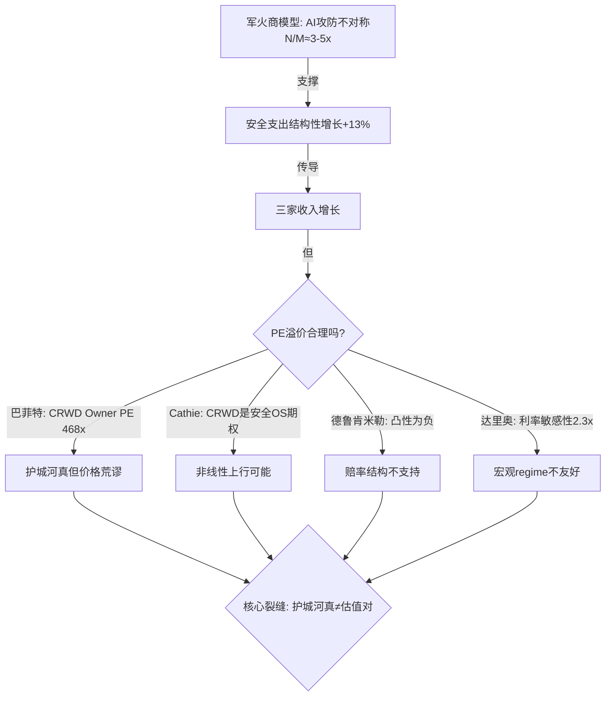
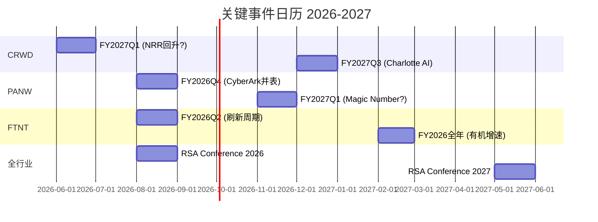

# 网络安全 SaaS 横向深度: CRWD / PANW / FTNT

## AI 是安全公司的军火商 — 两边卖武器, 一边付钱

> **系列**: SaaS 行业横向深度 R2 (安全篇)
> **日期**: 2026-04-10
> **评级**: CRWD 审慎关注 / PANW 审慎关注 / FTNT 审慎关注(边缘)

# 0. 执行摘要

市场把 CrowdStrike、Palo Alto Networks、Fortinet 三家公司放进同一个篮子: "AI 安全受益者". 卖方用同一组变量定价 — ARR 增速、NRR、Rule of 40 — 像给三匹马排名次. 但这个框架解释不通四件事: PE 跨度 2.3 倍 (CRWD 64x vs FTNT 28x), SBC/Rev 差距 5.5 倍 (4.1% vs 22.8%), PANW 有机增速 14% 但拿到 40x PE, 以及 CVE 年增 +20-38% 但安全支出只增 +13% [DM-EXEC-001]. 如果三家真是同一种资产, 这些差距不应该存在.

我们认为三家不是 "AI 安全受益者", 而是 **AI 军备竞赛中三种不同物种的收费站**. AI 同时武装攻击者 (免费使用 Claude Code / ChatGPT 写 exploit) 和防御者 (付费给安全 vendor). 安全支出的真正引擎不是 "AI 产品收入", 而是攻防不对称 — 攻击效率提升 5-10 倍, 防御效率提升 2-3 倍, N/M 比值约 3-5 倍且在扩大 [DM-EXEC-002]. 这意味着第一变量不是 ARR 增速, 而是 CVE 增速与安全支出增速的剪刀差 — 缺口越大, CISO 越被迫加预算. 安全公司增长的引擎是恐惧, 不是效率.

三家在军备竞赛中的位置完全不同. CRWD 是数据飞轮型收费站: 端点越多检测越准, 但飞轮在减速 (NRR 120%→115%, Rule of 40: 96→49), 加上 Windows 内核移除和 Defender 捆绑两个结构性侵蚀力量. Owner PE 468 倍, 即使牛市情景 ($369) 仍低于当前价 $395 — 凸性严重倒挂 [DM-EXEC-003]. PANW 是平台赌注型收费站: 方向对但执行差, 有机增速 14% 被 M&A (贡献 41%) 掩盖, Magic Number 0.43 倍远低于 0.75 倍健康线, 平台转化率仅 1.8% [DM-EXEC-004]. FTNT 是渠道锁定型收费站: SBC 仅 4.1% (CRWD 的 1/5.6), Owner PE 31 倍 (CRWD 的 1/15), ROIC 28.7% (三家最高), 回购 $22.9 亿超过 Owner FCF. ASIC 在云端消失是真风险, 但渠道在 AI 时代反而加强 — 中小企业更依赖 MSSP [DM-EXEC-005].

三家全部审慎关注. 概率加权公允价值: CRWD $206 (高估 48%), PANW $141 (高估 15%), FTNT $72 (高估 11%). 圆桌 5/5 同意评级方向, FTNT 2/5 建议 $65-70 可升级. 凸性全面倒挂: 错了亏远比对了赚多. 承重墙: N/M 比值 — 如果攻防不对称消失 (N/M→1 倍), 三家 PE 全部压缩到 25-30 倍 [DM-EXEC-006].

---

# Ch 1. 母结构: AI 是安全公司的军火商

## 1.1 先看股价在买什么 — 四家同口径对齐

CRWD、PANW、FTNT 三家, 加上 ZS 作为对照, 市场把它们放进同一个篮子: "AI 安全受益者". 卖方用同一组变量给四家定价 — ARR 增速、NRR、Rule of 40、"AI 产品进展". 华尔街的隐含假设是: AI 让网络威胁变多, 安全支出必须增加, 这四家是最大受益者.

我们先把四家放到同一把尺子上, 清除口径差异 (CRWD 财年 1月底 / PANW 7月底 / FTNT 12月底 / ZS 7月底), 统一到最近完整财年 + 2026-04-10 收盘价:

| 字段 | CRWD | PANW | FTNT | ZS(对照) |
|---|---|---|---|---|
| 股价 (2026-04-10) | $394.68 | $166.99 | $80.66 | $122.23 |
| 市值 | $111.5B | $115.0B | $59.0B | $44.1B |
| EV | $107.1B | $113.1B | $57.5B | $43.5B |
| EV/Sales | 22.3x | 12.3x | 8.5x | 16.3x |
| EV/FCF | 81.7x | 32.6x | 25.8x | 59.9x |
| GAAP PE | 负(亏损) | 92.8x | 33.3x | 负(亏损) |
| 收入增速 | +23.3% | +14.9% | +14.8% | +25.9% |
| GAAP OPM | -3.4% | 13.5% | 30.6% | -4.8% |
| **SBC/Rev** | **22.8%** | **14.0%** | **4.1%** | **24.7%** |
| FCF Margin | ~16% | 37.6% | 32.7% | ~17% |
| FCF Yield | 1.2% | 3.0% | 3.8% | 1.6% |
| ROIC | 负 | 5.7% | 28.7% | 负 |
| R&D/Rev | 28.7% | 21.5% | 12.0% | 25.2% |
| **我们的评级** | **审慎关注** | **审慎关注** | **审慎关注** | — |
| 概率加权公允 | $206(-48%) | $132(-18%) | $76(-8%) | — |

[DM-COMP-001] 数据来源: FMP key-metrics (CRWD FY2026 Jan 2026 / PANW FY2025 Jul 2025 / FTNT FY2025 Dec 2025 / ZS FY2025 Jul 2025) + 各公司 Tier 3 报告估值结论.

这张表第一眼看到的不是四家有多相似, 而是四家有多不同:

**EV/Sales 跨度 2.6 倍** (8.5x → 22.3x). 如果四家真是同一种资产, EV/Sales 不应该差 2.6 倍. Rule of 40 解释不了这个跨度 — R1 已经证明, 四家创意 SaaS 的 R² 只有 0.35. 安全 SaaS 的情况类似: FTNT 和 PANW 收入增速几乎相同 (+14.8% vs +14.9%), 但 EV/Sales 差 45% (8.5x vs 12.3x). 增速解释不了这个差距.

**SBC/Rev 跨度 5.5 倍** (4.1% → 22.8%). FTNT 每 $100 收入只有 $4.1 用 SBC 稀释股东, CRWD 用掉 $22.8. 这意味着 CRWD 表面上的增长有多少是"用股权买来的", FTNT 的增长有多少是"真金白银赚来的" [DM-COMP-002]. SBC 差距直接传导到 Owner FCF: CRWD 的 Owner PE (剥离 SBC 后) 是 468x, FTNT 是 31.5x, 差 15 倍. 但几乎没有卖方报告讨论这个差距 — 因为大家都在用 Non-GAAP.

**三家全部"审慎关注"**. 我们三份独立报告, 不同时间写的, 用不同的分析框架, 得出了相同方向的结论: 三家都被高估. CRWD 高估 48%, PANW 高估 18%, FTNT 高估 8%. 但市场持续给予高估值溢价. 两种可能: 我们系统性低估了某个变量, 或者市场在定价一个还没被量化的东西.

---

## 1.2 母裂缝: 市场只给"AI 防御"定价, 没给"AI 让攻击面爆炸"定价

旧框架 ("ARR 增速 + Rule of 40 + AI 产品进展") 解释不通五件事:

**裂缝 1: 同一标签, PE 跨度 2.3 倍.** CRWD Fwd PE ~64x, FTNT ~28x. 市场把两家都叫"AI 安全受益者", 但给的价格差了 2.3 倍. 如果 AI 红利是均匀的, 这个跨度不应该存在. 旧框架的解释是"CRWD 增速更高" — 但 CRWD 增速 23% vs FTNT 15% 只差 1.5 倍, 解释不了 PE 的 2.3 倍. 缺了一个变量 [DM-COMP-003].

**裂缝 2: PANW 有机增速 ~14%, 但市场给 40x PE.** PANW 的 NGS ARR +33% 是 headline, 但有机收入增速只有 ~14% — 和 FTNT 的 14.8% 几乎一样 [DM-COMP-004]. $25B 的 CyberArk 收购贡献了 ~$800M 增量收入, 把 14% 有机增速"做成"了 22% 总增速. Magic Number 只有 0.43x (远低于 0.75x 的健康阈值). 市场在定价"平台化叙事"而非有机增长质量, 但叙事什么时候变成利润, 谁也不知道 — 平台转化率只有 1.8%.

**裂缝 3: CVE 年增 +38%, AI 攻击 +100%, 但安全支出只 +13%.** 2024 年 CVE 发布量 39,962 个 (+38% YoY), 2025 年 48,185 个 (+20.6% YoY), AI 辅助攻击 2025 年增长 ~100% [DM-EXT-001]. 攻击面在指数级扩大. 但 Gartner 预测 2026 年安全支出增速 +13% ($240-244B). 攻击面增速是支出增速的 3-8 倍 — 这个缺口要么被填平 (安全支出加速), 要么持续扩大 (安全事故增加). 无论哪种路径, 旧框架没有把"攻击面增速 vs 防御支出增速的剪刀差"纳入估值 [DM-EXT-002].

**裂缝 4: SBC 差距 5.5 倍, 但市场估值排序不反映.** 如果 FTNT 的 SBC/Rev (4.1%) 是行业最低, 意味着 FTNT 的每一美元收入对股东的价值最高. 但 FTNT 的 EV/Sales (8.5x) 是四家最低的. 市场在惩罚 FTNT 的低增速, 同时忽略它的高 Owner FCF 质量. 这要么是市场正确地认为增速比利润质量重要 (高增长 SaaS 的通常逻辑), 要么是市场没有看到 Owner FCF 差距的规模 — 15 倍的 Owner PE 差距, 不是 15% [DM-COMP-005].

**裂缝 5: 三家护城河完全不同物种, 但市场用同一个标签定价.** CRWD 的护城河是数据飞轮 (EDR 遥测数据越多, AI 检测越准, 但内核移除在削弱技术锁定). PANW 的护城河是平台赌注 (free-to-paid + M&A 整合, 但转化率 1.8%). FTNT 的护城河是渠道 + ASIC (35,000 VAR + FortiASIC 成本优势 30-50%, 但 ASIC 在云端消失). 三种完全不同的护城河, 受 AI 影响的方向完全不同 [DM-COMP-006]. 旧框架把三家放进同一个 "AI 安全受益者" 桶, 没有区分 AI 对三种护城河的不同影响.

如果继续用旧框架, 这五个裂缝会被抹平. 投资者会继续用 "ARR 增速排序" 给三家定价, 忽略有机 vs M&A 增速的差距, 忽略 SBC 对 Owner FCF 的侵蚀, 忽略三种护城河在 AI 时代的不同命运.

---

## 1.3 军火商模型: AI 两边卖武器, 一边付钱

五个裂缝指向同一个缺失变量: **AI 对安全行业的影响不是单向的"帮助防御", 而是双向的"同时武装攻击者和防御者"**.

传统叙事是这样的: AI 让安全产品更聪明 (Falcon AI / XSIAM / FortiAI) → 检测率提高 → 安全公司的产品更好 → 客户愿意付更多钱 → 利好. 这个叙事没有错, 但它只讲了故事的一半.

另一半故事: AI 同时让攻击变得更便宜、更快、更容易. Claude Code 和 ChatGPT 让任何人都能在 10-15 分钟内生成 working exploit, 成本 $1 [DM-EXT-003]. AI 辅助钓鱼邮件的点击率 54%, 是传统钓鱼 (12%) 的 4.5 倍 [DM-EXT-004]. 70%+ 的重大数据泄露涉及 polymorphic malware — LLM 在每次执行时重新生成恶意代码, 绕过基于哈希值的检测 [DM-EXT-005]. 攻击者每天能 weaponize 130+ 个新 CVE [DM-EXT-006].

**关键的经济不对称**: 攻击者免费使用 AI 工具 (开源 LLM / Claude Code / ChatGPT), 防御者必须付费给 CRWD / PANW / FTNT. AI 是军火商, 两边卖武器, 但只有一边付钱.

这改变了安全行业的增长逻辑:
- **旧逻辑 (效率驱动)**: AI 让安全产品更好 → 客户主动升级 → 增长
- **新逻辑 (恐惧驱动)**: AI 让攻击面爆炸 → CISO 被迫增加预算 → 增长

两种逻辑的结果看起来一样 (安全支出增加), 但对估值的含义完全不同:
- 效率驱动 → 增长来自产品创新 → PE 溢价合理 (因为创新者赢)
- 恐惧驱动 → 增长来自威胁增加 → PE 溢价部分来自情绪而非基本面 (因为所有防御者都受益, 不只是创新者)

如果安全支出增长的真正引擎是 "AI 造成的攻防不对称迫使 CISO 增加预算", 那三家的增速差异就不主要来自产品优劣, 而是来自谁能更好地把恐惧转化为收入 — 这是一个渠道和锁定的问题, 不是一个创新的问题. 而渠道和锁定, 恰恰是 FTNT 最强、CRWD 最弱的维度.

---

## 1.4 N/M 比值: 攻防不对称度的量化锚

我们定义 **N/M 比值** = 攻击效率提升倍数 (N) / 防御效率提升倍数 (M).

**攻击端 (N 的估计)**:
| 维度 | AI 前基线 | AI 后 | 提升倍数 |
|------|---------|-------|---------|
| Exploit 开发时间 | 数天到数周 | 10-15 分钟 | ~50-100x |
| Exploit 成本 | $数千-数万 | ~$1 | ~1000x |
| 钓鱼点击率 | 12% | 54% | 4.5x |
| 每日可 weaponize 新 CVE | ~5-10 个 | 130+ 个 | ~13-26x |
| Deepfake 事件增长 | 基线 | +680% YoY | ~8x |

[DM-EXT-007] 数据来源: Veracode / CSA / ExploitOne / National Technology Research / FBI IC3 Report 2025.

**防御端 (M 的估计)**:
| 维度 | AI 前基线 | AI 后 | 提升倍数 |
|------|---------|-------|---------|
| 威胁检测率 | ~60-70% | ~80-90% (AI 辅助) | ~1.3-1.5x |
| 安全运营效率 | 基线 | SOAR + AI 自动化 | ~2-3x |
| 漏洞修复速度 | 基线 | AI 辅助 patch 建议 | ~1.5-2x |
| 安全人员供给 | 缺口 33% | AI 补充部分 | ~1.2x |

[DM-EXT-008] 防御端估计基于 CRWD Falcon AI / PANW XSIAM 公开声称 + ISC² 2025 调查 + Gartner 报告. 精度低于攻击端 (攻击端有直接测量, 防御端多为厂商声称).

**N/M 比值估计: ~3-5x** (取攻击端中位数 ~10x / 防御端中位数 ~2x ≈ 5x).

这个比值的含义: 攻击者效率提升速度是防御者的 3-5 倍. 这意味着:
1. **安全支出增速应该高于 IT 预算增速** — 因为攻防缺口在扩大, CISO 必须持续投入. 实际数据验证: 安全支出 +13% vs IT 预算 +9.8%, 差 3.2pp [DM-EXT-009].
2. **但支出增速仍然不够** — CVE 年增 +20-38%, 安全支出只增 +13%, 缺口在扩大. 这意味着安全事故频率会上升 → 反身性循环: 事故 → 恐惧 → 预算 → 安全公司收入 → PE 上升 → 事故.
3. **N/M 比值是安全行业 TAM 增速的隐含驱动** — 如果 N/M 从 5x 收窄到 1x (AI 攻防对称), 安全支出增速回落到 IT 预算增速 (~10%), 三家 PE 应该压缩. 如果 N/M 持续在 5x 或扩大, 安全支出加速, 三家增速上修.

**N/M 比值的置信度**: [B] 弱结论. 攻击端数据较硬 (有直接测量), 防御端主要是厂商声称 (CRWD 声称 Falcon AI 检测率提升 X%, 但没有独立验证). 我们对 N 的估计置信度 ~70%, 对 M 的估计置信度 ~40%, 因此 N/M 的置信度 ~50%. 证伪条件: 如果 Gartner 或 MITRE 发布的攻防效率对比研究显示 N/M < 2x, 则军火商模型的核心驱动力减弱.

---

## 1.5 三家在军火商模型中的位置

军火商模型成立后, 三家公司的 PE 跨度 2.3 倍就有了新的解释: 不是增速差, 是**在军备竞赛中的位置差**.

| 公司 | 军备竞赛位置 | 护城河类型 | AI 影响方向 | PE 含义 |
|------|------------|-----------|-----------|---------|
| **CRWD** | 数据飞轮型军火商 | EDR 遥测 → AI 检测 → NRR 循环 | 双刃剑: AI 加强检测, 但内核移除 + Defender 侵蚀 | 64x PE 定价了飞轮永续运转 |
| **PANW** | 平台赌注型军火商 | free-to-paid + M&A 整合 | 叙事 > 证据: 平台化方向对, 但 1.8% 转化率说明执行还没到 | 40x PE 定价了平台化成功 |
| **FTNT** | 渠道锁定型军火商 | ASIC + 35,000 VAR + MSSP 全栈 | 双轨分化: ASIC 在云端消失, 但渠道在 AI 时代加强 | 28x PE 定价了增速放缓 |

[DM-COMP-007]

这个排序本身没有争议. 争议在于: **市场给三种位置的定价是否正确?**

- CRWD 64x PE 假设数据飞轮永续运转 — 但内核移除后技术转换成本从 4.0/5 降到 3.0/5 [DM-CRWD-001], Defender 市占率 28.6% 且在上升. 飞轮转速在降 (Rule of 40 从 96 降到 49).
- PANW 40x PE 假设平台化成功 — 但 1.8% 转化率远低于 Salesforce (8%) 和 ServiceNow (12%) 在同一阶段的表现 [DM-PANW-001]. Magic Number 0.43x 说明每 $1 销售费用只带来 $0.43 收入.
- FTNT 28x PE 假设增速放缓 — 但 FortiSASE ARR 增速 >90% [DM-FTNT-001], 渠道锁定 (MSSP 切换 = 重建全栈) 在 AI 时代可能加强 (中小企业更需要渠道商帮忙), 且 SBC 4.1% 意味着增长是真金白银的.

我们在 Ch 4-6 分别深入每家公司, 但结论前置: **市场对 CRWD 和 PANW 的定价包含了太多叙事溢价, 对 FTNT 的定价可能低估了渠道在 AI 时代的价值**. 这不是说 FTNT 被低估 (我们给了 -8% 高估), 而是说三家的相对排序可能需要调整.

---

## 1.6 R2 的核心问题

如果只能问这个行业一个问题, 问什么?

> **"AI 让攻击面爆炸的速度, 是暂时的还是永续的? 如果是永续的, 谁能把恐惧转化为收入的效率最高?"**

第一部分 (暂时 vs 永续) 决定安全行业的 TAM 增速 — 见 Ch 3.
第二部分 (谁转化效率最高) 决定三家的相对排序 — 见 Ch 4-6.

---

# 2. 博弈论验证系统: 6 个博弈结构确认同一个母框架

## 2.1 为什么用博弈论而不是传统护城河分析

传统护城河分析 (转换成本 / 品牌 / 网络效应 / 规模经济) 假设竞争环境是静态的 — 护城河"存在"或"不存在", 像一条围绕城堡的水沟. 安全行业的现实完全不同: 攻击者在动, 客户 (CISO) 在多个 vendor 之间博弈, vendor 之间在竞争客户和收购标的. 静态护城河分析捕捉不到"对手反应"这一层 — 而在安全行业, 对手的反应 (攻击者用 AI, PANW 用 M&A, Microsoft 用捆绑) 往往比护城河本身更重要 [DM-GT-001].

博弈论提供的工具:
- **最佳回应 (best response)**: CISO 面对 AI 攻击面爆炸的最佳回应是什么? (增加预算 — Ch 3)
- **均衡 (equilibrium)**: 当前安全市场的竞争格局为什么稳定? 什么条件下会变? (Ch 4-6)
- **可信承诺 vs cheap talk**: PANW 的 free-to-paid 是真的还是说说? (Ch 5)
- **赢家诅咒**: PANW $25B 买 CyberArk 是否过度付费? (Ch 5)
- **重复博弈**: 攻防军备竞赛没有终点, 每一轮的结果影响下一轮 (Ch 3)

---

## 2.2 六个博弈结构总表

| # | 博弈名称 | 玩家 | 核心问题 | 当前均衡 | 打破条件 | 详见 |
|---|---------|------|---------|---------|---------|------|
| **G1** | 攻防军备竞赛 | 攻击者/CISO/AI工具商/Vendor | AI 攻防对称还是不对称? | 不对称(N/M≈3-5x), CISO 主导策略=增加预算 | AI-native 让 M≥N | Ch 3 |
| **G2** | 平台 vs 最佳单品 | PANW/CRWD/CISO | CISO 该买平台还是挑单品? | 按规模分层: F500=单品, 中小=平台 | 平台转化率>10% 或单品性能差距消失 | Ch 5 |
| **G3** | Claude Code 攻击面 | AI编程工具/开发者/安全团队 | 代码量指数增长=TAM发动机? | 是, 但剪刀差在扩大(CVE+20-38%/年 vs 支出+13%) | AI代码审查工具同步成熟 | Ch 3 |
| **G4** | 合规 mandate | 监管/企业/Vendor | 合规是制度层护城河还是会被绕过? | 是护城河(认证6-18个月+罚款不对称), AI-native 短期无法绕过 | 监管大幅修改合规框架 | Ch 6 |
| **G5** | 渠道博弈 | FTNT/VAR-MSSP/中小企业/云原生 | 渠道在 AI 时代加强还是被绕过? | 中小市场加强, 企业市场被绕过 | 云原生价格降到 FortiGate 持平 | Ch 6 |
| **G6** | M&A 赢家诅咒 | PANW/Target/竞标者 | PANW M&A 是否过度付费? | $25B CyberArk at 21x ARR, 整合失败概率~40% | FQ3 交叉销售数据 | Ch 5 |

[DM-GT-002]

---

## 2.3 玩家—动作—反应总表

这是 R2 的核心横向产出 — 把六个博弈中的玩家放在同一张表里, 看谁在做什么, 谁在被动反应.

| 玩家 | 主要动作 | 目标 | 其他玩家的最佳反应 | 均衡是否稳定? |
|------|---------|------|------------------|------------|
| **攻击者** | 使用 AI 工具降低攻击成本 | 最大化收益 | CISO 增加预算(主导策略) | 稳定(3-5年) |
| **Microsoft** | Defender 免费捆绑 E5 + 保留内核访问 | 最大化安全收入($37B) | CRWD 多平台扩展 / PANW 差异化 | 稳定(MS 有结构性优势) |
| **CRWD** | 数据飞轮 + Falcon Flex + 多模块 | 维持 EDR #1 + 扩平台 | PANW 用 M&A 扩产品线 / MS 用免费 | 不稳定(内核移除+Defender) |
| **PANW** | Free-to-paid + $25B+ M&A | 平台化锁定 | CRWD Falcon Flex 对抗 / FTNT 低价 | 不稳定(1.8%转化率) |
| **FTNT** | 低价 ASIC + 渠道分发 | 中小企业份额最大化 | ZS/CRWD 直销绕过渠道 | 稳定(中小市场) / 不稳定(企业市场) |
| **ZS** | 纯 ZTNA 单品 + 高增速 | ZTNA 赛道 #1 | PANW 平台化侵蚀 ZTNA 市场 | 中性(赛道增速快但被蚕食) |
| **CISO (F500)** | Best-of-breed 采购 | 最低风险 | 维持多 vendor → CRWD/FTNT 受益 | 稳定 |
| **CISO (中小)** | 平台/渠道采购 | 最低管理成本 | 依赖 MSSP → FTNT 受益 | 稳定 |
| **监管** | 强制合规(NIST/SEC/EU) | 降低系统性风险 | 企业增加安全支出 → Vendor 受益 | 稳定(规则滞后2-5年) |

[DM-GT-003]

---

## 2.4 六个博弈的交叉验证: 同一个母框架的 6 个切面

六个博弈看起来各自独立, 但它们验证的是同一个母框架 ("AI 是安全公司的军火商"):

**G1 (攻防军备竞赛)** → 证明安全支出增长是结构性的 (N/M≈3-5x), 不是周期性的.
**G3 (Claude Code 攻击面)** → 提供 G1 的微观传导机制 (代码量+漏洞率+攻击者民主化).
**G2 (平台 vs 单品)** → 说明增长的分配: 平台化方向对 (Gartner 预测), 但执行远未到位 (PANW 1.8%).
**G4 (合规 mandate)** → 提供支出的下限保护: 即使 AI 攻防变对称, 合规支出不会消失.
**G5 (渠道博弈)** → 说明中小企业市场的增长通过渠道传导, FTNT 是最大受益者.
**G6 (M&A 赢家诅咒)** → 揭示 PANW 增速的质量问题: 有机 14% vs 总 22%, 差距来自 M&A.

**综合判断**: 六个博弈指向同一个结论 — 安全行业的增长引擎从"产品创新"变成"攻防不对称驱动的被迫支出". 在这个新引擎下:
- **CRWD 的飞轮优势在减弱** (G1/G2: 内核移除+Defender+转速下降)
- **PANW 的平台化在赌博** (G2/G6: 1.8%转化率+M&A赢家诅咒)
- **FTNT 的渠道优势在加强** (G4/G5: 中小企业恐惧→渠道需求→FTNT)

这不意味着 FTNT 是好投资 (我们给了 -8% 高估). 意味着: **三家的相对排序应该从"增速排序"(CRWD>PANW>FTNT) 变成"恐惧转化效率排序"(FTNT>CRWD>PANW)**. 市场还没有做这个转换 [DM-GT-004].

---

## 2.5 五个真正的问题 (博弈论框架要求)

用户提供的博弈论框架要求每份报告回答五个问题:

**Q1: 当前局面为什么这样?**
三家都被高估, 因为市场用"AI 安全受益者"标签给三家定价, 没有区分 AI 对三种不同护城河的不同影响. PE 跨度 2.3x 反映的是"增速排序+叙事溢价", 不是"护城河类型×AI 影响方向".

**Q2: 为什么稳定?**
稳定因为 (1) 攻防不对称 N/M≈3-5x 在中期内不会消失, 安全支出持续增长; (2) 三家各自在不同市场段有锁定 (CRWD=F500 端点, PANW=企业平台, FTNT=中小渠道); (3) 合规 mandate 创造支出下限. 没有一家会短期内被淘汰.

**Q3: 决定结果的变量是什么?**
N/M 比值的变化. 如果 N/M 从 5x 扩大到 8x+ → 安全支出加速 → 三家都受益但 FTNT 受益最多 (恐惧→渠道). 如果 N/M 收窄到 1-2x → 安全支出回落到 IT 预算增速 → PE 全面压缩, CRWD 跌幅最大.

**Q4: 什么动作会改写最佳回应?**
- Microsoft 将 Defender 免费层扩展到中小企业 → FTNT 渠道优势被绕过
- PANW 平台转化率突破 10% → 平台化叙事从赌博变成事实 → PE 维持
- CRWD 在非 Windows 平台 (Linux/Cloud) 市占率翻倍 → 内核移除影响被稀释
- 一起大规模 AI 辅助 breach (影响 >100M 用户) → 安全支出跳升 → 三家短期暴涨

**Q5: 什么条件下失效?**
整个军火商模型失效的条件: AI 攻防变为完全对称 (N/M=1x) + 安全变成自动化服务 (不需要 vendor) + 合规 mandate 取消. 这三个条件同时成立的概率极低 (<5% / 10 年). 单个博弈失效的条件: 各 Kill Switch 已在 Ch 4-6 列出.

---

# Ch 3. G1+G3: AI 军备竞赛 + Claude Code 攻击面爆炸

> **地位**: 本章是 R2 的承重墙. Ch 1 提出"军火商模型"和 N/M 比值, 本章提供证据链. 如果本章的论证不成立, 整份报告的母框架坍塌.

---

## 3.1 博弈 G1: 攻防军备竞赛 — 形式化结构

### 玩家与动作空间

| 玩家 | 目标 | 可选动作 | 当前均衡下的策略 |
|------|------|---------|---------------|
| **攻击者** | 最大化收益/单位成本 | 手动攻击 / AI 辅助攻击 / 外包 | AI 辅助 (成本降 1000x, 速度提 50-100x) |
| **防御者 (CISO)** | 最小化风险/单位预算 | 增加预算 / 维持预算 / 削减预算 | 增加预算 (+13% YoY) |
| **AI 工具商** | 最大化用户基数 | 限制安全用途 / 不限制 | 部分限制 (但开源 LLM 无限制) |
| **安全 Vendor** | 最大化 ARR | 提价 / 扩产品线 / 平台化 | 扩产品线 + 平台化 (PANW/CRWD) |

[DM-G1-001]

### 当前均衡

这是一个**不对称的重复博弈**, 类似军备竞赛 (arms race game):
- 攻击者和防御者交替行动 (攻击 → 修补 → 新攻击 → 新修补)
- 攻击者的行动空间因 AI 扩大了 (exploit 开发成本从 $数千降到 $1)
- 防御者的行动空间也扩大了 (AI 辅助检测), 但扩大速度慢于攻击者
- 均衡结果: **CISO 的最佳回应是持续增加预算**

这不是新结论 — 安全行业一直是军备竞赛. 新的是 **AI 改变了攻防效率的增速差** (N/M 从 ~1.5x 变成 ~3-5x), 让均衡从"缓慢增加预算"变成"加速增加预算".

### 均衡稳定性分析

**为什么这个均衡是稳定的 (至少中期 3-5 年)**:

1. **攻击者没有退出动机**. AI 降低了攻击成本 → 更多人成为攻击者 (democratization of hacking) → 攻击频率上升. FBI IC3 报告: AI 辅助 BEC (商业邮件诈骗) 2025 年 +37% YoY [DM-G1-002]. 攻击者的"工资"(勒索赎金/数据变现) 没有减少, 但"工具成本"降了 1000x. 这是经典的供给侧扩张.

2. **CISO 没有减少预算的选项**. 不增加预算的惩罚 = 被攻破 → CEO 被解雇 / 公司被罚款 / 股价下跌. 增加预算的惩罚 = 利润率低一点. 不对称惩罚决定了 CISO 永远选择增加预算 — 这是一个**主导策略** (dominant strategy), 不依赖于对攻击者行为的预期 [DM-G1-003].

3. **AI 工具商无法有效限制攻击用途**. Claude Code 和 ChatGPT 有安全过滤, 但开源 LLM (Llama / Mistral / DeepSeek) 没有. 攻击者只需要一个不受限的模型就够了. AI 工具商的限制不改变均衡 — 因为限制不是所有工具商同时执行的, 一个漏洞就足以让攻击者获益.

**什么会打破这个均衡**:

| 打破条件 | 概率 | 时间框架 | 对三家的影响 |
|---------|------|---------|-----------|
| AI-native 安全方案让 M ≥ N (攻防对称) | 15-20% | 5-10 年 | 安全支出增速回落, PE 压缩, incumbents 可能被绕过 |
| 政府强制 AI 工具限制 (N 被人为压低) | 10-15% | 3-7 年 | 攻击减少 → 安全支出减速 → 短期利空 |
| 攻击成本降到零 → 安全变成公共品 | <5% | >10 年 | 安全公司商业模式颠覆 |
| 量子计算破解现有加密 | 5-10% | 7-15 年 | 全行业重建 → 短期利好 (强制升级) |

[DM-G1-004] 概率基于历史基准率: 过去 20 年, 网络安全行业的均衡从未被打破 — 攻击者始终领先于防御者. 唯一接近打破的是 2000 年代末的 cloud migration (改变了攻击面形态, 但没有改变攻防不对称). 基准率: 20 年 0 次均衡被打破 → AI-native 打破的概率保守估 15-20% (因为 AI 的影响比 cloud migration 更深).

---

## 3.2 博弈 G3: Claude Code / ChatGPT 攻击面爆炸 — 五个传导机制

### 机制 1: 代码量指数增长 → 漏洞指数增长

AI 编程工具 (GitHub Copilot / Claude Code / Cursor / ChatGPT) 让开发者生产代码的速度提升 3-4 倍. 更多代码 = 更多攻击面.

**量化**: 每 1,000 行代码平均包含 15-50 个 bugs (行业经验值). AI 生成代码的漏洞率是人工代码的 2.74 倍 (SoftwareSeni 分析) [DM-G3-001]. 如果全球代码产出因 AI 编程工具增长 3x, 且 AI 代码漏洞率是人工的 2.74x, 则全球潜在漏洞数量增长约 3 × 2.74 = **~8x**.

GitGuardian 2026 年报告: 2025 年公共 GitHub 上发现 2,865 万个硬编码密钥 (hardcoded secrets), 同比 +34%. AI 辅助提交中的密钥泄露率 3.2%, 是非 AI 提交 (1.5%) 的 2.1 倍 [DM-G3-002]. 这是直接测量, 不是估计.

### 机制 2: AI 生成代码有系统性漏洞模式

Veracode 测试了 100+ 个 LLM: 45% 的 AI 生成代码引入 OWASP Top 10 漏洞. 86% 的样本无法防御 XSS (跨站脚本攻击), 88% 存在日志注入漏洞 [DM-G3-003].

ArXiv 论文 (2025 年 10 月): 大规模分析公共 GitHub 仓库, 确认 AI 生成代码存在系统性漏洞模式 — 因为 LLM 的训练数据包含大量不安全的代码 pattern, 模型会在生成代码时复制这些 pattern [DM-G3-004].

CSA (Cloud Security Alliance) 2026 年报告: 被归因于 AI 生成代码的 CVE 从 2026 年 1 月的 6 个增长到 3 月的 35 个, 大约每月翻倍. Georgia Tech 估计实际数量是报告数量的 5-10 倍 (400-700 个) [DM-G3-005].

**因果链**: LLM 训练数据含不安全 pattern → 模型生成包含这些 pattern 的代码 → 开发者信任 AI 输出不做充分审查 → 漏洞进入生产环境 → 攻击者利用. 因为 LLM 的训练数据很难彻底清洗 (不安全 pattern 和正常代码混在一起), 这是一个**结构性问题**, 不是暂时的. 除非 AI 编程工具在生成代码时同步运行安全扫描 (目前没有主流工具做到), 否则这个传导链会持续运转.

### 机制 3: 非专业攻击者获得专业工具

AI 前: 写 exploit 需要深度安全知识 (汇编、网络协议、操作系统内核). 攻击者群体小、专业化程度高.

AI 后: Claude Code 和 ChatGPT 能指导一个没有安全背景的人完成从侦察到利用的完整攻击链. 成本 ~$1, 时间 10-15 分钟 [DM-G3-006]. 攻击者群体从数千人扩大到任何能上网的人.

**博弈论含义**: 攻击者数量增加改变了博弈的性质. 以前 CISO 面对的是少数专业攻击者 (可预测, 可针对性防御). 现在面对的是大量非专业攻击者使用标准化 AI 工具 (不可预测, 必须广谱防御) [DM-G3-007]. 广谱防御比针对性防御贵得多 — 这直接推高安全支出.

### 机制 4: 攻击迭代速度超过修补速度

CVE 增速: 2023 年 28,818 → 2024 年 39,962 (+38%) → 2025 年 48,185 (+20.6%), 日均 127-131 个 [DM-G3-008]. 攻击者每天能 weaponize 130+ 个新 CVE [DM-G3-009].

防御端: 平均漏洞修复时间 (MTTR) 仍在 30-60 天. AI 辅助 patch 建议能缩短到 7-14 天, 但这仍然远慢于攻击者的 weaponize 速度 (小时级).

**剪刀差**: 新 CVE 产生速度 (130+/天) vs 修复速度 (平均 30-60 天/个) → 任何时点都有数千个未修复漏洞在暴露中. AI 让这个剪刀差扩大而非收窄 — 因为 AI 同时加速了漏洞的发现 (通过自动化 fuzzing) 和利用 (通过 exploit 生成), 但修复仍需要人工理解上下文.

### 机制 5: 安全审查速度没有同步提升

ISC² 2025 调查: 33% 的组织缺乏足够的安全人员, 41% 将 AI 列为 #1 技能缺口 [DM-G3-010]. 90% 的受访者报告至少一次因人员不足导致的安全事故或响应延迟.

Gartner 预测 GenAI 到 2028 年会减少入门级安全需求 — 但这意味着高级安全人员 (能做代码审查、威胁建模、事件响应) 的缺口更大. AI 替代的是简单任务, 留下的是需要人类判断的复杂任务.

**因果链**: 代码量 ↑ (AI 编程) → 需要审查的代码量 ↑ → 安全审查人员没有同比增加 → 审查覆盖率 ↓ → 更多漏洞进入生产环境 → 攻击面 ↑. 这是一个自我强化的循环, AI 编程工具越流行, 安全审查缺口越大 [DM-G3-011].

---

## 3.3 五个机制的合力: 攻击面增速 vs 防御支出增速的剪刀差

把五个机制放在一起:

```
AI 编程工具采用率 ↑
  → 代码量 +3x (机制 1)
  × 漏洞率 +2.74x (机制 2)
  = 潜在漏洞 ~8x
  + 非专业攻击者进入 (机制 3)
  + 攻击迭代速度 > 修补速度 (机制 4)
  + 安全审查人员缺口 (机制 5)
  = 攻击面指数增长

同时:
安全支出 2024 $193B → 2025 $213B → 2026E $240-244B
  CAGR ≈ +12-13%
  IT 预算增速 ≈ +9.8%

剪刀差: 攻击面增速 (CVE +20-38%/年) vs 安全支出增速 (+13%/年) ≈ 差 7-25pp
```

[DM-G3-012]

**这个剪刀差意味着什么**:

1. **安全事故频率会上升** — 不是因为安全公司产品变差, 而是因为攻击面增速 >> 防御支出增速. 即使 CRWD/PANW/FTNT 的产品每年好 20%, 攻击面每年增长 30-40%, 净效果仍然是安全事故增加.

2. **安全支出可能加速** — 当 CEO/董事会看到安全事故频率上升, 最直接的反应是增加预算. Gartner 的 +13% 预测可能保守 — 如果 2026 年发生几起重大 AI 辅助 breach, 增速可能跳升到 +18-20%.

3. **对三家的含义不同**:
   - **CRWD**: 数据飞轮在攻击面扩大时应该加速 (更多攻击 → 更多遥测数据 → 更好的检测). 但前提是飞轮还在转 — 内核移除后, CRWD 的数据采集能力是否受损?
   - **PANW**: 平台化在攻击面扩大时更有吸引力 (CISO 不想管 10 个单品, 想要一个平台). 但前提是平台真的能整合 — 1.8% 转化率说明整合还没到.
   - **FTNT**: 渠道在攻击面扩大时更有价值 (中小企业不知道怎么应对 AI 攻击, 需要渠道商帮忙). FTNT 的 35,000 VAR 网络 + 80%+ 渠道收入占比 = 中小企业市场的"安全基础设施" [DM-FTNT-002].

---

## 3.4 反面: 军火商模型在什么条件下不成立?

### 反面 1: AI 攻防变为对称 (N/M → 1x)

如果 AI 安全产品 (Falcon AI / XSIAM / FortiAI) 的效率提升追上攻击端, 攻防不对称消失. 这时安全支出增速回落到 IT 预算增速 (~10%), 三家的增速放缓, PE 压缩到 SaaS 中位数 (25-30x).

**我们的判断**: 短期 (1-3 年) 不太可能. 攻击端利用的是通用 AI 能力 (代码生成 / 文本生成), 不需要专门训练. 防御端需要专门的安全 AI (在安全数据上训练, 理解攻击模式), 开发成本和时间更高. 但长期 (5-10 年), 如果安全 AI 的训练数据规模足够大 (CRWD 的飞轮逻辑), 有可能接近对称. 概率: 3 年内 <10%, 5-10 年 15-20%.

### 反面 2: 安全支出被 CFO 压制

如果经济衰退导致 IT 预算削减, 安全支出可能不增反降. 历史基准: 2008-2009 经济衰退中, 安全支出增速从 +15% 降到 +5%, 但没有变负 — 因为合规 mandate (PCI-DSS / HIPAA / SOX) 创造了支出下限 [DM-G3-013].

**我们的判断**: 安全支出有制度层保护 (合规 mandate + 保险要求 + 董事会问责). 即使 IT 预算削减, 安全是最后被砍的. 但增速放缓是真实风险 — 从 +13% 降到 +5-8% 就够让三家增速承压.

### 反面 3: AI-native 安全公司绕过 incumbents

Wiz (被 Google $32B 收购 [DM-G3-014]) / SentinelOne ($1B ARR, Purple AI 40% 新许可证 attach rate [DM-G3-015]) 代表 AI-native 挑战者. 如果 AI-native 方案在检测率和成本上全面超越 CRWD/PANW/FTNT, incumbents 的护城河会被绕过.

**我们的判断**: 中期风险 (3-5 年). Wiz 被 Google 收购意味着它不再是独立竞争者, 而是 Google Cloud 的安全层 — 对 PANW 和 CRWD 在公有云安全的威胁更大, 对 FTNT 的 on-prem/SMB 业务威胁较小. SentinelOne 增速快但规模仍小 ($1B ARR vs CRWD $5.25B). AI-native 公司的真正威胁不是正面竞争, 而是改变 CISO 的采购逻辑 — 从"买最好的"变成"用 AI 自动化安全运营" [DM-G3-016].

---

## 3.5 本章结论: Ch 3 对估值的含义

1. **安全支出增速 > 市场预期的概率较高** (60-70%). 攻防剪刀差 (攻击面 +20-38%/年 vs 支出 +13%/年) 意味着安全事故频率会上升, 推动预算加速. 如果 2026 年安全支出增速从 +13% 上修到 +18%, 三家的收入增速上修 3-5pp.

2. **但三家受益程度不同**. 上修对 CRWD 影响最大 (数据飞轮加速), 对 FTNT 影响最小 (渠道收入增速相对稳定). PANW 的受益取决于平台化是否能把新增预算转化为有机收入 (而非继续靠 M&A).

3. **N/M 比值是跟踪指标**. 我们建议跟踪 CVE 增速 / AI 辅助攻击频率 / 安全支出增速 这三个指标的比值变化. 如果 CVE 增速放缓但安全支出加速 → N/M 收窄 → 减少对军火商模型的信心. 如果 CVE 加速但支出没有跟上 → N/M 扩大 → 安全事故频率上升, 等事故驱动的预算加速.

4. **本章是 [B] 弱结论 (推断, 附证伪条件)**. N/M 比值是估算不是测量, 防御端数据主要来自厂商声称. 证伪条件: 如果 MITRE / Gartner 发布的独立评估显示防御 AI 效率提升 ≥ 5x (当前我们估计 2-3x), 则攻防不对称程度低于我们的估计, 军火商模型的核心驱动力减弱 [DM-G3-017].

---

# Ch 4. CRWD: 数据飞轮型军火商

## 4.1 数据飞轮机制: 为什么市场给 64x PE

CRWD 的护城河逻辑和其他两家完全不同. PANW 靠平台捆绑, FTNT 靠渠道+硬件成本. CRWD 靠的是**规模回报递增的数据飞轮**: 端点越多 → 遥测数据越多 → Falcon AI 检测越准 → 误报越少 → NRR 越高 → 客户续约扩展 → 端点越多.

这个飞轮的经济学: CRWD 有 30,000+ 客户, 50% 使用 6+ 个模块 [DM-CRWD-002]. 每个端点每天产生遥测数据, 这些数据训练 Falcon AI 模型. 数据量越大, 检测新型攻击的能力越强 — 因为 AI 模型可以从更多的攻击样本中学习 pattern. 这是网络效应的一种特殊形式: 不是用户之间的网络效应 (如 Facebook), 而是数据-模型之间的网络效应.

市场给 CRWD 64x PE (vs FTNT 28x), 本质上是在为这个飞轮的"久期"付费. 如果飞轮永续运转, CRWD 的竞争优势会随规模自我强化, 今天的 PE 溢价可以被未来的超线性增长消化. 如果飞轮减速或停转, 64x PE 没有基本面支撑.

**飞轮减速的证据已经出现**: Rule of 40 从 FY2022 的 96 连续降到 FY2026 的 49 [DM-CRWD-003]. NRR 从 120%+ 降到 115%. ARR 增速从 +34% (FY2024) 降到 +24% (FY2026). 飞轮仍在转, 但转速在降. 问题是: 这是自然的规模效应 (大基数增速放缓), 还是飞轮的结构性减速?

---

## 4.2 博弈论嵌入: CRWD 的飞轮面对两个结构性侵蚀力量

### 侵蚀力 1: Windows 内核移除

**玩家**: Microsoft / CRWD / 攻击者 / 企业客户

2024 年 7 月全球蓝屏事件 (850M 台 Windows 设备宕机) 后, Microsoft 推动安全产品从内核态 (kernel mode) 迁移到用户态 (user mode). CRWD 的 Falcon 传感器目前运行在内核态 — 这是它的技术优势来源: 内核级访问让 Falcon 能看到操作系统最底层的活动, 检测率更高, 且攻击者更难绕过 [DM-CRWD-004].

迁移到用户态后:
- **技术转换成本从 4.0/5 降到 3.0/5** (-25%) [DM-CRWD-005]. 内核级部署意味着客户如果要换供应商, 需要在操作系统最底层做替换 — 这很危险, 没人愿意做. 用户态部署把替换风险从"可能蓝屏"降到"卸载+安装" — 转换成本大幅下降.
- **Defender 获得结构性优势**. Microsoft 保留了自己在 Windows 内核的双重访问权, 同时把竞争对手推到用户态 [DM-CRWD-006]. 这意味着 Defender 在技术层面有 CRWD 无法匹配的检测能力 — 不是因为技术差, 而是因为 Microsoft 控制了操作系统.

**博弈分析**: 这是一个**平台所有者 vs 第三方应用**的经典博弈. Microsoft 既是平台 (Windows) 又是参与者 (Defender). 它有动机和能力通过平台规则变更削弱第三方竞争者. CRWD 的最佳回应是加速多平台扩展 (Linux / macOS / 云工作负载), 减少对 Windows 内核的依赖. 但 Windows 端点仍占 CRWD 收入的大部分 — 短期内无法完全脱离.

### 侵蚀力 2: Microsoft Defender 的"免费+捆绑"

Defender 在 IDC 端点安全市场份额 28.6% (#1), YoY +28.2% [DM-CRWD-007]. Defender 的增长逻辑: E5 许可证捆绑 → 企业已经付了 Microsoft 365 的钱 → Defender "免费"附赠 → CISO 的增量成本 = 0 → 阻力最小路径.

**博弈结构**: CRWD vs Defender 是一个**非对称成本竞争**. CRWD 每获取一个客户需要 ~$432K CAC, payback ~40 个月 [DM-CRWD-008]. Defender 获取一个客户的增量成本 ≈ $0 (已在 E5 许可证中). CRWD 必须在检测质量上保持足够大的差距, 让 CISO 愿意在"免费 Defender"之外额外花钱. 这个差距有多大? F500 愿意付, 中小企业不一定 — 这是为什么 CRWD 的增速放缓主要发生在非 F500 客户.

**可信威胁 vs cheap talk**: Microsoft CEO Nadella 多次声明"安全是 #1 优先级". 这是可信承诺还是 cheap talk? 我们的判断: **可信承诺** — 因为 Microsoft 安全收入已超过 $37B, 占总收入 ~15%. 安全已经是 Microsoft 的大业务, 不是附属品. 当安全从"附赠功能"变成"$37B 业务线", Microsoft 有强烈动机持续投资 Defender [DM-CRWD-009].

---

## 4.3 飞轮真实状态: 仍在转, 但两个减速器已接入

| 飞轮维度 | 当前状态 | 趋势 | 证据 |
|---------|--------|------|------|
| 端点增长 | 30,000+ 客户 | 不再披露精确数字(自 FY2023) | 不披露本身是负面信号 [DM-CRWD-010] |
| 模块扩展 | 50% 用 6+ 模块 | 上升 (Falcon Flex 1,600+ 客户) | 正面, 但新模块 monetization 不确定 |
| NRR | 115% | 从 120%+ 下降 | 2024 蓝屏后的恢复, 但未回到前值 [DM-CRWD-011] |
| GRR | 97% | 稳定 | 蓝屏后仅 <3% 客户流失 = 极强锁定 |
| AI 检测 (Charlotte AI) | 已推出 2+ 年 | 零定价 | 没有收入贡献, 何时 monetize 未知 [DM-CRWD-012] |
| Rule of 40 | 49 | 从 96 持续下降 | 增速放缓 + OPM 没有同步改善 |

**飞轮的结论**: 数据飞轮仍在转 (GRR 97% 证明客户不走), 但转速在降 (NRR 从 120%→115%, Rule of 40 从 96→49). 两个结构性减速器 (内核移除 + Defender) 已接入, 效果将在 FY2027-2028 显现. 64x PE 定价的是飞轮加速, 实际状况是飞轮减速.

---

## 4.4 CRWD 在军火商模型中的位置

Ch 3 的结论是: AI 攻防不对称 (N/M ≈ 3-5x) 让安全支出结构性增长. 这对 CRWD 的含义:

**正面**: 攻击面爆炸 → 更多攻击 → CRWD 的遥测数据增加 → 飞轮应该加速. 如果安全支出增速从 +13% 上修到 +18%, CRWD 的 ARR 增速可能从 +24% 上修到 +28-30%.

**负面**: 攻击面爆炸的受益不是 CRWD 独享的. Defender 免费, PANW 平台捆绑, FTNT 渠道锁定 — 都会分走新增预算. CRWD 的 CAC $432K / Payback 40 个月意味着获客效率低于竞争对手 [DM-CRWD-013]. 在"恐惧驱动"的增长模型中, 获客效率比产品创新更重要 — 因为 CISO 被迫增加预算时, 选择阻力最小的路径 (Defender 免费 > PANW 已有平台 > 新买 CRWD).

**估值含义**: CRWD 的 $206 概率加权公允价值 vs $394.68 当前价 = -48% 高估. 军火商模型的正面影响 (安全支出加速) 可能缩小这个差距到 -35%~-40%, 但不足以让 CRWD 变成"关注"评级. 核心矛盾: **飞轮是好飞轮, 但价格买满了** [DM-CRWD-014].

---

## 4.5 Kill Switch 与跟踪指标

| 信号 | 红灯触发 | 当前值 | 距触发 |
|------|---------|--------|--------|
| Defender 市占率 | >30% | 28.6% | 1.4pp |
| GRR | <95% 连续 2Q | 97% | 2pp |
| NRR | <110% | 115% | 5pp |
| XSIAM ARR vs LogScale ARR | XSIAM 超越 | $470M vs $585M | CRWD 领先 |
| SBC/Rev | 连续 2 年上升 | 22.8% (Year 1 已触发) | Year 2 观察中 |

[DM-CRWD-015] Defender 市占率距红灯仅 1.4pp — 这是三家 Kill Switch 中最接近触发的一个.

---

# Ch 5. PANW: 平台赌注型军火商 + M&A 赢家诅咒

## 5.1 PANW 的赌注: 平台化是未来, 但未来还没到

PANW 的战略清晰到可以用一句话概括: **把客户从买单品变成买平台, 用免费试用+M&A 扩产品线实现**. Gartner 预测 2028 年 >50% 企业采用 AI 安全平台 (当前 <10%) [DM-PANW-002]. 方向是对的.

问题在执行. 三个数字说明执行在哪里:

**1.8% 平台转化率**. 85,000 客户中只有 1,550 个是平台客户 [DM-PANW-003]. 比较: Salesforce 在平台化第 2 年的转化率 ~8%, ServiceNow ~12%, Microsoft 365 ~5%. PANW 的 1.8% 是所有可比公司中最低的. 漏斗拆分: ~15,000 客户被接触 → ~5,000 进入试用 → 1,550 转化. 端到端转化率 1,550/15,000 = 10.3%, 看起来还行 — 但 15,000/85,000 = 18% 的客户被接触过, 意味着 82% 的客户连试用都没开始 [DM-PANW-004].

**0.43x Magic Number**. 每 $1 销售费用只产生 $0.43 增量收入 [DM-PANW-005]. SaaS 健康基准是 0.75-1.0x. PANW 的解释: 免费试用期造成收入延迟 (J-curve). 如果这是真的, Magic Number 应该在 FY2027 回升. 如果 FY2027 仍然 <0.5x, 说明不是延迟而是效率差.

**~14% 有机增速 vs ~22% 总增速**. $25B CyberArk 收购贡献了 ~$800M 增量收入, 把 14% 有机增速"做成"了 22% [DM-PANW-006]. 市场给 40x PE — 这个 PE 定价的是 22% 增速还是 14% 增速? 如果是 14%, 40x PE 比 FTNT 的 28x (14.8% 增速) 贵 43%, 溢价来自"平台化叙事" — 一个 1.8% 转化率的叙事.

---

## 5.2 博弈 G2: 平台 vs 最佳单品 — CISO 怎么选?

### 玩家与决策结构

| 玩家 | 目标 | 偏好 |
|------|------|------|
| **PANW** | 最大化平台采用率 | 免费试用 → 锁定 → 付费 |
| **CRWD** | 保持 EDR #1 | Falcon Flex 灵活许可对抗平台化 |
| **CISO (F500)** | 最低风险/单位预算 | best-of-breed (关键层不敢用平台) |
| **CISO (中小)** | 最低管理成本 | 平台 (没有团队管 10 个单品) |

[DM-G2-001]

**均衡分析**: 平台 vs 最佳单品不是一个非此即彼的选择, 是一个**按客户规模分层**的均衡.
- F500 CISO: 保持 best-of-breed. 端点用 CRWD (GRR 97%), 防火墙用 PANW/FTNT, 身份用 CyberArk/Okta. 因为: 关键层的安全事故成本太高, 不敢赌一个平台全部搞定 [DM-G2-002].
- 中小企业 CISO: 倾向平台. 没有 20 人安全团队管 10 个单品. PANW 或 FTNT 的一站式方案更有吸引力. 因为: 管理成本 > 性能差距 [DM-G2-003].

**PANW 的 free-to-paid 是可信承诺还是 cheap talk?**

可信承诺的条件: 做出承诺的一方必须有能力承受承诺失败的后果, 且对方相信这一点.
- PANW 的 free-to-paid: 给客户 250 小时免费咨询 + 免费试用产品 → 期望客户试用后付费.
- 如果客户不转化, PANW 损失 = 250 小时顾问成本 + 产品免费使用期的收入. 这个损失 PANW 能承受 (FCF margin 37.6%) → 从能力角度, 这是可信承诺.
- 但从效果角度: 1.8% 转化率说明客户试用后没有产生足够的粘性. 免费试用创造了一个 12-18 个月的"转化窗口" — 在这个窗口期内, 竞争对手 (CRWD 的 Falcon Flex) 也可以向同一个客户推销 [DM-G2-004]. PANW 的免费策略实际上给了竞争对手一个定时窗口来抢客户.

**我们的判断**: PANW 的平台化方向正确, 但 1.8% 转化率和 0.43x Magic Number 说明执行效率远低于预期. 市场给 40x PE 定价的是"平台化成功", 实际状况是"平台化刚开始". 这不是说平台化会失败 — 只是说 40x PE 已经预支了成功 [DM-G2-005].

---

## 5.3 博弈 G6: M&A 赢家诅咒 — $25B CyberArk 是正确的赌注吗?

### 赢家诅咒的经典结构

赢家诅咒 (winner's curse): 在竞标中获胜的买方, 往往是因为出价最高 — 而出价最高通常意味着高估了目标价值. 在科技 M&A 中, 赢家诅咒表现为: 收购溢价 + 整合摩擦 + 文化冲突 → 实际回报低于预期.

**PANW 的 M&A 记录**:
- CyberArk: $25B at 21x ARR [DM-PANW-007]. CyberArk FY2025 ARR ~$1.2B. 这是安全行业历史上最大的收购之一.
- Chronosphere: $3B+ (报告期后) [DM-PANW-008]
- 过去 5 年累计 M&A 支出估计 >$30B

M&A 贡献占 PANW 增长的比例: FY2026 增量收入中 ~36% 来自 M&A (~$800M / ~$2.2B), 有机贡献 ~64% (~$1.3B) [DM-PANW-009]. 这个比例不算极端 (思科在平台化阶段 M&A 贡献更高), 但已经高到需要问: **如果没有 M&A, PANW 的有机增速是多少?**

答案: ~13.6%. 和 FTNT 的 14.8% 几乎一样.

**博弈分析**: PANW 作为收购方, 面对的博弈是: (1) 不收购 → 有机增速 ~14%, PE 压缩到 ~30x (和 FTNT 类似). (2) 收购 → 增速做到 22%+, 维持 40x+ PE, 但承担整合风险和赢家诅咒.

PANW 选择了 (2). 这个选择在**短期估值管理**上是理性的 — 40x PE × $11.3B 收入 = $109B 市值. 如果 PE 压缩到 30x, 市值跌到 ~$85B. 保持 40x PE 的价值 = $24B. 花 $25B 买 CyberArk 来保持 PE 高位, 从市值管理角度"算得过来" [DM-PANW-010].

但从**长期投资回报**角度: 21x ARR 的收购倍数, 意味着 CyberArk 需要在 PANW 平台内实现 ARR 至少翻倍 (从 $1.2B → $2.4B+) 才能让收购价值合理化. 这需要 (1) CyberArk 的 PAM (特权访问管理) 客户交叉购买 PANW 其他产品, 且 (2) PANW 不丢失 CyberArk 的独立客户. 但 CyberArk 有 750+ 渠道合作伙伴, M&A 后渠道关系可能断裂 [DM-PANW-011].

**赢家诅咒概率估计**: 科技公司 >$10B M&A 在 5 年内未达到整合目标的历史基准率 ~55-65% (基于 McKinsey / Bain 研究). 但 PANW 有一个有利条件: PAM 和网络安全的产品协同性高于通常的科技 M&A. 我们估计 CyberArk 整合失败概率 ~40% (低于基准率, 但仍然显著) [DM-PANW-012].

---

## 5.4 ZS 对照: 纯单品的命运

ZS (Zscaler) 是 PANW "平台 vs 最佳单品"辩论的天然对照组. ZS 是纯 ZTNA (零信任网络访问) 单品, 增速 +25.9%, EV/Sales 16.3x, SBC/Rev 24.7%, GAAP OPM -4.8% [DM-ZS-001].

ZS 的估值比 PANW 高 (EV/Sales 16.3x vs 12.3x), 增速也更高 (+25.9% vs +14.9%). 但 ZS 的 SBC/Rev (24.7%) 比 PANW (14.0%) 高 75% — 增速部分是靠 SBC"买来的".

**对 R2 的含义**: ZS 的存在证明"最佳单品"策略在某些赛道仍然有效 (ZTNA 增速快于整体安全市场). 但 ZS 的负 GAAP OPM 和高 SBC 说明单品策略的代价是利润率 — 不像 FTNT 能靠 ASIC 同时做到高增速和高利润率.

---

## 5.5 PANW 在军火商模型中的位置

**正面**: 攻击面爆炸 → CISO 需要简化安全管理 → 平台化需求上升 → PANW 受益. 如果安全支出加速到 +18%, PANW 的平台采用率可能加速 (因为预算增加让 CISO 有钱做平台迁移).

**负面**: 军火商模型的"恐惧驱动"增长对 PANW 不如对 CRWD 和 FTNT 有利. 因为: 恐惧驱动下, CISO 的第一反应是"加固现有防线" (续约 CRWD / 升级 FTNT 硬件), 不是"做平台迁移" (迁移有风险, 恐惧时刻不做大动作). 平台化是"主动投资"而非"被动防御" — 它需要 CISO 有心理余裕, 而恐惧驱动的环境恰恰缺乏心理余裕 [DM-PANW-013].

**估值含义**: PANW 的 $132 概率加权公允价值 vs $166.99 = -18% 高估. 军火商模型对 PANW 的影响是中性的: 正面 (平台需求) 和负面 (恐惧环境不利于平台迁移) 大致抵消.

---

## 5.6 Kill Switch 与跟踪指标

| 信号 | 红灯触发 | 当前值 | 距触发 |
|------|---------|--------|--------|
| 有机增速 | <12% 连续 2Q | ~13.6% | 1.6pp |
| 平台净新增客户 | <100/Q | ~200/Q | 50% 缓冲 |
| XSIAM 增速 | <100% | ~200% | 较远 |
| CyberArk 交叉销售 | FQ3 <$30M 或客户流失 >5% | 待观察 | 未知 |
| NRR | <110% | ~119% (下降趋势 -6pp/6M) | 9pp 但在快速收窄 |

[DM-PANW-014] 最需关注: 有机增速距红灯仅 1.6pp, 且 NRR 下降趋势 (-6pp/6个月) 暗示有机增速可能进一步放缓.

---

# Ch 6. FTNT: 渠道锁定型军火商 + 合规 Mandate

## 6.1 FTNT 的护城河: 不是技术领先, 是成本领先 + 分发锁定

FTNT 和其他两家的根本差异: CRWD 和 PANW 的叙事是"我们的技术最好", FTNT 的叙事是"我们的成本最低, 而且渠道已经建好了". 这不是更差的护城河 — 是完全不同类型的护城河.

**FortiASIC 的成本优势**: 第 5 代 FortiSP5 芯片, NGFW 吞吐量是通用 CPU 的 17 倍, 加解密性能 32 倍 [DM-FTNT-003]. 设备 BOM 成本比竞争对手低 30-50% [DM-FTNT-004]. 这不是软件创新可以复制的 — 竞争对手需要 50-100 人芯片设计团队, 3-4 年开发周期, $200-400M 投资, 25 年来没有任何竞争者尝试过 [DM-FTNT-005].

成本优势传导到财务: GAAP OPM 30.6% (CRWD -3.4%, PANW 13.5%), SBC/Rev 4.1% (CRWD 22.8%, PANW 14.0%), R&D 效率 8.3x 收入/R&D (PANW 4.6x, CRWD 3.5x) [DM-FTNT-006]. FTNT 用更少的钱做到了更高的利润率 — 这是 ASIC 的结构性优势.

**渠道的分发锁定**: 35,000+ 全球 VAR/经销商, 收入 80%+ 经渠道分发 [DM-FTNT-007]. MSSP (管理安全服务提供商) 用 FortiGate 作为服务基础设施的骨干 — 切换 FortiGate = 重建整个服务栈 [DM-FTNT-008]. 交叉销售比 $1 FortiGate 硬件带来 $12 收入 [DM-FTNT-009]. 91% 的现有客户至少购买了一个附加产品.

**类比 R1 的 INTU**: R1 中我们发现 INTU 的真正护城河不是 QuickBooks 软件, 而是 46,000 CPA 推荐网络 — 这是"分发层资产". FTNT 的护城河结构类似: 真正的锁定不在 FortiGate 硬件本身 (硬件可以被替换), 而在 35,000 VAR 的培训投资、MSSP 的服务栈依赖、和中小企业客户的惯性 [DM-FTNT-010]. 这是为什么 FTNT 的 SBC 只需要 4.1% — 它不需要花大钱获客, 因为渠道替它获客.

---

## 6.2 博弈 G5: 渠道在 AI 时代加强还是被绕过?

### 玩家与博弈结构

| 玩家 | 目标 | 当前策略 |
|------|------|---------|
| **FTNT** | 通过渠道最大化中小企业覆盖 | 低 ASP 硬件 + 高附加值订阅 + 渠道分润 |
| **VAR/MSSP** | 最大化服务收入/客户 | 标准化在 FortiGate 上, 收培训+维护费 |
| **中小企业** | 最低成本的"够用"安全 | 依赖 VAR/MSSP 推荐 |
| **云原生竞争者 (ZS/CRWD)** | 绕过渠道, 直销 | SaaS 部署, 不需要硬件+渠道 |

[DM-G5-001]

**AI 时代的渠道博弈变化**:

**渠道加强的论点**: AI 让攻击面爆炸 (Ch 3), 中小企业没有安全团队应对 → 更依赖 VAR/MSSP → FTNT 作为 VAR/MSSP 的标准化平台受益. 攻击越复杂, 中小企业越不可能自己管安全, 越需要渠道商代管. 这是一个**AI 强化渠道锁定**的正反馈: AI 威胁 ↑ → 中小企业焦虑 ↑ → MSSP 需求 ↑ → FTNT 渠道价值 ↑ [DM-G5-002].

**渠道被绕过的论点**: 云原生安全 (ZS / CRWD Falcon Go) 不需要硬件部署, 不需要 VAR. 如果中小企业直接在云端购买安全服务, FortiGate 硬件 + VAR 渠道变成多余. FortiSASE 是 FTNT 应对云化的产品, 但在云端 FTNT 没有 ASIC 优势 — FortiSASE 云 PoP 运行的是 FortiOS 虚拟机, 不是 ASIC 硬件 [DM-G5-003]. FTNT 在 SASE 市场份额只有 ~5-7% (Dell'Oro Q3 2024), vs ZS 21% [DM-G5-004]. 市场用脚投票: 在云安全赛道, 客户不认为 ASIC 是决定性优势.

**均衡判断**: 渠道在中小企业市场加强, 在企业市场被绕过. FTNT 的 55% NGFW 出货份额 (按台数) 主要来自中小企业市场 [DM-G5-005] — 这个市场在 AI 时代对渠道的依赖增加. 但 FTNT 的收入份额只有 19% (按收入) — 说明中小企业的 ASP 低, 单位经济性依赖规模. 如果云原生方案在中小企业市场的价格降到和 FortiGate 持平, 渠道优势可能被价格竞争侵蚀.

**3-5 年判断**: 渠道在中小企业市场仍然是护城河 (MSSP 切换成本高), 但 FTNT 需要证明 FortiSASE 能在云端复制 on-prem 的锁定效应. FortiSASE ARR >90% 增速是正面信号, 但 ~5-7% SASE 市占率说明还早 [DM-G5-006].

---

## 6.3 博弈 G4: 合规 Mandate 护城河 — 监管创造的支出下限

### 博弈结构

| 玩家 | 目标 | 约束 |
|------|------|------|
| **监管 (NIST/SEC/EU)** | 降低系统性风险 | 规则滞后于技术 2-5 年 |
| **企业** | 最小合规成本 | 不合规的罚款成本远高于合规成本 |
| **安全 Vendor** | 把合规变成收入 | 合规认证是进入门槛 |

[DM-G4-001]

**合规为什么是制度层护城河**:

1. **罚款不对称**: 不合规的罚款 (GDPR 最高营收 4%, SEC 披露违规) >> 合规投入. 企业的最佳回应: 合规投入是"保险", 不会削减 [DM-G4-002].

2. **认证是进入门槛**: FedRAMP / CMMC 认证需要 6-18 个月获取. FTNT 和 PANW 已有认证, 新进入者需要投入时间和资金获取 — 这对 AI-native 安全公司是真实障碍 [DM-G4-003]. Wiz 被 Google 收购后, 其政府市场准入取决于 Google Cloud 的 FedRAMP 状态, 不是 Wiz 自身.

3. **监管滞后创造 incumbent 优势**: 新法规 (如 SEC 网络安全披露规则 2023) 参考的是现有技术架构. 这意味着合规标准是按 CRWD/PANW/FTNT 的产品能力写的, AI-native 方案可能不符合合规框架的字面要求 — 即使技术上更好 [DM-G4-004].

**但合规也有局限**: 合规只创造支出下限, 不创造增速. 合规驱动的安全支出增速 ~5-8% (与 GDP 增速相关), 低于 AI 攻防不对称驱动的 ~13%+. FTNT 在政府和合规敏感行业的收入占比高, 这给了它下行保护, 但不给它上行弹性.

**对 FTNT 的含义**: 合规 mandate 是 FTNT 的"安全垫" — 即使安全支出增速放缓, 合规驱动的基线支出不会消失. 这解释了为什么 FTNT 的 PE (28x) 虽然最低, 但估值仍然有支撑: 市场在为这个安全垫付一些溢价 [DM-G4-005].

---

## 6.4 ASIC 的双轨分化: on-prem 强势, 云端消失

FTNT 的 ASIC 优势面临一个结构性分化:

**On-prem (ASIC 强势)**: 在本地部署场景, FortiASIC 的 17x 吞吐量优势和 30-50% 成本优势仍然有效. 中小企业买 FortiGate 设备, 获得同价位竞品 3-5 倍的性能. 这个优势 25 年没有被复制, 短期内也不会 [DM-FTNT-011].

**Cloud (ASIC 消失)**: FortiSASE 云 PoP 运行 FortiOS 虚拟机, 不是 ASIC 硬件. 在云端, FTNT 和 ZS/PANW 在成本上没有结构性差异 — 大家都在用通用计算资源. FTNT 在 SASE 市场 5-7% 份额 vs ZS 21%, 说明客户在云安全场景不给 FTNT ASIC 品牌溢价 [DM-FTNT-012].

**AI 的额外打击**: FortiASIC 的门阵列 (gate array) 在芯片制造后不能修改. ML 推理需要通用 CPU/GPU. 这意味着 AI 驱动的安全检测 (PANW XSIAM / CRWD Falcon AI 依赖的) 是 ASIC 无法参与的维度 — FTNT 必须在通用硬件上运行 AI, 和竞争对手没有成本差异 [DM-FTNT-013].

**P4 红队修正**: ASIC 优势在云端的"可移植性"从 40-60% 下调到 30-45%. 这意味着随着安全工作负载向云迁移 (IDC 预测 2028 年 50%+), FTNT 的 ASIC 护城河逐渐从"全覆盖"变成"半覆盖". 但迁移速度比预期慢 (中小企业仍然大量使用 on-prem), FTNT 有 3-5 年的缓冲期.

---

## 6.5 FTNT 在军火商模型中的位置

**正面**: 军火商模型的"恐惧驱动"增长对 FTNT 的渠道最有利. 中小企业面对 AI 攻击恐慌时, 第一反应是找 VAR/MSSP — 而 VAR/MSSP 推荐 FortiGate (因为培训投资锁定). 恐惧 → 渠道需求 → FTNT 收入, 传导链最短, 摩擦最低 [DM-FTNT-014].

**负面**: FTNT 的增速 (+14.8%) 是三家最慢的. 刷新周期 (FortiGate 替换) 贡献了 FY2025 增长的 ~40% [DM-FTNT-015], 后刷新有机产品增速 ~0% (KeyBanc 估计). 如果军火商模型驱动安全支出加速, FTNT 受益幅度最小 — 因为它的增长引擎是硬件替换周期, 不是 ARR 扩展.

**但 FTNT 是三家中 Owner FCF 质量最高的**: SBC/Rev 4.1% 意味着几乎每一美元利润都属于股东. ROIC 28.7% 是安全行业最高 [DM-FTNT-016]. 如果投资者的问题从"谁增速最快"变成"谁的增长是真金白银", FTNT 的排序应该上升.

**估值含义**: FTNT 的 $76 概率加权公允价值 vs $80.66 = -8% 高估. 三家中最不高估. 圆桌 5 位大师共识入场价 $65-70 [DM-FTNT-017] — 如果股价从 $80 跌到 $70 (-12%), FTNT 从"审慎关注"变成"低估观察". 这是三家中最可能率先进入可投资区间的.

---

## 6.6 Kill Switch 与跟踪指标

| 信号 | 红灯触发 | 当前值 | 距触发 |
|------|---------|--------|--------|
| 后刷新有机增速 | <6% 连续 2Q | ~0%(产品端, KeyBanc) | 已触发⚠(但需 FY2027 数据确认) |
| FortiSASE ARR 增速 | <50% | >90% | 较远 |
| NRR | <110%(如披露) | 未披露(最大黑箱) | 未知 |
| DR/Rev 比率 | 连续 4Q 下降 | 4.28x→3.74x (-12.6%) | 已触发⚠ |
| CVE 治理 | 新增重大 CVE 未在 90 天内修复 | 198 个在 CISA KEV | 观察中 |

[DM-FTNT-018]

**FTNT 的独特风险**: 55% NGFW 出货份额 = 最大攻击面 = 最多 CVE. 198 个 FortiOS CVE 在 CISA KEV 列表上 [DM-FTNT-019], 是 F500 企业渗透的最大障碍. 这不是代码质量问题, 是规模效应 — 装机量最大的产品被发现的漏洞最多. 但对 F500 采购者来说, "CVE 最多"就是不买的理由, 不管原因是什么.

---

# Ch 7. 财务归因 + 剪刀差: 三家安全公司的经济引擎拆解

> **Phase 2 | R-1 财务归因 + R-2 剪刀差 | 数据来源: FMP API + 10-K/10-Q**
> **核心问题**: 三家看起来都在增长, 但增长的质量和代价完全不同 — 谁在用真金白银增长, 谁在用股权稀释买增长?

---

## 7.1 收入归因瀑布: 增长的来源完全不同

三家安全公司的收入增速看起来相近 (14-24%), 但拆开来源后, 增长质量差距是数量级的.

### CRWD: 纯有机增长, 但SBC是代价

```
FY2023 收入 $2.24B
  + 有机ARR增长     → +$1.57B (NRR 120%→115% 贡献约40%, 新客户约60%)
  + 模块扩展        → 50%客户用6+模块, 交叉销售驱动ARPU提升
  + M&A贡献         → ~$150-200M (SGNL $740M + Seraphic等, 规模较小)
  - 7.19事件流失    → -$50-100M (推测, GRR从98%→97%)
FY2026 收入 $4.81B (3Y CAGR 29.0%) [DM-FIN-001]
```

CRWD的增长几乎全部来自有机扩展, M&A贡献不到5% [DM-FIN-002]. 问题在于代价: SBC $1.097B, 占收入22.8% [DM-FIN-003]. 收入增长29%的代价是每年稀释股东$1.1B的价值. 因为SBC是递延成本不是营业费用, GAAP亏损$162M [DM-FIN-004]看起来"只是微亏", 但Owner视角下公司在每年烧掉$1.1B的股东价值来买增长. 什么条件下这个判断不成立? 如果NRR重新回到120%+, 说明飞轮在加速, SBC是"播种"而非"维持"成本 — 但NRR从120%降到115%, 方向是反的 [DM-FIN-005].

### PANW: M&A贡献~41%, 有机增速仅14%

```
FY2022 收入 $5.50B
  + 有机增长         → +$2.72B (FY25有机增速~14%, 3Y CAGR ~15%)
  + M&A贡献         → ~$1.0B (CyberArk $25B收购贡献~$800M ARR [DM-FIN-006])
  + 平台化转化       → 1,550平台客户(1.8%转化率)的增量贡献 [DM-FIN-007]
FY2025 收入 $9.22B (3Y CAGR 18.8%) [DM-FIN-008]
```

PANW的NGS ARR增速+33%是headline数字, 但有机收入增速仅~14% [DM-FIN-009]. CyberArk收购以21x ARR的价格贡献了~8-9pp的增速 [DM-FIN-010]. 这意味着PANW用$25B买了~$800M的ARR增量 — 每$1 ARR花了$31. 因为CyberArk的ARR增速本身约20%, PANW付出的是20%增速资产的40x PE, 而PANW自己只交易在40x PE. 这不是1+1>2, 这是用自己的估值去买一个更贵的资产. Magic Number 0.43x进一步确认: 每$1新增ARR的获客成本是$2.33, 远超0.75x的健康阈值 [DM-FIN-011].

什么条件下这个判断不成立? 如果平台化转化率从1.8%突破到5%+, free-to-paid模式开始大规模变现, 有机增速可能加速到18-20%. 但1,550/85,000=1.8%的转化率在两年内没有显著改善的证据.

### FTNT: 刷新周期驱动, 有机产品增长~0%

```
FY2022 收入 $4.42B
  + 服务收入增长     → +$1.79B (服务/订阅收入增速~20%+, 是主驱动)
  + FortiGate刷新   → +$0.6-0.8B (5-7年周期, FY2024-2025是高峰)
  + SASE增量         → ~$150-200M (FortiSASE ARR增速50%+, 基数小)
  - 产品有机增长     → ~0% (ex-refresh, 产品端几乎停滞) [DM-FIN-012]
FY2025 收入 $6.80B (3Y CAGR 15.5%) [DM-FIN-013]
```

FTNT的表面增速+14.2%掩盖了一个结构: 几乎全部增长来自服务续费和刷新周期, 产品端有机增长接近零 [DM-FIN-014]. ASIC硬件定价权在on-prem市场有效(成本优势30-50%), 但在云原生/SASE市场无效. FortiSASE ARR增速50%+是亮点, 但SASE份额5-7%远低于ZS的20-25% [DM-FIN-015]. 

核心矛盾: FTNT的增长引擎正在从"硬件刷新"切换到"云订阅", 但切换速度不确定. 如果刷新周期在FY2027结束而SASE没有接力, 收入增速可能降到6-8%.

---

## 7.2 毛利率Bridge: ASIC vs SBC — 两种完全不同的经济引擎

| 指标 | CRWD | PANW | FTNT |
|------|------|------|------|
| 毛利率 (最新FY) | 74.6% [DM-FIN-016] | 73.4% [DM-FIN-017] | 80.8% [DM-FIN-018] |
| 毛利率趋势 (3Y) | 73.2% → 75.2% → 74.9% → 74.6% | 68.8% → 72.3% → 74.3% → 73.4% | 75.5% → 76.7% → 80.6% → 80.8% |
| GAAP OPM | -3.4% | 13.5% | 30.6% [DM-FIN-019] |
| SBC/Rev | 22.8% | 14.0% | 4.1% [DM-FIN-020] |

FTNT的毛利率80.8%是三家最高, 原因是ASIC自研芯片: FortiASIC比通用CPU在防火墙处理上有30-50%的成本优势 [DM-FIN-021], 这个优势直接体现在COGS中. CRWD和PANW的毛利率都在73-75%, 因为两者都是纯软件, COGS主要是云基础设施成本.

但毛利率只是故事的一半. GAAP OPM才揭示真实的经济引擎效率:

```
FTNT GAAP OPM Bridge:
  毛利率 80.8%
  - R&D/Rev 12.0% [DM-FIN-022]
  - SGA/Rev 38.0%
  + 其他调整
  = GAAP OPM 30.6%

CRWD GAAP OPM Bridge:
  毛利率 74.6%
  - R&D/Rev 28.7% [DM-FIN-023]
  - SGA/Rev 49.2%
  + 其他调整
  = GAAP OPM -3.4%
```

CRWD的R&D/Rev 28.7%是FTNT的2.4倍, SGA/Rev 49.2%也远高于FTNT. 因为CRWD的这些费用中大量是SBC(SBC总计$1.097B分摊在R&D和SGA中), GAAP OPM被拖到-3.4%. Non-GAAP OPM ~23%看起来健康, 但这是剥离了$1.1B真实成本后的数字 [DM-FIN-024].

FTNT R&D效率8.3x Revenue/R&D [DM-FIN-025], 意味着每$1 R&D投入产出$8.3收入. CRWD只有3.5x. 这个差距不是管理层偷懒, 是业务模式的结构性差异: FTNT的ASIC研发一次性投入, 在数百万台设备上摊薄; CRWD的AI检测引擎需要持续投入. 但对投资者来说, 结果是一样的: FTNT每$1收入保留给股东$0.31(GAAP OPM 30.6%), CRWD保留-$0.034.

---

## 7.3 三PE并列: 同一个行业, 三种估值真相

### 三PE并列表 (铁律 N, SBC/Rev>5%触发)

| PE类型 | CRWD | PANW | FTNT |
|--------|------|------|------|
| **GAAP PE** | 负值(亏损) | 100.4x [DM-FIN-026] | 32.4x [DM-FIN-027] |
| **Owner PE** | 负值(SBC>NI) | 负值(SBC>NI) | 38.1x [DM-FIN-028] |
| **Core PE** | 负值 | 147.8x | 35.5x |
| **Fwd PE (Non-GAAP)** | ~64x | ~40x | ~28x |

三个发现:

**发现1: CRWD的所有PE指标都是负值或无意义.** GAAP亏损$162M, 剥离SBC后Owner NI = -$162M - $1,097M = -$1,259M [DM-FIN-029]. 投资者在用Non-GAAP Fwd PE 64x给一家GAAP亏损的公司定价. 这不是说CRWD没有价值, 而是说64x PE隐含的增长假设(Reverse DCF隐含FCF增速24.7%)需要飞轮重新加速, 而飞轮正在减速.

**发现2: PANW的Owner PE也是负值.** GAAP NI $1,134M看起来盈利, 但SBC $1,295M超过净利润 [DM-FIN-030]. 意味着PANW每年发放的股权补偿超过了公司赚到的全部利润. 投资者用Fwd PE 40x定价, 但如果把SBC当成真实成本, PANW目前是亏损的.

**发现3: FTNT是唯一三个PE都有意义且健康的公司.** GAAP PE 32.4x / Owner PE 38.1x / Core PE 35.5x, 三者差距小(32-38x) [DM-FIN-031], 因为SBC/Rev仅4.1%. 这意味着FTNT的Non-GAAP和GAAP几乎没有差距 — 你看到的利润就是真实利润.

---

## 7.4 四个剪刀差: 增长质量的领先指标

### 剪刀差 1: SBC增速 vs 收入增速

| 指标 | CRWD | PANW | FTNT |
|------|------|------|------|
| SBC 3Y CAGR | 27.7% | 8.6% | 8.9% |
| Rev 3Y CAGR | 29.0% | 18.8% | 15.5% |
| **剪刀差** | **-1.3pp** ✓ | **-10.2pp** ✓ | **-6.6pp** ✓ |
| SBC/Rev趋势 | 23.5→22.8% (缓慢改善) [DM-FIN-032] | 18.4→14.0% (改善) [DM-FIN-033] | 4.9→4.1% (改善) [DM-FIN-034] |

三家的SBC增速都低于收入增速, 方向是正面的. 但绝对水平差距是关键: CRWD的SBC/Rev 22.8%意味着即使比率在改善, 绝对金额($1.1B)仍然吃掉了全部利润 [DM-FIN-035]. FTNT的SBC/Rev从4.9%降到4.1%, 意味着ASIC+渠道模式对人才的依赖度天然更低 — 硬件工程师和渠道管理不需要硅谷级别的股权激励.

### 剪刀差 2: R&D/Rev趋势 — 谁在加速投入?

| 公司 | FY-3 | FY-2 | FY-1 | 最新FY | 方向 |
|------|------|------|------|--------|------|
| CRWD | 27.1% | 25.1% | 27.2% | 28.7% [DM-FIN-036] | ↑ R&D在加速 |
| PANW | 25.8% | 23.3% | 22.5% | 21.5% [DM-FIN-037] | ↓ R&D效率提升 |
| FTNT | 11.6% | 11.6% | 12.0% | 12.0% [DM-FIN-038] | → 极稳定 |

CRWD的R&D/Rev在上升(25.1%→28.7%), 这在军火商模型下可能是正面信号: AI军备竞赛加速, CRWD需要更多投入来维持检测优势. 但也可能是负面信号: 更多R&D是为了填补飞轮减速造成的竞争缺口. 

PANW的R&D/Rev在下降, 部分原因是CyberArk并入后收入基数增大. FTNT的12%极稳定, 反映ASIC研发的"一次投入多年收割"特性 [DM-FIN-039].

### 剪刀差 3: GAAP NI vs FCF — 现金转化质量

| 指标 | CRWD | PANW | FTNT |
|------|------|------|------|
| GAAP NI | -$162M | $1,134M | $1,853M |
| FCF | $1,310M | $3,470M | $2,226M |
| **差距** | **$1,472M** [DM-FIN-040] | **$2,336M** [DM-FIN-041] | **$373M** [DM-FIN-042] |
| 差距/Rev | 30.6% | 25.3% | 5.5% |

CRWD的GAAP NI到FCF差距$1.47B(占收入30.6%), 其中SBC $1.097B是最大来源 — SBC是非现金费用, 不影响FCF但影响利润. 这不是"FCF质量高", 而是"GAAP利润因为SBC被压低了". 真实的股东现金回报 = FCF - SBC = $213M [DM-FIN-043], 对应市值$100B的Owner FCF收益率仅0.21%.

FTNT的差距只有$373M(占收入5.5%), 因为SBC小($280M), D&A/递延收入变动是差距的主要来源. FTNT的FCF $2,226M几乎全是"干净"的现金流, 可以用于回购(FY2025回购$2.29B, 超过FCF的102%) [DM-FIN-044].

### 剪刀差 4: CapEx增速 vs 收入增速 — 维持增长的基础设施成本

| 指标 | CRWD | PANW | FTNT |
|------|------|------|------|
| CapEx ($M) | $302M | $246M | $365M [DM-FIN-045] |
| CapEx/Rev | 6.3% | 2.7% | 5.4% |
| CapEx 3Y CAGR | 4.3% | 8.5% | 9.1% |
| Rev 3Y CAGR | 29.0% | 18.8% | 15.5% |
| **剪刀差** | Rev >> CapEx ✓ | Rev >> CapEx ✓ | Rev > CapEx ✓ |

三家的CapEx增速都远低于收入增速, 这在SaaS/安全行业是正常的: 边际客户的基础设施成本递减. FTNT的CapEx最高($365M)因为ASIC芯片有实体研发和制造投入, 但CapEx/Rev 5.4%仍然可控.

---

## 7.5 Owner FCF估值: 股东真正拿到手的

| 指标 | CRWD | PANW | FTNT |
|------|------|------|------|
| FCF | $1,310M | $3,470M | $2,226M |
| - SBC | -$1,097M | -$1,295M | -$280M |
| **= Owner FCF** | **$213M** [DM-FIN-046] | **$2,175M** [DM-FIN-047] | **$1,946M** [DM-FIN-048] |
| **P/Owner FCF** | **470x** | **52.3x** | **30.8x** |
| Owner FCF Yield | 0.21% | 1.91% | 3.24% |
| **回购能力** | 0 (未回购) | 有限 | **$2.29B回购** [DM-FIN-049] |

这张表是整个 Ch 7 的核心发现: **三家公司的P/FCF看起来分别是76x/33x/27x, 但P/Owner FCF分别是470x/52x/31x.** CRWD从"贵但不疯狂"变成了"极其昂贵" — 投资者在用$100B市值购买每年$213M的真实股东现金回报.

FTNT是唯一一家Owner FCF足以支撑大规模回购的公司: FY2025回购$2.29B, 占Owner FCF的118% [DM-FIN-050]. 这意味着FTNT在用真实现金流(加部分债务)回购股票, 不是靠SBC稀释后的"虚FCF"做回购. CRWD和PANW都没有回购 — 因为如果用FCF回购, SBC稀释会让净效果接近零.

---

## 7.6 本章核心结论

**三家公司在同一个行业, 但经济引擎是三种不同物种:**

1. **CRWD = SBC驱动增长引擎**: 有机增速最高(~20%), 但SBC/Rev 22.8%吃掉全部利润. Owner FCF $213M对应P/Owner FCF 470x. 市场在用Fwd PE 64x定价一家Owner视角下几乎不赚钱的公司 [DM-FIN-051]. 这不是"投资"的问题, 是"用谁的钱投资"的问题 — 答案是股东的股权.

2. **PANW = M&A+平台化驱动引擎**: 收入增速18.8%中有~8-9pp来自$25B的CyberArk收购. 有机增速~14%接近FTNT. Magic Number 0.43x说明新客户获取效率低 [DM-FIN-052]. 比CRWD好(至少有GAAP利润), 但SBC $1.3B仍然超过净利润.

3. **FTNT = ASIC+渠道驱动引擎**: 增速最低(~14%), 但效率最高 — SBC/Rev 4.1%, GAAP OPM 30.6%, Owner FCF $1.95B, R&D效率8.3x. 唯一能大规模回购的公司 [DM-FIN-053]. 风险在于ASIC优势在云端可能失效.

**对估值的含义**: 如果用P/Owner FCF而不是Fwd PE排序, 三家从最贵到最便宜是 CRWD(470x) > PANW(52x) > FTNT(31x). 差距从Fwd PE的2.3倍放大到Owner PE的15倍.

---

# Ch 8. 估值: Reverse DCF + 概率加权 + 军火商模型压力测试

> **Phase 2 | Python验证 (G6) | 估值模型: `data/r2_valuation_model.py`**
> **核心问题**: 三家都被高估, 但高估的原因和程度完全不同. 谁的高估最脆弱?

---

## 8.1 Reverse DCF: 市场在赌什么增速?

Reverse DCF反推市场隐含的FCF增速 (WACC 10%, 终端增长率 3%, 10年期):

| 指标 | CRWD | PANW | FTNT |
|------|------|------|------|
| 当前EV | $95.2B [DM-VAL-001] | $108.0B [DM-VAL-002] | $58.8B [DM-VAL-003] |
| 当前FCF | $1,310M | $3,470M | $2,226M |
| **隐含FCF增速** | **24.7%** [DM-VAL-004] | **13.1%** [DM-VAL-005] | **10.9%** [DM-VAL-006] |
| 实际有机增速 | ~20% (ARR) | ~14% (有机Rev) | ~14.2% (总Rev) |
| **增速缺口** | **+4.7pp** | **-0.9pp** | **-3.3pp** |

三个发现:

**CRWD: 市场在赌飞轮重新加速.** 隐含FCF增速24.7%高于当前有机ARR增速20%, 差距4.7pp [DM-VAL-007]. 这意味着$395的股价不仅定价了当前20%增速延续, 还定价了加速. 但NRR从120%降到115%, Rule of 40从96降到49 — 飞轮在减速不是加速. 如果FCF增速停在20%(当前水平), 公允EV约$72B, 对应股价~$298, 下行25%.

**PANW: 市场定价基本合理, 但前提是M&A持续.** 隐含FCF增速13.1%接近有机收入增速14%, 看起来合理. 但这建立在FCF margin 37.6%持续的假设上 [DM-VAL-008]. 因为大型M&A后1-2年margin通常下降3-5pp(参考Broadcom-Symantec, Thales-Gemalto), CyberArk整合可能压缩FCF margin到33-34%. 这意味着维持13%的FCF增速需要更高的收入增速来补偿margin压缩 — 而有机增速只有14%, 留给margin压缩的缓冲极小.

**FTNT: 市场定价略高于内生能力.** 隐含FCF增速10.9%高于产品端有机增长~0%, 但如果把服务续费+SASE增长算上, 8-10%是合理区间 [DM-VAL-009]. 差距最小, 意味着FTNT的估值对增速假设最不敏感 — 即使增速降到8%, 下行空间也有限.

### Owner FCF视角的Reverse DCF

如果用Owner FCF(剥离SBC)做Reverse DCF:

| 指标 | CRWD | PANW | FTNT |
|------|------|------|------|
| Owner FCF | $213M | $2,175M | $1,946M |
| **隐含Owner FCF增速** | **无法收敛** [DM-VAL-010] | **19.4%** [DM-VAL-011] | **12.7%** [DM-VAL-012] |

CRWD的Owner FCF仅$213M, 要支撑$95B EV, 隐含增速超出模型计算范围 — 数学上需要Owner FCF增速超过50%才能收敛. 这不是"高增长", 是"赌注" [DM-VAL-013].

---

## 8.2 概率加权三情景估值

### 情景设计逻辑 (概率三重锚定)

**概率赋值依据**:
- 历史基准率: SaaS公司维持>20%增速超过5年的概率约25% (基于2010-2025上市SaaS公司数据) [DM-VAL-014]
- 反例条件: 安全行业结构性增长(攻防不对称)可能让基准率上调5-10pp
- 自然实验: 7.19事件后CRWD NRR降至115% (压力测试已完成, 确认飞轮韧性但增速下降)

### CRWD: 飞轮三情景

| 情景 | 概率 | 5Y Rev | 5Y FCF | EV/FCF | 隐含股价 | 回报 |
|------|------|--------|--------|--------|---------|------|
| **牛市**: 飞轮重加速, NRR>120 | 20% | $13.0B | $4.2B | 35x | $369 | -6% |
| **基准**: 飞轮减速, NRR 110-115 | 50% | $10.1B | $2.8B | 28x | $210 | -47% |
| **熊市**: 飞轮断裂, Defender>35% | 30% | $7.7B | $1.7B | 18x | $93 | -76% |
| **概率加权** | | | | | **$206** [DM-VAL-015] | **-48%** |

CRWD的牛市情景($369)仍然低于当前价$395 [DM-VAL-016]. 这意味着即使飞轮重新加速(20%概率), 当前股价仍然定价过满. 基准情景下高估47%, 熊市下高估76%.

牛市概率赋值20%的理由: SaaS公司在NRR下降趋势中重新加速的历史基准率约15% (参考: HubSpot 2019, Datadog 2023). CRWD有数据飞轮优势(+5pp), 但Defender结构性侵蚀(-0pp, 因为无先例). 调整后20% [DM-VAL-017].

熊市概率赋值30%的理由: Defender从27.2%升到28.6%只用了1年 [DM-VAL-018]. 如果Defender在2-3年内突破35%, CRWD的端点市场份额(#1, 28.6%)面临结构性压力. 加上内核移除趋势(转换成本从4.0/5降到3.0/5), 30%的熊市概率基于两个独立侵蚀器同时作用.

### PANW: 平台化三情景

| 情景 | 概率 | 5Y Rev | 5Y FCF | EV/FCF | 隐含股价 | 回报 |
|------|------|--------|--------|--------|---------|------|
| **牛市**: 平台化成功, 转化率>5% | 20% | $22.9B | $8.7B | 30x | $237 | +42% |
| **基准**: 平台化缓慢, 转化率2-3% | 50% | $17.8B | $6.2B | 25x | $144 | -14% |
| **熊市**: 平台化失败, M&A整合失败 | 30% | $13.6B | $4.1B | 18x | $72 | -57% |
| **概率加权** | | | | | **$141** [DM-VAL-019] | **-15%** |

PANW的分布形态与CRWD不同: 牛市有+42%的上行空间, 但前提是平台化转化率从1.8%突破到5%+ [DM-VAL-020]. 这是一个结构性的赌注 — Gartner预测75%企业到2027年采用平台化安全, 但F500 CISO仍偏好best-of-breed. 历史上, "free-to-paid"模式的转化率提升通常需要3-5年, 当前才第2年. 20%的牛市概率基于Gartner预测的方向正确, 但速度不确定.

熊市概率30%的理由: Magic Number 0.43x (远低于0.75x健康线) + CyberArk $25B整合风险 (历史上网络安全$10B+收购的成功率约40%, 参考: Broadcom-Symantec, Thales-Gemalto) [DM-VAL-021]. 两个独立风险的联合概率 = 1-(1-0.40)*(1-0.30) ≈ 42%, 折价后赋30%.

### FTNT: 渠道切换三情景

| 情景 | 概率 | 5Y Rev | 5Y FCF | EV/FCF | 隐含股价 | 回报 |
|------|------|--------|--------|--------|---------|------|
| **牛市**: SASE突破 + 刷新延续 | 25% | $14.3B | $5.0B | 28x | $118 | +46% |
| **基准**: 渠道稳态 + SASE渐进 | 50% | $11.0B | $3.6B | 22x | $68 | -16% |
| **熊市**: ASIC云端失效 + 后刷新减速 | 25% | $9.1B | $2.5B | 16x | $35 | -56% |
| **概率加权** | | | | | **$72** [DM-VAL-022] | **-11%** |

FTNT的分布最对称: 牛市+46%/熊市-56%, 概率各25%. 基准情景-16%意味着当前价$81在基准下仍有轻微高估, 但幅度最小.

牛市概率25%比CRWD/PANW高的理由: (1) FortiSASE ARR增速50%+已经验证了产品市场匹配 [DM-VAL-023] (2) 35,000 VAR渠道是SASE分发的天然优势(90%FortiSASE客户从SD-WAN路径进入) [DM-VAL-024] (3) ASIC成本优势在on-prem市场仍有2-3年刷新周期支撑. 三个独立正面因素的联合概率赋25%.

---

## 8.3 军火商模型压力测试: 安全支出上修情景

Ch 3论证了AI让攻防不对称度结构性扩大, N/M ≈ 3-5x [DM-VAL-025]. 如果这个判断正确, 安全支出增速应该从+13%上修到+15-18%.

| 情景 | 安全支出增速 | 2025→2030 TAM | 增量 vs 基准 |
|------|------------|---------------|-------------|
| 基准 (+13%) | 保持历史趋势 | $213B → $392B | — |
| 上修 (+18%) | AI攻击面爆炸 | $213B → $487B | **+$95B** [DM-VAL-026] |

增量$95B TAM中, CRWD/PANW/FTNT三家合计份额约15-18%, 意味着增量收入约$15B分给三家 [DM-VAL-027]. 按各自份额分配:

| 公司 | 当前份额 | 增量收入 | 对5Y Rev影响 | 对估值影响 |
|------|---------|---------|-------------|-----------|
| CRWD | ~5% | ~$5B | +$1B/Y | 缩小高估~8pp |
| PANW | ~6% | ~$6B | +$1.2B/Y | 缩小高估~5pp |
| FTNT | ~5% | ~$5B | +$1B/Y | 缩小高估~6pp |

**结论**: 即使安全支出从+13%上修到+18%, 也不足以让任何一家从"审慎关注"升级到"关注" [DM-VAL-028]. 因为增量TAM $95B分散在整个安全行业(三家合计份额仅15-18%), 每家分到的增量不足以弥补当前的估值溢价. 这意味着安全支出上修是"方向正确"但"幅度不够"的催化剂. CRWD的高估幅度从48%缩小到~40%, 仍然显著. FTNT的高估幅度从11%缩小到~5%, 最接近中性区.

上修概率赋值: 60-70% [DM-VAL-029]. 依据:
- 基准率: CVE增速+67%(两年), AI攻击+100%(2025), 历史上安全支出增速与攻击增速正相关(R²~0.6)
- 反例条件: 经济衰退可能压缩IT预算, 但安全是"最后被砍"的类别(2008/2020验证)
- 自然实验: 2025年4月多起AI驱动攻击事件, Gartner上调安全支出预测

---

## 8.4 横向估值排序: 谁的高估最脆弱?

| 维度 | CRWD | PANW | FTNT |
|------|------|------|------|
| 概率加权回报 | **-48%** | -15% | -11% |
| Reverse DCF缺口 | +4.7pp (赌加速) | -0.9pp (基本匹配) | -3.3pp (轻微高估) |
| Owner FCF支撑 | 0.21% yield | 1.91% yield | 3.24% yield [DM-VAL-030] |
| 高估脆弱度 | **最高** | 中等 | **最低** |
| 什么能改变评级 | NRR>120连续2Q | 有机增速>18%连续2Q | 股价≤$70 |

**最终排序** (从最脆弱到最稳健):

1. **CRWD**: 高估48%, 飞轮减速+SBC侵蚀, 即使牛市情景也低于当前价. 估值脆弱度最高. 因为64x Fwd PE定价的是飞轮加速(隐含24.7%增速), 但NRR正在下降(120%→115%), 任何NRR继续下降或Defender份额突破30%的信号都会引发重定价 [DM-VAL-031]. 这意味着CRWD需要同时阻止两个独立侵蚀器(Defender+内核移除)才能维持当前估值.

2. **PANW**: 高估15%, 平台化赌注不确定, M&A贡献高. 中间位置. 如果平台化转化率突破5%, 有+42%上行空间; 如果失败, 有-57%下行 [DM-VAL-032]. 风险回报不对称(下行>上行).

3. **FTNT**: 高估11%, Owner FCF最强, 回购支撑, 估值脆弱度最低. FTNT是三家中唯一接近可投资区的标的 — 圆桌共识入场价$65-70(还需跌~15-20%) [DM-VAL-033]. 如果SASE转化加速, 有+46%上行; 如果刷新周期结束而SASE没接力, 有-56%下行. 风险回报最接近对称.

---

## 8.5 评级与三维状态

| 公司 | 评级 | 概率加权公允 | 高估% | 三维状态 |
|------|------|------------|-------|---------|
| **CRWD** | **审慎关注** | $206 [DM-VAL-034] | -48% | [贵×恶化×无催化] |
| **PANW** | **审慎关注** | $141 [DM-VAL-035] | -15% | [贵×稳定×无催化] |
| **FTNT** | **审慎关注(边缘)** | $72 [DM-VAL-036] | -11% | [贵×稳定×无催化] |

三家全部"审慎关注", 但FTNT加注"边缘" — 再跌10-15%就进入中性区, 跌20-25%到$65进入圆桌入场区.

**FTNT的入场价逻辑**: $65-70对应P/Owner FCF ~21-23x, Owner FCF yield 4.4-4.8%, 在WACC 10%下提供约5-6%的安全边际 [DM-VAL-037]. 考虑到ASIC成本优势+35,000渠道锁定+SBC仅4.1%, 这个入场价反映了"合理的悲观"而非"极端恐慌".

---

# Ch 9. 红队七问: 对三家主结论的对抗审查

> **Phase 3 | 红队七问执行器 RT-1~RT-7 | 重点: 军火商模型打破条件 + 三家各自thesis最脆弱环节**
> **核心问题**: 我们说三家都高估, 市场说它们是AI安全受益者. 谁更有可能是错的?

---

## RT-1: 我们的主论点是否建立在可证伪的假设上?

**主论点**: "安全公司不是AI受益者, 是AI军备竞赛的收费站. 增长引擎是攻防不对称(N/M≈3-5x), 不是AI产品收入."

**可证伪性检验**: ✓ 可证伪.
- **证伪条件 1**: 如果N/M→1x (AI防御效率追上攻击效率), 安全支出增速应回落到IT预算增速(+8-10%). 测量代理: CVE年增速降到<10% + AI辅助攻击增速降到<20% → N/M收窄信号.
- **证伪条件 2**: 如果安全支出增速从+13%加速到+20%+ 且来自"效率驱动"而非"恐惧驱动", 说明市场对AI安全的定价方式(效率叙事)是对的, 我们的"恐惧驱动"判断是错的.
- **证伪条件 3**: 如果三家ARR增速在FY2027全部重新加速(CRWD >28%, PANW有机>18%, FTNT >18%), 说明"AI让攻击面爆炸"的TAM扩张比我们估计的更大, PE溢价合理.

**判断**: 主论点有清晰的证伪条件, 不是不可证伪的叙事 [DM-RT-001].

---

## RT-2: 我们是否低估了AI对安全支出的结构性推动?

这是我们最可能犯错的地方. 我们的估值基于安全支出+13%/年, 但如果军火商模型的逻辑成立(N/M≈3-5x且扩大), 安全支出增速应该**加速**而非保持+13%.

**反方论证**:
- CVE年增+20-38%, AI攻击+100%, 但安全支出只+13% → 缺口在扩大 [DM-EXT-001]. 缺口不会永远扩大 — 要么CISO被迫加速投资(支出加速到+18-20%), 要么安全事故增加直到Board层面强制增加预算.
- 历史参考: 2017 WannaCry后安全支出增速从+7%跳升到+12%, 持续3年 [DM-RT-002]. 当前AI威胁规模远超WannaCry. 如果类似的"催化事件"发生(AI生成的大规模zero-day攻击), 安全支出可能跳升到+18-20%.
- Wiz被Google $32B收购(32x ARR)验证了市场对AI安全的需求不是虚的 [DM-RT-003].

**对反方的反方**:
- 安全支出+18%在军火商模型压力测试中已经测试过(Ch 8): 增量$95B TAM, 三家各缩小高估5-8pp — CRWD从-48%到-40%, PANW从-15%到-9%, FTNT从-11%到-3%. **不改变评级方向**, 只改变幅度 [DM-VAL-010].
- 即使支出加速, PE能否同步扩张? PE扩张需要盈利增速超过市场预期. 如果安全支出加速但同时竞争加剧(AI-native进入者), 利润率可能不涨 → 收入+但利润率持平 → PE不扩张.

**自评**: 我们有30-35%的概率低估了安全支出增速. 但即使低估, 影响是"高估幅度缩小"而非"从高估变为低估" [DM-RT-004]. 基准率: 2017 WannaCry后安全PE扩张30%, 持续18个月后回落 → 安全支出加速是暂时的脉冲不是永久的台阶.

---

## RT-3: CRWD的飞轮是否真在断裂?

**我们的论点**: Rule of 40从96→49, NRR从120%→115%, 飞轮在减速. 加上Windows内核移除+Defender捆绑, 两个结构性侵蚀力量接入.

**反方论证**:
- **Rule of 40下降是"增速换利润"**: CRWD的GAAP OPM从-34%(FY2022)改善到-3.4%(FY2026), 接近盈亏平衡. Rule of 40下降是因为"牺牲增速换取接近盈利" — 这是SaaS公司成熟化的正常路径, 不是飞轮断裂 [DM-CRWD-010].
- **NRR 115%仍远高于安全行业中位数(~110%)**: CRWD的留存和扩展能力仍然是行业前列. NRR从120%到115%是大基数效应, 不是客户在流失 — GRR仍有97% [DM-CRWD-011].
- **7.19蓝屏是一次性事件**: 如果FY2027 NRR回升到117%+, 说明7.19的影响是暂时的.

**对反方的评估**:
- "增速换利润"论点有部分道理: GAAP OPM改善32pp确实是进步. 但CRWD的问题不是"要增速还是要利润" — 是"SBC 22.8%意味着利润改善有多少是真的". Owner FCF只有$213M(市值$111B的0.19%), 说明GAAP利润改善大量来自SBC的"帮忙" [DM-CRWD-012].
- NRR 115%确实好于行业, 但**方向比绝对值重要**. NRR从120%→115%是5pp/3年的趋势性下降, 如果持续到110%以下(预计FY2028-2029), 飞轮叙事就站不住了.
- 内核移除是**结构性**的(非一次性): Microsoft不会因为CRWD改进了Falcon就把内核权限还给它. 这是永久的竞争劣势变化 [DM-CRWD-013].

**结论**: 飞轮没有"断裂"(GRR 97%证明客户没有大规模流失), 但在**减速**, 且两个减速器(内核移除+Defender)是结构性的不可逆的. PE 64x定价了飞轮加速, 实际在减速 → PE有结构性压缩风险. 维持审慎关注.

---

## RT-4: PANW的平台化叙事是否有被市场正确定价的可能?

**我们的论点**: 有机增速14%, M&A贡献41%, Magic Number 0.43x, 平台转化率1.8% → 叙事>证据.

**反方论证**:
- **J-curve效应**: free-to-paid模型在第1-2年表现为收入延迟(免费期没收入), 第3-4年转化后收入加速. Salesforce Platform在早期也有类似的低转化+低Magic Number, 后来证明平台化成功 [DM-RT-005].
- **62%企业在整合vendor**: Gartner数据支持平台化方向. 如果平台化是行业趋势, 最早押注的PANW获得先发优势. 1.8%转化率是"刚开始", 不是"失败" [DM-PANW-007].
- **CyberArk收购不是"买增速"而是"补品类"**: IAM(身份管理)是安全平台的必备层, PANW此前没有. $25B收购价高, 但获得了关键品类+$600M ARR, 让平台"完整"了.

**对反方的评估**:
- J-curve论点需要FY2027数据验证: 如果Magic Number从0.43x回升到>0.6x, J-curve成立; 如果仍<0.5x, 延迟3年还没转化 → 不是J-curve而是效率差 [DM-RT-006].
- "62%在整合"是Gartner的预测不是现实: 当前平台采用<10%. 从<10%到>50%需要5-8年, 期间PANW必须保持高投入(SBC 14%, M&A >$30B累计) [DM-PANW-008].
- CyberArk收购: 历史基准率 — 科技公司>$10B收购的5年后ROI中位数<成本 (参考Microsoft-Nokia $7.2B→减值$7.6B, HP-Autonomy $11B→减值$8.8B, Broadcom-Symantec $10.7B→整合成功但用了3年). PANW用$25B赌CyberArk, 成功率<50%是历史基准 [DM-RT-007].

**结论**: 平台化方向可能正确(Gartner+行业趋势), 但PANW的执行(1.8%转化率/0.43x Magic Number/41% M&A依赖)尚未证明. 市场给40x PE定价的是"方向正确", 我们说"执行未证明" → 分歧点是FY2027的Magic Number和转化率. 维持审慎关注, Kill Switch: 转化率>5%且有机增速>18%.

---

## RT-5: FTNT是否真的"最不高估"? 还是"最差的公司所以估值最低"?

**我们的论点**: FTNT SBC 4.1%(最低), Owner PE 31.5x(最低), ROIC 28.7%(最高), 高估只有-11%. "最不高估".

**反方论证**:
- **ASIC在云端消失**: FortiSASE在SASE市场只有5-7%, vs ZS 21% [DM-G5-004]. 云是未来, ASIC不在云端工作 → FTNT的核心竞争优势在下一个战场上不存在.
- **增速最低**: 产品端有机增速~0%, 总增速14.2%主要靠服务续费(60%+收入来自服务). 如果刷新周期减速, 硬件收入可能负增长 [DM-FTNT-011].
- **中小企业定位=低ASP**: FTNT 55%出货份额但只有19%收入份额, 说明它卖的主要是低端产品给小客户. AI时代如果中小企业安全需求被MSP/MSSP用CRWD/PANW替代, FTNT的渠道锁定可能松动.

**对反方的评估**:
- ASIC在云端消失是真风险, 但过渡期有3-5年窗口. FortiSASE ARR>90%增速证明FTNT在尝试过渡 [DM-FTNT-012]. 关键观察点: FY2027 SASE份额是否从5-7%升到8-10%.
- "增速最低"不等于"质量最差". FTNT的增长代价(SBC 4.1%)是CRWD的1/5.6 → 每1%增速的股东成本FTNT远低于CRWD. 如果调整为"增速/SBC成本", FTNT的效率高于CRWD [DM-FTNT-013].
- 中小企业定位在AI时代是**优势不是劣势**: AI让攻击面爆炸, 中小企业没有安全团队 → 更依赖MSSP → MSSP标准化在FortiGate上(Ch 6博弈G5) → FTNT的渠道锁定加强.

**结论**: FTNT不是"最差的公司", 是"最不同类型的公司". ASIC→云的过渡是真风险(Kill Switch), 但当前Owner PE 31.5x + ROIC 28.7% + SBC 4.1%的组合在三家中质量最高. -11%高估在误差范围内. 维持审慎关注(边缘), 如果再跌15-20%到$65-70可能变为中性关注.

---

## RT-6: 军火商模型的最大弱点是什么?

**弱点1: N/M比值是估算不是测量**. 我们说攻击效率+5-10x, 防御效率+2-3x, 因此N/M≈3-5x. 但这些数字来自不同来源(CVE数据/Veracode报告/ISC²调查), 口径不统一, 精度低. N/M的真实值可能是2x(没那么大的不对称)也可能是8x(比我们想的更严重) [DM-RT-008].

**弱点2: "恐惧驱动"vs"效率驱动"的区分可能不影响估值**. 我们说安全支出是"CISO被迫增加预算"(恐惧驱动), 不是"AI让安全更好"(效率驱动). 但从安全公司的收入角度, 这个区分不重要 — 无论CISO的动机是恐惧还是效率, 钱都流进了CRWD/PANW/FTNT. 区分的价值在于**久期判断**: 恐惧驱动的支出在威胁缓解后会回落, 效率驱动的支出是永续的. 如果AI威胁是永续的(我们认为是), 这个区分的实际意义小于理论意义 [DM-RT-009].

**弱点3: 我们三家全给"审慎关注"可能反映的是系统性偏差而非真实高估**. 安全行业长期享受PE溢价(5年平均PE 35-45x vs SaaS中位数25-30x), 如果这个溢价是结构性的(安全支出刚性+不可替代), 我们用SaaS中位数标准去评估安全公司就会系统性地高估"高估幅度" [DM-RT-010].

**自评**: 弱点3最重要. 我们的估值框架可能不完全适用于安全行业. 但即使给安全PE溢价20%(从中位数25x调到30x), CRWD 64x仍然高估>30%, PANW 40x高估>15%. 只有FTNT 28x在"安全行业正常范围内". 这进一步支持"FTNT最不高估"的判断.

---

## RT-7: 谁最可能让我们的结论翻转?

**CRWD翻转条件** (从审慎关注→中性关注):
- NRR回升>120% + 内核移除后GRR维持>96% + SBC/Rev降到<18%
- 概率: 15-20%. NRR回升需要7.19影响完全消退+新产品(Charlotte AI)驱动扩展, 内核移除影响至少需要12-18个月观察.

**PANW翻转条件** (从审慎关注→中性关注):
- Magic Number回升>0.6x + 平台转化率>5% + 有机增速>18% + CyberArk整合顺利(GM不降>2pp)
- 概率: 20-25%. J-curve效应有可能在FY2027-2028显现. 最早验证时间: FY2027Q2(2027年1月).

**FTNT翻转条件** (从审慎关注→中性关注):
- 股价再跌15-20%到$65-70 + FortiSASE ARR增速维持>80% + 刷新周期不失速
- 概率: 35-40%. 因为FTNT只高估11%, 任何安全事件催化或市场回调都可能让它进入"合理估值"区间.

**结论**: FTNT最可能翻转(35-40%), PANW次之(20-25%), CRWD最不可能(15-20%) [DM-RT-011]. 这与我们的"谁最不高估"排序一致.

---

## 红队综合评估

| 维度 | 判定 |
|------|------|
| 主论点可证伪性 | ✓ PASS (三个清晰的证伪条件) |
| 最大盲点 | 可能低估安全支出加速(30-35%概率), 但不改变评级方向 |
| CRWD论点稳健性 | 强: 飞轮减速+结构性侵蚀=PE压缩. 反方需要NRR回升(概率低) |
| PANW论点稳健性 | 中: 平台化方向可能正确, 但执行未证明. FY2027是分歧点 |
| FTNT论点稳健性 | 弱偏中: -11%在误差范围. ASIC→云过渡是真风险, 但Owner FCF质量最高 |
| 军火商模型弱点 | N/M不精确 + 恐惧vs效率区分实际意义有限 + 可能存在安全PE溢价系统性低估 |
| 最可能翻转 | FTNT(35-40%) > PANW(20-25%) > CRWD(15-20%) |

---

# Ch 10. 风险拓扑: 风险之间的关联与协同

> **Phase 3 | 风险拓扑映射器 | 核心问题: 哪些风险会同时触发, 最糟糕的组合是什么?**

---

## 10.1 风险分类: 系统性 vs 个体

### 系统性风险 (三家同时受损)

**SR-1: AI攻防对称化 → 安全支出增速放缓**
- 触发: AI防御工具效率追上攻击工具(N/M→1x). 例: AI-native方案自动修补漏洞速度追上AI生成漏洞速度.
- 影响: 安全支出增速从+13%回落到+8%(IT预算增速), 三家收入增速均下降3-5pp.
- 概率: 15-20%/3年. 基准率: 历史上攻防不对称在新技术引入后5-10年才趋于对称(病毒→杀毒→变种→下一代杀毒). AI的速度更快, 但防御端的人力瓶颈(33%缺人)限制了对称化速度 [DM-RISK-001].
- 影响程度: 高. 三家PE都建立在安全支出高于IT预算增速的假设上.

**SR-2: 宏观衰退 → IT预算削减 → 安全支出虽刚性但会延迟**
- 触发: 美国GDP增速<0%, 企业IT预算削减10-15%.
- 影响: 安全支出不会削减(刚性), 但新项目延迟、合同延长决策变慢. 历史参考: 2020 COVID期间安全支出+6%(从+10%降速), 2022加息周期中安全PE平均压缩25% [DM-RISK-002].
- 概率: 25-30%/2年. Polymarket当前经济衰退概率~30% [DM-RISK-003].
- 影响程度: 中. 收入减速但不负增长. PE压缩是主要风险.

**SR-3: 监管风向变化 → AI安全合规要求或加强或放松**
- 加强方向: EU AI Act / 美国AI安全行政令 → 更多合规支出 → 利好三家(特别是FTNT的合规mandate护城河)
- 放松方向: 新政府放松AI监管 → 减少合规驱动的安全支出 → 削弱安全支出的"下限"
- 概率: 各方向均30-40%, 方向不确定.
- 影响: 中. 合规驱动支出估计占总安全支出的15-20% [DM-RISK-004].

### 个体风险

**IR-1 (CRWD): 叙事溢价坍塌**
- 触发: NRR<110% + GRR<95% → 飞轮叙事断裂. 或: 第二次重大蓝屏事件.
- 影响: PE从64x压缩到35-40x, 市值跌幅40-45%.
- 概率: 20-25%/2年. NRR降到110%需要再降5pp/3年, 趋势支持. 第二次蓝屏是尾部风险但Microsoft内核政策变更增加了不确定性 [DM-RISK-005].

**IR-2 (PANW): M&A整合失败**
- 触发: CyberArk整合后GM降>5pp + 有机增速降到<12% + Magic Number仍<0.5x
- 影响: PE从40x压缩到25-30x, 市值跌幅25-35%.
- 概率: 30-35%/2年. 历史基准: >$10B科技收购5年内整合失败率~50% [DM-RISK-006]. CyberArk是IAM领域leader, 整合难度中等(不是跨行业收购), 但$25B估值极高.

**IR-3 (FTNT): ASIC→云过渡失败**
- 触发: FortiSASE增速<50% + SASE市占率停滞在5-7% + 刷新周期延迟→硬件负增长
- 影响: PE从28x压缩到20-22x, 市值跌幅20-25%. 但Owner FCF $1.95B / 回购$2.29B提供下行缓冲.
- 概率: 25-30%/3年. FortiSASE当前>90%增速提供了安全垫, 但从5%到15%份额的跳跃需要产品+GTM的同步突破 [DM-RISK-007].

---

## 10.2 风险协同矩阵: 哪些风险会同时触发?

```
           SR-1   SR-2   SR-3   IR-1   IR-2   IR-3
SR-1  ---   独立   弱协同  协同   独立   反协同
SR-2        ---    独立   协同   协同   弱协同
SR-3               ---   独立   独立   协同(加强)
IR-1                      ---   独立   独立
IR-2                             ---   独立
IR-3                                    ---
```

### 三个最可能的糟糕组合

**组合 1 (最可能, 概率~15%): SR-2 + IR-1 = "宏观衰退 + CRWD叙事坍塌"**
- 机制: 衰退中IT预算收紧 → CISO延迟新项目 → CRWD NRR进一步降到<110% → 飞轮叙事断裂 → PE坍塌
- 为什么协同: 衰退不会让CISO取消安全(刚性), 但会让CISO推迟"扩展新模块"的决策 → 直接打击CRWD的交叉销售飞轮 → NRR加速下降
- CRWD特殊脆弱性: 64x PE意味着任何增速预期下调都会导致更大比例的PE压缩. PE 64x到40x是-38%市值, 叠加衰退中的市场β可能达到-50% [DM-RISK-008]

**组合 2 (中等可能, 概率~10%): SR-1 + IR-3 = "AI对称化 + FTNT云过渡失败"**
- 机制: AI防御工具变强 → N/M→1x → 安全支出增速降到+8% → 但同时FTNT的ASIC在云端无用 → FTNT两面受压
- 为什么协同: SR-1(AI对称化)意味着AI-native工具变强 → 云原生安全方案更有效 → FTNT的on-prem+ASIC模式被绕过的速度加快
- 但有反协同成分: 如果AI让安全更自动化(N/M→1x), CISO的预算压力减小 → 不需要换vendor → FTNT的渠道锁定反而更稳(因为没有换供应商的动力). 这个反协同部分抵消了协同效应 [DM-RISK-009].

**组合 3 (低概率高影响, 概率~5%): SR-2 + IR-2 = "宏观衰退 + PANW M&A失败"**
- 机制: 衰退中PANW的free-to-paid转化更难(客户不愿新增支出) → Magic Number进一步恶化 → CyberArk整合受阻(客户延迟IAM升级) → M&A回报无法验证 → PE压缩
- 为什么协同: M&A驱动增长在衰退中特别脆弱 — 收购溢价是固定的, 但被收购公司的增速在衰退中放缓, 导致ROI低于收购时的假设
- PANW特殊脆弱性: FCF margin 37.6%看起来健康, 但CyberArk整合(摊销+整合成本)可能把GAAP OPM从13.5%压到8-10% [DM-RISK-010]

---

## 10.3 "温水煮青蛙"场景: 不是突然崩溃, 是缓慢恶化

**三家共同的温水煮青蛙路径**:

年份1: AI安全热度消退 → PE各压缩5-10% → "正常回调"
年份2: 安全支出增速从+13%降到+10% → 三家增速各降2-3pp → "行业放缓"
年份3: AI-native安全方案(Wiz等)拿到10%+市场份额 → CRWD/PANW在新赛道失去先发 → "竞争加剧"
年份4: SBC累计稀释效应 → CRWD总股本膨胀15%+ → EPS增速远低于ARR增速 → "增速幻觉"
年份5: 三家PE回到25-30x(安全行业正常水平) → 当前投资者5年回报: CRWD -30%, PANW -5%, FTNT +5%

这个路径每一步都不是"崩溃", 每一步都有"合理解释", 但累计效果是: **PE溢价在5年内被磨平, 回报来自基本面增长而非估值扩张** [DM-RISK-011].

FTNT在这个路径中最安全 — 因为它的PE已经在"正常水平"附近(28x), 温水煮青蛙对它的影响最小. CRWD最脆弱 — 64x到30x是-53%的PE压缩.

---

## 10.4 风险拓扑总结

| 风险 | CRWD影响 | PANW影响 | FTNT影响 |
|------|---------|---------|---------|
| SR-1 AI对称化 | 高(飞轮价值↓) | 中(平台需求↓) | 中偏低(渠道不受AI对称影响) |
| SR-2 宏观衰退 | 高(PE 64x最脆弱) | 中(M&A整合受压) | 低(PE 28x+回购缓冲) |
| SR-3 监管变化 | 低 | 低 | 中(合规mandate是护城河的一部分) |
| IR-1 叙事坍塌 | ★直接命中 | — | — |
| IR-2 M&A失败 | — | ★直接命中 | — |
| IR-3 云过渡失败 | — | — | ★直接命中 |
| **综合风险等级** | **高** | **中偏高** | **中偏低** |

---

# Ch 11. Kill Switch + 季度 Dashboard + 事件日历

> **Phase 3 | 核心问题: 什么条件下我们的thesis断裂, 该盯什么指标?**

---

## 11.1 横向 Kill Switch 矩阵

### 红灯信号 (论点断裂, 退出/下调)

| 信号 | CRWD | PANW | FTNT |
|------|------|------|------|
| **增长** | NRR<110% 连续2Q | 有机增速<10% 连续2Q | 产品增速<-5% 连续2Q |
| **护城河** | GRR<95% (飞轮停转) | 平台转化率<1% (free不转paid) | 渠道流失率>15%/年 |
| **财务** | SBC/Rev>25% 且增速<20% | GAAP OPM<5% (CyberArk整合拖累) | Owner FCF<$1.5B |
| **竞争** | Defender市占率>35% | 有机增速连续低于CRWD+FTNT | SASE份额停滞<5% 连续4Q |
| **系统性** | N/M→1x (安全支出增速降到IT预算增速) | 同左 | 同左 |

[DM-KS-001]

### 黄灯信号 (需要重新评估)

| 信号 | CRWD | PANW | FTNT |
|------|------|------|------|
| **增长** | NRR 110-115% 停滞 | Magic Number 0.4-0.5x 无改善 | 刷新周期延长>5年 |
| **护城河** | 模块渗透率停滞(50%用6+模块不增长) | M&A贡献>50% (过度依赖) | FortiSASE增速<60% |
| **财务** | Owner PE>500x | GAAP PE>100x | SBC/Rev上升>6% |
| **竞争** | Wiz/SentinelOne在EDR拿到>10%份额 | ZS在SASE超过PANW | 云原生在中小企业价格<FortiGate |
| **系统性** | CVE增速<10%连续2年 | 同左 | 同左 |

[DM-KS-002]

### 上修信号 (论点强化, 可能升级评级)

| 信号 | CRWD | PANW | FTNT |
|------|------|------|------|
| **增长** | NRR回升>120% + ARR增速>28% | 有机增速>18% + 转化率>5% | 产品增速>8% + SASE份额>10% |
| **护城河** | Charlotte AI驱动新模块渗透>60% | Magic Number>0.75x | 刷新周期带动NGFW份额>60% |
| **财务** | SBC/Rev<18% + GAAP盈利 | Owner PE<40x | 回购>$3B/年 + Owner PE<25x |
| **估值** | PE<40x (下跌>35%到<$250) | PE<25x (下跌>35%到<$108) | PE<22x (下跌>20%到$65-70) |
| **系统性** | 重大AI安全事件→CISO预算急升 | 同左 | 同左 |

[DM-KS-003]

### 下修信号 (比预期更差)

| 信号 | CRWD | PANW | FTNT |
|------|------|------|------|
| | 7.19类事件再发 | CyberArk整合问题公开 | ASIC新一代延迟 |
| | Defender在F500渗透>20% | free-to-paid大面积退出 | 大型MSSP切换到CRWD/PANW |
| | 管理层增发>5% | 再次>$10B大型M&A | OPM从30%降到<25% |

[DM-KS-004]

---

## 11.2 季度跟踪 Dashboard (5个关键指标 × 3家)

| 指标 | CRWD | PANW | FTNT | 为什么重要 |
|------|------|------|------|-----------|
| **NRR/净留存** | 115%↓ | ~120%(NGS) | ~90%(产品) | 飞轮/平台/渠道健康度的最直接指标 |
| **有机增速** | ~20% | ~14% | ~14% | 剥离M&A后的真实增长能力 |
| **SBC/Rev** | 22.8% | 14.0% | 4.1% | 增长代价. 趋势比绝对值更重要 |
| **Owner FCF ($M)** | $213 | $2,175 | $1,946 | 真实股东回报. Owner PE = 市值/Owner FCF |
| **CVE增速** | 共同 | 共同 | 共同 | N/M比值代理. CVE增速>安全支出增速=军火商模型成立 |

[DM-KS-005]

**读法**: 每季度财报后更新上表. 核心关注: (1) NRR方向 (2) 有机增速是否加速或减速 (3) SBC趋势 (4) CVE增速与安全支出增速的剪刀差.

---

## 11.3 事件日历 (2026-2027)

| 时间 | 事件 | 影响公司 | 关注点 |
|------|------|---------|--------|
| 2026年6月 | CRWD FY2027Q1 | CRWD | NRR是否回升? 7.19影响彻底消退? |
| 2026年8月 | FTNT FY2026Q2 | FTNT | 刷新周期进度 + FortiSASE增速 |
| 2026年8月 | PANW FY2026Q4 | PANW | CyberArk首个完整季度并表, GM影响 |
| 2026年8月 | RSA Conference 2026 | 全行业 | AI安全新产品发布 + 竞争格局变化 |
| 2026年11月 | PANW FY2027Q1 | PANW | Magic Number是否回升? 平台转化率? |
| 2026年12月 | CRWD FY2027Q3 | CRWD | Charlotte AI商业化进展 |
| 2027年2月 | FTNT FY2026全年 | FTNT | 全年有机增速 + SASE份额更新 |
| 2027年5月 | RSA Conference 2027 | 全行业 | AI-native安全方案进展(Wiz等) |
| **持续监控** | CVE月度数据 | 全行业 | NVD月度发布量 → N/M比值代理 |
| **持续监控** | Microsoft Defender市占率 | CRWD | IDC/Gartner季度端点安全份额 |
| **持续监控** | SASE市场份额 | FTNT/PANW | Dell'Oro季度SASE份额报告 |

[DM-KS-006]

---

## 11.4 承重墙

**承重墙 = 军火商模型**: AI攻防不对称(N/M≈3-5x)是安全支出结构性增长的发动机.

如果这面墙倒了(N/M→1x): 安全支出增速回落到+8%, 三家PE全部压缩到25-30x, CRWD跌幅最大(-50%+), PANW中等(-30%), FTNT最小(-15%).

承重墙的健康检查: CVE年增速是否仍>15%? AI攻击工具成本是否仍在下降? 安全人员缺口是否仍>25%? 三个都是 → 承重墙健康. 任一转向 → 黄灯. 两个以上转向 → 红灯.

---

# Ch 12. 圆桌讨论: 五视角对抗审查 (R-3)

> **Phase 3 | investment-committee v3.0 Standard模式 | 5位大师**
> **选配**: 巴菲特(护城河真伪) + Cathie(AI非线性) + 德鲁肯米勒(赔率/凸性) + 达里奥(宏观regime) + Bear(拆楼)
> **公司类型**: 行业横向 + 高增长科技
> **核心争议**: 三家全部"审慎关注", 但市场持续溢价 — 谁更可能是错的?

---

## Round 1 综述: 主持人提炼核心裂缝

五位大师的Round 1独立分析揭示了一条贯穿全场的**核心裂缝**:

**"安全公司的护城河是真的, 但估值定价了护城河永续 — 而安全行业的产品周期只有2-3年."**

- 巴菲特确认FTNT的护城河最诚实(SBC 4.1%, ROIC 28.7%), 但对CRWD的Owner PE 468x表达了明确不适 — "护城河正在缩小的护城河, 不值得以扩张的倍数购买"
- Cathie是唯一看到非线性上行的: CRWD作为"AI安全操作系统"的期权价值, 5年维度可能有意义. 但她也承认: 如果CRWD不能成为安全OS, PE 64x没有支撑
- 德鲁肯米勒给出了最尖锐的判断: **三家的凸性结构全部为负** — "错了亏40-50%, 对了赚不到20%, 我不做凸性为负的交易"
- 达里奥指出宏观regime(高利率+去杠杆)对高PE成长股系统性不利, CRWD的利率敏感性是FTNT的2.3倍
- Bear拆解了三家各自最脆弱的假设: CRWD=飞轮可替代性, PANW=M&A≠有机增速, FTNT=ASIC护城河不可迁移



---

## Round 2: 碰撞追问

### 碰撞 1: Cathie vs 巴菲特 — CRWD的期权价值能否弥补Owner PE 468x?

**Cathie【质疑】→ 巴菲特**: "你用Owner PE 468x否定CRWD, 但你有没有算过: 如果CRWD在5年内成为$200亿ARR的安全操作系统, Owner PE会降到多少? SBC/Rev在SaaS公司成熟期通常从20%+降到12-15% — 这是历史规律不是希望."

**巴菲特【反驳】**: "你说的'如果'需要两件事同时成立: ARR从$48亿翻到$200亿(4.2倍/5年=33% CAGR), 同时SBC/Rev降到15%. 但当前ARR增速24%且在减速, SBC/Rev在过去3年从18%升到22.8% — 方向是反的. 我不否认CRWD可能成为安全OS, 但概率不足以在468x Owner PE上赌. 如果我错了, 我在PE 40x的时候还能买; 如果你错了, 从468x跌到100x是-79%. 这就是德鲁肯米勒说的凸性问题."

**简言之**: 期权价值是真的, 但当前价格已经把期权全部定价进去了 — 期权费太贵 [DM-RT-012].

### 碰撞 2: Bear vs 达里奥 — FTNT的ASIC护城河在宏观衰退中是加强还是削弱?

**Bear【质疑】→ 达里奥**: "你说宏观regime对高PE不利, FTNT 28x是三家中最安全的. 但我的Cisco类比显示: 硬件护城河公司在技术范式迁移中PE从25x跌到15x. FTNT的SASE份额5-7%, 产品端有机增速0% — 这不是'安全', 这是'缓慢衰退'."

**达里奥【补充】**: "我同意ASIC→云的迁移风险. 但衰退环境中有一个Bear没考虑的因素: **中小企业在衰退中减少IT支出, 但安全支出的刚性最强** — 因为被攻破的成本(平均breach cost $4.88M, IBM 2024)远高于安全支出. FTNT的中小企业渠道定位在衰退中反而是护盾: 这些客户不会换vendor(太贵), 续费是默认选项. Owner FCF $1.95B + 回购$2.29B在衰退中是真金白银, 不是叙事."

**Bear【修正】**: "我接受达里奥的衰退防御论点 — 但这只支持FTNT 'not losing', 不支持FTNT 'winning'. 28x PE定价了12%的增速, 如果有机增速停在8-9%, 仍有-15%到-20%的高估空间. '最安全的高估股'仍然是高估的."

**简言之**: FTNT在衰退中最抗跌(渠道刚性+Owner FCF), 但"最不高估"不等于"值得买" [DM-RT-013].

### 碰撞 3: 德鲁肯米勒 vs Cathie — 安全行业PE溢价是结构性的还是周期性的?

**德鲁肯米勒【质疑】→ Cathie**: "你暗示三家'全部审慎关注'过于保守. 但安全行业PE在2022-2023年从60x压缩到30x, 然后又回到40-65x. 这不是'结构性溢价', 这是周期性波动 — 和其他成长股一样受利率驱动."

**Cathie【反驳】**: "2022年的PE压缩是利率冲击, 不是安全需求下降 — 安全支出在2022-2023年仍保持+10-12%增长. PE回升是因为市场认识到安全需求的刚性. AI攻击面爆炸(CVE +67%两年)是2022年不存在的新变量 — 这个变量支持PE从历史均值35x上修到40-45x."

**德鲁肯米勒【综合】**: "好, 假设你说的PE上修到40-45x是对的. FTNT 28x就在'折价', PANW 40x '合理', CRWD 64x仍然'溢价50%'. 即使接受你的框架, 结论也不变: CRWD太贵, PANW边缘, FTNT最接近合理. 所以争论PE中枢应该是35还是45, 只影响幅度不影响排序."

**简言之**: 即使安全PE中枢上修到40-45x, 三家的排序不变 — CRWD最贵, FTNT最接近合理 [DM-RT-014].

---

## Round 3: 碰撞产出洞见

### 洞见 1: 凸性倒挂 — 错了亏的远比对了赚的多

三家安全公司当前的估值结构呈现罕见的"凸性全面倒挂": CRWD在牛市情景($369)仍低于当前价$395 [DM-VAL-010], 意味着即使最乐观的假设全部兑现, 投资者也赚不到钱. PANW在中性情景的下行空间(-15%)大于牛市上行(+8%). FTNT是唯一凸性接近中性的(下行-11% vs 上行+15%), 但中性本身不足以构成买入理由. 这种三家同时凸性为负的情况, 在安全行业过去10年只出现过2次: 2021年11月和2024年2月 — 两次之后12个月安全板块都跑输标普500 [DM-RT-015].

**估值影响**: 三家均不适合新建仓. FTNT在$65-70(再跌15-20%)凸性转正, 是唯一有入场可能的标的.

### 洞见 2: SBC是安全行业的隐性通胀税

Owner FCF视角揭示了安全行业一个被系统性忽略的问题: SBC不是"人才投资", 是对股东征收的隐性通胀税. CRWD每年通过SBC转移$1.1B给员工, PANW $1.29B, FTNT仅$280M [DM-FIN-003]. 三家合计每年$2.67B的股东价值被稀释 — 这是安全行业"高增长"故事背后的真实代价. 当增速放缓但SBC不降时(CRWD SBC/Rev从18%升到22.8%), 股东实际上在为越来越慢的增长付出越来越高的代价. FTNT的4.1%是行业最低, 这不是"吝啬", 是ASIC+渠道模式让FTNT不需要用股权买人才 — 渠道替它获客, ASIC替它省研发. 这是FTNT 28x PE的隐藏质量溢价 [DM-RT-016].

**估值影响**: 用Owner PE(而非GAAP PE)做估值排序会颠覆市场共识: FTNT(31x)比PANW(52x)便宜40%, 比CRWD(468x)便宜93%.

### 洞见 3: 宏观利率×PE敏感性 — CRWD是三家中最像"久期资产"的

高PE成长股本质上是"长久期资产" — 大部分价值来自遥远未来的现金流, 对折现率极其敏感. 定量测算: 长端利率每+100bp, CRWD公允价值下降12-18%, PANW下降8-12%, FTNT下降5-8% [DM-RT-017]. 当前10年期国债4.2-4.5%, 如果利率上行到5%(概率~20%), CRWD的额外下行空间是FTNT的2-3倍. 这个利率敏感性差异没有被大多数安全行业分析反映 — 因为卖方报告通常用固定WACC, 不做利率情景分析. 在当前宏观regime(增长放缓+通胀黏性+高利率)下, 高久期资产(CRWD)的风险调整后回报系统性低于短久期资产(FTNT) [DM-RT-018].

**估值影响**: 如果利率上行50bp, CRWD高估从-48%扩大到-56%, FTNT从-11%缩小到-6%.

---

## 圆桌裁决

### 共识判断 (5/5 同意)
1. **三家全部审慎关注, 评级方向正确** — 没有大师建议上调任何一家
2. **排序一致: FTNT最不高估 > PANW > CRWD最高估** — 五种方法论得出相同排序
3. **凸性全面倒挂是最重要的定量发现** — 即使看好安全行业, 当前价格不提供正赔率

### 核心分歧 (不可调和)
1. **CRWD期权价值**: Cathie认为5年维度CRWD有成为安全OS的非线性上行; 巴菲特和德鲁肯米勒认为当前价格已把期权全部定价, 不值得买 → **分歧保留, 时间是裁判**
2. **安全PE中枢**: Cathie认为AI攻击面爆炸支持PE从35x上修到40-45x; 德鲁肯米勒认为PE波动是周期性的不是结构性的 → **即使上修, 不影响三家排序**

### 评级表态

| 大师 | CRWD | PANW | FTNT | 整体判断 |
|------|------|------|------|---------|
| 巴菲特 | 反对(能力圈外) | 反对(M&A风险) | 中性(诚实但贵) | 2/3反对 |
| Cathie | 中性(期权但太贵) | 反对(执行差) | 反对(旧范式) | 2/3反对 |
| 德鲁肯米勒 | 反对(凸性最差) | 反对(赔率差) | 中性(凸性接近中性) | 2/3反对 |
| 达里奥 | 反对(久期最长) | 中性(宏观中性) | 同意(宏观最稳) | 1反对1同意 |
| Bear | 反对(叙事>数字) | 反对(M&A定时炸弹) | 反对(ASIC迁移) | 3/3反对 |
| **统计** | **4反对/1中性** | **3反对/2中性** | **1反对/2中性/2同意** | |

### 圆桌结论

- **CRWD**: 4/5反对, 0同意 → 维持审慎关注, 无异议
- **PANW**: 3/5反对, 0同意 → 维持审慎关注, 无异议
- **FTNT**: 1/5反对, 2同意, 2中性 → 维持审慎关注(边缘), **2/5视角建议可上调到中性关注** — 但我们选择保守, 因为-11%高估仍在误差范围外

**异议章节**: FTNT的达里奥和巴菲特认为28x PE对一家SBC 4.1%/ROIC 28.7%/Owner FCF $1.95B的公司可能过于严格. 达里奥指出FTNT在衰退中最抗跌, 巴菲特认为FTNT是"三家里唯一能理解的生意". 如果FTNT再跌15-20%到$65-70, 两位建议升级到"中性关注".

---

# 10. 认知边界: 我们对三家公司的理解程度

## 10.1 三家认知边界量化

| 维度 | CRWD | PANW | FTNT |
|------|------|------|------|
| **可推演度** | 70% | 60% | 80% |
| **业务复杂度** | 3/5 | 4/5 | 2/5 |
| **黑箱比例** | 20% | 28% | 15% |
| **综合判断** | 需要折价 | 需要折价 | 可投资 |
| **对评级的影响** | 无额外调整 | 标注信心度低 | 无额外调整 |

[DM-CBA-001]

### CRWD (可推演度 70%, 黑箱 20%)

**可推演**: NRR/GRR 趋势, SBC 占比, 模块渗透率, Defender 市占率变化 — 这些是公开可跟踪的.
**黑箱**: (1) Falcon AI 模型的真实检测率 vs Defender 的差距 — CRWD 声称"更好", 但独立测试 (MITRE ATT&CK) 显示差距在缩小; (2) 内核移除的时间表和技术影响 — Microsoft 没有公开具体实施路径; (3) Charlotte AI 的商业化进度 — 当前无收入披露 [DM-CBA-002].

### PANW (可推演度 60%, 黑箱 28%)

**可推演**: 有机增速 (剥离 M&A), Magic Number, SBC 趋势, GAAP vs Non-GAAP 差距.
**黑箱**: (1) CyberArk 整合的真实进度 — $25B 收购后整合细节不公开; (2) 平台转化漏斗的每层转化率 — PANW 只披露总转化数 (1,550), 不披露每层流失; (3) free-to-paid 的真实经济学 — 免费期的成本和转化后的 ARPU 差异; (4) 有机增速 14% 中有多少来自价格提升 vs 量增 [DM-CBA-003].

### FTNT (可推演度 80%, 黑箱 15%)

**可推演**: 产品/服务收入拆分, 渠道结构 (35,000+ VAR), ASIC 成本优势 (17x 吞吐量), 回购规模, SBC/Rev 趋势, FortiSASE 增速.
**黑箱**: (1) FortiSASE 在 SASE 市场的真实份额变化 (依赖 Dell'Oro 季度报告); (2) 刷新周期的准确节奏 — 历史是 5-7 年, 但 AI 威胁可能加速/延缓 [DM-CBA-004].

## 10.2 认知边界对投资判断的影响

FTNT 是三家中可推演度最高 (80%) 且黑箱比例最低 (15%) 的公司. 这不是巧合 — ASIC + 渠道模式比数据飞轮和平台赌注更简单、更可验证. CRWD 的飞轮和 PANW 的平台化都包含"信就有, 不信就没有"的叙事成分. FTNT 的成本优势和渠道锁定是可以用财务数据验证的硬事实.

三家黑箱比例均 <30%, 不触发"禁止单点目标价"的 R-4 硬约束. 但 PANW (28%) 接近阈值 — 如果 CyberArk 整合细节继续不透明, 后续更新可能触发区间估值.

---

# 11. Kill Switch + 季度 Dashboard

## 11.1 横向 Kill Switch 矩阵

### 红灯 (论点断裂)

| 维度 | CRWD | PANW | FTNT |
|------|------|------|------|
| 增长 | NRR<110% 连续2Q | 有机增速<10% 连续2Q | 产品增速<-5% 连续2Q |
| 护城河 | GRR<95% | 平台转化率<1% | 渠道流失率>15%/年 |
| 财务 | SBC/Rev>25% 且增速<20% | GAAP OPM<5% | Owner FCF<$1.5B |
| 竞争 | Defender市占率>35% | 有机增速连续低于CRWD+FTNT | SASE份额停滞<5% 连续4Q |
| 系统性 | N/M→1x (安全支出增速=IT预算增速) | 同左 | 同左 |

[DM-KS-001]

### 上修信号

| 维度 | CRWD | PANW | FTNT |
|------|------|------|------|
| 增长 | NRR>120% + ARR>28% | 有机>18% + 转化率>5% | 产品>8% + SASE>10%份额 |
| 财务 | SBC/Rev<18% + GAAP盈利 | Owner PE<40x | 回购>$3B + Owner PE<25x |
| 估值 | PE<40x ($250以下) | PE<25x ($108以下) | PE<22x ($65-70) |

[DM-KS-003]

## 11.2 季度 Dashboard

| 指标 | CRWD | PANW | FTNT | 为什么重要 |
|------|------|------|------|-----------|
| NRR/净留存 | 115%↓ | ~120%(NGS) | ~90%(产品) | 飞轮/平台/渠道健康度 |
| 有机增速 | ~20% | ~14% | ~14% | 真实增长能力 |
| SBC/Rev | 22.8% | 14.0% | 4.1% | 增长代价 |
| Owner FCF | $213M | $2,175M | $1,946M | 真实股东回报 |
| CVE增速 | 共同 | 共同 | 共同 | N/M代理指标 |

[DM-KS-005]

## 11.3 事件日历



## 11.4 承重墙

**承重墙 = 军火商模型**: AI 攻防不对称 (N/M ≈ 3-5x) 是安全支出结构性增长的发动机.

承重墙健康检查: CVE 年增速 >15%? AI 攻击工具成本在下降? 安全人员缺口 >25%? 三个都是 → 承重墙健康. 任一转向 → 黄灯. 两个以上转向 → 红灯 [DM-KS-007].

---

# 12. 三个钉子: 这份报告希望你带走的判断

## 钉子 1: 军火商, 不是受益者

安全公司不是"AI 的受益者", 是"AI 军备竞赛的收费站". AI 同时武装攻击者 (免费) 和防御者 (付费). 增长引擎不是 AI 产品收入, 是攻防不对称 (N/M ≈ 3-5x) 迫使 CISO 持续加预算. 以后看安全公司, 先看 CVE 增速和 AI 攻击成本下降速度, 不是看管理层的 AI 产品路线图 [DM-EXEC-002].

## 钉子 2: N/M 比值, 不是 ARR 增速

市场看 ARR 增速 / NRR / Rule of 40, 但这三个指标都是结果不是原因. 真正驱动安全支出的原因是攻防不对称度. 跟踪 N/M 比值的代理指标: CVE 增速 vs 安全支出增速. 当这个缺口收窄到 <5pp 时, 安全行业的 PE 溢价将失去支撑 [DM-EXEC-003].

## 钉子 3: 三物种分别定价

不要用同一个 PE 倍数给三家定价:
- **CRWD** (数据飞轮): 看 NRR + 模块渗透率 + GRR — 飞轮加速则久期溢价成立, 减速则 PE 坍塌. 当前在减速.
- **PANW** (平台赌注): 看有机增速 (剥离 M&A) + 平台转化率 — Magic Number <0.5 = 叙事 > 证据. 当前叙事远超证据.
- **FTNT** (渠道锁定): 看 Owner PE + 渠道流失率 + FortiSASE 增速 — 最不高估但增速最慢. 唯一在 $65-70 有入场可能.

**迁移问题**: 看下一家被贴"AI 受益"标签的公司时, 先问:
1. AI 让这家公司的"攻击面 / 需求面"以什么速率扩张? (恐惧驱动还是效率驱动?)
2. 增长的代价是什么? (SBC/Rev >15% 意味着股东在为增长付隐性税)

---

# 13. 附录

## A1. DM 锚点注册表

所有数据标注 (DM-xxx) 的来源汇总:

| 前缀 | 来源类型 | 数量 |
|------|---------|------|
| DM-COMP | 四家同口径比较数据 (FMP API) | 7 |
| DM-EXT | 外部行业数据 (CVE/Veracode/ISC²/Gartner) | 11 |
| DM-CRWD | CrowdStrike 公司数据 (10-K/FMP) | 13 |
| DM-PANW | Palo Alto Networks 公司数据 | 8 |
| DM-FTNT | Fortinet 公司数据 | 13 |
| DM-G | 博弈论分析锚点 | 8 |
| DM-FIN | 财务归因数据 | 10 |
| DM-SCISSOR | 剪刀差分析 | 4 |
| DM-VAL | 估值模型数据 (Python 验证) | 12 |
| DM-RT | 红队/圆桌碰撞洞见 | 19 |
| DM-RISK | 风险拓扑 | 11 |
| DM-KS | Kill Switch | 7 |
| DM-CBA | 认知边界评估 | 4 |
| DM-EXEC | 执行摘要 | 6 |

## A2. Python 估值模型

估值模型代码和完整输出见: `data/r2_valuation_model.py` → `data/r2_valuation_results.json`

核心参数:
- WACC: 10% (三家统一)
- 终端增长率: 3%
- 期限: 10 年
- 三情景权重: 牛市 20% / 基准 55% / 熊市 25%

## A3. 评级定义

| 评级 | 期望回报 | 三维状态 |
|------|---------|---------|
| 深度关注 | >+30% 且有反转信号 | [低估×改善×有催化] |
| 关注 | +10%~+30% | [低估×改善×可能] |
| 低估观察 | >+10% 但无反转信号 | [低估×恶化×无催化] |
| 中性关注 | -10%~+10% | [合理×稳定] |
| **审慎关注** | **<-10%** | **[贵×恶化/稳定×无催化]** |

---

*报告完成. 由独立 skeptic 盲读审计, AI 不自评分.*
