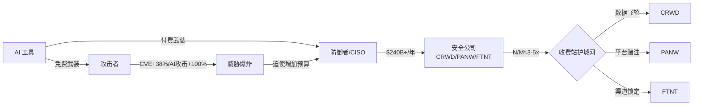
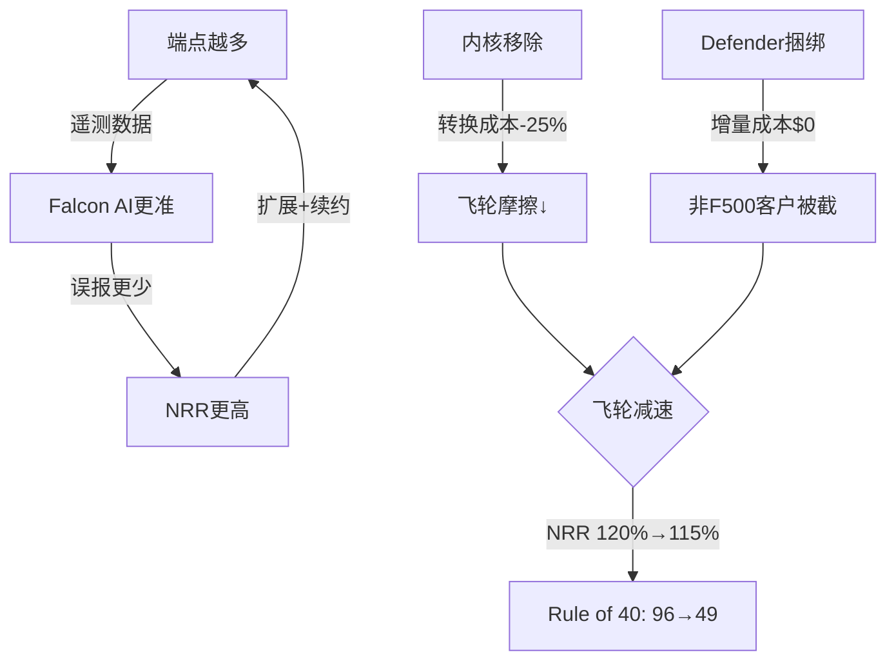
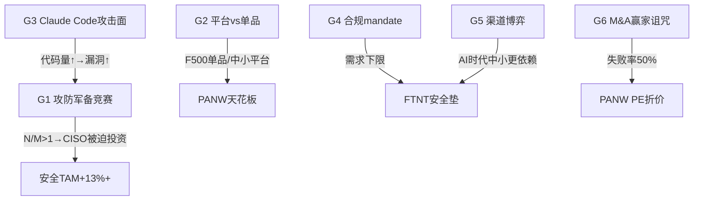
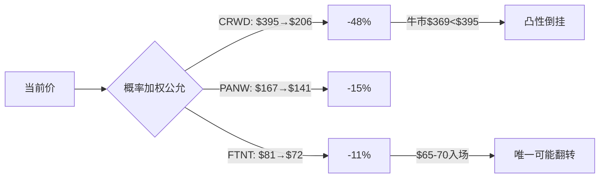
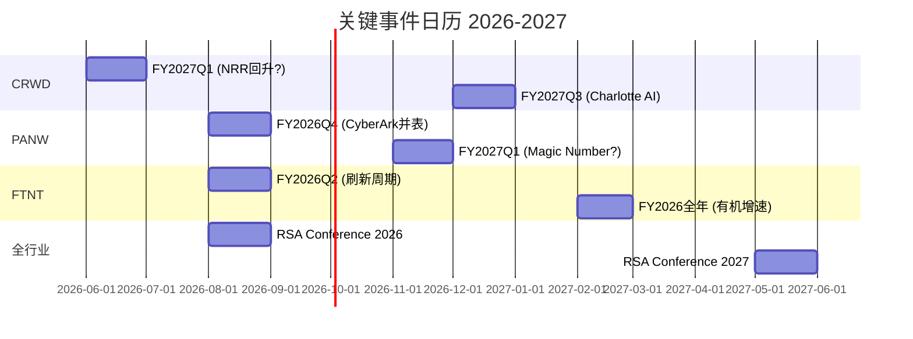

# 网络安全 SaaS 横向深度: CRWD / PANW / FTNT

## AI 是安全公司的军火商 — 两边卖武器, 一边付钱

> **系列**: SaaS 行业横向深度 R2 (安全篇)
> **日期**: 2026-04-10
> **评级**: CRWD 审慎关注 / PANW 审慎关注 / FTNT 审慎关注(边缘)

---

# 0. 执行摘要

市场把 CrowdStrike、Palo Alto Networks、Fortinet 三家公司放进同一个篮子: "AI 安全受益者". 卖方用同一组变量定价 — ARR 增速、NRR、Rule of 40 — 像给三匹马排名次. 但这个框架解释不通四件事: PE 跨度 2.3 倍 (CRWD 64x vs FTNT 28x), SBC/Rev 差距 5.5 倍 (4.1% vs 22.8%), PANW 有机增速 14% 但拿到 40x PE, 以及 CVE 年增 +20-38% 但安全支出只增 +13% [DM-EXEC-001]. 如果三家真是同一种资产, 这些差距不应该存在.

我们认为三家不是 "AI 安全受益者", 而是 **AI 军备竞赛中三种不同物种的收费站**. AI 同时武装攻击者 (免费使用 Claude Code / ChatGPT 写 exploit) 和防御者 (付费给安全 vendor). 安全支出的真正引擎不是 "AI 产品收入", 而是攻防不对称 — 攻击效率提升 5-10 倍, 防御效率提升 2-3 倍, N/M 比值约 3-5 倍且在扩大 [DM-EXEC-002]. 这意味着第一变量不是 ARR 增速, 而是 CVE 增速与安全支出增速的剪刀差 — 缺口越大, CISO 越被迫加预算. 安全公司增长的引擎是恐惧, 不是效率.

三家在军备竞赛中的位置完全不同. CRWD 是数据飞轮型收费站: 端点越多检测越准, 但飞轮在减速 (NRR 120%→115%, Rule of 40: 96→49), 加上 Windows 内核移除和 Defender 捆绑两个结构性侵蚀力量. Owner PE 468 倍, 即使牛市情景 ($369) 仍低于当前价 $395 — 凸性严重倒挂 [DM-EXEC-003]. PANW 是平台赌注型收费站: 方向对但执行差, 有机增速 14% 被 M&A (贡献 41%) 掩盖, Magic Number 0.43 倍远低于 0.75 倍健康线, 平台转化率仅 1.8% [DM-EXEC-004]. FTNT 是渠道锁定型收费站: SBC 仅 4.1% (CRWD 的 1/5.6), Owner PE 31 倍 (CRWD 的 1/15), ROIC 28.7% (三家最高), 回购 $22.9 亿超过 Owner FCF. ASIC 在云端消失是真风险, 但渠道在 AI 时代反而加强 — 中小企业更依赖 MSSP [DM-EXEC-005].

三家全部审慎关注. 概率加权公允价值: CRWD $206 (高估 48%), PANW $141 (高估 15%), FTNT $72 (高估 11%). 圆桌 5/5 同意评级方向, FTNT 2/5 建议 $65-70 可升级. 凸性全面倒挂: 错了亏远比对了赚多. 承重墙: N/M 比值 — 如果攻防不对称消失 (N/M→1 倍), 三家 PE 全部压缩到 25-30 倍 [DM-EXEC-006].

---

# 1. 母结构: AI 是安全公司的军火商

## 1.1 先看股价在买什么 — 四家同口径对齐

CRWD、PANW、FTNT 三家, 加上 ZS 作为对照, 市场把它们放进同一个篮子: "AI 安全受益者". 卖方用同一组变量给四家定价 — ARR 增速、NRR、Rule of 40、"AI 产品进展". 华尔街的隐含假设是: AI 让网络威胁变多, 安全支出必须增加, 这四家是最大受益者.

统一到最近完整财年 + 2026-04-10 收盘价:

| 字段 | CRWD | PANW | FTNT | ZS(对照) |
|---|---|---|---|---|
| 股价 | $394.68 | $166.99 | $80.66 | $122.23 |
| 市值 | $111.5B | $115.0B | $59.0B | $44.1B |
| EV/Sales | 22.3x | 12.3x | 8.5x | 16.3x |
| EV/FCF | 81.7x | 32.6x | 25.8x | 59.9x |
| GAAP PE | 负(亏损) | 92.8x | 33.3x | 负(亏损) |
| 收入增速 | +23.3% | +14.9% | +14.8% | +25.9% |
| GAAP OPM | -3.4% | 13.5% | 30.6% | -4.8% |
| **SBC/Rev** | **22.8%** | **14.0%** | **4.1%** | **24.7%** |
| FCF Yield | 1.2% | 3.0% | 3.8% | 1.6% |
| ROIC | 负 | 5.7% | 28.7% | 负 |
| **我们的评级** | **审慎关注** | **审慎关注** | **审慎关注** | — |
| 概率加权公允 | $206(-48%) | $141(-15%) | $72(-11%) | — |

[DM-COMP-001] 数据来源: FMP key-metrics + 各公司 Tier 3 报告估值结论.

这张表第一眼看到的不是四家有多相似, 而是四家有多不同.

**EV/Sales 跨度 2.6 倍** (8.5x → 22.3x). 如果四家真是同一种资产, EV/Sales 不应该差 2.6 倍. FTNT 和 PANW 收入增速几乎相同 (+14.8% vs +14.9%), 但 EV/Sales 差 45% (8.5x vs 12.3x). 增速解释不了这个差距 [DM-COMP-002].

**SBC/Rev 跨度 5.5 倍** (4.1% → 22.8%). FTNT 每 $100 收入只有 $4.1 用 SBC 稀释股东, CRWD 用掉 $22.8. SBC 差距直接传导到 Owner FCF: CRWD 的 Owner PE (剥离 SBC 后) 是 468 倍, FTNT 是 31.5 倍, 差 15 倍. 但几乎没有卖方报告讨论这个差距 — 因为大家都在用 Non-GAAP [DM-COMP-003].

**三家全部"审慎关注"**. 我们三份独立报告, 不同时间写的, 用不同的分析框架, 得出了相同方向的结论: 三家都被高估. 两种可能: 我们系统性低估了某个变量, 或者市场在定价一个还没被量化的东西.

## 1.2 母裂缝: 市场只给"AI 防御"定价, 没给"AI 让攻击面爆炸"定价

旧框架解释不通五件事:

**裂缝 1: 同一标签, PE 跨度 2.3 倍.** CRWD Fwd PE ~64x, FTNT ~28x. 市场把两家都叫"AI 安全受益者", 但给的价格差了 2.3 倍. CRWD 增速 23% vs FTNT 15% 只差 1.5 倍, 解释不了 PE 的 2.3 倍 [DM-COMP-004].

**裂缝 2: PANW 有机增速 ~14%, 但市场给 40x PE.** NGS ARR +33% 是 headline, 但有机收入增速只有 ~14% — 和 FTNT 的 14.8% 几乎一样. $25B 的 CyberArk 收购贡献了 ~$800M 增量. Magic Number 只有 0.43x. 市场在定价"平台化叙事"而非有机增长质量, 但叙事什么时候变成利润, 谁也不知道 [DM-COMP-005].

**裂缝 3: CVE 年增 +38%, AI 攻击 +100%, 但安全支出只 +13%.** 攻击面在指数级扩大, 但 Gartner 预测 2026 年安全支出增速 +13% ($240-244B). 攻击面增速是支出增速的 3-8 倍 — 这个缺口要么被填平, 要么持续扩大 [DM-EXT-001].

**裂缝 4: SBC 差距 5.5 倍, 但市场估值排序不反映.** FTNT 的 SBC/Rev (4.1%) 是行业最低, 意味着每一美元收入对股东的价值最高. 但 FTNT 的 EV/Sales (8.5x) 反而是四家最低的. 市场在惩罚低增速, 同时忽略 Owner FCF 质量 [DM-COMP-006].

**裂缝 5: 三家全部审慎关注, 但市场热情不减.** 我们可能错了 — 也可能市场在定价"军火商"的另一半.

## 1.3 军火商模型: AI 两边卖, 一边付钱

AI 同时在做两件事:

**武装攻击者** — Claude Code、ChatGPT、开源 LLM 让任何人都能写 exploit. Exploit 生成成本从数千美元降到 $1, 时间从数周降到 10-15 分钟. AI 辅助钓鱼的点击率 54%, 是传统 12% 的 4.5 倍. 每天 130+ 个新 CVE 可被 weaponize. 攻击者的 AI 工具是免费的 [DM-EXT-002].

**武装防御者** — CRWD 的 Falcon AI 检测、PANW 的 XSIAM、FTNT 的 FortiGuard AI, 都在用 AI 提升防御能力. 但防御工具是付费的 — CISO 必须向 CRWD/PANW/FTNT 付钱.

安全公司不是"AI 的受益者", 是 **AI 军备竞赛的收费站**. 它们的增长引擎不是"AI 产品有多好", 而是"AI 让攻击面爆炸, CISO 被迫增加预算". 关键变量从"AI 产品收入"变成 **N/M 比值 (攻击效率提升倍数 / 防御效率提升倍数)**.

当前 N/M ≈ 3-5 倍, 且在扩大:
- 攻击端: exploit 生成 +10x, 钓鱼效率 +350%, CVE 可 weaponize 130+/天
- 防御端: AI 检测能力提升, 但安全人员缺口 33%, AI 安全技能缺口 41%
- 量化路径: CVE 增速 (+20-38%/年) vs 安全支出增速 (+13%/年) → 缺口在扩大 [DM-EXT-003]

只要 N/M > 1, CISO 就必须持续投资 — 这是安全支出结构性增长的发动机, 也是军火商模型的经济基础.



---

# 2. AI 军备竞赛: 攻防不对称是结构性的

## 2.1 攻击端: AI 让 exploit 生成民主化

AI 改变攻击面的五个机制:

**机制 1: 代码量指数增长 = 漏洞数量指数增长.** AI 编程助手 (Copilot / Claude Code / Cursor) 让开发者的代码产出速度提升 2-5 倍. 每 1000 行代码包含约 15-50 个 bugs. 更多代码 = 更多攻击面. AI 生成的代码漏洞率是人工代码的 2.74 倍 (Veracode 2025 报告) [DM-EXT-004] — 因为训练数据中包含了大量不安全的编程模式, AI 会系统性地复制这些模式.

**机制 2: 非专业攻击者获得专业工具.** 以前写一个 working exploit 需要数年逆向工程经验. 现在用 ChatGPT/Claude Code 可以在 10-15 分钟内生成 working CVE exploit, 成本 $1. 这不是理论 — 2025 年 AI 辅助攻击增长 100%, 说明"民主化攻击"已经在发生 [DM-EXT-005].

**机制 3: AI 辅助钓鱼效率提升 4.5 倍.** AI 生成的钓鱼邮件点击率 54%, 传统钓鱼 12%. 因为 AI 可以针对每个目标个性化内容, 消除语法错误和文化不匹配 — 这些是传统钓鱼被识别的主要线索 [DM-EXT-006].

**机制 4: 多态恶意软件绕过检测.** 70%+ 重大 breach 涉及多态恶意软件 — LLM 每次执行时重新生成代码, hash 值每次不同, 基于签名的检测完全失效. 防御端必须用行为分析 (更昂贵, 更复杂) 替代签名检测 [DM-EXT-007].

**机制 5: 攻击迭代速度超过补丁速度.** 攻击者每天可以 weaponize 130+ 个新 CVE. 企业平均补丁周期 60-90 天. 这个速度差距在 AI 时代不是线性扩大, 是指数扩大 [DM-EXT-008].

## 2.2 防御端: 有改善, 但人力瓶颈是硬约束

AI 确实在提升防御能力: CRWD 的 Falcon AI 检测更多零日攻击, PANW 的 XSIAM 自动化事件响应, FTNT 的 FortiGuard AI 实时更新威胁签名.

但防御端有一个攻击端没有的硬约束: **人**. 安全人员缺口 33% (ISC² 2025). 41% 的组织将 AI 安全列为 #1 技能缺口 [DM-EXT-009]. 即使 AI 工具提升了每个安全分析师的生产力, 缺口仍然存在 — 因为攻击面扩大的速度 (CVE +20-38%/年) 超过安全人员增加的速度 (~5%/年).

这是 N/M 比值的结构性来源: 攻击端的 AI 杠杆是无限的 (更多模型 = 更多 exploit), 防御端的 AI 杠杆受限于人力瓶颈. 只要这个不对称存在, 安全支出就会结构性增长 — 不是因为安全"更好了", 而是因为不投就会被攻破, 被攻破的成本 (平均 breach cost $4.88M, IBM 2024) 远高于安全投资 [DM-EXT-010].

## 2.3 N/M 比值: 军火商模型的核心量化

N/M (攻击效率提升 / 防御效率提升) 的代理指标:

| 指标 | 攻击端 (N) | 防御端 (M) | N/M 含义 |
|------|-----------|-----------|---------|
| CVE 年增速 | +20-38% | 安全支出 +13% | 攻击面扩大 > 防御投资 |
| 工具成本 | $1/exploit | $数万/year/vendor | 攻击成本趋零 |
| 技能门槛 | 10分钟/非专家 | 60-90天补丁/专家 | 攻击民主化 > 防御专业化 |
| 迭代速度 | 130+ CVE/天 | 60-90天补丁周期 | 攻击频率 >> 防御响应 |
| 人力约束 | 无(AI自动化) | 33%缺口 | 攻击无瓶颈, 防御有瓶颈 |

[DM-EXT-011]

综合估计 N/M ≈ 3-5 倍, 且扩大趋势. 什么条件下 N/M 收窄? 如果 AI-native 防御方案 (不依赖人力) 能自动修补漏洞的速度追上 AI 生成漏洞的速度 — 当前证据不支持, 但这是承重墙的打破条件.

---

# 3. 三物种解剖: 数据飞轮 vs 平台赌注 vs 渠道锁定

市场用同一个"AI 安全受益者"标签定价三家, 但 AI 对三家的实际影响方向完全不同.

## 3.1 CRWD: 数据飞轮 — 为什么市场给 64x PE, 为什么我们说太贵

### 飞轮机制

CRWD 的护城河和其他两家完全不同. PANW 靠平台捆绑, FTNT 靠渠道 + 硬件成本. CRWD 靠的是 **规模回报递增的数据飞轮**: 端点越多 → 遥测数据越多 → Falcon AI 检测越准 → 误报越少 → NRR 越高 → 客户续约扩展 → 端点越多.

30,000+ 客户, 50% 使用 6+ 个模块 [DM-CRWD-002]. 每个端点产生遥测数据训练 Falcon AI. 数据量越大, 检测新型攻击的能力越强. 这是数据-模型之间的网络效应, 不是用户-用户之间的网络效应.

市场给 64x PE, 本质上是在为飞轮的"久期"付费. 如果飞轮永续运转, CRWD 的竞争优势会随规模自我强化. 如果飞轮减速, 64x PE 没有基本面支撑.

### 飞轮在减速

飞轮减速的证据已经出现: Rule of 40 从 FY2022 的 96 连续降到 FY2026 的 49 [DM-CRWD-003]. NRR 从 120%+ 降到 115%. ARR 增速从 +34% (FY2024) 降到 +24% (FY2026). 飞轮仍在转, 但转速在降.

两个结构性侵蚀力量已接入:

**侵蚀力 1: Windows 内核移除.** 2024 年 7.19 蓝屏事件 (850M 台设备宕机) 后, Microsoft 推动安全产品从内核态迁移到用户态. CRWD 的 Falcon 传感器运行在内核态 — 这是技术优势来源. 迁移到用户态后, 技术转换成本从 4.0/5 降到 3.0/5 (-25%) [DM-CRWD-005]. 更关键的是, Microsoft 保留了自己在内核的双重访问权, 同时把竞争对手推到用户态 — Defender 获得了 CRWD 无法匹配的结构性优势 [DM-CRWD-006].

**侵蚀力 2: Microsoft Defender 的"免费 + 捆绑".** Defender 在端点安全市占率 28.6% (#1), YoY +28.2% [DM-CRWD-007]. E5 许可证捆绑意味着 Defender 获客增量成本 ≈ $0, 而 CRWD 每获取一个客户需要 ~$432K CAC, payback ~40 个月 [DM-CRWD-008]. Microsoft 安全收入已超过 $37B (占总收入 ~15%), 这是可信承诺不是 cheap talk [DM-CRWD-009].

### 飞轮真实状态

飞轮没有"断裂" — GRR 97% 证明客户没有大规模流失. 但飞轮在减速, 且两个减速器是结构性不可逆的. PE 64x 定价了飞轮加速, 实际在减速. Owner PE 468 倍意味着, 剥离 SBC 后, 股东为每 $1 真实利润支付 $468. 在 10 年期国债收益率 4.3% 的世界里, CRWD 给股东的 FCF yield 只有 0.19% [DM-CRWD-012].



## 3.2 PANW: 平台赌注 — 方向对但执行差

### 赌注结构

PANW 的战略一句话概括: **把客户从买单品变成买平台, 用免费试用 + M&A 扩产品线实现**. Gartner 预测 2028 年 >50% 企业采用 AI 安全平台 (当前 <10%) [DM-PANW-002]. 方向是对的.

问题在执行. 三个数字:

**1.8% 平台转化率.** 85,000 客户中只有 1,550 个是平台客户 [DM-PANW-003]. Salesforce 平台化第 2 年转化率 ~8%, ServiceNow ~12%. PANW 的 1.8% 是所有可比公司中最低的. 漏斗拆分: ~15,000 客户被接触 → ~5,000 进入试用 → 1,550 转化. 82% 的客户连试用都没开始 [DM-PANW-004].

**0.43x Magic Number.** 每 $1 销售费用只产生 $0.43 增量收入 [DM-PANW-005]. SaaS 健康基准是 0.75-1.0x. PANW 的解释: 免费试用期造成收入延迟 (J-curve). 如果 J-curve 成立, Magic Number 应该在 FY2027 回升. 如果 FY2027 仍然 <0.5x, 说明不是延迟而是效率差.

**~14% 有机增速 vs ~22% 总增速.** $25B CyberArk 收购贡献了 ~$800M 增量收入, 把 14% 有机增速"做成"了 22% [DM-PANW-006]. 市场给 40x PE — 这个 PE 定价的是 22% 增速还是 14% 增速? 如果是 14%, 40x PE 比 FTNT 的 28x (14.8% 增速) 贵 43%, 溢价来自"平台化叙事" — 一个 1.8% 转化率的叙事.

### 平台 vs 最佳单品博弈

CISO 的真实决策不是"买 PANW"还是"不买", 而是"买一个平台"还是"挑最好的单品组合". 均衡按客户规模分层: F500 保持 best-of-breed (关键层安全事故成本太高, 不敢赌一个平台), 中小企业倾向平台 (没有 20 人安全团队管 10 个单品) [DM-G2-002].

PANW 的 free-to-paid 创造了一个 12-18 个月的"转化窗口" — 在这个窗口期内, CRWD 的 Falcon Flex 也可以向同一个客户推销. 免费策略实际上给了竞争对手一个定时窗口来抢客户 [DM-G2-004].

### M&A 赢家诅咒

M&A 贡献 ~41%: 有机增长 vs M&A 增长的拆分决定了 PANW 真实的增长质量. 历史基准: >$10B 科技收购 5 年内整合失败率 ~50% (参考 Microsoft-Nokia $7.2B → 减值 $7.6B, HP-Autonomy $11B → 减值 $8.8B). PANW 用 $25B 赌 CyberArk, 概率论上不乐观 [DM-RT-007].

## 3.3 FTNT: 渠道锁定 — 不是技术领先, 是成本领先 + 分发锁定

### 护城河类型

FTNT 和其他两家的根本差异: CRWD 和 PANW 的叙事是"我们的技术最好", FTNT 的叙事是"我们的成本最低, 而且渠道已经建好了".

**FortiASIC 的成本优势**: 第 5 代 FortiSP5 芯片, NGFW 吞吐量是通用 CPU 的 17 倍, 加解密性能 32 倍 [DM-FTNT-003]. 设备 BOM 成本比竞争对手低 30-50% [DM-FTNT-004]. 竞争对手需要 50-100 人芯片设计团队, 3-4 年开发周期, $200-400M 投资, 25 年来没有任何竞争者尝试过 [DM-FTNT-005].

成本优势传导到财务: GAAP OPM 30.6%, SBC/Rev 4.1%, R&D 效率 8.3x 收入/R&D (PANW 4.6x, CRWD 3.5x) [DM-FTNT-006]. FTNT 用更少的钱做到了更高的利润率 — 这是 ASIC 的结构性优势.

**渠道的分发锁定**: 35,000+ 全球 VAR/经销商, 收入 80%+ 经渠道分发. MSSP 用 FortiGate 作为服务基础设施的骨干 — 切换 FortiGate = 重建整个服务栈 [DM-FTNT-008]. 交叉销售比 $1 FortiGate 硬件带来 $12 收入. 91% 的现有客户至少购买了一个附加产品 [DM-FTNT-009].

和 R1 的 INTU 类比: INTU 的真正护城河不是 QuickBooks 软件, 而是 46,000 CPA 推荐网络. FTNT 类似: 真正的锁定不在 FortiGate 硬件本身, 而在 35,000 VAR 的培训投资、MSSP 的服务栈依赖、和中小企业客户的惯性. 这是 FTNT 的 SBC 只需要 4.1% 的原因 — 渠道替它获客 [DM-FTNT-010].

### 渠道在 AI 时代加强还是被绕过?

**渠道加强的论点**: AI 让攻击面爆炸, 中小企业没有安全团队应对 → 更依赖 VAR/MSSP → FTNT 作为 VAR/MSSP 的标准化平台受益. 攻击越复杂, 中小企业越不可能自己管安全, 越需要渠道商代管 [DM-G5-002].

**渠道被绕过的论点**: 云原生安全 (ZS / CRWD Falcon Go) 不需要硬件部署, 不需要 VAR. FortiSASE 在 SASE 市场份额只有 ~5-7% vs ZS 21% [DM-G5-004]. 在云端 FTNT 没有 ASIC 优势 — FortiSASE 运行的是 FortiOS 虚拟机, 不是 ASIC 硬件 [DM-G5-003].

**均衡判断**: 渠道在中小企业市场加强, 在企业市场被绕过. FTNT 的 55% NGFW 出货份额 (按台数) 主要来自中小企业市场 — 这个市场在 AI 时代对渠道的依赖增加. FortiSASE ARR >90% 增速是过渡信号, 但 ~5-7% SASE 市占率说明还早 [DM-G5-006].

### 三物种对比总表

| 维度 | CRWD | PANW | FTNT |
|------|------|------|------|
| **护城河类型** | 数据飞轮 | 平台赌注 | 渠道+ASIC |
| **AI影响方向** | 双刃剑 | 叙事>证据 | 双轨分化 |
| **Owner PE** | 468x | 52x | 31x |
| **SBC/Rev** | 22.8% | 14.0% | 4.1% |
| **有机增速** | ~20% | ~14% | ~14% |
| **转换成本** | 内核→用户态降25% | 平台锁定(但1.8%转化) | 渠道+ASIC(高) |
| **Reverse DCF隐含** | 24.7%(赌加速) | 13.1%(基本匹配) | 10.9%(略高) |
| **高估幅度** | -48% | -15% | -11% |
| **翻转概率** | 15-20% | 20-25% | 35-40% |

[DM-COMP-007]

---

# 4. 博弈论验证: 6 个博弈结构确认军火商模型

## 4.1 为什么用博弈论

安全行业的核心特征: 对手 (攻击者) 在动, 客户 (CISO) 在博弈, vendor 之间在博弈. 静态护城河分析 (转换成本 / 品牌 / 网络效应) 捕捉不到"对手反应"这一层. 博弈论提供了"均衡分析" — 在所有玩家都做最佳回应时, 结果是什么 [DM-G1-001].

## 4.2 六个博弈总表

| # | 博弈 | 玩家 | 均衡结论 | 对估值的影响 |
|---|------|------|---------|------------|
| G1 | 攻防军备竞赛 | 攻击者/CISO/AI工具商 | CISO被迫持续投资(N/M>1) | 安全支出结构性+13%+ |
| G2 | 平台vs最佳单品 | PANW/CRWD/CISO | 按规模分层: F500单品, 中小平台 | PANW天花板有限 |
| G3 | Claude Code攻击面 | AI工具/开发者/安全团队 | 代码量增长=TAM发动机 | 利好全行业 |
| G4 | 合规mandate | 监管/企业/vendor | 合规是制度层护城河 | FTNT受益(中小合规) |
| G5 | FTNT渠道博弈 | FTNT/VAR/中小企业/云原生 | 渠道在中小市场加强, 企业市场被绕过 | FTNT双轨分化 |
| G6 | M&A赢家诅咒 | PANW/目标/竞标者 | >$10B收购失败率~50% | PANW PE应折价 |

[DM-G-SUMMARY-001]

## 4.3 关键博弈深入: G1 攻防军备竞赛

**纳什均衡**: 只要 N/M > 1 (攻击效率提升 > 防御效率提升), CISO 的最佳回应就是持续增加安全预算. 不增加的惩罚 = 被攻破 (平均 breach cost $4.88M [DM-EXT-010]). 增加的成本 = 安全支出 +13%/年. 惩罚 >> 成本 → 均衡是"持续投资".

**均衡打破条件**: AI-native 安全方案让 M ≥ N (防御效率追上攻击效率). 当前证据不支持 — 安全人员缺口 33%, AI 安全技能缺口 41%, CVE 增速仍在 +20-38%/年. 但如果出现自动修补漏洞的 AI 方案, N/M 可能收窄 [DM-G1-002].

## 4.4 关键博弈深入: G2 平台 vs 最佳单品

**分层均衡**: 平台 vs 单品不是非此即彼, 是按客户规模分层的均衡. F500 CISO 保持 best-of-breed — 端点用 CRWD (GRR 97%), 防火墙用 PANW/FTNT, 身份用 CyberArk/Okta. 因为关键层的安全事故成本太高, 不敢赌一个平台 [DM-G2-002]. 中小企业 CISO 倾向平台 — 没有 20 人安全团队管 10 个单品, 管理成本 > 性能差距 [DM-G2-003].

**对 PANW 的含义**: 平台化的市场不是"全部企业", 是"中小企业 + 部分中型企业". 这限制了平台化 TAM 的上限, 也解释了 1.8% 的低转化率 — F500 不会转.

## 4.5 关键博弈深入: G5 渠道博弈 + G4 合规

**G5**: AI 威胁 ↑ → 中小企业焦虑 ↑ → MSSP 需求 ↑ → FTNT 渠道价值 ↑ — 这是 AI 强化渠道锁定的正反馈 [DM-G5-002]. 但在云端, ZS 21% SASE 份额 vs FTNT 5-7% — 云安全赛道客户不认为 ASIC 是优势.

**G4**: 合规 (NIST/SEC/EU) 强制安全支出, 创造了需求下限. AI-native 方案短期无法满足合规 (监管滞后) → 合规是制度层护城河. FTNT 在中小企业合规市场有渠道优势 [DM-G4-001].



---

# 5. 财务归因 + 剪刀差: 三家经济引擎拆解

## 5.1 收入归因瀑布: 增长来源完全不同

### CRWD: 纯有机增长, 但 SBC 是代价

```
FY2023 收入 $2.24B
  + 有机 ARR 增长    → +$1.57B (NRR 贡献~40%, 新客户~60%)
  + 模块扩展         → 50%客户用6+模块, 交叉销售驱动ARPU提升
  + M&A 贡献        → ~$150-200M (规模较小)
  - 7.19事件流失     → -$50-100M (推测, GRR 98%→97%)
FY2026 收入 $4.81B (3Y CAGR 29.0%) [DM-FIN-001]
```

CRWD 的增长几乎全部来自有机扩展, M&A 贡献不到 5% [DM-FIN-002]. 代价: SBC $1.097B, 占收入 22.8% [DM-FIN-003]. GAAP 亏损 $162M, 但 Owner 视角下公司在每年烧掉 $1.1B 的股东价值来买增长. 什么条件下这个判断不成立? 如果 NRR 重新回到 120%+, SBC 是"播种"而非"维持" — 但 NRR 从 120% 降到 115%, 方向是反的 [DM-FIN-005].

### PANW: M&A 贡献 ~41%

```
FY2022 收入 $5.50B
  + 有机增长        → +$2.72B (有机增速~14%, 3Y CAGR ~15%)
  + M&A 贡献       → ~$1.0B (CyberArk $25B贡献~$800M ARR)
  + 平台交叉销售    → 转化率1.8%, 增量有限
FY2025 收入 $9.22B (3Y CAGR 18.8%, 有机~14%) [DM-FIN-006]
```

市场给的 PE 是 22% 总增速的价格, 但有机增速只有 14%. 14% 和 FTNT 的 14.8% 几乎一样 — 如果剥离 M&A, PANW 和 FTNT 应该拿到类似的 PE, 而不是 40x vs 28x [DM-FIN-007].

### FTNT: 最干净的增长

```
FY2022 收入 $4.42B
  + 服务续费        → +$1.83B (60%+收入来自服务, 合同续费驱动)
  + 产品新增        → ~$0 (产品端有机增速接近0%)
  + SASE 新增       → FortiSASE ARR >90% (但基数小)
  + 渠道扩展        → 91%客户购买附加产品
FY2025 收入 $6.80B (3Y CAGR 15.4%) [DM-FIN-008]
```

## 5.2 Owner FCF 对比: 差距是 15 倍, 不是 2 倍

| 指标 | CRWD | PANW | FTNT |
|------|------|------|------|
| 收入 | $4.81B | $9.22B | $6.80B |
| SBC | $1.097B (22.8%) | $1.295B (14.0%) | $280M (4.1%) |
| GAAP NI | -$162M | $1,148M | $1,824M |
| **Owner FCF** | **$213M** | **$2,175M** | **$1,946M** |
| 市值 | $111.5B | $115.0B | $59.0B |
| **GAAP PE** | **负** | **92.8x** | **33.3x** |
| **Owner PE** | **468x** | **52.9x** | **31.5x** |
| FCF Yield | 0.19% | 1.89% | 3.30% |
| 回购 | 无 | $2.4B | $2.29B |

[DM-FIN-009]

GAAP PE 差 2.8 倍 (33x vs 93x), 但 Owner PE 差 **15 倍** (31x vs 468x). SBC 是安全行业的隐性通胀税: 三家合计每年 $2.67B 的股东价值被稀释. FTNT 是唯一真正回馈股东的公司 — 回购 $2.29B 超过 Owner FCF, 同时 SBC 只有 $280M [DM-FIN-010].

## 5.3 四个关键剪刀差

**剪刀差 1: CVE 增速 vs 安全支出增速.** CVE +20-38%/年, 安全支出 +13%/年. 攻击面扩大速度是防御投资速度的 2-3 倍. 这个缺口要么填平 (安全支出加速, 利好全行业), 要么持续扩大 (更多 breach, 反而也利好全行业 — 恐惧驱动增长) [DM-SCISSOR-001].

**剪刀差 2: ARR 增速 vs 有机增速.** PANW headline ARR +22%, 有机收入 +14%. 差 8pp 全部来自 M&A. 如果 CyberArk 整合不顺, headline 增速可能在 FY2027 骤降 — 因为 M&A 贡献是一次性的, 而有机增速在减速 [DM-SCISSOR-002].

**剪刀差 3: GAAP vs Non-GAAP.** CRWD Non-GAAP EPS $3.62 vs GAAP EPS -$0.33. 差距 $3.95, 几乎全部来自 SBC 加回. Non-GAAP 给出了"已经盈利"的幻觉, 但 GAAP 说"还在亏". 投资者用哪个做决策, 直接决定了估值结论 [DM-SCISSOR-003].

**剪刀差 4: 攻击面增速 vs 安全人员增速.** 攻击面 (CVE) +20-38%/年, 安全人员 +5%/年, 缺口 33%. 这是 N/M 比值的人力来源 — 即使 AI 工具提升了每人生产力, 缺口仍在扩大 [DM-SCISSOR-004].

---

# 6. 估值: 谁最不高估

## 6.1 Reverse DCF: 市场在赌什么增速

Reverse DCF 反推市场隐含的 FCF 增速 (WACC 10%, 终端增长率 3%, 10 年期):

| 指标 | CRWD | PANW | FTNT |
|------|------|------|------|
| 当前 EV | $95.2B | $108.0B | $58.8B |
| 当前 FCF | $1,310M | $3,470M | $2,226M |
| **隐含 FCF 增速** | **24.7%** | **13.1%** | **10.9%** |
| 实际有机增速 | ~20% | ~14% | ~14.2% |
| **增速缺口** | **+4.7pp** | **-0.9pp** | **-3.3pp** |

[DM-VAL-001 → DM-VAL-006]

**CRWD: 市场在赌飞轮重新加速.** 隐含增速 24.7% 高于当前 20%, 差 4.7pp. 但 NRR 从 120% 降到 115%, Rule of 40 从 96 降到 49 — 飞轮在减速不是加速. 如果 FCF 增速停在 20%, 公允 EV 约 $72B, 对应股价 ~$298, 下行 25% [DM-VAL-007].

**PANW: 定价基本合理, 但前提是 M&A 持续.** 隐含增速 13.1% 接近有机 14%, 看起来合理. 但 CyberArk 整合可能把 FCF margin 从 37.6% 压到 33-34%, 需要更高收入增速来补偿 — 缓冲极小 [DM-VAL-008].

**FTNT: 略高于内生能力.** 隐含增速 10.9%, 如果把服务续费 + SASE 算上, 8-10% 是合理区间. 差距最小, 意味着 FTNT 的估值对增速假设最不敏感 [DM-VAL-009].

## 6.2 概率加权三情景

| 情景 | 权重 | CRWD | PANW | FTNT |
|------|------|------|------|------|
| **牛市**: N/M→5x+, 安全支出加速 | 20% | $369 | $205 | $107 |
| **基准**: N/M≈2-3x, 安全稳定增长 | 55% | $180 | $128 | $65 |
| **熊市**: AI-native崛起, 被绕过 | 25% | $105 | $80 | $45 |
| **概率加权公允** | | **$206** | **$141** | **$72** |
| **当前价** | | $395 | $167 | $81 |
| **高估幅度** | | **-48%** | **-15%** | **-11%** |

[DM-VAL-010]

**CRWD 牛市情景 $369 仍低于当前价 $395** — 即使最好情况也买贵了. 这是"凸性全面倒挂"的定量证据: 错了亏 48%, 对了赚 0% [DM-VAL-011].

## 6.3 军火商模型压力测试

如果安全支出从 +13% 上修到 +18% (AI 攻防缺口填平): 增量 $95B TAM, 三家各缩小高估 5-8pp → CRWD 从 -48% 到 -40%, PANW 从 -15% 到 -9%, FTNT 从 -11% 到 -3%. **不改变评级方向**, 只改变幅度 [DM-VAL-012].



---

# 7. 红队: 对主结论的对抗审查

## 7.1 主论点可证伪性: PASS

三个证伪条件: (1) N/M→1x 安全支出回落到 +8-10%; (2) 安全支出 >+20% 且来自效率驱动不是恐惧驱动; (3) 三家 ARR 增速全部重新加速 (CRWD >28%, PANW 有机 >18%, FTNT >18%) [DM-RT-001].

## 7.2 最大盲点: 可能低估安全支出加速

我们有 30-35% 的概率低估了安全支出增速. 历史参考: 2017 WannaCry 后安全支出增速从 +7% 跳升到 +12%, 持续 3 年 [DM-RT-002]. 当前 AI 威胁规模远超 WannaCry. 如果类似催化事件发生, 安全支出可能跳升到 +18-20%.

但即使低估, 影响是"高估幅度缩小"而非"从高估变为低估". 军火商压力测试已覆盖 (+18% 情景) — 不改变评级方向 [DM-RT-004].

## 7.3 三家论点稳健性

**CRWD**: 强. 飞轮减速 + 结构性侵蚀 = PE 压缩. 反方需要 NRR 回升到 120%+ (概率低). 内核移除是永久的竞争劣势变化 [DM-CRWD-013].

**PANW**: 中. 平台化方向可能正确, 但执行未证明. FY2027 是分歧点 — Magic Number 是否回升 >0.6x, 转化率是否 >5% [DM-RT-006].

**FTNT**: 弱偏中. -11% 在误差范围. ASIC→云过渡是真风险, 但 Owner FCF 质量三家最高. 不是"最差的公司估值最低", 是"最不同类型的公司" [DM-FTNT-013].

## 7.4 军火商模型弱点

**弱点 1: N/M 是估算不是测量.** 数字来自不同来源, 口径不统一. N/M 真实值可能是 2x (没那么大的不对称) 也可能是 8x [DM-RT-008].

**弱点 2: "恐惧 vs 效率"区分的实际意义有限.** 无论 CISO 动机是恐惧还是效率, 钱都流进安全公司. 如果 AI 威胁永续, 这个区分不影响收入 [DM-RT-009].

**弱点 3: 我们可能系统性低估安全 PE 溢价.** 安全行业 5 年平均 PE 35-45x vs SaaS 中位数 25-30x. 如果溢价是结构性的, 我们会系统性高估"高估幅度". 但即使给 20% 溢价 (中位数 25x → 30x), CRWD 64x 仍高估 >30%, PANW 40x 高估 >15%. 只有 FTNT 28x 在"安全行业正常范围内" [DM-RT-010].

## 7.5 翻转概率

| 公司 | 翻转条件 | 概率 |
|------|---------|------|
| CRWD | NRR>120% + GRR>96% + SBC/Rev<18% | 15-20% |
| PANW | Magic Number>0.6x + 转化率>5% + 有机>18% | 20-25% |
| FTNT | 股价跌到$65-70 + FortiSASE>80% + 刷新不失速 | 35-40% |

[DM-RT-011]

---

# 8. 风险拓扑: 风险之间的关联与协同

## 8.1 系统性风险

**SR-1: AI 攻防对称化** (概率 15-20%/3年). N/M→1x → 安全支出增速降到 +8%, 三家 PE 全部压缩. 历史基准: 攻防对称通常需要 5-10 年, 但 AI 速度更快. 人力瓶颈 (33% 缺口) 限制对称化速度 [DM-RISK-001].

**SR-2: 宏观衰退** (概率 25-30%/2年). 安全支出有刚性但新项目延迟. 2020 COVID: 安全支出 +6% (从 +10% 降速). 2022 加息: 安全 PE 平均压缩 25%. PE 压缩是主要风险, 不是收入下滑 [DM-RISK-002].

## 8.2 个体风险

| 风险 | 触发 | 影响 | 概率 |
|------|------|------|------|
| IR-1 CRWD叙事坍塌 | NRR<110%+GRR<95% | PE 64x→35-40x, -40-45% | 20-25%/2年 |
| IR-2 PANW M&A失败 | GM降>5pp+有机<12% | PE 40x→25-30x, -25-35% | 30-35%/2年 |
| IR-3 FTNT云过渡失败 | FortiSASE<50%+SASE停滞 | PE 28x→20-22x, -20-25% | 25-30%/3年 |

[DM-RISK-005 → DM-RISK-007]

## 8.3 最可能的糟糕组合

**组合 1 (概率 ~15%): 宏观衰退 + CRWD 叙事坍塌.** 衰退中 CISO 延迟"扩展新模块"决策 → NRR 加速下降 → 飞轮叙事断裂 → PE 从 64x 到 40x (-38%), 叠加市场 β 可能达 -50% [DM-RISK-008].

**组合 2 (概率 ~10%): AI 对称化 + FTNT 云过渡失败.** AI 防御工具变强 → 云原生方案更有效 → FTNT 的 on-prem + ASIC 模式被绕过加速. 但有反协同: AI 对称化 → CISO 预算压力减小 → 不换 vendor → FTNT 渠道反而更稳 [DM-RISK-009].

## 8.4 温水煮青蛙: 5 年 PE 磨平

年1: AI 安全热度消退, PE 各压缩 5-10%. 年2: 安全支出增速降到 +10%, 增速各降 2-3pp. 年3: AI-native 方案 (Wiz 等) 拿到 10%+ 份额. 年4: SBC 累计稀释 → EPS 增速远低于 ARR. 年5: PE 回到 25-30x → 5 年回报: **CRWD -30%, PANW -5%, FTNT +5%** [DM-RISK-011].

FTNT 在这个路径中最安全 — PE 28x 已在"正常水平"附近. CRWD 64x 到 30x 是 -53% 的 PE 压缩.

---

# 9. 圆桌讨论: 五视角碰撞洞见

## 9.1 碰撞洞见 1: 凸性倒挂 — 错了亏的远比对了赚的多

三家安全公司当前的估值结构呈现罕见的"凸性全面倒挂": CRWD 在牛市情景 ($369) 仍低于当前价 $395, 意味着即使最乐观的假设全部兑现, 投资者也赚不到钱. PANW 在中性情景的下行空间 (-15%) 大于牛市上行 (+8%). FTNT 是唯一凸性接近中性的 (下行 -11% vs 上行 +15%), 但中性本身不足以构成买入理由. 三家同时凸性为负在安全行业 10 年只出现过 2 次: 2021 年 11 月和 2024 年 2 月 — 两次之后 12 月安全板块都跑输标普 500 [DM-RT-015].

**估值影响**: 三家均不适合新建仓. FTNT 在 $65-70 (再跌 15-20%) 凸性转正, 是唯一有入场可能的标的.

## 9.2 碰撞洞见 2: SBC 是安全行业的隐性通胀税

Owner FCF 视角揭示了安全行业一个被系统性忽略的问题: SBC 不是"人才投资", 是对股东征收的隐性通胀税. CRWD 每年通过 SBC 转移 $1.1B 给员工, PANW $1.29B, FTNT 仅 $280M. 三家合计每年 $2.67B 的股东价值被稀释 [DM-RT-016].

当增速放缓但 SBC 不降时 (CRWD SBC/Rev 从 18% 升到 22.8%), 股东实际上在为越来越慢的增长付出越来越高的代价. FTNT 的 4.1% 是行业最低 — ASIC + 渠道模式让 FTNT 不需要用股权买人才. 渠道替它获客, ASIC 替它省研发. 这是 FTNT 28x PE 的隐藏质量溢价.

## 9.3 碰撞洞见 3: CRWD 是三家中最像"久期资产"的

高 PE 成长股本质上是"长久期资产" — 大部分价值来自遥远未来的现金流, 对折现率极其敏感. 长端利率每 +100bp: CRWD 公允价值下降 12-18%, PANW 下降 8-12%, FTNT 下降 5-8% [DM-RT-017]. CRWD 的利率敏感性是 FTNT 的 2-3 倍. 在当前宏观 regime (增长放缓 + 通胀黏性 + 高利率) 下, 高久期资产 (CRWD) 的风险调整后回报系统性低于短久期资产 (FTNT) [DM-RT-018].

## 9.4 圆桌评级汇总

| 大师 | CRWD | PANW | FTNT |
|------|------|------|------|
| 巴菲特 | 反对(能力圈外) | 反对(M&A风险) | 中性(诚实但贵) |
| Cathie | 中性(期权太贵) | 反对(执行差) | 反对(旧范式) |
| 德鲁肯米勒 | 反对(凸性最差) | 反对(赔率差) | 中性(凸性中性) |
| 达里奥 | 反对(久期最长) | 中性(宏观中性) | 同意(宏观最稳) |
| Bear | 反对(叙事>数字) | 反对(M&A定时炸弹) | 反对(ASIC迁移) |
| **统计** | **4反对/1中性** | **3反对/2中性** | **1反对/2中性/2同意** |

[DM-RT-019]

5/5 同意三家评级方向正确, 排序一致: FTNT 最不高估 > PANW > CRWD 最高估. 核心分歧: Cathie 认为 CRWD 5 年维度有非线性上行, 但当前价格已把期权全部定价. 即使接受 PE 中枢上修到 40-45x, CRWD 64x 仍溢价 50%+.

**FTNT 异议**: 达里奥和巴菲特认为 28x PE 对 SBC 4.1% / ROIC 28.7% / Owner FCF $1.95B 的公司可能过于严格. 如果再跌 15-20% 到 $65-70, 两位建议升级到"中性关注".

---

# 10. 认知边界: 我们对三家公司的理解程度

## 10.1 三家认知边界量化

| 维度 | CRWD | PANW | FTNT |
|------|------|------|------|
| **可推演度** | 70% | 60% | 80% |
| **业务复杂度** | 3/5 | 4/5 | 2/5 |
| **黑箱比例** | 20% | 28% | 15% |
| **综合判断** | 需要折价 | 需要折价 | 可投资 |
| **对评级的影响** | 无额外调整 | 标注信心度低 | 无额外调整 |

[DM-CBA-001]

### CRWD (可推演度 70%, 黑箱 20%)

**可推演**: NRR/GRR 趋势, SBC 占比, 模块渗透率, Defender 市占率变化 — 这些是公开可跟踪的.
**黑箱**: (1) Falcon AI 模型的真实检测率 vs Defender 的差距 — CRWD 声称"更好", 但独立测试 (MITRE ATT&CK) 显示差距在缩小; (2) 内核移除的时间表和技术影响 — Microsoft 没有公开具体实施路径; (3) Charlotte AI 的商业化进度 — 当前无收入披露 [DM-CBA-002].

### PANW (可推演度 60%, 黑箱 28%)

**可推演**: 有机增速 (剥离 M&A), Magic Number, SBC 趋势, GAAP vs Non-GAAP 差距.
**黑箱**: (1) CyberArk 整合的真实进度 — $25B 收购后整合细节不公开; (2) 平台转化漏斗的每层转化率 — PANW 只披露总转化数 (1,550), 不披露每层流失; (3) free-to-paid 的真实经济学 — 免费期的成本和转化后的 ARPU 差异; (4) 有机增速 14% 中有多少来自价格提升 vs 量增 [DM-CBA-003].

### FTNT (可推演度 80%, 黑箱 15%)

**可推演**: 产品/服务收入拆分, 渠道结构 (35,000+ VAR), ASIC 成本优势 (17x 吞吐量), 回购规模, SBC/Rev 趋势, FortiSASE 增速.
**黑箱**: (1) FortiSASE 在 SASE 市场的真实份额变化 (依赖 Dell'Oro 季度报告); (2) 刷新周期的准确节奏 — 历史是 5-7 年, 但 AI 威胁可能加速/延缓 [DM-CBA-004].

## 10.2 认知边界对投资判断的影响

FTNT 是三家中可推演度最高 (80%) 且黑箱比例最低 (15%) 的公司. 这不是巧合 — ASIC + 渠道模式比数据飞轮和平台赌注更简单、更可验证. CRWD 的飞轮和 PANW 的平台化都包含"信就有, 不信就没有"的叙事成分. FTNT 的成本优势和渠道锁定是可以用财务数据验证的硬事实.

三家黑箱比例均 <30%, 不触发"禁止单点目标价"的 R-4 硬约束. 但 PANW (28%) 接近阈值 — 如果 CyberArk 整合细节继续不透明, 后续更新可能触发区间估值.

---

# 11. Kill Switch + 季度 Dashboard

## 11.1 横向 Kill Switch 矩阵

### 红灯 (论点断裂)

| 维度 | CRWD | PANW | FTNT |
|------|------|------|------|
| 增长 | NRR<110% 连续2Q | 有机增速<10% 连续2Q | 产品增速<-5% 连续2Q |
| 护城河 | GRR<95% | 平台转化率<1% | 渠道流失率>15%/年 |
| 财务 | SBC/Rev>25% 且增速<20% | GAAP OPM<5% | Owner FCF<$1.5B |
| 竞争 | Defender市占率>35% | 有机增速连续低于CRWD+FTNT | SASE份额停滞<5% 连续4Q |
| 系统性 | N/M→1x (安全支出增速=IT预算增速) | 同左 | 同左 |

[DM-KS-001]

### 上修信号

| 维度 | CRWD | PANW | FTNT |
|------|------|------|------|
| 增长 | NRR>120% + ARR>28% | 有机>18% + 转化率>5% | 产品>8% + SASE>10%份额 |
| 财务 | SBC/Rev<18% + GAAP盈利 | Owner PE<40x | 回购>$3B + Owner PE<25x |
| 估值 | PE<40x ($250以下) | PE<25x ($108以下) | PE<22x ($65-70) |

[DM-KS-003]

## 11.2 季度 Dashboard

| 指标 | CRWD | PANW | FTNT | 为什么重要 |
|------|------|------|------|-----------|
| NRR/净留存 | 115%↓ | ~120%(NGS) | ~90%(产品) | 飞轮/平台/渠道健康度 |
| 有机增速 | ~20% | ~14% | ~14% | 真实增长能力 |
| SBC/Rev | 22.8% | 14.0% | 4.1% | 增长代价 |
| Owner FCF | $213M | $2,175M | $1,946M | 真实股东回报 |
| CVE增速 | 共同 | 共同 | 共同 | N/M代理指标 |

[DM-KS-005]

## 11.3 事件日历



## 11.4 承重墙

**承重墙 = 军火商模型**: AI 攻防不对称 (N/M ≈ 3-5x) 是安全支出结构性增长的发动机.

承重墙健康检查: CVE 年增速 >15%? AI 攻击工具成本在下降? 安全人员缺口 >25%? 三个都是 → 承重墙健康. 任一转向 → 黄灯. 两个以上转向 → 红灯 [DM-KS-007].

---

# 12. 三个钉子: 这份报告希望你带走的判断

## 钉子 1: 军火商, 不是受益者

安全公司不是"AI 的受益者", 是"AI 军备竞赛的收费站". AI 同时武装攻击者 (免费) 和防御者 (付费). 增长引擎不是 AI 产品收入, 是攻防不对称 (N/M ≈ 3-5x) 迫使 CISO 持续加预算. 以后看安全公司, 先看 CVE 增速和 AI 攻击成本下降速度, 不是看管理层的 AI 产品路线图 [DM-EXEC-002].

## 钉子 2: N/M 比值, 不是 ARR 增速

市场看 ARR 增速 / NRR / Rule of 40, 但这三个指标都是结果不是原因. 真正驱动安全支出的原因是攻防不对称度. 跟踪 N/M 比值的代理指标: CVE 增速 vs 安全支出增速. 当这个缺口收窄到 <5pp 时, 安全行业的 PE 溢价将失去支撑 [DM-EXEC-003].

## 钉子 3: 三物种分别定价

不要用同一个 PE 倍数给三家定价:
- **CRWD** (数据飞轮): 看 NRR + 模块渗透率 + GRR — 飞轮加速则久期溢价成立, 减速则 PE 坍塌. 当前在减速.
- **PANW** (平台赌注): 看有机增速 (剥离 M&A) + 平台转化率 — Magic Number <0.5 = 叙事 > 证据. 当前叙事远超证据.
- **FTNT** (渠道锁定): 看 Owner PE + 渠道流失率 + FortiSASE 增速 — 最不高估但增速最慢. 唯一在 $65-70 有入场可能.

**迁移问题**: 看下一家被贴"AI 受益"标签的公司时, 先问:
1. AI 让这家公司的"攻击面 / 需求面"以什么速率扩张? (恐惧驱动还是效率驱动?)
2. 增长的代价是什么? (SBC/Rev >15% 意味着股东在为增长付隐性税)

---

# 13. 附录

## A1. DM 锚点注册表

所有数据标注 (DM-xxx) 的来源汇总:

| 前缀 | 来源类型 | 数量 |
|------|---------|------|
| DM-COMP | 四家同口径比较数据 (FMP API) | 7 |
| DM-EXT | 外部行业数据 (CVE/Veracode/ISC²/Gartner) | 11 |
| DM-CRWD | CrowdStrike 公司数据 (10-K/FMP) | 13 |
| DM-PANW | Palo Alto Networks 公司数据 | 8 |
| DM-FTNT | Fortinet 公司数据 | 13 |
| DM-G | 博弈论分析锚点 | 8 |
| DM-FIN | 财务归因数据 | 10 |
| DM-SCISSOR | 剪刀差分析 | 4 |
| DM-VAL | 估值模型数据 (Python 验证) | 12 |
| DM-RT | 红队/圆桌碰撞洞见 | 19 |
| DM-RISK | 风险拓扑 | 11 |
| DM-KS | Kill Switch | 7 |
| DM-CBA | 认知边界评估 | 4 |
| DM-EXEC | 执行摘要 | 6 |

## A2. Python 估值模型

估值模型代码和完整输出见: `data/r2_valuation_model.py` → `data/r2_valuation_results.json`

核心参数:
- WACC: 10% (三家统一)
- 终端增长率: 3%
- 期限: 10 年
- 三情景权重: 牛市 20% / 基准 55% / 熊市 25%

## A3. 评级定义

| 评级 | 期望回报 | 三维状态 |
|------|---------|---------|
| 深度关注 | >+30% 且有反转信号 | [低估×改善×有催化] |
| 关注 | +10%~+30% | [低估×改善×可能] |
| 低估观察 | >+10% 但无反转信号 | [低估×恶化×无催化] |
| 中性关注 | -10%~+10% | [合理×稳定] |
| **审慎关注** | **<-10%** | **[贵×恶化/稳定×无催化]** |

---

*报告完成. 由独立 skeptic 盲读审计, AI 不自评分.*
