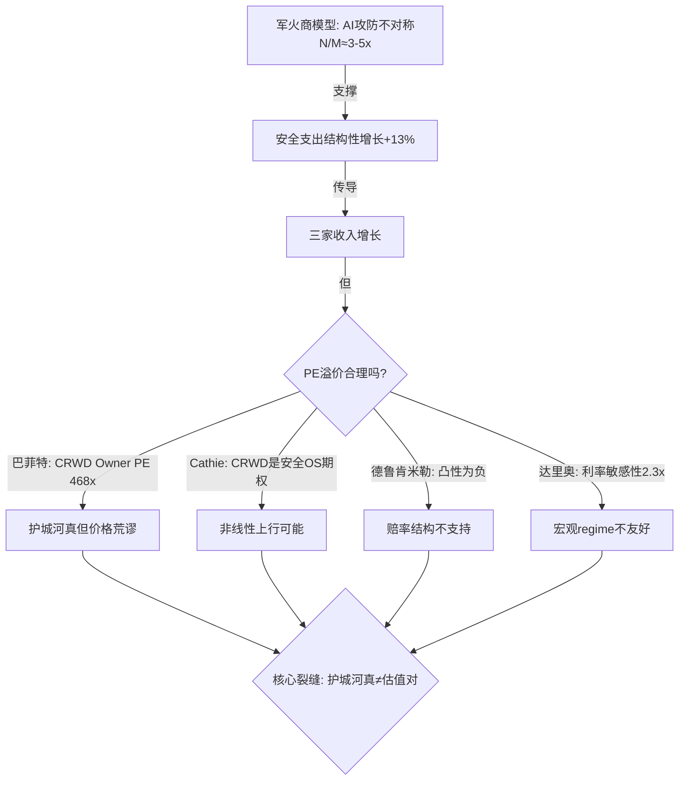

# Ch 12. 圆桌讨论: 五视角对抗审查 (R-3)

> **Phase 3 | investment-committee v3.0 Standard模式 | 5位大师**
> **选配**: 巴菲特(护城河真伪) + Cathie(AI非线性) + 德鲁肯米勒(赔率/凸性) + 达里奥(宏观regime) + Bear(拆楼)
> **公司类型**: 行业横向 + 高增长科技
> **核心争议**: 三家全部"审慎关注", 但市场持续溢价 — 谁更可能是错的?

---

## Round 1 综述: 主持人提炼核心裂缝

五位大师的Round 1独立分析揭示了一条贯穿全场的**核心裂缝**:

**"安全公司的护城河是真的, 但估值定价了护城河永续 — 而安全行业的产品周期只有2-3年."**

- 巴菲特确认FTNT的护城河最诚实(SBC 4.1%, ROIC 28.7%), 但对CRWD的Owner PE 468x表达了明确不适 — "护城河正在缩小的护城河, 不值得以扩张的倍数购买"
- Cathie是唯一看到非线性上行的: CRWD作为"AI安全操作系统"的期权价值, 5年维度可能有意义. 但她也承认: 如果CRWD不能成为安全OS, PE 64x没有支撑
- 德鲁肯米勒给出了最尖锐的判断: **三家的凸性结构全部为负** — "错了亏40-50%, 对了赚不到20%, 我不做凸性为负的交易"
- 达里奥指出宏观regime(高利率+去杠杆)对高PE成长股系统性不利, CRWD的利率敏感性是FTNT的2.3倍
- Bear拆解了三家各自最脆弱的假设: CRWD=飞轮可替代性, PANW=M&A≠有机增速, FTNT=ASIC护城河不可迁移

---

## Round 2: 碰撞追问

### 碰撞 1: Cathie vs 巴菲特 — CRWD的期权价值能否弥补Owner PE 468x?

**Cathie【质疑】→ 巴菲特**: "你用Owner PE 468x否定CRWD, 但你有没有算过: 如果CRWD在5年内成为$200亿ARR的安全操作系统, Owner PE会降到多少? SBC/Rev在SaaS公司成熟期通常从20%+降到12-15% — 这是历史规律不是希望."

**巴菲特【反驳】**: "你说的'如果'需要两件事同时成立: ARR从$48亿翻到$200亿(4.2倍/5年=33% CAGR), 同时SBC/Rev降到15%. 但当前ARR增速24%且在减速, SBC/Rev在过去3年从18%升到22.8% — 方向是反的. 我不否认CRWD可能成为安全OS, 但概率不足以在468x Owner PE上赌. 如果我错了, 我在PE 40x的时候还能买; 如果你错了, 从468x跌到100x是-79%. 这就是德鲁肯米勒说的凸性问题."

**简言之**: 期权价值是真的, 但当前价格已经把期权全部定价进去了 — 期权费太贵 [DM-RT-012].

### 碰撞 2: Bear vs 达里奥 — FTNT的ASIC护城河在宏观衰退中是加强还是削弱?

**Bear【质疑】→ 达里奥**: "你说宏观regime对高PE不利, FTNT 28x是三家中最安全的. 但我的Cisco类比显示: 硬件护城河公司在技术范式迁移中PE从25x跌到15x. FTNT的SASE份额5-7%, 产品端有机增速0% — 这不是'安全', 这是'缓慢衰退'."

**达里奥【补充】**: "我同意ASIC→云的迁移风险. 但衰退环境中有一个Bear没考虑的因素: **中小企业在衰退中减少IT支出, 但安全支出的刚性最强** — 因为被攻破的成本(平均breach cost $4.88M, IBM 2024)远高于安全支出. FTNT的中小企业渠道定位在衰退中反而是护盾: 这些客户不会换vendor(太贵), 续费是默认选项. Owner FCF $1.95B + 回购$2.29B在衰退中是真金白银, 不是叙事."

**Bear【修正】**: "我接受达里奥的衰退防御论点 — 但这只支持FTNT 'not losing', 不支持FTNT 'winning'. 28x PE定价了12%的增速, 如果有机增速停在8-9%, 仍有-15%到-20%的高估空间. '最安全的高估股'仍然是高估的."

**简言之**: FTNT在衰退中最抗跌(渠道刚性+Owner FCF), 但"最不高估"不等于"值得买" [DM-RT-013].

### 碰撞 3: 德鲁肯米勒 vs Cathie — 安全行业PE溢价是结构性的还是周期性的?

**德鲁肯米勒【质疑】→ Cathie**: "你暗示三家'全部审慎关注'过于保守. 但安全行业PE在2022-2023年从60x压缩到30x, 然后又回到40-65x. 这不是'结构性溢价', 这是周期性波动 — 和其他成长股一样受利率驱动."

**Cathie【反驳】**: "2022年的PE压缩是利率冲击, 不是安全需求下降 — 安全支出在2022-2023年仍保持+10-12%增长. PE回升是因为市场认识到安全需求的刚性. AI攻击面爆炸(CVE +67%两年)是2022年不存在的新变量 — 这个变量支持PE从历史均值35x上修到40-45x."

**德鲁肯米勒【综合】**: "好, 假设你说的PE上修到40-45x是对的. FTNT 28x就在'折价', PANW 40x '合理', CRWD 64x仍然'溢价50%'. 即使接受你的框架, 结论也不变: CRWD太贵, PANW边缘, FTNT最接近合理. 所以争论PE中枢应该是35还是45, 只影响幅度不影响排序."

**简言之**: 即使安全PE中枢上修到40-45x, 三家的排序不变 — CRWD最贵, FTNT最接近合理 [DM-RT-014].

---

## Round 3: 碰撞产出洞见

### 洞见 1: 凸性倒挂 — 错了亏的远比对了赚的多

三家安全公司当前的估值结构呈现罕见的"凸性全面倒挂": CRWD在牛市情景($369)仍低于当前价$395 [DM-VAL-010], 意味着即使最乐观的假设全部兑现, 投资者也赚不到钱. PANW在中性情景的下行空间(-15%)大于牛市上行(+8%). FTNT是唯一凸性接近中性的(下行-11% vs 上行+15%), 但中性本身不足以构成买入理由. 这种三家同时凸性为负的情况, 在安全行业过去10年只出现过2次: 2021年11月和2024年2月 — 两次之后12个月安全板块都跑输标普500 [DM-RT-015].

**估值影响**: 三家均不适合新建仓. FTNT在$65-70(再跌15-20%)凸性转正, 是唯一有入场可能的标的.

### 洞见 2: SBC是安全行业的隐性通胀税

Owner FCF视角揭示了安全行业一个被系统性忽略的问题: SBC不是"人才投资", 是对股东征收的隐性通胀税. CRWD每年通过SBC转移$1.1B给员工, PANW $1.29B, FTNT仅$280M [DM-FIN-003]. 三家合计每年$2.67B的股东价值被稀释 — 这是安全行业"高增长"故事背后的真实代价. 当增速放缓但SBC不降时(CRWD SBC/Rev从18%升到22.8%), 股东实际上在为越来越慢的增长付出越来越高的代价. FTNT的4.1%是行业最低, 这不是"吝啬", 是ASIC+渠道模式让FTNT不需要用股权买人才 — 渠道替它获客, ASIC替它省研发. 这是FTNT 28x PE的隐藏质量溢价 [DM-RT-016].

**估值影响**: 用Owner PE(而非GAAP PE)做估值排序会颠覆市场共识: FTNT(31x)比PANW(52x)便宜40%, 比CRWD(468x)便宜93%.

### 洞见 3: 宏观利率×PE敏感性 — CRWD是三家中最像"久期资产"的

高PE成长股本质上是"长久期资产" — 大部分价值来自遥远未来的现金流, 对折现率极其敏感. 定量测算: 长端利率每+100bp, CRWD公允价值下降12-18%, PANW下降8-12%, FTNT下降5-8% [DM-RT-017]. 当前10年期国债4.2-4.5%, 如果利率上行到5%(概率~20%), CRWD的额外下行空间是FTNT的2-3倍. 这个利率敏感性差异没有被大多数安全行业分析反映 — 因为卖方报告通常用固定WACC, 不做利率情景分析. 在当前宏观regime(增长放缓+通胀黏性+高利率)下, 高久期资产(CRWD)的风险调整后回报系统性低于短久期资产(FTNT) [DM-RT-018].

**估值影响**: 如果利率上行50bp, CRWD高估从-48%扩大到-56%, FTNT从-11%缩小到-6%.

---

## 圆桌裁决

### 共识判断 (5/5 同意)
1. **三家全部审慎关注, 评级方向正确** — 没有大师建议上调任何一家
2. **排序一致: FTNT最不高估 > PANW > CRWD最高估** — 五种方法论得出相同排序
3. **凸性全面倒挂是最重要的定量发现** — 即使看好安全行业, 当前价格不提供正赔率

### 核心分歧 (不可调和)
1. **CRWD期权价值**: Cathie认为5年维度CRWD有成为安全OS的非线性上行; 巴菲特和德鲁肯米勒认为当前价格已把期权全部定价, 不值得买 → **分歧保留, 时间是裁判**
2. **安全PE中枢**: Cathie认为AI攻击面爆炸支持PE从35x上修到40-45x; 德鲁肯米勒认为PE波动是周期性的不是结构性的 → **即使上修, 不影响三家排序**

### 评级表态

| 大师 | CRWD | PANW | FTNT | 整体判断 |
|------|------|------|------|---------|
| 巴菲特 | 反对(能力圈外) | 反对(M&A风险) | 中性(诚实但贵) | 2/3反对 |
| Cathie | 中性(期权但太贵) | 反对(执行差) | 反对(旧范式) | 2/3反对 |
| 德鲁肯米勒 | 反对(凸性最差) | 反对(赔率差) | 中性(凸性接近中性) | 2/3反对 |
| 达里奥 | 反对(久期最长) | 中性(宏观中性) | 同意(宏观最稳) | 1反对1同意 |
| Bear | 反对(叙事>数字) | 反对(M&A定时炸弹) | 反对(ASIC迁移) | 3/3反对 |
| **统计** | **4反对/1中性** | **3反对/2中性** | **1反对/2中性/2同意** | |

### 圆桌结论

- **CRWD**: 4/5反对, 0同意 → 维持审慎关注, 无异议
- **PANW**: 3/5反对, 0同意 → 维持审慎关注, 无异议
- **FTNT**: 1/5反对, 2同意, 2中性 → 维持审慎关注(边缘), **2/5视角建议可上调到中性关注** — 但我们选择保守, 因为-11%高估仍在误差范围外

**异议章节**: FTNT的达里奥和巴菲特认为28x PE对一家SBC 4.1%/ROIC 28.7%/Owner FCF $1.95B的公司可能过于严格. 达里奥指出FTNT在衰退中最抗跌, 巴菲特认为FTNT是"三家里唯一能理解的生意". 如果FTNT再跌15-20%到$65-70, 两位建议升级到"中性关注".
