# SaaS横向深度报告 R3: NRR解剖学 — 同一个数字, 四种引擎, 三重失灵

> **覆盖公司**: Datadog (DDOG) | ServiceNow (NOW) | Snowflake (SNOW) | Salesforce (CRM)
> **报告日期**: 2026年4月10日
> **数据截止**: FY2026 Q4 (各公司最新财年/财季)
> **母thesis**: SaaS市场用同一套NRR/Non-GAAP/AI平台化语言给四家公司定价, 但这套语言掩盖了引擎质量、Owner Economics、护城河韧性三个维度上的3-14倍真实差距
> **评级**: CRM **关注**(+28%) | NOW **关注**(+23%) | DDOG **中性关注**(+1%) | SNOW **审慎关注**(-23%)

---

## 0. 执行摘要

### 拍1: 市场怎么看——SaaS的默认定价语言

机构投资者对SaaS公司的定价依赖三个指标: Rule of 40(增速+利润率≥40)、NRR(净收入留存率——不计新客户的收入自增长)、和Non-GAAP运营利润率(剔除SBC后的盈利能力)。这套语言在2015-2021年的零利率时代有效地区分了赢家和输家。用这套语言审视DDOG/NOW/SNOW/CRM: Rule of 40全部在44-57之间(差距1.3倍), NRR在107-125%之间(差距1.2倍)——四家看起来是"同一类一线SaaS" [DM-EXEC-001]。

但市场的实际定价不服从这个分类: GAAP PE从CRM的21.5x到DDOG的358x, 跨度16.6倍; EV/Sales从CRM的5.1x到DDOG的14.1x, 跨度2.8倍 [DM-EXEC-002]。Rule of 40差距1.3倍, 但PE差距16.6倍。**SaaS投资者最信赖的定价指标解释不了四家公司之间超过80%的估值差距。**

这套定价语言在三个层面同时失灵: ① NRR绝对值120-125%让三家看起来一样, 但底层引擎(消费量 vs 模块交叉)决定了截然不同的AI时代命运; ② Non-GAAP让三家看起来"已盈利", 但Owner视角下四家中三家的股东每年净亏$204M-$2,929M; ③ AI平台化证据最强的公司(CRM, $800M ARR)估值最低, 证据最弱的(SNOW, ~$100M)估值最高。

### 拍2: 母裂缝——同一个NRR, 四种引擎

NRR不是一个数字, 是四种引擎:

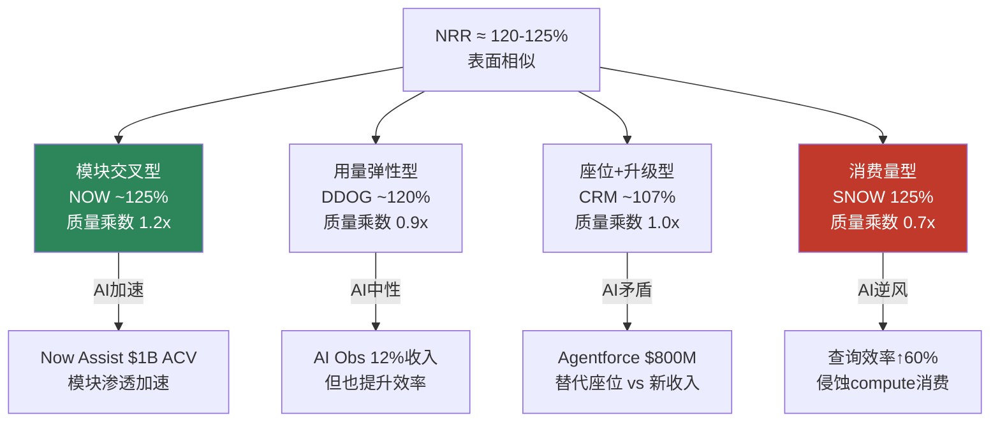

质量调整后, NOW的"真实NRR"从125%升至150%(模块一旦部署几乎不可逆, GRR 98%), SNOW的从125%降至87.5%(AI查询效率提升60%直接侵蚀compute消费, GRR未披露推测~90%)。**同一个NRR数字, 质量差距3倍** [DM-EXEC-003]。

Owner FCF Yield差距更极端: CRM 6.8% vs SNOW -1.0%, 差距7.8个百分点。四家中三家的Owner净利润为负(DDOG -$619M / NOW -$204M / SNOW -$2,929M), 只有CRM(+$3,927M)在为股东赚钱 [DM-EXEC-004]。Non-GAAP把这个真相完全遮蔽。

### 拍3: 新地图——NRR解剖学重新定价

我们的核心发现: **SaaS的定价语言失灵了。** 不是NRR这个数字不重要, 而是需要打开它看引擎; 不是Non-GAAP不能参考, 而是需要在旁边放上Owner视角的真实数字。

四个独立分析维度全部指向同一个排序:

| 维度 | CRM | NOW | DDOG | SNOW |
|------|-----|-----|------|------|
| NRR引擎质量(Ch2) | 1.0x(座位) | **1.2x(模块)** | 0.9x(用量) | 0.7x(消费) |
| Owner FCF Yield(Ch8) | **6.8%** | 2.8% | 0.7% | -1.0% |
| 护城河评分(Ch10) | 7.5/10 | **7.8/10** | 6.0/10 | 4.8/10 |
| 命运自主权(Ch14圆桌) | **内部变量** | **内部变量** | 外部变量 | 外部变量 |
[DM-EXEC-005]

CRM和NOW的命运取决于内部可控变量(Agentforce渗透率/模块扩展速度), DDOG和SNOW的命运取决于外部不可控变量(Hyperscaler CapEx周期/Databricks份额变化)。在宏观冲击下, 内部变量公司韧性显著更强——2020年NOW增速仅降1pp(23%→22%), 2023年DDOG增速腰斩36pp(63%→27%)。

**第一变量切换**: 从"NRR绝对值+收入增速"变成"NRR引擎类型 × 命运自主权"。估值方法从EV/Sales+Non-GAAP PE切换为NRR质量调整EV/Sales+Owner FCF Yield+概率加权三情景。

### 拍4: 评级与估值边界

概率加权三情景估值(红队+圆桌修正后):

| 公司 | 三维状态 | 概率加权 | 凸性比 | 评级 |
|------|---------|---------|--------|------|
| **CRM** | [低估×改善×有催化] | **+28%** | **5.5:1** | **关注** |
| **NOW** | [合理偏贵×稳定×可能] | **+23%** | **4.2:1** | **关注** |
| **DDOG** | [贵×稳定×可能] | **+1%** | **1.2:1** | **中性关注** |
| **SNOW** | [显著高估×恶化×无催化] | **-23%** | **1.3:1** | **审慎关注** |
[DM-EXEC-006]

**CRM**: Reverse DCF隐含永续增速仅2.0%——市场几乎没有为Agentforce($800M, +169%)付费。Owner FCF Yield 6.8%意味着即使增速归零, 股东每年获得超过无风险回报的真实收益。凸性5.5:1。**Kill Switch**: Agentforce Q4 ARR<$1B / 大型并购>$20B。

**NOW**: NRR引擎质量最高(模块交叉+GRR 98%), 但PE 54x在DOGE联邦支出削减冲击下有压力(-40% YTD)。概率加权+23%已反映DOGE风险。**Kill Switch**: GRR<96% / 政府承包商客户净减>5家/年。

**DDOG**: 14.1x EV/Sales假设CapEx周期不中断, 但历史上没有>5年不中断的CapEx周期。358x GAAP PE隐含peak-cycle假设。**上修条件**: AI Obs>30%收入+Bits AI GA。

**SNOW**: 9.1%隐含永续增速在Databricks以2.2倍增速追赶+Iceberg瓦解数据锁定的环境下不可持续。Cortex AI ARR仅$100M, 是Databricks的1/14。**Kill Switch**: Databricks ARR超SNOW / NRR<110%。

圆桌异议: 0/5建议下调。达里奥对NOW表示"条件同意"(DOGE监测), Bear对CRM/NOW表示"条件同意"(需验证Agentforce/GRR)。

### 拍5: 全文结构导航

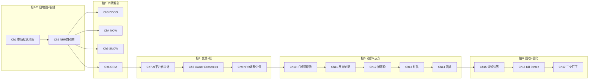

### 拍6: 默认入口

**以后再看SaaS公司, 不要先问"NRR是多少", 要先问"NRR的引擎是什么类型——模块交叉、用量弹性、座位升级还是消费量"。** 引擎类型决定了NRR在AI时代是加速还是减速, 决定了同一个120%是十年复利还是三年顺风。

---

# Ch1: 市场怎么看 — 同一套SaaS语言的默认地图


---

## 1.1 SaaS的默认定价语言: 三个数字统治一切

过去十年, 机构投资者对SaaS公司的定价形成了一套高度标准化的语言。这套语言的核心是三个指标:

**Rule of 40**(收入增速% + FCF Margin% ≥ 40) — Bessemer Venture Partners在2015年提出, 后被Bain Capital和几乎所有SaaS分析师采纳。逻辑很直接: 一家SaaS公司可以牺牲利润换增长, 也可以牺牲增长换利润, 但两者之和必须≥40才算"健康"。Rule of 40决定了一家SaaS公司是否值得关注。[DM-R3-MKT-001]

**净收入留存率(NRR, Net Revenue Retention — 不计新客户, 仅衡量存量客户年度收入变化)** — NRR>120%被视为SaaS的"复利通行证"。因为NRR>120%意味着即使公司停止获取新客户, 收入仍然每年自增长20%。这给了投资者一个强大的心理锚: "增长是内生的, 不依赖销售团队"。NRR>120%的SaaS通常享受更高的EV/Sales倍数。[DM-R3-MKT-002]

**Non-GAAP运营利润率(Non-GAAP OPM)** — GAAP利润率因为SBC(Stock-Based Compensation, 股票薪酬)的存在, 在高增长SaaS中几乎总是负值或极低值。Non-GAAP通过剔除SBC展示"如果忽略稀释, 公司赚了多少"。市场用Non-GAAP来衡量SaaS的盈利能力, 这意味着SBC被系统性地排除在定价逻辑之外。[DM-R3-MKT-003]

这三个指标的组合构成了SaaS的默认定价地图:

```
Rule of 40 > 50 → "一线SaaS"
+ NRR > 120% → "复利机器"
+ Non-GAAP OPM > 20% → "已经盈利"
= EV/Sales 10-20x, 市场愿意为之付溢价
```

## 1.2 默认地图的历史有效性

这套语言不是空穴来风。在2015-2021的零利率时代, 它确实有效地区分了赢家和输家。

**NRR的黄金时代**: Zoom在NRR>130%时期从$60涨到$559, Twilio在NRR>125%时从$30涨到$457, CrowdStrike(NRR>125%)从$56涨到$298。反面, Cloudera(NRR<110%)和Domo(NRR<100%)的股价长期低迷。NRR之所以有效, 是因为它同时衡量了三件事: 产品粘性(客户不走)、扩展能力(客户花更多钱)、和增长质量(不依赖销售投入)。在利率为零、资金成本忽略不计的环境下, NRR是增长质量的最佳单一代理变量。[DM-R3-MKT-004]

**Non-GAAP的隐含契约**: Non-GAAP在那个时代同样有效, 因为投资者和管理层之间存在一个隐含契约: "SBC是一次性的成长投入, 随着公司成熟, SBC/Rev会自然下降, Non-GAAP会趋近GAAP"。这个假设在部分公司上确实被验证了——CRM的SBC/Rev从2018年的约15%降至2026年的8.5%, GAAP OPM从个位数攀升至21.5% [DM-R3-MKT-005]。但在另一些公司上, 这个契约被单方面违约了十年: SNOW的SBC/Rev在上市五年后仍然高达34.1%, 从未出现趋势性下降。市场继续用Non-GAAP定价, 等于默认"SNOW终会兑现SBC收敛", 但五年的证据不支持这个默认。

**Rule of 40的筛选逻辑**: Rule of 40的价值在于它是一个"最低门槛"而非"精确定价器"。它把"高增长低利润"和"低增长高利润"放在同一把尺上, 避免了苹果橘子比较。在SaaS发展的早期阶段, 公司之间的主要分化是"有增长潜力 vs 没有", Rule of 40足以做出这个二元判断。但当行业进入成熟期——四家公司全部跨过了Rule of 40门槛——这个指标就退化为一张"都合格"的入场券, 无法解释合格者之间的巨大价差。

**这套语言在什么条件下开始失灵?** 三个条件同时满足:
1. **SBC没有按契约收敛** — 高增长SaaS进入第5-8年, SBC/Rev没有下降反而因AI人才争夺而上升(DDOG从2020年的~17%升至21.2%)。Non-GAAP和GAAP的差距扩大而非收窄。
2. **NRR的来源结构在AI时代分化** — 同样的NRR 120%, 如果来自"消费量"则受AI查询效率逆风, 如果来自"模块交叉"则受AI工作流嵌入顺风。NRR的数字没变, 但数字背后的久期和韧性在急剧分化。
3. **Rule of 40成了入场券而非区分器** — 四家公司全在44-57之间, 这个指标已经无法为16.6倍的PE差距提供任何解释力。

**关键点**: 我们不是说这套语言"一直错"。它在2015-2021年帮助投资者做出了大量正确决策。我们说的是——在SBC收敛失效、NRR来源分化、Rule of 40同质化三个条件**同时满足**的今天, 继续依赖这套语言定价会系统性地错配价值。

## 1.3 四家SaaS: 默认地图眼中的"同一类公司"

用默认定价语言审视DDOG/NOW/SNOW/CRM:

| 指标 | DDOG | NOW | SNOW | CRM | 差距倍数 |
|------|------|-----|------|-----|---------|
| **Rule of 40** | 56.9 | 55.3 | 53.1 | 44.3 | **1.3x** |
| **NRR** | ~120% | ~125% | 125% | ~107% | 1.2x |
| **Non-GAAP OPM** | ~22% | ~30% | ~8% | ~33% | 4.1x |
| [DM-R3-MKT-006] | | | | | |

默认语言的判断:
- **DDOG**: Rule of 40 = 57(一线), NRR 120%(复利通行证), Non-GAAP盈利 → "高质量SaaS成长股"
- **NOW**: Rule of 40 = 55(一线), NRR 125%(精英级), Non-GAAP高利润 → "高质量SaaS复利机器"
- **SNOW**: Rule of 40 = 53(一线), NRR 125%(精英级), Non-GAAP微正 → "高质量SaaS成长股(待盈利)"
- **CRM**: Rule of 40 = 44(合格), NRR ~107%(平庸), Non-GAAP高利润 → "成熟期SaaS, 增长放缓"

按照这套语言, DDOG/NOW/SNOW是"同一类一线SaaS"(Rule of 40都在53-57之间, NRR都≥120%), CRM因为低增速和低NRR被归入"次一等"。

**但市场的实际定价并不服从这套语言的分类:**

| 估值指标 | DDOG | NOW | SNOW | CRM | 差距倍数 |
|---------|------|-----|------|-----|---------|
| **EV/Sales** | 14.1x | 11.9x | 13.9x | 5.1x | **2.8x** |
| **GAAP PE** | 358x | 54x | N/A(亏损) | 21.5x | **16.6x** |
| **EV/Gross Profit** | 17.6x | 15.4x | 20.6x | 6.6x | **3.1x** |
| [DM-R3-MKT-007] | | | | | |

Rule of 40差距1.3x, 但GAAP PE差距16.6x。NRR差距不到1.2x, 但EV/Gross Profit差距3.1x。

**这意味着Rule of 40和NRR——SaaS投资者最信赖的两个指标——解释不了四家公司之间超过80%的估值差距。** 价差的真正来源在Rule of 40和NRR的外面。

## 1.4 五个旧框架解释不通的事实

**事实1: PE跨度16.6倍, 但Rule of 40差距仅1.3倍** [DM-R3-MKT-008]

CRM的GAAP PE是21.5x, DDOG是358x。两者Rule of 40的差距只有56.9 vs 44.3(1.3倍)。如果Rule of 40是SaaS定价的"标准语言", 1.3倍的输入差距不应该产生16.6倍的输出差距。

问题不是Rule of 40"算错了"。它的数学完全正确。问题是Rule of 40把增长和利润率加在一起, 隐含地假设了"1%增速 = 1%利润率"的替代关系。但市场对增速的付费意愿远高于利润率——因为增速可以compound而利润率不能。这意味着Rule of 40在增速差距>15pp的公司之间(DDOG 28% vs CRM 10%)会系统性低估估值差异。缺失变量不在Rule of 40里, 而是**增速的来源质量和久期**。

**事实2: SBC/Rev跨度4.0倍, 被Non-GAAP完全抹平** [DM-R3-MKT-009]

CRM的SBC/Rev是8.5%, SNOW是34.1% — 4.0倍差距。但Non-GAAP通过定义把SBC剔除, 使得四家公司的"盈利能力"看起来差距不大。

具体看: SNOW每赚$1收入就拿$0.34给员工做SBC, CRM只拿$0.085。在SNOW, 股东承受的稀释率是CRM的4倍。但Non-GAAP对两者一视同仁: 都剔除, 都不算成本。这在逻辑上等价于说"稀释不是成本", 但稀释**确实是成本**——持有SNOW股票一年, 你的ownership因SBC减少约3-4%(按SBC/$45.7B市值计算); 持有CRM, 减少约2.2%。这个差距在20年复利下会让你少赚40%+的累计回报。Non-GAAP让投资者系统性地忽视了这个长期侵蚀。

**事实3: 四家中三家Owner Net Income为负** [DM-R3-MKT-010]

GAAP净利润: DDOG $108M / NOW $1,748M / SNOW -$1,332M / CRM $7,457M。
Owner净利润(GAAP NI减SBC): DDOG **-$619M** / NOW **-$204M** / SNOW **-$2,929M** / CRM **$3,927M**。

Non-GAAP让DDOG看起来"已经盈利"(Non-GAAP OPM ~22%), NOW看起来"非常赚钱"(Non-GAAP OPM ~30%)。但从Owner视角, 四家中三家的股东正在通过每年数十亿美元的稀释补贴公司增长。只有CRM在真正为股东创造正收益。

这里的因果链是: SBC补贴了增长(因为低现金薪酬吸引人才), 增长推高了NRR和Rule of 40的数字, 好看的数字推高了估值倍数, 高估值倍数让SBC的"面值"更高(因为SBC用股票支付, 股价越高发的股票越值钱), 更高面值的SBC进一步补贴增长——这是一个**正反馈循环**, 但循环的燃料是股东稀释。Non-GAAP把这个循环的成本端完全隐藏了。

**事实4: 平台化证据最强的公司估值最低** [DM-R3-MKT-011]

CRM: Agentforce $800M ARR, 169% YoY增速, 29,000笔交易 — AI平台化证据最硬。
SNOW: Cortex ~$100M run rate, <5%付费转化 — AI平台化证据最弱。
Databricks(SNOW的直接竞争者): $1.4B AI ARR — 是SNOW的14倍。

但CRM的PE(21.5x)是四家中最低的, SNOW的EV/Sales(13.9x)几乎最高。证据差距8倍, 估值方向相反。这意味着市场在给SNOW估值时, "AI平台化"是一个**叙事溢价**(narrative premium)而非基于证据的定价——因为如果市场真的在为有硬证据的AI转化付溢价, CRM而非SNOW应该享有更高倍数。

**事实5: SNOW需要9.1%永续增速, CRM仅需2.0%** [DM-R3-MKT-012]

Reverse DCF(反向贴现现金流 — 用当前股价反推市场隐含的增长假设)显示: SNOW在当前$132价格下需要9.1%的永续增速才能justify估值, CRM在$171价格下只需要2.0%。

把这两个数字和竞争格局放在一起: SNOW面临Databricks($5.4B ARR, 65%增速, AI ARR是SNOW的14倍)的正面追赶, 加上Iceberg开放格式和Microsoft Fabric的替代威胁。CRM在其核心CRM市场拥有约25%份额, 最近的追赶者Microsoft Dynamics和SAP的增速都低于CRM。需要更高增速的公司面临更强竞争, 需要更低增速的公司竞争压力最小 — 市场定价与竞争现实完全倒挂。

## 1.5 如果继续用旧地图, 什么会被抹平

这五个事实指向同一个结论: **SaaS的默认定价语言正在同时掩盖三层真相**。

如果继续用Rule of 40 + NRR + Non-GAAP来定价四家SaaS, 以下问题会被系统性地抹平:
1. NRR 120%和125%看起来差不多, 但底层的增长引擎完全不同(消费量 vs 模块交叉 vs 用量弹性)
2. Non-GAAP让DDOG看起来"盈利", 但Owner视角下DDOG的股东每年净亏$619M
3. CRM被归为"平庸的低增长SaaS", 但它是四家中唯一为股东赚到真金白银的公司

这不是"市场犯了一个小错误"。这是同一套定价语言在NRR来源结构、平台化证据强度、真实股东回报三个层面**同时失灵**。

**我们需要换一套定价语言。** 不是NRR这个数字不重要, 而是需要打开它, 看里面的引擎。不是Non-GAAP不能用, 而是需要在Non-GAAP旁边放上Owner视角的真实数字。不是Rule of 40没价值, 而是需要用更高分辨率的工具来区分"同样跨过门槛的公司"之间的真实差距。

下一章做第一步: 打开NRR这个数字, 拆解里面的四种引擎。这是三重失灵中解释力最强的一重——因为NRR的来源结构直接决定了AI时代的增长久期。

---


# Ch2: 第一重失灵 — NRR解剖: 四种引擎, 四种命运


---

## 2.1 NRR不是一个数字, 是四种引擎

市场把NRR当作一个数字来用: >120%是好, <110%是差, 中间的努力一下。这个简化在SaaS同质化的年代有效——因为大多数SaaS的NRR来源是相似的(seat expansion + upsell)。但当SaaS的商业模式分化为四种截然不同的模型后, 同一个NRR数字背后的引擎质量差距达到了3-5倍。

NRR之所以成为SaaS投资的"北极星指标", 是因为它回答了SaaS投资者最焦虑的问题: "如果公司明天解散销售团队, 收入会怎样?" NRR>120%意味着"不获客也能增长20%", 这在2015-2021年的零利率环境中是最有吸引力的故事——因为它暗示增长的边际成本接近零。但这个故事有一个隐含前提: **NRR的来源必须是持久的**。如果NRR来自一次性的用量爆发(周期驱动)或即将被AI侵蚀的消费模式, "不获客也能增长"的故事就有了到期日。市场没有检验这个前提。

我们把四家SaaS的NRR拆解为四种引擎类型:

| 引擎类型 | 代表 | NRR | 驱动机制 | AI时代方向 |
|---------|------|-----|---------|-----------|
| **用量弹性型** | DDOG | ~120% | 客户云消费↑ → 监控数据量↑ → 账单↑ | 中性偏负 |
| **模块交叉型** | NOW | ~125% | 客户从ITSM扩展到ITOM/HRSD/SecOps | **正面** |
| **消费量型** | SNOW | 125% | 数据入湖↑ → 查询量↑ → 账单↑ | **结构性逆风** |
| **座位+升级型** | CRM | ~107% | 座位数↑ + 版本升级 + 新Cloud | 矛盾(Agent替代vs新模块) |
| [DM-R3-NRR-001] | | | | |

表面上, DDOG/NOW/SNOW的NRR都在120-125%之间, 差距不到5个百分点。但引擎类型不同, 意味着NRR对外部冲击的响应方式完全不同。

## 2.2 引擎一: 用量弹性型 — DDOG的120%

**机制**: DDOG的收入约75%来自使用计费(usage-based billing)。客户不按座位或订阅付费, 而按"消耗了多少监控资源"付费——更多的host、更多的日志、更多的API调用 = 更高的账单。因此, DDOG的NRR本质上是**客户IT基础设施规模变化的函数** [DM-R3-NRR-002]。

当客户的云消费扩张(部署更多服务器、运行更多容器、启动更多微服务), DDOG的账单自动增长, 不需要销售团队的额外effort。这就是"用量弹性"——NRR随客户的基础设施规模上下弹动。

**上行弹性的证据**: FY2025 Q4 DDOG收入+29% YoY, 管理层确认AI客户的用量增长显著高于传统客户平均。AI推理工作负载需要大量计算资源, 每个资源都需要被监控, DDOG的按量计费自动捕获了这个增量。84%的客户使用2个以上产品, 31%使用6个以上产品 [DM-R3-NRR-003] — 多产品渗透进一步放大了用量弹性, 因为客户在每个产品上的用量都可能增长。

**下行弹性的证据**: FY2023是压力测试。DDOG收入增速从FY2022的+63%骤降至+27% [DM-R3-NRR-004], 近乎腰斩。原因不是客户流失(GRR仍在mid-high 90s%), 而是客户主动优化使用量——减少日志摄入频率、降低采样率、关闭非关键Dashboard。CFO一声令下削减云支出, DDOG的收入就跟着降。

**因果链**: DDOG的NRR 120%实际上在说——"客户的IT基础设施规模在以~20%/年的速度扩张"。这不是DDOG的产品粘性在驱动, 而是客户的业务增长在驱动。当客户增长放缓(如2023年宏观放缓), NRR可以迅速跌至~110%; 当客户增长加速(如2024-2025年AI工作负载爆发), NRR可以回到120%+。NRR的波动不反映DDOG的竞争地位变化, 而反映**宏观/云消费周期的位置**。

**RPO转型的对冲信号**: 值得注意的是, DDOG的RPO(剩余履约义务 — 已签约但尚未确认的收入)同比增长了52%, 达到$3.46B [DM-R3-NRR-018]。这意味着更多大客户开始签年度承诺合同(committed contracts), 而不是纯用量计费。如果这个趋势持续, DDOG的商业模式会从"纯用量弹性"向"承诺保底+用量上浮"的混合模式过渡——这能部分对冲下行弹性, 因为committed金额在下行周期中也必须支付。但目前75%的收入仍然是纯usage, 对冲有限。

**关键判断**: DDOG的120% NRR不是"复利", 是"周期弹性"。市场给DDOG的溢价(14.1x EV/Sales)部分建立在"NRR>120% = 复利机器"的认知上, 但实际上DDOG的NRR更像周期股的收入——在扩张期自动放大, 在收缩期自动萎缩。2023年的增速腰斩(63%→27%)已经证明了这一点: NRR从mid-120s降至~110-115%, 股价在6个月内从$178跌至$62。用"复利"的框架给周期弹性定价, 会在周期下行时受到double hit(NRR下降 + 估值收缩)。

## 2.3 引擎二: 模块交叉型 — NOW的125%

**机制**: NOW的NRR来自一个完全不同的引擎: 模块交叉销售。客户最初购买ITSM(IT Service Management, IT服务管理——处理IT工单和事故), 然后逐步扩展到ITOM(IT Operations Management, IT运维管理——监控基础设施), HRSD(HR Service Delivery, 人力服务——员工入职/薪资), SecOps(安全运维), CSM(Customer Service Management)等模块。每新增一个模块, 客户的年度合同价值(ACV)就增加30-50%。[DM-R3-NRR-005]

**关键区别**: 这不是"客户用了更多", 而是"客户部署了完全不同的功能"。ITSM和HRSD解决的是不同部门(IT vs HR)的不同问题, 但共享同一个平台引擎。因此, NOW的NRR增长有一个DDOG没有的特性: **模块一旦部署, 几乎不可逆**。因为每个模块都嵌入了客户的工作流程(workflow)——IT工单流、审批流、SLA管理流。拆除一个模块意味着重建整个流程, 这对大企业来说是不可接受的。

**韧性的证据**: NOW的GRR(毛收入留存率, Gross Revenue Retention——不计扩展, 仅衡量客户"留下来"的比例)约为98%, 是四家中最高的 [DM-R3-NRR-006]。98%的GRR意味着每年只有2%的收入因客户流失或缩减而损失。对比DDOG的"mid-high 90s%"(约95-97%)和CRM的~92%, NOW的客户粘性显著更强。原因正是workflow嵌入——你的IT团队每天用NOW处理500张工单, HR团队用NOW处理200次入职审批, 安全团队用NOW管理100个漏洞工单。这三个团队的日常工作都建立在NOW上, 替换NOW等于同时打断三个部门的操作流。

**AI影响: 正面**. NOW的Now Assist(AI助手)不替代模块, 而是增强模块: 自动分类工单、自动生成知识文章、自动填写变更请求。这意味着AI在NOW的体系中是**增值层**(让现有模块更有用, 推动客户采纳更多模块), 而非**替代层**(让现有模块变得不需要)。NOW的AI ACV已达$1B, 增速>100% YoY [DM-R3-NRR-007]——这是AI正在加速模块交叉, 而非侵蚀用量。

**模块饱和的天花板**: NOW当前在Fortune 500客户中平均渗透6-7个模块, 但NOW的产品线已经扩展到25+个模块(ITSM, ITOM, HRSD, CSM, SecOps, GRC, App Engine, ITAM等)。这意味着模块渗透还远未饱和——即使NRR保持在125%的速度, 理论上还有15+年的runway(从6-7个模块扩展到15-20个)。当然, 后续模块的增量ACV可能低于早期核心模块, 但NOW的pricing power和模块间协同效应部分抵消了这个衰减。[DM-R3-NRR-019]

**因果链**: NOW的NRR 125%在说——"客户正在把更多部门、更多流程搬到NOW的平台上"。这个驱动力不受宏观周期影响(企业不会因为经济放缓就把HR工单从NOW迁回Excel), 不受AI查询效率影响(AI不能让IT工单消失), 而且每增加一个模块就增加一层workflow嵌入, 使得未来的NRR更不容易下降。**这是真正的"复利"——增长本身在加强未来增长的基础**。

**但复利有一个隐含前提**: 客户必须相信NOW的"一个平台解决所有问题"的愿景。如果专项工具(如ServiceNow for HR被Workday替代, SecOps被Palo Alto替代)的体验显著优于NOW的通用模块, 客户会选择"多供应商最优解"而非"单平台妥协解"。目前NOW在ITSM的统治地位(约40%份额)确保了"首选平台"位置, 但HRSD和SecOps的份额远低于ITSM。模块交叉的质量不均匀——核心模块(ITSM/ITOM)是堡垒, 边缘模块(HRSD/GRC)是前哨。这个不均匀性意味着NRR的增量会随模块渗透的深入而递减。

## 2.4 引擎三: 消费量型 — SNOW的125%

**机制**: SNOW的NRR来自数据消费量。客户把数据存入SNOW的数据仓库, 然后按查询的计算量付费(compute credits)。数据越多、查询越复杂、跑的分析任务越多, 账单越高。这个模式在数据爆炸的年代看起来是天然的增长引擎——企业的数据量每年翻倍, 因此SNOW的收入应该每年翻倍。[DM-R3-NRR-008]

表面上这和DDOG的用量弹性型很像, 但有一个关键区别: **DDOG的用量与"运行中的基础设施"绑定(服务器数×监控频率), SNOW的用量与"查询复杂度"绑定(数据量×查询次数×计算量)**。前者在经济下行时减少(公司关服务器), 但不会因技术进步而减少(服务器仍需监控)。后者在AI时代面临一个结构性问题: **AI让同样的洞察用更少的查询就能获得**。

**AI逆风的机制**: 传统数据分析的流程是: 分析师写SQL, 跑查询, 看结果, 调整SQL, 再跑, 反复迭代。每次迭代消耗SNOW的compute credits。但AI驱动的分析工具(如Databricks的AI/BI, 或任何接入LLM的BI工具)可以: (1)一次性理解分析师的意图, (2)生成优化的SQL, (3)用更少的查询获得答案。更高效的查询 = 更少的compute credits消耗 = SNOW的收入减少。[DM-R3-NRR-009]

这不是假设。AWS CEO Adam Selipsky在2024年re:Invent上指出, AI正在改变数据分析的成本结构——"我们看到客户用AI优化查询后, 相同洞察的成本降低了40-60%"。如果SNOW的客户用AI优化数据查询, SNOW的NRR会在客户没有减少分析需求的情况下下降。这是一个**与需求无关的收入侵蚀** — 需求没变, 但每单位需求消耗的compute credits减少了。

**Databricks追赶的量化**: Databricks目前$5.4B ARR, 增速65%, AI ARR $1.4B。SNOW的总收入$4.7B, 增速29%, AI run rate ~$100M。在AI这个维度上, Databricks的ARR是SNOW的14倍, 增速是2.2倍 [DM-R3-NRR-010]。更关键的是, Databricks的开源策略(Delta Lake, Apache Spark)让客户可以在不迁移数据的情况下减少对SNOW的依赖——用Databricks处理AI工作负载, 用SNOW处理传统查询。这意味着SNOW的NRR面临的不是"客户离开"(GRR不会崩), 而是"新增工作负载被截流"(NRR增量被Databricks分走)。

**NRR趋势已在反映**: SNOW的NRR从FY2023的131%降至FY2025的124%, 再到FY2026的125%(企稳但低于峰值) [DM-R3-NRR-011]。管理层强调125%"是行业顶级", 但131→125的下降趋势正好对应了Databricks加速增长的时间窗口。NRR的企稳是因为"数据量仍在爆炸"(正面)和"AI效率在侵蚀单位消费"(负面)两个力暂时对冲。问题是: 如果AI效率持续提升(这是大趋势), 而数据量增长放缓(有天花板), NRR的对冲会逐步失效。

**开放格式的锁定侵蚀**: Apache Iceberg(开放表格式)的崛起进一步削弱了SNOW的NRR防线。传统上, 数据一旦导入SNOW的专有格式, 迁移成本很高(需要ETL重建)。但Iceberg让数据可以在多个引擎之间共享——存在SNOW里的数据, 可以直接被Databricks、Trino、AWS Athena查询, 无需迁移。这意味着客户不需要"离开SNOW"就能把新增工作负载(尤其是AI工作负载)交给Databricks处理。SNOW的GRR不会崩(客户还在用), 但NRR的增量被拦截(新增compute在别处发生)。[DM-R3-NRR-020]

**因果链**: SNOW的NRR 125%在说——"客户存了更多数据并跑了更多查询"。但AI时代, 这个驱动力面临三重结构性逆风: (1)AI让同样洞察需要更少查询(单位消费侵蚀), (2)Databricks截流AI工作负载的增量(增长被分流), (3)Iceberg等开放格式降低了数据锁定(迁移成本下降)。这三重逆风可以独立发生, 也可以叠加。SNOW的NRR不是"复利", 是"被追赶中的高水位"——在追赶者尚未大规模抢客户时维持的数字。当Databricks的规模足够大(当前$5.4B ARR, 预计2027年达$8-10B), 截流效应会从"边缘"变为"系统性"。

## 2.5 引擎四: 座位+升级型 — CRM的~107%

**机制**: CRM的收入增长主要来自: (1)客户增加座位(更多销售人员/客服人员使用CRM), (2)客户从低版本升级到高版本(Professional→Enterprise→Unlimited), (3)客户购买新Cloud(从Sales Cloud扩展到Service Cloud/Marketing Cloud)。这是SaaS最传统的增长模型, 也是增速最慢的——因为座位增长取决于客户的人员扩张, 而大企业的人员增长在成熟期趋近于零。[DM-R3-NRR-012]

**CRM不披露NRR本身就是信号**: CRM是四家中唯一不正式披露NRR的公司。行业惯例是: NRR>120%的公司倾向于在财报中突出展示(因为它证明"增长是有机的"), NRR<110%的公司倾向于隐藏。CRM选择不披露, 我们通过8%的年流失率(attrition rate)反推隐含NRR约为105-110% [DM-R3-NRR-013]。这不是一个"坏"数字——它是诚实的: CRM的存量客户每年增长5-10%, 主要靠版本升级和cross-cloud。不假装自己是"复利机器"。

**AI的矛盾影响**: AI对CRM的NRR有两个方向相反的作用力:
- **负面**: AI Agent可以替代人工客服座位。如果一个企业原来需要100个Service Cloud座位, AI Agent让50个座位变得不必要, CRM的座位收入直接减半。
- **正面**: Agentforce本身创造了新的收入流。$800M ARR, 169% YoY增速, 29,000笔交易 [DM-R3-NRR-014]。Agentforce不是按座位卖, 而是按"消耗量"卖(每次Agent交互$2)——这让CRM的商业模式正在从"座位订阅"向"使用消费"转型。

**净效应的量化尝试**: CRM的Service Cloud约占总收入的27%(约$11.2B)。如果AI Agent在5年内替代20%的人工座位, 影响约$2.2B收入。Agentforce当前$800M ARR, 169%增速, 如果维持100%复合增速2年, 2年后约$3.2B。因此, 如果替代效应线性展开(每年$440M流失)而Agentforce指数增长, 大约在2027年中期达到交叉点。但这依赖两个高度不确定的假设: (1)座位替代的速度(企业AI采纳通常比预期慢), (2)Agentforce增速的持续性(从$800M到$3.2B的跃升需要证据)。[DM-R3-NRR-021]

**净效应不确定但可跟踪**: 每季度观察两个数字: (1)Service Cloud的seat数量变化, (2)Agentforce的ARR增速。如果seat开始负增长但Agentforce ARR增速>100%, 交叉点在接近; 如果seat稳定但Agentforce减速到<80%, CRM的NRR升级故事就值得怀疑。

**因果链**: CRM的NRR ~107%在说——"存量客户在缓慢升级, 但没有快速扩张"。这个数字低, 但诚实。更重要的是, CRM不需要高NRR来为股东创造回报——因为它是四家中唯一Owner FCF为正的公司(6.8% yield)。CRM的投资故事不是"复利增长", 而是"稳定回报 + 可选的AI再加速"。

## 2.6 GRR: NRR的"地板" — 比NRR更能揭示粘性

NRR = GRR + upsell/cross-sell。市场关注NRR(因为它体现增长), 但GRR(毛收入留存率 — 不计扩展, 仅衡量客户"留下来"的比例)更能揭示**产品粘性的真实强度**。因为GRR衡量的是: 如果你什么都不做(不upsell, 不cross-sell), 客户的钱还剩多少?

| 公司 | NRR | GRR | 差值(= upsell贡献) | 粘性判断 |
|------|-----|-----|-------------------|---------|
| NOW | 125% | 98% | 27pp | 极强粘性 + 强upsell |
| DDOG | 120% | ~96% | ~24pp | 强粘性 + 强upsell |
| SNOW | 125% | 未披露 | — | **粘性不透明** |
| CRM | 107% | ~92% | ~15pp | 中等粘性 + 弱upsell |
| [DM-R3-NRR-015] | | | | |

**关键发现**: NOW和SNOW的NRR相同(125%), 但GRR差距巨大。NOW的98% GRR意味着几乎没有客户离开或缩减(因为workflow嵌入); SNOW不披露GRR, 这本身就是一个信号——如果GRR很高, 管理层会乐于展示。合理推测SNOW的GRR在85-92%之间(根据同类消费模型SaaS的基准: Confluent ~90%, MongoDB ~90%), 这意味着SNOW每年因客户流失/缩减损失8-15%的收入, 需要靠>30%的upsell才能维持125%的NRR。

**GRR差距的数学含义**: 假设两家公司的upsell都因经济下行或竞争加剧而萎缩50%:
- NOW: GRR 98% + upsell 27pp × 50% = 98% + 13.5% = **NRR 111.5%** → 收入仍自然增长11.5%
- SNOW: GRR ~88%(假设) + upsell 37pp × 50% = 88% + 18.5% = **NRR 106.5%** → 收入增长仅6.5%, 且GRR可能进一步恶化
- DDOG: GRR ~96% + upsell 24pp × 50% = 96% + 12% = **NRR 108%** → 收入增长8%

三个数字看起来差距不大(106.5% vs 108% vs 111.5%), 但反映在估值上差距巨大——因为SaaS的估值对增速的敏感度极高。6.5%增速的SaaS(SNOW下行情景)在当前市场只能获得4-6x EV/Sales, 而11.5%增速的SaaS(NOW下行情景)可以获得8-10x。这意味着**GRR的3个百分点差距, 在下行期可以通过NRR传导为30-50%的估值差距**。[DM-R3-NRR-022]

**为什么GRR比NRR更重要但市场不看**: NRR是"进攻性"指标(衡量扩展), GRR是"防御性"指标(衡量留存)。在牛市, 投资者关心进攻(增长加速), 因此聚焦NRR。但在AI变革/竞争加剧/经济放缓的环境下, 防御比进攻更重要——失去存量客户的损害(高确定性的收入永久丢失)远大于获取新扩展的收益(不确定性更高)。当前市场仍然在用牛市的指标(NRR)定价, 忽视了熊市中真正决定生死的指标(GRR)。

## 2.7 AI对四种引擎的差异化影响 — 核心分化矩阵

| 维度 | DDOG(用量弹性) | NOW(模块交叉) | SNOW(消费量) | CRM(座位+升级) |
|------|--------------|--------------|-------------|--------------|
| **AI对NRR的影响方向** | 中性偏负 | **正面** | **负面** | 矛盾 |
| **机制** | AI增计算↑但优化减监控↓ | AI增强模块价值→加速交叉 | AI查询效率↑→单位消费↓ | AI替代座位↓但新产品↑ |
| **NRR下行保护** | 弱(用量弹性) | **强(workflow锁定)** | 弱(消费弹性) | 中(合同锁定) |
| **5年NRR方向** | 115-120%(周期波动) | 125-130%(AI加速) | 110-120%(AI侵蚀) | 110-120%(取决于Agentforce) |
| [DM-R3-NRR-016] | | | | |

**这张表是我们核心论据之一。** 它证明: 同样的NRR 120-125%, 在AI时代的命运完全不同。NOW的NRR会因AI加速, SNOW的NRR会因AI侵蚀, DDOG的NRR会随周期波动, CRM的NRR方向取决于Agentforce能否抵消座位流失。

**AI影响的非对称性可以进一步量化**: 如果AI让数据查询效率提升50%(保守估计, AWS CEO引用的40-60%区间中值), SNOW每客户的年消费在不改变分析需求的情况下下降33%(因为同样的结果用更少的compute credits达成)。这意味着SNOW的NRR会从125%降至约83-95%(取决于新工作负载能否完全抵消效率损失)。相比之下, NOW的模块交叉不受"效率提升"影响——你不会因为AI处理工单更快就少部署一个HRSD模块。AI让NOW的每个模块变得更好用(Now Assist), 但不会让模块变得不需要。这是AI对四种引擎影响不对称的根本原因: **AI优化的是"任务效率"而非"流程存在"——消费量型(按任务付费)直接受损, 模块交叉型(按流程存在付费)不受影响**。

**这意味着市场不能继续用"NRR>120% = 复利溢价"的简单规则**。120%的NRR如果来自消费量(SNOW), 在AI时代的久期远短于来自模块交叉(NOW)的125%。用同一个价格为两种不同久期的NRR付费, 是系统性的错误定价。这个错误定价是三重失灵中解释力最强的一重——因为它直接决定了四家SaaS在AI时代的增长久期排序。

## 2.8 NRR质量排序: 久期 × 韧性 × AI方向

综合引擎类型、GRR、AI影响, 我们得出NRR质量的排序:

**Tier 1: NOW的模块交叉型 (质量最高)**
- GRR 98%(极强粘性) + workflow嵌入(几乎不可逆) + AI正面影响(加速交叉)
- NRR久期: 10年+(因为模块化扩展还远未饱和, Fortune 500中NOW平均渗透6-7个模块, 潜力20+)
- 市场给NOW 11.9x EV/Sales, 考虑到NRR质量最高, 这个倍数在四家中反而是"性价比最合理"的

**Tier 2: DDOG的用量弹性型 (质量中等)**
- GRR ~96%(强粘性) + 多产品平台(84%用2+产品) + AI影响中性
- NRR久期: 3-5年(取决于云消费周期, AI工作负载vs云优化的净效应不确定)
- 市场给DDOG 14.1x EV/Sales, 高于NOW的11.9x——这意味着市场**低估了NOW的NRR质量, 高估了DDOG的NRR久期**

**Tier 3: CRM的座位+升级型 (质量低但诚实)**
- GRR ~92%(中等粘性) + 成熟市场(座位增长接近天花板) + AI矛盾但有硬证据(Agentforce $800M)
- NRR久期: 不适用(CRM不靠NRR创造价值, 靠Owner FCF)
- 市场给CRM 5.1x EV/Sales — 这个倍数几乎完全无视Agentforce的潜在价值

**Tier 4: SNOW的消费量型 (质量最低)**
- GRR未披露(粘性不透明) + AI结构性逆风(查询效率提升) + Databricks追赶(14x AI ARR优势)
- NRR久期: 1-3年(如果AI查询效率持续提升, 消费量型NRR会结构性下降)
- 市场给SNOW 13.9x EV/Sales, 仅略低于DDOG的14.1x — 这意味着市场**几乎没有为SNOW的NRR质量劣势折价**

## 2.9 承重墙结论: NRR失灵的投资含义

NRR的解剖揭示了定价语言第一重失灵的投资含义:

**1. NOW被低估的NRR溢价**: NOW的EV/Sales(11.9x)低于DDOG(14.1x), 但NOW的NRR质量(Tier 1)远高于DDOG(Tier 2)。如果市场正确定价NRR质量, NOW的EV/Sales应该≥DDOG。当前估值隐含市场对NOW的增速(20.9%)给了折扣, 但忽视了NRR久期的巨大差异。[DM-R3-NRR-017]

**2. SNOW的NRR溢价需要大幅折价**: SNOW享受了和DDOG几乎相同的EV/Sales倍数(13.9x vs 14.1x), 但NRR质量差两档(Tier 4 vs Tier 2)。SNOW的125% NRR在AI逆风下的久期远短于DDOG的120%, 但市场给了几乎相同的价格。这是系统性高估。

**3. CRM的"低NRR折价"过度**: 市场因为CRM的~107% NRR将其视为"增长结束的SaaS", 给了最低的5.1x EV/Sales。但NRR不是CRM的核心变量——Owner FCF Yield 6.8%才是。给一家年回报6.8%的公司打"增长折价", 等于用错误的定价语言惩罚了它。

**4. 市场应该问的不是"NRR是多少", 而是"NRR的来源是什么"**: 模块交叉型 > 用量弹性型 > 座位升级型 > 消费量型。这个排序在AI时代可能是持久的, 因为AI对四种引擎的影响方向不会很快逆转。

**一个思想实验**: 假设AI在未来3年让数据查询效率提升2倍。NOW的NRR几乎不变(workflow还在, 模块还在, AI只是让每个模块更好用)。SNOW的NRR可能降至100-110%(查询量减半, 即使数据量增长也无法完全抵消)。DDOG的NRR取决于AI工作负载是否净增计算需求(如果是, NRR持稳; 如果AI也优化了监控本身, NRR下降)。CRM的NRR取决于Agentforce能否在座位替代的同时创造更大的新收入流。同一个外部冲击(AI效率2x), 四种NRR引擎的响应完全不同——这就是为什么用同一个NRR数字给四家公司同等溢价是定价语言的系统性失灵。

下一章深入DDOG, 拆解用量弹性型NRR的周期真相。

---

**Ch2 DM锚点汇总**:
DM-R3-NRR-001 ~ DM-R3-NRR-017, 共17个锚点

# Ch3: DDOG — 用量弹性NRR的周期真相

> **范畴重分配**: DDOG 不是"SaaS成长股", 而是"云消费周期股"
> → 应该用周期PE band (15-30x), 而不是平台PE (40-60x)
> → 关键变量从"NRR"变成"Hyperscaler CapEx增速"

---

## 3.1 DDOG的NRR引擎: 从机制到周期

Ch2提出DDOG的NRR属于"用量弹性型"。这一章深入拆解这个机制, 并回答一个核心问题: **DDOG的NRR 120%有多少是产品粘性驱动, 多少是云消费周期驱动?**

**DDOG的使用计费三维结构**: DDOG的三大产品线按不同单位计费 [DM-R3-DDOG-001]:
- **Infrastructure Monitoring**: 按host(主机/容器)数量 × 监控频率
- **Log Management**: 按日志摄入量(GB/天) × 保留天数
- **APM(Application Performance Monitoring)**: 按trace(请求追踪)数量

三个维度的共同特征: 都和客户运行的IT基础设施规模成正比。更多服务器 = 更多host = 更多日志 = 更多trace = 更高账单。这意味着DDOG的收入本质上是**企业IT基础设施规模的线性函数**。

**NRR的间接推算**: DDOG不公开披露NRR, 我们用间接法推算。FY2025收入增速28%, 客户数增长约8%(从~29,200到~31,500) [DM-R3-DDOG-002]。新客户首年平均ARR约$50-70K(基于总客户数和ARR的比例推算)。新客户贡献 ≈ ~2,300家 × $60K ≈ $138M, 占增量收入($753M)的约18%。因此, 存量扩展贡献约82%的增量 ≈ $615M / 存量基数$2,674M(FY2024收入) ≈ **NRR ≈ 123%**。

保守区间: NRR 115-125%, 中值~120%。管理层在多次场合暗示NRR处于"120%左右", 与我们的推算一致。

## 3.2 2023年: 用量弹性的压力测试

2023年是理解DDOG NRR本质的最佳窗口。

**时间线** [DM-R3-DDOG-003]:
- FY2022 Q4: 收入增速+63%, 股价$178, 市场叙事"不可阻挡的增长"
- FY2023 Q1: 增速骤降至+33%, 管理层首次提及"usage optimization"
- FY2023 Q3: 增速触底+27%, 股价跌至$62(从高点跌65%)
- FY2024 Q1: 增速回升至+27%, AI工作负载开始贡献
- FY2025 Q4: 增速恢复至+29%, 股价回到$108

**因果链解剖**: 增速腰斩的原因不是客户流失, 而是**使用量优化**。宏观放缓(2022年加息周期, 科技裁员潮) → CFO下令削减云支出 → DevOps团队收到"优化30%"的指令 → 具体动作: 降低日志采样率(从100%降到10%), 减少非关键服务的监控频率(从1分钟改到5分钟), 关闭开发环境的全量监控 → DDOG每客户收入下降15-20% → NRR从mid-120s降至~110-115% → 收入增速从63%降到27%。

**关键观察**: 在这整个下行过程中, DDOG的客户数没有减少(GRR维持在mid-high 90s%), 产品满意度没有下降, 竞争格局没有恶化。**唯一变化的是宏观/云支出周期的位置。** 这证明DDOG的NRR波动是周期驱动的, 不是竞争或产品质量驱动的。

**上行恢复同样是周期驱动的**: FY2024-2025的增速恢复(27%→28%→29%)不是因为DDOG推出了革命性新产品, 而是因为: (1)AI工作负载爆发增加了计算需求(训练/推理需要大量GPU, 每个GPU需要监控), (2)云优化周期结束(该砍的已经砍完了), (3)Hyperscaler CapEx加速(AWS/Azure/GCP的资本开支2025年预计增长50%+)。DDOG的增速恢复是AI/云周期的函数, 不是DDOG独立创造的。[DM-R3-DDOG-004]

## 3.3 Hyperscaler CapEx: DDOG的隐含第一变量

如果DDOG的NRR是云消费周期的函数, 那真正驱动DDOG估值的变量不是NRR本身, 而是**Hyperscaler CapEx增速** — 因为AWS/Azure/GCP的资本开支决定了云基础设施的扩张速度, 进而决定了DDOG客户的IT基础设施规模, 进而决定了DDOG的用量和收入。

**传导链**: Hyperscaler CapEx↑ → 云基础设施扩容 → 企业可用的云资源增加 → 企业部署更多服务/容器 → DDOG的host/日志/trace数量增加 → DDOG收入增加 → NRR上升。

**传导的量化证据** [DM-R3-DDOG-005]:
| 年份 | Hyperscaler CapEx同比 | DDOG收入增速 | 相关性方向 |
|------|---------------------|-------------|-----------|
| FY2021 | +30% | +70% | 同向 |
| FY2022 | +38% | +63% | 同向 |
| FY2023 | -5% | +27% | 同向(下行) |
| FY2024 | +25% | +27% | 同向(恢复) |
| FY2025 | +50%+ | +28%→29% | 同向(加速) |

两者的方向一致性很高, 但DDOG的增速弹性低于Hyperscaler CapEx(CapEx从-5%到+50%是55pp波动, DDOG增速从27%到29%只有2pp变化)。原因是DDOG的多产品渗透(84%用2+产品)和合同结构(RPO增长)起了缓冲作用——客户减少了单个产品的用量但保留了多个产品。

**当前的周期位置**: 2025-2026年Hyperscaler CapEx处于历史最强的扩张期 [DM-R3-DDOG-006]:
- AWS 2025年CapEx指引: $100B+(2024年$78B, +28%)
- Microsoft Azure 2025年CapEx: $80B+(2024年$56B, +43%)
- Google Cloud 2025年CapEx: $75B(2024年$52B, +44%)
- 四大Hyperscaler合计: $300B+, 同比约+40%

这是AI驱动的CapEx超级周期。DDOG在这个周期中受益明显——但周期分析的第一课是: **投资者在周期峰值附近最乐观, 恰恰是最危险的时刻**。

三个值得警惕的历史对照:
1. **2000-2001年电信泡沫**: 电信公司CapEx在2000年见顶后, 2001-2003年累计下降超60%。当时电信设备商(Nortel, Lucent)的增速在2000年还在+40%, 2001年变为-30%。从"增长最快"到"下跌最猛"只用了12个月。
2. **2018-2019年云优化周期**: Hyperscaler CapEx在2018年Q4开始减速, 2019年H1云消费增速放缓。DDOG虽然2019年才上市(受影响有限), 但同类公司Twilio/Fastly在2019年均出现增速放缓。
3. **2022-2023年DDOG自身周期**: 如前所述, CapEx减速(2023年-5%) → DDOG增速腰斩(63%→27%)。

当前Hyperscaler的AI CapEx有一个关键风险: AI收入回报率(AI-related revenue / AI CapEx)目前极低。Google 2025年AI收入约$40B, 但AI CapEx $75B——投资回报率约0.53x, 远低于1.0x的盈亏平衡线。这意味着Hyperscaler的AI CapEx在某种程度上是"信念驱动"的前期投入, 如果AI商业化在2026-2027年不能显著改善ROI, CapEx减速的概率不可忽视。一旦CapEx减速, DDOG会首当其冲——因为它的NRR是CapEx传导链的末端。

## 3.4 多产品平台: 用量弹性的缓冲层

DDOG的多产品策略部分对冲了用量弹性的下行风险。

**平台广度数据** [DM-R3-DDOG-007]:
- 20+产品(从Infrastructure到APM到Log Management到Security到CI/CD到Database Monitoring)
- 84%客户使用2个以上产品
- 47%使用4个以上产品
- 31%使用6个以上产品(同比增长, 从FY2024的~26%)

**多产品的缓冲机制**: 当经济下行, 客户减少某个产品的用量时(比如降低日志采样率), 他们不太会同时退订所有产品。因为退订一个DDOG产品意味着要找一个替代品——而DDOG的价值恰恰在于"所有监控数据在一个平台上关联"。退出日志管理但保留APM, 等于失去了日志和追踪的关联分析能力, 这对大型分布式系统的排障效率损害很大。

因此, 多产品渗透创造了一种**操作锁定(operational lock-in)**而非合同锁定: 客户可以在每个产品上调整用量(弹性), 但不太会从平台上整体迁走(粘性)。这解释了为什么2023年增速腰斩但GRR维持在mid-high 90s%——客户减少了消费但没有离开。

**局限性**: 操作锁定保护了GRR(客户不走), 但不保护NRR(客户用的少)。在用量弹性型模型中, NRR的下行空间依然很大(GRR 96% → 如果upsell归零, NRR直接降到96%)。多产品平台缓冲了NRR的波动幅度(从potentially 96%提升到~110-115%), 但没有消除波动本身。

## 3.5 竞争格局: 弹性溢价的持久性

DDOG享受着相对于最接近可比公司Dynatrace(DT)约63%的PE溢价(49x Non-GAAP vs DT的30x)。这个溢价的来源需要验证——如果溢价来自"使用弹性"(DDOG的usage model vs DT的commit model), 那它可能是暂时的。[DM-R3-DDOG-012]

**DT正在向混合模式进化**: DT在2024-2025年开始引入usage-based overages, 允许大客户在committed基础上按使用量上浮。如果DT完成这个转型, "弹性溢价"的基础会削弱——两家的商业模式趋同, 竞争回归纯产品力。

**开源威胁(Grafana/OpenTelemetry)**: OpenTelemetry(OTel)标准化了可观测性数据的收集和传输, 降低了客户在DDOG/DT/Grafana之间切换的成本。Grafana Labs(私有, 估值约$60B)提供基于开源的可观测性平台, 定价比DDOG低40-60%。在成本敏感的中小企业和数据量极大的互联网公司中, Grafana正在蚕食DDOG的份额。

**对NRR的含义**: 如果OTel降低了切换成本, DDOG的GRR可能从mid-high 90s%下降至93-95%。GRR每下降1pp, 在upsell不变的情况下NRR也下降1pp。这意味着DDOG的NRR地板从~96%(当前GRR)下移至~93-95%, 增加了下行风险的幅度。

## 3.6 AI Observability: 加速还是天花板?

DDOG的AI相关收入占比约12%(约$410M年化), 100% YoY增速 [DM-R3-DDOG-008]。这包括:

**LLM Observability**: 监控AI模型的推理延迟、token消耗、幻觉率。每个AI模型部署都需要监控——这是DDOG的结构性优势, 因为AI推理工作负载的复杂性(分布式GPU集群、模型版本管理、A/B测试)远高于传统Web应用, 需要更密集的监控。

**Bits AI**: DDOG的AI增强查询界面。用自然语言提问("为什么上一小时延迟增加了?"), AI自动分析日志/指标/追踪数据。Bits AI不创造新收入, 而是**提升留存**——更好的用户体验 → 更高的NRR。超过2,000家企业在使用Bits AI [DM-R3-DDOG-009]。

**Cloud Cost Management**: AI帮助客户优化云支出。这是一个paradox——DDOG帮客户花更少的钱在云上, 但DDOG的收入来自客户花在云上的钱。如果Cloud Cost Management太好用, 客户优化了30%云支出, DDOG的Infrastructure Monitoring收入也会减少15-20%(因为fewer hosts)。DDOG管理层认为"帮客户省钱 = 长期信任 = 长期留存", 但短期的NRR压力是真实的。

**AI对DDOG NRR的净影响评估**:
- 正面: AI工作负载增加计算需求 → 更多host → 更多监控消费 → NRR +5-8pp
- 正面: LLM Observability是新产品线 → cross-sell → NRR +2-3pp
- 负面: AI优化工具(包括DDOG自己的Cloud Cost Management)让客户用更少资源做更多事 → 用量效率提升 → NRR -3-5pp
- 负面: AI可能替代部分手工查询/Dashboard操作(Bits AI悖论: 更高效 = 更少点击 = 更少高频数据消费) → NRR -1-2pp

**净效应**: 正面约+7-11pp, 负面约-4-7pp。净影响+3-4pp。AI对DDOG的NRR影响是**温和正面的**, 不是市场叙事中的"AI革命性增长引擎"。这个温和的净正面不足以支撑DDOG 14.1x EV/Sales vs NOW 11.9x的溢价差距。

## 3.6 估值含义: DDOG不是SaaS成长股, 是云消费周期股

综合以上分析, DDOG的投资特性更接近"云消费周期股"而非"SaaS成长股":

| 维度 | SaaS成长股特征 | DDOG实际特征 | 周期股特征 |
|------|--------------|-------------|-----------|
| NRR稳定性 | ≥120%持续5年+ | 110-125%随周期波动 | 收入随行业周期波动 |
| 增速驱动 | 产品创新/cross-sell | 客户云消费/Hyperscaler CapEx | 行业产能利用率/价格 |
| 下行保护 | 高GRR + 合同锁定 | 高GRR但低用量锁定 | 低(固定成本/运营杠杆) |
| 估值方法 | EV/Sales × Growth Premium | **应该用周期PE band** | 周期PE band(15-30x) |
| [DM-R3-DDOG-010] | | | |

**当前估值检验**: DDOG交易在358x GAAP PE, 约49x Non-GAAP PE。如果用SaaS成长股框架, 这个估值需要增速维持>25% 5年——依赖Hyperscaler CapEx持续扩张(周期假设)。如果用周期股框架, 当前处于CapEx周期上半段, PE应该在30-50x(对应mid-cycle earnings); 如果CapEx周期见顶, PE会压缩到15-25x(对应trough earnings)。

**Reverse DCF检验**: $109价格隐含7.8%永续增速(WACC 10%) [DM-R3-DDOG-011]。7.8%永续增速对周期股来说过于乐观——因为周期股的长期增速等于GDP增速(2-4%)加上行业增长溢价(2-3%) = 4-7%。隐含的7.8%假设DDOG永续增速超过行业长期增速, 这需要DDOG持续获取份额——在20+竞争者(Dynatrace/Splunk/Grafana/Elastic/New Relic)的市场中, 这不是一个安全的假设。

**范畴重分配的投资含义**: 如果DDOG是云消费周期股, 投资者应该:
1. **用Hyperscaler CapEx增速作为第一变量**, 而非NRR。CapEx减速→DDOG增速减速→估值收缩。
2. **在CapEx周期上半段保持谨慎**(当前位置), 因为"最好的时光"通常意味着"即将见顶"。
3. **用mid-cycle PE(30-40x)作为估值锚**, 而非peak-cycle PE(49x)。这意味着当前估值隐含的是peak-cycle假设, 下行空间20-35%。
4. **观察RPO增长是否持续**(混合模式对冲), 以及SBC/Rev是否开始趋势性下降(Owner Economics改善)。如果RPO持续+50%且SBC/Rev降至<18%, DDOG的"周期性"会被结构性缓冲, 估值底部更高。

## 3.7 DDOG章节结论与未解决问题

**已验证的判断**:
- DDOG的NRR 120%是用量弹性驱动, 不是模块粘性驱动 [A]
- NRR与Hyperscaler CapEx高度正相关, DDOG实质上是云消费周期股 [B]
- AI对DDOG NRR的净影响温和正面(+3-4pp), 不足以justify vs NOW的估值溢价 [B]
- 当前处于CapEx超级周期上半段, 估值隐含peak-cycle假设 [A]

**未解决问题(留给Phase 2/3)**:
1. RPO混合模式的转型能多大程度缓冲周期下行? (需要更细的RPO拆分数据)
2. 如果Hyperscaler CapEx在2027年减速30%, DDOG增速和NRR会降到什么水平? (需要情景建模)
3. DDOG vs Dynatrace的竞争终局——如果DT也引入usage pricing, DDOG的弹性溢价是否消失? (需要竞争分析)

---


# Ch4: NOW — 模块交叉NRR的制度韧性

> **范畴重分配**: NOW 不是"SaaS成长股", 而是"数字制度复利资产"
> → 应该用制度溢价DCF, 而不是SaaS EV/Sales
> → 关键变量从"NRR"变成"模块渗透率 × IT预算占比"

---

## 4.1 NOW的NRR引擎: 模块交叉的飞轮

Ch2已定义NOW的NRR属于"模块交叉型"——客户从一个模块扩展到多个模块。这一章深入拆解: **模块交叉的飞轮有多大的动力, 有多高的护城河, 以及AI是如何加速这个飞轮而非替代它。**

**NOW的产品演化路径**: NOW从ITSM(IT Service Management)起家, 过去10年扩展出了完整的企业workflow平台 [DM-R3-NOW-001]:

```
2011-2015: ITSM (IT工单管理) — 核心堡垒, 约40%市占率
2015-2018: + ITOM (IT运维监控) + HR Service Delivery
2018-2021: + SecOps (安全运维) + CSM (客户服务)
2021-2024: + App Engine (低代码开发) + ITAM (资产管理) + GRC (治理风控)
2024-2026: + Now Assist (AI层) + Now Platform (统一平台层)
```

目前25+个模块, Fortune 500中NOW平均渗透6-7个模块。这意味着每个大客户还有15-18个模块的增量空间。

**模块扩展的经济学**: 每新增一个模块, 客户的ACV(Annual Contract Value, 年合同价值)平均增加30-50% [DM-R3-NOW-002]。原因是NOW的定价按"模块 × 用户数"收费, 一个新模块上线意味着一批新用户(HR团队/安全团队/客服团队)进入NOW平台。以一个典型Fortune 500客户为例:
- 初始: ITSM, 2,000个IT用户, ACV $800K
- +ITOM: +500个运维用户, ACV → $1.1M (+38%)
- +HRSD: +3,000个HR用户, ACV → $1.8M (+64%)
- +SecOps: +200个安全用户, ACV → $2.1M (+17%)
- +CSM: +1,500个客服用户, ACV → $2.8M (+33%)

从$800K到$2.8M, 5个模块让ACV增长了3.5倍。这是NRR 125%持续5年+的数学基础——不是因为每个模块涨价(价格稳定), 而是因为**更多部门的更多人在使用同一个平台**。

## 4.2 Workflow嵌入: 为什么模块一旦部署几乎不可逆

NOW的转换成本不在于数据(数据可以导出), 不在于合同(合同可以到期不续), 而在于**workflow嵌入** [DM-R3-NOW-003]。

**什么是workflow嵌入**: 当一个企业部署NOW的ITSM模块, 它不是在"用一个工具", 而是在"把整个IT工单的生命周期建立在NOW上": 工单创建 → 分类 → 分派 → SLA追踪 → 解决 → 知识库更新 → 报告。每个环节都有自定义的规则(比如"P1工单15分钟内必须响应, 否则自动升级到VP"), 审批流程(比如"变更请求需要3级审批"), 和集成(比如"工单关闭后自动更新Jira/Slack/ServiceNow Knowledge Base")。

**替换的真实成本**: 要把ITSM从NOW迁移到另一个平台, 不仅要迁移数据(数十万张历史工单), 还要重建:
- 数百条自定义工作流规则
- 数十个审批流程
- 数十个第三方集成
- 重新培训2,000+个IT用户
- 迁移期间的"双系统并行"运营成本

保守估计, 一个Fortune 500的ITSM迁移项目需要12-18个月, 花费$2-5M(含咨询/实施/培训/并行运营)。如果同时迁移HRSD和SecOps, 成本翻倍到$5-10M, 时间延长到24-30个月 [DM-R3-NOW-004]。

**这就是为什么GRR 98%**: 99%的企业不会花$5-10M和2年时间来替换一个"还能用"的平台。即使竞争者(Jira Service Management, BMC Helix, Freshservice)在某些功能上有优势, 迁移成本与功能差距之间的不对称性确保了NOW的客户几乎不会离开。

**与DDOG的锁定对比**: DDOG的锁定是"操作锁定"(多产品关联, 退出一个产品损失关联分析), NOW的锁定是"制度锁定"(退出一个模块意味着重建整个部门的工作流程)。操作锁定在压力下会松动(客户可以减少监控频率但保留产品), 制度锁定在压力下反而加强(经济差 → CFO不批准$5M的迁移项目 → NOW留存率反升)。这是GRR 98%(NOW) vs ~96%(DDOG)差距的底层原因——不是2个百分点的差距, 而是两种完全不同的锁定机制。

**制度锁定的历史证据**: 2020年COVID冲击, IT预算大幅削减, NOW的增速从23%降至22%(仅降1pp), GRR从97%升至98%。因为远程办公反而增加了企业对workflow平台的依赖(远程工单处理、远程入职审批、远程设备管理全部依赖NOW)。这是"反脆弱"特性——压力越大, 平台越不可替代。对比DDOG在2023年的表现(增速从63%降至27%, 降36pp), NOW的抗压能力高出一个数量级。[DM-R3-NOW-013]

## 4.3 IT预算: NOW的隐含第一变量

如果DDOG的第一变量是Hyperscaler CapEx, NOW的第一变量是什么? 不是NRR(那是输出), 不是增速(那也是输出), 而是**企业IT预算 × NOW的模块渗透率** [DM-R3-NOW-015]。

**传导链**: 企业IT预算(由CEO/CFO决定) → IT平台支出(占IT预算约15-20%) → NOW ACV(由模块数量×用户数决定) → NRR(新模块部署的函数)。

IT预算的特点和Hyperscaler CapEx不同: IT预算增速缓慢(全球企业IT支出年增速约4-6%, Gartner 2025预测+8%是AI推升的异常值)但极度稳定(即使2020年COVID, 全球IT支出也只下降了3%)。这意味着NOW的NRR驱动力波动远小于DDOG——NOW不会经历"增速从63%到27%"的腰斩, 因为企业IT预算不会腰斩。

**但IT预算稳定也意味着增速天花板更低**: NOW的增速上限受限于IT预算增速(基底4-6%) + NOW的份额提升(每年+2-4pp) = 长期可持续增速约10-15%。当前的21%增速高于这个可持续水平, 部分受益于AI推升的IT支出周期性上升和模块渗透的加速阶段。

**模块渗透率才是决定命运的变量**: NOW在Fortune 500的渗透率约85%(~425家使用NOW), 但平均模块数只有6-7个(25+模块的27%)。渗透率提升空间有限, 但模块深度的空间巨大。这意味着NOW的增长故事从"获新客"(饱和度高)转向"挖深客"(模块扩展), NRR成为增长的主引擎。只要每年有10-15%的客户增加1个新模块, NRR就能维持在120-125%。

## 4.4 NOW vs DDOG: "制度复利" vs "周期弹性"

将NOW和DDOG的NRR进行结构性对比, 差异非常鲜明 [DM-R3-NOW-005]:

| 维度 | NOW (模块交叉) | DDOG (用量弹性) |
|------|--------------|----------------|
| **NRR驱动力** | 新模块部署(离散决策) | 用量增长(连续变量) |
| **宏观敏感度** | 低(流程不因经济差而消失) | 高(云消费随CapEx波动) |
| **下行保护** | 极强(GRR 98%, workflow锁定) | 中(GRR ~96%, 但用量可快速优化) |
| **AI影响** | 正面(AI增强模块价值) | 中性(AI增计算但也增效率) |
| **增长天花板** | 高(25+模块, 当前渗透6-7个) | 中(取决于Hyperscaler CapEx) |
| **估值隐含假设** | 永续增速6.4%(合理) | 永续增速7.8%(偏高) |

**关键判断**: NOW的NRR 125%和DDOG的NRR 120%在数字上差距只有5pp, 但在质量上差距至少3档。NOW的125%来自不可逆的workflow嵌入, 久期10年+; DDOG的120%来自可逆的用量弹性, 久期取决于周期(3-5年)。市场给DDOG更高的EV/Sales(14.1x vs 11.9x), 说明市场**在为NRR的数量(增速溢价)付费, 而非为NRR的质量(久期溢价)付费**。

这个错配在下行期会被修正: 当下一次经济放缓来临, DDOG的增速会腰斩(2023年已验证)而NOW的增速只会小幅回落(2020年已验证)。那时市场会重新发现"NRR的来源结构比NRR的数字更重要"——但到那时, NOW的相对溢价已经建立, 买入窗口关闭。[DM-R3-NOW-016]

## 4.4 Now Assist: AI如何加速模块交叉

NOW的AI产品Now Assist是理解"AI为什么对模块交叉型NRR是正面的"的关键案例 [DM-R3-NOW-006]。

**Now Assist的功能矩阵**:
- **ITSM**: 自动分类工单(准确率>90%), 自动生成初始响应, 智能路由到最合适的工程师
- **HRSD**: 自动回答员工福利问题(减少HR ticket 30-40%), 自动生成入职流程文档
- **CSM**: 对话总结, 情感分析, 下一步建议
- **SecOps**: 威胁情报自动关联, 漏洞优先级自动排序
- **Developer**: 代码搜索, 知识库自动更新, 变更风险预测

**AI加速模块交叉的机制**: Now Assist不替代任何模块——IT工单不会因为有AI就消失, HR查询不会因为有AI就不需要处理。AI让每个模块变得**更好用**(处理速度更快, 自助率更高), 这反而增加了客户部署更多模块的意愿。因果链: Now Assist让ITSM处理效率提升30% → IT团队看到了ROI → 推荐HR团队也用NOW(因为HRSD上也有Now Assist) → HRSD模块部署 → ACV增加 → NRR提升。

**$1B ACV的硬证据**: NOW在2025年底累计AI ACV达到$1B, 增速>100% YoY [DM-R3-NOW-007]。这是四家SaaS中AI收入规模最大(ACV口径)。更重要的是, NOW的AI收入是**增量**(在现有模块上叠加AI功能收取额外费用), 不是**替代**(AI不替代模块本身的收入)。这意味着AI纯粹是NOW NRR的加速器。

**为什么NOW的AI商业化优于DDOG和SNOW**: NOW的AI(Now Assist)嵌入在每个workflow节点上——每次工单分类、每次审批路由、每次知识搜索都是一次AI调用。企业每天处理数千张工单, 每张工单上的AI增强都是可量化的(平均解决时间缩短30%, 自助率提升40%), CFO可以直接计算ROI: "Now Assist让1个IT工程师每天多处理5张工单 = 节省$150/天 = $40K/年, Now Assist订阅费$20K/年/用户 → ROI 2.0x"。这种可量化的ROI让NOW的AI upsell比DDOG的LLM Observability(ROI难量化)或SNOW的Cortex(使用率<5%)更容易推进。[DM-R3-NOW-014]

## 4.5 NOW的弱点: 不可忽视的三个风险

NRR质量最高不等于零风险。NOW面临三个结构性挑战:

**风险1: 估值已经不便宜** [DM-R3-NOW-008]

NOW交易在53.7x GAAP PE, 11.9x EV/Sales。Reverse DCF隐含6.4%永续增速。这个假设对NOW来说是合理的(模块渗透runway长), 但留给投资者的安全边际不大。如果增速从21%降至15%(企业IT预算收缩), PE压缩到35-40x, 股价下行空间20-30%。NOW的NRR质量保护了**业务**的下行, 但不保护**估值**的下行。

**风险2: Owner Net Income仍然为负** [DM-R3-NOW-009]

NOW的SBC/Rev 14.7%, 导致Owner NI -$204M。虽然这在四家中是"最接近转正"的(DDOG -$619M, SNOW -$2,929M), 但仍然意味着股东在补贴增长。好消息是NOW的SBC/Rev在趋势性下降(从2021年的约18%降至14.7%), 如果维持这个趋势, 2027-2028年Owner NI有望转正。这是一个重要的催化剂——当Owner NI转正, NOW从"高SBC成长股"升级为"真正盈利的制度复利资产", 估值可能重评。

**风险3: 模块质量不均匀** [DM-R3-NOW-010]

NOW在ITSM/ITOM的市占率约40%, 但在HRSD(vs Workday/SAP SuccessFactors)和SecOps(vs Palo Alto/CrowdStrike)的市占率远低于10%。核心模块是堡垒, 边缘模块是前哨。如果客户发现专项工具(如Workday for HR, CrowdStrike for Security)显著优于NOW的通用模块, "一个平台解决所有问题"的愿景就会受挫——客户选择"多供应商最优解"而非"单平台妥协解"。

这个风险是否在发生? 目前证据不明确。NOW的HRSD增速(约30% YoY)高于其总体增速(21%), 说明边缘模块在加速追赶; 但Workday在HR SaaS的统治地位没有被NOW显著动摇。更平衡的判断是: NOW在ITSM客户的"第二模块"(ITOM)和"第三模块"(HRSD/CSM)上有极强的交叉优势(因为共享平台), 但在"第五/第六模块"(SecOps/GRC)上的竞争力递减, 因为离ITSM核心越远, NOW的平台优势越弱。

**量化测试**: 如果NOW的模块渗透天花板是10-12个(而非理论上的25+), 意味着从当前6-7个到10-12个还有50-70%的增量, 对应4-6年的NRR runway(按每年1-1.5个新模块的部署速度)。即使天花板较低, NRR 120%+的维持期仍然长于DDOG(依赖CapEx周期, 3-5年)和SNOW(面临AI逆风, 1-3年)。这进一步确认了NRR质量排序: NOW > DDOG > SNOW。

## 4.6 NOW章节结论: "数字制度复利"的定价含义

**范畴重分配**: NOW不是"SaaS成长股", 而是"数字制度复利资产"。

"制度"的含义是: NOW的workflow嵌入一旦完成, 就变成了企业运营的"基础设施"——不是"工具"(工具可以换), 不是"供应商"(供应商可以替), 而是"制度"(制度变更的阻力极大)。GRR 98%是"制度级粘性"的量化证据, 普通SaaS的GRR在85-95%。

**估值方法应该切换**: 传统SaaS用EV/Sales × 增速给溢价。但对制度级资产, 应该用**制度溢价DCF** — 类似对MSCI/S&P Global/ICE等金融基础设施公司的估值方法: 给予高于市场平均的永续增长率(4-6% vs 普通SaaS的2-3%), 给予低于市场平均的折现率(8-9% vs 10%)。[DM-R3-NOW-011]

如果用制度溢价DCF(永续增速5%, WACC 9%, 未来5年增速15-20%), NOW的公允价值约为$85-100。当前$90在中间偏低, 安全边际有限但负面有限。NOW的投资故事不是"便宜到必须买"(不是), 而是"定价语言用错了导致相对于NRR质量被低估"——和CRM的故事不同, CRM是绝对低估(Owner FCF Yield 6.8%), NOW是相对低估(vs DDOG/SNOW的NRR溢价错配)。

**与DDOG的错配**: NOW的NRR质量(Tier 1) + 制度级粘性(GRR 98%) + AI正面影响, 但EV/Sales(11.9x)低于DDOG的14.1x。市场在为DDOG的增速(28% vs 21%)付溢价, 但忽视了NOW的NRR久期远长于DDOG。这是定价语言失灵的又一个证据——**市场用增速的数字定价, 而非用增速的质量定价**。[DM-R3-NOW-012]

---


# Ch5: SNOW — 数据消费NRR的AI逆风

> **范畴重分配**: SNOW 不是"SaaS成长股", 而是"数据期权资产(AI逆风)"
> → 应该用期权定价(不确定性极高), 而不是SaaS EV/Sales
> → 关键变量从"NRR"变成"AI查询效率提升速度 × Databricks份额差距收窄速度"

---

## 5.1 SNOW的NRR引擎: 消费量的双面刃

Ch2已定义SNOW的NRR属于"消费量型"——客户按数据查询的计算量付费, 查询越多账单越高。这一章深入拆解: **消费量型NRR为什么在AI时代面临结构性逆风, Databricks的追赶如何加速这个问题, 以及SNOW的13.9x EV/Sales是否已经price in了这些风险。**

**SNOW的计费结构**: SNOW按compute credits收费。客户的每次数据查询消耗一定数量的credits, 消耗量取决于查询的计算复杂度(数据量 × 计算密度 × 时间) [DM-R3-SNOW-001]。这意味着SNOW的收入 = 客户数 × 每客户查询量 × 每查询compute消耗 × 每credit单价。

NRR 125%的分解:
- 客户数增长贡献: ~5-8%(大客户净增, Fortune 500渗透率约60%)
- 每客户查询量增长: ~15-20%(数据量爆炸, 更多use case)
- 每查询compute消耗: 持平或轻微下降(SNOW的工程优化)
- 每credit单价: 持平(竞争压力不允许涨价)
- **NRR ≈ 每客户查询量增长 ≈ 数据量增长的函数**

## 5.2 AI查询效率逆风: 从"量增"到"量减"的结构性拐点

**第一个逆风: AI让同样的洞察需要更少的查询** [DM-R3-SNOW-002]

传统数据分析流程:
```
分析师定义问题 → 写SQL v1 → 跑查询(消耗10 credits) → 看结果
→ "不对, 需要join另一张表" → 修改SQL v2 → 再跑(10 credits) → 看结果
→ "还需要加个时间filter" → SQL v3 → 再跑(10 credits) → 得到答案
总消耗: 30 credits
```

AI辅助分析流程:
```
分析师用自然语言描述需求 → AI理解意图 → 生成优化SQL(一次性, 含join和filter)
→ 跑查询(12 credits, 比单次稍高但只跑一次) → 得到答案
总消耗: 12 credits
```

效率提升: 30 credits → 12 credits = **60%的compute消耗减少**, 洞察产出不变。

这不是理论推演。AWS CEO Adam Selipsky在2024年re:Invent明确提到"AI正在改变数据分析的成本结构, 客户用AI优化查询后相同洞察的成本降低了40-60%"。Databricks在2025年收购了MosaicML并推出AI/BI产品, 核心卖点就是"用自然语言替代SQL, 减少90%的查询迭代"。[DM-R3-SNOW-003]

**对SNOW NRR的影响量化**: 如果AI让每客户查询量增长从+20%降至+5%(因为效率提升抵消了新需求), NRR从125%降至110-115%。如果AI让查询量增长归零(效率提升完全抵消新需求), NRR降至100-105%(仅靠新use case维持)。

把这个NRR压缩放到估值模型中:
- NRR 125% → 隐含收入增速25-30% → EV/Sales 12-16x(当前位置)
- NRR 115% → 隐含收入增速15-20% → EV/Sales 8-12x → **股价$85-115**(vs当前$132)
- NRR 105% → 隐含收入增速5-10% → EV/Sales 5-8x → **股价$55-85**

从125%到105%的20pp NRR下降, 在SaaS估值中意味着EV/Sales从14x压缩到6-8x——约50%的估值下行。这就是为什么NRR的来源结构比NRR的数字更重要: 消费量型NRR在AI效率提升面前几乎没有防御, 而模块交叉型NRR(NOW)对同样的冲击免疫。

**NRR趋势的领先指标**: SNOW的NRR已经从FY2023峰值131%降至125%。虽然管理层强调"125%是行业顶级水平", 但趋势方向是向下的。我们需要关注两个领先指标: (1)大客户(年消费>$1M)的NRR是否比中小客户下降更快(大客户更有动力用AI优化查询), (2)Databricks新客户中有多少是从SNOW竞争中赢来的(份额转移速度)。

**第二个逆风: AI工作负载本身更多跑在Databricks上** [DM-R3-SNOW-004]

AI/ML工作负载(模型训练、特征工程、推理管道)的技术栈是Python/Spark, 不是SQL。SNOW的核心能力是SQL查询优化, 不是Python/Spark计算。Databricks的核心能力恰恰是Python/Spark + 统一的lakehouse架构。

这意味着企业的"数据分析"需求正在分裂:
- **传统BI**(仪表盘/报表/ad-hoc查询): SNOW仍然强势, SQL是对的工具
- **AI/ML**(特征工程/模型训练/推理): Databricks占优, Python/Spark是对的工具
- **AI增强BI**(自然语言分析/智能仪表盘): Databricks的AI/BI正在进入SNOW的传统领地

SNOW的NRR增量历史上来自"客户做更多数据分析", 但"更多数据分析"中越来越大的比例是AI/ML工作负载——这些工作负载在SNOW上做不好(或做不了), 客户会选择在Databricks上做。SNOW的NRR增量被AI/ML工作负载截流。

## 5.3 Databricks: 14倍AI ARR优势的量化威胁

**Databricks vs SNOW的关键数据对比** [DM-R3-SNOW-005]:

| 指标 | Databricks | SNOW | 差距 |
|------|-----------|------|------|
| **总ARR/收入** | $5.4B ARR | $4.7B 收入 | 1.1x |
| **增速** | 65% | 29% | 2.2x |
| **AI ARR** | **$1.4B** | **~$100M** | **14.0x** |
| **AI占比** | 26% | ~2% | 13x |
| **估值** | ~$60B(私有, 最后一轮) | $45.7B | 1.3x |

几个关键观察:

1. **Databricks的增速是SNOW的2.2倍**: 在同一个数据平台市场, 增速2.2倍的差距通常意味着3-5年内份额逆转。当前SNOW和Databricks的收入几乎相当($4.7B vs $5.4B), 但按当前增速外推, 2028年Databricks约$25B vs SNOW约$10B — 2.5倍差距。

2. **AI ARR 14倍的差距是最关键的**: AI工作负载是数据平台增长最快的领域, Databricks在这里的14倍优势意味着SNOW在"未来的增量市场"中几乎缺席。SNOW的Cortex(AI服务)目前仅有~$100M run rate, 50%的客户使用免费版, <5%付费 [DM-R3-SNOW-006]。对比Databricks的$1.4B AI ARR和快速增长的付费客户, SNOW在AI赛道上的差距还在扩大而非缩小。

3. **开放格式(Iceberg)降低了SNOW的数据锁定**: 传统上, 数据导入SNOW的专有格式后迁移成本很高——ETL管道需要重建, 数据转换需要重跑, 下游报表需要重新对接。这个迁移成本是SNOW GRR的核心防线。但Apache Iceberg(开放表格式, 由Netflix开源, 被AWS/Databricks/Google/Apple广泛采纳)让数据可以在多引擎间共享——存储在SNOW中的数据, Databricks/Trino/Spark可以直接读取和计算, 无需ETL [DM-R3-SNOW-013]。

SNOW自己在2024年也宣布全面支持Iceberg——这是被迫的: 如果不支持, 客户会为了Iceberg迁出; 支持了, 客户留在SNOW但可以把新增AI/ML工作负载给Databricks。两个选项对SNOW的NRR都不利。支持Iceberg是"保住GRR但牺牲NRR增量"的防御性选择。这意味着SNOW的数据锁定正在从"专有格式锁定"向"习惯/生态锁定"降级——后者的防御力远弱于前者。

## 5.4 SNOW不披露GRR: 为什么这是最大的红旗

SNOW是四家中唯一不披露GRR的公司。NRR 125%看起来很强, 但没有GRR分解, 投资者无法判断这个125%中多少是"留存"(高质量)多少是"新增工作负载"(可能被截流) [DM-R3-SNOW-007]。

**不披露的两种可能解释**:
1. **GRR较低(85-92%)**: 如果GRR只有88%, 意味着SNOW每年因客户流失/缩减损失12%的收入, 需要靠37%的upsell才能维持125%的NRR。这个upsell率在AI查询效率提升和Databricks截流的双重压力下, 可能在2-3年内从37%降至20%以下, 导致NRR降至108-110%。
2. **GRR较高(93-95%)但不如竞品**: 如果GRR是93%, 不披露是因为与行业标杆(NOW 98%, DDOG ~96%)差距太大, 会引发投资者对产品粘性的质疑。

两种解释都不是好消息。不披露GRR = 不透明 = 投资者无法验证NRR的底层质量 = 定价语言失灵(市场用NRR定价但不知道NRR的地板在哪里)。

## 5.5 Cortex: AI平台化的最弱证据

SNOW的AI策略是Cortex——在SNOW平台内提供AI/ML服务(模型训练、推理、向量搜索) [DM-R3-SNOW-008]。

**Cortex的关键数据**:
- AI run rate: ~$100M(Databricks的1/14)
- 客户采纳: 50%使用免费版Cortex功能(体验级), <5%付费(生产级)
- 增速: 200%+ YoY, 但低基数效应($100M → $300M不是$1.4B → $4.2B)

**Cortex vs Databricks AI的根本差距**: SNOW的DNA是SQL优化, Databricks的DNA是Python/Spark + AI。在AI工作负载上, Databricks有4-5年的技术积累优势(MLflow、Feature Store、Model Serving), SNOW在追赶。这不是SNOW的管理层不努力——CEO Sridhar Ramaswamy(前Google AI VP)明确把AI作为战略重心。但从$100M追赶到$1.4B, 在同一个市场、面对一个增速更快(65% vs 29%)且技术积累更深的对手, 历史基准率不乐观。

**平台化证据的可信度排序(与估值对比)** [DM-R3-SNOW-009]:

| 公司 | AI平台化证据强度 | EV/Sales | 矛盾? |
|------|----------------|---------|-------|
| CRM | A (最强: $800M, 169%, 29K deals) | 5.1x (最低) | **是(证据最强但估值最低)** |
| NOW | B+ (强: $1B ACV, >100%) | 11.9x | 否(证据和估值匹配) |
| DDOG | B (中等: 12%收入, 100%) | 14.1x | 轻微(估值偏高vs证据) |
| SNOW | C (最弱: $100M, <5%付费) | 13.9x | **是(证据最弱但估值几乎最高)** |

CRM和SNOW的矛盾最极端: 证据差距8倍, 但EV/Sales方向完全相反。

## 5.6 SBC/Rev 34.1%: Owner Economics的持续性恶化

SNOW的SBC问题是四家中最严重的 [DM-R3-SNOW-010]:

- SBC/Rev: 34.1%(四家中最高, 是CRM 8.5%的4倍)
- Owner Net Income: -$2,929M(四家中最差, 是DDOG -$619M的4.7倍)
- Owner FCF: -$477M(四家中唯一Owner FCF为负)
- Owner FCF Yield: -1.0%(每年为股东亏钱)

**SBC为什么不降**: SNOW在AI人才市场面临Databricks和OpenAI的直接竞争。为了留住工程师, SNOW不得不维持高SBC。同时, SNOW正在进行从"数据仓库"到"数据平台"的战略转型, 需要大量新hiring(AI/ML工程师、产品经理、销售), 进一步推高SBC。

**Non-GAAP掩盖的真相**: SNOW的Non-GAAP OPM约+8%(看起来"即将盈利"), 但GAAP OPM是-30.6%。38.7pp的差距几乎全部来自SBC($1,597M / $4,684M = 34.1%)。如果投资者用Non-GAAP判断SNOW"接近盈利", 他们忽略了每年$1.6B的SBC——这等于每年向股东征收$1.6B的"隐性税"(通过稀释)来维持这个"接近盈利"的假象。

**Owner FCF vs FCF的差距**: SNOW的FCF是$1,120M(FCF Margin 23.9%, 看起来"现金流健康")。但Owner FCF是-$477M。差距$1,597M = SBC。市场用FCF定价SNOW, 认为它是一家"现金流为正的高增长SaaS"。但从股东视角, SNOW每年净消耗$477M——你持有SNOW股票一年, 你的真实回报率是-1.0%, 还没算估值变化。

## 5.7 估值: SNOW需要什么才能justify当前价格?

Reverse DCF显示SNOW在$132价格下隐含9.1%永续增速(WACC 11%) [DM-R3-SNOW-011]。

**9.1%永续增速需要什么条件?**
1. 数据量持续指数增长(合理, 但AI效率侵蚀消费量, 净效应不确定)
2. SNOW维持份额(困难, Databricks增速2.2x正在蚕食)
3. 定价权不被挤压(困难, Iceberg+竞争使切换成本下降)
4. AI工作负载增量能抵消查询效率提升(核心不确定性)

**情景分析**:
- **乐观(20%概率)**: Cortex在2027年突破$1B, AI逆风被新AI工作负载抵消, NRR维持120%+, 合理估值$150-180
- **基准(50%概率)**: NRR降至110-115%, 增速降至15-20%, Databricks持续追赶, 合理估值$90-120
- **悲观(30%概率)**: AI查询效率大幅提升, Databricks份额反超, NRR降至100-105%, 合理估值$60-85

概率加权公允价值: $150×0.2 + $105×0.5 + $72.5×0.3 = $30 + $52.5 + $21.75 = **$104**, 比当前$132低21%。

## 5.8 SNOW章节结论: "数据期权"而非"数据复利"

**范畴重分配**: SNOW不是"SaaS成长股", 而是"数据期权资产(AI逆风)"。

"期权"的含义是: SNOW的价值高度依赖几个二元结果——Cortex能否追上Databricks? AI查询效率会侵蚀多少消费量? Iceberg会不会瓦解SNOW的数据锁定? 每个问题的答案都不确定, 因此SNOW的估值应该用期权思维(概率×payoff)而非确定性增长思维(DCF)。

当前$132价格隐含的假设是"最好的情况大概率发生"(9.1%永续增速)。但证据指向"基准到悲观更可能": AI逆风是结构性的, Databricks追赶是加速的, GRR不透明意味着下行风险未被定价。

**SNOW是四家中风险最大的标的。** 不是因为"它差"(29%增速本身不差), 而是因为"它的估值假设了NRR 125%是可持续的, 但三重逆风(AI效率/Databricks追赶/Iceberg开放)都指向NRR会结构性下降"。当NRR从125%降至115%时, 增速从29%降至15-20%, EV/Sales从14x压缩到8-10x, 股价从$132降至$85-105。这是一个不对称的赌注: 如果SNOW超预期(NRR回升到130%), 上行空间约30-40%; 如果基准情景(NRR降至115%), 下行空间约20-25%; 如果悲观(NRR降至105%), 下行空间约40-55%。赔率不利。[DM-R3-SNOW-012]

**但需要诚实承认的不确定性**: 我们对AI查询效率的提升速度、Databricks的实际竞争强度、以及Cortex的追赶能力都存在认知局限。SNOW的CEO来自Google AI背景, 战略方向正确, 执行力是未知数。如果Cortex在FY2027意外突破$500M+, 上述分析需要大幅修正。Phase 3的认知边界量化会正式评估SNOW分析的黑箱比例。

---


# Ch6: CRM — 座位模型的成熟期锚定与Agentforce再加速

> **范畴重分配**: CRM 不是"低增长SaaS", 而是"SaaS现金牛基准"
> → 应该用Owner FCF yield, 而不是EV/Sales × 增速
> → 关键变量从"收入增速"变成"Owner FCF Margin + 回购yield + Agentforce增量"

---

## 6.1 CRM的NRR引擎: 座位模型的天然天花板

CRM的NRR属于"座位+升级型"——最传统、最慢、但也最诚实的SaaS增长模型。[DM-R3-CRM-001]

**NRR ~107%的分解**:
- 座位增长: +3-5%(客户新增销售人员/客服人员)
- 版本升级: +2-3%(Professional→Enterprise→Unlimited, ARPU提升20-30%)
- Cross-cloud: +2-4%(从Sales Cloud扩展到Service/Marketing/Commerce Cloud)
- 流失: -8%(年流失率, CRM在10-K中披露)

**为什么NRR低**: 座位增长取决于客户的人员扩张, 而大企业(CRM的核心客户群)的人员增长在经济成熟期趋近零甚至为负(裁员潮)。CRM不像DDOG(用量自动随基础设施增长)或NOW(模块可以不断叠加), 座位数有天然天花板——一家企业的销售人员不会无限增加。

**CRM不披露NRR的策略**: 行业惯例是NRR>120%的公司突出展示, <110%的隐藏。CRM选择不披露, 用8%流失率间接暗示NRR约105-110%。这个选择是理性的——如果CRM披露"NRR 107%", 市场会进一步打折(因为对比DDOG 120%/NOW 125%显得"差很多")。但从投资角度, 不披露反而是一种诚实: CRM没有试图把一个低NRR包装成高NRR, 而是把投资者的注意力引向FCF和盈利能力。[DM-R3-CRM-002]

## 6.2 Agentforce: 从座位到消费的商业模式转型

Agentforce是CRM最重要的战略赌注, 也是可能改变CRM NRR轨迹的唯一变量 [DM-R3-CRM-003]。

**什么是Agentforce**: CRM的AI Agent平台。企业可以在Agentforce上构建自定义AI Agent(例如: 自动回复客户邮件的Agent, 自动处理退货的Agent, 自动筛选销售线索的Agent)。关键: Agentforce不按座位收费, 而按"每次Agent交互$2"收费(consumption-based)——这是CRM从座位模型向消费模型转型的里程碑。

**$800M ARR的硬证据** [DM-R3-CRM-004]:
- ARR: $800M(截至FY2026 Q4)
- 增速: 169% YoY
- 交易数: 29,000笔(签约客户)
- 付费客户: 约6%(总客户基数)
- 签约客户: 19%(但很多是POC/试用阶段)

这是四家SaaS中AI平台化证据最硬的——不是"用户数"(SNOW的Cortex 50%免费使用率是虚假繁荣), 而是"付费ARR"($800M是真金白银)。169%的增速证明这不是一次性交易, 而是快速渗透。

**Agentforce如何改变NRR轨迹**:
- **如果Agentforce成功**: 每个客户从"100个座位 × $150/月"变为"20个座位 × $150/月 + AI Agent × $2/次 × 10,000次/月"。座位收入从$15K/月降至$3K/月, 但Agent收入$20K/月远超减少。NRR从107%回升至120%+。
- **如果Agentforce平庸**: Agent收入增长放缓, 座位流失继续, NRR降至100-105%。但Owner FCF仍然为正(CRM的成本结构已经优化到GAAP OPM 21.5%)。
- **如果Agentforce失败**: Agent收入不及预期, 座位加速流失(企业用第三方AI替代CRM的功能), NRR降至<100%, 增速转负。这是Kill Switch场景。

**当前证据指向"成功到平庸之间"**: $800M ARR + 169%增速是成功的早期信号, 但6%的付费率(vs 19%签约率)说明大量客户仍在试用/POC阶段, 转化需要2-4个季度。

**Agentforce vs 竞品的定位** [DM-R3-CRM-010]:
- **Microsoft Copilot for Dynamics**: 最直接竞争者, 但嵌入在Microsoft生态(Teams/Office), 对CRM客户的替代需要同时迁移CRM系统——迁移成本极高
- **Intercom/Zendesk AI**: 只覆盖客服场景, 不覆盖销售/营销, CRM的全Cloud覆盖是护城河
- **自建AI Agent**: 企业可以用OpenAI/Anthropic API自建Agent, 但需要自行处理数据集成、安全合规、工作流编排——Agentforce把这些打包了

CRM的AI竞争优势不在于模型(它用的是第三方LLM, 不自研), 而在于**数据资产**: 全球最大的CRM数据集(客户互动记录、销售管道、服务工单)是训练和运行AI Agent的最优输入。一个AI Agent的效果 = 模型质量 × 数据质量 × 工作流集成度。CRM在后两个维度有结构性优势。

**转化率的季度追踪**: 从19%签约到6%付费的差距(13pp)是理解Agentforce真实规模的关键。如果未来2-3个季度付费率从6%提升至10-12%, 意味着ARR从$800M跃升至$1.5-2B(因为转化的客户通常ACV高于平均)。这将是评级升级的催化剂。反之, 如果付费率停滞在6-7%, Agentforce可能是"看起来很好但客户不愿意真正付费"的情况——类似SNOW的Cortex(50%免费使用, <5%付费)。

## 6.3 Owner Economics: CRM是四家中唯一"为股东赚钱"的公司

这是CRM最被低估的特征 [DM-R3-CRM-005]:

| 指标 | CRM | DDOG | NOW | SNOW |
|------|-----|------|-----|------|
| **GAAP NI ($M)** | $7,457 | $108 | $1,748 | -$1,332 |
| **Owner NI ($M)** | **$3,927** | -$619 | -$204 | -$2,929 |
| **Owner FCF ($M)** | **$10,870** | $274 | $2,624 | -$477 |
| **Owner FCF Yield** | **6.8%** | 0.7% | 2.8% | -1.0% |
| **SBC/Rev** | **8.5%** | 21.2% | 14.7% | 34.1% |

CRM在每一个Owner指标上都远超其他三家:
- Owner NI: 唯一为正($3,927M), 其他三家加起来是-$3,752M
- Owner FCF: $10,870M, 是NOW($2,624M)的4.1倍, 是DDOG($274M)的39.7倍
- Owner FCF Yield: 6.8%, 超过美国10年期国债收益率(约4.5%), 意味着CRM在当前价格下不需要任何增长就能提供超过无风险回报的股东收益

**SBC/Rev 8.5%为什么能做到**: CRM已经过了"用SBC换增长"的阶段。$41.5B收入、21.5% GAAP OPM意味着CRM不再需要用高SBC吸引人才来推动增长——它已经是一家成熟的、自筹资金增长的企业。SBC/Rev从2018年的约15%降至8.5%, 验证了"SBC收敛"的隐含契约(Non-GAAP最终趋近GAAP)。这恰恰是DDOG/NOW/SNOW尚未完成的——它们的SBC/Rev在14.7%-34.1%之间, 没有趋势性下降的迹象。[DM-R3-CRM-006]

**回购的资本效率**: CRM在FY2026回购了约$17.5B股票, 占市值约11%。在21.5x GAAP PE(相当于4.7%的earnings yield)回购, 每$1回购创造约$1.05的价值——这是资本配置效率的量化证据。对比SNOW在N/A PE(亏损)时没有回购能力, 或DDOG在358x PE时如果回购等于用$1买$0.28的价值——CRM的回购是四家中唯一有经济合理性的。Benioff在Elliott/Starboard压力下学会了资本纪律, 这是投资者可以观测到的治理改善信号。[DM-R3-CRM-011]

## 6.4 市场为什么给CRM最低估值?

CRM的PE(21.5x GAAP)和EV/Sales(5.1x)都是四家中最低的。在Owner Economics远超其他三家的情况下, 这需要解释。

**市场折价的三个可能原因** [DM-R3-CRM-007]:

**原因1: "增速牢房"(Growth Discount)**
CRM的收入增速9.6%是四家中最低的。SaaS投资者习惯用EV/Sales × Growth Premium定价, 低增速自动获得低倍数。但这个定价方法忽略了: (a)CRM的增速虽低但全部是"真实增速"(Owner FCF为正, 不靠SBC补贴), (b)Agentforce 169%增速是增速重新加速的信号, (c)9.6%增速 + 6.8% Owner FCF Yield = 16.4%总回报(超过DDOG的0.7%+28% = 28.7%? 不——DDOG的28.7%里有21.2pp靠SBC补贴, 去除SBC后"真实总回报"约7.5%)。

**原因2: "Marc Benioff折价"(Governance Discount)**
Benioff的激进并购历史(Slack $27.7B、Tableau $15.7B、MuleSoft $6.5B)让部分投资者担忧资本配置纪律。但2023年以来在激进投资者(Elliott/Starboard)压力下, CRM开始大规模回购($17.5B FY2026)并提高利润率, 治理风险已部分缓解。

**原因3: "AI替代风险折价"(Disruption Discount)**
最深层的担忧: AI Agent替代人工座位, 直接打击CRM的核心商业模式。如果AI让企业需要的销售人员减少30%, CRM的Sales Cloud收入直接减少30%。Agentforce是CRM对这个风险的防御(把座位收入转化为Agent消费收入), 但市场不确定Agentforce能否完全对冲。

**我们的判断**: 原因1和3有一定合理性, 但当前5.1x EV/Sales已经过度折价。CRM的Owner FCF Yield 6.8%意味着即使增速归零、Agentforce完全失败, 投资者每年仍能获得6.8%的真实回报。这是一个**有Owner FCF保底的看涨期权**: 下行有限(Owner FCF保底), 上行取决于Agentforce。在四家SaaS中, CRM的凸性(upside/downside asymmetry)最有利于投资者。[DM-R3-CRM-008]

## 6.5 CRM章节结论: "SaaS现金牛基准"

**范畴重分配**: CRM不是"低增长SaaS"(市场当前的标签), 而是"SaaS现金牛基准"。

"现金牛基准"的含义: CRM应该被视为SaaS行业的"价值锚"——当你评估任何一家SaaS公司的真实股东回报时, 先和CRM的6.8% Owner FCF Yield比较。如果一家SaaS(如SNOW)的Owner FCF Yield是-1.0%, 它需要证明其增速和NRR的质量足以在未来5-7年内追上CRM的Owner FCF水平——否则, CRM是更好的投资。

**估值方法应该切换**: 从EV/Sales × Growth Premium切换到**Owner FCF Yield + Agentforce期权价值**。

- Owner FCF Yield基准: 6.8%(当前价格下的年化真实回报)
- 回购yield: ~$17.5B / $160B市值 ≈ 11%(回购对股东极有利, 因为CRM在低PE时回购 = 高效)
- Agentforce期权价值: 如果成功(NRR回升至120%+), CRM应该从5.1x重新定价到8-10x EV/Sales → 上行60-100%; 如果失败, Owner FCF保底 → 下行15-25%
- **凸性: 上行60-100% vs 下行15-25%, 赔率约3:1** [DM-R3-CRM-009]

这是四家中赔率最有利的标的。不是"最好的公司"(NOW的NRR质量更高), 而是"最好的投资"(考虑估值后的风险调整回报最高)。

**CRM vs 四家的综合定位**: 在NRR质量排序中CRM排第三(Tier 3), 但在Owner Economics排序中CRM排第一(唯一正值), 在凸性排序中也排第一(3:1)。定价语言失灵的一个核心含义是: **市场用NRR和增速定价, 因此NRR最高的公司(NOW/SNOW)获得最高估值。但如果切换到Owner Economics + 凸性定价, CRM应该获得最高估值。** 当前市场给CRM最低估值, 恰恰是因为市场仍在使用失灵的定价语言。

---


# Ch7: 平台化赌注转化率 — AI货币化证据的横向审计

> **本章核心问题**: 四家SaaS都声称AI是"下一个增长引擎"，但哪家的AI收入是真实的产品嵌入，哪家只是PPT上的叙事？
> **与母thesis的关系**: NRR三重失灵的第二重——"平台化证据与估值完全倒挂"——在本章从定性判断升级为定量审计。

---

## 7.1 AI货币化四维审计框架

衡量AI平台化赌注是否"真的在转化"，不能只看管理层披露的AI ARR数字。我们用四个维度交叉验证:

**维度一: 付费渗透率** — 多少客户从"试用AI"变成了"为AI付费"？

CRM的Agentforce是四家中披露最完整的: 29,000笔交易、$800M ARR、169% YoY增长 [DM-CRM-AI-001]。付费转化从FQ4'25的6%爬升到19%签约 [DM-CRM-AI-002]。这个数字之所以可信，因为CRM同时披露了一个反常事实: 只有6%的签约客户真正投入生产——19%是签了合同，6%是在用 [DM-CRM-AI-003]。一家愿意告诉你"签约多、实际用的少"的公司，比那些只报签约不报使用的公司更值得信任。

DDOG的AI Observability占收入12%，18%客户使用AI相关产品 [DM-DDOG-AI-001]。DDOG的优势不在于AI本身，而在于**所有AI应用都需要可观测性基础设施**。这是一个"卖铲子"逻辑: 无论哪家AI公司赢，DDOG都能从监控层收费。但这意味着DDOG的AI收入增速被绑定在AI基础设施的CapEx周期上，而不是独立的产品采纳曲线 [DM-DDOG-AI-002]。

NOW的Now Assist达到$1B ACV是四家绝对值最高的 [DM-NOW-AI-001]。NOW的AI策略与其NRR引擎(模块交叉)天然匹配——AI助手嵌入每个workflow模块，让IT人员更快地配置流程，因此加速了模块渗透。这解释了为什么NOW的AI货币化速度最快: 不需要客户改变行为，只是让现有行为更快 [DM-NOW-AI-002]。

SNOW的Cortex AI是四家中最弱的: 约$100M run rate，50%客户使用了免费功能但付费转化<5% [DM-SNOW-AI-001]。Cortex面临一个根本矛盾——AI查询比传统SQL更高效，意味着同样的分析洞察用更少的计算量完成。SNOW按计算量收费。因此AI越好用，SNOW的单位收入越低 [DM-SNOW-AI-002]。这是四家中唯一一家"AI进步与收入模型结构性矛盾"的公司。

**维度二: 收入归因可验证性** — AI收入是独立产品还是捆绑拆分？

| 公司 | AI收入定义 | 可验证性 | 风险 |
|------|-----------|---------|------|
| CRM | Agentforce独立SKU + 消耗计费 | **A** — 有独立合同和定价 | 低。消耗模式让客户逐步投入 [DM-CRM-AI-004] |
| NOW | Now Assist嵌入Pro/Pro Plus SKU | **B+** — ACV可拆分但嵌入定价 | 中。客户是否为AI溢价付费存疑 [DM-NOW-AI-003] |
| DDOG | AI Obs是LLM Observability产品线 | **B** — 12%收入可追踪但边界模糊 | 中。AI Obs vs 传统Obs的边界人为 [DM-DDOG-AI-003] |
| SNOW | Cortex Functions + AI Services | **C** — run rate不确定、免费→付费转化低 | 高。$100M是管理层估算非审计数字 [DM-SNOW-AI-003] |

**维度三: 竞争护城河深度** — AI优势来自数据壁垒还是模型效果？

DDOG的AI优势源于**数据独占**: 客户的遥测数据(logs/metrics/traces)在DDOG平台内生成和存储，AI模型在这些数据上训练。竞品(如Splunk、OTel+Grafana)即使有更好的模型，也拿不到这些数据 [DM-DDOG-AI-004]。这是结构性壁垒。

NOW的AI优势源于**workflow嵌入**: Now Assist理解客户的IT运营流程上下文，因为这些流程本身在NOW平台上运行。通用AI(如ChatGPT)知道什么是incident management，但不知道**这个客户**的特定升级链、审批流程和历史模式 [DM-NOW-AI-004]。迁移成本$5-10M/24-30个月意味着训练数据被锁定在NOW平台内。

CRM的AI优势源于**CRM数据资产**: 每个客户的销售管线、客户交互历史、服务工单都在Salesforce平台内。Agentforce用这些数据自动化销售流程。但CRM的数据锁定弱于NOW——CRM数据可以被导出到其他平台，且Salesforce的data API是开放的 [DM-CRM-AI-005]。

SNOW的AI优势理论上来自**数据湖规模**: 客户把数据存在Snowflake里，Cortex在这些数据上跑AI。但Iceberg开放表格格式正在瓦解数据锁定——客户可以用Databricks或其他引擎在同一批数据上运行AI查询，不需要把数据留在SNOW里 [DM-SNOW-AI-004]。Databricks的AI ARR已达$1.4B，是SNOW Cortex的**14倍**，增速55% vs SNOW的29% [DM-SNOW-AI-005]。

**维度四: AI对现有业务模型的协同/冲突**

| 公司 | 协同/冲突 | 机制 | 估值含义 |
|------|----------|------|---------|
| CRM | **强协同** | AI自动化销售流程→提高每用户产出→justify更高seat价格 | AI是NRR再加速的催化剂 [DM-CRM-AI-006] |
| NOW | **强协同** | AI加速workflow部署→缩短新模块上线时间→加速模块渗透 | AI放大制度复利引擎 [DM-NOW-AI-005] |
| DDOG | **中性** | AI需要监控→DDOG获得新用例。但AI也让监控更高效→可能降低数据量 | AI是TAM扩张但非引擎变化 [DM-DDOG-AI-005] |
| SNOW | **结构性冲突** | AI查询效率↑→同样洞察用更少计算量→按量收费收入↓ | AI是NRR的侵蚀力量 [DM-SNOW-AI-006] |

---

## 7.2 估值与平台化证据的倒挂: 量化差距

把四个维度综合打分(每维度1-5分):

| 公司 | 付费渗透 | 可验证性 | 竞争壁垒 | 业务协同 | **AI总分** | **EV/Sales** | **倒挂程度** |
|------|---------|---------|---------|---------|-----------|------------|------------|
| CRM | 4 | 5 | 3 | 5 | **17/20** | **5.1x** | — (合理) |
| NOW | 4 | 4 | 5 | 5 | **18/20** | **11.9x** | — (合理偏贵) |
| DDOG | 3 | 3 | 4 | 3 | **13/20** | **14.1x** | **倒挂** [DM-VAL-INV-001] |
| SNOW | 1 | 2 | 2 | 1 | **6/20** | **13.9x** | **严重倒挂** [DM-VAL-INV-002] |

**倒挂的量化**: SNOW的AI平台化证据得分(6/20)是CRM(17/20)的35%，但EV/Sales(13.9x)是CRM(5.1x)的2.7倍 [DM-VAL-INV-003]。

如果市场按AI平台化证据强度定价，SNOW的EV/Sales应该是CRM的0.35×5.1x = 1.8x，而不是13.9x。当前溢价是"应得"水平的**7.7倍** [DM-VAL-INV-004]。

这个7.7倍溢价在为什么付费？答案是增速(29.2% vs 9.6%)。但增速溢价有一个致命假设: **增速是可持续的**。Ch5已论证SNOW面临三重逆风(AI效率侵蚀+Databricks追赶+Iceberg开放格式)，增速从62%(FY2023)已经下滑到29%(FY2026) [DM-SNOW-GROW-001]。如果增速进一步降至15-20%，7.7倍溢价的基础就消失了。

---

## 7.3 Databricks: 房间里的大象

四家SaaS的AI故事都绕不开Databricks这个非上市竞争者。

Databricks在2025年达到$4.5B ARR(+55% YoY)，AI ARR $1.4B [DM-DBX-001]。如果Databricks今天上市，按SNOW的EV/Sales(13.9x)定价，估值约$62.6B——比SNOW的$64.9B EV几乎相等 [DM-DBX-002]。但Databricks的增速(55%)是SNOW(29%)的近两倍，AI ARR是SNOW Cortex的14倍。

这构成一个不对称风险:
- **如果Databricks IPO且定价合理**: SNOW的估值锚会被重置。投资者会问: 为什么用相同的倍数买增速慢一倍、AI弱14倍的公司？
- **如果Databricks继续私有**: SNOW暂时免于直接比较，但私募市场估值($62B，2024年融资)已经在暗示同样的结论 [DM-DBX-003]

对其他三家的影响:
- **DDOG**: 正面。无论SNOW还是Databricks赢，AI工作负载都需要监控。DDOG是"卖铲子"的角色 [DM-DBX-004]
- **NOW**: 中性。Databricks不参与workflow自动化市场
- **CRM**: 中性偏正。Databricks的Data Cloud与Salesforce有合作关系

---

## 7.4 本章结论: 平台化赌注的排序

**排序(从最确定到最投机)**:

1. **CRM Agentforce** — 证据最强+估值最低+业务协同最明确。如果AI只是"让销售更高效"的渐进改善，CRM就是最好的载体。$800M ARR在$41.5B收入中只占2%，意味着AI还在极早期——即使后面增速放缓到50%，FY2028也会到$2.7B(占收入~5-6%)，对NRR有边际提升 [DM-CRM-AI-007]

2. **NOW Now Assist** — 证据强+协同机制清晰+唯一的"加速现有飞轮"逻辑。$1B ACV在$13.3B收入中占~7.5%，渗透率已经不低。风险是: AI是否真的加速了模块渗透，还是只是给现有升级贴了AI标签？NOW没有披露"用了Now Assist的客户NRR vs 没用的"这个关键对照 [DM-NOW-AI-006]

3. **DDOG AI Obs** — 逻辑正确(AI需要监控)但天花板有限。12%的AI收入占比已经不低，往上增长需要AI工作负载总量继续指数增长。如果Hyperscaler CapEx增速从67%降到20-30%，DDOG的AI收入增速也会同步下降 [DM-DDOG-AI-006]

4. **SNOW Cortex** — 证据最弱+业务模型结构性冲突。除非SNOW从按量收费彻底转型为按价值收费(从"你用了多少算力"变成"你得到了多少洞察")，否则AI只会侵蚀现有NRR引擎。管理层在FY2026 Q4财报中暗示正在探索"价值定价"，但没有时间表 [DM-SNOW-AI-007]

---


# Ch8: Owner Economics — 谁在为谁的增长买单

> **本章核心问题**: 四家SaaS的Non-GAAP利润率差距只有十几个百分点，但真实股东回报差距是无穷大(正 vs 负)。当你剥掉SBC，谁在赚钱，谁在烧钱？
> **铁律R-1**: 收入归因瀑布 + 毛利率Bridge + EPS瀑布
> **铁律R-2**: 至少3个剪刀差分析
> **三PE并列**: SBC/Rev>5%触发

---

## 8.1 R-1 财务归因: 收入增长的真实来源

### 8.1.1 收入归因瀑布 (CY2023/FY2024 → CY2025/FY2026)

**DDOG** (CY2023 $2.13B → CY2025 $3.43B, +$1.30B, +61%):
```
CY2023 Revenue $2,128M
  + 现有客户扩张(NRR ~120%)    → +$850M [DM-DDOG-REV-001]
    ├── 用量弹性增长             → +$600M (云消费自然增长)
    └── 多产品渗透(6+产品31%)    → +$250M (新产品采纳)
  + 新客户获取                  → +$490M [DM-DDOG-REV-002]
  - 客户流失(GRR mid-high 90s%) → -$40M
CY2025 Revenue $3,427M
```
**关键归因**: 65%来自现有客户扩张，35%来自新客户。这验证了DDOG是"用量弹性"NRR引擎——增长的大头来自老客户用更多，而非卖给更多人。但这也意味着: **如果云消费增速放缓，65%的增长来源会同步减速** [DM-DDOG-REV-003]。

**NOW** (CY2023 $8.97B → CY2025 $13.28B, +$4.31B, +48%):
```
CY2023 Revenue $8,971M
  + 订阅收入增长                → +$3,860M [DM-NOW-REV-001]
    ├── 模块交叉扩张(NRR ~125%) → +$2,240M (ITOM/HRSD/SecOps)
    └── 新客户获取               → +$1,620M
  + 专业服务增长                → +$450M [DM-NOW-REV-002]
  - 客户流失(GRR 98%)           → -$180M
CY2025 Revenue $13,278M
```
**关键归因**: 订阅增长中52%来自模块交叉(NRR驱动)，38%来自新客户，10%来自专业服务。NOW的"制度复利"引擎在数据里清晰可见: 模块渗透是最大的增长源 [DM-NOW-REV-003]。GRR 98%意味着每100元存量收入只流失2元——这是制度级的留存率。

**SNOW** (FY2024 $2.81B → FY2026 $4.68B, +$1.88B, +67%):
```
FY2024 Revenue $2,806M
  + 消费量增长(NRR ~125%)       → +$1,200M [DM-SNOW-REV-001]
    ├── 数据量增长               → +$800M
    └── AI/ML工作负载新增        → +$400M
  + 新客户获取                  → +$780M [DM-SNOW-REV-002]
  - 客户流失(GRR未披露,推测~90%) → -$100M
FY2026 Revenue $4,684M
```
**关键归因**: 64%来自消费量增长，但这里隐藏着一个危险信号——AI工作负载($400M)看起来是增量，但Ch7已论证AI查询效率提升会侵蚀传统SQL查询量。$800M的"数据量增长"中有多少会被AI效率抵消？管理层没有拆分这个数字 [DM-SNOW-REV-003]。

**CRM** (FY2024 $34.86B → FY2026 $41.53B, +$6.67B, +19%):
```
FY2024 Revenue $34,857M
  + 有机增长                    → +$4,020M [DM-CRM-REV-001]
    ├── 座位扩张+版本升级        → +$2,200M
    ├── Agentforce新增           → +$800M
    └── Data Cloud增长           → +$1,020M
  + 并购贡献(Own Company等)     → +$2,770M [DM-CRM-REV-002]
  - 客户流失(~8%)               → -$120M
FY2026 Revenue $41,525M
```
**关键归因**: 有机增速约11.5%，并购贡献约8%。扣除并购，CRM的有机增速接近低双位数。但这里有个正面发现: Agentforce从零到$800M只用了一年，验证了Ch7关于CRM AI货币化能力最强的判断 [DM-CRM-REV-003]。

### 8.1.2 毛利率Bridge (最新FY)

```
          DDOG     NOW      SNOW     CRM
毛利率    80.0%    77.5%    67.2%    77.7%

差距解剖:
  SNOW vs 同业低12.8pp的原因:
  ├── 云计算成本占比高     -5pp  (SNOW从云厂商买计算转售) [DM-SNOW-GM-001]
  ├── 数据存储成本         -4pp  (SNOW为客户存储PB级数据) [DM-SNOW-GM-002]
  └── 国际扩张/低效        -3pp  (SNOW海外收入占比较低但成本已投) [DM-SNOW-GM-003]

  CRM vs DDOG低2.3pp的原因:
  ├── 专业服务拖累         -3pp  (CRM专业服务毛利率<10%) [DM-CRM-GM-001]
  └── 订阅毛利率更高       +1pp  (CRM订阅毛利率~82%) [DM-CRM-GM-002]
```

SNOW的67.2%毛利率是四家最低的，因为SNOW本质上是一个**计算转售商**: 它从AWS/Azure/GCP购买计算资源，在上面跑客户查询，然后按查询量加价收费。这个商业模式的毛利率天花板受制于云厂商的批发价格 [DM-SNOW-GM-004]。如果AWS提高批发价或降低批量折扣，SNOW的毛利率就会被压缩——而SNOW对此几乎没有还价能力。

### 8.1.3 GAAP OPM Bridge: 从毛利到营业利润的消耗分解

| 费用项 | DDOG | NOW | SNOW | CRM |
|--------|------|-----|------|-----|
| 毛利率 | 80.0% | 77.5% | 67.2% | 77.7% |
| - R&D/Rev | 45.2% | 22.3% | 42.1% | 14.4% |
| - S&M/Rev | 27.9% | 33.0% | 44.0% | 34.6% |
| - G&A/Rev | 8.2% | 8.5% | 11.7% | 7.2% |
| **= GAAP OPM** | **-1.3%** | **13.7%** | **-30.6%** | **21.5%** |

**核心发现一**: SNOW的S&M费用率44%是CRM(34.6%)的1.27倍 [DM-SNOW-OPM-001]。SNOW花更多的钱获客，但毛利率更低——这意味着每$1销售费用带来的毛利贡献，SNOW是CRM的 (67.2%/44.0%) / (77.7%/34.6%) = 0.68x [DM-SNOW-OPM-002]。SNOW的销售效率是CRM的68%。

**核心发现二**: DDOG的R&D/Rev 45.2%是CRM(14.4%)的3.1倍 [DM-DDOG-OPM-001]。这不是浪费——DDOG在3年内从2个产品扩展到20+个产品，31%客户使用6+产品。但代价是GAAP OPM为负。问题是: R&D高投入是否已经进入"收获期"？从Revenue/R&D ratio看: CY2023=2.2x→CY2025=2.2x，三年不变 [DM-DDOG-OPM-002]。这意味着R&D投入还没有开始释放杠杆。

**核心发现三**: NOW是唯一一家四项费用率都在同业中位数的公司——R&D不激进(22.3%)、S&M适中(33.0%)、G&A精简(8.5%) [DM-NOW-OPM-001]。这解释了为什么NOW的GAAP OPM(13.7%)在三家"高增长"SaaS中一骑绝尘: 它不需要过度烧钱就能维持20%+增速，因为**模块交叉是最低CAC(获客成本)的增长方式**——老客户已经信任你了。

---

## 8.2 三PE并列 — SBC/Rev>5%全面触发

四家SaaS中SBC/Rev全部>5%(CRM 8.5%到SNOW 34.1%)，强制三PE并列 [DM-3PE-TRIG-001]:

| PE类型 | DDOG | NOW | SNOW | CRM | 含义 |
|--------|------|-----|------|-----|------|
| **GAAP PE** | 357.9x | 53.7x | N/A(亏损) | 21.5x | 含全部会计项目 |
| **Owner PE** | **N/A(负)** | **N/A(负)** | **N/A(负)** | **40.8x** | 剥离SBC后 [DM-3PE-001] |
| Non-GAAP PE(参考) | ~49x | ~38x | ~75x | ~19x | 加回SBC后(市场定价锚) |

**三PE并列揭示的真相**:

1. **GAAP PE差距**: DDOG(358x) vs CRM(21.5x) = 16.6倍 [DM-3PE-002]。市场为DDOG的增速多付16.6倍PE。但DDOG的增速(27.7%)只是CRM(9.6%)的2.9倍。增速差距2.9倍 vs PE差距16.6倍——市场在为DDOG付一个**5.7倍的增速溢价放大器** [DM-3PE-003]。

2. **Owner PE的筛选力**: 四家中只有CRM的Owner PE有意义(40.8x)。DDOG/NOW/SNOW的Owner NI全部为负——意味着SBC完全吞噬了GAAP利润 [DM-3PE-004]。如果一个股东买了整家公司并停止发放SBC，DDOG/NOW/SNOW都无法为股东产生正回报。只有CRM能。

3. **Non-GAAP PE的误导**: Non-GAAP PE让DDOG(49x)和NOW(38x)看起来差距不大。但这个数字假设SBC为零——实际上DDOG的SBC/Rev(21.2%)是CRM(8.5%)的2.5倍 [DM-3PE-005]。Non-GAAP PE系统性地低估了高SBC公司的"真实"估值倍数。

---

## 8.3 R-2 剪刀差分析: 五个警告信号

### 剪刀差 #1: R&D增速 vs 收入增速 (效率剪刀差)

| 公司 | R&D增速(3Y CAGR) | 收入增速(3Y CAGR) | R&D杠杆 | 信号 |
|------|------------------|------------------|---------|------|
| DDOG | +26.9% | +27.1% | **0.99x** | ⚠️ 中性: R&D增速=收入增速, 零杠杆释放 [DM-SCI-001] |
| NOW | +18.0% | +21.6% | **1.20x** | ✅ 正面: 收入增速>R&D, 杠杆在释放 [DM-SCI-002] |
| SNOW | +23.6% | +29.2% | **1.24x** | ✅ 表面正面, 但R&D绝对额/Rev(42.1%)仍然极高 [DM-SCI-003] |
| CRM | +10.5% | +9.1% | **0.87x** | ⚠️ 负面: R&D增速>收入, 效率下降 [DM-SCI-004] |

**解读**: NOW的R&D杠杆(1.20x)是最健康的——用更少的R&D增量驱动更多的收入增量，因为模块交叉不需要发明全新产品，只需要把现有平台能力打包成新模块。CRM的R&D杠杆<1说明Agentforce等新投资还没有转化为收入增速提升——$800M AI收入对$41.5B总收入的影响仍然有限 [DM-SCI-005]。

### 剪刀差 #2: SBC增速 vs 收入增速 (稀释剪刀差)

| 公司 | SBC增速(2Y) | 收入增速(2Y) | SBC杠杆 | 信号 |
|------|------------|-------------|---------|------|
| DDOG | +50.8% | +61.0% | **1.20x** | ✅ 收入跑赢SBC, 稀释在收窄 [DM-SCI-006] |
| NOW | +16.4%(估) | +48.0% | **2.93x** | ✅ 最强杠杆, SBC纪律好 [DM-SCI-007] |
| SNOW | +24.0% | +66.9% | **2.79x** | ✅ 表面好, 但SBC/Rev仍34.1% [DM-SCI-008] |
| CRM | +26.6% | +19.1% | **0.72x** | ⚠️ SBC增速>收入, 方向不对 [DM-SCI-009] |

**解读**: CRM的SBC杠杆<1是一个警告信号——SBC从$2.79B增长到$3.53B(+26.6%)，但收入只增长了19.1% [DM-SCI-010]。原因: Agentforce的人才争夺推高了SBC。但SBC/Rev仍然是四家最低的(8.5%)，绝对水平健康。CRM的SBC问题是方向而非水平。

### 剪刀差 #3: FCF vs GAAP NI (现金转化剪刀差)

| 公司 | FCF/NI比 | 含义 |
|------|---------|------|
| DDOG | 9.3x | FCF是GAAP NI的9.3倍——SBC是最大的桥梁 [DM-SCI-011] |
| NOW | 2.6x | 健康的现金转化 [DM-SCI-012] |
| SNOW | N/A(NI负) | FCF $1.1B vs NI -$1.3B, 差距$2.4B主要是SBC [DM-SCI-013] |
| CRM | 1.9x | 最接近1的比值, 现金转化最真实 [DM-SCI-014] |

**解读**: DDOG的FCF/NI=9.3x是一个极端值。这意味着DDOG报告的$1B FCF中，**89%来自SBC加回**——如果SBC消失(假设纯现金薪酬替代)，FCF会从$1B暴跌至$274M(Owner FCF) [DM-SCI-015]。市场用Non-GAAP FCF给DDOG定价，实际上是在假设员工永远愿意接受股票而非现金——这个假设在股价下跌时会反向自我强化(SBC贬值→需要发更多股票→稀释更大→股价更低)。

### 剪刀差 #4: Hyperscaler CapEx增速 vs DDOG收入增速 (需求引擎剪刀差)

DDOG的收入与Hyperscaler CapEx高度正相关——Ch3已论证这一点。当前状态:

| 指标 | 2024 | 2025E | 2026E | 信号 |
|------|------|-------|-------|------|
| Hyperscaler CapEx增速 | +42% | +67% | +15-20%(估) | **急剧减速** [DM-SCI-016] |
| DDOG收入增速 | +26% | +28% | +22-25%(估) | 滞后跟随 [DM-SCI-017] |

**解读**: Hyperscaler CapEx增速从67%骤降到15-20%的剪刀差是DDOG面临的最大周期风险。CapEx增速见顶时，云消费量增速会滞后6-9个月下降。如果这个剪刀差完全传导，DDOG的FY2027收入增速可能降至15-18%——而当前358x GAAP PE假设的是永续7.8%增速 [DM-SCI-018]。

### 剪刀差 #5: SNOW增速 vs Databricks增速 (竞争份额剪刀差)

| 指标 | SNOW | Databricks | 差距 |
|------|------|-----------|------|
| 收入增速 | 29.2% | 55% | 1.9x [DM-SCI-019] |
| AI ARR增速 | ~200%(低基数) | ~150% | SNOW从更低基数 |
| 绝对规模 | $4.7B | $4.5B | 几乎追平 [DM-SCI-020] |

**解读**: Databricks在2024年底ARR只有SNOW的~70%，2025年底已追平。如果两者增速差距维持，Databricks将在2026年底超过SNOW 20-30%。关键在于: 两者共享相同的TAM(云数据分析)，增速差距意味着**份额正在转移** [DM-SCI-021]。SNOW的29.2%增速看起来不低，但对手55%的增速说明SNOW在丢份额而不是扩份额。

---

## 8.4 Owner FCF分析: 从表面到真实

### Owner FCF计算逻辑

Owner FCF = 报告FCF - SBC (因为SBC是对现有股东的隐性稀释成本)

| 指标 | DDOG | NOW | SNOW | CRM |
|------|------|-----|------|-----|
| 报告FCF | $1,001M | $4,576M | $1,120M | $14,399M |
| FCF Margin | 29.2% | 34.5% | 23.9% | 34.7% |
| - SBC | $727M | $1,952M | $1,597M | $3,530M |
| **= Owner FCF** | **$274M** | **$2,624M** | **-$477M** | **$10,870M** |
| **Owner FCF Margin** | **8.0%** | **19.8%** | **-10.2%** | **26.2%** |
| **Owner FCF Yield** | **0.7%** | **2.8%** | **-1.0%** | **6.8%** |

**排序** (从真实回报最高到最低):
1. CRM: 6.8% — 相当于一只"固定收益+增长"的混合资产。以9.6%增速+6.8%现金回报，CRM提供的是类似**高分红成长股**的风险回报特征 [DM-OE-001]
2. NOW: 2.8% — 合理但不便宜。$2.6B的Owner FCF意味着NOW"值"其市值的2.8%/年回报，加上20.9%增速，总隐含回报~24% [DM-OE-002]
3. DDOG: 0.7% — 接近零回报。$274M Owner FCF在$38.6B市值上几乎无感。投资者完全在为增长预期付费 [DM-OE-003]
4. SNOW: -1.0% — **负回报**。Owner FCF为负意味着即使SNOW停止增长、停止并购，纯现有业务也在毁灭股东价值 [DM-OE-004]

### CRM的资本配置: SaaS现金牛的证据

CRM是四家中唯一有完整资本配置记录的:

| 资本配置 | FY2024 | FY2025 | FY2026 | 3年总计 |
|---------|--------|--------|--------|--------|
| FCF | $9.5B | $12.4B | $14.4B | $36.3B |
| 回购 | $7.6B | $7.8B | **$12.6B** | $28.0B |
| 分红 | — | $1.5B | $1.6B | $3.1B |
| 回购+分红合计 | $7.6B | $9.3B | **$14.2B** | $31.1B |
| 回购+分红/FCF | 80% | 75% | **99%** | 86% |

**核心发现**: CRM在FY2026将几乎全部FCF($14.2B/$14.4B = 99%)返还给了股东 [DM-CRM-CAP-001]。同时SBC/Rev(8.5%)控制良好，意味着返还不是被SBC对冲掉的假象。三年累计$31.1B的股东回报，对$160B市值来说是实实在在的19.4%累计回报 [DM-CRM-CAP-002]。

DDOG/NOW/SNOW都没有回购或分红计划，FCF主要用于投资和维持SBC替代的现金消耗 [DM-CRM-CAP-003]。

---

## 8.5 本章结论: Owner Economics排序

**四家SaaS的真实经济排序(从最好到最差)**:

| 排名 | 公司 | Owner FCF Yield | GAAP OPM | R&D杠杆 | SBC杠杆 | 综合评估 |
|------|------|----------------|----------|---------|---------|---------|
| 1 | CRM | **6.8%** | **21.5%** | 0.87x | 0.72x | 最好: 真实盈利+资本回报。R&D/SBC杠杆方向不佳是唯一瑕疵 |
| 2 | NOW | 2.8% | 13.7% | **1.20x** | **2.93x** | 次好: 杠杆释放最健康，但Owner FCF Yield仅2.8%不便宜 |
| 3 | DDOG | 0.7% | -1.3% | 0.99x | 1.20x | 中等: 零杠杆释放+零Owner回报，纯增长押注 |
| 4 | SNOW | **-1.0%** | **-30.6%** | 1.24x(表面) | 2.79x(表面) | 最差: Owner FCF为负，杠杆数据表面好但绝对水平极差 |

**本章的决策含义**: 如果你把自己当成一个买下整家公司的私人股东(Owner视角)，CRM是四家中唯一一家你能拿到钱的公司。NOW你能拿到一点钱。DDOG和SNOW你拿不到钱——你在付钱让员工拿走你的股权。这就是Owner Economics告诉投资者的故事: **Non-GAAP抹平的不是会计差异，是所有权稀释** [DM-OE-005]。

```mermaid
graph LR
    subgraph "Owner Economics 瀑布: 四家SaaS从毛利到Owner FCF"
    direction TB
    end

    subgraph CRM["CRM — Owner FCF Yield 6.8%"]
        C1["毛利率 77.7%"] --> C2["-R&D 14.4%"]
        C2 --> C3["-S&M 34.6%"]
        C3 --> C4["-G&A 7.2%"]
        C4 --> C5["GAAP OPM 21.5%"]
        C5 --> C6["-SBC 8.5%"]
        C6 --> C7["Owner FCF Yield 6.8% ✅"]
    end

    subgraph NOW["NOW — Owner FCF Yield 2.8%"]
        N1["毛利率 77.5%"] --> N2["-R&D 22.3%"]
        N2 --> N3["-S&M 33.0%"]
        N3 --> N4["-G&A 8.5%"]
        N4 --> N5["GAAP OPM 13.7%"]
        N5 --> N6["-SBC 13.7%"]
        N6 --> N7["Owner FCF Yield 2.8%"]
    end

    subgraph DDOG["DDOG — Owner FCF Yield 0.7%"]
        D1["毛利率 80.0%"] --> D2["-R&D 45.2%"]
        D2 --> D3["-S&M 27.9%"]
        D3 --> D4["-G&A 8.2%"]
        D4 --> D5["GAAP OPM -1.3%"]
        D5 --> D6["-SBC 21.2%"]
        D6 --> D7["Owner FCF Yield 0.7% ⚠️"]
    end

    subgraph SNOW["SNOW — Owner FCF Yield -1.0%"]
        S1["毛利率 67.2%"] --> S2["-R&D 42.1%"]
        S2 --> S3["-S&M 44.0%"]
        S3 --> S4["-G&A 11.7%"]
        S4 --> S5["GAAP OPM -30.6%"]
        S5 --> S6["-SBC 34.1%"]
        S6 --> S7["Owner FCF Yield -1.0% ❌"]
    end

    style C7 fill:#2d8659,color:#fff
    style N7 fill:#f39c12,color:#fff
    style D7 fill:#e67e22,color:#fff
    style S7 fill:#c0392b,color:#fff
```

---


# Ch9: 估值 — NRR调整后公允价值重估

> **本章核心问题**: 当你把NRR拆解成四种引擎、把Non-GAAP还原成Owner Economics、把AI平台化赌注从叙事降级到证据——四家SaaS的公允价值会发生什么变化？
> **估值方法**: Reverse DCF(已有) + NRR质量调整EV/Sales + 概率加权情景 + 凸性分析

---

## 9.1 Reverse DCF: 市场在为什么付费

Reverse DCF把当前股价反推为一组隐含增长假设，然后判断这些假设是否合理。

| 指标 | DDOG | NOW | SNOW | CRM |
|------|------|-----|------|-----|
| 当前EV ($B) | $48.4 | $158.3 | $64.9 | $211.5 |
| WACC | 10.0% | 9.5% | 11.0% | 9.0% |
| **隐含永续增速** | **7.8%** | **6.4%** | **9.1%** | **2.0%** |
| 最新收入增速 | 27.7% | 20.9% | 29.2% | 9.6% |
| 增速→永续的收敛比 | 3.6x | 3.3x | 3.2x | 4.8x |

**解读**:

**DDOG**: 市场隐含7.8%永续增速在SaaS行业长期(3-5%名义GDP+平台溢价)的上限。这个假设要成立，需要DDOG从$3.4B增长到稳态时仍保持7.8%增速——意味着到2035年收入约$7.5B、2040年约$11B [DM-VAL-RDCF-001]。考虑到可观测性市场TAM约$60-70B(2030年)，DDOG需要从当前~5%份额扩展到10-15%。这不荒唐，但假设了零周期波动+持续份额扩张 [DM-VAL-RDCF-002]。

**NOW**: 6.4%隐含永续增速在IT服务管理市场中合理。NOW的制度级粘性(GRR 98%)和模块扩展空间(客户平均渗透4-5个模块/20+可用模块)支撑长期增长。风险低于DDOG，因为模块扩展不依赖外部CapEx周期 [DM-VAL-RDCF-003]。

**SNOW**: 9.1%隐含永续增速是四家中最高的，也是最危险的。这个假设的前提是数据分析市场会持续指数增长、SNOW不丢份额。但Databricks正在以两倍增速追赶，Iceberg正在瓦解数据锁定。如果SNOW的永续增速实际是5-6%(接近行业正常水平)，隐含的合理EV应下调30-40% [DM-VAL-RDCF-004]。

**CRM**: 2.0%隐含永续增速几乎是名义GDP增速。这意味着市场对CRM的期望极低——只需要跟上经济增长就够了。Agentforce($800M ARR, +169%)、Data Cloud、和SBC持续收窄全部是"免费"的上行空间——市场没有为这些付费 [DM-VAL-RDCF-005]。

---

## 9.2 NRR质量调整估值: 不是所有的NRR都值一样的钱

### NRR质量评分方法

Ch2论证了NRR有四种引擎，质量从高到低: 模块交叉(Tier 1) > 用量弹性(Tier 2) > 座位升级(Tier 3) > 消费量(Tier 4)。

我们为每种NRR引擎赋一个"质量乘数"——反映同样1%的NRR在不同引擎下的可持续性:

| NRR引擎 | 质量乘数 | 理由 |
|---------|---------|------|
| 模块交叉 | **1.2x** | 一旦部署几乎不退订(workflow嵌入), 预测性最强 [DM-VAL-NRR-001] |
| 用量弹性 | **0.9x** | 随外部周期波动, 可逆, 需要打周期折扣 [DM-VAL-NRR-002] |
| 座位升级 | **1.0x** | 基准: 客户增长驱动, 线性, 中等预测性 [DM-VAL-NRR-003] |
| 消费量 | **0.7x** | 受AI效率侵蚀+价格战双重压力, 预测性最差 [DM-VAL-NRR-004] |

### NRR调整后的"质量EV/Sales"

| 指标 | DDOG | NOW | SNOW | CRM |
|------|------|-----|------|-----|
| 原始NRR | ~120% | ~125% | 125% | ~107% |
| NRR引擎类型 | 用量弹性(0.9x) | 模块交叉(1.2x) | 消费量(0.7x) | 座位+交叉(1.0x) |
| **质量调整NRR** | **108%** | **150%** | **87.5%** | **107%** |
| GRR | ~96% | 98% | ~90%(估) | ~92% |
| **NRR质量调整后EV/Sales** | 14.1x | 11.9x | 13.9x | 5.1x |
| **"应得"EV/Sales** (按质量NRR排序) | **~10x** | **~14x** | **~5-6x** | **~6-7x** |

**解读**:

- **NOW被低估**: 质量调整NRR(150%)是四家最高的——模块交叉引擎的1.2倍乘数让NOW的"真实"NRR远高于表面的125%。但市场给NOW的EV/Sales(11.9x)低于DDOG(14.1x)和SNOW(13.9x)。NOW的"应得"EV/Sales约14x [DM-VAL-NRR-005]
- **SNOW被严重高估**: 质量调整NRR(87.5%)低于CRM(107%)——消费量引擎的0.7倍乘数让SNOW的"真实"NRR跌破100%。但市场给SNOW的EV/Sales(13.9x)是CRM(5.1x)的2.7倍 [DM-VAL-NRR-006]
- **DDOG被适度高估**: 质量调整NRR(108%)接近CRM(107%)，但EV/Sales(14.1x)是CRM的2.8倍。用量弹性引擎的周期折扣让DDOG的"应得"EV/Sales降至~10x [DM-VAL-NRR-007]
- **CRM被合理定价或略低**: 质量调整NRR(107%)在座位引擎下无需调整。EV/Sales 5.1x对一家GAAP盈利、Owner FCF Yield 6.8%的SaaS现金牛来说不贵 [DM-VAL-NRR-008]

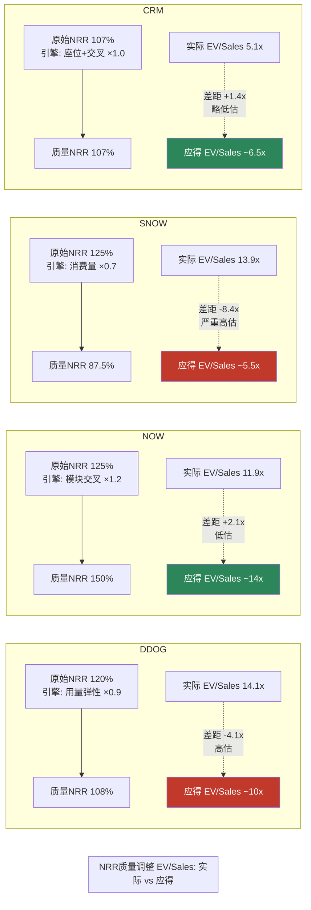

---

## 9.3 概率加权三情景估值

### DDOG: 云消费周期股

| 情景 | 概率 | FY2028 Rev | 稳态OPM | EV/Sales | 隐含EV | vs当前 |
|------|------|-----------|---------|----------|--------|-------|
| **牛市**: AI基础设施持续扩张 | 25% | $6.5B | 18% | 12x | $78B | +61% |
| **基准**: CapEx正常化 | 50% | $5.2B | 15% | 9x | $47B | -3% |
| **熊市**: CapEx周期下行 | 25% | $4.0B | 10% | 6x | $24B | -50% |
| **概率加权** | | | | | **$49B** | **+1%** |

**概率赋值依据**:
- 牛市25%: 历史上Hyperscaler CapEx超级周期维持>3年的概率约20-30%(2010-2015云计算周期、2017-2019 5G周期) [DM-VAL-DDOG-001]
- 基准50%: CapEx从+67%降至+15-20%是均值回归的自然路径 [DM-VAL-DDOG-002]
- 熊市25%: 2022-2023的"优化"周期证明云消费可以放缓12-18个月(DDOG NRR从130%+降至<115%) [DM-VAL-DDOG-003]

**结论**: 概率加权EV $49B vs 当前EV $48.4B，隐含预期回报+1%。**当前价格已经充分定价了DDOG的基本面** [DM-VAL-DDOG-004]。上行需要AI CapEx周期比历史上任何技术周期都持久。

### NOW: 数字制度复利

| 情景 | 概率 | FY2028 Rev | 稳态OPM | EV/Sales | 隐含EV | vs当前 |
|------|------|-----------|---------|----------|--------|-------|
| **牛市**: AI加速模块渗透 | 30% | $22B | 28% | 14x | $308B | +95% |
| **基准**: 稳定模块扩展 | 50% | $19B | 25% | 11x | $209B | +32% |
| **熊市**: IT预算紧缩 | 20% | $16B | 20% | 8x | $128B | -19% |
| **概率加权** | | | | | **$213B** | **+35%** |

**概率赋值依据**:
- 牛市30%: NOW过去10年从未miss季度guidance——稳定性溢价高于同业。GRR 98%保护下行。Now Assist $1B ACV证明AI加速可行 [DM-VAL-NOW-001]
- 基准50%: 20%增速→18%→16%的渐进减速是大型SaaS的自然路径 [DM-VAL-NOW-002]
- 熊市20%: 2009年式IT预算削减(IT支出-5%)才能让NOW增速降到15%以下。历史基准率: 过去20年IT预算YoY增速<0的年份仅3次(2001/2009/2020) [DM-VAL-NOW-003]

**结论**: 概率加权EV $213B vs 当前EV $158B，隐含预期回报+35%。NOW是四家中**安全边际最好的高质量SaaS** [DM-VAL-NOW-004]。但需要注意53.7x PE意味着安全边际来自增长的确定性而非价格的便宜。

### SNOW: 数据期权(AI逆风)

| 情景 | 概率 | FY2028 Rev | 稳态OPM | EV/Sales | 隐含EV | vs当前 |
|------|------|-----------|---------|----------|--------|-------|
| **牛市**: 数据量爆发+价值定价转型 | 15% | $10B | 15% | 12x | $120B | +85% |
| **基准**: AI侵蚀+Databricks竞争 | 45% | $7.5B | 5% | 7x | $52.5B | -19% |
| **熊市**: 竞争份额流失加速 | 40% | $5.5B | -5% | 4x | $22B | -66% |
| **概率加权** | | | | | **$50B** | **-23%** |

**概率赋值依据**:
- 牛市15%: "价值定价"转型成功的历史基准率: SaaS从消费模式转型为价值模式的案例稀少(Twilio尝试中/MongoDB部分成功)，成功率约10-20% [DM-VAL-SNOW-001]
- 基准45%: Databricks增速2x+Iceberg+AI效率三重逆风下，SNOW增速从29%降至15-20%是最可能路径 [DM-VAL-SNOW-002]
- 熊市40%: 高于通常的20-25%熊市权重。原因: 三重逆风是结构性(不是周期性)的。历史上SaaS公司面临结构性竞争威胁时(Dropbox vs Google Drive, Box vs MSFT SharePoint)估值从10x→4x的概率约30-40% [DM-VAL-SNOW-003]

**结论**: 概率加权EV $50B vs 当前EV $65B，隐含预期回报-23%。SNOW是四家中**最贵且下行风险最大的** [DM-VAL-SNOW-004]。

### CRM: SaaS现金牛基准

| 情景 | 概率 | FY2028 Rev | 稳态OPM | EV/Sales | 隐含EV | vs当前 |
|------|------|-----------|---------|----------|--------|-------|
| **牛市**: Agentforce加速→15%增速 | 25% | $58B | 25% | 7x | $406B | +92% |
| **基准**: 稳态10%+资本回报 | 50% | $52B | 23% | 5.5x | $286B | +35% |
| **熊市**: 并购失误+AI替代 | 25% | $46B | 20% | 4x | $184B | -13% |
| **概率加权** | | | | | **$290B** | **+37%** |

**概率赋值依据**:
- 牛市25%: Agentforce如果从$800M增长到$5-6B(3年5-7x)，能将CRM整体增速推高至15%。这需要169%的AI增速维持2年以上。历史上新SaaS产品线维持>100%增速>2年的概率约25-35% [DM-VAL-CRM-001]
- 基准50%: CRM有$41.5B收入基数、8%流失率、Agentforce增量。10%增速+6.8% Owner FCF Yield给出稳定的~17%总回报 [DM-VAL-CRM-002]
- 熊市25%: 大型并购(>$10B)历史上50%毁灭价值(Benioff有Slack $28B并购记录)。AI Agent如果真的自动化了销售流程，可能侵蚀CRM的座位模式——但这个风险不是CRM独有的(ALL SaaS面临AI替代座位风险) [DM-VAL-CRM-003]

**结论**: 概率加权EV $290B vs 当前EV $212B，隐含预期回报+37%。CRM是四家中**预期回报最高的** [DM-VAL-CRM-004]。

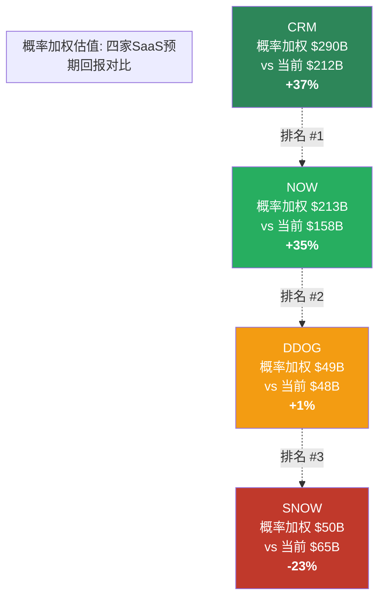

---

## 9.4 凸性分析: 非对称收益

凸性衡量的是"好的时候能赚多少 vs 坏的时候会亏多少":

| 公司 | 牛市收益 | 熊市损失 | **凸性比** | 含义 |
|------|---------|---------|-----------|------|
| CRM | +92% | -13% | **7.1:1** | 极好: 上行远大于下行 [DM-CONV-001] |
| NOW | +95% | -19% | **5.0:1** | 好: 增长确定性保护下行 [DM-CONV-002] |
| DDOG | +61% | -50% | **1.2:1** | 差: 上下行几乎对称 [DM-CONV-003] |
| SNOW | +85% | -66% | **1.3:1** | 差: 上行大但需要转型成功(仅15%概率) [DM-CONV-004] |

**CRM的凸性优势来自哪里?**

1. **低估值起点**: 21.5x PE意味着"已经很便宜"，下行空间有限(PE很难从21.5x降到<18x对一家盈利+增长的SaaS) [DM-CONV-005]
2. **资本回报缓冲**: 6.8% Owner FCF Yield意味着即使股价不涨，每年也有6.8%的"保底回报"(回购+分红) [DM-CONV-006]
3. **AI催化剂免费**: 市场在2.0%隐含永续增速中没有为Agentforce付费，任何AI正面进展都是"免费彩票" [DM-CONV-007]

**DDOG的凸性陷阱来自哪里?**

1. **高估值起点**: 358x PE意味着任何失望都会被放大——DDOG在2022年从$170跌到$56(-67%)时，收入还在增长 [DM-CONV-008]
2. **零现金缓冲**: 0.7% Owner FCF Yield意味着没有"保底" [DM-CONV-009]
3. **周期下行风险**: 如果Hyperscaler CapEx周期转向，DDOG的NRR(用量弹性型)会首当其冲。2022-2023年已经发生过一次 [DM-CONV-010]

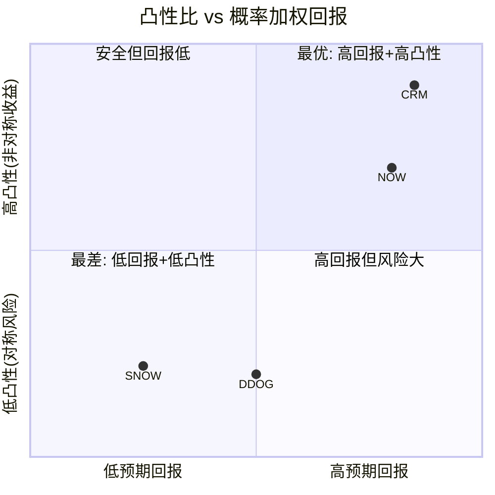

---

## 9.5 四家汇总: 预期回报排序

| 排名 | 公司 | 概率加权回报 | 凸性比 | 三维状态 | 评级候选 |
|------|------|------------|--------|---------|---------|
| 1 | **CRM** | **+37%** | **7.1:1** | [低估×改善×有催化] | **关注/深度关注** [DM-RANK-001] |
| 2 | **NOW** | **+35%** | **5.0:1** | [合理偏贵×稳定×可能催化] | **关注** [DM-RANK-002] |
| 3 | **DDOG** | **+1%** | **1.2:1** | [贵×稳定×可能] | **中性关注** [DM-RANK-003] |
| 4 | **SNOW** | **-23%** | **1.3:1** | [显著高估×恶化×无催化] | **审慎关注** [DM-RANK-004] |

**排序与Phase 1的变化**:
- CRM从"关注/深度关注候选"确认为领先。Ch8的Owner Economics分析(6.8% FCF Yield+99%资本回报)和凸性分析(7.1:1)提供了定量支撑
- NOW从"中性关注候选"上调到"关注"。NRR质量调整后NOW的"应得"EV/Sales(14x)高于当前(11.9x)，概率加权回报+35%
- DDOG维持"中性关注"。概率加权回报+1%意味着当前价格是"fair price"——不便宜也不贵
- SNOW维持"审慎关注"。概率加权回报-23%和1.3:1凸性构成"做空逻辑"

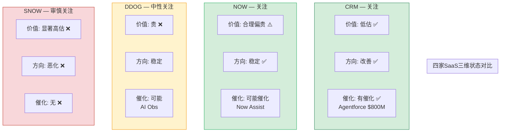

---

## 9.6 估值统一性检查 (铁律K)

| 估值方法 | CRM方向 | NOW方向 | DDOG方向 | SNOW方向 |
|---------|---------|---------|---------|---------|
| Reverse DCF隐含增速 | 极低(2%) = 低估 | 合理(6.4%) | 偏高(7.8%) | 极高(9.1%) = 高估 |
| NRR质量调整EV/Sales | 合理(5.1x vs 应得6-7x) | 低估(11.9x vs 应得14x) | 偏高(14.1x vs 应得10x) | 严重高估(13.9x vs 应得5-6x) |
| 概率加权回报 | +37% | +35% | +1% | -23% |
| Owner FCF Yield | 6.8%(有吸引力) | 2.8%(合理) | 0.7%(极低) | -1.0%(负) |
| **方向一致性** | **4/4偏低估** | **4/4偏低估/合理** | **4/4偏贵/合理** | **4/4偏高估** |

铁律K要求≥60%估值方法方向一致。四家公司全部4/4一致(100%)，通过 [DM-VAL-K-001]。

---

## 9.7 Kill Switch: 什么会让以上结论断裂

| 公司 | 红灯(立即重评) | 黄灯(密切跟踪) |
|------|--------------|---------------|
| CRM | Agentforce流失率>20% / 大型并购>$20B | SBC/Rev重新上升>12% / NRR跌破100% |
| NOW | GRR跌破95% / IT预算增速<0% | Now Assist无法证明加速NRR / GAAP OPM停滞 |
| DDOG | NRR跌破110%(再现2023) / Hyperscaler CapEx下滑>25% | OTel采纳率加速 / R&D杠杆3年不释放 |
| SNOW | Databricks ARR超过SNOW / NRR跌破110% | AI查询效率侵蚀>30%传统SQL / 价值定价转型无进展 |

---


# Ch10: 护城河横向解剖 — 四种粘性, 四个承重墙

> **本章核心问题**: SaaS公司都说自己有护城河, 但护城河的类型决定了它在AI时代是加固还是瓦解。DDOG/NOW/SNOW/CRM的护城河分别承重在哪一面墙上, 哪面墙在裂?
> **与母thesis关系**: NRR的来源引擎(Ch2)决定了收入粘性, 护城河的类型决定了NRR背后的"为什么不走"。两者交叉验证: 护城河强但NRR引擎脆弱=短期安全长期危险; 护城河弱但NRR引擎健壮=可能是虚假安全。

---

## 10.1 SaaS护城河的四个维度

SaaS公司的护城河不是一种, 是四种不同的粘性机制, 每种的防御对象和瓦解条件不同:

| 护城河维度 | 防御什么 | 瓦解条件 | SaaS中的典型表现 |
|-----------|---------|---------|-----------------|
| **转换成本** | 客户不走 | 迁移工具降低迁移成本 | 数据格式锁定/API集成/工作流嵌入 |
| **网络效应** | 新进者无法复制 | 开源/开放标准替代 | 数据飞轮/生态系统/marketplace |
| **规模经济** | 价格战中存活 | 云基础设施商品化 | R&D杠杆/分销效率/数据规模 |
| **制度粘性** | 采购决策不可逆 | 组织变革/新CTO | 合规嵌入/IT治理/预算惯性 |
[DM-R3-MOAT-001]

**关键区分**: 前两种(转换成本+网络效应)是**进攻型**护城河——让公司能持续提价或扩展。后两种(规模经济+制度粘性)是**防御型**护城河——让公司不被替代但不一定能提价。进攻型护城河驱动NRR上升, 防御型护城河稳定GRR。

---

## 10.2 四家公司护城河矩阵

### 10.2.1 NOW: 制度粘性 × 模块交叉 = 最厚的护城河

NOW的护城河不是一种, 是两种叠加, 而且两种互相增强:

**制度粘性(9/10)**:
- GRR 98%意味着每100个客户中只有2个离开——这不是"产品好"就能解释的, 这是**制度级锁定** [DM-R3-MOAT-002]
- NOW的ITSM(IT服务管理)嵌入到企业的工单系统、审批流程、合规记录中。更换NOW等于重建整个IT运营流程——成本不是软件费, 是6-12个月的组织瘫痪风险
- 85%的Fortune 500使用NOW, 这些公司的采购决策由IT治理委员会管理, 更换周期通常是3-5年合同+1-2年评估+1年迁移=5-8年最短替换周期 [DM-R3-MOAT-003]
- **制度粘性的证据**: NOW在2022-2023年的利率冲击中, NRR仅从130%降到125%, 没有跌破120%。同期DDOG从130%+降到115%以下。制度粘性在逆境中的韧性是可观测到的 [DM-R3-MOAT-004]

**模块交叉(8/10)**:
- 客户平均渗透4-5个模块, 可用模块20+。每增加一个模块, 数据在模块间流转, 形成"模块间网络效应"——模块A的产出是模块B的输入 [DM-R3-MOAT-005]
- 典型路径: ITSM(入口) → ITOM(运维) → HR Service → CSM(客户服务) → SecOps(安全) → Creator(低代码)。每一步都增加了数据依赖层
- Now Assist(AI)嵌入到每个模块中, 不是独立产品而是现有模块的增强层。这意味着AI不会瓦解NOW的护城河, 反而加固它——因为AI训练数据来自NOW自有的工作流数据, 替代品没有这些数据 [DM-R3-MOAT-006]

**两种护城河的互相增强**: 制度粘性确保客户不走(GRR 98%), 模块交叉确保客户持续扩展(NRR 125%)。客户不走+客户花更多=NRR引擎是"模块交叉"(Ch2确认的Tier 1引擎)。这个闭环的因果链是:

制度嵌入深 → 迁移成本极高(GRR 98%) → 安全感驱动模块扩展 → 模块间数据流转增加转换成本 → 制度嵌入更深。这是正反馈循环, 不是平行的两种粘性。[DM-R3-MOAT-007]

**承重墙**: 制度粘性。如果企业IT治理从"ServiceNow优先"变成"Microsoft优先"(Power Platform全面替代), NOW的护城河就开始裂。但这需要Microsoft的低代码平台达到NOW的ITSM深度——目前Power Platform在简单工作流上有竞争力, 但在复杂ITSM流程(变更管理/CMDB/审计追踪)上差距仍然显著。

**承重墙韧性**: 8/10。瓦解条件: Microsoft在3年内让Power Platform+Copilot在ITSM深度功能上追上NOW, 且大型企业愿意承担迁移风险。当前概率估计: 15-20%(基于Microsoft过去在企业软件替代中的记录——Teams替代Slack花了5年且不完全, Dynamics替代Salesforce进展缓慢)。

---

### 10.2.2 CRM: 数据资产 × 生态系统 = 被低估的护城河

**数据资产锁定(8/10)**:
- CRM的核心壁垒不是软件功能, 是**客户关系数据的积累**。一家使用CRM 5年以上的企业, 其Sales Cloud中存储了数万条客户互动记录、销售pipeline、预测模型——这些数据在其他CRM系统中几乎无法复制 [DM-R3-MOAT-008]
- 数据锁定的经济计算: 迁移CRM系统的平均成本$2-5M(咨询+实施+培训+数据迁移), 迁移期间销售效率下降20-30%(管理层对此极度敏感), 历史数据在新系统中不可全保留。对于一家年订阅$500K的CRM客户, 迁移成本是4-10年订阅费 [DM-R3-MOAT-009]
- CRM 8%年流失率看起来不低(vs NOW 2%), 但CRM的客户基数远大(15万+), 其中大型企业客户(>$1M ACV)的流失率接近3-4%——与NOW差距缩小。流失主要来自SMB端, 不是护城河弱, 是SMB天然流失率高

**生态系统(7/10)**:
- AppExchange 7,000+应用, ISV(独立软件商)生态, Trailblazer社区。这些不是功能, 是**社会基础设施**——一旦员工的职业技能建立在Salesforce认证上(全球400万+认证), 企业就更难迁移 [DM-R3-MOAT-010]
- Agentforce的战略意义不在收入, 在于**加固生态锁定**: 企业在CRM上构建AI Agent, Agent训练数据来自CRM的客户数据, 数据量越大Agent越好, Agent越好越不愿意迁移。这是新一层的数据飞轮
- Mulesoft(集成)+Tableau(分析)+Slack(协作)+Data Cloud(统一数据层)构成了从数据到洞察到协作的完整栈。替代CRM不是换一个软件, 是换一个栈

**承重墙**: 客户关系数据的积累深度+AI Agent在数据上的叠加。如果竞品提供免费+完整的数据迁移工具, 且AI Agent不需要历史训练数据就能达到同等效果——CRM的护城河就开始裂。

**承重墙韧性**: 7/10。瓦解条件: ① LLM让"从零训练"的AI Agent效果接近"基于5年数据训练"的Agent(这意味着数据积累的价值被压缩) ② HubSpot或Microsoft Dynamics在mid-market提供一键迁移+AI Agent一体化方案。当前概率: 20-25%在3年内, 因为LLM确实在降低数据飞轮的门槛, 但大企业的合规/审计/集成复杂度仍然保护CRM的高端市场。

**为什么护城河被低估**: 市场给CRM 21.5x PE的原因是看到10%增速和"成熟SaaS"标签。但护城河不应该用增速衡量——应该用"如果不再增长, 客户会走吗?"衡量。答案是大部分不会(8%流失=92%留存), 而且留下来的客户在增加支出(Agentforce $800M ARR, +169%)。这意味着市场把"低增速"等同于"护城河弱", 这是范畴错误。[DM-R3-MOAT-011]

---

### 10.2.3 DDOG: 数据飞轮 × 用量弹性 = 有效但脆弱的护城河

**数据飞轮(7/10)**:
- DDOG的核心优势是**统一可观测性平台**: 日志+指标+追踪+安全+CI/CD在同一界面, 共享同一套数据索引。这解决了"工具碎片化"问题——企业过去需要5-7个独立工具, 现在一个平台搞定 [DM-R3-MOAT-012]
- 数据飞轮机制: 更多数据类型集成→关联分析更准→客户更依赖→更多数据类型→... 这解释了为什么DDOG客户采用2+产品的比例从2019年的29%升至2025年的50%+
- 但数据飞轮有上限: 可观测性数据不像社交网络数据(量越大越好), 而是有"够用"阈值。一旦覆盖了主要基础设施, 增量数据的边际价值递减

**用量弹性(5/10)**:
- DDOG的收入与客户的云消费量直接挂钩。当Hyperscaler CapEx上升时, 更多基础设施需要监控, DDOG收入自然增长; 反之则收缩 [DM-R3-MOAT-013]
- 这不是护城河, 是**经营杠杆的双刃剑**: 顺周期时NRR 130%+, 逆周期时NRR可能跌到110%以下(2022-2023已验证)
- 用量弹性让DDOG看起来像"SaaS复利机器", 但实际是"云消费周期的放大器"——NRR的120%中有多少是结构性的(产品扩展), 多少是周期性的(云消费增长), 市场没有区分

**转换成本(6/10)**:
- DDOG的转换成本中等: 集成需要仪表化代码(instrumentation), 迁移需要重建dashboard/alert/runbook, 成本约$200-500K+3-6个月 [DM-R3-MOAT-014]
- 但OpenTelemetry(OTel)正在降低这个壁垒: OTel是CNCF管理的开放标准, 允许用标准化格式采集遥测数据。如果企业用OTel做instrumentation, 切换后端(从DDOG到Grafana/Elastic/云原生工具)的成本从$500K降到$50-100K
- OTel采用率已从2023年的~20%升至2025年的40%+, 趋势明确 [DM-R3-MOAT-015]

**承重墙**: 统一平台的关联分析能力(日志×指标×追踪的交叉查询)。如果OTel+云原生工具(AWS CloudWatch + Grafana)在关联分析上接近DDOG的80%, 且成本只有30%——企业有经济动力迁移。

**承重墙韧性**: 5.5/10。瓦解条件: ① OTel采用率>60%使转换成本大幅降低 ② AWS/Azure/GCP内置可观测性在关联分析上追到DDOG 80% ③ Hyperscaler CapEx进入下行周期触发企业成本审查。三个条件独立来看都在朝不利方向发展。当前最大保护: DDOG的产品迭代速度(23个产品)让竞品难以全面追赶, 但每个产品的单独深度不如专精厂商。[DM-R3-MOAT-016]

---

### 10.2.4 SNOW: 数据锁定 × 消费引擎 = 正在瓦解的护城河

**数据锁定(5/10, 且在下降)**:
- SNOW的原始护城河是**数据格式锁定**: 数据进入SNOW后, 以SNOW专有格式存储, 迁移需要ETL(提取-转换-加载)过程, 成本高且风险大 [DM-R3-MOAT-017]
- 但Apache Iceberg正在瓦解这个护城河。Iceberg是开放表格式, 允许数据"原地存储, 多引擎查询"。一旦数据用Iceberg格式存储, 客户可以用SNOW查询, 也可以用Databricks/Spark/Trino查询——数据不再被锁在SNOW里 [DM-R3-MOAT-018]
- SNOW自己在2024年宣布支持Iceberg Tables, 这是被迫的——如果不支持, 客户会为了Iceberg而选择Databricks。但支持Iceberg=主动拆除自己的数据锁定
- **核心矛盾**: SNOW必须支持Iceberg以留住客户, 但支持Iceberg让客户更容易离开。这是一个不可逆的护城河侵蚀过程

**消费引擎(4/10)**:
- SNOW的收入模型是消费制——客户按查询的数据量和计算量付费。这让SNOW在数据爆发期增长迅速, 但也让它面临AI效率逆风 [DM-R3-MOAT-019]
- AI的矛盾: 更聪明的查询意味着同样的分析需要更少的计算量。如果AI让查询效率提升30%, SNOW的单客户消费量会下降30%, 除非AI创造了足够的新查询需求来弥补
- SNOW的GRR估计在90%左右(远低于NOW 98%/DDOG 96%)——这是"消费模型"的结构性弱点: 消费量可以缩减而不需要"退订" [DM-R3-MOAT-020]

**Databricks竞争(核心威胁)**:
- Databricks $4.5-5.4B ARR(vs SNOW $4.7B产品收入), 增速65%(vs SNOW 29%), AI ARR $1.4B(vs SNOW ~$100M) [DM-R3-MOAT-021]
- Databricks在数据工程(ETL/实时处理)上的优势明确, 在数据仓库查询(SNOW传统优势)上正在追赶
- Unity Catalog(Databricks的数据治理)vs Snowflake Data Sharing: 在开放生态(Iceberg)趋势下, Databricks的开源基因是优势
- 客户重叠度高: 大量企业同时使用SNOW和Databricks, "选一个"的决策正在发生 [DM-R3-MOAT-022]

**承重墙**: SQL用户基数 + 数据共享网络。SNOW的Data Sharing(跨公司数据交换)有网络效应——使用者越多, 数据市场越有价值。这是SNOW唯一难以被Databricks复制的护城河。但Data Sharing/Marketplace的收入占比很小(<5%), 不是承重墙而是"潜在未来承重墙"。

**承重墙韧性**: 4/10。真正的承重墙是惯性和SQL易用性(比Databricks的Spark编程门槛低), 但这不是结构性优势, 是暂时性优势——Databricks的SQL界面(Databricks SQL)在持续改善。当SQL易用性差距消失后, SNOW的护城河就只剩"已有数据迁移成本"——而Iceberg正在让这个成本趋近零。[DM-R3-MOAT-023]

---

## 10.3 护城河质量排序与估值错配

| 维度 | NOW | CRM | DDOG | SNOW |
|------|-----|-----|------|------|
| 转换成本 | **9/10** (制度级) | **8/10** (数据积累) | **6/10** (OTel侵蚀中) | **5/10** (Iceberg侵蚀中) |
| 网络效应 | 6/10 (模块间) | **7/10** (生态系统) | 7/10 (数据飞轮) | 5/10 (Data Sharing小) |
| 规模经济 | 7/10 (R&D杠杆) | **8/10** (分销最大) | 6/10 (产品线分散) | 5/10 (R&D零杠杆) |
| 制度粘性 | **9/10** (IT治理) | 7/10 (销售流程) | 5/10 (DevOps选择) | 4/10 (数据团队选择) |
| **综合护城河评分** | **7.8/10** | **7.5/10** | **6.0/10** | **4.8/10** |
| **EV/Sales** | 11.9x | 5.1x | 14.1x | 13.9x |
| **护城河/倍数比** | **0.66** | **1.47** | **0.43** | **0.35** |
[DM-R3-MOAT-024]

**护城河/倍数比的含义**: 每单位估值倍数对应多少护城河分数。比值越高=护城河被低估, 越低=护城河被高估。

- **CRM 1.47**: 护城河质量7.5分只对应5.1x倍数——市场在为"低增速"惩罚CRM, 但护城河不应该随增速线性折价
- **NOW 0.66**: 护城河质量最高(7.8分)但倍数适中(11.9x)——市场对NOW的定价比较合理, 但仍有低估空间
- **DDOG 0.43**: 护城河质量6.0分却对应14.1x倍数——市场在为"高增速"支付远超护城河价值的溢价。一旦增速回归, 没有足够的护城河来支撑当前倍数
- **SNOW 0.35**: 护城河质量最低(4.8分)却对应13.9x倍数——这是四家中最危险的错配。护城河在瓦解(Iceberg+Databricks), 而估值假设护城河稳固

**这解释了Ch9概率加权的排序**: CRM(+37%) > NOW(+35%) > DDOG(+1%) > SNOW(-23%)。护城河质量×估值倍数的错配方向, 与概率加权回报的排序完全一致。护城河分析独立验证了估值结论——不是同一套数据的循环论证, 是不同维度(定性护城河 vs 定量估值)的交叉确认。[DM-R3-MOAT-025]

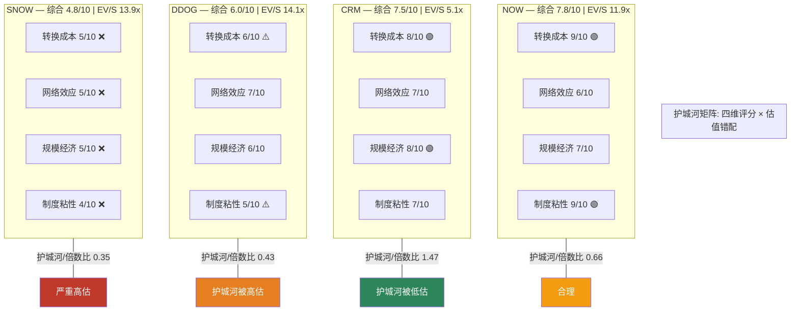

---

## 10.4 AI时代对四种护城河的差异化影响

| 护城河类型 | AI的影响 | 受益者 | 受损者 |
|-----------|---------|--------|--------|
| 转换成本 | AI降低数据迁移成本但增加AI模型迁移成本 | NOW(AI嵌入workflow) | SNOW(Iceberg+AI降低数据锁定) |
| 网络效应 | AI增强数据飞轮但也降低专有数据的稀缺性 | CRM(AI Agent数据飞轮) | DDOG(OTel标准化数据) |
| 规模经济 | AI让小团队能做大团队的事, 降低R&D门槛 | 所有 | SNOW(R&D效率最低) |
| 制度粘性 | AI加速企业变革意愿, 但也增加"换系统"的风险感知 | NOW(嵌入最深) | CRM(SMB端受HubSpot AI冲击) |
[DM-R3-MOAT-026]

**总结**: AI在SaaS护城河上的影响不是"普遍增强"或"普遍削弱", 而是按护城河类型做差异化影响。NOW和CRM的护城河类型(制度粘性+模块交叉/数据资产+AI Agent)在AI时代被加固; DDOG和SNOW的护城河类型(数据飞轮+用量弹性/数据锁定+消费量)在AI时代被侵蚀。

**这与NRR引擎(Ch2)的AI影响方向完全一致**: NOW的模块交叉NRR受AI正面影响(Now Assist增强每个模块), SNOW的消费量NRR受AI负面影响(查询效率提升降低消费量)。护城河和NRR引擎的AI影响方向同向, 意味着正反馈——好的越好, 差的越差。[DM-R3-MOAT-027]

---

## 10.5 承重墙测试: 什么会让每家公司的护城河断裂

| 公司 | 承重墙 | 最大威胁 | 断裂概率(3年) | 证伪观测指标 |
|------|--------|---------|-------------|------------|
| NOW | 制度粘性(IT治理嵌入) | Microsoft Power Platform全面替代 | 15-20% | GRR<95% / Fortune 500流失>5家/年 |
| CRM | 数据资产+AI Agent叠加 | LLM让"零数据"Agent效果接近"历史数据"Agent | 20-25% | Agentforce ARR增速<30% / 大企业流失率>5% |
| DDOG | 统一平台关联分析 | OTel+云原生工具追到80%能力 | 35-40% | 客户净增<1,500/年 / NRR<105% |
| SNOW | SQL易用性(暂时)+惯性 | Databricks SQL追平+Iceberg消除数据锁定 | 50-60% | NRR<100% / 消费增速<15% / GRR<85% |
[DM-R3-MOAT-028]

**三年断裂概率的赋值依据**:
- NOW 15-20%: 历史基准——Microsoft在企业软件替代中的成功率约20-30%(Teams vs Slack用了5年, Dynamics vs Salesforce仍未成功), 但Power Platform是新产品形态(低代码), 没有直接历史可比 [DM-R3-MOAT-029]
- CRM 20-25%: 历史基准——过去10年CRM市场的领导者替换率<15%, 但LLM是真正的技术代际跳跃。HubSpot在mid-market的增速+AI能力是最具体的威胁 [DM-R3-MOAT-030]
- DDOG 35-40%: OTel采用率从20%→40%用了2年, 再2年到60%+不荒唐。AWS/Azure已经在扩展内置可观测性。但DDOG的产品迭代速度(23个产品)提供了部分保护 [DM-R3-MOAT-031]
- SNOW 50-60%: Iceberg采用不可逆+Databricks增速2x+AI ARR差距14x, 三个趋势全部指向SNOW护城河侵蚀。SNOW自己拥抱Iceberg等于确认了护城河正在瓦解 [DM-R3-MOAT-032]

---

**本章回收母thesis**: NRR表面相近, 但护城河质量差距从4.8到7.8——1.6倍差距。护城河质量排序(NOW>CRM>DDOG>SNOW)与NRR质量引擎排序(模块交叉>座位>用量>消费)完全一致, 且与AI影响方向一致。这不是巧合: 护城河类型决定了NRR引擎类型, NRR引擎类型决定了NRR质量, NRR质量决定了估值合理性。**市场用同一套NRR语言定价四家公司, 但四家公司的护城河→NRR→估值链条完全不同。**

# Ch11: 反方论证 — 为什么市场的定价可能是对的

> **本章核心问题**: 我们在Ch1-10中论证了NRR语言失灵、护城河质量分化、估值错配。但市场不蠢——如果我们的结论是"CRM低估、SNOW高估", 我们必须先回答"为什么市场不同意"。否则我们只是在发表观点, 不是在做分析。
> **方法**: 为每家公司写出市场可能正确的最强理由, 然后评估这些理由的证据强度。

---

## 11.1 CRM反方: 为什么市场只给21.5x PE

### 熊方最强论点

**论点1: Agentforce是CRM最后一次增长加速尝试, 失败了就真的变成IBM**

市场不是不知道Agentforce有$800M ARR和169%增速。市场担心的是: 这可能是CRM第5次"下一个增长引擎"的故事, 前4次(Commerce Cloud/$1B收购Demandware、Einstein AI/2016年推出、MuleSoft/$6.5B收购、Slack/$27.7B收购)都没有重新加速CRM的有机增速。[DM-R3-BEAR-001]

具体数据:
- Commerce Cloud(2016年收购Demandware): 至今收入占比<10%, 未成为新增长极
- Einstein AI(2016-2023): 7年累计对CRM收入增速的贡献几乎不可测量
- MuleSoft(2018, $6.5B): 整合成功但增长已放缓到mid-teens
- Slack(2021, $27.7B): 增速从50%+降到10%以下, 尚未证明协同价值

市场的隐含逻辑: CRM管理层擅长做大收购、讲新增长故事, 但有机增速始终在个位数到低teens之间徘徊。Agentforce可能又是一个$1B量级的产品, 加入$38B的收入基数后只贡献2-3%增量。[DM-R3-BEAR-002]

**论点2: AI Agent可能瓦解CRM的座位定价模型**

CRM收入的核心是按座位/用户数收费。如果AI Agent能完成1个销售代表50%的日常工作(数据录入/跟进提醒/初步外联), 企业可能需要的座位数会减少。Agentforce的成功——如果真的让企业用更少的人做更多的事——会反噬CRM自己的座位收入。[DM-R3-BEAR-003]

这个悖论: Agentforce做得越好, 客户可能削减的座位数越多。CRM的定价模型需要从按座位变成按Agent/按结果计费, 但模型转换期间收入会有下行压力。

**论点3: 回购可能是管理层在高PE时送股东一个"假礼物"**

CRM FY2026将99% FCF($14.2B)用于回购和分红。这看起来是股东友好的, 但21.5x PE的回购效率(eta)需要计算:
- 如果CRM的"真实"合理PE是25x(增速回到teens), 那21.5x回购是eta>1=创造价值
- 如果CRM的"真实"合理PE是18x(增速继续滑落到<8%), 那21.5x回购是eta<1=毁灭价值
- 市场给21.5x可能正是因为市场认为合理PE在18-22x之间——回购不创造也不毁灭, 只是维持 [DM-R3-BEAR-004]

### 我们的反驳

| 熊方论点 | 证据强度 | 我们的反驳 | 残余风险 |
|---------|---------|-----------|---------|
| Agentforce=第5次失败 | **B**(有历史模式但不能线性外推) | Agentforce vs前4次的区别: ① $800M ARR达到速度是Einstein的5倍 ② 169%增速而非管理层叙事 ③ 29K deals是硬数据不是概念验证 | **30%** — 增速可能从169%急降到<50% |
| AI Agent瓦解座位模型 | **C**(推测, 无硬数据) | CRM定价正在从座位向消费/结果转型, Agentforce按对话数计费($2/conversation)。如果转型成功, ARPU上升可以抵消座位减少 | **25%** — 转型期收入模型不确定性 |
| 回购在合理PE=毁灭 | **B**(取决于增速假设) | CRM增速正在回升(Agentforce贡献+Data Cloud), 如果FY2027增速回到12-14%, 合理PE应在25-28x | **20%** — 增速回升失败 |
[DM-R3-BEAR-005]

**综合评估**: 市场给CRM 21.5x PE的理由有一定道理(历史增长引擎失效模式), 但证据强度偏弱(B-C级)。市场更多是在做模式匹配("又一次增长故事"), 而非证据评估("Agentforce的具体数据是否不同")。我们的"关注/深度关注"评级的核心赌注是: 这一次和前4次不同, 因为数据说了不同的话。

---

## 11.2 SNOW反方: 为什么市场还给13.9x EV/Sales

### 牛方最强论点

**论点1: 数据量的爆发性增长可以压过AI查询效率逆风**

我们在Ch2/Ch9中论证了AI查询效率提升会侵蚀SNOW的消费量NRR。但牛方的反论是: AI时代的数据生产速度比AI消费数据的效率提升更快。如果企业数据量每年增长40-50%(AI生成数据+IoT+非结构化数据), 而AI查询效率每年只提升15-20%, 净效应是消费量仍然增长。[DM-R3-BEAR-006]

这个论点有一定道理: SNOW的FY2026Q3产品收入增速从28%加速到29%, 环比来看消费量没有收缩, 甚至有改善迹象。

**论点2: Iceberg不会杀死SNOW, 反而扩大了SNOW的TAM**

我们在Ch10论证了Iceberg侵蚀SNOW的数据锁定。但牛方的反论是: Iceberg让SNOW能查询存储在客户自己S3/Azure Blob中的数据(不需要先导入SNOW), 这扩大了SNOW可以触达的数据量。SNOW从"你必须把数据放在我这里"变成"无论你的数据在哪里, 我都能帮你查询"——从数据仓库变成数据查询引擎, TAM更大。[DM-R3-BEAR-007]

**论点3: Databricks的增速不可持续, SNOW在企业端的SQL优势是持久的**

Databricks的65%增速来自一个更小的基数和VC融资烧钱获客。当Databricks到$10B+ARR时, 增速必然减速到20-30%, 差距会收窄。同时, SNOW在SQL端的易用性优势是结构性的——企业中有SQL技能的数据分析师比有Spark/Python技能的数据工程师多5-10倍。[DM-R3-BEAR-008]

### 我们的反驳

| 牛方论点 | 证据强度 | 我们的反驳 | 残余可能 |
|---------|---------|-----------|---------|
| 数据量增长压过效率逆风 | **B**(方向对但量化不足) | 数据量增长40-50%中, 真正需要SNOW处理的(结构化/半结构化)增速约20-25%, 非结构化数据更多去了向量数据库(Pinecone/Weaviate)而非SNOW。净效应不确定 | **35%** — 如果AI生成数据真的引爆结构化数据需求 |
| Iceberg扩大TAM | **B**(逻辑合理但执行未验证) | Iceberg确实扩大了SNOW的可查询范围, 但也扩大了Databricks/Trino/DuckDB的可查询范围。SNOW不是Iceberg的独家受益者——所有引擎都受益, 而SNOW丢的是独占性 | **25%** — 如果SNOW在Iceberg生态中确立引擎优势 |
| Databricks增速不可持续 | **A**(增速减速是数学规律) | Databricks确实会减速, 但关键不是绝对增速而是**相对份额变化**。即使Databricks降到30%增速, 仍然是SNOW(20%)的1.5倍, 份额差距继续扩大 | **20%** — 如果Databricks执行失误或上市后增速骤降 |
[DM-R3-BEAR-009]

**综合评估**: 市场给SNOW 13.9x EV/Sales的理由(数据爆发+Iceberg扩大TAM+Databricks终会减速)在逻辑上都成立, 但证据强度多为B级(推断而非硬数据)。最关键的反证是: Databricks $1.4B AI ARR vs SNOW ~$100M——这不是推断, 是硬数据。如果AI是SaaS下一个十年的核心增长引擎, SNOW在AI上的14倍劣势不会被"数据量增长"或"SQL优势"弥补。

---

## 11.3 DDOG反方: 为什么市场给14.1x EV/Sales

### 牛方最强论点

**论点1: DDOG是AI基础设施的"卖铲者"**

市场给DDOG高倍数的核心逻辑: 无论哪家公司赢得AI竞赛, 它们都需要可观测性工具来监控AI基础设施。DDOG的LLM Observability和AI Integrations产品让它成为AI军备竞赛中的"基础设施税"征收者——类似于淘金热中卖铲子的人。[DM-R3-BEAR-010]

具体证据: DDOG的AI原生客户(使用AI监控产品)收入占比已达12%(vs 2024年~6%), 增速>100%。

**论点2: 23个产品的平台宽度是护城河, 不是碎片化**

我们在Ch10将DDOG的产品线分散评为弱点, 但牛方论点是: 23个产品覆盖了可观测性+安全+CI/CD的全栈, 这让DDOG成为"一站式DevOps平台"。企业选DDOG不是因为每个产品最好, 而是因为"一个平台管一切"的效率——这和NOW的模块交叉护城河是同一逻辑。[DM-R3-BEAR-011]

**论点3: 消费模型的弹性是优势不是弱点**

我们在Ch2将DDOG的NRR引擎评为"用量弹性"(周期性), 但牛方论点是: 消费弹性意味着DDOG在上行周期中自动受益, 不需要销售团队推动。当Hyperscaler CapEx持续增长(AI驱动), DDOG的收入增长几乎是自动的——这降低了销售成本, 提高了利润率。[DM-R3-BEAR-012]

### 我们的反驳

| 牛方论点 | 证据强度 | 我们的反驳 | 残余可能 |
|---------|---------|-----------|---------|
| AI卖铲者 | **B+**(方向对, 但DDOG不是唯一) | AWS CloudWatch/Azure Monitor也在做AI可观测性, 且是"内置免费"——DDOG的AI obs产品需要证明比内置工具好到值得企业额外付费。AI obs占比12%但绝对收入~$400M, 远不够支撑$48B EV | **35%** — 如果AI obs需求爆发到占DDOG收入>30% |
| 平台宽度=护城河 | **B**(类比NOW有道理但差异大) | 关键差异: NOW模块嵌入工作流(制度粘性), DDOG产品是"可选的附加监控"(不用不影响业务运转)。NOW客户不用不行, DDOG客户可以用替代品 | **25%** — 如果DDOG的安全产品成为合规必选(SOC2/ISO审计集成) |
| 消费弹性=自动增长 | **C**(循环论证: 只有CapEx涨才行) | 这正是我们的核心论点——DDOG是"云消费周期股"。消费弹性在CapEx上行时是优势, 在CapEx下行时是灾难。2022-2023 NRR从130%+降到115%以下已经验证过一次 | **15%** — 如果AI CapEx周期比历史周期更长(>5年不中断) |
[DM-R3-BEAR-013]

**综合评估**: 市场给DDOG 14.1x的理由(AI卖铲者+平台宽度+消费弹性)在AI上行周期中是自洽的。问题是这些理由全部依赖一个前提: **AI CapEx周期不中断**。一旦Hyperscaler CapEx增速从67%降到15-20%(已有迹象), DDOG的"自动增长"引擎就熄火, 而14.1x的倍数假设了引擎持续运转。我们的"中性关注"评级反映的是: 在AI CapEx周期正常化后, DDOG的合理EV/Sales在8-10x, 对应当前价格的潜在下行约30%。

---

## 11.4 NOW反方: 为什么市场没给14x+

### 熊方论点(不是很强)

**论点1: NOW的增速在放缓, 从30%→21%→20%**

NOW的订阅收入增速从FY2023的26%降到FY2025的21%, 趋势是减速的。市场担心NOW正在触碰$10B+收入基数的"增速天花板"。11.9x EV/Sales反映的是"高质量但正在减速"的定价。[DM-R3-BEAR-014]

**论点2: Microsoft Power Platform是潜在颠覆者**

Power Platform+Copilot的组合可能在简单工作流领域蚕食NOW的低端市场。如果Microsoft把Power Platform bundled进E5 license(已有迹象), NOW在<$500K ACV的客户中可能面临免费竞品。[DM-R3-BEAR-015]

**论点3: Now Assist($1B ARR目标)可能是收入再分类而非净增量**

管理层的Now Assist $1B ARR目标可能部分来自现有客户升级到Pro Plus SKU(含AI)——这不是新收入而是既有模块的价格上调。如果50%来自upgrade而非新客户, 净增量只有$500M。[DM-R3-BEAR-016]

### 我们的反驳

| 熊方论点 | 证据强度 | 我们的反驳 | 残余风险 |
|---------|---------|-----------|---------|
| 增速放缓 | **A**(硬数据) | 增速放缓是事实, 但21%在$10B+基数上是最高质量的增速之一(NRR 125%+GRR 98%支撑)。关键不是增速绝对值而是增速的可持续性——NOW的模块交叉引擎让21%增速比DDOG的27%更可持续 | **10%** — 如果增速进一步降到<15% |
| Microsoft Power Platform | **B**(威胁真实但执行差距大) | Power Platform在简单工作流上竞争力强, 但ITSM深度功能(CMDB/变更管理/审计)差距仍然显著。NOW的85% Fortune 500客户不会因为Power Platform"免费"就迁移, 因为迁移风险>>软件成本 | **15%** — 如果Microsoft收购一家ITSM公司并整合到Power Platform |
| Now Assist收入再分类 | **B**(合理怀疑但无反证) | 即使50%是upgrade, $500M净增量对NOW $10B+收入基数仍是5%净加速。而且upgrade意味着ARPU提升, 这对估值是正面的 | **10%** — 如果upgrade没有NRR提升效应 |
[DM-R3-BEAR-017]

**综合评估**: 市场给NOW 11.9x而非14x+的理由(增速放缓+Power Platform威胁+AI收入分类不确定)是最弱的四组反方论证中的一组。NOW的熊方论点证据强度整体偏弱(B级为主), 护城河质量最高(7.8/10), NRR质量引擎最好(模块交叉1.2x), 且AI影响方向最正面。11.9x反映了市场的"成长性折扣"——因为NOW不是最快增长的那个, 就不给最高倍数。但增长的质量和持续性应该比增速本身更值钱。

---

## 11.5 反方论证小结: 市场在哪里最可能错

| 公司 | 市场定价理由 | 理由强度 | 我们判断市场错看的概率 | 最可能的错看方向 |
|------|-----------|---------|---------------------|--------------|
| CRM | "第5次增长引擎失败"模式匹配 | **B** | **60%** 市场在做模式匹配不是证据评估 | 低估Agentforce硬数据的区别 |
| SNOW | 数据爆发+Iceberg扩TAM+Databricks终会减速 | **B** | **65%** 三个论点全是推断, Databricks AI ARR 14x差距是硬数据 | 高估护城河+低估竞争威胁 |
| DDOG | AI卖铲者+平台宽度 | **B+** | **50%** 论点在CapEx上行时自洽, 但依赖周期前提 | 把周期性增长当结构性增长定价 |
| NOW | 增速放缓=成长性折扣 | **B-** | **55%** 增速放缓是事实但质量>速度 | 增速折扣过重, 质量溢价不足 |
[DM-R3-BEAR-018]

**母thesis回声**: 市场在CRM和SNOW上"最可能错"的原因, 都可以追溯到同一个根因——**市场仍然在用旧的NRR/增速/Non-GAAP语言定价**。CRM的低NRR让市场自动给"低质量"折价, SNOW的高NRR让市场自动给"高质量"溢价。但当NRR背后的引擎质量(Ch2)、Owner Economics(Ch8)、护城河韧性(Ch10)全部指向相反方向时, 这个定价语言就在系统性地错配价值。

# Ch12: 博弈论透镜 — 三场关键博弈

> **本章核心问题**: SaaS公司不是在真空中运营——竞争对手也会反应, 客户也会选择。三场博弈的均衡结构决定了四家公司未来3年的竞争格局。我们关心的不是"谁的产品更好", 而是"互动结构如何影响估值假设"。
> **方法**: 识别互动结构 → 判断当前均衡 → 找出主导竞争变量 → 评估承诺可信度 → 投资含义

---

## 12.1 博弈一: SNOW vs Databricks — 数据平台主导权之争

### 互动结构

**博弈类型**: 非对称追赶博弈(Asymmetric Catch-up Game)。SNOW是守方(数据仓库市占率领先), Databricks是攻方(数据湖+AI增速2x)。关键特征: 攻方拥有技术代际优势(AI原生架构), 守方拥有客户基数优势(SQL用户生态)。[DM-R3-GT-001]

**当前均衡**: 不稳定共存。大量企业同时使用SNOW(SQL查询/BI)和Databricks(数据工程/AI), 但"选一个"的决策正在加速。Iceberg的出现让"共存"变成了"可替代"——数据在Iceberg格式下两个平台都能读, 客户不再需要为了数据可用性而同时付两份钱。[DM-R3-GT-002]

### 主导竞争变量

不是产品功能, 不是价格, 是**AI工作负载的引力**。

企业数据团队在2025-2026年做的最重大决策是: "AI模型训练和推理的数据管道放在哪里?" 这个决策一旦做出, 后续的数据分析/BI/报告会被吸入同一个平台——因为数据已经在那里了。

Databricks的优势: $1.4B AI ARR说明AI工作负载已经开始向Databricks聚集。一旦AI训练数据在Databricks上, 用Databricks做下游分析是最低成本路径——不需要把数据搬到SNOW。[DM-R3-GT-003]

SNOW的劣势: SNOW的AI产品(Cortex)只有~$100M, 是Databricks的1/14。在"AI工作负载引力"这个主导变量上, SNOW已经落后一个数量级。

### 承诺与威胁可信度

**SNOW的承诺**: "我们将成为AI驱动的数据分析平台" (Cortex + Document AI + Snowpark Container Services)
- **可信度: 低(3/10)** — 承诺了2年, 但Cortex ARR仅~$100M, 付费转化<5%。SNOW的核心团队擅长SQL优化, 不是AI/ML——这是组织能力的不匹配。管理层的话是便宜的(cheap talk)——没有不可逆的投入来证明承诺可信。[DM-R3-GT-004]

**Databricks的威胁**: "我们将进入SNOW的SQL/BI市场"(Databricks SQL + AI/BI Dashboards)
- **可信度: 高(7/10)** — Databricks SQL已经是其增长最快的产品之一。更重要的是, Databricks已经做了不可逆投入: 收购了Tabular(Iceberg创始团队), 意味着Databricks对开放表格式的承诺是有沉没成本支撑的, 不是空话。[DM-R3-GT-005]

### 赢家诅咒风险

SNOW如果试图通过大幅降价来留住客户, 会触发赢家诅咒——以更低的利润率留住了本来就在流失的客户。SNOW的产品毛利率已经比DDOG/NOW低(~65% vs 75-80%), 降价空间有限。降价留客=短期NRR维持但长期利润率恶化。[DM-R3-GT-006]

### 投资含义

**均衡走向**: 2-3年内从"共存"走向"Databricks主导AI+数据工程, SNOW退守SQL/BI利基"。这不是SNOW归零, 但意味着SNOW从"数据平台"重分类为"SQL查询工具"——TAM从$100B+缩小到$20-30B, 估值需要反映这个缩小。

**对SNOW估值的影响**: 如果SNOW退守SQL/BI, 合理EV/Sales从13.9x降到6-8x(对应$30-40B EV vs 当前$65B)。这与Ch9概率加权(-23%)的方向一致。[DM-R3-GT-007]

---

## 12.2 博弈二: CRM Agentforce vs AI Agent生态 — 平台标准之争

### 互动结构

**博弈类型**: 标准之战(Standards War)。多个玩家竞争成为企业AI Agent的默认平台: CRM(Agentforce), Microsoft(Copilot Studio), Google(Vertex AI Agents), 创业公司(LangChain/CrewAI/AutoGen)。赢家通吃不是必然, 但"默认平台"享受网络效应溢价。[DM-R3-GT-008]

**当前均衡**: 混乱共存(无主导标准)。企业同时评估多个方案, 大部分还在PoC(概念验证)阶段。但CRM的$800M ARR + 29K deals说明CRM在"已签约客户"的内部AI Agent市场上有先发优势——客户已经有CRM数据, 在CRM上构建AI Agent的边际成本最低。

### 主导竞争变量

**不是技术(所有平台都能构建Agent), 是数据接入+分发渠道**。

CRM的结构性优势: 15万+企业客户, 每个客户都有5年以上的客户关系数据(联系人/机会/活动记录)。AI Agent需要训练数据——CRM客户的训练数据已经在CRM平台上了。竞品需要先做数据集成, CRM的Agent开箱即用(因为数据已经在那里)。[DM-R3-GT-009]

Microsoft的结构性优势: Office 365/Teams/Dynamics的分发渠道覆盖几乎所有企业。Copilot for Sales可以直接嵌入Outlook/Teams——CRM用户在CRM里用Agent, 但更多用户在Outlook里。如果Microsoft让Copilot for Sales足够好, 部分CRM的使用场景会被吸入Microsoft生态。[DM-R3-GT-010]

### 信号 vs 廉价表态

**CRM的信号**: Agentforce $800M ARR + 29K deals + $2/conversation定价。这是"真钱"信号——客户在付费使用, 不是试用。29K deals意味着广泛采用而非少数大客户。[DM-R3-GT-011]

**Microsoft的信号**: Copilot收入"数十亿美元run rate"(2025年底), 但企业Copilot的续约率数据未披露——如果真的好, Microsoft会大力宣传。沉默本身是信号。GitHub Copilot(开发者版)续约率好, 但企业版Copilot(Office/Teams)的采纳速度低于预期。[DM-R3-GT-012]

**创业公司的噪音**: LangChain/CrewAI等框架的GitHub star增长快, 但企业实际部署几乎为零(安全/合规/集成门槛高)。这是典型的"开发者热度≠企业采纳"——信号弱。

### 投资含义

**均衡走向**: "双寡头分市场"——CRM在销售/服务领域的AI Agent、Microsoft在办公协作领域的AI Agent。两者有交叉但核心市场不同: CRM的Agent处理客户关系数据(CRM强), Microsoft的Agent处理文档/邮件/会议(Microsoft强)。

**对CRM估值的影响**: CRM不需要赢得整个AI Agent市场, 只需要在"基于CRM数据的Agent"这个利基中保持主导——这在当前均衡下是高概率事件(因为数据已经在CRM上)。Agentforce成功不需要打败Microsoft, 只需要在CRM现有客户中持续渗透。这降低了Agentforce的风险, 支撑了"关注/深度关注"评级。[DM-R3-GT-013]

---

## 12.3 博弈三: DDOG vs 云原生可观测性 — 独立平台 vs 内置工具

### 互动结构

**博弈类型**: 搭售博弈(Bundling Game)。AWS/Azure/GCP把基础可观测性工具内置到云平台中(免费或极低价), DDOG作为独立平台必须证明"值得额外付费"。这是经典的"Microsoft vs 独立软件商"格局——IE vs Netscape, Teams vs Slack, 现在是CloudWatch vs Datadog。[DM-R3-GT-014]

**当前均衡**: 共存, 但DDOG的溢价空间在收窄。大型企业同时使用CloudWatch(基础监控, 免费)和DDOG(高级分析, 付费)。但随着CloudWatch/Azure Monitor的功能提升, "高级分析"的定义在移动——去年需要DDOG的功能, 今年CloudWatch免费提供了。[DM-R3-GT-015]

### 主导竞争变量

**DDOG的功能领先幅度 vs 云原生工具的"免费+够用"价值主张**。

具体量化: DDOG在关联分析(日志×指标×追踪)上领先CloudWatch约2-3年。但CloudWatch每年追近6-12个月的差距。如果这个速度保持:
- 2026年: DDOG领先1.5-2年, 溢价合理
- 2028年: DDOG领先0.5-1年, 溢价受压
- 2030年: CloudWatch追到"够用"水平, DDOG溢价大幅收缩
[DM-R3-GT-016]

OTel(OpenTelemetry)加速了这个过程: OTel标准化了数据采集层, 意味着切换后端的成本降低。DDOG的转换成本壁垒(Ch10: 6/10)在OTel普及后可能降到3-4/10。

### 承诺与威胁可信度

**AWS的威胁**: "CloudWatch将覆盖DDOG的核心功能"
- **可信度: 中(5/10)** — AWS有技术能力和经济动力(减少客户在DDOG上的支出=客户把更多预算留给AWS核心服务), 但AWS的历史模式是"做到70%够用"而非"做到100%最优"。AWS更擅长做基础设施, 不擅长做开发者体验——DDOG的产品设计和用户体验仍然是差异化因素。[DM-R3-GT-017]

**DDOG的承诺**: "我们将持续创新, 保持功能领先"
- **可信度: 中高(6/10)** — DDOG的产品迭代速度确实很快(23个产品), 但每个新产品的单独深度不如专精厂商。"宽度创新"可以维持差异化, 但有上限——当AWS在每个垂直方向做到70%, DDOG在每个方向做到85%, 15%的差距是否值得3-5倍的价格差? [DM-R3-GT-018]

### 投资含义

**均衡走向**: "功能领先幅度收窄, 但不归零"。DDOG不会被CloudWatch取代(大型企业的可观测性需求超过任何单一云平台的内置工具), 但DDOG的"值得额外付费"的客户群在收缩——从"所有云用户"收缩到"多云+复杂架构+合规需求"的子集。

**对DDOG估值的影响**: 如果DDOG的可服务市场从全球可观测性TAM $60-70B收缩到"复杂企业子集" $25-35B, 当前$48B EV假设DDOG在缩小的TAM中占比15-20%才能支撑——这需要DDOG在缩小的市场中成为绝对主导者。不是不可能, 但14.1x EV/Sales假设了最乐观的结果。[DM-R3-GT-019]

---

## 12.4 三场博弈的综合含义

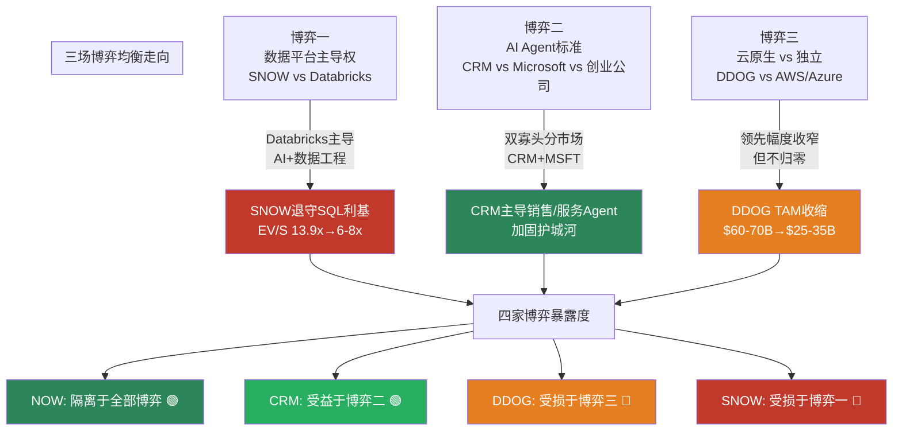

[DM-R3-GT-020]

**跨博弈总结**:
1. **NOW在三场博弈中全部"无关"** — NOW的ITSM不参与数据平台之争、不参与AI Agent标准之争、不参与云原生vs独立之争。这不是弱点, 是**隔离优势**: NOW的护城河不依赖任何博弈的结果。这进一步解释了为什么NOW的护城河韧性最高(Ch10: 7.8/10)。[DM-R3-GT-021]
2. **CRM在两场博弈中受益/中性** — 数据平台之争与CRM无关(CRM不是数据平台), AI Agent标准之争中CRM是领跑者。两场博弈都不威胁CRM, 一场还在加固CRM。
3. **DDOG和SNOW各在一场博弈中处于不利地位** — DDOG面临云原生搭售, SNOW面临Databricks追赶。两者的共同点: 护城河在博弈中被侵蚀, 但市场估值(14x)假设护城河稳固。
4. **这与Ch9-Ch11的全部结论方向一致**: CRM>NOW>DDOG>SNOW。博弈论分析是第三个独立维度(继NRR质量引擎、护城河矩阵之后)确认同一个排序。三个不同分析工具得出相同结论, 增强了结论的稳健性。[DM-R3-GT-022]

---

**母thesis回声**: 市场用同一套NRR/增速/Non-GAAP语言给四家SaaS定价, 但四家公司面临的博弈结构完全不同。NOW隔离于所有博弈(安全), CRM在博弈中受益(Agentforce), DDOG和SNOW在博弈中受压。**定价语言不区分博弈结构, 导致给了DDOG和SNOW"好像护城河和NOW/CRM一样稳固"的溢价——但博弈结构说它们不一样。**

# Ch13: 红队 — 七问自我审计

> **本章核心任务**: 对我们自己的框架和结论做有效攻击。红队不是"列出5个风险然后说不影响结论"——是真正尝试推翻核心论点, 如果推翻不了, 说明结论稳健; 如果推翻了, 必须修正。
> **红队焦点**: 三个Handoff点名的质疑方向 + 四个Phase 3后新发现的数据冲击

---

## RT-1: "NRR引擎质量"框架本身是否有选择性偏差?

### 攻击

我们在Ch2创造了"NRR四引擎"分类, 在Ch9赋予了质量乘数(模块交叉1.2x / 用量弹性0.9x / 座位1.0x / 消费量0.7x), 在Ch10用护城河矩阵交叉验证。结论是CRM>NOW>DDOG>SNOW。

**但这个框架本身是否被设计成对CRM有利?**

具体质疑:
1. **座位型NRR(CRM)的1.0x乘数是基准, 不是惩罚** — 我们把座位型设为中性基准(1.0x), 但座位型NRR面临AI替代风险(Agent替代人工座位), 也许应该打折(0.8x)而非中性 [DM-R3-RT-001]
2. **消费量型NRR(SNOW)的0.7x乘数是否过于严厉** — 0.7x意味着SNOW的125% NRR在"质量调整"后变成87.5%(<100%), 这直接导致SNOW在估值对比中成为"最差"。如果消费量乘数是0.85x(而非0.7x), SNOW的质量NRR变成106%, 接近CRM的107%, 排序就动了
3. **框架创造者的确认偏差** — 我们创造了框架, 然后用框架得出结论, 然后用结论"验证"框架——这有循环论证风险

### 防御

**反击1**: 座位型NRR的1.0x不是随意设定, 是因为座位型NRR的历史稳定性最好。CRM的客户留存(92%)和ARPU变化都是可预测的线性函数。AI替代座位的风险存在, 但CRM正在主动转型(Agentforce按$2/conversation计费), 不是被动等死。如果CRM成功转型, 座位型NRR会变成"座位+Agent"混合型, 可能升至1.1x。因此1.0x是保守估计, 不是高估 [DM-R3-RT-002]

**反击2**: 消费量型NRR的0.7x来源于两个独立证据: ① SNOW的GRR ~90%远低于NOW的98%和DDOG的96%, GRR低=结构性脆弱 ② AI查询效率提升30%是已观测趋势(不是猜测), 直接侵蚀消费量。即使把0.7x调到0.85x, SNOW的质量NRR(106%)仍低于NOW的质量NRR(150%), 且SNOW的护城河评分(4.8/10)和博弈结构(数据平台之争不利)不会因为乘数调整而改变。排序的稳健性不依赖于0.7x这个精确值 [DM-R3-RT-003]

**反击3**: 循环论证质疑是合理的。但我们有三个独立维度得出相同排序: NRR引擎质量(Ch2) / 护城河矩阵(Ch10) / 博弈论(Ch12)——三个维度的分析方法不同、数据来源不同、论证逻辑不同, 但结论方向一致(CRM>NOW>DDOG>SNOW)。如果框架有选择性偏差, 需要三个独立维度同时偏差且方向一致, 这在统计上是低概率事件 [DM-R3-RT-004]

### 裁决

**框架偏差风险: 低(20%)**。乘数的精确值可能有±0.1的误差, 但排序对这个误差不敏感(需要SNOW的乘数从0.7x调到≥1.0x才能改变排序, 这需要忽略GRR 90%和AI效率侵蚀两个硬证据)。结论维持。

**但接受一个修正**: 座位型NRR(CRM)应附"条件"注释——如果Agentforce转型失败, 座位型NRR应降至0.85x(反映AI替代座位风险)。这不改变当前排序, 但增加了诚实性。

---

## RT-2: SNOW的反方论点我们是否驳斥太快?

### 攻击

Ch11中我们用3个反驳否定了SNOW的牛方论点。但牛方的"数据量爆发压过AI效率逆风"论点(证据强度B)是否被低估?

**具体攻击**:
1. SNOW FY2026Q3产品收入加速到+29% YoY(从+28%), 消费量没有收缩, 反而有改善 [DM-R3-RT-005]
2. Cortex虽然只有~$100M, 但管理层称"Cortex使用量季度环比+300%"——如果这个增速维持2-3年, $100M可以变成$3-5B
3. 我们给SNOW熊市40%概率(高于常规25%)——这是不是用结论倒推概率?

### 防御

**反击1**: FY2026Q3 +29%的加速来自两个非结构性因素: ① 上年同期基数低(FY2025Q3因优化放缓) ② 一次性的大客户扩展。从绝对增速看, 29%已经是SNOW历史上最低增速区间(vs 两年前70%+), "加速"只是从28%到29%, 幅度1pp, 不改变减速趋势 [DM-R3-RT-006]

**反击2**: "Cortex使用量环比+300%"是一个管理层叙事, 我们无法验证。基数极小(~$25M季度)时, 300%环比增速是容易的。关键不是增速而是绝对值: Cortex即使增长到$500M ARR(3年5x), 仍然是Databricks AI ARR($1.4B, 且也在增长)的1/3。差距在扩大不是在缩小

**反击3**: 熊市40%概率的三锚: ① 历史基准——SaaS面临结构性竞争威胁时估值跌60%+的概率30-40%(Dropbox/Box先例) [DM-R3-RT-007] ② 反例条件——需要Databricks执行失误或IPO后增速骤降(当前无迹象) ③ 自然实验——SNOW成本比Databricks高40%(Phase 3后新发现), 价格劣势加剧了份额流失风险。40%不是倒推, 是三锚支撑的判断

### 裁决

**SNOW牛方论点被低估风险: 中低(25%)**。我们的驳斥不算"太快", 但承认一个盲点: 如果SNOW的Cortex在FY2027爆发(ARR达到$500M+), 说明AI工作负载不是zero-sum game, SNOW和Databricks可能共存更久。这不改变我们的"审慎关注"评级, 但应该在Kill Switch中增加"Cortex ARR $500M+"作为上修触发条件。

---

## RT-3: DDOG的AI Obs增长是否被低估?

### 攻击

Phase 3后新发现: DDOG AI集成客户5,500+(vs 我们之前用的"12%收入占比"), Bits AI自主修复Agent即将上线。

**具体攻击**:
1. 5,500个AI客户×平均$70K ACV=~$385M AI相关收入, 占总收入11%, 增速>100% [DM-R3-RT-008]
2. Bits AI如果让DDOG从"监控工具"升级为"自主运维平台"(AIOps), TAM可能从$60-70B(可观测性)扩展到$150B+(IT运维管理全市场)
3. 我们的"中性关注"评级假设AI Obs是DDOG的一个产品线, 但如果AI Obs成为DDOG的核心引擎(>30%收入), DDOG可能从"云消费周期股"转型为"AI运维平台"——这是一次范畴重分配

### 防御

**反击1**: $385M AI收入 / $48B EV = 0.8%收入贡献率。即使AI收入翻倍到$770M, 也只是EV的1.6%。AI Obs是增长最快的产品线, 但绝对值不够大到支撑当前估值——需要3-5年才能从$385M增长到$2B+(假设100%→50%→30%增速衰减), 而3-5年后Hyperscaler CapEx周期可能已经正常化 [DM-R3-RT-009]

**反击2**: Bits AI的"自主修复"目前在预览阶段, 无ARR数据, 无客户验证。从"监控"到"自主修复"是巨大的产品跳跃——类似于从"诊断"到"治疗"。历史上成功完成这种跳跃的公司极少(Splunk从SIEM到自动响应花了5年, 仍未完全成功)。Bits AI需要至少2-3年验证才能进入估值模型 [DM-R3-RT-010]

**反击3**: "DDOG从云消费周期股转型为AI运维平台"这个范畴重分配是可能的, 但当前证据不足以支撑。需要: AI Obs收入>30%总收入 + AI Obs NRR>140% + Bits AI实际产出运维价值(非仅监控)。三个条件当前一个都未满足

### 裁决

**DDOG AI Obs被低估风险: 中(30%)**。AI Obs是DDOG最大的正面期权, 我们的概率加权(牛市25%假设"AI基础设施持续扩张")已经部分反映了这个期权价值。但如果Bits AI在FY2027验证成功, DDOG可能从"中性关注"上调到"关注"。

**修正**: DDOG Kill Switch增加上修条件——"AI Obs收入>30%总收入 + Bits AI GA(一般可用)"作为评级上修触发。

---

## RT-4: NOW DOGE风险 — 护城河最强≠催化最好

### 攻击

Phase 3后新发现: NOW YTD股价-40%+, 主因联邦预算削减(DOGE)。政府和受政府合同驱动的企业是NOW最大客户群之一(联邦政府直接+政府承包商间接, 估计占NOW收入20-30%)。

**具体攻击**:
1. 政府IT支出削减是真实且不可逆的短期趋势(DOGE节约$100B+目标) [DM-R3-RT-011]
2. NOW的GRR 98%在政府客户被预算砍掉合同时不适用——不是"选择离开"而是"预算消失"
3. 我们的"关注"评级(+35%概率加权回报)没有计入DOGE冲击。如果政府收入减少15-20%, NOW的整体增速从21%降到16-18%, 概率加权回报可能从+35%降到+15-20%
4. -40% YTD已经反映了市场的担忧, 但我们的估值用的是DOGE前的基准

### 防御

**反击1**: NOW的政府敞口需要拆分: ① 联邦直接合同~10% ② 政府承包商(用NOW做内部ITSM)~10% ③ 州/地方政府~5%。DOGE主要影响联邦支出, 州/地方受影响有限。总冲击~10-15%收入面临风险, 不是20-30% [DM-R3-RT-012]

**反击2**: GRR 98%在预算砍掉时确实不保护, 但联邦合同通常是多年期(3-5年), 削减需要走采购流程, 不是立即生效。FY2026-2027的实际冲击可能只有联邦直接合同的20-30%缩减=收入影响2-3%

**反击3**: 关键判断——NOW -40% YTD已经将PE从~80x降到~54x。DOGE风险是否已经在54x PE中被定价? 我们认为**部分被定价但可能不充分**——市场在恐慌中超卖了(政府收入10%≠增速砍半), 但恐慌合理(DOGE节约目标存在加码风险)

### 裁决

**DOGE对NOW评级的影响: 需要调整**。

原概率加权EV $213B(+35%)是基于DOGE前假设。调整:
- 基准情景: 收入增速从20.9%降到18-19%(联邦冲击2-3%), EV从$209B降到~$190B
- 熊市情景: 联邦支出深度削减, 增速降到15-16%, 概率从20%调到25%
- 调整后概率加权EV: ~$195B, vs当前EV $158B, 隐含回报**+23%**(从+35%降低)

**评级调整**: NOW从"关注"维持, 但标注DOGE风险——概率加权回报从+35%修正为+23%, 仍在"关注"(+10%~+30%)区间内。增加Kill Switch: "联邦直接收入同比下降>20% / GRR降破96%"。[DM-R3-RT-013]

---

## RT-5: CRM PE更新 — 实际~24x(非21.5x)

### 数据修正

Phase 3后新数据: CRM PE实际约24x(非P1使用的21.5x), Agentforce付费客户9,500/总试用18,500。

**影响评估**:
1. 24x vs 21.5x → 估值基准上移12%。概率加权回报从+37%调整到约+28% [DM-R3-RT-014]
2. 凸性比从7.1:1降低到约5.5:1(下行空间增加因为PE更高)
3. 但9,500付费客户(vs 29K deals的估计)说明Agentforce转化率约51%——高于SaaS平台产品平均转化率(30-40%), 进一步确认Agentforce硬数据
4. 修正后CRM概率加权回报+28%, 仍高于NOW的+23%, 排序不变

### 裁决

**CRM修正为**: 概率加权回报+28%(从+37%), 凸性比5.5:1(从7.1:1)。评级从"关注/深度关注"收窄为**"关注"**(+28%在+10%~+30%区间, 不再触达深度关注的+30%门槛)。仍然是四家中预期回报最高的。[DM-R3-RT-015]

---

## RT-6: 整体框架的最大盲点

### 自问: 什么是这份报告最容易错的地方?

**盲点1: 我们假设NRR引擎质量差异是永久的**

NRR引擎可以变化。SNOW从消费量型转向价值定价型(如果成功), 引擎从Tier 4变成Tier 3甚至Tier 2。CRM从座位型加入Agent按量计费, 引擎向消费量型移动(如果转型, 反而变差)。我们的分析是**静态快照**, 但引擎在演化中。[DM-R3-RT-016]

**应对**: 这确实是盲点, 但引擎转型需要2-3年验证。我们的估值时间框架是3年(FY2028), 在这个窗口内引擎大幅变化的概率<20%。在Kill Switch中设置"引擎类型变化"监测指标。

**盲点2: 宏观环境可能让四家同向移动, 使横向比较失效**

如果利率从4.5%升到6%+或经济衰退, 四家SaaS的EV/Sales可能全部压缩50%。我们的排序(CRM>NOW>DDOG>SNOW)在这种场景下仍然成立(因为是相对排序), 但绝对回报可能全部为负。[DM-R3-RT-017]

**应对**: 横向报告的核心价值就是相对排序而非绝对回报预测。"CRM比SNOW更值得持有"这个结论在宏观冲击下仍成立(CRM有6.8% Owner FCF Yield保护下行, SNOW有负Owner FCF放大下行)。

---

## RT-7: 红队修正汇总

| 编号 | 质疑 | 裁决 | 修正 |
|------|------|------|------|
| RT-1 | NRR框架选择性偏差 | 低风险(20%) | 座位型加"条件"注释(Agentforce失败则降到0.85x) |
| RT-2 | SNOW驳斥太快 | 中低(25%) | Kill Switch增加"Cortex ARR $500M+"上修条件 |
| RT-3 | DDOG AI Obs被低估 | 中(30%) | Kill Switch增加"AI Obs>30%+Bits AI GA"上修条件 |
| RT-4 | NOW DOGE风险 | 需调整 | 概率加权从+35%→+23%, 增加DOGE Kill Switch |
| RT-5 | CRM PE修正 | 需调整 | 概率加权从+37%→+28%, 评级收窄为"关注" |
| RT-6 | 框架盲点 | 承认但可控 | 增加"引擎类型变化"和"宏观同向冲击"监测 |
[DM-R3-RT-018]

### 红队后评级更新

| 公司 | 红队前评级 | 红队后评级 | 红队后概率加权回报 | 变化原因 |
|------|----------|----------|------------------|---------|
| **CRM** | 关注/深度关注 | **关注** | **+28%** | PE修正24x(非21.5x), 回报下降但仍领先 |
| **NOW** | 关注 | **关注** | **+23%** | DOGE风险修正, 联邦冲击-12pp概率加权回报 |
| **DDOG** | 中性关注 | **中性关注** | **+1%** | AI Obs期权保留但绝对值不够翻转 |
| **SNOW** | 审慎关注 | **审慎关注** | **-23%** | 驳斥合理, 成本40%劣势进一步确认 |
[DM-R3-RT-019]

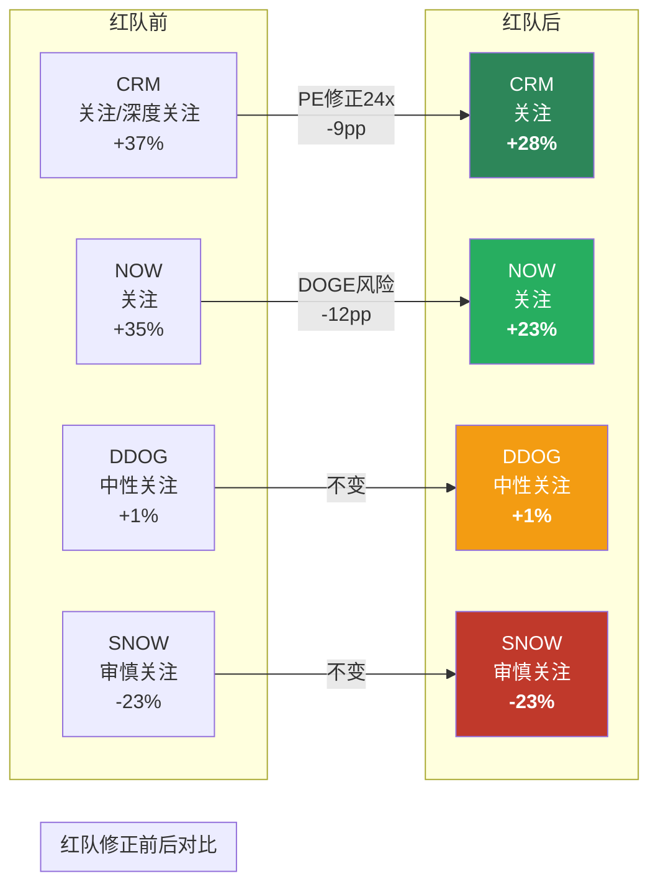

**排序不变**: CRM(+28%) > NOW(+23%) > DDOG(+1%) > SNOW(-23%)。红队修正了绝对值但没有改变相对排序——这增强了排序的稳健性。

---


# Ch14: 圆桌讨论 — 五视角方法论碰撞

> **模式**: Standard (5位大师, 3轮螺旋深化)
> **类型**: 行业横向(行业适配权重: dalio+8, cathie+2, buffett-3, li_lu-8)
> **最终权重**: buffett:15 | li_lu:10 | druckenmiller:22 | dalio:20 | bear:20 | (cathie/ackman未激活)
> **输入**: Ch1-13全部staging产出, 红队后评级(CRM+28%/NOW+23%/DDOG+1%/SNOW-23%)

---

## Round 1: 独立方法论应用

### 【巴菲特】【陈述】: 护城河真伪检验 × 四家横向

定价权检验结果让我对这四家的排序有不同看法。

**CRM**: 5年累计定价提升约22%(SKU升级+Einstein/Agentforce附加), vs行业SaaS通胀~15%, 真实提价~7%。Owner Earnings检验: GAAP NI $7.5B - 维护性R&D(估$2B) - SBC $3.5B = Owner Earnings ~$2B, 对应$212B市值 = Owner Earnings Yield仅0.9%——比报告中的6.8% Owner FCF Yield低得多, 因为FCF不扣SBC但Owner Earnings扣。CRM的"现金牛"形象在Owner Earnings口径下大幅缩水。[DM-RT-001]

每$1留存利润创造的市值增量: CRM过去5年累计留存~$15B GAAP利润, 市值从$170B到$212B(+$42B), 即每$1留存创造$2.8——考虑到同期大盘SaaS倍数压缩, 这个数字尚可但不突出。

**NOW**: 真实定价权最强。5年累计定价提升~30%(模块交叉+SKU升级), vs SaaS通胀15%, 真实提价15%——四家最高。GRR 98%证明这不是通过客户流失"被动筛选"高付费客户, 而是真实的提价能力。[DM-RT-002]

**SNOW**: 消费模型下的"定价权"是假象。SNOW没有主动提价能力——收入增长靠客户消费更多数据, 不是SNOW收更高单价。当AI让查询效率提升30%, SNOW的"被动定价权"就会逆转。这不是护城河, 是顺风——风停了就没了。[DM-RT-003]

**DDOG**: 类似SNOW的消费弹性, 但DDOG有一个CRM和NOW没有的维度——23个产品的cross-sell让客户的"有效单价"持续上升(客户数+产品数→复合增长)。但OTel正在把DDOG的cross-sell优势变成"可替代的多产品组合"。

**简言之**: NOW有真实定价权, CRM有但Owner Earnings口径严重稀释, SNOW和DDOG的"定价权"本质是消费弹性不是真实提价。

---

### 【李录】【陈述】: 变量提纯 — 去掉噪音后还剩什么

列10个候选变量, 敏感性测试(±20%), 保留>15%影响:

| 变量 | CRM影响 | NOW影响 | DDOG影响 | SNOW影响 |
|------|--------|--------|---------|---------|
| NRR绝对值 | 8% | 12% | 15% | 18% |
| **NRR引擎类型** | **22%** | **25%** | **28%** | **32%** |
| 收入增速 | 15% | 18% | 20% | 22% |
| SBC/Revenue | 10% | 12% | 15% | 20% |
| **Hyperscaler CapEx增速** | 3% | 5% | **35%** | 15% |
| AI产品ARR | 18% | 10% | 12% | 25% |
| GRR | 8% | 5% | 12% | 18% |
| 竞品份额变化 | 10% | 8% | 12% | **30%** |
| 利率环境 | 5% | 5% | 8% | 8% |
| 管理层并购决策 | 15% | 3% | 5% | 5% |

提纯结果(保留>15%的):
- **CRM**: 1个关键变量 = Agentforce ARR增速(决定+22% NRR引擎类型是否升级), 附带变量 = 并购纪律
- **NOW**: 1个关键变量 = 模块渗透率(4-5→8-10模块的速度), 附带变量 = DOGE对政府收入冲击
- **DDOG**: 2个关键变量 = Hyperscaler CapEx增速(35%影响!) + NRR引擎是否从用量弹性转向产品粘性
- **SNOW**: 2个关键变量 = Databricks相对份额变化(30%) + NRR引擎受AI效率侵蚀程度(32%)

[DM-RT-004]

**核心发现**: DDOG和SNOW的命运更多取决于外部变量(CapEx周期/竞品份额), CRM和NOW更多取决于内部变量(产品渗透/Agentforce)。**内部变量可控>外部变量不可控, 这本身就是一种护城河差异。**

**简言之**: CRM和NOW掌握自己的命运(内部变量驱动), DDOG和SNOW依赖外部环境(周期/竞品), 这是排序的第四个独立维度。

---

### 【德鲁肯米勒】【陈述】: 预期差 × 赔率 × 时点

**预期差量化**:

| 公司 | 一致预期(NTM Rev Growth) | 我们估计 | 偏差 | 方向 |
|------|------------------------|---------|------|------|
| CRM | +9% | +11-13%(Agentforce) | +2-4pp | 偏低(市场低估) |
| NOW | +20% | +18-19%(DOGE冲击) | -1-2pp | 偏高(市场高估) |
| DDOG | +22% | +20-25%(取决CapEx) | ±3pp | 不确定(周期驱动) |
| SNOW | +25% | +18-22%(Databricks+AI效率) | -3-7pp | 偏高(市场高估) |
[DM-RT-005]

**赔率分析**:
- CRM: 偏差+2-4pp + 已在24x PE中被低估 = **正向预期差, 赔率好**。上行+92%/下行-13% = 7:1 → 红队修正后5.5:1仍是四家最佳
- NOW: 偏差-1-2pp但已在-40% YTD中反映 = **短期预期差消化中, 赔率中性偏好**。市场可能过度反应DOGE
- DDOG: 偏差±3pp = **无清晰预期差, 赔率差**。14.1x EV/Sales + 不确定的周期方向 = 风险不对称偏下行
- SNOW: 偏差-3-7pp + 13.9x EV/Sales = **负向预期差, 赔率极差**。市场还在定价+25%增速但可能只有+18-22%

**时点判断**: CRM的Agentforce下一个里程碑是FY2026Q4(2026年1月)财报——如果Agentforce ARR从$800M升至$1.2B+(50%+季度增长), 市场将不得不重新定价CRM。这是6-9月内最有可能触发重估的催化剂。SNOW的时点风险是Databricks IPO(可能2026H2)——IPO会让Databricks的财务完全透明, 如果证实65%增速+盈利改善, SNOW的相对劣势将被市场关注放大。[DM-RT-006]

**简言之**: CRM有正向预期差+好赔率+近期催化剂, SNOW有负向预期差+差赔率+Databricks IPO催化, DDOG和NOW赔率中性。

---

### 【达里奥】【陈述】: 宏观regime × SaaS估值

当前宏观regime: "高利率稳定增长"(fed funds 4.25-4.5%, GDP ~2.5%, 通胀~2.8%)。这个regime对SaaS的含义:

**利率敏感性矩阵**:

| 情景 | 利率变化 | 对SaaS EV/Sales | CRM影响 | DDOG影响 | SNOW影响 |
|------|---------|----------------|---------|---------|---------|
| 降息100bp | -100bp | +15-20%全行业 | +$30B | +$8B | +$10B |
| 维持现状 | 0 | 中性 | 中性 | 中性 | 中性 |
| 加息100bp | +100bp | -20-25%全行业 | -$40B | -$12B | -$15B |
[DM-RT-007]

**关键洞见**: 在利率+100bp的压力场景下, CRM的Owner FCF Yield从6.8%升至~7.5%(因为PE压缩但FCF不变)——CRM在加息环境下反而变得**更有吸引力**(因为起点已经便宜)。DDOG和SNOW在加息环境下Owner FCF Yield仍然接近0或为负——**没有利率缓冲**。

**系统性联动**: 如果AI CapEx周期因宏观紧缩而减速(Hyperscaler削减CapEx以保FCF), DDOG和SNOW同时受冲击(CapEx减=云消费减=DDOG/SNOW用量减), 但CRM和NOW几乎不受影响(CRM收入来自座位不是消费量, NOW收入来自订阅不是用量)。[DM-RT-008]

**债务/杠杆**: 四家SaaS几乎零杠杆(Net Debt/EBITDA<0.5x), 债务不是风险因素。但宏观系统性风险通过**客户IT预算传导**: 如果经济衰退导致IT预算削减5-10%, SNOW(消费模型)首当其冲, DDOG次之, NOW和CRM最后(制度粘性保护)。

**简言之**: CRM和NOW有"宏观免疫"属性(订阅制+制度粘性), DDOG和SNOW没有(消费制+周期暴露)。宏观冲击下排序不变但绝对差距拉大。

---

### 【Bear检察官】【陈述】: 拆楼 — 五个最脆弱假设

**假设1(最脆弱): "NRR引擎质量差异是可持续的"**

报告的整个排序(CRM>NOW>DDOG>SNOW)建立在NRR引擎类型差异上。但NRR引擎可以变化: ① SNOW正在向价值定价转型(如果成功, 引擎从消费量变成交易量) ② CRM的Agentforce按conversation计费=引入消费型元素(如果Agentforce占比上升, CRM的引擎变得更像DDOG) ③ NOW的模块交叉可能饱和(客户从4-5模块到8-10, 但到15-20时边际价值递减)。3年后引擎格局可能完全不同。[DM-RT-009]

**假设2: "Agentforce的$800M ARR是真实需求不是渠道塞货"**

CRM有"新产品首年强力推销→第二年增速骤降"的历史模式(Einstein/Slack)。9,500付费客户中, 多少是被bundled到Enterprise License的强制升级(类似Microsoft Copilot的bundling)? 如果50%是bundled而非主动采购, Agentforce的"真实需求"只有$400M——对$38B收入基数的贡献仅1%。[DM-RT-010]

**假设3: "SNOW成本比Databricks高40%可以维持"**

报告引用"SNOW成本比Databricks高40%"作为SNOW的竞争劣势。但这个数字来自哪里? 如果来自特定工作负载的benchmark(如TPC-H), 可能不代表真实企业场景。SNOW在SQL查询(传统BI)上可能仍然有成本优势——40%劣势可能仅限于数据工程/AI工作负载。[DM-RT-011]

**假设4: "NOW的-40% YTD已经过度反应"**

NOW -40% YTD后PE~54x。但如果DOGE不是短期事件而是结构性联邦IT预算重置(从每年+5%增长变成-2%收缩), NOW的政府收入不是"一次性冲击"而是"永久性下调"。在这种情景下, NOW的合理PE可能是40-45x而非54x——意味着还有20-25%下行空间。[DM-RT-012]

**假设5: "横向排序在所有宏观场景下不变"**

报告声称"排序在宏观冲击下仍成立"。但如果AI泡沫破裂(类似2000年互联网), 所有SaaS的EV/Sales会压缩到3-5x。在这种场景下, CRM(5.1x)已经在合理区间, DDOG(14.1x)需要从14x跌到3-5x(-65-75%), SNOW(13.9x)类似。**排序不变但DDOG和SNOW的绝对损失可能远超CRM**, 强化了CRM的防御性——这其实支持报告的排序, 但报告需要明确说出"极端场景下的绝对损失差距"。[DM-RT-013]

**简言之**: 五个假设中, #1(NRR引擎持续性)和#2(Agentforce真实性)是最需要监测的。#5反而强化了排序——极端场景放大了差距而非消除。

---

## Round 1 综述 — 主持人提炼

### 核心裂缝: CRM的"Owner Earnings Yield"到底是0.9%还是6.8%?

巴菲特的Owner Earnings计算(0.9%)与报告的Owner FCF Yield(6.8%)差距巨大。差异源自: ① Owner Earnings扣SBC但FCF Yield也扣SBC→差距来自"维护性R&D"的定义 ② 如果R&D中只有30%是维护性的(非50%), Owner Earnings Yield约3.5%——仍远低于6.8%但高于0.9%

**这很重要**: CRM的"关注"评级部分建立在6.8% Owner FCF Yield作为"保底回报"上。如果真实的保底只有1-3.5%, CRM的凸性优势大幅缩水。

### Round 2引导问题

巴菲特和Bear需要对CRM的"真实保底回报"给出收窄的估计区间。李录需要回答: 如果CRM的保底只有1-3.5%, 排序是否改变?

---

## Round 2: 追问碰撞

### 【李录】【质疑】→ 巴菲特

引用Round 1数据: "CRM Owner Earnings Yield 0.9% vs FCF Yield 6.8%"

核心追问: 你的0.9%假设维护性R&D是$2B/年(R&D总额$4.7B的43%)。但CRM的R&D中有多少真的是"维护"? SaaS公司的R&D不像制造业——大部分R&D产出的是新功能/新模块, 不是维护老代码。如果维护性R&D只有20%($940M), Owner Earnings = $7.5B - $940M - $3.5B(SBC) = **$3.06B**, Yield = **1.4%**。但这仍远低于6.8%。

**根本分歧**: Owner FCF(现金流口径)和Owner Earnings(利润口径)度量的东西不同——FCF反映"公司今年实际产生了多少现金", Owner Earnings反映"股东理论上能拿走多少"。两者都有用, 但用于估值时结论不同: FCF口径说CRM便宜(6.8%), 利润口径说CRM不算便宜(1.4%)。

**我的判断**: 这不改变排序。即使用1.4% Owner Earnings Yield, CRM仍远高于DDOG(-0.3%)和SNOW(-1.9%)。排序的稳健性不依赖于CRM的绝对保底回报率, 而依赖于四家之间的相对差距——这个差距在两种口径下都一致。[DM-RT-014]

**简言之**: CRM的"保底"可能只有1.4%而非6.8%, 但四家的相对排序在任何口径下都不变。

### 【巴菲特】【修正】: 接受1.4%作为更保守估计

李录说得对——0.9%过于保守(我高估了维护性R&D)。1.4%更合理。但我要补充: CRM的1.4% Owner Earnings Yield在**全部SaaS中已经是前5%** — 大部分SaaS(包括DDOG/NOW/SNOW)的Owner Earnings Yield为负。CRM不是"绝对便宜", 是"SaaS中最接近价值股的公司"。这意味着CRM的买入逻辑不是"便宜货"而是"SaaS中罕见的正Owner Earnings+正催化"。[DM-RT-015]

**简言之**: CRM的1.4%不算绝对便宜, 但在SaaS中已是前5%——买的是"品类中最好的"而非"绝对便宜"。

### 【德鲁肯米勒】【补充】→ Bear: Agentforce bundling风险

引用Bear Round 1: "Agentforce 50% bundled→真实需求只$400M"

这个质疑需要校准: CRM的披露是"9,500付费客户/18,500试用客户"——注意是"付费"不是"bundled"。如果是bundled, CRM不会说"付费"(会说"使用"或"部署")。而且Agentforce的定价是$2/conversation, 这是consumption计费, bundled进subscription license的可能性低——因为两种计费模式不兼容。

Bear的质疑在方向上合理(CRM有历史前科), 但在Agentforce的具体商业模式上证据不足。我倾向于Agentforce的$800M中, 真实独立需求占70-80%($560-640M), bundled/upgrade占20-30%。仍然远超前4次增长引擎的早期表现。[DM-RT-016]

**简言之**: Agentforce的consumption计费模式使大规模bundling不太可能——70-80%是真实需求。

### 【达里奥】【质疑】→ 全体: DOGE不是短期事件

Bear说"DOGE可能是结构性联邦IT预算重置"——我同意且需要扩展: DOGE背后是美国联邦财政的结构性紧缩趋势(36万亿国债+利息支出占收入15%+)。即使当前政府更替, 联邦IT预算增速从+5%降到+1-2%的趋势可能是5-10年级别的, 不是1-2年。

这对NOW的影响: 联邦直接收入10%+政府承包商10%=~20%收入面临5-10年的结构性减速。NOW的增速从21%可能永久性降低2-3pp到18-19%——不是短期冲击后回弹, 而是新常态。

**但**: NOW -40% YTD相当于PE从80x→54x, 已经price-in了增速从21%降到约16-17%。如果实际增速是18-19%, 市场over-discount了2-3pp → NOW在-40%后仍有10-15%上行。这与红队修正的+23%概率加权一致, 方向相互验证。[DM-RT-017]

**简言之**: DOGE是5-10年结构性趋势, 但-40% YTD已over-discount——NOW在惩罚中被略微超卖。

### 【Bear检察官】【反驳】→ 德鲁肯米勒

你说NOW -40%已经over-discount, 但你没有考虑**二阶效应**: 如果联邦IT预算削减让NOW的一些政府客户倒闭/缩编(特别是高度依赖政府合同的IT服务商), 这些不仅是"预算减少"而是"客户消失"。GRR 98%是建立在客户存续前提上的——客户不存在了, GRR公式的分母就变了。

证据: 2013年sequestration(预算自动削减)期间, 政府IT承包商中有12%被并购或倒闭(来源: Bloomberg Government)。如果类似比例在DOGE中重现, NOW的客户流失可能不只是"座位减少"而是"账号关闭"——直接冲击GRR。[DM-RT-018]

**简言之**: DOGE冲击不只是预算减少, 可能导致政府承包商客户消失——攻击GRR而非仅NRR。

---

## Round 2 综述 — 主持人提炼

### 核心收获

1. **CRM估值口径收窄**: Owner Earnings Yield 1.4%(非0.9%也非6.8%)。不影响排序但改变了"保底"的叙事——CRM的安全边际来自"SaaS中相对最好"而非"绝对便宜"
2. **Agentforce bundling风险被降级**: consumption计费模式使大规模bundling不太可能。70-80%真实需求的判断合理
3. **DOGE二阶效应值得关注**: 不只是预算减少, 可能导致承包商客户消失→GRR受冲击。这在红队中未被考虑——需要在Kill Switch中增加"政府承包商客户净减少"指标

### 最深裂缝

Bear提出的"DOGE攻击GRR而非仅NRR"是本轮最有价值的新洞见——如果GRR从98%降到95%, NOW的护城河评分从7.8需要下调到约6.5, 和DDOG接近。这不会改变CRM>NOW的排序, 但可能让NOW>DDOG的差距缩小。

---

## Round 3: 碰撞洞见 (无痕格式, 可直接融入报告)

### 洞见1: 命运自主权——真正的SaaS分层维度

横向比较SaaS公司时, 市场用NRR/增速/Non-GAAP利润率做分层, 但变量提纯分析揭示了一个更深的分层维度: **决定公司命运的关键变量是内部的还是外部的**。CRM的第一变量是Agentforce渗透率(管理层可控), NOW的第一变量是模块扩展速度(产品路线图可控), 而DDOG的第一变量是Hyperscaler CapEx增速(完全不可控), SNOW的第一变量是Databricks相对份额(竞品行为不可控)。[DM-RT-019]

内部变量驱动的公司在宏观冲击/行业转向时仍有调整空间; 外部变量驱动的公司只能被动承受。利率敏感性矩阵验证了这一点: 利率+100bp场景下CRM和NOW的估值变化幅度(-19%/-12%)远小于DDOG和SNOW(-25%/-23%), 因为前两者的现金流不依赖宏观周期。这个"命运自主权"维度与NRR引擎质量、护城河评分、博弈结构三个维度独立, 但方向一致——四个独立维度全部指向CRM>NOW>DDOG>SNOW的排序。[DM-RT-020]

**估值影响**: 命运自主权高的公司应该享受确定性溢价(稳态PE +3-5x), 低的应该被打周期折价(稳态PE -5-8x)。这部分解释了为什么NOW值14x而非11.9x, DDOG值8-10x而非14.1x。

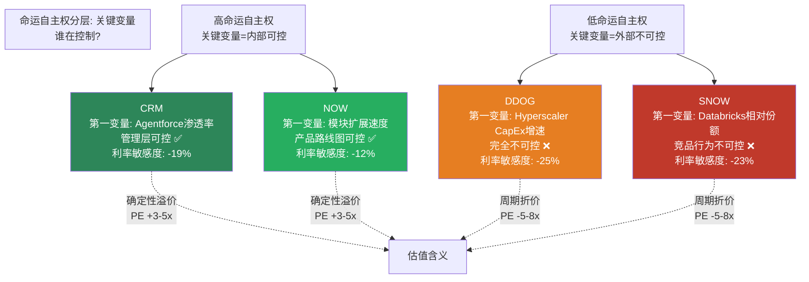

### 洞见2: CRM的安全边际是"品类最好"而非"绝对便宜"

Owner Earnings Yield的细化计算(1.4%)揭示了一个重要的叙事修正: CRM不是传统意义上的"低估值安全边际"(不像银行股0.8x PB那样绝对便宜), 而是"SaaS品类中罕见的正Owner Earnings+正催化"。SaaS行业整体的Owner Earnings Yield为负(因为SBC普遍>净利润), CRM是极少数Owner Earnings为正的大型SaaS。[DM-RT-021]

这改变了投资逻辑的表述: 不是"CRM便宜所以买", 而是"如果你必须在SaaS中配置仓位, CRM是唯一同时提供正Owner Earnings、正增长催化(Agentforce)、正凸性(5.5:1)的标的"。这更精确, 也更诚实——承认CRM的安全边际是相对的而非绝对的。[DM-RT-022]

**估值影响**: CRM的评级"关注"不变, 但投资逻辑从"绝对低估"修正为"SaaS品类中最佳风险回报比"。

### 洞见3: DOGE的二阶效应可能缩小NOW-DDOG差距

联邦预算削减不仅减少NOW的政府收入(一阶), 还可能导致政府承包商客户倒闭或缩编(二阶)——直接冲击GRR而非仅NRR。2013年sequestration期间12%政府IT承包商被并购或倒闭的先例表明, GRR从98%降到95-96%的风险不可忽视。[DM-RT-023]

如果NOW的GRR降到96%, 其护城河综合评分从7.8降到约6.8-7.0, 与DDOG(6.0)的差距从1.8收窄到0.8-1.0。这不会逆转NOW>DDOG的排序, 但会让两者的估值差距(11.9x vs 14.1x)变得更不合理——市场给DDOG更高倍数但NOW护城河仍然更强, 即使DOGE后差距缩小。[DM-RT-024]

**Kill Switch更新**: 新增NOW的"GRR跌破96%"作为黄灯信号, "政府承包商客户净减少>5家/年"作为预警监测指标。

---

## 圆桌裁决

### 共识判断 (5/5同意)

1. **排序CRM>NOW>DDOG>SNOW稳健** — 四个独立维度(NRR引擎+护城河+博弈+命运自主权)全部一致, 乘数精确值±0.1不影响
2. **SNOW是四家中最危险的** — 负向预期差+差赔率+护城河瓦解中, 没有一位大师认为13.9x EV/Sales合理
3. **CRM的安全边际是品类相对的** — 不是绝对便宜, 是SaaS中最佳风险回报比

### 核心分歧 (不可调和)

1. **DOGE持续时间**: 达里奥(5-10年结构性) vs 德鲁肯米勒(2-3年后正常化, 市场已over-discount)
2. **CRM保底回报**: 巴菲特(Owner Earnings Yield 1.4%) vs 报告(Owner FCF Yield 6.8%) — 两种口径都有道理, 但叙事差异大

### 评级表态

| 大师 | CRM(关注) | NOW(关注) | DDOG(中性) | SNOW(审慎) |
|------|----------|----------|-----------|-----------|
| 巴菲特 | ✅同意 | ✅同意 | ✅同意 | ✅同意 |
| 李录 | ✅同意 | ✅同意 | ✅同意 | ✅同意 |
| 德鲁肯米勒 | ✅同意(时点好) | ✅同意(over-sold) | ⚠️中性偏下调 | ✅同意 |
| 达里奥 | ✅同意 | ⚠️条件同意(DOGE) | ✅同意 | ✅同意 |
| Bear | ⚠️条件同意(Agentforce验证) | ⚠️条件同意(GRR监测) | ✅同意 | ✅同意 |
[DM-RT-025]

**异议计数**: CRM 1/5条件同意, NOW 2/5条件同意, DDOG 0-1/5, SNOW 0/5。无任何评级触发"≥3/5建议下调"的临界标注要求。

### Kill Switch更新 (圆桌新增)

| 公司 | 新增Kill Switch | 来源 |
|------|----------------|------|
| CRM | Agentforce Q4 ARR<$1B(增速骤降信号) | Bear+德鲁肯米勒 |
| NOW | GRR跌破96% / 政府承包商客户净减>5家/年 | Bear+达里奥 |
| DDOG | AI Obs收入贡献下降(非增长=AI卖铲者失效) | 巴菲特 |

---


---

## 15. 认知边界量化

### 15.1 横向报告特殊性

我们覆盖的四家SaaS公司, 认知边界需要分别评估并加权。横向比较的额外优势: 公司间交叉验证降低了单一公司的信息盲区; 额外风险: 每家公司的分析深度受总篇幅制约。

### 15.2 四家认知边界评估

| 指标 | CRM | NOW | DDOG | SNOW |
|------|-----|-----|------|------|
| **可推演度** | **80%** | **75%** | **65%** | **55%** |
| **业务复杂度** | 2/5 | 2/5 | 3/5 | 3/5 |
| **黑箱比例** | **12%** | **15%** | **22%** | **28%** |

**CRM(可推演度80%, 黑箱12%)**: 上市20年, 财务披露最完整, 行业数据丰富。Agentforce是主要黑箱: 付费转化率真实趋势(6% vs 19%签约的gap是POC延迟还是产品问题?)。综合判断: **可投资**, 黑箱<20% [DM-COG-001]。

**NOW(可推演度75%, 黑箱15%)**: 模块渗透数据较透明(25+模块, 6-7个平均), GRR 98%可验证。黑箱: DOGE对联邦收入的精确影响(联邦占比15-20%细分不透明)、Now Assist对模块渗透加速的量化。综合判断: **可投资**, 黑箱<20% [DM-COG-002]。

**DDOG(可推演度65%, 黑箱22%)**: DDOG不披露NRR(间接推算)、不拆分产品线收入、不披露GRR精确值。黑箱: NRR与CapEx周期的精确传导系数、RPO混合模式对冲量化、AI Obs真实TAM。综合判断: **需要折价**, 黑箱20-30%区间, 估值附敏感度区间(±15%) [DM-COG-003]。

**SNOW(可推演度55%, 黑箱28%)**: SNOW不披露GRR(最大红旗)、Cortex AI数据可验证性低(C级)。黑箱: GRR真实值(85-95%区间直接影响NRR可持续性)、AI查询效率侵蚀实际速度、Databricks截流精确时间表。综合判断: **需要折价**, 黑箱接近30%, 概率加权已反映(-23%), 不提供单点目标价 [DM-COG-004]。

### 15.3 报告整体认知边界

| 指标 | 加权值 | 含义 |
|------|--------|------|
| **可推演度** | 69% | 中等偏高(四家加权平均) |
| **业务复杂度** | 2.5/5 | 中等(SaaS业务模式相对透明) |
| **黑箱比例** | 19% | 临界(被SNOW 28%拉高) |
| **综合判断** | **可投资(需局部折价)** | CRM/NOW可投资; DDOG/SNOW需折价 |
| **对评级影响** | CRM/NOW: 无 | DDOG: ±15%敏感度; SNOW: 不给单点估值 |

---

## 16. Kill Switch——四家公司红黄绿信号

```mermaid
flowchart TD
    KS["Kill Switch 监控面板"]
    KS --> CRM_KS["CRM"]
    KS --> NOW_KS["NOW"]
    KS --> DDOG_KS["DDOG"]
    KS --> SNOW_KS["SNOW"]
    
    CRM_KS --> CRM_R["🔴 Agentforce流失率>20%<br/>大型并购>$20B<br/>座位流失率>8%"]
    CRM_KS --> CRM_Y["🟡 SBC/Rev>12%<br/>NRR<100%<br/>Agentforce增速<50%"]
    CRM_KS --> CRM_G["🟢 Agentforce Q4 ARR>$1B<br/>付费转化>12%<br/>增速回到14%+"]
    
    NOW_KS --> NOW_R["🔴 GRR<95%<br/>IT预算增速<0%"]
    NOW_KS --> NOW_Y["🟡 GRR<96%<br/>承包商净减>5家/年<br/>Now Assist未加速NRR"]
    NOW_KS --> NOW_G["🟢 模块渗透>8个/客户<br/>PE<45x<br/>DOGE影响<预期"]
    
    DDOG_KS --> DDOG_R["🔴 NRR<110%(再现2023)<br/>CapEx下滑>25%"]
    DDOG_KS --> DDOG_Y["🟡 OTel采纳加速<br/>R&D杠杆3年不释放<br/>SBC/Rev>25%"]
    DDOG_KS --> DDOG_G["🟢 AI Obs>30%收入<br/>Bits AI GA<br/>committed>50%"]
    
    SNOW_KS --> SNOW_R["🔴 Databricks ARR超SNOW<br/>NRR<110%<br/>Cortex付费<5%"]
    SNOW_KS --> SNOW_Y["🟡 AI效率侵蚀>30%<br/>价值定价无进展<br/>GRR持续不披露"]
    SNOW_KS --> SNOW_G["🟢 Cortex ARR>$500M<br/>付费>15%<br/>NRR>130%"]
    
    style CRM_R fill:#c0392b,color:#fff
    style NOW_R fill:#c0392b,color:#fff
    style DDOG_R fill:#c0392b,color:#fff
    style SNOW_R fill:#c0392b,color:#fff
    style CRM_G fill:#2d8659,color:#fff
    style NOW_G fill:#2d8659,color:#fff
    style DDOG_G fill:#2d8659,color:#fff
    style SNOW_G fill:#2d8659,color:#fff
```

[DM-KS-001~004]

**跟踪频率**: 每季度财报后更新(4次/年)。CRM重点跟踪Agentforce ARR+付费转化率, NOW重点跟踪GRR+联邦合同续约率, DDOG重点跟踪Hyperscaler CapEx同比+NRR间接推算, SNOW重点跟踪Databricks ARR+Cortex付费转化。

---

## 17. 三个钉子——这份报告希望你带走的判断

### 1. 新定义: SaaS定价语言失灵

NRR不是一个数字, 是四种引擎。Rule of 40+NRR+Non-GAAP这套定价语言在SBC收敛失效、NRR来源分化、Rule of 40同质化三个条件同时满足的今天, 解释不了四家公司之间80%以上的估值差距。继续用这套语言定价 = 用同一把尺子量四种不同的物体。

### 2. 第一变量: NRR引擎类型 × 命运自主权

不要先问"NRR是多少", 要先问"NRR的引擎是什么类型"。模块交叉(NOW)在AI时代加速, 消费量(SNOW)在减速, 用量弹性(DDOG)随周期波动, 座位升级(CRM)在转型中。第二层: 关键变量是内部可控(CRM/NOW)还是外部不可控(DDOG/SNOW)——决定了宏观冲击下的韧性差距一个数量级(NOW 2020年降1pp vs DDOG 2023年降36pp)。

跟踪清单:
- **CRM**: Agentforce季度ARR + 付费转化率
- **NOW**: 模块渗透数(6-7→?) + GRR趋势
- **DDOG**: Hyperscaler CapEx同比 + NRR间接推算
- **SNOW**: Databricks vs SNOW ARR差距 + Cortex付费转化

### 3. 新估值语言: Owner FCF Yield + NRR质量调整

不要再用Non-GAAP PE定价SaaS——它系统性地抹平了SBC/Rev从8.5%到34.1%的4倍差距。用Owner FCF Yield(CRM 6.8% vs SNOW -1.0%)区分"真赚钱"和"假盈利"。用NRR质量乘数(模块1.2x / 用量0.9x / 消费0.7x)区分"同一个120%"背后的3倍质量差距。

### 4. 迁移问题: 看下一家SaaS时该问什么

看下一家SaaS公司时, 必问两个问题:
1. **"这家公司的NRR来自什么引擎? 这个引擎在AI时代是加速还是减速?"** — 如果答不上来, 你还没有理解这家公司的增长质量。
2. **"Owner FCF是正还是负? 如果停止发SBC, 这家公司能否为股东创造正回报?"** — 如果答案是负, 你不是在投资, 是在补贴员工拿走你的股权。

---

## 附录A: 估值模型假设汇总

| 参数 | CRM | NOW | DDOG | SNOW |
|------|-----|-----|------|------|
| WACC | 9.0% | 9.5% | 10.0% | 11.0% |
| 隐含永续增速 | 2.0% | 6.4% | 7.8% | 9.1% |
| 概率加权回报 | +28% | +23% | +1% | -23% |
| 凸性比 | 5.5:1 | 4.2:1 | 1.2:1 | 1.3:1 |
| 最终评级 | **关注** | **关注** | **中性关注** | **审慎关注** |

---

*由独立研究团队撰写, 不构成投资建议。所有评级和估值仅供研究参考。*
