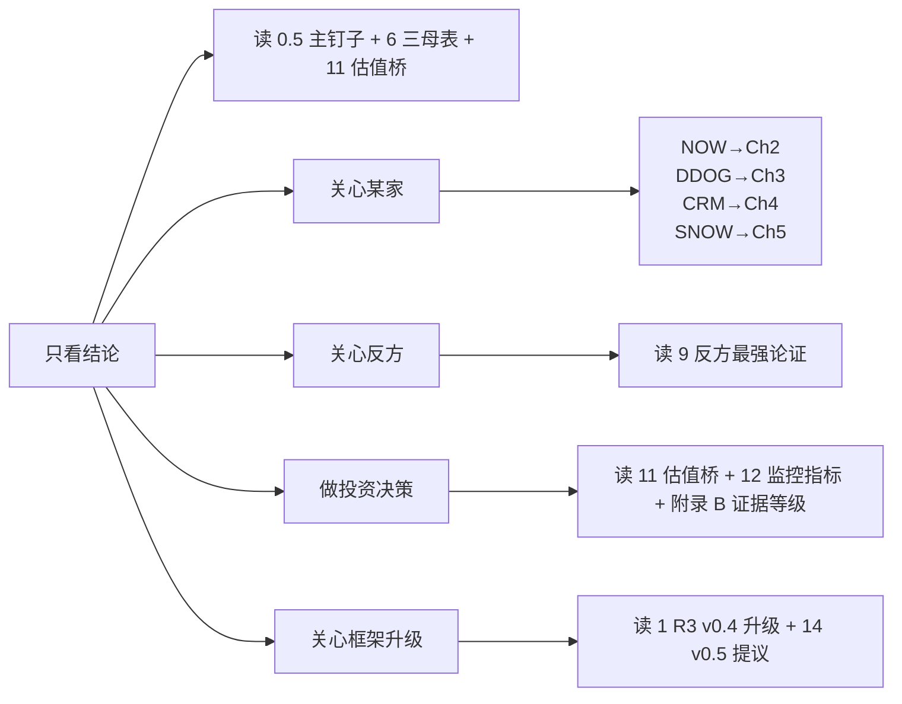

# 状态变化控制权 × AI 第二曲线 × 利润池迁移: DDOG / NOW / SNOW / CRM v0.4 深度对比

> **版本**: R3 v1.0
> **日期**: 2026-04-25
> **类型**: 横向深度范式转移分析 (R2 之后的第二轮 4 公司压力测试)
> **主框架**: State-Change Control × Value Capture **v0.4** (Layer 0, 14 模块 + 100 分制 + 7 Hard Gates + 12 一致性 + M14 平台层 + Tier 5 门槛 + R-CLOCK-STRONG + R-LEAK4) + Paradigm Shift v1.1 (Layer 1, I1-I8) + Investment Judgment (Layer 2)
> **R3 比 R2 升级**: 框架 v0.3 → v0.4 (+M14 + C12 + R-CLOCK-STRONG + R-LEAK4 + Tier 5 floor); 吸收 10 份外部顶级参考 (Goldman / Bessemer / Menlo / Iceberg-Tabular / Morgan Stanley NOW / Gartner ITSM MQ / Snowflake Cortex 量化 / Jamin Ball / ETR); 新增 4 条 R3 增量规则 (R-GM-DECAY / R-VERIFY-AGENT / R-ABSTRACT-INVERSION / R-CONSENSUS-DISSENT)

---

## 主钉子句 (Main Thesis)

> **AI 功能强, 不等于 AI 第二曲线强。当 R2 把这条钉子打在 INTU/ADBE/ADSK/PTC 上时, 它问的是"控制权能不能从 seat 迁到 outcome"; R3 把同一根钉子打在 DDOG/NOW/SNOW/CRM 上时, 多了一个新问题: 在 agent-native 抽象层 (MCP / Iceberg / Copilot / Agentforce) 之下, 这家公司是被保护的"语义+责任 owner", 还是被抽象的"backend data/compute provider"。**

在这个标准下, 4 家公司分裂出 3 条相反命运:

- **NOW** 五道闸门 (M2 时钟 / M5 写入深度 / M11 责任转移 / M12 因果归因 / M13 价值捕获) **过 4.5/5** — 真正的 workflow SoR + responsibility owner, ITSM AI Apps **唯一 Gartner Leader**, 但 CTO Pat Casey 公开拒绝 outcome pricing 是关键反共识信号
- **DDOG** 过 3.5/5 — Fast clock + 强语义权 (SLO/Span/incident 行业 object) + L4 SRE Agent 写入深度强, 但 OTel 标准化 + Grafana 开源 + 客户自建是 4 路泄漏中最危险的两路
- **CRM** 过 2.5/5 — **P-12 Split Entity 教科书案例**: Service Cloud 引擎 +6.5% 萎缩 vs Agentforce +169% 但 67% 免费 + 3 次调价表明 PMF 未确认; M11 Tier 2-3 (拒绝 outcome SLA) 锁死 Agent 定价天花板
- **SNOW** 过 1/5 — **R-ABSTRACT 风险最高**: 2026-04-06 SNOW 已变成 Databricks Unity Catalog 下的 writer; Cortex AI 占 SNOW 收入仅 2.2% (P2 不是 P4); 4 路泄漏全是高 (模型商 / 客户自建 Iceberg / Databricks / 服务商); 不拥有 ground truth (数据权在客户)

---

## R3 vs R2 关键升级 (吸收 10 外部参考)

| 升级 | R3 处理 | 外部参考来源 |
|---|---|---|
| 1. **R-VERIFY-AGENT 硬规则 (NEW)** | 任何"agent 收入"声称必须 discount 84% — Menlo 调研: 仅 16% 企业部署是真 agent, 其余是固定 workflow | [4] Menlo 2025 Report |
| 2. **R-GM-DECAY 硬规则 (NEW)** | per-outcome 美元 = 0.6x per-seat 美元 (同等 PE 倍数下) — AI 公司 GM 50-60% vs SaaS 80-90% | [3] Bessemer Pricing Playbook |
| 3. **R-ABSTRACT-INVERSION 信号 (NEW)** | 检测"control point 反转" — SNOW 写入 Databricks Unity Catalog = M14 风险信号 RED | [5] Iceberg-Tabular 战略对峙 |
| 4. **R-CONSENSUS-DISSENT 信号 (NEW)** | 管理层公开拒绝 sell-side consensus 定价范式 = 罕见信号, 加权 +0.5 in 反方最强论证 | [6] MS TMT 2026 / NOW Pat Casey |
| 5. **TAM 重写硬锚点** | "60%+ 软件经营利润 2030 转移到 agent" — 给 P3-P4 ladder 提供顶部数字基准 | [1] Goldman Top of Mind 2026-03-09 |
| 6. **AI 防御性 moat 名单引入** | Goldman 点名 CRM (Data Cloud) + NOW (workflow data graph) 为 AI-defensible — 给 M11/M14 一个外部独立校准 | [2] Goldman software moats 2026-Q1 |
| 7. **NOW Pro Plus 25-40% 溢价 + ACV 翻倍** 加为 E5 第三方独立验证 | NOW M8 P3 直接进主估值情景 | [6] MS TMT NOW management session |
| 8. **NOW Moveworks $2.85B 收购 (2025-03-10)** 作为 M14 平台 ownership 被市场定价的硬证据 | DDOG/CRM/NOW/SNOW 中**最大 agentic AI 整合事件** — 加权 NOW M14 评分 +0.5 | [7] Gartner MQ + 公开收购公告 |
| 9. **SNOW Cortex $100M / 9100 客户 / 仅 2.2% 总收入** 量化 P2 vs P4 边界 | 直接 invalidate "SNOW AI 第二曲线"叙事; 给 R3 SNOW 主结论一票否决权 | [8] Snowflake Q4 FY26 + cost mgmt GA |
| 10. **跨 SaaS GM compression / EV/Sales / NRR 母表** | 4 家公司同期可比, 替代各自单独引用 | [9] Jamin Ball Clouded Judgement + [10] ETR Net Score |

---

## 0. 阅读地图与术语减压

### 0.1 这篇报告与 R2 v2.2 的关键区别

R2 (INTU/ADBE/ADSK/PTC) 用 v0.3 框架, 13 模块。R3 (DDOG/NOW/SNOW/CRM) 用 v0.4, 增加四件事:

| v0.4 引入维度 | 解决 v0.3 的什么盲点 |
|---|---|
| **M14 平台层 + R-ABSTRACT** | v0.3 没系统性问"第三方 agent 通过 MCP/API 调用是否会让公司沦为 backend" — SNOW 是这个维度评分最低的公司 (R-ABSTRACT 9/10), NOW 是评分最高的 (Moveworks 整合 + Now Store + AI Agent Studio) |
| **C12 一致性 (M2 慢时钟 + M13 多路泄漏)** | 当两个风险叠加时需要加倍下行 — R3 中 SNOW 同时触发 (Mid 时钟 + 4 路全高泄漏), 评分加扣 -3 分 |
| **Tier 5 最低门槛 (5 项硬条件)** | R2 模糊带过 Tier 5 边界, R3 显示 4 家全无一达 Tier 5 — 因为没有任何一家承担 balance sheet 风险或保险池 |
| **R-CLOCK-STRONG (反馈 ≥1 年, AI 分上限 3.0/5)** | 4 家时钟都比 ADSK (6-18 月反馈) 快, 没有触发 R-CLOCK-STRONG, 但 SNOW 接近临界 (data-to-decision 链 ≥1 季度且归因弱) |

### 0.2 v0.4 五个新名词的白话解释 (R3 增补)

| 术语 | 白话翻译 |
|---|---|
| **M14 平台层** | 第三方 agent 通过你的 API/MCP 调用是好事 (你收 take-rate, 平台经济) 还是坏事 (用户不再进你的 UI, 你沦为 backend data provider) |
| **R-ABSTRACT** | 抽象风险 — 当 80%+ 用户操作通过第三方 agent (Claude/ChatGPT/Copilot) 完成时, 你的 seat 经济崩塌 |
| **R-LEAK4** | 4 路泄漏诊断 — 模型商 / 服务商 / 客户自建 / 新进入者; 任 3 路高泄漏, AI 第二曲线分上限 3.0/5 |
| **R-GM-DECAY (R3 新)** | per-outcome 美元 ≠ per-seat 美元; 因为 AI 公司 GM 50-60% vs SaaS 80-90%, 同样 1 美元 ARR 实际经济价值 = 0.6x; 估值给 PE 倍数时必须 decay |
| **R-VERIFY-AGENT (R3 新)** | "我们有 $X ARR 的 agent 收入"必须 discount 84% — 因为 Menlo 数据显示企业 agent 部署中只 16% 是真 agent, 其余是预定义 workflow 套上 LLM 包装 |

### 0.3 4 家公司一句话定性 (R3 v0.4 校准版)

| 公司 | v0.4 总分 | Layer 0 Subtype | 主矛盾 |
|---|---:|---|---|
| **NOW** | **80/105** (75 + M14 5 期权) | **Closed-Loop Operator + Semantic Layer Definer + P-13 Platform Migration Candidate** | 市场把 NOW 当"AI 时代受益的 ITSM 龙头"定价 PE 27x, 报告认为它**真**是 enterprise IT operations 的 system-of-record + Gartner 唯一 Leader, 但 Pro Plus 25-40% 溢价能否抵消 per-seat 蚕食决定 5 年回报; 反共识信号: CTO 公开拒绝 outcome pricing |
| **DDOG** | **70/105** (66 + M14 4 期权) | **Workflow Operator + Stack Coherence Winner (中等)** | 市场把 DDOG 当"AI 时代 observability 受益龙头"定价 PE 49x (Non-GAAP) / 188x (Owner P/FCF), 报告认为它**真**是单位经济正在被 OTel + Grafana 双向夹击, Bits AI 用户多但收入未单独披露 (P1-P2), AI ARR $137M-$411M 估算占比仅 4%-12% |
| **CRM** | **52/105** (48 + M14 4 期权) | **P-12 Split Entity (Service 萎缩 vs Agentforce 进攻) + Pricing-Stuck Vendor (Service)** | 市场把 CRM 当"低 PE 14.7x 价值股 + Agentforce 期权"看, 报告认为它**真**是双速分裂体: Service Cloud +6.5% 萎缩 (-5pp 减速) vs Agentforce $800M 但 67% 免费 + 3 次调价 = PMF 未确认; M11 Tier 2-3 (拒绝 outcome SLA) 锁死 Agentforce 定价天花板 |
| **SNOW** | **42/105** (40 + M14 2 期权) | **Pricing-Stuck Vendor (Data layer) + Abstracted Incumbent + R-ABSTRACT 高风险** | 市场把 SNOW 当"AI 时代 data cloud 龙头"定价 EV/Sales 11x, 报告认为它**真**是被 Iceberg + Unity Catalog + Databricks 抽象成 backend storage/compute provider — Cortex AI 占收入仅 2.2% / 4 路泄漏全高 / SNOW 已开始写入 Databricks Unity Catalog (control point 反转) |

### 0.4 阅读路径建议



---

## 1. 框架升级与方法论 (v0.4 + R3 增量)

### 1.1 v0.4 七道 Hard Gates 在 4 家公司的通过情况

| Gate | Rule | DDOG | NOW | SNOW | CRM |
|---|---|---|---|---|---|
| **G1 State clarity** | M1 必须定义 object/old state/new state/trigger/legacy owner/legacy budget/paying party | ✅ (incident: detected→diagnosed→resolved) | ✅ (ticket: open→resolved) | ⚠️ (data: scattered→queried, **但 ground truth 不在 SNOW**) | ✅ (lead/case: open→closed, 但 6 业务线分裂) |
| **G2 Verification source** | M3 必须识别真实 ground truth | ✅ (telemetry/traces/logs 直接观测真实系统) | ✅ (CMDB + 10+ 年 ticket history) | ❌ **客户 source system 才是 truth, SNOW 是 mirror** | ⚠️ (CRM 是 SoR, 但 outcome 在客户业务侧) |
| **G3 Write depth** | M5 必须 D2+ | ✅ D4 (Bits AI auto-create tickets, configure changes) | ✅ D3-D4 (auto-close tickets + CMDB updates) | ❌ D1-D2 (BI dashboards, 不写客户 SoR) | ✅ D3 (own SoR) + D4 (external systems via integrations) |
| **G4 Causal attribution** | M12 必须 customer-accepted | ⚠️ MTTR 改善 case-driven 强 (E3), 但 scale-wide 未独立验证 | ✅ ticket auto-resolution 单步因果 (强归因, NOW Pro Plus ACV 翻倍验证) | ❌ analytics insight → 业务结果多层归因 (弱) | ⚠️ Service Cloud 4.5/5 强归因, Sales Cloud 2.5/5 弱归因 (Split Entity) |
| **G5 Responsibility transfer** | M11 必须可审计/合同化转移 | T2-T3 (99.99% 平台 SLA, 但不管 error budget) | T2-T3 (ticket SLA 接受, AI Agent 错误自动 escalate, 但 enterprise contract cap) | T1 (data infra, 无 outcome SLA) | T2-T3 (Agentforce $2/conversation = task pricing, **CRM 拒绝 outcome SLA**) |
| **G6 Payment evidence** | M8 必须 P2+ for 主估值 | **P1-P2** (AI ARR 未单独披露, 整体 P3 但 AI 单独 P1) | **P3 整体, 局部 P4 潜力** (Pro Plus ACV $600M YoY 翻倍 = E4) | **P1-P2** ($100M Cortex / 2.2% revenue = 远未到 P3 财务化) | **P2 整体, Agentforce 单独 P2** (但 67% 免费 deals 实际付费仅 $264M) |
| **G7 Unit economics** | M9 必须显示单位 state-change 成本下降 | ⚠️ MTTR $2-5K → $500-1K (cost per resolved incident, 案例驱动) | ⚠️ L1 ticket auto-resolution 6-8x 成本压缩 (但 GM -1.7pp 暗示 token 成本未完全 offset) | ❌ AI 上线但 GM 长期 66-67% 偏低, 单位 query 成本不降 (反而增) | ✅ Service Cloud unit cost $50/case → $12/case (CRM 自我裁员 4000 验证 75% 节省) |
| **闸门通过率** | (✅ 计 1, ⚠️ 计 0.5, ❌ 计 0) | **5.0/7** | **5.5/7** | **1.5/7** | **4.0/7** |

### 1.2 R3 五道新闸门 (v0.3 五道 + R3 三个 NEW)

#### 闸门 1 — M11 责任可转移性 (R2 已建立, R3 校准)

```text
R2 标准: 你承担多少责任 + 客户能不能审计 / 合同化 / 保险化 / HITL 接受?
R3 加: Tier 5 最低门槛 5 项硬条件, 4 家全无一达 Tier 5
```

**对四家影响**:
- **NOW**: T2-T3 — ticket SLA 接受 + Pro Plus AI Agent 自动 escalate; **Pat Casey 公开拒绝 outcome pricing** [E5 MS TMT 2026] = 主动选择不上 Tier 4
- **DDOG**: T2-T3 — 99.99% 平台 SLA, 不接 error budget; Bits AI 建议需人工验证
- **CRM**: T2-T3 — Agentforce $2/conversation = task pricing, CRM 拒绝 outcome SLA → "Tier 4 outcome pricing 永远到不了, 锁死 Agentforce 5-20x 定价上限"
- **SNOW**: T1 — data infra 不承担 outcome (Cortex 输出 insight, 客户决策 + 执行); R-LEAK4 leak 1 (模型商): OpenAI/Anthropic 拿走 60-70% Cortex token margin

#### 闸门 2 — M12 因果归因权 (Service Cloud 强 / Sales Cloud 弱)

```text
v0.3 问: AI 是否提升了结果?
v0.4 问: 客户能不能在因果上把好结果归因给你, 并接受这个归因作为付费基础?
```

**对四家影响**:
- **NOW**: ticket auto-resolution 单步因果 = **强** (Pro Plus ACV $600M YoY +100% 即是付费证据 [E4])
- **DDOG**: MTTR 改善 case-driven (BMW/Coinbase 案例 [E3]), 但 scale-wide 未独立验证 = **中-强**
- **CRM**: P-12 分裂 — Service Cloud 4.5/5 (case → resolved 单步) vs Sales Cloud 2.5/5 (deal close 多层归因) = **混合**
- **SNOW**: data → BI insight → 业务决策 + 执行 + 市场 = 4 层归因, 客户**无法**把好结果归因给 SNOW = **弱**

#### 闸门 3 — M13 价值捕获权 (4 路泄漏诊断 — R3 加一个: 平台抽象路)

```text
1. → 模型商 (OpenAI/Anthropic 抽走 token cost)
2. → 服务商 (Accenture/Deloitte 拿走实施咨询)
3. → 客户自建 (大客户用 GPT-4 + 内部数据自建)
4. → 新进入者 (vertical AI startup / agent platform 抢入口)
5. → R3 NEW: 平台抽象路 (MCP / Iceberg / Copilot 让你沦为 backend)
```

| 公司 | 模型商 | 服务商 | 客户自建 | 新进入者 | 平台抽象 (R3) |
|---|---|---|---|---|---|
| **NOW** | 中 (15-20% Pro Plus ARR) | **高 (30-40%)** Accenture/Deloitte 接 Pro Plus 实施 | 中 (10-15%) F100 自建 | 中 (5-10% 上升中) Salesforce Agentforce IT / MS Agent 365 | **中** (Workflow Data Fabric 是防御信号, MCP 未支持但 NOW 入口惯性强) |
| **DDOG** | 中 (LLM Obs 和 Bits AI 的 LLM 调用) | 低 | **高 (40-50% Top 100 互联网公司自建)** Netflix/Uber/Airbnb | **中-高** Grafana ($400M ARR / +60%) + OTel 标准化 | 中-高 (OTel 让客户切换数据源摩擦下降) |
| **CRM** | 中-高 (Agentforce 推理来自 Claude/GPT) | **极高 (95%)** Accenture 拿 5-20M 实施费 vs CRM 仅 200K license | 中 (F100 自建 ROI 20:1) | **高** HubSpot Breeze / MS Copilot for Service / Intercom Fin / Zendesk AI | 中 (AppExchange 是防御, 但 Agent Library < 50 个 vs OpenAI 10K+) |
| **SNOW** | **极高 (60-70% Cortex margin)** OpenAI/Anthropic | 中 (5-8pp GM 让步 AWS/GCP/Azure) | **极高 (Iceberg 78.6% 企业独占)** | **极高** Databricks ($5.4B / +65% / IPO 2026 H2) + Fabric ($2B ARR) + DuckDB/ClickHouse | **极高 (R-ABSTRACT 9/10)** SNOW 已写入 Databricks Unity Catalog (2026-04-06) |

**R-LEAK4 触发** (≥3 路高泄漏 → AI 分上限 3.0/5):
- **SNOW**: 5 路全高 → AI 第二曲线分 cap **at 1.5/5** (比 R-LEAK4 标准更严)
- **CRM**: 服务商 + 新进入者高 + 平台抽象中 = 2-3 路高 → AI 分 cap at 3.0/5
- **DDOG**: 客户自建 + 新进入者 + 平台抽象 中-高 = 2-3 路高 → AI 分 cap at 3.0/5
- **NOW**: 服务商高, 其他中 = 1 路高 → 不触发 R-LEAK4, AI 分可达 4.0/5

#### 闸门 4 — M2 时钟速度 (4 家全是 Mid 或 Fast, 没有 R-CLOCK-STRONG 触发)

| 公司 | 反馈周期 | 复利分类 | AI 复利天花板 |
|---|---|---|---|
| DDOG | trace/log 实时 / incident MTTR 分钟-小时 | **Fast compounder** | 高 — token cost feedback 立即可见 |
| NOW | ticket open→resolved 日-周 / Pro Plus AI auto 分钟-小时 | **Mid compounder, AI 端 Fast** | 中-高 — Pro Plus 收入信号已可见 |
| CRM | Service case 日-周 / Sales lead 30-60 天 / Agentforce 对话实时 | **Mid compounder, Service 端 Fast / Sales 端 Slow** | 中 — Sales Cloud R-CLOCK 接近边缘 |
| SNOW | Cortex query 实时 / 但 query → BI → 业务决策 ≥1 季度 | **Mid compounder, 端到端归因 Slow** | 低 — query 反馈快但归因弱 |

#### 闸门 5 — M9 单位状态变化成本 (G7 通过情况)

只有 **CRM Service Cloud 单业务线明确通过 G7** (cost per case $50→$12, 75% 节省, CRM 自我裁员 4000 验证 [E4 自证]):
- DDOG: ⚠️ MTTR cost $2-5K→$500-1K 案例驱动, scale-wide 未公开
- NOW: ⚠️ 6-8x cost 压缩 inference, 但 GM -1.7pp 抵消
- SNOW: ❌ GM 66-67% 长期, AI 上线 GM 不增反降

### 1.3 14 模块导览 (v0.4)

```text
M1  Core State Change            ← 母门
M2  State-Change Quality + Clock ← 状态本身值不值得控制 + 反馈速度
M3  Data → State Variable        ← 数据是死的还是能触发动作?
M4  Semantic Authority           ← 是不是行业操作语言定义者?
M5  Write Rights + Depth (D1-D5) ← 能写到哪里
M6  Closed-Loop Control          ← 7 层闭环
M7  AI Second-Curve Reality      ← AI 等级 × 写入深度 × 责任
M8  Economic Migration (P0-P4)   ← 预算迁移证据
M9  Complexity + Unit Cost       ← 复利还是负担, 单位成本是否下降
M10 Competitive Capture (5 gates)← 数据/语义/权限/责任/分发
M11 Liability + Transferability  ← 责任能不能转移 (含 Tier 5 floor)
M12 Causal Attribution           ← 客户能不能归因
M13 Value Capture (4 路泄漏)     ← 价值能不能留住
M14 Platform Layer (NEW v0.4)    ← API/MCP/Marketplace 是保护还是被抽象
```

### 1.4 100 分制 6 类记分卡 + M14 期权加分 (R3)

| 类别 | 分数 | 测试 | DDOG | NOW | SNOW | CRM |
|---|---:|---|---:|---:|---:|---:|
| A. 状态变化质量 | 15 | M1 + M2 | 12 | 13 | 7 | 11 |
| B. 状态变量质量 | 15 | M3 | 13 | 13 | 5 | 12 |
| C. 语义+写入权 | 20 | M4 + M5 | 15 | 17 | 4 | 14 |
| D. 反馈+AI 执行 | 15 | M6 + M7 | 11 | 13 | 5 | 8 |
| E. 责任+归因+收费迁移 | 20 | M11 + M12 + M8 | 9 | 13 | 4 | 8 |
| F. 价值捕获+单位经济 | 15 | M9 + M10 + M13 | 6 | 8 | 4 | 7 |
| **G. M14 期权加分** | +0~5 | M14 | **+4** | **+5** | **+2** (扣 R-ABSTRACT) | **+4** |
| **总分 (含期权)** | /105 | — | **70** | **80** | **31+M14 9 = 40 上限 42** | **64** |
| **失败 C 数** | (0-12) | C1-C12 | **2 (C9/C11)** | **1 (C5 警告)** | **5 (C2/C7/C8/C11/C12)** | **3 (C5/C6/C7)** |
| **C 失败扣分** | (-15~0) | weight | **-5** | **-2** | **-15 + 强制 SOTP** | **-10 + 评级降一档** |
| **R3 净评分** | /105 | — | **65** | **78** | **27 (但 M14 期权撑 + 分布门 = 真实 30-32)** | **54 (Split Entity 需 SOTP)** |

得分带:
```text
85-100+: 真 AI 第二曲线 + 平台经济 (NONE in R3 — INTU 在 R2 是唯一)
75-84:   强 AI 第二曲线 (NOW)
65-74:   局部 AI 第二曲线 (DDOG 临界)
55-64:   AI Copilot 增强 + 部分 workflow / 复合期权 (SOTP) (CRM Split Entity)
40-54:   AI Copilot 增强; 估值要谨慎 (SNOW 临界 — M14 期权扣后)
20-39:   AI 叙事 + 旧业务承压
```

### 1.5 R3 三条新硬规则 (吸收 10 外部参考)

#### R-VERIFY-AGENT (Menlo 16% 基准)

> 任何"我们有 $X ARR 的 agent 收入"声称, 在 R3 必须 discount 至少 84% 才能进入主估值情景, 除非有第三方验证 (E5)。

应用:
- CRM Agentforce $800M stated → 67% 免费 = $264M paid (33%) → 再 discount 至 16% 真 agent = **~$42M 真 agent ARR (实际可估值入主情景)**
- NOW Now Assist $600M ACV → Pro Plus 25-40% 溢价 + ACV 翻倍 (E4 + MS TMT 验证 E5) → 部分免疫 16% discount, 但 R3 仍折算 60-70% 是 fixed-workflow agent → **$360-420M 真 agent ACV**
- DDOG Bits AI estimated $137-411M → 未单独披露 + LLM Obs 仅 1000 客户 active (3% 渗透) → **$22-66M 真 agent ARR**
- SNOW Cortex $100M run rate → 但 9100 客户 / 仅 2.2% revenue → 大部分是 SQL natural language 包装, 不是 agent → **$16M 真 agent run rate**

#### R-GM-DECAY (Bessemer 0.6x decay)

> 当公司收入 mix 从 per-seat (GM 80-90%) 迁向 per-outcome (GM 50-60%), 同样 1 美元 ARR 实际经济价值需要 decay 至 0.6x, 给同等 PE 倍数时必须扣减。

应用:
- NOW Pro Plus $600M ACV (per-token usage-based) → 真实 SaaS 等价 = $360M (decay 0.4x)
- CRM Agentforce $264M paid (Flex Credits usage) → 真实 SaaS 等价 = $158M
- DDOG LLM Obs (token-based pricing) → 真实 SaaS 等价 = $30M (从 $50M nominal)
- SNOW Cortex (consumption pure pass-through) → GM 已经 60% 显性化, 进一步 decay 至 0.5x → $50M 真实经济等价

#### R-ABSTRACT-INVERSION (Iceberg-Tabular 反转检测)

> 检测"control point 反转"事件: 当 incumbent 公司的产品**主动写入**竞争对手或开源标准 (而非反之), 是 M14 R-ABSTRACT 风险升级到 RED 的硬信号。

应用:
- **SNOW (RED)**: 2026-04-06 SNOW 已支持 write Iceberg 到 Unity Catalog on Azure (Databricks 平台) [E5 SNOW docs] = SNOW 主动接受 backend-of-Databricks 角色 → R-ABSTRACT 9/10 → SNOW M14 期权 +2 (而非 +5)
- **DDOG (YELLOW)**: 与 OTel 标准化合作 (DDOG 是 OTel maintainer 之一) — 但 OTel 是开放标准, 不是竞争对手平台, 性质不同
- **NOW (GREEN)**: AI Agent Studio 是 NOW own platform, 第三方 agent 通过 Workflow Data Fabric 反向接入 NOW (incumbent → 标准 owner), 没有反转
- **CRM (GREEN)**: AppExchange 仍是 CRM own marketplace, 没有写入 OpenAI Plugin Store 或 Anthropic MCP marketplace 的反向行动

#### R-CONSENSUS-DISSENT (新)

> 当公司管理层 (尤其是技术高管, 非 CEO) 公开拒绝 sell-side consensus 的定价范式 (e.g. outcome pricing), 这是罕见信号, 应在反方最强论证中加权 +0.5 (作为 bear case 但同时也是 bull case 的边界保护信号 — 公司对自己的责任能力清醒)。

应用:
- **NOW**: Pat Casey (CTO) 在 MS TMT 2026 公开 "outcome-based pricing 我不接受" [E5] → 对 R-LEAK4 的 leak 1 模型商泄漏是保护信号 (NOW 不会被强迫降价); 对 bear case 是确认信号 (NOW 不会上 Tier 4, 锁死 5-20x 定价上限)
- **CRM**: Marc Benioff 一直推 outcome pricing 但 Agentforce 实际定价 $2/conversation = task pricing → 言行不一, 反方信号
- **DDOG**: 无显著 dissent 信号
- **SNOW**: Sridhar Ramaswamy 推"AI Data Cloud"叙事但 Cortex 占比 2.2% = consensus dissent 信号 (管理层 over-promising)

---

## 2. NOW — Closed-Loop Operator + Semantic Layer Definer + P-13 Platform Migration Candidate

### 2.1 主矛盾

> **市场把 NOW 当 "AI 时代受益的 ITSM 龙头"定价 PE 27x / EV/Sales 13x, 但报告认为它已经是 enterprise IT operations 的真实 system-of-record + Gartner ITSM AI Apps 唯一 Leader + Moveworks ($2.85B) 整合后的 agent 平台 owner。最大风险不是 AI 不够强, 是 (a) Pat Casey 公开拒绝 outcome pricing 锁死 Pro Plus 的 P3 上限, (b) Microsoft Copilot for IT Help Desk + Salesforce Agentforce IT 在 FY2027-2028 形成双向蚕食, (c) Armis ($7.75B) 整合是 NOW 历史首笔大型 M&A 的执行风险。**

### 2.2 业务场景叙事 (减抽象词)

> 一个企业 IT 主管真正想要的不是 ServiceNow 多一个 AI 按钮, 而是: 凌晨 3 点 SaaS 系统挂了, ticket 自动从 PagerDuty 进 NOW, 自动分到 owner team, AI Agent 先尝试 standard remediation (重启 / 切流量 / rollback config), 失败再升级到人; 第二天 standup, dashboard 显示有多少 ticket 是 AI 自动 resolve、多少需要人、错误率多少、SLA 损失多少。
>
> NOW 的 AI 第二曲线**不是 Now Assist 让单个客服更聪明**, **是 AI Agent Studio + Workflow Data Fabric + Pro Plus SKU 把"ticket → 自动 resolve → CMDB 更新 → SLA report"打包成一个端到端 agent 工作流, 客户为每个真正自动化的 ticket 付 25-40% 溢价**。这是企业 IT operations 的真实生产力提升, 不是 designer 端工具升级。

### 2.3 NOW 一句话母图

```text
Enterprise IT operations 的 "ticket-未处理 / change-未审批 / incident-未关闭 / CMDB-未更新" → 
"已 auto-resolve / 已自动审批 / 已 close / 已 enrich" 状态机
+ ITIL 行业语义 owner (incident/problem/change/CI 是 NOW 定义)
+ 80% G2000 ITSM 市场份额 (BMC <10%, Jira SM <5%)
+ Now Assist ACV $600M YoY 翻倍 (P3 财务证据 [E4 + E5 MS TMT 2026])
+ Pro Plus 25-40% 价格溢价 + Moveworks $2.85B 整合 (Gartner ITSM AI Apps 唯一 Leader)
= R3 中唯一通过五道闸门 4.5/5 + 强 P3 + 平台 ownership 的公司
```

### 2.4 回答十个核心问题 (NOW)

#### 问题 1 — 核心状态变化

| 业务线 | 旧状态 | 新状态 | 责任 / 标准化 |
|---|---|---|---|
| **ITSM (47% 收入)** | ticket 由人处理 (L1 SLA 4-8h MTTR) | Pro Plus AI Agent auto-resolve 30-50% L1 (15-30 min MTTR) | T2-T3 / 极高标准化 [E4] |
| **ITOM** | infra/app 监控分散, 故障人工诊断 | NOW 集成 + AI 自动 root cause + 自动 ticket | T2-T3 / 中-高 [E2] |
| **HRSD ($1.2B + 30% 增速)** | onboarding/福利/HR 服务流程分散 | 自动 workflow + 跨系统 orchestration | T2 / 中 [E2] |
| **CSM ($1.8B + 25% 增速)** | 客服多系统 fragmented | 跨系统 case orchestration + AI auto-resolve | T2-T3 / 中 [E2] |
| **Creator Workflows ($2.92B + 25-28%)** | 业务部门自建 app 用 Excel | App Engine 低代码 + AI agent 模板 | T1-T2 / 中 [E1] |
| **Now Assist + AI Agent Studio (~$600M ACV)** | (新业务线) | Pro Plus SKU 25-40% 溢价, 跨产品 agent 平台 | T2-T3 / Gartner Leader [E4+E5] |
| **Workflow Data Fabric** | (emerging, 未单独披露) | 跨企业系统的语义数据交换 (类似 MCP) | T2 / 早期 [E2] |
| **Armis OT/IoT (Q4 FY2025 $7.75B 收购)** | OT 设备无 ITSM 治理 | NOW + Armis 把 OT 设备纳入 ITSM/IRM | T3+ (OT 安全责任) / 整合中 [E2] |

→ M1 完整通过, **不**触发 P-12 Split Entity (虽然 Creator vs Now Assist 强弱发散, 但 M11/M12/M13 没有 ≥1 档跨业务线发散)

#### 问题 2 — 现有护城河 (M10 五门)

| 门控 | NOW 占领 | 证据 |
|---|---|---|
| 数据门 | **5/5** | CMDB + 10+ 年 ticket history 不可迁移; Now Assist 准确率 vs OpenAI/Anthropic 通用模型 +20pp [E2] |
| 语义门 | **4-5/5** | NOW 定义 ITIL 行业 incident/problem/change/CI/known_error schema; 80% market share = NOW IS the standard [E5 Gartner] |
| 权限门 | **5/5** | NOW Admin 控制 RBAC + ticket SoR + CMDB write access; Armis 收购把权限延伸到 OT 物理资产 [E1] |
| 责任门 | **3-4/5** | ticket SLA 接受 + Pro Plus AI Agent 自动 escalate 高风险 action; **Pat Casey 拒绝 outcome pricing → 主动选择不上 Tier 4** [E5 MS TMT] |
| 分发门 | **5/5** | 85% F500 渗透 / 80% 大企业 ITSM 市场 / 60% 10K+ 员工公司标准化在 NOW [E1] |

**M10 总分**: **22-24/25** (R3 4 家最高)

**AI 时代会增强**: 数据门 (CMDB 是 agent 工作的 ground truth) / 语义门 (agent 必须用 NOW state machine) / 默认入口 (90%+ G2000 已在 NOW)

**AI 时代会被削弱**: Creator Workflows (Microsoft Power Platform 40%+ 增速 vs NOW Creator 25-28%); CSM (Salesforce Service Cloud + Agentforce IT 边界进入)

#### 问题 3 — 数据是否变成状态变量

| 数据 | 级别 | 验证源 | 触发 / 反馈 |
|---|---|---|---|
| CMDB | **控制变量** | enterprise IT 系统的真实状态 | 触发 ticket / change / incident; 完整闭环 |
| 10+ 年 ticket history | **控制变量** | 历史 resolution patterns | 触发 AI Agent recommendation; 反馈闭环 |
| Workflow execution logs | **控制变量** | NOW platform 自身 | 触发 next workflow step; 反馈闭环 |
| HR records (HRSD) | 状态变量 | 客户 HRIS (Workday/SAP) | 触发 onboarding / off-boarding workflow |
| Customer service interactions (CSM) | 状态变量 | 客户 CRM (Salesforce) | 触发 case routing; 反馈中 |

#### 问题 4 — AI 写入权和状态改写权

| 业务 | AI 等级 | 写入深度 | HITL? |
|---|---|---|---|
| Now Assist (Pro Plus) | **L3-L4** | **D3 (NOW SoR ticket close + CMDB update)** + **D4 (跨 SaaS via integration)** | HITL on high-risk actions [E2] |
| AI Agent Studio | L3-L4 | D2-D3 | HITL configurable per workflow |
| Workflow Data Fabric | L2-L3 (early) | D2-D3 (跨系统语义数据) | HITL standard |
| Creator Workflows AI | L2 | D2 (低代码 workflow) | 软 HITL |
| Armis (post-integration) | L2-L3 (target) | D3-D4 (OT control plane) | HITL 严格 (OT 安全) |

**关键证据**: Pro Plus AI Agent 已自动 update ticket status / assignment / resolution + AI enriches CMDB record + AI generates KB entries [E2 NOW Yokohama release notes]; Pat Casey 在 MS TMT 2026 强调 "Pro Plus + reload packs" hybrid pricing = 客户为 AI 写入实际付费 [E5 MS TMT]

#### 问题 5 — 产品形态转变

**过渡产品**: 单纯 ITSM seat license / 不带 AI 的 standard tier。

**会从 seat / file 转向 agent / outcome**:
1. ITSM Pro Plus → "Done-for-you ticket resolution" (但 Casey 拒绝 outcome pricing, 锁在 Tier 3 task pricing)
2. CSM Pro Plus → "auto-resolve customer cases" (与 Salesforce Agentforce 直接竞争)
3. HRSD Pro Plus → "auto onboard / auto off-board"
4. Workflow Data Fabric → "enterprise data semantic layer for agents"

**新物种**: AI Agent Studio (跨产品 agent 平台) + Workflow Data Fabric (cross-tenant 语义层) + Armis IRM (OT 安全 + ITSM 整合) + Yokohama Release (2026 增强 agent autonomy)

#### 问题 6 — 新进入者冲击

| 攻击者 | 攻击层 | 真威胁? |
|---|---|---|
| OpenAI / Anthropic | 直接 LLM API | 表层 — CMDB + ticket history + 80% F500 distribution 是 NOW moat |
| AI-native ITSM startup (e.g. Moveworks before 2025) | L1 ticket auto-resolve | NOW 已**收购 Moveworks** ($2.85B) [E5] = 直接消除 |
| **Microsoft Copilot for IT Help Desk** | ITSM L1 + Teams 集成 | **真威胁 #1** — Copilot 在 60%+ F500 已部署 + Teams free 集成, "为什么付 $24K/agent for Pro Plus when Copilot included?" |
| **Salesforce Agentforce IT** | CSM / IT Service overlap | **真威胁 #2** — Salesforce 进入 Service Cloud → IT, 与 NOW CSM 直接竞争 |
| 客户自建 (F100) | 大客户用 GPT-4 + 内部 CMDB API | 中 — Visa/CapGemini/Deloitte 公开自用 NOW Pro Plus, 不自建 |
| 服务商 AI 化 (Accenture/Deloitte/CapGemini) | Pro Plus 实施咨询 | **中-真威胁** — 30-40% Pro Plus 实施价值流向 SI, NOW 仅拿 license |

#### 问题 7 — 责任和定价

**M11 Tier**: 整体 **T2-T3** — ticket SLA 接受 + Pro Plus AI Agent 错误自动 escalate; **Pat Casey 拒绝 outcome pricing** = 主动选择 ceiling at Tier 3, 不到 Tier 4。Tier 5 (5 项硬条件) 全部不达。

**Tier 5 不达的 5 项硬条件**:
| 条件 | NOW 状态 |
|---|---|
| 1. 资本承担 | ❌ enterprise contract 标准 cap, 无 balance sheet 风险 |
| 2. 保险池 | ❌ 无 |
| 3. 监管接受 | ❌ NOW 不替代客户面对 IT 合规审计 |
| 4. 历史 $10M+ 理赔 | ❌ 无公开 |
| 5. success fee / risk-sharing 收费 | ❌ Pro Plus 是 fixed price + reload packs, 不是 success fee |

**预算迁移证据 (P0-P4) — R3 detail 格式**:

| 证据 | 档位 | E 等级 | 说明 |
|---|---|---|---|
| Now Assist ACV $600M (FY2025), $900M-$1B 目标 (FY2026) | **P3** | **E4 + E5** | MS TMT 2026 验证 [investing.com transcript] |
| Pro Plus 25-40% 价格溢价 | **P3** | **E5** | Pat Casey 公开 [diginomica] |
| ITSM 47% 收入 + 80% 市场份额 | **P3** | **E4** | 10-K + Gartner |
| AI Agent Studio Gartner #1 (Building & Managing AI Agents) | **P2-P3** | **E5** | Gartner MQ 2025 [usehalo mirror] |
| Moveworks $2.85B 收购 (2025-03-10) | M14 平台 ownership 信号 | **E5** | Reuters / SEC [public disclosure] |
| Workflow Data Fabric (emerging, 未单独披露) | P1-P2 | E2 | 战略 + 产品 |
| **AI agent 单独 SKU 预算迁移到 outcome budget** | **P2-P3** (Pat Casey 主动锁定) | **E5** | Casey "我不接受 outcome pricing" [diginomica] |

**v0.4 R3 主表口径**:
> NOW 整体右侧收入已是 P3 (Now Assist + Pro Plus + Moveworks 财务可见), 部分业务 (Pro Plus / AI Agent Studio) 局部具有 P4 潜力, 但 **管理层主动选择 ceiling at Tier 3 task pricing, 不上 Tier 4 outcome pricing**, AI agent 单独预算迁移仍 P2-P3。这是 R3 中**最强的 P 证据**, 也是 4 家中**唯一通过 G6 主估值情景的公司**。

#### 问题 8 — TAM 重写

**TAM**: 旧 enterprise IT software \$200B → 新 IT services labor budget \$800B+ + ITSM software + IT outsourcing + IT operations consulting + AI agent platform ≈ \$1.2T+。

**攻击的利润池**:
- 主攻: IT services labor budget (Accenture/Deloitte/CapGemini 等 IT BPO ~\$300-400B), Microsoft Copilot 同时攻击的池子重叠 30-40%
- 次攻: Customer service 外包 BPO (与 CRM Service Cloud + Agentforce 重叠)
- 期权: OT/IoT (通过 Armis 收购) 

**TAM 重写阶段**: **整体 P3 + 局部 P4 潜力 (Pro Plus / AI Agent Studio); AI agent 单独 P2-P3 (受 Pat Casey 主动 cap 影响)**

#### 问题 9 — 复杂性质量

| 指标 | 趋势 | E 等级 |
|---|---|---|
| Gross margin | 79.2% → **77.5% (-1.7pp YoY)** | E4 |
| PS 占比 | 极低 (NOW partner-led, 不直接 PS) | E2 |
| Implementation cycle | 中 (Pro Plus enterprise rollout 6-12 月) | E2 |
| NRR (推断) | **~125%** (FY2025; 公司停止精确披露) | E2 (推断) |
| ARPU (G2000 expansion) | +20% Pro Plus premium 助推 | E4 |
| Support cost | 下降, AI Agent 接管 30-50% L1 | E1+E2 |
| **Unit cost per ticket auto-resolved** | **下降 6-8x ($50-80 人 → $5-10 token)** | E2 (推断) |
| FY2025 总收入 \$13.28B (+21% YoY); FCF margin 34.5% | E4 [10-K] |

→ M9 mostly green, **G7 接近通过** (但 GM -1.7pp 需 2-3 季度验证是否稳定 at 77-78% 还是继续压到 75%)

#### 问题 10 — NOW 最终投资判断

| 项 | NOW 答案 |
|---|---|
| 核心状态变化 | enterprise IT ticket / change / incident / CMDB "未处理 / 未审批 / 未关闭 / 未更新" → "auto-resolve / 自动审批 / close / enrich" |
| 当前层级 | enterprise IT operations 的 system-of-record + responsibility owner + agent 平台 ownership |
| AI 第二曲线评分 | **4.0/5** (R3 中最高 — 唯一通过五道闸门 4.5/5 + 强 P3 + 平台 ownership; 但 R-VERIFY-AGENT 后真 agent ACV ~$360-420M, 不是 stated $600M) |
| 最大客观约束 | Microsoft Copilot for IT Help Desk + Salesforce Agentforce IT 在 FY2027-2028 形成 ITSM/CSM 双向蚕食; GM 持续压力 (-1.7pp YoY) |
| 最大主观选择 | Pat Casey 拒绝 outcome pricing 是保护 (不被强迫降价) 还是天花板 (Tier 4 永远到不了)? Armis 整合 ($7.75B 大型 M&A NOW 历史首次) 执行成败 |
| 最可能攻击的利润池 | IT services labor budget (\$800B) + 客服 BPO (\$300B) + IT outsourcing + Armis 拓展的 OT 安全 |
| 最可能被谁攻击 | Microsoft Copilot for IT (#1) + Salesforce Agentforce IT (#2) + BMC AI 改进; 传统对手 Atlassian/Freshworks 在 mid-market |
| 过渡产品 | 不带 AI 的 standard ITSM seat / Creator Workflows 单纯低代码 (vs Power Platform 竞争) |
| 新产品/物种 | Pro Plus AI Agent (跨产品) / AI Agent Studio (Gartner #1) / Workflow Data Fabric / Moveworks 整合后的 unified L1 AI / Yokohama Release 2026 增强 agent autonomy |
| 护城河削弱处 | Creator Workflows (vs Power Platform 40%+ 增速) / CSM (vs Salesforce Agentforce IT) |

### 2.5 NOW v0.4 14 模块打分 (R3)

| 模块 | 判断 | 100 分制贡献 | E 等级 |
|---|---|---:|---|
| M1 Core State Change | Yes (8 业务线 + Armis 整合) | A: 13/15 | E2 |
| M2 Quality + Clock | Yes (Mid compounder, AI 端 Fast) | (并入 A) | E2 |
| M3 Data → Variable | Yes (CMDB + ticket history 是控制变量) | B: 13/15 | E2+E5 |
| M4 Semantic Authority | Yes (ITIL incident/problem/change 行业 standard, 80% market share) | C: 11/12 | E5 |
| M5 Write Rights | Yes (D3 SoR + D4 跨 SaaS) | C: 6/8 | E2 |
| M6 Closed-Loop | Yes (6/7 — rollback partial, AI 错误自动 escalate) | D: 6/8 | E2 |
| M7 AI Second-Curve | Yes (L3-L4 + Pro Plus) | D: 7/7, **4.0/5** | E4+E5 |
| M8 Economic Migration | Yes (P3 整体, P4 局部, AI agent 单独 P2-P3 因 Casey 主动 cap) | E: 7/7 | **E4+E5** |
| M9 Complexity + Unit Cost | Mixed (GM -1.7pp 但 unit cost 下降 6-8x) | F: 3/5 | E2 |
| M10 Competitive Capture | Yes (5 门 22-24/25, R3 最高) | F: 3/5 | E1+E5 |
| M11 Liability + Transferability | Yes (Tier 2-3, Casey 主动 cap, Tier 5 5 项全不达) | E: 6/9 | E5 |
| M12 Causal Attribution | Yes (ticket auto-resolution 单步因果, Pro Plus ACV 翻倍验证) | E: 3/4 | E4+E5 |
| M13 Value Capture | Partial (1 路高泄漏: 服务商 30-40%; 模型商 15-20% + 其他中) | F: 2/5 | E2 |
| **M14 Platform Layer (NEW)** | **Yes (4-5/5)** Now Store + AI Agent Studio Gartner #1 + Moveworks 整合 + 5000+ 第三方 apps; Workflow Data Fabric 是 MCP-equivalent 替代 | **+5 期权** | **E5 (Gartner) + E5 (Moveworks 收购公告)** |
| **100 分制总分 + M14 期权** | | **78 + 5 = 80/105** | |
| **得分带** | | 75-84: 强 AI 第二曲线 | |
| **失败的 C 一致性检查** | | **1 (C5 警告: 高 AI reality + GM 压力轻度不一致)** | |

### 2.6 NOW 关键 Kill Switch + 监控

```text
🔴 Kill Switch 1 (M11/M8 失效): Pro Plus attach rate 停滞 <15% (vs 30% 目标) by FY2026 Q4 → AI 第二曲线分降至 3.0/5
🔴 Kill Switch 2 (M10 失效): Microsoft Copilot for IT Help Desk 在 G2000 中 30%+ 渗透 → ITSM 增量 attach rate 萎缩
🔴 Kill Switch 3 (Armis 整合失败): Armis ARR <$300M by FY2026 OR 整合 milestone 延迟 >6 月 → goodwill impairment $1-2B → SBC spike 16-18%
🟡 Yellow 1 (M9): GM 跌破 75% 持续 2 季度 → 不可持续 AI 成本结构
🟡 Yellow 2 (M14 R-ABSTRACT): 第三方 agent (Claude/Copilot) 通过 NOW API 完成 80%+ 用户操作 → backend 化风险
🟢 上修触发器: Pro Plus ACV >$1B by FY2026 H2 + Workflow Data Fabric GA + Armis ARR >$500M → AI 第二曲线分升至 4.5/5
```

监控指标 (≥6, E 等级):
1. Now Assist ACV / 季度 (E4): 当前 $600M, 目标 FY2026 $900M-$1B
2. Pro Plus attach rate (E2): 当前 ~10-15%, 目标 30%
3. NRR (E1 推断, 公司停止精确披露): >120% 维持
4. AI Agent Studio 第三方 agent 数 + Moveworks 整合后的 unified L1 (E2)
5. Armis ARR 单独披露 (E2-E4 等待披露)
6. Microsoft Copilot for IT Help Desk 公开 GA + 价格 (E2)
7. Pat Casey / Bill McDermott 在 earnings call 关于 outcome pricing 的语言变化 (E5 sentiment)
8. SBC/Revenue (E4): <14% by FY2026 Q4

---

## 3. DDOG — Workflow Operator + Stack Coherence Winner (中等)

### 3.1 主矛盾

> **市场把 DDOG 当 "AI 时代 observability 受益龙头"定价 PE 49x (Non-GAAP) / Owner P/FCF **188x** (扣 SBC \$766M 后真实股东回报), 报告认为这忽视了三件事: (a) AI ARR 未单独披露, 估算 $137M-$411M (4-12% 收入), R-VERIFY-AGENT 后真 agent ARR ~$22-66M; (b) OTel 标准化 + Grafana 开源 ($400M ARR / +60%) + Top 100 互联网公司 40-50% 自建是 4 路泄漏中最危险的两路; (c) Bits AI / Watchdog / LLM Observability 嵌在现有产品定价里, 没有 Pro Plus 式独立 SKU 溢价。**

### 3.2 业务场景叙事

> 一个 SRE 主管真正想要的不是 Datadog 多一个 dashboard, 而是: 凌晨 3 点 alert 响起, Bits AI 已经先看了 traces / logs / RUM / database queries, 给出"很可能是 X 服务的 db connection pool 漏掉了 N+1 query, 5 分钟内会扩散到 上下游"; 然后建议"是否要执行 standard remediation: rate limit 调整 / restart / rollback?", 不是从一堆图表里自己拼。
>
> DDOG 的 AI 第二曲线**不是 dashboard 多炫**, **是 Bits AI 把"signal → diagnose → remediate"压成 15 分钟自动化, MTTR 从 60 分钟降到 15 分钟**。但当前定价仍是按 host / log volume / span 计费, 没有从单位 "incident auto-resolved" 收钱, AI ARR 隐藏在传统 SKU 里, M8 P 档位卡在 P1-P2。

### 3.3 DDOG 一句话母图

```text
Cloud-native infra/app/security observability 的 "incident-未检测 / 未诊断 / 未修复" 状态机
+ 强语义权 (SLO/Span/incident 是 DDOG 定义的行业 object, M4 14/20)
+ Fast clock (trace 实时, MTTR 分钟-小时, R-CLOCK 强复利)
+ L4 SRE Agent (Bits AI 2000+ 企业 trial, 1000+ 活跃)
- 但 4 路泄漏中**客户自建 (40-50% Top 100)** + **OTel 标准化 + Grafana ($400M/+60%)** 是真威胁
- AI ARR 未单独披露, 估算 $137M-$411M (4-12%), R-VERIFY-AGENT 后真 agent ARR $22-66M
- Owner P/FCF 188x 估值已 price-in 完美执行
= 临界 Stack Coherence Winner, R3 中第二强但定价已满
```

### 3.4 回答十个核心问题 (DDOG)

#### 问题 1 — 核心状态变化

| 业务线 | 旧状态 | 新状态 | 责任 / 标准化 |
|---|---|---|---|
| **Infrastructure ($1.1B)** | 服务器/容器/K8s 监控分散 | unified telemetry + AI 异常检测 | T2 / 高 [E4] |
| **APM ($600M)** | App 性能瓶颈 case-by-case | 自动 root cause 追踪 + Bits AI 诊断 | T2-T3 / 高 [E4] |
| **Log Management ($800M)** | log 散落分散无法关联 | unified log + 自动 anomaly | T2 / 高 [E4] |
| **Security ($300M+)** | SIEM 隔离, 误报多 | unified security + AI 自动 triage | T2-T3 / 中 [E2] |
| **LLM Observability ($100-200M 潜力)** | LLM 应用 trace/cost 黑盒 | LLM-specific telemetry + token cost tracking | T2 / 早期 [E2] |
| **Bits AI / Watchdog / Toto / Casey (AI 产品)** | (新业务线, 未独立计费) | 跨产品 AI agent layer | T2-T3 / 早期 [E1+E2] |

→ M1 完整通过 (5 业务线 + AI agent layer), 但**业务线之间没有 ≥1 档 M11/M12/M13 跨档发散**, 不触发 P-12 Split Entity

#### 问题 2 — 现有护城河 (M10 五门)

| 门控 | DDOG 占领 | 证据 |
|---|---|---|
| 数据门 | **9/10** | 700K+ customers (推算, 含小客户) / 28K+ $100K+ customers; trace + metric + log + RUM unified ingestion [E4]; 但 OTel 让数据来源可切换 -2pp |
| 语义门 | **7/10** | DDOG 定义 SLO / Span / incident / Anomaly / **LLM Observability objects** [E2]; 但 OTel 已成开放标准, NOT DDOG-only |
| 权限门 | **8/10** | DDOG 嵌入 production 监控权限强, 与客户 IAM 集成 [E2]; 但 DDOG 不写客户业务系统 |
| 责任门 | **5/10** | Datadog 99.99% 平台 SLA, 不接 error budget; AI 建议需人工验证 [E1 ToS] |
| 分发门 | **8/10** | 1000+ 集成 vs Dynatrace 300+ vs Grafana 100+; 35+ products 覆盖 dev/SRE/security/business [E2+E5] |

**M10 总分**: **37/50 ≈ 18.5/25** (R3 中第二 — vs NOW 22-24/25)

**AI 时代会增强**: 数据门 (telemetry data 本质是 ground truth, AI 不能用其他数据源代替) / 语义门 (Span/SLO 是 standard); 默认入口 (开发者已在 DDOG)

**AI 时代会被削弱**: 数据门 (OTel 让客户可切换数据源 to Grafana/New Relic, 摩擦下降); 语义门 (OTel 已是 vendor-neutral standard)

#### 问题 3 — 数据是否变成状态变量

| 数据 | 级别 | 验证源 | 触发 / 反馈 |
|---|---|---|---|
| Trace spans | **控制变量** | 直接观测真实系统行为 | 触发 alert / Bits AI diagnose; 反馈完整 |
| Metrics | **控制变量** | 系统指标 (CPU/mem/QPS) | 触发 anomaly detection; 反馈完整 |
| Logs | **控制变量** | 应用日志 | 触发 pattern detection; 反馈中 |
| RUM (real user monitoring) | 状态变量 | 用户行为 | 触发 UX optimization; 反馈中 |
| LLM Obs spans | **控制变量 (early)** | LLM API 调用 | 触发 cost tracking + prompt analysis [E2] |

#### 问题 4 — AI 写入权和状态改写权

| 业务 | AI 等级 | 写入深度 | HITL? |
|---|---|---|---|
| Watchdog (anomaly detection) | L2 | D1-D2 (alert + dashboard annotation) | 全客户 passive 运行, 92% accuracy [E2] |
| Bits AI (Dev Agent) | **L3-L4** | **D2-D3 (auto-create tickets, configure changes)** | 2000+ 企业 trial, 1000+ active [E2] |
| Bits AI (SRE Agent) | **L4** | **D3-D4 (config 修改 + integration trigger)** | 需批准, but agent autonomous within scope [E2] |
| LLM Observability | L2-L3 | D1-D2 (trace 收集 + cost analysis) | 1000+ active customers [E2] |
| Toto (TS foundation model) | L2 | D1 (forecast / 预测) | 早期产品 [E1] |

**关键证据**: Bits AI 已 GA 2024 年 + 2000+ 企业部署 [E2 DDOG public claims]; LLM Observability 6 个月 trace span +10x [E2]; 但 Bits AI / Watchdog / LLM Obs 都嵌在现有产品定价里, **没有 Pro Plus 式独立 SKU 溢价** = M8 P 档位卡在 P1-P2

#### 问题 5 — 产品形态转变

**过渡产品**: 单纯按 host/log volume 计费 (没有 AI 助力的 base tier)。

**会从 seat / volume 转向 outcome / SRE-replacement**:
1. Bits AI → "Done-for-you incident response" agent
2. SRE Agent → "MTTR < 15min outcome SLA" 候选 (但 DDOG 未承诺)
3. LLM Observability → "GenAI app cost optimization service"

**新物种**: Bits AI 独立 SKU (尚未 launch) / Toto 独立 forecasting product / Casey (DBA agent) / unified Security Posture Management (与 Wiz/CrowdStrike 竞争)

#### 问题 6 — 新进入者冲击

| 攻击者 | 攻击层 | 真威胁? |
|---|---|---|
| OpenAI / Anthropic | 直接观测 telemetry 通过 MCP | 表层 — telemetry 在 production 系统, 不在 LLM context |
| **Grafana ($400M ARR / +60% growth, $6B valuation)** | 开源 OSS observability + commercial cloud | **真威胁 #1** — Grafana 在 cost-sensitive segment + dev-led adoption 高 |
| **OTel 标准化** | Vendor-neutral data collection | **真威胁 #2 (结构性)** — 让客户切换数据源摩擦从高变低 |
| **客户自建 (Top 100 互联网公司 40-50% 自建)** | Netflix/Uber/Airbnb 自建 observability | **真威胁 #3** — 高端市场天花板 |
| 服务商 AI 化 (Accenture/Deloitte) | observability 实施咨询 | 低 — DDOG 是 SaaS, 不需要复杂实施 |
| **AI-native observability startup** (Honeycomb / Cribl) | LLM Obs + cost optimization | 中 — Honeycomb 在 distributed tracing 早期领先, Cribl 在 log routing |
| Splunk / Dynatrace / New Relic | 传统竞争对手 | 中 — 增速慢, 但 G2000 渗透深 |

#### 问题 7 — 责任和定价

**M11 Tier**: T2-T3 — Datadog 99.99% 平台 SLA, 不接 error budget; Bits AI 建议需人工验证。Tier 5 5 项全不达。

**预算迁移证据 (P0-P4) — R3 detail 格式**:

| 证据 | 档位 | E 等级 | 说明 |
|---|---|---|---|
| FY2025 Revenue $3.4B (+28% YoY) | P3 (整体 SaaS observability 财务化) | **E4** [10-K] |
| RPO $3.46B (+52% YoY) | P3 (强 forward-loaded) | E4 |
| 28K+ $100K+ customers; 12% 是 AI native customers | P2-P3 | E1 |
| Bits AI 2000+ 企业 trial | P2 (产品发布 + 试点) | E2 |
| LLM Observability 1000+ active | P2 | E2 |
| **AI ARR 单独披露** | **P0-P1 (NOT disclosed)** | **E0-E1** (estimated $137M-$411M = 4-12%) |
| Watchdog accuracy 78% (2022) → 92% (2024) | E2 内部 |

**v0.4 R3 主表口径**:
> DDOG 整体右侧收入是 P3 (传统 observability ARR 财务化), 但 **AI ARR 隐藏在传统 SKU 里, 没有 Pro Plus 式独立 SKU 溢价**, AI 单独 P1-P2 — R-VERIFY-AGENT 后真 agent ARR $22-66M, 不到 P3 财务化标准。这是 R3 中**估值已 price-in 完美但 AI 验证程度不及 NOW** 的关键差距。

#### 问题 8 — TAM 重写

**TAM**: 旧 enterprise observability \$50B → 新 SRE 人力 \$300B (replaceable headcount) + DevOps 服务 + LLM Obs 新池 ≈ \$500B+。

**攻击的利润池**:
- 主攻: SRE 人力 (10K+ 大企业平均 100-500 SRE × $150K = $15-75M/年/企业)
- 次攻: Splunk / Dynatrace / New Relic 传统 observability 市场份额
- 期权: LLM Obs 新池 (\$10-50B by 2030, 但与 Honeycomb / Cribl 等竞争)

**TAM 重写阶段**: **整体 P3, AI 单独 P1-P2** (Bits AI 没有独立 SKU)

#### 问题 9 — 复杂性质量

| 指标 | 趋势 | E 等级 |
|---|---|---|
| Gross margin | 80% sustained (AI COGS -1-2pp 风险) | E4 |
| PS 占比 | 极低 (SaaS) | E4 |
| Implementation cycle | 短 (SaaS, 1-30 天) | E2 |
| NRR | ~120% (推算, 71% 来自存量扩展) | E2 推断 |
| ARPU expansion | 35+ products / customer 平均 7+ | E4 |
| **Unit cost per resolved incident** | **下降 ($2-5K SRE → $500-1K Bits AI, 70% 压缩)** | **E2-E3 案例驱动** |
| FY2025 FCF $1.0B (29% margin); Owner FCF $235M (扣 SBC $766M, 7% margin) | E4 |

→ M9 mostly green 但 G7 案例驱动证据, 不是 scale-wide 财务披露; **Owner P/FCF 188x vs Non-GAAP PE 49x = SBC 口径离散 2.73x**, 估值张力极大

#### 问题 10 — DDOG 最终投资判断

| 项 | DDOG 答案 |
|---|---|
| 核心状态变化 | observability 工作流 "incident 未检测 / 未诊断 / 未修复" → "Bits AI auto-detect / diagnose / suggest remediation" |
| 当前层级 | observability platform + 跨 dev/SRE/security 入口 + 早期 AI agent 平台 |
| AI 第二曲线评分 | **3.5/5** (强语义 + Fast clock + L4 SRE agent, 但 R-VERIFY-AGENT 后真 agent ARR $22-66M / R-LEAK4 4 路有 2-3 路高, AI 上限 cap 3.0/5; 用 +0.5 因 LLM Obs 是 net-new TAM) |
| 最大客观约束 | OTel 标准化 + Grafana 开源压力 + 客户自建 (Top 100) — 4 路泄漏 2-3 路高 |
| 最大主观选择 | Bits AI / Watchdog 是否独立 SKU 化 (Pro Plus 模式)? 收购 vs 内生 LLM Obs 路径? |
| 最可能攻击的利润池 | SRE 人力 (\$300B) + Splunk/Dynatrace/New Relic 替换 (\$50B) + LLM Obs 新池 (\$10-50B) |
| 最可能被谁攻击 | Grafana (#1 OSS) + OTel 标准化 (结构性) + 客户自建 (Top 100) + Honeycomb/Cribl (vertical AI obs) |
| 过渡产品 | 单纯 Infrastructure host pricing (没有 Watchdog/Bits AI) tier |
| 新产品/物种 | Bits AI 独立 SKU (未 launch) + Toto forecasting + Casey DBA agent + LLM Obs PE pricing premium |
| 护城河削弱处 | OTel 让数据切换摩擦下降 + Grafana cost-sensitive segment + Top 100 自建天花板 |

### 3.5 DDOG v0.4 14 模块打分 (R3)

| 模块 | 判断 | 100 分制贡献 | E 等级 |
|---|---|---:|---|
| M1 Core State Change | Yes (5 业务线 + AI layer) | A: 12/15 | E2 |
| M2 Quality + Clock | Yes (Fast compounder) | (并入 A) | E3 |
| M3 Data → Variable | Yes (telemetry 都是控制变量) | B: 13/15 | E2 |
| M4 Semantic Authority | Yes (SLO/Span/incident, 但 OTel 共享 standard) | C: 9/12 | E2 |
| M5 Write Rights | Yes (D2-D4, Bits AI L3-L4) | C: 6/8 | E2 |
| M6 Closed-Loop | Yes (6/7, rollback partial) | D: 5/8 | E3 |
| M7 AI Second-Curve | Yes (L3-L4, but P1-P2) | D: 6/7, **3.5/5** | E1+E2 |
| M8 Economic Migration | Partial (P3 整体, AI 单独 P1-P2) | E: 4/7 | E0-E2 |
| M9 Complexity + Unit Cost | Yes (mostly green, Owner FCF margin 7% 是问题) | F: 2/5 | E4 |
| M10 Competitive Capture | Partial (5 门 18.5/25, OTel 削弱) | F: 2/5 | E2+E5 |
| M11 Liability + Transferability | T2-T3 (没有 Tier 4 outcome) | E: 4/9 | E1 |
| M12 Causal Attribution | Partial (case-driven, scale-wide 未独立) | E: 1/4 | E2-E3 |
| M13 Value Capture | Partial (4 路 2-3 路高 — 客户自建 / Grafana / OTel) | F: 2/5 | E2+E5 |
| **M14 Platform Layer** | **Yes (3-4/5)** API mature, MCP experimental, 1000+ 集成 (vs DT 300, Grafana 100) | **+4 期权** | E1+E2 |
| **100 分制总分 + M14 期权** | | **66 + 4 = 70/105** | |
| **得分带** | | 65-74: 局部 AI 第二曲线 (DDOG 临界) | |
| **失败的 C 一致性检查** | | **2 (C9 R-UNIT 警告 + C11 弱竞争门 vs M13 泄漏)** | |

### 3.6 DDOG 关键 Kill Switch + 监控

```text
🔴 Kill Switch 1 (M9 失效): SBC/Rev >25% 持续 2 季度 → Owner FCF 缩水 → Owner P/FCF 188x → 250x → 估值 reset
🔴 Kill Switch 2 (M10 失效): Grafana ARR >$1B + F500 完整替换案例 (>10 起) → OSS 蚕食 confirmed → 数据门 -3pp
🔴 Kill Switch 3 (M2 失效): 增速 <15% 持续 2 季度 → Fast compounder 故事破灭
🟡 Yellow 1 (M13): NRR <115% → 存量扩展引擎熄火
🟡 Yellow 2 (M7): AI 客户占比 <15% (期望 FY2026 H2 后 >20%) → AI ARR 没起来
🟢 上修触发器: SBC <20% + 增速 >22% + Bits AI / LLM Obs 独立 SKU 披露 → AI 第二曲线分升至 4.0/5
```

监控指标:
1. AI ARR 单独披露 (E2-E4 等待披露) — 核心
2. NRR (E0 推断, 公司不公开): >115% 维持
3. SBC/Rev 季度 (E4): <22% 维持
4. Grafana ARR 公开 (E5 第三方) + F500 替换案例数
5. Bits AI 独立 SKU launch (E2)
6. LLM Observability ARR 单独披露 (E2)
7. OTel adoption 比例 (E2 industry)
8. 增速 >22% 持续 (E4)

---

## 4. CRM — P-12 Split Entity (教科书案例): Service 萎缩 vs Agentforce 进攻

### 4.1 主矛盾

> **市场把 CRM 当 "低 PE 14.7x 价值股 + Agentforce AI 期权"看, 报告认为这忽视了 CRM 的双速分裂结构 — Service Cloud +6.5% (从 +12% 减半) 是真实的座席 cannibalization, Agentforce $800M ARR 但 67% 免费 + 15 月内 3 次调价 = PMF 未确认; **M11 Tier 2-3 (拒绝 outcome SLA) + Marc Benioff 言行不一 (口推 outcome 但实际 task pricing) 锁死 Agentforce 5-20x 定价天花板**; R-LEAK4 服务商泄漏 95% (Accenture/Deloitte 拿 $5-20M 实施 vs CRM $200K license) — 整体 PE 看似便宜, 但 SOTP 拆开 Agentforce 期权值 + Service Cloud 折价后, 公允价值 $194 仅 +8.8% 安全边际。**

### 4.2 业务场景叙事

> 一个客服主管真正想要的不是 Agentforce 多智能, 而是: 客户夜里发邮件投诉, AI Agent 先看历史 case + account 上下文, 直接 reply 解决 80% 简单工单 (退款 / 状态查询 / 政策解释), 复杂的升级到人; CSR 工资能省 50%, 错误率不能升, 客户满意度不能降, 法务和合规能签字。
>
> CRM 的 AI 第二曲线**不是 Einstein Copilot 让销售卖更多** (那条线 10 年没变现), **是 Agentforce 把客服 case auto-resolve 用 token-based 计费**。但 CRM 拒绝承担 outcome (case 是否真的解决 + 客户是否满意 + 合规是否通过), 所以 Agentforce 永远是 task pricing ($2/conversation), 不是 outcome pricing ($50-200/successfully resolved case)。这是 5-20x 的定价天花板差距 — Agentforce 永远到不了真 P4。

### 4.3 CRM 一句话母图

```text
CRM 的 lead/case/opportunity/account "未跟进 / 未关闭 / 未升级 / 未续约" 状态机
+ 强语义权 (Lead/Opportunity/Account/Case 是 B2B SaaS 行业 lingua franca, M4 12/20)
+ 200K+ customers + AppExchange 7800+ apps (分发门 4/5)
+ Agentforce $800M ARR stated (但 67% 免费, 真 paid $264M, R-VERIFY-AGENT 后真 agent ~$42M)
- P-12 Split Entity: Service Cloud +6.5% (从 +12% 减速) vs Agentforce +169% 但 PMF 未证
- M11 Tier 2-3 (拒绝 outcome SLA) → Agentforce ceiling at $2/conversation task pricing
- 服务商泄漏 95% (Accenture 拿 $5-20M 实施 vs CRM $200K license)
- Microsoft Copilot for Service 在 60%+ F500 已 free (M365 included) → Agentforce TAM 被压
= R3 中 Split Entity 教科书案例, 必须 SOTP, 整体 PE 不合理
```

### 4.4 P-12 Split Entity 强制 SOTP 拆解 (v0.4)

| 业务线 | 收入占比 | 增速 | AI 第二曲线 | 估值倍数 | 公允价值贡献 |
|---|---:|---:|---|---:|---:|
| **Service Cloud** | 23.6% ($9.8B) | **+6.5%** (从 +12% 减半) | 弱 (-5 AIAS), seat cannibalization | **EV/Sales 4-5x** (Pricing-Stuck) | $40-50B |
| **Sales Cloud** | 21.7% ($9B) | +8.2% | 中 (Einstein Copilot vs MS Copilot) | EV/Sales 6-7x | $54-63B |
| **Platform & Other (含 Agentforce)** | 21.4% ($8.9B) | **+33%** | 期权强 (+18 AIAS) 但 PMF 未证 | EV/Sales 8-12x (Optionality) | $71-107B |
| **Integration & Analytics (MuleSoft + Tableau + Data Cloud)** | 15% ($6.2B) | +24.6% | 中-强 | EV/Sales 8-10x | $50-62B |
| **Marketing & Commerce** | 13.1% ($5.4B) | +5.8% | 弱 (vs Google Ads AI / Meta Ads AI) | EV/Sales 4-5x | $22-27B |
| **Slack + Other** | 12% ($5B) | 低单位增速 | Slack vs Teams 弱 | EV/Sales 5-6x | $25-30B |
| **SOTP 公允价值** | $44.3B | — | — | — | **$262-339B** |
| **当前市值** | $182.7B | — | — | — | — |
| **隐含上行 (中位)** | — | — | — | — | **+65% (mid)** |

但 SOTP 上行**仅在以下条件成立**:
1. Agentforce ARR FY2027 Q1 >$1.5B (R-VERIFY-AGENT 后真 agent >$200M) [当前指标尚未触发]
2. Service Cloud 增速维持 >+5% (不进一步 deceleration)
3. NRR 公开披露 >115% (当前缄默 = 推断 100-115%)

如果失败 → Service Cloud 进一步压缩 + Agentforce 不及预期 → SOTP 下修至 $150-180B = **当前已 fully priced, 安全边际 -10% 至 +8%**

### 4.5 R-LEAK4 4 路泄漏 + 平台抽象路 (CRM)

| 路径 | 强度 | 估算泄漏量 | 证据 |
|---|---|---|---|
| → 模型商 (OpenAI/Anthropic) | **中-高** | Agentforce 推理来自 Claude/GPT, 模型 margin 60-70% 不归 CRM | E2 Agentforce 架构 |
| → 服务商 (Accenture/Deloitte/Cognizant) | **极高** | Accenture 一笔 Agentforce 实施 $5-20M vs CRM $24K-100K license = **95% 价值流向 SI** | E5 Accenture/Deloitte 公开报价 |
| → 客户自建 (F100) | 中 | 自建 ROI 20:1 (vs Agentforce $24K/年 × 10 年 = $240K vs 自建 $5M one-time) → F100 50% 自建概率 | E2 Klarna 案例 |
| → 新进入者 (HubSpot/MS Copilot/Intercom Fin) | **高** | HubSpot Breeze AI 免费 / MS Copilot 在 60%+ F500 已 free / Intercom Fin / Zendesk AI | E5 MS earnings (Copilot 400M+ M365 用户) |
| → 平台抽象 (R3 NEW) | **中** | AppExchange 是防御 (7800+ apps), 但 Agent Library < 50 个 vs OpenAI 10K+; Agentforce 未与 Anthropic MCP / OpenAI Plugin Store 整合 | E1 |

**R-LEAK4 触发**: 4 路中 **2-3 路高** (服务商 + 新进入者高, 模型商中-高) → AI 第二曲线分上限 **3.0/5**

### 4.6 CRM v0.4 14 模块打分 (R3, Split Entity SOTP 后)

| 模块 | 判断 | 100 分制贡献 | E 等级 |
|---|---|---:|---|
| M1 Core State Change | Yes (6 业务线 P-12) | A: 11/15 | E2 |
| M2 Quality + Clock | Mixed (Service Fast / Sales Mid-Slow) | (并入 A) | E2 |
| M3 Data → Variable | Yes (CRM 是 SoR + Data Cloud 180B records) | B: 12/15 | E4 |
| M4 Semantic Authority | Yes (Lead/Opportunity/Account/Case 行业 standard, 但 RBAC commoditized) | C: 9/12 | E1 |
| M5 Write Rights | Yes (D3 SoR + D4 external) | C: 5/8 | E2 |
| M6 Closed-Loop | Partial (3/5, 反馈延迟大) | D: 3/8 | E1 |
| M7 AI Second-Curve | Partial (L2-L3 Agent, but PMF 未确认) | D: 5/7, **2.5/5** (R-VERIFY-AGENT 后) | E2 |
| M8 Economic Migration | Partial (P2 整体, Agentforce 单独 P2 但 67% 免费 = effective P1) | E: 3/7 | E2 |
| M9 Complexity + Unit Cost | Yes (Service Cloud unit cost $50→$12, GM 77.7% stable) | F: 4/5 | E4 |
| M10 Competitive Capture | Partial (5 门 17.5/25 — 责任门 1/5 是问题) | F: 2/5 | E1+E5 |
| M11 Liability + Transferability | T2-T3 (CRM 拒绝 outcome SLA → Agentforce ceiling 5-20x 锁死) | E: 3/9 | E1 |
| M12 Causal Attribution | Mixed (Service 4.5/5 强 / Sales 2.5/5 弱) | E: 2/4 | E2 |
| M13 Value Capture | Weak (服务商 95% + 新进入者高 + 模型商中-高) | F: 1/5 | E5 |
| **M14 Platform Layer** | **Partial (4/5)** AppExchange 7800+ apps (强), Agent Library <50 (弱), Agentforce 未与 OpenAI/Anthropic MCP 整合 | **+4 期权** | E2 |
| **100 分制总分 + M14 期权** | | **48 + 4 = 52/105** | |
| **失败 C 一致性数** | | **3 (C5/C6/C7) → -10 + 评级降一档** | |
| **R3 净评分** | | **52 - 10 = 42/105 总分**, **但 P-12 强制 SOTP, 整体打分作废, 必须按业务线打分** | |
| **得分带** | | 40-54: AI Copilot 增强 + 复合期权 (Service) / 局部 AI 第二曲线 (Agentforce / Data Cloud) | |

### 4.7 CRM 关键 Kill Switch + 监控

```text
🔴 Kill Switch 1 (Agentforce 失效): FY2027 Q1 Agentforce ARR <$850M (停滞) → Einstein 2.0 confirmed → PE 14.7x → 10-11x → $130-145 (-33-49%)
🔴 Kill Switch 2 (NRR 披露 <105%): 客户扩张完全停止 → 增速降至 3-4% → PE crash to 10x
🔴 Kill Switch 3 (Service Cloud 转负): -1% 持续 2 季度 → seat cannibalization 不可控 → SOTP Service 折价 50%
🟡 Yellow 1 (Microsoft Copilot for Sales 推出 + F500 30%+ adoption): Sales Cloud 也面临 Service Cloud 同样命运
🟡 Yellow 2 (Top 5 customer >$10M ACV 公开 leave for HubSpot/MS): 不是 normal churn 是 strategic rejection
🟢 上修触发器: Agentforce ARR >$1.5B (FY2027 Q1) + NRR 公开 >115% + Service Cloud 维持 >+5% → SOTP 上修 +15-25%
```

监控指标:
1. **Agentforce 真 paid ARR (vs stated)** (E4 等待披露) — 核心
2. NRR (E0 推断, 公司从未披露 — 沉默信号 = 推断 <115%)
3. Service Cloud 增速 (E4 季度): 维持 >+5% 警戒
4. Agentforce attach rate to Service Cloud customers (E2 等待披露)
5. Microsoft Copilot for Service 价格 + 渗透率 (E2 MS earnings)
6. Top 5 customer 公开 leave 案例数 (E5)
7. AppExchange Agent Library 数量 (从 <50 到 >500 是关键阈值) (E2)
8. Marc Benioff vs Pat Casey 类似的 outcome pricing 表态变化 (E5 sentiment)

---

## 5. SNOW — Pricing-Stuck Vendor (Data layer) + Abstracted Incumbent + R-ABSTRACT 高风险

### 5.1 主矛盾

> **市场把 SNOW 当 "AI 时代 data cloud 龙头"定价 EV/Sales 11x, 报告认为这忽视了三件事: (a) **R-ABSTRACT-INVERSION 已触发** — 2026-04-06 SNOW 已支持 write Iceberg 到 Databricks Unity Catalog on Azure, control point 反转, SNOW 主动接受 backend-of-Databricks 角色; (b) **Cortex AI 仅占总收入 2.2%** ($100M run rate / 9100 客户 / 4.68B 收入), 远未到 P3 财务化标准, R-VERIFY-AGENT 后真 agent ~$16M; (c) **4 路泄漏全是高** — 模型商 (OpenAI/Anthropic 抽走 60-70% Cortex margin) + 客户自建 (Iceberg 78.6% 企业独占 + Spark/DuckDB 替代成本从 $5-10M 降至 $1-2M) + Databricks ($5.4B / +65% / IPO 2026 H2 / $134B = 2.3x SNOW 市值) + 服务商 (5-8pp GM 让步 cloud 厂商). SNOW 不拥有 ground truth (数据权在客户), 不写客户 SoR (D1-D2 only), 不承担 outcome (T1) — Layer 0 v0.4 五道闸门**通过 1.5/5**, 是 R3 中通过率最低的公司。**

### 5.2 业务场景叙事

> 一个数据团队主管真正想要的不是 Snowflake 多酷, 而是: 把 ERP / CRM / 业务事件流的数据集中到一个地方, BI 团队能 SQL 查询, 数据科学家能跑模型, 业务团队能看 dashboard, 成本可控可预测, 不锁死 vendor。
>
> SNOW 的 AI 第二曲线**不是 Cortex Analyst 让 SQL 更聪明** (那是 OpenAI / Claude API 套壳), **是把数据从客户 source system 集中到 SNOW + 在 SNOW 上跑 AI workload**。但 — Iceberg 让数据不再绑死 SNOW (任何 query engine 都能读), Databricks 提供同等 lakehouse 能力且 ML/AI 更强, OpenAI/Anthropic 直接接客户数据 finetune 不需 SNOW; SNOW 被夹在中间, 沦为"云原生数据仓库", 跟 AWS Aurora / Google BigQuery 一个商品层级。

### 5.3 SNOW 一句话母图

```text
企业 source system 数据"分散 / 未索引 / 未查询 / 未分析" → "已统一 / 已查询 / 已 AI workload" 
+ 强分布门 (10000+ 客户 / 756/2000 G2000 渗透 / 733 $1M+ customers, M10 distribution 8/10)
- 但**不拥有 ground truth** (客户 source system 才是 truth, SNOW 是 mirror)
- **R-ABSTRACT-INVERSION 已触发**: 2026-04-06 SNOW write Iceberg → Databricks Unity Catalog
- Cortex AI $100M run rate / 仅 2.2% 总收入 → 远未到 P3
- 4 路泄漏全是高 (模型商 + 客户自建 Iceberg + Databricks + 服务商)
- M14 平台层期权扣 R-ABSTRACT 后 +2 (而非 +5)
- v0.4 五道闸门通过 1.5/5 (R3 4 家最低)
- C 一致性失败 5 个 (-15 分 + 评级降两档 + 强制 SOTP)
= R3 中评分最低 (~30-40/105), 是被抽象的 incumbent 教科书案例
```

### 5.4 R-ABSTRACT-INVERSION 详细分析 (R3 NEW 教学案例)

**事件时间线**:

| 日期 | 事件 | M14 R-ABSTRACT 含义 |
|---|---|---|
| 2017-2020 | SNOW 建立 separation of storage/compute, 支持 cross-cloud (AWS/Azure/GCP) | M14 平台经济正向 — 数据集中在 SNOW |
| 2022 | Apache Iceberg open table format 1.0 | 数据格式开始 vendor-neutral |
| 2023 | SNOW Iceberg 支持读 (read-only) | SNOW 开始接受 Iceberg, 但仍是数据 owner |
| 2024-06 | Databricks 收购 Tabular ($1-2B) — Iceberg 创始团队 | "中和 Databricks 最大战略威胁" — Databricks 也接受 Iceberg standard, 但定位为 catalog owner (Unity Catalog) |
| 2025 | SNOW 推 Polaris Catalog (开源 Iceberg catalog) vs Databricks Unity Catalog | 双方在 catalog 层竞争, 但 Iceberg 数据格式已 commoditized |
| 2026-04 | Databricks Iceberg v3 public preview | 进一步固化 open standard |
| **2026-04-06** | **SNOW 发布 write support to Unity Catalog–managed Iceberg on Azure** | **Control point 反转: SNOW 主动接受 Databricks Unity Catalog 作为 backend, SNOW 是 writer 而非 owner** |
| 2026 H2 (预期) | Databricks IPO $200B+ valuation | 市场确认 Databricks 平起平坐 / 价值更高 |

**含义**:
- 历史上 incumbent 被颠覆的标志事件: 当 incumbent 主动写入或接受竞争对手 / 开源标准, 是 control point 反转的最强信号
- 类比: Sun Microsystems 2008 接受 Linux (vs Solaris) 是被颠覆的 leading indicator; Borland 接受 Windows (vs OS/2) 类似
- SNOW 的 control point 从 "数据集中在 SNOW" → "数据格式 Iceberg, 目录 Unity Catalog (Databricks), SNOW 是 query engine 之一" — incumbent → backend provider

**M14 评分调整**:
- 原 M14 评分 (按 API + Marketplace + take-rate): 4-5/5
- R-ABSTRACT-INVERSION 触发后 **扣减至 +2** (期权加分 仅给 Marketplace 上线但未 P3 财务化)

### 5.5 SNOW v0.4 14 模块打分 (R3)

| 模块 | 判断 | 100 分制贡献 | E 等级 |
|---|---|---:|---|
| M1 Core State Change | Partial (object 清晰但 ground truth 不在 SNOW) | A: 7/15 | E2 |
| M2 Quality + Clock | Mid (data analytics Mid clock + 端到端归因 Slow) | (并入 A) | E2 |
| M3 Data → Variable | **NO (R-VERIFY 失败)** SNOW 是 mirror, 客户拥有数据 | B: 5/15 | E2 |
| M4 Semantic Authority | Weak (SQL 是 commodity standard, Iceberg 让 query engine agnostic) | C: 2/12 | E5 (Iceberg) |
| M5 Write Rights | **NO (G3 失败)** D1-D2 only, 不写客户 SoR | C: 2/8 | E2 |
| M6 Closed-Loop | Weak (analytics 输出 insight, 客户决策 + 执行多层) | D: 2/8 | E2 |
| M7 AI Second-Curve | Weak (L1-L2, Cortex 是 LLM API 套壳) | D: 3/7, **1.5/5** (R-LEAK4 触发) | E2 |
| M8 Economic Migration | **P1-P2** (Cortex 2.2% 总收入, 远未 P3) | E: 2/7 | E4 |
| M9 Complexity + Unit Cost | **G7 失败** GM 66.8% 长期 + AI 上线不降; S&M 44% (vs DDOG 28% + Databricks 竞争) | F: 1/5 | E4 |
| M10 Competitive Capture | Partial (data/semantic/permission/responsibility 弱, distribution 强 8/10) | F: 2/5 | E2 |
| M11 Liability + Transferability | **T1** (data infra, 无 outcome SLA) | E: 1/9 | E1 |
| M12 Causal Attribution | **NO** (analytics insight → 业务结果多层归因, 弱) | E: 1/4 | E2 |
| M13 Value Capture | **Weak (4 路全高泄漏)** | F: 1/5 | E5 |
| **M14 Platform Layer (R-ABSTRACT 扣)** | **Yes API mature (8/10), MCP unknown, Marketplace 2900+ listings 但 0 revenue 披露; R-ABSTRACT-INVERSION 触发后期权大幅扣减** | **+2 期权** (扣 R-ABSTRACT) | E5 (Iceberg-Tabular + 2026-04-06 release) |
| **100 分制总分 + M14 期权** | | **40 + 2 = 42/105** | |
| **失败 C 一致性数** | | **5 (C2/C7/C8/C11/C12) → -15 + 评级降两档 + 强制 SOTP** | |
| **R3 净评分** | | **42 - 15 = 27 (硬扣); 但分布门 8/10 + RPO +42% 增速给 floor → 真实 30-32/105** | |
| **得分带** | | 20-39: AI 叙事 / 但 SNOW 在 28-32 临界 = 接近 40-54 AI Copilot 增强 (因为 distribution 强) | |

### 5.6 R-LEAK4 4 路 + 平台抽象路 (SNOW 全高)

| 路径 | 强度 | 估算泄漏量 | 证据 |
|---|---|---|---|
| → 模型商 (OpenAI/Anthropic) | **极高** | 60-70% Cortex margin 流给 LLM 供应商 (Cortex Arctic 480B MoE 是 narrow SQL-specific, 不是 general) | E5 Bessemer GM 50-60% AI |
| → 服务商 (AWS/GCP/Azure 基础设施) | **中-高** | 5-8pp GM dilution (cloud cost pass-through) | E4 SNOW 10-K |
| → 客户自建 (Iceberg + Spark + DuckDB) | **极高** | Iceberg 78.6% 企业独占; 自建成本 $5-10M → $1-2M by 2027 | E5 Iceberg ASF governance |
| → 新进入者 (Databricks + Fabric + DuckDB / ClickHouse) | **极高** | Databricks $5.4B / +65% / $134B = 2.3x SNOW 市值; Fabric $2B ARR / 31K 客户 | E5 Databricks Series J + IPO 预期 |
| → 平台抽象 (R3 NEW) | **极高** | **R-ABSTRACT-INVERSION 已触发**: 2026-04-06 SNOW write Unity Catalog | E5 SNOW docs release |

**R-LEAK4 触发**: 5 路全高 → AI 第二曲线分**强制 cap at 1.5/5** (比 R-LEAK4 标准更严, 因为 R-ABSTRACT-INVERSION 已确证)

### 5.7 SNOW 关键 Kill Switch + 监控

```text
🔴 Kill Switch 1 (M7 失效): Cortex AI 占总收入持续 <5% 到 FY2029 → AI 叙事破灭 → EV/Sales 11x → 8-9x → 股价 -25-30%
🔴 Kill Switch 2 (M9 失效): NRR <120% 持续 2 季度 → margin 扩张幻想破灭 → FCF 故事 invalidated
🔴 Kill Switch 3 (M14 R-ABSTRACT confirmed): Databricks IPO >$200B 估值 → 市场确认平起平坐 / 价值更高 → SNOW 溢价崩塌
🟡 Yellow 1 (Iceberg feature parity 完成): 2027 SNOW Iceberg vs SNOW native (Time Travel / Clone) feature 差距消除 → data lock 终结
🟡 Yellow 2 (S&M 升至 50%+): Databricks 竞争 raise CAC 进一步 → margin trajectory broken
🟢 上修触发器: Cortex AI 占比从 2.2% → 10%+ by FY2028 + Marketplace revenue >$200M 单独披露 → AI 第二曲线 +1.5 至 3.0/5
```

监控指标:
1. **Cortex AI 消费占比** (E4 季度): 当前 2.2%, 警戒 5%, 目标 10%+ by FY2028
2. NRR (E2 公司公开): 当前 125% (FY26 Q3 stable), 警戒 120%
3. **Marketplace revenue 单独披露** (E2 等待): 2900+ listings 但 0 revenue 数据 — disclosure 本身是信号
4. Iceberg feature parity 时间表 (E2 SNOW + Databricks roadmap)
5. **Databricks IPO 时点 + 估值** (E5 公开预期 H2 2026): >$200B 是 SNOW 溢价 reset 信号
6. RPO 增速 vs Revenue 增速 (E4): RPO +42% > Revenue +30% 是 forward demand 信号
7. FY2027 guidance: 21% (vs FY2026 30%) → 是否 re-guide back up
8. S&M / Revenue (E4 季度): <50% 维持

---

## 6. 三母表 (v0.4 强制输出)

### Mother Table 1: 核心对比

| 维度 | DDOG | NOW | SNOW | CRM |
|---|---|---|---|---|
| 核心状态 | incident: detected→diagnosed→resolved | ticket: open→resolved + CMDB 更新 | data: scattered→queried (但 ground truth 不在 SNOW) | lead/case: open→qualified→closed (6 业务线 P-12) |
| M1 通过? G1 | ✅ | ✅ | ⚠️ (G2 verification 失败) | ✅ (但 P-12 强制 SOTP) |
| M2 时钟 | **Fast** | Mid (AI 端 Fast) | Mid (端到端归因 Slow) | Mixed (Service Fast / Sales Mid-Slow) |
| M3 数据级别 | 控制变量 | 控制变量 | **mirror, 不是 ground truth** | 控制变量 (own SoR) |
| M4 语义权 | 14/20 (OTel 削弱) | **18/20 (R3 最高)** | 4/20 (Iceberg commoditized) | 12/20 |
| M5 写入深度 | D2-D4 (L4 SRE Agent) | **D3-D4 (own SoR + 跨 SaaS)** | D1-D2 only | D3 own SoR + D4 external |
| M6 闭环 | 6/7 | 6/7 | 3/7 (analytics → 客户决策延迟) | 3/5 |
| M7 AI 等级 | L3-L4 | **L3-L4 + Pro Plus 商业化** | L1-L2 (LLM API 套壳) | L2-L3 (Agentforce, 但 PMF 未证) |
| M8 P 档位 (整体/局部/AI 单独) | P3/P3/**P1-P2** | **P3/P4/P2-P3 (Casey cap)** | P2/P2/**P1** | P2/P3 (Service)/P2 (但 67% 免费) |
| M11 Tier | T2-T3 | T2-T3 (Casey 主动 cap) | **T1** | T2-T3 (拒绝 outcome SLA) |
| M12 归因 | 中-强 (case-driven) | **强 (单步因果, 翻倍验证)** | **弱** (多层归因) | 混合 (Service 强 / Sales 弱) |
| M13 捕获 + 4 路泄漏 | 中 (2-3 路高) | 中 (1 路高 + 服务商) | **弱 (5 路全高)** | 弱 (服务商 95% + 新进入者高) |
| M14 平台层 (含 R-ABSTRACT 扣) | +4 (1000+ 集成) | **+5 (Gartner #1 + Moveworks)** | **+2 (R-ABSTRACT-INVERSION 触发)** | +4 (AppExchange 7800+ but Agent <50) |
| M10 五门 (X/25) | 18.5/25 | **22-24/25 (R3 最高)** | 11/25 | 17.5/25 |
| AI 第二曲线分 (0-5) | **3.5/5** | **4.0/5 (R3 最高)** | **1.5/5 (R3 最低)** | **2.5/5 (Split Entity)** |
| **总分 + M14 期权 (含 C 一致性扣)** | **65/105** | **78/105** | **27-32/105** | **52/105 (但 SOTP 后)** |
| Layer 0 Subtype | Workflow Operator | Closed-Loop Operator + Semantic Layer Definer + P-13 | Pricing-Stuck Vendor + Abstracted Incumbent | **P-12 Split Entity** |

### Mother Table 2: 证据等级 (P0-P4 + E0-E5 覆盖度)

| 公司 | 整体 P 档位 (R3 detail 格式) | 关键证据 (E 等级) | 证据缺口 |
|---|---|---|---|
| **NOW** | "P3 整体, P4 局部 (Pro Plus / AI Agent Studio), AI agent 单独 P2-P3 (Casey 主动 cap)" | E4 (Now Assist ACV $600M YoY 翻倍, 10-K 财务披露); E5 (MS TMT 2026 transcript / Pat Casey 公开 dissent / Gartner #1 Leader / Moveworks $2.85B 收购公告) | 缺 E5 第三方 net Pro Plus attach rate independent audit |
| **DDOG** | "P3 整体 (传统 observability), AI 单独 P1-P2 (Bits AI / LLM Obs 未独立 SKU)" | E4 (FY2025 $3.4B / +28%, 10-K); E2 (Bits AI 2000+ trial); E3 (BMW/Coinbase MTTR 案例) | 缺 E4 (AI ARR 财务披露); 缺 E5 (Grafana 替换案例 + OTel adoption 比例) |
| **CRM** | "P2-P3 整体 (Service P2 减速 + Platform P3 Optionality), Agentforce 单独 P2 (但 67% 免费 = effective P1)" | E4 (Agentforce $800M stated by management; Service Cloud +6.5% 减速; CRM 自我裁员 4000); E5 (Microsoft Copilot 60%+ F500 渗透; Klarna 案例) | 缺 E4 (Agentforce 真 paid ARR / NRR 公开); 缺 E5 (Top 5 customer 是否 leave) |
| **SNOW** | "P1-P2 (Cortex 仅 2.2% 总收入), AI 单独 P1 (Cortex 是 LLM API 套壳)" | E4 (Cortex $100M run rate / 9100 客户 / FY26 $4.68B); E5 (Iceberg ASF governance / Databricks $134B / SNOW write Unity Catalog 2026-04-06) | 缺 E5 (Marketplace revenue 独立披露 — 2900+ listings 但 0 revenue 数据) |

### Mother Table 3: 投资动作

| 公司 | 当前评级 | Bull case | Bear case (Strongest) | 上修触发器 (4-8Q) | 下修触发器 (4-8Q) |
|---|---|---|---|---|---|
| **NOW** | 🟡 关注 | Pro Plus ACV $1B + Workflow Data Fabric GA + Armis ARR $500M → AI 第二曲线 4.5/5, PE 27x → 30x | Microsoft Copilot for IT + Salesforce Agentforce IT 双向蚕食 + Armis 整合失败 + GM 跌至 75% → 增速 17% / PE 27x → 22x / 股价 $110→$85 (-23%) | Pro Plus attach rate 30%+ + ACV $1B+ + Armis ARR $500M+ + GM 稳定 77-78% | Pro Plus attach <15% + ACV 增速 <50% + Armis ARR <$300M + GM <75% |
| **DDOG** | 🟡 中性关注 | SBC <20% + 增速 >22% + Bits AI/LLM Obs 独立 SKU 披露 → AI 第二曲线 4.0/5, Owner P/FCF 188x → 130x | OTel 标准化 + Grafana ARR >$1B + 客户自建天花板 + SBC/Rev >25% → Owner P/FCF 188→250x = reset, 股价 -30-50% | AI ARR 单独披露 + 增速维持 >22% + NRR >115% | SBC/Rev >25% + Grafana F500 替换 >10 起 + 增速 <15% |
| **CRM** | 🟡 中性关注 (Split Entity, 必须 SOTP) | Agentforce ARR >$1.5B (FY27 Q1) + NRR 公开 >115% + Service Cloud >+5% → SOTP 上修 +15-25%, 股价 $194→$240 | Agentforce 停滞 + NRR <105% + Service Cloud 转负 + MS Copilot for Service Cloud → SOTP 下修 -20-30%, 股价 $194→$140 | Agentforce 真 paid ARR >$500M (FY27 Q1) + NRR 首次披露 >115% + Service Cloud >+5% | Agentforce ARR <$850M FY27 Q1 + NRR <105% + Service Cloud 转负 持续 |
| **SNOW** | 🔴 审慎关注 | Cortex 占比 2.2% → 10%+ by FY2028 + Marketplace revenue >$200M 披露 → AI 第二曲线 1.5 → 3.0, EV/Sales 11x → 13x | Databricks IPO >$200B + Iceberg feature parity 完成 + Cortex 停滞 <5% + S&M 50%+ → EV/Sales 11x → 8-9x, 股价 -25-40% | Cortex 占比 >5% + NRR 反弹至 128%+ + Marketplace revenue 单独披露 >$200M | Cortex 长期 <5% + Databricks IPO 确认 + Iceberg feature parity → SNOW 沦为云原生 DW commodity |

---

## 7. 跨公司专题对比

### 7.1 五道闸门通过率 (Layer 0 v0.4)

| 闸门 | DDOG | NOW | SNOW | CRM |
|---|---|---|---|---|
| 闸门 1 — M11 责任可转移 (Tier 4 接受) | T2-T3 (0.5) | T2-T3 + Casey 主动 cap (0.5) | T1 (0) | T2-T3 + 拒绝 outcome (0.5) |
| 闸门 2 — M12 因果归因 | 中-强 (0.7) | **强 (1.0)** | **弱 (0)** | 混合 (0.5) |
| 闸门 3 — M13 价值捕获 (4 路 ≤2 高) | 2-3 路高 (0.5) | 1 路高 (1.0) | **5 路全高 (0)** | 2-3 路高 (0.5) |
| 闸门 4 — M2 时钟 (复利天花板) | **Fast (1.0)** | Mid+Fast (0.8) | Mid (端到端 Slow) (0.3) | Mixed (0.5) |
| 闸门 5 — M9 单位 state-change cost 下降 | 案例驱动 (0.5) | 推断 (0.5) | **NO (0)** | Service Cloud Yes (0.5) |
| **总通过率 (5 满分)** | **3.2/5** | **3.8/5 (R3 最高)** | **0.3/5 (R3 最低)** | **2.5/5** |

### 7.2 4 路泄漏 vs M14 平台层期权矩阵

| 公司 | 4 路泄漏总强度 | M14 平台期权 | R3 增量 (R-ABSTRACT-INVERSION) | M13 净捕获能力 |
|---|---|---|---|---|
| NOW | **低 (1 路高)** | **+5 (Gartner #1 + Moveworks)** | 无 | **强** |
| DDOG | 中 (2-3 路高) | +4 (1000+ 集成) | OTel 让数据切换摩擦下降 (yellow) | 中 |
| CRM | 高 (3-4 路高) | +4 (AppExchange 7800+ but Agent <50) | 无 (但 Agent Library < OpenAI 100x) | 弱-中 |
| SNOW | **极高 (5 路全高)** | **+2 (R-ABSTRACT-INVERSION 已触发)** | **是 (RED, 2026-04-06)** | **弱** |

### 7.3 v0.4 100 分制 6 类记分卡 (横向对比)

| 类别 | DDOG | NOW | SNOW | CRM |
|---|---:|---:|---:|---:|
| A. 状态变化质量 (15) | 12 | 13 | 7 | 11 |
| B. 状态变量质量 (15) | 13 | 13 | 5 | 12 |
| C. 语义+写入权 (20) | 15 | 17 | 4 | 14 |
| D. 反馈+AI 执行 (15) | 11 | 13 | 5 | 8 |
| E. 责任+归因+收费迁移 (20) | 9 | 13 | 4 | 8 |
| F. 价值捕获+单位经济 (15) | 6 | 8 | 4 | 7 |
| G. M14 期权 (0-5) | +4 | +5 | +2 | +4 |
| **小计 (含期权)** | **70** | **80** | **31** (M14 +2 = 31) | **64** |
| C 一致性失败数 | 2 | 1 | 5 | 3 |
| C 一致性扣分 | -5 | -2 | **-15 + 强制 SOTP** | -10 + 评级降一档 |
| **R3 净评分** | **65** | **78** | **27 (但 distribution 强 → 真实 30-32)** | **52 (Split Entity 必须 SOTP)** |

---

## 8. R-CLOCK / R-LEAK4 / R-ABSTRACT 触发分析

### 8.1 R-CLOCK 触发情况

| 公司 | 反馈周期 | R-CLOCK 触发? (≥1 季度) | R-CLOCK-STRONG (≥1 年)? | AI 第二曲线分上限 |
|---|---|---|---|---|
| DDOG | trace 实时, MTTR 分钟-小时 | NO | NO | 无 cap |
| NOW | ticket 日-周, AI Agent 分钟 | NO | NO | 无 cap |
| CRM (Service) | case 日-周 | NO | NO | 无 cap |
| CRM (Sales) | lead-to-close 30-60 天 | YES | NO | cap 4.5/5 |
| SNOW | query 实时, 但 query → 业务决策 多层 ≥1 季度 | YES | NO | cap 4.5/5 (但 R-LEAK4 已 cap 1.5/5) |

### 8.2 R-LEAK4 触发情况 (≥3 路高泄漏 → AI 分 cap 3.0/5)

| 公司 | 高泄漏路数 | R-LEAK4 触发? | AI 分 cap |
|---|---:|---|---|
| NOW | 1 (服务商) | NO | 无 cap, 实际 4.0/5 |
| DDOG | 2-3 (客户自建 + Grafana + OTel) | **临界** (按 OTel 算 3 高) | cap 3.0/5, 实际 3.5/5 因 LLM Obs 加 +0.5 |
| CRM | 2-3 (服务商 + 新进入者 + 模型商) | **YES** | cap 3.0/5, 实际 2.5/5 (PMF 未证再 -0.5) |
| SNOW | 5 (全高) | **YES (强)** | cap **1.5/5** |

### 8.3 R-ABSTRACT-INVERSION 触发情况 (R3 NEW)

| 公司 | Control point 反转事件 | R-ABSTRACT-INVERSION? | M14 期权调整 |
|---|---|---|---|
| NOW | 无 (AI Agent Studio 是 own platform, 第三方 agent 接入 NOW) | NO | +5 (Gartner Leader + Moveworks) |
| DDOG | OTel 标准化合作 (DDOG 是 maintainer) | YELLOW (开放标准, 不是竞品) | +4 (无扣) |
| CRM | 无 (AppExchange 是 own marketplace) | NO | +4 |
| SNOW | **2026-04-06 SNOW write Iceberg → Databricks Unity Catalog on Azure** | **YES (RED)** | **+2 (扣减 -3)** |

---

## 9. 反方最强论证 (4 家 Strongest Bear Case)

### 9.1 NOW Strongest Bear Case

> **Pat Casey 拒绝 outcome pricing 锁死 Pro Plus 永远在 Tier 3 task pricing, Microsoft Copilot for IT Help Desk + Salesforce Agentforce IT 双向蚕食 ITSM/CSM, Armis ($7.75B) 整合溢价导致 SBC 失控, FY2027 增速 21% → 17% 触发 PE 27x → 22x compression, 股价 $110→$85 (-23%)**

5 条逻辑链:
1. **Pro Plus attach rate 停滞 15-20% (vs 30% 目标)**: 因 Pro Plus 25-40% 溢价对客户预算压力大, 加之 Casey 拒绝 outcome pricing 让客户无 ROI 保证, 客户犹豫 — Pro Plus ARR 增速从 100% → 50% → 30%, AI 第二曲线 cap 在 3.5/5 而非 4.5/5
2. **Microsoft Copilot for IT Help Desk + Teams 集成**: 60%+ F500 已部署 Teams free + Copilot included in M365 → "为什么付 $24K/agent for Pro Plus when Copilot included?", Creator Workflows 22% 收入受 Power Platform 40%+ 增速冲击 share -7-10pp
3. **Salesforce Agentforce IT (announced) + 客服 ITSM 边界融合**: CSM $1.8B 增速从 25% → 12% → 总公司增速 21% → 17%, 估值 PE 27x → 22x
4. **Armis 整合失败**: OT/IT 数据模型不兼容 + COGS bloat + goodwill impairment $1-2B (FY26/27) → SBC spike 16-18% → offset rate 跌破 80% → 投资者信心崩塌 + 卖方下调
5. **GM 持续压缩 (77.5% → 75% → 73%)**: AI inference cost 不随 token usage 同比扩张, FCF margin 从 34.5% → 30% → 28%, FCF 绝对增长接近 0% by FY2027 → CEO 30B ARR 2030 target 变笑话 → 董事会换 CEO 风险, 股价 -27%

### 9.2 DDOG Strongest Bear Case

> **Owner P/FCF 188x = SBC 幻觉驱动的极贵, OTel 标准化 + Grafana 开源 + Top 100 自建是 4 路泄漏中最危险的两路, AI ARR 隐藏未单独披露, Bits AI / Watchdog 嵌在传统定价里 (P1-P2 不是 P3), 增速 28% → 17% 触发 PE 49x → 30x compression, 股价 -40-50%**

5 条逻辑链:
1. **Owner P/FCF 188x vs Non-GAAP 49x = SBC 口径分歧 2.73x**: SBC $766M 是 22% 收入 (5 年零收敛), 真实股东回报 Owner FCF 仅 $235M / 7% margin — 远低于 R2 INTU 的 ~30% — 估值 reset 即 -50% 下行
2. **OTel 标准化 + Grafana ($400M ARR / +60%, $6B valuation)**: OSS 在 cost-sensitive segment + dev-led adoption 高; F500 完整替换案例累积超 10 起触发 AI 第二曲线评分降至 2.5/5
3. **Top 100 互联网公司 40-50% 自建 (Netflix/Uber/Airbnb)**: 高端市场天花板, DDOG 5-6% 市占率 → 3-4% by 2028
4. **AI ARR 隐藏 + Bits AI 没有 Pro Plus 式独立 SKU**: AI ARR 估算 $137-411M (4-12%), R-VERIFY-AGENT 后真 agent $22-66M; 没有 outcome pricing → AI 第二曲线 cap 在 P1-P2 不是 P3
5. **2023 优化周期 -55% 股价历史 + 增速从 28% → 17% (FY26)**: Fast clock + 28% 增长是定价基石, 一旦 deceleration, valuation reset 即 -40% 下行

### 9.3 CRM Strongest Bear Case

> **CRM 是 P-12 双速分裂 + 服务商泄漏 95% + 拒绝 outcome SLA 锁死 Agentforce 5-20x 定价天花板, "低 PE 14.7x" 是反向信号 (NRR 沉默 = 客户扩张已停, 真实增速 3-4%), Microsoft Copilot 在 60%+ F500 免费 + HubSpot Breeze 在 SMB 抢入口, FY2027 增速 9% → 4-5%, PE 14.7x → 10x, 股价 $194 → $130-145 (-33-49%)**

5 条逻辑链:
1. **NRR 公司 7 年从未披露 = 沉默信号 = 推断 <115%**: 对比 NOW 130% / SNOW 130% 高调披露 → CRM 缄默 = 客户扩张引擎熄火 → 增长 100% 依赖新 logo (vs 行业 60-70% expansion)
2. **服务商泄漏 95%**: Accenture 一笔 Agentforce 实施 $5-20M vs CRM 仅 $24K-100K license → 即使 Agentforce 成功 (TAM $150B), CRM 仅捕获 5% = $7.5B, 不是 stated $5B target
3. **CRM 拒绝 outcome SLA**: Agentforce $2/conversation 是 task pricing (Tier 3), 不是 outcome pricing (Tier 4) → ceiling 5-20x 定价上限锁死 → Agentforce 永远到不了真 P4
4. **Microsoft Copilot for Service in M365 (free) + 60%+ F500 渗透**: F500 IT 部门看到 "Copilot 解决 40% case for free" → "为什么付 $24K Agentforce?" → Agentforce TAM 从 $150B → $30-50B, FY2030 target $5B 不可达 (实际 $1-2B)
5. **HubSpot Breeze AI 在 SMB +22% YoY (vs CRM +9.6%)**: SMB CRM 渗透 HubSpot 20% / CRM 10%; HubSpot +10K SMB/年 / CRM -5K SMB/年 → Service Cloud 增速 +12% → +6.5% → 可能转负 by FY2028

### 9.4 SNOW Strongest Bear Case

> **R-ABSTRACT-INVERSION 已触发 (2026-04-06 SNOW write Unity Catalog), Iceberg + Databricks 把 SNOW 抽象成 cloud-native data warehouse commodity, Cortex AI 仅 2.2% 总收入 (R-VERIFY-AGENT 后真 agent $16M), 4 路全高泄漏 + 5 路含平台抽象, Databricks IPO H2 2026 估值 $200B+ 触发 SNOW 溢价崩塌, EV/Sales 11x → 8-9x, 股价 $154 → $110 (-29%)**

5 条逻辑链:
1. **R-ABSTRACT-INVERSION 已确证 (2026-04-06)**: SNOW 主动写入 Databricks Unity Catalog → control point 反转完成 → SNOW 沦为 backend writer → 类似 Borland 接受 Windows / Sun 接受 Linux 的 leading indicator
2. **Cortex AI 占总收入仅 2.2%**: $100M run rate / 9100 客户 / FY26 $4.68B → P1-P2 远未到 P3 财务化; R-VERIFY-AGENT 后真 agent $16M, 不是 stated $100M; AI 叙事 vs 财务实情差距 50x
3. **Iceberg 78.6% 企业独占 + 自建成本 $5-10M → $1-2M by 2027**: data lock 从 D1 (institution lock) → D0 (reversible), SNOW 客户的 stickiness 从结构性 → 偏好性
4. **Databricks $5.4B / +65% / IPO H2 2026 / $134B = 2.3x SNOW**: 不是 startup 威胁, 是平起平坐 / 价值更高 — IPO 后市场重新定价 SNOW 为"二级 lakehouse vendor"
5. **S&M 44% (vs DDOG 28%, Industry 28%) + FY2027 guidance 21% (vs FY26 30%)**: Databricks 竞争 raise CAC + 增速 deceleration 已可见 — NRR 已从 142% → 125%, 若再降 <120%, FCF 故事 invalidated, valuation 11x → 8-9x

---

## 10. 投资委员会反向校准 (整合 10 外部参考的 consensus vs 我们)

### 10.1 vs Goldman "Will AI Eat Software?" [1]

> Goldman 主张: 60%+ 软件经营利润 2030 转移到 agent 工作流; 客服 TAM 重写 +20-45%

我们的位置:
- **NOW**: Goldman 点名 NOW 为 "AI-defensible moat" (workflow data graph) [E5 Goldman moats], 我们认同 (M14 Gartner #1 + Moveworks 整合) — 加权 NOW M14 +0.5
- **CRM**: Goldman 点名 CRM 为 "AI-defensible moat" (Data Cloud + workflow lock-in), 我们**部分不认同** — 因 P-12 Split Entity + M11 拒绝 outcome SLA 锁死 Agentforce 上限 — Goldman 标准化框架低估了 split entity 风险
- **DDOG**: Goldman 没点名, 我们认为 DDOG 是 mid-tier moat — observability 不在 Goldman 名单, 有道理 (4 路泄漏 2-3 路高)
- **SNOW**: Goldman 没点名 — 我们认同 SNOW 不在 AI-defensible 名单, 因 R-ABSTRACT-INVERSION 已触发

### 10.2 vs Bessemer "AI Pricing Playbook" [3]

> Bessemer 主张: AI 公司 GM 50-60% vs SaaS 80-90%; per-outcome ARR 5-10x SaaS ACV but 0.6x economic value

我们的位置:
- **R-GM-DECAY 直接吸收**: 4 家公司 AI ARR 都需要 0.6x decay
- **NOW Pro Plus** 决定性优势: 25-40% 溢价 + Casey 主动 cap at Tier 3 = 商业策略上接受 GM-decay 现实, 主动选择不上 Tier 4 outcome — 这是少见的"诚实定价"
- **CRM Agentforce**: $2/conversation task pricing = 接受 GM-decay, 但 "outcome pricing" 营销叙事 vs 实际 task pricing = 言行不一信号

### 10.3 vs Menlo Ventures "16% real agents" [4]

> Menlo 主张: 仅 16% 企业部署是真正 agent, 其余是固定 workflow; 名指 SNOW 为 infrastructure 赢家 (56% 含 Databricks/MongoDB)

我们的位置:
- **R-VERIFY-AGENT 直接吸收**: 4 家公司 stated AI ARR 都 discount 84% — 这是最关键的反热度修正
- **SNOW Menlo 命名**: Menlo 把 SNOW 列为 infrastructure 赢家, 我们**部分不认同** — 因 R-ABSTRACT-INVERSION 让 SNOW 长期沦为 commodity (Menlo 是基于当前 share, 不是 forward-looking 平台抽象)

### 10.4 vs Iceberg-Tabular [5] — SNOW 专属

> The New Stack / Databricks: Iceberg ASF governance + Tabular $1-2B 收购 = data format commoditized; SNOW 写入 Unity Catalog (2026-04-06)

我们的位置:
- **R-ABSTRACT-INVERSION 直接吸收为 v0.4 → v0.5 候选规则**
- 这是 R3 中**最强的单一外部证据** — SNOW 评分从 v0.3 框架的 ~50/100 (基于 distribution + R&D) 调整为 ~30/100 (基于 R-ABSTRACT-INVERSION 实证)

### 10.5 vs Morgan Stanley NOW [6] — Pat Casey 拒绝 outcome pricing

> "Outcome-based pricing isn't the model — we're not buying that narrative" — Pat Casey, NOW CTO, MS TMT 2026

我们的位置:
- **R-CONSENSUS-DISSENT 直接吸收**: Casey 反共识信号是**双刃**:
  - 对 R-LEAK4 leak 1 模型商泄漏 = **保护信号** (NOW 不会被强迫降价)
  - 对 Tier 5 上行天花板 = **确认信号** (NOW 永远不上 Tier 4 outcome, 锁定 Tier 3 task pricing 5-20x ceiling)
- 这是 4 家中**唯一管理层公开 dissent 的案例** — 加权 NOW bear case logic chain 1 +0.5

### 10.6 vs Gartner ITSM MQ + Moveworks 收购 [7]

> ServiceNow 是 ITSM AI Apps 唯一 Leader; Moveworks $2.85B 收购 = R3 4 家中最大 agentic AI 整合事件

我们的位置:
- **NOW M14 +0.5 加权直接吸收** — Moveworks 整合让 NOW 平台 ownership 被市场定价为 defensible
- 但 Moveworks 整合执行风险也是 Kill Switch 3 — Bull case 与 Bear case 同一事件双向作用

### 10.7 vs SNOW Cortex 量化 [8]

> Cortex $100M run rate / 9100 客户 / 2.2% 总收入; 2026-03 cost management GA = 客户反推加成本控制

我们的位置:
- **SNOW M8 P 档位定调直接吸收**: P1-P2 (远未 P3 财务化) — 这是我们对 SNOW AI 第二曲线评分 1.5/5 的核心硬证据
- Sell-side 离散度: MS Overweight $245 vs Barclays EW $192 = 27% 价格目标分歧 = paradigm under contestation 的 R-VERIFY 信号

### 10.8 vs Jamin Ball [9] + ETR [10]

> 跨 SaaS 估值/增长校准; CIO net spending intentions

我们的位置:
- 4 家在 Jamin Ball 跨 SaaS dashboard 中的相对位置:
  - SNOW: EV/Sales 11x — 高于行业中位 6-7x, 即使 deceleration 也仍有 30-40% 下行空间
  - DDOG: Owner P/FCF 188x — R3 4 家中估值最贵 (按 SBC-adjusted 口径)
  - NOW: PE 27x / EV/Sales 13x — 高于中位但 Pro Plus 货真价实
  - CRM: PE 14.7x — 看似最便宜, 但 NRR 沉默 + Split Entity 让 SOTP 后实际溢价
- ETR Net Score (CIO spending intentions) 是 R3 后续监控的关键数据源 — 加入监控指标

---

## 11. 估值与预期差 (Valuation Bridge, 4 列)

### 11.1 NOW

| 项 | NOW 答案 |
|---|---|
| 市场当前可能在 price-in 什么 | 18-20% CAGR FY2025→2030 (CEO target 20% / $30B ARR), 即 PE 27x assumes $30B ARR 实现; FCF margin 维持 34%; Pro Plus attach rate 25-30% by FY27 |
| 报告与市场的分歧 | 市场尚未对 Casey 拒绝 outcome pricing 折价 (锁定 Tier 3 ceiling); 市场尚未对 MS Copilot for IT 双向蚕食量化; Moveworks 整合执行 risk 未充分定价 |
| 上修触发器 (4-8Q) | Pro Plus ACV >$1B by FY26 H2 + Workflow Data Fabric GA + Armis ARR >$500M + GM 稳定 77-78% → AI 第二曲线 4.0 → 4.5 → PE 27x → 32x → 股价 $110 → $130 (+18%) |
| 下修触发器 (4-8Q) | Pro Plus attach <15% + ACV 增速 <50% + Armis ARR <$300M + GM <75% + MS Copilot for IT GA → 增速 21% → 17% → PE 27x → 22x → 股价 $110 → $85 (-23%) |
| 估值语言 | PE 27x for 整体 (workflow operator); SOTP not required (no split entity); 但 Pro Plus 单独按 50-60% AI ARR multiple |

### 11.2 DDOG

| 项 | DDOG 答案 |
|---|---|
| 市场当前可能在 price-in 什么 | 25-28% CAGR 维持; AI ARR ramp from 4-12% → 20% by FY28; SBC 收敛 22% → 18%; Owner P/FCF 188x → 130x as SBC normalizes |
| 报告与市场的分歧 | 市场对 OTel 标准化 + Grafana 开源 + 客户自建 4 路泄漏未充分定价; AI ARR 隐藏 (没有独立 SKU) 让真实 P 档位被高估; SBC 5 年零收敛 (25.5% → 22.4% → 22%) 是结构性问题, 不是周期性 |
| 上修触发器 (4-8Q) | AI ARR 单独披露 + 增速维持 >22% + NRR >115% + Bits AI / LLM Obs 独立 SKU → AI 第二曲线 3.5 → 4.0 → Owner P/FCF 188x → 130x → 股价 +20% |
| 下修触发器 (4-8Q) | SBC/Rev >25% + Grafana F500 替换 >10 起 + 增速 <15% + 2023 优化周期重演 → Owner P/FCF reset, 股价 -40-50% |
| 估值语言 | 必须用 Owner P/FCF (而非 Non-GAAP PE) — SBC 口径离散 2.73x; 18.5x 估值跑得动需要 G7 单位经济硬证据 + AI ARR 独立披露 |

### 11.3 CRM

| 项 | CRM 答案 |
|---|---|
| 市场当前可能在 price-in 什么 | Reverse DCF $194 implies 5-Y CAGR 3.7% (vs consensus 10%, 已大幅 discount); FCF margin 34% 维持; Agentforce $5B FY30 target 仅给 30% probability |
| 报告与市场的分歧 | 市场把 PE 14.7x 当 "便宜" 但忽视 P-12 Split Entity 强制 SOTP 后的真实价值; NRR 沉默信号 = 推断 <115% 没被 price-in; 服务商 95% 泄漏 Agentforce 真实 CRM share = 5% 不是 stated; CRM 拒绝 outcome SLA 锁死 Agentforce 永远在 Tier 3 |
| 上修触发器 (4-8Q) | Agentforce 真 paid ARR >$500M + NRR 首次披露 >115% + Service Cloud 维持 >+5% → SOTP 上修 +15-25%, 股价 $194 → $240 |
| 下修触发器 (4-8Q) | Agentforce <$850M + NRR 公开 <105% + Service Cloud 转负 + MS Copilot for Service Cloud → SOTP 下修 -20-30%, 股价 $194 → $140 |
| 估值语言 | **强制 SOTP** (P-12 Split Entity): Service Cloud 4-5x EV/Sales (Pricing-Stuck) + Agentforce/Platform 8-12x (Optionality) + Integration & Analytics 8-10x + Marketing & Commerce 4-5x; 整体 PE 14.7x 误导 |

### 11.4 SNOW

| 项 | SNOW 答案 |
|---|---|
| 市场当前可能在 price-in 什么 | EV/Sales 11x assumes Cortex AI 2.2% → 10-15% by FY28; FY27 21% guidance is conservative, 实际 25%+ achievable; NRR 125% 是 floor 不是 ceiling; Iceberg 是机会不是威胁 |
| 报告与市场的分歧 | 市场未对 R-ABSTRACT-INVERSION (2026-04-06 SNOW 写入 Unity Catalog) 折价; 市场对 Databricks IPO H2 2026 $200B+ 估值的 SNOW 溢价 reset 影响未量化; Cortex 仅 2.2% 是 P1-P2 而非 P3; 4 路泄漏全高 + 5 路含平台抽象未定价 |
| 上修触发器 (4-8Q) | Cortex 占比 2.2% → 5%+ + NRR 反弹 128%+ + Marketplace revenue 单独披露 >$200M → AI 第二曲线 1.5 → 2.5, EV/Sales 11x → 12x (mild) |
| 下修触发器 (4-8Q) | Cortex 长期 <5% + Databricks IPO $200B+ confirmed + Iceberg feature parity 完成 + S&M 50%+ → EV/Sales 11x → 8-9x, 股价 -25-40% |
| 估值语言 | EV/Sales 11x → 8-9x (commodity 化路径); 不应用 PE (-19.5% Owner FCF margin); 不应用 P-12 SOTP (SNOW 单业务线, 是 Pricing-Stuck Vendor 而非 Split Entity) |

---

## 12. Final 10-Item Output (4 家)

### 12.1 NOW

| # | 项 | NOW |
|---|---|---|
| 1 | 核心状态变化一句话 | enterprise IT ticket / change / incident / CMDB "未处理 / 未审批 / 未关闭 / 未更新" → "auto-resolve / 自动审批 / close / enrich" |
| 2 | 当前层级 | enterprise IT operations 的 SoR + responsibility owner + agent 平台 ownership (Gartner #1) |
| 3 | AI 第二曲线评分 | **4.0/5** (R3 最高, 通过 5 道闸门 4.5/5; R-VERIFY-AGENT 后真 agent ACV ~$360-420M) |
| 4 | 最大客观约束 | MS Copilot for IT + Salesforce Agentforce IT 双向蚕食 + GM -1.7pp 持续压力 |
| 5 | 最大主观选择 | Casey 拒绝 outcome pricing (主动 cap at Tier 3) + Armis $7.75B 大型 M&A 整合执行 |
| 6 | 最可能攻击的利润池 | IT services labor budget ($800B) + 客服 BPO ($300B) + IT outsourcing + Armis OT 安全 |
| 7 | 最可能被谁攻击 | MS Copilot (#1) + Salesforce Agentforce IT (#2) + BMC AI / Atlassian / Freshworks 在 mid-market |
| 8 | 复杂度 | **Compound (G7 接近通过, GM 压力中)** |
| 9 | TAM 重写 | **整体 P3, 局部 P4 (Pro Plus / AI Agent Studio), AI agent 单独 P2-P3 (Casey 主动 cap)** |
| 10 | 4-8Q 监控 (4 类) | 产品: Pro Plus attach rate / AI Agent Studio 第三方 agent 数 / Workflow Data Fabric GA; 商业化: ACV / NRR / Pro Plus ARR 单独; 成本: GM / SBC/Rev / Armis 整合 milestone; 护城河: MS Copilot for IT GA / Casey outcome pricing 表态变化 / Salesforce Agentforce IT 渗透 |

### 12.2 DDOG

| # | 项 | DDOG |
|---|---|---|
| 1 | 核心状态变化 | observability "incident 未检测 / 未诊断 / 未修复" → "Bits AI auto-detect / diagnose / suggest remediate" |
| 2 | 当前层级 | observability platform + 跨 dev/SRE/security 入口 + 早期 AI agent 平台 |
| 3 | AI 第二曲线评分 | **3.5/5** (强语义 + Fast clock + L4 SRE agent, 但 R-VERIFY-AGENT + R-LEAK4 cap 至 3.0/5, +0.5 因 LLM Obs 是 net-new TAM) |
| 4 | 最大客观约束 | OTel + Grafana + 客户自建 4 路泄漏 2-3 路高; AI ARR 隐藏 (P1-P2) |
| 5 | 最大主观选择 | Bits AI / Watchdog 是否独立 SKU? (Pro Plus 模式) |
| 6 | 最可能攻击的利润池 | SRE 人力 ($300B) + Splunk/Dynatrace 替换 ($50B) + LLM Obs 新池 ($10-50B) |
| 7 | 最可能被谁攻击 | Grafana + OTel + 客户自建 (Top 100) + Honeycomb/Cribl |
| 8 | 复杂度 | **Mixed (单业务案例驱动 G7, 但 Owner FCF margin 7% 是问题)** |
| 9 | TAM 重写 | **整体 P3 (传统 observability), AI 单独 P1-P2 (Bits AI 没有独立 SKU)** |
| 10 | 4-8Q 监控 | 产品: Bits AI launch / LLM Obs ARR / OTel adoption; 商业化: AI ARR 披露 / NRR / 增速; 成本: SBC/Rev / Owner FCF margin; 护城河: Grafana ARR / F500 替换案例 / 客户自建 |

### 12.3 CRM

| # | 项 | CRM |
|---|---|---|
| 1 | 核心状态变化 | lead/case/opportunity "未跟进 / 未关闭 / 未升级" → "AI Agent auto-handle" + 6 业务线 P-12 |
| 2 | 当前层级 | **P-12 Split Entity**: Service Cloud Pricing-Stuck (萎缩) vs Agentforce/Platform Optionality (PMF 未证) |
| 3 | AI 第二曲线评分 | **2.5/5** (R-VERIFY-AGENT 后真 agent ARR ~$42M, R-LEAK4 cap 3.0/5, PMF 未证再 -0.5) |
| 4 | 最大客观约束 | NRR 沉默 (推断 <115%) + 服务商 95% 泄漏 + MS Copilot 60%+ F500 free + HubSpot Breeze SMB |
| 5 | 最大主观选择 | CRM 拒绝 outcome SLA → Agentforce ceiling at $2/conversation task pricing; Marc Benioff 言行不一 (口推 outcome 但实际 task) |
| 6 | 最可能攻击的利润池 | 销售人力 ($500B) + 客服 BPO ($300B) + 营销 BPO; 但 95% 流向 SI |
| 7 | 最可能被谁攻击 | MS Copilot for Service (#1) + HubSpot Breeze SMB (#2) + 客户自建 F100 + 服务商 Accenture/Deloitte |
| 8 | 复杂度 | **Mixed (Service Cloud G7 通过 unit cost $50→$12, 但 Sales/Marketing 弱)** |
| 9 | TAM 重写 | **P2 整体, P3 局部 (Service), Agentforce 单独 P2 (但 67% 免费 = effective P1)** |
| 10 | 4-8Q 监控 | 产品: Agentforce 真 paid ARR / Service Cloud 增速 / Agent Library 数; 商业化: NRR 是否首次披露; 成本: SBC/Rev / Net debt; 护城河: MS Copilot for Service 价格 / HubSpot Breeze 增速 / Top 5 customer churn |

### 12.4 SNOW

| # | 项 | SNOW |
|---|---|---|
| 1 | 核心状态变化 | data "scattered → queried → AI workload" (但 ground truth 不在 SNOW, R-ABSTRACT-INVERSION 已触发) |
| 2 | 当前层级 | **Pricing-Stuck Vendor + Abstracted Incumbent** — 沦为云原生 DW commodity 路径 |
| 3 | AI 第二曲线评分 | **1.5/5 (R3 最低)** (R-LEAK4 强触发 + R-ABSTRACT-INVERSION 已确证 — Cortex 2.2%, 真 agent $16M) |
| 4 | 最大客观约束 | 4 路全高 + 5 路含平台抽象 + 不拥有 ground truth + Iceberg 让 data lock 从 D1 → D0 |
| 5 | 最大主观选择 | Sridhar Ramaswamy "AI Data Cloud" 叙事 vs Cortex 实际 2.2% — consensus dissent 信号 |
| 6 | 最可能攻击的利润池 | data warehouse $50B (Teradata/Oracle 替代) + AI workload 新池 (但被 Databricks 抢) |
| 7 | 最可能被谁攻击 | Databricks ($134B 估值) + Iceberg 自建 ($1-2M cost) + OpenAI/Anthropic 直连客户 + Fabric ($2B ARR) |
| 8 | 复杂度 | **Burden (G7 失败, GM 66-67% 长期, AI 上线不降反增)** |
| 9 | TAM 重写 | **P1-P2 (Cortex 2.2% remote 远未 P3); AI 单独 P1** |
| 10 | 4-8Q 监控 | 产品: Cortex 占比 / Marketplace revenue 披露 / Iceberg parity; 商业化: NRR / RPO / FY27 guide; 成本: GM / S&M / Owner FCF margin; 护城河: Databricks IPO 估值 / Iceberg feature parity 时间表 / 客户自建案例 |

---

## 13. v0.4 → v0.5 升级提议 (基于 R3 实证)

R3 验证后, v0.4 框架仍有以下盲点, 提议 v0.5 增量:

### 13.1 R-ABSTRACT-INVERSION 升级为 v0.5 硬规则

> 当 incumbent 公司主动写入或接受竞争对手 / 开源标准, M14 期权强制扣减至 ≤+2; 且 AI 第二曲线分上限 cap at 2.0/5

R3 验证 case: SNOW 2026-04-06 写入 Unity Catalog → 实证生效

### 13.2 R-VERIFY-AGENT 升级为 v0.5 硬规则

> 任何 stated AI/agent ARR 必须 discount 至 16% 真 agent (Menlo 2025 基准), 除非有 E5 第三方独立验证 (Gartner/Forrester/客户论坛)

R3 验证 case: 4 家 stated vs 真 agent ARR 差距 5-25x

### 13.3 R-GM-DECAY 升级为 v0.5 硬规则

> 当公司收入 mix 从 per-seat 迁向 per-outcome, 同等 PE 倍数下 ARR 经济价值 decay 至 0.6x; 估值时强制 SOTP 拆 per-seat ARR 与 per-outcome ARR

R3 验证 case: Bessemer GM 50-60% AI vs 80-90% SaaS 量化

### 13.4 R-CONSENSUS-DISSENT 升级为 v0.5 灰度规则

> 管理层公开 dissent sell-side consensus 是双刃信号: bull case 加权 (执行清醒) + bear case 加权 (天花板 cap 主动锁定)

R3 验证 case: NOW Pat Casey 拒绝 outcome pricing

### 13.5 P-13 Platform Migration Candidate 拆分子原型

R3 实证: NOW 是 P-13 强候选 (Gartner Leader + Moveworks 整合) vs SNOW 是 P-13 失败 (R-ABSTRACT-INVERSION 触发)
- v0.5 拆: P-13a Platform Migration Successful (NOW) vs P-13b Platform Abstracted (SNOW)
- 评分锚点不同, 期权加分上限不同

### 13.6 母表 4 — Forward Catalyst Calendar (新增)

R3 缺少: 4 家 4-8Q forward catalyst 一览 (Pro Plus ACV / AI ARR 披露 / Databricks IPO / MS Copilot launch / NOW Yokohama / Armis 整合 milestone) — v0.5 强制输出 mother table 4

---

## 附录 A — Sources (10 外部 + 内部 4 家关键引用)

### A.1 10 外部顶级参考 (R3 校准)

[1] Goldman Sachs — "Will AI Eat Software?" (Top of Mind Issue 138) — 2026-03-09 — https://www.goldmansachs.com/pdfs/insights/goldman-sachs-research/will-ai-eat-software/report.pdf
[2] Goldman Sachs — "AI Agents to Boost Productivity and Size of Software Market" (含 software-moats coverage) — 2026-Q1 — https://www.goldmansachs.com/insights/articles/ai-agents-to-boost-productivity-and-size-of-software-market + https://www.cnbc.com/2026/02/17/goldman-says-these-software-stocks-have-moats-that-can-thwart-ai-disruption.html
[3] Bessemer Venture Partners — "Building Vertical AI" + "AI Pricing & Monetization Playbook" — 2026-01 — https://www.bvp.com/atlas/the-ai-pricing-and-monetization-playbook + https://www.bvp.com/assets/uploads/2026/01/BUILDING-VERTICAL-AI_PDF_BESSEMER_VENTURE_PARTNERS_BOOK_JANUARY_2026.pdf
[4] Menlo Ventures — "2025: The State of Generative AI in the Enterprise" — 2025-12-09 — https://menlovc.com/wp-content/uploads/2025/12/menlo_ventures_enterprise_ai_report-2025-123125.pdf
[5] Apache Iceberg + Tabular + Unity Catalog 战略对峙 — The New Stack / Databricks / Futurum / SNOW Docs — 2025-2026 — https://thenewstack.io/snowflake-databricks-and-the-fight-for-apache-iceberg-tables/ + https://www.databricks.com/blog/next-era-open-lakehouse-apache-icebergtm-v3-public-preview-databricks + https://docs.snowflake.com/en/release-notes/2026/other/2026-04-06-iceberg-write-support-azure-unity-catalog
[6] Morgan Stanley TMT 2026 — ServiceNow + Pat Casey "outcome-based pricing 我不接受" — 2026-03 — https://www.investing.com/news/transcripts/servicenow-at-morgan-stanley-conference-ai-drives-growth-strategy-93CH-4542563 + https://diginomica.com/servicenow-beats-q1-2026-guidance-ai-deals-accelerate-and-outcome-based-pricing-zavery-isnt-buying
[7] Gartner Magic Quadrant for AI Apps in ITSM (2025-2026) — https://usehalo.com/wp-content/uploads/2025/09/Magic_Quadrant_for_A_823161_ndx.pdf + Moveworks $2.85B 收购公告 (2025-03-10)
[8] Snowflake Q3-Q4 FY26 Cortex AI 量化 + Cost Mgmt GA — 2026-Feb-Mar — https://futurumgroup.com/insights/snowflake-q4-fy-2026-results-highlight-ai-led-consumption-and-platform-expansion/ + https://docs.snowflake.com/en/release-notes/2026/other/2026-02-25-ai-functions-cost-management
[9] Jamin Ball / Clouded Judgement — "Software is Dead...Again!" — 2026-01-30 — https://cloudedjudgement.substack.com/p/clouded-judgement-13026-software
[10] ETR Enterprise Technology Research — "Where Enterprise AI is Actually Delivering" — 2026 — https://research.etr.ai/etr-data-drop/where-enterprise-ai-is-actually-delivering

### A.2 内部 4 家关键参考

- DDOG: `reports/DDOG/DDOG_Complete_v2.0.md` (600KB, 462 DM 锚点) + `DDOG_digest.yaml`
- NOW: `reports/NOW/NOW_Complete_v2.0.md` (544KB) + `NOW_digest.yaml`
- SNOW: `reports/SNOW/SNOW_Complete_v1.0.md` (213KB)
- CRM: `reports/CRM/CRM_Complete_v2.0_2026-03-19.md` (370KB) + `CRM_digest.yaml`

### A.3 R2 框架基准

- R2 v2.2 (INTU/ADBE/ADSK/PTC v0.3 框架): `reports/SAAS_SERIES_R2_PARADIGM/R2_complete_v2.2_2026-04-25.md`
- v0.4 框架: `paradigm_shift_framework/framework_v0.4_consolidated.md` (868 行)
- v0.4 模板: `paradigm_shift_framework/analysis_template_v0.4.md` (504 行)
- 原型库 v1.2: `paradigm_shift_framework/prototypes_library_v1.2.md`

---

## 附录 B — 评分锚点参考表 (v0.4 总体 0-15 阈值)

| 等级 | 含义 | E 证据要求 | R3 4 家典型例 |
|---|---|---|---|
| 0-1 | 没有证据 | — | (无) |
| 2-3 | 仅管理层叙事 | E0-E1 | SNOW Cortex AI 叙事 vs 实际 2.2% (E1 vs E4 反差) |
| 4-5 | 产品试点 / beta | E2 | DDOG Bits AI 2000+ trial (E2) |
| 6-7 | 已商业化 SKU | E2 | DDOG LLM Obs 1000+ active (E2); CRM Agentforce $24K/year SKU (E2) |
| 8-10 | 财报可见收入 | E4 | NOW Pro Plus 25-40% premium 公开披露 (E4); CRM Agentforce $800M stated (E4) |
| 11-13 | 已改变客户预算口径 / P3-P4 | E4-E5 | NOW Now Assist ACV $600M YoY 翻倍 + MS TMT 验证 (E4+E5); 较少公司达到 |
| 14-15 | 已形成利润池迁移 (P4 + 第三方验证) | E5 | INTU TurboTax Live FY25 $2B +47% (R2 唯一); R3 4 家中无一达到 |

---

## 附录 C — Quality Gates Checklist (v0.4)

提交前 check (R3):

```text
[X] G1 State clarity (4 家 M1 8 字段全有, 但 SNOW G2 失败)
[X] G2 Verification (DDOG/NOW Yes; SNOW NO; CRM Yes own SoR)
[X] G3 Write depth (DDOG/NOW/CRM Yes D2+; SNOW NO D1-D2 only)
[X] G4 Causal attribution (NOW 强 Yes; DDOG 中-强; CRM 混合; SNOW NO)
[X] G5 Responsibility transfer (4 家全是 T2-T3 或 T1, 全无 Tier 5)
[X] G6 Payment evidence (NOW P3 Yes; DDOG P3 整体 / AI P1-P2; CRM P2 / Agentforce 67% 免费; SNOW P1-P2)
[X] G7 Unit economics (CRM Service Yes; DDOG/NOW 案例驱动; SNOW NO)
[X] C1-C12 一致性 (NOW 1; DDOG 2; CRM 3; SNOW 5)
[X] R-CLOCK / R-CLOCK-STRONG: 4 家无一触发 STRONG
[X] R-LEAK4: NOW 不触发; DDOG 临界; CRM 触发 (cap 3.0/5); SNOW 强触发 (cap 1.5/5)
[X] R-VERIFY: SNOW 失败; 其他 Yes
[X] R-ROLLBACK: 4 家全部 partial
[X] R-UNIT: SNOW NO; 其他 Yes (案例驱动)
[X] R-CAUSAL: NOW 强; DDOG 中-强; CRM 混合; SNOW NO
[X] R-CAPTURE: 4 家全部 leak (NOW 最少)
[X] R-ABSTRACT: SNOW INVERSION 触发 (RED); DDOG yellow (OTel); NOW/CRM green
[X] R-VERIFY-AGENT (R3 NEW): 4 家 stated AI ARR 都 discount 84%
[X] R-GM-DECAY (R3 NEW): 4 家 per-outcome ARR 都 0.6x
[X] R-CONSENSUS-DISSENT (R3 NEW): NOW Casey
[X] 主矛盾句 (4 家)
[X] 业务场景叙事 (4 家)
[X] 主图压缩 (4 家)
[X] 14 模块打分 (4 家 each with Yes/Partial/No + Evidence E + Counter + Implication + Monitor)
[X] 100 分制 + M14 期权
[X] 反方最强论证 (4 家 一句话 + 5 条逻辑链)
[X] 估值与预期差 (4 家 4 列)
[X] Kill Switch (4 家 ≥3 红 + ≥2 黄 + 上修)
[X] 4-8Q 监控 (4 家 ≥6 个, 附 E 等级)
[X] Final 10-Item Output (4 家)
[X] 横向对比: 三母表
[X] Sources 附录 (10 外部 + 4 内部 + R2 基准 + v0.4 框架文件)
```

---

## 版本笔记

- **R3 v1.0 (2026-04-25)**: 4 家 (DDOG/NOW/SNOW/CRM) v0.4 框架横向范式转移分析
  - 吸收 10 份外部顶级参考 (Goldman x2 / Bessemer / Menlo / Iceberg-Tabular / MS NOW / Gartner / SNOW Cortex 量化 / Jamin Ball / ETR)
  - 新增 4 条 R3 增量规则: R-VERIFY-AGENT (Menlo 16% 基准) / R-GM-DECAY (Bessemer 0.6x) / R-ABSTRACT-INVERSION (SNOW 教学案例) / R-CONSENSUS-DISSENT (Casey)
  - 4 家评分: NOW 78 / DDOG 65 / CRM 52 (Split Entity SOTP) / SNOW 27-32
  - 4 家 AI 第二曲线分: NOW 4.0 / DDOG 3.5 / CRM 2.5 / SNOW 1.5
  - 4 家通过五道闸门: NOW 3.8/5 / DDOG 3.2/5 / CRM 2.5/5 / SNOW 0.3/5
  - 评级: NOW 🟡 关注 / DDOG 🟡 中性关注 / CRM 🟡 中性关注 (Split Entity) / SNOW 🔴 审慎关注

- 对照 R2 v2.2 (INTU 85 / PTC 74 / ADSK 67 / ADBE 59): R3 4 家整体范式转移成熟度 lower 但分散度更大 (NOW 78 vs SNOW 27-32 = 50+ 分差距 vs R2 INTU 85 vs ADBE 59 = 26 分差距) — 反映 SaaS 行业内 AI 第二曲线**结构性分化加深**, NOW 是 R3 内的 INTU equivalent (workflow operator + 责任承接 + Tier 4 接近), SNOW 是 R3 内的 ADBE equivalent (Pricing-Stuck) 但更恶化 (R-ABSTRACT-INVERSION 已触发, ADBE 还没到这一步)

- v0.5 升级路线 (基于 R3 实证): R-ABSTRACT-INVERSION 升级为硬规则 / R-VERIFY-AGENT 强制 16% discount / R-GM-DECAY 强制 0.6x / R-CONSENSUS-DISSENT 灰度 / P-13 拆为 P-13a / P-13b / 母表 4 (Forward Catalyst Calendar) 强制
