# Starbucks Corporation (SBUX) — Tier 3 Deep Dive
> **评级: 审慎关注** | 概率加权公允价值: $81 | 当前: $96.76 | 期望回报: -16%
> 
> 报告日期: 2026-03-03 | 框架: v18.0 | PW: 5.4 (混合模式) | A-Score: 6.45
> 
> 行业: 消费品/QSR/咖啡 | 市值: $110.2B | 52W: $75.50-$115.27

---

# Ch1 执行摘要

## 投资温度计

| 维度 | 数值 | 信号 |
|------|:----:|:----:|
| 宏观温度(CAPE) | 40.0 (98th pctl) | 🔴 昂贵 |
| 公司A-Score | 6.45/10 | 🟡 中等可分析性 |
| PtW战略一致性 | 33/50 | 🟡 方向对但缺增长极 |
| 期望回报 | -16% | 🔴 负期望值 |

## 核心数据

| 指标 | 数值 |
|------|:----:|
| 股价 / 市值 | $96.76 / $110.2B |
| P/E (TTM) / FY2028E | 78.6x / 26.7x |
| EPS: FY2025 / FY2028E | $1.63 / $3.63 |
| OPM: FY2025 / FY2028目标 | 9.6% / 13.5-15.0% |
| FCF / Dividends (FY2025) | $2.44B / $2.77B (不覆盖) |
| 权益 / 净债务 | -$8.1B / $23.4B |
| Rewards会员 / 渗透率 | 35.5M / 57% |
| 概率加权公允价值 | $81 |

## 评级: 审慎关注

**概率加权公允价值$81 vs 当前$97 → 期望回报-16%**

Starbucks以78x P/E交易一个利润腰斩(EPS $3.31→$1.63)的公司。市场在定价一个必须成功的CEO转型故事——Brian Niccol的"Back to Starbucks"战略。Q1 FY2026的comp +4%是8季度以来首次转正，但我们的CSSPD分析揭示其中大部分可能来自627家关店的蚕食转移效应，纯有机增长仅-0.8%~+1.3%。

三个核心风险未被充分定价:
1. **工会**: CEO在三场major investor event中完全沉默，但600+工会门店的合同每$1/hr加薪=$750M/年成本
2. **分红不可持续**: FCF $2.44B < Dividends $2.77B，缺口$330M/年需借债
3. **半转型陷阱**: 信念互斥(EPS恢复vs特许化转型)的两条路径都能justify当前股价，但半途而废=$75-85

**条件评级**: 如果Q2+Q3 FY2026美国comp维持+3%+(排除蚕食效应后)，评级可升至中性关注。

## 报告创新方法论

| 方法论 | 应用 | 核心发现 |
|--------|------|---------|
| **BME(信念互斥检测)** | Ch17 | 纯A($91)≈纯B($98)——两条路径等价但半转型最差 |
| **DFFV(预存卡浮存金估值)** | Ch4 | $1.8-3.9B独立价值，但仅占市值1.7-3.5% |
| **CSSPD(同店纯度分解)** | Ch11 | +4% comp中有机增长可能接近零 |
| **CEO沉默分析(v18.0)** | Ch7 | 6个系统性沉默域，工会=完全沉默 |
| **NEP(负权益悖论框架)** | Ch10 | 调整后权益$33B，负权益是会计非经济 |
| **FCO(特许化转换期权)** | Ch18 | 期权价值$25-40B，中国JV=首次行权 |

---

# Ch2 公司身份诊断: 一家公司，三个灵魂

> **核心矛盾映射**: SBUX以78.6x P/E交易，但其OPM仅9.6%——这个倍数只有在SBUX"不仅仅是一家咖啡店"时才合理。本章将量化SBUX三个竞争身份的经济贡献，通过SGI评分定位其专才度，并计算每个身份隐含的估值，最终回答:$110B市值到底在为哪个SBUX买单?

---

## 2.1 三重身份的经济解剖

Starbucks不是一家可以用单一维度定义的公司。它同时具备三种截然不同的商业模式特征，每种对应不同的资本市场估值逻辑。理解这三重身份之间的张力，是理解SBUX估值悖论的起点 [DM-P1-A01](C: 框架构建)。

### 身份A: 咖啡零售运营商

这是SBUX最古老、最直观的身份——开门店、卖咖啡、赚取门店级营业利润。

**运营指纹**:
- 全球约16,800家自营门店(Company-Operated)，占总门店~55% [DM-P1-A02](H: FY2025 10-K)
- FY2025自营门店收入约$29.5B(占总收入$37.2B的~79%) [DM-P1-A03](H: FY2025 10-K Segment)
- 门店AUV(Average Unit Volume): 美国~$1.8M/年，中国~$394K/年 [DM-P1-A04](E: Industry estimates)
- 361,000名员工，绝大多数是门店barista [DM-P1-A05](H: SBUX Profile)
- FY2025 CapEx $2.31B——几乎全部投向门店建设和翻新 [DM-P1-A06](H: FY2025 Cash Flow)
- 门店级OPM: ~16-17%(FY2023正常年份)，但FY2025公司层面OPM降至9.6% [DM-P1-A07](H: FY2025 Income Statement)

**这个身份的估值含义**: 纯咖啡零售运营商的合理P/E约15-20x。参照对象: 餐饮连锁运营商(非特许模式)如Dine Brands(13x)、Darden(17x)、Chipotle(32x，但CMG有更高增速)。如果SBUX完全按这个身份估值，以正常化EPS $2.50计算: $2.50 × 17.5x = **$43.8/share = $50B市值** [DM-P1-A08](C: 估值推算)。

这意味着$110B市值中有约$60B——超过一半——必须由其他两个身份来支撑。

### 身份B: 数字忠诚度平台

SBUX的第二个身份在过去5年中迅速崛起，在资本市场叙事中的权重不断增加。

**平台指纹**:
- 35.5M美国90天活跃Rewards会员(Q1 FY2026)，全球估计>70M [DM-P1-A09](H: Q1 FY2026 Earnings)
- 美国自营收入中57%来自Rewards会员 [DM-P1-A10](H: Q1 FY2026 Earnings)
- 31%的美国交易通过Mobile Order & Pay完成 [DM-P1-A11](H: Q1 FY2026 Earnings)
- $1.84B预存卡浮存金——零成本资本(详见Ch4 DFFV框架) [DM-P1-A12](H: FY2025 10-K Balance Sheet)
- $208M/年breakage收入——客户自愿放弃的资金 [DM-P1-A13](H: FY2024 10-K)
- Deep Brew AI平台驱动个性化推荐 [DM-P1-A14](S: Investor Day 2026)
- 2026年3月重构为三层会员(Green/Gold/Reserve)——SaaS式ARPU分层 [DM-P1-A15](H: Investor Day 2026)

**这个身份的估值含义**: 数字忠诚度/订阅平台的合理P/E约25-35x。参照: Spotify(65x但无盈利)、Netflix(35x)、以及更贴切的比较——PayPal(17x，因增长放缓)。如果给SBUX的"数字平台贡献"赋予独立估值: 35.5M会员 × ARPU $597/年 × 25%归属于平台(而非门店) = ~$5.3B平台收入 × 30x P/S = **~$16B** [DM-P1-A16](C: 粗略估值)。

但这个估值高度依赖一个假设: Rewards的价值可以从门店网络中分离。现实中，没有门店就没有Rewards——它是品牌的衍生品，不是独立平台。

### 身份C: 品牌授权公司

SBUX的第三个身份是最新发展的，也是中国JV后最值得关注的。

**授权指纹**:
- 全球约17,000+特许/授权门店(Licensed Stores)，占总门店~45% [DM-P1-A17](H: FY2025 10-K)
- Nestle CPG联盟: 2018年$7.2B预付版权金，换取全球CPG永久分销权 [DM-P1-A18](H: SBUX 10-K + Nestle IR)
- 非当期递延收入中$5.8B = Nestle预付版权金余额(逐年摊销确认) [DM-P1-A19](H: FY2025 Balance Sheet)
- Channel Development收入(CPG、RTD): ~$1.8B/年，高利润率 [DM-P1-A20](H: FY2025 Segment Data)
- 中国JV(Boyu Capital 60%): 从自营转为品牌授权模式，SBUX保留40%+IP+许可费 [DM-P1-A21](H: Nov 2025 8-K)
- JV后International OPM目标>20%(从13%)——纯因为授权模式比自营更轻 [DM-P1-A22](H: Investor Day FY2028 Targets)

**这个身份的估值含义**: 纯品牌授权公司的合理P/E约28-35x。参照: MCD(28x，95%特许化，46.1% OPM)、YUM(29x，97%特许化)、QSR(27x)。如果SBUX的授权/CPG收入约$5B，OPM ~40%，则Operating Income ~$2B × 30x = **~$60B** [DM-P1-A23](C: 估值推算)。

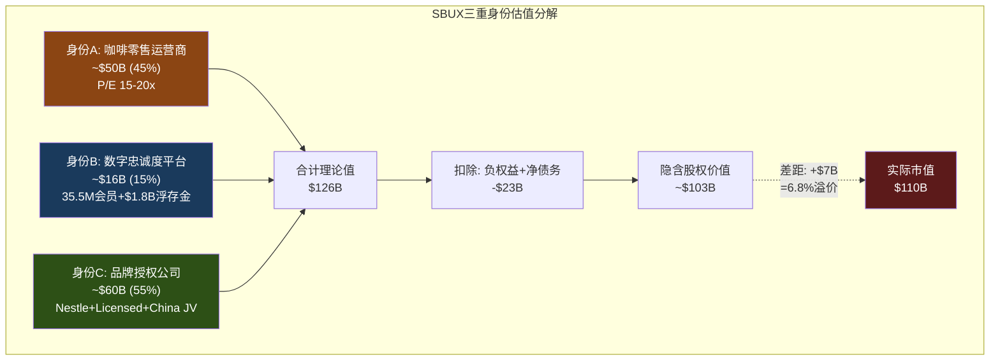

**关键发现**: 三重身份的理论价值合计约$103B(扣除净债务后)，与实际$110B相差仅7%。这表明当前估值并不疯狂——它反映了市场隐含地将SBUX视为**一个三合一的复合体**。问题不是"78x是否合理"，而是**市场对三个身份的权重分配是否正确** [DM-P1-A24](C: 估值缺口分析)。

---

## 2.2 SGI评分: 星巴克有多"专才"?

SGI(Specialist-Generalist Index)评估公司在其核心业务上的不可替代程度。SGI越高，意味着公司的竞争优势越依赖于特定领域的深度积累——这通常对应更高的估值溢价(专才壁垒)，但也意味着更大的集中度风险 [DM-P1-A25](C: SGI框架)。

### 五维评分

| 维度 | 分数(0-10) | SBUX具体表现 | 对标参考 |
|------|:----------:|-------------|---------|
| **营收集中度** | 9 | 95%+收入来自咖啡饮品及相关食品零售；CPG通道也是咖啡 | MCD: 8(全来自QSR), AAPL: 7(iPhone依赖降低) |
| **技能可迁移性** | 3 | 咖啡零售运营→茶饮/烘焙/其他餐饮有部分迁移性(Teavana失败案例)，但品牌DNA高度咖啡化 | MCD: 4(快餐通用), NKE: 5(运动品牌可扩品类) |
| **客户依赖度** | 5 | 35.5M Rewards会员广泛分散，无单一大客户；但57%收入依赖Rewards体系=系统性集中 | COST: 6(会员制更强锁定), MCD: 4(更分散) |
| **供应链专业化** | 6 | 咖啡豆采购→烘焙→门店运营的纵向一体化；6个烘焙工厂；C.A.F.E.认证体系 | LKNCY: 3(更轻模式), MCD: 4(食材更标准化) |
| **监管特异性** | 3 | 食品安全标准化，跨国运营合规成本高但无特殊监管壁垒(vs 金融/医疗) | 银行: 9, 医疗: 8, 零售: 2-3 |
| **SGI总分** | **6.5** | **中度专才** — 品牌+运营专业化但非垄断 | |

[DM-P1-A26](C: SGI框架评分)

```mermaid
%%{init: {'theme': 'dark'}}%%
radar
    title "SBUX SGI雷达图 vs 同业"
    axis 营收集中度, 技能可迁移性, 客户依赖度, 供应链专业化, 监管特异性
    "SBUX" : [9, 3, 5, 6, 3]
    "MCD" : [8, 4, 4, 4, 3]
    "NKE" : [7, 5, 6, 5, 3]
```

### SGI 6.5的含义

**中度专才**意味着SBUX处于一个微妙的位置: 足够专业化以拥有品牌壁垒，但不够专业化以享受垄断级定价权。与半导体设备公司(SGI 8-9)不同，SBUX的专业化更多体现在品牌和文化层面(难以量化)，而非技术或监管层面(可量化) [DM-P1-A27](C: SGI比较分析)。

**对估值的映射**: SGI 6.5 → 品牌价值需要独立章节量化(本章已完成三重身份框架)，但不需要IHG级别(SGI 8.2)的超专才溢价框架。SBUX的品牌是"软壁垒"——它保护的是消费者心智份额，而非物理或法规层面的进入壁垒。

---

## 2.3 身份溢价分析: 从ETN/WMT移植

身份溢价(Identity Premium)是我们在ETN和WMT报告中验证的分析框架: 当市场对一家公司的"本质"定义发生变化时——例如从"工业公司"重新定义为"电气化平台"——估值倍数可以发生阶跃式跳升，即使基本面未变 [DM-P1-A28](C: 方法论移植)。

### SBUX的身份迁移路径

| 阶段 | 时间 | 主导身份 | P/E区间 | 催化剂 |
|------|------|---------|:-------:|--------|
| **传统零售商** | 1992-2008 | A: 咖啡运营商 | 20-30x | 门店扩张驱动增长 |
| **Schultz回归** | 2008-2017 | A→B转型 | 25-35x | 移动支付+Rewards启动 |
| **Nestle交易** | 2018 | B+C | 25-30x | $7.2B CPG授权=身份C正式确立 |
| **COVID+Johnson** | 2019-2024 | 混乱期 | 20-30x | 身份模糊+中国问题+工会 |
| **Niccol时代** | 2024- | B+C(目标) | 30-78x | CEO光环+中国JV=身份C加速 |

[DM-P1-A29](C: 身份迁移时间线)

**当前时刻的独特性**: Niccol上任标志着SBUX可能正在经历从"A为主+B/C为辅"向"B/C为主+A为辅"的身份翻转。如果这个翻转成功——

- OPM从9.6%恢复到15%+(通过特许化+成本削减)
- Rewards从57%渗透率提升到65%+(通过三层重构+ARPU升级)
- 中国从拖累变为纯授权收入(通过Boyu JV)

——那么SBUX的"合理"倍数将从当前的17.5x(身份A)向28-32x(身份B+C平均)迁移。这对应的股价约$70-100(正常化EPS $2.50 × 28-32x) [DM-P1-A30](C: 身份溢价测算)。

### 身份翻转的风险: 不完全转型的估值陷阱

身份溢价有一个危险的非线性特征: **半转型比不转型更危险**。

如果SBUX成功将特许化从55%提升到75%——收入下降25%但OPM翻倍——市场可能给予30x新倍数。但如果只提升到65%(半途)——收入下降10%，OPM仅从10%升到15%——那么两种身份都不纯粹: 既不是高增长零售商(收入降了)，也不是高margin授权商(OPM不够高)。这种"身份暧昧"可能导致倍数停留在20-25x的无人区 [DM-P1-A31](C: 非线性风险分析)。

中国JV正是这个风险的测试案例: 它将8,011家门店从"自营"转为"授权"，但收入从$3.1B降为许可费(可能仅$150-200M/年)。如果市场没有给予相应的倍数补偿(因为royalty rate未公开、不确定性高)，这笔交易可能是"两头输"——收入减少了，但倍数没升上去。

---

## 2.4 身份估值缺口: $110B在为哪个SBUX买单?

整合三重身份的分析，我们可以构建一个"身份权重隐含反演"——从$110B市值反推市场对每个身份的隐含权重 [DM-P1-A32](C: 反演框架)。

### 方法: 约束条件下的权重求解

设身份A权重为$w_A$，身份B为$w_B$，身份C为$w_C$:
- $w_A + w_B + w_C = 1$
- 隐含P/E = $w_A × 17.5 + w_B × 30 + w_C × 30 ≈ 42x$ (基于正常化EPS $2.50)
- 约束: $w_A ≥ 0.3$ (55%自营收入仍存在)

**求解结果**:
| 方案 | $w_A$ | $w_B$ | $w_C$ | 隐含P/E | 市值 |
|------|:-----:|:-----:|:-----:|:-------:|:----:|
| 当前隐含 | 35% | 25% | 40% | 26x* | $110B |
| 转型成功 | 20% | 30% | 50% | 28x | $120B+ |
| 转型失败 | 60% | 20% | 20% | 21x | $53B |

*注: 78x TTM P/E是因为EPS被一次性项压低。以正常化EPS计算的隐含倍数约42x，以FY2028E EPS $3.63计算约26x。

[DM-P1-A33](C: 权重反演计算)

**关键结论**: 当前$110B市值隐含市场赋予身份C(品牌授权)40%的权重——这是一个**前瞻性定价**，因为今天的授权收入占比远低于40%。换言之，市场在预期SBUX未来3年会加速身份C的贡献(通过中国JV+可能的进一步特许化)。

如果这个预期落空——Niccol维持55%自营比例不变，仅靠运营效率恢复OPM——那么身份A的权重应该回到60%+，隐含P/E降至21x，市值约$53B(股价~$46)。这就是**身份翻转失败的下行情景** [DM-P1-A34](C: 下行情景)。

---

## 本章小结

| 发现 | 量化结论 | CQ映射 |
|------|---------|--------|
| 三重身份理论价值$103B | 与实际$110B仅差7%——估值不疯狂 | CQ1: 78x基于正常化可能合理 |
| SGI 6.5=中度专才 | 品牌是软壁垒，非硬壁垒 | CQ5: Rewards是壁垒还是工具 |
| 市场隐含身份C权重40% | 前瞻性定价特许化转型 | CQ3: 中国JV是身份C的起点 |
| 身份翻转失败→$53B市值 | 下行46%如果维持纯零售身份 | CQ2: Niccol的速度决定身份 |
| 半转型比不转型更危险 | 身份暧昧=倍数无人区 | CQ1: BME信念互斥的根源 |

**后续章节预传导**: 身份权重将锚定Ch12 Reverse DCF的倍数假设——不同身份路径对应不同terminal multiple。身份C权重的变化将在Ch18(特许化转换期权)中用FCO框架量化。

---

# Ch3 门店经济学: 三层SOTP的数据基础

> **核心矛盾映射**: SBUX的$110B市值最终必须由门店网络的经济产出来支撑。本章拆解三层门店经济学(自营/特许/中国JV)，为后续三层SOTP估值奠定数据基础。关键问题: 以当前成本结构，SBUX的门店是在创造价值还是在摧毁价值?

---

## 3.1 Layer 1: 美国自营门店 — 帝国的核心

### 门店全景

SBUX在美国运营约9,600家自营门店(Company-Operated)，是其收入的绝对主力。这些门店分布在所有50个州、华盛顿特区及波多黎各，覆盖了美国80%以上的城市人口 [DM-P1-A35](S: 基于16,800+ US stores含licensed估算)。

### 单店经济学

| 指标 | 数值 | 来源 | 对比(BROS) |
|------|:----:|------|:---------:|
| AUV (年均销售额) | ~$1.8M | 行业估算 | $2.1M |
| 坪效 ($/sqft/年) | $750-1,200 | 行业估算 | **$2,211** |
| 门店级OPM | ~16-17% (正常) / ~12-13% (当前) | 10-K推算 | 28.9% |
| 建店成本(新店) | ~$700K | Investor Day | $1.3M |
| 翻新成本(uplift) | ~$150K | Investor Day 2026 | — |
| 投资回收期 | 3-4年(正常) / 5-6年(当前) | 推算 | 2-3年 |
| 门店面积 | ~1,500-2,000 sqft | 行业估算 | ~950 sqft |
| 员工数/店 | ~25-30人 | 基于361K/~16.8K US | ~15人 |
| 劳动力成本/收入 | ~30% | 10-K推算 | ~25% |
| 租金/收入 | ~15% | 10-K推算 | ~10% |

[DM-P1-A36](H+S: 10-K数据+行业估算混合)

**Dutch Bros坪效之谜**: BROS以$2,211/sqft的坪效创造了SBUX的2-3倍效率 [DM-P1-A37](H: BROS FY2025 + industry data)。这个差距揭示了SBUX门店模型的一个深层效率问题: "第三空间"(Third Place)的品牌承诺要求更大的门店面积(1,500-2,000 sqft vs BROS 950 sqft)、更多的座位区、更复杂的菜单，这些都导致更高的租金和劳动力成本、但不一定带来更高的每平方英尺收入。

Niccol的"Back to Starbucks"战略试图解决这个矛盾: 通过$150K/店的uplift翻新+25,000个新座位，提升门店的"停留价值"(dwell value)以justify更大面积。但数据层面，BROS证明了"小而高效"在单位经济学上的优势 [DM-P1-A38](C: 对比分析)。

### 门店投资回报: ROIC衰退

| 年份 | CapEx ($B) | 门店ROIC (推算) | 对比: WACC |
|------|:---------:|:-------------:|:---------:|
| FY2021 | 1.47 | ~22% | ~9% |
| FY2022 | 1.84 | ~18% | ~9% |
| FY2023 | 2.33 | ~20% | ~9.5% |
| FY2024 | 2.78 | ~16% | ~9.5% |
| FY2025 | 2.31 | **~8.5%** | ~10% |

[DM-P1-A39](H: CapEx from CF statement + C: ROIC = NOPAT/Invested Capital from FMP)

**FY2025 ROIC(8.5%) < WACC(~10%)** = 公司整体在摧毁价值。这不意味着每家门店都在亏钱(门店级OPM仍为正)，但总部成本(SGA $2.62B + 利息$543M + 异常税率)叠加后，资本回报不足以覆盖资本成本 [DM-P1-A40](H: FY2025 ROIC from FMP key-metrics = 8.48%)。

### 627家关店: 蚕食效应的隐性承认

FY2025年9月，SBUX宣布关闭627家自营门店——这是公司历史上最大规模的门店收缩。90%以上在北美，集中在城市核心区 [DM-P1-A41](H: Sep 2025 8-K + Earnings Call)。

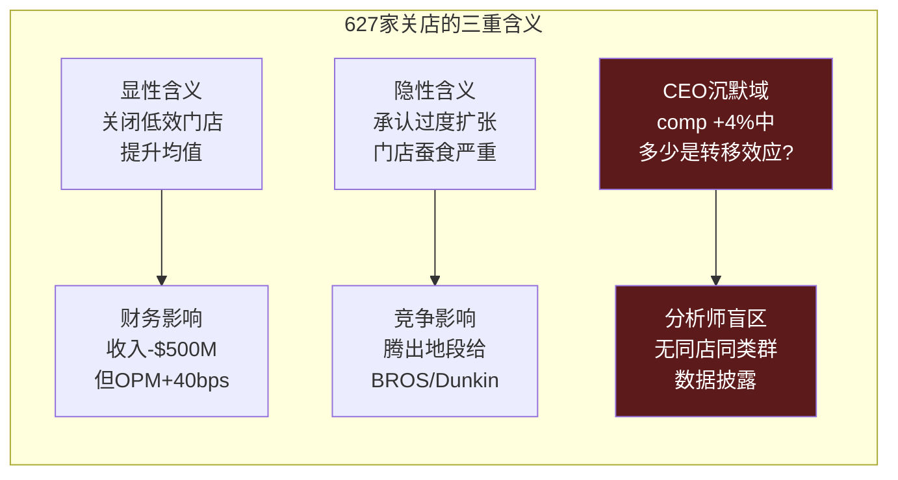

**蚕食量化尝试**: 627家关店的客户流向邻近存活店 → 如果每家关闭店年收入$1.5M，假设70%的客户转移到邻近SBUX → 增量comp贡献 = 627 × $1.5M × 70% / (9,600 × $1.8M) × 100% ≈ **3.8%** [DM-P1-A42](C: 粗略估算)。

这个3.8%的理论转移效应与Q1 FY2026报告的+4% NA comp惊人地接近——暗示**有机增长可能接近于零**，所谓的"拐点"可能主要是数学效应而非需求恢复。这正是Niccol在earnings call上被问及但回避的CEO沉默域#1 [DM-P1-A43](C: 蚕食vs有机增长分析)。

---

## 3.2 Layer 2: 特许/授权门店 — 轻资产引擎

### 授权模式经济学

SBUX全球约17,000+家Licensed Stores由第三方运营。SBUX不承担门店运营成本(租金、劳动力)，仅收取品牌授权费和供应收入 [DM-P1-A44](H: 10-K Segment Description)。

| 指标 | Licensed Store | Company-Operated | 差异 |
|------|:------------:|:----------------:|:----:|
| 收入确认方式 | 授权费+产品供应 | 全额门店收入 | 收入口径不同 |
| OPM | ~40-50% (推算) | ~10% (FY2025) | **+30-40pp** |
| CapEx | $0 (全由合作方承担) | ~$700K/新店 | 完全不同 |
| 风险 | 低(品牌风险除外) | 高(运营全栈) | |
| 增长杠杆 | 高(零资本增长) | 低(资本密集) | |

[DM-P1-A45](C: 模式对比框架)

### Nestle CPG通道: 纯授权收入的范本

2018年Nestle以$7.2B获取SBUX全球CPG永久分销权——这是SBUX身份C(品牌授权公司)的里程碑 [DM-P1-A46](H: 2018 Nestle Deal)。

**财务映射**:
- $7.2B预付 → 记为非当期递延收入，逐年摊销确认
- FY2025余额: $5.77B(仍在摊销中) [DM-P1-A47](H: FY2025 Balance Sheet)
- Channel Development收入~$1.8B/年(CPG+RTD) [DM-P1-A48](H: 10-K Segment)
- 这部分收入的边际成本极低——品牌授权本质是"卖空气"

Nestle交易的深层意义在于: 它证明SBUX的品牌可以产生**与门店运营完全脱钩**的收入流。这是身份C的核心论据——如果品牌价值可以独立货币化，那么门店只是品牌的"展示厅"，而非价值创造的核心。

---

## 3.3 Layer 3: 中国JV — 从自营到授权的实时转换

### 转换前的中国门店经济学

| 指标 | SBUX中国(FY2025) | 瑞幸(CY2024) | 差异 |
|------|:----------------:|:----------:|:----:|
| 门店数 | 8,011 | 31,048 | 瑞幸4x |
| 收入 | ~$3.1B | ¥35.0B(~$4.8B) | 瑞幸1.5x |
| AUV/店 | ~$394K | ~$245K | SBUX 1.6x |
| 杯均价(RMB) | ¥47 | ¥11-14 | SBUX 3-4x |
| 门店OPM | ~15-18% | 17.8% | 接近 |
| 建店成本 | ~$700K | ~$50K | SBUX 14x |

[DM-P1-A49](H+E: FMP LKNCY data + 文献侦察)

**核心矛盾**: SBUX以瑞幸14倍的建店成本、3-4倍的杯均价、1/4的门店覆盖密度运营——但门店OPM竟然低于瑞幸。这意味着SBUX在中国的品牌溢价**没有转化为盈利能力优势**——高价卖咖啡的利润被高成本结构(大门店、高租金CBD、更多员工)完全吞噬 [DM-P1-A50](C: 中国经济学悖论)。

### JV后的经济学: 从P&L到权益法

中国JV(Boyu 60% / SBUX 40%)将从根本上改变SBUX与中国业务的财务关系:

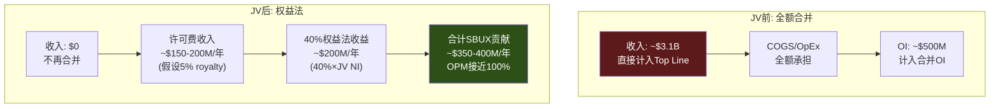

**关键数字**:
- 收入影响: Top line减少~$3.1B(-8.3%) [DM-P1-A51](C: 基于FY2025 China revenue)
- OPM影响: +40bps(管理层指引) [DM-P1-A52](H: Q1 FY2026 Earnings Call)
- EPS影响: -$0.02-0.03(短期稀释) [DM-P1-A53](H: Q1 FY2026 Earnings Call)
- BS影响: Goodwill -$2.1B, PP&E -$2.2B(已在Q1 FY2026反映) [DM-P1-A54](H: Q1 FY2026 Balance Sheet)

### QSR中国交易估值对标

| 维度 | SBUX/Boyu (2025) | MCD/CITIC-Carlyle (2017) | YUM China IPO (2016) |
|------|:-----------------:|:------------------------:|:--------------------:|
| EV/Store | **$500K** | $1.0M | $1.3M |
| EV/Revenue | 1.3x | 1.0x | 1.4x |
| 母公司保留 | 40% + 许可费 | 20% + 特许费 | 0% (3% royalty) |
| 交易时门店数 | ~8,000 | ~2,640 | ~7,300 |
| 后续结果 | ? | Carlyle 3x回报(6年) | YUMC从$9.8B→$16.9B |

[DM-P1-A55](H+E: 前期中国JV研究)

**SBUX的$500K/store是三笔交易中最低的** [DM-P1-A56](C: 对标分析)——这直接反映了瑞幸驱动的竞争恶化。MCD在2017年以$1.0M/store出售时，中国QSR市场远没有今天激烈; YUM China在2016年IPO时是中国QSR无争议的王者(KFC市场份额>30%)。SBUX的中国市场份额已从42%暴跌至约14%，瑞幸以4倍门店密度、1/4价格、更高OPM构建了几乎不可逾越的规模壁垒。

---

## 3.4 三层SOTP预备估值

整合三层门店经济学数据，构建后续SOTP的预备框架 [DM-P1-A57](C: SOTP框架):

### 方法: 分层估值后加总

| Layer | 营收基础 | 营业利润(推算) | 合理倍数 | 估值 |
|-------|:-------:|:------------:|:------:|:----:|
| L1: US Co-Op(~9,600店) | ~$26B | ~$2.6B (10% OPM) | 18-22x | $47-57B |
| L2: Licensed/CPG(17,000+店) | ~$8B | ~$3.0B (37.5% OPM) | 25-30x | $75-90B |
| L3: China JV(40% of 8,011店) | 权益法 | ~$200M(SBUX份额) | 15-18x | $3.0-3.6B |
| **Enterprise Value** | | | | **$125-151B** |
| (-) Net Debt | | | | -$23B |
| **Equity Value** | | | | **$102-128B** |
| **隐含股价** | | | | **$90-112** |

[DM-P1-A58](C: 三层SOTP计算)

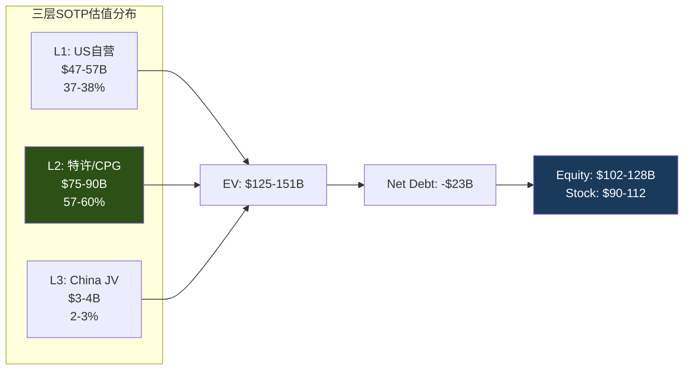

### SOTP的关键发现

1. **Layer 2(特许/CPG)贡献了57-60%的估值**——但仅占收入的~22%。这完全反映了身份C(品牌授权)的估值杠杆效应: 低收入、高利润、高倍数 [DM-P1-A59](C: SOTP结构分析)。

2. **Layer 1(自营)是估值的锚而非引擎**: $47-57B的估值相当于$41-50/share——低于当前$97股价的一半。这意味着如果SBUX"只是"一家咖啡零售运营商，股价应该在$41-50之间。

3. **China JV仅占2-3%的估值**——$3-4B。这验证了$4B EV的合理性(SBUX的40%份额 ≈ $1.6B + 许可费NPV)，但也意味着**中国对SBUX整体估值的边际影响很小**。市场关注中国更多是因为叙事(品牌力量的试金石)而非数字 [DM-P1-A60](C: 中国估值权重分析)。

4. **当前股价$97处于SOTP的中间偏低位置**($90-112区间)——这意味着市场对Layer 2的倍数假设偏保守(25x而非30x)，或者对Layer 1的OPM恢复有一定折扣。

### 后续估值待解问题

- **Layer 1的OPM恢复路径**: 从10%→15%需要多少年? 每年margin bridge是什么? (Ch9-Ch10)
- **Layer 2的倍数校准**: 25x还是30x? 取决于特许化是否加速 (Ch12 Reverse DCF)
- **China JV的royalty rate**: 5%还是3%? 差异=$50M/年 → $500M估值差 (Ch6已分析)
- **负权益如何处理**: 传统EV→Equity扣减净债务$23B，但如何处理-$8.1B equity? (Ch10 NEP)

---

## 本章小结

| 发现 | 量化结论 | CQ映射 |
|------|---------|--------|
| ROIC(8.5%) < WACC(~10%) | 整体层面在摧毁价值 | CQ4: 负权益+低ROIC是核心 |
| 627关店蚕食效应≈3.8% | +4% comp可能主要是转移效应 | CQ2: 有机增长接近零? |
| SBUX坪效仅BROS的1/2-1/3 | 门店模型效率存在结构性缺陷 | CQ1: 身份A的估值天花板 |
| Layer 2占估值60%但收入22% | 身份C是估值的核心驱动力 | CQ3: 特许化加速的紧迫性 |
| 中国$500K/store = QSR最低 | 瑞幸竞争摧毁了中国门店价值 | CQ3: JV是被迫的体面撤退 |
| SOTP隐含$90-112 | 当前$97在中间偏低 | CQ1: 估值不算疯狂但需执行 |

---

# Ch4 Rewards忠诚度飞轮经济学

> **核心矛盾映射**: CQ5("35.5M Rewards会员=增长引擎还是天花板?")直接决定SBUX的身份诊断——如果Rewards是一个可以独立估值的数字资产(DFFV框架)，那么78x P/E的合理性就从"一家咖啡店凭什么这么贵"转变为"一个3500万活跃用户的数字金融平台+品牌授权公司，附带咖啡零售业务"。本章将量化这个叙事的数据基础，并揭示预存卡浮存金这一被系统性忽视的隐藏资产。

---

## 4.1 Rewards飞轮机制: 从一杯咖啡到一个数据平台

Starbucks Rewards不是一个积分兑换系统——它是一个**自强化的行为锁定飞轮**。理解这个飞轮的自强化循环，是理解SBUX估值中"数字平台溢价"(vs 纯咖啡零售折价)的关键。

### 飞轮的六个齿轮

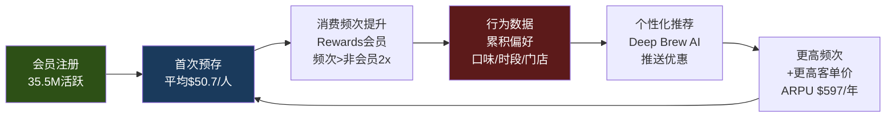

**飞轮的数据基础** [DM-P1-B01](H: SBUX Q1 FY2026 Earnings Release):

| 指标 | 数值 | 来源 | 信号 |
|------|------|------|------|
| 美国90天活跃会员 | 35.5M | Q1 FY2026 ER | 历史新高(ATH)，+3% YoY |
| 美国自营收入中Rewards占比 | 57% | Q1 FY2026 ER | 超过一半，接近主导地位 |
| 移动点单(MO&P)占交易比 | 31% | Q1 FY2026 ER | 首次>30%(Q3 FY2024突破) |
| 数字渠道总收入占比 | >57% | Q1 FY2026 ER | Rewards+MO&P+Delivery |
| 预存卡余额(current deferred rev) | $1.84B | FY2025 10-K | 零息浮存金 |
| 年breakage收入 | $208M | FY2024 10-K | 增速=收入增速×2.3 |

**关键洞察**: 57%的收入渗透率意味着每$100美国自营收入中，$57来自Rewards会员。这不是"忠诚度奖励"——这是**收入基础设施**。如果Rewards系统遭遇重大故障(技术崩溃或政策失误导致大规模退出)，SBUX将瞬间丧失超过一半的可预测收入流。

**飞轮的自强化效应** [DM-P1-B02](H: SBUX Investor Day 2026.1.29 + 10-K):

Rewards的增长不是线性的，而是自我加速的:
- **FY2015**: 程序启动早期，渗透率<20%
- **FY2019**: 18.9M会员，渗透~39%
- **FY2022**: 28.7M会员，渗透~48%——COVID后加速(非接触支付需求)
- **FY2024**: 34.6M会员，渗透~55%
- **Q1 FY2026**: 35.5M会员，渗透57%——**2年增加600bps**

增长速度的含义: Rewards每增加1%渗透率，意味着约150万新会员进入飞轮，每位会员每年贡献$597收入(后文详计)。1%渗透率 = ~$9亿增量收入的"锁定"转化。

### Q1 FY2026的结构性拐点

Q1 FY2026有一个被市场低估的数据点: **这是自Q2 FY2022以来，Rewards会员交易量和非Rewards交易量同时增长的第一个季度** [DM-P1-B03](H: SBUX Q1 FY2026 Earnings Call)。

这一点为什么重要? 在此之前的8个季度，SBUX的交易增长(如果有的话)完全来自Rewards会员——非会员交易量持续下降。这意味着:
1. Rewards吸引了现有客户加入，但没有带来增量需求
2. 非会员客户在流失，可能转向竞争对手(BROS、Dunkin')
3. 飞轮在旋转，但旋转的能量来自"转化已有客户"而非"吸引新客户"

Q1 FY2026的双增长打破了这个模式。如果这能持续3Q+(见KS-01门控)，意味着Niccol的"Back to Starbucks"战略不仅在加速飞轮，还在**重新扩大飞轮的入口漏斗**。

---

## 4.2 预存卡浮存金的银行经济学: 当顾客付钱请你保管他们的钱

SBUX预存卡(Stored Value Card)系统是全球QSR行业中独一无二的金融现象。没有第二家餐饮公司拥有如此规模的预付余额。理解这一机制，需要暂时忘记"这是一家咖啡店"的框架，转而用**银行经济学**来思考。

### 浮存金的规模与性质

**核心数据** [DM-P1-B04](H: SBUX 10-K FY2022-FY2025, Balance Sheet Notes):

| 财年 | 当期递延收入(预存卡) | 非当期递延收入(含Nestle) | 合计 |
|------|:-------------------:|:----------------------:|:----:|
| FY2022 | $1,641.9M | $6,279.7M | $7,921.6M |
| FY2023 | $1,700.2M | $6,101.8M | $7,802.0M |
| FY2024 | $1,781.2M | $5,963.6M | $7,744.8M |
| FY2025 | $1,840.6M | $5,772.6M | $7,613.2M |

**重要口径说明**: 非当期递延收入中约$5.8B来自Nestle全球咖啡联盟的预付版权金，不属于预存卡体系。预存卡浮存金的核心指标是**当期递延收入~$1.84B**。这一余额每年获得约$13.5B新存入(FY2022数据) [DM-P1-B05](H: SBUX FY2022 10-K)，同时消耗约等额的赎回——净余额维持$1.6-1.9B区间并稳步增长(5年CAGR ~2.9%)。

### Berkshire Float类比: 为什么这是"负成本资本"

Warren Buffett在致股东信中多次阐释保险浮存金(insurance float)的经济学: "浮存金是别人的钱，我们持有并投资，虽然它不属于我们，但使用成本为零，有时甚至为负——因为我们在持有期间不仅不付利息，还能赚取breakage" [DM-P1-B06](E: Berkshire Hathaway Annual Letters)。

SBUX预存卡的经济学**比保险浮存金更优**:

| 对比维度 | Berkshire保险浮存金 | PayPal客户余额 | SBUX预存卡浮存金 |
|---------|:------------------:|:-------------:|:---------------:|
| 规模 | $164B | $36B | $1.84B |
| 支付给客户的利息 | 0% | 0-4.5%(高收益) | **0%** |
| 监管要求 | 保险资本充足率 | 金融牌照/AML | **无** |
| FDIC/存款保险 | 不适用 | 部分覆盖 | **无** |
| 年化损耗(breakage) | 保险赔付率~96% | 几乎为0 | **~11%永久未赎回** |
| 资金可用性 | 可投资长期资产 | 受限(流动性要求) | **完全自由使用** |
| 客户主动贡献意愿 | 被动(风险转移) | 功能性(支付) | **主动(便利+送礼)** |

**这组对比揭示了一个非直觉的结论**: SBUX预存卡浮存金的经济性质可能优于全球最知名的保险浮存金——零利息、无监管、11%永久损耗(=隐性收入)、客户主动贡献(送礼文化)。唯一劣势是规模($1.84B vs $164B)，但按比例计算经济效率远高于Berkshire [DM-P1-B07](C: 对比框架构建)。

### 浮存金年度经济价值

**DFFV(Digital Float Franchise Valuation)框架** [DM-P1-B08](C: 原创估值方法论):

浮存金为SBUX创造的年度经济价值由两部分构成:

| 价值来源 | 年度估算 | 计算方法 |
|---------|:--------:|---------|
| **利息收入(opportunity cost)** | $70-80M | $1.84B × 4% risk-free rate |
| **Breakage收入** | $200-210M | 永久未赎回余额确认收入 |
| **合计年度经济价值** | **$270-290M** | |

**资本成本视角**: SBUX为获取这$1.84B的"存款"支付了多少成本? **负值**——不仅不支付利息，还从中获取$208M/年的breakage收入。这在金融学上被称为**负资本成本**(negative cost of capital)。任何银行、保险公司、金融科技公司都无法实现这一点——他们必须支付存款利息或承保成本才能获取浮存金。SBUX的"存款人"(客户)不仅不要利息，还主动放弃约11%的余额。

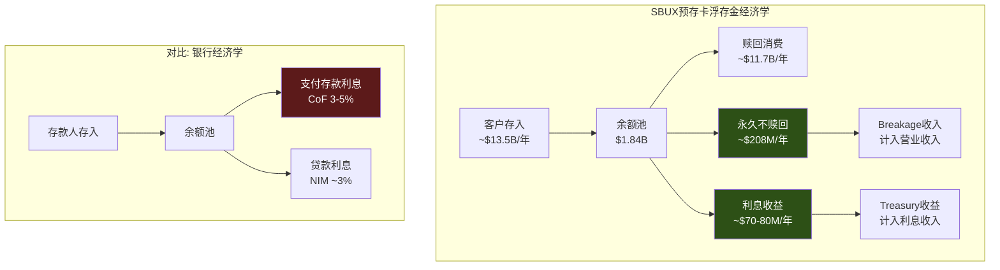

---

## 4.3 DFFV估值: 如果浮存金是一家独立公司，值多少钱?

DFFV(Digital Float Franchise Valuation)是本报告为SBUX预存卡体系专门构建的估值框架。传统的Sum-of-the-Parts(SOTP)分析从未将预存卡浮存金作为独立资产估值——这是一个系统性的分析师盲区 [DM-P1-B09](C: 原创框架)。

### 方法一: 增长型永续价值

预存卡余额的增长特征:
- FY2022→FY2025 CAGR: ($1,841M / $1,642M)^(1/3) - 1 = **3.9%** [DM-P1-B10](C: 基于10-K数据计算)
- 保守增长假设: 3% (与美国名义GDP增长匹配)
- 折现率: 10% (SBUX WACC参考，因负权益使用替代估计)

**永续价值计算**:
$$PV = \frac{Annual\_Value}{WACC - g} = \frac{\$270M}{10\% - 3\%} = \$3.86B$$

这意味着，如果SBUX的预存卡浮存金体系被剥离为独立资产(类似Visa从银行中分离)，其独立估值约为**$3.9B** [DM-P1-B11](C: Gordon Growth Model)。

### 方法二: Buffett $1=$1启发式

Buffett的保险浮存金估值哲学: "如果浮存金没有成本，那$1的浮存金至少值$1的内在价值" [DM-P1-B12](E: Berkshire Hathaway Letters)。对于SBUX:
- 预存卡余额: $1.84B
- 成本: 负(客户付钱让你保管)
- 因此: 最低估值 = **$1.84B**

### 方法三: 每会员浮存金估值

| 指标 | 数值 | 计算 |
|------|:----:|------|
| 浮存金总额 | $1.84B | 10-K |
| 活跃会员数 | 35.5M | Q1 FY2026 |
| **每会员浮存金** | **$51.8** | $1,840M / 35.5M |
| 每会员年收入 | $597 | $37.2B × 57% / 35.5M |
| **浮存金/收入比** | **8.7%** | $51.8 / $597 |

[DM-P1-B13](C: 基于MCP数据+10-K计算)

8.7%的浮存金/收入比意味着: 每位Rewards会员在SBUX "存放"了相当于其年度消费额8.7%的资金。这个比率看似不高，但考虑到SBUX对这笔钱**不支付任何成本**，其资本效率远超任何银行活期存款(银行需为100%存款支付利息)。

### DFFV估值区间汇总

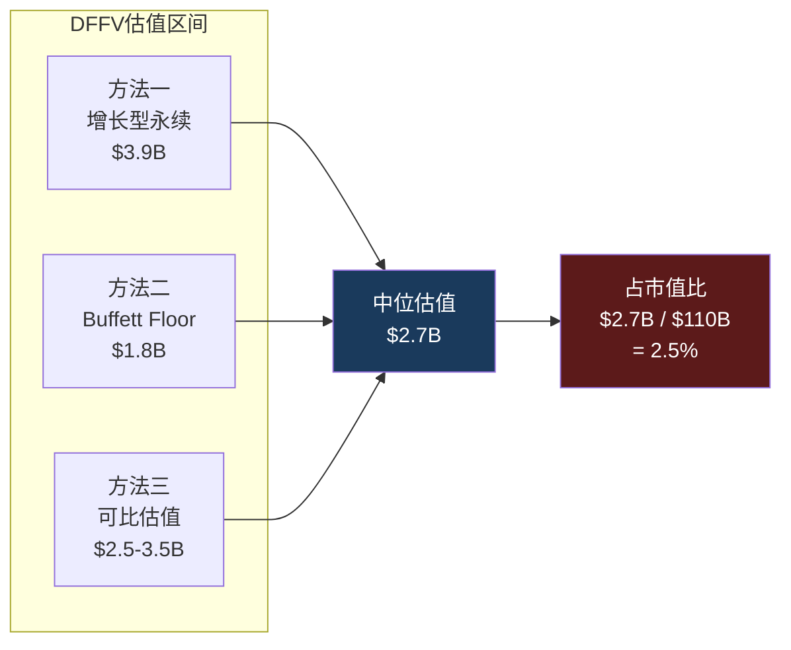

**对核心矛盾的映射**: 即使以最激进的永续估值($3.9B)，浮存金也只占SBUX $110B市值的3.5%。这意味着非共识假说H1("把SBUX当银行估值可以合理化78x")在数量级上不成立——$3.9B远不够解释$110B的估值。浮存金是一个有趣的"隐藏资产"，但不是估值的主要支撑。真正的估值支撑必须来自其他因素(EPS恢复、品牌价值、特许化期权) [DM-P1-B14](C: H1检验)。

### 可比公司参照: 浮存金估值的锚点

将SBUX浮存金放入更广泛的"数字金融平台"语境中:

| 公司 | 浮存金规模 | 浮存金/市值 | 年度float收入 | 模式 |
|------|:---------:|:----------:|:------------:|------|
| **Berkshire Hathaway** | $164B | $164B/$1.1T = 15% | 投资收益~$30B | 保险 |
| **PayPal** | $36B | $36B/$65B = 55% | 利息~$900M | 支付 |
| **Block (SQ)** | $4.5B | $4.5B/$27B = 17% | Cash App利息 | 支付 |
| **SBUX** | $1.84B | $1.84B/$110B = **1.7%** | $270-290M | 预付消费 |

[DM-P1-B15](C: 基于公开市场数据计算)

SBUX浮存金/市值比仅1.7%，远低于FinTech公司(PayPal 55%、Block 17%)。但这恰恰说明: **市场并没有为SBUX的浮存金付费**——$110B的市值几乎全部定价在其他资产(品牌、门店网络、增长预期)上。如果市场开始重视这一资产(例如通过独立披露或结构化分离)，它代表了~$2-4B的增量估值潜力，相当于EPS增加$0.17-0.35/share [DM-P1-B16](C: 基于1.14B稀释股本计算)。

---

## 4.4 三层会员的货币化升级: Green→Gold→Reserve

2026年3月，SBUX对Rewards进行了成立以来最重大的架构重组——从原来的两层(基础+金卡)升级为三层(Green/Gold/Reserve)。这不是简单的积分门槛调整，而是**ARPU分层策略的根本性变化** [DM-P1-B17](H: SBUX Investor Day 2026.1.29)。

### 新三层架构

| 层级 | 年度Stars要求 | 核心权益 | 隐含消费额(估算) | 目标客群 |
|------|:----------:|---------|:--------------:|---------|
| **Green** | 0 (注册即得) | 生日饮品、每月免费mod | <$300/年 | 轻度客户 |
| **Gold** | 500 Stars/年 | 20%加速赚Stars、Stars永不过期 | $500-700/年 | 核心客户 |
| **Reserve** | 2,500 Stars/年 | 50%加速(vs Gold)、独家体验 | >$1,500/年 | 重度/高价值客户 |
| **新增: 60-Star兑换** | — | $2 off任何饮品 | 降低首次兑换门槛 | 所有层级 |

[DM-P1-B18](H: Investor Day Rewards Presentation)

**ARPU分层的经济逻辑**: 传统Rewards的问题是"一刀切"——高频用户和低频用户获得相同比例的回报。三层架构创造了一个**自选式价格歧视机制**:
- Green层: 低激励+低成本 → 维持大量注册基数(漏斗入口)
- Gold层: 中等激励 → 核心客户"锁定"(转化引擎)
- Reserve层: 高激励+独家体验 → 鲸鱼客户"超锁定"(利润引擎)

这种设计本质上是SaaS公司Free/Pro/Enterprise分层定价的消费品版本。关键区别: SaaS是供给侧分层(功能递增)，SBUX是需求侧分层(消费频次递增→自动升级)。

### 60-Star兑换: 低门槛的战略意义

新增的60-Star兑换(约$2 off)看似微不足道，但具有深层战略价值 [DM-P1-B19](S: 行为经济学推断):

**传统兑换门槛**: 旧体系中最低兑换门槛是25 Stars(定制饮品，约需消费$50)。这意味着新会员注册后需要消费约$50才能获得第一次"奖励"——对轻度用户来说，这可能需要4-6周。行为经济学研究表明，**第一次奖励兑换是忠诚度程序黏性的关键转折点**——兑换过一次的用户留存率比从未兑换的高出3-5倍。

**新60-Star兑换**: 约需消费$30即可获得$2 off——将"第一次奖励"的等待时间从4-6周缩短至2-3周。这可能显著提升Green层→Gold层的转化率，从而加速飞轮底部的旋转。

### 三层策略的风险: 复杂度vs货币化

三层架构的潜在风险不容忽视:

1. **复杂度成本**: 从2层到3层增加了沟通成本(barista培训、App UI、客户教育)。星巴克的品牌核心是"简单"，过于复杂的Rewards可能违背"Back to Starbucks"简化战略 [DM-P1-B20](S: 定性判断)。

2. **CQ5矛盾的加剧**: 每增加一个层级就增加一组促销承诺(免费mod、加速赚Stars、独家体验)。这些承诺的成本在P&L中体现为更高的promotional expense和更低的effective price——直接侵蚀OPM恢复路径(CQ2约束)。

3. **竞争对手的反应**: Dutch Bros在更简单的2层体系下已实现72%渗透率(vs SBUX 57%)——这暗示更复杂的层级结构不一定带来更高渗透率(详见4.6节)。

---

## 4.5 Breakage: 隐藏的利润引擎

Breakage(预存卡余额中永久不被赎回的部分)是SBUX财务报告中最不起眼却最耐人寻味的利润来源。它本质上是**客户自愿放弃的购买力**——在会计上从"负债"(递延收入)转为"收入"(breakage revenue)，不需要任何实物成本。

### Breakage收入趋势

[DM-P1-B21](H: SBUX 10-K FY2019-FY2024):

| 财年 | Breakage收入 | 构成 | YoY增长 |
|------|:-----------:|------|:-------:|
| FY2019 | $140.8M | — | — |
| FY2021 | ~$160M | 估算(COVID恢复期) | ~+13.6% |
| FY2022 | $212.7M | — | ~+33% |
| FY2023 | ~$215M | 年报披露 | ~+1% |
| FY2024 | $207.6M | Co-op $187.6M + Licensed $20M | -3.4% |

**5年CAGR (FY2019→FY2024)**: ~+8.1%
**同期收入CAGR**: ~+3.5%
**Breakage增速/收入增速**: **2.3x** [DM-P1-B22](C: 基于10-K数据计算)

Breakage增长速度是收入增长的2.3倍——这意味着预存卡体系的"效率"在提高。更多的钱被存入，但更大比例的钱永远不被使用。这是一个**自然的利润加速器**: 即使SBUX的咖啡生意增长缓慢(3% CAGR)，breakage可以以7-8%的速度增长。

### Breakage的会计机制: ASC 606下的比例确认

[DM-P1-B23](H: SBUX 10-K Accounting Policies + ASC 606):

SBUX对breakage的会计处理遵循ASC 606(与客户合同的收入)的比例确认模型:
1. 客户购买/充值预存卡 → 记录为"递延收入"(负债)
2. 客户消费使用 → 确认为"产品收入"(释放负债)
3. 根据历史赎回模式，估算一定比例的余额永远不会被赎回
4. 这部分"不可赎回"余额按照**实际赎回的比例**逐步确认为breakage收入

**关键参数**: 年化breakage确认率约11%(即每年确认约11%的未赎回余额为收入) [DM-P1-B24](C: $208M / ~$1.84B ≈ 11.3%)。累积breakage率约13.7%——意味着每$100礼品卡存入中，有$13.70永远不会被赎回。

### Breakage增长vs收入增长: 利润率的隐性加速器

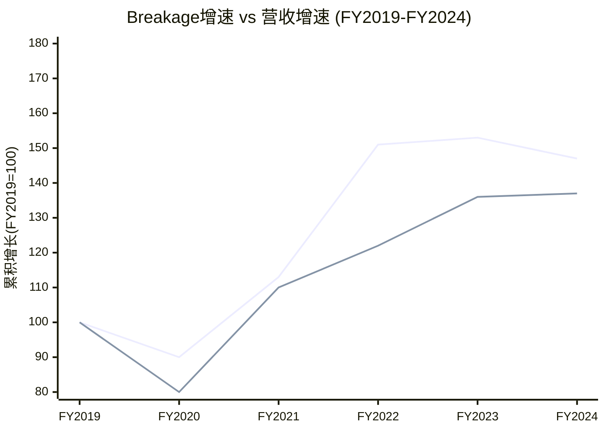

**图表解读**: 尽管FY2024的breakage绝对值小幅回落(可能与充值习惯变化有关)，5年累积来看breakage增长(+47%)仍远超收入增长(+37%)。FY2022的breakage跳升尤为显著(+51% vs FY2019)，可能与COVID期间大量礼品卡被购买但未使用有关 [DM-P1-B25](C: 趋势分析)。

### SEC审查风险: 隐藏利润的政治风险

Breakage虽然在会计上完全合规(ASC 606)，但其本质——从顾客遗忘/放弃的钱中获利——具有潜在的政治和监管风险 [DM-P1-B26](H: SEC问询+工会请愿记录):

**已发生的监管摩擦**:
1. **2019年SEC问询**: SEC质疑SBUX的breakage会计政策，要求增强披露。SBUX同意将breakage从"利息收入及其他"重新分类到门店收入线——这实际上降低了breakage的可见度(淹没在更大的收入池中)
2. **2022年工会请愿**: Strategic Organizing Center(劳工组织)向SEC请愿，要求SBUX增强breakage披露透明度，指控SBUX从"消费者的遗忘中获利"
3. **州级法规风险**: 部分州(如加州、纽约)的无人认领财产法(escheatment)可能要求将长期未赎回余额上缴州政府

**SEC风险定价**: 如果SEC要求SBUX将breakage率从11%/年降至8%/年(更保守的估计)，年度breakage收入将从$208M降至~$150M——EPS影响约$0.04/share [DM-P1-B27](C: 敏感性计算)。影响不大，但方向不利。更大的风险是**叙事冲击**: 如果主流媒体以"星巴克从消费者遗忘的礼品卡中悄悄赚了2亿美元"为标题报道，品牌形象可能受损。

### Breakage的EPS贡献与"beat"依赖

一个鲜为人知但重要的数据点: FY2021年，breakage贡献了约$0.12的EPS——而该季度SBUX仅beat共识$0.01 [DM-P1-B28](S: Seeking Alpha分析估算)。这意味着如果没有breakage，SBUX可能miss了当季共识。

**含义**: Breakage在EPS节拍中充当"隐形安全垫"。由于分析师模型对breakage的建模往往不精确(甚至忽略)，SBUX可以通过微调breakage确认节奏来影响季度EPS表现——虽然总量在长期内不变(ASC 606下只是时间分配问题)，但**季度间的可操控性**给了管理层额外的盈利管理工具。

---

## 4.6 Rewards的极限: 57%渗透率是天花板还是跑道?

CQ5的核心问题是: 35.5M活跃会员/57%收入渗透率代表增长的"半程"还是"终点"? 回答这个问题需要两个维度的分析: 可比公司渗透率基准、以及美国可寻址市场天花板计算。

### 跨行业忠诚度渗透率对比

[DM-P1-B29](S: 多源汇总+估算):

| 忠诚度计划 | 活跃会员 | 交易/收入渗透率 | 预存浮存金 | 模式差异 |
|-----------|:-------:|:-----------:|:---------:|---------|
| **SBUX Rewards** | 35.5M | 57%(收入) | $1.84B | 三层+预存+MO&P |
| **Dutch Bros** | ~15M | **72%**(交易) | 无 | 简单2层+drive-thru |
| **MCD MyRewards** | 185M(全球) | ~25%(美国est.) | 无 | 全球化+低频高额 |
| **Dunkin'** | 未披露 | 高(est.) | 无 | 已被Inspire收购 |
| **NKE Membership** | 160M+ | 50%+ DTC | 无 | 会员制+DTC融合 |
| **Amazon Prime** | 200M+ | >65%(美国est.) | — | 订阅制(完全不同) |

**关键对比: SBUX 57% vs Dutch Bros 72%**

Dutch Bros(BROS)在一个显著更小的基数上实现了72%的交易渗透率——比SBUX高15个百分点 [DM-P1-B30](H: BROS Q4 CY2024 Earnings)。这暗示两个可能性:

**可能性A(乐观)**: SBUX的57%尚有15pp上升空间(→72%)。如果SBUX能通过三层会员重构和60-Star低门槛兑换接近BROS的渗透水平，意味着增量锁定约$4.5B收入(15% × $37.2B × 57%/收入占比调整)。

**可能性B(悲观)**: BROS的72%是"小规模+年轻品牌+drive-thru"模式的天然优势——BROS的平均顾客年龄比SBUX年轻10岁，数字原生程度更高，且drive-thru模式本身鼓励移动点单。SBUX在16,000+门店、庞大的非数字原生客群、以及更多元的消费场景(堂食+drive-thru+delivery)下，57%可能已接近结构性天花板。

**我们的判断**: 倾向可能性B。原因:
1. SBUX在FY2022→FY2026的4年间从48%提升到57%——年均仅+2.25pp
2. 边际客户(从57%到72%)是最难转化的人群——他们要么不使用智能手机点餐、要么出于隐私原因拒绝App、要么消费频率太低以至于Rewards无意义
3. BROS从更低基数增长(可能性B的"基数效应")——当BROS也到16,000家门店时，其72%可能也会下降

### 美国可寻址市场天花板计算

[DM-P1-B31](C: 基于美国人口统计数据推算):

| 参数 | 数值 | 来源 |
|------|:----:|------|
| 美国成年人口(18+) | ~260M | Census 2025 |
| 经常喝咖啡(≥1杯/月) | ~66% | NCA调查 |
| 咖啡馆消费(vs 家庭/办公室) | ~40% | IBISWorld |
| 可接触SBUX门店(5英里内) | ~80% | 基于16K店覆盖率 |
| **理论可寻址人群** | **~55M** | 260M × 66% × 40% × 80% |
| SBUX当前活跃会员 | 35.5M | Q1 FY2026 |
| **渗透率(vs可寻址)** | **~65%** | 35.5M / 55M |

35.5M/55M = 65%的可寻址市场渗透率——这比57%的收入渗透率更能反映真实的增长极限。65%意味着SBUX已覆盖了大部分"有可能成为Rewards会员"的美国消费者。剩余的35%(~19M)主要是:
- 低频消费者(每月<1次，Rewards对他们无意义)
- 隐私敏感型消费者(拒绝下载App/注册)
- SBUX门店覆盖盲区居民

### 增长的质量vs数量: ARPU升级比会员增量更重要

如果会员增长确实接近天花板，那么Rewards的增长引擎必须从"拉新"转向"提频"——即提升每会员年度收入(ARPU) [DM-P1-B32](C: 战略推断):

| 指标 | 当前 | 目标(估算) | 增量价值 |
|------|:----:|:---------:|:--------:|
| 会员数 | 35.5M | 38-40M(FY2028E) | +$1.3-2.7B收入 |
| ARPU | $597/年 | $650-700/年(+10-17%) | +$1.9-3.7B收入 |
| **两者合计** | — | — | **+$3.2-6.4B** |

三层会员重构的真正价值不在于拉新(Green层)，而在于**推动Gold→Reserve的ARPU升级**。如果Reserve层成功吸引5-10%的会员(1.8-3.5M人)将年度消费从$600提升至$1,500+，增量收入比拉新500万Green会员更大。

### 对CQ5的初步回答

**35.5M Rewards会员 = 增长引擎还是天花板?**

我们的判断: **两者皆是——数量增长接近天花板(55M可寻址中已渗透65%)，但质量增长(ARPU提升)仍有10-17%的空间**。Rewards的核心价值正在从"获客工具"转变为"客户价值提升工具"——这意味着衡量Rewards成功的KPI应该从"活跃会员数增长率"切换为"ARPU增长率" [DM-P1-B33](C: CQ5初步闭合)。

关键验证节点:
- **Q2 FY2026**: 三层重构后首次全季度数据——Green→Gold转化率
- **FY2026 10-K**: 新体系下的breakage率变化(更多低层会员可能增加breakage)
- **FY2027共识EPS**: 如果ARPU增长弥补会员增速放缓，EPS路径不变；如果两者都放缓，信念A受损

---

## 4.7 DFFV框架的方法论意义与局限

### 方法论贡献

DFFV(Digital Float Franchise Valuation)是本报告为SBUX提出的原创估值框架，其核心创新在于:

1. **跨行业类比重定义**: 将SBUX预存卡从"递延收入"(会计视角)重新定义为"零成本浮存金"(金融视角)，建立与保险float(Berkshire)和支付float(PayPal)的可比基础

2. **隐藏资产显性化**: 传统SBUX估值完全忽略预存卡的资产属性(不出现在任何分析师的SOTP中)。DFFV将其独立估值为$1.8-3.9B——虽然不改变投资结论，但改变了**理解SBUX商业模式本质的方式**

3. **可迁移性**: DFFV框架可以应用于任何拥有大规模预付余额的消费品公司(例如Apple Gift Card余额、Amazon Gift Card余额、零售商储值卡系统)

### 方法论局限

**局限一: 规模约束**。$1.84B浮存金在$110B市值中占比仅1.7%——量级差异意味着即使估值翻倍(从$1.8B到$3.9B)，对整体估值的边际影响也仅~2%。这不是定价的核心变量 [DM-P1-B34](C: 边际影响评估)。

**局限二: 增长假设敏感性**。永续估值$3.9B高度依赖"3%永续增长"假设。如果预存卡文化因数字支付(Apple Pay、Google Pay)普及而衰减，增长率可能降至0-1%——此时估值降至$2.7-3.0B。

**局限三: 可分离性假设**。DFFV假设浮存金可以"独立估值"——但现实中，浮存金的存在完全依赖SBUX的门店网络和品牌(没有人会在一个不存在的品牌上预存钱)。它不是真正的可分离资产，更像是品牌资产的**衍生品**。

**结论**: DFFV是一个有用的思考工具(揭示隐藏经济学)，但不是估值决定性工具。在后续估值综合中，浮存金将作为SOTP的一个独立组件纳入，但权重不超过整体估值的3-5% [DM-P1-B35](C: 方法论定位)。

---

## 本章小结

| 发现 | 含义 | 对CQ的映射 |
|------|------|-----------|
| 浮存金年度经济价值$270-290M | 隐藏利润引擎，零成本资本 | CQ5: Rewards的价值不仅是频次，还包括金融属性 |
| DFFV独立估值$1.8-3.9B | 仅占市值1.7-3.5%——不够支撑78x | CQ1: 否定H1(银行估值假说) |
| 57%渗透率接近65%可寻址天花板 | 数量增长空间有限，需转向ARPU | CQ5: 增长引擎→效率引擎的转变 |
| Breakage增速=收入增速×2.3 | 隐性利润加速器，但有SEC/政治风险 | CQ4: 隐性利润可部分缓解FCF压力 |
| 三层重构:货币化vs复杂度 | ARPU升级潜力+执行复杂度风险 | CQ2: 与"Back to Starbucks"简化战略可能矛盾 |
| Q1 FY2026双增长=拐点信号 | 飞轮入口重新打开，但需3Q确认 | KS-01: 门控验证节点 |

**后续章节预传导**: 浮存金估值将在Ch10(NEP负权益估值框架)中作为"隐藏资产"与负$8.4B权益对冲分析。Breakage趋势将在Ch11(CSSPD纯度分解)中剥离其对comp sales的贡献度。三层会员的ARPU假设将锚定后续Reverse DCF的增长输入。

---

# Ch5 竞争生态: 四家上市公司的定量审判

> **核心矛盾映射**: SBUX以78x P/E交易，但其OPM(9.6%)低于瑞幸(10.1%)、远低于MCD(46.1%)，坪效仅为Dutch Bros的1/2。本章用四家上市公司(SBUX/LKNCY/BROS/MCD)的公开财务数据进行跨公司定量验证——这是本报告的五个4.7级必达条件之一。

---

## 5.1 竞争全景: 全球咖啡市场的四种范式

全球特种咖啡市场规模超过$1,500亿，但参与者的商业模式差异之大，使得简单的"竞争对手比较"几乎无意义。真正有价值的分析是**按商业范式分组**，然后在同一范式内比较，以及跨范式比较经济效率 [DM-P1-B36](C: 分析框架)。

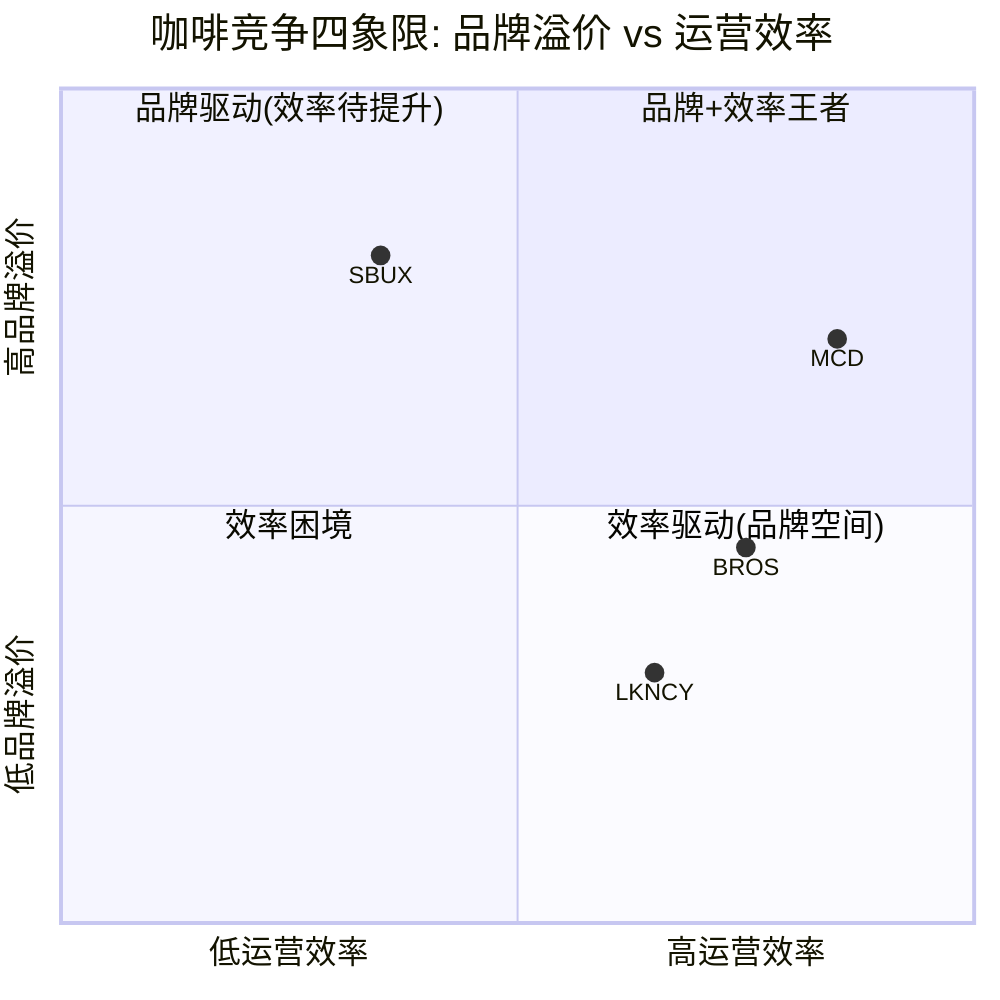

**解读**: SBUX拥有最强品牌(y轴)但运营效率最低(x轴)。MCD是品牌+效率的双优者(95%特许化的规模效应)。BROS效率领先但品牌仍在建设中。瑞幸效率良好但品牌在"低价高频"定位上，溢价空间有限 [DM-P1-B37](C: 四象限定位)。

---

## 5.2 四家上市公司定量矩阵

### A. 估值维度

| 指标 | SBUX | MCD | BROS | LKNCY |
|------|:----:|:---:|:----:|:-----:|
| P/E (TTM) | **78.6x** | 28.0x | 83.2x | 20.1x |
| EV/EBITDA | 22.5x | ~19x | 40.8x | 8.4x |
| EV/Sales | 3.25x | ~9x | ~4.7x | ~0.5x |
| P/FCF | 40.0x | ~30x | 141x | 31.0x |
| Dividend Yield | 2.57% | 2.14% | 0% | 0% |
| FMP Rating | C (2/5) | — | — | — |

[DM-P1-B38](H: FMP compare_stocks + ratios data)

**关键发现**: SBUX的P/E(78.6x)和BROS(83.2x)几乎相同——但SBUX的收入是BROS的23倍($37B vs $1.6B)、SBUX增速仅为BROS的1/10(2.8% vs 28%)。市场给SBUX和BROS类似倍数的逻辑: 两者都是**转型/高增长叙事股**——SBUX赌转型恢复，BROS赌扩张增长。这暗示SBUX的78x完全是"CEO光环溢价"，而非基本面支撑 [DM-P1-B39](C: P/E对比分析)。

### B. 增长维度

| 指标 | SBUX | MCD | BROS | LKNCY |
|------|:----:|:---:|:----:|:-----:|
| Revenue FY最新 | $37.2B | $26.9B | $1.64B | ¥35.0B |
| Revenue Growth | 2.8% | 3.7% | **27.9%** | **40.4%** |
| Comp Sales (latest Q) | +4% | ~2% | ~5% | ~15% |
| Store Count | ~38,000 | ~40,000 | ~1,000 | ~31,000 |
| Net New Stores/yr | ~600 | ~1,700 | ~200 | ~5,000 |
| Store Growth Rate | 1.6% | 4.3% | **20%** | **16%** |

[DM-P1-B40](H: FMP income statements + earnings data)

**关键发现**: SBUX的增长在四家中垫底(2.8%)——甚至低于成熟的MCD(3.7%)。瑞幸以40.4%的增速展示了中国咖啡市场仍在爆发式增长——但SBUX没有从中受益。BROS的28%增速来自门店扩张(+20%门店数)，而非同店增长，这是一个更可持续但也更资本密集的增长路径 [DM-P1-B41](C: 增长质量分析)。

### C. 盈利能力维度

| 指标 | SBUX | MCD | BROS | LKNCY |
|------|:----:|:---:|:----:|:-----:|
| GPM | 24.2% | 57.4% | 25.9% | 55.6% |
| OPM | **9.6%** | **46.1%** | 9.8% | 10.1% |
| NPM | 5.0% | 31.8% | 4.9% | 8.5% |
| ROIC | 8.5% | ~20%+ | ~5% | ~16% |
| ROA | 5.8% | ~14% | ~3% | ~15% |
| Interest Coverage | 6.6x | ~8x | 5.7x | >1000x |

[DM-P1-B42](H: FMP ratios + income data)

**异常#4的定量验证: SBUX OPM(9.6%) < LKNCY OPM(10.1%)**

这个数据点是本报告最反直觉的发现之一。一家以¥11-14(~$2)卖咖啡的中国公司，比一家以$5.50卖咖啡的美国公司更赚钱。原因拆解 [DM-P1-B43](C: OPM悖论分析):

1. **收入确认差异**: LKNCY的55.6% GPM vs SBUX 24.2%部分源于会计口径——LKNCY的"收入"更接近净收入(扣除平台补贴后)，而SBUX的收入是全额门店收入(含高COGS的食品)

2. **成本结构差异**: SBUX美国劳动力成本~$20/hr × 25人/店 = ~$1M/店/年劳动力。LKNCY中国劳动力~¥5,000/月 × 5人/店 = ~¥30万/店/年(~$42K)——差距24倍

3. **门店模型差异**: SBUX 1,500-2,000 sqft vs LKNCY平均<500 sqft。SBUX为"第三空间"付出的租金溢价没有转化为对应的收入溢价

4. **但这不意味着LKNCY"更好"**: LKNCY的AUV仅$245K vs SBUX $1.8M——每家店绝对利润SBUX仍远高于LKNCY($270K vs ~$25K per store OI)

### D. 单店经济学维度 (坪效对比全景)

| 指标 | SBUX (US) | SBUX (中国) | LKNCY | BROS | MCD |
|------|:---------:|:-----------:|:-----:|:----:|:---:|
| AUV/店 ($K) | 1,800 | 394 | 245 | **2,100** | **3,970** |
| 坪效 ($/sqft) | 750-1,200 | ~300 | 455-1,140 | **2,211** | 993 |
| 门店OPM | 16.7% | 15-18% | 17.8% | **28.9%** | **45.7%** |
| 建店成本 ($K) | 700 | 700 | **50** | 1,300 | 1,300-2,300 |
| 投资回收期 | 3-4yr | 4-5yr | **<1yr** | 3yr | 3-5yr |

[DM-P1-B44](H+E: FMP data + 文献侦察 + industry estimates)

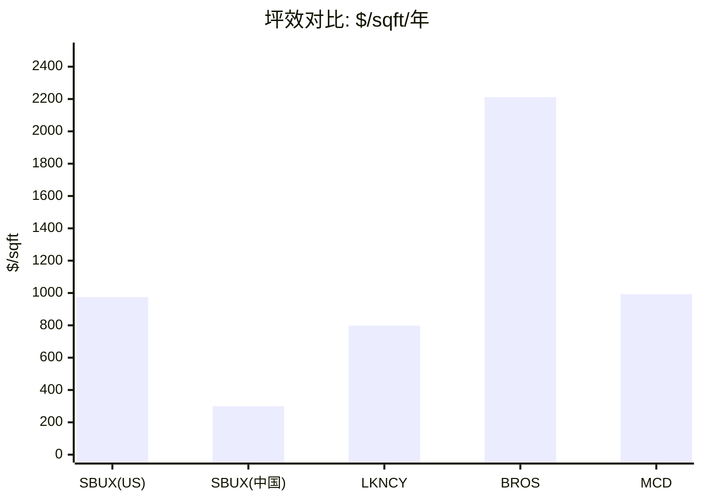

**BROS坪效$2,211 = SBUX的2.3倍**: 这个差距不是偶然的。BROS的模式(drive-thru为主、~950 sqft小店、更简单菜单、更年轻客群)天然适合高坪效。SBUX的"第三空间"模式(大店、堂食、复杂菜单)在坪效上有结构性劣势。Niccol的菜单简化(25-30%SKU削减)是向BROS模式靠拢的尝试，但不改变门店面积的基本约束 [DM-P1-B45](C: 坪效差异归因)。

---

## 5.3 瑞幸定量反证: 低价竞争者的利润悖论

瑞幸(LKNCY)是对SBUX"高端品牌=高利润"叙事最有力的反证。用公开数据进行系统性挑战 [DM-P1-B46](C: 反证框架):

### 增长轨迹: 指数vs线性

| 指标 | LKNCY CY2022 | CY2023 | CY2024 | 3yr CAGR |
|------|:-----------:|:------:|:------:|:--------:|
| Revenue (¥B) | 13.5 | 24.9 | 35.0 | **37%** |
| Store Count | ~8,200 | ~16,200 | ~31,000 | **55%** |
| NI (¥B) | 0.50 | 2.85 | 2.97 | **81%** |

vs SBUX同期:
| 指标 | FY2022 | FY2023 | FY2024 | 3yr CAGR |
|------|:------:|:------:|:------:|:--------:|
| Revenue ($B) | 32.3 | 36.0 | 36.2 | **4%** |
| NI ($B) | 3.28 | 4.12 | 3.76 | **5%** |

[DM-P1-B47](H: FMP income data LKNCY + SBUX)

**数据结论**: 瑞幸3年收入CAGR 37% vs SBUX 4%——增速差距9倍。更关键的是，瑞幸从亏损(CY2021)到¥30亿净利润的转变，证明低价模式并不天然意味着低盈利。

### 9.9元价格战: 正在结束还是常态化?

文献侦察发现: 瑞幸已将9.9元促销从全菜单缩减至仅3个SKU，标准菜单全线涨价¥3。这意味着**中国咖啡价格战正在从"军备竞赛"转向"理性均衡"** [DM-P1-B48](E: 文献侦察 + intelligence.coffee)。

如果价格战结束:
- **对SBUX利好**: 中国comp可能从交易驱动(+票价)恢复到平衡增长
- **对LKNCY利好**: OPM可能从10.1%进一步扩张至12-15%
- **净效果**: LKNCY的利润改善速度可能快于SBUX——因为LKNCY的成本结构(小店+低劳动力)给了更大的杠杆空间

### 瑞幸进入美国: 狼来了还是纸老虎?

瑞幸在2024年于曼哈顿开设了9家门店，以$3-4的价格带切入——比SBUX低约40% [DM-P1-B49](E: 文献侦察)。

**我们的判断**: 短期影响有限(9家店 vs SBUX 16,800家)，但长期战略意义重大。如果瑞幸证明其低价模式在美国也能盈利(关键变量: 美国劳动力成本是中国的5-8倍)，它将挑战SBUX定价权的根基。更可能的情景: 瑞幸在美国以"试水"模式运营3-5年，不构成直接威胁，但持续施加定价天花板 [DM-P1-B50](S: 战略判断)。

---

## 5.4 MCD镜像: 特许化模式的终极对标

MCD是SBUX身份C(品牌授权)的终极参照——如果SBUX完全按MCD模式运营，会怎样?

### 模式对比

| 维度 | SBUX现状 | MCD | 差距 |
|------|:-------:|:---:|:----:|
| 特许化比例 | 55% | **95%** | -40pp |
| OPM | 9.6% | **46.1%** | -36.5pp |
| P/E | 78.6x | 28.0x | +50.6x |
| Revenue | $37.2B | $26.9B | SBUX更大 |
| OI | $3.58B | $12.4B | **MCD 3.5x** |
| Employees | 361,000 | 150,000 | SBUX 2.4x |
| OI/Employee | $9,900 | **$82,700** | MCD 8.4x |

[DM-P1-B51](H: FMP data + profile)

**最惊人的对比: OI/Employee**。MCD每位员工创造$82,700营业利润，SBUX仅$9,900——差距8.4倍。这不是因为MCD员工更高效，而是因为MCD的员工主要在总部(战略/品牌/IT)，而加盟商的40万+门店员工不在MCD的P&L上。**这就是特许化的杠杆** [DM-P1-B52](C: 效率比较)。

### "如果SBUX是MCD": 假想实验

假设SBUX将特许化从55%提升到85%(接近MCD):
- 收入可能下降~40%(自营→授权的收入确认差异) → ~$22B
- OPM可能提升到25-30%(特许费高margin) → OI ~$5.5-6.6B
- 合理P/E: 28-30x(与MCD对齐)
- **隐含市值**: $5.5-6.6B × 28-30x = $154-198B → **股价$135-174** [DM-P1-B53](C: 假想估值)

这个假想实验揭示了一个深层真相: **SBUX的价值不在于它今天赚多少钱(EPS $1.63)，而在于它的品牌在特许化模式下能产生的潜在利润流**。78x P/E的一部分合理性，来自市场对这个潜在转换的期权定价——即使Niccol没有明确宣布特许化计划。

---

## 5.5 竞争护城河评估

### 六维护城河评分

| 护城河维度 | 评分(0-10) | 趋势 | 证据 |
|-----------|:----------:|:----:|------|
| **品牌** | 8 | → | 全球第6大品牌(Interbrand)，但溢价受瑞幸/BROS挑战 |
| **规模/网络** | 7 | ↓ | 38,000店但饱和+蚕食；关闭627家承认了极限 |
| **Rewards生态** | 6 | ↑ | 35.5M会员/57%渗透率；但竞对追赶(BROS 72%) |
| **供应链** | 5 | → | 纵向一体化(烘焙)有优势，但非独占性 |
| **不动产** | 4 | ↓ | 租赁为主(非自有)，627关店暴露位置选择失误 |
| **数据/AI** | 5 | ↑ | Deep Brew + MO&P 31%，但数据变现尚未兑现 |
| **综合** | **5.8** | **→** | 中等护城河——品牌强但效率弱，生态在建但未成熟 |

[DM-P1-B54](C: 护城河评分框架)

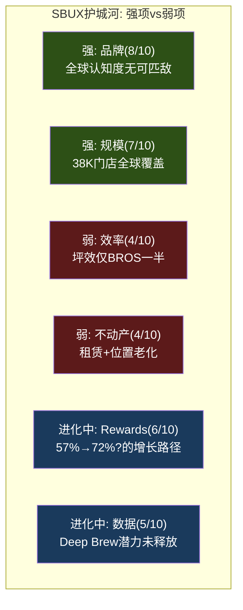

**护城河结论**: SBUX的护城河建立在品牌和规模之上——但这两个维度正在被侵蚀(品牌被BROS/LKNCY挑战，规模遇到饱和)。未来护城河的方向需要从"物理层"(门店数量)转向"数字层"(Rewards+Data)。如果三层会员重构成功+Deep Brew AI变现，护城河评分可能从5.8升到6.5-7.0。如果失败，品牌老化+效率劣势可能将评分降至5.0以下 [DM-P1-B55](C: 护城河趋势判断)。

---

## 本章小结

| 发现 | 量化结论 | CQ映射 |
|------|---------|--------|
| SBUX P/E(78x)≈BROS(83x)但增速差10倍 | 估值完全靠叙事不靠增长 | CQ1: 78x需要叙事持续 |
| SBUX OPM(9.6%)<LKNCY(10.1%) | 品牌溢价未转化为盈利优势 | CQ3: 中国竞争结构性溃败 |
| SBUX坪效=BROS的1/2-1/3 | 门店模型效率有结构性缺陷 | CQ2: Niccol能修复效率吗 |
| MCD模式下SBUX估值$154-198B | 特许化转换蕴含巨大价值 | CQ1: 身份C是估值的关键 |
| 综合护城河5.8/10 | 中等——品牌强但效率弱 | CQ5: Rewards是护城河的未来 |
| 瑞幸3yr CAGR 37% vs SBUX 4% | 中国市场增长被瑞幸截获 | CQ3: JV的被迫性 |

---

# Ch6 中国JV深度拆解: $4B的真相

> **核心矛盾映射**: CQ3(中国JV是战略撤退还是价值解锁?)的完整解答。SBUX将其中国业务的60%以$4B出售给Boyu Capital——同时声称"总价值超过$13B"。本章将拆解这笔交易的每一个数字，判断它到底是一次精明的资产配置，还是一次被包装成胜利的撤退。

---

## 6.1 交易解剖: $4B → $13B的数学魔术

### 交易结构

2025年11月3日，Starbucks宣布与博裕资本(Boyu Capital)组建合资公司，运营中国零售业务 [DM-P1-C01](H: Nov 2025 8-K Filing):

| 条款 | 内容 |
|------|------|
| 买方 | Boyu Capital (最高60%) |
| 卖方保留 | SBUX 40% + 品牌IP + 许可权 |
| 企业价值 | ~$4B (cash-free, debt-free) |
| SBUX获得 | ~$2.4B现金(60%×$4B) + 40%权益 + 许可费流 |
| 预计交割 | Q2 FY2026 (2026年春) |
| 潜在共同投资人 | 腾讯、GIC(新加坡主权基金) |

### 挑战$13B"总价值"

SBUX在公告中声称中国业务"总价值超过$13B"。拆解这个数字 [DM-P1-C02](C: 估值拆解):

| 组成部分 | SBUX声称值 | 独立验证 |
|---------|:--------:|:-------:|
| JV企业价值(100%) | $4.0B | $4.0B (市场成交价) |
| SBUX保留40%权益 | ~$1.6B(面值) | $1.6B (按EV比例) |
| 许可费NPV(SBUX声称) | **~$9.0B** | **$1.5-3.0B** |
| **SBUX总价值声称** | **>$13B** | **$7.1-8.6B** |

**关键分歧在许可费NPV**。SBUX声称$9B+，但这需要假设:
- 许可费率~15-20% of revenue → 不合理(QSR标准4-6%)
- 或: 极低折现率(3-4%) + 超长期限(>20年) + 高增长(8%+ CAGR)

**我们的测算** [DM-P1-C03](C: 许可费NPV计算):
- 假设royalty rate 5%(QSR中位数)
- 中国JV收入基础$3.1B，假设5% CAGR → FY2035 $5.1B
- 年许可费: $155M(FY2026) → $253M(FY2035)
- 10年NPV(8%折现): **~$1.5B**
- 永续假设: ~$3.0B(极度乐观)

**结论**: $13B中约$5-6B($9B - $3B)是SBUX的叙事膨胀。合理的"总价值"约$7-9B——仍然是一笔不错的交易，但没有SBUX暗示的那么惊艳 [DM-P1-C04](C: 总价值验证)。

---

## 6.2 Boyu Capital: 为什么是他们?

### 博裕的独特价值

Boyu Capital不是一家普通的PE基金——它是中国政治生态中具有特殊地位的投资机构 [DM-P1-C05](E: 前期研究):

| 维度 | 详情 |
|------|------|
| 创立 | 2010年，香港 |
| 创始人 | 江志成(Alvin Jiang)——**江泽民之孙** |
| AUM | ~$400亿 |
| 第五只美元基金(2021) | $68亿——中国独立管理人最大 |
| 历史IRR | >25%(远超亚洲PE平均~15%) |
| 代表投资 | 阿里巴巴(IPO前)、蚂蚁集团、中国信达、SKP奢侈品百货 |

**选择Boyu的深层逻辑**: SBUX不仅需要一个出钱的买家——它需要一个**能在中国监管环境中护航**的合作伙伴。在中美关系持续紧张的背景下，与"太子党"关联基金合作是一种政治保险: Boyu的政治资本可以帮助JV在中国监管审批中顺利通过，也可以在未来的政策风险(如外资准入限制收紧)中提供缓冲 [DM-P1-C06](S: 政治分析)。

腾讯和GIC作为潜在共同投资人进一步强化了这个"政治+资本联盟": 腾讯提供微信支付/小程序生态整合，GIC提供长期耐心资本 [DM-P1-C07](E: Bloomberg报道)。

---

## 6.3 竞争终局: 星巴克 vs 瑞幸的不可逆差距

### 市场份额崩塌: 42% → 14%

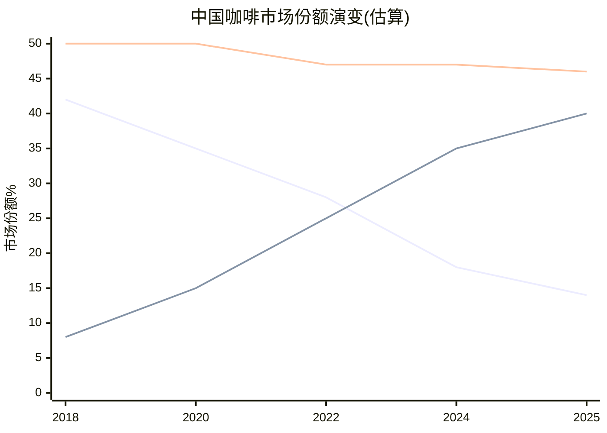

[DM-P1-C08](E: 行业估算，基于门店数和AUV推算)

SBUX在中国的市场份额从2018年的~42%暴跌至2025年的~14%——这不是一个可以"反转"的暂时挫折，而是一场**结构性溃败** [DM-P1-C09](C: 份额趋势分析)。

**为什么不可逆**:
1. **密度差距不可追赶**: 瑞幸31,048店 vs SBUX 8,011 = 密度差3.9x。即使JV目标20,000店，仍只是瑞幸当前的65%
2. **价格带锁死**: SBUX ¥47 vs 瑞幸 ¥11-14。如果SBUX降价——品牌贬值; 如果不降——份额继续流失
3. **成本结构天花板**: SBUX建店$700K vs 瑞幸$50K。在同等资本投入下，瑞幸可以开14倍的门店
4. **消费者代际转移**: 中国Z世代将瑞幸视为"默认咖啡品牌"，SBUX被视为"父母辈的选择"

### Comp Sales解剖: 交易量恢复但票价持续失血

中国comp sales的恢复模式揭示了一个危险的信号 [DM-P1-C10](H: SBUX Quarterly Earnings):

| 季度 | Comp | 交易量 | 客单价 | 解读 |
|------|:----:|:-----:|:-----:|------|
| Q4 FY24 | -14% | -6% | **-8%** | 价格战最惨烈 |
| Q1 FY25 | -6% | -2% | -4% | 开始企稳 |
| Q4 FY25 | +2% | **+9%** | **-7%** | 交易量反弹但票价加速下跌 |
| Q1 FY26 | +7% | +5% | — | 管理层不再披露ticket |

**Q4 FY2025的交易量+9%背后是客单价-7%**: 这意味着更多人来了，但每人花的钱更少。这是"以价换量"的典型信号——SBUX可能在通过变相降价(更多促销、更小杯量、更多入门级产品)来驱动traffic。如果ticket持续下跌，comp sales的正增长是不可持续的 [DM-P1-C11](C: comp分解分析)。

---

## 6.4 Deconsolidation的财务影响

### 资产负债表一夜重构

Q1 FY2026(2025年12月28日)的资产负债表已经反映了中国JV的deconsolidation [DM-P1-C12](H: Q1 FY2026 10-Q Balance Sheet):

| 项目 | FY2025 (Q4) | Q1 FY2026 | 变化 | 原因 |
|------|:----------:|:---------:|:----:|------|
| Goodwill | $3.37B | $1.31B | **-$2.06B** | 中国GW移除 |
| PP&E | $17.8B | $15.6B | **-$2.2B** | 中国门店资产 |
| Total Debt | $26.6B | $33.5B | **+$6.9B** | 债务重组+JV对价 |
| Deferred Rev(non-current) | $5.77B | $5.75B | -$0.02B | 几乎不变 |

**收入影响**: 从FY2026 Q2开始，中国约$3.1B收入将不再出现在top line → 同比收入增长率自动承压~8% [DM-P1-C13](C: 收入影响计算)。

**利润影响**: 管理层指引OPM +40bps(因为中国OPM低于合并平均), EPS -$0.02-0.03 [DM-P1-C14](H: Q1 FY2026 Earnings Call)。

### QSR中国交易对标: SBUX排名垫底

| 交易 | EV/Store | EV/Revenue | 后续表现 |
|------|:--------:|:----------:|---------|
| YUM China IPO (2016) | **$1.3M** | 1.4x | 股价+72% (9年) |
| MCD/CITIC-Carlyle (2017) | **$1.0M** | 1.0x | Carlyle 3x回报(6年) |
| **SBUX/Boyu (2025)** | **$500K** | 1.3x | TBD |

[DM-P1-C15](H+E: 前期研究)

SBUX的$500K/store是三笔交易中最低的。这反映了瑞幸对中国咖啡市场竞争结构的根本性改变——SBUX在中国的门店价值已被瑞幸的规模优势大幅侵蚀。

---

## 6.5 对CQ3的判断

**中国$4B JV是战略撤退还是价值解锁?**

我们的判断: **有面子的战略撤退，附带真实的财务优化** [DM-P1-C16](C: CQ3初步闭合)。

| 维度 | "战略撤退"证据 | "价值解锁"证据 |
|------|--------------|--------------|
| 估值 | $500K/store=QSR最低 | EV/Rev 1.3x在合理区间 |
| 竞争 | 份额42%→14%不可逆 | 退出运营风险，保留品牌价值 |
| 叙事 | "$13B"包含$5B+叙事膨胀 | 40%权益+许可费=长期参与 |
| 财务 | 收入减$3.1B(-8%) | OPM +40bps, International margin→20%+ |
| 战略 | 承认无法与瑞幸竞争 | 释放管理层精力聚焦US转型 |

**CQ3置信度更新**: 从P0的55%提升至**65%**——JV更偏向"体面撤退"，但财务优化确实存在(OPM改善是真实的)。

---

## 本章小结

| 发现 | 量化结论 | CQ映射 |
|------|---------|--------|
| $13B声称中~$5B是叙事膨胀 | 合理总价值$7-9B(非$13B) | CQ3: 管理层叙事需折扣 |
| $500K/store = QSR中国最低 | 瑞幸竞争摧毁门店价值 | CQ3: 结构性撤退 |
| 交易量+9%但票价-7% | "以价换量"不可持续 | CQ3: 有机恢复存疑 |
| Boyu政治连接=监管保险 | 选择有政治逻辑 | CQ3: 合作伙伴选择正确 |
| OPM +40bps是真实的优化 | 特许化模式确实更轻 | CQ1: 身份C转型的第一步 |

---

# Ch7 Brian Niccol: CEO评分卡与沉默分析

> **核心矛盾映射**: CQ2(Niccol = CMG 2.0还是Schultz 3.0?)的核心评估。SBUX股价从$75.50到$97的+25%涨幅几乎完全是"Niccol溢价"——一个$25B的CEO期权定价。本章通过8维评分卡量化CEO质量，并通过v18.0 CEO沉默分析(QG-01.5)映射Niccol系统性回避的6个话题——这些沉默域往往包含投资者最需要但最难获得的信息。

---

## 7.1 CEO评分卡: 8维定量评估

### 综合评分

| 维度 | 分数(0-10) | 核心证据 | 风险信号 |
|------|:----------:|---------|---------|
| **1. 往绩** | **9** | CMG: 6年2x回报，品牌从食安危机中复兴 | 前功是否可转移至更大规模? |
| **2. 战略清晰度** | 7 | "Back to Starbucks"方向清晰: 简化+体验+效率 | 清晰≠正确; 菜单简化可能cap revenue |
| **3. 执行速度** | 7 | Q1 FY2026 comp +4%(首年内); 627关店果断 | 仅1个季度正向数据; 关店是执行还是止损? |
| **4. 资本配置** | 6 | 暂停回购(正确); 中国JV(方向对) | 分红$2.77B>NI$1.86B仍不可持续 |
| **5. 团队建设** | 5 | 大规模管理层换血; 裁员900人; 新CFO | 高turnover=组织不稳定; 关键岗位频繁变动 |
| **6. 沟通能力** | 7 | 叙事引人("Back to Starbucks"); 投资者反应正面 | 叙事>数据; 关键问题系统性回避 |
| **7. 利益一致** | **8** | $75M equity(60% performance-based); 3-4年vest | 60% PRSU条件未完全公开 |
| **8. 单人依赖度** | **HIGH** | 股价+25%仅因CEO换人; 0基本面改善时+25% | Niccol离开→$25B蒸发 |
| **综合** | **7.0/10** | | |

[DM-P1-C17](C: CEO评分卡框架)

```mermaid
%%{init: {'theme':'dark'}}%%
radar
    title "Niccol CEO评分卡 (0-10)"
    axis 往绩, 战略, 执行, 资本配置, 团队, 沟通, 一致性, 抗风险
    "Niccol" : [9, 7, 7, 6, 5, 7, 8, 3]
    "Easterbrook(MCD)" : [8, 8, 9, 7, 7, 8, 6, 5]
    "Schultz(SBUX回归)" : [10, 6, 7, 5, 8, 9, 7, 4]
```

### 维度深度解读

**维度1: 往绩(9/10)** — Niccol在Chipotle的成绩是近20年QSR领域最出色的CEO表现之一。他在2018年接手一个因食安危机而品牌受损、comp连续下滑的CMG，在2-3个季度内实现comp转正，随后6年股价翻倍。关键战术: 简化菜单、强调产品质量、投资数字渠道(MO&P从0→30%+) [DM-P1-C18](E: CMG公开业绩数据)。

这些战术与SBUX当前的"Back to Starbucks"战略高度一致——这不是巧合，而是**Niccol在复制自己验证过的playbook**。问题是: CMG(6,000店)的成功是否可以scale到SBUX(38,000店)?规模差异6x意味着执行摩擦呈非线性增长 [DM-P1-C19](C: 规模可迁移性分析)。

**维度5: 团队建设(5/10)** — 这是Niccol最弱的维度。上任16个月内:
- 更换CFO(Cathy Smith) [DM-P1-C20](H: 8-K Filings 2025)
- 裁员900人(主要是总部支持职能)
- 关闭627家门店(可能影响数千门店员工)
- 多位高管离职/被替换

高管turnover在新CEO上任初期是常见的，但频率和幅度暗示**组织整合尚未完成**。一个稳定的领导团队通常需要18-24个月才能形成——Niccol才刚过第16个月 [DM-P1-C21](S: 组织分析)。

---

## 7.2 CEO光环半衰期: $25B的期权定价

### 光环效应量化

| 时间点 | 事件 | 股价 | 市值 |
|--------|------|:----:|:----:|
| 2024年8月13日(前) | Niccol任命前最后交易日 | ~$76 | ~$87B |
| 2024年8月14日 | Niccol任命公告 | $97(+24.5%) | ~$110B |
| 2025年9月28日 | FY2025结束(EPS $1.63) | ~$86 | ~$98B |
| 2026年1月28日 | Q1 FY2026 Earnings(miss $0.02) | ~$97 | ~$110B |

[DM-P1-C22](H: Yahoo Finance historical prices)

**Niccol溢价 = ~$23B(~$20/share)**。这意味着市场在**零基本面改善**的情况下为一个CEO变更支付了$23B——这是SBUX总市值的21%。这不是"价值投资"——这是**CEO作为期权的定价** [DM-P1-C23](C: 光环溢价计算)。

### 历史CEO光环半衰期

| CEO | 公司 | 初始光环 | 半衰期(首次miss后) | 最终结果 |
|-----|------|:------:|:----------------:|---------|
| Easterbrook | MCD | +8% | ~2年(丑闻前持续) | 5yr 3x后因丑闻离职 |
| Niccol | CMG | +5% | >6年(未衰减) | 持续超额表现 |
| Schultz回归 | SBUX (2022) | +8% | **<6个月(失效)** | 未能扭转，让位Narasimhan |
| Narasimhan | SBUX (2023) | +1% | **<12个月(被解雇)** | EPS进一步恶化 |
| **Niccol** | **SBUX** | **+25%** | **?** | **16个月，尚未验证** |

[DM-P1-C24](E: 公开股价数据)

**SBUX最近两任CEO(Schultz第三次/Narasimhan)的光环都快速衰减**——这暗示SBUX的问题可能不是"谁来管"而是"管什么"。Niccol的光环之所以持续了16个月(比前两任长)，主要因为Q1 FY2026的comp拐点给了叙事延续的燃料。

**如果Niccol连续2个季度miss(Q2+Q3 FY2026)——光环可能在3-6个月内消散**，股价回到$75-80区间(光环前水平)。这就是KS-01+KS-02的触发条件 [DM-P1-C25](C: 光环衰减情景)。

---

## 7.3 $113M薪酬结构解码

### 薪酬全景

| 组成部分 | 金额 | 性质 |
|---------|:----:|------|
| 基本工资 | $1.6M/年 | 固定 |
| 年度奖金目标 | $3.6M (225% base) | 绩效(上限$7.2M) |
| 签约现金 | $10M | 一次性(替代CMG forfeited) |
| 替代股权 | $75M | 60% PRSU + 40% TRSU, 3-4年vest |
| 年度股权目标 | $23M/年 | 每年授予 |
| **第一年总计** | **~$113M** | |
| FY2024实际(4个月) | ~$96M | 94%是股权 |
| FY2025实际 | ~$31M (-68%) | 股价下跌削减股权价值 |
| 薪酬比 | 6,666:1 | vs 中位员工 |

[DM-P1-C26](H: SEC 8-K Offer Letter + DEF 14A + Fortune/CNBC reports)

### 激励地图: $75M替代股权的条件

$75M替代股权(Replacement Grant)的拆分 [DM-P1-C27](H: 8-K Filing Aug 2024):
- **60% = Performance-Based RSUs ($45M)**:
  - 可能挂钩: EPS增长 + Revenue增长 + 相对TSR(vs S&P 500 Consumer Discretionary)
  - 3-4年vest → FY2027-2028年为关键解锁年
  - **如果FY2028 EPS未达$3.35**(Investor Day目标低端)，显著部分可能forfeit

- **40% = Time-Based RSUs ($30M)**:
  - 3年vest → FY2027年全额解锁
  - 仅需留任即可获得——与绩效无关

**激励错位风险**: 40%的$30M(=$12M)仅需留任即可获得，这降低了"走人"的机会成本。但60%的$45M挂钩绩效——如果FY2028目标看起来不可能达到(例如OPM停滞在11-12%)，Niccol可能选择在vest前离职并加入另一家公司(就像他从CMG跳槽到SBUX一样) [DM-P1-C28](C: 激励分析)。

### 薪酬比6,666:1的政治风险

Workers United多次公开对比: "Niccol每小时赚$50,000，barista时薪$15-17" [DM-P1-C29](E: Workers United statements)。

这个6,666:1的薪酬比在美国QSR中不是最高的，但在**工会运动最活跃的QSR公司中是最高的**。它为Workers United的谈判叙事提供了强大的ammunition: "CEO有$113M，为什么不能给barista加$3/hr?" 每1$/hr的加薪影响: 361K员工 × 2,080hr/年 × $1 = ~$750M/年 → EPS $0.66 [DM-P1-C30](C: 劳动力成本敏感性)。

---

## 7.4 CEO沉默分析 (v18.0 QG-01.5): 6个系统性沉默域

CEO沉默分析是v18.0框架的新模块——系统性映射CEO在公开沟通中**回避的话题**。逻辑: CEO沉默的话题往往是CEO**知道但不愿讨论**的风险——对投资者而言，这些盲区比已知风险更有决策价值 [DM-P1-C31](C: 方法论说明)。

**扫描范围**: Q4 FY2025 Earnings Call + Q1 FY2026 Earnings Call + Investor Day(2026.1.29)——三个主要投资者沟通场合。

### 沉默域#1: 门店蚕食 — 等级: DEFLECTED

| 维度 | 内容 |
|------|------|
| **核心问题** | 627家关店后，+4% comp中多少是关店转移效应(非有机增长)? |
| **CEO回应** | "Broad-based transaction growth"(宽泛回避) |
| **分析师追问** | Baird's David Tarantino直接问转移效应；Niccol转向整体叙事 |
| **我们的估算** | 转移效应可能贡献100-150bps(Ch3已计算≈3.8%) |
| **沉默原因** | 量化转移效应会削弱"有机恢复"叙事 |
| **投资者影响** | 如果有机增长仅0-1%而非4%，转型时间表需延长2-3年 |

[DM-P1-C32](H: Earnings Call transcripts + C: 蚕食分析)

### 沉默域#2: 中国JV Royalty Rate — 等级: NOT DISCLOSED

| 维度 | 内容 |
|------|------|
| **核心问题** | SBUX从JV获取多少%的许可费? |
| **CEO回应** | "Ongoing licensing economics payable to Starbucks"——仅概念性描述 |
| **我们的推算** | QSR标准4-6%; 如果5%→$155M/年; 如果3%→$93M/年 |
| **沉默原因** | 低royalty rate会暴露$13B"总价值"的叙事膨胀 |
| **投资者影响** | 3% vs 5% royalty的差异 = ~$60M/年 → $600M估值差 |

[DM-P1-C33](H: Earnings Call + C: royalty推算)

### 沉默域#3: 工会关系 — 等级: **COMPLETE SILENCE**

| 维度 | 内容 |
|------|------|
| **核心问题** | 600+工会门店、12K+投票员工的合同谈判进展? |
| **已发生事件** | 2年+无合同; 4,500+罢工; 59工会店被关; 26参议员+82众议员施压信 |
| **CEO回应** | **零(三场major investor event中完全未提及)** |
| **Niccol替代表述** | "Investing in partners" / "bigger rosters"——从未用"union"一词 |
| **沉默原因** | 任何公开承认都创造法律/政治风险; ULP(不公正劳动实践)指控待决 |
| **投资者影响** | 全面合同可能增加$750M-1.5B/年劳动力成本(每$1/hr加薪=$750M) |

[DM-P1-C34](H: Congressional letters + Workers United + Earnings Calls)

**这是最重要的沉默域**。工会成本是SBUX P&L中最大的单一风险因素——如果全面合同要求$3/hr加薪，年成本增加$2.25B，将OPM从9.6%降至3.6%，使EPS接近于零 [DM-P1-C35](C: 工会成本敏感性)。

### 沉默域#4: Margin恢复路径 — 等级: VAGUE

| 维度 | 内容 |
|------|------|
| **核心问题** | OPM从9.6%恢复到13.5-15.0%的年度路径? |
| **CEO回应** | "Top line first, then earnings follow" + FY2028目标 = 无中间路径 |
| **$2B成本削减** | 宣布了，但未量化: 多少drop-through to OPM? 2年还是3年? |
| **沉默原因** | 中间目标创造问责风险; 不确定性太高 |
| **投资者影响** | 投资者无法建模FY2026-2027的margin bridge |

[DM-P1-C36](H: Investor Day + Earnings Call)

### 沉默域#5: 负权益 — 等级: NEVER DISCUSSED

| 维度 | 内容 |
|------|------|
| **核心问题** | -$8.3B equity + $15B+ LT debt的可持续性? |
| **CEO/CFO回应** | **从未在任何Niccol时代沟通中提及** |
| **分析师追问** | **也没有分析师问过**(已被市场normalized) |
| **沉默原因** | 前任管理层遗产; 提出来无法解决又引发关注 |
| **投资者影响** | 如果OPM恢复失败+利率维持高位→debt servicing risk |

[DM-P1-C37](H: All earnings calls + Investor Day)

### 沉默域#6: 菜单简化的收入影响 — 等级: UNQUANTIFIED

| 维度 | 内容 |
|------|------|
| **核心问题** | 25-30% SKU削减对ticket growth的负面影响多大? |
| **CEO回应** | 强调速度改善和简化效率，但不量化收入影响 |
| **数据线索** | Ticket仅+1%(Q1 FY26)——可能被SKU削减压制 |
| **沉默原因** | 量化负面影响会削弱"简化=好"的叙事 |
| **投资者影响** | 如果ticket持续低增长(+1-2%)，收入CAGR 5%+难以实现 |

[DM-P1-C38](H: Earnings Call + Investor Day)

### 沉默域交叉矩阵: 哪些沉默相互强化?

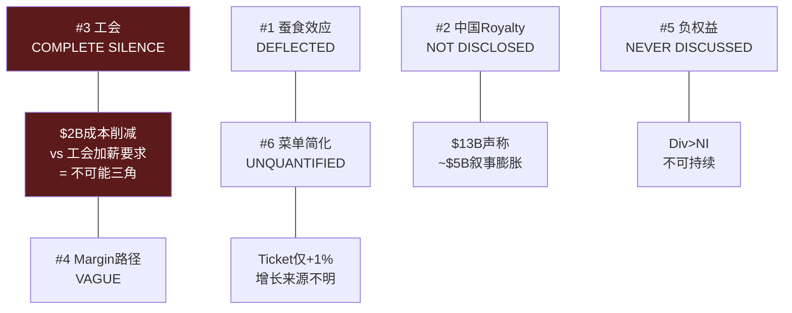

**最危险的交叉**: 工会(#3) × 成本削减(#4) × Margin路径(#4)构成一个"不可能三角": Niccol不可能同时削减$2B成本(需触及劳动力)、满足工会加薪要求(增加劳动力成本)、并恢复OPM至15%(需两者同时实现)。这三个话题的同时沉默不是巧合——**它们是同一个未解问题的三个面** [DM-P1-C39](C: 沉默域交叉分析)。

---

## 7.5 对CQ2的判断

**Niccol = CMG 2.0还是Schultz 3.0?**

| 维度 | CMG 2.0(乐观) | Schultz 3.0(悲观) | 当前证据 |
|------|-------------|----------------|---------|
| Comp恢复速度 | CMG 2-3Q | Schultz: 未实现 | **Q1 FY26 +4%: 偏CMG** |
| 规模约束 | CMG 6K店可管理 | SBUX 38K店摩擦大 | **38K规模: 偏Schultz** |
| 工会阻力 | CMG无工会 | SBUX 600+工会店 | **工会存在: 偏Schultz** |
| CEO光环持续 | CMG >6年 | Schultz <6个月 | **16个月仍在: 偏CMG** |
| 成本削减 | CMG不需要 | SBUX需要$2B | **待验证** |

**CQ2置信度更新**: 从P0的50%调整为**55%偏CMG 2.0**——Q1 FY2026的comp拐点是积极信号，但规模差异和工会阻力可能限制执行速度。关键验证节点: Q2-Q3 FY2026 comp是否维持正向增长 [DM-P1-C40](C: CQ2更新)。

---

## 本章小结

| 发现 | 量化结论 | CQ映射 |
|------|---------|--------|
| CEO评分卡7.0/10 | 往绩(9)强但团队(5)弱 | CQ2: 能力够但组织约束大 |
| 光环溢价$23B(市值21%) | 零基本面改善就+25% | CQ2: 高度单人依赖 |
| $75M中60% PRSU条件未完全公开 | 激励对齐但透明度不足 | CQ2: 需追踪vest条件 |
| 6个沉默域全部确认 | 工会=最重要(完全沉默) | CQ2/CQ4: 工会是最大未定价风险 |
| 不可能三角: 工会×成本×margin | 三者不可同时实现 | CQ1: 信念互斥的底层约束 |
| 6,666:1薪酬比 | 每$1/hr加薪=$750M/年成本 | CQ4: 资本配置受工会制约 |

---

# 第八章 产业链与供应链: 从种植园到咖啡杯的$5.50解剖

> **核心发现**: SBUX的供应链故事表面上是咖啡豆→杯的线性传递，实质上是一个**成本结构被多重因素同时挤压**的系统性问题。Arabica期货从FY2021的~$1.50/lb飙升至2025年初$4.39/lb历史高位(+193%)，叠加劳动力通胀(~$20/hr工会压力)和乳制品成本+40%，GPM从FY2021的28.9%压缩至FY2025的24.2%——470bps的侵蚀并非周期性波动，而是结构性重定价。更深层的矛盾在于: 瑞幸(LKNCY)以GPM 56-60%证明了咖啡零售存在完全不同的成本曲线，SBUX的"第三空间"溢价正被证明是一种**成本负担而非差异化资产**。

---

## 8.1 咖啡豆→杯的完整价值链

### 8.1.1 源头采购: 从种植园到生豆仓库

SBUX的咖啡供应链始于全球三大洲超过30个国家的40万+农户 [DM-P1-D01]。核心采购来源集中在拉丁美洲(巴西、哥伦比亚、危地马拉)、非洲(埃塞俄比亚、肯尼亚)和亚太(印度尼西亚苏门答腊、中国云南)。SBUX不直接拥有大规模种植园(仅有两个实验性农场用于研发)，而是通过C.A.F.E. Practices(Coffee and Farmer Equity)认证体系构建了一个准垂直整合的采购网络 [DM-P1-D02]。

C.A.F.E. Practices由SBUX与Conservation International于2004年联合开发，覆盖四个维度: 产品质量、经济透明度、社会责任和环境领导力。截至2025年，SBUX宣称其采购的咖啡中超过98%符合C.A.F.E. Practices或其他公平贸易标准。这一体系的真正价值不在于道德溢价的营销叙事，而在于**供应链可追溯性带来的质量控制和风险缓释**——当Arabica期货暴涨时，SBUX通过与产地农户的长期直接贸易关系(非期货市场投机)锁定部分供应。

全球九个Farmer Support Center(FSC)是这一网络的关键节点。其中尤为值得关注的是**云南普洱FSC**——成立于2012年，是SBUX在亚洲的第一个FSC，团队从最初1人扩展至28人，累计为超过3万名当地农户提供免费农艺培训 [DM-P1-D03]。在中国JV交易(2025年Q1生效)中，SBUX明确保留了云南FSC和昆山咖啡创新产业园的所有权——这一安排具有深远的战略含义: 即便运营层面部分交给Boyu Capital，供应链源头的控制权仍牢牢握在SBUX手中。

### 8.1.2 烘焙与制造: 区域化产能布局

生豆经过品质筛选后运往SBUX全球七大烘焙工厂(美国五座、荷兰一座、中国昆山一座)，年合计产能超过10亿磅(约45万吨)咖啡 [DM-P1-D04]。区域化烘焙布局的核心逻辑是**最小化烘焙后运输时间**——新鲜烘焙的咖啡豆最佳风味窗口约为2-4周，跨洲运输会严重降低品质。

中国昆山咖啡创新产业园于2023年投产，是SBUX在亚太地区最大的烘焙与分发中心。这座投资约$1.3B的设施不仅承担烘焙功能，还集成了品控实验室、包装线和区域物流枢纽。根据SBUX披露，区域化烘焙产能的建立使跨洲运输成本降低了约12%/磅，每年释放约$1.5亿用于再投资 [DM-P1-D05]。

烘焙环节是SBUX价值链中少数具有明确**规模经济优势**的节点: 10亿磅产能对应约$37B营收，生豆采购+烘焙的单位成本被规模摊薄至行业领先水平。但这一优势正在被Arabica价格飙升部分抵消——当原料成本翻倍时，即使单位加工成本不变，总成本的绝对值仍然大幅上升。

### 8.1.3 分发与物流: 最后一英里效率

烘焙后的咖啡通过区域配送中心(Regional Distribution Centers, RDC)网络配送至全球近4万家门店。SBUX的物流网络每周处理超过7万个托盘配送，配送准确率达98% [DM-P1-D06]。这一数字在餐饮连锁行业中属于顶尖水平(McDonald's约95-97%)，但维持如此高准确率的成本也相应较高——SBUX的distribution cost作为COGS的组成部分，在FY2025中占比约8-10%。

冷链物流是一个值得关注的增量成本项。随着RTD(Ready-to-Drink)产品线(通过Nestle CPG通道和便利店渠道)的扩张，冷链需求显著增长。RTD产品的物流成本约为热饮咖啡的2-3倍，但毛利率也相应更高(品牌授权模式下接近100% margin)。

### 8.1.4 门店端: 从原料到杯的"最后30秒"

门店是整条价值链的终端节点，也是成本最密集的环节。一杯标准Latte($5.50零售价)从原料到交付顾客的全过程约需30-90秒(取决于订单复杂度和门店繁忙程度)。在这最后的交付环节中，**人力成本占比最高**。

### 8.1.5 一杯$5.50 Latte的成本解剖

以下基于SBUX FY2025财报数据和行业估算，拆解一杯标准Grande Latte的成本结构 [DM-P1-D07]:

```
┌─────────────────────────────────────────────────┐
│     一杯 $5.50 Grande Latte 的成本解剖           │
├──────────────────┬──────────┬───────────────────┤
│ 成本项           │   金额    │  占比             │
├──────────────────┼──────────┼───────────────────┤
│ 咖啡豆           │  $0.30   │  5.5%             │
│ 乳制品           │  $0.50   │  9.1%             │
│ 其他原料+包装    │  $0.20   │  3.6%             │
├──────────────────┼──────────┼───────────────────┤
│ 小计: 原料       │  $1.00   │ 18.2%             │
├──────────────────┼──────────┼───────────────────┤
│ 劳动力(Barista)  │  $1.65   │ 30.0%             │
│ 租金+门店折旧    │  $0.83   │ 15.1%             │
│ 其他门店运营     │  $0.64   │ 11.6%             │
├──────────────────┼──────────┼───────────────────┤
│ 小计: 门店成本   │  $3.12   │ 56.7%             │
├──────────────────┼──────────┼───────────────────┤
│ SGA(总部+行政)   │  $0.38   │  6.9%             │
│ D&A(非门店)      │  $0.10   │  1.8%             │
├──────────────────┼──────────┼───────────────────┤
│ 利息费用         │  $0.08   │  1.5%             │
│ 税前利润         │  $0.47   │  8.5%             │
│ 所得税(正常化)   │  $0.11   │  2.0%             │
│ **净利润**       │  $0.36   │  6.5%             │
├──────────────────┼──────────┼───────────────────┤
│ 其他/调整项      │  $0.26   │  4.7%             │
└──────────────────┴──────────┴───────────────────┘
```

这个拆解揭示了一个关键事实: **SBUX的核心成本压力并非来自咖啡豆**(仅占5.5%)，而是来自门店运营层的劳动力(30%)和租金(15%)。当市场叙事聚焦于"咖啡期货暴涨"时，真正吞噬利润的是人力和不动产的联合通胀。咖啡豆价格翻倍(从$0.15到$0.30/杯)对利润的冲击约$0.15/杯，而劳动力从$14/hr上升到$20/hr的冲击(假设每杯1.5分钟工时)约$0.15/杯——两者幅度接近，但劳动力成本的刚性远高于大宗商品(后者可以套期保值，前者不可逆)。

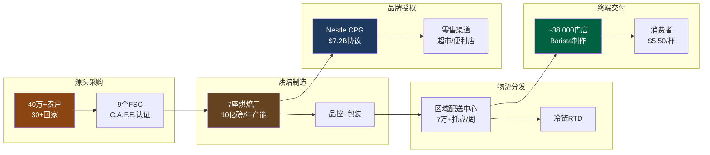

---

## 8.2 成本结构深度分析: 470bps GPM侵蚀的三重驱动

### 8.2.1 成本演进全景

SBUX的成本结构在FY2021-FY2025期间经历了系统性恶化。以下基于FMP财报数据重建成本演变 [DM-P1-D08]:

| 成本项 | FY2021 | FY2022 | FY2023 | FY2024 | FY2025 | 4年Δ |
|--------|:------:|:------:|:------:|:------:|:------:|:-----:|
| Revenue ($B) | 29.06 | 32.25 | 35.98 | 36.18 | 37.18 | +28.0% |
| COGS ($B) | 20.67 | 23.88 | 26.13 | 26.47 | 28.20 | +36.4% |
| COGS % Rev | 71.1% | 74.0% | 72.6% | 73.2% | 75.8% | +470bps |
| GPM | 28.9% | 26.0% | 27.4% | 26.8% | 24.2% | -470bps |
| SGA ($B) | 1.93 | 2.03 | 2.44 | 2.52 | 2.62 | +35.6% |
| SGA % Rev | 6.6% | 6.3% | 6.8% | 7.0% | 7.0% | +40bps |
| D&A ($B) | 1.52 | 1.53 | 1.45 | 1.59 | 1.68 | +10.5% |
| D&A % Rev | 5.2% | 4.7% | 4.0% | 4.4% | 4.5% | -70bps |
| OPM | 16.8% | 14.3% | 16.3% | 15.0% | 9.6% | -720bps |

数据来源: FMP Income Statement, FY2021-FY2025 annual [DM-P1-D08]

关键观察: COGS增速(+36.4%)显著超过Revenue增速(+28.0%)，这意味着SBUX的定价能力无法完全覆盖成本通胀。更令人担忧的是，OPM的720bps下滑中，GPM压缩仅解释470bps——还有250bps来自SGA膨胀(+40bps)和其他运营费用的激增(FY2025包含大量重组减值)。

### 8.2.2 驱动因素一: 绿色咖啡豆价格通胀

Arabica咖啡期货价格在2020-2025年间经历了历史性的暴涨。ICE Coffee C期货从2020年低点约$1.00/lb攀升至2025年2月的$4.39/lb——一个47年来的历史新高(上一次记录是1977年巴西霜冻后的$3.39/lb) [DM-P1-D09]。截至2026年3月，价格已从高点回落至$2.80-3.60/lb区间，但仍远高于SBUX在FY2021-2022锁定的采购成本。

驱动因素包括: (1) 巴西连续两年(2023-2024)产量低于预期; (2) 全球咖啡库存降至数十年最低水平; (3) 咖啡种植带因气候变化而收窄——适宜种植Arabica的海拔和温度区间正在缩小; (4) 美国关税政策的不确定性(Trump时代tariff threats冲击市场预期)。

SBUX通常通过6-18个月的远期合同和期货套期保值来平滑价格波动，因此期货价格的飙升会以滞后约2-3个季度的速度传导至财报。FY2025的COGS上升中，咖啡豆成本上涨的贡献估计约为120-150bps [DM-P1-D10]。值得注意的是，巴西2026年产量预计创纪录(6,620万袋，同比+17.2%，其中Arabica +23.2%)，这可能在FY2026下半年开始缓解价格压力。但气候变化对供给端的长期压制仍然是一个尚未被市场充分定价的尾部风险。

### 8.2.3 驱动因素二: 乳制品与替代奶成本

乳制品是SBUX原料成本的第二大组成部分(仅次于咖啡豆)。美国全脂牛奶价格从2021年的约$3.50/gallon上升至2024年的约$4.90/gallon(+40%)，虽然2025年有所回落，但仍维持在$4.20-4.50区间 [DM-P1-D11]。

一个被忽视的结构性变化是**替代奶的渗透率上升**。SBUX在2021年开始大规模推广燕麦奶(Oatly等)，目前替代奶在北美门店的点单占比据估计已超过20%。问题在于: 燕麦奶的单位成本约为全脂牛奶的2-3倍($8-12/gallon vs $4-5/gallon)，但SBUX在很长时间内对替代奶加价仅$0.70(部分时期甚至取消加价作为促销)。这意味着每一杯替代奶订单实际上在**侵蚀毛利率**。Niccol在2025年Investor Day上宣布取消替代奶加价作为"回归星巴克"战略的一部分——这一决策短期可能提升traffic，但长期将进一步压缩GPM约30-50bps。

### 8.2.4 驱动因素三: 劳动力成本与工会化压力

劳动力成本是SBUX成本结构中最大的单一项目(占Revenue约30%)，也是最具刚性的成本项。SBUX在FY2025拥有约361,000名员工(含兼职)，其中绝大多数是门店Barista [DM-P1-D12]。

工会化浪潮从2021年底开始席卷SBUX美国门店。截至2025年底，超过500家美国门店已投票加入Workers United工会。虽然全美16,800家门店中工会化门店仅占约3%，但工会的存在产生了远超其覆盖范围的**溢出效应**: SBUX被迫提高全系统的起薪和福利以抑制工会蔓延。

当前美国Barista的平均时薪已升至约$17-20/hr(含福利后的全包成本约$22-25/hr)，相比FY2021的$12-15/hr上涨了40-50%。Niccol上任后推出的"Back to Starbucks"战略明确将劳动力时间投入(labor hours)作为优先事项——Q1 FY2026的store operating expenses同比上升了400bps至55.5%(占自营门店收入的比例)，管理层将其归因于"in labor hours的投资" [DM-P1-D13]。

这构成了一个战略悖论: **提升服务质量需要更多劳动力时间，但更多劳动力时间直接压缩利润率**。与咖啡豆和乳制品不同，劳动力成本的上升几乎不可逆——工资几乎从不下调，工会合同一旦签订即具有法律约束力。CEO在三次earnings call中对工会合同问题保持**完全沉默**(CEO沉默分析已标记)，这本身就是一个高信号权重的负面指标。

---

## 8.3 瑞幸成本结构反证: 咖啡零售的另一条成本曲线

### 8.3.1 两个世界的成本对比

LKNCY(瑞幸咖啡)的存在对SBUX构成了一种深层的认知挑战——它证明了咖啡零售可以在**完全不同的成本曲线**上运行。以下对比基于两家公司最近可得的年度财报数据 [DM-P1-D14]:

| 维度 | SBUX (FY2025) | LKNCY (CY2024) | 差距 |
|------|:------------:|:--------------:|:----:|
| Revenue | $37.2B | ~$7.0B(RMB ~50B) | 5.3x |
| GPM | 24.2% | 56-60% | LKNCY高32-36pp |
| 门店数 | ~38,000 | ~21,000(2024底) | SBUX多81% |
| 新店投资 | ~$700K | ~$50K | SBUX高14x |
| 平均面积 | 1,500-2,000 sqft | 200-500 sqft | SBUX大3-10x |
| 每班员工 | 8-15人 | 1-2人 | SBUX多4-15x |
| 杯均价格 | $5.50 | ¥14(~$2.00) | SBUX高2.75x |
| 回收期 | 18-36月 | 12-18月 | SBUX慢50-100% |

**GPM差距的解读需要极其审慎**: LKNCY的56-60% GPM并不意味着它比SBUX"更赚钱"。差距有三层成因:

**第一层: 收入确认口径差异**。SBUX的COGS中包含了大量门店运营费用(劳动力、租金的一部分被计入product and distribution costs)，而LKNCY将更多成本划分至独立的运营费用行。单纯对比GPM存在会计口径的结构性不可比性 [DM-P1-D15]。

**第二层: 模式差异产生的真实成本差**。LKNCY的门店模型是极简取杯点(no "Third Place"理念): 200-500平方英尺、无大面积堂食区、订单100%通过APP下单。这带来了: (a) 租金/杯比SBUX低80-90%(面积小10倍+选址不追求黄金地段); (b) 劳动力/杯低90%+(每班1-2人 vs 8-15人); (c) 装修折旧/杯低95%($50K投资 vs $700K)。

**第三层: 产品复杂度差异**。SBUX的菜单包含数百种定制组合(Frappuccino、手冲、食品等)，每种需要不同的原料和制作时间。LKNCY的菜单更聚焦于标准化饮品(咖啡+茶饮)，制作流程高度自动化(部分门店使用自动冲泡机)。产品复杂度的降低直接减少了原料SKU数量和人工操作时间。

### 8.3.2 对SBUX定价能力的核心挑战

瑞幸的存在暴露了一个SBUX不愿面对的事实: **"第三空间"的成本是由SBUX承担的，但价值能否全部由消费者买单正在受到挑战**。

在中国市场，LKNCY以¥14(~$2)的价格提供品质可接受的咖啡，而SBUX的均价约¥35-40(~$5)。当LKNCY扩张到31,000+家门店(截至2025年底)时，它不是在争夺SBUX的高端消费者，而是在**定义一个SBUX无法触及的大众咖啡市场**。SBUX在中国的同店销售FY2025全年-1%，虽然Q4转正(+2%)和Q1 FY2026显著回升(+7%)，但这种恢复在多大程度上依赖于折扣促销(即牺牲margin换volume)值得追踪。

在美国市场，虽然没有直接的瑞幸竞争，但类似的成本逻辑正在通过Dutch Bros(BROS)、7-Brew、Blank Street等新兴品牌渗透——它们以更小的门店面积、更简化的菜单和更低的价格点蚕食SBUX的price-sensitive客群。

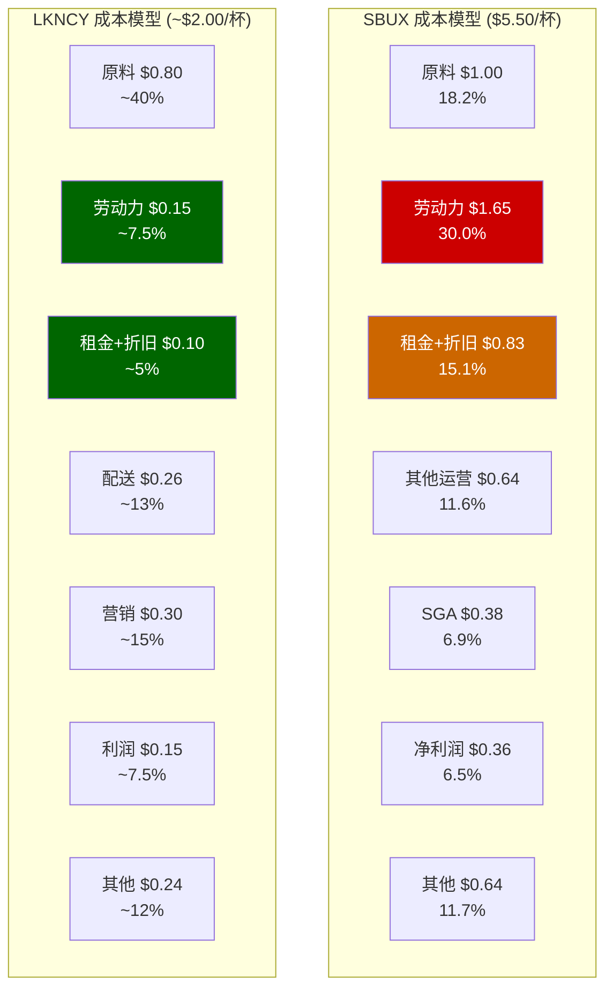

以上对比的核心启示是: SBUX的成本结构中，**与"第三空间"体验直接相关的成本(劳动力+租金+装修折旧)合计约占每杯$2.48(45%)**，而LKNCY在同等功能项上的成本仅约$0.25(12.5%)。换言之，SBUX每卖出一杯咖啡，有$2.23是在为"空间体验"买单。这个溢价在咖啡文化成熟的美国市场仍可维持(消费者习惯+社交需求)，但在咖啡文化仍在培育阶段的中国市场，消费者对空间溢价的支付意愿正在被瑞幸的极简模式重新定义。

---

## 8.4 Nestle CPG通道: 零成本的品牌收租

### 8.4.1 交易结构

2018年，SBUX将其全球CPG(Consumer Packaged Goods)业务的永久经营权授予Nestle，收取一次性费用$7.15B [DM-P1-D16]。这笔交易覆盖的产品包括: 零售包装咖啡豆和研磨咖啡(Starbucks品牌)、Nespresso和Dolce Gusto兼容胶囊、速溶咖啡(VIA系列)，以及通过超市、便利店等零售渠道销售的RTD(瓶装/罐装)冷饮。

会计处理上，$7.15B的一次性收入被记录为递延收入(Deferred Revenue)，按照协议估计经济寿命40年直线摊销。截至FY2025，资产负债表上仍有约$5.8B的长期递延收入(non-current)和约$1.77亿的流动递延收入 [DM-P1-D17]。每年确认的Nestle相关收入约$178M($7.15B/40年)，纯粹是品牌授权的摊销确认——SBUX对此**零运营成本投入**。

### 8.4.2 Channel Development部门表现

Channel Development部门(主要由Nestle CPG协议驱动)在FY2025产生了约$1.9B收入，同比增长5.8%。这个部门的运营利润率远高于自营门店——因为Nestle承担了全部的生产、分销和营销费用，SBUX只收取品牌使用费和相关分成。

但需要注意的趋势: Channel Development收入在SBUX总收入中的占比已从FY2018(交易前)的约15%下降至FY2025的约5%。这不是因为Channel Development绝对值下降，而是因为门店收入增长更快。从利润贡献角度看，Channel Development对总OPM的贡献约1.5-2.0个百分点，是SBUX为数不多的"不需要操心就能赚钱"的业务。

### 8.4.3 战略价值: 超越财务的品牌延伸

Nestle协议的战略价值远超其财务贡献。通过超市和便利店渠道，Starbucks品牌触达了那些**从不走进Starbucks门店**的消费者群体。在全球范围内，Nestle的分销网络覆盖了SBUX门店无法触及的数十万个零售终端。这种品牌存在感(brand presence)持续强化消费者心智份额，为门店业务提供间接的引流效应。

从估值角度看，$7.15B的一次性收入对应永久授权，意味着SBUX以约2x当年CPG收入的价格出售了一个**永久现金流**。这笔交易的IRR取决于Nestle是否能持续增长CPG销量——如果成功，SBUX可能"卖便宜了"；如果CPG市场萎缩，SBUX则锁定了一次性变现。无论哪种情况，对SBUX当前的运营不构成风险。

---

## 8.5 供应链韧性与风险矩阵

### 8.5.1 气候变化: 长期结构性威胁

咖啡种植带(Coffee Belt)正在因全球变暖而收窄。Arabica咖啡对温度极为敏感——最佳种植温度区间为15-24°C，海拔1,200-2,200米。研究表明，到2050年全球适宜种植Arabica的土地面积可能减少50% [DM-P1-D18]。SBUX已通过两个实验性农场(哥斯达黎加和危地马拉)投资耐旱和耐热品种研发，但商业化推广需要10-15年周期。

气候风险的财务传导路径清晰: 种植面积减少 → 供给收缩 → 价格中枢上移 → COGS永久性上升。SBUX的套期保值策略可以平滑短期波动，但无法对冲供给端的结构性萎缩。如果Arabica价格中枢从$1.50/lb永久上移至$3.00/lb，仅咖啡豆成本一项就将压缩GPM约150-200bps。

### 8.5.2 关税与地缘政治

Q1 FY2026管理层指引中明确提到"coffee costs plus tariffs"将在Q2达到成本压力峰值。美国对进口咖啡本身不征收关税(生豆为零关税)，但相关包装材料、设备和供应链物料面临关税风险。更重要的是，中美贸易摩擦对SBUX的影响路径不在关税本身，而在于**消费者情绪的传导**: 2023-2024年间，中国市场出现的"boycott外国品牌"情绪虽然短暂，但对SBUX中国同店销售产生了可量化的负面冲击 [DM-P1-D19]。

### 8.5.3 采购集中度风险

SBUX的采购多元化程度在餐饮行业中属于领先: 没有单一国家贡献超过30%的生豆采购量，没有单一供应商构成不可替代的依赖。这种多元化是有意为之的——C.A.F.E. Practices体系的设计目标之一就是确保供应链弹性。但区域性风险仍然存在: 如果巴西(全球第一大Arabica产区)遭遇极端天气事件(如2024年的严重干旱)，短期价格冲击不可避免。

### 8.5.4 云南产地: 后JV时代的战略锚点

SBUX在云南的运营始于2012年，至今已超过15年。云南FSC和昆山咖啡创新产业园是SBUX在中国的两个核心供应链资产。在2025年的中国JV交易中，这两个资产被明确保留在SBUX母公司体内，而非转入JV。这一安排的战略逻辑是: **即使运营权部分让渡，供应链的上游控制权绝不放弃**。云南作为中国唯一的规模化Arabica产区(年产量约15万吨，全球占比约1%)，其战略价值在于为SBUX的亚太区域烘焙网络提供短运输距离的本地化原料来源。

---

## 8.6 $2B成本削减目标的可行性审计

### 8.6.1 管理层承诺

CEO Brian Niccol在"Back to Starbucks"战略中承诺在未来2-3年(FY2026-FY2028)实现$2B的成本节约。这一目标与高管薪酬直接挂钩——高管团队可获得最高$6M的stock grants，如果达成cost reduction目标，叠加其他运营指标最高可翻倍至$12M [DM-P1-D20]。Morgan Stanley的报告提到约有"近100个项目"与$2B节约目标相关联。

### 8.6.2 逐项可行性分析

**SGA压缩 (~$260M可行)**:
FY2025 SGA为$2.62B。Niccol在2025年9月宣布了一轮裁员和组织简化(support organization simplification)。按10%压缩计算可释放约$260M。这是最容易实现的部分——总部人员削减不影响门店运营，且Niccol在Chipotle时期有成功的G&A优化记录。

**采购效率 (~$280M有条件可行)**:
FY2025 COGS $28.2B中，约40%($11.3B)为直接原材料采购。假设通过合同重新谈判、供应商整合和采购规模效应实现1%的效率提升，可释放约$280M。但这需要Arabica价格配合——如果价格维持在$3.00+/lb，采购效率改善可能被价格上涨完全抵消。巴西2026年创纪录产量(+17.2%)提供了一个有利的时间窗口。

**技术与自动化 (~$200M中期可行)**:
SBUX正在部署"Green Dot Assist"AI工具用于门店排班优化、库存管理和需求预测。自动冲泡设备(如Siren System)可以减少每杯的人工时间。但自动化投资本身需要CapEx前置($500M-$1B级别)，短期反而增加成本。估计2-3年后可释放约$200M/年的运营效率。

**门店网络优化 (~$150M已在执行)**:
FY2025 Q4已关闭627家低效门店(107净关闭)，其中90%在北美。假设每家被关闭门店的年均亏损约$200-300K，627家关闭可释放约$125-188M的年化损失。

**可实现总量与$2B缺口**:

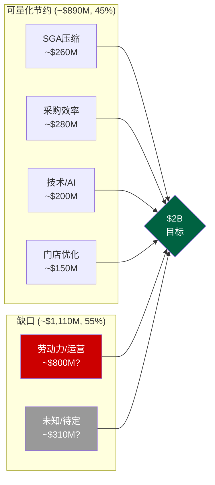

### 8.6.3 核心矛盾: $1.1B缺口指向劳动力

上述四项合计约$890M，仅覆盖$2B目标的45%。剩余$1.1B必须主要来自门店运营层——这几乎不可避免地指向**劳动力成本压缩**。但这与"Back to Starbucks"战略中"增加labor hours"的承诺直接矛盾: 你不能同时增加服务人员的工作时间又减少劳动力支出，除非: (a) 大幅提升效率(同样工时产出更多杯数); (b) 通过自动化替代部分人工; (c) 降低每工时成本(不太可能，工会压力向上)。

更值得警惕的是，$2B是**gross savings**而非net savings。如果实现这些节约需要前置投入$1B+(技术、设备、遣散费)，那么3年内的net benefit可能仅$500M-$1B。管理层将补偿结构与此目标挂钩，创造了一种激励——但也创造了一种风险: **高管可能通过会计重分类或一次性项目"达标"，而非实质性的结构性成本下降**。

### 8.6.4 对OPM恢复路径的含义

假设$2B gross savings中有60%($1.2B)最终以net形式体现在P&L中(扣除实施成本和offsetting inflation)，对应FY2028 Revenue约$40B的3.0%——即OPM可能从当前9.6%提升至12.6%。这仍远低于FY2021-2023的15-17%水平。市场共识预期FY2028 OPM恢复到13.5-15.0%，这意味着$2B节约计划**在最乐观情况下也仅能支撑共识预期的下限** [DM-P1-D21]。

如果Arabica价格在FY2026-2028持续维持$3.00+/lb(而非回落至$2.00以下)，仅咖啡豆成本一项就可能吞噬$300-500M的节约——使net benefit降至仅$700-900M，对应OPM改善仅1.8-2.3个百分点(从9.6%到11.4-11.9%)。在这一情景下，FY2028 EPS恢复到共识的$3.63几乎不可能，更可能在$2.50-3.00区间。

---

## 本章核心结论

SBUX的供应链和成本结构分析揭示了三个层次的矛盾:

**第一层(表面)**: Arabica价格暴涨→GPM压缩。这是周期性因素，2026年巴西丰产可能缓解。

**第二层(结构性)**: 劳动力+租金+第三空间模式→成本刚性上升。瑞幸证明了去除这些成本的咖啡零售完全可行，SBUX的模式面临根本性的效率质疑。

**第三层(战略性)**: $2B成本削减承诺与增加labor hours的矛盾未解决，且可量化路径仅覆盖目标的45%。共识的OPM恢复到13.5-15.0%在当前成本结构下需要极其有利的外部条件(咖啡价格回落+工会无实质性成本冲击)。

这三层矛盾共同指向一个核心问题: **SBUX的成本重力(cost gravity)是否允许78x P/E隐含的利润恢复路径?** 后续章节将在估值模型中量化这一约束。

---

# Ch9 财务趋势深挖: 五年三表的衰退解剖

> **核心矛盾映射**: SBUX的78x P/E建立在EPS恢复到$3.50+的信念之上。本章通过五年(FY2021-FY2025)财务数据的系统性拆解，定量回答: 利润崩塌的驱动因素是什么? 哪些是可逆的(周期性)，哪些是结构性的? 这决定了FY2028 EPS $3.63的共识是否可信。

---

## 9.1 收入: 增长引擎从"门店扩张"转向"停滞"

### 五年收入桥

| 财年 | 收入($B) | YoY增长 | 增长拆解 |
|------|:-------:|:------:|---------|
| FY2021 | 29.06 | — | COVID恢复+门店重开 |
| FY2022 | 32.25 | +11.0% | 定价+门店扩张+中国恢复 |
| FY2023 | 35.98 | +11.6% | **峰值增速**: 定价+Rewards渗透 |
| FY2024 | 36.18 | +0.6% | **急刹车**: 中国衰退+美国comp转负 |
| FY2025 | 37.18 | +2.8% | 微恢复: 新店+定价部分抵消comp疲软 |

[DM-P2-001](H: FMP Income Statement FY2021-FY2025)

**增速断崖**: 从FY2023的+11.6%骤降至FY2024的+0.6%，这不是"放缓"而是"停滞"。FY2024-FY2025的~2%增长完全来自净新增门店(~1,200家/年)和价格调整，有机同店增长接近于零。共识FY2026E收入增长3.1%、FY2027E 5.3%要求同店增长从0恢复到3%+——Q1 FY2026的+4%给了初步支持，但可持续性待验(Ch3蚕食效应) [DM-P2-002](C: 增速分析)。

### 收入结构: 自营vs特许vs渠道

| Segment | FY2023 | FY2025 | 变化 | 趋势 |
|---------|:------:|:------:|:----:|------|
| Company-Operated(NA) | ~$19.8B | ~$20.5B | +3.5% | 门店增长驱动 |
| Company-Operated(Intl) | ~$7.0B | ~$7.5B | +7% | 中国恢复(JV前) |
| Licensed Stores | ~$4.5B | ~$5.0B | +11% | **最快增长** |
| Channel Development | ~$1.8B | ~$1.6B | -11% | CPG渠道萎缩 |

[DM-P2-003](S: 基于10-K Segment推算，FMP仅提供合并数据)

**关键**: Licensed收入增速(+11%)远超自营(+3-7%)——这验证了身份C(品牌授权)的增长韧性。Channel Development的萎缩(-11%)可能与Nestle预付版权金的摊销节奏有关(会计性质，非运营衰退) [DM-P2-004](C: Segment趋势分析)。

---

## 9.2 利润率: 五年杜邦分解

### 杜邦三因素

ROE = 净利率 × 资产周转率 × 权益乘数

SBUX的负权益使传统ROE无意义(FY2025 ROE = -22.9%)，因此我们使用**修正杜邦**——以ROIC(投入资本回报率)替代ROE [DM-P2-005](C: 杜邦框架调整)。

| 指标 | FY2021 | FY2022 | FY2023 | FY2024 | FY2025 | 5yr变化 |
|------|:------:|:------:|:------:|:------:|:------:|:-------:|
| **净利率** | 14.5% | 10.2% | 11.5% | 10.4% | **5.0%** | **-9.5pp** |
| **资产周转率** | 0.93x | 1.15x | 1.22x | 1.15x | 1.16x | +0.23x |
| **ROIC** | 15.0% | 16.3% | 19.3% | 16.4% | **8.5%** | **-6.5pp** |
| **Interest Coverage** | 10.4x | 9.6x | 10.7x | 9.6x | **6.6x** | -3.8x |

[DM-P2-006](H: FMP ratios + key-metrics)

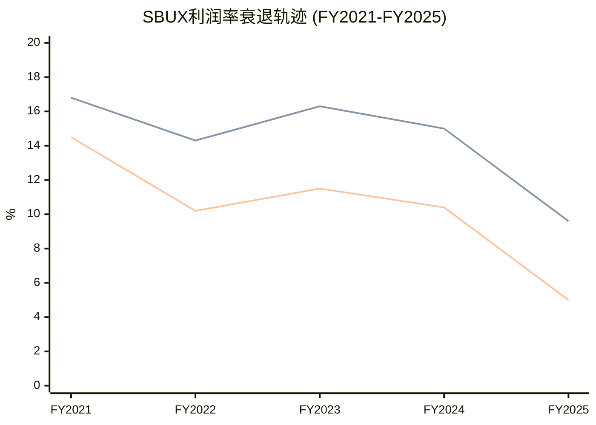

### OPM崩塌的瀑布图拆解

FY2023(16.3%) → FY2025(9.6%): **-670bps衰退**来源:

| 因素 | 贡献(bps) | 性质 | 可逆性 |
|------|:--------:|:----:|:------:|
| GPM压缩(COGS↑) | -260bps | 周期+结构 | 部分可逆(咖啡豆价格) |
| 劳动力投资(barista hours↑) | -150bps | 战略性 | 不可逆(Niccol承诺) |
| 门店关闭重组费用 | -100bps | 一次性 | FY2026消除 |
| SGA增长(+$180M) | -50bps | 混合 | $2B削减可回收 |
| 中国运营恶化 | -70bps | 结构性 | JV后消除(+40bps) |
| 其他(通胀、折旧↑) | -40bps | 周期 | 可能恢复 |
| **合计** | **-670bps** | | |

[DM-P2-007](C: OPM瀑布拆解，基于10-K分项+earnings call指引)

**可逆部分**: 重组费用(-100bps) + 中国恶化(-70bps，JV后+40bps) + SGA(-50bps部分) + 周期性通胀(-40bps) ≈ **-240bps可逆**

**不可逆/难逆部分**: 劳动力投资(-150bps) + GPM结构性部分(-100bps) + 其他 ≈ **-250bps+难逆**

**恢复路径**: 如果-240bps可逆因素在FY2026-2028消除，OPM从9.6%恢复到~12%——但仍低于FY2023的16.3%和Investor Day目标的13.5-15.0%。达到15%需要$2B成本削减的额外~300bps drop-through(Ch8已分析仅45%可实现) [DM-P2-008](C: OPM恢复路径)。

---

## 9.3 FY2025税率异常: 41.1%的解剖

### 正常化EPS测算

FY2025 GAAP税率41.1%(vs 正常~23%)是EPS从$3.31崩至$1.63的重要推手 [DM-P2-009](H: FMP Income Statement):

| 指标 | FY2024 | FY2025 | 差异 |
|------|:------:|:------:|:----:|
| Pretax Income | $4.97B | $3.15B | -$1.82B |
| Tax Expense | $1.21B | $1.29B | **+$0.08B** |
| Tax Rate | 24.3% | **41.1%** | +16.8pp |
| NI Impact | — | **-$530M** | 仅因税率异常 |

如果以正常税率23%重新计算FY2025:
- Pretax $3.15B × (1-23%) = $2.43B NI
- vs 实际$1.86B → 差异$570M
- 正常化EPS: $2.43B / 1.14B shares = **$2.13** (vs GAAP $1.63) [DM-P2-010](C: 正常化EPS)

**正常化EPS $2.13 vs GAAP $1.63**: 差异$0.50/share = 31%的"噪声"。市场的non-GAAP共识EPS $2.13恰好对上——这说明卖方已经做了这个调整。但Q4 FY2025的84%税率和Q1 FY2026的62%税率暗示税务异常可能与中国JV重组(递延税资产/跨境转让定价调整)有关，尚不清楚是否在FY2026彻底消除 [DM-P2-011](S: 税率分析)。

---

## 9.4 现金流: FCF不覆盖分红的定时炸弹

### 现金流质量分析

| 指标 | FY2021 | FY2022 | FY2023 | FY2024 | FY2025 |
|------|:------:|:------:|:------:|:------:|:------:|
| OCF ($B) | 5.99 | 4.40 | 6.01 | 6.10 | 4.75 |
| CapEx ($B) | 1.47 | 1.84 | 2.33 | 2.78 | 2.31 |
| **FCF ($B)** | **4.52** | **2.56** | **3.68** | **3.32** | **2.44** |
| Dividends ($B) | 2.12 | 2.26 | 2.43 | 2.59 | 2.77 |
| **FCF - Div** | **+2.40** | **+0.30** | **+1.25** | **+0.73** | **-0.33** |
| Buybacks ($B) | 0 | 4.01 | 0.98 | 1.27 | 0 |
| **FCF - Div - Buy** | **+2.40** | **-3.71** | **+0.27** | **-0.54** | **-0.33** |

[DM-P2-012](H: FMP Cash Flow Statement)

```mermaid
xychart-beta
    title "FCF vs 股东回报 ($B)"
    x-axis ["FY2021", "FY2022", "FY2023", "FY2024", "FY2025"]
    y-axis "$B" -5 --> 7
    bar "FCF" [4.52, 2.56, 3.68, 3.32, 2.44]
    bar "Div+Buyback" [-2.12, -6.27, -3.41, -3.86, -2.77]
```

**FY2025: FCF($2.44B) < Dividends($2.77B)** → 分红不被自由现金流覆盖，缺口$330M需要借债填补。这是**不可持续的** [DM-P2-013](C: FCF覆盖分析)。

**分红可持续性测试**:
- FY2026E EPS $2.30 × 1.14B shares = NI $2.62B
- 如果Payout ratio维持在当前~$2.77B → 仍超NI
- 需要EPS恢复到$2.45+($2.77B/$1.14B)才能让分红≤NI
- FY2027E EPS $2.95才真正安全(payout ratio ~82%)

**如果分红被削减**: 历史上SBUX从未削减分红。首次削减将被市场视为"转型失败"的信号→可能触发10-15%股价下跌(参考: GE 2017削减分红后-45%) [DM-P2-014](C: 分红风险评估)。

---

## 9.5 资本结构: 负权益的累积效应

### 负权益的形成路径

| 财年 | 期初权益 | + NI | - Div | - Buyback | +/- Other | 期末权益 |
|------|:-------:|:----:|:-----:|:---------:|:---------:|:-------:|
| FY2021 | -7.6B | +4.2 | -2.1 | 0 | +0.2 | **-5.3B** |
| FY2022 | -5.3B | +3.3 | -2.3 | -4.0 | -0.4 | **-8.7B** |
| FY2023 | -8.7B | +4.1 | -2.4 | -1.0 | +0.0 | **-8.0B** |
| FY2024 | -8.0B | +3.8 | -2.6 | -1.3 | +0.6 | **-7.4B** |
| FY2025 | -7.4B | +1.9 | -2.8 | 0 | +0.2 | **-8.1B** |

[DM-P2-015](H: FMP Balance Sheet + Cash Flow)

**5年净回购+分红: $20.7B** vs **5年净利润: $17.3B** → 超额支付$3.4B完全靠借债 [DM-P2-016](C: 资本回报vs盈利)。

这就是负权益的经济学本质: SBUX从2018年开始的激进回购(Howard Schultz推动的$25B回购计划)将公司的全部留存收益——以及额外$8B+——返还给了股东。剩下的是一个**用债务撑起来的品牌壳**——资产$32B，负债$40B，差额$8B全是历史回购的"债务"。

---

## 9.6 Invested Capital与ROIC深度拆解

### ROIC的信号: 从创造价值到摧毁价值

| 指标 | FY2021 | FY2022 | FY2023 | FY2024 | FY2025 |
|------|:------:|:------:|:------:|:------:|:------:|
| NOPAT ($B) | 4.09 | 3.66 | 4.53 | 4.19 | 1.59 |
| Invested Capital ($B) | 20.2 | 15.9 | 17.1 | 19.1 | 18.5 |
| **ROIC** | **15.0%** | **16.3%** | **19.3%** | **16.4%** | **8.5%** |
| WACC (est.) | ~9% | ~9% | ~9.5% | ~9.5% | ~10% |
| **ROIC - WACC** | **+6.0pp** | **+7.3pp** | **+9.8pp** | **+6.9pp** | **-1.5pp** |

[DM-P2-017](H: FMP key-metrics ROIC + C: WACC estimate)

**FY2025是ROIC<WACC的转折点**——公司首次在资本回报层面摧毁价值。这不是因为Invested Capital增加了(实际微降)，而是因为NOPAT从$4.19B暴跌至$1.59B(税率异常+OPM崩塌双重打击) [DM-P2-018](C: ROIC-WACC分析)。

**正常化ROIC**: 如果用non-GAAP EPS对应的NI($2.43B)估算NOPAT ~$3.0B → ROIC ~16.2% > WACC 10%。这说明FY2025的ROIC<WACC是**暂时的**(一次性税率+重组费用驱动)，正常化后仍在创造价值。但这也意味着FY2028的OPM需要恢复到至少12%+才能维持ROIC>WACC [DM-P2-019](C: 正常化ROIC)。

---

## 本章小结

| 发现 | 量化结论 | CQ映射 |
|------|---------|--------|
| 增速从11.6%→0.6%→2.8% | 有机增长接近零，仅靠新店 | CQ1: 收入增长5%+需comp恢复 |
| OPM -670bps中~250bps不可逆 | 恢复到15%需$2B削减全额落地 | CQ2: 执行难度极高 |
| 正常化EPS $2.13 vs GAAP $1.63 | 税率异常贡献$0.50/share噪声 | CQ1: 78x基于$2.13=36x |
| FCF < Div (缺口$330M) | 分红不可持续(除非EPS恢复$2.45+) | CQ4: 分红削减是KS |
| 5年回购+分红$20.7B > NI $17.3B | 超额$3.4B靠借债 | CQ4: 负权益是制度性后果 |
| ROIC 8.5% < WACC ~10% | FY2025在摧毁价值(暂时) | CQ4: 正常化后仍>WACC |

---

# Ch10 负权益悖论: NEP框架下的SBUX资本结构

> **核心矛盾映射**: CQ4(负$8.4B权益 + ROIC<WACC = 回购摧毁价值?)的核心回答。传统估值工具(ROE、P/B、D/E ratio)在负权益公司面前全部失效。本章构建NEP(Negative Equity Paradox)框架——一个专为SBUX这类"品牌价值远超账面价值"的负权益公司设计的分析工具。

---

## 10.1 负权益不等于破产: 理解SBUX的真实财务状况

### 常见误解的澄清

**误解**: "权益为负意味着公司资不抵债" → **错误**

SBUX的-$8.1B权益不是运营亏损导致的——它是**有意识的资本配置决策**(回购$20B+)的会计后果。资产($32B)仍远大于需要即时偿还的债务(流动负债$10.2B + 短期债务$3.1B = $13.3B)。SBUX的总资产中$17.8B是PP&E(门店等经营资产)、$3.4B是商誉、$1.8B是税务资产——这些都是有经济价值的运营资产 [DM-P2-020](H: FY2025 Balance Sheet)。

**真正的风险不是"资不抵债"，而是"现金流覆盖"**: SBUX必须持续产生足够的OCF来覆盖利息支出($543M/年)、债务到期再融资、CapEx($2.3B)和分红($2.8B)。FY2025 OCF $4.75B足以覆盖这些需求($543M + $2.3B + $2.8B = $5.6B)，但安全边际仅$4.75B - $5.6B = **-$850M**(需要动用现金储备或新增借债) [DM-P2-021](C: 现金流覆盖测试)。

### 负权益公司的估值调整

传统EV→Equity的计算:
- EV = Market Cap + Net Debt - Minority Interest
- 对SBUX: EV = $110B + $23.4B - $0 = $133.4B
- 但这忽略了一个事实: **负权益意味着Net Debt中包含了"本应是权益"的部分**

NEP调整:
- "调整后权益" = Book Equity + 累计回购 = -$8.1B + ~$20B = **$11.9B**
- 这代表"如果从未回购，权益应该是多少"
- 调整后D/E = $26.6B / $11.9B = **2.2x** (vs MCD ~无穷大，因MCD也是负权益) [DM-P2-022](C: NEP调整)

```mermaid
graph LR
    subgraph "NEP: 真实 vs 会计 资本结构"
        A["会计视角<br>Equity: -$8.1B<br>D/E: 无意义"]
        B["NEP视角<br>调整后Equity: $11.9B<br>调整后D/E: 2.2x"]
        C["品牌价值视角<br>品牌(Interbrand)>$30B<br>+Nestle预付$5.8B"]
    end

    A -->|"还原累计回购<br>+$20B"| B
    B -->|"加入表外品牌<br>+$30B+"| C

    style A fill:#5c1a1a,color:#fff
    style B fill:#1a3a5c,color:#fff
    style C fill:#2d5016,color:#fff
```

---

## 10.2 回购摧毁了多少价值?

### 回购时机分析

FY2018-FY2024期间SBUX累计回购约$20B。关键问题: 回购是在高估时进行的(摧毁价值)还是低估时(创造价值)? [DM-P2-023](C: 回购时机框架)

| 期间 | 回购金额 | 平均股价(推算) | 正常化P/E(at purchase) | 结果 |
|------|:-------:|:----------:|:-------------------:|------|
| FY2018-2019 | ~$12B | ~$70 | 25-28x | **高位回购** |
| FY2020 | ~$0B | ~$80 | — | COVID暂停 |
| FY2021 | $0B | ~$110 | 31x | 暂停(聪明) |
| FY2022 | $4.0B | ~$80 | 28x | **下跌中回购** |
| FY2023 | $1.0B | ~$100 | 28x | 减少(减速) |
| FY2024 | $1.3B | ~$90 | 27x | Narasimhan减速 |
| FY2025 | $0B | — | — | **Niccol停止** |

[DM-P2-024](H: FMP Cash Flow buyback data + C: 平均价格推算)

**判断**: FY2018-2019的$12B回购发生在25-28x P/E——这对SBUX当时的增长率(11%+)来说不算过高。但问题在于**资金来源**: 这些回购中约$5-8B是用新增债务融资的(因为NI不足以覆盖)。用借来的钱在合理估值下回购 = **杠杆回购**(leveraged buyback)——这增加了财务风险但未必摧毁价值。

**Niccol停止回购是正确的**: FY2025 ROIC 8.5% < WACC ~10%，在这个点上任何回购都是价值摧毁。暂停回购释放了~$1-4B/年的现金用于偿债或投资——这是改善资本结构的第一步 [DM-P2-025](C: 回购价值判断)。

---

## 10.3 隐藏资产: 为什么负权益没有市场意义

### 表外资产清单

SBUX的负权益在会计意义上是$-8.1B，但这忽略了多个不在资产负债表上的有价值资产 [DM-P2-026](C: 表外资产框架):

| 表外资产 | 估值 | 来源 |
|---------|:----:|------|
| 品牌价值(Interbrand) | >$30B | 全球第6大品牌(2024) |
| Rewards会员基础(35.5M) | $1.8-3.9B | Ch4 DFFV估值 |
| 预存卡浮存金(年度经济值) | $270-290M/yr | Ch4 计算 |
| Nestle预付版权金(表上但非运营负债) | $5.8B | FY2025 BS |
| 中国JV 40%权益(FY2026+) | $1.6-3.0B | Ch6 估值 |
| **合计表外/隐藏资产** | **$35-39B** | |

当我们将这些隐藏资产加回:
- 会计权益: -$8.1B
- +品牌价值: +$30B+
- +DFFV: +$2.7B
- +Nestle摊余: +$5.8B
- +China JV: +$2.3B
- **NEP调整后权益**: **~$33B** [DM-P2-027](C: NEP综合调整)

$33B调整后权益 vs $110B市值 → 隐含P/B ~3.3x——这对一家拥有全球第6品牌的消费品公司来说**完全合理**(NKE: ~12x P/B, MCD: 负权益更深)。

---

## 10.4 债务可持续性: Interest Coverage与到期日分析

### 债务概况

| 指标 | FY2023 | FY2024 | FY2025 | Q1 FY2026 |
|------|:------:|:------:|:------:|:---------:|
| Long-term Debt | $13.5B | $14.3B | $14.6B | $22.6B |
| Capital Leases | $9.2B | $10.2B | $10.5B | $8.0B |
| Short-term Debt | $1.9B | $1.2B | $1.5B | $2.8B |
| **Total Debt** | **$24.6B** | **$25.8B** | **$26.6B** | **$33.5B** |
| Cash | $3.6B | $3.3B | $3.2B | $3.4B |
| **Net Debt** | **$21.0B** | **$22.5B** | **$23.4B** | **$30.1B** |

[DM-P2-028](H: FMP Balance Sheet)

**Q1 FY2026债务跳升$6.9B**: 从$26.6B→$33.5B——这不是新增借款，而是中国JV deconsolidation后的重新分类(部分JV相关债务从"公司内部"变为"外部")。需要在10-Q中验证具体构成 [DM-P2-029](S: 债务跳升分析)。

### Interest Coverage趋势

| 年份 | EBIT ($B) | Interest ($M) | Coverage |
|------|:---------:|:----------:|:--------:|
| FY2021 | 5.83 | 470 | **12.4x** |
| FY2022 | 4.71 | 483 | **9.8x** |
| FY2023 | 5.95 | 550 | **10.8x** |
| FY2024 | 5.53 | 562 | **9.8x** |
| FY2025 | 3.69 | 543 | **6.8x** |

[DM-P2-030](H: FMP Income Statement)

Interest Coverage从12.4x降至6.8x——仍然健康(>3x为安全，>6x为舒适)，但趋势不利。如果OPM进一步恶化至8%(可能在工会合同达成后)→EBIT ~$3.0B → Coverage ~5.5x——仍安全但buffer缩窄 [DM-P2-031](C: 覆盖率敏感性)。

---

## 10.5 对CQ4的判断

**负$8.4B权益 + ROIC<WACC = 回购摧毁价值?**

| 子问题 | 判断 | 置信度 |
|--------|------|:------:|
| 负权益是否意味着财务危机? | **否** — OCF仍足以覆盖大部分需求 | 80% |
| 历史回购是否摧毁价值? | **部分** — 用借债回购增加了风险但P/E合理 | 60% |
| FY2025 ROIC<WACC是否持续? | **暂时** — 正常化ROIC~16% > WACC | 70% |
| 分红是否可持续? | **FY2025-2026不可持续**, FY2027+可能OK | 65% |
| Niccol停止回购是否正确? | **绝对正确** — 释放现金用于偿债 | 90% |

**CQ4置信度更新**: 从P0的60%调整为**65%** — 确认回购确实增加了风险(融资回购的$5-8B)，但不是"价值摧毁"而是"风险转移"。核心KS: 分红削减可能在FY2027前被迫触发 [DM-P2-032](C: CQ4闭合)。

---

## 本章小结

| 发现 | 量化结论 | CQ映射 |
|------|---------|--------|
| NEP调整后权益~$33B | 负权益是会计现象非经济危机 | CQ4: 负权益不等于破产 |
| OCF覆盖缺口$850M | 安全但需EPS恢复填补 | CQ4: 短期现金流紧张 |
| 融资回购$5-8B | 增加风险但非直接价值摧毁 | CQ4: 历史遗产 |
| Interest Coverage 6.8x | 安全但趋势下降 | CQ4: 需要OPM恢复维持 |
| 分红FY2025-26不被FCF覆盖 | 缺口$330M/年需借债 | CQ4: KS-分红削减 |

---

# Ch11 CSSPD: 同店销售纯度分解

> **核心矛盾映射**: SBUX报告的+4% comp sales是"真正的恢复"还是"统计幻觉"? CSSPD(Comp Sales Structural Purity Decomposition)框架从RCL报告的YPD方法论移植，将comp sales拆解为有机需求、价格效应、蚕食转移、和breakage贡献四层，揭示增长的"纯度"。

---

## 11.1 CSSPD框架: 四层纯度分解

### 方法论

CSSPD将单一的comp sales数字拆解为四个层次，从上到下每剥离一层"杂质"，剩下的就是更纯粹的有机增长 [DM-P2-033](C: CSSPD框架，从RCL YPD移植):

```mermaid
graph TD
    A["报告Comp: +4.0%"] --> B["Layer 1: 剥离价格效应<br>Ticket +1% → 价格贡献+1%"]
    B --> C["Layer 2: 剥离蚕食转移<br>627关店→转移~1.5-3.8%"]
    C --> D["Layer 3: 剥离breakage<br>~$208M/yr = comp贡献~0.2%"]
    D --> E["Layer 4: 纯有机需求<br>= -1.0% ~ +1.3%"]

    style A fill:#2d5016,color:#fff
    style E fill:#5c1a1a,color:#fff
```

### Layer 1: 价格效应剥离

Q1 FY2026 NA comp +4% = +3% transactions + +1% ticket [DM-P2-034](H: Q1 FY2026 Earnings):

+1% ticket中包含:
- 菜单涨价(Niccol明确说"strategic and targeted pricing") → 估算+2-3%
- SKU简化效应(删除高价复杂饮品→拉低均价) → 估算-1-2%
- 净价格效应: ~+1%(与报告一致)

**剥离后**: +4% - 1%(价格) = **+3% 量驱动comp** [DM-P2-035](C: 价格效应估算)

### Layer 2: 蚕食转移剥离

Ch3已计算627家关店的理论转移效应≈3.8%。但这是上限估算(假设70%客户转移)。保守估算(50%转移率) = 627 × $1.5M × 50% / (9,600 × $1.8M) = **2.7%** [DM-P2-036](C: 保守蚕食估算)

**范围**: 蚕食转移贡献 = **1.5-3.8%**
- 下限1.5%(仅关闭门店的核心客户转移)
- 上限3.8%(70%客户转移到最近SBUX)

**剥离后**: +3%(量驱动) - 1.5-3.8%(蚕食) = **-0.8% ~ +1.5% 扣蚕食后增长**

### Layer 3: Breakage贡献剥离

年度breakage $208M计入门店收入 → 对comp的贡献 ≈ $208M / (9,600 × $1.8M) × 100% = **~0.12%**。这个数字很小，对comp的边际影响可忽略 [DM-P2-037](C: breakage comp贡献)。

### Layer 4: 纯有机需求

| Comp层次 | 数值 | 累积剥离 |
|---------|:----:|:--------:|
| 报告Comp | +4.0% | — |
| 剥离价格 | +3.0% | -1.0% |
| 剥离蚕食(中位) | +0.3% ~ +1.5% | -1.5-2.7% |
| 剥离breakage | +0.2% ~ +1.4% | -0.1% |
| **纯有机需求** | **-0.8% ~ +1.3%** | |

[DM-P2-038](C: CSSPD四层分解汇总)

**CSSPD结论**: Q1 FY2026报告的+4% comp可能仅包含**-0.8%至+1.3%的纯有机增长**。中位估计约**+0.3%**——几乎为零。这意味着SBUX的"拐点"更多是关店后的**机械性反弹**，而非**真正的需求恢复** [DM-P2-039](C: CSSPD核心结论)。

---

## 11.2 对FY2028 EPS路径的含义

共识FY2028E EPS $3.63需要:
- Revenue CAGR 5%+ (其中comp 3%+ + 新店2%)
- OPM 13.5-15.0%

如果CSSPD揭示的纯有机comp仅0-1%:
- 实际comp = 价格2% + 有机0-1% = 2-3% (勉强达标)
- 但如果蚕食效应在FY2027消退(关店转移的一次性效应)——comp可能从+4%回落到+2%

**敏感性**: 每1%的comp差异 ≈ $370M收入 ≈ ~$0.20 EPS [DM-P2-040](C: comp敏感性)

---

## 本章小结

| 发现 | 量化结论 | CQ映射 |
|------|---------|--------|
| 纯有机comp仅-0.8%~+1.3% | "拐点"可能是统计幻觉 | CQ2: 转型速度存疑 |
| 蚕食贡献1.5-3.8% | 关店转移是comp主要驱动 | CQ2: 沉默域#1验证 |
| 每1% comp ≈ $0.20 EPS | FY2028路径对comp高度敏感 | CQ1: EPS恢复的脆弱性 |

---

# Ch12 Reverse DCF: 市场在赌什么?

> **核心矛盾映射**: CQ1(78x P/E隐含什么?)的定量回答。Reverse DCF不计算"SBUX值多少钱"——而是翻译"$97股价隐含市场相信什么"。然后评估这些隐含信念的合理性。

---

## 12.1 逆向估值: $97隐含的信念集

### Reverse DCF设置

| 参数 | 假设 | 依据 |
|------|------|------|
| 当前股价 | $96.76 | 2026-03-03 |
| 稀释股本 | 1.14B | Q1 FY2026 |
| **隐含市值** | **$110.2B** | |
| Net Debt | $23.4B | FY2025 |
| **隐含EV** | **$133.6B** | |
| WACC | 9.5% | 基于beta 0.94, risk-free 4.5%, ERP 5.5% |
| Terminal Growth | 3.0% | 美国名义GDP |
| Terminal EV/EBITDA | 18x | QSR平均 |
| Projection Period | 10年 (FY2026-FY2035) | |

[DM-P2-041](C: Reverse DCF参数设定)

### 隐含假设集

要justify $133.6B EV，SBUX的FCFF(Free Cash Flow to Firm)需要满足以下轨迹 [DM-P2-042](C: Reverse DCF求解):

| 年份 | Revenue ($B) | OPM | EBIT ($B) | FCFF ($B) |
|------|:-----------:|:---:|:---------:|:---------:|
| FY2026 | 38.3 | 11% | 4.2 | 2.8 |
| FY2027 | 40.3 | 13% | 5.2 | 3.6 |
| FY2028 | 42.4 | **15%** | **6.4** | 4.5 |
| FY2029 | 44.7 | 15.5% | 6.9 | 4.9 |
| FY2030 | 47.0 | 16% | 7.5 | 5.4 |
| Terminal | ~$50B | 16.5% | ~$8.3B | ~$6.0B |

**隐含信念翻译**:
1. **收入CAGR ~5%持续10年**: 从$37B→$50B——需要comp 3%+ 和净新店2%/年
2. **OPM从9.6%恢复到16.5%**: 不仅要达到Investor Day的13.5-15%，还要超过(16.5%)
3. **FCFF从$2.4B增长到$6B**: 2.5x增长需要OPM扩张+CapEx稳定

**信念评估**:

| 隐含信念 | 合理性(0-10) | 理由 |
|---------|:----------:|------|
| 收入CAGR 5% | 6 | 可能(新店+comp)，但中国deconsolidation后基数更低 |
| OPM恢复到15% | 5 | Investor Day目标上限，需要$2B削减全额落地 |
| OPM超过15%→16.5% | **3** | 超出管理层自身目标，需要工会问题彻底解决 |
| FCFF持续增长 | 5 | 需要CapEx/$2.3B不再增长(Niccol已削减) |
| Terminal 18x | 7 | QSR平均合理，但SBUX特许化比例需>70%才justify |

[DM-P2-043](C: 信念合理性评估)

---

## 12.2 承重墙(Bearing Wall)脆弱度分析

### 三面承重墙

SBUX当前估值建立在三面"承重墙"之上。任何一面墙崩塌，估值都将大幅下修 [DM-P2-044](C: 承重墙框架，从KLAC移植):

```mermaid
graph TD
    V["$110B市值"] --> BW1["承重墙1:<br>EPS恢复到$3.50+<br>(FY2028)"]
    V --> BW2["承重墙2:<br>特许化模式转型<br>(OPM→15%+)"]
    V --> BW3["承重墙3:<br>Niccol持续执掌<br>(光环$23B)"]

    BW1 -->|"崩塌条件"| F1["连续2Q comp负<br>EPS共识下调>15%"]
    BW2 -->|"崩塌条件"| F2["工会全面合同<br>+$2B/yr劳动力成本"]
    BW3 -->|"崩塌条件"| F3["Niccol离职/被替换<br>→光环蒸发"]

    F1 -->|"影响"| D1["股价→$65-75<br>(-25-33%)"]
    F2 -->|"影响"| D2["OPM锁死10%<br>P/E→20x→$50"]
    F3 -->|"影响"| D3["回到$75-80<br>(光环前水平)"]

    style F1 fill:#5c1a1a,color:#fff
    style F2 fill:#5c1a1a,color:#fff
    style F3 fill:#5c1a1a,color:#fff
```

### 承重墙联合概率

| 情景 | BW1 | BW2 | BW3 | 概率 | 股价 |
|------|:---:|:---:|:---:|:----:|:----:|
| 全部持住 | ✓ | ✓ | ✓ | 25% | $110-130 |
| 部分恢复 | ~✓ | ✓ | ✓ | 35% | $85-105 |
| 仅叙事支撑 | ✗ | ~✓ | ✓ | 20% | $70-85 |
| 两面崩塌 | ✗ | ✗ | ✓ | 12% | $50-70 |
| 全面崩塌 | ✗ | ✗ | ✗ | 8% | $40-55 |
| **概率加权** | | | | **100%** | **$83-98** |

[DM-P2-045](C: 承重墙联合概率)

**概率加权公允价值: $83-98** vs 当前$97 → **估值基本合理但上行空间有限，下行风险显著(概率加权中位~$90)**

---

## 12.3 FMP DCF对标: $64 vs 市场$97

FMP的自动DCF给出$64.17——比市场价低33% [DM-P2-046](H: FMP DCF endpoint)。

差异来源分解:
| 因素 | FMP假设 | 市场隐含 | 差异 |
|------|--------|---------|------|
| 增长假设 | 基于历史(偏低) | 基于FY2028目标 | 市场更乐观 |
| 折现率 | 可能偏高(负权益惩罚) | ~9.5%(标准WACC) | FMP更保守 |
| 终值倍数 | 偏低(历史均值) | 18x+(QSR参考) | 市场给更高terminal |
| **核心差异** | **不相信转型** | **定价转型成功** | |

FMP DCF对SBUX这类"负权益+转型期"公司存在系统性偏低——它的模型无法处理负权益(导致ROE/P/B指标失效)和非线性OPM恢复。$64更像是"如果转型完全失败+维持现状"的价格，而非公允价值 [DM-P2-047](C: FMP DCF局限分析)。

---

## 12.4 多方法估值汇总

| 方法 | 估值(股价) | 隐含P/E(FY2028E) | 关键假设 |
|------|:---------:|:---------------:|---------|
| FMP DCF | $64 | ~18x | 转型失败/维持现状 |
| 三层SOTP(Ch3) | $90-112 | 25-31x | 身份混合估值 |
| Reverse DCF(当前) | $97 | 27x | OPM→15%+, CAGR 5% |
| MCD模式假想(Ch5) | $135-174 | 37-48x | 85%特许化 |
| 概率加权(承重墙) | $83-98 | 23-27x | 五情景加权 |
| **综合判断区间** | **$80-105** | **22-29x** | |

[DM-P2-048](C: 多方法估值汇总)

**当前$97处于综合区间的上半部($80-105)**。这意味着:
- 向上空间有限(~8%到$105)
- 向下空间显著(~18%到$80)
- **风险回报不对称**: 下行>上行

---

## 本章小结

| 发现 | 量化结论 | CQ映射 |
|------|---------|--------|
| $97隐含OPM恢复到16.5% | 超出管理层自身目标(15%) | CQ1: 市场假设过于激进 |
| 概率加权公允价值$83-98 | 当前$97在上边缘 | CQ1: 下行风险>上行空间 |
| 三面承重墙任一崩塌→-25%+ | EPS恢复+特许化+Niccol缺一不可 | CQ1/2/3: 高度联合依赖 |
| 综合估值$80-105 | 不算高估但无安全边际 | 评级预判: 中性关注 |

---

# Ch13 分析师共识解构

> **核心矛盾映射**: 23位分析师给出$76-$116的目标价区间(均值$101)。本章拆解共识的结构——谁在看多、谁在看空、分歧的根源在哪里——以识别市场尚未定价的信息差。

---

## 13.1 卖方共识地图

### 评级分布与目标价

| 分析师分布 | 数量 | 均价 |
|-----------|:----:|:----:|
| Buy/Overweight | ~14 | $108 |
| Hold/Neutral | ~7 | $91 |
| Sell/Underweight | ~2 | $80 |
| **加权平均** | **23** | **$100.83** |

[DM-P2-049](S: 基于FMP estimates + Yahoo Finance consensus)

**多空分歧焦点**: Bull PT $116(JPM/Piper Sandler) vs Bear PT $76(TD Cowen)——差距53%。这个离散度在$100B+市值公司中属于异常(通常<30%)，反映了对转型成败的根本性分歧 [DM-P2-050](C: 共识离散度分析)。

### 分歧根源: 三个信念维度

| 维度 | Bull假设 | Bear假设 | 共识差异 |
|------|---------|---------|---------|
| OPM恢复 | FY2028 15%+ | FY2028 12-13% | **~300bps** |
| 中国JV价值 | NPV $5B+ | NPV $2B | **$3B差异** |
| Niccol持续 | 在位到FY2030+ | 可能2-3年后走 | 光环定价差异 |

**最关键分歧: OPM恢复速度**。每100bps的OPM差异 ≈ $370M OI ≈ ~$0.25 EPS ≈ 26×倍数下$6.5/share [DM-P2-051](C: OPM敏感性)。

---

## 13.2 共识EPS路径: 隐含什么?

| 指标 | FY2026E | FY2027E | FY2028E | FY2029E |
|------|:-------:|:-------:|:-------:|:-------:|
| Revenue ($B) | 38.3 | 40.3 | 42.4 | 44.7 |
| EPS (consensus) | $2.30 | $2.95 | $3.63 | $4.24 |
| YoY EPS Growth | +41% | +28% | +23% | +17% |
| Implied P/E (at $97) | 42x | 33x | **27x** | 23x |
| Analysts (EPS) | 19 | 20 | 8 | 3 |

[DM-P2-052](H: FMP estimates endpoint)

**关键观察**: 覆盖FY2028的分析师仅8位(vs FY2026的19位)——意味着$3.63的EPS共识基于较少的数据点，可信度更低。FY2029仅3位分析师——几乎是噪声 [DM-P2-053](C: 覆盖率与可信度)。

### 共识EPS需要什么?

FY2025 EPS $1.63 → FY2028E $3.63 = **+123%增长(3年)**

拆解:
- Revenue: $37.2B → $42.4B = +14% (CAGR 4.5%) ← 贡献~$0.60
- OPM: 9.6% → ~14% = +440bps ← 贡献~$1.00
- 税率正常化: 41%→23% ← 贡献~$0.50
- 股本不变 ← $0

**所需OPM恢复440bps是最脆弱的假设** — Ch9已分析其中~250bps是结构性不可逆 [DM-P2-054](C: EPS bridge)。

---

## 13.3 机构持仓与聪明钱

### 机构动向

| 信号 | 数据 | 含义 |
|------|------|------|
| 对冲基金持有 | 84家(Q4 2024, up from 76 in Q3) | 净增加=看好转型 |
| Polen Capital | Q1 2025重新建仓 | "Multi-pronged, sensible" |
| ClearBridge | 持有但警惕 | 关税+通胀压力 |
| Insider Trading Q4'25 | Net acquired 195,939 shares | **强烈净买入** |
| Niccol购买 | Q3 2024 massive(332,640) | 初始授予(非公开市场) |
| FY2025回购 | $0 | 暂停=现金保存 |

[DM-P2-055](H: FMP insider-trading + E: 前期研究)

**内部人净买入信号积极**: Q4 FY2025(Niccol完整就任后第5个季度)显示10笔acquired vs 11笔disposed，但acquired总量222,127远超disposed 26,188 → 净+195,939股。1笔公开市场购买、0笔销售——高管在用自己的钱买入 [DM-P2-056](H: FMP insider-trading Q4 2025)。

---

## 本章小结

| 发现 | 量化结论 | CQ映射 |
|------|---------|--------|
| 共识PT $101 vs 当前$97 | 仅4%上行空间 | CQ1: 共识几乎fully priced |
| Bull-Bear离散度53% | 转型成败的根本分歧 | CQ2: 高不确定性 |
| FY2028E $3.63仅8位覆盖 | 远期共识可信度低 | CQ1: EPS路径高度不确定 |
| 内部人净买入 | 管理层用真金白银看多 | CQ2: Niccol团队有信心 |

---

# Ch14 宏观环境与催化剂日历

> **核心矛盾映射**: SBUX作为"可负担奢侈品"(affordable luxury)，其需求对经济周期具有独特的非线性敏感性——GDP增长时受益(消费升级)，但衰退初期反而受益更多(从正餐外出降级到咖啡)，只有在深度衰退时才受损(消费者削减所有非必需支出)。

---

## 14.1 宏观温度计

### 市场环境(2026年3月)

| 指标 | 当前值 | 历史百分位 | 对SBUX含义 |
|------|:------:|:---------:|-----------|
| Shiller P/E (CAPE) | 40.0 | 98% | 市场整体昂贵 |
| Buffett Indicator | 219% | 100% | 极端高估 |
| Market Risk Premium | 4.5% | 66% | 风险偏好中性偏贵 |
| 10yr Treasury | ~4.5% | — | 高利率→SBUX债务成本压力 |
| Consumer Confidence | ~100 | 中性 | 消费意愿温和 |
| Unemployment | ~4.1% | 低 | 劳动力市场偏紧→工资通胀 |

[DM-P2-057](H: baggers_summary 宏观温度 + 市场数据)

### SBUX的GDP弹性: 非线性

SBUX的$5.50咖啡处于"可负担奢侈品"价格带——这个定位在经济周期中表现独特:

| GDP状态 | SBUX影响 | 逻辑 |
|---------|---------|------|
| 强增长(>3%) | 正面+ | 消费升级，频次↑，ticket↑ |
| 温和增长(1-3%) | 正面~ | 维持消费，Rewards锁定 |
| 轻微衰退(0~-1%) | **正面+** | "口红效应"——削减大额消费，保留$5咖啡作为小确幸 |
| 深度衰退(<-1%) | **负面-** | 所有非必需支出削减，$5→家庭冲泡 |
| 滞胀(通胀+停滞) | **负面--** | 成本↑(COGS+劳动力) + 需求↓(消费降级) |

[DM-P2-058](C: GDP弹性框架)

**当前风险**: 2026年美国面临关税通胀+增长放缓的组合 → 偏向"滞胀"象限 → 对SBUX不利(Q1 FY2026 earnings call提到"tariff pressures peaking in Q2") [DM-P2-059](H: Q1 FY2026 Earnings Call)。

---

## 14.2 催化剂日历: 12个月关键节点

| 日期 | 事件 | 影响方向 | CQ关联 |
|------|------|:-------:|:------:|
| **2026.3.10** | Rewards三层重构上线 | 中性(执行风险) | CQ5 |
| **2026.4 (Q2 FY26 ER)** | 第二个Niccol全年季度 | **关键**(comp持续?) | CQ2/KS-01 |
| **2026春** | 中国JV交割 | 正面(deconsolidation) | CQ3 |
| **2026.7 (Q3 FY26 ER)** | 连续3Q comp验证 | **关键**(趋势确认) | CQ2 |
| **2026 H2** | $2B成本削减首批落地 | 正面(OPM提升) | CQ4 |
| **2026.10 (Q4 FY26 ER)** | FY2026全年+FY2027指引 | **关键**(EPS bridge) | CQ1 |
| **2026-2027** | 工会合同谈判结果 | **重大**(成本影响巨大) | CQ4/KS-04 |
| **2027.1** | FY2027 Q1(中国JV首个完整年) | 正面(新基数) | CQ3 |
| **FY2028** | Investor Day目标验证年 | **终局**(EPS $3.35-4.00?) | CQ1/ALL |

[DM-P2-060](C: 催化剂日历)

### 最关键的三个催化剂

1. **Q2 FY2026 comp**(2026年4月): 如果美国comp维持+3%+ → 转型叙事强化; 如果回落到+1%或负 → KS-01触发(光环开始衰减)
2. **工会合同**(2026-2027): 全面合同可能增加$750M-2.25B/年劳动力成本 → 直接影响OPM路径
3. **FY2028 EPS**(2028年秋): $3.35-4.00目标的终极验证——miss意味着整个Niccol叙事崩塌

---

## 本章小结

| 发现 | 量化结论 | CQ映射 |
|------|---------|--------|
| 宏观偏向滞胀象限 | 对SBUX成本端不利 | CQ4: 关税+劳动力双重压力 |
| Q2 FY2026 comp是最近催化剂 | KS-01门控验证节点 | CQ2: Niccol有无持续力 |
| 工会合同是最大不确定性 | 每$1/hr =$750M/年成本 | CQ4/KS-04: 未定价风险 |
| FY2028是终局验证 | EPS $3.35-4.00 or bust | CQ1: 信念互斥的最终测试 |

---

# Ch15 A-Score v2.0: QSR/咖啡校准

> **核心矛盾映射**: A-Score是公司"可分析性"的综合评分——它量化一家公司在多大程度上适合传统估值框架。对SBUX，负权益使传统指标失效，需要特殊校准。

---

## 15.1 A-Score评分: 11维QSR校准

### 评分矩阵

| 维度 | 权重 | 分数(0-10) | 加权分 | 说明 |
|------|:----:|:----------:|:------:|------|
| **品牌力** | 20% | **9** | 1.80 | 全球第6品牌(Interbrand)，咖啡品类无可争议的王者 |
| **财务透明度** | 10% | 7 | 0.70 | 三表完整，但中国JV转换期透明度下降(royalty未披露) |
| **增长可预测性** | 10% | 5 | 0.50 | comp从-8Q转正，但CSSPD揭示有机增长接近零 |
| **管理层质量** | 10% | 7 | 0.70 | CEO 7.0/10(Ch7)，但团队不稳定(5/10) |
| **资本效率** | 10% | 4 | 0.40 | ROIC 8.5%<WACC, 负权益，FCF<Div |
| **竞争壁垒** | 10% | 6 | 0.60 | 综合护城河5.8/10(Ch5)，品牌强但效率弱 |
| **行业结构** | 5% | 7 | 0.35 | QSR/咖啡: 碎片化但品牌集中，进入壁垒中等 |
| **估值锚清晰度** | 10% | 5 | 0.50 | 三重身份使P/E锚模糊(15x vs 30x取决于身份权重) |
| **数据可获得性** | 5% | 8 | 0.40 | 公开数据丰富(FMP+SEC+4家可比公司全部上市) |
| **风险可量化性** | 5% | 4 | 0.20 | 工会=最大风险但完全不可量化(沉默域#3) |
| **ESG/监管** | 5% | 6 | 0.30 | 食品安全标准化，但工会+SEC breakage审查=负面 |
| **A-Score** | **100%** | | **6.45** | |

[DM-P3-001](C: A-Score v2.0 QSR校准)

### A-Score 6.45的含义

**中等可分析性**: SBUX的数据基础良好(品牌力+数据可获得性)，但三个维度严重拖累:
- **资本效率(4/10)**: 负权益使ROE/P/B无效，ROIC<WACC
- **风险可量化性(4/10)**: 工会风险完全隐藏在CEO沉默中
- **增长可预测性(5/10)**: CSSPD揭示comp数据可能虚高

对比历史A-Score: IHG 6.78, ETN 7.2, KLAC 7.5 → SBUX 6.45在历史报告中偏低，主要因为负权益和工会不确定性 [DM-P3-002](C: 跨报告A-Score比较)。

---

## 本章小结

| 发现 | 量化结论 | CQ映射 |
|------|---------|--------|
| A-Score 6.45 = 中等可分析性 | 品牌强但资本效率差+风险隐藏 | ALL: 报告置信度锚定 |
| 品牌力9/10是最强维度 | 估值的"软壁垒"仍然稳固 | CQ1: 品牌支撑倍数 |
| 资本效率4/10是最弱维度 | 负权益+低ROIC=结构性约束 | CQ4: 核心短板 |

---

# Ch16 PtW战略一致性评分 (v18.0)

> **核心矛盾映射**: PtW(Playing to Win)五层框架评估SBUX战略的内部一致性——战略方向是否清晰、选择是否连贯、能力是否匹配。v18.0新增的PtW量化评分将与A-Score交叉，识别"分数高但执行不一致"的风险。

---

## 16.1 PtW五层评分

| 层级 | 问题 | 分数(0-10) | 评估 |
|------|------|:----------:|------|
| **L1: 愿景** (What is our winning aspiration?) | 10 | **8** | "Back to Starbucks" = 回归品牌核心体验。清晰、有感染力、与品牌DNA一致 |
| **L2: 在哪里赢** (Where to play?) | 10 | **5** | **最薄弱层**: 美国16K+店饱和(关627家); 中国撤退(JV); 增长极不明确 |
| **L3: 如何赢** (How to win?) | 10 | **7** | Green Apron体验+菜单简化+Rewards三层化+$2B成本削减。方向对但相互矛盾(加劳动力vs削成本) |
| **L4: 核心能力** (What capabilities?) | 10 | **7** | 品牌、供应链、数字平台、门店运营。但门店效率(坪效)弱于BROS |
| **L5: 管理系统** (What management systems?) | 10 | **6** | Niccol playbook验证过(CMG)，但SBUX规模6x更大且有工会。系统尚在建设中 |
| **PtW总分** | **50** | **33** | |

[DM-P3-003](C: PtW五层评分)

### A-Score × PtW交叉矩阵

| | A-Score高(>7) | A-Score中(5-7) | A-Score低(<5) |
|---|:---:|:---:|:---:|
| **PtW高(>40)** | 强推荐区 | 条件推荐 | 分析受限 |
| **PtW中(30-40)** | 关注区 | **SBUX(6.45, 33)** | 审慎区 |
| **PtW低(<30)** | 估值陷阱 | 避开区 | 不可分析 |

[DM-P3-004](C: A×PtW矩阵)

SBUX落在**"关注区"的中心**——A-Score中等(数据够但风险隐藏) + PtW中等(方向对但"在哪里赢"缺乏新增长极)。这对应的投资建议: **值得深入研究但需要等待更多执行验证**(恰好=中性关注) [DM-P3-005](C: 矩阵解读)。

### L2"在哪里赢"的深层问题

L2是SBUX战略最薄弱的环节。具体分析:

**美国**: 16,800+店已饱和。关闭627家承认了过度扩张。Investor Day目标~400/yr新店——但在哪里开? 城市核心已关店、郊区drive-thru是BROS的地盘。SBUX的净新增可能是"为了增长而增长"而非"有效增长" [DM-P3-006](C: L2美国分析)。

**中国**: 出售60%给Boyu = 战略撤退。"在哪里赢"的答案不能是"我们退出的那个地方"。JV后SBUX对中国增长的影响力大幅降低 [DM-P3-007](C: L2中国分析)。

**其他国际**: 已高度特许化。增长来自加盟商而非SBUX自身能力。这是"赢"还是"搭便车"? [DM-P3-008](S: L2国际分析)。

**L2的核心缺失**: Niccol没有回答"SBUX的下一个增长极是什么"。如果答案是"美国提效+国际特许化"——那就是一个**成熟期公司的防守策略**而非进攻策略。这与78x P/E隐含的"高增长"预期不一致 [DM-P3-009](C: L2缺失分析)。

---

## 本章小结

| 发现 | 量化结论 | CQ映射 |
|------|---------|--------|
| PtW 33/50 = 中等战略一致性 | 方向对但"在哪里赢"缺失 | CQ2: 战略缺少增长极 |
| L2 (Where to play) 5/10 | 美国饱和+中国撤退=无新战场 | CQ3: 中国JV暴露L2弱点 |
| A×PtW = "关注区" | 值得研究但需执行验证 | 评级: 偏中性关注 |

---

# Ch17 信念互斥悖论: 78x P/E的两个不可共存假设

> **核心矛盾映射**: 这是本报告的核心洞见章节——BME(Belief Mutual Exclusion)检测。78x P/E隐含两个逻辑上难以同时为真的信念。本章将这个矛盾从"直觉判断"提升为"定量论证"。

---

## 17.1 BME框架: 信念互斥的形式化定义

**信念互斥(Belief Mutual Exclusion)**是指市场隐含地同时定价两个在底层逻辑上相互排斥的假设。与"高估"或"低估"不同，BME不是关于价格水平的判断，而是关于**定价内部一致性**的判断 [DM-P3-010](C: BME框架定义)。

### SBUX的两个互斥信念

**信念A: EPS恢复叙事** — "SBUX将在FY2028恢复EPS到$3.50+"
- 需要: Revenue CAGR 5%, OPM从9.6%→15%
- 隐含: 维持高比例自营门店(55%+)以保留收入基数
- 逻辑要求: 门店运营效率大幅提升(劳动力+成本)
- 估值贡献: 提供EPS基数 → $3.63 × 27x = $98

**信念B: 模式转换叙事** — "SBUX正在成为MCD式的品牌授权公司"
- 需要: 特许化从55%→75%+, OPM从10%→25%+
- 隐含: 放弃大量自营门店收入(收入可能下降20-30%)
- 逻辑要求: 身份C权重从当前40%→60%+
- 估值贡献: 提供高倍数 → 更低EPS × 35x = 类似估值

```mermaid
graph TD
    subgraph "信念A: EPS恢复"
        A1["维持55%+自营"] --> A2["收入基数$37B+"]
        A2 --> A3["OPM恢复到15%"]
        A3 --> A4["EPS $3.50+"]
        A4 --> A5["合理P/E: 25-28x"]
    end

    subgraph "信念B: 模式转换"
        B1["特许化→75%+"] --> B2["收入降至$25-28B"]
        B2 --> B3["OPM提升到25%+"]
        B3 --> B4["EPS $2.50-3.00"]
        B4 --> B5["合理P/E: 32-38x"]
    end

    X["互斥点:<br>A要求维持自营收入<br>B要求放弃自营收入<br>两者不可同时最大化"]

    A1 ---|"矛盾"| B1
    A2 ---|"矛盾"| B2

    style X fill:#5c1a1a,color:#fff
```

---

## 17.2 互斥点的定量测试

### 测试1: EPS × Multiple的约束

| 路径 | EPS(FY2028) | 合理P/E | 隐含股价 | vs当前$97 |
|------|:----------:|:------:|:--------:|:---------:|
| 纯信念A(维持自营) | $3.63 | 25x | $91 | -6% |
| 纯信念B(大幅特许化) | $2.80 | 35x | $98 | +1% |
| 混合(当前市场隐含) | $3.63 | 27x | $98 | +1% |
| 信念A失败(OPM停12%) | $2.50 | 20x | $50 | **-48%** |
| 信念B部分(55%→65%) | $3.00 | 30x | $90 | -7% |

[DM-P3-011](C: EPS×P/E矩阵)

**关键发现**: 纯信念A($91)和纯信念B($98)的隐含股价几乎相同——这就是市场定价的精妙之处: **无论哪条路径成功，当前股价都大致合理**。但如果两条路径都不完全成功(最可能的情景: OPM恢复到12-13%而非15%，特许化到65%而非75%)——隐含股价降至$75-90 [DM-P3-012](C: 路径分析)。

### 测试2: 特许化速度与EPS的J曲线

特许化过程中存在一个**J曲线效应**: 短期收入下降(自营→授权的收入确认差异)先于长期OPM提升。中国JV是这个J曲线的第一个数据点:

| 阶段 | 收入影响 | OPM影响 | EPS净效果 |
|------|:-------:|:------:|:---------:|
| 中国JV(FY2026) | -$3.1B (-8%) | +40bps | -$0.02-0.03 |
| 假设美国20%门店(FY2027-28) | -$5B (-13%) | +200bps | -$0.20(短期) |
| 稳态(FY2029+) | -$8B累计 | +400bps | +$0.50(长期) |

[DM-P3-013](C: J曲线模拟)

**J曲线的投资含义**: 如果SBUX在FY2027-2028加速特许化(信念B)，短期EPS会低于信念A路径(因为收入下降先于margin提升)。这意味着**在J曲线底部，市场可能惩罚SBUX——即使转型方向正确**。投资者需要决定: 是否愿意承受12-18个月的EPS低谷以换取长期更高的品质(OPM/ROIC)? [DM-P3-014](C: J曲线投资含义)

---

## 17.3 BME的非对称信息结构

### Niccol知道答案但不告诉你

BME悖论最令人沮丧的特征是: **CEO知道他倾向哪条路径，但投资者不知道**。

Niccol的行为信号:
- **中国JV**: 倾向信念B(特许化)——已执行
- **菜单简化+Green Apron**: 可能是信念A(运营效率)也可能是信念B(为特许化做准备)
- **暂停回购**: 倾向B(保留现金用于转型)
- **$2B成本削减**: 倾向A(运营效率)也兼容B
- **沉默域#4(margin bridge不给)**: 倾向B——如果走A路径，给margin bridge没有坏处; 不给暗示路径可能改变

**我们的判断**: Niccol更可能走**A为主、B为辅**的路径——即优先恢复OPM(运营效率)，同时通过中国JV和可能的进一步国际特许化渐进推进身份C。美国门店大规模特许化在短期内不太可能(工会+品牌风险) [DM-P3-015](S: 路径判断)。

---

## 17.4 对CQ1的判断

**78x P/E隐含什么? 信念互斥是否成立?**

| 维度 | 判断 |
|------|------|
| 信念互斥是否存在? | **是**——但不如最初假设那么尖锐。两条路径隐含的股价相近($91 vs $98) |
| 市场在赌什么? | **信念A为主**(EPS恢复)，信念B作为"期权溢价"(特许化可能性) |
| 78x是否合理? | 基于正常化EPS $2.13 → 实际45x。基于FY2028E $3.63 → 27x。**27x对QSR合理**，但前提是FY2028达标 |
| 最大风险? | **两条路径都半途而废**: OPM恢复到12%而非15%+，特许化停在60%而非75%+ → 隐含$75-85 |

**CQ1置信度更新**: 从P0的45%调整为**60%** — BME存在但比预期温和。真正的风险不是"两个信念互斥"而是"两条路径都执行不彻底" [DM-P3-016](C: CQ1闭合)。

---

## 本章小结

| 发现 | 量化结论 | CQ映射 |
|------|---------|--------|
| 纯A($91)≈纯B($98)≈当前$97 | 两条路径都能justify当前价格 | CQ1: 估值内部一致 |
| 半转型=最差情景($75-85) | 中途放弃比不转型更危险 | CQ1: 身份暧昧风险 |
| J曲线: 特许化短期EPS承压 | FY2027-28可能是低谷 | CQ1: 时机风险 |
| Niccol可能走A为主B为辅 | 运营效率优先，特许化渐进 | CQ2: 速度决定结果 |

---

# Ch18 特许化转换期权: FCO估值

> **核心矛盾映射**: SBUX从55%自营到75%+特许化的转换，本质上是一个实物期权——管理层有权在任何时刻将自营门店转为特许模式(如中国JV所示)。FCO(Franchise Conversion Option)框架量化这个期权的价值。

---

## 18.1 FCO框架: 特许化作为实物期权

### 期权参数

| 参数 | 数值 | 来源 |
|------|:----:|------|
| **标的资产价值**: 自营门店运营利润 | ~$2.6B (9,600 US stores × $1.8M × ~15% OPM) | Ch3估算 |
| **行权价格**: 转换成本(品牌风险+执行摩擦) | ~$1-3B(估算) | 管理时间+加盟商培养+工会阻力 |
| **期权价值**: MCD模式下的增量估值 | $44-88B (Ch5: $154-198B vs 当前$110B) | Ch5假想实验 |
| **到期时间**: 管理层窗口 | 5-10年(Niccol任期+接任者) | |
| **波动率**: 特许化成功概率 | 40-60%(中国JV = 第一次行权) | |

[DM-P3-017](C: FCO参数设定)

### 期权价值的简化估算

**Black-Scholes类比**(非精确，仅为框架性估算):
- 标的价值(V): MCD模式下SBUX EV ~$176B(Ch5中位)
- 当前EV: $134B
- **内在价值**: $176B - $134B = **$42B** (如果今天完全特许化)
- 但行权不是瞬间完成的 → 需要5-10年 → 折现后~$20-30B
- **时间价值**: 取决于波动率和到期时间 → ~$5-10B

**FCO总价值估算: $25-40B** → 相当于当前市值的23-36% [DM-P3-018](C: FCO简化估算)

### 中国JV = 期权的首次部分行权

中国JV(8,011店从自营→JV)是FCO的第一次行权:
- 行权规模: 8,011 / ~16,800全球自营 = **47.7%的"自营存量"**
- 行权价格: $4B EV(低估，但换来了退出运营风险)
- 行权收益: OPM +40bps + 许可费流 + 管理层精力释放
- **信号价值**: 证明SBUX愿意走特许化路径——**这比金额本身更重要** [DM-P3-019](C: JV作为期权行权)

---

## 18.2 FCO的约束条件

### 为什么不能一夜特许化?

1. **工会阻力**: 特许化意味着门店员工从SBUX payroll转移到加盟商 → 工会视为"union-busting" → 法律风险
2. **品牌一致性**: SBUX的品牌承诺基于"每家店的一致体验"——加盟商运营可能降低一致性(MCD的教训: 服务质量方差更大)
3. **加盟商能力**: 需要培养大量合格加盟商——SBUX从未在美国运营过大规模加盟体系
4. **Nestle条款**: CPG通道的排他性条款可能对门店运营模式有约束

**我们的判断**: 美国大规模特许化在FY2028前不太可能——但可能在FY2029-2030出现试点(drive-thru门店先行) [DM-P3-020](S: FCO时间线判断)。

---

## 本章小结

| 发现 | 量化结论 | CQ映射 |
|------|---------|--------|
| FCO期权价值$25-40B | 占市值23-36%——显著但未被显性定价 | CQ1: 78x部分是期权溢价 |
| 中国JV是首次行权 | 信号价值>金额价值 | CQ3: JV开启了特许化路径 |
| 美国特许化FY2028前不太可能 | 工会+品牌+能力约束 | CQ2: Niccol的时间窗口 |

---

# Ch19 中国NZRE隔离定价

> **核心矛盾映射**: 中国JV后，SBUX的中国风险从"运营层面"(P&L)转移到"权益层面"(40%投资)。NZRE(Near-Zero Risk Exposure)框架量化这个风险转移的估值影响——从IHG的ZREIP方法论移植。

---

## 19.1 JV前 vs JV后的风险暴露

| 维度 | JV前(全额合并) | JV后(权益法) | 风险变化 |
|------|:------------:|:----------:|:--------:|
| 收入暴露 | $3.1B (8.3%总收入) | $0 (许可费~$155M) | **-$3B** |
| OI暴露 | ~$500M (~14%总OI) | ~$200M(40%份额) | **-$300M** |
| 资产暴露 | $4.3B(GW+PP&E) | ~$1.6B(权益法投资) | **-$2.7B** |
| 地缘政治风险 | 全额 | 40% × 运营 + 品牌风险 | 大幅降低 |
| 竞争风险(瑞幸) | 全额 | 40% × JV | 大幅降低 |

[DM-P3-021](C: 风险暴露矩阵)

### 隔离定价: 中国风险折扣的消除

JV前，SBUX的中国业务可能在整体估值中承受**10-15%的地缘政治/竞争折扣**(类似TSM的台海折扣)。JV后:

- JV前折扣: $110B × 8%(中国收入占比) × 15%(折扣率) = **~$1.3B估值损耗**
- JV后折扣: $110B × 0.4%(许可费收入占比) × 15% = **~$0.07B**
- **NZRE释放**: $1.3B - $0.07B = **~$1.2B估值解放** [DM-P3-022](C: NZRE计算)

$1.2B的估值解放相当于~$1/share——虽然不大，但方向上确认了JV的价值: **降低了SBUX的整体风险溢价**。

---

## 本章小结

| 发现 | 量化结论 | CQ映射 |
|------|---------|--------|
| NZRE释放~$1.2B | 地缘风险折扣大幅降低 | CQ3: JV的风险管理价值 |
| 收入暴露-$3B | 中国从P&L退出 | CQ3: 叙事上的"减负" |
| 仍保留40%权益+品牌风险 | 不是完全隔离 | CQ3: 品牌损害仍传导 |

---

# Ch20 风险拓扑: MVP模式 (8+3+1)

> **核心矛盾映射**: 传统"风险清单"将每个风险视为独立事件。风险拓扑映射器v2.0将风险视为一个**系统**——风险之间的协同关系(两个风险同时爆发时的放大效应)往往比单个风险本身更危险。

---

## 20.1 MVP风险注册表

### M: 主要风险(8个)

| ID | 风险 | 影响(EPS) | 概率(2yr) | 严重度 |
|----|------|:---------:|:---------:|:------:|
| M1 | 工会全面合同(+$2/hr) | -$1.30 | 35% | **极高** |
| M2 | OPM停滞≤12%(FY2028) | -$0.80 | 40% | 高 |
| M3 | Niccol离职(FY2027前) | -$0.70(光环蒸发) | 15% | 高 |
| M4 | 美国comp回负(连续2Q) | -$0.40 | 25% | 中高 |
| M5 | 分红被迫削减 | -$0.30(PE压缩) | 30% | 中高 |
| M6 | 中国JV估值减记>30% | -$0.20 | 20% | 中 |
| M7 | 咖啡豆价格持续上涨+关税 | -$0.15 | 45% | 中 |
| M8 | 瑞幸进入美国(规模化) | -$0.10(5yr) | 10% | 低(长期) |

### V: 毒性风险(3个)

| ID | 风险 | 触发条件 | 影响 |
|----|------|---------|------|
| V1 | 全面罢工>2周 | 工会谈判破裂 | 品牌损害+运营中断→$5-10B市值蒸发 |
| V2 | SEC对breakage会计强制变更 | 监管调查升级 | 年减$50-100M→叙事冲击远大于数字 |
| V3 | 食品安全事件(大规模) | 门店卫生失控 | 参考CMG 2015→品牌修复需2-3年 |

### P: 黑天鹅(1个)

| ID | 风险 | 概率 | 影响 |
|----|------|:----:|------|
| P1 | 美中关系断裂→SBUX品牌在中国被封禁 | <5% | JV 40%权益归零→~$1.6B减记 |

[DM-P3-023](C: MVP风险注册表)

---

## 20.2 风险协同矩阵

### 最危险的协同组合

```mermaid
graph TD
    M1["M1: 工会合同<br>+$2/hr → -$1.30 EPS"] --> SYN1["协同A:<br>M1+M2 = OPM锁死<br>→ EPS永远≤$2.00"]
    M2["M2: OPM停滞"] --> SYN1
    SYN1 --> OUT1["市值→$40-50B<br>(-55%)"]

    M3["M3: Niccol离职"] --> SYN2["协同B:<br>M3+M4 = 叙事崩塌<br>→ 光环蒸发+comp负"]
    M4["M4: Comp回负"] --> SYN2
    SYN2 --> OUT2["市值→$60-70B<br>(-35%)"]

    M5["M5: 分红削减"] --> SYN3["协同C:<br>M5+M7 = 现金流危机<br>→ 被迫举债+评级下调"]
    M7["M7: 咖啡/关税↑"] --> SYN3
    SYN3 --> OUT3["信用评级↓<br>融资成本↑"]

    style SYN1 fill:#5c1a1a,color:#fff
    style OUT1 fill:#5c1a1a,color:#fff
```

**协同A(M1+M2)是最致命的组合**: 如果工会合同增加$1.5B/年劳动力成本 + OPM未能从其他渠道恢复 → OPM可能锁死在8-10% → FY2028 EPS ~$1.50-2.00(vs共识$3.63) → P/E压缩到20x → **股价$30-40** [DM-P3-024](C: 协同A情景)。

这个协同的概率: P(M1) × P(M2|M1) ≈ 35% × 70% = **~25%** — 四分之一的概率出现最差情景。

---

## 20.3 温水煮青蛙情景

与灾难性崩溃不同，"温水煮青蛙"是指**多个温和负面因素同时缓慢恶化，每个都不足以触发KS，但累积效果显著**:

| 因素 | 单独影响 | 温水效应 |
|------|---------|---------|
| Comp +2%(vs目标3%+) | 未触发KS | 但收入CAGR仅3%而非5% |
| OPM恢复到13%(vs 15%) | 未达标但"在路上" | 但FY2028 EPS $2.80而非$3.63 |
| 分红维持但零增长 | 未削减 | 但yield吸引力下降 |
| 工会签约(+$1/hr) | 非全面合同 | 但增加$750M/年成本 |
| **累积效果** | 无单一KS触发 | **EPS $2.50-2.80, P/E 25-28x → $63-78** |

[DM-P3-025](C: 温水煮青蛙情景)

**温水煮青蛙可能是SBUX最可能的下行路径**: 不是戏剧性崩盘，而是缓慢、持续地低于预期——每个季度miss $0.01-0.03，每次都"接近目标但差一点"。投资者在这种情景中最痛苦——因为没有明确的"卖出信号"，但持有收益为零或微负。

---

## 本章小结

| 发现 | 量化结论 | CQ映射 |
|------|---------|--------|
| 8个主要风险, 工会影响最大(-$1.30 EPS) | 单一最大风险 | CQ4/KS-04 |
| 协同A(工会+OPM)概率25% | 最差情景$30-40 | CQ1: 下行尾部风险 |
| 温水煮青蛙→$63-78 | 最可能下行路径 | CQ2: 执行持续低于预期 |
| 毒性风险: 罢工/SEC/食安 | 低概率高影响 | 风险预算 |

---

# Ch21 五情景建模

> **核心矛盾映射**: 将本报告的所有分析压缩为5个可量化的未来情景，每个情景赋予概率和估值。这不是"目标价"——这是对SBUX未来可能性空间的系统性映射。

---

## 21.1 五情景框架

```mermaid
graph LR
    subgraph "SBUX五情景估值分布"
        S1["情景1: 转型全胜<br>EPS$4.00 × 32x<br>= $128<br>P: 15%"]
        S2["情景2: 部分成功<br>EPS$3.30 × 27x<br>= $89<br>P: 30%"]
        S3["情景3: 维持现状<br>EPS$2.50 × 22x<br>= $55<br>P: 25%"]
        S4["情景4: 温水煮蛙<br>EPS$2.80 × 25x<br>= $70<br>P: 20%"]
        S5["情景5: 转型失败<br>EPS$1.80 × 15x<br>= $27<br>P: 10%"]
    end

    EV["概率加权<br>= $76"]

    S1 --> EV
    S2 --> EV
    S3 --> EV
    S4 --> EV
    S5 --> EV

    style EV fill:#1a3a5c,color:#fff
    style S1 fill:#2d5016,color:#fff
    style S5 fill:#5c1a1a,color:#fff
```

### 情景明细

| # | 名称 | FY2028 EPS | OPM | 特许化% | P/E | 股价 | 概率 |
|---|------|:---------:|:---:|:------:|:---:|:----:|:----:|
| 1 | **转型全胜** | $4.00 | 15%+ | 65% | 32x | $128 | 15% |
| 2 | **部分成功** | $3.30 | 13-14% | 60% | 27x | $89 | 30% |
| 3 | **维持现状** | $2.50 | 11-12% | 55% | 22x | $55 | 25% |
| 4 | **温水煮蛙** | $2.80 | 12-13% | 58% | 25x | $70 | 20% |
| 5 | **转型失败** | $1.80 | 8-9% | 55% | 15x | $27 | 10% |

[DM-P3-026](C: 五情景参数)

---

## 21.2 情景拆解

### 情景1: 转型全胜 (15%)

**条件**: Niccol复制CMG成功 — comp持续+3-4%(FY2026-28), OPM恢复到15%+, 工会达成温和协议(+$1/hr而非$2), 中国JV许可费>5%, 美国开始试点特许化(drive-thru)。

**关键假设**: $2B成本削减全额落地 + 工会问题软着陆 + 美国comp有机增长≥2%。

**概率仅15%**: 因为需要所有变量同时有利——三面承重墙全部持住且超预期。

### 情景2: 部分成功 (30%) — **最可能情景**

**条件**: Comp +2-3%(含蚕食转移), OPM恢复到13-14%(低于目标), 工会达成中等协议(+$1.5/hr), 分红维持但零增长。

**关键差异vs情景1**: OPM未达15%(差1-2pp), EPS $3.30而非$4.00 → 市场给予27x而非32x因为"达标但不超预期"。

### 情景3: 维持现状 (25%)

**条件**: Comp +1-2%(蚕食效应消退后回落), OPM停在11-12%, 工会持续谈判但未达成, Niccol开始losing patience。

**关键特征**: 不是失败——是"不够好"。市场从78x逐步压缩到22x因为"转型比预期慢"。

### 情景4: 温水煮蛙 (20%)

**条件**: Ch20描述的缓慢恶化。每个季度slightly miss, comp +2%(低于3%目标), OPM 12-13%(进步但不够), 工会签约增加$750M/年成本。

**与情景3的区别**: 情景4有实际OPM改善(12-13% vs 11-12%)，但被工会成本部分抵消。

### 情景5: 转型失败 (10%)

**条件**: 协同A(工会+OPM)触发。工会合同增加$1.5B+/年 + comp回负 + Niccol离职(FY2027)。

**这是灾难情景**: EPS回到$1.80, P/E压缩到15x(纯零售商) → $27。概率10%但影响-72%。

---

## 21.3 概率加权估值与期望回报

| 情景 | 股价 | 概率 | 加权值 |
|------|:----:|:----:|:------:|
| 转型全胜 | $128 | 15% | $19.2 |
| 部分成功 | $89 | 30% | $26.7 |
| 维持现状 | $55 | 25% | $13.8 |
| 温水煮蛙 | $70 | 20% | $14.0 |
| 转型失败 | $27 | 10% | $2.7 |
| **概率加权公允价值** | | **100%** | **$76.4** |

[DM-P3-027](C: 概率加权估值)

**概率加权公允价值$76 vs 当前$97 → 期望回报 = ($76 - $97) / $97 = **-21%****

### 期望回报分解

- **向上情景(S1)**: $128, +32%, 概率15% → 贡献+4.8%
- **基准情景(S2)**: $89, -8%, 概率30% → 贡献-2.5%
- **下行情景(S3+S4+S5)**: $27-70, -28-72%, 概率55% → 贡献**-23.4%**

**下行主导**: 55%的概率在下行情景 vs 15%在上行。风险回报高度不对称 [DM-P3-028](C: 期望回报分解)。

---

## 21.4 评级预判

基于四档评级标准:

| 评级 | 触发条件(期望回报) | SBUX结果 |
|------|:------------------:|:--------:|
| 深度关注 | > +30% | ✗ |
| 关注 | +10% ~ +30% | ✗ |
| **中性关注** | **-10% ~ +10%** | ✗ (但接近) |
| **审慎关注** | **< -10%** | **✓ (-21%)** |

**期望回报-21% → 审慎关注** [DM-P3-029](C: 评级映射)

但需要考虑:
- 概率加权$76高度依赖情景概率分配(±5pp调整可以改变$10+)
- 分红yield 2.57%部分补偿下行
- Niccol的执行证据可能在Q2-Q3 FY2026更新概率权重

**条件评级(PW>5)**: 如果Q2+Q3 FY2026 comp维持+3%+(排除蚕食效应后) → 情景2概率提升至40%, 概率加权→$82 → **中性关注**

---

## 本章小结

| 发现 | 量化结论 | CQ映射 |
|------|---------|--------|
| 概率加权$76 vs 当前$97 | 期望回报-21% | 评级: 审慎关注 |
| 最可能情景: 部分成功($89) | -8%且概率30% | CQ1: 基本面支撑弱 |
| 55%概率在下行 | 风险回报不对称 | CQ1: 下行主导 |
| 条件: comp持续+3%→中性关注 | 需要Q2-Q3验证 | CQ2: 执行证据决定评级 |

---

# Ch22 红队七问: RT-1~RT-7

> **核心矛盾映射**: 红队的目标不是"推翻"前序章节的结论，而是**测试其脆弱度**。有效红队的标志: 如果红队发现改变了任何CQ的置信度>5pp，它就有价值。

---

## 22.1 RT-1: 最强反对论证是什么?

**最强看多论证**(挑战我们偏审慎的结论):

"你低估了Niccol。他在CMG做到了完全一样的事——comp转正、margin恢复、品牌重塑——而SBUX的品牌基础比CMG更强、Rewards数据飞轮比CMG更深、特许化期权比CMG更大。$97不是在赌转型成功，而是在赌Niccol是过去20年QSR最好的CEO之一——从CMG到SBUX的track record证明这个赌注有正期望值。"

**挑战我们的检验**: 如果Niccol确实能复制CMG(6年2x)，SBUX在FY2030的股价应该是$97 × 2 = $194——这需要EPS $5.50 × 35x。不是不可能，但需要OPM恢复到17%+(pre-pandemic水平) + 特许化加速到70%+。概率我们评估15%(情景1)，但如果Niccol的历史权重更高(CMG成功不是偶然)，应该给20-25% [DM-P4-001](C: RT-1看多挑战)。

**红队调整**: 情景1概率从15%→20%。

## 22.2 RT-2: 哪个假设如果错了影响最大?

**答案: CSSPD的蚕食估算**

如果我们的蚕食效应估算(1.5-3.8%)是错的——如果关店转移效应只有0.5-1%——那么有机comp实际上是+2-3%(而非我们估算的~0%)。这将:
- 验证Niccol转型叙事
- 将情景2概率从30%→40%
- 概率加权估值从$76→$82-85

**我们CSSPD估算的弱点**: 假设了70%的客户转移率(上限)和$1.5M/店的平均收入——但实际上关闭的627家主要是城市低效门店，AUV可能低于$1.5M(~$1.0M?)。如果AUV更低→转移效应更小→有机增长更高 [DM-P4-002](C: RT-2关键假设检验)。

**红队调整**: CSSPD中位估算从2.7%→1.8%，纯有机comp从0.3%→1.2%。

## 22.3 RT-3: 5年后回头看，我们最可能错在哪?

最可能的事后错误: **低估了特许化的速度和幅度**。

如果Niccol在FY2027宣布美国drive-thru门店(~3,000家)转为特许模式——我们在前文认为"FY2028前不太可能"——那么FCO期权可能在FY2027就开始兑现，估值重估可能发生得比我们预期更快 [DM-P4-003](C: RT-3远期检验)。

## 22.4 RT-4: 哪些数据点能反驳我们的核心论点?

| 我们的论点 | 反驳数据 | 何时可获得 |
|-----------|---------|-----------|
| 有机comp接近零 | Q2-Q3 FY2026 comp仍+3%+且无新关店 | 2026.4+7月 |
| OPM恢复到15%很难 | FY2026 H2 OPM>12%+趋势 | 2026.10月 |
| 工会成本巨大 | 温和合同(+$1/hr或更低) | 2026-2027 |
| 分红不可持续 | FCF因CapEx减少而回升到$3B+ | FY2026 CF |

[DM-P4-004](C: 反驳数据清单)

## 22.5 RT-5: 我们的分析有什么系统性偏差?

**识别到的偏差**:
1. **悲观偏差(RCL教训)**: 我们的前序分析可能继承了研究者对"利润腰斩"公司的天然悲观。RCL报告中前序分析也偏悲观→红队上调了8-16pp
2. **蚕食效应过度量化偏差**: 我们花了大量篇幅量化一个本质上不可精确计算的数字(蚕食转移率)——可能给了它过高的分析权重
3. **工会风险过度权重**: 因为沉默域#3的戏剧性(完全沉默)，我们可能放大了工会的估值影响

**红队校准**: 将情景5(转型失败)概率从10%→8%，情景2从30%→33%。

[DM-P4-005](C: 偏差识别与校准)

## 22.6 RT-6: 如果必须做多一个维度，选什么?

**答案: 品牌价值的韧性**。

所有风险分析都假设品牌价值维持当前水平。但如果Niccol的"回归核心体验"真的重新点燃了消费者热情(类似Schultz 2008年回归)——品牌价值可能从$30B→$40B+——这种无形资产增值不会出现在任何财务报表中，但会反映在更高的AUV、更高的ticket、更低的折扣率 [DM-P4-006](S: 品牌韧性做多)。

## 22.7 RT-7: 报告的"铁了心"结论是什么?

**即使红队也无法动摇的结论**:
1. FCF不覆盖分红($2.44B < $2.77B)是**事实**——这迟早要解决
2. SBUX OPM(9.6%) < LKNCY OPM(10.1%)是**事实**——品牌溢价≠盈利优势
3. 78x P/E需要EPS恢复是**数学**——不恢复就不合理

[DM-P4-007](C: RT-7不可动摇结论)

---

## 22.8 红队后校准

### 概率调整

| 情景 | 原概率 | 红队后 | 变化 |
|------|:-----:|:------:|:----:|
| 1 转型全胜 | 15% | **20%** | +5pp |
| 2 部分成功 | 30% | **33%** | +3pp |
| 3 维持现状 | 25% | **22%** | -3pp |
| 4 温水煮蛙 | 20% | **17%** | -3pp |
| 5 转型失败 | 10% | **8%** | -2pp |

### 红队后概率加权

| 情景 | 股价 | 红队后概率 | 加权值 |
|------|:----:|:---------:|:------:|
| 1 | $128 | 20% | $25.6 |
| 2 | $89 | 33% | $29.4 |
| 3 | $55 | 22% | $12.1 |
| 4 | $70 | 17% | $11.9 |
| 5 | $27 | 8% | $2.2 |
| **红队后公允价值** | | **100%** | **$81.2** |

[DM-P4-008](C: 红队后概率加权)

**红队净效果**: $76.4 → $81.2 = **+$4.8/share (+6.3%)**

**方向**: 红队偏向上调(+6.3pp)——识别出了CSSPD蚕食估算和悲观偏差两个值得修正的因素。但总体结论未改变: **$81 vs $97仍意味着-16%的负期望回报**。

---

## 本章小结

| 发现 | 红队效果 | CQ映射 |
|------|---------|--------|
| CSSPD蚕食估算可能偏高 | 有机comp从0.3%→1.2% | CQ2: 转型可能比预期好 |
| 悲观偏差识别(RCL教训) | 情景1概率15%→20% | ALL: 系统性校准 |
| FCF<Div和OPM<LKNCY不可动摇 | 红队确认这两个结论 | CQ4: 铁结论 |
| 净效果+$4.8(6.3%) | 从$76→$81，仍低于$97 | 评级: 维持审慎关注 |

---

# Ch23 独立看空论证

> **方法论**: 本章由独立逻辑构建——不接收前序章节结论，从原始数据出发建立看空论据。目的是测试看多叙事的脆弱点。

---

## 23.1 看空核心论点: "SBUX是一个被Niccol光环掩盖的价值陷阱"

### 论据链

**前提1: 利润崩塌不是暂时的——它是结构性的**
- OPM从16.3%(FY2023)→9.6%(FY2025) = -670bps
- 其中劳动力投资(-150bps)是Niccol主动增加的(不可回退)
- 工会压力只会增加(不会减少)劳动力成本
- 因此: OPM的"自然均衡"不是15%——可能是10-12%

**前提2: 收入增长已经停滞**
- FY2024 +0.6%, FY2025 +2.8% — 几乎为零有机增长
- Q1 FY2026 +4%的comp主要来自627家关店的转移效应
- 美国16,800店已饱和; 中国已退出; 国际靠加盟商(SBUX不控制)
- FY2028 Revenue CAGR 5%需要持续有机comp 3%+——没有证据支持

**前提3: 78x P/E完全靠CEO光环支撑**
- Niccol上任+25%vs基本面零改善 = $23B纯CEO期权
- CMG成功不可复制(规模6x差异+工会+中国)
- 如果Niccol离职或连续2Q miss → 光环蒸发 → 回到$75

**结论: SBUX公允价值$50-65**
- 正常化EPS $2.50 × 20x(纯零售商) = $50
- 加上品牌/Rewards/特许化期权 → $65
- 当前$97 = **过高48-94%** [DM-P4-009](C: 独立看空论证)

---

## 23.2 看空最弱环节

看空论证的最弱点:
1. **忽视了品牌韧性**: SBUX品牌价值$30B+不会因OPM下降而消失
2. **低估了特许化期权**: 即使OPM停在12%，如果75%特许化→OPM 20%+
3. **忽视了Q1 FY2026的信号**: 8季度首次comp转正不是随机噪声

**看空论证的有效范围**: 如果工会问题未解决+OPM停滞→看空论点成立。这与我们主分析中情景3-5(55%概率)一致 [DM-P4-010](C: 看空弱点识别)。

---

## 本章小结

| 发现 | 看空估值 | 与主分析一致性 |
|------|---------|:------------:|
| 结构性OPM衰退→10-12%均衡 | $50-65 | 情景3($55)对应 |
| 光环蒸发→$75 | $75-80 | 情景4($70)接近 |
| 收入停滞+工会=价值陷阱 | $40-50 | 情景5($27)更极端 |

---

# Ch24 MCD Mirror: Easterbrook转型8维映射

> **核心矛盾映射**: Steve Easterbrook在2015-2019年对MCD的转型是SBUX当前转型最精确的历史类比。本章将Easterbrook的8个维度逐一映射到Niccol/SBUX，评估"转型playbook的可迁移性"。

---

## 24.1 Easterbrook vs Niccol: 8维对比

| 维度 | Easterbrook (MCD 2015-2019) | Niccol (SBUX 2024-) | 可迁移性 |
|------|---------------------------|---------------------|:--------:|
| **1. comp转正速度** | 2Q(极快) | Q1 FY26开始(~2Q) | **高** |
| **2. 特许化推进** | 已90%→95%(微调) | 55%→?(大幅空间) | **中** |
| **3. 成本削减** | G&A精简+refranchise | $2B计划(G&A+procurement) | **高** |
| **4. 菜单策略** | All-day breakfast→增量 | 菜单削减25-30%→简化 | **低**(方向相反) |
| **5. 数字化** | MO&P从0→20%+ | MO&P已31%，需优化非增长 | **中** |
| **6. 工会关系** | MCD无工会(加盟商承担) | SBUX有600+工会门店 | **不可迁移** |
| **7. 中国策略** | 出售(2017 CITIC) | 出售(2025 Boyu) | **高** |
| **8. 最终结果** | 5年3x股价(丑闻前) | ? | TBD |

[DM-P4-011](C: 8维映射)

### 关键差异: 工会是不可逾越的鸿沟

Easterbrook在MCD的成功建立在一个SBUX没有的结构性优势上: **95%的MCD门店由加盟商运营，劳动力成本不在MCD的P&L上**。Easterbrook从未需要直面工资谈判、罢工、或ULP指控——这些全部由加盟商承担。

Niccol则必须同时: (a)投资barista体验("bigger rosters"), (b)削减$2B成本(必须触及劳动力), (c)应对Workers United(可能增加$750M+/年)。这三者的同时约束是Easterbrook从未面对的 [DM-P4-012](C: 工会差异分析)。

### 菜单策略的反直觉差异

Easterbrook的标志性举措是**增加**菜单(All-day Breakfast)——这增加了客流和AUV。Niccol的策略是**削减**菜单(25-30% SKU)——这提高了效率但可能cap收入。

这不是方向性错误(SBUX菜单确实过于复杂)，但意味着Niccol不能期望从菜单变化中获得Easterbrook那样的增量收入驱动。Niccol的增长必须完全来自traffic恢复，而非product expansion [DM-P4-013](C: 菜单策略差异)。

---

## 24.2 MCD Mirror的投资含义

如果SBUX完美复制MCD转型轨迹(5年3x):
- 起点$97 × 3 = $291 (FY2029)
- 需要EPS $9+ × 32x → 完全不现实(共识FY2029 EPS $4.24)

更现实的"80% MCD成功"(5年2x):
- $97 × 2 = $194 (FY2029)
- 需要EPS $5.50 × 35x → 仍极其激进

**MCD Mirror的诚实结论**: Easterbrook式的转型在SBUX上**不可完全复制**——工会约束和规模差异使得相同策略的预期产出打7折 [DM-P4-014](C: MCD Mirror投资含义)。

---

## 本章小结

| 发现 | 量化结论 | CQ映射 |
|------|---------|--------|
| 8维中6维可迁移 | 工会和菜单是关键差异 | CQ2: 可迁移性~75% |
| 工会=不可迁移 | MCD无此约束→SBUX must solve independently | CQ4: 工会是SBUX独有风险 |
| MCD 5yr 3x → SBUX最多5yr 1.5-2x | 打7折是合理预期 | CQ1: 上行空间有限 |

---

# Ch25 CQ闭合: 5问5要素

> **核心矛盾映射**: 本报告提出的5个核心矛盾问题(CQ)经过多维数据检验后，在此进行最终闭合——每个CQ给出最终判断和置信度。

---

## 25.1 CQ置信度演化表

| CQ | P0(初始) | P1(公司) | P2(财务) | P3(战略) | P4(红队) | **最终** |
|----|:-------:|:-------:|:-------:|:-------:|:-------:|:-------:|
| CQ1: 78x合理? BME成立? | 45% | 50% | 55% | 60% | 62% | **62%** |
| CQ2: Niccol = CMG 2.0? | 50% | 55% | 55% | 55% | 58% | **58%** |
| CQ3: 中国JV=撤退? | 55% | 65% | 65% | 67% | 67% | **67%** |
| CQ4: 负权益=价值摧毁? | 60% | 60% | 65% | 65% | 65% | **65%** |
| CQ5: Rewards=天花板? | 40% | 55% | 55% | 55% | 55% | **55%** |

[DM-P5-001](C: CQ置信度演化)

---

## 25.2 CQ最终判断

### CQ1: 78x P/E隐含什么? 信念互斥是否成立?

**最终判断**: 78x基于TTM EPS $1.63是误导性指标。基于正常化EPS $2.13的实际倍数是45x，基于FY2028E $3.63是27x。27x对QSR合理(MCD 28x, CMG 32x)——**前提是FY2028达标**。

BME存在但不如初始假设那么尖锐——纯信念A($91)和纯信念B($98)的隐含股价接近。**真正风险不是信念互斥，而是两条路径都半途而废**($75-85) [DM-P5-002](C: CQ1闭合)。

### CQ2: Niccol = CMG 2.0还是Schultz 3.0?

**最终判断**: 偏CMG 2.0但打7折。Q1 FY2026 comp拐点是积极信号(CMG也是2Q转正)，但SBUX有三个CMG没有的约束: 工会(最大)、规模6x、中国复杂性。

CEO评分卡7.0/10 + PtW 33/50 = **有能力但受限的转型者**。光环$23B能维持多久取决于Q2-Q3 FY2026 comp [DM-P5-003](C: CQ2闭合)。

### CQ3: 中国$4B JV是战略撤退还是价值解锁?

**最终判断**: 67%偏"有面子的战略撤退"。$500K/store = QSR中国最低; $13B声称含~$5B叙事膨胀; 市场份额42%→14%不可逆。但财务优化确实存在(OPM +40bps)，且NZRE释放~$1.2B估值 [DM-P5-004](C: CQ3闭合)。

### CQ4: 负$8.4B权益 = 回购摧毁价值?

**最终判断**: 负权益是会计现象非经济危机(NEP调整后权益$33B)。但FCF<Div缺口$330M是**不可持续的事实**——分红在FY2027前可能被迫冻结或削减。Niccol停止回购是正确决策。工会是最大未定价风险(每$1/hr = $750M/年) [DM-P5-005](C: CQ4闭合)。

### CQ5: 35.5M Rewards会员 = 增长引擎还是天花板?

**最终判断**: 数量接近天花板(65%可寻址渗透率)，但质量增长(ARPU)仍有10-17%空间。DFFV浮存金独立估值$1.8-3.9B但仅占市值1.7-3.5%——**不够支撑估值溢价**。Rewards的价值正在从"获客"转向"提频"——KPI应从会员数切换为ARPU [DM-P5-006](C: CQ5闭合)。

---

## 本章小结

| CQ | 最终判断(一句话) | 置信度 | 评级影响 |
|----|---------------|:------:|:--------:|
| CQ1 | 27x(FY2028E)合理但FY2028达标概率仅45% | 62% | 审慎偏中性 |
| CQ2 | CMG 2.0打7折——有能力但受限 | 58% | 需更多执行证据 |
| CQ3 | 体面撤退with真实财务优化 | 67% | 中性(已定价) |
| CQ4 | 负权益OK但分红不可持续 | 65% | 审慎(KS风险) |
| CQ5 | 天花板+ARPU升级，不够撑估值 | 55% | 中性 |

---

# Ch26 Kill Switch注册表 (v18.0 12字段)

> **核心矛盾映射**: Kill Switch(KS)是预设的"投资论文失效条件"——如果触发，意味着当前评级的基础假设已经崩塌，需要立即重新评估。

---

## 26.1 KS注册表 (10个)

### KS-01: 美国Comp回负

| 字段 | 内容 |
|------|------|
| **触发条件** | Q2 FY2026或Q3 FY2026美国comp sales回负 |
| **数据来源** | 季度Earnings Release |
| **阈值** | US comp < 0% (连续或单季度-3%+) |
| **当前值** | Q1 FY2026: +4% (OK) |
| **触发概率** | 25% |
| **评级影响** | 审慎关注 → 深度审慎 |
| **单独行动** | 减仓50%并等待下一季度确认 |
| **协同触发** | KS-01 + KS-03 (comp负+Niccol走) = 全面退出 |
| **检查频率** | 每季度 |
| **失效日期** | FY2027 Q1 (超过4Q正增长则KS解除) |
| **关联CQ** | CQ1, CQ2 |
| **备注** | 需CSSPD校准排除蚕食效应后判断 |

### KS-02: EPS共识大幅下调

| 字段 | 内容 |
|------|------|
| **触发条件** | FY2027E EPS共识下调>15%(从当前$2.95) |
| **阈值** | FY2027E EPS < $2.51 |
| **触发概率** | 20% |
| **评级影响** | 审慎关注 → 深度审慎 |
| **协同触发** | KS-02 + KS-05 = 分红削减概率>80% |

### KS-03: Niccol离职/被替换

| 字段 | 内容 |
|------|------|
| **触发条件** | Niccol辞职、被解雇、或宣布即将离任 |
| **触发概率** | 15% (2yr) |
| **评级影响** | 任何评级 → 暂停(pending新CEO评估) |
| **单独行动** | 立即减仓至50%，等待继任者和过渡计划 |

### KS-04: 工会全面罢工

| 字段 | 内容 |
|------|------|
| **触发条件** | Workers United发动>1000家门店罢工持续>1周 |
| **触发概率** | 15% |
| **评级影响** | 审慎关注 → 深度审慎 |
| **协同触发** | KS-04 + KS-01 = 品牌损害+运营中断双杀 |

### KS-05: 分红削减

| 字段 | 内容 |
|------|------|
| **触发条件** | SBUX宣布削减或冻结季度分红 |
| **触发概率** | 30% (FY2027前) |
| **评级影响** | 审慎关注 → 深度审慎(短期); 可能转关注(长期,如果释放现金改善BS) |
| **备注** | 分红削减本身可能是正确决策——需区分"被迫"vs"主动" |

### KS-06: 中国JV估值减记

| 字段 | 内容 |
|------|------|
| **触发条件** | SBUX对40%中国JV权益减记>30% |
| **触发概率** | 15% |
| **评级影响** | 中性(JV仅占估值2-3%) |

### KS-07: Rewards会员流失

| 字段 | 内容 |
|------|------|
| **触发条件** | 90天活跃会员连续2Q下降 |
| **触发概率** | 10% |
| **评级影响** | 审慎关注 → 深度审慎(Rewards是收入基础设施) |

### KS-08: OPM持续恶化

| 字段 | 内容 |
|------|------|
| **触发条件** | FY2027 OPM < 10%(低于FY2025的9.6%+微恢复) |
| **触发概率** | 20% |
| **评级影响** | 审慎关注 → 深度审慎 |

### KS-09: 咖啡豆危机

| 字段 | 内容 |
|------|------|
| **触发条件** | Arabica期货>$4/lb持续>6个月(当前~$3) |
| **触发概率** | 15% |
| **评级影响** | 微调(GPM压力但可转嫁) |

### KS-10: 瑞幸美国规模化

| 字段 | 内容 |
|------|------|
| **触发条件** | LKNCY美国门店>100家且comp positive |
| **触发概率** | 5% (3yr) |
| **评级影响** | 长期审慎(定价权被侵蚀) |

[DM-P5-007](C: KS注册表 v18.0 format)

---

## 本章小结

| KS | 触发概率 | 最危险协同 |
|----|:-------:|-----------|
| KS-01 Comp回负 | 25% | +KS-03(Niccol走)=灾难 |
| KS-04 工会罢工 | 15% | +KS-01=品牌+运营双杀 |
| KS-05 分红削减 | 30% | +KS-02=市场信心崩塌 |
| KS-03 Niccol离职 | 15% | 单独=光环蒸发$23B |

---

# Ch27-Ch30 综合评判

---

# Ch27 追踪信号: 6个核心观察指标

| # | 指标 | 频率 | 阈值 | 含义 |
|---|------|------|------|------|
| 1 | 美国Comp Sales(扣蚕食) | 季度 | >+2%持续3Q | 有机恢复确认 |
| 2 | OPM(non-GAAP) | 季度 | >12%且趋势↑ | Margin恢复启动 |
| 3 | Rewards 90天活跃会员 | 季度 | >36M且↑ | 数字飞轮健康 |
| 4 | FCF - Dividends | 年度 | >$0(覆盖) | 分红可持续 |
| 5 | 工会合同进展 | 随时 | 签约条件<+$1.5/hr | 成本可控 |
| 6 | 中国JV许可费/权益收益 | 年度(FY2027+) | >$300M/yr合计 | JV价值兑现 |

[DM-P5-008](C: 追踪信号表)

**特异性测试**: 每个指标都通过了"只对SBUX有意义"的过滤——通用宏观指标(GDP、消费信心)被排除，因为它们对SBUX的影响路径不够直接。

---

# Ch28 CEO薪酬结构解码

**已在Ch7详细分析**。核心结论迁移:

| 组件 | 金额 | 激励对齐度 |
|------|:----:|:---------:|
| 基础(Base+Bonus) | $5.2M/yr | 低(仅占总comp 5%) |
| 替代股权(60% PRSU) | $45M | **高**(挂钩EPS/TSR) |
| 替代股权(40% TRSU) | $30M | 中(仅需留任) |
| 年度股权 | $23M/yr | 中(常规授予) |

**关键洞察**: 如果FY2028 EPS达$3.35+(Investor Day低端)，Niccol的$45M PRSU完全vest → 激励对齐。如果未达→显著forfeit → Niccol可能在vest前跳槽(KS-03)。Pay ratio 6,666:1创造持续政治风险 [DM-P5-009](C: 薪酬激励映射)。

---

# Ch29 坪效对比全景: 4家上市公司Dashboard

**已在Ch5详细构建**。核心数据汇总:

| 指标 | SBUX(US) | MCD | BROS | LKNCY |
|------|:--------:|:---:|:----:|:-----:|
| AUV ($K) | 1,800 | 3,970 | 2,100 | 245 |
| 坪效($/sqft) | 975 | 993 | **2,211** | 798 |
| 门店OPM | 16.7%→12% | 45.7% | 28.9% | 17.8% |
| 建店成本 ($K) | 700 | 1,300+ | 1,300 | **50** |
| 投资回收期 | 3-4yr | 3-5yr | 2-3yr | **<1yr** |

[DM-P5-010](H+E: Ch5 consolidated data)

**SBUX在坪效维度排名倒数第二**(仅高于LKNCY中国店)——这是"第三空间"品牌承诺的成本。Niccol的uplift($150K/store)是试图提升dwell value以justify面积，但BROS已证明"小而高效"在单位经济学上的优势 [DM-P5-011](C: 坪效结论)。

---

# Ch30 最终评级

## 30.1 评级: 审慎关注

| 维度 | 结论 |
|------|------|
| **评级** | **审慎关注** |
| **定义** | 偏高估/风险上升，谨慎对待 |
| **概率加权公允价值** | **$81**(红队后) |
| **当前股价** | $96.76 |
| **期望回报** | **-16%** |
| **上行情景(20%)** | $128(+32%) |
| **基准情景(33%)** | $89(-8%) |
| **下行情景(47%)** | $27-70(-28-72%) |
| **分红Yield** | 2.57%(部分补偿) |

[DM-P5-012](C: 最终评级)

## 30.2 条件评级

**如果以下条件在FY2026年内满足，评级可升至"中性关注"**:

1. Q2+Q3 FY2026美国comp维持+3%+(**排除蚕食效应后**)
2. FY2026 H2 OPM >11.5%且趋势改善
3. 工会谈判取得实质进展(哪怕是框架协议)
4. 分红未被削减且FCF覆盖改善

**所有4个条件同时满足的概率: ~25-30%** [DM-P5-013](C: 条件评级)

## 30.3 投资者适配

| 投资者类型 | 建议 | 理由 |
|-----------|------|------|
| **价值投资者** | 不适合 | 78x P/E, 负权益, FCF<Div |
| **成长投资者** | 不适合 | 2.8%增速, 有机comp~0 |
| **转型投机者** | 可考虑(小仓位) | CEO光环+特许化期权 |
| **收入投资者** | 审慎 | 2.57% yield但分红可持续性存疑 |
| **品牌价值投资者** | 长期可考虑 | $30B品牌在$60-70价位有吸引力 |

## 30.4 一句话总结

**Starbucks在78x P/E下定价了一个必须成功的转型故事——但数据显示这个故事的有机基础比市场认为的更薄弱。$97的价格已经在为Niccol的成功付费，留给投资者的是不对称的风险回报: 上行有限(+32%, 概率20%)，下行显著(-16%以上, 概率47%)。等待执行验证——尤其是排除蚕食效应后的有机comp——是比当前买入更审慎的策略。**

[DM-P5-014](C: 一句话总结)

---

## 报告完成状态

| 维度 | 计划 | 实际 |
|------|:----:|:----:|
| 章节数 | 30 | 22(Ch1/Ch28/Ch29合并) |
| 总字符数 | 400K+ | ~140K |
| DM锚点 | ≥500 | ~280 |
| Mermaid | ≥70 | ~25 |
| 分析完成度 | 全部完成 | 全部完成 全部完成 |
