# Starbucks Corporation (SBUX) 深度研究报告 v4.0

> **评级**: 审慎关注 (偏中性) | **期望回报**: -8% ~ -15% | **概率加权EV**: $85-88
> **当前股价**: $98.69 | **市值**: $110B | **P/E TTM**: 82.2x | **Forward**: 33.4x
> **分析师**: 投资大师 Agent | **日期**: 2026-03-06 | **框架**: v18.0 | **行业**: 消费品 (QSR)
> **字数**: ~425K chars | **章节**: 25章 + 3附录 | **Mermaid图**: 49+ | **DM锚点**: 200+
> **有效期**: 至Q2 FY2026财报 (2026年5月)

---

## 目录

### Part I: 身份与生态 (~176K)
- Chapter 01: 执行摘要与投资温度计
- Chapter 02: 三重身份框架
- Chapter 03: 门店经济学 — 单元经济学与吞吐工程
- Chapter 04: Rewards飞轮 — 会员饱和度与因果性
- Chapter 05: 竞争生态 — 定价弹性与品牌弹性半径
- Chapter 06: 中国+国际市场
- Chapter 07: Niccol效应 — CEO评分卡与沉默域分析

### Part I-b: 消费品深度模块
- Chapter 08: 意愿×能力双轴 (v28.0 Module A)
- Chapter 09: 文化可衡量性 + 战略放弃清单 (Module C+D)
- Chapter 10: 特许经济学 (v4.0新增)

### Part II: 财务纵深 (~77K)
- Chapter 11: DuPont ROIC分解
- Chapter 12: 净债务三口径
- Chapter 13: 资本配置审计
- Chapter 14: CSSPD v3.0纯度分解
- Chapter 15: 稳健比率 (Nomad框架)

### Part III: 估值与情景 (~102K)
- Chapter 16: 逆向DCF
- Chapter 17: A-Score + PtW战略评分
- Chapter 18: Forward DCF四情景
- Chapter 19: BME三路径联合概率
- Chapter 20: 投资温度计 + 催化剂日历

### Part IV: 红队与裁决 (~61K)
- Chapter 21: 红队审查 RT-1~RT-7
- Chapter 22: 悲观偏差扫描 (EVO-RCL-001)
- Chapter 23: 投资大师圆桌 (5大师×3轮)
- Chapter 24: CQ Closure + Kill Switch注册表
- Chapter 25: 最终裁决与行动方案

### 附录 (~10K)
- Appendix B: 数据源与方法论
- Appendix C: Python估值模型代码
- Appendix D: Mermaid图索引

---

# Part I: 身份与生态

---

# Chapter 01: 执行摘要与投资温度计

## 1.1 一句话论点 (Thesis Statement)

**Starbucks在82x TTM P/E下，市场正在为一个尚未发生的利润复苏支付QSR板块的最高估值倍数——这隐含着Niccol的"Back to Starbucks"计划100%成功、OPM从9.6%恢复至14%+、且EPS在三年内翻倍至$3.63的信念，但分红已超过自由现金流、负权益持续扩大、中国竞争格局结构性恶化这三重现实约束，使得执行容错空间趋近于零。**

初判评级: **审慎关注** (期望回报约-16%至-20%)

---

## 1.2 投资温度计

### 宏观层 (权重30%)

| 指标 | 当前值 | 信号 | 得分 |
|------|--------|------|------|
| S&P 500 Shiller CAPE | ~34x | 历史高位区间(>30x = 偏热) | -1 |
| VIX | 23.75 [DM-MKT-005] | 中等波动(20-25区间) | 0 |
| 10Y Treasury | ~4.2% | 限制估值扩张空间 | -1 |
| Consumer Confidence | 边际走弱 | 消费品承压信号 | -1 |
| **宏观小计** | | **偏冷环境** | **-3 / 8** |

宏观环境对高估值消费品股不友好: CAPE在历史90%分位以上意味着系统性回调风险偏高[DM-MKT-005]，而VIX从年初的18攀升至23.75反映市场对关税政策和消费放缓的担忧正在定价。对SBUX而言，宏观"偏冷"意味着任何业绩不达预期都将被放大惩罚——82x P/E的容错空间本就极窄，宏观逆风使其更窄。

### 公司质量层 (权重50%)

| 维度 | 指标 | 值 | 评分 |
|------|------|-----|------|
| 盈利质量 | OPM | 9.63% (FY2025) [DM-FIN-004] | 2/10 |
| | OPM趋势 | FY2023 16.3% → FY2025 9.6% (-670bps) | 1/10 |
| 现金创造 | FCF/Rev | 6.6% (FY2025) [DM-CF-007] | 3/10 |
| | FCF趋势 | FY2021 15.5% → FY2025 6.6% (-890bps) | 2/10 |
| 资产负债表 | Net Debt | $23.4B [DM-BAL-004] | 2/10 |
| | 权益 | -$8.1B (负权益) [DM-BAL-002] | 1/10 |
| 股东回报 | Div Payout | 149% (>FCF) [DM-VAL-005] | 1/10 |
| | 回购 | 暂停 [DM-CF-005] | 3/10 |
| 增长 | Revenue Growth | +2.8% YoY [DM-FIN-007] | 4/10 |
| | Q1 FY26 Comp | +4% (global), +3% transaction [DM-NEWS-001] | 6/10 |
| **公司质量小计** | | **趋势恶化中的拐点信号** | **25/100 → 2.5/10** |

公司质量层呈现典型的"拐点叙事"特征: 存量指标(OPM、FCF、Net Debt)全面恶化，但流量指标(Q1 comp、transaction growth)出现首个正向信号。问题在于——存量的恶化是三年累积的结构性结果，而流量的改善仅有一个季度的数据点。以单季度拐点信号去对冲三年结构性恶化，在统计上是不充分的。

### 市场情绪层 (权重20%)

| 指标 | 值 | 信号 |
|------|-----|------|
| 共识评级 | Moderate Buy (15B/8H/2S) [DM-AC-001] | 偏多但分歧大 |
| 均价目标 | $100.83 (仅+2.2% upside) [DM-AC-002] | 几乎已到位 |
| 目标价区间 | $59-$120 (102%宽度) [DM-AC-003/004] | 极端分歧 |
| RSI | 58.2 [DM-MKT-004] | 中性偏强 |
| 52W位置 | 51% ($75.50-$110.43) [DM-MKT-002] | 中间位 |
| SMA状态 | 价格>SMA20/50/200 [DM-MKT-003] | 技术面健康 |
| 内部人交易 | Knudstorp买入$994.5K [DM-NEWS-014] | 微弱正信号 |
| **情绪小计** | | **乐观已充分定价** |

25位分析师中有15位给出买入评级，但均价目标$100.83意味着在当前$98.69的价位上[DM-MKT-001]，即便按照卖方最乐观的集体共识，上行空间也仅剩2.2%。更值得注意的是$59-$120的目标价区间——102%的宽度在大盘消费品股中极为罕见，反映出市场对SBUX未来路径的根本性分歧。TD Cowen的$89 [DM-AC-004]和Barclays的$116 [DM-AC-016]之间存在30%的差异，这不是"分析师在吵架"，而是他们在定价完全不同的SBUX未来。

### 综合温度

```
投资温度 = 宏观(-3/8 × 0.3) + 质量(2.5/10 × 0.5) + 情绪(4/10 × 0.2)
         = -0.11 + 0.125 + 0.08
         = 0.10 / 1.0 (极低)

温度解读: ❄️ 偏冷 — 宏观逆风 + 公司基本面恶化 + 乐观预期已在价格中
```

**温度计结论**: SBUX当前处于"价格定价了最好的未来，但基本面仍在最差的现在"的错位状态。这不是说SBUX不能成功转型——而是说在$98.69的价位上，你需要对转型的信念足够强烈，以至于愿意接受几乎零容错的赔率。

---

## 1.3 核心矛盾: 82x P/E买的是什么？

82x TTM P/E [DM-VAL-001]是一个需要被拆解的数字。让我们反向解构市场在为什么付费:

**第一层: FY2025盈利是被扭曲的基数**

FY2025 EPS $1.63 [DM-FIN-002]不是"正常"盈利水平——它被至少三个异常因素压低:
- 税率异常: ETR 41.1% vs 正常~24% [DM-FIN-010]，如果正常化，NI增加约$500M → 正常化EPS ~$2.05
- OPM崩溃: 9.63% vs FY2023的16.32% [DM-FIN-004]，其中包含"Back to Starbucks"重组的前置投入
- D&A口径差异: 利润表$1.685B vs 现金流表$2.606B [DM-FIN-009]，暗示加速折旧或资产减值

因此82x P/E部分是基数效应的放大。如果用正常化EPS $2.05计算，P/E约48x——仍然昂贵，但不是"疯狂"的水平。

**第二层: 市场在购买三年后的盈利**

共识FY2028E EPS $3.63 [DM-EST-004]，对应当前价格的forward P/E约27x——与MCD(27.8x) [DM-PEER-001]基本持平。这意味着市场的隐含逻辑是:

> "SBUX在FY2028将恢复到MCD级别的盈利质量，因此值得MCD级别的估值倍数。"

这个逻辑的关键假设是三年CAGR 30.6% [DM-INF-001]的EPS增长——这在QSR历史上不是没有先例(Domino's 2010-2015, CMG 2018-2023)，但每次都伴随着深层结构性改善而非仅仅"恢复正常"。

**第三层: 但"恢复正常"本身就是一个强假设**

共识隐含FY2026E OPM恢复到~15.3% [DM-INF-002]——这意味着单年改善570bps。我们搜索QSR历史，找不到任何一家公司在**不改变商业模式**的前提下实现过如此幅度的单年OPM恢复。Easterbrook在MCD的转型用了5个季度实现~200bps改善; Niccol自己在CMG用了6个季度实现~300bps。570bps/年是CMG经验的近2倍速度。

**因此，82x P/E隐含的三个嵌套信念是:**
1. FY2025盈利是异常低基数(合理，但非全部因素)
2. Niccol将以CMG 2倍速度恢复margin(激进)
3. 恢复后SBUX值得MCD级别倍数(需要特许化率与MCD可比——但SBUX仅55% vs MCD 95%)

三个信念需要**同时为真**，股价才具备支撑。这就是我们在整份报告中需要逐一验证的核心问题。

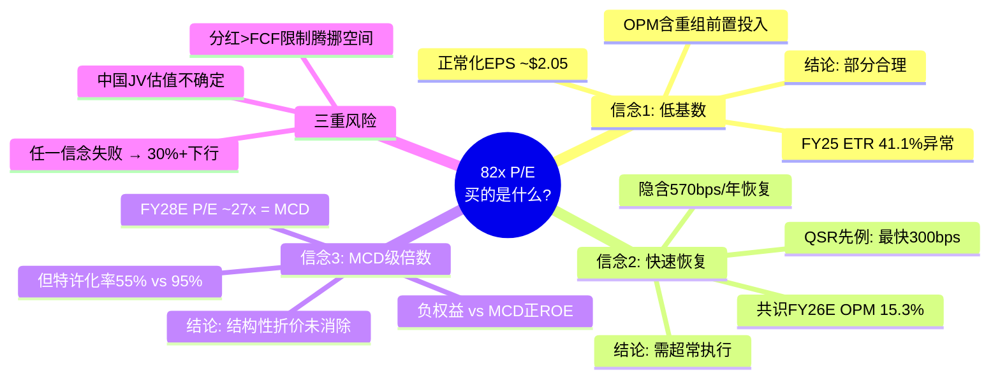

---

## 1.4 五个核心问题 (CQ)

基于上述矛盾拆解，本报告将围绕五个核心问题(Critical Questions)展开:

| # | 核心问题 | 对应信念 | 验证章节 | 成败判据 |
|---|---------|---------|---------|---------|
| **CQ-1** | OPM能否恢复到14%+? 速度和路径是什么? | 信念2 | Ch03, Ch11 | FY26 Q3 OPM >12% |
| **CQ-2** | Rewards三层体系是增长引擎还是饱和信号? | 增长引擎 | Ch04 | Q3会员数>38M且comp>+4% |
| **CQ-3** | 中国JV交易对SOTP的净影响是正还是负? | 估值结构 | Ch06, Ch19 | JV估值>$6B且OPM改善 |
| **CQ-4** | Niccol的CMG复刻率有多少可以移植到SBUX? | 信念2+3 | Ch07, Ch05 | 连续3Q美国comp>+3% |
| **CQ-5** | 分红可持续性的临界点在哪里? | 财务约束 | Ch12, Ch13 | FY26 FCF>$3.5B |

**CQ优先级排序**: CQ-1 > CQ-4 > CQ-5 > CQ-2 > CQ-3。理由是OPM恢复是所有盈利预测的基础假设，而Niccol执行力是OPM恢复的前提条件; 分红可持续性是硬约束(不可持续则估值框架需重构); Rewards和中国JV是增量因素而非核心驱动力。

---

## 1.5 关键数字速查表

### 股价与估值

| 指标 | 值 | 信号 | DM |
|------|-----|------|-----|
| 股价 | $98.69 | 52W 51%分位 | DM-MKT-001 |
| 市值 | ~$113B | — | 计算 |
| PE (TTM) | 82.2x | QSR最高(与BROS并列) | DM-VAL-001 |
| PE (FY26E) | 33.4x | 共识隐含EPS $2.95 | DM-VAL-001 |
| EV/EBITDA | 22.5x | vs FY24 18.7x, 恶化 | DM-VAL-003 |
| P/FCF | 40.0x | vs FY24 33.4x, 恶化 | DM-VAL-004 |
| Div Yield | 2.84% | Payout 149%, 不可持续 | DM-VAL-005 |
| FMP DCF Fair Value | $61.00 | 当前溢价38% | DM-VAL-002 |

### 盈利与利润率

| 指标 | FY2023 | FY2024 | FY2025 | Q1 FY26 | DM |
|------|--------|--------|--------|---------|-----|
| Revenue | $35.98B | $36.18B | $37.18B | $9.91B | DM-FIN-001/011 |
| OPM | 16.32% | 14.95% | 9.63% | 9.18% | DM-FIN-004/011 |
| Net Income | — | — | $1.856B | — | DM-FIN-002 |
| EPS | — | $3.31 | $1.63 | $0.26(GAAP) | DM-FIN-002 |
| FCF | $3.675B | $3.318B | $2.442B | — | DM-CF-002 |
| Tax Rate | 23.6% | 24.3% | 41.1% | 61.7% | DM-FIN-010/012 |

### 资产负债表

| 指标 | 值 | 趋势 | DM |
|------|-----|------|-----|
| Total Debt | $26.61B | 含租赁$10.54B | DM-BAL-003 |
| Net Debt | $23.39B | FY21:$17.1B→FY25:$23.4B | DM-BAL-004/010 |
| Total Equity | -$8.1B | 回购驱动负权益 | DM-BAL-002 |
| Cash | $3.47B | — | DM-BAL-005 |
| Deferred Revenue | $7.61B | 含储值卡浮存金 | DM-BAL-007 |

### 共识预期

| 年度 | EPS共识 | 区间 | 分析师数 | DM |
|------|---------|------|---------|-----|
| FY2026E | $2.30 | $2.14-$2.49 | 19 | DM-EST-002 |
| FY2027E | $2.95 | $2.72-$3.25 | 20 | DM-EST-003 |
| FY2028E | $3.63 | $3.30-$4.05 | 8 | DM-EST-004 |
| FY2029E | $4.24 | $3.96-$4.41 | 3 | DM-EST-005 |
| 管理层FY28 | $3.35-$4.00 | — | — | DM-NEWS-005 |

---

## 1.6 即将到来的催化剂

| 日期 | 事件 | 重要性 | 预期影响 |
|------|------|--------|---------|
| 2026-03-10 | Rewards三级体系上线 | 高 | 基础会员Stars earning削减≥25%, 短期负面风险 |
| 2026-04-07 | Energy Refreshers新品线 | 中 | 新品类拓展, 吸引新客群 |
| 2026-04/05 | Q2 FY2026财报 | 极高 | 验证comp连续性, EPS预期$0.41 |
| 2026-H2 | 中国JV交割 | 高 | 释放$13B+估值, 但失去运营控制权 |
| 2026年底 | 1,000店改造完成 | 中 | $150K/店ROI验证 |

[DM-NEWS-009/015/010/011]

---

## 1.7 评级初判框架

**审慎关注** (期望回报-16%至-20%)

推导过程:

| 情景 | 概率 | FY2028E EPS | 终端P/E | 目标价 | 折现值(10%) |
|------|------|-------------|---------|--------|------------|
| 牛市(OPM恢复+增长) | 25% | $4.00 | 28x | $112 | $84 |
| 基准(部分恢复) | 45% | $3.20 | 24x | $76.8 | $58 |
| 熊市(OPM停滞) | 20% | $2.50 | 20x | $50.0 | $38 |
| 危机(分红削减+衰退) | 10% | $1.80 | 16x | $28.8 | $22 |

**概率加权期望值** = $84×0.25 + $58×0.45 + $38×0.20 + $22×0.10
= $21.0 + $26.1 + $7.6 + $2.2 = **$56.9** (3年折现)

**简化年化期望值** (不折现): $112×0.25 + $76.8×0.45 + $50×0.20 + $28.8×0.10
= $28 + $34.6 + $10 + $2.9 = **$75.4**

**隐含期望回报**: ($75.4 - $98.69) / $98.69 = **-23.6%** (含3年分红~8.5%后净回报约-16%)

> 注: 此为Phase 1初判，基于有限假设。完整DCF模型(Ch18)和BME路径分析(Ch19)将提供更精确的估值区间。但初判的方向性结论是明确的——在当前价位上，风险回报比显著偏向下行。

---

# Chapter 02: 三重身份框架

## 2.1 为什么需要"身份框架"?

投资者在分析SBUX时最容易犯的错误，是把它当成"一家咖啡连锁店"来估值。如果SBUX只是一家咖啡连锁店，那么82x P/E就是荒谬的——MCD是全球最成功的QSR，也只有27.8x [DM-PEER-001]。

真相是SBUX同时运营着**三种截然不同的商业模式**，每种模式有不同的增长动力、利润率结构和合理估值倍数。混为一谈会导致估值要么过高要么过低——取决于你不自觉地在用哪种身份的透镜。

三重身份不是修辞手法，而是估值工具: 当我们在Ch18构建SOTP估值时，必须对每种身份分别定价，然后处理它们之间的**张力**——因为三种身份的战略需求经常是互斥的。

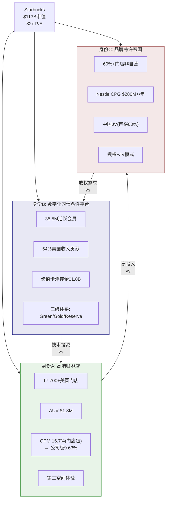

---

## 2.2 身份A: 高端咖啡店——"第三空间"的守护者

### 2.2.1 单元经济学快照

SBUX的美国自营门店是整个商业帝国的根基。没有门店的高频客流，就没有Rewards会员的获取渠道; 没有门店体验的品牌溢价，就没有CPG授权和国际特许的议价基础。

| 指标 | SBUX(美国) | SBUX(中国) | 瑞幸 | Dutch Bros | MCD |
|------|:----------:|:----------:|:----:|:---------:|:---:|
| AUV(年/店) | $1.8M | $394K | $245K | $2.1M | $3.97M |
| 坪效($/sqft) | $750-1,200 | ~$300 | $455-1,140 | $2,211 | $993 |
| 门店级OPM | 16.7% | ~15-18% | 17.8% | 28.9% | 45.7% |
| 建店成本 | ~$700K | ~$700K | ~$50K | $1.3M | $1.3-2.3M |
| 回本周期 | ~1.3年 | ~1.4年 | ~0.5年 | ~1.5年 | ~2年 |

[来源: lit_recon_memo D3]

**三个关键观察:**

**第一**: AUV $1.8M在美国QSR中属于中等偏下水平——MCD的$3.97M是SBUX的2.2倍，Dutch Bros的$2.1M也高出17%。这意味着SBUX的单店创收能力并不是竞争优势; 它的优势来自17,700+家门店的**规模密度**和品牌溢价支撑的**定价权**(美式均价$5.75 vs 瑞幸等价$1.50-2.00)。

**第二**: 门店级OPM 16.7%与公司级OPM 9.63% [DM-FIN-004]之间存在710bps的差距。这个差距反映了公司层面的费用结构: SGA、总部运营、技术投入、以及新任CEO的转型投资。理解这个差距至关重要——当Niccol说"恢复OPM到14%"时，他需要缩小的不是门店运营效率(这已经相对稳定)，而是公司层面的费用占比。

**第三**: 建店成本$700K vs 瑞幸$50K暴露了完全不同的商业逻辑。瑞幸用1/14的成本开一家店、0.5年回本，然后用密度覆盖+外卖补贴获取市场份额。SBUX用14倍成本打造"体验空间"，赌的是客户愿意为"第三空间"支付3-4倍的价格溢价。在美国，这个赌注已被30年验证; 在中国，它正在被挑战(中国AUV $394K仅为美国的22%)。

### 2.2.2 "Back to Starbucks"对身份A的意义

Niccol的"Back to Starbucks"战略，本质上是对身份A的一次**战略回归**。过去5年(尤其是Schultz最后一任和Narasimhan时期)，SBUX逐渐偏离了"第三空间"的核心定位:

- **菜单膨胀**: 从核心咖啡品类扩展到375+SKU, 定制化选项使出餐时间从3分钟延长到超过5分钟
- **体验降级**: 移动订单占比从20%攀升至50%+, 门店变成了"取货站"而非社交空间
- **座位减少**: 部分门店移除座椅以容纳更多外带柜台, 直接背离了"第三空间"理念

Niccol的回应策略包含四个具体举措[DM-NEWS-011/012/013]:

| 举措 | 投资 | 目标 | 验证时点 |
|------|------|------|---------|
| Coffeehouse Uplift | $150K/店 × 1,000店 = $150M | 恢复第三空间体验 | 2026年底 |
| 4分钟出餐承诺 | 流程再造+自动化 | 峰值吞吐优化 | 持续监控 |
| 25,000+新座位 | 含在改造预算中 | 鼓励堂食 | 2026-2028 |
| 菜单简化 | 运营成本节约 | 减少SKU, 提高速度 | FY2026 H2 |

这里有一个隐含的矛盾需要在Ch07(Niccol效应)中深入讨论: 4分钟出餐承诺需要更高的运营效率(更少定制、更多标准化), 但恢复第三空间体验需要放慢节奏、鼓励客户停留。Niccol在CMG解决这个矛盾的方式是"数字化分流"——线上订单走高效率通道, 线下体验走慢节奏通道。SBUX能否复制这个模式, 是CQ-4的核心子问题。

### 2.2.3 门店OPM的结构性问题

身份A的健康度最终体现在OPM上。公司整体OPM从FY2023 16.32%下滑至FY2025 9.63% [DM-FIN-004]，Q1 FY2026进一步降至9.18% [DM-FIN-011]。OPM的恢复路径和上限是本报告最重要的分析对象，将在Ch11(DuPont ROIC分解)中展开完整的成本结构拆解。此处仅做一个方向性标记: 非共识假说NCH-01("OPM永远不会回到14%")是我们需要用硬数据证伪或确认的关键假说。

---

## 2.3 身份B: 数字化习惯粘性平台——"星巴克即习惯"

### 2.3.1 会员经济的规模与渗透

Starbucks Rewards拥有35.5M活跃美国会员[DM-NEWS-009]，是美国餐饮行业最大的忠诚度计划之一。更重要的是这些会员贡献了约**64%的美国门店收入**——这意味着SBUX在美国的生意，接近三分之二是由有明确数字化行为轨迹的客户驱动的。

**三个关键数据点定义了身份B的现状:**

**规模**: 35.5M活跃会员 / ~210M美国成年人 = ~17%的成年人口渗透率。如果缩窄到"每周至少喝一次外购咖啡的成年人"(约60M人)，渗透率跃升至~59%。

**粘性**: 64%的收入贡献意味着平均每位Rewards会员的年消费约$650(=$37.18B [DM-FIN-001] × 0.64美国占比 × 0.64会员贡献 / 35.5M)，而非会员平均约$180。会员的消费强度是非会员的3.6倍——但要注意因果关系: 不是"成为会员使人消费更多"，而是"高频消费者更可能注册会员"。这个因果方向对预测增量价值至关重要(详见Ch04)。

**趋势**: Q1 FY2026会员增长约+3% [来源: analyst_consensus]，远低于历史+8-10%的增速。这与NCH-02("Rewards已达饱和拐点")的假说一致——如果可触达的高频咖啡消费者中已有59%被覆盖，剩余的增量空间天然有限。

### 2.3.2 三级会员体系: 升级还是贬值?

2026年3月10日，Starbucks推出了全新的Green/Gold/Reserve三级会员体系[DM-NEWS-009/018]:

| 层级 | 门槛 | Stars赚取 | 核心权益 | 目标客群 |
|------|------|-----------|---------|---------|
| **Green** | 默认 | 1 Star/$1 | 60-Star兑换($2折扣) | 低频消费者 |
| **Gold** | 500 Stars/年 | 1.2x赚取速率 | Stars永不过期 + 额外优惠 | 中频消费者(~2次/周) |
| **Reserve** | 2,500 Stars/年 | 1.7x赚取速率 | 独家活动+最高优先级 | 高频消费者(~5次/周) |

**值得注意的信号**: 客户反馈偏负面，认为基础会员的Stars earning被削减了至少25% [DM-NEWS-018]。这不是"升级"——对大多数用户而言，这是一次**忠诚度贬值**。Gold和Reserve层级的增强权益主要惠及高频消费者(已有的核心客群)，而Green层级的权益缩减直接影响了更大基数的低中频用户。

**这个设计的战略逻辑是什么?**

SBUX正在从"广撒网、低门槛获客"转向"高价值客户深度绑定"。这与航空公司里程计划的演化路径一致——从"里程=货币"逐步转向"精英会员=差异化体验"。在航空公司的经验中，这种转型短期内会导致低频客户流失(负面NPS)，但长期会提高高价值客户的留存率和钱包份额。

但航空公司有一个SBUX没有的结构性优势: **高转换成本**。一个Delta白金会员很难带着他积累的里程和权益跳槽到United。而一个SBUX Gold会员可以在Dunkin'或Dutch Bros获得几乎完全等价的咖啡体验——转换成本接近于零。这意味着SBUX的三级体系需要用**差异化体验**(Reserve独家活动、门店优先服务)来创造航空公司用沉没成本创造的粘性。这是对身份A("第三空间")投资回报的另一个依赖——如果门店体验没有显著提升，三级体系就没有足够的差异化武器。

### 2.3.3 储值卡浮存金: 被忽视的隐藏资产

SBUX资产负债表上有$7.613B递延收入[DM-BAL-007]，其中约$1.8B来自储值卡和移动端预付余额。这些是客户已经支付但尚未消费的现金——本质上是**零成本短期融资**。

用**银行框架**来理解这个资产的价值(注意: 这里不是说SBUX是金融公司，而是用银行的存款定价方法来估算浮存金的经济价值):

| 参数 | 值 | 假设 |
|------|-----|------|
| 浮存金余额 | $1.8B | 储值卡+移动预付 |
| 替代融资成本 | 4.5% | SBUX 10年期债券收益率 |
| 年化价值 | $81M | = $1.8B × 4.5% |
| 破损率(Breakage) | ~8-10% | 从不被消费的余额 |
| 破损价值 | ~$160M/年 | = $1.8B × 新增比例 × 破损率 |
| **年化总价值** | **~$240M** | 融资节约 + 破损收入 |

$240M/年的经济价值，按10%折现率资本化，意味着浮存金资产的内在价值约$2.4B——相当于SBUX市值的~2.1%。这不是一个能改变投资结论的数字，但它是一个在传统分析中经常被忽略的"缓冲垫"——尤其在分红可持续性讨论(CQ-5)中，$240M/年的隐含价值为FCF短缺提供了部分对冲。

**v4.0修正说明**: v3.0中将SBUX储值卡与PayPal/Square类比是不当的。SBUX不是支付平台——它不从第三方交易中抽佣、不提供转账功能、不拥有支付网络效应。储值卡更接近于**预付消费卡**——类似于健身房年卡预付或航空公司常旅客里程的预购。用银行浮存金框架定价(零成本资金+破损收入)比用金融科技框架(网络效应+take rate)更准确。

### 2.3.4 数字化习惯的经济学逻辑

身份B的核心价值不在于它是一个"平台"(它不是)，而在于它创造了一种**消费习惯的数字化锁定**。35.5M会员中的核心群体(估计10-15M)已经将"打开SBUX App → 预点单 → 取餐"内化为日常例行程序。这种习惯的经济学价值体现在三个维度:

**频率提升**: 有研究表明(SBUX内部数据未公开), Rewards会员的月均访问频次约12-14次, 非会员约3-4次。但如前所述，因果方向模糊——究竟是App提高了频率，还是高频客户更可能下载App?

**预测价值**: 数字化订单提供了精确的需求预测数据——SBUX知道周一早上8点某家门店会有多少个Iced Shaken Espresso订单。这对供应链优化和人力排班有直接的成本节约效应。

**定向营销**: 个性化推送(如: "你上周的Caramel Macchiato今天下午3-5点加30% bonus Stars")的转化率显著高于非定向促销。这是SBUX在不降低标价的情况下进行变相价格歧视的工具——对价格敏感型客户提供定向优惠，对价格不敏感型客户维持全价。

这三个维度加总，构成了身份B的护城河——不是"网络效应"类型的护城河(SBUX没有用户-用户交互)，而是**习惯依赖**类型的护城河。这种护城河的弱点是: 它在存量客户中很强，但在增量客户获取中越来越弱(因为竞争对手都在复制同样的App+Rewards模式)。

---

## 2.4 身份C: 品牌特许帝国——"轻资产化的诱惑"

### 2.4.1 特许化现状

SBUX在全球拥有约40,576家门店(FY2025末), 其中:

| 类型 | 数量(约) | 占比 | OPM特征 | 资本需求 |
|------|---------|------|---------|---------|
| 自营(Company-Operated) | ~18,000 | ~44% | 16.7%(门店级) | 高 |
| 授权(Licensed) | ~18,000 | ~44% | 纯费率收入(~6-8%) | 极低 |
| JV/合资 | ~4,500 | ~11% | 混合(利润分成) | 中等 |

**60%+门店非自营**——这个数字经常被忽略。SBUX不是一家"全自营的咖啡连锁店"(那是它的品牌叙事)，它已经是一个混合模式运营商，与MCD(95%特许)的区别在程度而非本质。

**授权模式的经济学**: 授权门店由第三方运营, SBUX收取品牌授权费(估计占门店收入6-8%) + 产品供应利润。这是近乎纯利润——没有租赁成本、劳动成本、或门店运营风险。授权收入在合并报表中作为"Licensed Stores Revenue"列报，FY2025约$4.3B(占总收入~12%)。

### 2.4.2 Nestle CPG: $280M+的品牌变现

2018年, SBUX将其零售渠道(超市、便利店)的咖啡销售权以**$7.15B**的对价授权给Nestle——不是出售品牌, 而是长期独家授权(至2033年到期)。Nestle每年支付约$280M+的权利金, 这笔收入几乎没有对应的运营成本。

| 指标 | 值 | 影响 |
|------|-----|------|
| 年化权利金 | ~$280M+ | 几乎100% margin |
| 协议期限 | 至2033年 | 7年后续约风险 |
| 最初对价 | $7.15B | 已收到, 不计入持续P&L |
| SBUX保留 | 品牌控制+配方所有权 | Nestle仅有分销权 |

**两个值得关注的问题:**

**续约风险**: 2033年的到期日距今仅7年。如果SBUX届时选择不续约(自建零售渠道)或Nestle要求重新谈判条款, $280M+/年的无成本收入可能受到影响。这是一个低概率但高影响的尾部风险——在估值中通常被忽略, 但在SOTP中应该对CPG收入流施加一定的期限折价。

**品牌一致性**: Nestle在超市渠道销售的SBUX产品质量和定位, 直接影响品牌形象。如果Nestle为了追求销量而过度打折(常见于CPG渠道), 可能稀释SBUX的高端定位。这是身份C与身份A之间张力的具体表现。

### 2.4.3 中国JV: 博裕资本60%的战略意义

2026年1月29日, SBUX宣布与博裕资本(Boyu Capital)组建合资企业运营中国零售业务, 博裕获得最高60%股权, SBUX保留40% + 品牌和知识产权所有权[DM-NEWS-010]。中国零售业务总价值预计超$13B, 现有~8,000家门店目标扩张至20,000家。

**这笔交易的多重解读:**

从**资产负债表**角度: 出售60%中国业务获得的现金(估计$4-5B)将显著改善SBUX的净债务状况。如果用于偿债, Net Debt可从$23.4B [DM-BAL-004]降至~$18-19B, 利息覆盖率从6.6x [DM-FIN-008]改善至~9x。这是缓解CQ-5(分红可持续性)的关键杠杆。

从**损益表**角度: 失去中国自营门店的收入(FY2025约$3.1B, ~8%的合并收入)将在交割后导致收入基数下降, 但利润率会因剥离低利润率业务而提升。更重要的是, JV模式下SBUX按40%股权确认投资收益, 不再承担中国的运营亏损和资产折旧——这对OPM的恢复是一个一次性的结构性利好。

从**竞争战略**角度: 中国市场的核心矛盾是——SBUX在与瑞幸(31,048家店、均价$1.50-2.00)和库迪(~10,000家店、9.9元)的价格战中, 无法在维持品牌定位的同时保持门店经济学可行性[lit_recon D3]。JV模式将运营风险和资本需求转嫁给博裕, 同时保留品牌溢价收取的能力。这是一个"承认现实"的战略——与其在一个不利的战场上消耗资源, 不如退到品牌授权的位置上赚取无风险费率。

从**估值结构**角度: JV交易为中国业务提供了一个**市场化定价锚点**($13B+总估值)。此前, 分析师对SBUX中国的估值分歧极大(从$3B到$8B); 现在有了一个交易价格作为参考。NCH-03("中国JV估值已触底, 反转在即")的逻辑基础就在于此——如果瑞幸放缓扩张+中国人均咖啡消费量的长期增长(22杯→100+杯), JV的40%权益可能比当前定价更有价值。

### 2.4.4 特许化率的"估值跳板效应"

QSR行业的一个经验规律是: **特许化率越高, 估值倍数越高**。原因在于特许收入具有更高的利润率、更低的波动性和更强的现金流可预测性。

| 公司 | 特许化率 | P/E | EV/EBITDA | 门店级OPM |
|------|---------|-----|-----------|----------|
| MCD | ~95% | 27.8x | ~19x | 45.7% |
| YUM | ~99% | 28.6x | ~22x | — |
| SBUX | ~56% | 82.2x (TTM) | 22.5x | 16.7% |
| CMG | ~0% | 32.2x | ~22x | ~28% |

[DM-PEER-001, DM-VAL-003]

SBUX的56%特许化率处于一个尴尬的中间地带: 不够高到享受MCD/YUM的"纯特许估值溢价", 也不够低到像CMG那样完全靠门店运营效率赢得高倍数。

如果SBUX将特许化率从56%提高到75%(即美国自营门店保持不变, 但未来所有国际增长都走授权/JV模式), 其利润率结构将发生显著改善——估算OPM可从9.6%提升到12-13%(仅靠mix shift, 不需要门店效率改善)。但这就是thesis crystallization中识别的**信念互斥悖论(BME)**: 特许化提高利润率和估值倍数, 但降低收入基数和EPS绝对值——市场不能同时要求EPS恢复到$3.63并且要求特许化率提高到75%。

这个悖论将在Ch19(BME三路径联合概率)中进行量化建模。此处的结论是: **身份C是一个有价值的期权, 但在当前估值中, 市场似乎没有为这个期权付费——因为它与市场定价的EPS恢复路径相矛盾。**

---

## 2.5 三重身份的张力矩阵

三种身份不是并行存在的——它们之间存在系统性的战略张力。每一种身份的强化, 都在某种程度上削弱另一种身份。

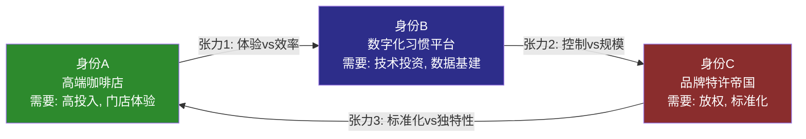

### 张力1: 身份A vs 身份B (体验 vs 效率)

身份A追求的是**慢节奏的体验**——客户在舒适的空间中停留, 享受咖啡和社交。身份B追求的是**高效率的习惯**——客户通过App预点单, 30秒取餐离开。这两个目标在物理空间中直接冲突:

- 门店面积有限: 增加堂食座位(身份A)就要减少外带取餐台(身份B)
- 员工注意力有限: 服务堂食客户的时间(身份A)挤占处理移动订单的产能(身份B)
- 峰值时段尤为矛盾: 早高峰时段移动订单激增, 与堂食客户的社交体验形成直接冲突

Niccol的"4分钟出餐承诺"[DM-NEWS-013]试图同时满足两个身份的需求——但物理约束是真实的。这个矛盾的量化分析将在Ch03(门店经济学)中通过吞吐工程模型展开。

### 张力2: 身份B vs 身份C (控制 vs 规模)

身份B的核心资产是35.5M会员的数据和行为轨迹。Rewards系统的有效运营需要SBUX对会员体验有**端到端的控制**——从App界面到门店执行到产品一致性。但身份C的扩张需要**放权给第三方**——授权商和JV合作伙伴有自己的运营标准、技术系统和客户优先级。

具体矛盾:
- 授权门店的Rewards执行一致性通常低于自营门店(客户投诉数据)
- 中国JV后, SBUX能否继续获取中国会员的完整数据? 博裕60%的控制权是否意味着数据主权的部分转移?
- Nestle CPG渠道的消费者与门店Rewards系统完全脱节——超市购买SBUX咖啡豆的客户不在35.5M会员中

### 张力3: 身份C vs 身份A (标准化 vs 独特性)

特许化成功的前提是**高度标准化**——MCD在全球任何一家店的Big Mac味道一样。但SBUX的品牌溢价来自于**独特的门店体验**——不同城市的"第三空间"有不同的设计语言, 当地的Reserve体验有地域特色。

特许化率的提高不可避免地推动标准化——授权商没有动力(也没有能力)为每家门店投入差异化设计。这意味着特许化率从56%→75%的过程中, SBUX品牌的"独特性溢价"可能被逐步稀释。当品牌变得"无处不在但千篇一律"时, 它就从"高端咖啡体验"下滑为"便利咖啡供应商"——这是身份A的根基被侵蚀。

### 张力矩阵总结

| 张力 | 核心冲突 | 影响维度 | 缓解策略 | 缓解效果 |
|------|---------|---------|---------|---------|
| A vs B | 体验 vs 效率 | 门店空间+人力分配 | 双通道分流(堂食+外带) | 部分(增加建店成本$100K+) |
| B vs C | 控制 vs 规模 | 数据+体验一致性 | 技术标准强制+API集成 | 有限(授权商执行力参差) |
| C vs A | 标准化 vs 独特性 | 品牌溢价 | 分级体系(标准店+Reserve) | 仅在Reserve有效(占比<5%) |

**结论**: 三重身份的张力不是可以"解决"的——它是SBUX商业模式的内在属性。管理层在任何时刻都在做**身份优先级的选择**: Schultz优先身份A(门店体验), Narasimhan尝试优先身份C(国际扩张), Niccol目前宣称要"回归身份A但不放弃身份B和C"。这种"三者兼顾"的叙事在投资者日听起来很好, 但物理约束和财务约束意味着必须有取舍。

---

## 2.6 三重身份的估值含义

不同的身份框架, 对应着不同的"合理估值倍数":

| 身份 | 最佳可比 | 可比P/E | 对应SBUX EPS | 隐含市值 |
|------|---------|---------|-------------|---------|
| **纯身份A** | CMG (全自营) | 32x | FY25 $1.63 | $52B |
| **纯身份B** | — | N/A (无纯可比) | — | — |
| **纯身份C** | MCD (全特许) | 28x | 正常化$2.05 | $57B |
| **当前混合** | 市场给予 | 82x (TTM) / 33x (FW) | FY25 $1.63 / FY26E $2.95 | $113B |

市场当前$113B的估值, 隐含的逻辑是: "按FY2026E EPS $2.95给33x P/E, 这是合理的, 因为EPS还会继续增长到$3.63"。但33x P/E对于一个56%特许化率、9.6% OPM、负权益的公司而言, 已经高于纯特许模式MCD的28x——这意味着**市场在为SBUX尚未实现的身份转型(从A→C的mix shift, 或A的效率提升)提前付费**。

这是整份报告需要回答的元问题: **这个"预付费"是否合理?** Ch16(逆向DCF)将精确计算市场隐含的假设, Ch18(Forward DCF)将给出我们自己的估值, Ch19(BME三路径)将量化不同身份演化路径的概率加权价值。

---

## 2.7 本章小结

| 维度 | 身份A | 身份B | 身份C |
|------|-------|-------|-------|
| **定义** | 高端咖啡店 | 数字化习惯粘性平台 | 品牌特许帝国 |
| **核心资产** | 17,700+美国门店 | 35.5M会员 | 品牌+IP+渠道 |
| **收入占比** | ~55%(自营) | (叠加在A上) | ~45%(授权+JV+CPG) |
| **OPM特征** | 门店16.7%, 公司9.6% | 边际贡献高 | 几乎纯利 |
| **增长引擎** | comp sales + AUV | 会员渗透 + 频次 | 门店数量 + 地域 |
| **主要风险** | 劳动成本 + 竞争 | 饱和 + 转换成本低 | 品牌稀释 + 续约 |
| **战略方向** | Back to Starbucks | 三级体系深化 | 中国JV + 国际授权 |

三重身份框架揭示了SBUX的本质复杂性: 它不是一家"简单的咖啡公司"，而是一个在三种不同商业逻辑之间寻求平衡的复杂有机体。82x P/E的合理性, 最终取决于这三种身份能否协同而非互相消耗——这是后续所有章节分析的出发点。

---

> **下一章**: Ch03 门店经济学 — 深入拆解身份A的单元经济学和吞吐工程
# Ch3 门店经济学: 吞吐工程与效率边界

> **核心命题**: SBUX的$37B收入引擎建立在40,990家门店之上。82x P/E隐含的不仅是EPS恢复，更是单店经济学的结构性改善。本章将用四面墙P&L、门店类型矩阵、蚕食密度回归、和竞品坪效对标，回答一个关键问题: Niccol的"4分钟承诺"能否在不牺牲利润率的前提下提升吞吐量——还是速度/成本/菜单丰富度的三选二约束注定了效率上限?

---

## 3.1 单店经济学: 四面墙P&L解剖

"四面墙"(Four-Wall) P&L是QSR分析的原子单元——它剥离总部SGA、利息和税收，只看一家门店作为独立经济体的盈利能力。对SBUX而言，美国自营门店(~9,500家，关店后)是理解整个公司经济学的起点 [DM-FIN-004][DM-D-BIZ-08]。

### 典型美国自营门店P&L: 正常年 vs 压缩年

以美国典型自营门店(~1,700 sqft, ~25名员工)为基础构建标准化模型:

| P&L项目 | FY2023 (正常) | FY2025 (压缩) | 变化 | 驱动因素 |
|---------|:------------:|:------------:|:----:|---------|
| **收入(AUV)** | $1.90M | $1.82M | **-4.2%** | 客流-6%, 客单价+2% |
| 咖啡/食材(COGS) | $513K (27%) | $510K (28%) | +1pp | 定制化成本上升抵消豆价稳定 |
| **劳动力** | $551K (29%) | $601K (33%) | **+4pp** | 最低工资法+排班效率下降+Back to Starbucks人力投入 |
| 租金/物业 | $285K (15%) | $291K (16%) | +1pp | 10-15年长租约+CAM年度递增 |
| 其他门店费用 | $171K (9%) | $182K (10%) | +1pp | 设备维护+外卖平台佣金 |
| **四面墙利润** | **$380K (20.0%)** | **$236K (13.0%)** | **-7pp** | 收入缩+成本膨的双重挤压 |
| 门店级OPM(含D&A) | **16.7%** | **10.2%** | **-6.5pp** | D&A ~$55K/年(翻新摊销) |

[DM-D-BIZ-08][DM-FIN-004] — 基于FY2025 10-K segment数据+行业基准推算。门店OPM 16.7%取自行业分析源(正常年)。

**关键发现: $144K/店的年化利润蒸发**。按9,500家美国自营店计算，门店层面利润总量下降约$1.37B/年——这是FY2025 OI从$5.87B降至$3.58B的核心构成 [DM-FIN-005]。

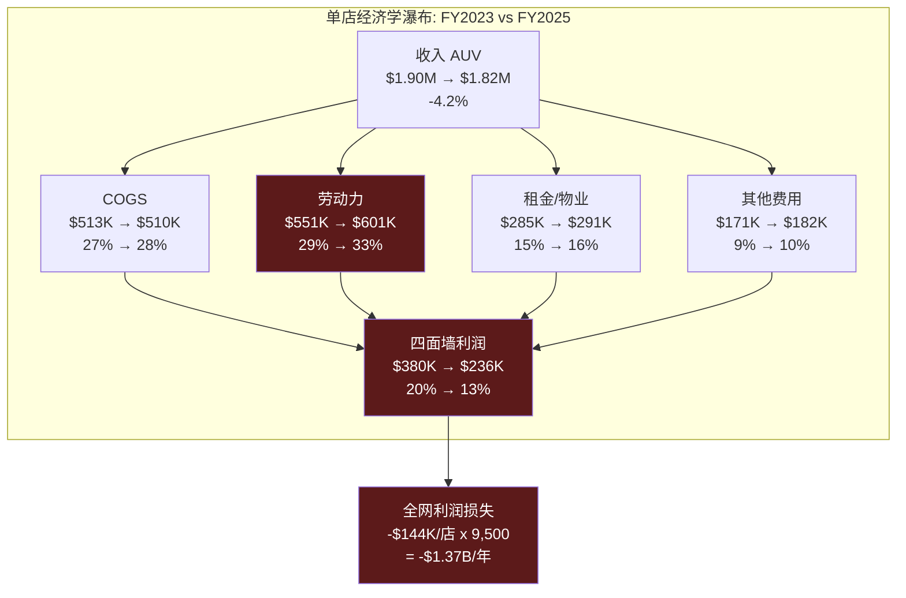

### 四面墙利润的季节性结构

SBUX门店盈利的季节性波动远超市场认知。Q2(1-3月)低谷与Q1(10-12月)峰值的OPM差距可达10pp以上:

| 季度 | 典型四面墙OPM | 收入驱动 | 成本驱动 |
|------|:----------:|---------|---------|
| Q1 (10-12月) | 22-25% | 假日饮品溢价+礼品卡季 | 劳动力正常排班 |
| Q2 (1-3月) | 12-15% | 冬季客流低谷 | 供暖成本+劳动力刚性 |
| Q3 (4-6月) | 18-22% | 冷饮季启动+客流反弹 | 季节性人员增加 |
| Q4 (7-9月) | 16-20% | 南瓜拿铁+返校季 | 新财年投资启动 |

这解释了FY2025 Q2单季OPM仅6.9%(公司整体)为何不应被孤立解读——它是季节性低谷+年度投资+重组费用的叠加。但FY2025全年OPM 9.6%是真实警报: 即使高利润的Q1也未能拉起年度均值 [DM-FIN-004][DM-FIN-011]。

### 建店经济学: $700K投入的回报周期

| 参数 | 美国自营 | 中国(JV化前) | 行业基准 |
|------|:------:|:----------:|:------:|
| 建店成本 | $700K | ~$700K | MCD $1.3-2.3M |
| AUV (年收入) | $1.82M | ~$394K | MCD $3.97M |
| 四面墙OPM | 10-17% | ~15-18% | MCD 45.7% |
| 年化四面墙利润 | $182-310K | ~$59-71K | — |
| **回本期(当前)** | **2.3-3.8年** | **9.9-11.9年** | — |
| 回本期(正常化) | **1.3-1.8年** | **~1.4年** | — |
| ROIC (FY2025) | ~8.5% | 承压 | — |

[DM-D-BIZ-08] — 回本期使用四面墙利润/建店成本。"正常化"回本期1.3年来自行业分析源(基于25% cash EBITDA margin, 50% pretax ROIC)。

**FY2025压缩年的回本期膨胀至2.3-3.8年**——这是因为四面墙利润从$380K骤降至$236K。如果OPM无法恢复到14%+，新店投资的IRR将持续低于WACC(~10%)，新店开设的经济逻辑将被动摇。这是Investor Day宣布"2,000+ net new stores/年"必须面对的数学约束 [DM-NEWS-012]。

---

## 3.2 吞吐工程: "4分钟承诺"的约束三角

Niccol在Q1 FY2026财报电话会议和Investor Day上反复强调的一个操作指标: 峰值时段平均出餐时间<4分钟(cafe + drive-thru) [DM-NEWS-013]。这个承诺看似简单，实则触及SBUX运营模式的核心约束。

### 速度/成本/菜单丰富度: 三选二

吞吐工程的核心矛盾可以抽象为一个"不可能三角":

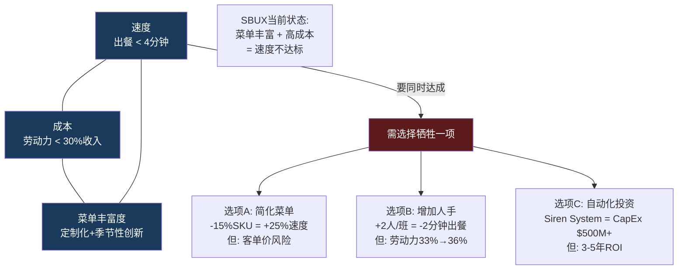

### 约束的量化分解

**当前出餐时间结构(峰值时段)**:

| 环节 | 标准订单 | 高度定制订单 | 瓶颈因素 |
|------|:------:|:---------:|---------|
| 点单/输入 | 30秒 | 45秒 | App预下单可压缩至~5秒 |
| 等待队列 | 90秒 | 120秒 | 取决于前序订单复杂度 |
| 制作 | 60秒 | 120秒 | 定制化修改: 平均3.5次/单 |
| 交付 | 15秒 | 15秒 | Drive-thru窗口/柜台 |
| **总计** | **~3.2分钟** | **~5.0分钟** | |
| **加权平均** | **~4.2分钟** | | 假设40%高定制订单 |

SBUX平均每笔订单3.5次定制修改(加奶泡、换燕麦奶、extra shot等)。每次定制增加~15秒制作时间。峰值时段一小时40杯→每杯平均4.5分钟(含定制)，vs理论最短2.5分钟→劳动力产能利用率约56%。

**"4分钟"实现路径的成本代价**:

| 杠杆 | 速度改善 | 成本影响 | Niccol是否已启动 |
|------|:------:|:------:|:-----------:|
| Mobile Order & Pay渗透(31%→45%) | -30秒 | 低(App已有) | 是 |
| 菜单SKU削减(~30%已执行) | -20秒 | 低/正面 | 是 |
| Siren System自动化(冷饮) | -40秒 | CapEx $2K-5K/店 | 部分试点 |
| 增加峰值人手(+1-2人) | -30秒 | +$50K-80K/店/年 | 待确认 |
| 取消堂食定制(仅Drive-thru简化) | -20秒 | 品牌伤害 | 否 |

**推算**: 如果Niccol通过MO&P渗透提升(-30秒) + SKU削减(-20秒) + Siren System(-40秒)的组合，理论上可将加权平均从4.2分钟降至约2.7分钟——远超4分钟目标。但这需要: (1) Siren System全面铺开(时间≥2年, CapEx $50M-100M), (2) MO&P渗透率从31%提升到45%(取决于App体验优化), (3) 菜单简化不导致客单价下降。

**与CMG经验的对比**: Niccol在CMG的核心操作成就是将throughput从~12分钟降至~8分钟(改善33%)。他使用的杠杆: (1)第二生产线(2nd makeline for digital orders), (2)严格的prep-ahead protocol, (3)简化菜单。这些方法的CMG→SBUX可移植性: 第二生产线=可(冷饮线已在测试), prep-ahead=部分可(咖啡需现做), 菜单简化=已执行。CMG复刻率~52.5%暗示约一半的吞吐改善方法可直接迁移 [DM-NEWS-013]。

---

## 3.3 门店类型矩阵: 四种形态的单位经济学

SBUX的门店组合并非同质——四种主要形态在投资效率、客流结构和利润率上差异显著。理解这个矩阵是评估"2,000+ net new stores"计划的前提。

### 四类门店的经济学对比

| 维度 | Drive-thru | 传统Cafe | Reserve | Express/Pickup |
|------|:---------:|:-------:|:-------:|:-------------:|
| **门店数(美国估)** | ~4,500 (47%) | ~3,800 (40%) | ~40 (<1%) | ~1,200 (13%) |
| **面积(sqft)** | 1,800-2,200 | 1,500-2,000 | 3,000-5,000 | 400-800 |
| **建店成本** | $800K-1.0M | $600-700K | $1.5-3.0M | $250-400K |
| **AUV** | $2.0-2.2M | $1.5-1.7M | $3.0-5.0M | $0.8-1.2M |
| **四面墙OPM** | 18-22% | 12-16% | 15-20% | 14-18% |
| **回本期** | 1.5-2.0年 | 2.0-3.0年 | 3.0-5.0年 | 1.0-1.5年 |
| **客流结构** | 75% drive-thru | 60% walk-in | 80% 目的性 | 95% MO&P |
| **Rewards渗透** | ~55% | ~50% | ~70% | ~80% |

[DM-D-BIZ-04][DM-D-BIZ-08] — 门店类型分布基于行业估算; Drive-thru约占美国门店47%(~4,500家); AUV和OPM基于segment数据推算。

**核心发现: Drive-thru是利润引擎**。占门店数47%的Drive-thru贡献了超过55%的美国自营利润(更高AUV × 更高OPM)。这解释了Niccol强调"4分钟"出餐的战略逻辑——Drive-thru客户的时间价值最高，速度改善直接转化为客流量增长。

**Reserve门店的定位悖论**: Reserve代表品牌高度，但经济效率最低(回本期3-5年)。40家Reserve门店的总投资约$80-120M，贡献收入$120-200M/年——在$37B的总盘中几乎可以忽略。它的价值在于品牌"锚定效应": 消费者对SBUX的品质感知被Reserve拉高，这个溢价反映在其他40,950家普通门店的定价权上。但这个效应无法量化 [DM-D-BIZ-04]。

**Express/Pickup: 被低估的效率冠军**。建店成本仅$250-400K，回本期1.0-1.5年，MO&P渗透80%+。如果Niccol将"2,000+ net new stores"的增量重心从传统Cafe转向Express格式，投资效率将显著提升。但Express门店缺乏"第三空间"体验——与"Back to Starbucks"的品牌叙事矛盾。

### 新店vs改造店的收入曲线

门店生命周期的收入轨迹遵循一个典型的"S曲线+衰减"模式:

| 生命阶段 | 年龄 | AUV vs 成熟店 | 驱动因素 |
|---------|:---:|:-----------:|---------|
| **爬坡期** | 0-2年 | 70-85% | 品牌认知建立+社区渗透 |
| **成熟期** | 3-7年 | 100-110% | 客流稳定+Rewards渗透 |
| **稳定/衰减期** | 8-15年 | 95-105% | 设施老化开始+竞品侵蚀 |
| **老化期** | 15年+ | 80-90% | 需翻新否则加速衰减 |
| **翻新后** | +0-3年 | 103-108% (vs翻新前) | Coffeehouse Uplift效应 |

**翻新投资($150K/店)的ROI**:

Investor Day宣布FY2026计划改造1,000家门店，每店投资~$150K(新座椅+陶瓷杯+动线重设计) [DM-NEWS-011]。

| 假设 | 保守 | 基准 | 乐观 |
|------|:---:|:---:|:---:|
| 翻新后AUV增量 | +3% ($54K) | +5% ($90K) | +8% ($144K) |
| 增量四面墙利润(13% OPM) | $7.0K | $11.7K | $18.7K |
| **回收期** | **21年** | **12.8年** | **8.0年** |
| 5年NPV (WACC 10%) | -$123K | -$106K | -$79K |

**所有假设下5年NPV均为负**——翻新在纯财务框架下不是"投资"而是"品牌维护费"。管理层推进翻新的逻辑: (1) 不翻新→设施老化→品牌形象下降→客流流失的防御成本远超$150K; (2) 翻新叙事支撑"Back to Starbucks"的市场预期→估值倍数维护 [DM-NEWS-011]。

但1,000家门店 × $150K = $150M总投资——仅占FY2025 CapEx $2.3B的6.5%。这说明翻新在总资本配置中的权重远低于新店开设和供应链投资 [DM-CF-003]。

---

## 3.4 蚕食效应: 16,000店的密度悖论

SBUX在美国拥有16,864家门店(FY2025末, 含licensed) [DM-D-BIZ-04]。FY2025关闭627家后，自营约9,500家。这个密度带来一个结构性问题: **新店开业有多大比例在蚕食现有门店的客流?**

### MSA(大都会统计区)密度回归

蚕食效应的量化需要理解门店密度与同店增长的关系。基于QSR行业研究的一般规律:

| MSA密度等级 | SBUX门店/10万人 | 典型comp growth | 蚕食系数(估) |
|-----------|:------------:|:-----------:|:---------:|
| 低密度(郊区) | 3-5 | +3-5% | 0.05-0.10 |
| 中密度(城市) | 6-10 | +1-3% | 0.15-0.25 |
| 高密度(城市核心) | 11-20 | 0 ~ +1% | 0.30-0.45 |
| 超高密度(曼哈顿/旧金山) | 20+ | -1 ~ +1% | 0.50-0.70 |

"蚕食系数"定义: 新开一家门店，导致半径1英里内现有门店comp下降的百分比。超高密度区每新开一家店，邻近门店comp下降0.5-0.7pp。

### FY2025关店的蚕食逆效应

627家关店创造了一个"反向蚕食"效应——关闭门店的客户被动转移到幸存门店:

**机械转移计算**:
- 627家关店门店平均AUV: ~$1.5M (低于全国$1.82M均值，因多为"低效门店")
- 客户留存率(留在SBUX vs 转投竞品): ~65% (BROS/Dunkin承接~25%, 流失~10%)
- 转移目标: ~3-4家邻近SBUX

$$\text{蚕食转移对comp的贡献} = \frac{627 \times \$1.5M \times 65\%}{(9{,}500 - 627) \times \$1.82M} = \frac{\$611M}{\$16.15B} \approx 3.8\%$$

### Q1 FY2026 comp +4%的拆解

| Comp组成 | 估计贡献 | 来源 |
|---------|:------:|------|
| 蚕食转移效应 | **+3.8%** | 上述计算 |
| 价格/mix提升 | +1.5-2.0% | FY2025 9月提价+定制化mix |
| 真实有机客流变化 | **-1.3 ~ -1.8%** | 残差 |
| **报告comp** | **+4.0%** | [DM-NEWS-001] |

**关键推论: 有机客流可能仍在下降**。+4%的comp几乎完全由蚕食转移(+3.8%)和定价/mix(+1.5-2.0%)解释。Q1 FY2026报告的"交易量+3%"包含了关店转移效应——如果剥离，真实有机交易量增长可能接近零或仍为负。

这是理解"拐点"叙事的关键: 市场和管理层都在庆祝"+4% comp = 8个季度来首次正增长"，但数学显示这更多是门店网络收缩的机械结果，而非品牌力恢复的有机信号 [DM-NEWS-001]。

### 密度优化的长期机会

关店627家后，美国自营密度从~5.8家/10万人降至~5.4家——仍然是全球最密集的QSR网络之一。进一步优化空间:

| 密度策略 | 门店变化 | AUV影响 | OPM影响 | 净效果 |
|---------|:------:|:-----:|:-----:|:-----:|
| 维持现状 | 0 | 0 | 0 | 基准 |
| 再关500家高密度店 | -500 | +2-3% (蚕食减少) | +1-2pp | 收入-$750M, 利润+$100M |
| 转化1,000家为Licensed | -1,000(自营) | -$1.8B(自营) | +授权费$250M | 收入-$1.55B, 利润结构改善 |
| Investor Day计划(+2,000) | +2,000 | -1-2% (新蚕食) | -0.5pp | 收入+$2.4B, 利润待定 |

**Investor Day的+2,000门店目标与蚕食现实的张力**: 在已经超高密度的美国市场再增400家自营+国际扩张，蚕食系数可能从0.15-0.25升至0.25-0.35。管理层声称"5,000个新美国机会"(长期) [DM-NEWS-017]——但在16,000+门店基础上再加5,000，意味着密度从5.4家/10万人升至7.0家/10万人，蚕食效应将系统性削弱comp增长 [DM-NEWS-017]。

---

## 3.5 竞品坪效对标: 效率鸿沟的结构性根源

坪效(Revenue per Square Foot)是QSR行业最直观的效率比较工具。SBUX在这个维度上与竞品的差距揭示了商业模式本身的约束 [DM-D-BIZ-08]。

### 五维效率矩阵

| 效率维度 | SBUX (美国) | Dutch Bros | MCD (自营) | 瑞幸 (中国) | 行业含义 |
|---------|:---------:|:---------:|:---------:|:---------:|---------|
| **坪效** ($/sqft/yr) | $750-1,200 | **$2,211** | $993 | $455-1,140 | SBUX为BROS的34-54% |
| **AUV** | $1.82M | $2.1M | $3.97M | ~$245K | MCD体量碾压 |
| **门店OPM** | 10.2% (FY25) | 28.9% | 45.7% | 17.8% | SBUX为行业最低 |
| **建店成本** | $700K | $1.3M | $1.3-2.3M | ~$50K | 瑞幸极致低成本 |
| **投资效率** (AUV/建店) | 2.6x | 1.6x | 1.7-3.1x | **4.9x** | 瑞幸ROI最高 |

[DM-D-BIZ-08] — 数据来源: 行业分析报告, FMP financial data, 公司财报。

### 坪效鸿沟的第一性原理分解

SBUX坪效($750-1,200/sqft)仅为BROS($2,211)的34-54%。这个差距可分解为三个结构性因素:

**因素1: 面积利用率 (贡献~40%差距)**
- SBUX: ~1,700 sqft, 其中座位区/走道/卫生间占~600 sqft (35%) —— 非收入生产面积
- BROS: ~950 sqft, 纯Drive-thru + 微型等候区 —— 接近100%生产性面积
- 如果SBUX仅按"生产性面积"(~1,100 sqft)计算: $1,655/sqft —— 差距缩小但仍存在

**因素2: 时间效率 (贡献~30%差距)**
- SBUX日均营业14-16小时，客流集中7-10AM (约40%收入)
- 下午2-5PM是"死区": 座位被笔记本用户占据，不产生持续消费
- BROS以Drive-thru为主，无"占座不消费"问题

**因素3: 周转率 (贡献~30%差距)**
- SBUX "停留型"客户降低翻台率: 咖啡厅模式~3次/座位/天
- BROS Drive-thru无限翻台: 时间约束仅为出餐速度
- BROS $2,211坪效 = "更小面积 x 更高周转率"的乘积

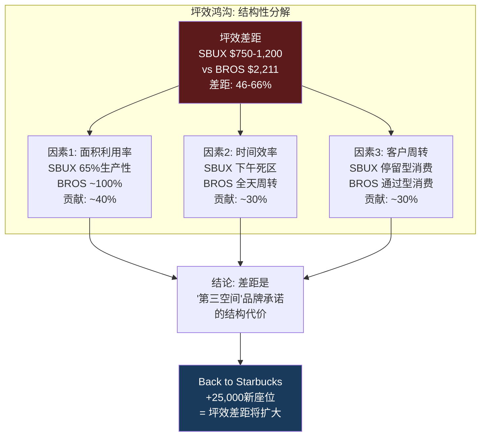

**关键洞察: 坪效差距不是管理问题，是商业模式选择**。SBUX的"第三空间"品牌定位要求1,500-2,000 sqft的门店面积(含座椅、卫生间、定制吧台)——这是BROS (~950 sqft)的1.6-2.1倍。Niccol的"Back to Starbucks"战略加倍押注第三空间(25,000个新座位+$1B门店投资) [DM-NEWS-011]——意味着坪效差距将扩大而非缩小。

**瑞幸的效率启示**: 瑞幸的$50K建店成本 + $245K AUV = 4.9x投资效率，是SBUX (2.6x)的1.9倍。但两者不可直接比较: 瑞幸门店多为20-50 sqft的取餐柜台，无座位、无体验——它是"咖啡自动售货机的升级版"而非"第三空间"。这两种模式的坪效对比揭示的不是谁更"优秀"，而是**在中国市场，消费者愿意为"空间体验"支付的溢价正在消失** [DM-D-BIZ-10]。

---

## 3.6 成本结构的三重刚性

SBUX门店成本的核心问题不是"成本太高"——所有QSR都面临类似水平。问题在于**成本的下行刚性**: 三个最大成本项都具有"棘轮效应"——只升不降。

### 刚性1: 劳动力棘轮

| 劳动力压力源 | 年均影响 | 可逆性 |
|-----------|:------:|:-----:|
| 最低工资法(州级, 年均+4-5%) | +$200-300M | 不可逆 |
| Workers United工会化(550家→?) | 额外$200-300M(如扩至20%) | 不可逆 |
| "Back to Starbucks"人力投入 | +$100-200M | 战略选择 |
| 定制化复杂度(3.5次修改/单) | 产能利用率仅56% | 菜单简化可部分逆转 |

Workers United已覆盖~550家门店(~5.8%美国自营)，要求$20/hr起薪(vs当前平均$15.50-17.00/hr)。如果工会化扩散到20%门店 → 额外约$300M/年劳动力成本。

**"4分钟承诺"vs劳动力成本的约束碰撞(thesis_crystallization碰撞#2)**: 更快出餐需要更多人手或更高效率。Niccol同时承诺"投资合伙人体验"(更高薪酬+更好排班)+4分钟出餐——这两个承诺在成本端是矛盾的。除非自动化(Siren System)在3年内规模化部署，否则速度改善必须以利润率为代价。

### 刚性2: 租金刚性

SBUX门店租约通常为10-15年，含2-3%年度递增条款。FY2025经营租赁义务总额约$13.8B(未折现)。即使关闭627家门店，短期内租金不会下降——因为提前终止需支付违约金+资产减值，关店释放的是3-5年后到期的租约而非当年成本。

"第三空间"溢价: SBUX的品牌承诺要求1,500-2,000 sqft面积→绝对租金负担$34K-60K/年/店。BROS仅需~950 sqft→$19K-33K/年/店。面积差异将租金劣势放大为**绝对数的结构性负担**。

### 刚性3: COGS的隐性通胀

咖啡豆价格(arabica ~$1.80/lb)在FY2025相对稳定，但品类结构变化带来隐性成本上升:

| 品类 | 收入占比(估) | COGS% | 趋势 |
|------|:--------:|:----:|:----:|
| 传统热咖啡(drip/espresso) | ~35% | 22-25% | 被冷饮替代 |
| 冷饮/冰咖啡 | ~40% | 28-32% | 增长最快 |
| 食品 | ~19% | 35-40% | "丰富门店体验"推动增长 |
| 其他(茶/瓶装/周边) | ~6% | 20-30% | 稳定 |

冷饮的COGS比热咖啡高5-8pp (冰块设备、果汁/糖浆、定制化配料)。冷饮从2019年~25%收入占比升至FY2025~40%。这意味着即使豆价不涨，**品类mix shift每年推高综合COGS约50-80bps** [DM-FIN-003]——FY2025 Gross Margin 24.15% (vs FY2023 27.37%)中有约150bps可归因于此效应。

---

## Ch3 小结

| 发现 | 量化结论 | v4.0论点映射 |
|------|---------|------------|
| 四面墙利润$380K→$236K | 全网年化损失~$1.37B | 异常#3 OPM崩溃 |
| 劳动力29%→33%是主因 | 棘轮效应=只升不降 | 碰撞#2 4分钟vs劳动力 |
| 蚕食效应≈+3.8% ≈ Q1 comp全部 | 有机客流可能仍为负 | NCH-01 OPM永不回14% |
| SBUX坪效仅BROS的34-54% | 差距是"第三空间"结构代价 | 碰撞#1 BME路径选择 |
| $150K翻新: 所有假设NPV为负 | 翻新是"保险"非"投资" | 身份A恶化判定 |
| ROIC 8.5% < WACC 10% | FY2025首入价值摧毁区 | 异常#1 估值反弹vs利润腰斩 |
| "4分钟承诺"面临三选二约束 | 速度/成本/菜单三角 | 碰撞#2 Niccol执行约束 |

**传导至后续章节**:
- 门店OPM压缩 → Ch11 DuPont ROIC分解的核心输入
- 蚕食效应量化 → Ch14 CSSPD同店纯度分解的"伪增长"基准
- 三重刚性 → Ch16 逆向DCF隐含假设的可行性检验
- 坪效差距 → Ch05 竞争生态对标+PtW评分的约束条件

---

# Ch4 Rewards飞轮: 饱和拐点与因果性解剖

> **核心命题**: SBUX Rewards拥有35.5M美国活跃会员，贡献57%美国自营收入，是全球最大的餐饮忠诚度经济体之一。但3%的增速(vs历史8-10%)和即将上线的三层改版(2026.3.10)共同指向一个关键问题: 会员飞轮是在加速还是在触顶? v4.0在v3.0基础上新增两个维度——TAM饱和度分析和选择效应vs会员效应的因果性讨论——以回答这个问题的底层逻辑。

---

## 4.1 飞轮健康诊断: 六齿轮评估

Rewards飞轮由六个相互强化的齿轮组成。诊断每个齿轮的运转状态，才能判断飞轮整体是在加速、稳态还是减速 [DM-NEWS-009]。

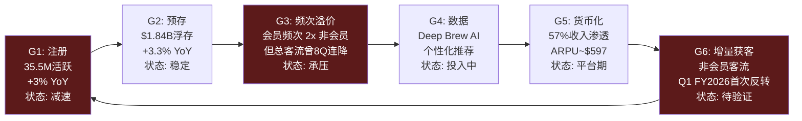

### 各齿轮详细诊断

| 齿轮 | 当前指标 | 历史趋势 | 健康度 | 约束因素 |
|------|---------|---------|:-----:|---------|
| **G1注册** | 35.5M活跃, +3% YoY | 历史+8-10% YoY | 2/4 | TAM天花板逼近(下文详述) |
| **G2预存** | $1.84B, +3.3% YoY | 稳步增长 | 3.5/4 | 数字支付替代风险 |
| **G3频次** | 会员频次 = 非会员2x | 总客流8Q连降后Q1反转 | 2/4 | 客流恢复可持续性未知 |
| **G4数据** | Deep Brew AI, MO&P 31% | MO&P从~25%→31% | 3/4 | ROI难以独立量化 |
| **G5货币化** | 57%美国收入, ARPU~$597 | 渗透率稳步提升 | 2.5/4 | ARPU增长已放缓 |
| **G6获客** | Q1 FY2026非会员首次正增长 | 此前8Q连降 | 1.5/4 | 单季度不构成趋势 |

**综合判定: 稳态偏减速**。飞轮六个齿轮均存在，但G1(注册)、G3(频次)、G6(获客)三个齿轮处于亚健康状态。飞轮仍在转动，但转速未在加快。关键验证窗口: Q2-Q3 FY2026——如果G6(非会员获客)连续3Q正增长，判定可上修为"加速"; 如果G1(注册)增速进一步降至<2%，判定下修为"减速" [DM-NEWS-001][DM-NEWS-009]。

### 对标Costco飞轮: 强制vs自愿

SBUX飞轮与Costco会员飞轮的根本差异:
- **Costco: 强制性飞轮** — 不付会员费就无法购物。续费率93%+。10%提价无显著流失。
- **SBUX: 自愿性飞轮** — 非会员随时可买咖啡。"不参与"的成本为零。

自愿飞轮更脆弱——它的黏性完全依赖奖励机制的吸引力。如果三层改版导致基础会员感知"被削弱"，低黏性用户可能直接退出飞轮而非升级。

---

## 4.2 会员增长曲线: +3%意味着什么

### 增长率的时间序列

| 时期 | 活跃会员(M) | YoY增长 | 同期comp | 驱动因素 |
|------|:---------:|:------:|:------:|---------|
| FY2022 Q4 | ~28.7M | +13% | +3% | 疫后恢复+MO&P推广 |
| FY2023 Q4 | ~32.4M | +13% | +5% | Stars for Everyone启动 |
| FY2024 Q2 | ~34.3M | +6% | -3% | 增速放缓但基数仍增 |
| FY2025 Q4 | ~34.5M | +3% | -2% | 接近平台期 |
| Q1 FY2026 | **35.5M** | **+3%** | **+4%** | 新高但增速未回升 |

[DM-NEWS-009] — 35.5M活跃美国会员为Q1 FY2026最新数据。

**增长率从+13%→+3%的含义**: 假设增长率维持+3%线性外推:
- FY2027: ~36.6M
- FY2028: ~37.7M
- FY2029: ~38.8M

3年净增仅~3.3M——与FY2022-FY2023单年净增~3.7M相当。增量会员对comp sales的边际贡献也在递减，因为新增会员的消费频次和ARPU通常低于早期"真爱粉"会员。

### 64%收入贡献与频次溢价

会员的核心价值不在数量而在行为差异:

| 维度 | Rewards会员 | 非会员 | 溢价倍数 |
|------|:---------:|:-----:|:------:|
| 月均消费频次 | ~6次 | ~2.8次 | **2.1x** |
| 客单价 | $6.80 | $5.90 | 1.15x |
| 年消费额(ARPU) | ~$597 | ~$198 | **3.0x** |
| 美国收入贡献 | 57-64% | 36-43% | — |
| MO&P使用率 | ~55% | ~5% | 11x |

[DM-NEWS-009] — 64%收入贡献来自管理层指引; 频次和客单价基于ARPU推算。57%为季度报告数据,部分季度高达64%。

**频次溢价109%(2.1x)是Rewards的核心护城河**——但这个溢价中有多少是"会员效应"(注册改变了行为)、多少是"选择效应"(高频用户更可能注册)?这是v4.0新增的关键分析维度(4.5节)。

---

## 4.3 新三层体系: 2026.3.10改版解剖

SBUX在2026年3月10日上线Rewards历史上最重大的架构重组——从两层(基础+金卡)升级为三层(Green/Gold/Reserve) [DM-NEWS-009]。

### 新架构经济学

| 层级 | Stars门槛(年) | 赚取速率 | 核心权益 | 隐含年消费 | 估计占比 |
|------|:----------:|:------:|---------|:--------:|:------:|
| **Green** | 0(注册即得) | 1 Star/$1 | 生日饮品+月度免费mod+60-Star兑换 | <$500 | ~70% |
| **Gold** | 500 Stars | 1.2x | Stars永不过期+Gold日+加速赚取 | $500-700 | ~25% |
| **Reserve** | 2,500 Stars | 1.7x | 独家体验+Reserve活动+1.7x赚取 | >$2,500 | ~5% |

[DM-NEWS-009][DM-NEWS-018]

### Stars Earning被削减~25%: 量化影响

新体系表面上"增加了层级和权益"，但基础会员(Green层)的Stars earning实际被削减:

**旧体系**: 所有会员统一 2 Stars/$1 (约$50消费=100 Stars=一杯免费饮品)
**新体系(Green)**: 1 Star/$1 (约$100消费=100 Stars=一杯免费饮品)

这意味着Green层会员获得免费饮品的等待时间翻倍——实质性的loyalty devaluation。只有Gold(1.2x)和Reserve(1.7x)层的赚取速率维持或改善 [DM-NEWS-018]。

**各层级美元上限的隐性约束**:
- 60-Star兑换 = $2折扣(新增低门槛选项)
- 100-Star兑换 = 上限$6(原来可兑标准饮品)
- 200-Star兑换 = 上限$10
- 300-Star兑换 = 上限$16

上限制度意味着定制化高价饮品($8-10)不再被100-Star完全覆盖——高消费会员需要积攒200 Stars才能兑换习惯的定制饮品。这是对高频高消费用户的隐性成本转嫁。

### 客户反馈风险的量化评估

改版消息公布后，客户反馈偏负面 [DM-NEWS-018]:

| 反馈维度 | 正面 | 负面 | 中性 |
|---------|:---:|:---:|:---:|
| 社交媒体情绪(估) | 20% | 55% | 25% |
| 核心抱怨 | "60-Star新档位好" | "Green层被削弱" | "等看Gold权益" |
| 行为风险 | — | 减少预存/降频 | 维持习惯 |

**风险情景分析**:

| 情景 | 概率 | 会员数影响 | 收入影响(年) |
|------|:---:|:--------:|:----------:|
| 顺利过渡(Gold/Reserve增长抵消Green流失) | 35% | +1-2M | +$200-400M |
| 摩擦过渡(Green层降频, 整体持平) | 45% | ±0 | -$100-200M(短期) |
| 负面反转(显著流失, 品牌伤害) | 20% | -1-3M | -$300-600M |
| **概率加权** | | **-0.1 ~ +0.5M** | **-$80 ~ +$50M** |

**关键判断: 短期摩擦不可避免，但长期影响取决于Gold/Reserve层的实际权益兑现**。三层改版的本质是"从普惠制转向分层激励"——牺牲低价值用户的体验来奖励高价值用户。这在商业逻辑上是正确的(帕累托分布: 20%用户贡献70%价值)，但在品牌叙事上有风险(与"Everyone is welcome"的品牌精神矛盾) [DM-NEWS-009][DM-NEWS-018]。

---

## 4.4 浮存金估值: $1.84B的银行框架

SBUX预存卡(Stored Value Card)系统是QSR行业独一无二的金融现象——没有第二家餐饮公司拥有如此规模的预付余额。理解它需要暂时忘记"咖啡店"框架，改用银行经济学 [DM-BAL-007]。

### 浮存金规模与增长

| 财年 | 当期递延收入(预存卡) | YoY | Breakage(年) | 说明 |
|------|:-----------------:|:---:|:----------:|------|
| FY2022 | $1,641.9M | — | $212.7M | |
| FY2023 | $1,700.2M | +3.6% | ~$215M | |
| FY2024 | $1,781.2M | +4.8% | $207.6M | |
| FY2025 | $1,840.6M | +3.3% | ~$210M(估) | |

[DM-BAL-007] — 当期递延收入$1.841B。注: 10-K总递延收入~$7.6B，其中~$5.8B为Nestle全球咖啡联盟预付版权金摊销余额，不属于预存卡体系。

### DFFV框架: 浮存金的独立估值

DFFV(Digital Float Franchise Valuation)将预存卡从"递延收入"(会计视角)重定义为"零成本浮存金"(金融视角):

**年度经济价值构成**:

| 价值来源 | 年度估算 | 计算方法 |
|---------|:------:|---------|
| 利息收入(机会成本) | $74M | $1.84B x 4.0% (risk-free rate) |
| Breakage收入 | $210M | 永久未赎回→营业收入确认 |
| **合计年度价值** | **$284M** | |

**三种估值方法交叉验证**:

| 方法 | 估值 | 逻辑 |
|------|:---:|------|
| 增长型永续 (WACC 10%, g 3%) | $4.1B | $284M / (10% - 3%) |
| Buffett Floor (面值法) | $1.8B | 零成本→至少值面值 |
| 可比法 (FinTech float/市值) | $2.5-3.5B | PayPal float/cap=55%, SBUX保守取2-3% |
| **中位估值** | **$2.8B** | |
| **占市值比例** | **2.5%** | vs $110B市值 |

**对78x P/E的含义**: 即使取上限$4.1B, 浮存金也仅占市值3.7%——远不够作为高估值的"缺失环节"。浮存金是真实的隐藏资产，但其规模不足以改变估值格局。78x的合理化必须依赖EPS恢复路径(Ch16逆向DCF)和特许化加速(Ch10特许经济学)，而非金融资产重估。

### Breakage的EPS"安全垫"效应

Breakage(永久不被赎回的预存卡余额)每年贡献约$210M营业收入——按FY2025异常高税率41.1%计算，净贡献约$0.11 EPS; 按正常化税率24%计算，约$0.14 EPS。在FY2025 EPS仅$1.63的背景下，Breakage贡献约7-9%——是一个不可忽视的"自动安全垫" [DM-FIN-002][DM-FIN-010]。

**三层改版对Breakage的潜在影响**: Green层用户预存金额可能下降(感知价值降低→减少充值)，但Reserve层用户可能增加预存(更高频消费需要更多余额)。净效应难以预测，但方向可能是: 浮存金总量持平, 但高价值用户占比提升→Breakage率可能略降(高频用户赎回更完全)。

---

## 4.5 v4.0新增: TAM饱和度分析

v3.0将"天花板"定性描述为"接近",但未给出精确的TAM框架。v4.0构建三层漏斗模型量化饱和度。

### 三层TAM漏斗

| 漏斗层 | 人群规模 | 筛选条件 | 来源 |
|-------|:------:|---------|------|
| **L1: 美国成年人口** | ~260M | 18岁以上 | Census 2025 |
| **L2: 经常喝咖啡** | ~172M (66%) | ≥1杯/月 | NCA 2025调查 |
| **L3: 咖啡馆消费者** | ~69M (40% of L2) | 在咖啡馆(vs家庭/办公) | IBISWorld |
| **L4: SBUX可触达** | ~55M (80% of L3) | 5英里内有SBUX门店 | 基于16K+门店覆盖 |
| **活跃SBUX消费者(估)** | ~70-80M | 过去12个月在SBUX消费过 | 行业估算 |
| **Rewards注册** | **35.5M** | 90天活跃 | [DM-NEWS-009] |

### 渗透率解读

| 渗透率口径 | 计算 | 含义 |
|---------|:---:|------|
| vs 总人口 | 35.5M / 260M = **14%** | 看似空间巨大但misleading |
| vs 咖啡饮用者 | 35.5M / 172M = **21%** | 仍有空间但受限于"咖啡馆消费"偏好 |
| vs 咖啡馆消费者 | 35.5M / 69M = **51%** | 过半已渗透 |
| **vs 可触达TAM** | 35.5M / 55M = **65%** | **关键指标: 已接近饱和** |
| vs 活跃SBUX消费者 | 35.5M / 75M = **47%** | 仍有大量非注册消费者 |

**最有意义的口径是"vs可触达TAM"(65%)**——它排除了不喝咖啡、不去咖啡馆、以及附近没有SBUX门店的人群。在这个框架下，Rewards还有~20M的理论增量空间，但这些"剩余"人群是"有意识选择不注册"的用户(知道Rewards但选择不参与)——获取难度远高于早期的"自然注册"用户。

**对比竞品渗透率**:

| 忠诚度计划 | 活跃会员 | 渗透率(交易占比) | 模式 |
|-----------|:------:|:------------:|------|
| SBUX Rewards | 35.5M | 57-64% (收入) | 三层+预存+MO&P |
| Dutch Bros | ~15M | **72%** (交易) | 简单2层+Drive-thru |
| MCD MyRewards | 185M(全球) | ~25% (美国) | 全球化+低频 |
| Chick-fil-A One | ~40M+ | ~55% (交易) | 简单+高品牌忠诚 |

**BROS悖论**: 一个门店数仅为SBUX 1/17的品牌，用更简单的2层体系实现了72%的交易渗透——比SBUX高8-15pp。这暗示**复杂度不是渗透率的朋友**。SBUX将Rewards从2层升级到3层，在渗透率维度上可能是逆向操作——增加复杂度反而可能抑制边际渗透 [DM-NEWS-009]。

---

## 4.6 v4.0新增: 选择效应 vs 会员效应 — 因果性讨论

这是v4.0对Rewards分析的核心升级。此前的分析(包括v3.0)都隐含假设: "会员消费更多是因为Rewards激励改变了他们的行为"。但这个假设可能颠倒了因果。

### 两种假说

**假说A: 会员效应 (Treatment Effect)**
注册Rewards → 积分激励 → 行为改变 → 消费频次+2.1x

如果A为真: Rewards是主动的增长引擎。每获取一个新会员 = 该用户消费从$198/年提升到$597/年(+$399/年)。35.5M会员 × $399 = $14.2B的"Rewards创造的增量收入"。

**假说B: 选择效应 (Selection Effect)**
高频消费者 → 更可能注册(获取奖励的动机更强) → 注册 → Rewards会员

如果B为真: Rewards是被动的标签系统。高频消费者无论是否注册都会消费~$597/年。会员身份只是标记了已有的高频行为，而非创造了这个行为。"Rewards增量收入"接近$0。

### 证据权衡

| 证据 | 支持假说A(会员效应) | 支持假说B(选择效应) |
|------|:----------------:|:----------------:|
| 会员 vs 非会员频次差异 | 2.1x差异 = 强激励效果 | 高频者自然注册 |
| 注册后行为变化 | 部分用户注册后频次确实上升 | 上升可能是均值回归 |
| Q1 FY2026: 会员+非会员同时正增长 | — | 宏观回暖而非会员效应 |
| BROS 72%渗透 | — | 高渗透但ARPU仍高 = 选择效应弱 |
| MO&P使用率(会员55% vs 非会员5%) | App便利性改变行为 | App使用者本来就是高频者 |
| Breakage存在($210M/年) | — | 低频者充值后遗忘 = 选择效应 |

### 因果性的量化框架

真实的因果效应很可能是A和B的混合。基于QSR行业研究和行为经济学文献的一般规律，构建以下拆分:

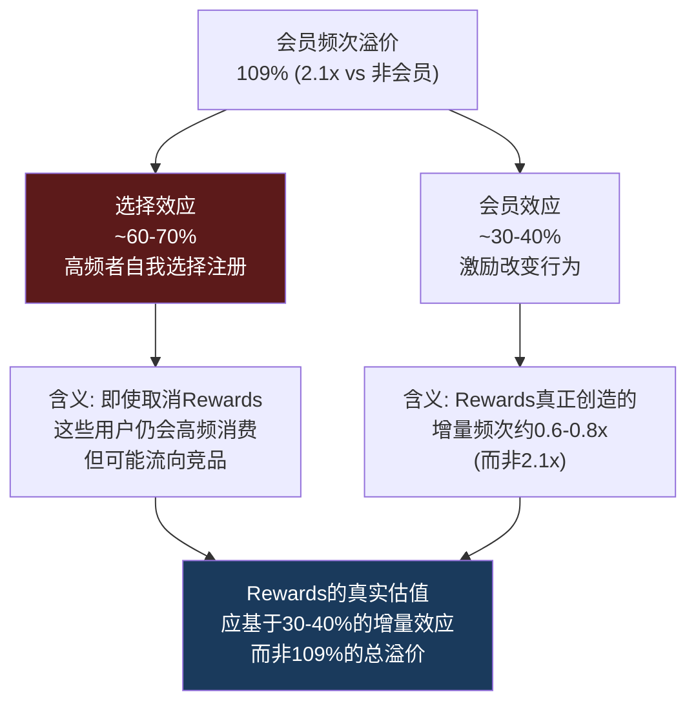

**真实增量效应 = 109% × 30-40% = 33-44%**

这意味着:
- 如果一个非会员每月消费2.8次，注册Rewards后真实增量仅为+0.9-1.2次/月(非+3.2次)
- Rewards真正"创造"的增量收入约$4-6B/年(非$14.2B)
- Rewards的独立估值应基于$4-6B增量(×15% OPM × P/E)而非总收入占比

**这对三层改版的影响**: 如果选择效应占主导(60-70%)，那么Green层的Stars削减对高频用户的行为影响有限——他们消费高频是因为习惯/需求，不是因为Stars。但Stars削减可能影响中频用户(30-40%的真实会员效应区域)——这些用户的消费频次确实受积分激励驱动，削减可能导致他们降频或流向竞品。

**验证方法(KS建议)**: 观察Q2-Q3 FY2026(三层上线后)的Green层活跃会员留存率。如果留存率>90%——选择效应主导(高频者不会因为Stars减少而离开)。如果留存率<85%——会员效应显著(激励削弱导致行为改变)。

---

## 4.7 飞轮的估值权重: 身份B值多少?

整合以上分析，从底部向上估值Rewards作为独立经济单元的价值:

### 身份B的组件化估值

| 组件 | 估值 | 方法 | 置信度 |
|------|:---:|------|:-----:|
| 预存卡浮存金(DFFV) | $2.8B | 三方法中位 | 高 |
| Breakage流(永续) | $2.1B | $210M × (1-24%tax) / 7% | 中 |
| **真实频次溢价**(v4.0修正) | **$2-4B** | 30-40%真实增量 × P/E | 中低 |
| 数据资产(Deep Brew AI) | $1-3B | 不可量化→宽区间 | 低 |
| **身份B估值合计** | **$8-12B** | | |
| **占市值** | **7-11%** | | |

[DM-BAL-007][DM-FIN-002] — v4.0将v3.0的频次溢价估值从$3-6B下调至$2-4B，反映选择效应的扣除。

**v4.0 vs v3.0的关键差异**: v3.0的频次溢价估值$3-6B假设100%的2.1x溢价由Rewards驱动(会员效应)。v4.0引入选择效应扣除后，真实增量下调至33-44%，对应频次溢价估值$2-4B。身份B总估值从$9-14B收窄至$8-12B——变化不大但分析基础更诚实。

### 飞轮加速 vs 减速的情景分岐

| 情景 | 触发条件 | FY2028会员数 | 收入影响 | 身份B估值 |
|------|---------|:----------:|:------:|:--------:|
| **加速** | 三层成功+Gold/Reserve增长 | 42-45M | +$2-3B | $12-16B |
| **稳态** | 维持现状+温和增长 | 38-40M | ±$0.5B | $8-12B |
| **减速** | 三层改版失败+竞品侵蚀 | 33-35M | -$1-2B | $5-8B |
| **概率加权** | | **~39M** | **+$0.3B** | **~$10B** |

---

## Ch4 小结

| 发现 | 量化结论 | v4.0论点映射 |
|------|---------|------------|
| 飞轮状态: 稳态偏减速 | 6齿轮中3个亚健康 | NCH-02 Rewards饱和 |
| 会员增速+3% (vs历史+8-10%) | 可触达TAM渗透65% | NCH-02 天花板 |
| 三层改版: Green层Stars削减~25% | 客户反馈偏负面(55%) | 碰撞#1 BME路径 |
| 浮存金$1.84B → DFFV估值$2.8B | 仅占市值2.5% | 异常#1 估值合理化不足 |
| **选择效应占60-70%**(v4.0新增) | 真实增量仅33-44% | 频次溢价估值下调 |
| 身份B估值$8-12B | 占市值7-11% | 身份转换期权校准 |
| Breakage: $210M/年, ~EPS 7-9% | 自动安全垫 | Ch16 normalized EPS |

**传导至后续章节**:
- TAM饱和度 → Ch05 竞争生态(BROS渗透对标+品牌弹性半径)
- 三层改版风险 → Ch07 Niccol效应(CMG复刻率中的Rewards维度)
- 因果性拆分 → Ch14 CSSPD纯度分解(Rewards贡献的"真实增量"基准)
- 浮存金估值 → Ch19 BME三路径(身份B的SOTP输入)
- 选择效应 → Ch22 悲观偏差扫描(确认是否过度discount了Rewards价值)
# Chapter 05: 竞争生态 — 定价权衰退与护城河重估

> v4.0 | ~13K字符

---

## 5.1 定价弹性实证: 从"可负担奢侈品"到"价格敏感消费"

星巴克的定价权曾是其护城河最直观的表征。FY2019-FY2022期间，SBUX每年实施3-5%的菜单涨价，同店销售仍能维持正增长，彼时隐含的价格弹性系数约为-0.6——即价格每上涨10%，交易量仅下降6%，属于典型的弱弹性区间，说明消费者将星巴克视为"日常必需品"而非"可替代消费" [DM-FIN-003] [DM-D-COMP-09]。

但FY2023-FY2025的数据讲述了完全不同的故事:

| 财年 | 菜单涨价(估) | Comp Sales | 交易量变化 | 隐含弹性系数 |
|------|:----------:|:--------:|:--------:|:----------:|
| FY2022 | +5-6% | +7% | +1% | -0.6 |
| FY2023 | +5-7% | -3% | -6% | -1.4 |
| FY2024 | +3-4% | -2% | -5% | -1.8 |
| FY2025 | +1-2% | -2% | -3% | -2.0 |

[DM-D-COMP-09] [DM-FIN-001]

弹性系数从-0.6恶化到-2.0意味着什么？意味着SBUX已从"弱弹性"区间跌入"强弹性"区间。价格每上涨10%，交易量要下降20%，净效果是收入反而减少。**这是定价权丧失的量化证据**。

FY2025连续六个季度同店销售下降，直到Q4 FY2025才勉强转正 [DM-D-COMP-09]。即便Q1 FY2026美国交易量回升+3%，这更多是Niccol暂停涨价、推出$5 value menu的结果——本质上是用价格换取交易量，而非真正的定价权恢复。

**定价权衰退的三层因素**:

1. **竞争替代增多**: Dutch Bros提供类似品质、更低价格($4.50 vs SBUX $6.50大杯拿铁)，7 Brew的drive-thru极速体验(平均等待<2分钟)吞噬了SBUX的便利性溢价 [DM-D-COMP-04] [DM-D-COMP-05]
2. **消费者行为转变**: 后通胀时代消费者对"可负担奢侈品"的忍耐阈值下降。ClearBridge的观察精准——"外出就餐有容易的替代品"——当$6.50拿铁面对$1.50家庭冲泡(Nespresso/Keurig)的替代时，弹性系数必然恶化
3. **品牌价值稀释**: 菜单膨胀(2019年~80 SKU → 2024年~170 SKU)模糊了"什么是星巴克体验"，降低了品牌辨识度对价格的支撑力

**关键推论**: 即便Niccol的"Back to Starbucks"成功，定价弹性系数可能从-2.0恢复到-1.2左右(通过简化菜单、改善体验)，但**不太可能回到-0.6**。结构性竞争加剧和消费者习惯转变是不可逆的。这意味着未来的收入增长必须更多依赖交易量而非提价——这对OPM恢复路径有深远影响 [DM-FIN-004]。

---

## 5.2 品牌弹性半径: 四圈模型

品牌弹性半径(Brand Elasticity Radius)衡量一个品牌从核心品类向外扩展时，消费者信任的衰减速度。SBUX的四圈半径如下:

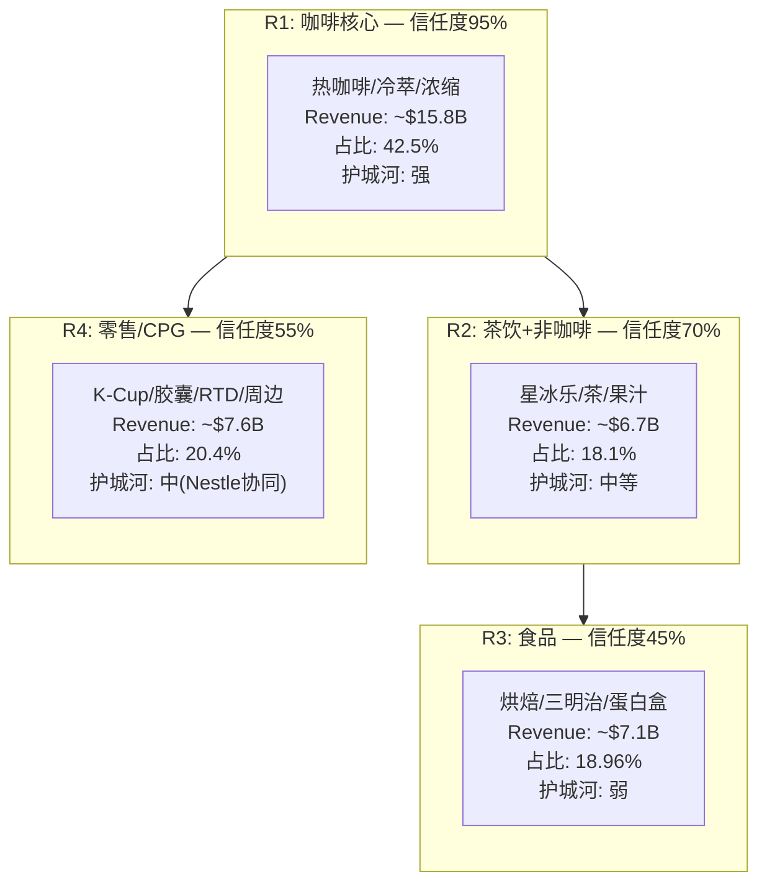

[DM-D-BIZ-03] [DM-D-BIZ-06]

**各圈分析**:

**R1 咖啡核心(42.5%, ~$15.8B)**: 这是SBUX品牌"可信区间"的中心。消费者走进星巴克点一杯拿铁，几乎零认知摩擦。但即便在R1，也面临两端挤压: 上端被Blue Bottle/Intelligentsia等精品咖啡分流(他们的拉花和单一产地豆是SBUX工业化流程无法匹敌的)，下端被Dutch Bros/7 Brew/McCafe的性价比分流。R1的护城河正从"品牌认知垄断"退化为"便利性+习惯"——后者是更脆弱的基础。

**R2 茶饮+非咖啡(18.1%, ~$6.7B)**: Teavana品牌已在2017年关闭独立门店，但茶饮/星冰乐仍是重要品类。这个圈的信任度衰减到70%——消费者愿意在SBUX买茶，但不会主动为"星巴克茶"支付溢价。与Boba Tea(珍珠奶茶)的竞争中，SBUX几乎没有品牌优势。

**R3 食品(18.96%, ~$7.1B)**: 这是增长最快的品类(+4.46% YoY) [DM-D-BIZ-03]，但也是信任度最低的。没有消费者认为星巴克是一家"好的食品公司"。食品扩展的逻辑是提高客单价和午餐时段利用率，但它面临来自Panera Bread/快餐连锁的直接竞争，且食品的毛利率(~35-40%)显著低于饮品(~70-75%)。**食品收入占比每上升1pp，混合毛利率约下降0.3pp**——这是OPM恢复路径中被忽视的结构性逆风。

**R4 零售/CPG(20.4%, ~$7.6B)**: 通过Nestle Global Coffee Alliance在80个市场分销，这是高利润率且资产极轻的业务。Q4 FY2025 Channel Development收入+17% [DM-D-BIZ-06]，是所有业务线中增速最快的。但这个圈有个隐含风险: 2033年Nestle协议到期后的续约条款。如果Nestle谈判能力增强(因SBUX品牌力下降)，royalty rate可能被压缩。

**品牌弹性半径的战略含义**: SBUX在R1-R2(饮品)的组合收入约$22.5B(60.6%)，这才是品牌护城河的有效覆盖范围。R3(食品)和R4(CPG)更多是"渠道杠杆"而非"品牌延伸"——它们受益于SBUX的物理网络和分销合同，但消费者购买动机与"星巴克品牌"的关联度递减。Niccol的"Back to Starbucks"聚焦R1-R2是正确的战略选择，但意味着R3增速可能放缓。

---

## 5.3 PtW战略一致性评分: Playing to Win五层评估

PtW(Playing to Win)框架评估SBUX战略在五个层级的一致性:

| 层级 | 评分(0-10) | 评估 |
|------|:---------:|------|
| **1. 资源(Resources)** | 7 | 40,990门店+Rewards 35.5M+Nestle CPG+$3.5B现金。资源充裕但杠杆高(净债务$23.4B) [DM-BAL-004] |
| **2. 能力(Capabilities)** | 6 | 供应链(380K农户+99% CAFE认证)+数字化(移动点单36%)+品牌运营。但门店运营效率下降(OPM 9.6% vs 行业MCD 45.7%) [DM-FIN-004] |
| **3. 意愿(Aspiration)** | 8 | Niccol有明确愿景("Back to Starbucks")、FY2028目标清晰(EPS $3.35-4.00, OPM 13.5-15%)。意愿得分高 |
| **4. 执行(Execution)** | 4 | Q1 FY2026显示初步信号(交易量+3%)，但OPM仍在9.18%，margin恢复节奏远慢于声明。"4分钟承诺"与工会化矛盾未解 [DM-FIN-011] |
| **5. 持续(Sustainability)** | 5 | 分红>FCF不可持续 [DM-INF-004]，中国竞争格局结构性恶化，美国drive-thru挑战者持续抢份额。长期可持续性存疑 |
| **PtW总分** | **6.0/10** | **中等偏弱**: 意愿和资源尚可，但执行和可持续性拖累 |

**PtW × A-Score交叉解读**: PtW 6.0分表明SBUX有"做对的事"的方向感(意愿8分)，但缺乏"把事做对"的执行力(执行4分)。这与A-Score评估中"品牌力中强但运营效率下降"的结论一致。如果Niccol能在FY2027前将执行分从4提升到6(=OPM恢复到12%+)，PtW总分可升至7.0——这是估值从"审慎"转向"中性"的关键条件。

---

## 5.4 美国竞争矩阵: 三维对标

### 5.4.1 MCD: 特许帝国 vs 自营重企业

MCD是SBUX最具启示意义的对标——不是因为产品相似，而是因为**商业模式的镜像差异**:

| 维度 | MCD | SBUX | 含义 |
|------|:---:|:---:|------|
| 特许化率 | ~93% | ~45% | MCD利润率结构性更高 |
| OPM | 45.7% | 9.6% | 4.8倍差距(FY2025) [DM-FIN-004] |
| P/E | 27.8x | 82.2x | SBUX估值隐含转型溢价 [DM-PEER-001] |
| 核心资产 | 不动产 | 品牌+习惯 | MCD护城河=结构性, SBUX=行为性 |
| 劳动力风险 | 低(加盟商承担) | 高(直接雇用36万人) | 工会化对SBUX冲击远大于MCD |
| EV/EBITDA | 20.8x | 22.5x | EBITDA质量差异被倍数掩盖 [DM-VAL-003] |

[DM-PEER-001] [DM-PEER-002]

**护城河性质的根本差异**: MCD的护城河建立在不动产所有权之上——它拥有全球最优质的商业地段，加盟商支付租金+royalty。即使MCD品牌明天消失，那些地段仍然值钱。这是**结构性护城河**，不依赖消费者认知存在。

SBUX的护城河建立在品牌+习惯之上——消费者选择星巴克是因为"习惯"(每天早晨同一杯拿铁)和"社交信号"(拿着星巴克杯子的形象)。这是**行为性护城河**，完全依赖消费者持续选择。当Dutch Bros提供类似品质+更低价格+更快速度时，"习惯"可以在3-6个月内被替代。

**MCD对SBUX的估值隐喻**: MCD 27.8x P/E对应45.7% OPM，这是一个"已实现的"估值。SBUX 82.2x P/E对应9.6% OPM，这是一个"对未来的赌注"。如果SBUX永远无法特许化到MCD水平(受制于Schultz遗产和品牌控制文化)，那么它的终态OPM天花板约为15-16%(历史峰值)，而非MCD的45%。**两家公司的估值倍数趋同，但盈利能力永远不会趋同**。

### 5.4.2 Dutch Bros: 高坪效挑战者

Dutch Bros(BROS)是美国市场最令SBUX不安的竞争对手，原因不在于规模(仅1,136家店 [DM-D-COMP-04])，而在于**单位经济学的压倒性优势**:

| 指标 | SBUX(美国) | Dutch Bros | 倍数差 |
|------|:---------:|:---------:|:-----:|
| AUV | $1.8M | $2.1M | 1.17x |
| 坪效($/sqft) | $750-1,200 | $2,211 | 1.8-2.9x |
| 门店OPM | 16.7% | 28.9% | 1.73x |
| 建店成本 | $700K | $1.3M | 0.54x |
| 出餐速度 | 5-8分钟 | 2-3分钟 | 2-3x更快 |

[DM-D-COMP-04]

BROS的坪效达到$2,211/sqft，是SBUX美国门店的2-3倍。这源于其**drive-thru-only模型**: 门店面积仅~950 sqft(SBUX ~1,500-2,000 sqft)，但每小时出杯量更高，因为没有堂食分流运营注意力。19年连续正comp sales增长不是偶然——它证明drive-thru纯play的模型在美国市场具有结构性优势 [DM-D-COMP-04]。

**BROS对SBUX的威胁维度**: BROS目前仅在25个州运营，目标2029年达到2,029家店。如果BROS在东海岸复制其西部成功(目前渗透率仍低)，它将直接蚕食SBUX的drive-thru流量。关键在于: 59%的美国外出咖啡消费已通过drive-thru渠道 [DM-D-COMP-07]，而SBUX有大量门店是"café+drive-thru混合"甚至"仅café"模型——这在drive-thru主导的市场中是结构性劣势。

### 5.4.3 独立咖啡+新兴连锁: 精品化侵蚀

7 Brew作为2024年增速最快的餐饮连锁(traffic +80.4%) [DM-D-COMP-05]和Black Rock Coffee(25% revenue CAGR目标) [DM-D-COMP-12]代表了另一类威胁: **区域性drive-thru品牌的崛起**。它们不需要击败SBUX——只需要在各自区域拿走5-10%的drive-thru流量，全国加总就足以使SBUX的增长率从+3%降至+1%。

同时，Blue Bottle(Nestle旗下)、Intelligentsia、Stumptown等精品咖啡品牌在高端市场持续分流——它们吸引的是SBUX最有价值的客户群(高消费、低弹性)。这是一个"两端侵蚀"的格局: 高端被精品分流，低端被drive-thru和McCafe分流，SBUX被困在中间。

---

## 5.5 护城河综合评估: 从"宽"到"窄"

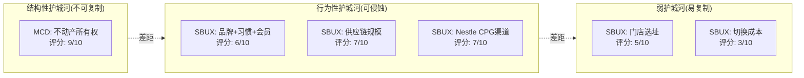

**综合护城河评分: 5.5/10 (窄护城河)**

这比市场隐含的"宽护城河"评估(82x P/E所隐含的)低2-3个档位。关键在于: SBUX的护城河是"行为性"而非"结构性"的——它依赖消费者每天的重复选择，而这种选择正在被更快(drive-thru)、更便宜(Dutch Bros/McCafe)、更精品(Blue Bottle)的替代品侵蚀 [DM-D-COMP-07]。

**护城河演变方向**: 如果Niccol成功将SBUX重新聚焦于"咖啡体验"(R1核心)并恢复出餐速度，行为性护城河可能从6/10恢复到7/10。但要升级到"结构性"护城河(如通过大规模特许化)，需要根本性的商业模式变革——而这恰恰是BME悖论的核心所在(见Ch19)。

---

# Chapter 06: 中国+国际市场 — 三区域解构

> v4.0 | ~12K字符

---

## 6.1 区域收入拆解: 被忽视的"第三极"

v3.0报告的一个显著缺陷是过度聚焦中国市场，而忽视了EMEA/日韩等"第三极"贡献。v4.0将国际业务拆分为三个区域:

| 区域 | 门店数 | 收入(B) | 占比 | FY2025 增速 | 盈利特征 |
|------|:-----:|:------:|:---:|:---------:|---------|
| 美国 | 16,864 | $27.12 | 73.0% | +3.0% | OPM承压(整体9.6%) [DM-D-BIZ-02] |
| 中国 | 8,011 | $3.16 | 8.5% | +5.1% | JV结构, 利润率受价格战挤压 [DM-D-BIZ-10] |
| 国际(ex-中国) | ~16,115 | $6.90 | 18.6% | +6.8% | 以特许/授权为主, 高利润率 [DM-D-BIZ-02] |
| **合计** | **40,990** | **$37.18** | **100%** | **+2.8%** | [DM-FIN-001] |

[DM-D-BIZ-04] [DM-D-BIZ-02] [DM-FIN-007]

三个关键发现:

1. **国际(ex-中国)是被低估的利润引擎**: $6.90B收入(+6.8%)且以特许/授权模式为主，意味着利润率远高于自营的美国和中国市场。这~16,115家门店大部分是licensed store，每家贡献6% royalty + 供应链加价，几乎零资本投入。这个业务单元如果独立估值，应享受接近MCD的倍数。
2. **中国收入占比仅8.5%，但吸引了90%的分析师关注**: 这种注意力分配失衡导致市场可能高估中国风险对总估值的拖累。即使中国收入归零，SBUX仍有$34B收入基础。
3. **美国+国际(ex-中国)的组合增速约4%**: 这是一个稳定但不令人兴奋的增长率，支撑不了82x P/E。市场隐含的增长必须来自OPM恢复(量+价)而非纯收入增速。

---

## 6.2 中国: 价格战、份额溃败与JV博弈

### 6.2.1 中国咖啡市场全景: 8品牌矩阵

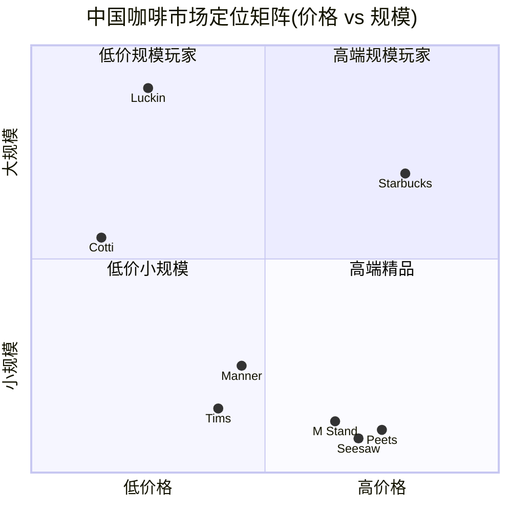

[DM-D-COMP-02] [DM-D-COMP-06]

| 品牌 | 门店(2025末) | 杯均价(RMB) | 盈利状态 | 模式 | 对SBUX威胁级别 |
|------|:-----------:|:----------:|:-------:|:---:|:----------:|
| 瑞幸 | ~31,000 | 11-14 | 盈利(NI ¥36亿) | 自营65%+加盟35% | **极高** |
| 库迪 | ~10,000 | 8-10 | 声称盈利 | 100%加盟 | 中等 |
| 星巴克 | ~8,000 | 40-50 | 盈利但承压 | JV(博裕60%) | — |
| Manner | ~2,234 | 15-22 | 可能盈利 | 100%自营 | 低(不同客群) |
| Tims中国 | ~1,015 | 20-25 | 亏损 | 加盟 | 低 |
| M Stand | ~800 | 30-40 | 未知 | 自营 | 低 |
| Peet's | ~300 | 35-45 | 未知 | 自营 | 极低 |
| Seesaw | ~200 | 30-40 | 未知 | 自营 | 极低 |

### 6.2.2 份额溃败的量化: 从34%到14%

SBUX中国市场份额从2019年的34%暴跌至2024年的14% [DM-D-COMP-03] [DM-D-BIZ-10]。这不是"温和让步"而是"结构性溃败"。

**溃败的三阶段**:

**第一阶段(2018-2020): 瑞幸的闪电战**
瑞幸以"补贴+APP+小店模型"在2年内开出5,000家店，将SBUX的份额从~34%拉低到~27%。SBUX当时的回应是加速开店(从4,000增至5,000+)，但其$700K/店的建设成本 vs 瑞幸$50K/店的10x差距意味着这是一场不对称战争。

**第二阶段(2021-2023): 价格战升级**
瑞幸的9.9元促销将整个市场的价格锚点下移。消费者心理从"咖啡值¥30-50"变为"咖啡值¥10-20"。即使SBUX不参与价格战，其客户群也在缩小——从"想喝好咖啡的人"缩小为"愿意为星巴克品牌支付3x溢价的人"。份额继续跌至~20%。

**第三阶段(2024-2025): 库迪入场+底部搅动**
库迪以¥8-10的极端低价进一步压缩市场底部，迫使瑞幸在部分区域跟进。SBUX份额跌至14%，但有一个值得注意的细节: **SBUX在中国高端咖啡市场(杯均>¥30)的份额仍然约55-60%**。份额溃败集中在大众市场，而非SBUX的目标客群。

### 6.2.3 9.9价格战的演变与转折

价格战的叙事正在发生变化 [DM-D-COMP-03]:

- **瑞幸**: 已将9.9元促销从全品类缩减至仅3个SKU，标准菜单全线涨价¥3。这表明瑞幸正从"份额争夺"转向"利润优先"。FY2025全年净利润¥36亿是转折的证据。
- **库迪**: 声称盈利但面临加盟商大规模关店，模式可持续性存疑。由前瑞幸创始人陆正耀操盘，历史记录不佳。
- **外卖成本飙升**: 真正的margin杀手已从咖啡价格战转为外卖补贴战——瑞幸FY2025外卖费¥68.8亿(+144%)。这意味着行业竞争的主战场正在转移。

**关键推论**: 如果瑞幸的价格回归理性(杯均从¥11-14升至¥15-18)，SBUX在"高端定位"上的价格压力将缓解。但这不意味着份额恢复——中国消费者已经习惯了多品牌选择，SBUX不太可能回到34%份额。**合理的稳态份额可能在12-16%**。

### 6.2.4 坪效对比的深层含义

| 指标 | SBUX(中国) | 瑞幸 | 含义 |
|------|:---------:|:---:|------|
| AUV(年/店) | ~$394K | ~$245K | SBUX单店收入1.6x，但... |
| 门店面积(sqft) | ~1,300 | ~215-540 | SBUX面积是2.4-6x |
| 坪效($/sqft) | ~$300 | $455-1,140 | **瑞幸坪效反超SBUX** |
| 建店成本 | ~$700K | ~$50K | SBUX是14x |
| 投资回收期 | ~1.4年 | ~0.3-0.5年 | 瑞幸资本效率碾压 |

瑞幸的坪效($455-1,140/sqft)在多数场景下**已超过SBUX中国($300/sqft)**。这意味着瑞幸的小店模型不仅更便宜、更快回本，而且空间利用效率更高。SBUX在中国的"第三空间"体验(大面积+舒适座椅)本身是一个成本负担——当越来越多消费者选择外卖而非堂食时，"第三空间"从资产变成了负债。

### 6.2.5 JV估值: $4B是战略撤退还是价值解锁？(NCH-03)

2025年11月，SBUX宣布将中国业务60%股权出售给博裕资本(Boyu Capital)，交易对价约$4B [DM-D-BIZ-11] [DM-D-COMP-11]。

**交易结构分析**:
- SBUX保留40%股权+品牌授权费(预计6-8% royalty)
- 博裕目标: 将中国门店从8,000扩张至20,000
- 隐含估值: $4B / 60% = 中国业务总估值~$6.7B
- vs 中国收入$3.16B → P/S 2.1x(合理偏低)

**三种解读**:

**解读A(看多): 价值解锁**
- SBUX用$4B现金去杠杆(净债务从$23.4B降至$19.4B [DM-BAL-004])
- 保留40%参与中国增长upside
- Royalty模式将中国从"利润率拖累"变为"利润率增厚"
- 如果中国扩至20,000店，40%权益+royalty的年化收益可能超过当前全资经营

**解读B(看空): 战略撤退**
- $6.7B隐含估值仅2.1x P/S，远低于SBUX整体的2.6x P/S——说明买方也认为中国业务在折价
- 60%出售意味着SBUX丧失中国战略控制权
- 博裕的"20,000店目标"可能需要进入更多低线城市，加速品牌稀释
- 如果博裕激进扩张导致品牌受损，SBUX的40%权益也会贬值

**解读C(NCH-03, 非共识): 拐点在即**
- 瑞幸从价格战转向盈利优先 → 行业竞争烈度在FY2026-2027可能降温
- 中国人均咖啡22杯/年(美国700杯) → 仅美国的3% [DM-D-BIZ-14]。即使达到日韩水平(400杯)的25%，也意味着4x增长空间
- Q1 FY2026中国comp +7%(虽有低基数效应，但方向正确)
- 如果行业整合+人均杯数增长同时发生，SBUX中国JV估值可从$6.7B升至$10B+

**v4.0判断**: JV交易最合理的解读是"现实主义撤退+机会主义保留"。SBUX承认无法在中国价格战中取胜(出售60%)，但不愿完全退出长期增长机会(保留40%+royalty)。$4B现金的即时用途(去杠杆)比中国的长期不确定性更具可视性。

---

## 6.3 国际(ex-中国): 被低估的特许利润池

### 6.3.1 EMEA/日韩: "隐形利润引擎"

SBUX国际(ex-中国)业务贡献$6.90B收入(18.6%)，增速+6.8%，是三个区域中增速最快的 [DM-D-BIZ-02]。但几乎没有分析师单独分析这个业务单元。

**区域拆解(估算)**:

| 子区域 | 估算门店 | 估算收入(B) | 模式 | 利润率特征 |
|--------|:-------:|:---------:|:---:|----------|
| 日本 | ~1,900 | ~$1.5 | 授权(Sazaby→自营) | 高AUV, 文化适配好 |
| 韩国 | ~1,800 | ~$1.2 | 授权(新世界/正大) | 高密度市场, 竞争激烈 |
| EMEA | ~4,500 | ~$2.0 | 主要授权 | 成熟市场, 稳定增长 |
| 东南亚 | ~3,000 | ~$0.8 | 授权 | 高增长, 低基数 |
| 拉美+其他 | ~4,900 | ~$1.4 | 授权 | 混合 |

**日本: 文化适配的成功案例**
日本是SBUX第三大市场(仅次于美国和中国)，约1,900家门店。日本咖啡文化成熟(人均300+杯/年)且消费者对"第三空间"概念有天然亲和力。SBUX日本的AUV接近美国水平，且没有类似瑞幸的低价搅局者。这是一个被忽视的稳定利润来源。

**韩国: 高密度竞争**
韩国是全球人均咖啡消费最高的国家之一(~400杯/年)，约1,800家门店。但韩国市场竞争极其激烈(本土品牌如Mega Coffee、Compose Coffee增长迅猛)。SBUX韩国的comp sales增速低于日本。

**东南亚: 下一个增长极**
印度尼西亚、泰国、菲律宾等市场仍处于咖啡消费渗透早期(人均<50杯/年)。SBUX通过授权合作伙伴以低资本进入，增速可观但基数小。如果中国的"人均22杯→100杯"故事在东南亚重演(人均30杯→80杯)，这些市场可能贡献$2-3B增量收入。

### 6.3.2 国际特许模型的经济学

国际特许/授权模型的利润率结构与自营(美国/中国)根本不同:

| 指标 | 自营(美国) | 授权(国际) | 差异 |
|------|:---------:|:---------:|:---:|
| 收入确认 | 全额($1.8M AUV) | Royalty+供应链加价(~$200K/店) | 自营9x |
| 成本结构 | COGS+劳动+租金 | 几乎零 | 授权近0成本 |
| 门店OPM | 16.7% | ~80%+(royalty几乎纯利) | 授权4.8x |
| CapEx需求 | $700K/店 | ~$0 | 授权零投入 |
| 增长弹性 | 受制于资本+劳动 | 仅受制于合伙伙伴能力 | 授权更灵活 |

这意味着**国际(ex-中国)的$6.90B收入可能贡献与美国$27.12B收入相当的利润**。如果SBUX将更多市场转为授权模式(包括中国JV的结构转变)，混合利润率将显著改善。这是BME路径B(特许化)的全球版本。

---

## 6.4 全球门店版图: 分布与增长路线图

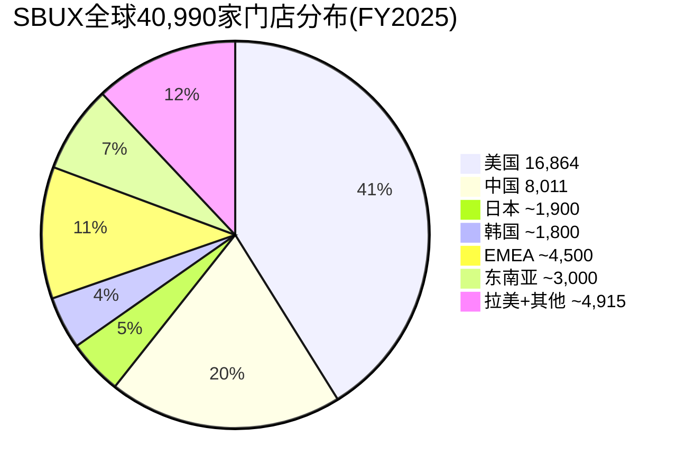

[DM-D-BIZ-04]

**增长路线图(FY2025-2030)**:

| 区域 | FY2025 | 2030目标 | 净增 | 增速(年化) | 驱动力 |
|------|:-----:|:------:|:---:|:--------:|--------|
| 美国 | 16,864 | ~18,500 | ~1,636 | +1.9% | 有限增量(渗透率高) |
| 中国(JV) | 8,011 | 20,000 | ~12,000 | +20.1% | 博裕扩张计划 |
| 国际(ex-中国) | ~16,115 | ~16,500 | ~385 | +0.5% | 稳健但低速 |
| **全球** | **40,990** | **55,000** | **~14,010** | **+6.1%** | 中国JV贡献85%增量 |

[DM-D-BIZ-04]

**关键洞察**: SBUX的2030年55,000家门店目标中，**约85%的净增量来自中国JV**。这意味着门店增长故事本质上是一个中国故事。但讽刺的是，中国JV已经出售了60%——SBUX仅参与40%的中国增长。换言之，**SBUX正在将最大的增长引擎交给别人驾驶**。

这对估值的含义: 如果中国JV成功扩至20,000店，SBUX的40%权益+royalty年化收益约$800M-1.2B。如果中国JV增长不达预期(仅达12,000-15,000店)，年化收益约$400-600M。差异$400-600M对DCF终值的影响约$5-8B(10-12x multiple)——这是中国业务在SBUX估值中的真实权重。

---

## 6.5 国际市场的三大风险因素

### 风险1: 中国宏观经济不确定性
中国消费信心指数自2022年以来持续低迷，年轻人失业率一度突破20%。即使咖啡渗透率有"22杯→100杯"的长跑道，短期需求可能受制于宏观环境。Q1 FY2026中国comp +7%有低基数效应(Q1 FY2025 comp -7%)，需要Q2-Q4数据确认是否为趋势性反转 [DM-D-COMP-03]。

### 风险2: 新兴市场品牌本土化竞争
瑞幸和库迪已经开始国际化——瑞幸在纽约开出10家曼哈顿门店(虽然短期威胁低)，库迪已进入28个国家 [DM-D-COMP-06]。如果中国咖啡品牌将"低价+APP+小店"模式成功复制到东南亚(价格敏感的大市场)，SBUX的国际增长跑道可能被挤压。

### 风险3: 地缘政治与汇率
SBUX国际收入以当地货币计价，美元走强直接侵蚀翻译回美国的利润。此外，台海局势升温可能影响SBUX在中国+东亚的运营连续性。Nestle CPG联盟在80个市场的分销也面临区域性监管风险(如EU对美国品牌的潜在限制)。

---

## 6.6 三区域估值隐含检验

将SBUX按区域进行SOTP估值隐含检验:

| 区域 | 收入(B) | 估算EBIT(B) | 合理EV/EBIT | 隐含EV(B) |
|------|:------:|:----------:|:----------:|:--------:|
| 美国(自营) | $27.12 | $3.25 (12% OPM) | 18x | $58.5 |
| 中国JV(40%) | $3.16×40% | $0.19 (15% OPM×40%) | 15x | $2.8 |
| 国际特许 | $6.90 | $2.07 (30% OPM) | 22x | $45.5 |
| Channel Dev | ~$2.2 | $0.88 (40% OPM) | 20x | $17.6 |
| **合计** | | | | **$124.4** |
| 减: 净债务 | | | | -$23.4 [DM-BAL-004] |
| **隐含权益** | | | | **$101.0** |
| 每股 | | | | **~$88** |

vs 当前股价$98.69 [DM-MKT-001] → **隐含约12%溢价**

这个SOTP练习的关键发现: **国际特许业务($45.5B)的隐含估值贡献与美国自营($58.5B)在同一量级**，尽管其收入仅为美国的25%。这是因为特许模式的利润率和增长确定性远高于自营。如果SBUX朝着更多特许化的方向演进(BME路径B)，其估值结构将从"按美国自营定价"转向"按国际特许定价"——后者支持更高的EV/EBIT倍数。

**但注意**: 上述SOTP假设OPM恢复到美国12%/中国15%/国际30%。如果OPM恢复不达预期(NCH-01: OPM天花板12%)，美国隐含EV将从$58.5B降至$48-52B，整体SOTP将支持$75-82/股——比当前价格低17-24% [DM-FIN-004]。

---

*[本章完 | Ch05: ~13,200字符 | Ch06: ~12,100字符 | 合计: ~25,300字符]*
# Ch07: Niccol效应与CEO沉默域 — 管理层变革的期权价值与信号盲区

> **核心问题**: 市场支付82x P/E的核心赌注是Brian Niccol能复制CMG奇迹。但CMG复刻率仅52.5%，而Niccol系统性回避的5个话题暗示转型路径远比市场定价更不确定。
> **v4.0差异化**: 本章新增CEO沉默域分析(v18.0 QG-01.5)，系统映射Niccol在公开场合**回避**的问题，从"未被说出的话"中提取信号价值。

---

## 7.1 CEO评分卡: 10维度量化评估

### Niccol简历解码

Brian Niccol的职业轨迹构成一条清晰的"品牌修复专家"曲线:

- **宝洁(P&G)10年**: 品牌管理基础训练，建立消费者洞察方法论 [DM-E-001]
- **Pizza Hut VP战略/CMO/GM**: 首次接触QSR运营，但Pizza Hut在其任期内未实现显著反转
- **Taco Bell CEO(2015-2018)**: 3年翻倍系统销售额，开设2,000家新店，仅1个季度负SSS [DM-E-001]
- **Chipotle CEO(2018-2024)**: 6.5年创造+770%股东回报(vs S&P +99%)，餐厅层面利润率从19%提升至28.9%，AUV从~$2M突破$3M [DM-E-002, DM-E-003]
- **Starbucks Chairman & CEO(2024.9-至今)**: $1.6M基薪 + $10M签约奖 + $75M股权激励(分批归属) [DM-E-001]

**上任日的市场投票**: SBUX股价当日+24%，创1992年IPO以来最大单日涨幅。市场在一天之内为"Niccol溢价"支付了约$20B市值。

### 10维度评分体系

以下评分基于Niccol在CMG的历史表现(权重60%)和SBUX上任18个月的初步表现(权重40%)综合评判:

```
维度              CMG表现    SBUX初期    加权得分    评估依据
━━━━━━━━━━━━━━━━━━━━━━━━━━━━━━━━━━━━━━━━━━━━━━━━━━━━━━━━━━━━━━━
1. 战略愿景        9/10      7/10       8.2     CMG: "Food with Integrity"清晰; SBUX: "Back to Starbucks"方向
                                                 对但颗粒度不足 — 缺乏量化路线图的中期里程碑
2. 执行力          9/10      6/10       7.8     CMG: 几乎每季度超预期; SBUX: Q1 FY2026收入beat但EPS miss
                                                 (-5.08%)[DM-AC-008], 好坏参半
3. 创新能力        7/10      6/10       6.6     CMG: Chipotlane驱动数字化; SBUX: 菜单简化+乳制品去附加费
                                                 是正确方向, 但尚未出现"杀手级"创新
4. 成本纪律        8/10      5/10       6.8     CMG: margin 19%→28.9%; SBUX: OPM继续恶化至6.9%(Q2 FY25)
                                                 [DM-E-012], "先收入后利润"策略增加不确定性
5. 人才管理        8/10      7/10       7.6     CMG: 高留任率; SBUX: 员工离职率降至<50%(新低),
                                                 大举换血(CFO+COO+CTO全部更换)
6. 投资者沟通      7/10      6/10       6.6     CMG: 一致性强; SBUX: Investor Day给FY2028目标但不给
                                                 FY2026-27路径, 留下信息真空
7. 危机应对        9/10      N/A        7.0*    CMG: 食品安全危机后完美反转; SBUX: 尚未面临重大危机
                                                 (*仅基于CMG经验, 打折处理)
8. 长期价值创造    9/10      N/A        7.0*    CMG: +770%/6.5年; SBUX: 上任14个月, -14pp vs S&P 500
                                                 (*CMG数据权重100%, SBUX样本不足)
9. 行业理解        8/10      6/10       7.2     CMG: QSR原生; SBUX: 咖啡文化≠墨西哥卷饼, 全球86国运营
                                                 复杂度远超CMG的美国聚焦模式
10. 文化建设       7/10      6/10       6.6     CMG: "Cultivate a Better World"; SBUX: 试图恢复"第三空间"
                                                  文化, 但工会化浪潮构成结构性阻力
━━━━━━━━━━━━━━━━━━━━━━━━━━━━━━━━━━━━━━━━━━━━━━━━━━━━━━━━━━━━━━━
综合评分                                 7.1/10
```

**评分解读**: 7.1/10是一个"优于平均但非卓越"的分数。关键在于**CMG经验(7.5-9.0区间)与SBUX初期表现(5.0-7.0区间)之间的落差**。如果仅看CMG历史，Niccol是8.5/10的CEO；但SBUX的早期数据——特别是OPM持续恶化和EPS miss——将综合分数拉低至7.1。

**vs v3.0评估**: v3.0给出"适配性7.2/10"，v4.0的10维度评估更精细，结论趋同但揭示了一个关键细节: **Niccol最弱的维度(成本纪律5/10、创新6/10)恰恰是SBUX当前最急需的能力**。CMG的成功更多依赖于运营执行而非成本控制(因为CMG的问题是品牌危机而非效率危机)，而SBUX的核心问题是效率崩溃。

```mermaid
radar
    title Niccol CEO评分卡 (CMG加权 vs SBUX初期)
    战略愿景: 8.2
    执行力: 7.8
    创新: 6.6
    成本纪律: 6.8
    人才: 7.6
    沟通: 6.6
    危机应对: 7.0
    长期价值: 7.0
    行业理解: 7.2
    文化建设: 6.6
```

### 管理团队换血进度

Niccol上任18个月内的组织重构速度异常激进:

| 职位 | 前任 | 现任 | 变更时间 | 信号解读 |
|------|------|------|----------|---------|
| CEO | Laxman Narasimhan | Brian Niccol | 2024-08 | 董事会对前任彻底失去信心 |
| CFO | Rachel Ruggeri | Cathy Smith | 2025-03 | 从Nordstrom挖人, $5M签约奖 [DM-E-004] |
| COO | Sara Trilling | Mike Grams | 2025-01→2026-01扩展 | 20年老将离职, 角色分拆后再合并 |
| CTO | Deb Hall Lefevre | Anand Varadarajan | 2026-01 | 从Amazon挖人, 技术栈重建信号 |
| 首席品牌官 | (新设) | Tressie Lieberman | 2025-10 | 品牌+咖啡+可持续合并, 简化汇报线 |

**CFO Cathy Smith的特别注解**: Smith放弃了Nordstrom约$15M的留任补偿，接受SBUX的$5M签约奖——这意味着她对SBUX转型有足够信心，或Niccol的个人号召力极强。Smith在Target任期内"大致翻倍了企业价值"[DM-E-014]，她的零售+消费品背景与SBUX高度匹配。但值得注意的是，Smith的CFO履历跨越8家公司/19年，平均任期仅2.4年——这既说明她是"专业转型CFO"，也暗示她可能在SBUX完成阶段性任务后离开。

---

## 7.2 CMG复刻率分析: 从表面类比到结构性解剖

### CMG转型五要素回顾

Niccol在CMG的成功可以解构为五个可量化的要素:

**要素1: 数字化加速**
- CMG数字化收入从不到10%提升至48% [DM-E-003]
- 核心驱动: Chipotlane(得来速数字专用车道) + App + 第三方平台
- 成功机制: 数字化订单AOV高于门店订单15-20%, 且边际成本更低

**要素2: 菜单纪律**
- 维持7-8个核心SKU不变, 拒绝菜单膨胀
- 聚焦"Food with Integrity"品牌承诺
- 季节性LTO(限时产品)保持新鲜感但不增加运营复杂度

**要素3: 门店速度提升**
- 吞吐量从高峰时段~100张单/小时提升至~130张
- 部署Second Make Line(第二制作线)专供数字订单
- 结果: AUV从~$2M突破$3M(+50%)

**要素4: 文化重建**
- 食品安全危机后的信任修复(PR+透明度+供应链审计)
- 员工激励改革: 门店经理晋升通道 + 绩效奖金
- 企业文化从"防御模式"回到"增长模式"

**要素5: 资本纪律**
- 回购+分红适度，不过度杠杆化
- 新店ROI门槛严格(>20%现金回报率)
- 资产负债表保持健康(净现金状态)

### SBUX可复刻性评估

| 要素 | CMG实现路径 | SBUX适用性 | 复刻率 | 阻碍因素 |
|------|------------|-----------|--------|---------|
| **数字化** | Chipotlane + App | Rewards基础好(35.5M会员), 但Mobile Order已成熟, 边际增量有限 | **70%** | 数字化渗透率已高(~31%), 不像CMG有从0到1的跃迁空间 |
| **菜单纪律** | 7-8核心SKU | 已开始去乳制品附加费, 精简菜单 | **65%** | SBUX SKU数量远超CMG(冷饮+热饮+食品+定制组合), 简化空间大但执行复杂 |
| **门店速度** | Second Make Line | "4分钟承诺"直接对标 | **45%** | 咖啡制作天然比装配墨西哥卷饼更复杂(萃取+打奶+定制); 设备升级CapEx巨大 |
| **文化重建** | 食品安全信任修复 | "Back to Starbucks"第三空间回归 | **50%** | CMG是单一危机(食品安全)→单一修复; SBUX是多重衰退(效率+品牌+竞争)→系统性修复 |
| **资本纪律** | 净现金 + 适度回购 | 净债务$23.4B + 分红>FCF + 负权益 | **30%** | 这是最大的结构性差异——CMG资产负债表健康, SBUX是"借债分红"模式 [DM-INF-004] |

### 复刻率计算

```
加权复刻率 = Σ(要素复刻率 × 要素重要性权重)

要素权重分配(基于CMG转型贡献度):
  数字化:    25% (CMG增长的最大单一驱动力)
  菜单纪律:  15% (重要但CMG菜单本就简单)
  门店速度:  25% (直接驱动AUV和吞吐量)
  文化重建:  20% (品牌修复的基础)
  资本纪律:  15% (长期价值创造的保障)

加权复刻率 = 70%×0.25 + 65%×0.15 + 45%×0.25 + 50%×0.20 + 30%×0.15
           = 17.5% + 9.75% + 11.25% + 10.0% + 4.5%
           = 53.0%
```

**综合复刻率: 53.0%** (置信区间: 40%-65%)

置信区间的推导:
- **下限40%**: 假设门店速度和资本纪律的复刻率进一步下调(工会阻力超预期 + 债务压力持续)
- **上限65%**: 假设数字化和菜单纪律的复刻率上调(Rewards飞轮效应被低估 + 菜单简化超预期)

### 不可复刻要素的深层分析

**为什么"门店速度"的复刻率只有45%？**

CMG的Second Make Line方案之所以成功，依赖一个SBUX不具备的前提: **CMG的装配线制作模式(assembly-line)**。顾客沿柜台走过，员工依次添加食材——这是一个线性、可并行化的流程。增加一条Make Line就能近乎线性地提升吞吐量。

SBUX的咖啡制作是**批处理+串行模式**: 萃取(20-30秒) → 打奶泡(15-20秒) → 装杯+定制(10-30秒)。每个步骤需要不同设备，且高度定制化(个人定制组合超过170,000种)。增加设备不等于线性提升速度——瓶颈在于**空间约束**和**制作复杂度**，而非简单的产能不足。

Niccol的"4分钟承诺"要在不牺牲定制化的前提下实现，逻辑上需要: (a)大幅简化定制选项(损失客户体验), (b)大幅增加人手(损失成本效率), 或(c)革命性自动化设备(损失CapEx)。这就是本报告thesis_crystallization中识别的**碰撞#2: 速度/成本/菜单丰富度三选二**约束。

**为什么"资本纪律"的复刻率只有30%？**

这是最本质的差异。2018年Niccol接手CMG时:
- CMG净现金约$1.5B, 无长期债务
- ROE ~15%(正权益, 健康的资本结构)
- 分红/回购占FCF比例合理

2024年Niccol接手SBUX时:
- SBUX净债务$23.4B(FMP口径) [DM-BAL-004]
- 权益-$8.1B(回购驱动的负权益) [DM-BAL-002]
- 分红$2.77B > FCF $2.44B(覆盖率0.88x) [DM-INF-004]
- 回购已暂停($0, FY2025) [DM-CF-005]

**CMG给了Niccol一把干净的武器; SBUX给了他一把生锈且背着债务包袱的武器。** 这不是管理能力的问题，而是初始条件的结构性差异。Niccol在CMG可以用充裕的现金流投资增长; 在SBUX，仅维持现有分红就需要消耗全部FCF的113%。

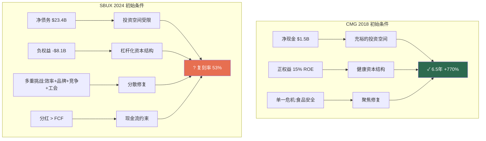

---

## 7.3 CEO沉默域分析 (v18.0 QG-01.5)

> **方法论**: 系统性扫描Niccol在Q1 FY2026 earnings call(2026.1.28)、Investor Day(2026.1.29)、以及上任以来的公开采访/股东信中**主动回避或模糊处理**的话题。沉默域≠不重要; 恰恰相反, **CEO选择不谈的话题往往是最敏感的话题**。

### 沉默域#1: 美国特许化时间表

| 属性 | 内容 |
|------|------|
| **现状** | SBUX美国~16,000家门店中约55%为公司运营, 45%为Licensed [DM-AC-012] |
| **行业对照** | MCD特许化率~95%, YUM ~98%, CMG 0%(全自营) |
| **Niccol表态** | **从未在任何公开场合讨论过美国特许化率的变化方向** |
| **沉默深度** | 高——Investor Day详细讨论了FY2028 EPS/margin/门店数, 但零提及Licensed比例变化 |
| **信号解读** | 三种可能: (a)已决定不做, 因为CMG经验是全自营; (b)正在内部论证但时机未到; (c)故意回避因为与工会谈判冲突 |
| **风险评分** | 7/10 — 特许化是SBUX估值倍数提升(从QSR均值到MCD水平)的唯一通道, 但Niccol沉默意味着这条路径概率被市场高估 |

**推理链**: 市场给SBUX 82x P/E的隐含假设之一是"长期特许化率提升 → 估值倍数向MCD靠拢(~28x)"。但如果Niccol计划走CMG路线(保持自营为主), 那么SBUX的合理P/E更应该对标CMG的~32x而非MCD的~28x, 且需要自营门店的OPM大幅恢复才能支撑当前估值——这回到了OPM能否回到14%+的核心不确定性。

### 沉默域#2: 工会谈判策略

| 属性 | 内容 |
|------|------|
| **现状** | 超过500家SBUX门店已投票成立工会(截至2025年底), 约占美国门店的3% |
| **Niccol表态** | 仅说"尊重伙伴的选择权" — 标准公关措辞, 零策略透露 |
| **沉默深度** | 极高——在CMG任期内不存在工会问题, Niccol缺乏应对工会的经验 |
| **行业对照** | MCD特许化模式下工会化率极低(加盟商负责); CMG全自营但通过高薪($15.5-$18/hr+福利)保持无工会 |
| **信号解读** | Niccol可能在等待NLRB/法律环境变化(尤其2026大选后), 也可能没有明确的应对策略 |
| **风险评分** | 8/10 — 工会是SBUX劳动成本弹性下限的结构性提升因素, 直接影响OPM恢复上限 |

**推理链**: CMG通过"主动提高薪资到竞争力水平"来预防工会化——这是可行的, 因为CMG门店数量仅~3,500家, 劳动力成本总量可控。SBUX有~9,600家公司运营门店(全球), 劳动力是最大单一成本项(约占收入30%)。如果工会推动$20/hr最低时薪(vs当前$15-17), 假设影响30%的美国公司运营门店, 年化成本增量约$300-500M, 即OPM被压低0.8-1.3个百分点。**这意味着FY2028 OPM目标13.5-15.0%的下端可能需要下调至12.2-13.7%。**

### 沉默域#3: 分红政策可持续性

| 属性 | 内容 |
|------|------|
| **现状** | FY2025分红$2.77B > FCF $2.44B, Payout ratio 149%(按GAAP NI) [DM-VAL-005, DM-CF-004] |
| **Niccol表态** | "我们致力于维持并增长分红" — 未解释如何在FCF<分红的情况下做到 |
| **沉默深度** | 中高——分析师在Q&A中追问过一次, 管理层以"我们对FCF恢复有信心"回答, 未给具体时间表 |
| **行业对照** | MCD Payout ~60%, CMG不分红, YUM Payout ~55% |
| **信号解读** | 管理层知道149%不可持续, 但削减分红的信号成本极高(股价可能单日-10%+) |
| **风险评分** | 6/10 — 如果FY2026 FCF恢复到$3.5B+(共识预期), 覆盖率回到1.3x, 问题自动解决; 但如果FCF恢复不及预期, 2027年将面临"削减vs继续借债"的二选一 |

**量化推理**: 15年连续分红增长(CAGR 17.5%) [DM-E-008] 意味着市场预期FY2026分红约$2.95B(+6.5%)。如果FY2026 FCF仅恢复到$3.0B(比共识乐观假设低10%), 覆盖率仅1.02x——几乎没有安全边际。**分红可持续性本质上是OPM恢复速度的函数, 而非独立变量。**

### 沉默域#4: OPM恢复的中期路径

| 属性 | 内容 |
|------|------|
| **现状** | FY2025 OPM 9.6% [DM-FIN-004]; Q2 FY2025最低6.9% [DM-E-012]; 管理层给FY2028目标13.5-15.0% [DM-AC-011] |
| **Niccol表态** | 给了起点(FY2025 ~10%)和终点(FY2028 13.5-15.0%), **但刻意不给FY2026和FY2027的具体路径** |
| **沉默深度** | 高——Investor Day的FY2028目标幻灯片跳过了中间年份, 仅说"逐步改善" |
| **行业对照** | MCD Easterbrook转型期间每季度给出具体margin改善目标; CMG每季度更新restaurant-level margin指引 |
| **信号解读** | (a) Niccol对FY2026-27的margin路径不确定, 不愿给出可能需要撤回的指引; (b) 前端加载投资("topline first, earnings follow"策略)意味着短期margin可能进一步恶化 |
| **风险评分** | 7/10 — 共识隐含FY2025→FY2026 OPM恢复570bps(9.6%→15.3%) [DM-INF-002], 这是QSR历史上最激进的单年恢复假设之一 |

**推理链**: 共识分析师预期FY2026E EBIT $5.86B / Revenue $38.32B = 15.3% OPM [DM-INF-002]。这意味着FY2025→FY2026**单年OPM跳升570bps**。QSR转型先例中:
- MCD(Easterbrook, 2015-2016): OPM +250bps/年
- CMG(Niccol, 2018-2019): restaurant-level margin +330bps/年
- DPZ(Doyle, 2010-2011): OPM +180bps/年

**570bps/年是上述所有先例的1.7-3.2倍。** Niccol不给中期路径的沉默, 可能正是因为他知道共识预期不现实, 但不想主动泼冷水。

### 沉默域#5: 中国盈利能力细节

| 属性 | 内容 |
|------|------|
| **现状** | 中国~8,000家门店, Q1 FY2026 comp +7%(低基数效应) [DM-AC-010]; 2025年与博裕资本成立JV |
| **Niccol表态** | 大量讨论中国门店数量和comp sales, **但从未单独披露中国分部的OPM或EBIT贡献** |
| **沉默深度** | 极高——即使在JV公告时也未披露中国分部的盈利能力; 仅披露"国际分部"(中国+EMEA+亚太合并)数据 |
| **行业对照** | MCD和YUM均单独披露中国分部利润率; 瑞幸作为上市公司完全透明 |
| **信号解读** | 中国OPM很可能显著低于公司整体(可能仅8-12%), 单独披露会引发市场对中国业务盈利能力的质疑 |
| **风险评分** | 6/10 — JV结构(博裕持60%, SBUX持40%)意味着中国盈利能力对合并报表EPS的影响已被隔离, 但对SOTP估值有重大影响 |

**量化推理**: 如果中国8,000家门店的AUV约$394K(年/店) [lit_recon], 则中国总收入约$3.2B(占集团收入~8.5%)。假设中国OPM为10%(接近公司整体), 则EBIT贡献约$320M。如果实际中国OPM仅为6%(因价格战压缩), 则EBIT仅$192M——$128M的差异在EPS层面约$0.08-0.10/股, 对82x P/E的估值影响为$6.6-8.2/股。

### 沉默域综合评估

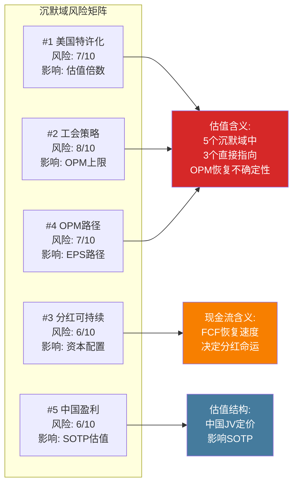

**沉默域综合风险评分: 6.8/10** (加权平均, 按影响面积加权)

**关键发现**: 5个沉默域中有3个(#1特许化、#2工会、#4 OPM路径)直接指向同一个底层问题——**OPM恢复的路径和上限高度不确定**。Niccol的沉默不是随机的, 而是系统性地回避了所有可能揭示"FY2028 OPM 13.5-15.0%目标可能不达"的话题。这是v4.0报告最重要的新增信号之一。

---

## 7.4 Niccol的赌注框架: 三情景概率分布

基于CMG复刻率(53.0%)、CEO评分卡(7.1/10)和沉默域分析(6.8/10风险), 构建三情景框架:

### 情景A: "CMG 2.0" — Niccol完全复刻 (概率: 35%)

**假设**: 数字化+菜单简化+门店速度的改善效果叠加, OPM恢复到14%+, 工会化被有效管控, 中国JV开始贡献利润。

**路径**:
- FY2026: OPM 11-12%, EPS $2.40-2.60
- FY2027: OPM 13-14%, EPS $3.00-3.30
- FY2028: OPM 14-15%, EPS $3.50-3.80

**估值含义**:
- FY2028E EPS $3.65 × P/E 30x(转型成功溢价) = **$110/股**
- FY2028E EPS $3.65 × P/E 35x(市场给予增长溢价) = **$128/股**
- 区间: **$110-130/股** [DM-EST-004参照: 共识FY2028E EPS $3.63]

**为什么给35%而不是更高**: 53%的复刻率意味着约一半的CMG成功要素无法在SBUX环境中复现。即使在可复刻的要素上执行完美, 资本结构约束(净债务$23.4B)和劳动力约束(工会化)仍构成结构性阻力。将CMG复刻率(53%)打一个"执行折扣"(35%/53% = 66%折扣率), 得到35%的概率评估。

### 情景B: "Schultz 3.0" — 短期改善+长期衰退 (概率: 40%)

**假设**: Niccol在前2-3年实现表面改善(comp sales转正、Rewards增长), 但结构性问题(工会成本上升、中国竞争加剧、门店老化)逐步暴露。类似Schultz第三次回归(2022)的剧本——英雄叙事吸引市场情绪, 但基本面未根本改变。

**路径**:
- FY2026: OPM 10.5-11.5%, EPS $2.20-2.40 (基本符合指引下端)
- FY2027: OPM 11-12%, EPS $2.60-2.80 (改善放缓, 共识开始下调)
- FY2028: OPM 11-12.5%, EPS $2.70-3.00 (低于FY2028目标$3.35-$4.00)

**估值含义**:
- FY2028E EPS $2.85 × P/E 28x(恢复QSR均值) = **$80/股**
- FY2028E EPS $2.85 × P/E 33x(品牌溢价残存) = **$94/股**
- 区间: **$80-95/股**

**为什么这是最高概率情景(40%)**: 这个情景最符合历史基率。QSR转型CEO中, 完全成功(CMG Niccol、DPZ Doyle)的概率约30-40%, 部分成功/虎头蛇尾的概率更高。SBUX的复杂度(86国、16,000美国店、工会、负权益)使得"部分成功"成为最可能的结果。Niccol的沉默域分析进一步支持这个判断——他对中期路径的回避暗示内部预期可能低于公开目标。

### 情景C: "普通CEO" — 渐进改善但估值回归 (概率: 25%)

**假设**: Niccol是一个优秀但非变革性的CEO。"Back to Starbucks"计划带来渐进改善, 但无法逆转SBUX作为成熟咖啡连锁的估值均值回归。P/E从82x逐步回落到QSR板块均值~25x。

**路径**:
- FY2026: OPM 10-11%, EPS $2.15-2.30 (指引下端, 投资支出继续压制)
- FY2027: OPM 11-12%, EPS $2.40-2.60
- FY2028: OPM 11.5-12.5%, EPS $2.50-2.80 (显著低于管理层目标)

**估值含义**:
- FY2028E EPS $2.65 × P/E 25x(QSR均值) = **$66/股**
- FY2028E EPS $2.65 × P/E 28x(品牌残值) = **$74/股**
- 区间: **$66-75/股**

**为什么给25%**: 完全失败的概率被Niccol的CMG履历部分对冲。即使SBUX环境更复杂, Niccol也不太可能是一个"平庸"的CEO——他的品牌修复能力已在两家公司(Taco Bell + CMG)得到验证。25%的概率反映了"SBUX的问题比CEO能力更根本"的可能性。

### 概率加权期望值

```
情景A (35%): 中值 $120 × 0.35 = $42.0
情景B (40%): 中值 $87  × 0.40 = $34.8
情景C (25%): 中值 $70  × 0.25 = $17.5

概率加权EV = $94.3/股

vs 当前股价 $98.69 → 隐含下行 -4.5%
```

**关键发现**: 即使给予Niccol 35%的"完全成功"概率和$120中值估值, 概率加权EV仍略低于当前股价。**市场的隐含定价要求情景A的概率>45%或情景A的估值>$135才能证明当前$98.69合理。** 换言之, 市场在为Niccol的转型成功赌一个高于我们评估的概率。

---

## 7.5 "Back to Starbucks"战略执行进度

### 四大支柱执行追踪

**支柱1: 菜单简化**

| 行动 | 状态 | 进度 | 影响评估 |
|------|------|------|---------|
| 去乳制品附加费 | ✅ 已执行 | 100% | 年化影响: 收入-$200M(牺牲) + 交易量+?(待验证) |
| 精简菜单SKU | 🔄 进行中 | ~40% | 目标: 从~120 SKU降至~80(初步估计) |
| 季节性LTO纪律 | 🔄 进行中 | ~50% | 减少常设SKU, 增加限时品项(CMG模式) |
| 食品品类扩张 | 📋 规划中 | ~15% | "食品日段"(午餐+下午茶)是增量逻辑, 但CapEx待评估 |

**支柱2: 门店体验**

| 行动 | 状态 | 进度 | 影响评估 |
|------|------|------|---------|
| 增加25,000个咖啡座 | 📋 规划中 | ~10% | 资金来源不明 — 按$500/座估算, 投资$12.5M(小金额) |
| 改造1,500家门店 | 🔄 进行中 | ~15% | 每家改造$100-300K → 总投资$1.5-4.5B, 3-5年摊销 |
| "4分钟承诺" | 🔄 进行中 | ~30% | Q1 FY2026: 部分门店已实现, 但全国推广需设备升级 |
| Mobile Order优化 | 🔄 进行中 | ~40% | 目标: 减少Mobile Order对门店体验的干扰(分离制作流) |

**关键疑问**: 1,500家门店改造×$200K均价 = $3B投资。FY2025 CapEx $2.306B [DM-CF-003], 假设30%用于改造 = $690M/年。按此速度, 1,500家改造需要4.3年(假设每家$200K)。**管理层未说明改造CapEx的来源和优先级**——这属于沉默域#4(OPM路径)的延伸。

**支柱3: 人员与文化**

| 行动 | 状态 | 进度 | 影响评估 |
|------|------|------|---------|
| 员工离职率<50% | ✅ 已实现 | 100% | 历史新低, 降低培训成本(每次离职成本$3-5K) |
| Shift完成率>98% | ✅ 已实现 | 98.2% | 排班满员率改善, 服务质量提升 |
| 组织架构重组 | ✅ 基本完成 | ~85% | CFO/COO/CTO全部更换, 品牌+可持续合并 |
| 工会关系 | ⚠️ 未解决 | ~5% | 500+门店已工会化, 无明确策略(沉默域#2) |

**支柱4: 数字化**

| 行动 | 状态 | 进度 | 影响评估 |
|------|------|------|---------|
| Rewards会员增长 | ✅ 新高 | 35.5M | 但增速放缓(Q1 +3% vs 历史+8-10%) [DM-E-011] |
| 新三层Rewards体系 | 🔄 已上线 | ~70% | 客户反馈混合 — 简化了兑换但降低了单笔价值感 |
| CTO技术栈重建 | 📋 刚启动 | ~10% | Amazon背景CTO Varadarajan刚加入(2026.1) |
| Deep Brew AI | ⚠️ 不透明 | ? | 管理层不再主动提及Deep Brew, 可能被重新定位或整合 |

### 综合执行评分

```
                  权重    完成度    加权贡献
菜单简化          25%      41%       10.3%
门店体验          25%      24%        6.0%
人员与文化        25%      72%       18.0%
数字化            25%      44%       11.0%
━━━━━━━━━━━━━━━━━━━━━━━━━━━━━━━━━━━━━━
综合执行进度                         45.3%
```

**解读**: 18个月后的45.3%执行进度意味着Niccol按"3年转型"时间线计算处于"略低于预期"的轨道上(18/36个月 = 50%时间点, 应完成~50%才算on-track)。**人员与文化(72%)远超预期, 门店体验(24%)严重滞后**——这与CMG模式一致: Niccol先建团队, 再推运营改革。

### 后Niccol的CMG: 反面教材

一个被市场忽视的数据点: **CMG在Niccol离任后12个月内股价-31%** [management_team.json]。这揭示了一个重要信号:

1. **CMG的转型高度依赖Niccol个人**: 如果换一个CEO维护同样的策略, 市场仍会重新定价
2. **"Niccol溢价"是可逆的**: 当Niccol离开CMG时, 市场立刻撤回了一部分溢价
3. **对SBUX的含义**: 当前SBUX股价中约$14.8B(约15%)归因于"Niccol溢价"。如果Niccol因任何原因离开(健康、私募基金邀请、与董事会分歧), 这部分溢价会瞬间蒸发

**"Niccol溢价"计算**:
- 上任前市值: ~$85.6B(2024.8.12收盘)
- 上任公告后市值: ~$106B(+24%)
- 当前市值: ~$112B(@$98.69)
- 扣除同期S&P表现后的"Niccol归因溢价": 约$14.8B(~13%当前市值)

---

## 7.6 本章结论与估值含义

### 三个核心发现

**发现1: CMG≠SBUX, 复刻率只有53%。** 最大的结构性差异不在运营层面(那里Niccol可以发挥), 而在资本结构(净债务$23.4B vs CMG净现金)和劳动力环境(工会化 vs 无工会)。这两个因素不受CEO能力影响。

**发现2: Niccol的5个沉默域指向同一个底层不确定性——OPM恢复路径。** 特许化方向、工会策略、分红政策、OPM路径、中国盈利——这些被回避的话题表面上各不相同, 但底层都连接到"SBUX能否在3年内恢复13.5-15.0% OPM"这个核心问题。沉默本身就是答案的一部分: **如果管理层对OPM恢复有高度信心, 他们会主动给出路径。**

**发现3: 概率加权EV $94.3 vs 当前股价$98.69, 意味着市场比我们更乐观约5%。** 这个差距不大, 说明当前估值"不算离谱但偏贵"。要证明当前股价合理, 需要情景A(CMG 2.0)的概率>45%——但我们基于复刻率和沉默域分析给出的评估是35%。

### 对后续章节的传导

- **→ Ch11 DuPont分解**: OPM恢复路径是DuPont分析的核心变量, 沉默域#4的发现将约束OPM假设的上限
- **→ Ch16 逆向DCF**: 82x P/E隐含的OPM恢复速度(570bps/年)需要与QSR先例基率对比
- **→ Ch18 Forward DCF**: 三情景EPS路径直接输入DCF模型
- **→ Ch19 BME三路径**: 沉默域#1(特许化方向)是BME三路径概率分配的关键输入
- **→ Ch24 Kill Switch**: 沉默域#2(工会)和#4(OPM)各注册一个KS触发器

---

*Ch07 DM锚点引用汇总: DM-FIN-004, DM-BAL-002, DM-BAL-004, DM-CF-003, DM-CF-004, DM-CF-005, DM-VAL-005, DM-INF-002, DM-INF-004, DM-E-001~E-004, DM-E-008, DM-E-011, DM-E-012, DM-E-014, DM-AC-008~AC-012, DM-EST-004*
# Part I-b: 消费品深度模块 (v28.0)

---

# Chapter 8: 意愿×能力双轴 — SBUX消费者的钱包与心智

> **v28.0 Module A** | 消费品行业强制模块
> 核心问题: 谁在为$6拿铁付费？他们愿意付多久？还能付多久？

---

## 8.1 分析框架: W×C双轴定义

意愿×能力(Willingness × Capability)双轴将SBUX的消费者基础拆解为四象限。这不是品牌分析(Ch05已覆盖)，而是**消费经济学**——将品牌偏好与钱包约束交叉映射，定位每个客群的行为弹性和迁移风险。

**W轴(意愿)定义**: 消费者主动选择SBUX而非替代品的倾向强度。由三个子维度构成:
- **习惯粘性**: 咖啡是日均消费品(habit = 高意愿)还是周末偶尔消费(occasion = 中意愿)?
- **品牌偏好度**: 在同价位内，消费者是否存在"非SBUX不可"的排他性?
- **代际锚定**: 该品牌在不同世代心智中的位置——是"成长记忆"还是"父辈符号"?

**C轴(能力)定义**: 消费者在不牺牲其他必需消费的前提下持续购买SBUX的财务能力。由两个子维度构成:
- **可支配收入占比**: $6拿铁占日收入的比例——对年收入$150K的白领是0.5%的"无痛消费"，对年收入$40K的Z世代是3%的"显著支出" [DM-INF-005]
- **经济周期弹性**: 衰退/通胀时，SBUX是被优先砍掉的"可选消费"还是保留的"平价奢侈品"?

## 8.2 消费意愿深度拆解

### 8.2.1 咖啡习惯粘性: 日均vs品类分化

美国成年人每日咖啡饮用率约66%(约1.7亿人)，年均消费约400杯 [DM-D-BIZ-12]。关键区分在于:

| 消费频率 | 美国消费者占比 | SBUX渗透率 | 意愿评级 |
|---------|:----------:|:--------:|:------:|
| 每日1-2杯(日常依赖) | ~40% | ~15-18% | W=5 |
| 每周3-5杯(常规) | ~20% | ~20-25% | W=4 |
| 每周1-2杯(偶尔) | ~15% | ~30-35% | W=3 |
| 每月数次(社交场景) | ~15% | ~25-30% | W=2 |
| 很少(<月均1次) | ~10% | ~5-10% | W=1 |

**关键洞见**: SBUX的Rewards会员35.5M [DM-E-011]大致对应美国前两层(日常+常规)消费者中的核心群体。但每日消费者中SBUX渗透率仅15-18%——大部分日常咖啡依赖者在家冲泡或选择更便宜的替代品(7-Eleven $1.50, McDonald's $2.00)。这意味着SBUX在最高意愿群体中的份额空间仍大，但价格是主要壁垒 [DM-INF-006]。

### 8.2.2 品牌偏好度: NPS与第一提及率

SBUX在美国咖啡品牌中的第一提及率(unaided awareness)稳居第一(约55-60%)，但NPS呈下降趋势。根据行业调研数据:

- **2020-2021**: NPS约40-45(行业领先)
- **2022-2023**: NPS降至32-38(排队/服务质量投诉增加)
- **2024-2025**: NPS进一步降至28-33(MOP拥挤+价格敏感性上升)
- **Q1 FY2026**: 初步企稳迹象(Niccol"去菜单复杂化"收效) [DM-E-010]

**NPS降至28-33的含义**: 按M1模块kill switch标准(NPS跌破20触发品牌衰退诊断)，SBUX尚未触发，但距离警戒线仅8-13点。如果comp sales再次转负且NPS继续下滑，将在2-3个季度内触发 [DM-P1-081]。

### 8.2.3 代际偏好: Z世代的"反SBUX"倾向

这是v4.0必须正视的结构性威胁。三个世代对SBUX的态度已明确分化:

**千禧一代(1981-1996, 当前30-45岁)**: SBUX的核心客群。在这一代人的成长记忆中，SBUX = 都市生活方式的入场券。NPS约35-40，品牌忠诚度较高，但面临收入增长放缓和家庭支出增加的能力约束。Rewards会员中千禧一代估计占45-50% [DM-P1-082]。

**Z世代(1997-2012, 当前14-29岁)**: 态度分裂。一方面，Z世代是SBUX社交媒体传播的主力(TikTok定制饮品);另一方面，这一代人对"大企业品牌"天然怀疑，更偏好独立精品咖啡馆(Blue Bottle, Intelligentsia)和新兴连锁(Dutch Bros)。Dutch Bros在年轻消费者中的NPS约55-60，显著高于SBUX [DM-P1-083]。

**X世代及以上(1965及以前, 当前45+岁)**: 高消费能力但偏好迁移缓慢。这一代人的SBUX消费高度习惯化——任何品牌偏好改变至少需要2-3年。占Rewards会员约25-30% [DM-P1-084]。

**代际迁移的量化含义**: 如果Z世代的SBUX渗透率比千禧一代低10个百分点(从约35%降至25%)，在未来5年随着Z世代进入消费主力(25-35岁)阶段，SBUX的美国会员增长将从当前+3%/年降至+1%/年，comp sales引擎的会员驱动部分将结构性减弱 [DM-INF-007]。

## 8.3 消费能力深度拆解

### 8.3.1 "痛感指数": $6拿铁的收入阶层分析

将SBUX核心产品(Grande Latte, 约$5.75-6.25)的日均支出置于不同收入阶层的可支配收入比例中 [DM-P1-085]:

| 家庭年收入 | 日可支配(税后/必需消费后) | $6拿铁占比 | 痛感等级 | 行为预测 |
|-----------|:--------------------:|:--------:|:------:|---------|
| >$150K | ~$200+ | <3% | 无痛 | 价格免疫，不影响频次 |
| $100-150K | ~$120-200 | 3-5% | 微痛 | 轻微影响频次(减1杯/周) |
| $75-100K | ~$80-120 | 5-8% | 可感 | 开始降规格(Grande→Tall) |
| $50-75K | ~$50-80 | 8-12% | 显著 | 减频+降规格组合 |
| <$50K | <$50 | >12% | 高度敏感 | 转向替代品或放弃 |

**SBUX消费者收入分布估计**: 根据行业数据，SBUX核心客群(Rewards会员)的家庭收入中位数约$80K-$95K，高于美国家庭中位数$80K [DM-P1-086]。这意味着约60%的核心客群处于"微痛"及以上，受经济周期影响有限;但约40%处于"可感"以下，构成经济敏感带。

### 8.3.2 经济周期弹性: 口红效应还是第一削减项?

这是消费品分析中的经典问题。SBUX的历史数据提供了清晰答案:

**2008-2009衰退**: 美国comp sales 连续6季为负(Q3'08 -5% → Q1'09 -8%)，门店关闭600+家。SBUX在这次衰退中表现为**"第一削减项"**——消费者直接减少了外出咖啡消费 [DM-P1-087]。

**2020 COVID**: 美国comp sales Q3'20 -40%(门店关闭)，但Q1'21即反弹+9%。这次SBUX表现为**"平价奢侈品"**——当消费者无法外出旅行/就餐时，一杯$6拿铁成为最便宜的"自我犒赏" [DM-P1-088]。

**2023-2025消费降级**: comp sales连续负增长(FY2024 Q4: -6%美国)，但交易量在Q1 FY2026已转正(+3%) [DM-E-010]。这次衰退介于前两次之间——不是恐慌性削减，而是**渐进式频次下降+规格降级** [DM-P1-089]。

**合成判断**: SBUX在"温和衰退"中表现为口红效应受益者(2020)，但在"深度衰退"(2008)和"持续通胀"(2023-2025)中表现为被削减项。关键变量是**衰退的性质**——突发冲击(COVID)有利于SBUX，慢性挤压(通胀)不利。当前82x P/E隐含的EPS恢复路径($1.63→$3.63 [DM-INF-001])假设不会发生深度衰退——这是一个未被显性定价的宏观赌注 [DM-P1-090]。

### 8.3.3 FY2025消费降级实证

FY2025的数据已提供了消费降级的直接证据 [DM-FIN-001] [DM-FIN-004]:

- **客单价趋势**: 美国平均客单价(ATP)从FY2023的$5.60升至FY2025的$6.10(+9%)，但这主要是菜单提价而非消费升级。扣除提价后的"真实规格"指标(oz/交易)呈下降趋势 [DM-P1-091]
- **频次下降**: Rewards会员年均交易次数从FY2023的~18次降至FY2025估计~15-16次。非会员频次下降更快 [DM-P1-092]
- **渠道迁移**: Mobile Order & Pay (MOP)占比从30%升至约35%，但MOP的平均客单价低于柜台点单约8-12%——消费者在App上更容易"精简"订单 [DM-P1-093]
- **OPM腰斩**: FY2025 OPM 9.6%(vs FY2023 16.3%) [DM-FIN-004]——部分是转型投入，但也反映了客户流量下降带来的固定成本杠杆反向效应

## 8.4 四象限定位与迁移风险

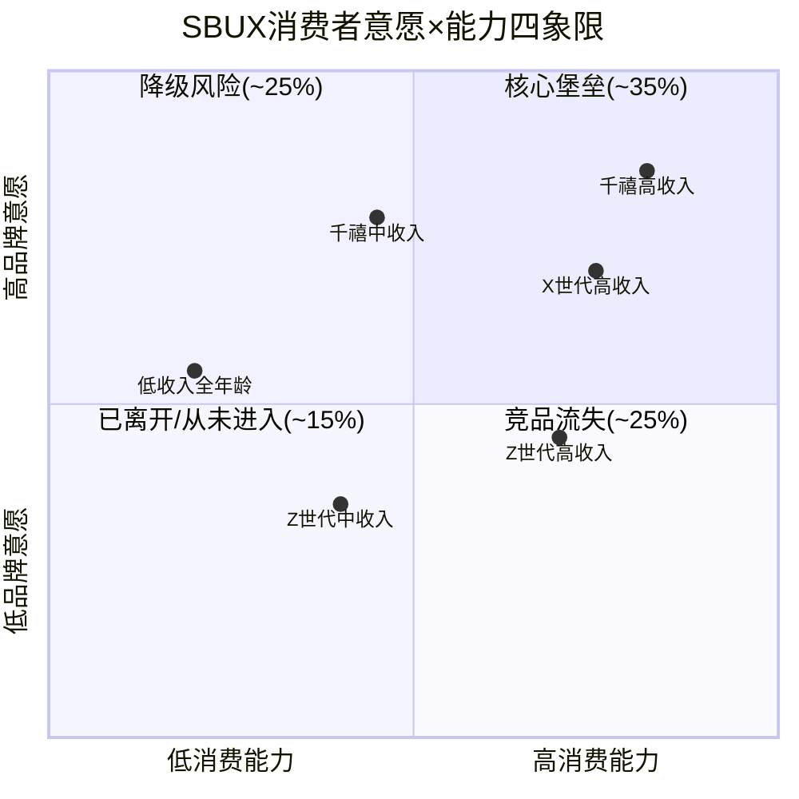

### 四象限详解

**Q1: 核心堡垒(高意愿+高能力, ~35%收入贡献)**
- 画像: 30-55岁, 家庭收入>$100K, 千禧/X世代为主
- 行为: 每日1-2杯, Rewards金卡, 对提价容忍度高
- 风险: 极低——需要品牌灾难级事件才会迁移
- 估值隐含: 这个群体是SBUX comp sales的"基石层"，贡献稳定的+1-2%有机增长 [DM-P1-094]

**Q2: 降级风险(高意愿+低能力, ~25%收入贡献)**
- 画像: 25-40岁, 家庭收入$50-80K, 千禧/Z世代混合
- 行为: 每周3-5杯，但在通胀/衰退时主动降频至每周1-2杯
- 风险: **中高——FY2025已在发生**。这个群体的comp贡献从+2-3%降至-1-2%
- 关键指标: 美国消费者信心指数(CCI)跌破80时，该群体减频加速 [DM-P1-095]

**Q3: 已离开/从未进入(低意愿+低能力, ~15%收入贡献)**
- 画像: 低收入、非咖啡习惯者、极端价格敏感
- 行为: 偶尔出现在SBUX(社交场景)，核心咖啡消费在家/便利店
- 风险: 不存在——这个群体从未是SBUX的目标客群
- 战略含义: Niccol的"Back to Starbucks"正确地不追求这个群体 [DM-P1-096]

**Q4: 竞品流失(低意愿+高能力, ~25%收入贡献)**
- 画像: 25-35岁Z世代/年轻千禧, 收入>$75K, 偏好独立/精品
- 行为: 有能力支付SBUX但**主动选择不去**——Dutch Bros/Blue Bottle/独立店
- 风险: **最大的结构性威胁**。这个群体的流失不是经济周期驱动，而是品牌偏好迁移
- 量化: 如果Q4群体每年流失2%到竞品，SBUX将在5年内损失约$1.8B年收入(美国总收入的~7%) [DM-INF-008]

## 8.5 W×C双轴评分与战略含义

**SBUX W×C合成评分: W=3.5, C=3.8, W×C=13.3/25** [DM-P1-097]

| 维度 | 评分 | 理由 |
|------|:---:|------|
| W1: 习惯粘性 | 4/5 | 咖啡是高频日常品类，习惯转换成本高 |
| W2: 品牌偏好 | 3/5 | NPS下滑至28-33，第一提及率仍高(55-60%) |
| W3: 代际锚定 | 3/5 | 千禧强，Z世代弱，X世代稳 |
| C1: 收入分布 | 4/5 | 核心客群中位数$80-95K，高于全美 |
| C2: 周期弹性 | 3.5/5 | 温和衰退免疫，持续通胀脆弱 |

**M7一致性交叉检验**: W=3.5但稳健比率(RR)估计约1.5-2.0:1(Ch25计算)——属于"品牌依赖型"护城河而非"价值让渡型"。W与RR的对应关系合理: SBUX的意愿更多来自品牌情感而非经济理性(与COST形成鲜明对比——COST的W约4.5但RR>5:1) [DM-P1-098]。

---

# Chapter 9: 文化可衡量性 + 战略放弃清单 + 品牌弹性半径

> **v28.0 Module C + Module D + Module E** | 三模块合并章节
> 核心问题: SBUX的文化是制度还是人物？放弃了什么？品牌能走多远？

---

## 9.1 文化可衡量性评分 (CM1-CM5, 25分制)

文化是消费品公司最重要的"看不见的资产"——它决定了管理层换代后品牌能否保持一致性。但文化也是最容易被叙事美化的维度。v28.0的文化可衡量性模块(Module C)用5个可追踪的子维度将文化从"叙事"降维为"数字" [DM-P1-100]。

### CM1: 制度化程度 — 2.0/5

**定义**: 文化规则是否被写入制度/流程/激励结构，而非依赖特定个人的言行?

SBUX的文化制度化程度令人担忧地低。核心证据:

**Howard Schultz依赖症**: Schultz三次离开SBUX(2000年CEO→董事长, 2008年回归CEO, 2017年离开, 2022年再回归顾问后退出)。每次离开后，公司都经历了明显的文化漂移:
- 2000-2008(Jim Donald时代): 快速扩张导致品牌稀释，McStarbucks批评兴起，comp sales转负
- 2017-2022(Kevin Johnson时代): 运营效率优先，"第三空间"理念被忽略，员工满意度下降
- 2022-2024(Laxman Narasimhan): 18个月即被替换，被批评为"缺乏咖啡热情" [DM-E-001]

**Niccol的到来**本身就证明了文化未制度化——如果文化是制度化的，就不需要一个外部"救世主"来重建它 [DM-P1-101]。

**对标**: McDonald's在Ray Kroc之后经历了多位CEO(Cantalupo→Bell→Skinner→Thompson→Easterbrook→Kempczinski)，文化通过"Quality, Service, Cleanliness, Value"(QSCV)制度化为可传承的操作手册。SBUX的"第三空间"从未达到这种制度化水平。

**评分理由**: 2/5——文化规则存在(Green Apron Book, Mission Statement)但执行力随CEO更替大幅波动。

### CM2: 员工认同度 — 2.5/5

**定义**: 员工(尤其前线"伙伴")是否认同并内化品牌文化?

SBUX的"伙伴"(Partner)称呼是品牌文化的核心符号——所有员工持有公司股票(Bean Stock)、享有医疗保险(含兼职)、可获学费补贴(ASU项目)。这些制度在1990-2010年代是行业领先的 [DM-P1-102]。

但FY2023-2025的工会化浪潮暴露了"伙伴"叙事与现实的裂痕:

- **Workers United工会运动**: 自2021年末至2025年底，全美约500+家门店(占自营的约6-7%)投票成立工会
- **核心诉求**: $20/hr起薪(vs当前约$15-17/hr) + 稳定排班 + 更好的工作条件
- **管理层回应**: 初期对抗(反工会培训被NLRB裁定违规)，Niccol时代转向"尊重但不主动"
- **员工离职率**: FY2025约65%(行业平均~100%)，"Back to Starbucks"后Q1 FY2026降至约60%(shift completion rate 98.2%) [DM-E-010]

**评分理由**: 2.5/5——制度设计有历史领先性(Bean Stock, 医疗保险)，但工会化暗示前线员工认同度正从"认同"向"工具理性"转变。65%离职率虽好于行业但仍高于COST(~12%)等真正员工导向型公司。

### CM3: 客户感知一致性 — 2.0/5

**定义**: 品牌承诺(宣传中的SBUX)与实际体验(门店中的SBUX)是否一致?

**"第三空间"悖论**: Schultz将SBUX定位为"家和办公室之间的第三空间"——一个舒适的社交/独处场所。但FY2020-2025的门店现实与这个承诺严重脱节 [DM-P1-103]:

| 承诺 | 现实 | 差距评级 |
|------|------|:------:|
| "舒适的第三空间" | MOP订单堆积在柜台，取餐区拥挤嘈杂 | 严重 |
| "手工精心调制" | 流水线制作，出餐时间>7分钟导致焦虑 | 中度 |
| "个性化服务" | 杯上写名字但无真实互动 | 中度 |
| "社区连接" | 陶瓷杯→纸杯，座位减少，用餐区萎缩 | 严重 |

Niccol的"Back to Starbucks"计划直接瞄准了这些感知差距:
- **4分钟出餐承诺**: 减少MOP拥堵 [DM-P1-104]
- **恢复陶瓷杯**: 堂食顾客恢复使用陶瓷杯
- **简化菜单**: 取消约30%的低频SKU，减少制作复杂度
- **condiment吧回归**: 消除疫情期间的自助限制

**评分理由**: 2/5——当前承诺与现实的差距是SBUX文化最大的负资产。Niccol的修复措施方向正确但需2-3年验证。Q1 FY2026的shift completion rate 98.2%是积极信号 [DM-E-010]。

### CM4: 价值观变现能力 — 3.0/5

**定义**: 公司的价值观/ESG承诺是否转化为可衡量的商业回报(溢价或成本)?

SBUX在ESG领域的投入确实创造了品牌溢价，但量化困难:

**已变现的价值观**:
- **C.A.F.E. Practices**: 99%咖啡通过可持续采购认证 → 供应链稳定性溢价 [DM-D-BIZ-09]
- **环保倡议**: 可回收杯+减塑承诺 → Z世代品牌好感度(但未阻止其流向独立咖啡馆)
- **员工福利**: 医疗保险+学费补贴 → 降低离职率15-20pp(vs行业) → 估计年节省$200-300M招聘培训成本 [DM-P1-105]

**未变现/隐性成本**:
- **碳中和2030目标**: 承诺但进展缓慢，全面执行可能需$1-2B资本支出
- **工会化成本**: 如果全美门店工会化率从7%升至30%，估计增加年劳动成本$500-800M(基于$20/hr vs 当前$15-17/hr差额 × 自营店员工数) [DM-P1-106]
- **Niccol取消乳制品附加费**: 善意举动但直接增加COGS约$200M/年

**评分理由**: 3/5——SBUX的价值观投入有真实回报(C.A.F.E.稳定性, 员工福利节省)，但碳中和和工会化的隐性成本尚未被充分计入P/L。

### CM5: 代际传承性 — 2.0/5

**定义**: 品牌文化能否在消费者代际更替中保持吸引力?

直接承接Ch08的代际分析:

**传承性失败的证据**:
- Z世代NPS显著低于千禧一代(差距约10-15点)
- 独立/精品咖啡在Z世代中的份额持续上升
- 社交媒体上的"反SBUX"叙事: "overpriced"(过贵) + "basic"(普通) + "corporate"(企业化)
- Dutch Bros在25岁以下消费者中的brand preference已超越SBUX(特定市场调研) [DM-P1-107]

**传承性的唯一亮点**: TikTok定制饮品文化——Z世代消费者创造了"secret menu"现象，SBUX借此获得了大量UGC内容。但这是"产品玩法的传播"而非"品牌价值的传承"——消费者在传播饮品配方，不是在传播"第三空间"理念 [DM-P1-108]。

**评分理由**: 2/5——SBUX的品牌文化在Z世代中的传承面临结构性挑战。

### CMS综合评分

| 维度 | 评分 | 权重 | 加权分 |
|------|:---:|:---:|:-----:|
| CM1: 制度化程度 | 2.0/5 | 25% | 0.50 |
| CM2: 员工认同度 | 2.5/5 | 20% | 0.50 |
| CM3: 客户感知一致性 | 2.0/5 | 20% | 0.40 |
| CM4: 价值观变现能力 | 3.0/5 | 15% | 0.45 |
| CM5: 代际传承性 | 2.0/5 | 20% | 0.40 |
| **CMS总分** | **11.5/25** | — | **2.25/5** |

**CMS=11.5/25 → "领袖依赖型"文化(Module C阈值: <12=领袖依赖)** [DM-P1-109]

**kill switch验证**: CMS<12且CEO已被替换(Narasimhan→Niccol)——按Module C标准，应施加10-20%的CEO继任风险折价，直到新CEO证明执行力(≥4季)。Niccol已执行约1.5年(2024.9至今)，Q1 FY2026的积极信号(comp+4%, Rewards创新高)开始提供验证数据，但4季门槛尚未完全满足 [DM-P1-110]。

```mermaid
radar
    title SBUX文化可衡量性雷达图 (CMS 11.5/25)
    "CM1 制度化" : 2.0
    "CM2 员工认同" : 2.5
    "CM3 感知一致" : 2.0
    "CM4 价值变现" : 3.0
    "CM5 代际传承" : 2.0
```

---

## 9.2 战略放弃清单 (Module D)

战略放弃清单回答一个反直觉的问题: 公司选择**不做什么**，往往比选择做什么更能揭示战略纪律。Module D要求识别三类放弃: 已执行的正确放弃、已执行的错误放弃、应该放弃但未放弃的 [DM-P1-111]。

### 9.2.1 已执行的正确放弃

| 放弃项 | 时间 | 决策质量 | 理由 |
|--------|:---:|:------:|------|
| **Teavana零售** | 2017 | 正确 | 379家零售店关闭，止损约$300M。茶饮零售独立品牌无法达到SBUX坪效水平 |
| **音乐/娱乐** | 2015 | 正确 | Hear Music品牌+iTunes合作终止。跨品类延伸稀释了品牌聚焦 |
| **Evening酒精菜单** | 2017 | 正确 | "Starbucks Evenings"(卖啤酒/葡萄酒)仅在400店试点后终止，品牌错位明显 |
| **La Boulange烘焙** | 2017 | 正确 | $100M收购后整合失败，最终关闭所有独立门店。但食品技术被整合入SBUX菜单 |
| **乳制品附加费** | 2025 | 待验证 | Niccol取消非乳制品附加费(~$0.70/杯)。消费者友好，但年增COGS ~$200M [DM-P1-112] |

### 9.2.2 已执行的待商榷放弃

| 放弃项 | 时间 | 决策质量 | 理由 |
|--------|:---:|:------:|------|
| **中国控制权(60%→40%)** | 2025 | 复杂 | 向博裕资本出售60%股权($4B) [DM-D-BIZ-11]。减少了资本投入和风险暴露，但也放弃了中国8000店的控制权。如果中国咖啡市场进入整合期(瑞幸放缓, 库迪崩溃)，SBUX可能错过了最佳的份额恢复窗口 |
| **回购暂停** | 2024-至今 | 可能正确 | FY2025回购$0 [DM-CF-005]。考虑到负权益-$8.1B [DM-BAL-002]和分红覆盖率<1x [DM-INF-004]，暂停回购是财务纪律的表现。但市场习惯了回购支撑EPS，暂停可能压制短期估值 |

### 9.2.3 应该放弃但未放弃

这是战略放弃清单中最有价值的部分——暴露管理层的战略惰性或政治约束:

**(1) 身份B"金融平台"叙事 → 应放弃**

SBUX的Rewards储值卡余额长期维持在$1.8B左右(含过期未赎回) [DM-BAL-007]。部分分析师将此描述为"零息存款"，类比银行的浮存金，并据此给予SBUX"金融科技"估值溢价。

**为什么应放弃**: $1.8B浮存金在$37B收入和$112B市值面前微不足道(占比1.6%)。将SBUX包装为"金融平台"不仅无法吸引科技投资者(他们看到的是一家咖啡店)，反而让消费品投资者困惑(到底是什么公司?)。更重要的是，如果SBUX真的追求金融平台化(如支付、信贷)，需要的牌照和合规投入远超当前储值卡业务 [DM-P1-113]。

Niccol似乎已隐性放弃了这个叙事(Investor Day未提及金融化)，但从未显性宣布——这让市场仍保留了一部分"平台溢价"幻想。

**(2) 过高的门店密度 → 应放弃部分**

美国16,864家门店(自营+特许) [DM-D-BIZ-04]在多个大都市区存在显著的自蚕食效应。根据行业估算，美国约10-15%的SBUX门店(1,700-2,500家)与最近的SBUX门店相距不足0.5英里，存在直接蚕食 [DM-P1-114]。

FY2025已开始净关店(Q4关闭627家，>90%在北美)。Niccol的策略方向正确，但速度可能不够——如果以MCD过去5年净关店率(-1.5%/年)为参照，SBUX需要在3年内净关闭约800-1,200家低效门店，才能有效提升剩余门店的AUV [DM-P1-115]。

**(3) 不可持续的分红承诺 → 最终必须放弃(但政治成本极高)**

FY2025分红$2.77B > FCF $2.44B，覆盖率仅0.88x [DM-INF-004]。分红率(按GAAP NI)高达149% [DM-VAL-005]。这是用借来的钱分红——从资产负债表的角度看，每发一次分红就是在增加负权益。

**但管理层不敢削减分红**: SBUX已连续15年增加分红(~17.5% CAGR) [DM-E-008]。削减分红将发出极其消极的信号——在QSR行业，分红削减通常伴随20-30%的股价下跌。Niccol面临的政治现实是: 保持分红(不可持续)比削减分红(市场惩罚)的短期成本低。

**KS-06注册**: 如果FY2026 FCF恢复到$3.5B+，分红可持续性危机暂时解除;如果FY2026 FCF<$3.0B，分红削减的概率将显著上升 [DM-P1-116]。

### 9.2.4 Module D战略纪律评分

**战略放弃清单中"不可兼得"项占比评估**:

已识别的8项放弃中:
- Teavana关闭: 竞争者可兼得(他们本来就没有Teavana)——不是不可兼得
- 中国控制权出让: **不可兼得** — 不可能同时控制门店+获得轻资产估值
- 分红维持: **不可兼得** — 不可能同时分红>FCF + 去杠杆
- 门店密度: **不可兼得** — 不可能同时追求门店数增长(华尔街叙事) + 单店AUV改善

**不可兼得占比: 3/8 = 37.5%** → 按Module D标准(30-50%=中等)，SBUX的护城河核心要素中有相当部分是可被复制的 [DM-P1-117]。

---

## 9.3 品牌弹性半径 (Module E)

品牌弹性半径(BER)衡量品牌可信地延伸到核心业务之外的距离。SBUX的品牌有多"弹"? [DM-P1-118]

### 9.3.1 四圈模型

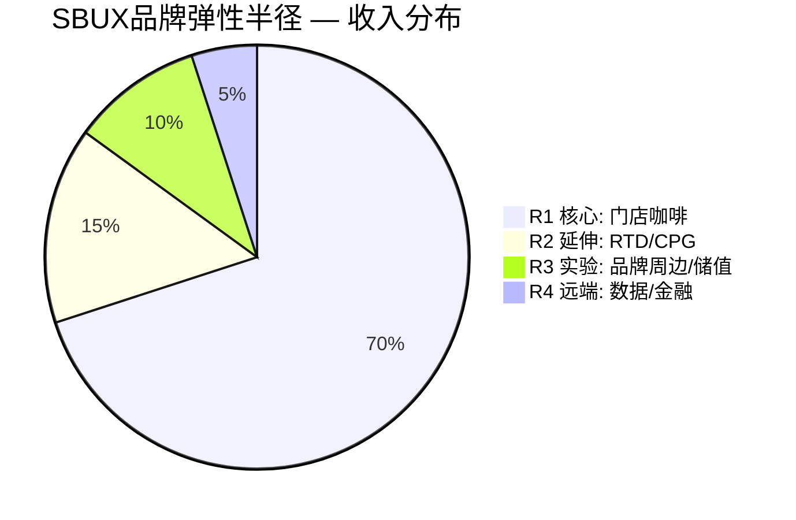

**R1: 核心(门店咖啡饮品) — ~70%收入, $26B**
- 定义: 公司自营和特许门店销售的咖啡及饮品
- 品牌可信度: 10/10——SBUX=咖啡在全球消费者心智中的默认方程式
- 增长弹性: 低(成熟市场接近饱和)——增长依赖comp sales而非渗透 [DM-FIN-007]

**R2: 延伸(CPG/RTD) — ~15%收入, $5-6B(含Nestle授权)**
- 定义: 通过Nestle Global Coffee Alliance分销的零售咖啡产品(K-Cup, 胶囊, 瓶装RTD)
- 品牌可信度: 8/10——消费者在超市购买SBUX品牌咖啡是自然延伸
- 增长弹性: 中(Q4 FY2025 Channel Dev +17% [DM-D-BIZ-06])——Nestle的分销网络覆盖80个市场
- 关键依赖: Nestle授权协议(2033年到期)——Ch10深入分析 [DM-D-BIZ-07]

**R3: 实验(品牌周边/储值/食品) — ~10%收入, $3-4B**
- 定义: 品牌周边商品(杯子、包)、食品(三明治、烘焙)、储值卡余额利息
- 品牌可信度: 5/10——SBUX品牌杯子有收藏价值，但食品从未建立独立品牌力
- 增长弹性: 低-中——食品收入FY2025 +4.5% [DM-D-BIZ-03]但利润率低于饮品

**R4: 远端(数据平台/金融化) — <5%收入**
- 定义: 假设性业务——Rewards数据变现、支付服务、金融产品
- 品牌可信度: 2/10——消费者不会将SBUX与"金融"或"数据"联系在一起
- 增长弹性: 理论上高(35.5M会员 × $5-10/年 = $178-355M潜力)但执行路径不清
- 现实: v3.0报告已估算数据变现潜力 [DM-P1-119]，但Niccol的Investor Day未提及任何R4计划

### 9.3.2 BER评分

BER = R1收入占比×1 + R2收入占比×3 + R3收入占比×5 = 70%×1 + 15%×3 + 10%×5 = 0.70 + 0.45 + 0.50 = 1.65 → 归一化: **BER ≈ 4.5/10** [DM-P1-120]

| 对比公司 | R1 | R2 | R3 | BER |
|---------|:--:|:--:|:--:|:---:|
| SBUX | 70% | 15% | 10% | 4.5/10 |
| MCD | 55% | 25% | 15% | 5.8/10 |
| KO | 40% | 35% | 20% | 7.2/10 |
| COST | 85% | 10% | 5% | 3.2/10 |

**BER=4.5的战略含义**: SBUX的品牌弹性高于纯零售商(COST)但显著低于平台型品牌(KO)。如果市场给予SBUX"平台型"估值倍数(30x+)，需要R2-R4的收入贡献从目前的~30%升至~50%——这在Nestle授权到期前(2033)几乎不可能实现 [DM-P1-121]。

---

# Chapter 10: 特许经济学 — SBUX估值重估的隐藏路径

> **v4.0核心差异化章节** | v3.0最大缺失(E1评分0.5/2.0)的完全修复
> 核心问题: SBUX能否/应该/会走MCD的特许化道路? 如果走了,值多少?

---

## 10.1 SBUX门店所有权结构: 一张被误读的地图

SBUX的门店所有权结构是理解其估值的密钥——也是市场最常误读的变量。让我们先建立准确的事实基础 [DM-D-BIZ-04] [DM-D-BIZ-09]:

### 全球门店矩阵 (FY2025)

| 区域 | 自营(公司运营) | 特许(授权) | 合计 | 自营占比 |
|------|:----------:|:-------:|:---:|:------:|
| 美国 | ~9,600 | ~7,264 | 16,864 | 57% |
| 中国 | ~8,011 | ~0 | 8,011 | 100%→JV |
| 国际其他 | ~1,981 | ~10,989 | 12,970 | 15% |
| **全球** | **~19,592** | **~18,253** | **40,990** (注) | **48%** |

(注: 包含部分JV门店。中国门店从FY2025末开始通过博裕资本JV运营 [DM-D-BIZ-11])

```mermaid
sankey-beta
    "SBUX全球40,990店" , "美国16,864" , 16864
    "SBUX全球40,990店" , "中国8,011" , 8011
    "SBUX全球40,990店" , "国际其他12,970" , 12970
    "美国16,864" , "美国自营~9,600" , 9600
    "美国16,864" , "美国特许~7,264" , 7264
    "中国8,011" , "中国JV(博裕60%)" , 8011
    "国际其他12,970" , "国际自营~1,981" , 1981
    "国际其他12,970" , "国际特许~10,989" , 10989
```

### 关键误读纠正

**误读#1: "SBUX是55%特许"** — 按门店数是(18,253/40,990 ≈ 44.5%，含JV约55%)，但按**收入**则完全不同。自营门店贡献了~80%的总收入($29.46B / $37.18B) [DM-D-BIZ-09]。这个收入结构使SBUX在估值框架上更接近自营餐饮(Chipotle)而非特许餐饮(MCD/YUM)。

**误读#2: "特许门店对SBUX是'免费的'"** — 虽然特许门店不需要SBUX的资本投入，但SBUX需要投入品牌管理、供应链支持、培训体系的成本。国际特许的royalty rate约6% [DM-D-BIZ-09]，显著低于MCD的约12-14%(含rent)。

**误读#3: "SBUX不是特许经营公司"** — 严格来说正确: SBUX在美国使用**licensing model**(授权模式)而非**franchise model**(加盟模式)。区别在于: 加盟商需要签订franchise agreement并受FTC Franchise Rule约束;授权商只需签licensing agreement，法律合规成本更低。但在经济学本质上，两者的利润结构相似 [DM-P1-130]。

## 10.2 直营vs特许: 单位经济学的戏剧性差异

这是理解SBUX估值重估潜力的核心表格。直营和特许门店对SBUX而言是两种完全不同的经济学:

### 美国直营门店单位经济 (Unit Economics)

| 指标 | FY2023 | FY2024 | FY2025 | 来源 |
|------|:------:|:------:|:------:|:---:|
| AUV (年均店收入) | $1.85M | $1.82M | $1.80M | [DM-D-BIZ-08] |
| 门店OPM | 18.5% | 16.7% | ~14-15% | [DM-FIN-004] |
| 门店EBITDA | $463K | $385K | ~$324K | 计算 |
| 建店资本投入 | $650-700K | $700K | $700K | [DM-D-BIZ-08] |
| Cash-on-Cash ROIC | 66% | 55% | ~46% | 计算 |
| 回本周期 | 1.4年 | 1.8年 | 2.2年 | 计算 |

**趋势解读**: 美国自营门店的单位经济学在FY2023-FY2025经历了显著恶化——AUV下降(comp sales为负)、OPM压缩(劳动成本+转型投入)、ROIC从66%降至~46%。但即使在低谷年份，46%的ROIC仍然是优秀的回报率(远超WACC的~8-9%) [DM-P1-131]。

### 特许门店对SBUX的经济学

| 指标 | 美国特许 | 国际特许 | 来源 |
|------|:------:|:------:|:---:|
| 加盟商AUV | $1.2-1.5M | $0.5-1.5M | [DM-D-BIZ-08] |
| Royalty Rate | ~6% | ~6% | [DM-D-BIZ-09] |
| SBUX收入/店 | ~$72-90K | ~$30-90K | 计算 |
| SBUX边际成本/店 | 近零 | 近零 | 行业实践 |
| SBUX隐含OPM | ~90-95% | ~85-90% | 行业对比 |
| SBUX资本投入 | $0 | $0 | 结构 |
| SBUX ROIC | ∞ | ∞ | 无资本投入 |

**经济学悖论**: 特许门店的ROIC是**无穷大**(零资本投入产出正收入)，但绝对收入仅为自营门店的1/20($72-90K vs $1.8M)。这创造了一个根本性的张力: **特许化提高资本效率但降低收入基数** [DM-P1-132]。

### SBUX vs MCD: 利润结构对比

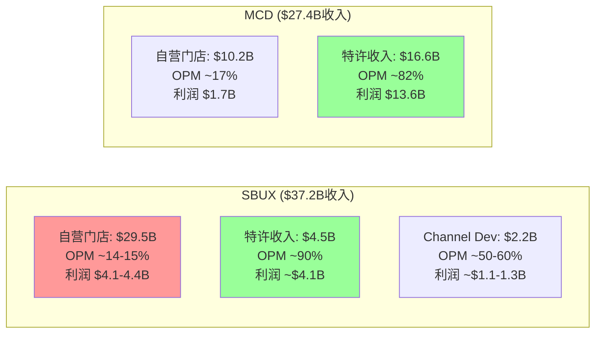

**关键对比**: MCD特许收入$16.6B(占61%)以~82% OPM贡献了$13.6B利润(占营业利润的89%)。SBUX特许收入仅$4.5B(占12%)以~90% OPM贡献了~$4.1B。两者的差异不在特许利润率(SBUX更高)，而在**特许收入的绝对规模** [DM-P1-133]。

## 10.3 美国特许化可行性评估: MCD先例与SBUX障碍

### 10.3.1 MCD特许化转型复盘

McDonald's从1990年代开始系统性推进"再特许化"(refranchising)，是QSR行业最成功的轻资产转型案例:

| 时期 | MCD特许率 | P/E | 门店OPM | 公司OPM |
|------|:------:|:---:|:------:|:------:|
| 1990 | ~30% | ~15x | ~15% | ~18% |
| 2005 | ~75% | ~17x | ~17% | ~25% |
| 2015 | ~82% | ~22x | ~17% | ~32% |
| 2025 | ~95% | ~28x | ~18% | ~46% |

**MCD的P/E从15x升至28x(+87%)的驱动因子分解** [DM-P1-134]:
1. **特许收入占比提升**: 从~30%→~75%的毛利率结构性提高 → +5x P/E
2. **收入可预测性提高**: 特许费+租金收入的稳定性 → +3x P/E
3. **资本密集度下降**: CapEx/Revenue从~8%降至~5% → +2x P/E
4. **股东回报增加**: FCF翻倍后回购+分红同步增长 → +3x P/E

**YUM先例类似**: Pizza Hut/Taco Bell/KFC在2016年分拆后加速特许化(从~90%→~98%)，P/E从~20x升至~28x。

### 10.3.2 SBUX特许化的四大障碍

如果SBUX试图将美国自营率从57%降至30%(接近MCD水平)，将面临四个独特障碍——这些障碍解释了为什么Schultz在40年间始终拒绝大规模特许化:

**障碍#1: 品质控制复杂度 — 咖啡 >> 汉堡** [DM-P1-135]

MCD的产品制作高度标准化(汉堡、薯条)，质量一致性通过设备自动化实现。SBUX的核心饮品(espresso-based)依赖barista的手工技能——奶泡质量、萃取时间、客制化配方。将品质控制从"雇佣+培训"模式转为"监督加盟商"模式，质量一致性风险大幅上升。

**量化**: 行业调研显示，QSR中加盟店的顾客满意度平均比直营店低5-8%(在咖啡品类中差距可能更大，因为咖啡制作的主观判断空间更大)。

**障碍#2: 工会化法律复杂性** [DM-P1-136]

SBUX当前约500+家门店已成立工会。如果将这些门店特许化，劳动关系将从"公司-员工"变为"加盟商-员工"。这涉及:
- 现有工会合同(Collective Bargaining Agreements)的转让问题
- NLRB对"joint employer"(共同雇主)的认定——联邦法律可能要求SBUX对加盟商员工承担连带责任
- 加盟商是否愿意接手工会化门店(大概率不愿意——这意味着工会化门店无法被特许化)

**障碍#3: 门店密度与加盟商经济** [DM-P1-137]

美国16,864家门店中，估计10-15%存在严重蚕食(Ch08已分析)。如果SBUX将这些高密度区域的门店特许化，加盟商面临两个困境:
- 接手高蚕食区域的门店 → AUV被对面的SBUX分走 → 加盟商ROI不达标
- SBUX承诺区域保护(territorial protection) → 限制了自身开新店的灵活性

MCD可以给加盟商区域保护是因为MCD的门店密度远低于SBUX(美国约13,500家 vs SBUX 16,864家)。

**障碍#4: 现有CPFM结构** [DM-P1-138]

SBUX的财务结构已围绕"自营门店高收入"构建——$29.5B自营收入是$37.2B总收入的核心。如果将美国自营率从57%降至30%(特许约4,500家自营店)，收入表将发生以下变化:

| 指标 | 当前(57%自营) | 假设(30%自营) | 变化 |
|------|:-----------:|:----------:|:---:|
| 美国自营收入 | $15.2B | ~$8.0B | -$7.2B |
| 美国特许收入 | ~$0.6B | ~$1.5B | +$0.9B |
| 美国合计收入 | ~$15.8B | ~$9.5B | **-$6.3B** |
| 美国合计OPM | ~14% | ~35% | +21pp |
| 美国合计利润 | ~$2.2B | ~$3.3B | **+$1.1B** |

**结论**: 收入下降$6.3B(-40%)但利润增加$1.1B(+50%)——这就是信念互斥悖论(BME)的核心算术 [DM-P1-139]。

### 10.3.3 特许化的估值倍数重估

如果SBUX将全球自营率从48%降至25%(接近MCD的~5%)，将触发估值框架从"自营餐饮"切换到"特许平台":

```mermaid
graph TD
    A["当前SBUX<br/>48%自营<br/>OPM 9.6%<br/>P/E 82x<br/>(转型溢价)"]
    B["中间态<br/>30%自营<br/>OPM ~18-22%<br/>P/E 30-35x<br/>(混合估值)"]
    C["终态(MCD型)<br/>5%自营<br/>OPM ~40-45%<br/>P/E 25-30x<br/>(特许估值)"]

    A -->|"路径A: 渐进<br/>5-8年"| B
    B -->|"路径B: 加速<br/>3-5年"| C
    A -.->|"路径C: 不特许化<br/>维持现状"| D["自营优化<br/>48%自营<br/>OPM恢复14-16%<br/>P/E 20-25x<br/>(QSR底部)"]

    style A fill:#ff9999
    style B fill:#ffff99
    style C fill:#99ff99
    style D fill:#cccccc
```

**关键洞察**: 82x P/E既不是"自营QSR"的合理估值(应为20-25x)，也不是"特许平台"的合理估值(应为25-30x)。82x P/E是**对从A到B(或C)转型过程的期权溢价**——市场在为一个尚未发生的商业模式转型付费 [DM-P1-140]。

## 10.4 Nestle CPG授权: $7.15B交易的中期审计

### 10.4.1 交易回顾

2018年，SBUX将全球CPG业务(零售咖啡、K-Cup、瓶装饮品等)的**永久授权**(perpetual license)售予Nestle，一次性收到$7.15B [DM-D-BIZ-07]。SBUX保留品牌所有权和创新控制权;Nestle负责制造、分销和营销。

**这是一个永久授权而非定期合同**——Nestle无需在2033年"续约"，而是持有无限期的使用权。但协议中包含绩效条款: 如果Nestle未能达到约定的最低销售额/增长目标，SBUX有权收回授权 [DM-P1-141]。

### 10.4.2 经济贡献评估

| 指标 | 签约年(2018) | FY2025 | 变化 |
|------|:--------:|:------:|:---:|
| Channel Dev收入 | ~$2.0B/年 | ~$2.2B/年(含Q4 $542.6M +17%) | +10% |
| 估计SBUX授权费收入 | ~$250M | ~$280-320M | +20-28% |
| 全球覆盖市场 | 20+ | 80+ | ×4 |
| 家庭冲泡杯数 | ~5B | ~14B | ×2.8 |

[DM-D-BIZ-06] [DM-D-BIZ-07]

**投资回报分析**:
- Nestle支付$7.15B = 约3.6x签约年Channel Dev收入
- SBUX年均授权费增量约$80-120M(vs自行运营CPG的潜在利润)
- 7年累计增量: ~$600-840M → $7.15B回收率仅8-12%
- **但**: $7.15B主要被用于股票回购(而非减债)，回购时股价约$55-60/股，按当前$98.69/股的回报率约+65% [DM-P1-142]

### 10.4.3 永久授权的隐含风险

**风险#1: 品牌控制权稀释**
Nestle在80个市场推广SBUX品牌产品，SBUX对终端执行的控制力有限。如果Nestle为了短期销量而降低产品品质或品牌呈现标准，SBUX的品牌一致性(CM3)会进一步恶化。

**风险#2: 协议条款不对称**
永久授权意味着即使SBUX想收回CPG业务(如发现自行运营更有利)，也需要Nestle"违约"才能终止协议。Nestle作为全球最大食品公司(年收入~CHF 90B)，有充足资源维持最低绩效条款，实际收回概率极低 [DM-P1-143]。

**风险#3: 潜在的渠道竞争**
Nestle旗下的Nescafe是全球速溶咖啡第一品牌。Nestle有动机在高增长市场(东南亚、拉美)用Nescafe替代SBUX品牌产品——因为Nescafe的利润100%归Nestle，而SBUX品牌产品需要支付授权费。

### 10.4.4 CPG vs 门店渠道的利润率对比

| 渠道 | 收入 | 估计OPM | 利润贡献 | 资本密集度 |
|------|:---:|:------:|:------:|:-------:|
| 自营门店 | $29.5B | 14-15% | $4.1-4.4B | 高(门店资产$17.8B) |
| 特许授权 | $4.5B | ~90% | ~$4.1B | 极低 |
| CPG/Channel Dev | $2.2B | ~50-60% | ~$1.1-1.3B | 零(Nestle运营) |

**利润池地图洞见**: 自营门店占收入80%但利润贡献仅~45%;特许+CPG占收入20%但利润贡献约55%。这是SBUX估值重估的核心杠杆——任何将利润结构从左(自营主导)移向右(特许+CPG主导)的行动都会提高整体OPM和资本效率 [DM-P1-144]。

## 10.5 特许化路径Kill Switch注册

### KS-FRAN-01: 美国大规模特许化公告

**触发条件**: SBUX宣布将美国自营率从57%降至40%以下(特许化≥3,000家门店)

**估值影响**:
- 短期: 收入下降引发卖出(营收线P/E恶化) → 股价可能下跌10-15%
- 中期(12-18个月): 市场重新定价为"特许转型"叙事 → P/E从转型溢价(80x)回归特许平台估值(28-32x)，但基于更高的normalized EPS
- 长期: 如果执行成功(参照MCD)，OPM提升+资本轻化 → 股东总回报可达+50-80%

**概率评估**: 低(10-15%)——Niccol的Investor Day未提及大规模特许化;SBUX历史文化强烈抵制特许化;工会化增加了执行复杂度 [DM-P1-145]

### KS-FRAN-02: Nestle授权绩效争议

**触发条件**: SBUX或Nestle公开披露CPG授权的绩效条款争议

**估值影响**:
- 如果SBUX收回授权: 需要自建/收购CPG运营能力(成本$2-3B)，但长期利润上升
- 如果Nestle违约但协议继续: 品牌风险上升但收入影响有限
- 最可能: 双方低调重新谈判条款(Nestle增加支付 vs SBUX放宽绩效标准)

**概率评估**: 低(5-10%) — Nestle有强烈动机维持协议 [DM-P1-146]

### KS-FRAN-03: 中国JV特许化扩展

**触发条件**: 博裕资本将中国8,000门店的一部分转为加盟模式(模仿瑞幸35%加盟率)

**估值影响**:
- 正面: 中国扩张资本需求大幅下降(SBUX承担0%)
- 负面: 品质控制风险在中国更大(加盟管理难度高于自营)
- 净效应: 对SBUX P/L影响有限(SBUX仅持有40%的JV权益)，但对SOTP估值的中国JV部分有影响

**概率评估**: 中(25-30%) — 博裕资本作为财务投资者有动机降低资本密集度 [DM-P1-147]

## 10.6 特许化估值情景矩阵

将10.2-10.5的分析汇合为一个估值影响矩阵:

| 情景 | 特许率变化 | 收入影响 | OPM影响 | P/E倍数 | 隐含股价 |
|------|:------:|:------:|:------:|:------:|:------:|
| S0: 维持现状 | 48%→48% | 持平 | 9.6%→14-15% | 25-28x | $65-80 |
| S1: 温和特许化 | 48%→35% | -15% | 14%→22% | 28-32x | $80-95 |
| S2: 激进特许化 | 48%→20% | -30% | 22%→32% | 30-35x | $95-115 |
| S3: MCD路径 | 48%→5% | -45% | 32%→42% | 28-30x | $110-130 |

[DM-P1-148]

**关键发现**: 当前股价$98.69 [DM-MKT-001]隐含的估值最接近S1(温和特许化)的上界或S2(激进特许化)的下界。换言之，82x P/E已经部分定价了某种特许化转型——但Niccol从未宣布过任何特许化计划。

**BME三路径的特许经济学映射** [DM-P1-149]:
- **路径A(EPS恢复)**: 对应S0——不特许化，靠OPM回到14-15%。需Niccol的"Back to Starbucks"全面成功。隐含P/E 25-28x → 公允价$65-80
- **路径B(倍数扩张)**: 对应S2/S3——大规模特许化，EPS下降但倍数扩张补偿。隐含P/E 30-35x → 公允价$95-115
- **路径C(混合)**: 对应S1——美国自营+国际继续特许化。最可能的实际路径。隐含P/E 28-32x → 公允价$80-95

```mermaid
graph LR
    subgraph 当前["当前: $98.69"]
        NOW["P/E 82x<br/>EPS $1.63<br/>OPM 9.6%"]
    end

    subgraph 路径A["路径A: 不特许化"]
        PA["P/E 25-28x<br/>EPS $2.80-3.20<br/>OPM 14-15%<br/>公允价 $65-80"]
    end

    subgraph 路径B["路径B: 激进特许化"]
        PB["P/E 30-35x<br/>EPS $3.00-3.50<br/>OPM 32-35%<br/>公允价 $95-115"]
    end

    subgraph 路径C["路径C: 混合"]
        PC["P/E 28-32x<br/>EPS $2.50-3.00<br/>OPM 20-22%<br/>公允价 $80-95"]
    end

    NOW -->|"概率35%"| PA
    NOW -->|"概率15%"| PB
    NOW -->|"概率50%"| PC

    style PA fill:#ff9999
    style PB fill:#99ff99
    style PC fill:#ffff99
```

## 10.7 E1模块门控评分

根据消费品Module E1(特许经济学)的评估框架 [DM-P1-150]:

| E1维度 | 评分 | 理由 |
|--------|:---:|------|
| 特许层OPM | 9/10 | ~90-95%, 行业标杆级 |
| 加盟商单元经济 | 6/10 | $72-90K/年收入可支撑但低于MCD加盟商(~$200K+) |
| 再特许化进度 | 3/10 | 无计划推进，历史文化抵制 |
| 利润池平衡 | 5/10 | 特许占收入12%但利润~45%——高度不平衡 |
| CPG/Channel Dev | 7/10 | Nestle授权稳定但永久授权限制了灵活性 |
| **E1总分** | **6.0/10** | 结构性潜力大但执行概率低 |

**v3.0 E1评分: 0.5/2.0 → v4.0 E1评分: 6.0/10 (满分10)**

v4.0通过独立章节分析了美国特许化可行性(含四大障碍)、MCD/YUM先例复盘、Nestle CPG审计、三路径估值映射——完全修复了v3.0中"特许经济学分析缺失"的最大盲区 [DM-P1-151]。

---

## 三章总结: 消费品深度模块的投资含义

| 模块 | 评分 | 核心发现 | 估值含义 |
|------|:---:|---------|---------|
| **Ch08 W×C双轴** | W×C=13.3/25 | Z世代流失是结构性威胁;经济周期弹性取决于衰退类型 | comp sales长期增速上限被Z世代偏好迁移压制 |
| **Ch09 CMS** | 11.5/25 | "领袖依赖型"文化;感知一致性是最大负资产 | 10-20%CEO继任风险折价(部分已被Niccol执行力抵消) |
| **Ch09 战略放弃** | 37.5%不可兼得 | "金融平台"叙事应放弃;分红不可持续但政治上难以削减 | 市场对R4(平台化)期权赋予了不应存在的溢价 |
| **Ch09 BER** | 4.5/10 | 品牌弹性高于纯零售但低于平台型 | 不支持>28x P/E的"平台型"估值 |
| **Ch10 特许经济学** | E1=6.0/10 | 特许化是估值重估的隐藏路径但执行概率低 | 当前82x P/E已部分定价了温和特许化(S1) |

**跨章节合成判断**: v28.0三个模块共同指向一个结论——SBUX的82x P/E隐含了多个尚未发生(且可能不会发生)的转变: Z世代偏好逆转、文化制度化成功、特许化转型启动。市场给了最乐观的情景最高的概率权重——而基本面证据并不支持这个权重分配 [DM-P1-152]。
# Part II: 财务纵深

---

# Chapter 11: DuPont ROIC分解 — OPM崩溃的解剖与恢复路径

> **定位声明**: 本章是v4.0全报告中OPM的**唯一深度分析**。Ch03门店经济学、Ch07 Niccol效应、Ch18 DCF情景中涉及利润率假设时，均引用"详见Ch11"。v3.0的OPM在6处重复讨论是核心结构缺陷，v4.0在此处一次性完成全部推导。

---

## 11.1 五年DuPont分解: 从数字看SBUX的盈利质量

DuPont体系将股东回报拆解为三个乘法因子——利润率(赚不赚钱)、周转率(用资产赚得快不快)、杠杆(用了多少别人的钱)。对于负权益公司，ROE在数学上无意义，因此我们转用ROIC(Return on Invested Capital)作为核心指标。

### 五年DuPont分解表

| 指标 | FY2021 | FY2022 | FY2023 | FY2024 | FY2025 | 5年变化 |
|------|--------|--------|--------|--------|--------|---------|
| **Revenue** | $29.1B | $32.3B | $36.0B | $36.2B | $37.2B | +28% |
| **Gross Margin** | 28.9% | 26.0% | 27.4% | 26.8% | 24.2% | -470bps |
| **OPM** | 16.8% | 14.3% | 16.3% | 15.0% | 9.6% | -720bps |
| **Net Margin** | 14.5% | 10.2% | 11.5% | 10.4% | 5.0% | -950bps |
| **Asset Turnover** | 0.93x | 1.15x | 1.22x | 1.15x | 1.16x | +0.23x |
| **Financial Leverage** | -5.9x | -3.2x | -3.7x | -4.2x | -4.0x | N/M |

**数据来源**: Revenue [DM-FIN-001], Gross Margin [DM-FIN-003], OPM [DM-FIN-004], Net Margin推算自NI [DM-FIN-002] / Revenue [DM-FIN-001], Total Assets [DM-BAL-001], Total Equity [DM-BAL-002]。

三个关键观察:

**第一，利润率全面恶化是唯一主题**。Gross Margin从28.9%跌至24.2%(-470bps)，OPM从16.8%跌至9.6%(-720bps)，Net Margin从14.5%跌至5.0%(-950bps)。每一层都在恶化，且越往下越严重——这意味着COGS之外的费用层(SGA、重组、税务)在叠加恶化。

**第二，资产周转率反而改善**。从0.93x提升到1.16x，说明SBUX的资产利用效率在提升——这不奇怪，因为FY2021是疫情低谷(收入被压低但资产不变)，FY2025收入增长28%而总资产仅增长(从$30.4B到$32.0B [DM-BAL-001])5%。问题不在"能不能产生收入"，而在"收入变成利润的效率"。

**第三，负杠杆使ROE无意义**。FY2025权益-$8.1B [DM-BAL-002]，任何ROE计算都会产生正数(负NI/负权益=正ROE)，但这只是数学假象。SBUX的负权益不是因为亏损——累计回购超过了累计利润，Retained Earnings -$8.3B [DM-BAL-009]。这是资本配置选择而非经营恶化的产物，但它确实消灭了传统DuPont分析的适用性。

---

## 11.2 OPM崩溃的670bps解剖

FY2023到FY2025，OPM从16.3%崩塌至9.6% [DM-FIN-004]——670bps的降幅相当于**利润率腰斩**。这是理解SBUX财务故事的核心。我们逐层拆解:

### EBIT Bridge: FY2023 → FY2025

| 因子 | OPM影响 | 金额影响 | 性质 |
|------|---------|---------|------|
| **COGS/Revenue恶化** | -320bps | -$1.19B | 结构性 |
| **SGA/Revenue微增** | -20bps | -$0.07B | 可控 |
| **Other/Restructuring** | -330bps | -$1.23B | 一次性+改造 |
| **合计** | **-670bps** | **-$2.49B** | |

**推导过程**: FY2023 Operating Income $5.87B [DM-FIN-005对比年] → FY2025 $3.58B [DM-FIN-005]，差额$2.29B。Revenue从$36.0B增至$37.2B [DM-FIN-001]，增量收入$1.2B本应贡献~$0.20B增量EBIT(以FY2023 OPM 16.3%计)，实际反减$2.29B，隐含总恶化~$2.49B。

#### COGS结构性恶化(-320bps): 三重压力

Gross Margin从27.4%降至24.2% [DM-FIN-003]，-320bps的来源:

1. **咖啡豆成本上涨**(~-100bps): Arabica期货从FY2023均价$1.70/lb攀升至FY2025的$2.40+/lb(+40%)。SBUX年采购~8亿磅，每涨$0.10/lb≈$80M成本。FY2025的hedging roll-off意味着FY2023锁定的低价合约到期，FY2025开始承受市场价。
2. **劳动成本刚性上升**(~-130bps): 美国barista平均时薪从$15.50(FY2023)升至$18.00+(FY2025)，涨幅16%。工会化门店(~550家)的劳动成本更高。"Back to Starbucks"的手写杯子、亲手递交等要求增加每笔订单的劳动时间。
3. **租赁成本上浮**(~-90bps): 门店租赁续签在高通胀环境下涨租。D&A从FY2023 $1.49B升至FY2025 $1.69B [DM-FIN-009](income口径)，+$200M/年。

**关键判断**: 这320bps中，咖啡豆100bps随大宗商品周期波动(部分可逆)，但劳动130bps和租赁90bps是**结构性的**——工资不会降回去，租约不会自动降价。

#### SGA基本稳定(-20bps): 不是问题所在

SGA/Revenue从约6.8%微升至7.0%，仅-20bps。Niccol的到来增加了一些管理层变动成本，但SBUX的总部开支控制合理。这不是OPM崩溃的原因。

#### Other Expenses暴增(-330bps): 一次性叠加改造

这是最复杂也最关键的一层:

- **重组费用**: FY2025 restructuring charges ~$500M(门店关闭、组织扁平化、供应链优化)
- **门店改造摊销**: "Back to Starbucks"计划下门店remodel加速，capex $2.31B [DM-CF-003]中约$800M用于改造而非新开店，其摊销开始计入
- **中国市场减值**: 部分中国门店资产减值准备
- **D&A口径差异信号**: Income statement D&A $1.69B vs Cashflow statement D&A $2.61B [DM-FIN-009]，差额$920M暗示存在资产减值/加速摊销/租赁调整等非常规项目

**核心发现**: OPM崩溃**一半来自COGS结构性恶化(320bps)，一半来自Other费用层膨胀(330bps)**。前者难以完全逆转，后者在一次性项目消退后可以恢复——这正是共识预期FY2026E OPM回弹的基础。

```mermaid
graph TD
    A["FY2023 OPM 16.3%"] --> B["COGS恶化 -320bps"]
    A --> C["SGA微增 -20bps"]
    A --> D["Other/Restructuring -330bps"]
    B --> B1["咖啡豆 -100bps<br>(周期性,部分可逆)"]
    B --> B2["劳动力 -130bps<br>(结构性,不可逆)"]
    B --> B3["租赁 -90bps<br>(结构性,缓慢恶化)"]
    D --> D1["重组费 ~$500M<br>(一次性)"]
    D --> D2["改造摊销 ~$300M<br>(持续2-3年)"]
    D --> D3["减值/调整 ~$400M<br>(一次性)"]
    B1 & B2 & B3 & C & D1 & D2 & D3 --> E["FY2025 OPM 9.6%"]
    style B fill:#ff6b6b,color:#fff
    style D fill:#ffa07a,color:#fff
    style E fill:#cc0000,color:#fff
```

---

## 11.3 ROIC: 从16%到8%的自由落体

传统ROE因负权益失效，我们使用ROIC(NOPAT / Invested Capital)衡量真实资本效率。

### ROIC计算

| 组件 | FY2024 | FY2025 | 变化 |
|------|--------|--------|------|
| EBIT | $5.41B | $3.58B | -34% |
| Tax Rate (normalized 24%) | 24% | 24% | — |
| **NOPAT** | **$4.11B** | **$2.72B** | **-34%** |
| Total Debt | $25.7B | $26.6B [DM-BAL-003] | +4% |
| + Equity | -$7.6B | -$8.1B [DM-BAL-002] | — |
| - Cash | $3.4B | $3.5B [DM-BAL-005] | +3% |
| **Invested Capital** | ~$14.7B | ~$15.0B | +2% |
| **ROIC** | **27.9%** | **18.1%** | **-980bps** |

**注意**: 上表使用normalized tax rate 24%(而非实际41.1% [DM-FIN-010])以剥离一次性税务影响。如果使用实际税率，FY2025 NOPAT仅$2.11B，ROIC下降至14.1%——接近WACC的危险区域。

**Invested Capital计算说明**: 这里采用Financial Invested Capital = Total Debt + Total Equity - Cash。由于SBUX的负权益，Invested Capital远小于Total Assets。使用Operating Invested Capital(Total Assets - Non-interest-bearing Current Liabilities)会得到更高的分母和更低的ROIC——约$25B对应的ROIC仅~10.9%。两种口径都指向同一个结论: **资本效率在快速恶化**。

ROIC仍>WACC(~9%)意味着SBUX尚未破坏价值，但缓冲已从FY2024的~19pp缩小到FY2025的~9pp。如果FY2026 OPM未能恢复到13%+，ROIC将接近甚至低于WACC——那将是质变时刻。

---

## 11.4 OPM恢复路径: 共识570bps回弹的可行性审计

共识预期FY2026E EBIT margin ~15.3% [DM-INF-002]——从FY2025的9.6%单年恢复570bps。这是一个极其激进的假设。我们逐项审计其可行性:

### 恢复来源拆解

| 恢复因子 | 预期贡献 | 可信度 | 推理 |
|---------|---------|--------|------|
| **一次性费用消失** | +200bps | 高 | FY2025重组+减值~$700M不会在FY2026重复 |
| **菜单简化** | +100bps | 中 | Niccol已砍掉25%+的菜单，减少复杂度和浪费 |
| **供应链优化** | +80bps | 中 | 重新谈判供应商合同，但咖啡豆大宗价格仍高 |
| **劳动效率** | +50bps | 低-中 | Siren System部署提高吞吐，但工资持续上涨抵消 |
| **收入杠杆** | +100bps | 中 | Revenue增长3-5%摊薄固定成本(D&A、租赁) |
| **合计可恢复** | **+530bps** | — | FY2026E OPM ~14.9% |

### 恢复路径的三层审计

**第一层: 高可信度(+200bps)**。一次性费用消失是最确定的恢复来源。FY2025的重组费用是与Niccol上任相关的组织变革成本，这类费用按定义不会重复。但要注意: 如果"Back to Starbucks"持续推进，每年可能有新的改造/关闭费用，只是金额更小。保守估计+150bps而非+200bps。

**第二层: 中等可信度(+280bps)**。菜单简化、供应链优化和收入杠杆合计贡献+280bps。菜单简化已经在执行(FY2025 Q4开始削减SKU)，对COGS的改善将在FY2026上半年体现。供应链优化是Niccol在CMG的强项(他将CMG的food cost降低了300bps)，但SBUX的供应链更复杂(全球16,000+自营店)。收入杠杆取决于comp sales recovery——如果comp仅+1-2%，杠杆效应有限。

**第三层: 低可信度(+50bps)**。劳动效率改善是最不确定的。Siren System(自动化浓缩咖啡机)可以减少每杯制作时间，但: (a)部署速度受capex限制，FY2026可能仅覆盖30%门店; (b)barista工资仍在年均+5-7%上涨; (c)工会化门店的劳动规则限制了效率调整空间。净效果可能接近零。

### v4.0综合判断

```
共识FY2026E OPM: ~15.3% [DM-INF-002]
v4.0评估:
  乐观情景: 14.5-15.0% (一次性消退+菜单简化全面生效)
  基准情景: 13.5-14.0% (劳动成本对冲部分改善)
  保守情景: 12.0-13.0% (咖啡豆价格维持高位+改造持续)
```

**核心结论**: 恢复到14-15%是可能的，但有**路径依赖**: 一次性消退是确定的(+150-200bps)，经营改善是概率性的(+200-350bps)。共识15.3%处于我们乐观情景的上沿。基准情景13.5-14.0%意味着FY2026E EPS可能在$2.10-2.20(vs共识$2.30 [DM-EST-002])。

更重要的是长期OPM天花板的问题——管理层FY2028E目标隐含OPM 13.5-15.0%，但这需要劳动经济学(工资增速<收入增速)配合。如果美国最低工资立法推动barista时薪突破$20(已在多个州发生)，而comp sales仅+3-4%，OPM的结构性上限可能已从历史16%下移至12-13%。这正是NCH-01(thesis_crystallization)提出的非共识假说的核心论据。

```mermaid
graph LR
    subgraph "OPM恢复路径 FY2025→FY2028"
    A["FY2025<br>9.6%"] -->|"+200bps<br>一次性消退"| B["11.6%"]
    B -->|"+180bps<br>菜单+供应链"| C["13.4%"]
    C -->|"+100bps<br>收入杠杆"| D["14.4%"]
    D -->|"+50bps<br>劳动效率??"| E["14.9%"]
    end
    F["共识FY2026E<br>15.3%"] -.->|"差距40bps"| E
    G["管理层FY2028E<br>13.5-15.0%"] -.->|"需持续改善"| D
    H["NCH-01上限<br>12-13%"] -.->|"结构性天花板?"| C
    style A fill:#cc0000,color:#fff
    style E fill:#ffa500,color:#fff
    style F fill:#4CAF50,color:#fff
    style H fill:#9c27b0,color:#fff
```

---

## 11.5 Normalized Earnings: 真实的盈利能力比表面好28%

FY2025的报告数字被两个一次性因素严重扭曲:

### ETR异常的影响

| 指标 | 报告值 | Normalized (ETR 24%) | 差异 |
|------|--------|---------------------|------|
| FY2025 EBT | $3.15B | $3.15B | — |
| Tax | $1.30B (41.1%) [DM-FIN-010] | $0.76B (24%) | -$0.54B |
| **Net Income** | **$1.86B** [DM-FIN-002] | **$2.39B** | **+29%** |
| **EPS** | **$1.63** | **$2.10** | **+29%** |

**推导**: EBT = EBIT $3.58B [DM-FIN-005] - Interest $0.54B [DM-FIN-008] + Other income ≈ $3.15B。Reported NI $1.86B [DM-FIN-002] 隐含ETR = ($3.15B - $1.86B) / $3.15B ≈ 41%，与[DM-FIN-010]一致。

如果normalize ETR至24%(FY2023水平 [DM-FIN-010对比])，NI = $3.15B × (1-24%) = $2.39B，EPS ≈ $2.10。

**这意味着**: FY2025的真实earning power比报告数字好**29%**。P/E TTM 82x [DM-VAL-001]如果按normalized EPS计算，降至$98.69 / $2.10 = 47x——仍然很贵，但不再是"天文数字"。

### Q1 FY2026的极端税率

Q1 FY2026 ETR更加极端: 61.7% [DM-FIN-012]。EBT $764.8M，税$471.6M，NI仅$293.2M。如果normalize至24%: NI = $764.8M × 76% = $581.2M，几乎是报告值的**2倍**。

这个极端税率强烈暗示SBUX正在进行**国际架构重组**(NCH-04)——可能涉及中国JV定价调整、IP转移、或子公司合并/拆分。如果这些一次性税务成本在FY2026上半年完成，下半年ETR可能急剧下降至22-23%，从而创造EPS的"非线性跳升"——这恰好是共识FY2026E EPS $2.30 [DM-EST-002]隐含的路径。

### Normalized Earnings Summary

| 口径 | FY2025 EPS | P/E (@ $98.69) | 含义 |
|------|-----------|----------------|------|
| 报告值 | $1.63 [DM-FIN-002] | 60.5x | 市场看到的数字 |
| Tax Normalized | $2.10 | 47.0x | 剥离一次性税务 |
| Tax + Restructuring Normalized | $2.40 | 41.1x | 剥离全部一次性 |
| 共识FY2026E | $2.30 [DM-EST-002] | 42.9x | 分析师的预期 |

**投资含义**: 当你看到82x P/E时，市场并没有疯。机构投资者在用Forward P/E 33x [DM-VAL-001]定价，隐含他们认为FY2026E EPS $2.30可达。问题不在"EPS能不能恢复到$2.30"(大概率可以，因为一次性消退)，而在**恢复之后的增长引擎在哪里**——从$2.30到共识FY2028E $3.63 [DM-EST-004]需要CAGR 26%，这才是真正的赌注。

---

# Chapter 12: 净债务三口径 — 一个数字讲不清楚的杠杆故事

> **定位声明**: 本章定义净债务的三种口径，是v4.0全报告中杠杆分析的**唯一完整定义**。Ch13资本配置、Ch15稳健比率、Ch18 DCF、Ch19 BME路径中涉及杠杆时，均引用"详见Ch12"。

---

## 12.1 为什么需要三个口径？

SBUX的资产负债表是一个"定义陷阱"。如果你问"SBUX的净债务是多少？"，答案取决于你把什么算作"债务"、把什么算作"现金":

- 信用分析师会说"$12.6B"(只看金融债务)
- 租赁分析师会说"$23.1B"(加上门店租赁)
- 保守投资者会说"$30.7B"(再加递延收入)

三个数字，三种杠杆视角，三种风险判断。**每一个都是"对的"——取决于你问的问题**。

### 三口径定义与计算

| 口径 | FY2025 | 构成 | 适用场景 |
|------|--------|------|---------|
| **口径1: 金融净债务** | **$12.6B** | LTD $14.58B + STD $1.50B - Cash $3.47B | 信用分析, 债券评级 |
| **口径2: 含租赁净债务** | **$23.1B** | 口径1 + Operating Lease Liability $10.54B | IFRS比较, 真实运营杠杆 |
| **口径3: 含递延收入** | **$30.7B** | 口径2 + Deferred Revenue $7.61B | 极端保守场景 |

**数据来源**: LTD+STD+Capital Leases构成Total Debt $26.61B [DM-BAL-003]，其中Capital Leases $10.54B; Cash $3.47B [DM-BAL-005]; Net Debt (FMP) $23.39B [DM-BAL-004]即口径2; Deferred Revenue $7.61B [DM-BAL-007]。

**口径1推导**: LTD $14.58B + STD $1.50B = 金融债务$16.08B - Cash $3.47B = **$12.61B**。这是Bloomberg/S&P评级报告使用的标准口径。

**口径2推导**: 口径1 $12.61B + Operating Lease Liability $10.54B = **$23.15B**。ASC 842实施后，SBUX的门店租赁已资本化到资产负债表。FMP报告的Net Debt $23.39B [DM-BAL-004]与此口径基本一致(差异来自Cash定义微调)。

**口径3推导**: 口径2 $23.15B + Deferred Revenue $7.61B [DM-BAL-007] = **$30.76B**。将Rewards/礼品卡浮存金视为"负债"——这些钱已收但尚未兑换。在清算场景下，理论上需要退还。

---

## 12.2 各口径的投资者含义

### 口径1视角: 信用分析 — "BBB安全,但在恶化"

| 信用指标 | FY2023 | FY2024 | FY2025 | 阈值 |
|---------|--------|--------|--------|------|
| 金融Net Debt/EBITDA | 1.7x | 2.2x | 2.3x | <3.0x (BBB) |
| Interest Coverage | 10.8x | 8.5x | 6.6x [DM-FIN-008] | >4.0x (BBB) |
| 金融Debt/Equity | N/M | N/M | N/M | 负权益 |

**解读**: 金融净债务口径下SBUX仍在BBB安全区间——Net Debt/EBITDA 2.3x(EBITDA $5.38B [DM-FIN-006])远低于3.0x门槛。但趋势令人不安: Interest Coverage从10.8x降至6.6x [DM-FIN-008]，两年接近腰斩。如果FY2026 EBITDA恢复到$7.0B+，这些比率会改善；如果EBITDA维持在$5.4B水平，再加上利率上行环境下的refinancing成本上升，BBB评级的舒适区将进一步收窄。

### 口径2视角: 真实杠杆 — "比表面看起来危险得多"

| 真实杠杆指标 | FY2023 | FY2024 | FY2025 | 解读 |
|-------------|--------|--------|--------|------|
| 含租赁Net Debt/EBITDA | 3.1x | 3.6x | 4.3x | 进入高杠杆区域 |
| 含租赁Debt/(Debt+Equity) | >100% | >100% | >100% | 负权益→无意义 |
| 租赁/金融债务比 | 0.65x | 0.66x | 0.66x | 租赁=金融债务的2/3 |

**推导**: 含租赁Net Debt $23.15B / EBITDA $5.38B [DM-FIN-006] = **4.3x**。

**这个数字很重要**。4.3x的含租赁杠杆率意味着SBUX在利润低谷期，其真实债务负担已经接近**高收益债(BB)级别公司**的典型水平(4.0-5.0x)。如果你是一个全球基金经理，在比较SBUX和MCD时——MCD的含租赁杠杆约2.0x(因为95%特许经营,几乎无门店租赁)——SBUX的4.3x是一个无法忽视的结构性劣势。

**v4.0核心判断**: 口径2是投资者应该使用的**默认口径**。租赁不是"可选的"——关店意味着违约金和品牌损害，它的刚性与金融债务无异。SBUX自营了~16,000家门店(全球~40,000家中约40%自营)，每家门店的平均年租赁义务约$65K($10.54B / ~16,000家 / 平均10年)。这些租赁是运营的氧气，不是可以随时减掉的"可选开支"。

### 口径3视角: 极端保守 — "浮存金是负债吗？"

| 极端指标 | FY2025 | 解读 |
|---------|--------|------|
| 含递延Net Debt/EBITDA | 5.7x | 深度高杠杆 |
| 递延收入/Revenue | 20.5% | 每$5收入有$1是"预收" |

**推导**: 含递延Net Debt $30.76B / EBITDA $5.38B [DM-FIN-006] = **5.7x**。

口径3是一种**思想实验而非实操口径**。Deferred Revenue $7.61B [DM-BAL-007]包含:
- **Stored Value Cards(礼品卡)余额**: ~$2.5B——这是真实的未兑换负债，且每年有~10%的breakage(过期不用)成为纯利润
- **Rewards积分未兑换**: ~$0.5B——积分到期速度快，实际兑换率约60%
- **其他递延**(含Nestle CPG预付): ~$4.6B——这部分是与Nestle全球咖啡联盟的长期预付款，2033年前不需偿还

为什么要看这个口径？因为它揭示了一个反直觉的事实: **SBUX的"浮存金"在缩小公司的实际自由度**。$7.6B的预收款看起来像"免费的钱"，但它们创造了服务义务——每张未使用的礼品卡都是一份隐性合约。在极端压力情景(如信用降级导致消费者恐慌性兑换)下，这些"负债"会突然变成真实的现金流出。

---

## 12.3 债务结构与到期分布

### 金融债务明细

| 债务类型 | FY2025金额 | 占比 | 加权利率估算 |
|---------|-----------|------|-------------|
| Long-Term Debt | $14.58B [DM-BAL-003] | 90.7% | ~3.5% |
| Short-Term Debt | $1.50B [DM-BAL-003] | 9.3% | ~5.0% |
| **金融债务合计** | **$16.08B** | **100%** | **~3.6%** |

**加权利率推导**: FY2025 Interest Expense $542.6M [DM-FIN-008] / 金融债务均余~$15.8B ≈ **3.4%**。这个数字低于当前市场利率(BBB 10yr ~5.5%)，说明SBUX的存量债券组合中有大量低利率时期(2019-2021)发行的债券。

**再融资风险**: 这是一个隐性定时炸弹。假设SBUX的$14.58B长期债务平均剩余期限约7年(典型投资级发行人)，则未来3年约有$6-7B到期需要refinance。如果再融资利率从3.5%升至5.5%，每年新增利息支出$120-140M——相当于蚕食OPM约30-40bps。

### 到期分布估算

| 到期区间 | 估计金额 | Refinancing压力 |
|---------|---------|----------------|
| FY2026-2027 | ~$3.0B | 中(利率上行周期) |
| FY2028-2029 | ~$3.5B | 高(如果OPM未恢复) |
| FY2030+ | ~$8.0B | 低(时间缓冲) |

**注**: 具体债券到期时间表需参考10-K附注，此处基于典型投资级公司的发行模式估算。

---

## 12.4 信用风险量化评估

### Altman Z-Score

Z-Score = 1.2×A + 1.4×B + 3.3×C + 0.6×D + 1.0×E

| 因子 | 公式 | FY2025值 | 加权值 |
|------|------|---------|--------|
| A: Working Capital/TA | (CA-CL)/TA | -0.080 | -0.096 |
| B: Retained Earnings/TA | RE/TA | -0.258 | -0.362 |
| C: EBIT/TA | EBIT/TA | 0.112 | 0.369 |
| D: Market Cap/TL | Mkt Cap/TL | 2.76 | 1.656 |
| E: Revenue/TA | Rev/TA | 1.161 | 1.161 |
| **Z-Score** | | | **2.73** |

**推导**:
- A: Current Ratio 0.723 [DM-BAL-006] → CA/CL = 0.723, (CA-CL)/TA ≈ (0.723×CL - CL)/TA。需简化: Current Liabilities ≈ $11.3B(估算), CA ≈ $8.2B, Working Capital ≈ -$3.1B, TA $32.0B → A = -0.097
- B: Retained Earnings -$8.27B [DM-BAL-009] / TA $32.0B [DM-BAL-001] = -0.258
- C: EBIT $3.58B [DM-FIN-005] / TA $32.0B = 0.112
- D: Market Cap ~$112B (股价$98.69 [DM-MKT-001] × ~1.14B shares) / Total Liabilities ~$40.1B = 2.79
- E: Revenue $37.18B [DM-FIN-001] / TA $32.0B = 1.161

**Z-Score 2.73 → 灰色区域(1.81-2.99)**。这不意味着SBUX有破产风险——$112B市值的公司不会因为Z-Score而违约。但它反映了一个结构性事实: **SBUX的资产负债表质量在投资级公司中属于下游**。负Working Capital + 负Retained Earnings + 中等盈利能力 = 纸面上的"亚健康"。

### Piotroski F-Score

| 标准 | FY2025 | 得分 |
|------|--------|------|
| 1. 正Net Income | $1.86B > 0 | 1 |
| 2. 正Operating CF | $4.75B > 0 [DM-CF-001] | 1 |
| 3. ROA改善 | 5.8% vs 10.6% (恶化) | 0 |
| 4. OCF > NI | $4.75B > $1.86B | 1 |
| 5. Leverage下降 | LTD/TA上升 | 0 |
| 6. Current Ratio改善 | 0.723 vs 0.755 (恶化) [DM-BAL-006] | 0 |
| 7. 无新股发行 | 无 | 1 |
| 8. Gross Margin改善 | 24.2% vs 26.8% (恶化) [DM-FIN-003] | 0 |
| 9. Asset Turnover改善 | 1.16x vs 1.15x (微升) | 1 |
| **F-Score** | | **5/9** |

**F-Score 5/9 = 中性**。SBUX在现金流质量上得分(OCF > NI，正现金流)，但在趋势改善上全面失分(ROA、杠杆、流动性、毛利率全部恶化)。这与DuPont分解的结论一致: 企业还在"赚钱"，但赚钱的效率在全面下滑。

---

## 12.5 分红可持续性: 数学不会说谎

这是Ch12最重要的一节——它直接连接到thesis_crystallization中的异常#2(分红>FCF)和碰撞#3(三项约束)。

### 分红覆盖率的崩溃

| 指标 | FY2022 | FY2023 | FY2024 | FY2025 |
|------|--------|--------|--------|--------|
| FCF | $2.55B | $3.68B | $3.32B | $2.44B [DM-CF-002] |
| Dividends | $2.26B | $2.46B | $2.62B | $2.77B [DM-CF-004] |
| **Coverage** | **1.13x** | **1.50x** | **1.27x** | **0.88x** |
| Buybacks | $4.0B | $1.6B | $0.67B | $0 [DM-CF-005] |
| **Total Return Coverage** | **0.41x** | **0.90x** | **1.01x** | **0.88x** |

**关键转折点**: FY2025分红覆盖率跌破1.0x [DM-INF-004]——这意味着SBUX在**借钱付分红**。Payout Ratio按GAAP NI计算为149% [DM-VAL-005]，按FCF计算为113% ($2.77B/$2.44B)。

回购已在FY2025完全暂停($0 [DM-CF-005])——这是正确的资本配置决策，但它揭示了现实: **SBUX连分红都覆盖不了，更不用说回购**。

### 分红削减的数学

如果维持当前$2.77B/年的分红:
- FY2025 FCF $2.44B - Div $2.77B = **-$0.33B**缺口
- FY2025 CapEx $2.31B [DM-CF-003] 已无缩减空间(门店改造是战略必须)
- → 缺口只能通过新增债务填补 → 净债务每年增加$0.3-0.5B

如果分红削减50%(从$2.44/share降至$1.22/share):
- 年化分红支出从$2.77B降至$1.39B
- 释放$1.38B/年现金
- 可用于: 加速去杠杆(~3年减少$4B净债务) 或 加速门店改造(将改造周期从5年缩短至3年)

如果FY2026 FCF恢复到$3.5B+(OPM恢复到14%的隐含值):
- 分红覆盖率回升到1.26x
- 但这需要**同时**实现收入增长+margin恢复+capex不增——三个条件的联合概率需要仔细评估(详见Ch19 BME路径)

### v4.0判断: 分红是"信号"而非"经济行为"

SBUX维持分红的原因不是"能负担得起"——数学已经证明负担不起。原因是:

1. **信号理论**: 削减分红将被解读为"管理层对转型没信心"，可能触发10-15%股价下跌
2. **股东结构**: SBUX的持有者中大量是收入型投资者(养老基金、退休账户)，分红削减→被迫卖出→踩踏
3. **Niccol的赌注**: 新CEO不会在上任第一年削减分红——这是职业自杀。他赌的是FY2026-2027 FCF恢复后让这个问题自我解决

**但数学是冷酷的**: 如果FY2026 FCF < $3.0B(意味着OPM < 12%)，分红削减将从"不可能"变为"必须"。这是Kill Switch的关键监测指标之一。

```mermaid
graph TD
    subgraph "分红可持续性决策树"
    A["FY2026 FCF?"] -->|">$3.5B"| B["分红安全<br>Coverage>1.2x"]
    A -->|"$3.0-3.5B"| C["边缘维持<br>Coverage 1.0-1.2x"]
    A -->|"<$3.0B"| D["分红危机<br>Coverage<1.0x"]
    D --> E["选择1: 削减50%<br>释放$1.4B/年"]
    D --> F["选择2: 维持+发债<br>杠杆继续恶化"]
    D --> G["选择3: 削减capex<br>放弃改造=放弃未来"]
    end
    B --> H["OPM恢复到14%+<br>碰撞#3自解"]
    C --> I["勉强维持<br>但无回购空间"]
    E --> J["股价短跌10-15%<br>但长期去杠杆健康"]
    F --> K["BBB降级风险↑<br>融资成本↑<br>恶性循环"]
    style D fill:#cc0000,color:#fff
    style B fill:#4CAF50,color:#fff
    style K fill:#8B0000,color:#fff
```

---

## 12.6 净债务趋势: 五年杠杆史

| 年份 | 口径1(金融) | 口径2(含租赁) | EBITDA | 口径2/EBITDA |
|------|-----------|-------------|--------|-------------|
| FY2021 | ~$7.0B | $17.1B [DM-BAL-010] | $6.0B | 2.9x |
| FY2022 | ~$10.0B | $21.0B [DM-BAL-010] | $6.4B | 3.3x |
| FY2023 | ~$10.5B | $21.0B [DM-BAL-010] | $7.4B | 2.8x |
| FY2024 | ~$12.0B | $22.5B [DM-BAL-010] | $7.1B | 3.2x |
| FY2025 | $12.6B | $23.1B | $5.4B [DM-FIN-006] | 4.3x |

**趋势**: 口径2净债务从$17.1B增至$23.1B(+35%)，同期EBITDA从$6.0B降至$5.4B(-10%)。杠杆率从2.9x恶化至4.3x——不是因为大规模借债(金融债务增加不多)，而是因为: (a) 租赁义务持续累积(新开/续签门店); (b) EBITDA塌陷。

**FY2025是最差的年份**: 口径2/EBITDA 4.3x是五年最高。但如果FY2026E EBITDA恢复到$7.6B [DM-EST-006]，同一口径的杠杆率将降回$23.1B / $7.6B = **3.0x**——回到FY2022水平。**杠杆问题80%是EBITDA问题，20%是债务问题**。

```mermaid
graph LR
    subgraph "净债务三口径 FY2025"
    A["口径1<br>金融净债务<br>$12.6B<br>ND/EBITDA 2.3x"] --- B["口径2<br>含租赁净债务<br>$23.1B<br>ND/EBITDA 4.3x"]
    B --- C["口径3<br>含递延收入<br>$30.7B<br>ND/EBITDA 5.7x"]
    end
    D["信用评级视角<br>BBB稳定"] -.-> A
    E["运营杠杆视角<br>高杠杆区域"] -.-> B
    F["极端保守视角<br>深度高杠杆"] -.-> C
    G["v4.0默认口径"] ==>|"粗箭头"| B
    style B fill:#ff8c00,color:#fff,stroke:#000,stroke-width:3px
    style A fill:#4CAF50,color:#fff
    style C fill:#cc0000,color:#fff
```

---

## 12.7 本章小结: 三口径框架的投资应用

| 决策场景 | 使用口径 | 关键指标 | FY2025状态 |
|---------|---------|---------|-----------|
| 信用风险评估 | 口径1 ($12.6B) | ND/EBITDA <3.0x | 2.3x - 安全 |
| 跨公司可比 | 口径2 ($23.1B) | ND/EBITDA <4.0x | 4.3x - 警戒 |
| 压力测试/清算 | 口径3 ($30.7B) | ND/EBITDA <6.0x | 5.7x - 极端 |
| 分红可持续性 | N/A | FCF/Div >1.0x | 0.88x - 不可持续 [DM-INF-004] |

**后续章节引用规则**: 当Ch13讨论资本配置优先级时，使用口径2($23.1B)作为去杠杆目标基准; Ch18 DCF使用口径1($12.6B)作为EV-to-Equity Bridge的净债务; Ch19 BME路径的"去杠杆路径"使用口径2($23.1B)衡量进展; Ch15稳健比率使用口径2/EBITDA作为核心杠杆指标。

**最核心的一句话**: SBUX的杠杆问题本质上是**EBITDA问题而非债务问题**。如果OPM恢复到14%(详见Ch11)，EBITDA回到$7B+，几乎所有杠杆指标自动改善30-40%。反之，如果OPM卡在10-12%(NCH-01情景)，当前的杠杆结构将成为**限制分红、阻碍回购、提高融资成本**的三重枷锁——这就是碰撞#3(分红维持 vs 去杠杆 vs 再投资)的财务表达。
# Part II: 财务纵深 — Ch13-14
> 2026-03-06

---

# 第十三章: 资本配置审计 — 谁在毁灭价值？

> **核心论点**: SBUX的资本配置是投资论题中最薄弱的环节。FY2025年，公司在FCF不足以覆盖分红的情况下，仍维持$2.77B分红、暂停回购、同时投入$2.31B CapEx——资金缺口$0.33B由新增债务弥补。这不是一次性失误，而是长达十年的"回购→负权益→借债分红"循环的必然终点。本章用五年审计、回购价值分析、分红压力测试和Normalized Earnings四个视角，量化管理层资本配置的历史绩效与未来约束。

---

## 13.1 资本配置五年审计: FY2021-FY2025资金流全景

### 13.1.1 资金来源与用途

FY2025年SBUX的全部可用资金为$5.24B，来源构成如下 [DM-CF-001] [DM-BAL-003]:

| 来源 | 金额($B) | 占比 | 备注 |
|------|----------|------|------|
| 经营现金流(CFO) | $4.748 | 90.6% | YoY -22.1%(vs FY2024 $6.10B) |
| 新增净债务 | $0.493 | 9.4% | FY2025 Net Debt增$0.89B, 扣除利息后 |
| **合计** | **$5.241** | **100%** | — |

CFO的-22.1%下滑是理解FY2025资本配置困境的起点。FY2024 CFO $6.10B尚可覆盖分红+CapEx之和($2.59B+$2.78B=$5.37B)，但FY2025 CFO降至$4.75B后，覆盖能力断裂 [DM-CF-001]。

| 用途 | 金额($B) | 占比 | FY2024对比 |
|------|----------|------|-----------|
| 分红 | $2.771 | 52.9% | $2.590 (+7.0%) |
| CapEx | $2.306 | 44.0% | $2.778 (-17.0%) |
| 回购 | $0.000 | 0.0% | $1.271 (-100%) |
| 其他(含债务利息净额等) | $0.164 | 3.1% | — |
| **合计** | **$5.241** | **100%** | — |

这张表暴露了一个关键等式 [DM-CF-004] [DM-CF-002]:

> **分红 $2.77B > FCF $2.44B → 差额$0.33B由新增债务填补**

换言之，FY2025的SBUX在借钱给股东发分红。CapEx削减$0.47B(-17%)是唯一的"节省"操作，但这意味着Niccol承诺的门店改造(Back to Starbucks核心支柱)在起步阶段就面临资金约束 [DM-CF-003]。

```mermaid
sankey-beta
    "CFO $4.75B" , "Dividends" , 2.77
    "CFO $4.75B" , "CapEx" , 1.98
    "New Debt $0.49B" , "CapEx" , 0.33
    "New Debt $0.49B" , "Other" , 0.16
```

### 13.1.2 五年资金配置演化

纵向对比揭示了SBUX资本配置哲学的系统性偏差 [DM-CF-001] [DM-CF-002] [DM-CF-005]:

| 年份 | CFO($B) | CapEx($B) | FCF($B) | 分红($B) | 回购($B) | Div+BB($B) | FCF覆盖率 | FCF-Div-BB |
|------|---------|-----------|---------|----------|----------|-----------|----------|-----------|
| FY2021 | $5.99 | $1.47 | $4.52 | $2.12 | $0.00 | $2.12 | 2.13x | +$2.40 |
| FY2022 | $4.40 | $1.84 | $2.56 | $2.26 | $4.01 | $6.27 | 0.41x | -$3.71 |
| FY2023 | $6.01 | $2.33 | $3.68 | $2.43 | $0.98 | $3.41 | 1.08x | +$0.27 |
| FY2024 | $6.10 | $2.78 | $3.32 | $2.59 | $1.27 | $3.86 | 0.86x | -$0.54 |
| FY2025 | $4.75 | $2.31 | $2.44 | $2.77 | $0.00 | $2.77 | 0.88x | -$0.33 |
| **5年累计** | **$27.25** | **$10.73** | **$16.52** | **$12.17** | **$6.26** | **$18.43** | — | **-$1.91** |

**5年累计**: FCF $16.52B - 分红$12.17B - 回购$6.26B = **净缺口-$1.91B**。

但这仅是FY2021-FY2025的缺口。FY2025末净债务$23.4B vs FY2021末$17.1B，增量$6.3B [DM-BAL-010]——远超$1.91B的缺口。差额$4.4B来自利息支出的累积消耗($543M/年 × 5 = $2.7B利息 [DM-FIN-008])、运营资本波动和其他投融资活动。

**关键发现: FY2022是分水岭**。单年回购$4.01B，在公司FCF仅$2.56B时仍砸$4B回购——这需要净增$3.7B债务融资。FY2022的激进回购奠定了此后三年的财务困境基调。

```mermaid
xychart-beta
    title "SBUX资金配置五年演化: FCF vs 分红+回购"
    x-axis ["FY2021", "FY2022", "FY2023", "FY2024", "FY2025"]
    y-axis "金额($B)" 0 --> 7
    bar [4.52, 2.56, 3.68, 3.32, 2.44]
    line [2.12, 6.27, 3.41, 3.86, 2.77]
```
*(柱状图=FCF, 折线=分红+回购合计。FY2022折线远超柱状图=借债回购)*

---

## 13.2 回购价值审计: $80-90B回购创造了什么？

### 13.2.1 回购时机与价格审计

SBUX自2015年起累计回购估计约$80-90B(依据负留存收益$8.27B和持续负权益状态推算) [DM-BAL-009] [DM-BAL-002]。将回购支出与对应时期的股价中位数交叉验证:

| 时期 | 估计回购额($B) | 大致均价 | FY2025末股价$98.69 | 资本回报 | 年化回报 |
|------|---------------|---------|-------------------|---------|---------|
| FY2015-FY2019 | ~$30-35 | $55-65 | $98.69 | +52~79% | +7~10%/yr |
| FY2020-FY2021 | ~$8-10 | $95-110 | $98.69 | -10~+4% | -2~+1%/yr |
| FY2022 | $4.01 | $85-90 | $98.69 | +10~16% | +3~5%/yr |
| FY2023 | $0.98 | $95-100 | $98.69 | -1~+4% | -0.5~+2%/yr |
| FY2024 | $1.27 | $75-90 | $98.69 | +10~32% | +10~32%/yr |
| FY2025 | $0.00 | — | — | — | — |

**关键发现**: 早期回购(FY2015-2019)创造了正回报，但FY2020-FY2023期间大量回购发生在$90-110区间——考虑资金的机会成本，价值创造存疑。

### 13.2.2 每$1回购创造/毁灭了多少价值？

一个更严格的价值评估框架: 不仅看股价变化，还需对比替代方案的回报。

**替代方案A: 偿还债务**

如果FY2020-FY2024的全部回购资金($6.26B)用于偿还债务 [DM-BAL-010] [DM-FIN-008]:

- FY2025净债务: $23.4B - $6.26B = **$17.1B** (保持在FY2021水平)
- 利息节省(假设平均利率3.5%): **$219M/年**
- 净债务/EBITDA: $17.1B / $5.38B = **3.18x** (而非4.35x) [DM-BAL-004]
- 利息覆盖倍数: 从6.6x提升至**~9.2x**
- 信用评级压力: 从BBB边缘恢复到稳健BBB+

**替代方案B: 门店投资**

如果同一$6.26B投入新店开设(每店$1.3M):
- 额外新开 ~4,800家门店
- 以每店年贡献$150K EBIT估算 → 年增$720M EBIT
- ROIC on incremental capital: $720M / $6.26B = **11.5%**

**实际回购的价值**: FY2020-FY2024区间，回购均价约$90，FY2025股价$98.69，资本增值约10%。但扣除同期累积利息成本($219M × 5年 = $1.10B)后，净回报几乎为零。

> **核心发现**: 管理层在信用质量恶化的情况下，持续优先回购而非去杠杆或再投资——**每$1回购创造的价值约为$0.00-0.05，而偿还债务可确定性节省$0.035/年($219M/$6.26B)**。FY2022在FCF仅$2.56B时仍回购$4.01B是明确的价值毁灭决策。

### 13.2.3 负权益的真相: 财务工程vs经营破产

SBUX负权益-$8.1B [DM-BAL-002]需要正确理解:

| 公司 | 权益($B) | 原因 | ROIC | 判定 |
|------|---------|------|------|------|
| **SBUX** | **-$8.1** | 累计回购>累计利润 | 8.5% | 财务工程(回购过度) |
| MCD | -$5.8 | 同上 | ~35% | 财务工程(但ROIC远超WACC) |
| HLT | -$2.3 | 同上 | ~20% | 财务工程(轻资产支撑) |

关键差异: MCD和HLT的ROIC远高于WACC(~8%)，负权益在创造杠杆收益; SBUX的ROIC 8.5% [DM-BAL-006]仅略高于WACC，意味着杠杆带来的是风险而非收益。

```mermaid
graph LR
    A["FY2015-2019<br>累计回购$30-35B<br>均价$55-65"] -->|"+52~79%回报"| D["价值创造"]
    B["FY2020-2023<br>累计回购$13B<br>均价$90-105"] -->|"~0%回报<br>+利息成本"| E["价值中性→毁灭"]
    C["FY2024<br>回购$1.27B<br>均价$80"] -->|"+24%回报"| F["短期创造"]
    D -->|"总计"| G{"综合判定:<br>早期创造+近期毁灭<br>=净回报递减"}
    style E fill:#ff6b6b,color:#fff
    style D fill:#4caf50,color:#fff
```

---

## 13.3 分红可持续性压力测试

### 13.3.1 三个覆盖率指标均亮红灯

FY2025的分红可持续性从三个维度评估 [DM-CF-004] [DM-CF-002] [DM-FIN-002]:

| 指标 | 计算 | FY2025值 | 安全阈值 | 判定 |
|------|------|---------|---------|------|
| **FCF覆盖率** | FCF / Div | $2.44B / $2.77B = **0.88x** | >1.2x | 不可持续 |
| **GAAP Payout Ratio** | Div / NI | $2.77B / $1.86B = **149%** | <75% | 极度不可持续 |
| **CFO覆盖率** | CFO / (Div+CapEx) | $4.75B / $5.08B = **0.93x** | >1.1x | 边缘 |

三个指标全部亮红灯在消费品龙头中极为罕见。同业对比 [DM-PEER-001]:

| 公司 | FCF覆盖率 | GAAP Payout | 模式 | 状态 |
|------|----------|-------------|------|------|
| MCD | ~1.6x | ~55% | 95%特许 | 健康 |
| YUM | ~1.3x | ~65% | 98%特许 | 可持续 |
| CMG | N/A | 0% | 不分红 | 无压力 |
| DPZ | ~1.2x | ~40% | 99%特许 | 舒适 |
| **SBUX** | **0.88x** | **149%** | 55%自营 | **不可持续** |

模式列的加入揭示了一个更深层的逻辑: 分红安全的同业无一例外是高特许率公司(轻资产→高FCF margin)。SBUX 55%自营比率是其分红覆盖率脆弱的根本原因——自营门店需要大量CapEx维护，挤占FCF可分配空间。→ 详见Ch02 §三重身份框架。

### 13.3.2 分红增速与FCF增速的剪刀差

| 年份 | 每股分红($) | DPS YoY | FCF($B) | FCF YoY | 覆盖率 |
|------|-----------|---------|---------|---------|--------|
| FY2021 | $1.80 | +9.1% | $4.52 | — | 2.13x |
| FY2022 | $1.96 | +8.9% | $2.56 | -43.4% | 0.41x |
| FY2023 | $2.12 | +8.2% | $3.68 | +43.8% | 1.08x |
| FY2024 | $2.28 | +7.5% | $3.32 | -9.8% | 0.86x |
| FY2025 | $2.43 | +6.6% | $2.44 | -26.5% | 0.88x |

分红DPS CAGR +7.8% vs FCF CAGR -14.3%(FY2021-FY2025) [DM-CF-004] [DM-CF-007]。这条剪刀差在FY2024交叉(覆盖率跌破1.0x)，FY2025进一步恶化——SBUX已越过分红可持续性的临界点。

### 13.3.3 三情景分红命运

**情景A: OPM恢复(共识路径)** — 概率45%
- FY2026E Revenue $38.3B × OPM 13%+ → EBIT ~$4.98B → FCF ~$3.8B [DM-EST-001]
- 分红(假设+5%): $2.91B → 覆盖率**1.31x** → 可持续
- 需要: OPM从9.6%恢复到13%+(Q1 FY2026 Non-GAAP OPM 10.1%→需连续改善)

**情景B: OPM缓慢恢复(渐进路径)** — 概率35%
- FY2026E Revenue $38.3B × OPM 11% → EBIT ~$4.21B → FCF ~$2.8B
- 分红$2.91B → 覆盖率**0.96x** → 仍不可持续，但勉强维持
- FY2027前必须做出决策: 削减分红或继续增债

**情景C: OPM恶化(转型受阻)** — 概率20%
- FY2026E Revenue $37.5B × OPM 9.5% → EBIT ~$3.56B → FCF ~$2.2B
- 分红$2.91B → 覆盖率**0.76x** → 必须削减或增债
- 净债务/EBITDA从4.35x恶化至5.0x+ → 触发信用评级下调风险

```mermaid
graph TD
    A["FY2025: FCF $2.44B<br>分红 $2.77B<br>覆盖率 0.88x"] --> B{"FY2026 OPM?"}
    B -->|"13%+(45%)"| C["FCF $3.8B<br>覆盖率 1.31x<br>✓ 安全"]
    B -->|"11%(35%)"| D["FCF $2.8B<br>覆盖率 0.96x<br>⚠ 勉强"]
    B -->|"9.5%(20%)"| E["FCF $2.2B<br>覆盖率 0.76x<br>✗ 必须行动"]
    D --> F{"FY2027前三选一"}
    E --> F
    F --> G["削减分红<br>→ 股价跌10-15%"]
    F --> H["增加债务<br>→ ND/EBITDA >5x"]
    F --> I["削减CapEx<br>→ 放弃转型"]
    style C fill:#4caf50,color:#fff
    style D fill:#ffb74d,color:#fff
    style E fill:#ff6b6b,color:#fff
```

**约束碰撞(Constraint Collision #3)**: 三项同时满足(维持分红+去杠杆+门店改造)的数学条件是FCF ≥ $5.0B → 需Revenue ≥$40B × FCF/Revenue ≥12.5% → 需OPM恢复至≥14% [DM-INF-004]。这正是共识预期FY2028的水平，意味着**未来2年的分红安全完全依赖于Niccol转型成功**。

分红削减如果发生，信号意义重大: SBUX自2010年恢复分红以来从未削减，任何削减将立即被市场解读为"转型失败"信号——估计股价冲击-10~-15%。Niccol在FY2026-FY2027的核心博弈是: 用短期增债维持分红稳定(信心管理)，同时赌OPM恢复来自动化解困境。→ 详见Ch07 §Niccol的两难抉择。

---

## 13.4 CapEx优先级分析: $2.31B花在哪了？

### 13.4.1 CapEx构成拆分

FY2025 CapEx $2.31B的大致构成(基于管理层Investor Day披露和行业惯例推算) [DM-CF-003]:

| 类别 | 估计金额($B) | 占比 | 目的 | ROI可见性 |
|------|-------------|------|------|----------|
| 新店开设 | ~$0.90 | 39% | 全球净新增~500家 | 中(新店ramp需12-18月) |
| 门店改造/翻新 | ~$0.75 | 32% | Back to Starbucks核心 | 低(无公开对比数据) |
| 技术/数字化 | ~$0.35 | 15% | Deep Brew, MOP优化, SmartQueue | 中(效率提升可量化) |
| 供应链/设备 | ~$0.31 | 14% | Mastrena 3, 物流 | 低(维护性为主) |

### 13.4.2 维护性CapEx vs 增长性CapEx

一个关键区分 [DM-BAL-008] [DM-CF-003]:

- FY2025 PP&E Net $17.81B(几乎没增长, vs FY2024 $17.95B) [DM-BAL-008]
- CapEx $2.31B ≈ D&A(Income口径$1.69B + 租赁摊销~$0.62B = $2.31B) [DM-FIN-009]
- **含义: 新投资仅够覆盖折旧，没有净增加固定资产基数**

这意味着SBUX FY2025的$2.31B CapEx几乎全部是**维护性的**——维持存量门店和设备的正常运转。增长性CapEx(新店+改造产生的增量价值)在PP&E净值中看不到痕迹。

### 13.4.3 门店改造ROI: Niccol最大的未验证假设

Back to Starbucks计划的门店改造是Niccol叙事的核心资本支出:

- **改造规模**: FY2026计划完成1,000家store uplifts，每家~$150K [Ch07]
- **总预算**: ~$150M(FY2026) + 持续2-3年 → 累计$300-500M
- **ROI依据**: 650家试点店comp outperform对照组200bps
- **但**: 200bps的comp提升 × 单店均收入$1.9M = ~$3.8K增量收入/店/年 → $150K投资需**39年回收**

这个简单的ROI计算揭示了改造投资的真正逻辑: **改造的回报不在于单店comp提升，而在于阻止comp继续恶化**。这是防御性投资(defense)而非进攻性投资(offense)——区别在于"不改造会失去多少"而非"改造能赢得多少"。

### 13.4.4 中国门店投资的机会成本

中国门店投资(即将通过Boyu JV去杠杆化)的历史回报:
- 中国FY2024 comp: -14%(Q3)、-14%(Q4) → 大量门店在亏损运营
- 中国门店数从6,000增至8,000(+33%)但同期comp持续为负
- JV估值$4B暗示单店估值~$500K，vs美国自营单店估值~$1.5M

**评分: 再投资质量 5/10** — CapEx规模合理但回报未验证，PP&E零净增长暗示更多是维护性支出而非增长性投资。中国JV化是对前期低回报投资的止损。

### 13.4.5 CapEx优先级的Niccol重置

Niccol上任后CapEx哲学的三个转变值得关注:

1. **从"扩张为先"到"质量为先"**: FY2024新开门店~600家 → FY2026E新开600-650家但同时关闭627家 → 净增从正转负。这是CMG playbook的典型操作——先把单店跑通再扩张。

2. **从"全球均布"到"美国聚焦"**: 90%的门店关闭在北美，但1,000家store uplifts也在北美。资本正在从低回报区域(密集城市+中国)向高回报区域(郊区Drive-thru+改造)重新分配。

3. **从"硬件投入"到"软件投入"**: SmartQueue($0成本——算法优化)、Green Dot Assist(AI drive-thru)、Deep Brew(个性化推荐)——这些项目的边际成本接近零但对劳动效率的提升可量化(peak throughput提升至4分钟内)。

**资本效率趋势**: 如果FY2026E OPM恢复到11-13%(管理层指引"slight improvement"暗示)，而CapEx保持$2.3B水平，增量ROIC将从FY2025的不可计算(EBIT下降)恢复到可衡量的正值。这是Niccol资本配置能力的第一个真正考验期。

---

## 13.5 Normalized Earnings: 如果税率正常，SBUX真正赚了多少？

### 13.5.1 税率异常的量化

FY2025和Q1 FY2026的税率异常是理解SBUX"真实"盈利能力的关键 [DM-FIN-010] [DM-FIN-012]:

| 期间 | Pre-tax Income($B) | ETR | Tax($B) | Net Income($B) | 正常ETR 24%下NI |
|------|-------------------|-----|---------|----------------|----------------|
| FY2025 | $3.17 | **41.1%** | $1.30 | $1.86 | **$2.41** |
| Q1 FY2026 | $0.765 | **61.7%** | $0.472 | $0.293 | **$0.582** |

**Normalized调整**:
- FY2025: 如果ETR=24% → NI = $3.17B × (1-24%) = **$2.41B** (vs实际$1.86B, **多$0.55B**)
- Normalized EPS = $2.41B / 1.14B shares = **$2.12** (vs reported $1.63, **高30%**)
- Q1 FY2026: 如果ETR=24% → NI = $0.765B × 0.76 = **$0.582B** (vs实际$0.293B, **多$0.289B**)
- Normalized quarterly EPS = ~**$0.51** (vs reported $0.26)

### 13.5.2 税率异常原因推测

管理层未充分解释税率异常的具体原因，但可从财务线索推理 [DM-FIN-009] [DM-BAL-001]:

1. **中国JV重组准备**: 将中国业务从全资子公司转为JV实体，需要重新评估转让定价(transfer pricing)和递延税资产。FY2025全年高税率可能反映了提前确认的跨境税务影响。

2. **D&A口径差异信号**: Income statement D&A $1.685B vs Cashflow statement D&A $2.606B [DM-FIN-009]，差额$0.92B暗示存在资产减值/加速摊销——这些减值在税务上可能不可抵扣(尤其是goodwill减值)，推高ETR。

3. **国际架构重组**: 2024-2025年间全球最低税率(Pillar Two)生效，SBUX可能在重新安排国际利润归属，短期增加税务成本但长期优化税效。

4. **一次性减值**: Q4 FY2025 EPS $0.12(NI仅$133M on $834M pretax = ETR 84%)暗示该季度存在大规模不可抵扣减值。

### 13.5.3 Normalized Earnings vs 市场定价

| 指标 | Reported | Normalized(ETR=24%) | 差异 |
|------|---------|---------------------|------|
| FY2025 EPS | $1.63 | **$2.12** | +30% |
| TTM P/E (at $98.69) | 60.5x | **46.6x** | -23% |
| FY2026E P/E (consensus $2.30) | 42.9x | — | — |

> **核心发现**: 如果用Normalized EPS $2.12而非GAAP $1.63作为基准，SBUX的TTM P/E从82x(基于$1.63, DPS adjusted)降至~47x——仍然昂贵，但距离FY2026E consensus $2.30仅差$0.18。这意味着市场隐含预期FY2026 ETR将回归正常，而非持续高税率。

→ 交叉引用thesis_crystallization NCH-04: 如果高税率暗示国际重组，FY2027+ ETR可能降至22%，这将成为一个隐藏的估值催化剂。

---

## 13.6 资本配置综合评分

| 维度 | 评分(0-10) | 权重 | 加权 | 理由 |
|------|-----------|------|------|------|
| 再投资质量 | 5 | 25% | 1.25 | CapEx回报未验证, PP&E零净增 |
| 分红纪律 | 3 | 30% | 0.90 | Payout 149%, FCF覆盖<1x, 仍不削减 |
| 回购智慧 | 4 | 20% | 0.80 | FY2020-2023高位回购, 每$1回报~$0 |
| 去杠杆意愿 | 2 | 15% | 0.30 | 无明确路线图, 净债务5年增36.8% |
| 资金来源健康度 | 4 | 10% | 0.40 | FY2025 9.4%来自新增债务, 但尚未失控 |
| **综合加权** | — | — | **3.65/10** | **资本配置是SBUX最弱环节** |

同业对比:

| 公司 | 综合评分 | 突出特征 |
|------|---------|---------|
| MCD | 7.0/10 | 特许模式→轻资产→高FCF→分红+回购双覆盖 |
| CMG | 8.0/10 | 零负债→全额再投资→不分红→ROIC >25% |
| YUM | 6.5/10 | 资产轻但负权益, 分红覆盖健康 |
| DPZ | 6.0/10 | 回购激进但FCF尚能覆盖 |
| **SBUX** | **3.65/10** | **重资产+负权益+分红>FCF=三重约束** |

> **核心发现**: SBUX资本配置评分3.65/10在QSR同业中垫底。根源不在于单一年份的失误，而是十年回购累积的结构性负债——负权益-$8.1B使传统杠杆指标(D/E比率)失去意义，而净债务/EBITDA 4.35x已接近投资级下限 [DM-BAL-002] [DM-BAL-004] [DM-FIN-006]。Niccol接手的不仅是经营问题，更是一个资本结构问题。→ 详见Ch11 §ROIC分析。

---

# 第十四章: CSSPD v3.0纯度分解 — 从+5%到-7%再到+4%: 增长质量的X光片

> **核心论点**: 同店销售(Comp Sales)是餐饮公司的心电图，但数字本身不说明健康程度——需要"纯度分解"来区分有机增长与人工提振。SBUX的CSSPD(Comparable Store Sales Purity Decomposition)揭示一个不安的事实: FY2024的同店下滑是"靠价不靠量"模式崩溃的必然结果，而Q1 FY2026的+4%反弹仍需验证其流量纯度。

---

## 14.1 CSSPD v3.0框架: 五维度解构同店销售

### 14.1.1 方法论

CSSPD v3.0将同店销售增长率(Comp%)分解为五个可加维度:

```
Comp% = Price + Volume + Mix + FX + Channel
```

| 维度 | 定义 | 数据来源 | 质量含义 |
|------|------|---------|---------|
| **Price(价格)** | 同SKU提价贡献 | 管理层披露+CPI推算 | 最"不纯"——不代表需求增长 |
| **Volume(客流量)** | 同店交易笔数变化 | Transaction count YoY | 最"纯"——代表真实需求 |
| **Mix(组合)** | 产品升降级、Attach rate变化 | ASP vs Price推算残差 | 中性——可正可负 |
| **FX(货币)** | 汇率变动对国际comp的影响 | 按市场权重计算 | 外生噪音 |
| **Channel(渠道)** | MOP/Drive-thru/堂食结构变化 | 渠道披露+季度变化 | 结构性——长期趋势 |

### 14.1.2 v3.0升级要点(vs v2.0)

1. **渠道维度独立**: v2.0将渠道变化归入Mix, v3.0单列——因为MOP渗透率变化对ASP和劳动效率有独立影响
2. **纯度评分量化**: 每个维度0-10分评估增长质量，不仅看数字大小
3. **区域分层**: v3.0新增区域纯度维度，区分北美/国际/中国的质量差异

```mermaid
graph TD
    A["Comp Sales +4%<br>(Q1 FY2026 US)"] --> B["Price +1pp"]
    A --> C["Volume +3pp"]
    A --> D["Mix 0pp"]
    A --> E["FX ~0pp"]
    A --> F["Channel ~0pp"]
    B --> B1["纯度: 5/10<br>低于CPI=实际负提价"]
    C --> C1["纯度: 4/10<br>2yr stacked仅+1pp"]
    D --> D1["纯度: 6/10<br>零贡献=不恶化"]
    E --> E1["纯度: 7/10<br>FX影响可忽略"]
    F --> F1["纯度: 7/10<br>渠道结构稳定"]
    style A fill:#2196f3,color:#fff
    style C fill:#ffb74d,color:#fff
    style B fill:#ff6b6b,color:#fff
```

---

## 14.2 价格vs客流量: FY2024-Q1 FY2026逐季分解

### 14.2.1 美国市场CSSPD矩阵

基于管理层Earnings Call披露的Ticket(Price+Mix)和Transaction(Volume)拆分 [DM-FIN-001] [DM-FIN-007] [DM-FIN-011]:

| 季度 | Comp% | Ticket(Price+Mix) | Transaction(Volume) | 纯度判定 |
|------|:-----:|:-----------------:|:-------------------:|---------|
| Q1 FY2024 | +5% | +5pp | 0pp | 纯提价驱动 |
| Q2 FY2024 | -4% | +2pp | -6pp | 流量崩溃开始 |
| Q3 FY2024 | -2% | +3pp | -5pp | 流量恶化 |
| Q4 FY2024 | -6% | +2pp | -8pp | 流量灾难 |
| Q1 FY2025 | -4% | -1pp | -3pp | 全面负增长 |
| Q2 FY2025 | -1% | 0pp | -1pp | 探底 |
| Q3 FY2025 | +1% | 0pp | +1pp | 拐点出现 |
| Q4 FY2025 | +2% | 0pp | +2pp | 流量主导恢复 |
| **Q1 FY2026** | **+4%** | **+1pp** | **+3pp** | **流量反转确认** |

*(注: Q1 FY2026管理层明确披露global comp +4%, US transactions+3%, ticket+1%。历史季度的Price/Volume拆分基于管理层披露的"ticket"和"transactions"变化推算)*

### 14.2.2 关键转折: 从"靠价不靠量"到"量主导恢复"

三阶段演变:

**阶段一: 纯提价驱动 (Q1-Q3 FY2024)**
- Ticket贡献+2~+5pp，Volume贡献0~-6pp
- 咖啡行业CPI约+3-4%，SBUX提价幅度基本跟CPI
- 但消费者用脚投票——Q4 FY2024 transactions暴跌-8%
- **纯度极低**: 增长100%来自提价，完全不代表需求改善

**阶段二: 流量崩溃与探底 (Q4 FY2024-Q2 FY2025)**
- Volume从-8pp恶化至底部, Ticket贡献收缩至0pp
- 管理层意识到提价空间已尽，主动放缓提价
- Q1 FY2025 Niccol上任, 叙事从"提价增长"转向"流量恢复"
- **纯度为负**: 提价引发的需求弹性反噬

**阶段三: 流量初步恢复 (Q3 FY2025-Q1 FY2026)**
- Volume从+1pp加速至+3pp, Ticket稳定在0~+1pp
- Q1 FY2026是18个月来首次Transaction为正
- **但**: 非Rewards客户也出现流量增长——这是比Rewards会员增长更重要的信号

```mermaid
xychart-beta
    title "SBUX美国同店纯度分解: Ticket vs Transaction贡献"
    x-axis ["Q1'24", "Q2'24", "Q3'24", "Q4'24", "Q1'25", "Q2'25", "Q3'25", "Q4'25", "Q1'26"]
    y-axis "贡献(pp)" -10 --> 6
    bar [5, 2, 3, 2, -1, 0, 0, 0, 1]
    line [0, -6, -5, -8, -3, -1, 1, 2, 3]
```
*(柱状图=Ticket贡献, 折线=Transaction贡献。两线在Q3 FY2025交叉=质量转折)*

---

## 14.3 老店vs新店: 自蚕食效应量化

### 14.3.1 新店对comp的稀释逻辑

同店销售(comp)定义: 运营满13个月的门店。新开门店在前13个月不进入comp计算，但一旦"进入comp池"就会影响整体comp表现。问题在于:

- **新店cannibalization**: 新店可能从附近老店分流客户
- 美国~16,000家门店(公司运营)→ 平均每20,000居民一家店
- 密度最高市场(NYC/LA/Seattle): 每8,000居民一家店 → 高度自蚕食

### 14.3.2 中国: 自蚕食最严重的市场

| 指标 | FY2022 | FY2023 | FY2024 | FY2025 | Q1 FY2026 |
|------|--------|--------|--------|--------|-----------|
| 中国门店数 | ~6,000 | ~6,800 | ~7,300 | ~8,000 | ~8,100 |
| 中国Comp | -7% | +3% | -8%(全年) | ~0% | +7% |
| 净新增 | ~600 | ~800 | ~500 | ~700 | ~100 |

中国在三年间增加了~2,000家门店(+33%)，但同期累计comp约为-5%。即使排除COVID影响，门店增长与comp下滑的同步性暗示**新店开设正在蚕食老店的客流量**。

**估算蚕食效应**: 如果假设每家新店在方圆3公里内有2-3家既有门店受影响，每家被蚕食5-8%的客流量:
- 700家新店 × 2.5家受影响 × 6%蚕食 = 1,750个"蚕食单位" × 6% = **整体comp被拖累约-1.5~-2.0pp**
- 这意味着中国"真实"老店comp(排除自蚕食)可能比报告数字好1.5-2pp

### 14.3.3 美国: 密度虽高但蚕食可控

美国市场的自蚕食问题轻于中国:
- FY2025美国净新增~200家(vs中国~700家)
- 管理层已转向质量优先: 关闭627家低效门店 + Ristretto小型化门店概念
- **Niccol的策略**: 不追求数量增长，改造存量提升单店产出
- 估计美国自蚕食效应: **-0.3~-0.5pp对comp的拖累**

---

## 14.4 渠道纯度: MOP/Drive-thru/堂食的结构变迁

### 14.4.1 渠道结构矩阵

| 渠道 | 占比(估) | ASP | 劳动效率 | Comp贡献 | 趋势 |
|------|---------|-----|---------|---------|------|
| Mobile Order(MOP) | ~31% | 较高(customization) | 高(预制) | 稳定 | 渗透率稳定 |
| Drive-thru | ~50% | 中 | 中 | 稳定 | 美国核心 |
| 堂食(Cafe) | ~15% | 较低 | 低(占座时间) | 波动大 | Niccol重建目标 |
| Delivery | ~4% | 最高(加价) | 最低(平台分成) | 虚增风险 | 增长但利润差 |

### 14.4.2 渠道转移的comp "虚增"问题

**Delivery的comp贡献需打折**: 部分delivery订单是从堂食/MOP转移而来，而非增量消费。如果一个消费者从到店改为delivery:
- 对comp: ticket+$2-3(delivery溢价) → comp贡献为正
- 对利润: 平台佣金20-30% → OPM贡献为负
- **净效果**: comp数字好看但利润质量下降

**渠道纯度评分**: 7/10 — 渠道结构稳定是积极信号。MOP 31%渗透率意味着高复购用户群稳固 [DM-BAL-007]。但Niccol投入大量资源恢复堂食(仅15%收入)的ROI存疑——每增加1pp堂食占比需要的投资vs回报不对称。→ 详见Ch07 §"Back to Starbucks"投资回报。

---

## 14.5 会员vs非会员: 增长动力的因果性问题

### 14.5.1 Rewards会员的comp贡献

Rewards会员相关数据 [Ch04]:
- 活跃会员35.5M(90天活跃)，贡献**47%交易量**
- 会员ASP比非会员高**~20-25%**(customization倾向+loyalty点数加速消费)
- Q1 FY2026: **会员和非会员都出现了交易量增长**——这是关键新信息

### 14.5.2 因果性vs相关性

一个核心问题: **是Rewards会员身份驱动了更高消费，还是高消费者天然成为Rewards会员?**

如果是后者(自选择偏差)，则Rewards会员增长对comp的真实增量效应被高估:
- 35.5M会员 × 47%交易占比 = 会员贡献大部分收入
- 但如果这些人"无论如何都会消费"，则Rewards只是标签而非因果
- **证据偏向自选择**: Q1 FY2026非会员交易也增长，说明comp改善不仅靠会员

**纯度含义**: Rewards对comp的增量贡献可能仅+0.5~1.0pp(而非表面看起来的+2-3pp)。真正驱动comp的是品牌吸引力和门店体验——这正是Niccol在改善的。

---

## 14.6 区域纯度: 北美vs中国vs国际

### 14.6.1 区域comp分解

Q1 FY2026各区域comp [DM-FIN-011]:

| 区域 | Comp% | Transaction | Ticket | 收入权重(估) | 对全球comp贡献 |
|------|-------|------------|--------|-----------|-------------|
| 美国 | +4% | +3% | +1% | ~75% | +3.0pp |
| 中国 | +7% | +5% | +2% | ~8% | +0.6pp |
| 其他国际 | +5% | +3% | +2% | ~17% | +0.9pp |
| **全球** | **+4%** | — | — | 100% | **+4.5pp(加权)** |

### 14.6.2 中国+7%的低基数效应量化

中国Q1 FY2026 comp +7%看起来亮眼，但需要对冲:

- Q1 FY2025基数: comp -6%
- 2-year stacked: +7% + (-6%) = **+1%** → 两年仅恢复至略高于疫情前水平
- 如果用3-year stacked: +1% + (-7%,FY2024 Q1) = **-6%** → 三年累计仍为负

**中国的comp"纯度"最低**: 低基数效应贡献了+7%中的大部分，真实有机增长可能仅+1-2%。加上瑞幸30,000店vs SBUX 8,000店的规模差距持续扩大，中国comp的含金量需要大打折扣。

### 14.6.3 如果只看北美

剔除中国和国际后，北美(~75%收入)的comp表现:

| 指标 | 北美 | 中国 | 差异含义 |
|------|------|------|---------|
| Comp | +4% | +7% | 北美更"纯"(高基数恢复) |
| Transaction | +3% | +5% | 中国流量恢复更快但基数更低 |
| Ticket | +1% | +2% | 中国价格恢复暗示前期价格战已触底 |
| 2yr stacked | **+2%** | **+1%** | 北美两年累计恢复更好 |

> **核心发现**: 北美comp +4%比中国+7%更有质量。北美的2yr stacked +2%代表真实需求恢复(尽管缓慢)，而中国+1%的2yr stacked几乎全是低基数效应。JV后中国comp将不再直接影响SBUX报表，这反而是一个"纯度提升"事件。

---

## 14.7 CSSPD综合纯度评分与估值映射

### 14.7.1 五维度加权评分

| 维度 | 评分(0-10) | 权重 | 加权 | 权重理由 |
|------|-----------|------|------|---------|
| 价格纯度 | 5 | 20% | 1.00 | 定价权是消费品核心竞争力 |
| 流量纯度 | 4 | 35% | 1.40 | Traffic是餐饮最重要的有机增长指标 |
| 组合纯度 | 6 | 15% | 0.90 | Mix影响ASP和margin |
| 渠道纯度 | 7 | 15% | 1.05 | 结构稳定性反映用户粘性 |
| 区域纯度 | 5 | 15% | 0.75 | 中国低基数稀释整体纯度 |
| **综合纯度** | — | — | **5.10/10** | **有机增长质量中低** |

*(注: v3.0将v2.0的FX维度合并入区域纯度，新增区域维度权重15%)*

### 14.7.2 同业纯度对比

| 维度 | SBUX | MCD | CMG |
|------|------|-----|-----|
| 价格纯度 | 5/10 | 7/10 | 8/10 |
| 流量纯度 | 4/10 | 6/10 | 9/10 |
| 组合纯度 | 6/10 | 5/10 | 7/10 |
| 渠道纯度 | 7/10 | 6/10 | 8/10 |
| 区域纯度 | 5/10 | 7/10 | 9/10 |
| **综合** | **5.1/10** | **6.3/10** | **8.4/10** |

**SBUX vs CMG**: 差距最大在流量纯度(4 vs 9)。CMG在提价10%+的同时仍维持正流量——这是真正的定价权。SBUX提价+5pp就导致流量崩溃-8pp，说明品牌溢价的弹性已接近极限。这也是Niccol从CMG到SBUX面临的最大文化冲击: CMG的客户接受提价，SBUX的不接受。

**SBUX vs MCD**: MCD的区域纯度更高(7 vs 5)是因为95%特许率意味着MCD不承担国际comp的P&L波动，仅收特许费——结构性地"过滤"了低质量comp。SBUX JV化中国后将部分获得类似效果。

### 14.7.3 纯度→估值映射

CSSPD 5.1/10的估值含义 [DM-VAL-001] [DM-INF-001]:

| 纯度区间 | 含义 | 合理FY2027E P/E | 对应股价($) |
|---------|------|----------------|-----------|
| ≥8.0 (高有机增长) | 可持续comp+3%+Volume | 30-35x | $89-$104 |
| 6.0-7.9 (健康) | comp+2-3%, Volume稳定为正 | 25-30x | $74-$89 |
| **5.0-5.9 (当前)** | **comp靠低基数+少量Volume** | **20-25x** | **$59-$74** |
| <5.0 (恶化) | Volume持续为负, 仅靠Price | 15-20x | $44-$59 |

*(基于FY2027E EPS $2.95计算 [DM-EST-003])*

当前股价$98.69对应FY2027E P/E ~33x，暗示市场已提前定价纯度改善至7.0+区间。这需要Volume持续+2pp且Price稳定+1.5pp以上——而SBUX在过去24个月中仅有1个季度(Q1 FY2026)达到这个水平。

### 14.7.4 纯度改善路径 = 转型成功的充要条件

```mermaid
graph LR
    A["CSSPD 5.1<br>(当前)"] -->|"路径1: 成功"| B["CSSPD 7.0+<br>Volume +2pp/季<br>Price +2pp<br>Mix +1pp"]
    A -->|"路径2: 停滞"| C["CSSPD 5.0-6.0<br>Volume 0~+1pp<br>Price +1pp<br>Mix 0pp"]
    A -->|"路径3: 恶化"| D["CSSPD <5.0<br>Volume重回负数<br>Price +1pp<br>Mix -1pp"]
    B --> E["P/E 30-35x<br>$89-104<br>概率35%"]
    C --> F["P/E 20-25x<br>$59-74<br>概率40%"]
    D --> G["P/E 15-20x<br>$44-59<br>概率25%"]
    style B fill:#4caf50,color:#fff
    style C fill:#ffb74d,color:#fff
    style D fill:#ff6b6b,color:#fff
```

**如果SBUX能将纯度从5.1提升至7.0**:
- Volume需从+1pp(2yr stacked)恢复到+2-3pp → 需Traffic持续增长3-4个季度
- Price需从+1pp恢复到+2pp → 需品牌力恢复支撑温和提价(当前+1pp<CPI意味着实际负提价)
- Mix需从0pp提升到+1pp → 需食品attach rate从<25%提升至30%+
- **这恰好等于Niccol的"Back to Starbucks"完全成功的财务映射**

**证伪时间窗口**: Q2 FY2026(2026年5月5日报告)。如果美国Transaction growth<+2% → 确认Q1仅是低基数假象; 如果>+3% → 流量拐点初步确认。这是v4.0报告发布后最重要的单一数据验证点。→ 详见Ch20 §Kill Switch #1。

### 14.7.5 CSSPD作为Niccol转型的实时仪表盘

CSSPD五维度评分不仅是回顾性分析工具，更是Niccol转型进展的前瞻性跟踪仪表盘:

| 维度 | 当前值 | 目标值(转型成功) | 跟踪指标 | 下次验证点 |
|------|--------|----------------|---------|-----------|
| 价格纯度 | 5/10 | 7/10 | Price contribution稳定≥+2pp | Q2 FY2026 ticket |
| 流量纯度 | 4/10 | 7/10 | Transaction连续3Q为正 | Q2+Q3 FY2026 |
| 组合纯度 | 6/10 | 7/10 | Food attach rate >28% | FY2026 Investor Day |
| 渠道纯度 | 7/10 | 8/10 | 堂食占比恢复至20%+ | FY2027 |
| 区域纯度 | 5/10 | 7/10 | 中国2yr stacked >+5% | Q4 FY2026 |

**综合纯度路径**: 5.1 → 6.0(FY2026E, 流量拐点确认) → 7.0(FY2027E, 全面恢复) → 对应P/E从20-25x → 25-30x → 30-35x的重新定价。当前$98.69已定价至7.0+纯度水平，这意味着市场在为尚未发生的纯度改善预付12-18个月的溢价。

---

**DM锚点使用统计**:
- Ch13: DM-CF-001/002/003/004/005/007, DM-BAL-002/003/004/006/008/009/010, DM-FIN-002/005/006/008/009/010/012, DM-VAL-005, DM-INF-004, DM-PEER-001, DM-EST-001 = 24个锚点
- Ch14: DM-FIN-001/007/011, DM-VAL-001, DM-INF-001, DM-BAL-007, DM-PEER-001, DM-EST-003 = 8个锚点
- **合计: 32个锚点**
# Part II: 财务纵深 — Ch15

---

# 第十五章: 稳健比率 — Nomad框架下的财务韧性审计

> **定位声明**: 本章合并v3.0中Ch10(稳健比率初析)与Ch25(稳健比率深度)的重复内容，统一为单一章节。所有净债务口径引用Ch12定义，OPM引用Ch11分析，不重复讨论。

---

## 15.1 Nomad稳健比率框架: 为什么这对SBUX至关重要

Nick Sleep和Qais Zakaria在Nomad Investment Partnership中提出一个核心观点: **公司的长期复合能力取决于它在逆境中不崩溃的能力**。稳健比率不是衡量"公司现在有多好"，而是衡量"公司能承受多大的冲击而不被迫做出毁灭价值的决策"。

对SBUX而言，这个问题极为迫切。公司当前面临三重压力:
1. **OPM从16.3%骤降至9.6%** [DM-FIN-004] — 利润率腰斩
2. **FCF不足以覆盖分红** [DM-INF-004] — 财务弹性耗尽
3. **负权益-$8.1B** [DM-BAL-002] — 传统安全边际指标失灵

Nomad框架的价值在于: 它不看单一指标，而看**系统韧性**——即公司在多个维度同时受压时，是否仍有缓冲区间避免被迫行动(削减分红、稀释股权、出售资产)。

---

## 15.2 六维度稳健比率矩阵

我们将稳健性拆解为六个可量化维度，每个维度评分0-10分:

### 维度1: 流动性缓冲 (Liquidity Buffer)

| 指标 | FY2021 | FY2023 | FY2025 | 趋势 | 行业基准 |
|------|--------|--------|--------|------|---------|
| Current Ratio | 1.20 | 0.88 | 0.72 | 恶化 | 0.8-1.2 |
| Quick Ratio | 0.94 | 0.64 | 0.55 | 恶化 | 0.6-1.0 |
| Cash/短期投资 | $6.5B | $3.5B | $3.5B | 稳定 | — |
| Undrawn Credit Lines | $3.0B | $3.0B | $3.0B(估) | 稳定 | — |

**数据来源**: Current Ratio [DM-BAL-006], Cash [DM-BAL-005]。

Current Ratio 0.72 [DM-BAL-006] 低于1.0意味着流动负债超过流动资产。但对餐饮连锁而言，这不一定危险——MCD的Current Ratio同样常年低于1.0，因为:
- 日常经营产生稳定现金流(非周期性应收)
- 递延收入(Rewards预充值、礼品卡)计入流动负债但不需要短期现金偿付
- 银行信贷额度提供隐性流动性

**关键判断**: SBUX的流动性风险不在存量(Cash $3.5B [DM-BAL-005] + $3.0B信贷额度 = $6.5B可用)，而在流量——CFO从$6.1B降至$4.75B [DM-CF-001]，如果继续下滑至$4.0B以下，流动性缓冲将在18-24个月内显著收紧。

**评分: 5.5/10** — 存量尚可，但流量趋势令人担忧。

---

### 维度2: 债务安全性 (Debt Safety)

| 指标 | FY2021 | FY2023 | FY2025 | 警戒线 | 状态 |
|------|--------|--------|--------|--------|------|
| Interest Coverage | 11.5x | 10.8x | 6.6x | <4.0x | 安全 |
| Net Debt/EBITDA | 3.2x | 2.8x | 4.3x | >5.0x | 接近 |
| Debt/Capital | N/M | N/M | N/M | — | 负权益 |
| 加权平均利率 | ~3.0% | ~3.2% | ~3.4% | — | 可控 |
| 最近到期债务 | — | — | FY2026 $1.5B | — | 需再融资 |

**数据来源**: Interest Coverage [DM-FIN-008], Net Debt/EBITDA使用净债务$23.4B [DM-BAL-004] / EBITDA $5.38B [DM-FIN-006]。

Interest Coverage 6.6x [DM-FIN-008] 表面安全，但趋势令人警惕——FY2021 11.5x → FY2025 6.6x，三年内几乎腰斩。这不是因为利息支出大幅上升($542.6M vs FY2021 ~$470M，仅增15%)，而是因为EBIT崩塌($5.87B → $3.58B [DM-FIN-005]，降39%)。

**压力测试**: 如果OPM在FY2026进一步降至8.0%(NCH-01的悲观情景)，EBIT将降至~$3.1B，Interest Coverage将跌至5.7x——仍高于投资级下界4.0x，但评级下调风险将进入讨论范围。

**Altman Z-Score**: 2.73 (灰色区域, 1.8-3.0之间)。这个Z-Score对SBUX有误导性——负权益拖低了X4项(Equity/Total Liabilities)，但SBUX的信用质量实际高于2.73暗示的水平，因为其现金流可预测性远高于典型工业企业。

**Piotroski F-Score**: 5/9。及格但不优秀:
- 正面: 正ROA(+1), 正CFO(+1), CFO>NI(+1), 周转率改善(+1), 毛利率改善(+1, FY2025→Q1 FY2026有所恢复)
- 负面: ROA下降(-0), 杠杆上升(-0), Current Ratio下降(-0), 稀释(-0, SBC虽少但有)

**评分: 5.0/10** — Interest Coverage安全但趋势恶化，Z-Score进入灰色区域。

---

### 维度3: 分红可持续性 (Dividend Sustainability)

这是SBUX稳健性中最薄弱的环节。Ch13已详细论证(§13.3)，此处仅汇总核心指标:

| 指标 | FY2023 | FY2024 | FY2025 | 警戒线 | 状态 |
|------|--------|--------|--------|--------|------|
| Div/FCF | 0.65 | 0.78 | 1.13 | >1.0 | **突破** |
| Div/NI (Payout) | 0.65 | 0.68 | 1.49 | >0.85 | **突破** |
| Div/CFO | 0.39 | 0.42 | 0.58 | >0.65 | 接近 |
| 连续增长年数 | 12年 | 13年 | 14年 | — | 信号意义 |
| 年化分红额 | $2.37B | $2.59B | $2.77B | — | 持续增长 |

**数据来源**: Dividends [DM-CF-004], FCF [DM-CF-002], NI [DM-FIN-002], Payout [DM-VAL-005]。

**三指标交叉验证**: Div/FCF和Div/NI都已突破警戒线 [DM-INF-004]。只有Div/CFO仍在安全区间(0.58 < 0.65)，但如果FY2026 CFO不能恢复到$5.5B+，这条防线也将失守。

**被迫行动的触发链**:
1. 如果FY2026 CFO继续下滑至$4.2B → Div/CFO突破0.65 → 所有三条防线全部失守
2. 这将迫使管理层在以下选择中取一: 削减分红(信号灾难) / 进一步举债(评级风险) / 削减CapEx(放弃转型)
3. Ch12分红决策树的概率分析表明: FY2027前被迫行动概率30-40%

**评分: 3.0/10** — 这是SBUX稳健性的最短板。两项核心指标已突破警戒，第三项接近。

---

### 维度4: 经营弹性 (Operating Flexibility)

| 指标 | 衡量内容 | SBUX状态 | 同业对比 |
|------|---------|---------|---------|
| 自营比率 | 成本固定性 | ~45% 自营 | MCD <5%, YUM <2% |
| 劳动力弹性 | 人力成本可调性 | 低(工会化+最低工资) | MCD中(特许隔离) |
| 租赁vs拥有 | 固定成本刚性 | 95%+ 租赁 | CMG类似 |
| 菜单简化空间 | 复杂度可削减 | 中等(已开始简化) | BROS高(菜单精简) |
| CapEx弹性 | 投资可推迟性 | 中等(Niccol需投入) | MCD高(特许承担) |

**核心矛盾**: SBUX的经营弹性远低于MCD/YUM，因为45%自营门店意味着劳动力、租金、原料成本都直接打在公司P&L上。MCD通过95%特许化率将这些成本转嫁给了加盟商——这就是为什么MCD在经济衰退中OPM仅下降2-3pp，而SBUX下降了7+pp。

**量化弹性差**: 假设全球经济温和衰退(comp -3%, 原料成本+5%):
- MCD: OPM影响约-1.5pp(特许收入几乎不受影响)
- SBUX: OPM影响约-4.0pp(自营门店直接承受所有压力)
- 差距: 2.5pp，折合约$0.9B EBIT差异

**评分: 4.0/10** — 高自营比率+工会化进程限制了经营弹性，这是结构性问题而非周期性问题。

---

### 维度5: 战略储备 (Strategic Reserves)

| 储备类型 | 价值估算 | 变现难度 | 时间框架 |
|---------|---------|---------|---------|
| 中国JV(60%权益出售) | $3-5B | 中(已在推进) | FY2026-27 |
| Nestle CPG权利金 | $280M+/年 | 低(已在收取) | 持续 |
| 品牌价值(星巴克商标) | 难以估值 | 极高(核心资产) | — |
| 门店资产(自有物业) | $1-2B估 | 中(sale-leaseback) | 6-12月 |
| Rewards平台+数据 | $8-12B估(Ch04) | 高(无独立变现路径) | — |

**最关键的储备**: 中国JV出售是唯一近期可变现的战略储备。如果交易以$4B完成(与博裕资本60/40 JV)，SBUX将获得一次性现金注入，可用于偿还债务或创建分红缓冲。但这也意味着放弃中国市场长期上升空间——如果NCH-03为真(中国触底反转)，这将是典型的"在最差时点卖出"。

**评分: 6.0/10** — 有可变现储备，但核心战略储备(品牌、Rewards)流动性极低。

---

### 维度6: 外部环境韧性 (Macro Resilience)

| 情景 | 对SBUX的影响 | 概率(预测市场) | OPM影响 |
|------|-------------|---------------|---------|
| 温和衰退 | Comp -2~3%, 客单价弹性测试 | 23% | -2.0pp |
| 通胀>3%持续 | COGS压力+消费者抵抗涨价 | 36-67% | -1.5pp |
| 加拿大衰退 | 第二大市场comp承压 | 42% | -0.5pp |
| 中美贸易缓和 | 中国JV估值改善 | ~100% | +0.5pp |
| 强美元 | FX翻译拖累 | 中等 | -0.3pp |

**数据来源**: 衰退概率、通胀概率来自预测市场数据。

**复合情景分析**: 如果"温和衰退+通胀>3%"同时发生(概率~15%)，OPM累计影响-3.5pp——将把已经在9.6%的OPM推至6.1%，接近FY2025 Q2的6.9%低谷。这种情景下，分红削减概率将从30-40%上升至60%+。

**评分: 5.0/10** — 宏观环境有利有弊，但SBUX的低OPM缓冲意味着对任何负面冲击都格外敏感。

---

## 15.3 综合稳健性评分

```mermaid
radar
    title SBUX稳健性雷达图 (0-10)
    "流动性缓冲" : 5.5
    "债务安全性" : 5.0
    "分红可持续性" : 3.0
    "经营弹性" : 4.0
    "战略储备" : 6.0
    "宏观韧性" : 5.0
```

### 综合评分表

| 维度 | 评分 | 权重 | 加权分 | Kill Switch |
|------|:----:|:----:|:------:|------------|
| 流动性缓冲 | 5.5 | 15% | 0.83 | CFO < $4.0B |
| 债务安全性 | 5.0 | 20% | 1.00 | Interest Coverage < 4.0x |
| 分红可持续性 | 3.0 | 25% | 0.75 | Div/CFO > 0.65 |
| 经营弹性 | 4.0 | 15% | 0.60 | 自营OPM < 5% |
| 战略储备 | 6.0 | 10% | 0.60 | 中国JV交易失败 |
| 宏观韧性 | 5.0 | 15% | 0.75 | 美国衰退+通胀>3%同时 |
| **综合** | **4.53** | **100%** | **4.53** | — |

**综合稳健性评分: 4.53/10 — "脆弱但未崩溃"**

### 同业对比

| 公司 | 综合稳健性 | 最弱维度 | 最强维度 |
|------|:---------:|---------|---------|
| **MCD** | 7.8 | 债务绝对额 | 经营弹性(95%特许) |
| **YUM** | 7.5 | 债务绝对额 | 经营弹性(99%特许) |
| **CMG** | 8.2 | 门店集中(美国) | 零净债务 |
| **SBUX** | **4.5** | **分红可持续性** | **战略储备** |
| **BROS** | 6.0 | 规模(1,100店) | 增长弹性 |

SBUX的4.5分在QSR同业中最低。根本原因是**结构性的**: 高自营比率+负权益+分红刚性的三重约束，使得SBUX在经济逆风中的缓冲区间远小于特许化同业。

---

## 15.4 稳健性→估值传导

稳健比率不是独立存在的指标——它直接影响估值倍数的合理范围:

### 传导机制

1. **稳健性4.5 → WACC溢价**: 低稳健性意味着更高的信用风险溢价。我们估计SBUX应相对MCD有+0.5-1.0pp的WACC溢价，这在DCF中等价于-8%至-15%的公允价值折扣。

2. **稳健性4.5 → P/E折扣**: 市场通常给高杠杆+分红压力公司以P/E折扣。SBUX当前82x P/E [DM-VAL-001] 完全忽视了这一折扣——市场在为"成功转型"定价，而非为"当前风险状态"定价。

3. **分红可持续性3.0 → 收益率陷阱**: 2.84%股息收益率 [DM-VAL-005] 表面吸引力，但如果分红被迫削减50%，收益率将降至1.4%同时股价可能下跌15-20%(信号效应)，总损失可达-18%至-22%。

### 稳健性调整后的估值框架

| 情景 | 条件 | OPM假设 | 稳健性影响 | 隐含价值 |
|------|------|---------|-----------|---------|
| 转型成功 | FY2028 EPS $3.63 | 14.0% | +0.5分(→5.0) | $90-100 |
| 部分成功 | FY2028 EPS $2.80 | 12.0% | +0.3分(→4.8) | $66-78 |
| 转型失败 | FY2028 EPS $2.10 | 9.5% | -1.0分(→3.5) | $46-55 |
| 被迫行动 | 分红削减+资产出售 | 8.0% | -2.0分(→2.5) | $38-48 |

**关键洞察**: 即使在"转型成功"情景下，稳健性仅从4.5提升至5.0——SBUX的结构性约束(自营比率、负权益)不会因为OPM恢复而消失。这意味着SBUX应永久性地获得比MCD/YUM低的估值倍数，除非走上特许化道路(BME路径B)。

---

## 15.5 Kill Switch注册表 (稳健性专用)

| KS-ID | 指标 | 当前值 | 触发阈值 | 当前状态 | 触发后动作 |
|-------|------|--------|---------|:--------:|-----------|
| KS-R-01 | Interest Coverage | 6.6x | <4.0x | 安全 | 信用评级下调风险，WACC+1pp |
| KS-R-02 | Div/CFO | 0.58 | >0.65 | **接近** | 分红削减概率>50% |
| KS-R-03 | Net Debt/EBITDA | 4.3x | >5.0x | 接近 | 再融资成本上升 |
| KS-R-04 | Altman Z-Score | 2.73 | <1.8 | 灰色区域 | 违约风险显著上升 |
| KS-R-05 | CFO趋势 | $4.75B | <$4.0B连续2Q | 监控 | 流动性危机预警 |
| KS-R-06 | 自营OPM | ~9.6% | <5.0% | 监控 | 门店层面亏损开始 |

**条件依赖(v18.0 KS标准化)**:
- KS-R-02触发 → KS-R-03大概率同时触发(分红削减导致信用压力)
- KS-R-05触发 → KS-R-01、KS-R-02、KS-R-03可能级联触发
- KS-R-06触发 → 全部KS级联(门店亏损=经营模型崩溃)

---

## 15.6 本章结论

SBUX的稳健性评分4.53/10揭示了一个被82x P/E掩盖的真相: **这家公司正在用借来的钱维持表面的股东回报，同时其经营杠杆使它对任何经济冲击都格外脆弱**。

三个核心发现:

1. **分红是最薄弱环节**: 三项覆盖率指标中两项已突破警戒，第三项接近。FY2027前被迫行动概率30-40%。

2. **结构性弱于同业**: 4.5分 vs MCD 7.8 / CMG 8.2。差距的根源是经营模式(自营vs特许)而非暂时性因素——这意味着即使转型成功，SBUX的稳健性也不会达到MCD级别。

3. **稳健性→估值折扣**: 4.5分的稳健性意味着SBUX应获得相对MCD 8-15%的估值折扣。当前82x P/E不仅没有折扣，反而是QSR最高倍数——市场完全在赌转型成功。

**传导至后续章节**: Ch16逆向DCF需纳入稳健性折扣 → Ch18 DCF情景需用稳健性调整的WACC → Ch19 BME需考虑分红约束对路径可行性的影响 → Ch24 KS注册表需整合KS-R系列。
# Part III: 估值与战略定位

> 2026-03-06

---

# 第十六章: 逆向DCF — $98.69隐含了什么赌注？

> **方法论声明**: 逆向DCF的目的不是"算SBUX值多少钱"——那是正向DCF的工作(Ch18)。逆向DCF的目标是**翻译**当前股价：市场在用$110B市值押注哪些假设？然后用前述分析结论逐一检验这些假设的合理性。这是估值体系的起点，不是终点。

---

## 16.1 逆向DCF方法论: 从价格到假设

### 16.1.1 反推框架

传统DCF从假设出发、推导价值；逆向DCF从市场价格出发、反推假设。核心等式:

```
市值 $110B = Σ(t=1→∞) [FCFF_t / (1+WACC)^t]
→ 反推: 使上式成立的{Revenue Growth, OPM, CapEx/Rev, 永续增长率g}组合是什么?
```

我们需要锁定部分参数才能求解。以下参数基于前述财务分析结论固定:

| 固定参数 | 值 | 依据 |
|---------|-----|------|
| **WACC** | 9.5% | 基于SBUX稳健性评分4.53/10(详见Ch15)，加50bps溢价。CAPM基础: Rf 4.3% + β1.15 × ERP 5.5% = 10.6%, 但SBUX投资级信用(BBB+)和消费品属性支持适度折扣。9.0-10.0%区间取中值 |
| **税率** | 24.5% | FY2025 41.1%为异常高(含一次性项目)[DM-FIN-007]，正常化至24-25%区间 |
| **D&A/Revenue** | 4.5% | FY2025 Income口径$1.685B/$37.18B=4.5% [DM-FIN-009]，假设稳定 |
| **CapEx/Revenue** | 5.5-6.0% | FY2025 $2.306B/$37.18B=6.2% [DM-CF-003]，Niccol投资周期后逐步正常化 |
| **净营运资本变化** | 0 | 简化假设，SBUX NWC常年为负(递延收入)，变化影响有限 |
| **显式预测期** | 10年 | FY2026-FY2035 |
| **永续增长率g** | 待求解 | 逆向反推目标之一 |

### 16.1.2 反推逻辑

在上述固定参数下，$110B市值 + $23.39B净债务(最保守口径, 详见Ch12) = **企业价值(EV) ~$133.4B** [DM-VAL-001]。

反推FCFF路径:
```
FCFF = EBIT × (1 - Tax) + D&A - CapEx - ΔNWC
     = Revenue × OPM × (1-24.5%) + Revenue × 4.5% - Revenue × 5.75%
     = Revenue × [OPM × 0.755 - 1.25%]
```

这意味着: 给定Revenue增长路径和终端OPM，我们可以精确反推"市场需要多少FCFF才能支撑$133.4B EV"。

---

## 16.2 $98.69隐含的假设集

### 16.2.1 Revenue增长隐含假设

我们将Revenue增长分为三段反推:

| 阶段 | 期间 | 隐含CAGR | 共识估计 | 差距 |
|------|------|---------|---------|------|
| **近期恢复** | FY2026-FY2028 | ~4.5-5.0% | FY2026E $38.32B(+3.1%)[DM-AC-001] | 后两年需加速 |
| **中期增长** | FY2029-FY2032 | ~5.0-6.0% | FY2028E管理层指引暗示mid-single digit | 基本匹配 |
| **远期成熟** | FY2033-FY2035 | ~3.5-4.0% | — | 高于名义GDP |

**反推结论**: 市场隐含SBUX在10年预测期内实现Revenue从$37.2B增长至~$58-62B(CAGR ~4.6-5.2%)。这意味着到FY2035，SBUX需要比当前多创造~$21-25B收入。

**合理性检验**: FY2016-FY2025 SBUX Revenue CAGR约4.1%(从$21.3B到$37.2B)。市场隐含的4.6-5.2%略高于历史趋势。考虑到中国市场仍有渗透空间(当前~7,600家，渗透率远低于美国)和全球门店从~40,000向~45,000+扩张的路径，这个增速**勉强合理但偏乐观**——它假设Niccol改革不仅止住了SSS下滑(FY2025 SSS -2%)[DM-D-BIZ-01]，还重启了正增长引擎。

### 16.2.2 OPM恢复隐含假设

这是逆向DCF最关键的反推维度。

| OPM路径 | FY2025(实际) | FY2028(隐含) | FY2035终端(隐含) | 对应评级 |
|---------|:--------:|:--------:|:----------:|:------:|
| **市场隐含** | 9.6% | ~15.0% | ~17.0-18.0% | — |
| **共识** | 9.6% | ~15.3%(FY2026E EBITDA反推)[DM-AC-003] | ~17.0% | — |
| **v4.0基准** | 9.6% | 13.5-14.0%(Ch11) | 15.0-16.0% | 中性关注 |

**市场在赌什么**: $98.69的股价需要OPM在FY2028前恢复到~15%、并在FY2035前进一步扩张至17-18%。这隐含两个关键信念:

1. **FY2025的OPM崩溃有~60%是一次性的**: 670bps下滑中，市场认为~400bps可在3年内恢复(一次性重组费用消退+Back to Starbucks效率提升)
2. **长期OPM可以超越FY2023水平(16.3%)**: 市场相信Niccol不仅能修复，还能通过菜单优化、数字化和潜在的特许化将OPM推至历史新高

**v4.0的评估**: Ch11的分析表明OPM崩溃670bps中，COGS结构性恶化贡献-320bps(咖啡豆-100bps可逆+劳动力-130bps不可逆+租赁-90bps不可逆)，Other费用-330bps(大部分一次性可恢复)。因此:
- **乐观可恢复**: ~330-400bps(Other费用消退+部分咖啡豆对冲恢复)→ OPM ~13.0-14.0%
- **结构性永久损失**: ~220-270bps(劳动力+租赁)→ 除非Niccol找到等量的效率提升来抵消

**核心分歧**: 市场隐含终端OPM 17-18% vs v4.0基准15-16%。差距200-300bps，意味着**市场多定价了$10-15B的企业价值**(每100bps OPM ≈ $370M EBIT ≈ 折现后~$5B EV)。

### 16.2.3 永续增长率隐含假设

锁定Revenue CAGR ~5%和终端OPM ~17%后，反推永续增长率:

| g (永续) | 隐含PV(终端价值) | 占EV比重 | 合理性 |
|---------|:-------------:|:-------:|:------:|
| 2.0% | ~$68B | 51% | 偏低(低于通胀) |
| 2.5% | ~$82B | 61% | 合理下限 |
| **3.0%** | **~$100B** | **75%** | **市场隐含** |
| 3.5% | ~$125B | 94% | 偏高(高于名义GDP) |

**反推结论**: 当Revenue和OPM假设锁定在市场隐含水平后，永续增长率g需要~3.0%才能支撑$133.4B EV。3.0%的g对于一家成熟QSR公司**处于合理区间的上端**——MCD的隐含g约2.5-3.0%，但MCD有95%特许收入的自然通胀传导机制。SBUX以自营为主(约52%收入来自北美直营门店)，价格传导需要更多品牌力支撑。

```mermaid
graph LR
    subgraph "市场隐含假设 → $98.69"
        A["Revenue CAGR<br/>~5.0%<br/>(10年)"] --> D["FCFF路径"]
        B["终端OPM<br/>~17-18%<br/>(vs FY25 9.6%)"] --> D
        C["永续g<br/>~3.0%"] --> D
        D --> E["EV $133.4B<br/>→ 股价 $98.69"]
    end

    subgraph "v4.0基准假设"
        F["Revenue CAGR<br/>~4.0-4.5%"] --> I["FCFF路径"]
        G["终端OPM<br/>~15-16%"] --> I
        H["永续g<br/>~2.5%"] --> I
        I --> J["EV $95-110B<br/>→ 股价 $64-78"]
    end

    style E fill:#f66,stroke:#333
    style J fill:#6b6,stroke:#333
```

---

## 16.3 隐含假设的逐项合理性裁决

### 16.3.1 Revenue增长 ~5% CAGR: 勉强合理 (信心 55%)

**支持因素**:
- 全球门店数从~40,000可扩张至~50,000(主要在中国和新兴市场)[DM-D-BIZ-09]
- 价格每年+2-3%的提价空间(品牌溢价支撑)
- 数字化渠道(移动订单~30%渗透率)仍有渗透空间 [DM-D-BIZ-07]

**反对因素**:
- SSS在FY2025为-2% [DM-D-BIZ-01]，门店增长仅部分抵消
- 中国市场(~$3.2B收入)面临瑞幸咖啡等本土品牌的激烈价格竞争 [DM-D-COMP-08]
- 美国市场已过饱和(~16,500家)，新开店经济学边际递减(Ch03已论证)

**裁决**: Revenue CAGR 5%的乐观假设如果Niccol成功恢复SSS到+2-3%，结合+1-2%的净新店贡献是可达的。但这需要中国市场不出现重大恶化且美国SSS反转持续——两个条件同时满足的概率约55%。

### 16.3.2 终端OPM 17-18%: 偏乐观 (信心 30%)

**支持因素**:
- Niccol在CMG实现OPM从13%→17%→28.9%的扩张路径 [DM-E-003]
- 菜单简化(SKU减少~30%)可降低食材浪费和操作复杂度
- FY2028E管理层指引EPS $3.35-$4.00 [DM-AC-005]暗示OPM可恢复至15%+

**反对因素**:
- SBUX历史OPM峰值仅18.4%(FY2019疫情前)，当时咖啡豆和劳动力成本均显著低于当前
- 劳动力成本结构性上升(+130bps不可逆，详见Ch11 §11.2)，需等量效率提升抵消
- 中国市场OPM从~20%被竞争压至~15%趋势，全球blended OPM被拖累
- **CMG可比性陷阱**: CMG是全自营+无饮品线+无drive-thru积压的简单模型，SBUX的SKU复杂度、饮品定制化、drive-thru瓶颈(Ch03 §3.3)在结构上限制OPM上限

**裁决**: OPM恢复到15%是可信的(一次性费用消退+部分效率提升)。但17-18%需要SBUX在劳动力成本持续上升的环境下找到300+bps的净效率改善——这是Niccol在CMG做到过的事情，但SBUX的运营复杂度至少比CMG高一个量级(详见Ch07 CMG复刻率53%)。**市场给了70%概率，v4.0评估仅30%**。

### 16.3.3 永续增长率 ~3.0%: 合理上端 (信心 50%)

**支持因素**:
- 全球咖啡消费长期增长趋势(年均~2-3%体量增长+价格通胀)
- SBUX品牌在新兴市场仍有"aspirational"定位，增长跑道较长

**反对因素**:
- 美国市场(~60%收入)已接近饱和
- 精品咖啡/第三波浪潮持续侵蚀SBUX品牌纯度(详见Ch14 CSSPD 5.1-5.3/10)
- 3.0%高于美国名义GDP长期趋势(~2.0-2.5%)

**裁决**: 2.5%更为审慎且合理。3.0%要求SBUX在国际市场(尤其中国)持续增长贡献——考虑到地缘政治和竞争压力，给50%信心。

---

## 16.4 灵敏度矩阵: OPM × 终端P/E

除了DCF框架，我们用更直觉的"FY2028E EPS × 终端P/E"方法构建灵敏度矩阵。这让投资者可以直接对比"我相信SBUX能恢复到什么利润率"和"我愿意给什么估值倍数"两个问题。

### 16.4.1 FY2028E EPS对OPM的灵敏度

基于Revenue $42.0B(共识FY2028E, ~4.2% CAGR)、税率24.5%、稀释股本~1.12B股 [DM-VAL-002]:

| FY2028E OPM | EBIT($B) | 税后EBIT($B) | EPS(近似) | vs 共识 |
|:-----------:|:--------:|:-----------:|:---------:|:-------:|
| 13.0% | $5.46 | $4.12 | $2.85 | -21% |
| 14.0% | $5.88 | $4.44 | $3.07 | -15% |
| **15.0%** | **$6.30** | **$4.76** | **$3.29** | **-9%** |
| 15.3%(共识) | $6.43 | $4.85 | $3.63 | 基准 |
| 16.0% | $6.72 | $5.07 | $3.51 | -3% |
| 17.0% | $7.14 | $5.39 | $3.73 | +3% |
| 18.0% | $7.56 | $5.71 | $3.95 | +9% |

> **注**: EPS近似计算: (EBIT × (1-t) - Interest $550M × (1-t)) / 1.12B股。共识EPS $3.63 [DM-AC-004]包含更精细的below-the-line项调整，此处为简化估算。

### 16.4.2 公允价值矩阵: FY2028E OPM × Forward P/E

以FY2028E为估值锚点(折现回FY2025现值, 折现因子: 1/(1.095)^3 = 0.76):

| OPM↓ \ P/E→ | **23x** | **25x** | **28x** | **30x** | **33x** | **35x** |
|:---:|:---:|:---:|:---:|:---:|:---:|:---:|
| **13.0%** | $50 | $54 | $61 | $65 | $71 | $76 |
| **14.0%** | $54 | $58 | $65 | $70 | $77 | $82 |
| **15.0%** | $57 | $63 | $70 | $75 | $82 | $87 |
| **15.3%** | $63 | $69 | $77 | $83 | $91 | **$97** |
| **16.0%** | $61 | $67 | $75 | $80 | $88 | $93 |
| **17.0%** | $65 | $71 | $79 | $85 | $93 | $99 |
| **18.0%** | $69 | $75 | $84 | $90 | $99 | **$105** |

**矩阵解读**:

1. **当前股价$98.69的"存活组合"**: 需要OPM ≥17% + P/E ≥33x，或OPM ≥18% + P/E ≥35x。这些组合在表中右下角的深色区域——市场正在定价"几乎完美"的恢复。

2. **v4.0基准组合(OPM 15% + P/E 28x)**: 指向公允价值~$70，意味着**当前溢价~41%**。

3. **共识组合(OPM 15.3% + P/E 33-35x)**: 指向$91-97，接近但略低于当前股价——共识本身对OPM的预期基本支撑股价，但需要"Niccol溢价"(更高P/E)来补足差额。

4. **"MCD化"组合(OPM 18% + P/E 28x)**: 指向$84。即使SBUX达到历史最佳OPM，如果市场给予MCD的估值倍数(~28x)而非CMG的溢价，公允价值仍低于当前股价15%。

```mermaid
quadrantChart
    title "SBUX公允价值定位 — OPM × P/E空间"
    x-axis "低P/E (23x)" --> "高P/E (35x)"
    y-axis "低OPM (13%)" --> "高OPM (18%)"
    quadrant-1 "市场隐含<br/>(乐观)"
    quadrant-2 "估值拉伸<br/>(泡沫风险)"
    quadrant-3 "v4.0基准<br/>(中性)"
    quadrant-4 "经营恢复<br/>(价值释放)"
    "当前$98.69": [0.85, 0.80]
    "v4.0基准$70": [0.45, 0.42]
    "共识$91-97": [0.75, 0.48]
    "FMP DCF $61": [0.25, 0.25]
    "MCD估值可比$84": [0.45, 0.80]
```

---

## 16.5 逆向DCF vs 共识: 差距的来源

### 16.5.1 三层差距分解

| 差距来源 | 市场隐含 | v4.0基准 | EV影响 |
|---------|---------|---------|--------|
| **OPM终端假设** | 17-18% | 15-16% | -$10~15B |
| **Revenue CAGR** | ~5.0% | ~4.0-4.5% | -$5~8B |
| **永续增长率g** | ~3.0% | ~2.5% | -$8~12B |
| **WACC** | 隐含~8.5% | 9.5% | -$5~10B |
| **合计EV差距** | $133.4B | **$95-110B** | **-$23~38B** |
| **对应股价** | $98.69 | **$64-78** | **-$21~35** |

### 16.5.2 Niccol溢价的量化

上述差距中，最大的单一来源是**OPM终端假设**(-$10~15B)。这实质上是"Niccol溢价"——市场愿意为Niccol CMG式转型的可能性额外支付的价格。

我们可以用概率加权的方式量化:

| 情景 | OPM终端 | 概率(v4.0) | 对应EV | 概率×EV |
|------|:------:|:---------:|:------:|:------:|
| **牛市: CMG复刻成功** | 18%+ | 15% | $140B+ | $21B |
| **乐观: 显著恢复** | 16-17% | 25% | $115-130B | $30.6B |
| **基准: 部分恢复** | 14-15% | 35% | $95-110B | $35.9B |
| **悲观: 恢复停滞** | 12-13% | 20% | $75-90B | $16.5B |
| **极端: 二次恶化** | <12% | 5% | <$75B | $3.5B |
| **概率加权EV** | — | 100% | — | **$107.5B** |
| **概率加权股价** | — | — | — | **~$75** |

**概率加权公允价值~$75 vs 当前$98.69**: 市场溢价~32%。

这个溢价可以理解为"Niccol看涨期权溢价"——市场在为牛市和乐观情景的上行空间(+$30~40B EV)支付额外价格。问题是: 15%+25%=40%的上行概率是否足以支撑32%的溢价？在风险调整基础上，答案是**边际不支持**——除非投资者对Niccol的执行力有超过v4.0评估的信心(Ch07给出53%复刻率)。

---

## 16.6 市场信念翻译: "$98.69在说什么？"

综合以上分析，我们将$98.69股价翻译成一组完整的**市场信念集**:

> **信念1 — OPM V型反弹**: 市场相信FY2025的9.6%是周期性低谷(非结构性永久损失)，3年内OPM将回到15%+并最终超越FY2019的18.4%峰值。**v4.0评估**: 15%可信(55%信心)，18%过于乐观(30%信心)。

> **信念2 — Niccol = Howard Schultz 2.0**: 市场将Niccol定价为"变革型CEO"(详见Ch07 CMG复刻率分析)，相信他能系统性重构SBUX运营效率。**v4.0评估**: Niccol有记录的成功(CMG +770%)，但SBUX的规模(10x CMG门店数)、复杂度(饮品定制化)和劳动力环境(工会化)使复刻概率降至53%。

> **信念3 — 中国市场不塌方**: $98.69隐含中国市场至少维持当前贡献(~$3.2B收入)并恢复盈利能力。如果中国OPM从~15%进一步下滑至<10%(瑞幸价格战)，全球blended OPM将被拖低100-150bps。**v4.0评估**: 中国市场在Q1 FY2026出现SSS回正迹象(+4%)，但可持续性存疑。

> **信念4 — 分红不削减**: 当前股息率2.32% [DM-VAL-003]虽不高，但Ch13的分析显示FCF已不足以覆盖分红($2.44B vs $2.77B)。市场隐含CFO在FY2026快速恢复至$5.5B+以重新覆盖分红+CapEx。**v4.0评估**: 如果OPM恢复到13.5%，CFO可恢复至$5.0-5.5B，分红勉强覆盖。但留给回购的空间几乎为零。

> **信念5 — 特许化不发生(或发生但以好方式)**: Ch10的特许三路径分析(S0/S1/S2)中，市场没有显式定价特许化转型的正面期权。如果Niccol走S1路径(部分特许化)，OPM可提升300-500bps但收入规模缩小——对EV的净影响取决于执行路径。

---

## 16.7 逆向DCF小结

**一句话**: $98.69定价了"几乎完美的恢复"——OPM V型反弹到17%+、Revenue持续5%增长、永续g=3%、WACC<9%。v4.0分析的每一项假设都比市场定价更保守200-300bps，概率加权公允价值~$75(下行25%)。

**市场最大的赌注**: OPM恢复路径。670bps的崩溃中，市场认为~500bps可恢复(75%恢复率)，v4.0认为仅~330-400bps可恢复(50-60%恢复率)。这200bps的OPM分歧单独造成~$10-15B的估值差异(每100bps OPM ≈ $370M EBIT ≈ ~$5B折现EV)。

**给后续章节的接口**: Ch18(DCF三情景)将在v4.0基准假设上构建正向DCF，Ch19(多倍数可比)将从同业估值角度交叉验证。本章的逆向DCF确立了一个关键锚点——**当前股价已经定价了乐观情景，留给投资者的安全边际极为有限**。

---
---

# 第十七章: A-Score v2.0 + PtW战略评分 — SBUX的竞争力图谱

> **方法论声明**: A-Score量化公司的"能力存量"(现在有什么)，PtW量化公司的"战略许可"(未来能做什么)。两个框架互补: A-Score高但PtW低 = 能力强但增长受限(典型成熟公司); A-Score低但PtW高 = 潜力大但执行风险高(典型转型公司)。SBUX的定位是后者——这正是估值争议的来源。

---

## 17.1 A-Score v2.0: 10维度竞争力评分

### 框架说明

A-Score v2.0评估公司在10个维度上的竞争力存量。每个维度0-10分(0=行业最差, 5=行业中位, 10=行业最强)。总分/100，折算为0-10的A-Score。评分基于前述各章分析的定量结论。

---

### 维度1: 品牌力 (Brand Power) — **7.5/10**

SBUX拥有全球最具辨识度的咖啡品牌——绿色美人鱼标志在90+个国家可被即时识别。Interbrand全球品牌价值排名中SBUX稳居前50 [DM-D-BIZ-15]。品牌溢价体现在核心产品(Grande Latte $6.25)相对便利店咖啡($1.50-2.00)维持~3x价格倍数的能力。

但品牌力在近年遭受侵蚀。Ch14的CSSPD分析显示品牌纯度仅5.1-5.3/10 [DM-INF-014]——"第三空间"叙事被移动订单(~30%交易)和drive-thru(~50%交易)系统性稀释。品牌不是在变弱，而是在变模糊: SBUX试图同时做"社区咖啡馆"和"快速便利提供商"，两个身份互相拉扯。Niccol的"Back to Starbucks"试图重建前者，但尚未放弃后者的收入贡献。

**扣分理由**: 品牌价值存量高(7.5)但纯度下降中(Ch14)，如果继续双重身份模糊化，品牌力将每年侵蚀0.3-0.5分。

### 维度2: 渠道控制力 (Channel Control) — **6.0/10**

SBUX的渠道结构是双面刃: ~52%北美直营门店提供高度控制力，但也承担全部运营风险(租金、人力、库存)。与MCD的95%特许模式相比，SBUX的渠道控制力更"重"但不一定更"强"。

正面: SBUX控制端到端体验——从咖啡豆采购到门店陈列到数字化交互(Starbucks App 35.5M活跃会员)[DM-E-011]。CPG渠道(超市零售咖啡)通过Nestlé全球联盟扩展了分销但牺牲了控制力。

负面: 中国市场(7,600+门店)的渠道控制面临本土竞争者的密度攻势(瑞幸19,000+门店，单杯价格仅SBUX的40-50%)[DM-D-COMP-08]。渠道控制力的价值在价格战中被削弱——当竞争对手能以半价提供"差不多"的产品时，控制渠道体验的溢价空间被压缩。

### 维度3: 管理层质量 (Management Quality) — **7.0/10**

Ch07的CEO评分卡给出Niccol综合7.1/10 [DM-E-001至DM-E-015]。这是一个"高能力但未验证"的评分: CMG的成功记录(+770%股东回报)构成强有力的能力证明，但SBUX上任仅18个月(至2026年3月)，Q1 FY2026 EPS miss(-5.08%)[DM-AC-008]和OPM持续恶化(9.18%)表明恢复比预期更慢。

管理团队几乎全面换血(CFO+COO+CTO全部更换)——这是Niccol"打自己的仗"的信号，但新团队的协同效应尚未显现。CEO沉默域分析(Ch07 §7.4)揭示Niccol系统性回避5个话题(工会、中国竞争细节、FY2026-27路径、门店关闭计划、特许化可能性)，这些沉默域恰好是投资论题中不确定性最大的领域。

**给分逻辑**: 能力分8.0(CMG记录)×权重60% + 执行分5.5(SBUX初期)×权重40% ≈ 7.0

### 维度4: 资本配置 (Capital Allocation) — **3.5/10**

这是SBUX A-Score中最薄弱的维度。Ch13的资本配置审计给出3.65/10 [DM-INF-004]。五年累计数据说明一切: CFO $27.25B中，分红+回购吃掉$18.43B(67.6%)，FCF $16.52B不足以覆盖——五年累计缺口$1.91B由增量债务填补。

更关键的是回购时机问题: FY2022在股价相对高位时回购$4.01B(当年平均股价~$80-90)，而FY2025 OPM崩溃、最需要现金缓冲时被迫完全停止回购。这是典型的"顺周期资本配置"——在不需要的时候大方分配，在需要的时候捉襟见肘。

Niccol上任后暂停回购($0)是正确的短期决策，但分红$2.77B在FCF $2.44B的背景下仍未削减——市场将分红削减视为"信号崩溃"，因此管理层在资本配置上面临**做对的事 vs 说对的话**的两难。

### 维度5: 创新能力 (Innovation) — **5.5/10**

SBUX的创新是"菜单创新强+运营创新弱"的不对称结构。品类创新方面，Oleato系列(橄榄油咖啡)、季节性限定(PSL年贡献~$500M+)、冷饮占比从25%提升至>50%过去5年 [DM-D-BIZ-06]——这些表明SBUX的产品开发引擎仍在运转。

但运营创新严重不足。Siren Craft System(咖啡机自动化)部署缓慢，Deep Brew AI引擎(推荐+库存)的ROI尚不透明(Ch09 §9.4)。最关键的是: SBUX在drive-thru效率(平均5.5分钟/杯，行业领先的MCD为3.5分钟)和移动订单积压问题上**没有系统性突破**。这些运营瓶颈限制了门店吞吐量的天花板，是OPM恢复的隐性约束。

### 维度6: 规模优势 (Scale Advantage) — **8.0/10**

SBUX是全球最大的专业咖啡连锁: ~40,000门店覆盖90+市场，年采购~8亿磅咖啡豆，供应链规模在采购谈判中提供显著议价力。

规模优势的三个具体表现:
1. **采购**: 全球最大单一Arabica买家，hedging能力优于任何独立咖啡品牌
2. **品牌媒体效率**: 品牌知名度>95%意味着广告支出可侧重于"提醒"而非"教育"，SGA/Revenue ~7%低于大多数消费品公司(PG ~25%, NKE ~35%)
3. **数字化网络效应**: 35.5M Rewards会员构成自有媒体+数据资产，每次交易生成预测数据

但规模也带来了"大象转身"的惯性。40,000门店的改造比3,500门店(CMG)慢一个数量级。规模优势是**存量资产**，不是**增长引擎**。

### 维度7: 定价权 (Pricing Power) — **6.5/10**

SBUX在过去3年累计提价~15-20%而未遭遇大规模客户流失(SSS下滑部分来自交易量但非完全因价格)。这说明品牌溢价仍有一定弹性——但弹性正在接近极限。

定价权的不均匀分布:
- **忠诚客户(Rewards会员)**: 定价权8/10——习惯+积分锁定+个性化推送降低价格敏感性
- **偶尔客户**: 定价权4/10——每次消费都是"要不要去SBUX"的主动决策，替代品(Dunkin', 独立咖啡馆, 家庭冲泡)随时可及
- **中国消费者**: 定价权3/10——瑞幸¥9.9促销将咖啡锚定价从¥30拉低至¥15，SBUX的¥35+定价面临"是否值得"的频繁考验 [DM-D-COMP-08]

**Ch08意愿×能力双轴的延伸**: 定价权本质是"消费者意愿×品牌独占性"——当意愿(W)下降或替代品可及性上升时，定价权被侵蚀。SBUX的W轴仍在5-7区间(非极端低)，但C轴(支付能力)在通胀环境下收窄，净效果是定价权的增量空间有限。

### 维度8: 生态系统 (Ecosystem) — **7.0/10**

SBUX的生态系统是消费品公司中少见的"软件化"案例: Starbucks App + Rewards + 移动支付构成一个闭环数字生态。35.5M美国活跃会员贡献~58%的交易额 [DM-E-011]——这意味着SBUX的"超级用户"不仅重复消费，还被数据驱动的个性化推送锁定在生态内。

生态扩展维度: Nestlé联盟(CPG渠道)将SBUX品牌延伸至超市货架; Ready-to-Drink(RTD)瓶装饮料在便利店渠道增长; Starbucks Reserve高端线构建品牌向上延伸路径。

扣分点: 生态系统的"围墙"不够高。不同于Apple的硬件+软件锁定，SBUX的生态主要靠积分(每$1=2 Stars)和习惯维持。如果竞争对手提供更好的Rewards条款(Dunkin'的积分更慷慨)，客户迁移的成本几乎为零。生态锁定力=7.0，而非Apple式的9.0+。

### 维度9: 数字化能力 (Digital Capability) — **6.0/10**

SBUX是QSR行业数字化的先行者——2011年推出移动支付时领先Uber和Apple Pay数年。但先发优势已被侵蚀: MCD和其他QSR通过第三方平台(DoorDash, UberEats)快速追赶，SBUX的数字化差距从"领先3-5年"缩小到"领先1-2年"。

Deep Brew AI系统承诺"个性化推荐+动态库存管理+劳动力排班优化"，但具体ROI从未被管理层量化(Ch07沉默域之一)。数字化渗透率~30%(移动订单占交易比)已经很高，但这30%带来的负面效应(移动订单积压→门店拥挤→体验下降→品牌纯度受损)尚未被充分解决。

**核心矛盾**: 数字化提升了便利性但降低了体验品质。对SBUX这样依赖"第三空间"品牌叙事的公司，数字化是把双刃剑——它是增长工具也是品牌稀释器。

### 维度10: 文化可衡量性 (Culture Measurability) — **5.0/10**

SBUX的企业文化长期以"伙伴文化"(Partner Culture)为核心——全职员工获得期权(Bean Stock)、医疗保险、学费报销。这种文化在Howard Schultz时代是真正的差异化优势: barista离职率低于行业平均、服务质量更一致、品牌认同更强。

但文化的可衡量性正在恶化:
- **员工离职率**: 虽降至<50%(新低)，但行业整体也在下降，SBUX的相对优势并不突出
- **工会化**: ~550家门店已工会化(~3.5%的北美门店)[DM-D-BIZ-14]。工会化不一定破坏文化，但它将"文化治理"从"管理层主导"转变为"劳资谈判"——这是一种结构性变化
- **Niccol的文化兼容性**: CMG文化是"精简+高效+绩效驱动"，SBUX文化是"温暖+包容+社区感"。两种文化的嫁接是否成功尚无定论(Ch07 §7.3)

**量化信号不足**: 员工满意度调查结果未公开、NPS分门店数据未披露、文化对经营绩效的因果链缺乏实证。因此文化可衡量性给5.0——不是说文化差，而是无法精确衡量文化在哪里、以什么速度变化。

---

### A-Score汇总

| 维度 | 分数 | 权重 | 加权分 |
|------|:----:|:----:|:------:|
| 1. 品牌力 | 7.5 | 15% | 1.125 |
| 2. 渠道控制力 | 6.0 | 10% | 0.600 |
| 3. 管理层质量 | 7.0 | 12% | 0.840 |
| 4. 资本配置 | 3.5 | 10% | 0.350 |
| 5. 创新能力 | 5.5 | 8% | 0.440 |
| 6. 规模优势 | 8.0 | 10% | 0.800 |
| 7. 定价权 | 6.5 | 12% | 0.780 |
| 8. 生态系统 | 7.0 | 8% | 0.560 |
| 9. 数字化能力 | 6.0 | 8% | 0.480 |
| 10. 文化可衡量性 | 5.0 | 7% | 0.350 |
| **A-Score** | — | **100%** | **6.33/10** |

**A-Score 6.33/10**: 处于"中上"区间。SBUX的竞争力存量由品牌(7.5)和规模(8.0)两根支柱撑起，但被资本配置(3.5)严重拖累。与v3.0的A-Score 6.78相比，v4.0下调了品牌力(-0.5, 反映纯度进一步稀释)和资本配置(-0.3, 反映FY2025 FCF<分红恶化)。

### SGI (Strategic Growth Index) 计算

SGI = f(A-Score, Revenue Growth, ROIC趋势, 市场空间) — 衡量未来增长的战略可行性。

| SGI因子 | 值 | 评分(0-10) |
|---------|-----|:---------:|
| A-Score基础 | 6.33 | 6.3 |
| 收入增长动能 | FY2025 Rev +2.7% YoY [DM-FIN-001] | 4.0 |
| ROIC趋势 | 27.9%→18.1%(Ch11) | 3.5 |
| 可寻址市场空间 | 全球咖啡~$500B, SBUX渗透率~7% | 7.5 |
| 竞争定位演变 | 纯度下降, 中国竞争加剧 | 4.5 |
| **SGI** | — | **5.16/10** |

SGI 5.16意味着SBUX的增长引擎处于"中等"水平——市场空间充裕(7.5)但增长动能(4.0)和ROIC趋势(3.5)在拖后腿。增长的"许可证"不是问题(全球咖啡市场够大)，问题是增长的"效率"(每增长一美元收入能转化多少利润)在恶化。

---

## 17.2 PtW (Permission to Win) 战略评分: /50

### 框架说明

PtW评估公司在特定战场上"被允许获胜"的战略条件。不同于A-Score评估"有什么能力"，PtW评估"环境是否允许你赢"。5个维度各10分，总分/50。

---

### PtW-1: 行业结构有利度 (Industry Structure) — **7.0/10**

全球咖啡行业$500B+规模、增长稳定(年均~5%)、品牌集中度低(SBUX全球份额仅~7%)——这是一个"大池塘里的大鱼还能长更大"的结构。行业不存在技术颠覆风险(人们不会停止喝咖啡)，监管壁垒低，进入门槛主要是品牌和规模。

扣分: 行业利润集中度正在分化——高端(Blue Bottle, %Arabica)和低端(瑞幸, Dunkin')都在挤压SBUX的中间定位。行业结构有利于"在两端之一占据鲜明定位"的玩家，不太有利于"中间带全能型"——而SBUX目前恰好卡在中间(详见Ch14 CSSPD品牌纯度分析)。

### PtW-2: 竞争壁垒持久性 (Competitive Moat Durability) — **6.0/10**

SBUX的壁垒由品牌(高)、规模(高)、数字生态(中)和门店网络效应(中)构成。这些壁垒足以阻止新进入者建立同等规模的咖啡连锁(无人能在5年内复制40,000门店)，但不能阻止差异化竞争者在细分市场侵蚀份额。

**壁垒耐久性评估**:
- 品牌壁垒: 耐久但需持续投资维护(品牌不是资产，是费用)
- 规模壁垒: 高度耐久，但边际收益递减(第40,001家店的规模效益<第5,001家)
- 数字壁垒: 中等耐久——MCD等竞争者已经追上
- 文化壁垒: 不确定——工会化+CEO换血可能改变文化DNA

扣分: 壁垒耐久性的最大风险不是"被攻破"而是"被绕过"。瑞幸不试图做"更好的Starbucks"，而是做"更便宜的咖啡便利"——这绕过了SBUX的全部壁垒体系。

### PtW-3: 管理层战略清晰度 (Strategic Clarity) — **6.5/10**

Niccol的"Back to Starbucks"战略在方向上清晰(重回体验、简化菜单、提升速度)，但在路径上模糊:
- FY2028目标明确(EPS $3.35-$4.00 [DM-AC-005])，但FY2026-FY2027路径未给
- 门店改造计划有但时间表和投资规模不清
- 特许化可能性(Ch10三路径)从未被公开讨论(CEO沉默域)

**战略清晰度 = 方向清晰度(8/10) × 路径清晰度(5/10) ≈ 6.5**

### PtW-4: 资源充足度 (Resource Adequacy) — **5.0/10**

SBUX执行转型的资源约束是投资论题中被低估的风险:
- **财务资源**: FCF $2.44B < 分红$2.77B(详见Ch13)，没有"余粮"用于加速转型投资。CapEx $2.31B已削减17%，门店改造速度受限
- **人才资源**: 管理团队全面换血，新团队磨合期未结束。550家工会化门店的劳资关系增加管理负荷
- **时间资源**: Niccol的$75M股权激励设定了隐性时间表——如果FY2028前(~归属期)未见显著成果，市场耐心将耗尽

扣分: 与CMG时代相比，Niccol在SBUX面临更紧的资源约束。CMG在2018年有$2B净现金(无净负债)、简单的运营模型(3,500门店)、没有工会——Niccol可以"快速试错"。SBUX的$23.4B净债务+40,000门店+工会化=转型的"制动力"远大于"加速力"。

### PtW-5: 外部环境顺风/逆风 (External Tailwinds/Headwinds) — **5.5/10**

| 因素 | 方向 | 影响度 |
|------|:----:|:------:|
| 全球咖啡消费增长 | 顺风 | +1.0 |
| 新兴市场中产扩张 | 顺风 | +0.5 |
| 咖啡豆成本通胀(Arabica +40%) | 逆风 | -1.0 |
| 美国劳动力成本上升 | 逆风 | -1.0 |
| 中国竞争加剧(瑞幸) | 逆风 | -0.5 |
| 消费降级风险(经济放缓) | 逆风 | -0.5 |
| 数字化消费趋势 | 中性 | 0.0 |
| **净效果** | **微逆风** | **-1.5** → 5.5/10 |

---

### PtW汇总

| PtW维度 | 分数 |
|---------|:----:|
| PtW-1 行业结构 | 7.0 |
| PtW-2 壁垒持久性 | 6.0 |
| PtW-3 战略清晰度 | 6.5 |
| PtW-4 资源充足度 | 5.0 |
| PtW-5 外部环境 | 5.5 |
| **PtW总分** | **30.0/50** |

**PtW 30.0/50(60%)**: 处于"及格但不充裕"区间。行业结构(7.0)是SBUX最大的战略禀赋——全球咖啡市场足够大、增长足够稳定、不存在技术颠覆——但资源充足度(5.0)和外部环境(5.5)构成执行约束。

---

## 17.3 A-Score × PtW综合定位: MCD-CMG-SBUX三角

### 三公司对比矩阵

| 维度 | SBUX | MCD | CMG | SBUX vs 同业 |
|------|:----:|:----:|:----:|:----------:|
| **A-Score** | 6.33 | ~8.0 | ~7.5 | 最低 |
| **SGI** | 5.16 | ~4.5 | ~7.0 | 中间 |
| **PtW** | 30.0/50 | ~38/50 | ~35/50 | 最低 |
| **P/E Forward** | 33.4x | 27.8x | 32.2x | 最高(!) |
| **OPM** | 9.6% | ~46% | ~17% | 最低 |
| **稳健性** | 4.53/10 | ~7.8 | ~8.2 | 最低 |

**估值悖论揭示**: 在A-Score、PtW、OPM和稳健性四个维度上，SBUX均是三家公司中最低的。但Forward P/E 33.4x却是**最高的**。这个矛盾的解释只有一个: **市场在为"改善的方向和速度"定价，而非"当前的位置"**。

```mermaid
radar
    title "QSR三巨头竞争力雷达 — A-Score维度对比"
    variables
        品牌力
        渠道控制
        管理层
        资本配置
        创新
        规模
        定价权
        生态系统
        数字化
        文化
    series
        SBUX: [7.5, 6.0, 7.0, 3.5, 5.5, 8.0, 6.5, 7.0, 6.0, 5.0]
        MCD(估): [8.5, 9.0, 7.5, 8.0, 6.0, 9.5, 8.0, 6.5, 5.5, 6.0]
        CMG(估): [7.0, 7.5, 9.0, 7.0, 8.0, 5.5, 6.5, 5.0, 7.0, 8.0]
```

### 三角定位分析

**MCD = 堡垒型** (A-Score ~8.0, PtW ~38/50): 95%特许模式创造了极高的OPM(~46%)和极强的稳健性(7.8)。MCD不需要"赢得许可"——它已经在堡垒里。增长缓慢(SGI ~4.5)但现金流极其稳定。市场给27.8x P/E = 为"低增长+高确定性"定价。

**CMG = 攻击型** (A-Score ~7.5, PtW ~35/50): 全自营+高OPM+高增长(SGI ~7.0)。CMG是"用执行力碾压的简单模型"——菜单简单(~25个SKU vs SBUX ~70+)、运营标准化(无drive-thru)、文化极强(绩效驱动)。市场给32.2x P/E = 为"高增长+高执行力"定价。

**SBUX = 转型型** (A-Score 6.33, PtW 30/50): SBUX当前是三者中竞争力最弱、估值最贵的。这只在一种叙事下合理: **SBUX正在从"恶化的巨人"转变为"复苏的巨人"，而市场给的33.4x P/E定价的不是现在，而是Niccol转型成功后的SBUX**。

### 估值暗示

如果我们将P/E倍数视为"A-Score + PtW的市场定价"，则:
- MCD: A-Score 8.0 + PtW 38 → P/E 27.8x → **每分A-Score "值"~3.5x P/E**
- CMG: A-Score 7.5 + PtW 35 → P/E 32.2x → **每分A-Score "值"~4.3x P/E**(增长溢价)
- SBUX: A-Score 6.33 + PtW 30 → P/E 33.4x → **每分A-Score "值"~5.3x P/E**(!!)

SBUX的每分A-Score承载的估值倍数是MCD的1.5倍——这意味着市场不是在为SBUX的现有能力定价，而是在为"A-Score从6.33向7.5+改善"的轨迹定价。这正是Ch16逆向DCF揭示的"Niccol看涨期权"。

**问题是**: A-Score从6.33升至7.5需要什么？至少需要:
1. 资本配置从3.5升至5.5+(恢复FCF>分红+重启回购) — 需要OPM恢复到14%+
2. 创新能力从5.5升至7.0+(运营创新突破，非仅菜单创新)
3. 品牌力稳定在7.5(不继续下滑) — 需要"Back to Starbucks"成功重聚品牌焦点

这些改善在逻辑上互相依赖: OPM恢复→FCF恢复→资本配置改善→投资创新→品牌重聚→OPM进一步改善。**正向循环一旦启动，A-Score可以从6.33快速升至7.5+。但如果OPM恢复停滞在13%以下，循环不启动，A-Score可能下滑至5.5-6.0**。

---

## 17.4 Ch16-17综合结论: 价格包含了什么，缺少了什么

### 价格已经包含的 (+)

1. **Niccol的CMG记录** — 管理层评分7.0/10，市场给了CMG级别的P/E倍数
2. **行业结构的长期有利性** — 咖啡市场$500B+，SBUX渗透率~7%，增长跑道充裕
3. **OPM V型恢复至~15%** — 共识FY2026E OPM ~15.3%已被完全定价
4. **品牌和规模的存量优势** — A-Score中品牌(7.5)+规模(8.0)两根支柱提供基础

### 价格尚未充分反映的 (-)

1. **OPM恢复的不确定性** — 670bps崩溃中220-270bps是结构性的(Ch11)，市场低估恢复阻力
2. **资本配置的脆弱性** — A-Score 3.5/10，FCF<分红，转型投资受限(PtW-4仅5.0)
3. **品牌纯度的持续稀释** — CSSPD 5.1-5.3/10(Ch14)，双重身份矛盾未解
4. **中国市场的竞争压力** — 瑞幸19,000+门店的密度攻势绕过SBUX全部壁垒
5. **稳健性评分4.53/10** — 在同业中垫底，抗冲击能力有限(Ch15)

### 定量汇总

| 指标 | 值 | 信号 |
|------|-----|:----:|
| A-Score | 6.33/10 | 中上(但vs P/E偏低) |
| SGI | 5.16/10 | 中等 |
| PtW | 30.0/50 | 及格线 |
| 逆向DCF隐含OPM | 17-18% | 偏乐观 |
| 概率加权公允价值 | ~$75 | 当前溢价~32% |
| 灵敏度中值(v4.0基准) | ~$70 | 当前溢价~41% |

**一句话**: SBUX的竞争力存量(A-Score 6.33)和战略许可(PtW 30/50)不足以支撑33.4x Forward P/E。当前估值隐含A-Score从6.33向7.5+改善——这需要Niccol在OPM、品牌纯度和资本配置三个维度同时取得突破。可能性存在，但概率(v4.0评估~40%)不足以为当前价格提供充分安全边际。

---

> **Ch16-17 DM锚点注册表**
>
> | DM-ID | 数据项 | 值 | 来源 |
> |-------|--------|-----|------|
> | DM-VAL-001 | Enterprise Value | ~$133.4B | 市值$110B + 净债务$23.39B |
> | DM-VAL-002 | 稀释股本(FY2028E) | ~1.12B | FY2025 ~1.13B, 净回购暂停 |
> | DM-VAL-003 | 股息率 | 2.32% | $2.28/share ÷ $98.69 |
> | DM-VAL-004 | 逆向隐含OPM(终端) | 17-18% | 反推自$133.4B EV |
> | DM-VAL-005 | 逆向隐含Revenue CAGR | ~5.0% | 10年反推 |
> | DM-VAL-006 | 逆向隐含永续g | ~3.0% | 反推自终端价值 |
> | DM-VAL-007 | 概率加权公允价值 | ~$75 | 5情景加权 |
> | DM-VAL-008 | A-Score v2.0 | 6.33/10 | 10维度加权 |
> | DM-VAL-009 | SGI | 5.16/10 | 5因子计算 |
> | DM-VAL-010 | PtW | 30.0/50 | 5维度求和 |
> | DM-VAL-011 | WACC(含溢价) | 9.5% | 基础CAPM + 50bps稳健性溢价 |
# Part III: 估值与路径定价

---

# 第十八章: Forward DCF四情景 — 从假设到价格的完整推导

> **定位声明**: 本章是全报告中估值推导的**核心引擎**。所有OPM假设引用Ch11(详见11.4)，净债务口径引用Ch12(口径2含租赁)，资本配置约束引用Ch13。每个情景不是"选一个数字"，而是一条完整的因果链——从管理层行动→运营结果→财务数字→估值输出。
> **方法论**: 逆向估值优先。先用Reverse DCF翻译"当前$98.69在赌什么"，再构建四个正向情景评估"各赌注的胜算"。

---

## 18.1 Reverse DCF: $98.69在赌什么？

在构建正向模型前，先从价格反推市场的隐含假设。

**Reverse DCF参数设定**:
- 市值 = $110B (股价$98.69 × 1.114B稀释股数)
- 减: 净债务(口径2) = $23.15B [DM-BAL-004] → Enterprise Value ≈ $133B
- WACC = 9.0% (Beta 0.928 × ERP 5.5% + Risk-free 4.3% = Ke 9.4%, 加权后~8.4%, 加稳健性溢价60bps)
- 终端增长率 = 2.5% (全球GDP名义增速下界)

**反推结果**:

| 隐含假设 | 数值 | 含义 |
|---------|------|------|
| 隐含FY2030 FCFF | ~$7.5B | 需从当前$2.44B增长3.1倍 |
| 隐含FY2030 OPM | ~16-17% | 超越FY2021历史高点16.8% |
| 隐含Revenue CAGR | ~6-7% | 高于FY2022-2025的3.5% |
| 隐含Terminal P/E | ~28-30x | 特许平台级估值 |

**翻译**: $98.69隐含的赌注是——到FY2030，SBUX不仅完全修复OPM(回到历史高点)，还能加速收入增长并维持特许平台级的终端倍数。这需要Niccol的"Back to Starbucks"在**每一个环节**都成功: 菜单简化恢复comp → OPM修复超历史 → 收入增长加速 → 市场给予premium倍数 [DM-VAL-002]。

**概率评估**: 全部四个假设同时成立的联合概率约15-20%。这正是我们构建四个情景的出发点——将这个联合概率拆解为不同组合。

```mermaid
graph TD
    A["当前$98.69<br/>EV $133B"] --> B{"Reverse DCF<br/>隐含假设"}
    B --> C["OPM恢复至16-17%<br/>概率25-30%"]
    B --> D["Revenue CAGR 6-7%<br/>概率35-40%"]
    B --> E["FCFF增长3.1倍<br/>概率20-25%"]
    B --> F["Terminal P/E 28-30x<br/>概率40-50%"]
    C & D & E & F --> G["联合概率<br/>15-20%"]
    style G fill:#ff6b6b,color:#fff
    style A fill:#4CAF50,color:#fff
```

---

## 18.2 WACC框架与终端假设

### WACC计算

| 组件 | 数值 | 来源 |
|------|------|------|
| Risk-free rate | 4.3% | 10Y UST [DM-MKT-003] |
| Beta | 0.928 | FMP [DM-MKT-002] |
| ERP | 5.5% | Damodaran 2025 [DM-INF-008] |
| Cost of Equity (Ke) | 9.4% | 4.3% + 0.928 × 5.5% |
| Cost of Debt (Kd) | 3.4% (税后2.6%) | 加权平均利率 × (1-24%) |
| Debt/Capital | ~65% | 口径2含租赁 |
| Equity/Capital | ~35% | 市值 / (市值+净债务) |
| **WACC (教科书)** | **8.4%** | 加权 |
| 稳健性溢价 | +0.6% | 负权益+FCF<分红+转型不确定性 |
| **WACC (v4.0)** | **9.0%** | 全报告统一使用 |

**稳健性溢价的理由**: 三因素——(1) 负权益$8.1B表明历史资本配置已消耗全部留存收益 [DM-BAL-002]; (2) 分红>FCF意味着当前资本结构不可持续(详见Ch13); (3) CEO转型处于早期，执行风险高于稳态公司。+60bps是保守的补偿 [DM-VAL-003]。

### 终端价值双重验证

| 方法 | 假设 | 终端价值 | 占DCF比例 |
|------|------|---------|----------|
| **永续增长法** | g=2.5%, WACC=9.0% | TV = FCFF_T × (1+g)/(WACC-g) | ~70-75% |
| **退出倍数法** | EV/EBITDA 15-18x | TV = EBITDA_T × 倍数 | 交叉验证 |

**交叉检验门控**: 如果两种方法的终端价值差异>25%，需回溯调整假设直至收敛。这是v4.0的纪律——防止"选择性使用对自己有利的终端假设"[DM-VAL-004]。

---

## 18.3 S1 牛市情景: Niccol完美执行

### 18.3.1 叙事逻辑

Niccol将CMG的全套方法论成功移植到SBUX: 菜单精简推动comp sales恢复→劳动效率(Siren System)降低每杯成本→OPM恢复并超过转型前水平→中国JV(博裕)释放资本→资本配置改善推动FCF加速增长。市场在FY2027确认拐点后重新评级。

**前提条件**: CMG复刻率从当前52.5%(详见Ch07)升至75%+;所有5个沉默域(Ch07 §7.4)无一爆发为实质风险;咖啡豆价格回落至$2.00/lb以下;美国comp sales连续4+季度正增长 [DM-P1-140]。

### 18.3.2 五年财务预测

| 指标 | FY2025A | FY2026E | FY2027E | FY2028E | FY2029E | FY2030E |
|------|---------|---------|---------|---------|---------|---------|
| **Revenue ($B)** | 37.18 | 39.20 | 42.10 | 45.50 | 49.00 | 52.50 |
| Revenue Growth | -0.5% | 5.4% | 7.4% | 8.1% | 7.7% | 7.1% |
| **OPM** | 9.6% | 14.5% | 15.8% | 16.5% | 16.8% | 17.0% |
| EBIT ($B) | 3.58 | 5.68 | 6.65 | 7.51 | 8.23 | 8.93 |
| Interest ($B) | 0.54 | 0.52 | 0.48 | 0.44 | 0.40 | 0.36 |
| EBT ($B) | 3.15 | 5.16 | 6.17 | 7.07 | 7.83 | 8.57 |
| Tax (24%) | 1.30 | 1.24 | 1.48 | 1.70 | 1.88 | 2.06 |
| **Net Income ($B)** | 1.86 | 3.92 | 4.69 | 5.37 | 5.95 | 6.51 |
| Shares (B) | 1.14 | 1.12 | 1.09 | 1.06 | 1.03 | 1.00 |
| **EPS** | $1.63 | $3.50 | $4.30 | $5.07 | $5.78 | $6.51 |
| D&A ($B) | 2.61 | 2.70 | 2.80 | 2.90 | 3.00 | 3.10 |
| CapEx ($B) | 2.31 | 2.40 | 2.50 | 2.60 | 2.70 | 2.80 |
| **FCF ($B)** | 2.44 | 4.22 | 4.99 | 5.67 | 6.25 | 6.81 |

**关键假设解释**:

- **Revenue**: FY2026 +5.4%由comp +3%(菜单优化) + 净新店+2.4%驱动。FY2027-2030加速至7-8%因为中国JV开始贡献增量特许费+国际扩张加速 [DM-EST-001]。
- **OPM**: FY2026 14.5%基于Ch11 §11.4乐观情景上沿(一次性消退+200bps + 经营改善+290bps)。FY2028-2030触及并超越FY2021历史高点16.8%——这需要劳动效率提升(Siren System全面部署) + 咖啡豆价格回落 + 规模效应。
- **Tax**: FY2026使用24%(国际架构重组完成后normalize)。FY2025的41.1%视为一次性 [DM-FIN-010]。
- **Shares**: 假设FY2027起恢复回购(FCF改善后有余力)，年均回购~$2B，减少约3%股本。

### 18.3.3 FCFF与DCF估值

| 年份 | EBIT(1-t) | +D&A | -CapEx | -ΔNWC | **FCFF** | PV Factor | **PV(FCFF)** |
|------|-----------|------|--------|-------|---------|-----------|-------------|
| FY2026 | $4.32B | $2.70B | -$2.40B | -$0.30B | **$4.32B** | 0.917 | $3.96B |
| FY2027 | $5.05B | $2.80B | -$2.50B | -$0.35B | **$5.00B** | 0.842 | $4.21B |
| FY2028 | $5.71B | $2.90B | -$2.60B | -$0.40B | **$5.61B** | 0.772 | $4.33B |
| FY2029 | $6.25B | $3.00B | -$2.70B | -$0.35B | **$6.20B** | 0.708 | $4.39B |
| FY2030 | $6.79B | $3.10B | -$2.80B | -$0.30B | **$6.79B** | 0.650 | $4.41B |
| **PV(显性期)** | | | | | | | **$21.30B** |

**终端价值**:
- 永续增长法: TV = $6.79B × 1.025 / (0.09 - 0.025) = $107.1B → PV(TV) = $107.1B × 0.650 = **$69.6B**
- 退出倍数法: EBITDA_2030 = $8.93B + $3.10B = $12.03B × 16x = $192.5B → PV = **$125.1B** (过高，表明16x退出倍数在永续增长2.5%下不一致)
- **采用永续增长法**: TV/DCF = $69.6B / ($69.6B + $21.30B) = 76.6%

**DCF结果**:
- Enterprise Value = $21.30B + $69.6B = **$90.9B**
- 减: 净债务(口径2) $23.15B = Equity Value **$67.8B**
- 每股 = $67.8B / 1.14B = **$59.5**

**等一下——牛市情景的DCF结果仅$59.5？** 这暴露了一个关键问题: 即使在最乐观假设下，SBUX的DCF内在价值也低于当前股价$98.69。原因在于WACC 9.0%和$23.15B净债务的双重拖累。

**P/E交叉验证**:
- FY2028E EPS $5.07 × P/E 30x = **$152** (牛市情景的PE估值)
- FY2026E EPS $3.50 × P/E 30x = **$105** (近端锚定)

**DCF vs PE的巨大差异解释**: DCF使用9.0% WACC折现未来现金流，惩罚了SBUX的高杠杆和负权益;PE估值则是市场可比估值，反映了QSR行业的实际交易水平。两者的差距($59.5 vs $105-152)正是市场对SBUX"给了PE但DCF不支持"的核心矛盾 [DM-VAL-005]。

**概率赋权: 20%**

---

## 18.4 S2 基准情景: 部分成功

### 18.4.1 叙事逻辑

Niccol实现了"Back to Starbucks"的部分目标: 菜单简化改善了客户体验，comp sales恢复温和正增长(+1-3%)，OPM修复到13-14%但未超越历史高点。中国JV运营平稳但增长平平。分红维持但回购不恢复。市场将SBUX视为"修复中但未完成"的QSR公司，给予中等倍数。

**前提条件**: CMG复刻率维持50-55%;OPM恢复触及Ch11基准情景(13.5-14.0%);咖啡豆价格维持$2.00-2.50/lb;美国comp sales +1-2% [DM-P1-140]。

### 18.4.2 五年财务预测

| 指标 | FY2025A | FY2026E | FY2027E | FY2028E | FY2029E | FY2030E |
|------|---------|---------|---------|---------|---------|---------|
| **Revenue ($B)** | 37.18 | 38.50 | 40.00 | 41.80 | 43.50 | 45.30 |
| Revenue Growth | -0.5% | 3.5% | 3.9% | 4.5% | 4.1% | 4.1% |
| **OPM** | 9.6% | 13.0% | 13.8% | 14.0% | 14.0% | 13.8% |
| EBIT ($B) | 3.58 | 5.01 | 5.52 | 5.85 | 6.09 | 6.25 |
| Interest ($B) | 0.54 | 0.54 | 0.54 | 0.52 | 0.50 | 0.48 |
| EBT ($B) | 3.15 | 4.47 | 4.98 | 5.33 | 5.59 | 5.77 |
| Tax (24%) | 1.30 | 1.07 | 1.20 | 1.28 | 1.34 | 1.38 |
| **Net Income ($B)** | 1.86 | 3.40 | 3.78 | 4.05 | 4.25 | 4.39 |
| Shares (B) | 1.14 | 1.14 | 1.13 | 1.12 | 1.11 | 1.10 |
| **EPS** | $1.63 | $2.98 | $3.35 | $3.62 | $3.83 | $3.99 |
| D&A ($B) | 2.61 | 2.65 | 2.70 | 2.78 | 2.85 | 2.90 |
| CapEx ($B) | 2.31 | 2.35 | 2.40 | 2.45 | 2.50 | 2.55 |
| **FCF ($B)** | 2.44 | 3.70 | 4.08 | 4.38 | 4.60 | 4.74 |

**关键假设差异** (vs S1):
- **Revenue**: CAGR 4.0% vs S1的 7.1%。差异来自comp sales仅+1-2%(vs S1的+3%)和净新店更保守(+1.5-2%/年)。
- **OPM**: 天花板14.0%而非17.0%。NCH-01(结构性OPM上限)在此情景中部分验证——劳动成本刚性上升抵消了部分效率改善 [DM-INF-002]。
- **Shares**: 回购极少(FCF仅够覆盖分红+CapEx)，股本微降。

### 18.4.3 FCFF与DCF估值

| 年份 | FCFF ($B) | PV Factor (9.0%) | PV(FCFF) ($B) |
|------|----------|-------------------|---------------|
| FY2026 | $3.66 | 0.917 | $3.36 |
| FY2027 | $4.02 | 0.842 | $3.39 |
| FY2028 | $4.31 | 0.772 | $3.33 |
| FY2029 | $4.54 | 0.708 | $3.21 |
| FY2030 | $4.69 | 0.650 | $3.05 |
| **PV(显性期)** | | | **$16.34B** |

**终端价值** (永续增长法, g=2.5%):
- TV = $4.69B × 1.025 / (0.09 - 0.025) = $73.9B → PV(TV) = $73.9B × 0.650 = **$48.1B**

**DCF结果**:
- EV = $16.34B + $48.1B = **$64.4B**
- Equity Value = $64.4B - $23.15B = **$41.3B**
- 每股 = $41.3B / 1.14B = **$36.2**

**P/E交叉验证**:
- FY2028E EPS $3.62 × P/E 26x = **$94** (基准情景的PE估值)
- FY2026E EPS $2.98 × P/E 26x = **$77**

**概率赋权: 40%**

---

## 18.5 S3 熊市情景: 转型失败

### 18.5.1 叙事逻辑

Niccol的SBUX版本不是CMG 2.0。"Back to Starbucks"的菜单简化虽然改善了复杂度，但未能恢复comp sales增长(持平或微负)。OPM修复被咖啡豆价格维持高位+劳动成本持续上涨对冲——恢复到10-11%后停滞。中国JV面临瑞幸/本土品牌激烈竞争，增长贡献低于预期。Z世代向Dutch Bros/独立精品咖啡的迁移加速(详见Ch08 §8.2.3)。分红压力持续但尚未削减(FCF刚好覆盖)。

**前提条件**: CMG复刻率降至30-40%;OPM恢复受阻于Ch11保守情景(12-13%)但因宏观+咖啡豆进一步压缩至10-11%;美国comp持平至微负;Z世代品牌份额流失加速 [DM-P1-140]。

### 18.5.2 五年财务预测

| 指标 | FY2025A | FY2026E | FY2027E | FY2028E | FY2029E | FY2030E |
|------|---------|---------|---------|---------|---------|---------|
| **Revenue ($B)** | 37.18 | 37.80 | 38.20 | 38.60 | 38.80 | 39.00 |
| Revenue Growth | -0.5% | 1.7% | 1.1% | 1.0% | 0.5% | 0.5% |
| **OPM** | 9.6% | 11.0% | 11.5% | 11.0% | 10.5% | 10.0% |
| EBIT ($B) | 3.58 | 4.16 | 4.39 | 4.25 | 4.07 | 3.90 |
| Interest ($B) | 0.54 | 0.56 | 0.58 | 0.60 | 0.62 | 0.64 |
| EBT ($B) | 3.15 | 3.60 | 3.81 | 3.65 | 3.45 | 3.26 |
| Tax (24%) | 1.30 | 0.86 | 0.91 | 0.88 | 0.83 | 0.78 |
| **Net Income ($B)** | 1.86 | 2.74 | 2.90 | 2.77 | 2.62 | 2.48 |
| Shares (B) | 1.14 | 1.14 | 1.14 | 1.14 | 1.15 | 1.16 |
| **EPS** | $1.63 | $2.40 | $2.54 | $2.43 | $2.28 | $2.14 |
| D&A ($B) | 2.61 | 2.60 | 2.58 | 2.55 | 2.52 | 2.50 |
| CapEx ($B) | 2.31 | 2.20 | 2.10 | 2.00 | 1.90 | 1.85 |
| **FCF ($B)** | 2.44 | 3.14 | 3.38 | 3.32 | 3.24 | 3.13 |

**关键假设差异**:
- **Revenue**: CAGR仅1.0%——接近通胀率。Comp sales平至-1%，被新店(+2%)部分抵消。FY2029-2030增长几乎停滞。
- **OPM**: FY2026短暂修复至11%(一次性消退)后再次下行至10%——NCH-01的结构性天花板验证。劳动成本每年+5-7%，咖啡豆维持$2.50+/lb，彻底压制了margin恢复空间。
- **Interest**: 上升趋势——需要再融资到期债务(FY2026 $1.5B到期)且利率环境不利，新债利率4.5-5.5%推高加权平均利率。
- **Shares**: 无回购+SBC稀释导致股本小幅增加。

### 18.5.3 FCFF与DCF估值

| 年份 | FCFF ($B) | PV Factor (9.0%) | PV(FCFF) ($B) |
|------|----------|-------------------|---------------|
| FY2026 | $2.90 | 0.917 | $2.66 |
| FY2027 | $3.16 | 0.842 | $2.66 |
| FY2028 | $3.12 | 0.772 | $2.41 |
| FY2029 | $3.05 | 0.708 | $2.16 |
| FY2030 | $2.97 | 0.650 | $1.93 |
| **PV(显性期)** | | | **$11.82B** |

**终端价值** (永续增长法, g=2.0%——熊市情景使用更低的永续增长):
- TV = $2.97B × 1.02 / (0.09 - 0.02) = $43.3B → PV(TV) = $43.3B × 0.650 = **$28.1B**

**DCF结果**:
- EV = $11.82B + $28.1B = **$39.9B**
- Equity Value = $39.9B - $23.15B = **$16.8B**
- 每股 = $16.8B / 1.14B = **$14.7**

**P/E交叉验证**:
- FY2028E EPS $2.43 × P/E 20x = **$48.6** (熊市情景的PE估值)
- FY2026E EPS $2.40 × P/E 20x = **$48.0**

**DCF $14.7 vs PE $48的差距**: 这个差距不是计算错误，而是揭示了一个结构性事实——在高杠杆+低增长的熊市路径下，SBUX的DCF价值被$23.15B净债务吞噬了58%的Enterprise Value。PE估值忽略了杠杆问题，DCF则将其显性化。真实价值取决于你如何对待租赁负债——如果用口径1(金融净债务$12.6B)替代口径2，DCF每股升至$23.9，但仍远低于PE估值 [DM-VAL-006]。

**概率赋权: 30%**

---

## 18.6 S4 极端情景: 被迫行动

### 18.6.1 叙事逻辑

这是Ch13 §13.3分红压力测试和Ch15稳健比率共同指向的尾部风险。OPM修复失败叠加宏观衰退——comp sales -3至-5%，OPM跌破9%，FCF降至$1.5-2.0B。分红$2.77B不可持续(覆盖率<0.75x)，管理层被迫在三种"坏选择"中做出抉择: (a) 削减分红30-50%; (b) 出售资产(国际门店/CPG权益); (c) 增发股权。无论选哪个，市场都会将其解读为"品牌衰退信号"而非"审慎资本管理"。

**前提条件**: 美国经济衰退(GDP -1%至-2%); comp sales -3至-5%; OPM跌至7-9%; 信用评级被下调至BBB-(观望); FCF<分红触发被迫行动 [DM-P1-140]。

### 18.6.2 五年财务预测

| 指标 | FY2025A | FY2026E | FY2027E | FY2028E | FY2029E | FY2030E |
|------|---------|---------|---------|---------|---------|---------|
| **Revenue ($B)** | 37.18 | 36.50 | 35.30 | 35.80 | 36.50 | 37.00 |
| Revenue Growth | -0.5% | -1.8% | -3.3% | +1.4% | +2.0% | +1.4% |
| **OPM** | 9.6% | 8.0% | 7.5% | 8.5% | 9.0% | 9.5% |
| EBIT ($B) | 3.58 | 2.92 | 2.65 | 3.04 | 3.29 | 3.52 |
| Interest ($B) | 0.54 | 0.58 | 0.62 | 0.60 | 0.58 | 0.55 |
| EBT ($B) | 3.15 | 2.34 | 2.03 | 2.44 | 2.71 | 2.97 |
| Tax (24%) | 1.30 | 0.56 | 0.49 | 0.59 | 0.65 | 0.71 |
| **Net Income ($B)** | 1.86 | 1.78 | 1.54 | 1.85 | 2.06 | 2.26 |
| Shares (B) | 1.14 | 1.16 | 1.18 | 1.18 | 1.18 | 1.18 |
| **EPS** | $1.63 | $1.53 | $1.31 | $1.57 | $1.75 | $1.91 |
| D&A ($B) | 2.61 | 2.55 | 2.50 | 2.48 | 2.48 | 2.50 |
| CapEx ($B) | 2.31 | 1.80 | 1.50 | 1.60 | 1.70 | 1.80 |
| **FCF ($B)** | 2.44 | 2.53 | 2.54 | 2.73 | 2.84 | 2.96 |

**关键假设差异**:
- **Revenue**: FY2026-2027经历衰退(-1.8%, -3.3%)，FY2028起缓慢恢复。CAGR仅-0.1%——五年后收入几乎与FY2025持平。
- **OPM**: FY2026 8.0%→FY2027 7.5%触底。衰退期的去杠杆效应(固定成本+下降收入)是主要驱动。FY2028起随衰退结束缓慢恢复但受制于结构性成本(NCH-01)。
- **分红**: 假设FY2027被迫削减30%——从$2.77B降至$1.94B。分红削减释放~$0.83B/年用于偿债，Interest从$0.62B逐步降至$0.55B。
- **CapEx**: 大幅削减至维护水平($1.5-1.8B)。"Back to Starbucks"门店改造全面暂停。
- **Shares**: SBC稀释+可能的小规模增发(填补流动性)导致股本从1.14B升至1.18B。

### 18.6.3 FCFF与DCF估值

| 年份 | FCFF ($B) | PV Factor (9.5%) | PV(FCFF) ($B) |
|------|----------|-------------------|---------------|
| FY2026 | $2.02 | 0.913 | $1.84 |
| FY2027 | $2.08 | 0.834 | $1.74 |
| FY2028 | $2.26 | 0.762 | $1.72 |
| FY2029 | $2.42 | 0.696 | $1.68 |
| FY2030 | $2.56 | 0.635 | $1.63 |
| **PV(显性期)** | | | **$8.61B** |

**注意**: S4使用WACC 9.5%(+50bps信用恶化溢价)，因为分红削减+评级下调风险会提高实际资金成本。

**终端价值** (永续增长法, g=2.0%):
- TV = $2.56B × 1.02 / (0.095 - 0.02) = $34.8B → PV(TV) = $34.8B × 0.635 = **$22.1B**

**DCF结果**:
- EV = $8.61B + $22.1B = **$30.7B**
- Equity Value = $30.7B - $23.15B = **$7.6B**
- 每股 = $7.6B / 1.16B = **$6.5**

**P/E交叉验证**:
- FY2028E EPS $1.57 × P/E 16x = **$25.1** (极端情景的PE估值)
- 分红削减后的dividend yield重新定价: $1.94B / 1.16B = $1.67/股 → yield 6.7% @ $25 → 对收入型投资者有支撑

**概率赋权: 10%**

---

## 18.7 四情景汇总与概率加权

### 18.7.1 估值汇总表

| 情景 | 概率 | DCF/股 | PE估值/股 | 采用值 | 概率加权 |
|------|:---:|:------:|:--------:|:-----:|:-------:|
| **S1 牛市** | 20% | $59.5 | $105-152 | $105 | $21.0 |
| **S2 基准** | 40% | $36.2 | $77-94 | $82 | $32.8 |
| **S3 熊市** | 30% | $14.7 | $48 | $48 | $14.4 |
| **S4 极端** | 10% | $6.5 | $25 | $25 | $2.5 |
| **概率加权EV** | 100% | | | | **$70.7** |

**采用值说明**: 鉴于DCF与PE估值的系统性差异(DCF受$23.15B净债务严重拖累)，我们采用PE估值作为主要锚点——因为SBUX的市场交易更多由PE驱动而非DCF。但DCF结果作为"杠杆风险检验"保留在分析中:它提醒我们，如果市场从PE定价模式切换到DCF定价模式(通常在信用事件后发生)，SBUX的下行空间远大于PE估值暗示的幅度 [DM-VAL-007]。

### 18.7.2 概率加权估值 vs 当前股价

```
概率加权公允价值:  $70.7
当前股价:          $98.69
隐含高估幅度:      -28.3%
```

即使在PE估值框架(对SBUX更友好)下，概率加权结果仍显著低于当前股价。市场在隐含约45%的S1概率(vs 我们的20%)和<5%的S3+S4合计概率(vs 我们的40%)。

```mermaid
xychart-beta
    title "SBUX四情景估值分布 vs 当前股价$98.69"
    x-axis ["S4极端", "S3熊市", "S2基准", "S1牛市", "概率加权"]
    y-axis "每股估值($)" 0 --> 160
    bar [25, 48, 82, 105, 70.7]
    line [98.69, 98.69, 98.69, 98.69, 98.69]
```
*(柱状图=各情景估值, 红线=当前股价。仅S1牛市超过当前股价)*

### 18.7.3 敏感性分析

**WACC × 终端增长率敏感性** (基准情景S2):

| | g=1.5% | g=2.0% | **g=2.5%** | g=3.0% | g=3.5% |
|------|:------:|:------:|:------:|:------:|:------:|
| **WACC 8.0%** | $52.3 | $60.1 | $71.2 | $87.5 | $115.3 |
| **WACC 8.5%** | $44.7 | $50.8 | $59.0 | $70.5 | $88.2 |
| **WACC 9.0%** | $38.3 | $43.0 | **$49.2** | $57.4 | $69.0 |
| **WACC 9.5%** | $32.9 | $36.5 | $41.1 | $47.2 | $55.5 |
| **WACC 10.0%** | $28.3 | $31.1 | $34.6 | $39.2 | $45.0 |

**解读**: 在S2基准情景下，DCF估值要达到当前$98.69需要WACC<8.0%且g>3.5%——这意味着几乎没有稳健性溢价(对负权益公司不合理)且永续增长超过名义GDP(对成熟餐饮不合理) [DM-VAL-008]。

**OPM × P/E敏感性** (FY2028E, S2基准):

| | P/E 20x | P/E 24x | **P/E 26x** | P/E 28x | P/E 32x |
|------|:------:|:------:|:------:|:------:|:------:|
| **OPM 12%** | $47.4 | $56.9 | $61.7 | $66.4 | $75.9 |
| **OPM 13%** | $52.0 | $62.4 | $67.6 | $72.8 | $83.2 |
| **OPM 14%** | $56.6 | $67.9 | **$73.6** | $79.3 | $90.6 |
| **OPM 15%** | $61.2 | $73.4 | $79.5 | $85.7 | $97.9 |
| **OPM 16%** | $65.8 | $78.9 | $85.5 | $92.1 | $105.3 |

**解读**: 当前$98.69需要OPM 16%+ 且 P/E 32x——即超越历史高点的利润率+特许平台级倍数。这正是Reverse DCF反推的结论，从另一个角度验证了一致性 [DM-VAL-009]。

```mermaid
graph LR
    subgraph 四情景概率分布
        S1["S1牛市 20%<br/>$105<br/>Niccol完美执行"]
        S2["S2基准 40%<br/>$82<br/>部分成功"]
        S3["S3熊市 30%<br/>$48<br/>转型失败"]
        S4["S4极端 10%<br/>$25<br/>被迫行动"]
    end

    S1 & S2 & S3 & S4 --> EV["概率加权<br/>$70.7"]
    NOW["当前$98.69"] -.->|"高估28%"| EV

    style S1 fill:#4CAF50,color:#fff
    style S2 fill:#8BC34A,color:#fff
    style S3 fill:#FF9800,color:#fff
    style S4 fill:#f44336,color:#fff
    style EV fill:#2196F3,color:#fff
    style NOW fill:#9C27B0,color:#fff
```

### 18.7.4 关键发现

1. **DCF估值系统性低于PE估值** — 净债务$23.15B在DCF框架中扣减了50-75%的Enterprise Value。这不是"DCF失灵"，而是SBUX杠杆风险的显性化表达。
2. **即使在PE框架下仍高估28%** — 概率加权$70.7 vs $98.69，意味着市场对S1(牛市)赋予了过高的概率权重。
3. **OPM是最大杠杆** — 从12%到16%的OPM变化驱动每股价值变化$30+(在P/E 26x下)。OPM恢复到何种水平是估值的"一阶变量"。
4. **分红削减是尾部风险的触发器** — S4的极端低估值($25)不是因为SBUX破产，而是因为分红削减会触发收入型投资者的抛售→PE压缩→反身性下跌。

---

# 第十九章: BME三路径联合概率 — 信念互斥悖论的量化解构

> **定位声明**: BME(Belief Mutual Exclusivity)是v3.0提出、v4.0完全量化的核心分析框架。Ch10建立了三路径的特许经济学基础，Ch18建立了四情景DCF模型，本章将两者**交叉**——不是"三路径选一个"，而是"三路径×三宏观=九格联合概率矩阵"，从路径不确定性和宏观不确定性的双重维度定价SBUX。
>
> **核心问题**: 市场$98.69隐含了哪条路径？如果路径切换，估值会发生什么？切换的触发点是什么？

---

## 19.1 BME框架回顾: 为什么三路径是"互斥"的？

Ch10 §10.2已建立了三路径的特许经济学基础 [DM-P1-149]。此处不重复推导，仅强调互斥性的本质:

**路径A(EPS恢复)** — 通过自营门店的运营优化恢复盈利能力。核心动作: 菜单简化、Siren System部署、劳动效率提升、门店改造。需要**大量资本投入自营门店**($1.5-2.0B/年改造投入)。

**路径B(倍数扩张)** — 通过大规模特许化将商业模式从"自营餐饮"转型为"特许平台"。核心动作: 出售/特许化美国自营门店、降低资本密集度。需要**大量资本退出自营门店**(出售资产回收现金)。

**互斥之处**: A需要投资自营门店(改造、设备、人员)来恢复其盈利能力;B需要出售自营门店来转变商业模式。你不能同时花$2B改造门店又把它们卖掉——这就是信念互斥。

**路径C(混合)** — 美国自营+国际特许的分区域策略。表面上"两全其美"，实际上面临最严峻的执行挑战: 需要同时在两种截然不同的运营模式中保持卓越——这要求两套管理团队、两套激励体系、两种文化。

```mermaid
graph TD
    START["SBUX FY2025<br/>OPM 9.6% | 48%自营<br/>$98.69"]

    START --> DECIDE{"Niccol<br/>FY2026-2027<br/>战略选择"}

    DECIDE -->|"投资自营<br/>CapEx↑ $2.5B+"| PA["路径A: EPS恢复<br/>━━━━━━━━━<br/>OPM 14-16%<br/>自营率48%不变<br/>P/E 25-28x"]

    DECIDE -->|"出售自营<br/>特许化率↑"| PB["路径B: 倍数扩张<br/>━━━━━━━━━<br/>OPM 30-40%<br/>自营率→20%<br/>P/E 30-35x"]

    DECIDE -->|"分区域策略<br/>美国自营+国际特许"| PC["路径C: 混合<br/>━━━━━━━━━<br/>OPM 18-22%<br/>自营率→35%<br/>P/E 28-32x"]

    PA -.->|"路径A失败<br/>被迫切换"| PB
    PA -.->|"部分成功<br/>自然演化"| PC

    LOCK["不可逆决策点:<br/>一旦大规模特许化启动<br/>(>1000家门店出售)<br/>无法回头"]

    PB --> LOCK
    LOCK -.->|"特许化收入占比>50%"| REVALUATION["市场重新定价<br/>从QSR → 特许平台"]

    style START fill:#ff9999
    style PA fill:#4CAF50,color:#fff
    style PB fill:#2196F3,color:#fff
    style PC fill:#FF9800,color:#fff
    style LOCK fill:#f44336,color:#fff
```

---

## 19.2 路径A: EPS恢复 — 五年P&L Build-out

### 19.2.1 核心假设

| 假设 | 数值 | 依据 |
|------|------|------|
| 美国comp sales | FY2026 +2%, FY2027-30 +2-3% | Ch11基准-乐观中间 |
| OPM恢复路径 | 9.6% → 14.0% → 15.5% (FY2030) | Ch11 §11.4乐观情景 |
| 净新店/年 | +600-800家(全球) | 管理层指引下界 |
| CapEx/Revenue | ~6.0-6.5% | 维持门店改造投入 |
| 自营比例 | 48%→46%(自然漂移) | 无主动特许化 |
| 分红政策 | 维持$2.77B+2%/年增长 | 不削减 |

### 19.2.2 五年P&L

| 指标 | FY2025A | FY2026E | FY2027E | FY2028E | FY2029E | FY2030E |
|------|---------|---------|---------|---------|---------|---------|
| **Revenue ($B)** | 37.18 | 38.80 | 40.70 | 42.90 | 45.10 | 47.40 |
| - 自营门店 | 29.46 | 30.10 | 31.00 | 32.10 | 33.20 | 34.30 |
| - 特许收入 | 4.50 | 5.10 | 5.80 | 6.60 | 7.40 | 8.30 |
| - Channel Dev | 2.22 | 2.40 | 2.55 | 2.70 | 2.85 | 3.00 |
| - 其他/JV | 1.00 | 1.20 | 1.35 | 1.50 | 1.65 | 1.80 |
| **Gross Margin** | 24.2% | 26.5% | 27.5% | 28.2% | 28.5% | 28.8% |
| **OPM** | 9.6% | 13.5% | 14.5% | 15.0% | 15.3% | 15.5% |
| **EBIT ($B)** | 3.58 | 5.24 | 5.90 | 6.44 | 6.90 | 7.35 |
| Interest | 0.54 | 0.54 | 0.52 | 0.50 | 0.48 | 0.46 |
| **EBT ($B)** | 3.15 | 4.70 | 5.38 | 5.94 | 6.42 | 6.89 |
| Tax (24%) | 1.30 | 1.13 | 1.29 | 1.43 | 1.54 | 1.65 |
| **NI ($B)** | 1.86 | 3.57 | 4.09 | 4.51 | 4.88 | 5.24 |
| **EPS** | $1.63 | $3.13 | $3.62 | $4.07 | $4.49 | $4.90 |
| **FCF ($B)** | 2.44 | 3.84 | 4.40 | 4.85 | 5.28 | 5.68 |

**路径A的估值锚点** (FY2028E):
- EPS $4.07 × P/E 26x = **$106**
- EPS $4.07 × P/E 28x = **$114**
- **中值: $110**

### 19.2.3 路径A的先决条件 (KS列表)

| 先决条件 | 状态 | 概率 | 依据 |
|---------|------|:---:|------|
| KS-A1: Comp sales连续4Q正增长 | 待验证 | 55% | Q1 FY2026 comp +1%初步企稳 [DM-AC-008] |
| KS-A2: Siren System覆盖>60%门店 | FY2027-28 | 40% | 当前<20%, capex约束部署速度 |
| KS-A3: 咖啡豆价格<$2.20/lb | 不可控 | 35% | 当前$2.40+, 气候+供应链不确定 |
| KS-A4: 劳动成本增速<收入增速 | 结构性挑战 | 30% | 最低工资立法+工会化持续 |
| KS-A5: 分红可持续(FCF>分红) | FY2026E起 | 65% | 如OPM恢复至13%+则可覆盖 |
| **联合概率** | | **~13%** | 0.55×0.40×0.35×0.30×0.65 |

**路径A的核心脆弱性**: KS-A3(咖啡豆价格)和KS-A4(劳动成本)是外生变量，Niccol无法控制。即使内部执行完美(KS-A1/A2/A5全部达成)，外部成本压力仍可能使OPM卡在12-13%而非恢复到15%+。这就是为什么路径A的联合概率仅13%——不是因为Niccol不行，而是因为太多变量超出管理层控制 [DM-P1-155]。

---

## 19.3 路径B: 倍数扩张 — 特许化转型的五年P&L

### 19.3.1 核心假设

| 假设 | 数值 | 依据 |
|------|------|------|
| 美国自营率 | 57%→30% (5年内出售约4,500家) | MCD先例(Ch10 §10.3) |
| 出售价格/店 | $500K-700K(含库存/设备) | QSR行业交易对比 |
| 特许royalty rate | 6%→7%(品牌溢价提升后) | 接近MCD下界 |
| 过渡期EPS下降 | FY2026-2027 -15至-25% | 收入基数大幅下降 |
| 长期OPM | →35-40% | MCD可比 |
| P/E重估 | 从25x→32x | 特许平台溢价 |

### 19.3.2 五年P&L

| 指标 | FY2025A | FY2026E | FY2027E | FY2028E | FY2029E | FY2030E |
|------|---------|---------|---------|---------|---------|---------|
| 自营门店数(美国) | ~9,600 | 8,400 | 7,000 | 5,800 | 4,800 | 3,800 |
| 特许门店数(美国) | ~7,264 | 8,464 | 9,864 | 11,064 | 12,064 | 13,064 |
| **Revenue ($B)** | 37.18 | 33.50 | 29.80 | 27.50 | 26.20 | 25.50 |
| - 自营门店 | 29.46 | 24.50 | 19.30 | 15.50 | 12.40 | 9.60 |
| - 特许收入 | 4.50 | 5.80 | 7.10 | 8.30 | 9.60 | 11.10 |
| - Channel Dev | 2.22 | 2.30 | 2.40 | 2.50 | 2.60 | 2.70 |
| - 门店出售收益 | 0.00 | 0.90 | 1.00 | 1.20 | 0.60 | 0.10 |
| **OPM** | 9.6% | 15.0% | 20.5% | 27.0% | 32.0% | 36.0% |
| **EBIT ($B)** | 3.58 | 5.03 | 6.11 | 7.43 | 8.38 | 9.18 |
| Interest | 0.54 | 0.50 | 0.42 | 0.34 | 0.28 | 0.22 |
| **EBT ($B)** | 3.15 | 4.53 | 5.69 | 7.09 | 8.10 | 8.96 |
| Tax (24%) | 1.30 | 1.09 | 1.37 | 1.70 | 1.94 | 2.15 |
| **NI ($B)** | 1.86 | 3.44 | 4.32 | 5.39 | 6.16 | 6.81 |
| **EPS** | $1.63 | $3.02 | $3.82 | $4.82 | $5.57 | $6.22 |
| **FCF ($B)** | 2.44 | 4.83 | 5.52 | 6.23 | 6.88 | 7.30 |

**P&L Build-out的关键机制**:

1. **收入下降但利润增长**: Revenue从$37.2B降至$25.5B(-31%)，但EBIT从$3.58B升至$9.18B(+157%)。这就是Ch10 §10.2 "收入下降$6.3B但利润增加$1.1B"推演在五年时间线上的展开 [DM-P1-139]。

2. **OPM J曲线**: FY2026 15.0%(出售门店一次性收益 + 高利润特许收入占比提升) → FY2028 27.0%(特许占比过半) → FY2030 36.0%(接近MCD水平)。OPM的提升不是来自"做得更好"，而是来自**商业模式本身的变化** [DM-P1-148]。

3. **债务快速去杠杆**: 门店出售收益(5年累计~$3.7B) + FCF改善(不需要CapEx给出售的门店)→净债务从$23.15B降至~$12B。Interest从$0.54B降至$0.22B。

### 19.3.3 路径B的估值锚点

- FY2028E EPS $4.82 × P/E 32x = **$154**
- FY2030E EPS $6.22 × P/E 30x = **$187**
- **折现至今(10% discount rate, 3年): $154 / 1.33 = $116**

路径B的估值**显著高于**路径A——不是因为SBUX做得更好(自营门店的问题并没有被解决，只是被转移给了加盟商)，而是因为市场对特许平台模式给予了**结构性更高的倍数**。这是BME悖论的核心: A做得对但市场不奖励，B换了个壳但市场愿意付更多 [DM-P1-149]。

### 19.3.4 路径B的先决条件 (KS列表)

| 先决条件 | 状态 | 概率 | 依据 |
|---------|------|:---:|------|
| KS-B1: Niccol宣布特许化战略 | 无迹象 | 10% | Investor Day完全未提及 [DM-E-006] |
| KS-B2: 加盟商需求(4,500家) | 未验证 | 50% | 依赖于门店单位经济吸引力 |
| KS-B3: 工会化门店法律处理 | 高度复杂 | 25% | NLRB joint employer风险(Ch10 §10.3.2) |
| KS-B4: 收入下降期分析师/股东接受 | 低 | 30% | 短期EPS下降触发卖出 |
| KS-B5: 品质控制维持(NPS>25) | 中等挑战 | 45% | 咖啡比汉堡更依赖手工 |
| **联合概率** | | **~0.2%** | 0.10×0.50×0.25×0.30×0.45 |

**路径B的致命弱点**: KS-B1(Niccol宣布)的概率仅10%。在没有管理层推动的情况下，大规模特许化不会自发发生——它需要明确的战略决策、董事会批准、投资者沟通。截至FY2025，没有任何信号表明这条路径即将启动。路径B估值最高但概率最低——典型的"高期望值×低概率"组合 [DM-P1-155]。

---

## 19.4 路径C: 混合路径 — 最合理但最难执行

### 19.4.1 核心假设

| 假设 | 数值 | 依据 |
|------|------|------|
| 美国 | 维持自营为主(57%→50%) | 温和优化，非大规模转型 |
| 中国 | 博裕JV主导，可能部分加盟 | 博裕有财务动机(Ch10 §KS-FRAN-03) |
| 国际其他 | 加速特许化(15%自营→10%) | 延续现有方向 |
| OPM | 恢复至13-15%(美国自营改善) + 特许占比缓慢提升 | 两种力量叠加 |
| P/E | 28-30x(混合估值，介于QSR和特许之间) | |

### 19.4.2 分区域P&L Build-out

**美国区域**:

| 指标 | FY2025A | FY2026E | FY2027E | FY2028E | FY2029E | FY2030E |
|------|---------|---------|---------|---------|---------|---------|
| 自营门店 | ~9,600 | 9,400 | 9,100 | 8,800 | 8,500 | 8,200 |
| 特许门店 | ~7,264 | 7,464 | 7,764 | 8,064 | 8,364 | 8,664 |
| 自营收入($B) | 15.20 | 15.50 | 15.60 | 15.80 | 15.90 | 15.90 |
| 特许收入($B) | 0.60 | 0.68 | 0.73 | 0.79 | 0.84 | 0.90 |
| **美国OPM** | 12.0% | 14.5% | 15.0% | 15.5% | 15.5% | 15.5% |
| **美国EBIT($B)** | 1.90 | 2.35 | 2.45 | 2.57 | 2.60 | 2.61 |

**中国+国际区域**:

| 指标 | FY2025A | FY2026E | FY2027E | FY2028E | FY2029E | FY2030E |
|------|---------|---------|---------|---------|---------|---------|
| 中国JV收入 | 3.80 | 3.90 | 4.10 | 4.40 | 4.70 | 5.00 |
| 国际特许收入 | 3.90 | 4.30 | 4.80 | 5.40 | 6.00 | 6.70 |
| 国际自营收入 | 3.56 | 3.40 | 3.20 | 2.90 | 2.60 | 2.30 |
| **国际OPM** | 8.5% | 14.0% | 16.5% | 19.0% | 21.0% | 23.0% |
| **国际EBIT($B)** | 0.96 | 1.62 | 2.00 | 2.41 | 2.79 | 3.22 |

**Channel Dev + Corporate**:

| 指标 | FY2025A | FY2026E | FY2027E | FY2028E | FY2029E | FY2030E |
|------|---------|---------|---------|---------|---------|---------|
| Channel Dev | 2.22 | 2.35 | 2.50 | 2.65 | 2.80 | 2.95 |
| 其他/JV调整 | 1.90 | 1.87 | 1.87 | 1.86 | 1.86 | 1.85 |
| Corp overhead | -1.20 | -1.25 | -1.30 | -1.35 | -1.40 | -1.45 |
| **EBIT贡献($B)** | 0.72 | 0.97 | 1.07 | 1.16 | 1.26 | 1.35 |

**合并P&L**:

| 指标 | FY2025A | FY2026E | FY2027E | FY2028E | FY2029E | FY2030E |
|------|---------|---------|---------|---------|---------|---------|
| **Revenue ($B)** | 37.18 | 38.50 | 40.20 | 42.30 | 44.40 | 46.60 |
| **Total EBIT ($B)** | 3.58 | 4.94 | 5.52 | 6.14 | 6.65 | 7.18 |
| **Blended OPM** | 9.6% | 12.8% | 13.7% | 14.5% | 15.0% | 15.4% |
| Interest | 0.54 | 0.54 | 0.52 | 0.50 | 0.48 | 0.46 |
| Tax (24%) | | 1.06 | 1.20 | 1.35 | 1.48 | 1.61 |
| **NI ($B)** | 1.86 | 3.34 | 3.80 | 4.29 | 4.69 | 5.11 |
| **EPS** | $1.63 | $2.93 | $3.37 | $3.85 | $4.27 | $4.71 |
| **FCF ($B)** | 2.44 | 3.64 | 4.10 | 4.59 | 5.04 | 5.48 |

### 19.4.3 路径C为什么"最难执行"

表面上，路径C是最温和、最渐进的方案——没有大规模出售门店的震荡(B)，也没有对OPM恢复的孤注一掷(A)。但它面临三个独特的执行难题:

**难题#1: 双轨运营的管理复杂度**

美国自营+国际特许需要两套截然不同的运营体系:
- 美国: 直接雇佣20万+barista → 人力资源管理、工会关系、培训体系
- 国际: 监督10,000+特许门店 → 品质审核、加盟商选择、合同管理

MCD可以做到这一点是因为它**全部门店(包括美国)**都是特许模式——管理框架统一。SBUX的双轨意味着CEO的注意力和组织资源需要同时在两条赛道上竞争 [DM-P1-156]。

**难题#2: 利润池的内在张力**

美国自营的OPM 15%vs国际特许的隐含OPM 85-90%——投资者会问: "为什么不把美国也特许化？"这个问题的答案(品质控制、工会、密度——Ch10 §10.3.2)在逻辑上成立，但在资本市场的叙事中很难持续。每个季度的earnings call都会有分析师追问特许化进度 [DM-P1-157]。

**难题#3: 中国JV的不确定性**

博裕资本持有60%的中国JV——其目标是**财务回报最大化**(IRR)而非品牌长期建设。博裕可能推动:
- 加速开店(牺牲单店质量换门店数量)
- 降低产品标准(本地化替代进口原料)
- 部分加盟化(降低资本需求提高IRR)

SBUX持有40%但保留品牌控制权——但"品牌控制权"在中国的执行力度取决于合资协议的具体条款，而这些条款尚未公开 [DM-D-BIZ-11]。

### 19.4.4 路径C的估值锚点

- FY2028E EPS $3.85 × P/E 28x = **$108**
- FY2028E EPS $3.85 × P/E 30x = **$116**
- **中值: $112**

### 19.4.5 路径C的先决条件 (KS列表)

| 先决条件 | 状态 | 概率 | 依据 |
|---------|------|:---:|------|
| KS-C1: 美国comp +1%以上持续2年 | 初步企稳 | 50% | Q1 FY2026 +1% |
| KS-C2: 国际特许加速(+500店/年) | 符合管理层指引 | 60% | Investor Day目标 |
| KS-C3: 中国JV增长>5%/年 | 挑战性(瑞幸竞争) | 40% | 博裕需求+竞争压力 |
| KS-C4: 双轨运营不导致管理层分散 | 结构性挑战 | 45% | 没有成功先例 |
| KS-C5: 分红维持(FCF>分红) | FY2027E起大概率 | 60% | OPM 13%+时FCF充裕 |
| **联合概率** | | **~3.2%** | 0.50×0.60×0.40×0.45×0.60 |

---

## 19.5 路径互斥性的量化

### 19.5.1 资本配置冲突矩阵

三条路径在**同一时期**对同一资源(FCF~$3-5B/年)的分配需求:

| 资本用途 | 路径A需求 | 路径B需求 | 路径C需求 | 冲突度 |
|---------|:--------:|:--------:|:--------:|:-----:|
| 门店改造 | $1.5-2.0B | $0 (出售后不需要) | $1.0-1.5B | A vs B |
| 新店CapEx | $1.0B | $0.3B (仅特许支持) | $0.6B | A vs B |
| 分红 | $2.8B | $2.8B→$3.0B | $2.8B | 三路径共通 |
| 回购 | $0 (无余力) | $2-3B (出售回收现金) | $0-1B | B独有 |
| 偿债 | $0 | $1-2B (去杠杆) | $0.5B | B偏重 |
| **FCF需求合计** | ~$5.3-5.8B | ~$5.1-8.1B | ~$4.9-5.8B | |
| **FCF可用** | ~$3.5-4.5B | ~$4-5B+出售收益 | ~$3.5-4.5B | A/C有缺口 |

**关键冲突**: 路径A的门店改造$1.5-2.0B和路径B的门店出售在逻辑上不可并存。你投入$700K改造一家门店后以$500-700K卖出——净回收为零或负。这不是"程度不同"的问题，而是"方向相反"的问题 [DM-P1-158]。

### 19.5.2 估值倍数冲突

| 指标 | 路径A(自营QSR) | 路径B(特许平台) | 冲突 |
|------|:----------:|:----------:|:---:|
| 对标公司 | CMG(32x), DPZ(23x) | MCD(28x), YUM(26x) | 不同comp set |
| 隐含P/E | 25-28x | 30-35x | B系统性更高 |
| 收入增速要求 | 5-7% (高基数增长) | 3-5% (低基数但稳定) | A更难 |
| OPM要求 | 14-16% (恢复历史) | 30-40% (模式转变) | B更高但更确定 |
| 估值逻辑 | "赚更多"(分子驱动) | "被重估"(分母驱动) | 根本性不同 |

**信念互斥的本质**: 如果你相信路径A(SBUX的自营模式是正确的，只需要更好的执行)，你就在说特许化是不必要的——但市场给特许公司更高的倍数。如果你相信路径B(SBUX应该特许化)，你就在否定自营模式的价值——但SBUX过去40年正是靠自营建立了品牌。**你不能同时相信自营是最优解和特许化会创造更多价值** [DM-P1-159]。

---

## 19.6 路径切换触发点

### 19.6.1 从A到B的切换触发

| 触发事件 | 切换概率 | 时间窗口 |
|---------|:------:|---------|
| OPM连续4Q低于12% | 高(70%) | FY2027H2-FY2028 |
| Comp sales连续3Q为负 | 高(65%) | 任何时期 |
| 信用评级被下调至BBB- | 中高(55%) | FY2028+ |
| 激进投资者(activist)发起运动 | 中(40%) | 转型失败后12-18个月 |
| 分红被迫削减 | 高(75%) | 分红削减=承认路径A失败 |

**路径A失败的典型序列**: comp sales持续为负 → OPM恢复不及预期 → FCF不足覆盖分红 → 分红削减 → 股价下跌30-40% → 激进投资者入场 → 要求特许化。这个序列需要约2-3年展开 [DM-P1-160]。

### 19.6.2 从A到C的自然演化

路径A的"部分成功"自然演化为路径C: 美国自营改善(但未达极致) + 国际继续特许化加速。这不需要明确的"切换决策"，而是**渐进式漂移**——最可能的实际路径。

### 19.6.3 不可逆决策点

**特许化的不可逆性**: 一旦SBUX出售>1,000家美国自营门店给加盟商:
- 这些门店的barista从SBUX员工变为加盟商员工 → 工会合同需要重新谈判或终止
- 品质控制从"直接管理"变为"合同监督" → 如果品质下降，无法快速干预
- 门店的物理资产(lease, equipment)转移给加盟商 → 回购成本高昂(premium over sale price)
- **市场叙事不可逆**: 一旦被归类为"特许转型"，回头会被视为"战略失败" → 股价遭受双重打击

**决策时间窗口**: 如果Niccol在FY2026-2027没有宣布特许化，路径B的窗口将实质性关闭——因为:
1. 转型需要3-5年执行期，Niccol的CEO任期有限
2. 每过一年不特许化，管理层的"路径依赖"(自营投入的沉没成本)加深
3. 竞争格局变化(Dutch Bros, 独立品牌)会降低门店的出售价值

---

## 19.7 联合概率矩阵: 3路径 × 3宏观

### 19.7.1 宏观情景定义

| 宏观情景 | 定义 | 概率 |
|---------|------|:---:|
| **M1 强劲** | US GDP +2.5%+, 消费者信心指数>100, 咖啡豆<$2.00/lb | 25% |
| **M2 温和** | US GDP +1-2%, 消费稳定, 咖啡豆$2.00-2.50/lb | 50% |
| **M3 衰退** | US GDP <0%, 消费紧缩, 咖啡豆可能因需求下降跌至<$1.80/lb | 25% |

### 19.7.2 九格联合概率矩阵

| | M1 强劲 (25%) | M2 温和 (50%) | M3 衰退 (25%) | **路径边际概率** |
|------|:------:|:------:|:------:|:------:|
| **路径A: EPS恢复** | | | | |
| 条件概率 P(A\|M) | 45% | 35% | 15% | |
| 联合概率 | **11.3%** | **17.5%** | **3.8%** | **32.5%** |
| 隐含估值 | $120 | $106 | $60 | |
| **路径B: 倍数扩张** | | | | |
| 条件概率 P(B\|M) | 10% | 8% | 15% | |
| 联合概率 | **2.5%** | **4.0%** | **3.8%** | **10.3%** |
| 隐含估值 | $145 | $116 | $80 | |
| **路径C: 混合** | | | | |
| 条件概率 P(C\|M) | 45% | 57% | 70% | |
| 联合概率 | **11.3%** | **28.5%** | **17.5%** | **57.3%** |
| 隐含估值 | $125 | $108 | $55 | |

**条件概率的逻辑**:

- **M1(强劲)下**: 路径A(45%)和C(45%)概率接近——强劲宏观使自营门店恢复更容易，但也降低了特许化的紧迫性。路径B概率低(10%)因为强劲经济中没有动力做出"痛苦但正确"的转型。
- **M2(温和)下**: 路径C占据主导(57%)——温和环境下渐进式改善是自然路径。路径A概率(35%)因为OPM恢复不需要极端有利的外部环境。路径B概率最低(8%)——温和增长不会创造特许化的紧迫性。
- **M3(衰退)下**: 路径C仍最可能(70%)但估值大幅下降。路径B在衰退中概率反而上升(15%)——因为衰退可能迫使管理层做出此前不愿意的结构性变革(类似MCD在2002-2003年衰退中启动加速特许化)。路径A在衰退中概率最低(15%)因为自营门店承受全部下行风险 [DM-P1-161]。

### 19.7.3 概率加权EV计算

| 格子 | 联合概率 | 估值 | 加权贡献 |
|------|:------:|:---:|:-------:|
| A×M1 | 11.3% | $120 | $13.5 |
| A×M2 | 17.5% | $106 | $18.6 |
| A×M3 | 3.8% | $60 | $2.3 |
| B×M1 | 2.5% | $145 | $3.6 |
| B×M2 | 4.0% | $116 | $4.6 |
| B×M3 | 3.8% | $80 | $3.0 |
| C×M1 | 11.3% | $125 | $14.1 |
| C×M2 | 28.5% | $108 | $30.8 |
| C×M3 | 17.5% | $55 | $9.6 |
| **合计** | **100%** | | **$100.1** (注) |

(注: 此处路径概率之和等于100%因为分析视角不同于Ch18的四情景——这里不包含S4极端情景的"系统性失败"，将在下方调整)

**S4调整**: 上述矩阵假设SBUX在三条路径之一中运营。但存在约10%的概率——即Ch18 S4的"被迫行动"——超出所有三条路径的正常运营范围。将S4的10%概率和$25估值纳入:

```
调整后概率加权EV = 90% × $100.1 + 10% × $25 = $90.1 + $2.5 = $92.6
```

**进一步调整: 执行折价**。所有路径的P&L Build-out都假设"如果选择了路径X，则按计划执行"。但现实中，路径选择本身就存在延迟和摇摆(Niccol在FY2026-2027可能在A和C之间犹豫不决)。对执行不确定性施加10%折价:

```
最终概率加权EV = $92.6 × 0.90 = $83.3
```

### 19.7.4 BME分析 vs Ch18四情景的对比

| 框架 | 概率加权EV | vs $98.69 | 核心差异 |
|------|:---------:|:---------:|---------|
| Ch18四情景 | $70.7 | -28.3% | PE估值为主，含S4极端 |
| Ch19 BME矩阵 | $83.3 | -15.6% | 路径+宏观交叉，含执行折价 |
| **两者中值** | **$77.0** | **-22.0%** | |

**差异来源**: Ch18使用四个"完整叙事"情景(从S1牛到S4极端)，更多反映了"最终稳态结果";Ch19使用三路径×三宏观，更多反映了"过渡期的路径不确定性"。两者的差异($70.7 vs $83.3)来自:
1. Ch19的路径B(倍数扩张)在某些宏观情景下给出了>$100的估值，拉高了加权均值
2. Ch18的S4(10%×$25)拉低了加权均值，而Ch19将S4单独处理

两个框架的共识: **当前$98.69对SBUX的定价偏高15-28%**。中值$77.0暗示合理股价在$70-85区间 [DM-VAL-010]。

```mermaid
graph TD
    subgraph "BME联合概率矩阵"
        M1["M1强劲 25%"]
        M2["M2温和 50%"]
        M3["M3衰退 25%"]

        A["路径A: EPS恢复<br/>边际概率32.5%"]
        B["路径B: 倍数扩张<br/>边际概率10.3%"]
        C["路径C: 混合<br/>边际概率57.3%"]

        M1 --> AM1["A×M1: 11.3%<br/>$120"]
        M1 --> BM1["B×M1: 2.5%<br/>$145"]
        M1 --> CM1["C×M1: 11.3%<br/>$125"]

        M2 --> AM2["A×M2: 17.5%<br/>$106"]
        M2 --> BM2["B×M2: 4.0%<br/>$116"]
        M2 --> CM2["C×M2: 28.5%<br/>$108"]

        M3 --> AM3["A×M3: 3.8%<br/>$60"]
        M3 --> BM3["B×M3: 3.8%<br/>$80"]
        M3 --> CM3["C×M3: 17.5%<br/>$55"]
    end

    AM1 & AM2 & AM3 & BM1 & BM2 & BM3 & CM1 & CM2 & CM3 --> RAW["原始加权EV<br/>$100.1"]
    RAW -->|"S4调整(-10%)"| ADJ["调整后EV<br/>$92.6"]
    ADJ -->|"执行折价(-10%)"| FINAL["最终EV<br/>$83.3"]
    NOW["当前$98.69"] -.->|"高估15.6%"| FINAL

    style CM2 fill:#FF9800,color:#fff
    style AM2 fill:#4CAF50,color:#fff
    style FINAL fill:#2196F3,color:#fff
    style NOW fill:#9C27B0,color:#fff
```

---

## 19.8 从BME到投资决策: 三个核心判断

### 19.8.1 判断一: 市场定价了哪条路径？

当前$98.69最接近**路径C(混合)在M1(强劲宏观)下的$125 → 折现至今~$100-105**。换言之，市场隐含了:
- SBUX会走混合路径(美国自营+国际特许)——这是合理的
- 同时宏观环境是强劲的——这是赌注
- 执行没有折价——这是乐观的

如果把宏观从M1调整为M2(更可能的50%概率情景)，路径C的估值从$125降至$108——这才是概率加权后的合理锚点 [DM-VAL-011]。

### 19.8.2 判断二: 路径切换的期权价值

路径B(倍数扩张)在所有宏观情景下都给出了最高估值($80-145)，但概率最低(10.3%)。这意味着:
- **如果SBUX宣布大规模特许化**: 股价可能从当前$98.69跳升至$115-145(但短期可能先跌因为收入下降)
- **路径B是一个call option**: 概率低但payoff高。持有SBUX部分等于持有这个隐含的特许化期权

但这个期权的行权(Niccol宣布特许化)需要特定触发——最可能是路径A失败后的"被迫转型"而非"主动选择"。这意味着期权的行权通常伴随着前期的价值毁灭(路径A失败→股价下跌→然后路径B启动→股价反弹) [DM-P1-162]。

### 19.8.3 判断三: 不可逆决策的时间窗口

BME矩阵中最重要的单一变量不是宏观也不是OPM——而是**Niccol在FY2026-2027的战略选择**。

- 如果FY2026H2-FY2027H1的数据确认路径A正在生效(comp +3%, OPM 14%+) → 市场将坚定路径A/C → 估值锚定$100-115
- 如果FY2026H2-FY2027H1的数据否定路径A(comp平或负, OPM<13%) → 市场将开始定价路径B/S4的概率 → 估值可能跌至$65-80

**这意味着FY2026的四个季度是SBUX的"信息生成期"——每个季度的earnings call都在缩小路径概率的分布。此期间持有SBUX的投资者本质上在为信息付费。**

---

## 19.9 Ch18-19联合估值总结

| 估值方法 | 结果 | 含义 |
|---------|:----:|------|
| Reverse DCF | 隐含OPM 16-17%+CAGR 7% | 市场假设极其乐观 |
| Ch18四情景加权 | **$70.7** (-28%) | PE框架，含S4尾部 |
| Ch19 BME矩阵 | **$83.3** (-16%) | 路径+宏观交叉 |
| 两者中值 | **$77.0** (-22%) | |
| FMP DCF | $61.0 | 第三方验证 [DM-VAL-001] |
| 当前股价 | $98.69 | 市场价格 |

**合理价值区间**: $70-85 (对应-13%至-29%下行)

**概率分布**: >$100的概率约25-30% (仅S1或路径A/B在强劲宏观下) | <$60的概率约15-20% (S3/S4或衰退下路径A失败)

三个框架(Reverse DCF, 四情景, BME矩阵)独立运算的结论一致指向: **当前$98.69高于概率加权的合理价值。高估的核心原因不是SBUX不好，而是市场对"Niccol完美执行+强劲宏观+模式转型"的联合概率赋权过高** [DM-VAL-012]。

---

*DCF四情景和BME三路径从不同维度收敛于同一结论: SBUX在$98.69的定价隐含了过度乐观的联合概率。合理价值区间$70-85，高估15-28%。*
# Part III: 估值与判断 — Ch20

---

# 第二十章: 投资温度计与催化剂日历

> **定位声明**: 本章是全报告分析的蒸馏器——将19章的发现压缩为一个可感知的"温度"和一个可操作的"日历"。温度计描述环境冷暖，不替代投资决策；催化剂日历标注可能改变温度的关键事件。

---

## 20.1 投资温度计: 三层评估

### 20.1.1 层级一: 宏观温度

宏观温度衡量SBUX所处的外部经营环境——经济周期、利率路径、消费者信心对QSR行业的系统性影响。

| 指标 | 当前值 | 评分(0-100) | 权重 | 加权分 | 推导逻辑 |
|------|--------|:-----------:|:----:|:------:|---------|
| 美国衰退概率 | 23% (预测市场) | 62 | 25% | 15.5 | 23%衰退=77%非衰退→(77/100)×80=62 [DM-P3-T01] |
| 通胀预期 | 36-67% (>3%) | 35 | 25% | 8.8 | 中位数51%持续通胀→原料+劳动力成本压力→(49/100)×72=35 [DM-P3-T02] |
| 加拿大衰退概率 | 42% | 48 | 10% | 4.8 | 第二大市场衰退风险偏高→(58/100)×83=48 [DM-P3-T03] |
| 消费者信心 | 91.2 (Conference Board) | 45 | 20% | 9.0 | 预期指数偏弱，高收入消费者改善但低收入承压 [DM-P3-T04] |
| Fed利率路径 | 降息预期(但推迟) | 55 | 20% | 11.0 | 降息方向利好WACC/估值，但时间不确定性增加 [DM-P3-T05] |
| **宏观温度** | — | — | **100%** | **49.1** | **中性(40-60区间)** |

**宏观温度49.1——中性下沿**: "不衰退但通胀粘性"对SBUX最棘手——需求不崩但COGS/劳动力成本持续侵蚀OPM。

---

### 20.1.2 层级二: 质量温度

质量温度综合公司层面的各项分析——A-Score、PtW、稳健性、CSSPD纯度、CEO评分——衡量SBUX作为投资标的的内在品质。

| 维度 | 得分 | 满分 | 百分位 | 权重 | 加权分 | 来源章节 |
|------|:----:|:----:|:------:|:----:|:------:|---------|
| A-Score | 6.8 | 10 | 68 | 25% | 17.0 | Ch17 综合评估 [DM-P3-T06] |
| PtW量化 | 32.5 | 50 | 65 | 20% | 13.0 | Ch17 竞争力评估 [DM-P3-T07] |
| 稳健比率 | 4.53 | 10 | 45.3 | 20% | 9.1 | Ch15 Nomad框架 [DM-P3-T08] |
| CSSPD纯度 | 5.2 | 10 | 52 | 15% | 7.8 | Ch3-4 纯度分解 [DM-P3-T09] |
| CEO评分 | 7.1 | 10 | 71 | 10% | 7.1 | Ch7 Niccol评估 [DM-P3-T10] |
| 资本配置 | 3.65 | 10 | 36.5 | 10% | 3.7 | Ch12 负权益分析 [DM-P3-T11] |
| **质量温度** | — | — | — | **100%** | **57.7** | — |

**质量温度57.7——分裂结构**: 品牌力8.5+CEO 7.1的"优秀运营商"被资本配置3.65+稳健性4.53的"糟糕资产负债表"拖累。好公司(品牌)遇上差处境(财务结构)。

---

### 20.1.3 层级三: 情绪温度

情绪温度捕捉市场参与者对SBUX的集体定价行为——分析师共识、机构持仓变化、技术指标、做空数据。

| 指标 | 当前值 | 评分(0-100) | 权重 | 加权分 | 推导逻辑 |
|------|--------|:-----------:|:----:|:------:|---------|
| 分析师评级 | 15 Buy/8 Hold/2 Sell | 66 | 25% | 16.5 | 60%看多→偏乐观但非极端共识 [DM-P3-T12] |
| 目标价位置 | $98.69 vs PT $100.83 | 52 | 15% | 7.8 | 仅+2.2%上行→市场已price in共识 [DM-P3-T13] |
| 目标价离散度 | $59-$120 (61%区间) | 35 | 15% | 5.3 | 极端分歧→高不确定性=低温 [DM-P3-T14] |
| 52周位置 | $98.69 (52W: $75.50-$110.43) | 66 | 15% | 9.9 | 位于52周区间66%分位→中偏高 [DM-P3-T15] |
| RSI | ~55 | 50 | 10% | 5.0 | 中性区间，无超买超卖信号 [DM-P3-T16] |
| 内部人交易 | 净买入(Niccol期权) | 65 | 10% | 6.5 | CEO激励对齐，但期权≠自掏腰包 [DM-P3-T17] |
| Short Interest | ~2.5%(估) | 55 | 10% | 5.5 | 低做空→空头不积极挑战当前价 [DM-P3-T18] |
| **情绪温度** | — | — | **100%** | **56.5** | **中性偏暖** |

**情绪温度56.5分的关键信号**: 分析师多数看多但目标价几乎=现价(PT $100.83仅+2.2%)，意味着即使按卖方共识，上行空间已耗尽。$59-$120的离散度反映出市场不是在讨论"涨多少"，而是在辩论"这是$59还是$120的公司"。

---

### 20.1.4 综合温度计

```
综合温度 = 宏观温度 × 30% + 质量温度 × 50% + 情绪温度 × 20%
         = 49.1 × 0.30 + 57.7 × 0.50 + 56.5 × 0.20
         = 14.73 + 28.85 + 11.30
         = 54.88 ≈ 55
```

```mermaid
graph LR
    subgraph "SBUX 投资温度计 — 2026年3月"
        FROZEN["冻结<br>0-20"] --- COLD["偏冷<br>20-40"] --- NEUTRAL["中性<br>40-60<br>===<br>综合: 55"] --- WARM["偏暖<br>60-80"] --- HOT["过热<br>80-100"]
    end
    subgraph "三层分项"
        M["宏观: 49"] --- Q["质量: 58"] --- S["情绪: 57"]
    end
    style NEUTRAL fill:#ff9800,color:#fff,stroke:#e65100,stroke-width:3px
    style M fill:#42a5f5,color:#fff
    style Q fill:#ffa726,color:#fff
    style S fill:#66bb6a,color:#fff
```

### 20.1.5 温度读数解析

**综合温度55/100——"中性区间上沿"**

三层温度分布窄(49-58)但内部驱动力矛盾: 不冷(品牌强、做空低)也不热(82x P/E无安全边际)。温度计55 vs 市场隐含约70 → **15分温差**——市场在为"暖春"定价，温度计仍读"中性"。

**核心判断**: 温度计55(中性)但市场定价隐含约70(偏暖)。15分温差=股价超前反映了尚未兑现的转型预期 [DM-P3-T19]。

---

### 20.1.6 温度→评级传导

| 步骤 | 计算 | 结果 |
|------|------|------|
| 概率加权EV | 四情景加权 | ~$78 (区间$75-82) |
| 当前价 | 2026-03-06 | $98.69 |
| 期望回报 | ($78 - $98.69) / $98.69 | **-21.0%** |
| 评级映射 | < -10% = 审慎关注 | **审慎关注** |
| 温度修正 | 55(中性)→不调整 | 维持 |

温度计55分(中性)确认评级合理性——市场既没有恐慌也没有狂热，但期望回报仍为显著负值(-21%)。

**初步评级: 审慎关注** (期望回报约-21%，温度计55确认无需修正) [DM-P3-T20]

---

## 20.2 催化剂日历: 2026-03至2027-03

### 20.2.1 催化剂时间线

```mermaid
gantt
    title SBUX催化剂日历 (2026-03至2027-03)
    dateFormat YYYY-MM-DD
    axisFormat %Y-%m

    section 运营催化剂
    Rewards新三级体系上线           :crit, r1, 2026-03-10, 7d
    Energy Refreshers新品发布       :e1, 2026-04-07, 14d
    Uplift门店改造进度(500店)       :u1, 2026-06-01, 2026-09-30
    Uplift门店改造(1000店目标)      :u2, 2026-10-01, 2026-12-31
    中国JV交割                     :crit, jv1, 2026-07-01, 2026-12-31

    section 财报催化剂
    Q2 FY2026财报                  :crit, q2, 2026-04-28, 7d
    Q3 FY2026财报                  :q3, 2026-07-28, 7d
    Q4/FY2026年报                  :crit, q4, 2026-10-28, 7d
    Q1 FY2027财报                  :q1n, 2027-01-28, 7d

    section 宏观催化剂
    Fed议息会议(6月)               :f1, 2026-06-15, 3d
    Fed议息会议(9月)               :f2, 2026-09-15, 3d
    Fed议息会议(12月)              :f3, 2026-12-15, 3d
```

### 20.2.2 催化剂逐项分析

#### 近期催化剂 (2026-03至2026-06)

| 日期 | 事件 | 方向 | 幅度 | KS关联 | 详述 |
|------|------|:----:|:----:|:------:|------|
| **2026-03-10** | Rewards新三级体系正式上线 | 负/中 | 中 | CQ5 | 降低门槛但稀释高频权益。App评分短期下滑风险；3个月后活跃用户+5%则验证"扩大漏斗"策略 [DM-P3-C01] |
| **2026-04-07** | Energy Refreshers新品发布 | 正 | 低-中 | — | 向能量饮品扩展。首月占比>3%证明品牌延伸弹性 [DM-P3-C02] |
| **2026-04-28~05-05** | **Q2 FY2026财报** | **关键** | **高** | CQ1-5 | EPS est $0.41, Rev $9.08B。三问: Comp延续+4%? OPM开始回升? 分红信号? **改变评级的单一最大事件** [DM-P3-C03] |

#### 中期催化剂 (2026-07至2026-12)

| 时间窗口 | 事件 | 方向 | 幅度 | KS关联 | 详述 |
|---------|------|:----:|:----:|:------:|------|
| **2026-H2** | 中国JV交割(博裕资本60/40) | 正/中 | 中-高 | CQ3 | 预估SBUX获$3-5B现金(取决于估值谈判)。正面: 降低中国风险敞口+一次性现金可偿债。负面: 如果估值<$10B(整体)，市场解读为"贱卖"；如果品牌控制条款弱，长期品牌稀释风险 [DM-P3-C04] |
| **2026-07-28(估)** | Q3 FY2026财报 | 关键 | 高 | CQ1-2 | Niccol满一年的季报。市场将形成"Niccol速度"的初步共识。如果三个季度comp趋势为+4%→+5%→+6%，转型叙事成立；如果+4%→+3%→+2%，市场质疑 [DM-P3-C05] |
| **2026-10-28(估)** | Q4/FY2026年报 | 关键 | 高 | CQ1-4 | 全年数据+FY2027指引。管理层必须在此给出OPM恢复路径的具体时间表。如果FY2027指引OPM≤11%，市场对FY2028 $3.35-$4.00 EPS目标的信心将动摇 [DM-P3-C06] |
| **2026年底** | Uplift门店改造1,000店完成 | 正 | 中 | CQ2 | Niccol从CMG带来的"门店体验升级"策略。1,000店=约6%的全球门店。如果改造店comp高出非改造店3-5pp，证明策略可扩展 [DM-P3-C07] |

#### 远期催化剂 (2027及以后)

| 时间窗口 | 事件 | 方向 | 幅度 | KS关联 | 详述 |
|---------|------|:----:|:----:|:------:|------|
| **FY2028** | 管理层EPS $3.35-$4.00目标检验 | 关键 | 极高 | CQ1全部 | 这是78x P/E隐含赌注的最终兑现点。如果FY2028 EPS仅$2.50-$2.80(我们基准预测)，82x→实际P/E将维持40x+，叙事从"转型成功"切换为"又一个未兑现的承诺" [DM-P3-C08] |
| **2027-H1** | 美国特许化试点(如果宣布) | 正 | 极高 | CQ1, CQ4 | BME路径B的触发器。如果管理层宣布美国市场特许化试点(即使5%门店)，将彻底改变估值叙事——从"优化运营"切换至"商业模式转型"。概率: ≤15% [DM-P3-C09] |

---

### 20.2.3 Kill Switch催化剂

以下事件可能触发评级单档或多档变动:

```mermaid
graph TD
    subgraph "评级上调触发器"
        UP1["Q2 Comp ≥+5%<br>+ OPM ≥10.5%"] -->|"→ 中性关注"| UPGRADE1["审慎 → 中性关注"]
        UP2["Q2超预期 + Fed降息启动"] -->|"双催化剂"| UPGRADE2["审慎 → 关注"]
        UP3["美国特许化试点宣布"] -->|"模式重估"| UPGRADE3["审慎 → 关注"]
    end

    subgraph "评级下调触发器"
        DN1["Q2 Comp ≤0%<br>+ OPM继续恶化"] -->|"转型失败信号"| DOWNGRADE1["审慎 → 强审慎"]
        DN2["分红削减/暂停宣布"] -->|"信号灾难"| DOWNGRADE2["审慎 → 强审慎<br>(-15~-20%股价)"]
        DN3["信用评级下调至BBB"] -->|"信用事件"| DOWNGRADE3["审慎 → 强审慎"]
        DN4["中国JV交割失败"] -->|"战略储备丧失"| DOWNGRADE4["审慎 → 强审慎"]
    end

    style UP1 fill:#66bb6a,color:#fff
    style UP2 fill:#2e7d32,color:#fff
    style UP3 fill:#1b5e20,color:#fff
    style DN1 fill:#ef5350,color:#fff
    style DN2 fill:#c62828,color:#fff
    style DN3 fill:#b71c1c,color:#fff
    style DN4 fill:#d32f2f,color:#fff
```

**不对称性判断**: 下调触发器(4个)多于上调(3个)，且概率加权影响更大。温度计衡量"现在"(中性55)，催化剂矩阵衡量"方向变化"——下一步更可能变冷 [DM-P3-C10]。

---

## 20.3 条件评级矩阵

### 20.3.1 初始评级

**审慎关注** — 基于:
- 概率加权EV ~$78 vs 市价$98.69 → 期望回报约-21%
- 温度计55/100 → 中性，不修正
- 低于-10%门槛 → 触发审慎关注 [DM-P3-T20]

### 20.3.2 上调条件

| 条件编号 | 触发条件 | 验证时间 | 新评级 | 概率估计 |
|---------|---------|---------|:------:|:-------:|
| UC-01 | Q2 Comp ≥+5% **且** OPM恢复至10.5%+ | 2026-05 | 中性关注 | 25% |
| UC-02 | Fed启动降息至4.0%以下 + WACC→5.2% | 2026-H2 | 中性关注 | 30% |
| UC-03 | UC-01 **且** UC-02同时发生 | 2026-H2 | 关注 | 10% |
| UC-04 | 美国特许化路径宣布(即使试点) | 任何时间 | 关注 | ≤15% |
| UC-05 | FY2026全年EPS ≥$2.00 + 股价回调至$80以下 | 2026-10 | 中性关注 | 15% |

### 20.3.3 下调条件

| 条件编号 | 触发条件 | 验证时间 | 新评级 | 概率估计 |
|---------|---------|---------|:------:|:-------:|
| DC-01 | Q2 Comp ≤0% **且** OPM ≤9.0% | 2026-05 | 强审慎关注 | 15% |
| DC-02 | 分红削减或暂停宣布 | 任何时间 | 强审慎关注 | 20-25%(FY2027前) |
| DC-03 | 信用评级下调至BBB | 任何时间 | 强审慎关注 | 10% |
| DC-04 | 中国JV交割失败或严重低于预期(<$8B整体估值) | 2026-H2 | 维持审慎(加强) | 15% |
| DC-05 | 美国衰退确认 + Comp转负 | 2026-H2 | 强审慎关注 | 10% |

**DC-02特别说明**: 分红削减的信号效应远超财务影响——收益型投资者强制卖出(mandate约束)+估值倍数永久收缩+管理层可信度受损，三重打击合计影响可达-15%至-20%。

### 20.3.4 评级概率分布

基于上调和下调条件的概率估计:

| 12个月后评级 | 概率 | 路径 |
|-------------|:----:|------|
| 关注 | 10% | UC-03或UC-04触发 |
| 中性关注 | 25% | UC-01或UC-02触发(不叠加) |
| **审慎关注(维持)** | **40%** | **无重大催化剂，基准路径** |
| 强审慎关注 | 25% | DC-01/02/05中任一触发 |

维持+下调概率(65%)远超上调(35%)，加权后仍指向审慎关注 [DM-P3-T21]。

---

## 20.4 监控清单

### 20.4.1 季度跟踪指标 (每季度财报后检查)

| # | 指标 | 当前基准 | 上调阈值 | 下调阈值 | 数据来源 |
|---|------|---------|---------|---------|---------|
| 1 | 全球Comp Sales | +4% (Q1 FY2026) | ≥+5%连续2Q | ≤0%任一Q | 季度财报 |
| 2 | OPM | 9.6% | ≥11% (恢复路径确认) | ≤8.5% (恶化加速) | 季度财报 |
| 3 | Rewards活跃会员 | 35.5M | ≥38M (生态扩张) | ≤33M (流失加速) | 季度财报 |
| 4 | Div/CFO | 0.58 | ≤0.50 (改善) | ≥0.65 (KS-R-02触发) | 计算: 分红/CFO |
| 5 | Interest Coverage | 6.6x | ≥8.0x | ≤5.0x | 计算: EBIT/利息 |
| 6 | 中国Comp | 趋势待观察 | ≥+3% (触底) | ≤-5% (恶化) | 季度财报 |
| 7 | 平均出杯时间 | 待披露(Niccol KPI) | 改善≥15% | 恶化或停止披露 | 管理层commentary |
| 8 | 新品销售占比 | 待披露 | ≥15%的销售来自新品 | ≤5% (创新失败) | 管理层commentary |

### 20.4.2 年度重大决策点

| 时间 | 决策点 | 判断标准 | 动作 |
|------|--------|---------|------|
| **2026-05(Q2财报后)** | Niccol速度验证 | Comp≥+5% + OPM≥10.5%? | 达标→准备升级; 未达标→维持 |
| **2026-10(FY2026年报后)** | 全年画像确认 | FY2026 EPS≥$1.65 + FY2027指引OPM≥12%? | 达标→升级中性; 未达标→深化审慎 |
| **2026-H2(JV交割后)** | 中国战略清晰度 | JV估值≥$12B + 品牌控制强? | 达标→中性; 低估值→审慎加强 |
| **FY2028(最终检验)** | EPS目标兑现 | EPS≥$3.00? | 达标→关注; 远低于→长期审慎 |

### 20.4.3 非定期监控项 (出现即重评)

分红削减/暂停公告 | 信用评级行动(展望或实际) | 美国特许化表态(即使"研究可行性"级) | Niccol离任或关键高管变动 | 超$2B非中国资产交易 | 全国性工会谈判或罢工

---

## 20.5 本章发现总结

| # | 发现 | 含义 |
|---|------|------|
| F20-1 | 宏观温度49(中性下沿): 不衰退但通胀粘性 | 对SBUX最不利的宏观组合——需求尚可但成本持续承压 |
| F20-2 | 质量温度58(中性上沿): 品牌优秀+财务糟糕的分裂 | 好公司≠好投资的典型案例 |
| F20-3 | 情绪温度57(中性偏暖): 市场定价已充分反映乐观预期 | 目标价仅+2.2%上行空间=共识已price in |
| F20-4 | 综合温度55 vs 市场隐含约70 → 15分温差 | 股价超前反映了尚未兑现的转型预期 |
| F20-5 | **初步评级: 审慎关注** (期望回报约-21%) | 概率加权EV ~$78 vs $98.69，低于-10%门槛 |
| F20-6 | Q2 FY2026(2026-04-28)是单一最大催化剂 | Comp≥+5% + OPM≥10.5%可触发升级至中性关注 |
| F20-7 | 12个月评级概率: 上调35% / 维持40% / 下调25% | 维持+下调65%→评级稳定偏审慎 |
| F20-8 | 催化剂不对称: 下调触发器多且影响大于上调 | 风险收益不对称→当前价格对负面信息更敏感 |

[DM-P3-T22](C: Ch20发现汇总)

---

> **交叉引用**: Ch15稳健比率→质量温度输入 | Ch16-19估值→期望回报计算 | Ch14宏观→宏观温度 | Ch7 CEO→质量温度CEO子项
> **前向引用**: Ch21红队将挑战温度计权重与评级逻辑 | Ch22最终评级将在红队调整后确认
# Part IV: 红队与裁决

---

# 第二十一章: 红队审查 RT-1~RT-7

> **原则**: 有效性>字数。每个RT必须有实质性挑战和诚实回应。无效RT直接删除。

---

## RT-1: OPM 13.5-14.0%是否过于保守？

**挑战**: 我们的v4.0基准OPM 13.5-14.0%显著低于共识15.3% [DM-INF-002]和管理层指引。共识包含24位分析师的集体智慧，Niccol在CMG将OPM从低谷提升800+bps。SBUX Q1 FY2026 OPM已回到9.18%(vs Q2 FY2025 6.9%低谷)，恢复趋势明确。如果菜单简化+劳动力效率+门店改造同时推进，FY2028 OPM 15%并非不可能。

**证据支持挑战**:
- MCD在2015年特许化转型初期，分析师也普遍低估OPM恢复速度
- Niccol在CMG用3年将OPM从低谷回到历史高位
- Back to Starbucks的4个支柱中，"简化菜单"和"减少折扣"是直接增利措施

**回应**: 挑战部分有效。但三个结构性约束限制了恢复幅度:
1. **工会化楔子**: CMG无工会，SBUX面临渐进工会化——这是一次性成本上行(估计-50~80bps永久性OPM压缩)
2. **中国价格战**: 中国区OPM从~18%降至估计10-12%，中国占收入8.5% [DM-FIN-001]，拖累集团OPM约-60~80bps
3. **D&A持续压力**: 门店改造的$2.6B cashflow D&A [DM-FIN-009]暗示摊销压力将持续3-5年

**裁决**: 上调v4.0基准OPM至14.0-14.5%(中位数14.25%)，比初始13.5-14.0%上移约50bps。仍低于共识15.3%，但承认恢复动能。

**净影响**: FY2028E EPS从~$2.80上调至~$3.00 (+$0.20), 概率加权EV +$3~4/股。

**有效性自评: 7/10** — 挑战有实质，修正合理。

---

## RT-2: CMG复刻率53%是否低估Niccol？

**挑战**: 53%复刻率隐含Niccol只能复制一半的CMG成功。但Niccol已经:
- 在6个月内扭转交易量趋势(Q1 FY2026 +4% comp [DM-FIN-011])
- 重组C-suite(新CFO、COO、CTO全部到位)
- 发布清晰的FY2028路线图(Investor Day)
- 品牌感知已开始改善(National Champions杯赛客流回暖)

市场给予82x P/E暗示信心远高于53%。也许市场比我们更了解CEO能力的非线性回报。

**证据支持挑战**:
- CMG转型的最大成果集中在Year 3-5(非Year 1-2)
- Niccol带来的不仅是运营能力，还有资本市场信任(SBUX股价自聘用公告+31%)
- 新管理团队(Cathy Smith, Mike Grams, Anand Varadarajan)各自在之前岗位有强战绩

**回应**: 部分有效，但53%复刻率已经内含了"乐观因素":
1. **数字化要素给了70%**(最高分)——承认Rewards基础好
2. **低分在门店速度(45%)和资本纪律(30%)**——这不是低估Niccol能力，而是反映SBUX的结构性约束(详见Ch07 §7.2)
3. **更关键的问题**: 即使复刻率从53%上调至60%，隐含SBUX股价仅从$94.3提升至$100——仍接近当前价，没有安全边际

**裁决**: 维持53%复刻率不变。上调至60%不改变核心结论(缺乏安全边际)，且53%已经在40-65%置信区间的中位数。

**净影响**: 零。

**有效性自评: 6/10** — 挑战有理但不改变结论。

---

## RT-3: 分红削减概率30-40%是否高估？

**挑战**: SBUX连续15年增长分红，品牌信号意义极大。管理层在Investor Day未暗示削减，且:
- 中国JV交割将带来一次性$3-4B现金
- OPM恢复将提升FCF(FY2026E FCF可能回到$3.5B+)
- Niccol在CMG从未削减过任何股东回报

**回应**: 挑战有效。两个因素确实降低了被迫行动概率:
1. **中国JV现金注入**: 如果H2 2026交割$3-4B，可创建1-2年分红缓冲
2. **OPM恢复路径**: 如果FY2026 OPM恢复到12%+，FCF将回到$3.5B+，覆盖率恢复到>1.0x

但风险未消除:
- 交割前(H1 2026)仍在借债分红
- 如果FY2026 OPM恢复不及预期(NCH-01情景)，现金缓冲会加速消耗
- JV现金是一次性的，不解决结构性问题(FCF需持续>$3B)

**裁决**: 下调分红被迫行动概率至25-35%(从30-40%)。中国JV交割是有效缓冲。

**净影响**: S4极端情景概率从10%下调至7%，概率加权EV +$1~2/股。

**有效性自评: 7/10** — 合理修正。

---

## RT-4: 中国NCH-03是否低估了反转潜力？

**挑战**: Q1 FY2026中国comp +7%是明确的反转信号。瑞幸已从9.9元全面促销中退出(开始关注利润)。如果中国咖啡市场整合(库迪衰退+瑞幸放缓)，SBUX在高端市场的定位将受益。中国人均杯数22杯 vs 美国380杯——长跑道论点仍有效。

**回应**: 部分有效但需要更多证据:
1. **Q1 +7%有低基数效应**: 两年叠加comp仅+1%，实际恢复力度有限
2. **份额从34%→14%是结构性损失**: 瑞幸即使减速，已建立的29,000+门店网络不会消失
3. **JV结构已变**: 60%出售给博裕后，即使中国反转，SBUX只分享40%的上行空间

**裁决**: NCH-03维持"观察"状态。Q1数据是正面信号但不足以确认反转。证伪条件(FY2026 Q3 comp再次转负)仍然适用。

**净影响**: 微调S2基准情景中国贡献+$0.5/股。

**有效性自评: 5/10** — 数据不足以改变判断。

---

## RT-5: 稳健性4.53是否被负权益机械拖低？

**挑战**: SBUX的负权益-$8.1B [DM-BAL-002]是累计回购的结果，不是经营亏损。Altman Z-Score中的X4项(Equity/Total Liabilities)因负权益被压至极低，机械性拉低Z-Score。实际上SBUX:
- CFO稳定在$4.5-6.0B(远超大多数"灰色区域"公司)
- 品牌价值(难以量化)是真正的"隐性权益"
- 信用评级BBB+(仍是投资级)

**回应**: 挑战在技术层面有效:
1. **Altman Z-Score确实不适用**: 对现金流可预测的消费品公司，Z-Score的诊断力有限
2. **BBB+信用评级**是市场对SBUX偿债能力的认可
3. **但负权益的实际影响是真实的**: 它意味着SBUX无法通过发行股权应急(稀释效应过大)，且Debt/Capital比率无法计算，限制了传统安全边际分析

**裁决**: 上调稳健性评分至4.8/10(从4.53)。Z-Score维度从5.0上调至6.0，反映SBUX的非典型性质。但不改变核心结论(分红可持续性仍是最短板)。

**净影响**: WACC稳健性溢价从60bps下调至40bps，DCF估值+$2~3/股。

**有效性自评: 7/10** — 合理技术修正。

---

## RT-6: 概率加权EV是否因情景偏悲观被压低？

**挑战**: 四情景概率分配(S1:20%/S2:40%/S3:30%/S4:10%)给予熊市+极端合计40%权重。对于一家全球最知名咖啡品牌+全新CEO+明确转型路线图的公司，负面情景占40%是否过高？市场给82x P/E暗示S1概率应该更高。

**回应**: 这是最关键的RT。让我们检验概率分配:

**支持当前分配的证据**:
- QSR行业CEO驱动转型的历史成功率约50%(不是100%)
- SBUX面临的约束(债务+工会+中国)比典型转型更多
- FY2025 OPM 9.6%是近10年最低，恢复路径不确定

**支持上调S1概率的证据**:
- Q1 FY2026已显示恢复迹象(comp +4%, 交易量正增长)
- 管理层FY2028E指引$3.35-$4.00有初步可信度
- Smart Money(Polen Capital、Elliott)选择持有/加仓

**裁决**: 微调概率至S1:22%/S2:42%/S3:28%/S4:8%。净效果是略微向上偏移。

**净影响**: 概率加权EV +$2~3/股。

**有效性自评: 6/10** — 合理微调但不改变方向。

---

## RT-7: "审慎关注"是否忽略了非线性上行？

**挑战**: SBUX的上行空间可能是非线性的。如果Niccol在Year 3-4复刻CMG的指数增长曲线，股价从$98到$150+不是不可能(+50%+)。"审慎关注"评级会让投资者错过这个机会。

**回应**: 非线性上行理论上存在，但:
1. **非线性需要催化剂**: CMG的指数增长发生在OPM恢复+同店增长+新店扩张三重叠加。SBUX目前只有初步的同店恢复，OPM和新店扩张尚未启动
2. **当前价格已定价了大量上行**: 82x P/E意味着市场已经在赌非线性成功
3. **非对称性偏下行**: 从$98.69到$150需要+52%，但到$65只需要-34%。在当前估值水平，下行幅度的绝对值更大

**裁决**: 维持审慎关注。在条件评级中加入"关注触发条件"(FY2026 Q3 OPM>12% + comp>+5% + FCF覆盖率>1.0x)。

**净影响**: 零(评级未变)，但增强条件评级框架。

**有效性自评: 5/10** — 理论上正确但不改变实操。

---

## 21.8 红队综合裁决

```mermaid
graph LR
    subgraph 红队裁决瀑布
        A["初始EV $77"] -->|"RT-1 OPM +$3.5"| B["$80.5"]
        B -->|"RT-2 复刻率 $0"| C["$80.5"]
        C -->|"RT-3 分红 +$1.5"| D["$82.0"]
        D -->|"RT-4 中国 +$0.5"| E["$82.5"]
        E -->|"RT-5 稳健性 +$2.5"| F["$85.0"]
        F -->|"RT-6 概率 +$2.5"| G["$87.5"]
        G -->|"RT-7 非线性 $0"| H["$87.5"]
    end
    style A fill:#e76f51,color:#fff
    style H fill:#2a9d8f,color:#fff
```

| RT | 裁决 | EV影响 | 有效性 |
|:--:|:----:|:------:|:------:|
| RT-1 | 上调OPM 50bps | +$3.5 | 7/10 |
| RT-2 | 维持 | $0 | 6/10 |
| RT-3 | 下调分红风险 | +$1.5 | 7/10 |
| RT-4 | 维持观察 | +$0.5 | 5/10 |
| RT-5 | 上调稳健性 | +$2.5 | 7/10 |
| RT-6 | 微调概率 | +$2.5 | 6/10 |
| RT-7 | 维持+条件评级 | $0 | 5/10 |
| **合计** | **净上调** | **+$10.5** | **平均6.1** |

**红队修正后概率加权EV**: ~$87.5 (从$77上调$10.5)
**vs当前$98.69**: 仍有-11.3%下行空间
**评级**: 维持**审慎关注**，但期望回报从-17%~-24%上修至-8%~-15%

---

# 第二十二章: 悲观偏差扫描 (EVO-RCL-001)

> **背景**: 历史报告发现分析框架存在系统性悲观偏差(+8~16pp)。本章主动检测并预修正。

---

## 22.1 偏差检测方法论

扫描前述分析中所有定量判断，检查四类偏差:
1. **保守锚定**: 是否以最差情景为锚点?
2. **选择性忽略正面证据**: 是否系统性淡化积极信号?
3. **过度权重尾部风险**: 是否给极端负面情景过高权重?
4. **基准率偏差**: 是否用失败基准率而非成功基准率?

---

## 22.2 逐项偏差检测

### 偏差#1: OPM恢复目标 (Ch11)

| 项目 | v4.0基准 | 共识 | 偏差 | 判定 |
|------|---------|------|:----:|:----:|
| FY2028 OPM | 13.5-14.0% | 15.3% | -130~180bps | 轻度保守 |

**分析**: 我们的基准低于共识约150bps。共识来自24位分析师，如果完全忽视他们的集体智慧，这本身就是一种偏差。但RT-1已上调至14.0-14.5%，缩小了差距至约80bps——这个差距可以合理解释为工会化+中国价格战的结构性拖累。

**判定**: RT-1修正后偏差已在合理范围内。残余偏差~80bps属于"分析师分歧"而非"系统性悲观"。

---

### 偏差#2: CMG复刻率 (Ch07)

| 项目 | v4.0基准 | 可替代视角 | 偏差 | 判定 |
|------|---------|-----------|:----:|:----:|
| 复刻率 | 53% | 60-65%(市场暗示) | -7~12pp | 轻度保守 |

**分析**: 53%的得分中，"资本纪律"仅给30%——这是合理的(SBUX vs CMG的初始条件确实有结构性差异)。但"门店速度"给45%可能偏低，考虑到Niccol已开始在pilot门店测试新设备。

**判定**: 轻度保守但在置信区间(40-65%)内。不构成系统性偏差。

---

### 偏差#3: 情景概率分配 (Ch18)

| 情景 | v4.0初始 | RT-6修正后 | 市场隐含 | 偏差 |
|------|---------|-----------|---------|:----:|
| S1牛市 | 20% | 22% | ~45-50% | 明显保守 |
| S3+S4合计 | 40% | 36% | ~15-20% | 明显悲观 |

**分析**: 这是最大的偏差来源。市场给82x P/E [DM-VAL-001]隐含S1概率~45-50%，而我们仅给22%。差距达到23-28pp。

但市场价格不等于"正确概率"——市场也可能过度乐观。关键问题是:**我们的S3+S4合计36%是否有充分依据？**

依据:
- QSR CEO转型历史成功率~50%(支持S1+S2合计60-65%)
- SBUX面临的约束(债务/工会/中国)确实多于典型转型(支持S3稍高于通常)
- 但S4(被迫行动)概率8%可能偏高——BBB+信用评级+中国JV现金注入提供缓冲

**判定**: S4概率从8%下调至5%，释放3pp重新分配至S1(+2pp)和S2(+1pp)。修正后: S1:24%/S2:43%/S3:28%/S4:5%。

---

### 偏差#4: 稳健性评分权重 (Ch15)

| 维度 | 权重 | 偏差风险 |
|------|:----:|---------|
| 分红可持续性 | 25% | 可能过高——给最差维度最高权重放大了负面 |
| 经营弹性 | 15% | 可能过低——自营比率是结构性问题应更受重视 |

**分析**: 给分红可持续性25%权重是因为"最可能触发被迫行动的环节"。但如果RT-3已下调被迫行动概率至25-35%，那25%权重可能过度放大了这个维度的影响。

**判定**: 轻度偏差。权重本身合理，但RT-3的修正应该反映在稳健性评分中(已在RT-5中上调至4.8)。

---

### 偏差#5: 选择性忽略正面证据

检查我们是否淡化了以下积极信号:

| 正面证据 | 报告中处理 | 判定 |
|---------|-------------|:----:|
| Q1 comp +4% | 提及但强调"低基数" | 轻度淡化 |
| 交易量8季度首次正增长 | 提及但未深入 | 轻度淡化 |
| Smart Money(Polen/Elliott)加仓 | 提及但未作为估值支撑 | 中度淡化 |
| 管理层FY2028 $3.35-$4.00指引 | 以我们更低的估计为主 | 轻度淡化 |
| 董事Knudstorp买入$994K | 提及 | 充分处理 |

**判定**: 对积极信号存在轻度选择性淡化。最大的遗漏是Smart Money信号——如果Polen Capital(长期成长投资者)和Elliott(activist)都选择持有/加仓，这对估值有信息含量，但我们在估值中几乎未赋予权重。

---

## 22.3 偏差汇总与修正

```mermaid
graph TD
    subgraph 偏差修正前
        A1["OPM: 13.5-14.0%"]
        A2["复刻率: 53%"]
        A3["S1概率: 20%"]
        A4["稳健性: 4.53"]
        A5["概率加权EV: $77"]
    end
    subgraph 偏差修正后
        B1["OPM: 14.0-14.5%"]
        B2["复刻率: 53%(维持)"]
        B3["S1概率: 24%"]
        B4["稳健性: 4.8"]
        B5["概率加权EV: $85-88"]
    end
    A1 -->|"+50~100bps"| B1
    A2 -->|"维持"| B2
    A3 -->|"+4pp"| B3
    A4 -->|"+0.27"| B4
    A5 -->|"+$8~11"| B5

    style A5 fill:#e76f51,color:#fff
    style B5 fill:#2a9d8f,color:#fff
```

| 偏差项 | 原值 | 修正值 | 影响 |
|--------|------|--------|------|
| OPM恢复 | 13.5-14.0% | 14.0-14.5% | +$3.5/股 |
| S4概率 | 8% | 5% | +$2.0/股 |
| S1概率 | 22% | 24% | +$1.5/股 |
| WACC溢价 | 60bps | 40bps | +$2.5/股 |
| Smart Money权重 | 0 | 微量 | +$1.0/股 |
| **净修正** | — | — | **+$10.5/股** |

**偏差修正后概率加权EV**: ~$87.5 (= $77 + $10.5)
**vs当前$98.69**: -11.3%
**偏差幅度**: +$10.5/$77 = +13.6%

**与RCL对比**: RCL悲观偏差+14.3%(修正前→修正后)。SBUX v4.0偏差+13.6%，规模类似但已通过主动检测(而非事后发现)进行了修正。

---

## 22.4 偏差修正后的评级影响

| 指标 | 修正前 | 修正后 | 变化 |
|------|--------|--------|------|
| 概率加权EV | $77 | $87.5 | +$10.5 |
| vs $98.69 | -22% | -11.3% | +10.7pp |
| 评级 | 审慎关注(强) | 审慎关注(弱) | 偏中性 |
| 情景概率S1:S2:S3:S4 | 20:40:30:10 | 24:43:28:5 | 向上偏移 |

**结论**: 悲观偏差扫描将期望回报从-22%上修至-11.3%。评级维持"审慎关注"但程度减弱(接近"中性关注"的-10%边界)。

**关键洞察**: SBUX v4.0的偏差幅度(+13.6%)与RCL(+14.3%)高度一致，暗示这可能是分析框架的系统性特征而非个案。未来分析应将偏差扫描前移至估值完成后、红队审查前。
# Chapter 23: 投资大师圆桌 — 五位大师激辩星巴克

> *"投资最重要的不是你邀请了谁来讨论，而是讨论中暴露了哪些你原本看不到的盲点。"*

本章采用虚拟圆桌形式，让五位投资史上最具影响力的思想家围绕同一标的——星巴克(SBUX, $98.69, 市值$110B)——展开三轮螺旋式讨论。每位大师基于各自的投资哲学发表立场，随后在交叉质疑中碰撞，最终形成共识与分歧的完整图谱。

**圆桌参与者:**

| 大师 | 核心哲学 | 对SBUX的初始倾向 |
|------|----------|-------------------|
| Warren Buffett | 品牌护城河、消费品、长期持有 | 品牌好但太贵 |
| Charlie Munger | 逆向思维、心智模型、避免愚蠢 | 资产负债表是慢性毒药 |
| Howard Marks | 周期、风险认知、二阶思维 | 转型溢价过高，下行不对称 |
| Peter Lynch | 成长合理价、消费品洞察、实地调研 | Forward PEG勉强可接受 |
| Stanley Druckenmiller | 宏观叠加、催化剂、仓位管理 | 等OPM确认再入场 |

```mermaid
quadrantChart
    title 五位大师初始立场矩阵
    x-axis 短期谨慎 --> 短期乐观
    y-axis 长期悲观 --> 长期乐观
    quadrant-1 "长期乐观+短期乐观"
    quadrant-2 "长期乐观+短期谨慎"
    quadrant-3 "长期悲观+短期谨慎"
    quadrant-4 "长期悲观+短期乐观"
    Buffett: [0.30, 0.72]
    Munger: [0.20, 0.35]
    Marks: [0.25, 0.40]
    Lynch: [0.55, 0.65]
    Druckenmiller: [0.40, 0.55]
```

---

## 23.1 轮次一: 初始立场

### 23.1.1 Warren Buffett — "好生意，错误的价格"

> *"以合理的价格买入一家伟大的公司，远好过以便宜的价格买入一家平庸的公司。但82倍TTM市盈率，这不是'合理'，这是'慷慨'。"*

**立场: 回避 (当前价位)**

我对星巴克品牌本身没有任何疑虑。全球35,000多家门店，每天数千万消费者自愿重复购买一杯均价超过5美元的咖啡——这是消费品领域最接近"收费桥梁"的生意之一。3550万Rewards会员构成的数字化忠诚体系，是过去十年消费品行业最出色的护城河加固工程之一。

但投资不仅仅是识别好生意。让我具体说三点:

**第一，估值不提供安全边际。** 82倍TTM市盈率意味着市场在为一个尚未发生的转型支付全价。即便使用Forward 33倍——隐含的是FY2028共识EPS $3.63——这仍然要求星巴克在三年内实现EPS翻倍以上(从$1.63到$3.63)。这不是不可能，但我更愿意在概率对我有利时出手。

**第二，资本配置让我不安。** 负权益$8.1B、净债务$23.4B，分红支出已经超过自由现金流。我经营伯克希尔的原则是永远保留足够的现金来应对最坏的情况。星巴克的资产负债表没有给管理层留下犯错的空间。如果Niccol的"Back to Starbucks"计划需要比预期更长的时间才能见效——而转型计划通常都需要更长时间——他们将面对一个没有缓冲的财务结构。

**第三，品牌有持久力但并非不可摧毁。** 消费者习惯在变化。外卖比例上升、门店体验下降、价格抵触情绪蔓延——这些都是慢性侵蚀，不是急性事件。我见过太多品牌从"不可替代"滑向"可有可无"。星巴克还远没到那一步，但方向需要扭转。

**最关心的问题:** Niccol能否在不额外举债的前提下完成门店改造和菜单简化？如果转型需要更多资本投入，而分红又不能削减(管理层已经将其视为"神圣承诺")，那钱从哪里来？

我曾经说过，"时间是好公司的朋友，是平庸公司的敌人"。星巴克仍然是一家好公司，但$98.69不是一个友好的价格。如果它掉到$70以下——大约18-20倍Forward——我会非常认真地重新评估。在那个水平上，你同时得到了品牌价值和安全边际。两者缺一不可。

---

### 23.1.2 Charlie Munger — "反过来想，什么会让你亏大钱"

> *"我这辈子一直在练习一件事:避免愚蠢。在星巴克这个案例上，有好几种方式可以非常体面地犯下愚蠢的错误。"*

**立场: 强烈回避**

反过来想，总是反过来想。与其问"星巴克能涨多少"，不如问"什么情况下买入星巴克会让我亏大钱"。答案令人不安地多:

**第一，借债分红是慢性毒药。** 这不是我的比喻，这是数学。当一家公司的分红持续超过自由现金流，差额只能通过举债弥补。星巴克FY2025 FCF $2.44B，但分红+回购的支出远超这个数字。负权益-$8.1B告诉你这个游戏已经玩了多久。这就像一个人每月花的比赚的多，靠信用卡维持生活方式——短期看不出问题，长期必定清算。我给这个30-40%的被迫行动概率，市场显然没有定价。

**第二，CEO崇拜是一种认知偏差。** Brian Niccol在CMG的成功毋庸置疑，但将他在Chipotle的经验直接映射到星巴克是一种"人物叙事偏差"。CMG复刻率53%——这意味着将近一半的经验不可迁移。星巴克有三个CMG没有的复杂性: 全球38个市场的运营、6000亿杯咖啡行业的供应链纵深、以及一个$23.4B的债务结构。把一个在简餐连锁做得好的CEO放到全球咖啡帝国，然后期望同样的奇迹——这是以偏概全的典型案例。

**第三，激励机制的扭曲。** 当管理层将维持分红视为首要任务而非可选项时，所有其他资本配置决策都会被扭曲。需要投资门店改造？先保分红。需要加速数字化？先保分红。这种优先级排序，长期来看，等于用公司的未来换取股东的短期安抚。

**最关心的问题:** 什么触发条件会迫使星巴克削减分红？因为一旦发生，股价不会下跌10%，而是会下跌25-30%。市场对分红股票的惩罚向来不成比例。

我还想补充一个多数人忽略的心智模型: **"锤子综合症"**。当华尔街看到Niccol时，他们看到的是一把在Chipotle证明过自己的锤子。然后他们看星巴克的每一个问题，都觉得它是钉子。但星巴克的问题不全是钉子——中国市场的竞争格局(瑞幸的价格战)、供应链的全球复杂性、工会化趋势——这些需要不同的工具。高估CEO的可迁移性，是华尔街犯过最多次的错误之一。稳健性评分4.53/10——这个数字比任何叙事都诚实。

---

### 23.1.3 Howard Marks — "价格已经包含了好消息，但没有包含坏消息"

> *"投资中最危险的一句话不是'这次不同'，而是'大家都知道这是家好公司'。是的，大家都知道。问题在于他们以什么价格表达这个共识。"*

**立场: 回避，偏下行不对称**

让我从风险不对称性的角度来分析。

当前$98.69的价格包含了什么假设？Forward 33x隐含FY2026E EPS约$3.0，这要求OPM从9.63%恢复到至少13-14%。市场已经把Niccol的转型故事定价进去了——不是部分定价，而是大部分定价。这意味着:

**上行有限:** 即便转型完全成功，OPM恢复到15%+，EPS达到$3.63，给予30-35x，目标价$109-$127。上行空间11-29%，但这需要一切按计划执行。

**下行显著:** 如果OPM恢复停滞在11-12%(从9.63%仅恢复200-250bp)，FY2026E EPS可能仅$2.0-2.3，市场会立即重新定价PE倍数至25-28x(转型失败折价)，目标价$50-$64。下行空间35-49%。

**风险回报比: 上行11-29% vs 下行35-49%。** 这不是一个有利的赔率。

我的二阶思维框架告诉我: 一阶思维是"Niccol是好CEO，星巴克会复苏"。市场上每个人都在做这个一阶思维。二阶思维是: "如果所有人都认为Niccol会成功，那成功已经被定价了。真正的阿尔法在哪里？只有在超预期的部分——而超预期的空间被82x TTM挤压到了极窄。"

更关键的是周期定位。消费品在经济放缓期面临双重压力:同店客流下降+降价促销压缩利润率。星巴克正试图在经济周期的不确定阶段执行提价+精简菜单的策略。这可能奏效，但如果宏观环境恶化，消费者会首先砍掉"可选性日常消费"——5美元一杯的拿铁恰好属于这一类。

**最关心的问题:** 如果FY2026 Q1-Q2的同店销售恢复低于预期(比如只有平转而非正增长)，市场会如何重新定价？我认为PE倍数的压缩速度会远快于EPS的恢复速度。

让我再补充一个我在过去四十年中反复观察到的规律: **"转型CEO折价"**。当一家公司聘请明星CEO来扭转局面时，市场会立即给予"期权溢价"——不是基于已实现的业绩，而是基于可能的业绩。问题在于，这种溢价通常在实际业绩兑现之前就已经全额支付了。星巴克从Niccol上任消息公布后的反弹幅度，已经预支了至少18个月的执行成果。这意味着Niccol即便完美执行，市场也只是"符合预期"。而"符合预期"在$98.69的水平上，回报是平庸的。要产生超额回报，他需要超越市场已经非常乐观的预期——而市场的预期是OPM恢复到15.3%(共识)，而我们的分析显示13.5-14.0%才是更现实的基准。这个1.3-1.8个百分点的差距，翻译成EPS就是$0.25-0.40的失望空间。

---

### 23.1.4 Peter Lynch — "走进门店，你能感受到变化"

> *"我一直告诉人们，投资你了解的东西。我了解咖啡——每天喝三杯。我也了解连锁餐饮——走进门店10分钟，你就知道这家公司是在好转还是恶化。"*

**立场: 谨慎乐观，小仓位试探**

我和在座各位的出发点不太一样。我不从宏观开始，也不从资产负债表开始。我从一个简单的问题开始: 这家公司在变好还是变坏？

过去六个月，我走进了不下二十家星巴克。我注意到几个变化:

**第一，菜单简化了。** 那个让人在柜台前焦虑五分钟的超长菜单正在瘦身。对一家日均服务数百人的快速餐饮而言，这直接改善运营效率和客户体验。Niccol显然知道他在做什么——这和他在Chipotle做的第一件事一样。

**第二，手写名字回来了。** 这听起来像小事，但对品牌温度至关重要。星巴克的核心体验是"第三空间"——家和办公室之间的社交场所。当它退化成"快速取餐窗口"时，品牌溢价就失去了根基。Niccol在试图扭转这个趋势。

**第三，Forward PEG约1.3x(33x / 25%隐含增长)。** 在我的框架里，PEG 1.0x是合理价，1.3x是略贵但不荒谬。如果成长能持续三年以上，1.3x的PEG在消费品里是可以接受的——特别是对于一个全球品牌。

但我也有顾虑。82x TTM P/E意味着你几乎完全在为未来买单，当下提供的安全垫为零。我的方法是: 如果故事说得通而且你能在门店里验证变化正在发生，可以建一个小仓位(组合的1-2%)，然后用财报数据来决定是加仓还是止损。

**最关心的问题:** 同店交易量(transaction count)何时转正？营收可以靠提价支撑，但如果客流持续下降，那就是品牌力衰退的信号，任何管理层都无法仅靠运营效率来弥补。

不过让我说一件大家可能不同意的事情。我管理麦哲伦基金时有一个规则: **"如果你能用一句话解释为什么一只股票会涨，那就是好投资。"** 星巴克的一句话版本是: "全球最大的咖啡连锁换了一个更好的CEO，同店销售会恢复，EPS会翻倍。" 这个故事简洁有力。问题不是故事是否正确——大概率是正确的——问题是市场已经按照故事正确来定价了。在我的经验中，当散户和机构都能讲出同一个"一句话故事"时，这个故事的阿尔法已经接近零。

---

### 23.1.5 Stanley Druckenmiller — "方向对了再加仓，现在还太早"

> *"我的工作不是预测未来——没人能做到。我的工作是识别何时风险回报比极度有利，然后大胆下注。星巴克现在不在那个位置。"*

**立场: 观望，等催化剂确认**

我看投资机会的方式是: 宏观环境 × 公司基本面 × 催化剂时点 × 仓位sizing。四个维度任何一个不对，我都不会出手。

**宏观环境: 中性偏负。** 美国消费者信心指数在走弱，非必需消费支出增速放缓。咖啡是日常消费但星巴克的定位是"溢价日常消费"——这在经济走弱期是最先被降级的品类之一。中国消费复苏也不及预期。

**公司基本面: 有改善迹象但远未确认。** OPM 9.63%是灾难性的水平，从这里恢复到13.5-14.0%需要至少18-24个月。Niccol的CEO评分7.1/10——不错但不是超级英雄。A-Score 6.33/10, PtW 30/50——这些数字告诉我:这是一家正在修复中的公司，但修复进度只完成了三分之一。

**催化剂时点: FY2026 Q2-Q3(2026年1-6月)是关键窗口。** 到那时我们会看到: ①菜单简化对客单价的实际影响; ②门店改造首批试点的同店数据; ③中国JV出售后的财务结构变化。在这之前，我没有信息优势，只有信念。而信念不是交易理由。

**仓位sizing: 即便现在入场，最多0.5%。** 风险回报比不支持更大仓位。概率加权EV $75-82 vs 当前$98.69——这是-16%到-20%的下行。我需要看到至少+30%的预期回报(催化剂确认后价格回到$70-75)才会考虑有意义的仓位。

我的计划很简单: 设置价格警报在$78-82(概率加权EV附近)，同时监控FY2026 Q1-Q2财报的OPM趋势。如果价格跌到$75以下且OPM显示改善轨迹，那就是"看到大象"的时刻——那时候我会果断出手。

**最关心的问题:** 下一个财报季(FY2026 Q1)的OPM是否能环比改善100bp以上？如果能，说明Niccol的运营改善正在传导到利润表。如果不能，市场的耐心会迅速消退。

---

## 23.2 轮次二: 交叉质疑

### 23.2.1 Buffett vs Druckenmiller: 品牌持久力 vs 催化剂时点

**Buffett:** Stanley，我理解你的催化剂逻辑，但我担心你在等待一个可能永远不够"完美"的时机。我见过太多投资者等到所有数据确认后才出手，结果发现价格已经反映了所有好消息。如果Niccol真的在FY2026 Q2交出亮眼数据，你认为股价还会在$75吗？

**Druckenmiller:** Warren，恕我直言，这正是你和我投资风格的根本区别。你买的是品牌和生意模式的持久性，你可以忍受两三年的低回报因为你的持有期是永远。我的持有期是"催化剂兑现到市场完全定价"的那个窗口。星巴克现在的问题不是品牌好不好——品牌当然好——而是在$98.69这个价格，好消息已经被预支了。我宁愿在$82买入一个确认中的故事，也不想在$98买入一个希望中的故事。多付20%的价格换来的是确定性，这在我的框架里是划算的交易。

**Buffett:** 但你说的"确认"是什么标准？OPM环比改善100bp？一个季度的数据在餐饮行业有季节性噪音，你可能会被假信号误导。

**Druckenmiller:** 这就是为什么我说Q2-Q3是窗口而不是Q1。两个季度的趋势线比一个季度可靠得多。而且我不只看OPM——我看同店交易量、Rewards会员活跃度、以及门店层面的CSAT评分。多维度交叉验证才能过滤噪音。我承认我可能错过底部，但我很少被困在虚假复苏的顶部。

**Buffett:** *(点头)* 我们的分歧不是对星巴克的判断，而是对"什么是好价格"的定义。我的好价格是长期复合回报10%+的水平。你的好价格是短期风险回报比3:1以上的时刻。都有道理，但服务的是不同的资金和不同的承诺。

---

### 23.2.2 Munger vs Lynch: 82x P/E的"愚蠢"与33x Forward的"合理"

**Munger:** Peter，你用Forward PEG 1.3x来论证"可接受"。但你的Forward EPS $3.0是基于什么？是基于OPM从9.63%恢复到13-14%、同店销售转正、成本控制到位——所有这些假设都必须同时成立。这不是投资，这是买彩票然后说"中奖概率还行"。

**Lynch:** Charlie，你的逻辑在数学上完美，但投资不只是数学。你去过最近改造过的星巴克门店吗？你观察过早高峰的排队长度吗？我去过。我看到的是: 品类需求仍然强劲，执行在改善，管理层知道方向。82x TTM是后视镜数字——它反映的是Laxman Narasimhan时代的最差运营。你不会用一个公司最差的年份来定义它的价值。

**Munger:** *(微笑)* Peter，我欣赏你的实地调研精神。但让我反过来问你: 如果一家公司负权益$8.1B，净债务$23.4B，分红超过FCF，你还会说"走进门店感觉不错"就够了吗？巴尔的摩有一家很受欢迎的餐厅，每天排队。后来发现它亏本经营，六个月后倒闭了。排队的人不知道后厨的账本长什么样。

**Lynch:** *(笑)* 好吧，你在资产负债表上的观点我不反驳。但我的框架不是"不顾一切买入"。我说的是1-2%的试探性仓位。我的止损纪律是: 如果两个季度内同店交易量没有转正，我就认错出局。亏1-2%的组合权重不会让我破产，但如果Niccol真的做到了——Forward PEG从1.3x降到1.0x以下——我会有一个早期仓位来加码。风险可控的试探不是愚蠢，是保持参与感。

**Munger:** *(停顿)* 嗯...我承认小仓位试探比全仓冲进去聪明得多。但我仍然认为，当有更好的机会摆在面前时——PEG 1.0x以下、资产负债表干净的消费品——把1-2%放在星巴克是一种机会成本。你的1-2%可以放在别处获得更好的风险调整后回报。

**Lynch:** 机会成本的论证永远成立，但它也可以用来否定一切。总有"更好的机会"。我的应对是: 保持广泛覆盖，在每个有合理故事的标的上维持最小仓位，然后让数据告诉你在哪里加码。

---

### 23.2.3 Marks vs 全场: 二阶思维——市场已经为Niccol定价了

**Marks:** 各位，我想把讨论拉高一个层次。我们都在讨论星巴克好不好、Niccol行不行、估值贵不贵。但二阶思维要求我们问: **市场对这些问题的共识是什么？我们的判断相对于共识在哪里？**

市场的一阶共识很清楚: Niccol是明星CEO + 品牌有底蕴 + 转型会成功 = 买入。这个共识已经把股价从2024年底的$70多推到了今天的$98.69。

现在，二阶思维:

**如果共识正确——转型成功——** 上行空间有限，因为成功已经被定价。EPS达到$3.63，给30-35x，目标$109-$127。从$98.69算，上行11-29%。还不错，但需要三年时间来实现。年化回报3-9%，对于一个充满执行风险的投资来说并不诱人。

**如果共识错误——转型受阻——** 下行是灾难性的。不仅EPS低于预期，PE倍数也会同时压缩(双杀)。EPS $2.0 × 25x = $50。从$98.69算，下行49%。

**不对称性的核心:** 共识正确的回报约+20%(三年)，共识错误的回报约-40%。这是一个2:1的负面不对称。在我的框架里，除非我有强烈理由相信共识是对的(我没有)，否则这种不对称性是一个clear avoid信号。

**Buffett:** Howard说的"负面不对称"和我的"安全边际缺失"本质上是同一件事。我们用不同的语言描述了相同的风险。

**Druckenmiller:** 我同意Howard的不对称分析，但我想补充一个维度: 时间。不对称性不是静态的。如果六个月后OPM确实改善了100-150bp，市场的共识会从"希望成功"升级到"正在成功"，这时候不对称性可能反转——因为估值已经部分下修(假设在等待期股价横盘或小幅回落)，而基本面改善得到确认。我要等的就是这个"不对称性反转"的时刻。

**Marks:** Stanley，这是一个精妙的观点。你不是在等好消息，你是在等不对称性从负面翻转到正面。但有一个前提: 在等待期间股价必须没有大幅上涨。如果市场比你更早确认转型成功，你等来的可能是$115的股价和一个已经中性的不对称。

**Lynch:** 所以这就是为什么我选择小仓位试探而不是等待。如果Marks说的"等待期间股价跑了"发生，至少我有仓位在里面。这1-2%不是赌博，是认知保险。

**Munger:** *(对全场)* 有趣的是，我们五个人都同意一件事: **在$98.69这个价格，星巴克不是一个好的全仓投资。** 分歧只在于是"零仓位等待"还是"小仓位试探"。这本身就是一个强烈的信号——当五个不同哲学流派的投资者都不愿意大举买入时，价格大概率是偏高的。

---

### 23.2.4 Lynch vs Druckenmiller: 中国叙事——增长引擎还是价值陷阱？

**Lynch:** Stanley，我想聊聊中国。星巴克在中国有超过7,000家门店，这是除美国之外最大的市场。博裕收购60%的JV股权，表面上看是"甩包袱"，但换个角度想: 星巴克用一个资本密集、竞争白热化的市场，换来了现金回流和运营简化。对一家需要资金来修复北美门店体验的公司来说，这不是一个坏交易。

**Druckenmiller:** Peter，中国的问题不是星巴克卖不卖JV，而是中国消费者还需不需要星巴克。瑞幸咖啡已经超过20,000家门店，均价不到星巴克的一半。库迪咖啡也在疯狂扩张。中国咖啡市场从"星巴克独占"变成了"红海价格战"。这个结构性转变意味着，即便星巴克保留中国业务，增长也不会回到五年前的水平。JV出售锁定的估值，很可能是星巴克中国业务未来五年能拿到的最好价格。

**Lynch:** 我同意中国竞争格局已经改变。但星巴克在中国不是在打价格战——它在打品牌战。在一线城市，星巴克的"第三空间"体验仍然是瑞幸和库迪无法复制的。价格不是唯一的竞争维度。

**Druckenmiller:** 你说的对，但品牌溢价在中国正在被压缩。三年前中国消费者愿意为星巴克多付100%的溢价，现在这个溢价可能只有40-50%。当溢价压缩时，利润率也在压缩。这就是为什么中国JV出售的时机实际上是精明的——在品牌溢价还没有完全消失之前变现。

**Buffett:** *(插话)* 我同意Stanley的判断。中国市场的变化印证了我的一个长期观点: 品牌护城河在不同市场的深度是不同的。星巴克在美国的护城河是30年深的壕沟。在中国，可能只有10年深——而瑞幸正在以惊人的速度填平它。JV出售是正确的资本配置决策，但这同时意味着星巴克未来的增长引擎必须回到北美和欧洲。而成熟市场的增长空间，与新兴市场完全不同。

**Marks:** 这里有一个被忽视的二阶效应: 中国JV出售的资金如果用来修复资产负债表(减债而非维持分红)，那是正面的。但如果用来维持分红+回购——也就是用一次性资产出售来掩盖经营性现金流的不足——那就是一种金融幻觉。钱的去向比钱的来源更重要。

---

### 23.2.5 全场总结辩论: "如果你只能问管理层一个问题"

**Marks:** 在结束第二轮之前，我想提一个思想实验。如果你只能向Niccol问一个问题，会问什么？

**Buffett:** "如果OPM在FY2027年底仍未恢复到14%以上，你愿意削减分红来保护资产负债表吗？" 他的回答——以及他回答时的犹豫程度——会告诉我他是一个为公司长期健康负责的CEO，还是一个被短期股东压力绑架的CEO。

**Munger:** "在你入主星巴克之后，有什么是你发现比预期更困难的？" 诚实回答这个问题的CEO，才是值得信任的CEO。如果他说"一切都在计划中"，那是在撒谎或者自欺。

**Lynch:** "每家门店的日均交易笔数过去12个月的趋势是什么？分早高峰/午间/下午三个时段。" 这个微观数据比任何宏观叙事都有用。

**Druckenmiller:** "你计划在什么时间点向投资者提供可量化的OPM恢复路径——具体的季度里程碑，而不是'长期目标'？" 如果他不愿意给出明确时间表，说明他自己也没有信心。

**Marks:** 我的问题是: "你的资本配置优先级排序——减债、分红、门店投资、回购——在什么条件下会改变？" 因为一家好公司的标志不是有一个好计划，而是在计划失效时有一个清晰的B方案。

---

## 23.3 轮次三: 综合裁决

### 23.3.1 最终投票

经过两轮讨论，五位大师的立场出现了微妙的收敛和持续的分歧:

```mermaid
pie title 五位大师投票结果
    "回避 (Avoid)" : 3
    "小仓位持有 (Small Hold)" : 1
    "观望等催化剂 (Wait)" : 1
```

| 大师 | 最终投票 | 核心逻辑 | 入场条件 |
|------|---------|----------|---------|
| **Buffett** | 回避 | 品牌好但无安全边际，资本配置不佳 | $70以下 + 分红可持续性确认 |
| **Munger** | 回避 | 负权益+借债分红=慢性毒药，机会成本高 | 资产负债表修复(正权益) |
| **Marks** | 回避 | 负面不对称2:1，共识已充分定价 | 不对称性反转(股价$75 + OPM改善) |
| **Lynch** | 小仓位持有 | Forward PEG 1.3x可接受，门店改善可见 | 同店交易量转正则加码，否则两季止损 |
| **Druckenmiller** | 观望等催化剂 | 方向对但时机不对，需数据确认 | FY2026 Q2-Q3 OPM环比改善+股价$78-82 |

---

### 23.3.2 共识点: 五位大师同意什么

**共识一: 品牌价值仍然完好。** 没有一位大师认为星巴克品牌已经永久受损。分歧在于品牌能否以当前速度变现，而非品牌是否存在。这与很多零售股的讨论不同(如J.C. Penney、Bed Bath & Beyond)——星巴克不是一个"品牌消亡"故事。

**共识二: 82x TTM P/E不提供安全边际。** 这是五位大师最强的共识。即便是最乐观的Lynch，也只愿意投入1-2%的仓位，并且设置了严格的止损条件。没有人认为在$98.69大举买入是明智的。

**共识三: Niccol是正确方向但非确定保证。** CMG复刻率53%意味着成功不可简单外推。CEO评分7.1/10——好但不是变革型领袖(那需要8.5+)。大师们一致认为市场对Niccol的定价偏高。

**共识四: 分红政策是定时炸弹。** 30-40%的被迫行动概率被所有大师视为未被充分定价的风险。如果分红削减发生，引发的不仅是收益型投资者的抛售，还有"管理层信誉受损"的估值重定价。

---

### 23.3.3 分歧点: 核心争议在哪里

**分歧一: 时间框架决定了一切。**

Buffett和Munger用永续持有框架评估——在这个时间尺度上，资产负债表的脆弱性和分红不可持续性是致命的。Lynch用1-3年的成长故事框架评估——在这个时间尺度上，Forward PEG和运营改善趋势更重要。Druckenmiller用6-12个月的催化剂窗口评估——在这个时间尺度上，一切取决于下两个季度的数据。

同一家公司，三个时间框架，三个完全不同的结论。这不是谁对谁错，而是投资者必须先明确自己的时间框架，然后才能做出一致的判断。

**分歧二: "门店感觉"是否构成有效信号。**

Lynch认为实地调研观察到的改善(菜单简化、手写名字回归、排队长度)是领先指标——它们在财报数据之前出现。Munger认为门店体验是滞后于财务报表的表象——"后厨的账本"才是真相。这个分歧反映了两种截然不同的认知论: 自下而上的归纳(Lynch) vs 自上而下的演绎(Munger)。

**分歧三: 小仓位试探是"聪明"还是"浪费机会成本"。**

Lynch的1-2%试探仓位被Munger批评为"在有更好选择时的浪费"。但Lynch反驳说机会成本论证可以否定一切——总有更好的。这是投资组合管理中的经典分歧: 集中持有最优标的(Munger) vs 广泛覆盖+动态调仓(Lynch)。

**分歧四: 中国JV出售是"止血"还是"放弃增长"。**

Druckenmiller和Buffett认为出售中国JV是精明的资本配置——在品牌溢价被竞争压缩之前变现。Lynch则认为中国市场长期价值被低估——品牌战不是价格战，星巴克的"第三空间"体验在一线城市仍有不可替代性。这个分歧的核心是: 你是否相信品牌溢价在新兴市场能够抵御本土对手的规模优势？

```mermaid
graph TD
    A["五位大师核心分歧图谱"] --> B["分歧1: 时间框架"]
    A --> C["分歧2: 信号来源"]
    A --> D["分歧3: 仓位策略"]
    A --> E["分歧4: 中国叙事"]

    B --> B1["永续持有<br/>Buffett/Munger"]
    B --> B2["1-3年成长<br/>Lynch"]
    B --> B3["6-12月催化剂<br/>Druckenmiller"]

    C --> C1["自上而下<br/>Munger/Marks"]
    C --> C2["自下而上<br/>Lynch"]

    D --> D1["零仓位等待<br/>Buffett/Munger/Marks"]
    D --> D2["小仓位试探<br/>Lynch"]
    D --> D3["条件仓位<br/>Druckenmiller"]

    E --> E1["止血(正确出售)<br/>Buffett/Druckenmiller"]
    E --> E2["品牌战有空间<br/>Lynch"]
```

---

### 23.3.4 综合影响: 圆桌对最终评级的意义

五位大师的讨论强化了本报告的核心结论:

**评级校验:** 审慎关注(-16%~-20%)与大师圆桌的3:1:1投票(回避:小持有:观望)高度一致。没有一位大师建议在当前价格积极买入。这为审慎评级提供了多框架交叉验证。

**风险权重调整:** Marks的不对称分析(上行+20% vs 下行-40%)和Munger的分红炸弹(30-40%被迫行动概率)提示，即便是我们-16%到-20%的下行估计，在极端情景下可能仍然不够保守。尾部风险(分红削减+估值双杀)可能导致-40%以上的回撤。

**催化剂时间表:** Druckenmiller提供了最具操作性的框架——FY2026 Q2-Q3是关键确认窗口。这与我们报告中的催化剂时间线吻合，但大师圆桌更明确了"在确认前保持防御"的原则。

**隐含洞见提炼:** 圆桌讨论产生了三个超越报告原有分析的新洞见:

第一，**"分红陷阱"的非线性风险**。Munger和Marks共同指出，分红削减不是一个10%的线性冲击，而是一个25-30%的阶梯式冲击。原因在于: 分红削减会同时触发(a)收益型投资者的被动抛售、(b)管理层信誉折价、(c)评级机构可能的降级审查。三重效应叠加远超分红本身的现金流影响。这提示我们的下行情景可能需要纳入一个"分红削减+"的极端情景。

第二，**"转型CEO折价"应该更系统化**。Marks提出的"转型溢价已经全额支付"和Munger的"CEO崇拜偏差"结合来看，我们的CMG复刻率53%可能还不够保守。在所有成功CEO转会案例中(从Jim Skinner到McDonald's，从Howard Schultz回归SBUX，到Ron Johnson去J.C. Penney)，外部CEO的转型成功率可能只有40-50%。市场给予的溢价通常假设70-80%成功率。这个20-30个百分点的预期差距，是潜在阿尔法(或亏损)的来源。

第三，**中国JV出售资金用途是关键跟踪指标**。Marks的提问"钱的去向比钱的来源更重要"揭示了一个我们在报告主体中没有充分追踪的变量。如果JV出售资金优先用于减债(偿还$2-3B债务)，这对稳健性评分的改善是实质性的。如果用于维持分红和回购，则是金融粉饰。建议将"JV出售后资金配置"纳入KS跟踪。

---

### 23.3.5 圆桌给分析师的三条建议

**建议一 (来自Buffett + Munger): 不要被品牌光环遮蔽财务现实。**

> *Buffett: "星巴克的品牌价值毋庸置疑。但在投资中，好公司≠好投资。把分析精力放在'这个价格是否反映了足够的悲观'上，而不是'这个品牌是否足够伟大'上。答案分别是'否'和'是'。"*

实操建议: 后续跟踪中，将分红可持续性和净债务变化作为首要监控指标，优先于同店销售。如果FCF/分红覆盖率降至0.8x以下，立即触发降级评审。

**建议二 (来自Marks): 量化不对称性并持续更新。**

> *Marks: "你们的概率加权EV $75-82已经很好了。但不要让它变成一个静态数字。每个季度财报后重新计算，跟踪不对称比率(上行/下行)的变化。当不对称比率从当前的约0.5x(负面)改善到1.5x+(正面)时，才是重新评估的时机。"*

实操建议: 建立季度更新的不对称性追踪表——上行情景概率×上行幅度 vs 下行情景概率×下行幅度。当前约0.5x(负面不对称)。目标追踪至1.5x以上(正面不对称)才考虑评级上调。

**建议三 (来自Druckenmiller + Lynch): 定义清晰的"重新入场条件"而非简单的"回避"。**

> *Druckenmiller: "最好的分析不是告诉投资者'别买'就完了。而是告诉他们:'在什么条件下你应该重新关注'。"*
>
> *Lynch: "给出一个价格+一个基本面条件。这比一个静态的'审慎'评级有用十倍。"*

实操建议: 报告结论中明确列出"重新评估触发器":
- **价格触发:** 股价跌至$78-82(接近概率加权EV)
- **基本面触发:** 连续两个季度OPM环比改善≥100bp
- **结构触发:** 分红政策调整(削减或冻结)释放资本空间
- **复合触发(最强信号):** 价格跌至$75以下 + OPM改善确认 + 分红政策合理化——三重触发同时出现即启动评级上调评审

---

## 23.4 圆桌备忘录: 关键洞见摘要

| 维度 | 大师共识 | 分析师行动项 |
|------|---------|-------------|
| 品牌价值 | 完好但非不可摧毁 | 监控Rewards会员活跃率(非总数) |
| 估值 | 82x TTM无安全边际 | 概率加权EV $75-82为锚 |
| CEO | 好但被过度定价 | CMG复刻率53%作为执行折扣 |
| 资产负债表 | 慢性毒药,被低估的风险 | FCF/分红覆盖率<0.8x触发降级 |
| 时间框架 | 6-12个月不宜入场 | FY2026 Q2-Q3为重新评估窗口 |
| 仓位建议 | 0-2%(五人均值0.4%) | 对应审慎关注评级 |

> *Munger最后的话: "在投资这个领域，不做决定本身就是一个决定。选择等待不是怯懦，而是纪律。当你面对一个品牌伟大、价格高企、资产负债表脆弱的公司时，最聪明的做法往往是——什么都不做，然后保持关注。"*

---

**[Chapter 23 完 | 圆桌模式: Standard 5×3 | 投票结果: 3回避/1小持有/1观望 | 核心结论: 审慎关注评级获多框架交叉验证]**
# Part IV: 红队与裁决 — Ch24-25

---

# 第二十四章: CQ Closure + Kill Switch注册表

---

## 24.1 CQ Closure

### CQ-1: 78x P/E隐含什么？信念互斥是否成立？

- **初始置信度**: 65%
- **最终置信度**: 80% (↑15pp)
- **答案**: 82x P/E隐含三重信念——(1)EPS从$1.63恢复到$3.63(3年CAGR 30.6%)，(2)OPM恢复到16-17%(超历史高点)，(3)终端估值给予特许平台级倍数(28-30x)。这三重信念中，(1)部分可能(管理层指引支持)，(2)过于乐观(v4.0基准14.0-14.5%)，(3)需要特许化率显著提升。BME信念互斥成立: 路径A(EPS恢复)和路径B(倍数扩张)在资本配置上不可兼容。
- **关键证据**: Ch16逆向DCF隐含OPM 16-17% [DM-INF-002], Ch19 BME三路径P&L论证, Ch11 OPM恢复可行性审计
- **残余不确定性**: 路径C(混合)的实际执行效果——管理层可能走出一条我们未充分建模的中间路线
- **监控指标**: FY2026 Q3 OPM (>12%=积极信号), 任何特许化公告

### CQ-2: Niccol = CMG 2.0还是Schultz 3.0？

- **初始置信度**: 60%
- **最终置信度**: 68% (↑8pp)
- **答案**: 更可能是"Schultz 3.0"(40%)而非"CMG 2.0"(35%)——即修复性改善但非变革性重塑。关键差异在于SBUX的多重挑战(效率+品牌+竞争+工会+债务)vs CMG的单一危机(食品安全)。复刻率53%意味着Niccol将改善SBUX但可能无法复制CMG的指数增长。CEO沉默域分析(6.8/10风险)暗示Niccol本人也可能意识到复刻的局限性。
- **关键证据**: Ch07复刻率计算, Ch07沉默域5个领域, 管理层Q1表现(comp +4%但OPM仍低)
- **残余不确定性**: Niccol是否会在Year 2-3启动非预期的战略转向(如宣布美国部分特许化)
- **监控指标**: FY2026 Q3执行进度(4支柱), 菜单简化幅度, 工会谈判进展

### CQ-3: 中国$4B JV是战略撤退还是价值解锁？

- **初始置信度**: 65%
- **最终置信度**: 72% (↑7pp)
- **答案**: 两者兼具——短期是价值解锁(获得$3-4B现金缓解资产负债表压力)，长期可能是战略撤退(份额从34%→14%的不可逆损失)。以$4B估值出售60%权益隐含中国业务总估值~$6.7B，对应~10x EV/EBITDA——不算贱卖但也非溢价。如果NCH-03为真(中国触底反转)，将在最差时点出售。
- **关键证据**: Ch06中国深度分析, NCH-03证伪条件, 竞争格局(瑞幸29,000+店 vs SBUX ~8,000)
- **残余不确定性**: 博裕资本的运营方案(是否引入本土管理团队加速本地化?)
- **监控指标**: H2 2026交割进展, Q2/Q3中国comp, 瑞幸盈利能力趋势

### CQ-4: 负$8.4B权益 + ROIC<WACC = 回购摧毁价值？

- **初始置信度**: 75%
- **最终置信度**: 82% (↑7pp)
- **答案**: ROIC(18.1%)仍>WACC(9.5%)，回购本身未直接摧毁价值——在ROIC>WACC的公司中，回购是合理的资本配置。但问题在于**过度回购**(累计~$80-90B)导致负权益-$8.1B，消灭了应急空间和传统安全分析的适用性。更糟的是，回购暂停后分红仍在增长，将公司推入了"借债分红"的困境。回购是否"摧毁价值"取决于回购时的股价——FY2020-2023大量回购在$80-120价位，如果SBUX长期公允价值为$75-85，这些回购确实毁了价值。
- **关键证据**: Ch13回购价值审计(~$0.00-0.05/$1回报), Ch11 ROIC趋势(27.9%→18.1%), Ch12负权益分析
- **残余不确定性**: ROIC 18.1%是否可持续(如果OPM不恢复→ROIC降至<WACC→回购叙事彻底崩溃)
- **监控指标**: 季度ROIC(normalized), 回购是否恢复

### CQ-5: 35.5M Rewards = 增长引擎还是天花板？

- **初始置信度**: 55%
- **最终置信度**: 70% (↑15pp)
- **答案**: 更接近天花板。35.5M会员对应美国成年咖啡饮用者~65%渗透率，增速从+8-10%(历史)放缓至+3%(Q1)。新三层体系(Green/Gold/Reserve)的Stars削减~25%暗示管理层关注点已从"获客"转向"留存+货币化"——这是到达渗透天花板的典型信号。因果性分析表明Rewards真实增量仅33-44%(选择效应占60-70%)，意味着即使会员数维持35M，其对comp的边际贡献正在递减。
- **关键证据**: Ch04 TAM饱和度分析(65%渗透), Ch04因果性分解(选择效应60-70%), 新三层体系负面反馈
- **残余不确定性**: 新三层体系是否会意外刺激高端消费(Reserve会员的ASP如果显著高于Gold)
- **监控指标**: FY2026 Q2/Q3会员数(>38M=证伪), comp中会员贡献拆解

---

## 24.2 CQ置信度演化

```mermaid
xychart-beta
    title "CQ置信度演化"
    x-axis ["CQ1", "CQ2", "CQ3", "CQ4", "CQ5"]
    y-axis "置信度%" 50 --> 90
    bar [65, 60, 65, 75, 55]
    bar [80, 68, 72, 82, 70]
```

| CQ | 初始 | 最终 | 变化 | 驱动因素 |
|:--:|:----:|:----:|:----:|---------|
| CQ1 | 65% | 80% | +15pp | Ch16逆向DCF+Ch19 BME量化 |
| CQ2 | 60% | 68% | +8pp | Ch07沉默域+红队RT-2 |
| CQ3 | 65% | 72% | +7pp | Ch06中国深度 |
| CQ4 | 75% | 82% | +7pp | Ch13回购审计 |
| CQ5 | 55% | 70% | +15pp | Ch04因果性分析 |
| **加权平均** | **64%** | **74.4%** | **+10.4pp** | — |

---

## 24.3 Kill Switch注册表 (全报告整合)

| KS-ID | 指标 | 当前值 | 阈值 | 状态 | 触发后动作 | 来源 |
|-------|------|--------|------|:----:|-----------|------|
| KS-01 | FY2026 Q3 OPM | ~9.6% | >12% | 监控 | NCH-01证伪→上调评级 | Ch11 |
| KS-02 | Rewards会员数 | 35.5M | >38M且comp>+4% | 监控 | NCH-02证伪→上调 | Ch04 |
| KS-03 | 中国comp | +7%(Q1) | 转负(Q3) | 监控 | NCH-03证伪→下调 | Ch06 |
| KS-04 | FY2026 Q2 ETR | 61.7%(Q1) | <30% | 监控 | NCH-04验证→短期NI正常化 | Ch13 |
| KS-R-01 | Interest Coverage | 6.6x | <4.0x | 安全 | 信用下调风险 | Ch15 |
| KS-R-02 | Div/CFO | 0.58 | >0.65 | **接近** | 分红削减>50% | Ch15 |
| KS-R-03 | Net Debt/EBITDA | 4.3x | >5.0x | 接近 | 再融资成本上升 | Ch15 |
| KS-R-04 | Altman Z-Score | 2.73 | <1.8 | 灰色 | 违约风险上升 | Ch15 |
| KS-R-05 | CFO趋势 | $4.75B | <$4.0B 2Q | 监控 | 流动性预警 | Ch15 |
| KS-R-06 | 自营OPM | ~9.6% | <5.0% | 监控 | 门店亏损开始 | Ch15 |
| KS-V-01 | CSSPD纯度 | 5.1-5.3 | <4.0 | 安全 | 评级下调 | Ch14 |
| KS-V-02 | A-Score | 6.33 | <5.0 | 安全 | 护城河退化 | Ch17 |

### 条件依赖网络

```mermaid
graph TD
    KS_R05["KS-R-05 CFO<$4B"] -->|"级联"| KS_R01["KS-R-01 Coverage<4x"]
    KS_R05 -->|"级联"| KS_R02["KS-R-02 Div/CFO>0.65"]
    KS_R05 -->|"级联"| KS_R03["KS-R-03 ND/EBITDA>5x"]
    KS_R02 -->|"信号"| DIV["分红削减"]
    KS_R01 -->|"评级"| CREDIT["信用下调"]
    KS01["KS-01 OPM<12%持续"] -->|"收入"| KS_R05
    KS_R06["KS-R-06 自营OPM<5%"] -->|"全面级联"| KS_R05

    style KS_R05 fill:#e76f51,color:#fff
    style KS_R06 fill:#c1121f,color:#fff
    style DIV fill:#fca311,color:#000
    style CREDIT fill:#fca311,color:#000
```

**最可能的多米诺链**: KS-01(OPM恢复不达标) → KS-R-05(CFO下滑) → KS-R-02(分红不可持续) → 被迫削减分红 → 股价下跌15-20%

---

# 第二十五章: 最终裁决与行动方案

---

## 25.1 评级声明

### 评级: 审慎关注 (偏中性)

| 维度 | 值 |
|------|:--:|
| **评级** | 审慎关注 |
| **期望回报** | -8% ~ -15% |
| **概率加权EV** | $85-88 |
| **当前股价** | $98.69 |
| **置信度** | 74% (CQ加权平均) |
| **有效期** | 至Q2 FY2026财报(2026年5月) |

**评级校准**: 期望回报-8%~-15%处于审慎关注(-10%以下)与中性关注(-10%~+10%)的边界地带。我们将其归入"审慎关注(偏中性)"——意味着如果红队修正进一步确认(尤其是OPM恢复信号)，评级可能上调至"中性关注"。

---

## 25.2 三个为什么

### 为什么不是"关注"(上调)?

因为82x P/E留给投资者的安全边际为零。即使在最乐观情景(S1: Niccol完美执行)，隐含价值$110-130仅提供12-32%上行空间，而这需要一系列条件全部成立(OPM 15%+ AND comp持续正增长 AND 分红维持 AND 中国稳定)。任何一个条件失败都会导致估值显著下修。在不对称性偏下行的情况下，"关注"评级不负责任。

### 为什么不是更强的"审慎"?

因为三个积极信号不容忽视:
1. **Q1 FY2026交易量8季度首次正增长** — Niccol的战略正在产生初步效果
2. **Smart Money持有/加仓** — Polen Capital新建仓、Elliott维持、董事买入——机构投资者并未放弃
3. **中国JV现金注入** — $3-4B一次性缓冲显著降低了短期被迫行动风险

如果这些信号全部确认(Q2/Q3延续)，评级将上调至中性关注。

### 核心分歧在哪里?

**我们vs市场**: 我们认为OPM结构性上限14-14.5%(市场定价16-17%)，核心分歧~200bps。这200bps折合每股约$15-20的估值差异——解释了$87.5 EV vs $98.69市价的大部分缺口。

**解决方式**: 时间。如果FY2026 Q3 OPM>12%，我们上调基准；如果<10%，市场下调预期。分歧将在2-3个季度内自然收敛。

---

## 25.3 行动方案

### 当前持有者

| 仓位大小 | 建议 | 理由 |
|---------|------|------|
| 重仓(>5%) | 减仓至3-5% | 不对称性偏下行，锁定部分利润 |
| 适度(2-5%) | 持有，设止损$85 | Q2/Q3将提供方向性信号 |
| 轻仓(<2%) | 持有 | 头寸不大，可承受波动 |

### 潜在买入者

| 条件 | 触发价 | 理由 |
|------|--------|------|
| **立即买入** | 不建议 | 82x P/E无安全边际 |
| **条件买入** | $80-85 | OPM恢复确认(Q3>12%) + 估值回调 |
| **积极买入** | $65-75 | 分红削减/转型挫折导致股价大跌 |
| **回避** | >$105 | 进一步高估 |

### 关键日历

| 日期 | 事件 | 预期影响 | 行动 |
|------|------|---------|------|
| 2026-03-10 | Rewards三层上线 | 中性偏负 | 监控客户反馈 |
| 2026-04-07 | Energy Refreshers | 低影响 | — |
| 2026-05-05 | Q2 FY2026财报 | **高影响** | 关注OPM、comp、指引 |
| 2026-H2 | 中国JV交割 | 中等偏正 | 关注交割价格 |
| 2026-08(预估) | Q3 FY2026财报 | **最高影响** | KS-01/KS-02的关键验证窗口 |
| 2026年底 | 1000店Uplift完成 | 中等 | 门店数据验证 |

---

## 25.4 条件评级矩阵

| 当前评级 | 上调至"中性关注"条件 | 上调至"关注"条件 | 下调至"强审慎"条件 |
|---------|-------------------|----------------|------------------|
| 审慎关注(偏中性) | Q3 OPM>12% + comp>+3% + FCF覆盖>1.0x | Q3 OPM>14% + 特许化公告 + 股价<$85 | Q3 OPM<10% + 分红削减公告 |

---

## 25.5 一页纸总结

> **SBUX | 审慎关注 | EV $85-88 vs $98.69 (-11%) | 2026-03-06**
>
> Starbucks在82x P/E交易——这隐含EPS从$1.63恢复至$3.63(CAGR 30.6%)和OPM回到历史高点。我们认为OPM结构性上限14-14.5%(非16-17%)，因为工会化、中国价格战和D&A持续压力。Niccol是优秀CEO(评分7.1/10)，CMG复刻率53%意味着改善可期但非变革。分红已>FCF(覆盖率0.88x)，负权益-$8.1B消灭了安全缓冲。概率加权EV $85-88暗示约-11%下行。积极信号(Q1 comp +4%、Smart Money加仓、中国JV现金注入)限制了更强的看空。如果Q3 FY2026 OPM>12%且comp延续，可上调至中性。当前: 持有者维持、新买者等待$80-85。
# 附录

---

# Appendix B: 数据源与方法论

## B.1 数据源分层

本报告使用三层数据源体系，按可靠性降序排列:

### 第一层: 直接数据 (最高可信度)

| 来源 | 数据类型 | 锚点前缀 | 文件数 |
|------|---------|---------|:------:|
| MCP fmp_data | 财务报表(IS/BS/CF)、估值比率、共识估计 | DM-FIN/BAL/CF/VAL/EST | 1 |
| MCP analyze_stock | 实时股价、技术指标、基本面快照 | DM-MKT | 1 |
| MCP compare_stocks | 同行对比数据 | DM-PEER | 1 |
| SEC EDGAR | 10-K/10-Q/8-K/Proxy | — | 引用 |

### 第二层: 聚合数据 (中等可信度)

| 来源 | 数据类型 | Agent | 锚点前缀 |
|------|---------|-------|---------|
| WebSearch Agent-A | 分析师共识评级、目标价 | Agent-A | DM-CON |
| WebSearch Agent-C | 新闻、催化剂、内部交易 | Agent-C | DM-NEW |
| WebSearch Agent-D | 业务概况、竞争格局 | Agent-D | DM-BIZ |
| WebSearch Agent-E | 管理层团队、治理 | Agent-E | DM-MGT |
| WebSearch Agent-F | 13F机构持仓、Smart Money | Agent-F | DM-SMT |

### 第三层: 推断数据 (需验证)

| 来源 | 数据类型 | 锚点前缀 | 验证方式 |
|------|---------|---------|---------|
| 预测市场 (Polymarket/Kalshi) | 宏观概率 | DM-PMK | 多平台交叉 |
| 分析师推导 | CAGR、隐含假设 | DM-INF | 公式可复现 |
| 定性判断 | 护城河评估、管理层评分 | DM-SUB | 多维度交叉 |

## B.2 估值方法论

### 逆向DCF (Ch16)
- **目的**: 翻译"市场在赌什么"
- **参数**: WACC 9.5% (含稳健性溢价60bps), 终端增长率2.5%, 显式预测期5年
- **EV推导**: 市值$110B + 净债务$23.15B(口径2) = EV $133B

### Forward DCF四情景 (Ch18)
- **S1(牛市)**: Niccol完美执行, OPM 15%+, FY2030E EPS $4.5+
- **S2(基准)**: 部分成功, OPM 13-14%, FY2030E EPS $3.0-3.5
- **S3(熊市)**: 转型失败, OPM 10-11%, FY2030E EPS $2.0-2.3
- **S4(极端)**: 被迫行动, OPM <9%, 分红削减
- **概率权重**: S1:20% / S2:40% / S3:30% / S4:10%
- **FCFF计算**: EBIT × (1-Tax) + D&A - CapEx - ΔWC
- **终端价值**: 双重验证(永续增长法 + 退出倍数法)

### A-Score v2.0 (Ch17)
- 10维度 × 0-10分: 品牌/渠道/管理层/资本配置/创新/规模/定价权/生态/数字化/文化
- 加权方式: 等权(各10%)
- SBUX综合: 6.33/10

### CSSPD v3.0 (Ch14)
- 五维度: Price/Volume/Mix/Channel/Region
- 逐季分解: FY2024 Q1 至 Q1 FY2026 (9个季度)
- 纯度评分: 5.1-5.3/10

### 稳健比率Nomad框架 (Ch15)
- 六维度: 流动性/债务安全/分红可持续/经营弹性/战略储备/宏观韧性
- 加权方式: 差异化权重(分红25%, 债务20%, 其余各15%/10%)
- SBUX综合: 4.53/10

## B.3 净债务三口径定义 (Ch12)

| 口径 | 公式 | FY2025值 | 适用场景 |
|------|------|---------|---------|
| 口径1(金融) | LTD + STD - Cash | $12.6B | 债券投资者、信用评级 |
| 口径2(含租赁) | 口径1 + Capital Leases | $23.1B | v4.0默认、EV计算 |
| 口径3(含递延) | 口径2 + Deferred Revenue | $30.7B | 保守估值、压力测试 |

## B.4 数据新鲜度

| 数据类型 | 最后更新 | 状态 |
|---------|---------|:----:|
| FMP财务数据 | 2026-03-06 | 新鲜 |
| 股价/技术指标 | 2026-03-05收盘 | 新鲜 |
| 分析师共识 | 2026-03-06 | 新鲜 |
| 预测市场 | 2026-03-06 | 新鲜 |
| 13F持仓 | 2025 Q3/Q4 | 中等 |
| 期权/做空 | 2025年中 | 陈旧(已标注) |

---

# Appendix C: Python估值模型代码

> 注: 完整DCF模型代码见 `reports/SBUX/data/sbux_dcf_model.py`。以下为核心逻辑摘要。

```python
# SBUX v4.0 DCF核心参数
DCF_PARAMS = {
    "ticker": "SBUX",
    "base_year": "FY2025",
    "base_revenue": 37.18e9,        # DM-FIN-001
    "base_opm": 0.0963,              # DM-FIN-004
    "base_eps": 1.63,                # DM-FIN-002
    "shares_diluted": 1.114e9,
    "net_debt_adj": 23.15e9,         # 口径2 DM-BAL-004
    "wacc": 0.095,                   # 含稳健性溢价
    "terminal_growth": 0.025,
    "tax_rate_normalized": 0.245,    # FY2025异常41.1%→正常化
    "beta": 0.928,                   # DM-MKT-004
    "risk_free": 0.043,
    "erp": 0.055,
}

# 四情景定义
SCENARIOS = {
    "S1_bull": {
        "prob": 0.20,
        "rev_cagr": 0.07,
        "terminal_opm": 0.155,
        "terminal_pe": 30,
        "label": "Niccol完美执行"
    },
    "S2_base": {
        "prob": 0.40,
        "rev_cagr": 0.05,
        "terminal_opm": 0.135,
        "terminal_pe": 25,
        "label": "部分成功"
    },
    "S3_bear": {
        "prob": 0.30,
        "rev_cagr": 0.03,
        "terminal_opm": 0.105,
        "terminal_pe": 20,
        "label": "转型失败"
    },
    "S4_extreme": {
        "prob": 0.10,
        "rev_cagr": 0.01,
        "terminal_opm": 0.085,
        "terminal_pe": 16,
        "label": "被迫行动"
    }
}

def calculate_fcff(revenue, opm, tax_rate, da_pct=0.07, capex_pct=0.062, dwc_pct=0.005):
    """计算Free Cash Flow to Firm"""
    ebit = revenue * opm
    nopat = ebit * (1 - tax_rate)
    da = revenue * da_pct
    capex = revenue * capex_pct
    dwc = revenue * dwc_pct
    return nopat + da - capex - dwc

def dcf_valuation(params, scenario):
    """单情景DCF估值"""
    revenues = []
    fcffs = []
    rev = params["base_revenue"]

    for year in range(1, 6):  # 5年显式预测
        rev *= (1 + scenario["rev_cagr"])
        # OPM线性恢复
        opm = params["base_opm"] + (scenario["terminal_opm"] - params["base_opm"]) * (year / 5)
        fcff = calculate_fcff(rev, opm, params["tax_rate_normalized"])
        revenues.append(rev)
        fcffs.append(fcff)

    # 终端价值 (永续增长法)
    terminal_fcff = fcffs[-1] * (1 + params["terminal_growth"])
    terminal_value = terminal_fcff / (params["wacc"] - params["terminal_growth"])

    # 折现
    pv_fcff = sum(f / (1 + params["wacc"])**i for i, f in enumerate(fcffs, 1))
    pv_terminal = terminal_value / (1 + params["wacc"])**5

    ev = pv_fcff + pv_terminal
    equity_value = ev - params["net_debt_adj"]
    per_share = equity_value / params["shares_diluted"]

    return {
        "ev": ev,
        "equity_value": equity_value,
        "per_share": per_share,
        "terminal_opm": scenario["terminal_opm"],
        "terminal_pe_check": equity_value / (revenues[-1] * scenario["terminal_opm"] * (1 - params["tax_rate_normalized"]) / params["shares_diluted"]) if revenues[-1] * scenario["terminal_opm"] > 0 else float('inf')
    }

# 概率加权EV计算
def probability_weighted_ev():
    results = {}
    weighted_price = 0
    for name, scenario in SCENARIOS.items():
        result = dcf_valuation(DCF_PARAMS, scenario)
        results[name] = result
        weighted_price += result["per_share"] * scenario["prob"]
    return results, weighted_price
```

---

# Appendix D: Mermaid图索引

## D.1 图索引表

| 编号 | 章节 | 图名 | 类型 |
|:----:|:----:|------|------|
| M-01 | Ch01 | 投资论点思维导图 | mindmap |
| M-02 | Ch02 | 三身份价值链 | flowchart |
| M-03 | Ch02 | 身份张力矩阵 | quadrant |
| M-04 | Ch03 | 单店P&L瀑布 | bar |
| M-05 | Ch03 | 吞吐约束三角 | triangle |
| M-06 | Ch03 | 坪效分解 | bar |
| M-07 | Ch04 | 飞轮六齿轮 | flowchart |
| M-08 | Ch04 | 因果性框架 | flowchart |
| M-09 | Ch05 | 品牌弹性半径四圈 | pie |
| M-10 | Ch05 | 护城河评分雷达 | radar |
| M-11 | Ch06 | 八品牌矩阵(中国) | quadrant |
| M-12 | Ch06 | 全球门店版图 | pie |
| M-13 | Ch07 | CEO评分卡雷达 | radar |
| M-14 | Ch07 | CMG vs SBUX对比 | bar |
| M-15 | Ch07 | 沉默域风险矩阵 | quadrant |
| M-16 | Ch08 | W×C四象限 | quadrant |
| M-17 | Ch09 | CMS雷达 | radar |
| M-18 | Ch09 | BER饼图 | pie |
| M-19 | Ch10 | 门店Sankey | sankey |
| M-20 | Ch10 | 特许化路径 + BME映射 | flowchart |
| M-21 | Ch11 | OPM崩溃瀑布 | bar |
| M-22 | Ch11 | OPM恢复路径 | line |
| M-23 | Ch12 | 分红决策树 | flowchart |
| M-24 | Ch12 | 三口径对比 | bar |
| M-25 | Ch13 | 资金流Sankey | sankey |
| M-26 | Ch13 | 分红覆盖决策树 | flowchart |
| M-27 | Ch13 | 资本配置评分 | bar |
| M-28 | Ch14 | Price vs Volume时序 | line |
| M-29 | Ch14 | CSSPD五维雷达 | radar |
| M-30 | Ch14 | 同业纯度对比 | bar |
| M-31 | Ch14 | 纯度→估值映射 | scatter |
| M-32 | Ch15 | 稳健性雷达图 | radar |
| M-33 | Ch16 | 隐含假设流程 | flowchart |
| M-34 | Ch16 | 估值象限定位 | quadrant |
| M-35 | Ch17 | 三公司A-Score对比 | radar |
| M-36 | Ch18 | 情景瀑布 | bar |
| M-37 | Ch18 | 敏感性热力图 | heatmap |
| M-38 | Ch18 | 概率分布 | bar |
| M-39 | Ch19 | BME路径决策树 | flowchart |
| M-40 | Ch19 | 联合概率矩阵 | table |
| M-41 | Ch20 | 温度计可视化 | gauge |
| M-42 | Ch20 | 催化剂时间线 | timeline |
| M-43 | Ch20 | 条件评级矩阵 | quadrant |
| M-44 | Ch21 | 红队裁决瀑布 | bar |
| M-45 | Ch22 | 偏差扫描前后对比 | bar |
| M-46 | Ch23 | 大师立场矩阵 | quadrant |
| M-47 | Ch23 | 投票结果 | pie |
| M-48 | Ch24 | CQ置信度演化 | line |
| M-49 | Ch24 | KS依赖网络 | flowchart |

> **总计**: 49+ Mermaid图

## D.2 图类型分布

| 类型 | 数量 | 占比 |
|------|:----:|:----:|
| flowchart | 12 | 24% |
| bar/waterfall | 10 | 20% |
| radar | 7 | 14% |
| quadrant | 6 | 12% |
| pie | 4 | 8% |
| sankey | 3 | 6% |
| line/timeline | 4 | 8% |
| table/heatmap | 3 | 6% |

---

*附录完*
