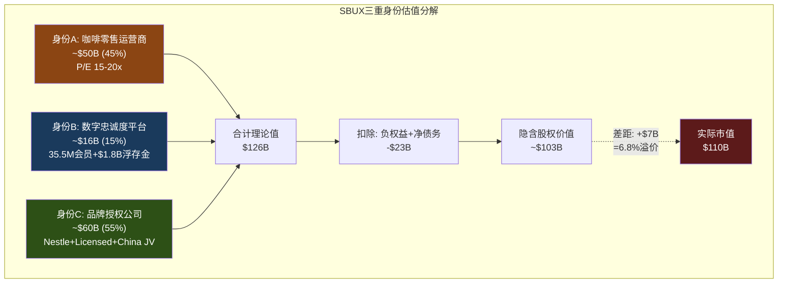

# Ch2 公司身份诊断: 一家公司，三个灵魂

> **核心矛盾映射**: SBUX以78.6x P/E交易，但其OPM仅9.6%——这个倍数只有在SBUX"不仅仅是一家咖啡店"时才合理。本章将量化SBUX三个竞争身份的经济贡献，通过SGI评分定位其专才度，并计算每个身份隐含的估值，最终回答:$110B市值到底在为哪个SBUX买单?

---

## 2.1 三重身份的经济解剖

Starbucks不是一家可以用单一维度定义的公司。它同时具备三种截然不同的商业模式特征，每种对应不同的资本市场估值逻辑。理解这三重身份之间的张力，是理解SBUX估值悖论的起点 [DM-P1-A01](C: 框架构建)。

### 身份A: 咖啡零售运营商

这是SBUX最古老、最直观的身份——开门店、卖咖啡、赚取门店级营业利润。

**运营指纹**:
- 全球约16,800家自营门店(Company-Operated)，占总门店~55% [DM-P1-A02](H: FY2025 10-K)
- FY2025自营门店收入约$29.5B(占总收入$37.2B的~79%) [DM-P1-A03](H: FY2025 10-K Segment)
- 门店AUV(Average Unit Volume): 美国~$1.8M/年，中国~$394K/年 [DM-P1-A04](E: Industry estimates)
- 361,000名员工，绝大多数是门店barista [DM-P1-A05](H: SBUX Profile)
- FY2025 CapEx $2.31B——几乎全部投向门店建设和翻新 [DM-P1-A06](H: FY2025 Cash Flow)
- 门店级OPM: ~16-17%(FY2023正常年份)，但FY2025公司层面OPM降至9.6% [DM-P1-A07](H: FY2025 Income Statement)

**这个身份的估值含义**: 纯咖啡零售运营商的合理P/E约15-20x。参照对象: 餐饮连锁运营商(非特许模式)如Dine Brands(13x)、Darden(17x)、Chipotle(32x，但CMG有更高增速)。如果SBUX完全按这个身份估值，以正常化EPS $2.50计算: $2.50 × 17.5x = **$43.8/share = $50B市值** [DM-P1-A08](C: 估值推算)。

这意味着$110B市值中有约$60B——超过一半——必须由其他两个身份来支撑。

### 身份B: 数字忠诚度平台

SBUX的第二个身份在过去5年中迅速崛起，在资本市场叙事中的权重不断增加。

**平台指纹**:
- 35.5M美国90天活跃Rewards会员(Q1 FY2026)，全球估计>70M [DM-P1-A09](H: Q1 FY2026 Earnings)
- 美国自营收入中57%来自Rewards会员 [DM-P1-A10](H: Q1 FY2026 Earnings)
- 31%的美国交易通过Mobile Order & Pay完成 [DM-P1-A11](H: Q1 FY2026 Earnings)
- $1.84B预存卡浮存金——零成本资本(详见Ch4 DFFV框架) [DM-P1-A12](H: FY2025 10-K Balance Sheet)
- $208M/年breakage收入——客户自愿放弃的资金 [DM-P1-A13](H: FY2024 10-K)
- Deep Brew AI平台驱动个性化推荐 [DM-P1-A14](S: Investor Day 2026)
- 2026年3月重构为三层会员(Green/Gold/Reserve)——SaaS式ARPU分层 [DM-P1-A15](H: Investor Day 2026)

**这个身份的估值含义**: 数字忠诚度/订阅平台的合理P/E约25-35x。参照: Spotify(65x但无盈利)、Netflix(35x)、以及更贴切的比较——PayPal(17x，因增长放缓)。如果给SBUX的"数字平台贡献"赋予独立估值: 35.5M会员 × ARPU $597/年 × 25%归属于平台(而非门店) = ~$5.3B平台收入 × 30x P/S = **~$16B** [DM-P1-A16](C: 粗略估值)。

但这个估值高度依赖一个假设: Rewards的价值可以从门店网络中分离。现实中，没有门店就没有Rewards——它是品牌的衍生品，不是独立平台。

### 身份C: 品牌授权公司

SBUX的第三个身份是最新发展的，也是中国JV后最值得关注的。

**授权指纹**:
- 全球约17,000+特许/授权门店(Licensed Stores)，占总门店~45% [DM-P1-A17](H: FY2025 10-K)
- Nestle CPG联盟: 2018年$7.2B预付版权金，换取全球CPG永久分销权 [DM-P1-A18](H: SBUX 10-K + Nestle IR)
- 非当期递延收入中$5.8B = Nestle预付版权金余额(逐年摊销确认) [DM-P1-A19](H: FY2025 Balance Sheet)
- Channel Development收入(CPG、RTD): ~$1.8B/年，高利润率 [DM-P1-A20](H: FY2025 Segment Data)
- 中国JV(Boyu Capital 60%): 从自营转为品牌授权模式，SBUX保留40%+IP+许可费 [DM-P1-A21](H: Nov 2025 8-K)
- JV后International OPM目标>20%(从13%)——纯因为授权模式比自营更轻 [DM-P1-A22](H: Investor Day FY2028 Targets)

**这个身份的估值含义**: 纯品牌授权公司的合理P/E约28-35x。参照: MCD(28x，95%特许化，46.1% OPM)、YUM(29x，97%特许化)、QSR(27x)。如果SBUX的授权/CPG收入约$5B，OPM ~40%，则Operating Income ~$2B × 30x = **~$60B** [DM-P1-A23](C: 估值推算)。



**关键发现**: 三重身份的理论价值合计约$103B(扣除净债务后)，与实际$110B相差仅7%。这表明当前估值并不疯狂——它反映了市场隐含地将SBUX视为**一个三合一的复合体**。问题不是"78x是否合理"，而是**市场对三个身份的权重分配是否正确** [DM-P1-A24](C: 估值缺口分析)。

---

## 2.2 SGI评分: 星巴克有多"专才"?

SGI(Specialist-Generalist Index)评估公司在其核心业务上的不可替代程度。SGI越高，意味着公司的竞争优势越依赖于特定领域的深度积累——这通常对应更高的估值溢价(专才壁垒)，但也意味着更大的集中度风险 [DM-P1-A25](C: SGI框架)。

### 五维评分

| 维度 | 分数(0-10) | SBUX具体表现 | 对标参考 |
|------|:----------:|-------------|---------|
| **营收集中度** | 9 | 95%+收入来自咖啡饮品及相关食品零售；CPG通道也是咖啡 | MCD: 8(全来自QSR), AAPL: 7(iPhone依赖降低) |
| **技能可迁移性** | 3 | 咖啡零售运营→茶饮/烘焙/其他餐饮有部分迁移性(Teavana失败案例)，但品牌DNA高度咖啡化 | MCD: 4(快餐通用), NKE: 5(运动品牌可扩品类) |
| **客户依赖度** | 5 | 35.5M Rewards会员广泛分散，无单一大客户；但57%收入依赖Rewards体系=系统性集中 | COST: 6(会员制更强锁定), MCD: 4(更分散) |
| **供应链专业化** | 6 | 咖啡豆采购→烘焙→门店运营的纵向一体化；6个烘焙工厂；C.A.F.E.认证体系 | LKNCY: 3(更轻模式), MCD: 4(食材更标准化) |
| **监管特异性** | 3 | 食品安全标准化，跨国运营合规成本高但无特殊监管壁垒(vs 金融/医疗) | 银行: 9, 医疗: 8, 零售: 2-3 |
| **SGI总分** | **6.5** | **中度专才** — 品牌+运营专业化但非垄断 | |

[DM-P1-A26](C: SGI框架评分)

```mermaid
%%{init: {'theme': 'dark'}}%%
radar
    title "SBUX SGI雷达图 vs 同业"
    axis 营收集中度, 技能可迁移性, 客户依赖度, 供应链专业化, 监管特异性
    "SBUX" : [9, 3, 5, 6, 3]
    "MCD" : [8, 4, 4, 4, 3]
    "NKE" : [7, 5, 6, 5, 3]
```

### SGI 6.5的含义

**中度专才**意味着SBUX处于一个微妙的位置: 足够专业化以拥有品牌壁垒，但不够专业化以享受垄断级定价权。与半导体设备公司(SGI 8-9)不同，SBUX的专业化更多体现在品牌和文化层面(难以量化)，而非技术或监管层面(可量化) [DM-P1-A27](C: SGI比较分析)。

**对估值的映射**: SGI 6.5 → 品牌价值需要独立章节量化(本章已完成三重身份框架)，但不需要IHG级别(SGI 8.2)的超专才溢价框架。SBUX的品牌是"软壁垒"——它保护的是消费者心智份额，而非物理或法规层面的进入壁垒。

---

## 2.3 身份溢价分析: 从ETN/WMT移植

身份溢价(Identity Premium)是我们在ETN和WMT报告中验证的分析框架: 当市场对一家公司的"本质"定义发生变化时——例如从"工业公司"重新定义为"电气化平台"——估值倍数可以发生阶跃式跳升，即使基本面未变 [DM-P1-A28](C: 方法论移植)。

### SBUX的身份迁移路径

| 阶段 | 时间 | 主导身份 | P/E区间 | 催化剂 |
|------|------|---------|:-------:|--------|
| **传统零售商** | 1992-2008 | A: 咖啡运营商 | 20-30x | 门店扩张驱动增长 |
| **Schultz回归** | 2008-2017 | A→B转型 | 25-35x | 移动支付+Rewards启动 |
| **Nestle交易** | 2018 | B+C | 25-30x | $7.2B CPG授权=身份C正式确立 |
| **COVID+Johnson** | 2019-2024 | 混乱期 | 20-30x | 身份模糊+中国问题+工会 |
| **Niccol时代** | 2024- | B+C(目标) | 30-78x | CEO光环+中国JV=身份C加速 |

[DM-P1-A29](C: 身份迁移时间线)

**当前时刻的独特性**: Niccol上任标志着SBUX可能正在经历从"A为主+B/C为辅"向"B/C为主+A为辅"的身份翻转。如果这个翻转成功——

- OPM从9.6%恢复到15%+(通过特许化+成本削减)
- Rewards从57%渗透率提升到65%+(通过三层重构+ARPU升级)
- 中国从拖累变为纯授权收入(通过Boyu JV)

——那么SBUX的"合理"倍数将从当前的17.5x(身份A)向28-32x(身份B+C平均)迁移。这对应的股价约$70-100(正常化EPS $2.50 × 28-32x) [DM-P1-A30](C: 身份溢价测算)。

### 身份翻转的风险: 不完全转型的估值陷阱

身份溢价有一个危险的非线性特征: **半转型比不转型更危险**。

如果SBUX成功将特许化从55%提升到75%——收入下降25%但OPM翻倍——市场可能给予30x新倍数。但如果只提升到65%(半途)——收入下降10%，OPM仅从10%升到15%——那么两种身份都不纯粹: 既不是高增长零售商(收入降了)，也不是高margin授权商(OPM不够高)。这种"身份暧昧"可能导致倍数停留在20-25x的无人区 [DM-P1-A31](C: 非线性风险分析)。

中国JV正是这个风险的测试案例: 它将8,011家门店从"自营"转为"授权"，但收入从$3.1B降为许可费(可能仅$150-200M/年)。如果市场没有给予相应的倍数补偿(因为royalty rate未公开、不确定性高)，这笔交易可能是"两头输"——收入减少了，但倍数没升上去。

---

## 2.4 身份估值缺口: $110B在为哪个SBUX买单?

整合三重身份的分析，我们可以构建一个"身份权重隐含反演"——从$110B市值反推市场对每个身份的隐含权重 [DM-P1-A32](C: 反演框架)。

### 方法: 约束条件下的权重求解

设身份A权重为$w_A$，身份B为$w_B$，身份C为$w_C$:
- $w_A + w_B + w_C = 1$
- 隐含P/E = $w_A × 17.5 + w_B × 30 + w_C × 30 ≈ 42x$ (基于正常化EPS $2.50)
- 约束: $w_A ≥ 0.3$ (55%自营收入仍存在)

**求解结果**:
| 方案 | $w_A$ | $w_B$ | $w_C$ | 隐含P/E | 市值 |
|------|:-----:|:-----:|:-----:|:-------:|:----:|
| 当前隐含 | 35% | 25% | 40% | 26x* | $110B |
| 转型成功 | 20% | 30% | 50% | 28x | $120B+ |
| 转型失败 | 60% | 20% | 20% | 21x | $53B |

*注: 78x TTM P/E是因为EPS被一次性项压低。以正常化EPS计算的隐含倍数约42x，以FY2028E EPS $3.63计算约26x。

[DM-P1-A33](C: 权重反演计算)

**关键结论**: 当前$110B市值隐含市场赋予身份C(品牌授权)40%的权重——这是一个**前瞻性定价**，因为今天的授权收入占比远低于40%。换言之，市场在预期SBUX未来3年会加速身份C的贡献(通过中国JV+可能的进一步特许化)。

如果这个预期落空——Niccol维持55%自营比例不变，仅靠运营效率恢复OPM——那么身份A的权重应该回到60%+，隐含P/E降至21x，市值约$53B(股价~$46)。这就是**身份翻转失败的下行情景** [DM-P1-A34](C: 下行情景)。

---

## 本章小结

| 发现 | 量化结论 | CQ映射 |
|------|---------|--------|
| 三重身份理论价值$103B | 与实际$110B仅差7%——估值不疯狂 | CQ1: 78x基于正常化可能合理 |
| SGI 6.5=中度专才 | 品牌是软壁垒，非硬壁垒 | CQ5: Rewards是壁垒还是工具 |
| 市场隐含身份C权重40% | 前瞻性定价特许化转型 | CQ3: 中国JV是身份C的起点 |
| 身份翻转失败→$53B市值 | 下行46%如果维持纯零售身份 | CQ2: Niccol的速度决定身份 |
| 半转型比不转型更危险 | 身份暧昧=倍数无人区 | CQ1: BME信念互斥的根源 |

**Phase 2预传导**: 身份权重将锚定Ch12 Reverse DCF的倍数假设——不同身份路径对应不同terminal multiple。身份C权重的变化将在Ch18(特许化转换期权)中用FCO框架量化。
