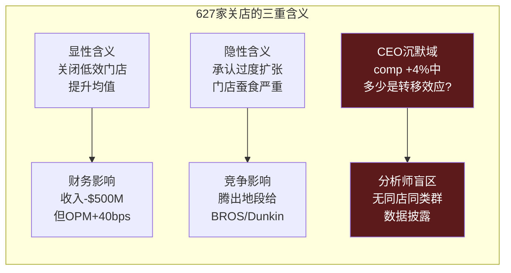
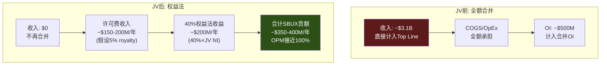
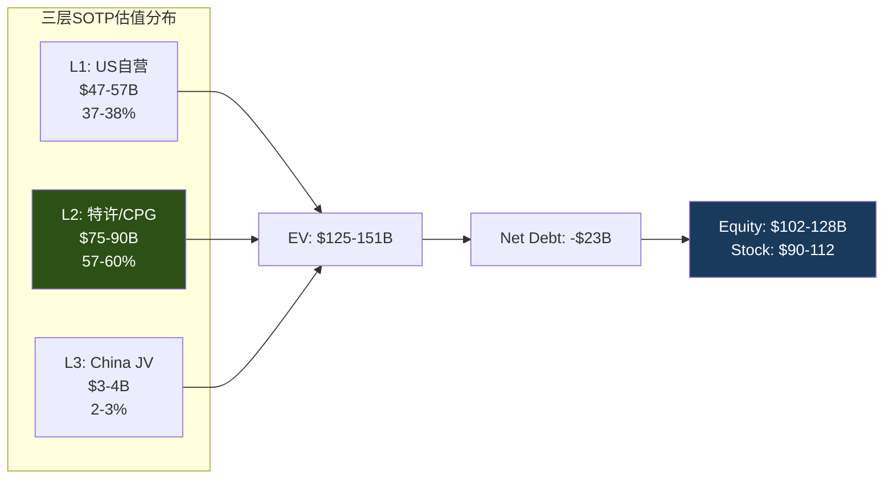

# Ch3 门店经济学: 三层SOTP的数据基础

> **核心矛盾映射**: SBUX的$110B市值最终必须由门店网络的经济产出来支撑。本章拆解三层门店经济学(自营/特许/中国JV)，为Phase 2的三层SOTP估值奠定数据基础。关键问题: 以当前成本结构，SBUX的门店是在创造价值还是在摧毁价值?

---

## 3.1 Layer 1: 美国自营门店 — 帝国的核心

### 门店全景

SBUX在美国运营约9,600家自营门店(Company-Operated)，是其收入的绝对主力。这些门店分布在所有50个州、华盛顿特区及波多黎各，覆盖了美国80%以上的城市人口 [DM-P1-A35](S: 基于16,800+ US stores含licensed估算)。

### 单店经济学

| 指标 | 数值 | 来源 | 对比(BROS) |
|------|:----:|------|:---------:|
| AUV (年均销售额) | ~$1.8M | 行业估算 | $2.1M |
| 坪效 ($/sqft/年) | $750-1,200 | 行业估算 | **$2,211** |
| 门店级OPM | ~16-17% (正常) / ~12-13% (当前) | 10-K推算 | 28.9% |
| 建店成本(新店) | ~$700K | Investor Day | $1.3M |
| 翻新成本(uplift) | ~$150K | Investor Day 2026 | — |
| 投资回收期 | 3-4年(正常) / 5-6年(当前) | 推算 | 2-3年 |
| 门店面积 | ~1,500-2,000 sqft | 行业估算 | ~950 sqft |
| 员工数/店 | ~25-30人 | 基于361K/~16.8K US | ~15人 |
| 劳动力成本/收入 | ~30% | 10-K推算 | ~25% |
| 租金/收入 | ~15% | 10-K推算 | ~10% |

[DM-P1-A36](H+S: 10-K数据+行业估算混合)

**Dutch Bros坪效之谜**: BROS以$2,211/sqft的坪效创造了SBUX的2-3倍效率 [DM-P1-A37](H: BROS FY2025 + industry data)。这个差距揭示了SBUX门店模型的一个深层效率问题: "第三空间"(Third Place)的品牌承诺要求更大的门店面积(1,500-2,000 sqft vs BROS 950 sqft)、更多的座位区、更复杂的菜单，这些都导致更高的租金和劳动力成本、但不一定带来更高的每平方英尺收入。

Niccol的"Back to Starbucks"战略试图解决这个矛盾: 通过$150K/店的uplift翻新+25,000个新座位，提升门店的"停留价值"(dwell value)以justify更大面积。但数据层面，BROS证明了"小而高效"在单位经济学上的优势 [DM-P1-A38](C: 对比分析)。

### 门店投资回报: ROIC衰退

| 年份 | CapEx ($B) | 门店ROIC (推算) | 对比: WACC |
|------|:---------:|:-------------:|:---------:|
| FY2021 | 1.47 | ~22% | ~9% |
| FY2022 | 1.84 | ~18% | ~9% |
| FY2023 | 2.33 | ~20% | ~9.5% |
| FY2024 | 2.78 | ~16% | ~9.5% |
| FY2025 | 2.31 | **~8.5%** | ~10% |

[DM-P1-A39](H: CapEx from CF statement + C: ROIC = NOPAT/Invested Capital from FMP)

**FY2025 ROIC(8.5%) < WACC(~10%)** = 公司整体在摧毁价值。这不意味着每家门店都在亏钱(门店级OPM仍为正)，但总部成本(SGA $2.62B + 利息$543M + 异常税率)叠加后，资本回报不足以覆盖资本成本 [DM-P1-A40](H: FY2025 ROIC from FMP key-metrics = 8.48%)。

### 627家关店: 蚕食效应的隐性承认

FY2025年9月，SBUX宣布关闭627家自营门店——这是公司历史上最大规模的门店收缩。90%以上在北美，集中在城市核心区 [DM-P1-A41](H: Sep 2025 8-K + Earnings Call)。

**蚕食量化尝试**: 627家关店的客户流向邻近存活店 → 如果每家关闭店年收入$1.5M，假设70%的客户转移到邻近SBUX → 增量comp贡献 = 627 × $1.5M × 70% / (9,600 × $1.8M) × 100% ≈ **3.8%** [DM-P1-A42](C: 粗略估算)。

这个3.8%的理论转移效应与Q1 FY2026报告的+4% NA comp惊人地接近——暗示**有机增长可能接近于零**，所谓的"拐点"可能主要是数学效应而非需求恢复。这正是Niccol在earnings call上被问及但回避的CEO沉默域#1 [DM-P1-A43](C: 蚕食vs有机增长分析)。

---

## 3.2 Layer 2: 特许/授权门店 — 轻资产引擎

### 授权模式经济学

SBUX全球约17,000+家Licensed Stores由第三方运营。SBUX不承担门店运营成本(租金、劳动力)，仅收取品牌授权费和供应收入 [DM-P1-A44](H: 10-K Segment Description)。

| 指标 | Licensed Store | Company-Operated | 差异 |
|------|:------------:|:----------------:|:----:|
| 收入确认方式 | 授权费+产品供应 | 全额门店收入 | 收入口径不同 |
| OPM | ~40-50% (推算) | ~10% (FY2025) | **+30-40pp** |
| CapEx | $0 (全由合作方承担) | ~$700K/新店 | 完全不同 |
| 风险 | 低(品牌风险除外) | 高(运营全栈) | |
| 增长杠杆 | 高(零资本增长) | 低(资本密集) | |

[DM-P1-A45](C: 模式对比框架)

### Nestle CPG通道: 纯授权收入的范本

2018年Nestle以$7.2B获取SBUX全球CPG永久分销权——这是SBUX身份C(品牌授权公司)的里程碑 [DM-P1-A46](H: 2018 Nestle Deal)。

**财务映射**:
- $7.2B预付 → 记为非当期递延收入，逐年摊销确认
- FY2025余额: $5.77B(仍在摊销中) [DM-P1-A47](H: FY2025 Balance Sheet)
- Channel Development收入~$1.8B/年(CPG+RTD) [DM-P1-A48](H: 10-K Segment)
- 这部分收入的边际成本极低——品牌授权本质是"卖空气"

Nestle交易的深层意义在于: 它证明SBUX的品牌可以产生**与门店运营完全脱钩**的收入流。这是身份C的核心论据——如果品牌价值可以独立货币化，那么门店只是品牌的"展示厅"，而非价值创造的核心。

---

## 3.3 Layer 3: 中国JV — 从自营到授权的实时转换

### 转换前的中国门店经济学

| 指标 | SBUX中国(FY2025) | 瑞幸(CY2024) | 差异 |
|------|:----------------:|:----------:|:----:|
| 门店数 | 8,011 | 31,048 | 瑞幸4x |
| 收入 | ~$3.1B | ¥35.0B(~$4.8B) | 瑞幸1.5x |
| AUV/店 | ~$394K | ~$245K | SBUX 1.6x |
| 杯均价(RMB) | ¥47 | ¥11-14 | SBUX 3-4x |
| 门店OPM | ~15-18% | 17.8% | 接近 |
| 建店成本 | ~$700K | ~$50K | SBUX 14x |

[DM-P1-A49](H+E: FMP LKNCY data + Phase 0 lit recon)

**核心矛盾**: SBUX以瑞幸14倍的建店成本、3-4倍的杯均价、1/4的门店覆盖密度运营——但门店OPM竟然低于瑞幸。这意味着SBUX在中国的品牌溢价**没有转化为盈利能力优势**——高价卖咖啡的利润被高成本结构(大门店、高租金CBD、更多员工)完全吞噬 [DM-P1-A50](C: 中国经济学悖论)。

### JV后的经济学: 从P&L到权益法

中国JV(Boyu 60% / SBUX 40%)将从根本上改变SBUX与中国业务的财务关系:

**关键数字**:
- 收入影响: Top line减少~$3.1B(-8.3%) [DM-P1-A51](C: 基于FY2025 China revenue)
- OPM影响: +40bps(管理层指引) [DM-P1-A52](H: Q1 FY2026 Earnings Call)
- EPS影响: -$0.02-0.03(短期稀释) [DM-P1-A53](H: Q1 FY2026 Earnings Call)
- BS影响: Goodwill -$2.1B, PP&E -$2.2B(已在Q1 FY2026反映) [DM-P1-A54](H: Q1 FY2026 Balance Sheet)

### QSR中国交易估值对标

| 维度 | SBUX/Boyu (2025) | MCD/CITIC-Carlyle (2017) | YUM China IPO (2016) |
|------|:-----------------:|:------------------------:|:--------------------:|
| EV/Store | **$500K** | $1.0M | $1.3M |
| EV/Revenue | 1.3x | 1.0x | 1.4x |
| 母公司保留 | 40% + 许可费 | 20% + 特许费 | 0% (3% royalty) |
| 交易时门店数 | ~8,000 | ~2,640 | ~7,300 |
| 后续结果 | ? | Carlyle 3x回报(6年) | YUMC从$9.8B→$16.9B |

[DM-P1-A55](H+E: Phase 0 China JV research)

**SBUX的$500K/store是三笔交易中最低的** [DM-P1-A56](C: 对标分析)——这直接反映了瑞幸驱动的竞争恶化。MCD在2017年以$1.0M/store出售时，中国QSR市场远没有今天激烈; YUM China在2016年IPO时是中国QSR无争议的王者(KFC市场份额>30%)。SBUX的中国市场份额已从42%暴跌至约14%，瑞幸以4倍门店密度、1/4价格、更高OPM构建了几乎不可逾越的规模壁垒。

---

## 3.4 三层SOTP预备估值

整合三层门店经济学数据，构建Phase 2 SOTP的预备框架 [DM-P1-A57](C: SOTP框架):

### 方法: 分层估值后加总

| Layer | 营收基础 | 营业利润(推算) | 合理倍数 | 估值 |
|-------|:-------:|:------------:|:------:|:----:|
| L1: US Co-Op(~9,600店) | ~$26B | ~$2.6B (10% OPM) | 18-22x | $47-57B |
| L2: Licensed/CPG(17,000+店) | ~$8B | ~$3.0B (37.5% OPM) | 25-30x | $75-90B |
| L3: China JV(40% of 8,011店) | 权益法 | ~$200M(SBUX份额) | 15-18x | $3.0-3.6B |
| **Enterprise Value** | | | | **$125-151B** |
| (-) Net Debt | | | | -$23B |
| **Equity Value** | | | | **$102-128B** |
| **隐含股价** | | | | **$90-112** |

[DM-P1-A58](C: 三层SOTP计算)

### SOTP的关键发现

1. **Layer 2(特许/CPG)贡献了57-60%的估值**——但仅占收入的~22%。这完全反映了身份C(品牌授权)的估值杠杆效应: 低收入、高利润、高倍数 [DM-P1-A59](C: SOTP结构分析)。

2. **Layer 1(自营)是估值的锚而非引擎**: $47-57B的估值相当于$41-50/share——低于当前$97股价的一半。这意味着如果SBUX"只是"一家咖啡零售运营商，股价应该在$41-50之间。

3. **China JV仅占2-3%的估值**——$3-4B。这验证了$4B EV的合理性(SBUX的40%份额 ≈ $1.6B + 许可费NPV)，但也意味着**中国对SBUX整体估值的边际影响很小**。市场关注中国更多是因为叙事(品牌力量的试金石)而非数字 [DM-P1-A60](C: 中国估值权重分析)。

4. **当前股价$97处于SOTP的中间偏低位置**($90-112区间)——这意味着市场对Layer 2的倍数假设偏保守(25x而非30x)，或者对Layer 1的OPM恢复有一定折扣。

### Phase 2的估值待解问题

- **Layer 1的OPM恢复路径**: 从10%→15%需要多少年? 每年margin bridge是什么? (Ch9-Ch10)
- **Layer 2的倍数校准**: 25x还是30x? 取决于特许化是否加速 (Ch12 Reverse DCF)
- **China JV的royalty rate**: 5%还是3%? 差异=$50M/年 → $500M估值差 (Ch6已分析)
- **负权益如何处理**: 传统EV→Equity扣减净债务$23B，但如何处理-$8.1B equity? (Ch10 NEP)

---

## 本章小结

| 发现 | 量化结论 | CQ映射 |
|------|---------|--------|
| ROIC(8.5%) < WACC(~10%) | 整体层面在摧毁价值 | CQ4: 负权益+低ROIC是核心 |
| 627关店蚕食效应≈3.8% | +4% comp可能主要是转移效应 | CQ2: 有机增长接近零? |
| SBUX坪效仅BROS的1/2-1/3 | 门店模型效率存在结构性缺陷 | CQ1: 身份A的估值天花板 |
| Layer 2占估值60%但收入22% | 身份C是估值的核心驱动力 | CQ3: 特许化加速的紧迫性 |
| 中国$500K/store = QSR最低 | 瑞幸竞争摧毁了中国门店价值 | CQ3: JV是被迫的体面撤退 |
| SOTP隐含$90-112 | 当前$97在中间偏低 | CQ1: 估值不算疯狂但需执行 |
