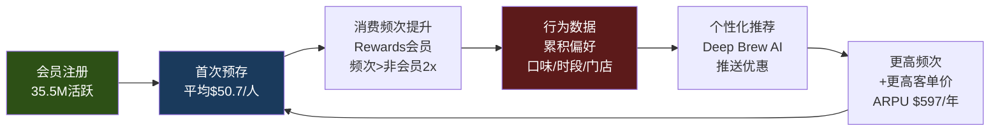
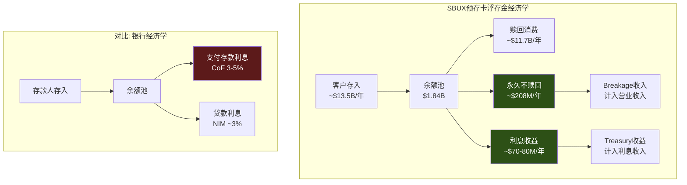
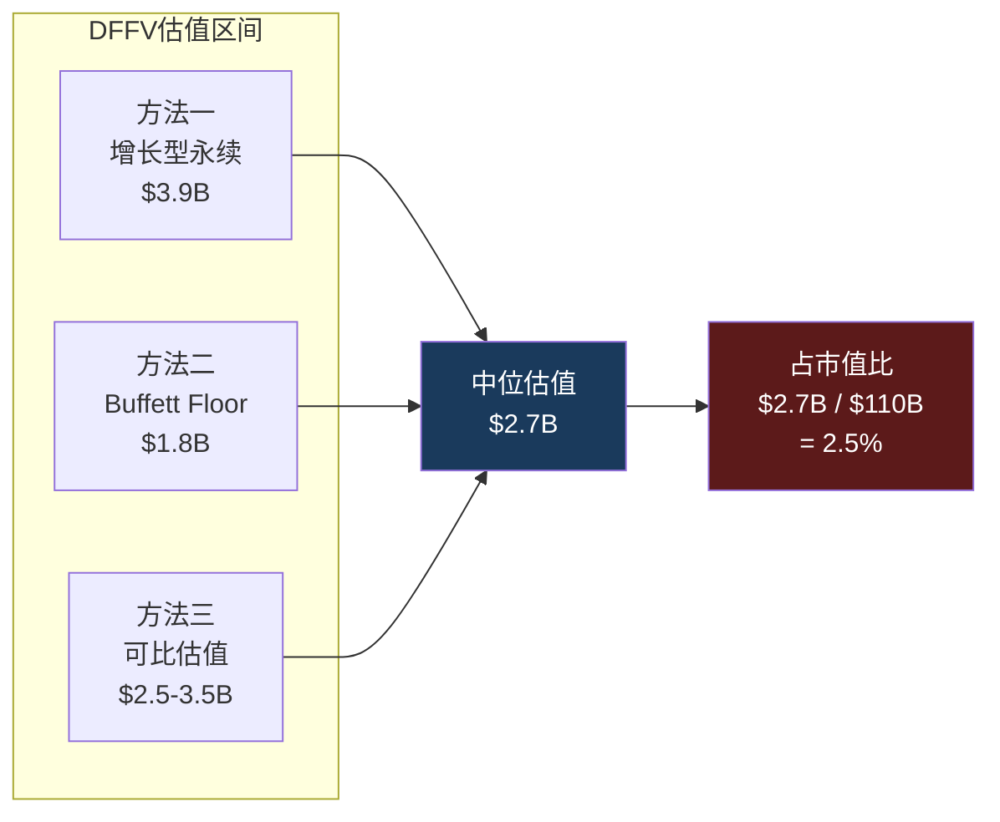
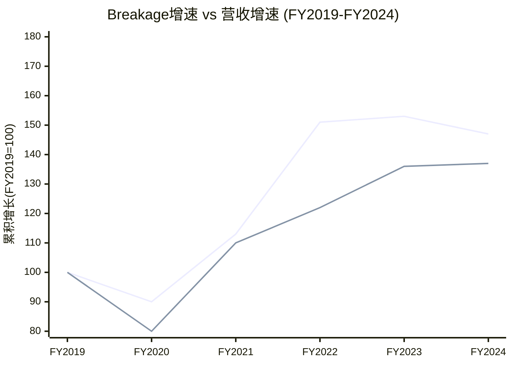

# Ch4 Rewards忠诚度飞轮经济学

> **核心矛盾映射**: CQ5("35.5M Rewards会员=增长引擎还是天花板?")直接决定SBUX的身份诊断——如果Rewards是一个可以独立估值的数字资产(DFFV框架)，那么78x P/E的合理性就从"一家咖啡店凭什么这么贵"转变为"一个3500万活跃用户的数字金融平台+品牌授权公司，附带咖啡零售业务"。本章将量化这个叙事的数据基础，并揭示预存卡浮存金这一被系统性忽视的隐藏资产。

---

## 4.1 Rewards飞轮机制: 从一杯咖啡到一个数据平台

Starbucks Rewards不是一个积分兑换系统——它是一个**自强化的行为锁定飞轮**。理解这个飞轮的自强化循环，是理解SBUX估值中"数字平台溢价"(vs 纯咖啡零售折价)的关键。

### 飞轮的六个齿轮

**飞轮的数据基础** [DM-P1-B01](H: SBUX Q1 FY2026 Earnings Release):

| 指标 | 数值 | 来源 | 信号 |
|------|------|------|------|
| 美国90天活跃会员 | 35.5M | Q1 FY2026 ER | 历史新高(ATH)，+3% YoY |
| 美国自营收入中Rewards占比 | 57% | Q1 FY2026 ER | 超过一半，接近主导地位 |
| 移动点单(MO&P)占交易比 | 31% | Q1 FY2026 ER | 首次>30%(Q3 FY2024突破) |
| 数字渠道总收入占比 | >57% | Q1 FY2026 ER | Rewards+MO&P+Delivery |
| 预存卡余额(current deferred rev) | $1.84B | FY2025 10-K | 零息浮存金 |
| 年breakage收入 | $208M | FY2024 10-K | 增速=收入增速×2.3 |

**关键洞察**: 57%的收入渗透率意味着每$100美国自营收入中，$57来自Rewards会员。这不是"忠诚度奖励"——这是**收入基础设施**。如果Rewards系统遭遇重大故障(技术崩溃或政策失误导致大规模退出)，SBUX将瞬间丧失超过一半的可预测收入流。

**飞轮的自强化效应** [DM-P1-B02](H: SBUX Investor Day 2026.1.29 + 10-K):

Rewards的增长不是线性的，而是自我加速的:
- **FY2015**: 程序启动早期，渗透率<20%
- **FY2019**: 18.9M会员，渗透~39%
- **FY2022**: 28.7M会员，渗透~48%——COVID后加速(非接触支付需求)
- **FY2024**: 34.6M会员，渗透~55%
- **Q1 FY2026**: 35.5M会员，渗透57%——**2年增加600bps**

增长速度的含义: Rewards每增加1%渗透率，意味着约150万新会员进入飞轮，每位会员每年贡献$597收入(后文详计)。1%渗透率 = ~$9亿增量收入的"锁定"转化。

### Q1 FY2026的结构性拐点

Q1 FY2026有一个被市场低估的数据点: **这是自Q2 FY2022以来，Rewards会员交易量和非Rewards交易量同时增长的第一个季度** [DM-P1-B03](H: SBUX Q1 FY2026 Earnings Call)。

这一点为什么重要? 在此之前的8个季度，SBUX的交易增长(如果有的话)完全来自Rewards会员——非会员交易量持续下降。这意味着:
1. Rewards吸引了现有客户加入，但没有带来增量需求
2. 非会员客户在流失，可能转向竞争对手(BROS、Dunkin')
3. 飞轮在旋转，但旋转的能量来自"转化已有客户"而非"吸引新客户"

Q1 FY2026的双增长打破了这个模式。如果这能持续3Q+(见KS-01门控)，意味着Niccol的"Back to Starbucks"战略不仅在加速飞轮，还在**重新扩大飞轮的入口漏斗**。

---

## 4.2 预存卡浮存金的银行经济学: 当顾客付钱请你保管他们的钱

SBUX预存卡(Stored Value Card)系统是全球QSR行业中独一无二的金融现象。没有第二家餐饮公司拥有如此规模的预付余额。理解这一机制，需要暂时忘记"这是一家咖啡店"的框架，转而用**银行经济学**来思考。

### 浮存金的规模与性质

**核心数据** [DM-P1-B04](H: SBUX 10-K FY2022-FY2025, Balance Sheet Notes):

| 财年 | 当期递延收入(预存卡) | 非当期递延收入(含Nestle) | 合计 |
|------|:-------------------:|:----------------------:|:----:|
| FY2022 | $1,641.9M | $6,279.7M | $7,921.6M |
| FY2023 | $1,700.2M | $6,101.8M | $7,802.0M |
| FY2024 | $1,781.2M | $5,963.6M | $7,744.8M |
| FY2025 | $1,840.6M | $5,772.6M | $7,613.2M |

**重要口径说明**: 非当期递延收入中约$5.8B来自Nestle全球咖啡联盟的预付版权金，不属于预存卡体系。预存卡浮存金的核心指标是**当期递延收入~$1.84B**。这一余额每年获得约$13.5B新存入(FY2022数据) [DM-P1-B05](H: SBUX FY2022 10-K)，同时消耗约等额的赎回——净余额维持$1.6-1.9B区间并稳步增长(5年CAGR ~2.9%)。

### Berkshire Float类比: 为什么这是"负成本资本"

Warren Buffett在致股东信中多次阐释保险浮存金(insurance float)的经济学: "浮存金是别人的钱，我们持有并投资，虽然它不属于我们，但使用成本为零，有时甚至为负——因为我们在持有期间不仅不付利息，还能赚取breakage" [DM-P1-B06](E: Berkshire Hathaway Annual Letters)。

SBUX预存卡的经济学**比保险浮存金更优**:

| 对比维度 | Berkshire保险浮存金 | PayPal客户余额 | SBUX预存卡浮存金 |
|---------|:------------------:|:-------------:|:---------------:|
| 规模 | $164B | $36B | $1.84B |
| 支付给客户的利息 | 0% | 0-4.5%(高收益) | **0%** |
| 监管要求 | 保险资本充足率 | 金融牌照/AML | **无** |
| FDIC/存款保险 | 不适用 | 部分覆盖 | **无** |
| 年化损耗(breakage) | 保险赔付率~96% | 几乎为0 | **~11%永久未赎回** |
| 资金可用性 | 可投资长期资产 | 受限(流动性要求) | **完全自由使用** |
| 客户主动贡献意愿 | 被动(风险转移) | 功能性(支付) | **主动(便利+送礼)** |

**这组对比揭示了一个非直觉的结论**: SBUX预存卡浮存金的经济性质可能优于全球最知名的保险浮存金——零利息、无监管、11%永久损耗(=隐性收入)、客户主动贡献(送礼文化)。唯一劣势是规模($1.84B vs $164B)，但按比例计算经济效率远高于Berkshire [DM-P1-B07](C: 对比框架构建)。

### 浮存金年度经济价值

**DFFV(Digital Float Franchise Valuation)框架** [DM-P1-B08](C: 原创估值方法论):

浮存金为SBUX创造的年度经济价值由两部分构成:

| 价值来源 | 年度估算 | 计算方法 |
|---------|:--------:|---------|
| **利息收入(opportunity cost)** | $70-80M | $1.84B × 4% risk-free rate |
| **Breakage收入** | $200-210M | 永久未赎回余额确认收入 |
| **合计年度经济价值** | **$270-290M** | |

**资本成本视角**: SBUX为获取这$1.84B的"存款"支付了多少成本? **负值**——不仅不支付利息，还从中获取$208M/年的breakage收入。这在金融学上被称为**负资本成本**(negative cost of capital)。任何银行、保险公司、金融科技公司都无法实现这一点——他们必须支付存款利息或承保成本才能获取浮存金。SBUX的"存款人"(客户)不仅不要利息，还主动放弃约11%的余额。

---

## 4.3 DFFV估值: 如果浮存金是一家独立公司，值多少钱?

DFFV(Digital Float Franchise Valuation)是本报告为SBUX预存卡体系专门构建的估值框架。传统的Sum-of-the-Parts(SOTP)分析从未将预存卡浮存金作为独立资产估值——这是一个系统性的分析师盲区 [DM-P1-B09](C: 原创框架)。

### 方法一: 增长型永续价值

预存卡余额的增长特征:
- FY2022→FY2025 CAGR: ($1,841M / $1,642M)^(1/3) - 1 = **3.9%** [DM-P1-B10](C: 基于10-K数据计算)
- 保守增长假设: 3% (与美国名义GDP增长匹配)
- 折现率: 10% (SBUX WACC参考，因负权益使用替代估计)

**永续价值计算**:
$$PV = \frac{Annual\_Value}{WACC - g} = \frac{\$270M}{10\% - 3\%} = \$3.86B$$

这意味着，如果SBUX的预存卡浮存金体系被剥离为独立资产(类似Visa从银行中分离)，其独立估值约为**$3.9B** [DM-P1-B11](C: Gordon Growth Model)。

### 方法二: Buffett $1=$1启发式

Buffett的保险浮存金估值哲学: "如果浮存金没有成本，那$1的浮存金至少值$1的内在价值" [DM-P1-B12](E: Berkshire Hathaway Letters)。对于SBUX:
- 预存卡余额: $1.84B
- 成本: 负(客户付钱让你保管)
- 因此: 最低估值 = **$1.84B**

### 方法三: 每会员浮存金估值

| 指标 | 数值 | 计算 |
|------|:----:|------|
| 浮存金总额 | $1.84B | 10-K |
| 活跃会员数 | 35.5M | Q1 FY2026 |
| **每会员浮存金** | **$51.8** | $1,840M / 35.5M |
| 每会员年收入 | $597 | $37.2B × 57% / 35.5M |
| **浮存金/收入比** | **8.7%** | $51.8 / $597 |

[DM-P1-B13](C: 基于MCP数据+10-K计算)

8.7%的浮存金/收入比意味着: 每位Rewards会员在SBUX "存放"了相当于其年度消费额8.7%的资金。这个比率看似不高，但考虑到SBUX对这笔钱**不支付任何成本**，其资本效率远超任何银行活期存款(银行需为100%存款支付利息)。

### DFFV估值区间汇总

**对核心矛盾的映射**: 即使以最激进的永续估值($3.9B)，浮存金也只占SBUX $110B市值的3.5%。这意味着非共识假说H1("把SBUX当银行估值可以合理化78x")在数量级上不成立——$3.9B远不够解释$110B的估值。浮存金是一个有趣的"隐藏资产"，但不是估值的主要支撑。真正的估值支撑必须来自其他因素(EPS恢复、品牌价值、特许化期权) [DM-P1-B14](C: H1检验)。

### 可比公司参照: 浮存金估值的锚点

将SBUX浮存金放入更广泛的"数字金融平台"语境中:

| 公司 | 浮存金规模 | 浮存金/市值 | 年度float收入 | 模式 |
|------|:---------:|:----------:|:------------:|------|
| **Berkshire Hathaway** | $164B | $164B/$1.1T = 15% | 投资收益~$30B | 保险 |
| **PayPal** | $36B | $36B/$65B = 55% | 利息~$900M | 支付 |
| **Block (SQ)** | $4.5B | $4.5B/$27B = 17% | Cash App利息 | 支付 |
| **SBUX** | $1.84B | $1.84B/$110B = **1.7%** | $270-290M | 预付消费 |

[DM-P1-B15](C: 基于公开市场数据计算)

SBUX浮存金/市值比仅1.7%，远低于FinTech公司(PayPal 55%、Block 17%)。但这恰恰说明: **市场并没有为SBUX的浮存金付费**——$110B的市值几乎全部定价在其他资产(品牌、门店网络、增长预期)上。如果市场开始重视这一资产(例如通过独立披露或结构化分离)，它代表了~$2-4B的增量估值潜力，相当于EPS增加$0.17-0.35/share [DM-P1-B16](C: 基于1.14B稀释股本计算)。

---

## 4.4 三层会员的货币化升级: Green→Gold→Reserve

2026年3月，SBUX对Rewards进行了成立以来最重大的架构重组——从原来的两层(基础+金卡)升级为三层(Green/Gold/Reserve)。这不是简单的积分门槛调整，而是**ARPU分层策略的根本性变化** [DM-P1-B17](H: SBUX Investor Day 2026.1.29)。

### 新三层架构

| 层级 | 年度Stars要求 | 核心权益 | 隐含消费额(估算) | 目标客群 |
|------|:----------:|---------|:--------------:|---------|
| **Green** | 0 (注册即得) | 生日饮品、每月免费mod | <$300/年 | 轻度客户 |
| **Gold** | 500 Stars/年 | 20%加速赚Stars、Stars永不过期 | $500-700/年 | 核心客户 |
| **Reserve** | 2,500 Stars/年 | 50%加速(vs Gold)、独家体验 | >$1,500/年 | 重度/高价值客户 |
| **新增: 60-Star兑换** | — | $2 off任何饮品 | 降低首次兑换门槛 | 所有层级 |

[DM-P1-B18](H: Investor Day Rewards Presentation)

**ARPU分层的经济逻辑**: 传统Rewards的问题是"一刀切"——高频用户和低频用户获得相同比例的回报。三层架构创造了一个**自选式价格歧视机制**:
- Green层: 低激励+低成本 → 维持大量注册基数(漏斗入口)
- Gold层: 中等激励 → 核心客户"锁定"(转化引擎)
- Reserve层: 高激励+独家体验 → 鲸鱼客户"超锁定"(利润引擎)

这种设计本质上是SaaS公司Free/Pro/Enterprise分层定价的消费品版本。关键区别: SaaS是供给侧分层(功能递增)，SBUX是需求侧分层(消费频次递增→自动升级)。

### 60-Star兑换: 低门槛的战略意义

新增的60-Star兑换(约$2 off)看似微不足道，但具有深层战略价值 [DM-P1-B19](S: 行为经济学推断):

**传统兑换门槛**: 旧体系中最低兑换门槛是25 Stars(定制饮品，约需消费$50)。这意味着新会员注册后需要消费约$50才能获得第一次"奖励"——对轻度用户来说，这可能需要4-6周。行为经济学研究表明，**第一次奖励兑换是忠诚度程序黏性的关键转折点**——兑换过一次的用户留存率比从未兑换的高出3-5倍。

**新60-Star兑换**: 约需消费$30即可获得$2 off——将"第一次奖励"的等待时间从4-6周缩短至2-3周。这可能显著提升Green层→Gold层的转化率，从而加速飞轮底部的旋转。

### 三层策略的风险: 复杂度vs货币化

三层架构的潜在风险不容忽视:

1. **复杂度成本**: 从2层到3层增加了沟通成本(barista培训、App UI、客户教育)。星巴克的品牌核心是"简单"，过于复杂的Rewards可能违背"Back to Starbucks"简化战略 [DM-P1-B20](S: 定性判断)。

2. **CQ5矛盾的加剧**: 每增加一个层级就增加一组促销承诺(免费mod、加速赚Stars、独家体验)。这些承诺的成本在P&L中体现为更高的promotional expense和更低的effective price——直接侵蚀OPM恢复路径(CQ2约束)。

3. **竞争对手的反应**: Dutch Bros在更简单的2层体系下已实现72%渗透率(vs SBUX 57%)——这暗示更复杂的层级结构不一定带来更高渗透率(详见4.6节)。

---

## 4.5 Breakage: 隐藏的利润引擎

Breakage(预存卡余额中永久不被赎回的部分)是SBUX财务报告中最不起眼却最耐人寻味的利润来源。它本质上是**客户自愿放弃的购买力**——在会计上从"负债"(递延收入)转为"收入"(breakage revenue)，不需要任何实物成本。

### Breakage收入趋势

[DM-P1-B21](H: SBUX 10-K FY2019-FY2024):

| 财年 | Breakage收入 | 构成 | YoY增长 |
|------|:-----------:|------|:-------:|
| FY2019 | $140.8M | — | — |
| FY2021 | ~$160M | 估算(COVID恢复期) | ~+13.6% |
| FY2022 | $212.7M | — | ~+33% |
| FY2023 | ~$215M | 年报披露 | ~+1% |
| FY2024 | $207.6M | Co-op $187.6M + Licensed $20M | -3.4% |

**5年CAGR (FY2019→FY2024)**: ~+8.1%
**同期收入CAGR**: ~+3.5%
**Breakage增速/收入增速**: **2.3x** [DM-P1-B22](C: 基于10-K数据计算)

Breakage增长速度是收入增长的2.3倍——这意味着预存卡体系的"效率"在提高。更多的钱被存入，但更大比例的钱永远不被使用。这是一个**自然的利润加速器**: 即使SBUX的咖啡生意增长缓慢(3% CAGR)，breakage可以以7-8%的速度增长。

### Breakage的会计机制: ASC 606下的比例确认

[DM-P1-B23](H: SBUX 10-K Accounting Policies + ASC 606):

SBUX对breakage的会计处理遵循ASC 606(与客户合同的收入)的比例确认模型:
1. 客户购买/充值预存卡 → 记录为"递延收入"(负债)
2. 客户消费使用 → 确认为"产品收入"(释放负债)
3. 根据历史赎回模式，估算一定比例的余额永远不会被赎回
4. 这部分"不可赎回"余额按照**实际赎回的比例**逐步确认为breakage收入

**关键参数**: 年化breakage确认率约11%(即每年确认约11%的未赎回余额为收入) [DM-P1-B24](C: $208M / ~$1.84B ≈ 11.3%)。累积breakage率约13.7%——意味着每$100礼品卡存入中，有$13.70永远不会被赎回。

### Breakage增长vs收入增长: 利润率的隐性加速器

**图表解读**: 尽管FY2024的breakage绝对值小幅回落(可能与充值习惯变化有关)，5年累积来看breakage增长(+47%)仍远超收入增长(+37%)。FY2022的breakage跳升尤为显著(+51% vs FY2019)，可能与COVID期间大量礼品卡被购买但未使用有关 [DM-P1-B25](C: 趋势分析)。

### SEC审查风险: 隐藏利润的政治风险

Breakage虽然在会计上完全合规(ASC 606)，但其本质——从顾客遗忘/放弃的钱中获利——具有潜在的政治和监管风险 [DM-P1-B26](H: SEC问询+工会请愿记录):

**已发生的监管摩擦**:
1. **2019年SEC问询**: SEC质疑SBUX的breakage会计政策，要求增强披露。SBUX同意将breakage从"利息收入及其他"重新分类到门店收入线——这实际上降低了breakage的可见度(淹没在更大的收入池中)
2. **2022年工会请愿**: Strategic Organizing Center(劳工组织)向SEC请愿，要求SBUX增强breakage披露透明度，指控SBUX从"消费者的遗忘中获利"
3. **州级法规风险**: 部分州(如加州、纽约)的无人认领财产法(escheatment)可能要求将长期未赎回余额上缴州政府

**SEC风险定价**: 如果SEC要求SBUX将breakage率从11%/年降至8%/年(更保守的估计)，年度breakage收入将从$208M降至~$150M——EPS影响约$0.04/share [DM-P1-B27](C: 敏感性计算)。影响不大，但方向不利。更大的风险是**叙事冲击**: 如果主流媒体以"星巴克从消费者遗忘的礼品卡中悄悄赚了2亿美元"为标题报道，品牌形象可能受损。

### Breakage的EPS贡献与"beat"依赖

一个鲜为人知但重要的数据点: FY2021年，breakage贡献了约$0.12的EPS——而该季度SBUX仅beat共识$0.01 [DM-P1-B28](S: Seeking Alpha分析估算)。这意味着如果没有breakage，SBUX可能miss了当季共识。

**含义**: Breakage在EPS节拍中充当"隐形安全垫"。由于分析师模型对breakage的建模往往不精确(甚至忽略)，SBUX可以通过微调breakage确认节奏来影响季度EPS表现——虽然总量在长期内不变(ASC 606下只是时间分配问题)，但**季度间的可操控性**给了管理层额外的盈利管理工具。

---

## 4.6 Rewards的极限: 57%渗透率是天花板还是跑道?

CQ5的核心问题是: 35.5M活跃会员/57%收入渗透率代表增长的"半程"还是"终点"? 回答这个问题需要两个维度的分析: 可比公司渗透率基准、以及美国可寻址市场天花板计算。

### 跨行业忠诚度渗透率对比

[DM-P1-B29](S: 多源汇总+估算):

| 忠诚度计划 | 活跃会员 | 交易/收入渗透率 | 预存浮存金 | 模式差异 |
|-----------|:-------:|:-----------:|:---------:|---------|
| **SBUX Rewards** | 35.5M | 57%(收入) | $1.84B | 三层+预存+MO&P |
| **Dutch Bros** | ~15M | **72%**(交易) | 无 | 简单2层+drive-thru |
| **MCD MyRewards** | 185M(全球) | ~25%(美国est.) | 无 | 全球化+低频高额 |
| **Dunkin'** | 未披露 | 高(est.) | 无 | 已被Inspire收购 |
| **NKE Membership** | 160M+ | 50%+ DTC | 无 | 会员制+DTC融合 |
| **Amazon Prime** | 200M+ | >65%(美国est.) | — | 订阅制(完全不同) |

**关键对比: SBUX 57% vs Dutch Bros 72%**

Dutch Bros(BROS)在一个显著更小的基数上实现了72%的交易渗透率——比SBUX高15个百分点 [DM-P1-B30](H: BROS Q4 CY2024 Earnings)。这暗示两个可能性:

**可能性A(乐观)**: SBUX的57%尚有15pp上升空间(→72%)。如果SBUX能通过三层会员重构和60-Star低门槛兑换接近BROS的渗透水平，意味着增量锁定约$4.5B收入(15% × $37.2B × 57%/收入占比调整)。

**可能性B(悲观)**: BROS的72%是"小规模+年轻品牌+drive-thru"模式的天然优势——BROS的平均顾客年龄比SBUX年轻10岁，数字原生程度更高，且drive-thru模式本身鼓励移动点单。SBUX在16,000+门店、庞大的非数字原生客群、以及更多元的消费场景(堂食+drive-thru+delivery)下，57%可能已接近结构性天花板。

**我们的判断**: 倾向可能性B。原因:
1. SBUX在FY2022→FY2026的4年间从48%提升到57%——年均仅+2.25pp
2. 边际客户(从57%到72%)是最难转化的人群——他们要么不使用智能手机点餐、要么出于隐私原因拒绝App、要么消费频率太低以至于Rewards无意义
3. BROS从更低基数增长(可能性B的"基数效应")——当BROS也到16,000家门店时，其72%可能也会下降

### 美国可寻址市场天花板计算

[DM-P1-B31](C: 基于美国人口统计数据推算):

| 参数 | 数值 | 来源 |
|------|:----:|------|
| 美国成年人口(18+) | ~260M | Census 2025 |
| 经常喝咖啡(≥1杯/月) | ~66% | NCA调查 |
| 咖啡馆消费(vs 家庭/办公室) | ~40% | IBISWorld |
| 可接触SBUX门店(5英里内) | ~80% | 基于16K店覆盖率 |
| **理论可寻址人群** | **~55M** | 260M × 66% × 40% × 80% |
| SBUX当前活跃会员 | 35.5M | Q1 FY2026 |
| **渗透率(vs可寻址)** | **~65%** | 35.5M / 55M |

35.5M/55M = 65%的可寻址市场渗透率——这比57%的收入渗透率更能反映真实的增长极限。65%意味着SBUX已覆盖了大部分"有可能成为Rewards会员"的美国消费者。剩余的35%(~19M)主要是:
- 低频消费者(每月<1次，Rewards对他们无意义)
- 隐私敏感型消费者(拒绝下载App/注册)
- SBUX门店覆盖盲区居民

### 增长的质量vs数量: ARPU升级比会员增量更重要

如果会员增长确实接近天花板，那么Rewards的增长引擎必须从"拉新"转向"提频"——即提升每会员年度收入(ARPU) [DM-P1-B32](C: 战略推断):

| 指标 | 当前 | 目标(估算) | 增量价值 |
|------|:----:|:---------:|:--------:|
| 会员数 | 35.5M | 38-40M(FY2028E) | +$1.3-2.7B收入 |
| ARPU | $597/年 | $650-700/年(+10-17%) | +$1.9-3.7B收入 |
| **两者合计** | — | — | **+$3.2-6.4B** |

三层会员重构的真正价值不在于拉新(Green层)，而在于**推动Gold→Reserve的ARPU升级**。如果Reserve层成功吸引5-10%的会员(1.8-3.5M人)将年度消费从$600提升至$1,500+，增量收入比拉新500万Green会员更大。

### 对CQ5的初步回答

**35.5M Rewards会员 = 增长引擎还是天花板?**

我们的Phase 1判断: **两者皆是——数量增长接近天花板(55M可寻址中已渗透65%)，但质量增长(ARPU提升)仍有10-17%的空间**。Rewards的核心价值正在从"获客工具"转变为"客户价值提升工具"——这意味着衡量Rewards成功的KPI应该从"活跃会员数增长率"切换为"ARPU增长率" [DM-P1-B33](C: CQ5初步闭合)。

关键验证节点:
- **Q2 FY2026**: 三层重构后首次全季度数据——Green→Gold转化率
- **FY2026 10-K**: 新体系下的breakage率变化(更多低层会员可能增加breakage)
- **FY2027共识EPS**: 如果ARPU增长弥补会员增速放缓，EPS路径不变；如果两者都放缓，信念A受损

---

## 4.7 DFFV框架的方法论意义与局限

### 方法论贡献

DFFV(Digital Float Franchise Valuation)是本报告为SBUX提出的原创估值框架，其核心创新在于:

1. **跨行业类比重定义**: 将SBUX预存卡从"递延收入"(会计视角)重新定义为"零成本浮存金"(金融视角)，建立与保险float(Berkshire)和支付float(PayPal)的可比基础

2. **隐藏资产显性化**: 传统SBUX估值完全忽略预存卡的资产属性(不出现在任何分析师的SOTP中)。DFFV将其独立估值为$1.8-3.9B——虽然不改变投资结论，但改变了**理解SBUX商业模式本质的方式**

3. **可迁移性**: DFFV框架可以应用于任何拥有大规模预付余额的消费品公司(例如Apple Gift Card余额、Amazon Gift Card余额、零售商储值卡系统)

### 方法论局限

**局限一: 规模约束**。$1.84B浮存金在$110B市值中占比仅1.7%——量级差异意味着即使估值翻倍(从$1.8B到$3.9B)，对整体估值的边际影响也仅~2%。这不是定价的核心变量 [DM-P1-B34](C: 边际影响评估)。

**局限二: 增长假设敏感性**。永续估值$3.9B高度依赖"3%永续增长"假设。如果预存卡文化因数字支付(Apple Pay、Google Pay)普及而衰减，增长率可能降至0-1%——此时估值降至$2.7-3.0B。

**局限三: 可分离性假设**。DFFV假设浮存金可以"独立估值"——但现实中，浮存金的存在完全依赖SBUX的门店网络和品牌(没有人会在一个不存在的品牌上预存钱)。它不是真正的可分离资产，更像是品牌资产的**衍生品**。

**结论**: DFFV是一个有用的思考工具(揭示隐藏经济学)，但不是估值决定性工具。在Phase 3的估值综合中，浮存金将作为SOTP的一个独立组件纳入，但权重不超过整体估值的3-5% [DM-P1-B35](C: 方法论定位)。

---

## 本章小结

| 发现 | 含义 | 对CQ的映射 |
|------|------|-----------|
| 浮存金年度经济价值$270-290M | 隐藏利润引擎，零成本资本 | CQ5: Rewards的价值不仅是频次，还包括金融属性 |
| DFFV独立估值$1.8-3.9B | 仅占市值1.7-3.5%——不够支撑78x | CQ1: 否定H1(银行估值假说) |
| 57%渗透率接近65%可寻址天花板 | 数量增长空间有限，需转向ARPU | CQ5: 增长引擎→效率引擎的转变 |
| Breakage增速=收入增速×2.3 | 隐性利润加速器，但有SEC/政治风险 | CQ4: 隐性利润可部分缓解FCF压力 |
| 三层重构:货币化vs复杂度 | ARPU升级潜力+执行复杂度风险 | CQ2: 与"Back to Starbucks"简化战略可能矛盾 |
| Q1 FY2026双增长=拐点信号 | 飞轮入口重新打开，但需3Q确认 | KS-01: 门控验证节点 |

**Phase 2预传导**: 浮存金估值将在Ch10(NEP负权益估值框架)中作为"隐藏资产"与负$8.4B权益对冲分析。Breakage趋势将在Ch11(CSSPD纯度分解)中剥离其对comp sales的贡献度。三层会员的ARPU假设将锚定Phase 3 Reverse DCF的增长输入。
