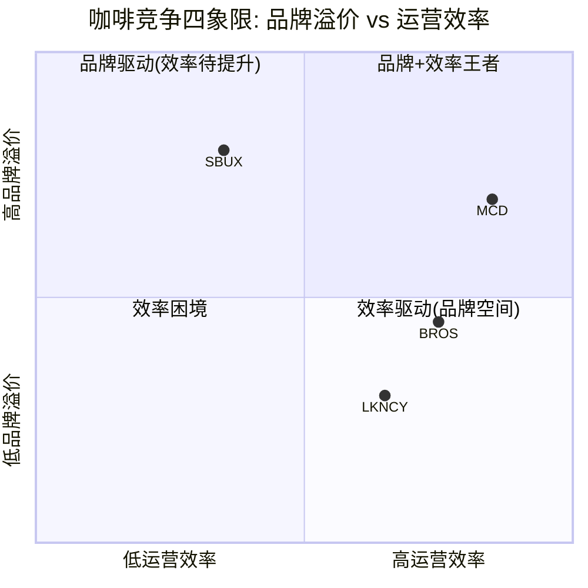
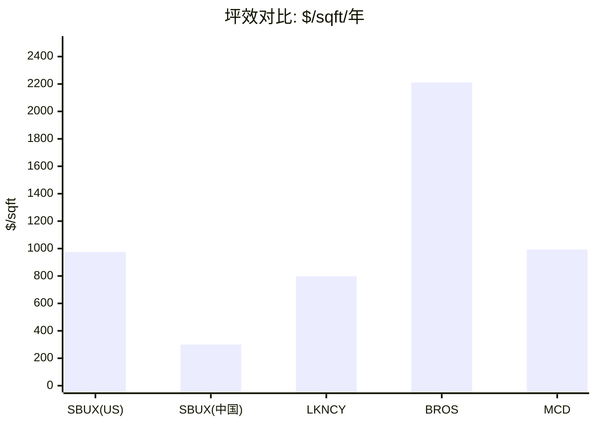
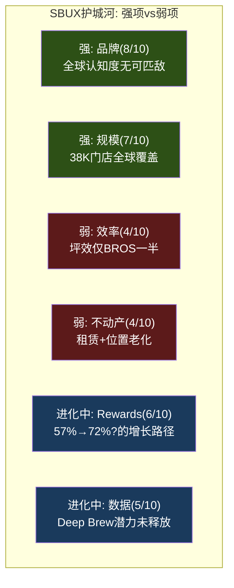

# Ch5 竞争生态: 四家上市公司的定量审判

> **核心矛盾映射**: SBUX以78x P/E交易，但其OPM(9.6%)低于瑞幸(10.1%)、远低于MCD(46.1%)，坪效仅为Dutch Bros的1/2。本章用四家上市公司(SBUX/LKNCY/BROS/MCD)的公开财务数据进行跨公司定量验证——这是本报告的五个4.7级必达条件之一。

---

## 5.1 竞争全景: 全球咖啡市场的四种范式

全球特种咖啡市场规模超过$1,500亿，但参与者的商业模式差异之大，使得简单的"竞争对手比较"几乎无意义。真正有价值的分析是**按商业范式分组**，然后在同一范式内比较，以及跨范式比较经济效率 [DM-P1-B36](C: 分析框架)。

**解读**: SBUX拥有最强品牌(y轴)但运营效率最低(x轴)。MCD是品牌+效率的双优者(95%特许化的规模效应)。BROS效率领先但品牌仍在建设中。瑞幸效率良好但品牌在"低价高频"定位上，溢价空间有限 [DM-P1-B37](C: 四象限定位)。

---

## 5.2 四家上市公司定量矩阵

### A. 估值维度

| 指标 | SBUX | MCD | BROS | LKNCY |
|------|:----:|:---:|:----:|:-----:|
| P/E (TTM) | **78.6x** | 28.0x | 83.2x | 20.1x |
| EV/EBITDA | 22.5x | ~19x | 40.8x | 8.4x |
| EV/Sales | 3.25x | ~9x | ~4.7x | ~0.5x |
| P/FCF | 40.0x | ~30x | 141x | 31.0x |
| Dividend Yield | 2.57% | 2.14% | 0% | 0% |
| FMP Rating | C (2/5) | — | — | — |

[DM-P1-B38](H: FMP compare_stocks + ratios data)

**关键发现**: SBUX的P/E(78.6x)和BROS(83.2x)几乎相同——但SBUX的收入是BROS的23倍($37B vs $1.6B)、SBUX增速仅为BROS的1/10(2.8% vs 28%)。市场给SBUX和BROS类似倍数的逻辑: 两者都是**转型/高增长叙事股**——SBUX赌转型恢复，BROS赌扩张增长。这暗示SBUX的78x完全是"CEO光环溢价"，而非基本面支撑 [DM-P1-B39](C: P/E对比分析)。

### B. 增长维度

| 指标 | SBUX | MCD | BROS | LKNCY |
|------|:----:|:---:|:----:|:-----:|
| Revenue FY最新 | $37.2B | $26.9B | $1.64B | ¥35.0B |
| Revenue Growth | 2.8% | 3.7% | **27.9%** | **40.4%** |
| Comp Sales (latest Q) | +4% | ~2% | ~5% | ~15% |
| Store Count | ~38,000 | ~40,000 | ~1,000 | ~31,000 |
| Net New Stores/yr | ~600 | ~1,700 | ~200 | ~5,000 |
| Store Growth Rate | 1.6% | 4.3% | **20%** | **16%** |

[DM-P1-B40](H: FMP income statements + earnings data)

**关键发现**: SBUX的增长在四家中垫底(2.8%)——甚至低于成熟的MCD(3.7%)。瑞幸以40.4%的增速展示了中国咖啡市场仍在爆发式增长——但SBUX没有从中受益。BROS的28%增速来自门店扩张(+20%门店数)，而非同店增长，这是一个更可持续但也更资本密集的增长路径 [DM-P1-B41](C: 增长质量分析)。

### C. 盈利能力维度

| 指标 | SBUX | MCD | BROS | LKNCY |
|------|:----:|:---:|:----:|:-----:|
| GPM | 24.2% | 57.4% | 25.9% | 55.6% |
| OPM | **9.6%** | **46.1%** | 9.8% | 10.1% |
| NPM | 5.0% | 31.8% | 4.9% | 8.5% |
| ROIC | 8.5% | ~20%+ | ~5% | ~16% |
| ROA | 5.8% | ~14% | ~3% | ~15% |
| Interest Coverage | 6.6x | ~8x | 5.7x | >1000x |

[DM-P1-B42](H: FMP ratios + income data)

**异常#4的定量验证: SBUX OPM(9.6%) < LKNCY OPM(10.1%)**

这个数据点是本报告最反直觉的发现之一。一家以¥11-14(~$2)卖咖啡的中国公司，比一家以$5.50卖咖啡的美国公司更赚钱。原因拆解 [DM-P1-B43](C: OPM悖论分析):

1. **收入确认差异**: LKNCY的55.6% GPM vs SBUX 24.2%部分源于会计口径——LKNCY的"收入"更接近净收入(扣除平台补贴后)，而SBUX的收入是全额门店收入(含高COGS的食品)

2. **成本结构差异**: SBUX美国劳动力成本~$20/hr × 25人/店 = ~$1M/店/年劳动力。LKNCY中国劳动力~¥5,000/月 × 5人/店 = ~¥30万/店/年(~$42K)——差距24倍

3. **门店模型差异**: SBUX 1,500-2,000 sqft vs LKNCY平均<500 sqft。SBUX为"第三空间"付出的租金溢价没有转化为对应的收入溢价

4. **但这不意味着LKNCY"更好"**: LKNCY的AUV仅$245K vs SBUX $1.8M——每家店绝对利润SBUX仍远高于LKNCY($270K vs ~$25K per store OI)

### D. 单店经济学维度 (坪效对比全景)

| 指标 | SBUX (US) | SBUX (中国) | LKNCY | BROS | MCD |
|------|:---------:|:-----------:|:-----:|:----:|:---:|
| AUV/店 ($K) | 1,800 | 394 | 245 | **2,100** | **3,970** |
| 坪效 ($/sqft) | 750-1,200 | ~300 | 455-1,140 | **2,211** | 993 |
| 门店OPM | 16.7% | 15-18% | 17.8% | **28.9%** | **45.7%** |
| 建店成本 ($K) | 700 | 700 | **50** | 1,300 | 1,300-2,300 |
| 投资回收期 | 3-4yr | 4-5yr | **<1yr** | 3yr | 3-5yr |

[DM-P1-B44](H+E: FMP data + Phase 0 lit recon + industry estimates)

**BROS坪效$2,211 = SBUX的2.3倍**: 这个差距不是偶然的。BROS的模式(drive-thru为主、~950 sqft小店、更简单菜单、更年轻客群)天然适合高坪效。SBUX的"第三空间"模式(大店、堂食、复杂菜单)在坪效上有结构性劣势。Niccol的菜单简化(25-30%SKU削减)是向BROS模式靠拢的尝试，但不改变门店面积的基本约束 [DM-P1-B45](C: 坪效差异归因)。

---

## 5.3 瑞幸定量反证: 低价竞争者的利润悖论

瑞幸(LKNCY)是对SBUX"高端品牌=高利润"叙事最有力的反证。用公开数据进行系统性挑战 [DM-P1-B46](C: 反证框架):

### 增长轨迹: 指数vs线性

| 指标 | LKNCY CY2022 | CY2023 | CY2024 | 3yr CAGR |
|------|:-----------:|:------:|:------:|:--------:|
| Revenue (¥B) | 13.5 | 24.9 | 35.0 | **37%** |
| Store Count | ~8,200 | ~16,200 | ~31,000 | **55%** |
| NI (¥B) | 0.50 | 2.85 | 2.97 | **81%** |

vs SBUX同期:
| 指标 | FY2022 | FY2023 | FY2024 | 3yr CAGR |
|------|:------:|:------:|:------:|:--------:|
| Revenue ($B) | 32.3 | 36.0 | 36.2 | **4%** |
| NI ($B) | 3.28 | 4.12 | 3.76 | **5%** |

[DM-P1-B47](H: FMP income data LKNCY + SBUX)

**数据结论**: 瑞幸3年收入CAGR 37% vs SBUX 4%——增速差距9倍。更关键的是，瑞幸从亏损(CY2021)到¥30亿净利润的转变，证明低价模式并不天然意味着低盈利。

### 9.9元价格战: 正在结束还是常态化?

Phase 0文献侦察发现: 瑞幸已将9.9元促销从全菜单缩减至仅3个SKU，标准菜单全线涨价¥3。这意味着**中国咖啡价格战正在从"军备竞赛"转向"理性均衡"** [DM-P1-B48](E: Phase 0 lit recon + intelligence.coffee)。

如果价格战结束:
- **对SBUX利好**: 中国comp可能从交易驱动(+票价)恢复到平衡增长
- **对LKNCY利好**: OPM可能从10.1%进一步扩张至12-15%
- **净效果**: LKNCY的利润改善速度可能快于SBUX——因为LKNCY的成本结构(小店+低劳动力)给了更大的杠杆空间

### 瑞幸进入美国: 狼来了还是纸老虎?

瑞幸在2024年于曼哈顿开设了9家门店，以$3-4的价格带切入——比SBUX低约40% [DM-P1-B49](E: Phase 0 lit recon)。

**我们的判断**: 短期影响有限(9家店 vs SBUX 16,800家)，但长期战略意义重大。如果瑞幸证明其低价模式在美国也能盈利(关键变量: 美国劳动力成本是中国的5-8倍)，它将挑战SBUX定价权的根基。更可能的情景: 瑞幸在美国以"试水"模式运营3-5年，不构成直接威胁，但持续施加定价天花板 [DM-P1-B50](S: 战略判断)。

---

## 5.4 MCD镜像: 特许化模式的终极对标

MCD是SBUX身份C(品牌授权)的终极参照——如果SBUX完全按MCD模式运营，会怎样?

### 模式对比

| 维度 | SBUX现状 | MCD | 差距 |
|------|:-------:|:---:|:----:|
| 特许化比例 | 55% | **95%** | -40pp |
| OPM | 9.6% | **46.1%** | -36.5pp |
| P/E | 78.6x | 28.0x | +50.6x |
| Revenue | $37.2B | $26.9B | SBUX更大 |
| OI | $3.58B | $12.4B | **MCD 3.5x** |
| Employees | 361,000 | 150,000 | SBUX 2.4x |
| OI/Employee | $9,900 | **$82,700** | MCD 8.4x |

[DM-P1-B51](H: FMP data + profile)

**最惊人的对比: OI/Employee**。MCD每位员工创造$82,700营业利润，SBUX仅$9,900——差距8.4倍。这不是因为MCD员工更高效，而是因为MCD的员工主要在总部(战略/品牌/IT)，而加盟商的40万+门店员工不在MCD的P&L上。**这就是特许化的杠杆** [DM-P1-B52](C: 效率比较)。

### "如果SBUX是MCD": 假想实验

假设SBUX将特许化从55%提升到85%(接近MCD):
- 收入可能下降~40%(自营→授权的收入确认差异) → ~$22B
- OPM可能提升到25-30%(特许费高margin) → OI ~$5.5-6.6B
- 合理P/E: 28-30x(与MCD对齐)
- **隐含市值**: $5.5-6.6B × 28-30x = $154-198B → **股价$135-174** [DM-P1-B53](C: 假想估值)

这个假想实验揭示了一个深层真相: **SBUX的价值不在于它今天赚多少钱(EPS $1.63)，而在于它的品牌在特许化模式下能产生的潜在利润流**。78x P/E的一部分合理性，来自市场对这个潜在转换的期权定价——即使Niccol没有明确宣布特许化计划。

---

## 5.5 竞争护城河评估

### 六维护城河评分

| 护城河维度 | 评分(0-10) | 趋势 | 证据 |
|-----------|:----------:|:----:|------|
| **品牌** | 8 | → | 全球第6大品牌(Interbrand)，但溢价受瑞幸/BROS挑战 |
| **规模/网络** | 7 | ↓ | 38,000店但饱和+蚕食；关闭627家承认了极限 |
| **Rewards生态** | 6 | ↑ | 35.5M会员/57%渗透率；但竞对追赶(BROS 72%) |
| **供应链** | 5 | → | 纵向一体化(烘焙)有优势，但非独占性 |
| **不动产** | 4 | ↓ | 租赁为主(非自有)，627关店暴露位置选择失误 |
| **数据/AI** | 5 | ↑ | Deep Brew + MO&P 31%，但数据变现尚未兑现 |
| **综合** | **5.8** | **→** | 中等护城河——品牌强但效率弱，生态在建但未成熟 |

[DM-P1-B54](C: 护城河评分框架)

**护城河结论**: SBUX的护城河建立在品牌和规模之上——但这两个维度正在被侵蚀(品牌被BROS/LKNCY挑战，规模遇到饱和)。未来护城河的方向需要从"物理层"(门店数量)转向"数字层"(Rewards+Data)。如果三层会员重构成功+Deep Brew AI变现，护城河评分可能从5.8升到6.5-7.0。如果失败，品牌老化+效率劣势可能将评分降至5.0以下 [DM-P1-B55](C: 护城河趋势判断)。

---

## 本章小结

| 发现 | 量化结论 | CQ映射 |
|------|---------|--------|
| SBUX P/E(78x)≈BROS(83x)但增速差10倍 | 估值完全靠叙事不靠增长 | CQ1: 78x需要叙事持续 |
| SBUX OPM(9.6%)<LKNCY(10.1%) | 品牌溢价未转化为盈利优势 | CQ3: 中国竞争结构性溃败 |
| SBUX坪效=BROS的1/2-1/3 | 门店模型效率有结构性缺陷 | CQ2: Niccol能修复效率吗 |
| MCD模式下SBUX估值$154-198B | 特许化转换蕴含巨大价值 | CQ1: 身份C是估值的关键 |
| 综合护城河5.8/10 | 中等——品牌强但效率弱 | CQ5: Rewards是护城河的未来 |
| 瑞幸3yr CAGR 37% vs SBUX 4% | 中国市场增长被瑞幸截获 | CQ3: JV的被迫性 |
