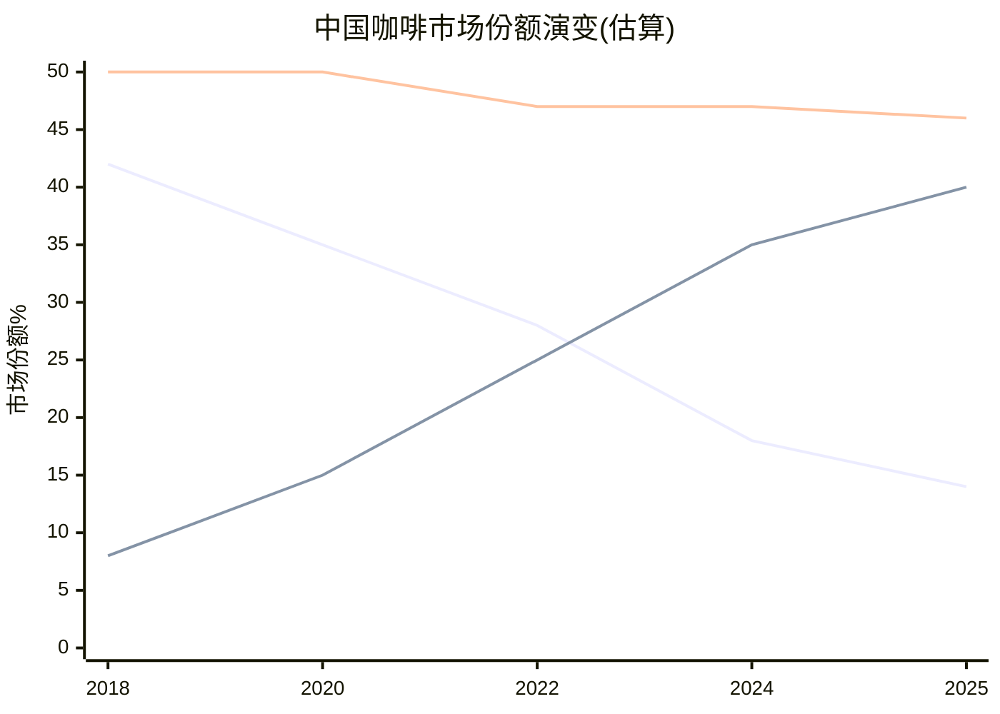

# Ch6 中国JV深度拆解: $4B的真相

> **核心矛盾映射**: CQ3(中国JV是战略撤退还是价值解锁?)的完整解答。SBUX将其中国业务的60%以$4B出售给Boyu Capital——同时声称"总价值超过$13B"。本章将拆解这笔交易的每一个数字，判断它到底是一次精明的资产配置，还是一次被包装成胜利的撤退。

---

## 6.1 交易解剖: $4B → $13B的数学魔术

### 交易结构

2025年11月3日，Starbucks宣布与博裕资本(Boyu Capital)组建合资公司，运营中国零售业务 [DM-P1-C01](H: Nov 2025 8-K Filing):

| 条款 | 内容 |
|------|------|
| 买方 | Boyu Capital (最高60%) |
| 卖方保留 | SBUX 40% + 品牌IP + 许可权 |
| 企业价值 | ~$4B (cash-free, debt-free) |
| SBUX获得 | ~$2.4B现金(60%×$4B) + 40%权益 + 许可费流 |
| 预计交割 | Q2 FY2026 (2026年春) |
| 潜在共同投资人 | 腾讯、GIC(新加坡主权基金) |

### 挑战$13B"总价值"

SBUX在公告中声称中国业务"总价值超过$13B"。拆解这个数字 [DM-P1-C02](C: 估值拆解):

| 组成部分 | SBUX声称值 | 独立验证 |
|---------|:--------:|:-------:|
| JV企业价值(100%) | $4.0B | $4.0B (市场成交价) |
| SBUX保留40%权益 | ~$1.6B(面值) | $1.6B (按EV比例) |
| 许可费NPV(SBUX声称) | **~$9.0B** | **$1.5-3.0B** |
| **SBUX总价值声称** | **>$13B** | **$7.1-8.6B** |

**关键分歧在许可费NPV**。SBUX声称$9B+，但这需要假设:
- 许可费率~15-20% of revenue → 不合理(QSR标准4-6%)
- 或: 极低折现率(3-4%) + 超长期限(>20年) + 高增长(8%+ CAGR)

**我们的测算** [DM-P1-C03](C: 许可费NPV计算):
- 假设royalty rate 5%(QSR中位数)
- 中国JV收入基础$3.1B，假设5% CAGR → FY2035 $5.1B
- 年许可费: $155M(FY2026) → $253M(FY2035)
- 10年NPV(8%折现): **~$1.5B**
- 永续假设: ~$3.0B(极度乐观)

**结论**: $13B中约$5-6B($9B - $3B)是SBUX的叙事膨胀。合理的"总价值"约$7-9B——仍然是一笔不错的交易，但没有SBUX暗示的那么惊艳 [DM-P1-C04](C: 总价值验证)。

---

## 6.2 Boyu Capital: 为什么是他们?

### 博裕的独特价值

Boyu Capital不是一家普通的PE基金——它是中国政治生态中具有特殊地位的投资机构 [DM-P1-C05](E: Phase 0 Agent research):

| 维度 | 详情 |
|------|------|
| 创立 | 2010年，香港 |
| 创始人 | 江志成(Alvin Jiang)——**江泽民之孙** |
| AUM | ~$400亿 |
| 第五只美元基金(2021) | $68亿——中国独立管理人最大 |
| 历史IRR | >25%(远超亚洲PE平均~15%) |
| 代表投资 | 阿里巴巴(IPO前)、蚂蚁集团、中国信达、SKP奢侈品百货 |

**选择Boyu的深层逻辑**: SBUX不仅需要一个出钱的买家——它需要一个**能在中国监管环境中护航**的合作伙伴。在中美关系持续紧张的背景下，与"太子党"关联基金合作是一种政治保险: Boyu的政治资本可以帮助JV在中国监管审批中顺利通过，也可以在未来的政策风险(如外资准入限制收紧)中提供缓冲 [DM-P1-C06](S: 政治分析)。

腾讯和GIC作为潜在共同投资人进一步强化了这个"政治+资本联盟": 腾讯提供微信支付/小程序生态整合，GIC提供长期耐心资本 [DM-P1-C07](E: Bloomberg报道)。

---

## 6.3 竞争终局: 星巴克 vs 瑞幸的不可逆差距

### 市场份额崩塌: 42% → 14%

[DM-P1-C08](E: 行业估算，基于门店数和AUV推算)

SBUX在中国的市场份额从2018年的~42%暴跌至2025年的~14%——这不是一个可以"反转"的暂时挫折，而是一场**结构性溃败** [DM-P1-C09](C: 份额趋势分析)。

**为什么不可逆**:
1. **密度差距不可追赶**: 瑞幸31,048店 vs SBUX 8,011 = 密度差3.9x。即使JV目标20,000店，仍只是瑞幸当前的65%
2. **价格带锁死**: SBUX ¥47 vs 瑞幸 ¥11-14。如果SBUX降价——品牌贬值; 如果不降——份额继续流失
3. **成本结构天花板**: SBUX建店$700K vs 瑞幸$50K。在同等资本投入下，瑞幸可以开14倍的门店
4. **消费者代际转移**: 中国Z世代将瑞幸视为"默认咖啡品牌"，SBUX被视为"父母辈的选择"

### Comp Sales解剖: 交易量恢复但票价持续失血

中国comp sales的恢复模式揭示了一个危险的信号 [DM-P1-C10](H: SBUX Quarterly Earnings):

| 季度 | Comp | 交易量 | 客单价 | 解读 |
|------|:----:|:-----:|:-----:|------|
| Q4 FY24 | -14% | -6% | **-8%** | 价格战最惨烈 |
| Q1 FY25 | -6% | -2% | -4% | 开始企稳 |
| Q4 FY25 | +2% | **+9%** | **-7%** | 交易量反弹但票价加速下跌 |
| Q1 FY26 | +7% | +5% | — | 管理层不再披露ticket |

**Q4 FY2025的交易量+9%背后是客单价-7%**: 这意味着更多人来了，但每人花的钱更少。这是"以价换量"的典型信号——SBUX可能在通过变相降价(更多促销、更小杯量、更多入门级产品)来驱动traffic。如果ticket持续下跌，comp sales的正增长是不可持续的 [DM-P1-C11](C: comp分解分析)。

---

## 6.4 Deconsolidation的财务影响

### 资产负债表一夜重构

Q1 FY2026(2025年12月28日)的资产负债表已经反映了中国JV的deconsolidation [DM-P1-C12](H: Q1 FY2026 10-Q Balance Sheet):

| 项目 | FY2025 (Q4) | Q1 FY2026 | 变化 | 原因 |
|------|:----------:|:---------:|:----:|------|
| Goodwill | $3.37B | $1.31B | **-$2.06B** | 中国GW移除 |
| PP&E | $17.8B | $15.6B | **-$2.2B** | 中国门店资产 |
| Total Debt | $26.6B | $33.5B | **+$6.9B** | 债务重组+JV对价 |
| Deferred Rev(non-current) | $5.77B | $5.75B | -$0.02B | 几乎不变 |

**收入影响**: 从FY2026 Q2开始，中国约$3.1B收入将不再出现在top line → 同比收入增长率自动承压~8% [DM-P1-C13](C: 收入影响计算)。

**利润影响**: 管理层指引OPM +40bps(因为中国OPM低于合并平均), EPS -$0.02-0.03 [DM-P1-C14](H: Q1 FY2026 Earnings Call)。

### QSR中国交易对标: SBUX排名垫底

| 交易 | EV/Store | EV/Revenue | 后续表现 |
|------|:--------:|:----------:|---------|
| YUM China IPO (2016) | **$1.3M** | 1.4x | 股价+72% (9年) |
| MCD/CITIC-Carlyle (2017) | **$1.0M** | 1.0x | Carlyle 3x回报(6年) |
| **SBUX/Boyu (2025)** | **$500K** | 1.3x | TBD |

[DM-P1-C15](H+E: Phase 0 Agent research)

SBUX的$500K/store是三笔交易中最低的。这反映了瑞幸对中国咖啡市场竞争结构的根本性改变——SBUX在中国的门店价值已被瑞幸的规模优势大幅侵蚀。

---

## 6.5 对CQ3的Phase 1判断

**中国$4B JV是战略撤退还是价值解锁?**

我们的判断: **有面子的战略撤退，附带真实的财务优化** [DM-P1-C16](C: CQ3初步闭合)。

| 维度 | "战略撤退"证据 | "价值解锁"证据 |
|------|--------------|--------------|
| 估值 | $500K/store=QSR最低 | EV/Rev 1.3x在合理区间 |
| 竞争 | 份额42%→14%不可逆 | 退出运营风险，保留品牌价值 |
| 叙事 | "$13B"包含$5B+叙事膨胀 | 40%权益+许可费=长期参与 |
| 财务 | 收入减$3.1B(-8%) | OPM +40bps, International margin→20%+ |
| 战略 | 承认无法与瑞幸竞争 | 释放管理层精力聚焦US转型 |

**CQ3置信度更新**: 从P0的55%提升至**65%**——JV更偏向"体面撤退"，但财务优化确实存在(OPM改善是真实的)。

---

## 本章小结

| 发现 | 量化结论 | CQ映射 |
|------|---------|--------|
| $13B声称中~$5B是叙事膨胀 | 合理总价值$7-9B(非$13B) | CQ3: 管理层叙事需折扣 |
| $500K/store = QSR中国最低 | 瑞幸竞争摧毁门店价值 | CQ3: 结构性撤退 |
| 交易量+9%但票价-7% | "以价换量"不可持续 | CQ3: 有机恢复存疑 |
| Boyu政治连接=监管保险 | 选择有政治逻辑 | CQ3: 合作伙伴选择正确 |
| OPM +40bps是真实的优化 | 特许化模式确实更轻 | CQ1: 身份C转型的第一步 |
