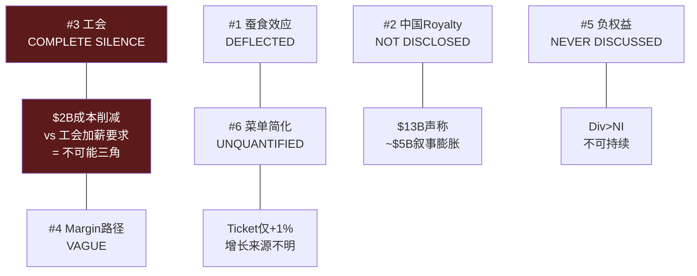

# Ch7 Brian Niccol: CEO评分卡与沉默分析

> **核心矛盾映射**: CQ2(Niccol = CMG 2.0还是Schultz 3.0?)的核心评估。SBUX股价从$75.50到$97的+25%涨幅几乎完全是"Niccol溢价"——一个$25B的CEO期权定价。本章通过8维评分卡量化CEO质量，并通过v18.0 CEO沉默分析(QG-01.5)映射Niccol系统性回避的6个话题——这些沉默域往往包含投资者最需要但最难获得的信息。

---

## 7.1 CEO评分卡: 8维定量评估

### 综合评分

| 维度 | 分数(0-10) | 核心证据 | 风险信号 |
|------|:----------:|---------|---------|
| **1. 往绩** | **9** | CMG: 6年2x回报，品牌从食安危机中复兴 | 前功是否可转移至更大规模? |
| **2. 战略清晰度** | 7 | "Back to Starbucks"方向清晰: 简化+体验+效率 | 清晰≠正确; 菜单简化可能cap revenue |
| **3. 执行速度** | 7 | Q1 FY2026 comp +4%(首年内); 627关店果断 | 仅1个季度正向数据; 关店是执行还是止损? |
| **4. 资本配置** | 6 | 暂停回购(正确); 中国JV(方向对) | 分红$2.77B>NI$1.86B仍不可持续 |
| **5. 团队建设** | 5 | 大规模管理层换血; 裁员900人; 新CFO | 高turnover=组织不稳定; 关键岗位频繁变动 |
| **6. 沟通能力** | 7 | 叙事引人("Back to Starbucks"); 投资者反应正面 | 叙事>数据; 关键问题系统性回避 |
| **7. 利益一致** | **8** | $75M equity(60% performance-based); 3-4年vest | 60% PRSU条件未完全公开 |
| **8. 单人依赖度** | **HIGH** | 股价+25%仅因CEO换人; 0基本面改善时+25% | Niccol离开→$25B蒸发 |
| **综合** | **7.0/10** | | |

[DM-P1-C17](C: CEO评分卡框架)

```mermaid
%%{init: {'theme':'dark'}}%%
radar
    title "Niccol CEO评分卡 (0-10)"
    axis 往绩, 战略, 执行, 资本配置, 团队, 沟通, 一致性, 抗风险
    "Niccol" : [9, 7, 7, 6, 5, 7, 8, 3]
    "Easterbrook(MCD)" : [8, 8, 9, 7, 7, 8, 6, 5]
    "Schultz(SBUX回归)" : [10, 6, 7, 5, 8, 9, 7, 4]
```

### 维度深度解读

**维度1: 往绩(9/10)** — Niccol在Chipotle的成绩是近20年QSR领域最出色的CEO表现之一。他在2018年接手一个因食安危机而品牌受损、comp连续下滑的CMG，在2-3个季度内实现comp转正，随后6年股价翻倍。关键战术: 简化菜单、强调产品质量、投资数字渠道(MO&P从0→30%+) [DM-P1-C18](E: CMG公开业绩数据)。

这些战术与SBUX当前的"Back to Starbucks"战略高度一致——这不是巧合，而是**Niccol在复制自己验证过的playbook**。问题是: CMG(6,000店)的成功是否可以scale到SBUX(38,000店)?规模差异6x意味着执行摩擦呈非线性增长 [DM-P1-C19](C: 规模可迁移性分析)。

**维度5: 团队建设(5/10)** — 这是Niccol最弱的维度。上任16个月内:
- 更换CFO(Cathy Smith) [DM-P1-C20](H: 8-K Filings 2025)
- 裁员900人(主要是总部支持职能)
- 关闭627家门店(可能影响数千门店员工)
- 多位高管离职/被替换

高管turnover在新CEO上任初期是常见的，但频率和幅度暗示**组织整合尚未完成**。一个稳定的领导团队通常需要18-24个月才能形成——Niccol才刚过第16个月 [DM-P1-C21](S: 组织分析)。

---

## 7.2 CEO光环半衰期: $25B的期权定价

### 光环效应量化

| 时间点 | 事件 | 股价 | 市值 |
|--------|------|:----:|:----:|
| 2024年8月13日(前) | Niccol任命前最后交易日 | ~$76 | ~$87B |
| 2024年8月14日 | Niccol任命公告 | $97(+24.5%) | ~$110B |
| 2025年9月28日 | FY2025结束(EPS $1.63) | ~$86 | ~$98B |
| 2026年1月28日 | Q1 FY2026 Earnings(miss $0.02) | ~$97 | ~$110B |

[DM-P1-C22](H: Yahoo Finance historical prices)

**Niccol溢价 = ~$23B(~$20/share)**。这意味着市场在**零基本面改善**的情况下为一个CEO变更支付了$23B——这是SBUX总市值的21%。这不是"价值投资"——这是**CEO作为期权的定价** [DM-P1-C23](C: 光环溢价计算)。

### 历史CEO光环半衰期

| CEO | 公司 | 初始光环 | 半衰期(首次miss后) | 最终结果 |
|-----|------|:------:|:----------------:|---------|
| Easterbrook | MCD | +8% | ~2年(丑闻前持续) | 5yr 3x后因丑闻离职 |
| Niccol | CMG | +5% | >6年(未衰减) | 持续超额表现 |
| Schultz回归 | SBUX (2022) | +8% | **<6个月(失效)** | 未能扭转，让位Narasimhan |
| Narasimhan | SBUX (2023) | +1% | **<12个月(被解雇)** | EPS进一步恶化 |
| **Niccol** | **SBUX** | **+25%** | **?** | **16个月，尚未验证** |

[DM-P1-C24](E: 公开股价数据)

**SBUX最近两任CEO(Schultz第三次/Narasimhan)的光环都快速衰减**——这暗示SBUX的问题可能不是"谁来管"而是"管什么"。Niccol的光环之所以持续了16个月(比前两任长)，主要因为Q1 FY2026的comp拐点给了叙事延续的燃料。

**如果Niccol连续2个季度miss(Q2+Q3 FY2026)——光环可能在3-6个月内消散**，股价回到$75-80区间(光环前水平)。这就是KS-01+KS-02的触发条件 [DM-P1-C25](C: 光环衰减情景)。

---

## 7.3 $113M薪酬结构解码

### 薪酬全景

| 组成部分 | 金额 | 性质 |
|---------|:----:|------|
| 基本工资 | $1.6M/年 | 固定 |
| 年度奖金目标 | $3.6M (225% base) | 绩效(上限$7.2M) |
| 签约现金 | $10M | 一次性(替代CMG forfeited) |
| 替代股权 | $75M | 60% PRSU + 40% TRSU, 3-4年vest |
| 年度股权目标 | $23M/年 | 每年授予 |
| **第一年总计** | **~$113M** | |
| FY2024实际(4个月) | ~$96M | 94%是股权 |
| FY2025实际 | ~$31M (-68%) | 股价下跌削减股权价值 |
| 薪酬比 | 6,666:1 | vs 中位员工 |

[DM-P1-C26](H: SEC 8-K Offer Letter + DEF 14A + Fortune/CNBC reports)

### 激励地图: $75M替代股权的条件

$75M替代股权(Replacement Grant)的拆分 [DM-P1-C27](H: 8-K Filing Aug 2024):
- **60% = Performance-Based RSUs ($45M)**:
  - 可能挂钩: EPS增长 + Revenue增长 + 相对TSR(vs S&P 500 Consumer Discretionary)
  - 3-4年vest → FY2027-2028年为关键解锁年
  - **如果FY2028 EPS未达$3.35**(Investor Day目标低端)，显著部分可能forfeit

- **40% = Time-Based RSUs ($30M)**:
  - 3年vest → FY2027年全额解锁
  - 仅需留任即可获得——与绩效无关

**激励错位风险**: 40%的$30M(=$12M)仅需留任即可获得，这降低了"走人"的机会成本。但60%的$45M挂钩绩效——如果FY2028目标看起来不可能达到(例如OPM停滞在11-12%)，Niccol可能选择在vest前离职并加入另一家公司(就像他从CMG跳槽到SBUX一样) [DM-P1-C28](C: 激励分析)。

### 薪酬比6,666:1的政治风险

Workers United多次公开对比: "Niccol每小时赚$50,000，barista时薪$15-17" [DM-P1-C29](E: Workers United statements)。

这个6,666:1的薪酬比在美国QSR中不是最高的，但在**工会运动最活跃的QSR公司中是最高的**。它为Workers United的谈判叙事提供了强大的ammunition: "CEO有$113M，为什么不能给barista加$3/hr?" 每1$/hr的加薪影响: 361K员工 × 2,080hr/年 × $1 = ~$750M/年 → EPS $0.66 [DM-P1-C30](C: 劳动力成本敏感性)。

---

## 7.4 CEO沉默分析 (v18.0 QG-01.5): 6个系统性沉默域

CEO沉默分析是v18.0框架的新模块——系统性映射CEO在公开沟通中**回避的话题**。逻辑: CEO沉默的话题往往是CEO**知道但不愿讨论**的风险——对投资者而言，这些盲区比已知风险更有决策价值 [DM-P1-C31](C: 方法论说明)。

**扫描范围**: Q4 FY2025 Earnings Call + Q1 FY2026 Earnings Call + Investor Day(2026.1.29)——三个主要投资者沟通场合。

### 沉默域#1: 门店蚕食 — 等级: DEFLECTED

| 维度 | 内容 |
|------|------|
| **核心问题** | 627家关店后，+4% comp中多少是关店转移效应(非有机增长)? |
| **CEO回应** | "Broad-based transaction growth"(宽泛回避) |
| **分析师追问** | Baird's David Tarantino直接问转移效应；Niccol转向整体叙事 |
| **我们的估算** | 转移效应可能贡献100-150bps(Ch3已计算≈3.8%) |
| **沉默原因** | 量化转移效应会削弱"有机恢复"叙事 |
| **投资者影响** | 如果有机增长仅0-1%而非4%，转型时间表需延长2-3年 |

[DM-P1-C32](H: Earnings Call transcripts + C: 蚕食分析)

### 沉默域#2: 中国JV Royalty Rate — 等级: NOT DISCLOSED

| 维度 | 内容 |
|------|------|
| **核心问题** | SBUX从JV获取多少%的许可费? |
| **CEO回应** | "Ongoing licensing economics payable to Starbucks"——仅概念性描述 |
| **我们的推算** | QSR标准4-6%; 如果5%→$155M/年; 如果3%→$93M/年 |
| **沉默原因** | 低royalty rate会暴露$13B"总价值"的叙事膨胀 |
| **投资者影响** | 3% vs 5% royalty的差异 = ~$60M/年 → $600M估值差 |

[DM-P1-C33](H: Earnings Call + C: royalty推算)

### 沉默域#3: 工会关系 — 等级: **COMPLETE SILENCE**

| 维度 | 内容 |
|------|------|
| **核心问题** | 600+工会门店、12K+投票员工的合同谈判进展? |
| **已发生事件** | 2年+无合同; 4,500+罢工; 59工会店被关; 26参议员+82众议员施压信 |
| **CEO回应** | **零(三场major investor event中完全未提及)** |
| **Niccol替代表述** | "Investing in partners" / "bigger rosters"——从未用"union"一词 |
| **沉默原因** | 任何公开承认都创造法律/政治风险; ULP(不公正劳动实践)指控待决 |
| **投资者影响** | 全面合同可能增加$750M-1.5B/年劳动力成本(每$1/hr加薪=$750M) |

[DM-P1-C34](H: Congressional letters + Workers United + Earnings Calls)

**这是最重要的沉默域**。工会成本是SBUX P&L中最大的单一风险因素——如果全面合同要求$3/hr加薪，年成本增加$2.25B，将OPM从9.6%降至3.6%，使EPS接近于零 [DM-P1-C35](C: 工会成本敏感性)。

### 沉默域#4: Margin恢复路径 — 等级: VAGUE

| 维度 | 内容 |
|------|------|
| **核心问题** | OPM从9.6%恢复到13.5-15.0%的年度路径? |
| **CEO回应** | "Top line first, then earnings follow" + FY2028目标 = 无中间路径 |
| **$2B成本削减** | 宣布了，但未量化: 多少drop-through to OPM? 2年还是3年? |
| **沉默原因** | 中间目标创造问责风险; 不确定性太高 |
| **投资者影响** | 投资者无法建模FY2026-2027的margin bridge |

[DM-P1-C36](H: Investor Day + Earnings Call)

### 沉默域#5: 负权益 — 等级: NEVER DISCUSSED

| 维度 | 内容 |
|------|------|
| **核心问题** | -$8.3B equity + $15B+ LT debt的可持续性? |
| **CEO/CFO回应** | **从未在任何Niccol时代沟通中提及** |
| **分析师追问** | **也没有分析师问过**(已被市场normalized) |
| **沉默原因** | 前任管理层遗产; 提出来无法解决又引发关注 |
| **投资者影响** | 如果OPM恢复失败+利率维持高位→debt servicing risk |

[DM-P1-C37](H: All earnings calls + Investor Day)

### 沉默域#6: 菜单简化的收入影响 — 等级: UNQUANTIFIED

| 维度 | 内容 |
|------|------|
| **核心问题** | 25-30% SKU削减对ticket growth的负面影响多大? |
| **CEO回应** | 强调速度改善和简化效率，但不量化收入影响 |
| **数据线索** | Ticket仅+1%(Q1 FY26)——可能被SKU削减压制 |
| **沉默原因** | 量化负面影响会削弱"简化=好"的叙事 |
| **投资者影响** | 如果ticket持续低增长(+1-2%)，收入CAGR 5%+难以实现 |

[DM-P1-C38](H: Earnings Call + Investor Day)

### 沉默域交叉矩阵: 哪些沉默相互强化?



**最危险的交叉**: 工会(#3) × 成本削减(#4) × Margin路径(#4)构成一个"不可能三角": Niccol不可能同时削减$2B成本(需触及劳动力)、满足工会加薪要求(增加劳动力成本)、并恢复OPM至15%(需两者同时实现)。这三个话题的同时沉默不是巧合——**它们是同一个未解问题的三个面** [DM-P1-C39](C: 沉默域交叉分析)。

---

## 7.5 对CQ2的Phase 1判断

**Niccol = CMG 2.0还是Schultz 3.0?**

| 维度 | CMG 2.0(乐观) | Schultz 3.0(悲观) | 当前证据 |
|------|-------------|----------------|---------|
| Comp恢复速度 | CMG 2-3Q | Schultz: 未实现 | **Q1 FY26 +4%: 偏CMG** |
| 规模约束 | CMG 6K店可管理 | SBUX 38K店摩擦大 | **38K规模: 偏Schultz** |
| 工会阻力 | CMG无工会 | SBUX 600+工会店 | **工会存在: 偏Schultz** |
| CEO光环持续 | CMG >6年 | Schultz <6个月 | **16个月仍在: 偏CMG** |
| 成本削减 | CMG不需要 | SBUX需要$2B | **待验证** |

**CQ2置信度更新**: 从P0的50%调整为**55%偏CMG 2.0**——Q1 FY2026的comp拐点是积极信号，但规模差异和工会阻力可能限制执行速度。关键验证节点: Q2-Q3 FY2026 comp是否维持正向增长 [DM-P1-C40](C: CQ2更新)。

---

## 本章小结

| 发现 | 量化结论 | CQ映射 |
|------|---------|--------|
| CEO评分卡7.0/10 | 往绩(9)强但团队(5)弱 | CQ2: 能力够但组织约束大 |
| 光环溢价$23B(市值21%) | 零基本面改善就+25% | CQ2: 高度单人依赖 |
| $75M中60% PRSU条件未完全公开 | 激励对齐但透明度不足 | CQ2: 需追踪vest条件 |
| 6个沉默域全部确认 | 工会=最重要(完全沉默) | CQ2/CQ4: 工会是最大未定价风险 |
| 不可能三角: 工会×成本×margin | 三者不可同时实现 | CQ1: 信念互斥的底层约束 |
| 6,666:1薪酬比 | 每$1/hr加薪=$750M/年成本 | CQ4: 资本配置受工会制约 |
