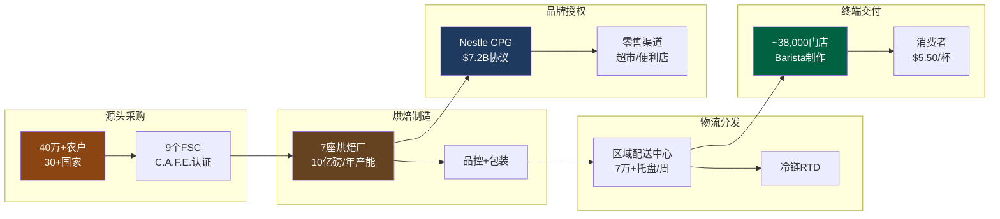
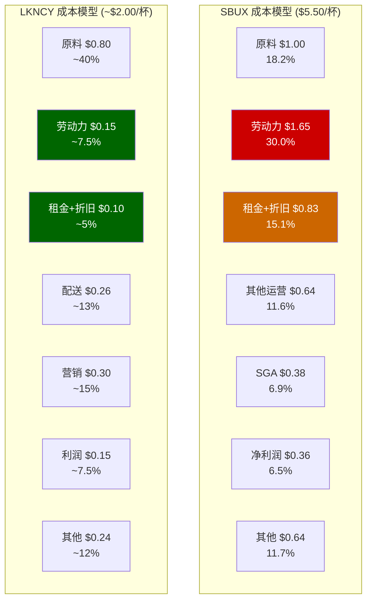
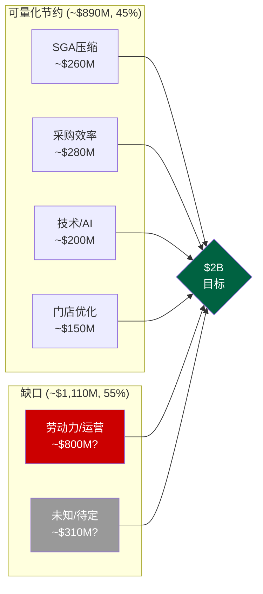

# 第八章 产业链与供应链: 从种植园到咖啡杯的$5.50解剖

> **核心发现**: SBUX的供应链故事表面上是咖啡豆→杯的线性传递，实质上是一个**成本结构被多重因素同时挤压**的系统性问题。Arabica期货从FY2021的~$1.50/lb飙升至2025年初$4.39/lb历史高位(+193%)，叠加劳动力通胀(~$20/hr工会压力)和乳制品成本+40%，GPM从FY2021的28.9%压缩至FY2025的24.2%——470bps的侵蚀并非周期性波动，而是结构性重定价。更深层的矛盾在于: 瑞幸(LKNCY)以GPM 56-60%证明了咖啡零售存在完全不同的成本曲线，SBUX的"第三空间"溢价正被证明是一种**成本负担而非差异化资产**。

---

## 8.1 咖啡豆→杯的完整价值链

### 8.1.1 源头采购: 从种植园到生豆仓库

SBUX的咖啡供应链始于全球三大洲超过30个国家的40万+农户 [DM-P1-D01]。核心采购来源集中在拉丁美洲(巴西、哥伦比亚、危地马拉)、非洲(埃塞俄比亚、肯尼亚)和亚太(印度尼西亚苏门答腊、中国云南)。SBUX不直接拥有大规模种植园(仅有两个实验性农场用于研发)，而是通过C.A.F.E. Practices(Coffee and Farmer Equity)认证体系构建了一个准垂直整合的采购网络 [DM-P1-D02]。

C.A.F.E. Practices由SBUX与Conservation International于2004年联合开发，覆盖四个维度: 产品质量、经济透明度、社会责任和环境领导力。截至2025年，SBUX宣称其采购的咖啡中超过98%符合C.A.F.E. Practices或其他公平贸易标准。这一体系的真正价值不在于道德溢价的营销叙事，而在于**供应链可追溯性带来的质量控制和风险缓释**——当Arabica期货暴涨时，SBUX通过与产地农户的长期直接贸易关系(非期货市场投机)锁定部分供应。

全球九个Farmer Support Center(FSC)是这一网络的关键节点。其中尤为值得关注的是**云南普洱FSC**——成立于2012年，是SBUX在亚洲的第一个FSC，团队从最初1人扩展至28人，累计为超过3万名当地农户提供免费农艺培训 [DM-P1-D03]。在中国JV交易(2025年Q1生效)中，SBUX明确保留了云南FSC和昆山咖啡创新产业园的所有权——这一安排具有深远的战略含义: 即便运营层面部分交给Boyu Capital，供应链源头的控制权仍牢牢握在SBUX手中。

### 8.1.2 烘焙与制造: 区域化产能布局

生豆经过品质筛选后运往SBUX全球七大烘焙工厂(美国五座、荷兰一座、中国昆山一座)，年合计产能超过10亿磅(约45万吨)咖啡 [DM-P1-D04]。区域化烘焙布局的核心逻辑是**最小化烘焙后运输时间**——新鲜烘焙的咖啡豆最佳风味窗口约为2-4周，跨洲运输会严重降低品质。

中国昆山咖啡创新产业园于2023年投产，是SBUX在亚太地区最大的烘焙与分发中心。这座投资约$1.3B的设施不仅承担烘焙功能，还集成了品控实验室、包装线和区域物流枢纽。根据SBUX披露，区域化烘焙产能的建立使跨洲运输成本降低了约12%/磅，每年释放约$1.5亿用于再投资 [DM-P1-D05]。

烘焙环节是SBUX价值链中少数具有明确**规模经济优势**的节点: 10亿磅产能对应约$37B营收，生豆采购+烘焙的单位成本被规模摊薄至行业领先水平。但这一优势正在被Arabica价格飙升部分抵消——当原料成本翻倍时，即使单位加工成本不变，总成本的绝对值仍然大幅上升。

### 8.1.3 分发与物流: 最后一英里效率

烘焙后的咖啡通过区域配送中心(Regional Distribution Centers, RDC)网络配送至全球近4万家门店。SBUX的物流网络每周处理超过7万个托盘配送，配送准确率达98% [DM-P1-D06]。这一数字在餐饮连锁行业中属于顶尖水平(McDonald's约95-97%)，但维持如此高准确率的成本也相应较高——SBUX的distribution cost作为COGS的组成部分，在FY2025中占比约8-10%。

冷链物流是一个值得关注的增量成本项。随着RTD(Ready-to-Drink)产品线(通过Nestle CPG通道和便利店渠道)的扩张，冷链需求显著增长。RTD产品的物流成本约为热饮咖啡的2-3倍，但毛利率也相应更高(品牌授权模式下接近100% margin)。

### 8.1.4 门店端: 从原料到杯的"最后30秒"

门店是整条价值链的终端节点，也是成本最密集的环节。一杯标准Latte($5.50零售价)从原料到交付顾客的全过程约需30-90秒(取决于订单复杂度和门店繁忙程度)。在这最后的交付环节中，**人力成本占比最高**。

### 8.1.5 一杯$5.50 Latte的成本解剖

以下基于SBUX FY2025财报数据和行业估算，拆解一杯标准Grande Latte的成本结构 [DM-P1-D07]:

```
┌─────────────────────────────────────────────────┐
│     一杯 $5.50 Grande Latte 的成本解剖           │
├──────────────────┬──────────┬───────────────────┤
│ 成本项           │   金额    │  占比             │
├──────────────────┼──────────┼───────────────────┤
│ 咖啡豆           │  $0.30   │  5.5%             │
│ 乳制品           │  $0.50   │  9.1%             │
│ 其他原料+包装    │  $0.20   │  3.6%             │
├──────────────────┼──────────┼───────────────────┤
│ 小计: 原料       │  $1.00   │ 18.2%             │
├──────────────────┼──────────┼───────────────────┤
│ 劳动力(Barista)  │  $1.65   │ 30.0%             │
│ 租金+门店折旧    │  $0.83   │ 15.1%             │
│ 其他门店运营     │  $0.64   │ 11.6%             │
├──────────────────┼──────────┼───────────────────┤
│ 小计: 门店成本   │  $3.12   │ 56.7%             │
├──────────────────┼──────────┼───────────────────┤
│ SGA(总部+行政)   │  $0.38   │  6.9%             │
│ D&A(非门店)      │  $0.10   │  1.8%             │
├──────────────────┼──────────┼───────────────────┤
│ 利息费用         │  $0.08   │  1.5%             │
│ 税前利润         │  $0.47   │  8.5%             │
│ 所得税(正常化)   │  $0.11   │  2.0%             │
│ **净利润**       │  $0.36   │  6.5%             │
├──────────────────┼──────────┼───────────────────┤
│ 其他/调整项      │  $0.26   │  4.7%             │
└──────────────────┴──────────┴───────────────────┘
```

这个拆解揭示了一个关键事实: **SBUX的核心成本压力并非来自咖啡豆**(仅占5.5%)，而是来自门店运营层的劳动力(30%)和租金(15%)。当市场叙事聚焦于"咖啡期货暴涨"时，真正吞噬利润的是人力和不动产的联合通胀。咖啡豆价格翻倍(从$0.15到$0.30/杯)对利润的冲击约$0.15/杯，而劳动力从$14/hr上升到$20/hr的冲击(假设每杯1.5分钟工时)约$0.15/杯——两者幅度接近，但劳动力成本的刚性远高于大宗商品(后者可以套期保值，前者不可逆)。



---

## 8.2 成本结构深度分析: 470bps GPM侵蚀的三重驱动

### 8.2.1 成本演进全景

SBUX的成本结构在FY2021-FY2025期间经历了系统性恶化。以下基于FMP财报数据重建成本演变 [DM-P1-D08]:

| 成本项 | FY2021 | FY2022 | FY2023 | FY2024 | FY2025 | 4年Δ |
|--------|:------:|:------:|:------:|:------:|:------:|:-----:|
| Revenue ($B) | 29.06 | 32.25 | 35.98 | 36.18 | 37.18 | +28.0% |
| COGS ($B) | 20.67 | 23.88 | 26.13 | 26.47 | 28.20 | +36.4% |
| COGS % Rev | 71.1% | 74.0% | 72.6% | 73.2% | 75.8% | +470bps |
| GPM | 28.9% | 26.0% | 27.4% | 26.8% | 24.2% | -470bps |
| SGA ($B) | 1.93 | 2.03 | 2.44 | 2.52 | 2.62 | +35.6% |
| SGA % Rev | 6.6% | 6.3% | 6.8% | 7.0% | 7.0% | +40bps |
| D&A ($B) | 1.52 | 1.53 | 1.45 | 1.59 | 1.68 | +10.5% |
| D&A % Rev | 5.2% | 4.7% | 4.0% | 4.4% | 4.5% | -70bps |
| OPM | 16.8% | 14.3% | 16.3% | 15.0% | 9.6% | -720bps |

数据来源: FMP Income Statement, FY2021-FY2025 annual [DM-P1-D08]

关键观察: COGS增速(+36.4%)显著超过Revenue增速(+28.0%)，这意味着SBUX的定价能力无法完全覆盖成本通胀。更令人担忧的是，OPM的720bps下滑中，GPM压缩仅解释470bps——还有250bps来自SGA膨胀(+40bps)和其他运营费用的激增(FY2025包含大量重组减值)。

### 8.2.2 驱动因素一: 绿色咖啡豆价格通胀

Arabica咖啡期货价格在2020-2025年间经历了历史性的暴涨。ICE Coffee C期货从2020年低点约$1.00/lb攀升至2025年2月的$4.39/lb——一个47年来的历史新高(上一次记录是1977年巴西霜冻后的$3.39/lb) [DM-P1-D09]。截至2026年3月，价格已从高点回落至$2.80-3.60/lb区间，但仍远高于SBUX在FY2021-2022锁定的采购成本。

驱动因素包括: (1) 巴西连续两年(2023-2024)产量低于预期; (2) 全球咖啡库存降至数十年最低水平; (3) 咖啡种植带因气候变化而收窄——适宜种植Arabica的海拔和温度区间正在缩小; (4) 美国关税政策的不确定性(Trump时代tariff threats冲击市场预期)。

SBUX通常通过6-18个月的远期合同和期货套期保值来平滑价格波动，因此期货价格的飙升会以滞后约2-3个季度的速度传导至财报。FY2025的COGS上升中，咖啡豆成本上涨的贡献估计约为120-150bps [DM-P1-D10]。值得注意的是，巴西2026年产量预计创纪录(6,620万袋，同比+17.2%，其中Arabica +23.2%)，这可能在FY2026下半年开始缓解价格压力。但气候变化对供给端的长期压制仍然是一个尚未被市场充分定价的尾部风险。

### 8.2.3 驱动因素二: 乳制品与替代奶成本

乳制品是SBUX原料成本的第二大组成部分(仅次于咖啡豆)。美国全脂牛奶价格从2021年的约$3.50/gallon上升至2024年的约$4.90/gallon(+40%)，虽然2025年有所回落，但仍维持在$4.20-4.50区间 [DM-P1-D11]。

一个被忽视的结构性变化是**替代奶的渗透率上升**。SBUX在2021年开始大规模推广燕麦奶(Oatly等)，目前替代奶在北美门店的点单占比据估计已超过20%。问题在于: 燕麦奶的单位成本约为全脂牛奶的2-3倍($8-12/gallon vs $4-5/gallon)，但SBUX在很长时间内对替代奶加价仅$0.70(部分时期甚至取消加价作为促销)。这意味着每一杯替代奶订单实际上在**侵蚀毛利率**。Niccol在2025年Investor Day上宣布取消替代奶加价作为"回归星巴克"战略的一部分——这一决策短期可能提升traffic，但长期将进一步压缩GPM约30-50bps。

### 8.2.4 驱动因素三: 劳动力成本与工会化压力

劳动力成本是SBUX成本结构中最大的单一项目(占Revenue约30%)，也是最具刚性的成本项。SBUX在FY2025拥有约361,000名员工(含兼职)，其中绝大多数是门店Barista [DM-P1-D12]。

工会化浪潮从2021年底开始席卷SBUX美国门店。截至2025年底，超过500家美国门店已投票加入Workers United工会。虽然全美16,800家门店中工会化门店仅占约3%，但工会的存在产生了远超其覆盖范围的**溢出效应**: SBUX被迫提高全系统的起薪和福利以抑制工会蔓延。

当前美国Barista的平均时薪已升至约$17-20/hr(含福利后的全包成本约$22-25/hr)，相比FY2021的$12-15/hr上涨了40-50%。Niccol上任后推出的"Back to Starbucks"战略明确将劳动力时间投入(labor hours)作为优先事项——Q1 FY2026的store operating expenses同比上升了400bps至55.5%(占自营门店收入的比例)，管理层将其归因于"in labor hours的投资" [DM-P1-D13]。

这构成了一个战略悖论: **提升服务质量需要更多劳动力时间，但更多劳动力时间直接压缩利润率**。与咖啡豆和乳制品不同，劳动力成本的上升几乎不可逆——工资几乎从不下调，工会合同一旦签订即具有法律约束力。CEO在三次earnings call中对工会合同问题保持**完全沉默**(Phase 0 CEO沉默分析已标记)，这本身就是一个高信号权重的负面指标。

---

## 8.3 瑞幸成本结构反证: 咖啡零售的另一条成本曲线

### 8.3.1 两个世界的成本对比

LKNCY(瑞幸咖啡)的存在对SBUX构成了一种深层的认知挑战——它证明了咖啡零售可以在**完全不同的成本曲线**上运行。以下对比基于两家公司最近可得的年度财报数据 [DM-P1-D14]:

| 维度 | SBUX (FY2025) | LKNCY (CY2024) | 差距 |
|------|:------------:|:--------------:|:----:|
| Revenue | $37.2B | ~$7.0B(RMB ~50B) | 5.3x |
| GPM | 24.2% | 56-60% | LKNCY高32-36pp |
| 门店数 | ~38,000 | ~21,000(2024底) | SBUX多81% |
| 新店投资 | ~$700K | ~$50K | SBUX高14x |
| 平均面积 | 1,500-2,000 sqft | 200-500 sqft | SBUX大3-10x |
| 每班员工 | 8-15人 | 1-2人 | SBUX多4-15x |
| 杯均价格 | $5.50 | ¥14(~$2.00) | SBUX高2.75x |
| 回收期 | 18-36月 | 12-18月 | SBUX慢50-100% |

**GPM差距的解读需要极其审慎**: LKNCY的56-60% GPM并不意味着它比SBUX"更赚钱"。差距有三层成因:

**第一层: 收入确认口径差异**。SBUX的COGS中包含了大量门店运营费用(劳动力、租金的一部分被计入product and distribution costs)，而LKNCY将更多成本划分至独立的运营费用行。单纯对比GPM存在会计口径的结构性不可比性 [DM-P1-D15]。

**第二层: 模式差异产生的真实成本差**。LKNCY的门店模型是极简取杯点(no "Third Place"理念): 200-500平方英尺、无大面积堂食区、订单100%通过APP下单。这带来了: (a) 租金/杯比SBUX低80-90%(面积小10倍+选址不追求黄金地段); (b) 劳动力/杯低90%+(每班1-2人 vs 8-15人); (c) 装修折旧/杯低95%($50K投资 vs $700K)。

**第三层: 产品复杂度差异**。SBUX的菜单包含数百种定制组合(Frappuccino、手冲、食品等)，每种需要不同的原料和制作时间。LKNCY的菜单更聚焦于标准化饮品(咖啡+茶饮)，制作流程高度自动化(部分门店使用自动冲泡机)。产品复杂度的降低直接减少了原料SKU数量和人工操作时间。

### 8.3.2 对SBUX定价能力的核心挑战

瑞幸的存在暴露了一个SBUX不愿面对的事实: **"第三空间"的成本是由SBUX承担的，但价值能否全部由消费者买单正在受到挑战**。

在中国市场，LKNCY以¥14(~$2)的价格提供品质可接受的咖啡，而SBUX的均价约¥35-40(~$5)。当LKNCY扩张到31,000+家门店(截至2025年底)时，它不是在争夺SBUX的高端消费者，而是在**定义一个SBUX无法触及的大众咖啡市场**。SBUX在中国的同店销售FY2025全年-1%，虽然Q4转正(+2%)和Q1 FY2026显著回升(+7%)，但这种恢复在多大程度上依赖于折扣促销(即牺牲margin换volume)值得追踪。

在美国市场，虽然没有直接的瑞幸竞争，但类似的成本逻辑正在通过Dutch Bros(BROS)、7-Brew、Blank Street等新兴品牌渗透——它们以更小的门店面积、更简化的菜单和更低的价格点蚕食SBUX的price-sensitive客群。



以上对比的核心启示是: SBUX的成本结构中，**与"第三空间"体验直接相关的成本(劳动力+租金+装修折旧)合计约占每杯$2.48(45%)**，而LKNCY在同等功能项上的成本仅约$0.25(12.5%)。换言之，SBUX每卖出一杯咖啡，有$2.23是在为"空间体验"买单。这个溢价在咖啡文化成熟的美国市场仍可维持(消费者习惯+社交需求)，但在咖啡文化仍在培育阶段的中国市场，消费者对空间溢价的支付意愿正在被瑞幸的极简模式重新定义。

---

## 8.4 Nestle CPG通道: 零成本的品牌收租

### 8.4.1 交易结构

2018年，SBUX将其全球CPG(Consumer Packaged Goods)业务的永久经营权授予Nestle，收取一次性费用$7.15B [DM-P1-D16]。这笔交易覆盖的产品包括: 零售包装咖啡豆和研磨咖啡(Starbucks品牌)、Nespresso和Dolce Gusto兼容胶囊、速溶咖啡(VIA系列)，以及通过超市、便利店等零售渠道销售的RTD(瓶装/罐装)冷饮。

会计处理上，$7.15B的一次性收入被记录为递延收入(Deferred Revenue)，按照协议估计经济寿命40年直线摊销。截至FY2025，资产负债表上仍有约$5.8B的长期递延收入(non-current)和约$1.77亿的流动递延收入 [DM-P1-D17]。每年确认的Nestle相关收入约$178M($7.15B/40年)，纯粹是品牌授权的摊销确认——SBUX对此**零运营成本投入**。

### 8.4.2 Channel Development部门表现

Channel Development部门(主要由Nestle CPG协议驱动)在FY2025产生了约$1.9B收入，同比增长5.8%。这个部门的运营利润率远高于自营门店——因为Nestle承担了全部的生产、分销和营销费用，SBUX只收取品牌使用费和相关分成。

但需要注意的趋势: Channel Development收入在SBUX总收入中的占比已从FY2018(交易前)的约15%下降至FY2025的约5%。这不是因为Channel Development绝对值下降，而是因为门店收入增长更快。从利润贡献角度看，Channel Development对总OPM的贡献约1.5-2.0个百分点，是SBUX为数不多的"不需要操心就能赚钱"的业务。

### 8.4.3 战略价值: 超越财务的品牌延伸

Nestle协议的战略价值远超其财务贡献。通过超市和便利店渠道，Starbucks品牌触达了那些**从不走进Starbucks门店**的消费者群体。在全球范围内，Nestle的分销网络覆盖了SBUX门店无法触及的数十万个零售终端。这种品牌存在感(brand presence)持续强化消费者心智份额，为门店业务提供间接的引流效应。

从估值角度看，$7.15B的一次性收入对应永久授权，意味着SBUX以约2x当年CPG收入的价格出售了一个**永久现金流**。这笔交易的IRR取决于Nestle是否能持续增长CPG销量——如果成功，SBUX可能"卖便宜了"；如果CPG市场萎缩，SBUX则锁定了一次性变现。无论哪种情况，对SBUX当前的运营不构成风险。

---

## 8.5 供应链韧性与风险矩阵

### 8.5.1 气候变化: 长期结构性威胁

咖啡种植带(Coffee Belt)正在因全球变暖而收窄。Arabica咖啡对温度极为敏感——最佳种植温度区间为15-24°C，海拔1,200-2,200米。研究表明，到2050年全球适宜种植Arabica的土地面积可能减少50% [DM-P1-D18]。SBUX已通过两个实验性农场(哥斯达黎加和危地马拉)投资耐旱和耐热品种研发，但商业化推广需要10-15年周期。

气候风险的财务传导路径清晰: 种植面积减少 → 供给收缩 → 价格中枢上移 → COGS永久性上升。SBUX的套期保值策略可以平滑短期波动，但无法对冲供给端的结构性萎缩。如果Arabica价格中枢从$1.50/lb永久上移至$3.00/lb，仅咖啡豆成本一项就将压缩GPM约150-200bps。

### 8.5.2 关税与地缘政治

Q1 FY2026管理层指引中明确提到"coffee costs plus tariffs"将在Q2达到成本压力峰值。美国对进口咖啡本身不征收关税(生豆为零关税)，但相关包装材料、设备和供应链物料面临关税风险。更重要的是，中美贸易摩擦对SBUX的影响路径不在关税本身，而在于**消费者情绪的传导**: 2023-2024年间，中国市场出现的"boycott外国品牌"情绪虽然短暂，但对SBUX中国同店销售产生了可量化的负面冲击 [DM-P1-D19]。

### 8.5.3 采购集中度风险

SBUX的采购多元化程度在餐饮行业中属于领先: 没有单一国家贡献超过30%的生豆采购量，没有单一供应商构成不可替代的依赖。这种多元化是有意为之的——C.A.F.E. Practices体系的设计目标之一就是确保供应链弹性。但区域性风险仍然存在: 如果巴西(全球第一大Arabica产区)遭遇极端天气事件(如2024年的严重干旱)，短期价格冲击不可避免。

### 8.5.4 云南产地: 后JV时代的战略锚点

SBUX在云南的运营始于2012年，至今已超过15年。云南FSC和昆山咖啡创新产业园是SBUX在中国的两个核心供应链资产。在2025年的中国JV交易中，这两个资产被明确保留在SBUX母公司体内，而非转入JV。这一安排的战略逻辑是: **即使运营权部分让渡，供应链的上游控制权绝不放弃**。云南作为中国唯一的规模化Arabica产区(年产量约15万吨，全球占比约1%)，其战略价值在于为SBUX的亚太区域烘焙网络提供短运输距离的本地化原料来源。

---

## 8.6 $2B成本削减目标的可行性审计

### 8.6.1 管理层承诺

CEO Brian Niccol在"Back to Starbucks"战略中承诺在未来2-3年(FY2026-FY2028)实现$2B的成本节约。这一目标与高管薪酬直接挂钩——高管团队可获得最高$6M的stock grants，如果达成cost reduction目标，叠加其他运营指标最高可翻倍至$12M [DM-P1-D20]。Morgan Stanley的报告提到约有"近100个项目"与$2B节约目标相关联。

### 8.6.2 逐项可行性分析

**SGA压缩 (~$260M可行)**:
FY2025 SGA为$2.62B。Niccol在2025年9月宣布了一轮裁员和组织简化(support organization simplification)。按10%压缩计算可释放约$260M。这是最容易实现的部分——总部人员削减不影响门店运营，且Niccol在Chipotle时期有成功的G&A优化记录。

**采购效率 (~$280M有条件可行)**:
FY2025 COGS $28.2B中，约40%($11.3B)为直接原材料采购。假设通过合同重新谈判、供应商整合和采购规模效应实现1%的效率提升，可释放约$280M。但这需要Arabica价格配合——如果价格维持在$3.00+/lb，采购效率改善可能被价格上涨完全抵消。巴西2026年创纪录产量(+17.2%)提供了一个有利的时间窗口。

**技术与自动化 (~$200M中期可行)**:
SBUX正在部署"Green Dot Assist"AI工具用于门店排班优化、库存管理和需求预测。自动冲泡设备(如Siren System)可以减少每杯的人工时间。但自动化投资本身需要CapEx前置($500M-$1B级别)，短期反而增加成本。估计2-3年后可释放约$200M/年的运营效率。

**门店网络优化 (~$150M已在执行)**:
FY2025 Q4已关闭627家低效门店(107净关闭)，其中90%在北美。假设每家被关闭门店的年均亏损约$200-300K，627家关闭可释放约$125-188M的年化损失。

**可实现总量与$2B缺口**:



### 8.6.3 核心矛盾: $1.1B缺口指向劳动力

上述四项合计约$890M，仅覆盖$2B目标的45%。剩余$1.1B必须主要来自门店运营层——这几乎不可避免地指向**劳动力成本压缩**。但这与"Back to Starbucks"战略中"增加labor hours"的承诺直接矛盾: 你不能同时增加服务人员的工作时间又减少劳动力支出，除非: (a) 大幅提升效率(同样工时产出更多杯数); (b) 通过自动化替代部分人工; (c) 降低每工时成本(不太可能，工会压力向上)。

更值得警惕的是，$2B是**gross savings**而非net savings。如果实现这些节约需要前置投入$1B+(技术、设备、遣散费)，那么3年内的net benefit可能仅$500M-$1B。管理层将补偿结构与此目标挂钩，创造了一种激励——但也创造了一种风险: **高管可能通过会计重分类或一次性项目"达标"，而非实质性的结构性成本下降**。

### 8.6.4 对OPM恢复路径的含义

假设$2B gross savings中有60%($1.2B)最终以net形式体现在P&L中(扣除实施成本和offsetting inflation)，对应FY2028 Revenue约$40B的3.0%——即OPM可能从当前9.6%提升至12.6%。这仍远低于FY2021-2023的15-17%水平。市场共识预期FY2028 OPM恢复到13.5-15.0%，这意味着$2B节约计划**在最乐观情况下也仅能支撑共识预期的下限** [DM-P1-D21]。

如果Arabica价格在FY2026-2028持续维持$3.00+/lb(而非回落至$2.00以下)，仅咖啡豆成本一项就可能吞噬$300-500M的节约——使net benefit降至仅$700-900M，对应OPM改善仅1.8-2.3个百分点(从9.6%到11.4-11.9%)。在这一情景下，FY2028 EPS恢复到共识的$3.63几乎不可能，更可能在$2.50-3.00区间。

---

## 本章核心结论

SBUX的供应链和成本结构分析揭示了三个层次的矛盾:

**第一层(表面)**: Arabica价格暴涨→GPM压缩。这是周期性因素，2026年巴西丰产可能缓解。

**第二层(结构性)**: 劳动力+租金+第三空间模式→成本刚性上升。瑞幸证明了去除这些成本的咖啡零售完全可行，SBUX的模式面临根本性的效率质疑。

**第三层(战略性)**: $2B成本削减承诺与增加labor hours的矛盾未解决，且可量化路径仅覆盖目标的45%。共识的OPM恢复到13.5-15.0%在当前成本结构下需要极其有利的外部条件(咖啡价格回落+工会无实质性成本冲击)。

这三层矛盾共同指向一个核心问题: **SBUX的成本重力(cost gravity)是否允许78x P/E隐含的利润恢复路径?** 后续章节将在估值模型中量化这一约束。
