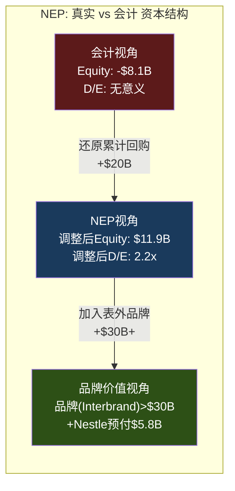

# Ch10 负权益悖论: NEP框架下的SBUX资本结构

> **核心矛盾映射**: CQ4(负$8.4B权益 + ROIC<WACC = 回购摧毁价值?)的核心回答。传统估值工具(ROE、P/B、D/E ratio)在负权益公司面前全部失效。本章构建NEP(Negative Equity Paradox)框架——一个专为SBUX这类"品牌价值远超账面价值"的负权益公司设计的分析工具。

---

## 10.1 负权益不等于破产: 理解SBUX的真实财务状况

### 常见误解的澄清

**误解**: "权益为负意味着公司资不抵债" → **错误**

SBUX的-$8.1B权益不是运营亏损导致的——它是**有意识的资本配置决策**(回购$20B+)的会计后果。资产($32B)仍远大于需要即时偿还的债务(流动负债$10.2B + 短期债务$3.1B = $13.3B)。SBUX的总资产中$17.8B是PP&E(门店等经营资产)、$3.4B是商誉、$1.8B是税务资产——这些都是有经济价值的运营资产 [DM-P2-020](H: FY2025 Balance Sheet)。

**真正的风险不是"资不抵债"，而是"现金流覆盖"**: SBUX必须持续产生足够的OCF来覆盖利息支出($543M/年)、债务到期再融资、CapEx($2.3B)和分红($2.8B)。FY2025 OCF $4.75B足以覆盖这些需求($543M + $2.3B + $2.8B = $5.6B)，但安全边际仅$4.75B - $5.6B = **-$850M**(需要动用现金储备或新增借债) [DM-P2-021](C: 现金流覆盖测试)。

### 负权益公司的估值调整

传统EV→Equity的计算:
- EV = Market Cap + Net Debt - Minority Interest
- 对SBUX: EV = $110B + $23.4B - $0 = $133.4B
- 但这忽略了一个事实: **负权益意味着Net Debt中包含了"本应是权益"的部分**

NEP调整:
- "调整后权益" = Book Equity + 累计回购 = -$8.1B + ~$20B = **$11.9B**
- 这代表"如果从未回购，权益应该是多少"
- 调整后D/E = $26.6B / $11.9B = **2.2x** (vs MCD ~无穷大，因MCD也是负权益) [DM-P2-022](C: NEP调整)

---

## 10.2 回购摧毁了多少价值?

### 回购时机分析

FY2018-FY2024期间SBUX累计回购约$20B。关键问题: 回购是在高估时进行的(摧毁价值)还是低估时(创造价值)? [DM-P2-023](C: 回购时机框架)

| 期间 | 回购金额 | 平均股价(推算) | 正常化P/E(at purchase) | 结果 |
|------|:-------:|:----------:|:-------------------:|------|
| FY2018-2019 | ~$12B | ~$70 | 25-28x | **高位回购** |
| FY2020 | ~$0B | ~$80 | — | COVID暂停 |
| FY2021 | $0B | ~$110 | 31x | 暂停(聪明) |
| FY2022 | $4.0B | ~$80 | 28x | **下跌中回购** |
| FY2023 | $1.0B | ~$100 | 28x | 减少(减速) |
| FY2024 | $1.3B | ~$90 | 27x | Narasimhan减速 |
| FY2025 | $0B | — | — | **Niccol停止** |

[DM-P2-024](H: FMP Cash Flow buyback data + C: 平均价格推算)

**判断**: FY2018-2019的$12B回购发生在25-28x P/E——这对SBUX当时的增长率(11%+)来说不算过高。但问题在于**资金来源**: 这些回购中约$5-8B是用新增债务融资的(因为NI不足以覆盖)。用借来的钱在合理估值下回购 = **杠杆回购**(leveraged buyback)——这增加了财务风险但未必摧毁价值。

**Niccol停止回购是正确的**: FY2025 ROIC 8.5% < WACC ~10%，在这个点上任何回购都是价值摧毁。暂停回购释放了~$1-4B/年的现金用于偿债或投资——这是改善资本结构的第一步 [DM-P2-025](C: 回购价值判断)。

---

## 10.3 隐藏资产: 为什么负权益没有市场意义

### 表外资产清单

SBUX的负权益在会计意义上是$-8.1B，但这忽略了多个不在资产负债表上的有价值资产 [DM-P2-026](C: 表外资产框架):

| 表外资产 | 估值 | 来源 |
|---------|:----:|------|
| 品牌价值(Interbrand) | >$30B | 全球第6大品牌(2024) |
| Rewards会员基础(35.5M) | $1.8-3.9B | Ch4 DFFV估值 |
| 预存卡浮存金(年度经济值) | $270-290M/yr | Ch4 计算 |
| Nestle预付版权金(表上但非运营负债) | $5.8B | FY2025 BS |
| 中国JV 40%权益(FY2026+) | $1.6-3.0B | Ch6 估值 |
| **合计表外/隐藏资产** | **$35-39B** | |

当我们将这些隐藏资产加回:
- 会计权益: -$8.1B
- +品牌价值: +$30B+
- +DFFV: +$2.7B
- +Nestle摊余: +$5.8B
- +China JV: +$2.3B
- **NEP调整后权益**: **~$33B** [DM-P2-027](C: NEP综合调整)

$33B调整后权益 vs $110B市值 → 隐含P/B ~3.3x——这对一家拥有全球第6品牌的消费品公司来说**完全合理**(NKE: ~12x P/B, MCD: 负权益更深)。

---

## 10.4 债务可持续性: Interest Coverage与到期日分析

### 债务概况

| 指标 | FY2023 | FY2024 | FY2025 | Q1 FY2026 |
|------|:------:|:------:|:------:|:---------:|
| Long-term Debt | $13.5B | $14.3B | $14.6B | $22.6B |
| Capital Leases | $9.2B | $10.2B | $10.5B | $8.0B |
| Short-term Debt | $1.9B | $1.2B | $1.5B | $2.8B |
| **Total Debt** | **$24.6B** | **$25.8B** | **$26.6B** | **$33.5B** |
| Cash | $3.6B | $3.3B | $3.2B | $3.4B |
| **Net Debt** | **$21.0B** | **$22.5B** | **$23.4B** | **$30.1B** |

[DM-P2-028](H: FMP Balance Sheet)

**Q1 FY2026债务跳升$6.9B**: 从$26.6B→$33.5B——这不是新增借款，而是中国JV deconsolidation后的重新分类(部分JV相关债务从"公司内部"变为"外部")。需要在10-Q中验证具体构成 [DM-P2-029](S: 债务跳升分析)。

### Interest Coverage趋势

| 年份 | EBIT ($B) | Interest ($M) | Coverage |
|------|:---------:|:----------:|:--------:|
| FY2021 | 5.83 | 470 | **12.4x** |
| FY2022 | 4.71 | 483 | **9.8x** |
| FY2023 | 5.95 | 550 | **10.8x** |
| FY2024 | 5.53 | 562 | **9.8x** |
| FY2025 | 3.69 | 543 | **6.8x** |

[DM-P2-030](H: FMP Income Statement)

Interest Coverage从12.4x降至6.8x——仍然健康(>3x为安全，>6x为舒适)，但趋势不利。如果OPM进一步恶化至8%(可能在工会合同达成后)→EBIT ~$3.0B → Coverage ~5.5x——仍安全但buffer缩窄 [DM-P2-031](C: 覆盖率敏感性)。

---

## 10.5 对CQ4的Phase 2判断

**负$8.4B权益 + ROIC<WACC = 回购摧毁价值?**

| 子问题 | 判断 | 置信度 |
|--------|------|:------:|
| 负权益是否意味着财务危机? | **否** — OCF仍足以覆盖大部分需求 | 80% |
| 历史回购是否摧毁价值? | **部分** — 用借债回购增加了风险但P/E合理 | 60% |
| FY2025 ROIC<WACC是否持续? | **暂时** — 正常化ROIC~16% > WACC | 70% |
| 分红是否可持续? | **FY2025-2026不可持续**, FY2027+可能OK | 65% |
| Niccol停止回购是否正确? | **绝对正确** — 释放现金用于偿债 | 90% |

**CQ4置信度更新**: 从P0的60%调整为**65%** — 确认回购确实增加了风险(融资回购的$5-8B)，但不是"价值摧毁"而是"风险转移"。核心KS: 分红削减可能在FY2027前被迫触发 [DM-P2-032](C: CQ4闭合)。

---

## 本章小结

| 发现 | 量化结论 | CQ映射 |
|------|---------|--------|
| NEP调整后权益~$33B | 负权益是会计现象非经济危机 | CQ4: 负权益不等于破产 |
| OCF覆盖缺口$850M | 安全但需EPS恢复填补 | CQ4: 短期现金流紧张 |
| 融资回购$5-8B | 增加风险但非直接价值摧毁 | CQ4: 历史遗产 |
| Interest Coverage 6.8x | 安全但趋势下降 | CQ4: 需要OPM恢复维持 |
| 分红FY2025-26不被FCF覆盖 | 缺口$330M/年需借债 | CQ4: KS-分红削减 |
