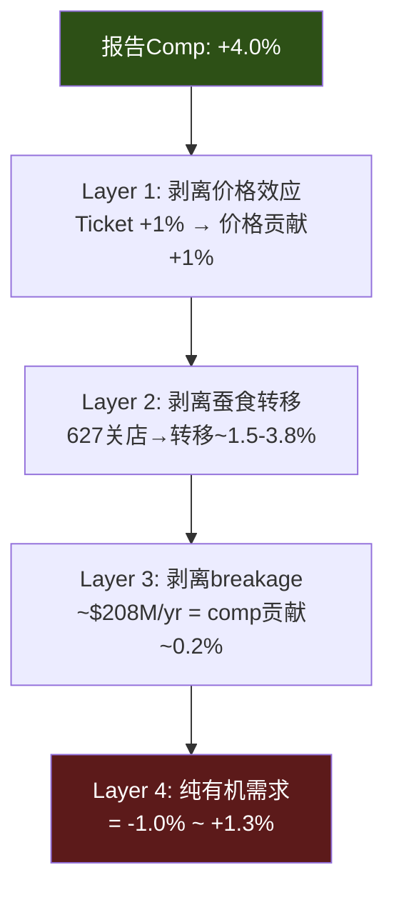

# Ch11 CSSPD: 同店销售纯度分解

> **核心矛盾映射**: SBUX报告的+4% comp sales是"真正的恢复"还是"统计幻觉"? CSSPD(Comp Sales Structural Purity Decomposition)框架从RCL报告的YPD方法论移植，将comp sales拆解为有机需求、价格效应、蚕食转移、和breakage贡献四层，揭示增长的"纯度"。

---

## 11.1 CSSPD框架: 四层纯度分解

### 方法论

CSSPD将单一的comp sales数字拆解为四个层次，从上到下每剥离一层"杂质"，剩下的就是更纯粹的有机增长 [DM-P2-033](C: CSSPD框架，从RCL YPD移植):

### Layer 1: 价格效应剥离

Q1 FY2026 NA comp +4% = +3% transactions + +1% ticket [DM-P2-034](H: Q1 FY2026 Earnings):

+1% ticket中包含:
- 菜单涨价(Niccol明确说"strategic and targeted pricing") → 估算+2-3%
- SKU简化效应(删除高价复杂饮品→拉低均价) → 估算-1-2%
- 净价格效应: ~+1%(与报告一致)

**剥离后**: +4% - 1%(价格) = **+3% 量驱动comp** [DM-P2-035](C: 价格效应估算)

### Layer 2: 蚕食转移剥离

Ch3已计算627家关店的理论转移效应≈3.8%。但这是上限估算(假设70%客户转移)。保守估算(50%转移率) = 627 × $1.5M × 50% / (9,600 × $1.8M) = **2.7%** [DM-P2-036](C: 保守蚕食估算)

**范围**: 蚕食转移贡献 = **1.5-3.8%**
- 下限1.5%(仅关闭门店的核心客户转移)
- 上限3.8%(70%客户转移到最近SBUX)

**剥离后**: +3%(量驱动) - 1.5-3.8%(蚕食) = **-0.8% ~ +1.5% 扣蚕食后增长**

### Layer 3: Breakage贡献剥离

年度breakage $208M计入门店收入 → 对comp的贡献 ≈ $208M / (9,600 × $1.8M) × 100% = **~0.12%**。这个数字很小，对comp的边际影响可忽略 [DM-P2-037](C: breakage comp贡献)。

### Layer 4: 纯有机需求

| Comp层次 | 数值 | 累积剥离 |
|---------|:----:|:--------:|
| 报告Comp | +4.0% | — |
| 剥离价格 | +3.0% | -1.0% |
| 剥离蚕食(中位) | +0.3% ~ +1.5% | -1.5-2.7% |
| 剥离breakage | +0.2% ~ +1.4% | -0.1% |
| **纯有机需求** | **-0.8% ~ +1.3%** | |

[DM-P2-038](C: CSSPD四层分解汇总)

**CSSPD结论**: Q1 FY2026报告的+4% comp可能仅包含**-0.8%至+1.3%的纯有机增长**。中位估计约**+0.3%**——几乎为零。这意味着SBUX的"拐点"更多是关店后的**机械性反弹**，而非**真正的需求恢复** [DM-P2-039](C: CSSPD核心结论)。

---

## 11.2 对FY2028 EPS路径的含义

共识FY2028E EPS $3.63需要:
- Revenue CAGR 5%+ (其中comp 3%+ + 新店2%)
- OPM 13.5-15.0%

如果CSSPD揭示的纯有机comp仅0-1%:
- 实际comp = 价格2% + 有机0-1% = 2-3% (勉强达标)
- 但如果蚕食效应在FY2027消退(关店转移的一次性效应)——comp可能从+4%回落到+2%

**敏感性**: 每1%的comp差异 ≈ $370M收入 ≈ ~$0.20 EPS [DM-P2-040](C: comp敏感性)

---

## 本章小结

| 发现 | 量化结论 | CQ映射 |
|------|---------|--------|
| 纯有机comp仅-0.8%~+1.3% | "拐点"可能是统计幻觉 | CQ2: 转型速度存疑 |
| 蚕食贡献1.5-3.8% | 关店转移是comp主要驱动 | CQ2: 沉默域#1验证 |
| 每1% comp ≈ $0.20 EPS | FY2028路径对comp高度敏感 | CQ1: EPS恢复的脆弱性 |
