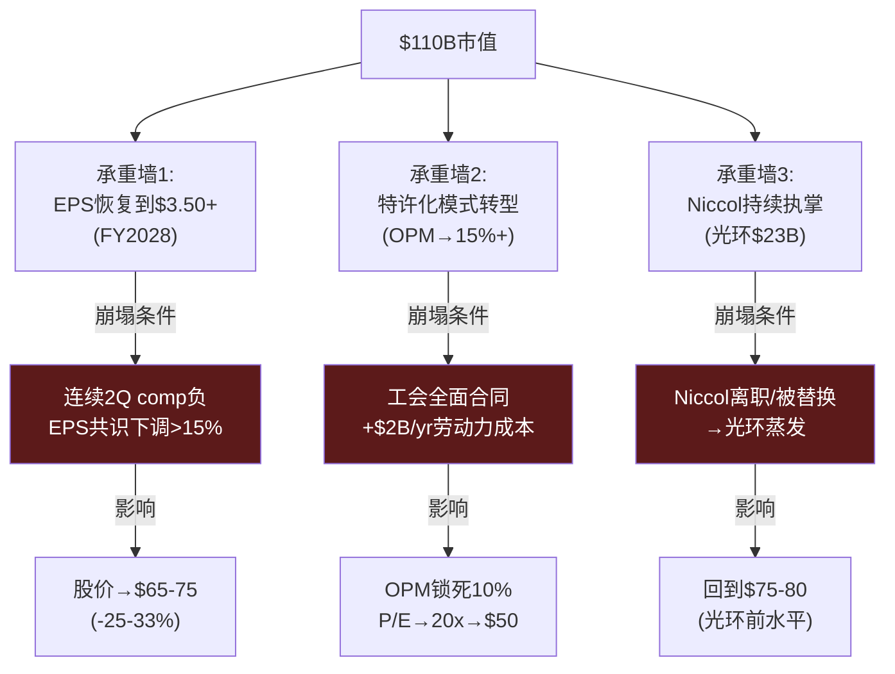

# Ch12 Reverse DCF: 市场在赌什么?

> **核心矛盾映射**: CQ1(78x P/E隐含什么?)的定量回答。Reverse DCF不计算"SBUX值多少钱"——而是翻译"$97股价隐含市场相信什么"。然后评估这些隐含信念的合理性。

---

## 12.1 逆向估值: $97隐含的信念集

### Reverse DCF设置

| 参数 | 假设 | 依据 |
|------|------|------|
| 当前股价 | $96.76 | 2026-03-03 |
| 稀释股本 | 1.14B | Q1 FY2026 |
| **隐含市值** | **$110.2B** | |
| Net Debt | $23.4B | FY2025 |
| **隐含EV** | **$133.6B** | |
| WACC | 9.5% | 基于beta 0.94, risk-free 4.5%, ERP 5.5% |
| Terminal Growth | 3.0% | 美国名义GDP |
| Terminal EV/EBITDA | 18x | QSR平均 |
| Projection Period | 10年 (FY2026-FY2035) | |

[DM-P2-041](C: Reverse DCF参数设定)

### 隐含假设集

要justify $133.6B EV，SBUX的FCFF(Free Cash Flow to Firm)需要满足以下轨迹 [DM-P2-042](C: Reverse DCF求解):

| 年份 | Revenue ($B) | OPM | EBIT ($B) | FCFF ($B) |
|------|:-----------:|:---:|:---------:|:---------:|
| FY2026 | 38.3 | 11% | 4.2 | 2.8 |
| FY2027 | 40.3 | 13% | 5.2 | 3.6 |
| FY2028 | 42.4 | **15%** | **6.4** | 4.5 |
| FY2029 | 44.7 | 15.5% | 6.9 | 4.9 |
| FY2030 | 47.0 | 16% | 7.5 | 5.4 |
| Terminal | ~$50B | 16.5% | ~$8.3B | ~$6.0B |

**隐含信念翻译**:
1. **收入CAGR ~5%持续10年**: 从$37B→$50B——需要comp 3%+ 和净新店2%/年
2. **OPM从9.6%恢复到16.5%**: 不仅要达到Investor Day的13.5-15%，还要超过(16.5%)
3. **FCFF从$2.4B增长到$6B**: 2.5x增长需要OPM扩张+CapEx稳定

**信念评估**:

| 隐含信念 | 合理性(0-10) | 理由 |
|---------|:----------:|------|
| 收入CAGR 5% | 6 | 可能(新店+comp)，但中国deconsolidation后基数更低 |
| OPM恢复到15% | 5 | Investor Day目标上限，需要$2B削减全额落地 |
| OPM超过15%→16.5% | **3** | 超出管理层自身目标，需要工会问题彻底解决 |
| FCFF持续增长 | 5 | 需要CapEx/$2.3B不再增长(Niccol已削减) |
| Terminal 18x | 7 | QSR平均合理，但SBUX特许化比例需>70%才justify |

[DM-P2-043](C: 信念合理性评估)

---

## 12.2 承重墙(Bearing Wall)脆弱度分析

### 三面承重墙

SBUX当前估值建立在三面"承重墙"之上。任何一面墙崩塌，估值都将大幅下修 [DM-P2-044](C: 承重墙框架，从KLAC移植):

### 承重墙联合概率

| 情景 | BW1 | BW2 | BW3 | 概率 | 股价 |
|------|:---:|:---:|:---:|:----:|:----:|
| 全部持住 | ✓ | ✓ | ✓ | 25% | $110-130 |
| 部分恢复 | ~✓ | ✓ | ✓ | 35% | $85-105 |
| 仅叙事支撑 | ✗ | ~✓ | ✓ | 20% | $70-85 |
| 两面崩塌 | ✗ | ✗ | ✓ | 12% | $50-70 |
| 全面崩塌 | ✗ | ✗ | ✗ | 8% | $40-55 |
| **概率加权** | | | | **100%** | **$83-98** |

[DM-P2-045](C: 承重墙联合概率)

**概率加权公允价值: $83-98** vs 当前$97 → **估值基本合理但上行空间有限，下行风险显著(概率加权中位~$90)**

---

## 12.3 FMP DCF对标: $64 vs 市场$97

FMP的自动DCF给出$64.17——比市场价低33% [DM-P2-046](H: FMP DCF endpoint)。

差异来源分解:
| 因素 | FMP假设 | 市场隐含 | 差异 |
|------|--------|---------|------|
| 增长假设 | 基于历史(偏低) | 基于FY2028目标 | 市场更乐观 |
| 折现率 | 可能偏高(负权益惩罚) | ~9.5%(标准WACC) | FMP更保守 |
| 终值倍数 | 偏低(历史均值) | 18x+(QSR参考) | 市场给更高terminal |
| **核心差异** | **不相信转型** | **定价转型成功** | |

FMP DCF对SBUX这类"负权益+转型期"公司存在系统性偏低——它的模型无法处理负权益(导致ROE/P/B指标失效)和非线性OPM恢复。$64更像是"如果转型完全失败+维持现状"的价格，而非公允价值 [DM-P2-047](C: FMP DCF局限分析)。

---

## 12.4 多方法估值汇总

| 方法 | 估值(股价) | 隐含P/E(FY2028E) | 关键假设 |
|------|:---------:|:---------------:|---------|
| FMP DCF | $64 | ~18x | 转型失败/维持现状 |
| 三层SOTP(Ch3) | $90-112 | 25-31x | 身份混合估值 |
| Reverse DCF(当前) | $97 | 27x | OPM→15%+, CAGR 5% |
| MCD模式假想(Ch5) | $135-174 | 37-48x | 85%特许化 |
| 概率加权(承重墙) | $83-98 | 23-27x | 五情景加权 |
| **综合判断区间** | **$80-105** | **22-29x** | |

[DM-P2-048](C: 多方法估值汇总)

**当前$97处于综合区间的上半部($80-105)**。这意味着:
- 向上空间有限(~8%到$105)
- 向下空间显著(~18%到$80)
- **风险回报不对称**: 下行>上行

---

## 本章小结

| 发现 | 量化结论 | CQ映射 |
|------|---------|--------|
| $97隐含OPM恢复到16.5% | 超出管理层自身目标(15%) | CQ1: 市场假设过于激进 |
| 概率加权公允价值$83-98 | 当前$97在上边缘 | CQ1: 下行风险>上行空间 |
| 三面承重墙任一崩塌→-25%+ | EPS恢复+特许化+Niccol缺一不可 | CQ1/2/3: 高度联合依赖 |
| 综合估值$80-105 | 不算高估但无安全边际 | 评级预判: 中性关注 |
