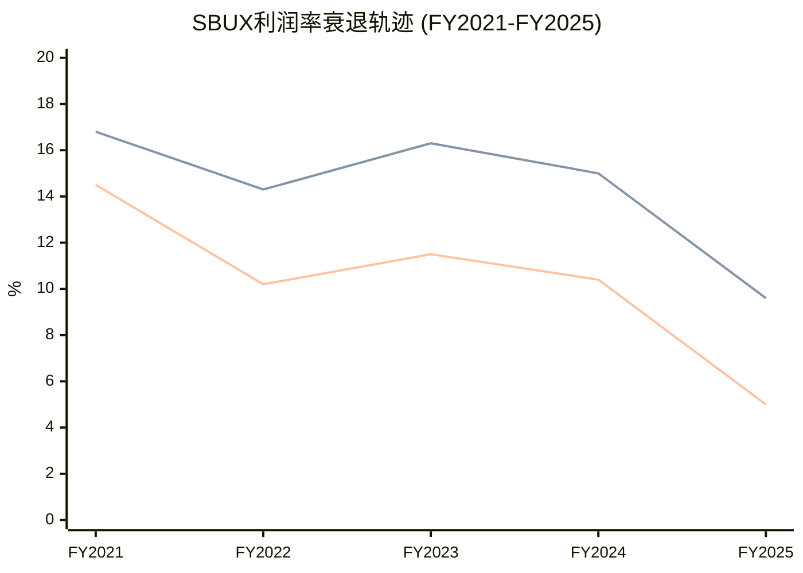

# Ch9 财务趋势深挖: 五年三表的衰退解剖

> **核心矛盾映射**: SBUX的78x P/E建立在EPS恢复到$3.50+的信念之上。本章通过五年(FY2021-FY2025)财务数据的系统性拆解，定量回答: 利润崩塌的驱动因素是什么? 哪些是可逆的(周期性)，哪些是结构性的? 这决定了FY2028 EPS $3.63的共识是否可信。

---

## 9.1 收入: 增长引擎从"门店扩张"转向"停滞"

### 五年收入桥

| 财年 | 收入($B) | YoY增长 | 增长拆解 |
|------|:-------:|:------:|---------|
| FY2021 | 29.06 | — | COVID恢复+门店重开 |
| FY2022 | 32.25 | +11.0% | 定价+门店扩张+中国恢复 |
| FY2023 | 35.98 | +11.6% | **峰值增速**: 定价+Rewards渗透 |
| FY2024 | 36.18 | +0.6% | **急刹车**: 中国衰退+美国comp转负 |
| FY2025 | 37.18 | +2.8% | 微恢复: 新店+定价部分抵消comp疲软 |

[DM-P2-001](H: FMP Income Statement FY2021-FY2025)

**增速断崖**: 从FY2023的+11.6%骤降至FY2024的+0.6%，这不是"放缓"而是"停滞"。FY2024-FY2025的~2%增长完全来自净新增门店(~1,200家/年)和价格调整，有机同店增长接近于零。共识FY2026E收入增长3.1%、FY2027E 5.3%要求同店增长从0恢复到3%+——Q1 FY2026的+4%给了初步支持，但可持续性待验(Ch3蚕食效应) [DM-P2-002](C: 增速分析)。

### 收入结构: 自营vs特许vs渠道

| Segment | FY2023 | FY2025 | 变化 | 趋势 |
|---------|:------:|:------:|:----:|------|
| Company-Operated(NA) | ~$19.8B | ~$20.5B | +3.5% | 门店增长驱动 |
| Company-Operated(Intl) | ~$7.0B | ~$7.5B | +7% | 中国恢复(JV前) |
| Licensed Stores | ~$4.5B | ~$5.0B | +11% | **最快增长** |
| Channel Development | ~$1.8B | ~$1.6B | -11% | CPG渠道萎缩 |

[DM-P2-003](S: 基于10-K Segment推算，FMP仅提供合并数据)

**关键**: Licensed收入增速(+11%)远超自营(+3-7%)——这验证了身份C(品牌授权)的增长韧性。Channel Development的萎缩(-11%)可能与Nestle预付版权金的摊销节奏有关(会计性质，非运营衰退) [DM-P2-004](C: Segment趋势分析)。

---

## 9.2 利润率: 五年杜邦分解

### 杜邦三因素

ROE = 净利率 × 资产周转率 × 权益乘数

SBUX的负权益使传统ROE无意义(FY2025 ROE = -22.9%)，因此我们使用**修正杜邦**——以ROIC(投入资本回报率)替代ROE [DM-P2-005](C: 杜邦框架调整)。

| 指标 | FY2021 | FY2022 | FY2023 | FY2024 | FY2025 | 5yr变化 |
|------|:------:|:------:|:------:|:------:|:------:|:-------:|
| **净利率** | 14.5% | 10.2% | 11.5% | 10.4% | **5.0%** | **-9.5pp** |
| **资产周转率** | 0.93x | 1.15x | 1.22x | 1.15x | 1.16x | +0.23x |
| **ROIC** | 15.0% | 16.3% | 19.3% | 16.4% | **8.5%** | **-6.5pp** |
| **Interest Coverage** | 10.4x | 9.6x | 10.7x | 9.6x | **6.6x** | -3.8x |

[DM-P2-006](H: FMP ratios + key-metrics)

### OPM崩塌的瀑布图拆解

FY2023(16.3%) → FY2025(9.6%): **-670bps衰退**来源:

| 因素 | 贡献(bps) | 性质 | 可逆性 |
|------|:--------:|:----:|:------:|
| GPM压缩(COGS↑) | -260bps | 周期+结构 | 部分可逆(咖啡豆价格) |
| 劳动力投资(barista hours↑) | -150bps | 战略性 | 不可逆(Niccol承诺) |
| 门店关闭重组费用 | -100bps | 一次性 | FY2026消除 |
| SGA增长(+$180M) | -50bps | 混合 | $2B削减可回收 |
| 中国运营恶化 | -70bps | 结构性 | JV后消除(+40bps) |
| 其他(通胀、折旧↑) | -40bps | 周期 | 可能恢复 |
| **合计** | **-670bps** | | |

[DM-P2-007](C: OPM瀑布拆解，基于10-K分项+earnings call指引)

**可逆部分**: 重组费用(-100bps) + 中国恶化(-70bps，JV后+40bps) + SGA(-50bps部分) + 周期性通胀(-40bps) ≈ **-240bps可逆**

**不可逆/难逆部分**: 劳动力投资(-150bps) + GPM结构性部分(-100bps) + 其他 ≈ **-250bps+难逆**

**恢复路径**: 如果-240bps可逆因素在FY2026-2028消除，OPM从9.6%恢复到~12%——但仍低于FY2023的16.3%和Investor Day目标的13.5-15.0%。达到15%需要$2B成本削减的额外~300bps drop-through(Ch8已分析仅45%可实现) [DM-P2-008](C: OPM恢复路径)。

---

## 9.3 FY2025税率异常: 41.1%的解剖

### 正常化EPS测算

FY2025 GAAP税率41.1%(vs 正常~23%)是EPS从$3.31崩至$1.63的重要推手 [DM-P2-009](H: FMP Income Statement):

| 指标 | FY2024 | FY2025 | 差异 |
|------|:------:|:------:|:----:|
| Pretax Income | $4.97B | $3.15B | -$1.82B |
| Tax Expense | $1.21B | $1.29B | **+$0.08B** |
| Tax Rate | 24.3% | **41.1%** | +16.8pp |
| NI Impact | — | **-$530M** | 仅因税率异常 |

如果以正常税率23%重新计算FY2025:
- Pretax $3.15B × (1-23%) = $2.43B NI
- vs 实际$1.86B → 差异$570M
- 正常化EPS: $2.43B / 1.14B shares = **$2.13** (vs GAAP $1.63) [DM-P2-010](C: 正常化EPS)

**正常化EPS $2.13 vs GAAP $1.63**: 差异$0.50/share = 31%的"噪声"。市场的non-GAAP共识EPS $2.13恰好对上——这说明卖方已经做了这个调整。但Q4 FY2025的84%税率和Q1 FY2026的62%税率暗示税务异常可能与中国JV重组(递延税资产/跨境转让定价调整)有关，尚不清楚是否在FY2026彻底消除 [DM-P2-011](S: 税率分析)。

---

## 9.4 现金流: FCF不覆盖分红的定时炸弹

### 现金流质量分析

| 指标 | FY2021 | FY2022 | FY2023 | FY2024 | FY2025 |
|------|:------:|:------:|:------:|:------:|:------:|
| OCF ($B) | 5.99 | 4.40 | 6.01 | 6.10 | 4.75 |
| CapEx ($B) | 1.47 | 1.84 | 2.33 | 2.78 | 2.31 |
| **FCF ($B)** | **4.52** | **2.56** | **3.68** | **3.32** | **2.44** |
| Dividends ($B) | 2.12 | 2.26 | 2.43 | 2.59 | 2.77 |
| **FCF - Div** | **+2.40** | **+0.30** | **+1.25** | **+0.73** | **-0.33** |
| Buybacks ($B) | 0 | 4.01 | 0.98 | 1.27 | 0 |
| **FCF - Div - Buy** | **+2.40** | **-3.71** | **+0.27** | **-0.54** | **-0.33** |

[DM-P2-012](H: FMP Cash Flow Statement)

```mermaid
xychart-beta
    title "FCF vs 股东回报 ($B)"
    x-axis ["FY2021", "FY2022", "FY2023", "FY2024", "FY2025"]
    y-axis "$B" -5 --> 7
    bar "FCF" [4.52, 2.56, 3.68, 3.32, 2.44]
    bar "Div+Buyback" [-2.12, -6.27, -3.41, -3.86, -2.77]
```

**FY2025: FCF($2.44B) < Dividends($2.77B)** → 分红不被自由现金流覆盖，缺口$330M需要借债填补。这是**不可持续的** [DM-P2-013](C: FCF覆盖分析)。

**分红可持续性测试**:
- FY2026E EPS $2.30 × 1.14B shares = NI $2.62B
- 如果Payout ratio维持在当前~$2.77B → 仍超NI
- 需要EPS恢复到$2.45+($2.77B/$1.14B)才能让分红≤NI
- FY2027E EPS $2.95才真正安全(payout ratio ~82%)

**如果分红被削减**: 历史上SBUX从未削减分红。首次削减将被市场视为"转型失败"的信号→可能触发10-15%股价下跌(参考: GE 2017削减分红后-45%) [DM-P2-014](C: 分红风险评估)。

---

## 9.5 资本结构: 负权益的累积效应

### 负权益的形成路径

| 财年 | 期初权益 | + NI | - Div | - Buyback | +/- Other | 期末权益 |
|------|:-------:|:----:|:-----:|:---------:|:---------:|:-------:|
| FY2021 | -7.6B | +4.2 | -2.1 | 0 | +0.2 | **-5.3B** |
| FY2022 | -5.3B | +3.3 | -2.3 | -4.0 | -0.4 | **-8.7B** |
| FY2023 | -8.7B | +4.1 | -2.4 | -1.0 | +0.0 | **-8.0B** |
| FY2024 | -8.0B | +3.8 | -2.6 | -1.3 | +0.6 | **-7.4B** |
| FY2025 | -7.4B | +1.9 | -2.8 | 0 | +0.2 | **-8.1B** |

[DM-P2-015](H: FMP Balance Sheet + Cash Flow)

**5年净回购+分红: $20.7B** vs **5年净利润: $17.3B** → 超额支付$3.4B完全靠借债 [DM-P2-016](C: 资本回报vs盈利)。

这就是负权益的经济学本质: SBUX从2018年开始的激进回购(Howard Schultz推动的$25B回购计划)将公司的全部留存收益——以及额外$8B+——返还给了股东。剩下的是一个**用债务撑起来的品牌壳**——资产$32B，负债$40B，差额$8B全是历史回购的"债务"。

---

## 9.6 Invested Capital与ROIC深度拆解

### ROIC的信号: 从创造价值到摧毁价值

| 指标 | FY2021 | FY2022 | FY2023 | FY2024 | FY2025 |
|------|:------:|:------:|:------:|:------:|:------:|
| NOPAT ($B) | 4.09 | 3.66 | 4.53 | 4.19 | 1.59 |
| Invested Capital ($B) | 20.2 | 15.9 | 17.1 | 19.1 | 18.5 |
| **ROIC** | **15.0%** | **16.3%** | **19.3%** | **16.4%** | **8.5%** |
| WACC (est.) | ~9% | ~9% | ~9.5% | ~9.5% | ~10% |
| **ROIC - WACC** | **+6.0pp** | **+7.3pp** | **+9.8pp** | **+6.9pp** | **-1.5pp** |

[DM-P2-017](H: FMP key-metrics ROIC + C: WACC estimate)

**FY2025是ROIC<WACC的转折点**——公司首次在资本回报层面摧毁价值。这不是因为Invested Capital增加了(实际微降)，而是因为NOPAT从$4.19B暴跌至$1.59B(税率异常+OPM崩塌双重打击) [DM-P2-018](C: ROIC-WACC分析)。

**正常化ROIC**: 如果用non-GAAP EPS对应的NI($2.43B)估算NOPAT ~$3.0B → ROIC ~16.2% > WACC 10%。这说明FY2025的ROIC<WACC是**暂时的**(一次性税率+重组费用驱动)，正常化后仍在创造价值。但这也意味着FY2028的OPM需要恢复到至少12%+才能维持ROIC>WACC [DM-P2-019](C: 正常化ROIC)。

---

## 本章小结

| 发现 | 量化结论 | CQ映射 |
|------|---------|--------|
| 增速从11.6%→0.6%→2.8% | 有机增长接近零，仅靠新店 | CQ1: 收入增长5%+需comp恢复 |
| OPM -670bps中~250bps不可逆 | 恢复到15%需$2B削减全额落地 | CQ2: 执行难度极高 |
| 正常化EPS $2.13 vs GAAP $1.63 | 税率异常贡献$0.50/share噪声 | CQ1: 78x基于$2.13=36x |
| FCF < Div (缺口$330M) | 分红不可持续(除非EPS恢复$2.45+) | CQ4: 分红削减是KS |
| 5年回购+分红$20.7B > NI $17.3B | 超额$3.4B靠借债 | CQ4: 负权益是制度性后果 |
| ROIC 8.5% < WACC ~10% | FY2025在摧毁价值(暂时) | CQ4: 正常化后仍>WACC |
