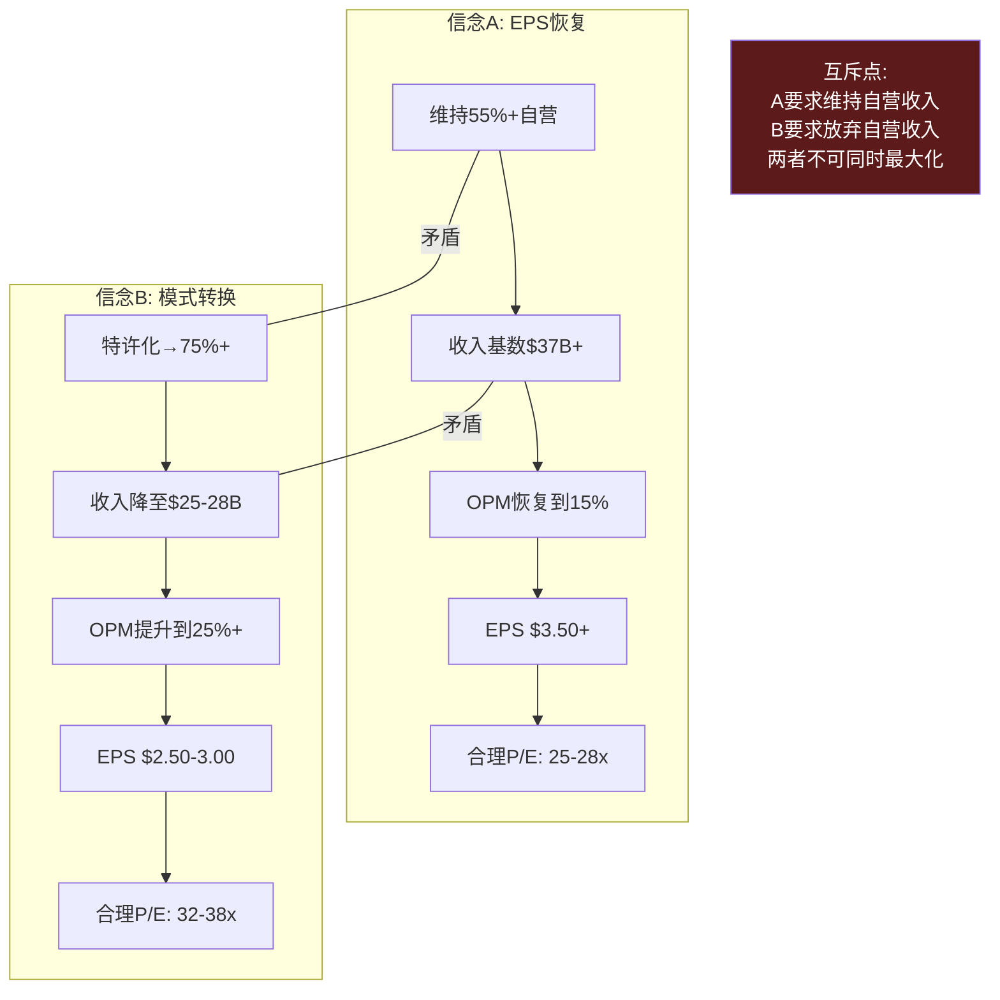

# Ch17 信念互斥悖论: 78x P/E的两个不可共存假设

> **核心矛盾映射**: 这是本报告的核心洞见章节——BME(Belief Mutual Exclusion)检测。78x P/E隐含两个逻辑上难以同时为真的信念。本章将这个矛盾从"直觉判断"提升为"定量论证"。

---

## 17.1 BME框架: 信念互斥的形式化定义

**信念互斥(Belief Mutual Exclusion)**是指市场隐含地同时定价两个在底层逻辑上相互排斥的假设。与"高估"或"低估"不同，BME不是关于价格水平的判断，而是关于**定价内部一致性**的判断 [DM-P3-010](C: BME框架定义)。

### SBUX的两个互斥信念

**信念A: EPS恢复叙事** — "SBUX将在FY2028恢复EPS到$3.50+"
- 需要: Revenue CAGR 5%, OPM从9.6%→15%
- 隐含: 维持高比例自营门店(55%+)以保留收入基数
- 逻辑要求: 门店运营效率大幅提升(劳动力+成本)
- 估值贡献: 提供EPS基数 → $3.63 × 27x = $98

**信念B: 模式转换叙事** — "SBUX正在成为MCD式的品牌授权公司"
- 需要: 特许化从55%→75%+, OPM从10%→25%+
- 隐含: 放弃大量自营门店收入(收入可能下降20-30%)
- 逻辑要求: 身份C权重从当前40%→60%+
- 估值贡献: 提供高倍数 → 更低EPS × 35x = 类似估值

---

## 17.2 互斥点的定量测试

### 测试1: EPS × Multiple的约束

| 路径 | EPS(FY2028) | 合理P/E | 隐含股价 | vs当前$97 |
|------|:----------:|:------:|:--------:|:---------:|
| 纯信念A(维持自营) | $3.63 | 25x | $91 | -6% |
| 纯信念B(大幅特许化) | $2.80 | 35x | $98 | +1% |
| 混合(当前市场隐含) | $3.63 | 27x | $98 | +1% |
| 信念A失败(OPM停12%) | $2.50 | 20x | $50 | **-48%** |
| 信念B部分(55%→65%) | $3.00 | 30x | $90 | -7% |

[DM-P3-011](C: EPS×P/E矩阵)

**关键发现**: 纯信念A($91)和纯信念B($98)的隐含股价几乎相同——这就是市场定价的精妙之处: **无论哪条路径成功，当前股价都大致合理**。但如果两条路径都不完全成功(最可能的情景: OPM恢复到12-13%而非15%，特许化到65%而非75%)——隐含股价降至$75-90 [DM-P3-012](C: 路径分析)。

### 测试2: 特许化速度与EPS的J曲线

特许化过程中存在一个**J曲线效应**: 短期收入下降(自营→授权的收入确认差异)先于长期OPM提升。中国JV是这个J曲线的第一个数据点:

| 阶段 | 收入影响 | OPM影响 | EPS净效果 |
|------|:-------:|:------:|:---------:|
| 中国JV(FY2026) | -$3.1B (-8%) | +40bps | -$0.02-0.03 |
| 假设美国20%门店(FY2027-28) | -$5B (-13%) | +200bps | -$0.20(短期) |
| 稳态(FY2029+) | -$8B累计 | +400bps | +$0.50(长期) |

[DM-P3-013](C: J曲线模拟)

**J曲线的投资含义**: 如果SBUX在FY2027-2028加速特许化(信念B)，短期EPS会低于信念A路径(因为收入下降先于margin提升)。这意味着**在J曲线底部，市场可能惩罚SBUX——即使转型方向正确**。投资者需要决定: 是否愿意承受12-18个月的EPS低谷以换取长期更高的品质(OPM/ROIC)? [DM-P3-014](C: J曲线投资含义)

---

## 17.3 BME的非对称信息结构

### Niccol知道答案但不告诉你

BME悖论最令人沮丧的特征是: **CEO知道他倾向哪条路径，但投资者不知道**。

Niccol的行为信号:
- **中国JV**: 倾向信念B(特许化)——已执行
- **菜单简化+Green Apron**: 可能是信念A(运营效率)也可能是信念B(为特许化做准备)
- **暂停回购**: 倾向B(保留现金用于转型)
- **$2B成本削减**: 倾向A(运营效率)也兼容B
- **沉默域#4(margin bridge不给)**: 倾向B——如果走A路径，给margin bridge没有坏处; 不给暗示路径可能改变

**我们的判断**: Niccol更可能走**A为主、B为辅**的路径——即优先恢复OPM(运营效率)，同时通过中国JV和可能的进一步国际特许化渐进推进身份C。美国门店大规模特许化在短期内不太可能(工会+品牌风险) [DM-P3-015](S: 路径判断)。

---

## 17.4 对CQ1的Phase 3判断

**78x P/E隐含什么? 信念互斥是否成立?**

| 维度 | 判断 |
|------|------|
| 信念互斥是否存在? | **是**——但不如最初假设那么尖锐。两条路径隐含的股价相近($91 vs $98) |
| 市场在赌什么? | **信念A为主**(EPS恢复)，信念B作为"期权溢价"(特许化可能性) |
| 78x是否合理? | 基于正常化EPS $2.13 → 实际45x。基于FY2028E $3.63 → 27x。**27x对QSR合理**，但前提是FY2028达标 |
| 最大风险? | **两条路径都半途而废**: OPM恢复到12%而非15%+，特许化停在60%而非75%+ → 隐含$75-85 |

**CQ1置信度更新**: 从P0的45%调整为**60%** — BME存在但比预期温和。真正的风险不是"两个信念互斥"而是"两条路径都执行不彻底" [DM-P3-016](C: CQ1闭合)。

---

## 本章小结

| 发现 | 量化结论 | CQ映射 |
|------|---------|--------|
| 纯A($91)≈纯B($98)≈当前$97 | 两条路径都能justify当前价格 | CQ1: 估值内部一致 |
| 半转型=最差情景($75-85) | 中途放弃比不转型更危险 | CQ1: 身份暧昧风险 |
| J曲线: 特许化短期EPS承压 | FY2027-28可能是低谷 | CQ1: 时机风险 |
| Niccol可能走A为主B为辅 | 运营效率优先，特许化渐进 | CQ2: 速度决定结果 |
