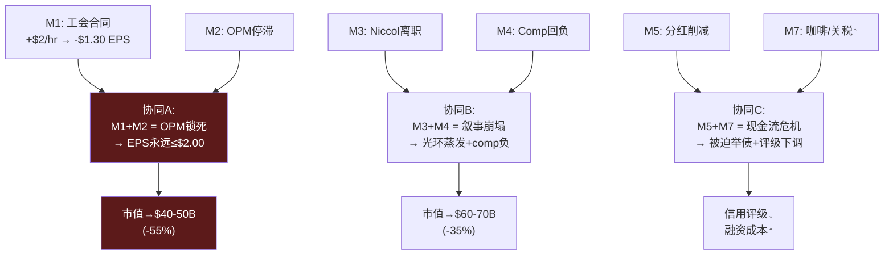

# Ch20 风险拓扑: MVP模式 (8+3+1)

> **核心矛盾映射**: 传统"风险清单"将每个风险视为独立事件。风险拓扑映射器v2.0将风险视为一个**系统**——风险之间的协同关系(两个风险同时爆发时的放大效应)往往比单个风险本身更危险。

---

## 20.1 MVP风险注册表

### M: 主要风险(8个)

| ID | 风险 | 影响(EPS) | 概率(2yr) | 严重度 |
|----|------|:---------:|:---------:|:------:|
| M1 | 工会全面合同(+$2/hr) | -$1.30 | 35% | **极高** |
| M2 | OPM停滞≤12%(FY2028) | -$0.80 | 40% | 高 |
| M3 | Niccol离职(FY2027前) | -$0.70(光环蒸发) | 15% | 高 |
| M4 | 美国comp回负(连续2Q) | -$0.40 | 25% | 中高 |
| M5 | 分红被迫削减 | -$0.30(PE压缩) | 30% | 中高 |
| M6 | 中国JV估值减记>30% | -$0.20 | 20% | 中 |
| M7 | 咖啡豆价格持续上涨+关税 | -$0.15 | 45% | 中 |
| M8 | 瑞幸进入美国(规模化) | -$0.10(5yr) | 10% | 低(长期) |

### V: 毒性风险(3个)

| ID | 风险 | 触发条件 | 影响 |
|----|------|---------|------|
| V1 | 全面罢工>2周 | 工会谈判破裂 | 品牌损害+运营中断→$5-10B市值蒸发 |
| V2 | SEC对breakage会计强制变更 | 监管调查升级 | 年减$50-100M→叙事冲击远大于数字 |
| V3 | 食品安全事件(大规模) | 门店卫生失控 | 参考CMG 2015→品牌修复需2-3年 |

### P: 黑天鹅(1个)

| ID | 风险 | 概率 | 影响 |
|----|------|:----:|------|
| P1 | 美中关系断裂→SBUX品牌在中国被封禁 | <5% | JV 40%权益归零→~$1.6B减记 |

[DM-P3-023](C: MVP风险注册表)

---

## 20.2 风险协同矩阵

### 最危险的协同组合

**协同A(M1+M2)是最致命的组合**: 如果工会合同增加$1.5B/年劳动力成本 + OPM未能从其他渠道恢复 → OPM可能锁死在8-10% → FY2028 EPS ~$1.50-2.00(vs共识$3.63) → P/E压缩到20x → **股价$30-40** [DM-P3-024](C: 协同A情景)。

这个协同的概率: P(M1) × P(M2|M1) ≈ 35% × 70% = **~25%** — 四分之一的概率出现最差情景。

---

## 20.3 温水煮青蛙情景

与灾难性崩溃不同，"温水煮青蛙"是指**多个温和负面因素同时缓慢恶化，每个都不足以触发KS，但累积效果显著**:

| 因素 | 单独影响 | 温水效应 |
|------|---------|---------|
| Comp +2%(vs目标3%+) | 未触发KS | 但收入CAGR仅3%而非5% |
| OPM恢复到13%(vs 15%) | 未达标但"在路上" | 但FY2028 EPS $2.80而非$3.63 |
| 分红维持但零增长 | 未削减 | 但yield吸引力下降 |
| 工会签约(+$1/hr) | 非全面合同 | 但增加$750M/年成本 |
| **累积效果** | 无单一KS触发 | **EPS $2.50-2.80, P/E 25-28x → $63-78** |

[DM-P3-025](C: 温水煮青蛙情景)

**温水煮青蛙可能是SBUX最可能的下行路径**: 不是戏剧性崩盘，而是缓慢、持续地低于预期——每个季度miss $0.01-0.03，每次都"接近目标但差一点"。投资者在这种情景中最痛苦——因为没有明确的"卖出信号"，但持有收益为零或微负。

---

## 本章小结

| 发现 | 量化结论 | CQ映射 |
|------|---------|--------|
| 8个主要风险, 工会影响最大(-$1.30 EPS) | 单一最大风险 | CQ4/KS-04 |
| 协同A(工会+OPM)概率25% | 最差情景$30-40 | CQ1: 下行尾部风险 |
| 温水煮青蛙→$63-78 | 最可能下行路径 | CQ2: 执行持续低于预期 |
| 毒性风险: 罢工/SEC/食安 | 低概率高影响 | 风险预算 |
