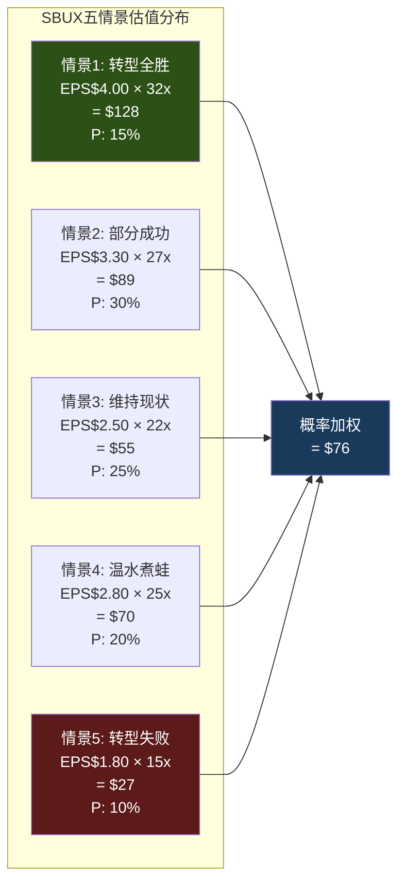

# Ch21 五情景建模

> **核心矛盾映射**: 将本报告的所有分析压缩为5个可量化的未来情景，每个情景赋予概率和估值。这不是"目标价"——这是对SBUX未来可能性空间的系统性映射。

---

## 21.1 五情景框架

### 情景明细

| # | 名称 | FY2028 EPS | OPM | 特许化% | P/E | 股价 | 概率 |
|---|------|:---------:|:---:|:------:|:---:|:----:|:----:|
| 1 | **转型全胜** | $4.00 | 15%+ | 65% | 32x | $128 | 15% |
| 2 | **部分成功** | $3.30 | 13-14% | 60% | 27x | $89 | 30% |
| 3 | **维持现状** | $2.50 | 11-12% | 55% | 22x | $55 | 25% |
| 4 | **温水煮蛙** | $2.80 | 12-13% | 58% | 25x | $70 | 20% |
| 5 | **转型失败** | $1.80 | 8-9% | 55% | 15x | $27 | 10% |

[DM-P3-026](C: 五情景参数)

---

## 21.2 情景拆解

### 情景1: 转型全胜 (15%)

**条件**: Niccol复制CMG成功 — comp持续+3-4%(FY2026-28), OPM恢复到15%+, 工会达成温和协议(+$1/hr而非$2), 中国JV许可费>5%, 美国开始试点特许化(drive-thru)。

**关键假设**: $2B成本削减全额落地 + 工会问题软着陆 + 美国comp有机增长≥2%。

**概率仅15%**: 因为需要所有变量同时有利——三面承重墙全部持住且超预期。

### 情景2: 部分成功 (30%) — **最可能情景**

**条件**: Comp +2-3%(含蚕食转移), OPM恢复到13-14%(低于目标), 工会达成中等协议(+$1.5/hr), 分红维持但零增长。

**关键差异vs情景1**: OPM未达15%(差1-2pp), EPS $3.30而非$4.00 → 市场给予27x而非32x因为"达标但不超预期"。

### 情景3: 维持现状 (25%)

**条件**: Comp +1-2%(蚕食效应消退后回落), OPM停在11-12%, 工会持续谈判但未达成, Niccol开始losing patience。

**关键特征**: 不是失败——是"不够好"。市场从78x逐步压缩到22x因为"转型比预期慢"。

### 情景4: 温水煮蛙 (20%)

**条件**: Ch20描述的缓慢恶化。每个季度slightly miss, comp +2%(低于3%目标), OPM 12-13%(进步但不够), 工会签约增加$750M/年成本。

**与情景3的区别**: 情景4有实际OPM改善(12-13% vs 11-12%)，但被工会成本部分抵消。

### 情景5: 转型失败 (10%)

**条件**: 协同A(工会+OPM)触发。工会合同增加$1.5B+/年 + comp回负 + Niccol离职(FY2027)。

**这是灾难情景**: EPS回到$1.80, P/E压缩到15x(纯零售商) → $27。概率10%但影响-72%。

---

## 21.3 概率加权估值与期望回报

| 情景 | 股价 | 概率 | 加权值 |
|------|:----:|:----:|:------:|
| 转型全胜 | $128 | 15% | $19.2 |
| 部分成功 | $89 | 30% | $26.7 |
| 维持现状 | $55 | 25% | $13.8 |
| 温水煮蛙 | $70 | 20% | $14.0 |
| 转型失败 | $27 | 10% | $2.7 |
| **概率加权公允价值** | | **100%** | **$76.4** |

[DM-P3-027](C: 概率加权估值)

**概率加权公允价值$76 vs 当前$97 → 期望回报 = ($76 - $97) / $97 = **-21%****

### 期望回报分解

- **向上情景(S1)**: $128, +32%, 概率15% → 贡献+4.8%
- **基准情景(S2)**: $89, -8%, 概率30% → 贡献-2.5%
- **下行情景(S3+S4+S5)**: $27-70, -28-72%, 概率55% → 贡献**-23.4%**

**下行主导**: 55%的概率在下行情景 vs 15%在上行。风险回报高度不对称 [DM-P3-028](C: 期望回报分解)。

---

## 21.4 评级预判

基于四档评级标准:

| 评级 | 触发条件(期望回报) | SBUX结果 |
|------|:------------------:|:--------:|
| 深度关注 | > +30% | ✗ |
| 关注 | +10% ~ +30% | ✗ |
| **中性关注** | **-10% ~ +10%** | ✗ (但接近) |
| **审慎关注** | **< -10%** | **✓ (-21%)** |

**期望回报-21% → 审慎关注** [DM-P3-029](C: 评级映射)

但需要考虑:
- 概率加权$76高度依赖情景概率分配(±5pp调整可以改变$10+)
- 分红yield 2.57%部分补偿下行
- Niccol的执行证据可能在Q2-Q3 FY2026更新概率权重

**条件评级(PW>5)**: 如果Q2+Q3 FY2026 comp维持+3%+(排除蚕食效应后) → 情景2概率提升至40%, 概率加权→$82 → **中性关注**

---

## 本章小结

| 发现 | 量化结论 | CQ映射 |
|------|---------|--------|
| 概率加权$76 vs 当前$97 | 期望回报-21% | 评级: 审慎关注 |
| 最可能情景: 部分成功($89) | -8%且概率30% | CQ1: 基本面支撑弱 |
| 55%概率在下行 | 风险回报不对称 | CQ1: 下行主导 |
| 条件: comp持续+3%→中性关注 | 需要Q2-Q3验证 | CQ2: 执行证据决定评级 |
