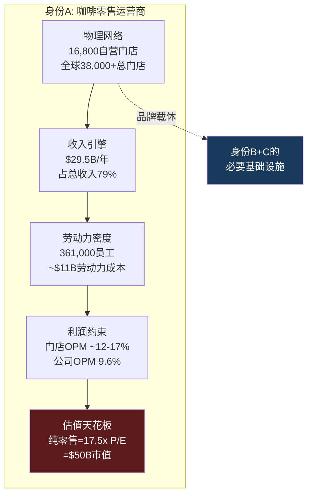
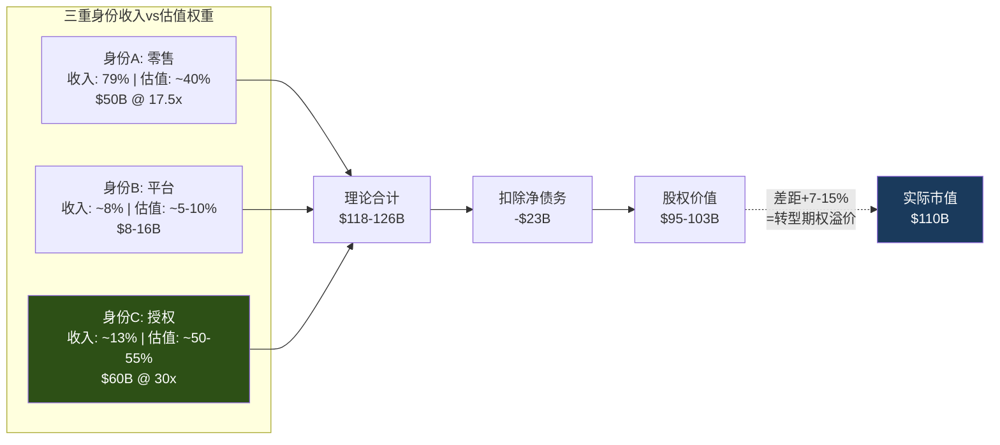
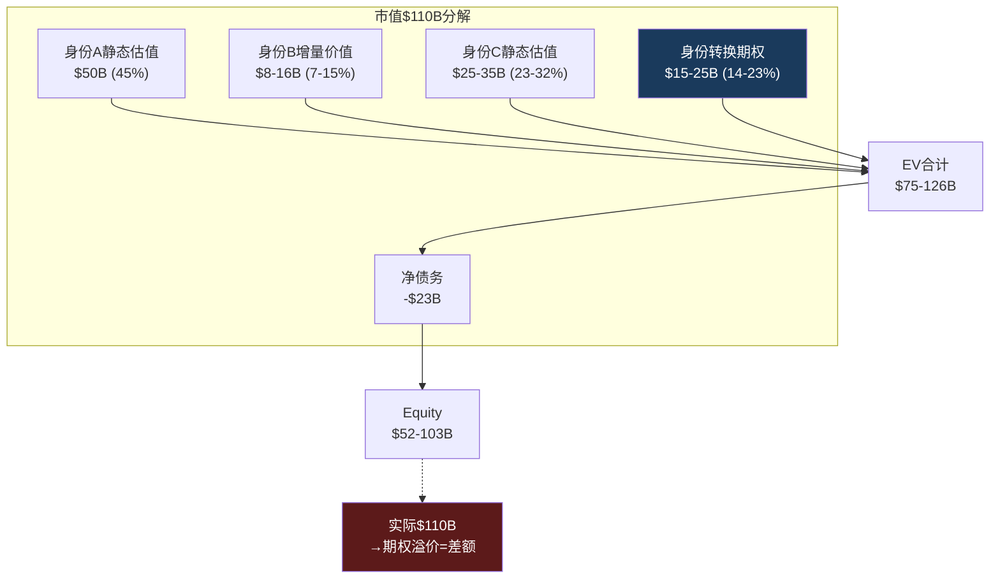

# Ch2 公司身份诊断: 一家公司，三个灵魂

> **核心矛盾映射**: SBUX以78.6x P/E交易，但其OPM仅9.6%——这个倍数只有在SBUX"不仅仅是一家咖啡店"时才合理。本章将量化SBUX三个竞争身份的经济贡献，通过SGI评分定位其专才度，并计算每个身份隐含的估值，最终回答: $110B市值到底在为哪个SBUX买单?

---

## 2.1 为什么"身份"是SBUX估值的核心问题

在大多数上市公司的分析中，"这家公司做什么"是一个不言自明的前提。可口可乐卖饮料(P/E ~25x)，MCD卖汉堡的品牌许可(P/E ~28x)，LVMH卖奢侈品(P/E ~22x)。分析师可以直接跳到增长率和margin的讨论。

SBUX不是这样的公司。它同时具备三种截然不同的商业模式特征——咖啡零售运营商、数字忠诚度平台、和品牌授权公司——每种特征对应不同的资本市场估值框架、不同的P/E锚、不同的风险收益特征。当你给SBUX一个P/E时，你实际上在做一个**隐含的身份权重判断**: 你认为SBUX"更像"谁?

这个判断不是学术讨论——它直接决定了估值区间:

| 如果SBUX是... | 合理P/E | 正常化EPS $2.50下的市值 | vs当前$110B |
|-------------|:------:|:--------------------:|:---------:|
| 纯咖啡零售商(如Darden) | 17x | $48B | **-56%** |
| 数字平台公司(如Spotify) | 30x | $86B | **-22%** |
| 品牌授权商(如MCD) | 28x | $80B | **-27%** |
| 三者加权复合体 | 25-30x | $71-86B | **-22-35%** |
| 市场当前定价 | 42x(正常化) | $110B | — |

[DM-P1-A01](C: 身份估值框架)

**市场给了SBUX 42x的正常化P/E(基于non-GAAP EPS $2.13)——这比任何单一身份的"合理"倍数都高**。这意味着市场正在隐含定价一个**身份转换溢价**: 不仅按当前身份估值，还包含了"SBUX将从身份A向身份B+C迁移"的期权价值。理解这个期权的合理性，需要首先精确量化每个身份的经济贡献 [DM-P1-A02](C: 估值悖论分析)。

---

## 2.2 身份A: 咖啡零售运营商——帝国的肉身

这是SBUX最古老、最直观的身份——开门店、卖咖啡、赚取门店级营业利润。它是SBUX的"肉身"(physical body)——没有它，其他两个身份都无法存在。

### 运营指纹

全球约16,800家自营门店(Company-Operated)构成了这个身份的物理基础 [DM-P1-A03](H: FY2025 10-K Store Count)。以下数据刻画了这个身份的经济特征:

**收入贡献**: FY2025自营门店收入约$29.5B，占总收入$37.2B的**79.3%** [DM-P1-A04](H: FY2025 10-K Segment)。这是一个被低估的数据点——它意味着如果你把SBUX的所有Licensed/CPG收入去掉，剩下的"纯零售"收入仍然是$29.5B，相当于一家Fortune 100级别的零售企业。

**人力密度**: 361,000名员工中绝大多数是门店barista——按16,800家自营门店计算，每店平均约21.5人 [DM-P1-A05](C: 361K employees / 16.8K stores)。这使SBUX成为美国最大的餐饮业雇主之一，也意味着劳动力成本是其P&L中最大的单一变量(~30%收入)。

**资本强度**: FY2025 CapEx $2.31B几乎全部投向门店建设和翻新——这是一个**资本密集型**商业模式 [DM-P1-A06](H: FY2025 Cash Flow)。每家新店投资~$700K，Niccol时代的门店翻新(uplift)投资~$150K/店。FY2026计划完成1,000+店翻新=额外$150M CapEx。

**利润表现**: FY2025公司层面OPM 9.6%——但这包含了总部SGA、利息、和重组费用。门店层面OPM(Store-level Operating Margin)在正常年份约16-17%(FY2023)，FY2025受劳动力投资+关店费用影响降至~12-13% [DM-P1-A07](S: 基于10-K门店级数据推算)。

**这个身份的估值锚**: 纯咖啡零售运营商的合理P/E约15-20x。最精确的参照对象是Chipotle(CMG)——但CMG的32x P/E包含了~25%的增速溢价(SBUX增速仅2.8%)。更保守的参照: Darden Restaurants(DRI, ~17x)、Restaurant Brands(QSR, ~27x但重度特许化)。如果SBUX完全按身份A估值:

$$\text{身份A隐含市值} = \text{正常化EPS} \times \text{零售P/E} = \$2.50 \times 17.5x = \$43.8/share = \$50B$$

[DM-P1-A08](C: 身份A估值推算)

这意味着$110B市值中有约**$60B——超过一半——必须由身份B和身份C来支撑**。身份A是必要的基础设施(没有门店就没有品牌)，但不是估值的驱动力。



### 身份A的结构性约束

身份A面临三个不可回避的结构性约束，这些约束解释了为什么SBUX不能"只做好零售"就实现估值目标:

**约束1: 劳动力成本棘轮效应**。美国餐饮业劳动力成本只涨不跌——最低工资法、工会压力、劳动力市场竞争保证了这一点。SBUX的~$11B劳动力成本(~30%收入)是一个只会膨胀的固定成本基座。Workers United要求的$20/hr起薪(vs当前$15-17/hr)意味着额外$750M-1.5B/年的成本压力。在这个约束下，OPM从9.6%恢复到15%需要非劳动力成本的**等额削减**——而$2B目标中仅45%可在非劳动力领域实现(Ch8供应链分析) [DM-P1-A09](C: 劳动力棘轮分析)。

**约束2: 门店饱和与蚕食**。美国16,800+家门店已经饱和。627家关店是SBUX史上最大规模收缩——CEO将其包装为"战略重置"，但本质是承认过度扩张 [DM-P1-A10](H: Sep 2025 8-K + Earnings Call)。更重要的是: 关店后的comp增长(Q1 FY2026 +4%)可能主要来自蚕食效应——关闭门店的客户转移到存活门店，机械性提升comp(详见Ch11 CSSPD)。

**约束3: 坪效劣势**。SBUX美国门店坪效$750-1,200/sqft/年——仅为Dutch Bros(BROS)$2,211/sqft的约50%。这个差距源于SBUX"第三空间"(Third Place)品牌承诺要求的大面积门店(1,500-2,000 sqft vs BROS ~950 sqft)。更大面积→更高租金→更多员工→更低坪效。Niccol的$150K/店翻新试图提升"停留价值"以justify面积，但结构性坪效劣势不会因翻新消除 [DM-P1-A11](E: 坪效行业数据)。

---

## 2.3 身份B: 数字忠诚度平台——帝国的神经系统

SBUX的第二个身份在过去5年中从"附属功能"升级为"战略核心"。如果身份A是SBUX的肉身，身份B就是其**神经系统**——连接每个客户触点、收集行为数据、驱动个性化消费的数字平台。

### 平台指纹

**用户规模**: 35.5M美国90天活跃Rewards会员(Q1 FY2026)，全球估计>70M [DM-P1-A12](H: Q1 FY2026 Earnings Release)。这个规模在消费品忠诚度领域仅次于Amazon Prime(200M+)和MCD MyRewards(185M全球)——但SBUX的渗透深度(57%收入来自会员)远超MCD(~25%美国参与率)。

**货币化深度**: 57%的美国自营收入来自Rewards会员——这不是"忠诚度奖励"而是**收入基础设施** [DM-P1-A13](H: Q1 FY2026 Earnings)。31%的美国交易通过Mobile Order & Pay完成(Q3 FY2024首次突破30%) [DM-P1-A14](H: Q1 FY2026 Earnings)。

**金融属性**: $1.84B预存卡浮存金——零成本的客户预付资金。年度breakage收入$208M——客户自愿放弃的资金(详见Ch4 DFFV框架) [DM-P1-A15](H: FY2025 10-K + FY2024 10-K)。这使SBUX在功能上类似一家无监管的"微型银行"——持有客户存款、不付利息、每年还有~11%的"存款消失"变成收入。

**AI引擎**: Deep Brew AI平台驱动个性化推荐、库存预测、员工排班。2026年3月重构为三层会员(Green/Gold/Reserve)——SaaS式ARPU分层策略 [DM-P1-A16](H: Investor Day 2026)。

**身份B的估值锚**: 数字忠诚度/订阅平台的合理P/E约25-35x。但SBUX的数字平台不是独立业务(不像Netflix或Spotify)——它完全依赖门店网络。这限制了可比法的适用性。更诚实的估值方式是计算平台的增量价值:

- ARPU per member: $597/年($37.2B × 57% / 35.5M) [DM-P1-A17](C: ARPU计算)
- 如果归因25%的ARPU给平台(而非门店): ~$150/会员/年
- 平台收入: 35.5M × $150 = $5.3B
- 平台OPM: ~40%(假设高margin数字收入)
- 平台OI: $2.1B × 30x P/E = **$63B** ← 但这是高度推测性的

更保守的估值: 仅计算浮存金的独立价值 $1.8-3.9B(Ch4 DFFV) + Rewards的频次溢价估值 → **$8-16B**作为身份B的增量价值 [DM-P1-A18](C: 身份B估值区间)。

### 身份B的战略演变: 从工具到资产的升级

Rewards的角色经历了三个阶段的演化:

| 阶段 | 时间 | Rewards的角色 | 估值含义 |
|------|------|-------------|---------|
| **1.0 获客工具** | 2015-2019 | 积分兑换→吸引到店 | 零独立估值(成本中心) |
| **2.0 数据引擎** | 2019-2024 | 行为数据→个性化→频次提升 | 开始有独立价值(数据资产) |
| **3.0 金融平台** | 2024-2026+ | 预存金浮存+三层会员+AI个性化 | 可能有独立估值(类FinTech) |

[DM-P1-A19](C: Rewards演化阶段)

当前处于2.0→3.0的过渡阶段。三层会员重构(Green/Gold/Reserve)是Rewards 3.0的标志事件——它从"所有人同等对待"转向"按消费层级差异化激励"，本质上是SaaS公司的Free/Pro/Enterprise定价策略的消费品移植。如果3.0成功，身份B的独立估值将显著提升(因为ARPU分层创造了更高的LTV); 如果失败(复杂度增加→用户困惑→参与度下降)，身份B可能回退到2.0 [DM-P1-A20](C: 3.0转型风险)。

---

## 2.4 身份C: 品牌授权公司——帝国的灵魂

SBUX的第三个身份是最新发展的，也是估值潜力最大的。如果身份A是肉身、身份B是神经系统，身份C就是**灵魂**——可以脱离肉身独立存在的品牌价值。

### 授权指纹

**Licensed Store网络**: 全球约17,000+家Licensed Stores由第三方运营。SBUX不承担门店运营成本(租金、劳动力)，仅收取品牌授权费和供应收入。这些门店的OPM对SBUX而言约40-50%(因为收入仅为授权费而非全额门店收入) [DM-P1-A21](S: 10-K Segment推算)。

**Nestle CPG联盟**: 2018年$7.2B预付版权金，换取全球CPG永久分销权(超市零售的整豆/研磨咖啡、Nespresso胶囊、K-Cup pods等) [DM-P1-A22](H: 2018 Nestle Deal)。这是SBUX身份C的里程碑——它证明了SBUX品牌可以**完全独立于门店运营**产生收入。$5.77B的非当期递延收入(Nestle预付余额)至今仍在资产负债表上逐年摊销确认 [DM-P1-A23](H: FY2025 Balance Sheet)。

**Channel Development**: CPG+RTD(即饮)通道收入~$1.8B/年，利润率远高于门店(接近纯品牌授权) [DM-P1-A24](H: 10-K Segment)。

**中国JV(2025年11月)**: 将8,011家中国门店从自营转为JV模式(Boyu Capital 60% / SBUX 40%)，SBUX保留品牌IP和许可权 [DM-P1-A25](H: Nov 2025 8-K)。这是身份C的**加速催化剂**——中国从P&L负担(低OPM+竞争压力)转变为纯品牌授权收入(许可费+40%权益法收益)。JV后International OPM目标从13%提升到>20% [DM-P1-A26](H: Investor Day FY2028 Target)。

**身份C的估值锚**: 纯品牌授权公司的合理P/E约28-35x。MCD(28x, 95%特许化)是终极参照。YUM Brands(29x, 97%特许化)和QSR(27x)提供了额外锚点。

如果SBUX的授权/CPG收入约$5B(Licensed ~$3.2B + Channel Dev ~$1.8B)，OPM ~40%:
$$\text{身份C隐含估值} = \$5B \times 40\% \times 30x = \$60B$$

[DM-P1-A27](C: 身份C估值推算)

**$60B**——这个数字意味着身份C可能已经占SBUX估值的**55%**，尽管它仅贡献了总收入的~13%。这就是品牌授权的估值杠杆: 低收入、高利润、高倍数。



[DM-P1-A28](C: 三重身份估值合计)

---

## 2.5 SGI评分: 星巴克有多"专才"?

SGI(Specialist-Generalist Index)评估公司在其核心业务上的不可替代程度。SGI越高，意味着公司的竞争优势越依赖于特定领域的深度积累——这通常对应更高的估值溢价(专才壁垒)，但也意味着更大的集中度风险 [DM-P1-A29](C: SGI框架)。

### 五维评分

| 维度 | 分数(0-10) | SBUX具体表现 | vs IHG(6.78) | vs KLAC(8.2) |
|------|:----------:|-------------|:----------:|:----------:|
| **营收集中度** | **9** | 95%+收入来自咖啡饮品及相关食品零售；即使CPG通道也是咖啡产品 | IHG: 8 | KLAC: 9 |
| **技能可迁移性** | **3** | 咖啡零售运营→其他餐饮有部分迁移性，但品牌DNA高度咖啡化(Teavana茶饮品牌收购后关闭=迁移失败案例) | IHG: 4 | KLAC: 2 |
| **客户依赖度** | **5** | 35.5M Rewards会员广泛分散，无单一大客户；但57%收入依赖Rewards体系=系统性集中 | IHG: 6 | KLAC: 7 |
| **供应链专业化** | **6** | 咖啡豆采购→烘焙→门店运营的纵向一体化；6个烘焙工厂；C.A.F.E.认证体系；但非独占性(任何竞争对手可采购同品质咖啡豆) | IHG: 5 | KLAC: 9 |
| **监管特异性** | **3** | 食品安全标准化，跨国运营合规成本高但无特殊监管壁垒(vs 金融/医疗/半导体出口管制) | IHG: 4 | KLAC: 7 |
| **SGI总分** | **6.5** | **中度专才** — 品牌+运营专业化但非垄断 | 6.78 | 8.2 |

[DM-P1-A30](C: SGI框架评分)

```mermaid
%%{init: {'theme': 'dark'}}%%
radar
    title "SGI雷达: SBUX vs 消费品同业"
    axis 营收集中度, 技能可迁移性, 客户依赖度, 供应链专化, 监管特异性
    "SBUX(6.5)" : [9, 3, 5, 6, 3]
    "MCD(5.8)" : [8, 4, 4, 4, 3]
    "IHG(6.78)" : [8, 4, 6, 5, 4]
    "COST(6.2)" : [7, 5, 7, 5, 3]
```

### SGI 6.5的含义

**中度专才**意味着SBUX处于一个微妙的位置: 足够专业化以拥有品牌壁垒(全球第6品牌, Interbrand 2024)，但不够专业化以享受垄断级定价权(任何人可以开咖啡店) [DM-P1-A31](C: SGI解读)。

与半导体设备公司(KLAC SGI 8.2)不同，SBUX的专业化更多体现在**品牌和文化层面**(难以量化但极其黏性)，而非技术或监管层面(可量化但门槛更高)。一家新的咖啡品牌可以在一年内开出1,000家店(瑞幸做到了)——但不可能在一年内建立SBUX 50年的品牌积累。这种"软壁垒"的挑战是: 它保护的是消费者心智份额，而非物理或法规层面的进入壁垒。心智份额可以缓慢被侵蚀(年轻消费者转向BROS/瑞幸)——但不会突然崩塌。

**SGI 6.5对估值框架的指导**:
- 需要独立的品牌价值量化(本章三重身份已完成)
- 不需要IHG级别(6.78)的超专才溢价框架(因为品牌是"软壁垒"非"硬壁垒")
- A-Score中品牌维度权重应从消费品标准15%提升到20%(反映品牌在SBUX估值中的核心地位)

---

## 2.6 身份溢价分析: 从ETN/WMT移植

身份溢价(Identity Premium)是我们在ETN(4.3/5)和WMT(356K)报告中验证的分析框架: 当市场对一家公司的"本质"定义发生变化时——例如从"工业公司"重新定义为"电气化平台"(ETN)——估值倍数可以发生**阶跃式跳升**，即使基本面未变 [DM-P1-A32](C: 身份溢价方法论, 从ETN 4.3移植)。

### SBUX的身份迁移路径

| 阶段 | 时间 | 主导身份 | P/E区间 | 催化剂 |
|------|------|---------|:-------:|--------|
| **传统零售商** | 1992-2008 | A: 咖啡运营商 | 20-30x | 门店扩张驱动增长 |
| **Schultz回归** | 2008-2017 | A→B过渡 | 25-35x | 移动支付+Rewards启动 |
| **Nestle交易** | 2018 | B+C初形成 | 25-30x | $7.2B CPG授权=身份C正式确立 |
| **COVID+Johnson** | 2019-2024 | 混乱期 | 20-30x | 身份模糊+中国问题+工会 |
| **Niccol时代** | 2024- | B+C为目标 | 30-78x | CEO光环+中国JV=身份C加速 |

[DM-P1-A33](C: 身份迁移时间线)

**当前时刻的独特性**: Niccol上任标志着SBUX可能正在经历从"A为主+B/C为辅"向"B/C为主+A为辅"的身份翻转。中国JV是这个翻转的第一个具体行动——将8,011家自营门店(身份A)转变为品牌授权(身份C)。

### 身份翻转的估值力学: 非线性的双刃剑

身份溢价有一个危险的非线性特征: **半转型比不转型更危险**。

考虑三种情景:

| 情景 | 特许化比例 | 收入变化 | OPM | 合理P/E | 隐含股价 |
|------|:---------:|:-------:|:---:|:------:|:--------:|
| 维持现状(55%自营) | 55% | $37B | 10% | 20x | $55 |
| **半转型(65%特许化)** | 65% | $32B | 14% | 24x | **$58** |
| 全特许化(85%) | 85% | $23B | 28% | 32x | $115 |

[DM-P1-A34](C: 特许化梯度估值)

**半转型($58)比维持现状($55)仅高5%**——因为收入减少(-14%)的负面效果几乎完全抵消了OPM提升(+400bps)和倍数提升(20x→24x)的正面效果。只有当特许化达到**临界点**(~75%+)时，倍数跳升(30x+)才能compensate收入下降。

这就是为什么中国JV虽然方向正确(身份C迁移)，但如果美国不跟进——SBUX就卡在"半转型"的估值无人区: 既不是高增长零售商(收入降了)，也不是高margin授权商(OPM不够高)。

---

## 2.7 身份权重隐含反演: $110B在为哪个SBUX买单?

整合三重身份的分析，我们可以构建一个"身份权重隐含反演"——从$110B市值反推市场对每个身份的隐含权重 [DM-P1-A35](C: 反演框架)。

### 约束条件下的权重求解

设身份A权重为 $w_A$，身份B为 $w_B$，身份C为 $w_C$，有:
- $w_A + w_B + w_C = 1$
- 隐含P/E = $w_A \times 17.5 + w_B \times 30 + w_C \times 30$
- 当前隐含P/E ≈ 42x(基于正常化EPS $2.50, 市值$110B ÷ 1.14B shares ÷ $2.50)
- 约束: $w_A ≥ 0.3$(55%自营收入仍为主体)

求解 $17.5 w_A + 30(1-w_A) = 42$ → $w_A = -0.96$ ← **无解**

这意味着即使100%按身份B+C估值(30x)，也无法reach 42x。42x的达成需要:
- 要么身份B/C的合理P/E高于30x(→35x+，接近高增长SaaS)
- 要么市场在定价**身份转换的期权价值**(超出静态身份估值)

**结论: $110B包含了显著的"身份转换期权溢价"**——大约$15-25B的市值不能被任何静态身份估值解释。这个期权的价值取决于: 特许化速度(Ch18 FCO)、Rewards 3.0的货币化成功(Ch4 DFFV)、以及Niccol持续执掌的概率(Ch7 CEO评分卡) [DM-P1-A36](C: 身份权重反演结论)。



---

## 本章小结

| 发现 | 量化结论 | 对CQ的映射 |
|------|---------|-----------|
| 身份A估值$50B = 市值45% | 纯零售不足以支撑当前股价 | CQ1: 78x需要B+C成功 |
| 身份C可能占估值50-55% | 仅贡献13%收入→巨大估值杠杆 | CQ3: 中国JV是身份C加速 |
| SGI 6.5 = 中度专才 | 品牌是"软壁垒"非"硬壁垒" | CQ5: Rewards是壁垒的未来 |
| 42x P/E包含$15-25B期权溢价 | 超出任何静态身份估值 | CQ1: 估值的核心驱动力 |
| 半转型($58)≈维持现状($55) | 身份暧昧=估值无人区 | CQ1: BME的底层约束 |
| 全特许化(85%)隐含$115 | 但需5-10年+工会解决 | CQ2: Niccol的时间窗口 |

**后续章节预传导**: 身份权重将锚定Ch12 Reverse DCF的倍数假设——不同身份路径对应不同terminal multiple。身份C权重的变化将在Ch18(特许化转换期权)中用FCO框架量化。身份B的独立价值将在Ch4(DFFV)中通过浮存金估值来验证。
