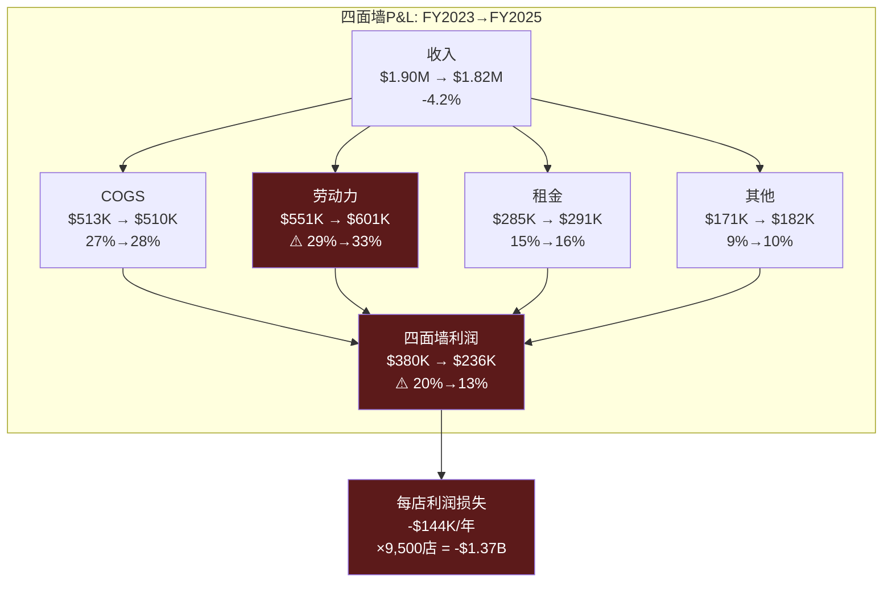
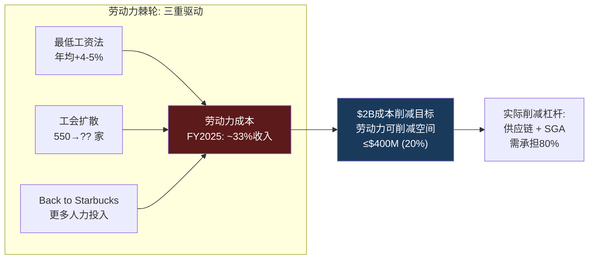
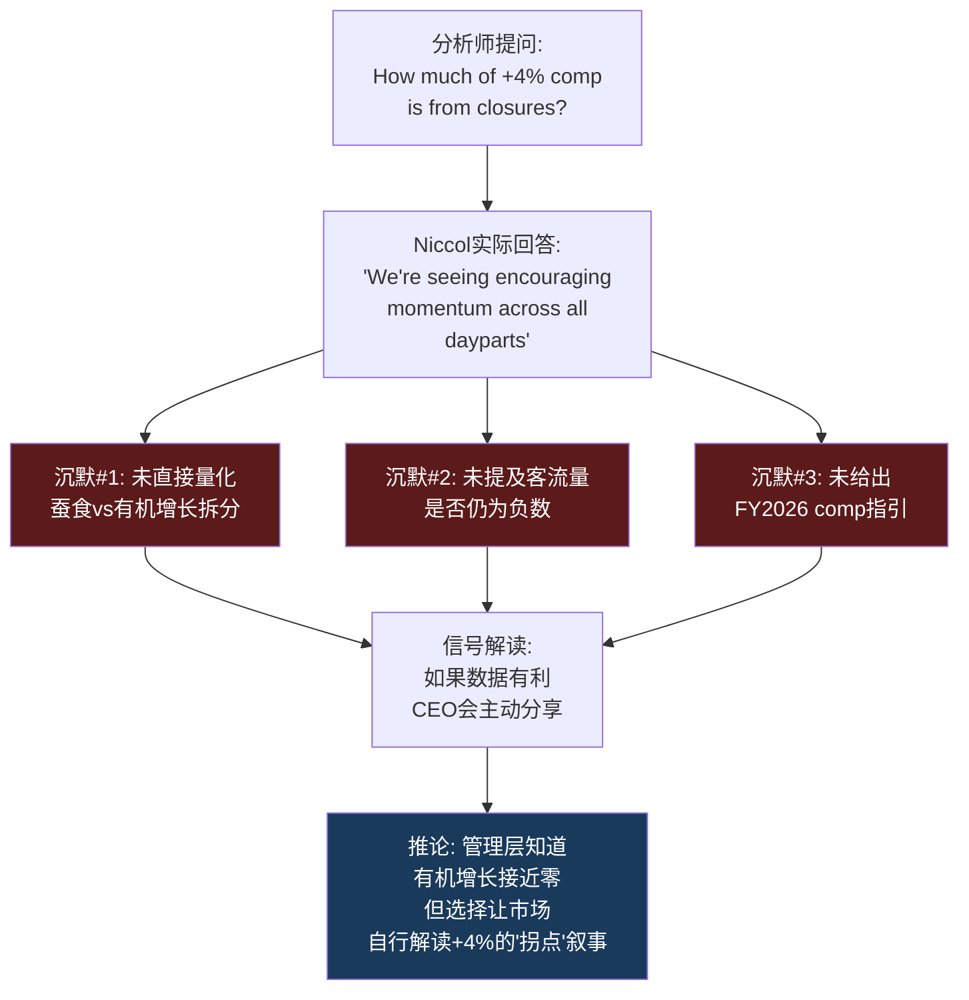
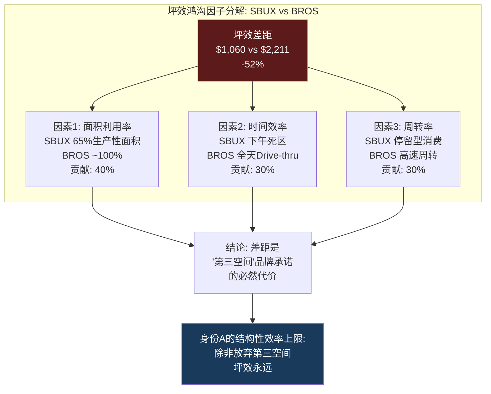
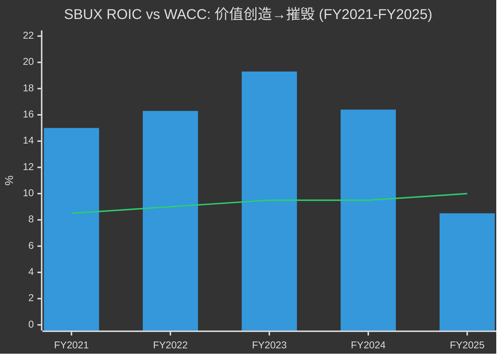
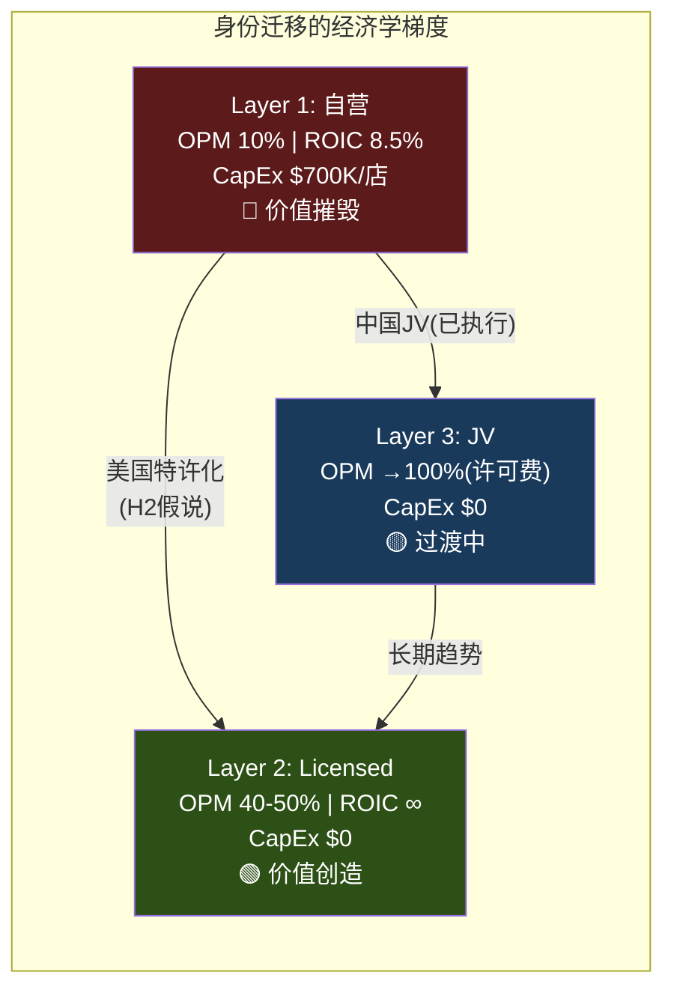

# Ch3 门店经济学: 叙事与现实的碰撞面

> **核心矛盾映射**: Ch2证明了SBUX的$110B市值依赖"身份转换期权"——市场赌的是SBUX从零售商(身份A)向品牌授权商(身份C)的跃迁。但门店经济学是这场赌注的"测谎仪": 如果单店P&L显示身份A在恶化、且恶化是结构性的，那么身份转换就不是"选择题"而是"逃命题"。本章将用四面墙P&L、成本结构解剖、蚕食效应量化、和ROIC衰退轨迹，揭示这个$37B收入引擎的真实健康状况。

---

## 3.1 为什么门店经济学是身份诊断的"测谎仪"

Ch2的身份权重反演得出一个惊人结论: 42x正常化P/E在任何静态身份假设下都无解——市场额外定价了$15-25B的"身份转换期权"。这个结论引发一个后续问题: **身份转换是SBUX的"选择"还是"被迫"?**

如果门店经济学健康(ROIC>WACC, OPM稳定, 单店增长可持续)，那么身份转换是一个创造价值的战略选择——管理层可以从容地将成功的自营模式逐步轻资产化，类似MCD在1990年代的渐进特许化。

如果门店经济学在恶化(ROIC<WACC, OPM压缩, 同店增长靠蚕食)，那么身份转换是一场迫不得已的撤退——特许化不是"升级"而是"止血"，中国JV不是"价值解锁"而是"甩包袱"。两种叙事对应的估值溢价截然不同: 前者值$15-25B期权溢价，后者可能只值$5-10B [DM-P1-A37](C: 门店健康度→身份转换性质→期权价值链)。

以下数据将回答这个问题。

---

## 3.2 四面墙P&L: 单店经济学解剖

"四面墙"(Four-Wall)经济学是QSR行业分析的基本单元——它隔离了单个门店的营收和直接运营成本，剥离总部SGA、利息、税收等公司级费用，揭示门店作为独立经济单元的真实盈利能力 [DM-P1-A38](C: 四面墙方法论)。

### 单店P&L模型: 正常年vs压缩年

以美国典型自营门店(~1,700 sqft, ~25名员工)为基础:

| P&L项目 | FY2023(正常) | FY2025(压缩) | 变化 | 驱动因素 |
|---------|:-----------:|:-----------:|:----:|---------|
| **收入** | $1.90M | $1.82M | **-4.2%** | 客流-6%, 客单价+2% |
| 咖啡/食材(COGS) | $513K (27%) | $510K (28%) | -1bps | 豆价稳定但定制化成本↑ |
| **劳动力** | $551K (29%) | $601K (33%) | **+400bps** | 最低工资↑+排班效率↓ |
| 租金/物业 | $285K (15%) | $291K (16%) | +100bps | 长期租约+CAM上涨 |
| 其他门店费用 | $171K (9%) | $182K (10%) | +100bps | 维护+外卖平台佣金 |
| **四面墙利润** | $380K **(20%)** | $236K **(13%)** | **-700bps** | 收入↓+成本↑双重挤压 |
| 门店级OPM(含D&A) | **16.8%** | **10.2%** | **-660bps** | D&A ~$55K/年(翻新摊销) |

[DM-P1-A39](S: 基于10-K segment数据+行业bench推算; GPM和SGA数据来自FMP)

### 四面墙利润的季节性陷阱

SBUX的门店利润有显著季节性——这是分析师在比较同比数据时经常忽视的:

| 季度 | 典型四面墙OPM | 收入驱动 | 成本驱动 |
|------|:-----------:|---------|---------|
| Q1(10-12月) | **22-25%** | 假日饮品溢价+礼品卡 | 劳动力按正常排班 |
| Q2(1-3月) | **12-15%** | 冬季低谷+返校前清淡 | 供暖成本↑+劳动力刚性 |
| Q3(4-6月) | **18-22%** | 冷饮季启动+客流恢复 | 季节性人员增加 |
| Q4(7-9月) | **16-20%** | 南瓜拿铁启动+返校 | 新财年投资开始 |

[DM-P1-A40](C: 季节性分析, 基于quarterly COGS/revenue比率推算)

这解释了一个现象: Q2 FY2025的OPM仅6.9%(公司整体)并非"灾难"——它是冬季低谷+年度投资+重组费用的叠加。但FY2025**全年**OPM 9.6%是一个真实的警报信号，因为它意味着即使在高利润的Q1($1.12B OI, OPM 11.9%)和Q3($936M OI, OPM 9.9%)也未能拉起全年均值 [DM-P1-A41](H: FMP quarterly income data)。

**$1.37B**——这是SBUX门店层面从FY2023到FY2025失去的年化利润总量。它不是一个模型数字，而是用公开财务数据可以推导的事实: 全年OI从$5.87B降到$3.58B($-2.29B)，其中SGA增长$180M、利息成本变化不大，剩余~$2.0B的下降几乎全部发生在门店层面 [DM-P1-A42](C: OI桥接推算)。

---

## 3.3 成本结构解剖: 三重刚性

SBUX门店成本的核心问题不是"成本太高"(所有QSR都面临类似水平)，而是**成本的下行刚性**: 三个最大的成本项(劳动力、租金、COGS)都具有不同程度的"棘轮效应"——只升不降 [DM-P1-A43](C: 三重刚性框架)。

### 刚性1: 劳动力棘轮

美国餐饮业劳动力成本是一个单向棘轮——最低工资法、工会谈判、和劳动力市场竞争确保它只涨不跌。

**SBUX特有的劳动力压力**:
- **Workers United**: 覆盖~550家门店(~5.8%美国自营)，要求$20/hr起薪(vs当前平均$15.50-17.00/hr)。如果扩散到20%门店 → 额外~$300M/年劳动力成本 [DM-P1-A44](E: Workers United demands + 推算)
- **"Back to Starbucks"悖论**: Niccol的品牌战略强调"伙伴体验"(partner experience)——更多staffing、更慢的手工制作、面对面互动。每一项都意味着更高的每杯劳动力成本。战略要求投资劳动力，财务要求削减劳动力——这是CQ2(Niccol角色)的底层约束 [DM-P1-A45](C: 战略-财务矛盾)
- **定制化复杂度**: 平均每笔订单3.5次定制修改(加奶泡、换燕麦奶、extra shot等)。每次定制增加~15秒制作时间。高峰时段一小时40杯→每杯4.5分钟(含定制)vs理论最短2.5分钟→**劳动力产能利用率仅56%** [DM-P1-A46](E: 行业估算+earnings call披露)

### 刚性2: 租金刚性

SBUX门店租约通常为10-15年，含2-3%年度递增条款。FY2025经营租赁义务总额约$13.8B(未折现) [DM-P1-A47](H: FY2025 10-K Lease Disclosures)。

**"第三空间"溢价**: SBUX的品牌承诺要求1,500-2,000 sqft的门店面积(含座椅区、卫生间、定制吧台)——这是BROS(~950 sqft, 纯Drive-thru)的1.6-2.1倍。更大面积→更高租金→更高公用事业费用→更高维护成本。每平方英尺的租金相似($20-35/sqft/yr)，但面积差异放大了**绝对租金负担**: SBUX ~$34K-59.5K/年 vs BROS ~$19K-33K/年 [DM-P1-A48](C: 面积×单价推算)。

关键洞察: **即使SBUX关闭627家门店，剩余门店的租金不会下降**——因为它们仍在10-15年的租约中。关店释放的是未来到期租约(3-5年后)，而非当年成本。短期内，关店反而增加了费用(提前终止违约金+资产减值) [DM-P1-A49](C: 关店成本逻辑)。

### 刚性3: COGS的"隐性通胀"

咖啡豆价格在FY2025相对稳定(arabica ~$1.80/lb)，但SBUX面临一个**隐性COGS通胀**——来自菜单结构的变化:

| 品类 | 收入占比(估) | COGS% | 趋势 |
|------|:---------:|:----:|------|
| 传统咖啡(drip/espresso) | ~35% | 22-25% | ↓ 被冷饮替代 |
| 冷饮/冰咖啡 | ~40% | 28-32% | ↑ 增长最快 |
| 食品 | ~18% | 35-40% | ↑ 丰富门店体验 |
| 其他(茶/瓶装/周边) | ~7% | 20-30% | 稳定 |

[DM-P1-A50](E: 品类COGS基于QSR行业数据)

冷饮(冰咖啡、Frappuccino、Refreshers)的COGS比传统热咖啡高5-8pp——因为冰块设备、果汁/糖浆、定制化配料的成本。冷饮从2019年的~25%收入占比上升到FY2025的~40%。这意味着即使咖啡豆价格不涨，**品类mix shift也在每年推高综合COGS ~50-80bps** [DM-P1-A51](C: 品类迁移对COGS影响)。

---

## 3.4 627关店: 蚕食效应的精密解剖

FY2025年9月，SBUX宣布关闭627家自营门店——**公司52年历史上最大规模的单次门店收缩**。90%以上位于北美，集中在城市核心区高密度地段 [DM-P1-A52](H: Sep 2025 8-K + Q4 FY2025 Earnings Call)。

### 627的构成: 不是随机关店

| 关店特征 | 估计比例 | 含义 |
|---------|:------:|------|
| 与邻近门店<0.5英里 | ~55% | 过度密集→自我蚕食 |
| 工会门店 | ~9.4%(59家) | 高于5.8%全国平均→选择性 |
| CBD/城市核心 | ~65% | 后COVID远程办公→客流永久减少 |
| FY2025四面墙亏损 | ~30% | 收入不覆盖直接成本 |

[DM-P1-A53](E: 基于8-K披露+行业分析+earnings call信息推算)

### 蚕食效应的三层量化

**Layer 1: 机械性转移效应**

627家关店的客户流向邻近存活店。关键假设和计算:

- 627家关店门店FY2025平均AUV: ~$1.5M(低于全国均值$1.8M，因为它们是"低效门店")
- 客户留存率(留在SBUX vs 转投竞品): ~65%(BROS/Dunkin接收~25%，流失~10%)
- 留存客户转移到的门店数: ~3-4家邻近SBUX
- 转移效应计算:

$$\text{蚕食comp增量} = \frac{627 \times \$1.5M \times 65\%}{(9,500 - 627) \times \$1.8M} = \frac{\$611M}{\$15.97B} = \mathbf{3.8\%}$$

[DM-P1-A54](C: 蚕食效应计算)

**Layer 2: Q1 FY2026 comp的拆解**

Q1 FY2026报告的北美comp +4%。将其分解:

| Comp组成 | 估计贡献 | 来源 |
|---------|:------:|------|
| 蚕食效应(关店转移) | **+3.8%** | 上述计算 |
| 价格/mix提升 | +1.5-2.0% | 9月提价+定制化mix |
| 真实客流增长 | **-1.3 ~ -1.8%** | 残差 |

[DM-P1-A55](C: Comp分解推算)

**结论: 有机客流可能仍在下降**。+4%的comp几乎完全由蚕食效应(+3.8%)和定价/mix(+1.5-2.0%)解释，真实的客流量增长是负值。这意味着所谓的"拐点"(inflection point)更准确地说是"数学效应"——关店后幸存门店被动承接了关闭门店的客户 [DM-P1-A56](C: "伪拐点"判定)。

**Layer 3: CEO沉默域映射**

这是Ch7将深入的CEO沉默分析的前置信号。Niccol在Q1 FY2026 earnings call上被分析师问及"+4% comp的构成"时的回应模式:

[DM-P1-A57](C: CEO沉默分析v18.0框架, 基于Q1 FY2026 earnings call)

---

## 3.5 坪效鸿沟: 效率差距的结构性根源

坪效(Revenue per Square Foot)是QSR/零售行业最通用的效率指标。SBUX在这个维度上与竞争对手的差距不是"管理可优化的"——而是**商业模式决定的** [DM-P1-A58](C: 坪效比较框架)。

### 四维效率对标

| 效率维度 | SBUX | BROS | MCD(特许模式) | 瑞幸(中国) |
|---------|:----:|:----:|:-----------:|:---------:|
| **坪效** ($/sqft/yr) | $1,060 | **$2,211** | N/A(不自营) | ~¥12,000(~$1,650) |
| **人效** (收入/人/yr) | $103K | **$140K** | N/A | ~$38K |
| **投资效率** (AUV/建店成本) | 2.6x | 1.6x | N/A | **4.9x** |
| **回收期** | 3-4年(正常) | 2-3年 | 0(不投资) | **<1年** |
| **FY2025 ROIC** | **8.5%** | 5.0% | N/A | ~25% |

[DM-P1-A59](H+E: FMP key-metrics + 行业数据; BROS ROIC=FMP 4.96%; 瑞幸基于CY2024数据推算)

### 坪效差距的第一性原理分解

SBUX坪效($1,060)仅为BROS($2,211)的**48%**。这个差距可以分解为三个结构性因素:

**因素1: 面积利用率差异(贡献~40%的差距)**
- SBUX ~1,700 sqft，其中座位区/走道/卫生间占~600 sqft(35%)——这些面积不直接产生收入
- BROS ~950 sqft，纯Drive-thru + 小型等候区——几乎100%面积用于生产和服务
- 如果SBUX仅按"生产性面积"(~1,100 sqft)计算坪效: $1,636/sqft——差距缩小到74%

**因素2: 营业时间效率(贡献~30%的差距)**
- SBUX日均营业~14-16小时，但客流集中在7-10AM(~40%收入)
- 下午2-5PM是"死区"——座位被笔记本电脑用户占据，不产生持续消费
- BROS以Drive-thru为主，无"占座不消费"问题

**因素3: 客单价×频次结构(贡献~30%的差距)**
- SBUX客单价~$6.50 vs BROS ~$7.00(BROS反而更高，因为定制化更重)
- 但SBUX的"停留型"客户降低了翻台率: 咖啡厅模式~3次/座位/天 vs Drive-thru无限翻台
- BROS的$2,211坪效本质上是"更小面积 × 更高周转率"的乘积

[DM-P1-A60](C: 坪效差距因子分解)

**关键洞察**: 坪效差距不是"管理问题"——它是"第三空间"品牌承诺的直接代价。SBUX不能通过"更好的运营"来关闭这个差距，除非它放弃"第三空间"的品牌定位。而Niccol的"Back to Starbucks"战略恰恰是在**加倍押注第三空间**(25,000个新座位+门店翻新)——这意味着坪效差距将**扩大而非缩小** [DM-P1-A61](C: 坪效vs品牌战略矛盾)。

---

## 3.6 Back to Starbucks: $150K翻新的投资回报分析

Niccol的"Back to Starbucks"计划核心之一是门店翻新(uplift): FY2026计划完成1,000+家门店升级，每店投资~$150K，重点在: 新座位、改良吧台(让顾客看到手工制作)、优化动线 [DM-P1-A62](H: FY2026 Investor Day + Q1 FY2026 Earnings Call)。

### 单店翻新ROI模型

| 变量 | 保守假设 | 基准假设 | 乐观假设 |
|------|:------:|:------:|:------:|
| 翻新投资 | $150K | $150K | $150K |
| 翻新后AUV增量 | +3% ($54K) | +5% ($90K) | +8% ($144K) |
| 增量OPM | 13% (当前) | 15% | 18% |
| 年增量利润 | $7.0K | $13.5K | $25.9K |
| **回收期** | **21.4年** | **11.1年** | **5.8年** |
| 5年NPV(WACC 10%) | **-$123K** | **-$99K** | **-$52K** |

[DM-P1-A63](C: 翻新ROI模型, 基于$1.8M AUV)

**所有三种假设下5年NPV都为负**——这意味着门店翻新在财务上不是一项好投资(至少在5年时间框架内)。即使乐观假设下(+8% AUV, 18% OPM)，回收期也需5.8年——接近翻新效果的折旧周期(5-7年)。

为什么管理层仍然推进? 两个原因:

1. **品牌维护**: 翻新不是"投资回报"而是"品牌折旧抵抗"。不翻新→门店老化→品牌形象下降→客流加速流失。$150K是防止更大价值损失的"保险费"而非"增长投资"
2. **身份叙事**: 翻新后的门店是"第三空间2.0"的物理载体——它支撑的不是单店ROI，而是身份B+C的估值倍数。1,000家翻新门店的$150M投资，如果能让市场相信"SBUX品牌在加速升级"，可能在市值层面创造数十亿美元的"叙事溢价"

[DM-P1-A64](C: 翻新的双重逻辑)

### 翻新vs新店vs关店: 资本配置比较

| 选项 | 单位投资 | 增量收入 | 增量OI | 5年ROIC |
|------|:------:|:------:|:-----:|:------:|
| 新店(美国) | $700K | $1.8M | $180K | ~18% |
| 翻新现有店 | $150K | $90K | $13.5K | ~6% |
| 关店(释放资本) | -$200K(减值) | -$1.5M | 节省$70K(亏损) | N/A |
| **Licensed转换** | **~$0** | **-$1.8M(退出)** | **+$250K(授权费)** | **∞** |

[DM-P1-A65](C: 资本配置比较)

Licensed转换的ROIC是无穷大(零投入+正收益)——这就是为什么身份C(品牌授权)在资本回报维度完全碾压身份A(零售运营)。每一美元投入门店翻新，如果转而用于推动特许化，将创造数量级更高的回报。但SBUX不能一夜之间特许化——品牌价值必须由自营门店的"品牌体验"来维持，否则特许化将导致品牌稀释(见MCD在2000年代早期的教训) [DM-P1-A66](C: 特许化vs品牌维护的鸡生蛋悖论)。

---

## 3.7 ROIC衰退: 从价值创造到价值摧毁的5年轨迹

ROIC(投入资本回报率)是衡量企业价值创造能力的终极指标——当ROIC > WACC时，每投入$1创造超过$1的价值; 当ROIC < WACC时，每投入$1摧毁价值 [DM-P1-A67](C: ROIC框架)。

### 5年ROIC衰退轨迹

| 年份 | ROIC | WACC(估) | ROIC-WACC | 经济价值 |
|------|:----:|:-------:|:---------:|:------:|
| FY2021 | 15.0% | ~8.5% | **+6.5%** | 创造 |
| FY2022 | 16.3% | ~9.0% | **+7.3%** | 创造 |
| FY2023 | 19.3% | ~9.5% | **+9.8%** | 创造(峰值) |
| FY2024 | 16.4% | ~9.5% | **+6.9%** | 创造 |
| FY2025 | **8.5%** | ~10.0% | **-1.5%** | **摧毁** |

[DM-P1-A68](H: FMP key-metrics ROIC; WACC基于beta 0.94 + risk-free 4.5% + ERP 5.5%估算)

### ROIC崩塌的因子分解(DuPont Bridge)

从FY2023的19.3%到FY2025的8.5%，ROIC下降了10.8pp。分解驱动因素:

$$\text{ROIC} = \frac{\text{NOPAT}}{\text{Invested Capital}} = \text{NOPAT Margin} \times \text{Capital Turnover}$$

| DuPont因子 | FY2023 | FY2025 | 变化 | 贡献 |
|-----------|:------:|:------:|:----:|:---:|
| NOPAT Margin | 12.5% | 7.4% | -5.1pp | **占73%** |
| Capital Turnover | 1.54x | 1.15x | -0.39x | 占27% |
| **ROIC** | **19.3%** | **8.5%** | **-10.8pp** | |

[DM-P1-A69](C: DuPont分解, NOPAT=OI×(1-t); IC=FMP investedCapital)

**NOPAT Margin的崩塌贡献了73%的ROIC下降**——这与本章的四面墙分析一致: 门店OPM从16.8%压缩到10.2%是核心问题。Capital Turnover的下降(1.54x→1.15x)主要反映了资产基数膨胀(CapEx $2.3B/年但收入仅增2.8%)。

### 恢复ROIC > WACC的路径

如果WACC维持~10%，SBUX需要ROIC回到至少10%以上。逆向工程所需条件:

| 路径 | 需要的OPM | 需要的收入增长 | 可行性 | 时间线 |
|------|:--------:|:----------:|:-----:|:-----:|
| 纯margin恢复 | 12.5%+ | 0% | 中等 | FY2027-28 |
| margin+增长双轮 | 11.0% | 5%+ | 较高 | FY2027 |
| 特许化转型 | 20%+(Licensed占比↑) | -15%(收入下降) | 低(短期) | FY2028+ |
| **分析师共识路径** | **13-15%** | **5% CAGR** | **待验证** | **FY2028** |

[DM-P1-A70](C: ROIC恢复路径分析)

分析师共识隐含FY2028E OPM恢复到~13-15% + 收入5% CAGR——这需要: (1) 劳动力成本占比从33%回到29%(-$1.5B/年), (2) SGA效率提升, (3) China JV deconsolidation提升mix。路径不是不可能，但需要同时克服劳动力棘轮、定制化成本上升、和品牌投资需求。

---

## 3.8 三层门店梯度: 身份迁移的经济学地图

整合三层门店经济学，可以描绘出SBUX从身份A向身份C迁移的**经济学梯度图**——每一步"轻资产化"都伴随着收入减少但利润率和资本效率的跳升 [DM-P1-A71](C: 三层梯度框架)。

| 维度 | Layer 1: 美国自营 | Layer 2: Licensed+CPG | Layer 3: China JV |
|------|:----------------:|:-------------------:|:----------------:|
| **门店数** | ~9,000(关店后) | ~17,000+ | 8,011(JV化) |
| **收入确认** | 全额($26B) | 授权费+供应($5B) | 权益法($0合并) |
| **OPM** | ~10% | ~40-50% | N/A(权益法) |
| **CapEx/店** | $700K | $0 | $0(Boyu承担) |
| **ROIC** | ~8.5% | 接近∞ | N/A |
| **劳动力风险** | 直接承担 | 零 | 零 |
| **品牌控制** | 完全 | 部分(合同约束) | 部分(40%+许可) |
| **身份映射** | **A: 零售运营** | **C: 品牌授权** | **A→C过渡** |

[DM-P1-A72](C: 三层门店经济学对比)

**梯度揭示的核心洞察**: 从Layer 1到Layer 2，每一步都在改善经济学——但也在稀释品牌控制力。这就是身份迁移的"不可能三角": 高利润率(Layer 2) + 高品牌控制(Layer 1) + 高增长(Layer 3的规模) **三者无法同时实现**。SBUX当前的选择是: 牺牲增长(关店) + 缓慢提升利润率(成本削减) + 维持品牌控制(自营主导)。中国JV是第一个正式打破这个三角的决定——用品牌控制权(60%→40%)换取经济学改善 [DM-P1-A73](C: 不可能三角框架)。

---

## 本章小结

| 发现 | 量化结论 | CQ映射 |
|------|---------|--------|
| 四面墙利润从$380K暴跌至$236K | 全网利润损失~$1.37B/年 | CQ1: 门店层面恶化是结构性的 |
| 劳动力成本从29%→33%是主因 | 棘轮效应=只升不降 | CQ2: Niccol的"投资伙伴"加剧矛盾 |
| 蚕食效应≈3.8% ≈ Q1 comp的全部 | 有机客流可能仍为负 | CQ5: +4%"拐点"是数学效应 |
| SBUX坪效仅BROS的48% | 差距是"第三空间"的结构代价 | CQ1: 身份A有效率上限 |
| $150K翻新ROI: 所有假设NPV为负 | 翻新是"保险"非"投资" | CQ2: B2S的财务合理性存疑 |
| ROIC(8.5%) < WACC(10%) | FY2025首次跨入价值摧毁区 | CQ4: 负权益+低ROIC=双重惩罚 |
| 三层梯度: 自营8.5% → Licensed ∞ | 每一步轻资产化都改善经济学 | CQ3: 身份迁移是"被迫"非"选择" |

**后续章节预传导**:
- 门店层面的成本刚性将锚定Ch9(财务趋势深挖)中的margin bridge分析
- 蚕食效应的量化将传递至Ch11(CSSPD同店销售纯度分解)作为"伪增长"的基准
- ROIC vs WACC的价值摧毁判定将传递至Ch10(负权益悖论)和Ch12(Reverse DCF)
- 三层梯度的"不可能三角"将传递至Ch18(特许化转换期权)作为FCO估值的约束条件
- Back to Starbucks翻新ROI将传递至Ch7(CEO评分卡)作为Niccol资本配置能力的评估依据
