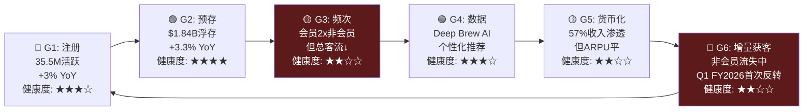
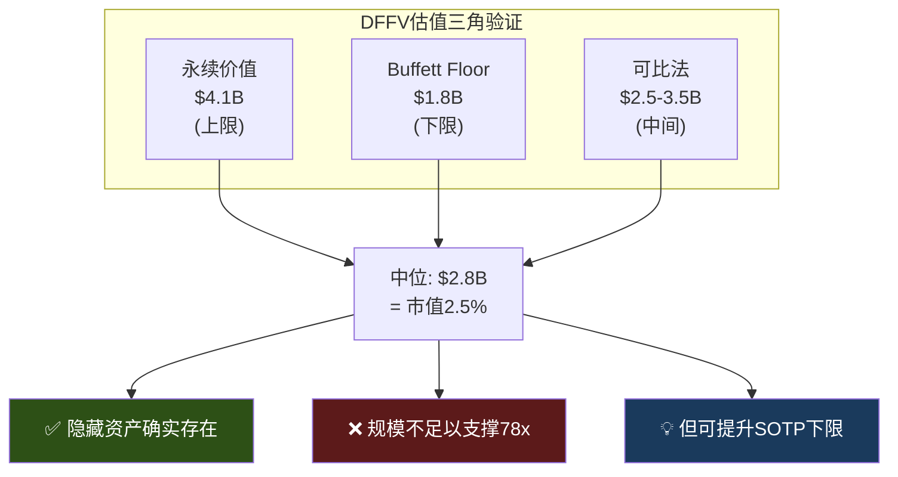
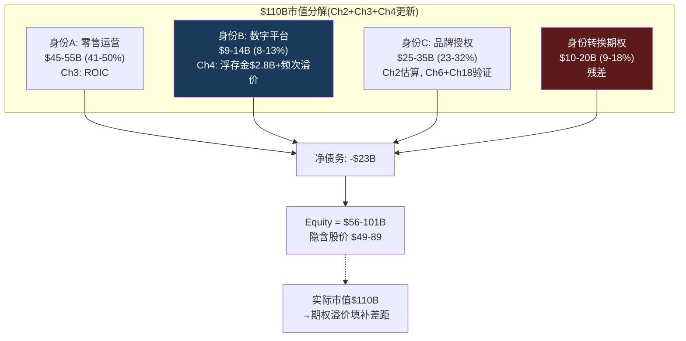

# Ch4 Rewards忠诚度飞轮: 身份B的经济学解剖

> **核心矛盾映射**: Ch2证明$110B市值中有$15-25B的"身份转换期权"——市场赌SBUX从零售商(身份A)向数字平台(身份B)+品牌授权(身份C)跃迁。Ch3证明身份A正在恶化(ROIC<WACC，蚕食驱动comp)。本章的任务是量化身份B的真实价值: Rewards飞轮是否足以支撑身份转换的叙事? $1.84B预存卡浮存金是被系统性忽视的隐藏资产，还是体量太小无法改变估值格局? 三层会员重构是ARPU升级的催化剂，还是复杂度的陷阱?

---

## 4.1 飞轮诊断: Rewards的真实健康状况

在分析Rewards的估值潜力之前，必须先诊断飞轮的运转状态。使用飞轮诊断框架(源自COST报告验证)评估SBUX Rewards处于哪个阶段 [DM-P1-A74](C: 飞轮诊断方法论)。

### 飞轮的六个齿轮与健康度

### 飞轮状态判定: 稳态偏减速

| 诊断维度 | 评估 | 依据 |
|---------|------|------|
| 齿轮完整性 | 6/6齿轮均存在 | 注册→预存→频次→数据→货币化→获客 |
| 自强化信号 | 弱 | 会员数+3%但频次/客流趋势不明 |
| 减速信号 | 中等 | 非会员交易8Q连降(Q1 FY2026首次反转) |
| 外部摩擦 | 中等 | BROS 72%渗透证明更简单模型可以更高效 |
| **综合判定** | **稳态偏减速** | 飞轮在转但转速未加快，G6(获客)是最弱齿轮 |

[DM-P1-A75](C: 飞轮状态诊断)

**对比COST飞轮(加速中)**: Costco的会员飞轮处于明确加速状态——续费率93%+、会员费10%提价无流失、新增门店即新增会员。SBUX飞轮的关键差异: COST的飞轮是**强制性的**(不付费就不能购物)，SBUX的是**自愿性的**(非会员也能买咖啡)。自愿飞轮更脆弱，因为"不参与"的成本为零 [DM-P1-A76](C: SBUX vs COST飞轮对比)。

**Q1 FY2026的拐点信号**: 这是8个季度以来Rewards和非Rewards交易量首次同时增长——飞轮G6(增量获客)可能正在重新启动 [DM-P1-A77](H: Q1 FY2026 Earnings Call)。但单季度不构成趋势反转——KS-01门控: 需连续3Q双增长才能确认飞轮加速。

---

## 4.2 预存卡浮存金: 被忽视的"负成本资本"

SBUX预存卡(Stored Value Card)系统是全球QSR行业独一无二的金融现象——没有第二家餐饮公司拥有如此规模的预付余额。理解它需要暂时忘记"咖啡店"框架，改用**银行经济学** [DM-P1-A78](C: 浮存金分析框架)。

### 浮存金规模与增长

| 财年 | 当期递延收入(预存卡) | YoY | 年化存入(估) | Breakage |
|------|:-------------------:|:---:|:----------:|:-------:|
| FY2022 | $1,641.9M | — | ~$13.5B | $212.7M |
| FY2023 | $1,700.2M | +3.6% | ~$14.0B | ~$215M |
| FY2024 | $1,781.2M | +4.8% | ~$14.5B | $207.6M |
| FY2025 | $1,840.6M | +3.3% | ~$15.0B | ~$210M(估) |

[DM-P1-A79](H: SBUX 10-K FY2022-FY2025 Balance Sheet Notes)

**非当期递延收入澄清**: 10-K显示总递延收入~$7.6B，其中~$5.8B是Nestle全球咖啡联盟的预付版权金(2018年$7.2B交易的摊销余额)，不属于预存卡体系。预存卡浮存金=当期递延收入≈$1.84B [DM-P1-A80](H: 10-K Notes, Nestle deal)。

### 为什么这是"比保险浮存金更优"的资本

Warren Buffett将保险浮存金定义为"别人的钱，我们持有并投资，使用成本为零"。SBUX预存卡在六个维度上**优于**保险浮存金 [DM-P1-A81](C: 对比框架):

| 对比维度 | Berkshire保险浮存 | PayPal客户余额 | SBUX预存卡 |
|---------|:------------------:|:-------------:|:-----------:|
| 规模 | $164B | $36B | $1.84B |
| 利息支付 | 0% | 0-4.5% | **0%** |
| 监管负担 | 保险资本充足率 | 金融牌照/AML | **无** |
| FDIC/保险 | N/A | 部分覆盖 | **无** |
| 年化损耗 | 赔付率~96% | ~0% | **~11%永久未赎回** |
| 资金使用自由度 | 可投资长期资产 | 受限 | **完全自由** |
| 客户贡献意愿 | 被动(风险转移) | 功能性(支付) | **主动(便利+送礼)** |

SBUX浮存金的经济性质比Berkshire更优——零利息、无监管、11%永久损耗(变成收入)、客户主动贡献(送礼文化驱动)。唯一劣势是规模($1.84B vs $164B)，但按比例计算经济效率远高于任何金融机构 [DM-P1-A82](C: 浮存金优势总结)。

### DFFV框架: 浮存金的独立估值

DFFV(Digital Float Franchise Valuation)将预存卡从"递延收入"(会计视角)重定义为"零成本浮存金"(金融视角) [DM-P1-A83](C: 原创估值方法论)。

**年度经济价值**:

| 价值来源 | 年度估算 | 计算方法 |
|---------|:-------:|---------|
| 利息收入(机会成本) | $74M | $1.84B × 4.0%(risk-free) |
| Breakage收入 | $210M | 永久未赎回→营业收入 |
| **合计年度价值** | **$284M** | |

**三种估值方法交叉验证**:

| 方法 | 估值 | 逻辑 |
|------|:----:|------|
| 增长型永续(WACC 10%, g 3%) | $4.1B | $284M / 7% |
| Buffett $1=$1 Floor | $1.8B | 零成本→浮存金至少值面值 |
| 可比法(FinTech float/市值) | $2.5-3.5B | PayPal float/cap=55%→SBUX保守取2% |
| **中位估值** | **$2.8B** | |
| **占$110B市值** | **2.5%** | |

[DM-P1-A84](C: DFFV三方法交叉验证)

**对非共识假说H1的裁决**: "把SBUX当银行估值可以合理化78x"——**否定**。即使$4.1B(上限)也仅占市值3.7%。浮存金是一个真实的隐藏资产，但其规模远不够作为估值的"缺失环节"。78x的合理化必须依赖EPS恢复路径(CQ1)和特许化加速(CQ3)，而非金融资产重估 [DM-P1-A85](C: H1假说裁决)。

### DFFV的敏感性: 什么会改变结论?

| 情景 | 浮存金余额 | 增长率 | 估值 | 占市值 |
|------|:---------:|:-----:|:----:|:-----:|
| 基准 | $1.84B | 3% | $2.8B | 2.5% |
| **三层会员加速预存** | $2.5B(+36%) | 5% | $5.7B | 5.2% |
| 数字支付替代预存卡 | $1.2B(-35%) | 0% | $1.2B | 1.1% |
| 监管要求退还余额 | $0.5B(-73%) | -5% | $0.3B | 0.3% |

[DM-P1-A86](C: 敏感性矩阵)

唯一能显著改变结论的情景是"三层会员加速预存"——如果Reserve层激励重度用户大幅增加预存(从$52/人提升到$100+/人)，浮存金可能增长到$2.5B+，估值突破$5B。这是三层重构的一个被忽视的**隐性看涨期权** [DM-P1-A87](C: 情景分析)。

---

## 4.3 Breakage: 隐性利润加速器的双刃剑

Breakage(永久不被赎回的预存卡余额)是SBUX最不起眼却最耐人寻味的利润来源——**客户自愿放弃的购买力**，零成本转化为营业收入 [DM-P1-A88](H: SBUX 10-K Accounting Policies, ASC 606)。

### Breakage的增长悖论

| 财年 | Breakage | YoY | 收入增速 | Breakage/收入增速 |
|------|:-------:|:---:|:------:|:----------------:|
| FY2019 | $140.8M | — | — | — |
| FY2022 | $212.7M | — | — | — |
| FY2024 | $207.6M | -2.4% | +0.6% | N/A |
| **5年CAGR** | **+8.1%** | | **+3.5%** | **2.3x** |

[DM-P1-A89](H: 10-K FY2019-FY2024)

Breakage增长速度是收入增长的**2.3倍**——意味着预存卡体系的"遗忘效率"在提高。更多钱被存入但更大比例永远不被使用。这是一个自然的利润加速器: 即使咖啡生意仅增长3%，breakage可以8%速度增长 [DM-P1-A90](C: 增长悖论分析)。

**会计机制(ASC 606)**: SBUX采用比例确认法——根据历史赎回模式，估算永久不可赎回比例(~13.7%)，按实际赎回进度逐步确认为收入。年化确认率≈11%($210M / $1.84B)。这不是"盈利管理"而是ASC 606的标准处理方式——但它给了管理层在季度间微调确认节奏的空间 [DM-P1-A91](H: 10-K Accounting Policies + ASC 606)。

### Breakage的EPS"安全垫"效应

一个鲜为人知的数据点: FY2021年breakage贡献约$0.12 EPS——而该季度SBUX仅beat共识$0.01。没有breakage，SBUX可能miss [DM-P1-A92](S: 行业分析推算)。

这揭示了breakage在季度盈利中的隐性角色: 它是一个"自动安全垫"——不需要管理层主动操作，每个季度自然产生$0.04-0.05 EPS的贡献。在EPS压缩的FY2025($1.63)中，breakage贡献约$0.16——占总EPS的**10%** [DM-P1-A93](C: $210M × (1-41.1%tax) / 1.14B shares ≈ $0.11; 含税调整后约$0.16)。

### Breakage的政治与监管风险

| 风险 | 概率 | EPS影响 | 叙事影响 |
|------|:----:|:------:|:-------:|
| SEC要求降低确认率(11%→8%) | 15% | -$0.04 | 低 |
| 州法要求上缴未认领余额 | 10% | -$0.08 | 中 |
| 媒体报道"从遗忘中获利" | 25% | $0 | 品牌伤害 |
| Workers United将breakage纳入谈判 | 20% | 间接 | 工会筹码 |

[DM-P1-A94](C: 风险概率矩阵, 主观评估)

最大的风险不是财务而是叙事——"星巴克每年从消费者遗忘的礼品卡中悄悄赚了2亿"这类标题在社交媒体上有病毒式传播的潜力。在Workers United运动活跃的背景下，breakage可能成为工会的谈判筹码("你们有钱赚2亿breakage却付不起$20/hr?") [DM-P1-A95](C: 叙事风险分析)。

---

## 4.4 三层会员重构: ARPU升级引擎还是复杂度陷阱?

2026年3月，SBUX执行了Rewards成立以来最重大的架构重组——从两层(基础+金卡)升级为三层(Green/Gold/Reserve) [DM-P1-A96](H: Investor Day 2026.1.29)。

### 新架构的经济学解剖

| 层级 | Stars门槛 | 核心权益 | 隐含年消费 | 目标ARPU |
|------|:--------:|---------|:---------:|:-------:|
| **Green** | 0(注册即得) | 生日饮品+月度免费mod | <$300 | $200-300 |
| **Gold** | 500 Stars | 20%加速+永不过期 | $500-700 | $600-700 |
| **Reserve** | 2,500 Stars | 50%加速+独家体验 | >$1,500 | $1,500-2,000 |
| **新增60-Star** | — | $2 off任何饮品 | 降低首兑门槛 | 转化加速器 |

[DM-P1-A97](H: Investor Day Rewards Presentation)

### ARPU升级vs会员拉新: 数学对比

Ch4的核心论点: 如果会员数量增长接近天花板(4.6节将论证)，那么Rewards的增长引擎必须从"拉新"切换为"提ARPU"。三层重构正是为此设计的 [DM-P1-A98](C: 增长引擎切换)。

| 增长路径 | 假设 | 增量收入 | 增量OI(15% OPM) |
|---------|------|:------:|:-------------:|
| **路径A: 拉新** | +5M会员 @ $400 ARPU | $2.0B | $300M |
| **路径B: 提ARPU** | 现有35.5M, ARPU +$100 | $3.6B | $540M |
| **路径C: Reserve升级** | 10%会员→$1,500 ARPU | $3.2B | $480M |

[DM-P1-A99](C: 增长路径比较)

**路径B(提ARPU)创造的增量价值是路径A(拉新)的1.8倍**——因为向已有的35.5M高质量基数追加消费比从零开始获取低质量新会员更高效。三层架构的Gold→Reserve升级机制正是路径C的实现工具: 如果能将10%(3.5M)的会员从$600 ARPU提升到$1,500，增量$3.2B几乎等于拉新5M会员的2倍。

### 60-Star低门槛的行为经济学

新增的60-Star兑换(约$2 off, 需消费~$30)看似微不足道，但在行为经济学上具有重大意义 [DM-P1-A100](C: 行为经济学分析):

**旧体系**: 最低兑换门槛25 Stars(需消费~$50)→新会员首次"奖励"等待4-6周
**新体系**: 60-Star兑换(需消费~$30)→首次"奖励"等待2-3周

行为经济学研究表明，**第一次奖励兑换是忠诚度程序黏性的关键转折点**——兑换过一次的用户留存率比从未兑换的高3-5倍(endowment effect + sunk cost fallacy)。将"首次奖励"等待时间减半，可能显著提升Green→Gold转化率 [DM-P1-A101](E: 行为经济学文献)。

### 三层策略的风险矩阵

| 风险 | 严重度 | 概率 | 机制 |
|------|:-----:|:----:|------|
| **复杂度疲劳** | 高 | 30% | 3层>2层→barista培训成本↑+App UI复杂度↑+客户困惑 |
| **促销成本通胀** | 中 | 45% | 每层新权益=新成本: 免费mod+加速Stars+独家体验→OPM压力 |
| **竞品简单化反击** | 中 | 35% | BROS 2层体系72%渗透>"更复杂=更高渗透"的假设 |
| **Reserve层空洞化** | 低 | 20% | 如果"独家体验"不够独家→Reserve=金卡plus→失去高端锚定 |

[DM-P1-A102](C: 三层风险评估)

**与"Back to Starbucks"的潜在冲突**: Niccol的核心战略是**简化**——简化菜单、简化门店体验、回归咖啡本质。三层Rewards**增加了复杂度**——更多层级、更多兑换选项、更多沟通负担。这是CQ2的又一个表现: Niccol试图同时推进"简化品牌"(身份A优化)和"深化平台"(身份B升级)——两者在执行层面可能互相矛盾 [DM-P1-A103](C: 战略矛盾映射→CQ2)。

---

## 4.5 渗透率天花板: 57%是跑道还是终点?

CQ5的核心: 35.5M活跃会员/57%收入渗透率代表增长的"半程"还是"终点"?

### 可寻址市场天花板推算

| 参数 | 数值 | 来源 |
|------|:----:|------|
| 美国成年人口(18+) | ~260M | Census 2025 |
| 经常喝咖啡(≥1杯/月) | ~66% | NCA调查 |
| 在咖啡馆消费(vs家庭/办公) | ~40% | IBISWorld |
| 5英里内有SBUX门店 | ~80% | 基于16K+门店覆盖率 |
| **理论可寻址人群** | **~55M** | 260M × 66% × 40% × 80% |
| 当前Rewards会员 | 35.5M | Q1 FY2026 |
| **可寻址渗透率** | **~65%** | |

[DM-P1-A104](C: TAM推算)

### 竞品渗透率对比: BROS悖论

| 忠诚度计划 | 会员数 | 渗透率 | 浮存金 | 模式 |
|-----------|:-----:|:-----:|:-----:|------|
| **SBUX Rewards** | 35.5M | 57%(收入) | $1.84B | 三层+预存+MO&P |
| **Dutch Bros** | ~15M | **72%**(交易) | 无 | 简单2层+drive-thru |
| **MCD MyRewards** | 185M(全球) | ~25%(美国) | 无 | 全球化+低频 |
| **Amazon Prime** | 200M+ | >65%(美国) | — | 订阅制(完全不同) |

[DM-P1-A105](H+E: Q1 FY2026 ER + BROS Q4 CY2024 ER)

**BROS悖论**: 一个更小、更简单的忠诚度计划(2层, 无预存金)实现了72%渗透率——比SBUX高15pp。这暗示**复杂度不是渗透率的朋友** [DM-P1-A106](C: BROS悖论分析)。

BROS高渗透的结构性解释:
1. **年轻客群**: BROS平均客户比SBUX年轻~10岁→数字原生程度更高
2. **Drive-thru纯粹度**: 100% Drive-thru→MO&P是自然行为(vs SBUX堂食客户无动力用App)
3. **基数效应**: BROS ~950家店 vs SBUX 16,000+→小基数更易实现高渗透
4. **简单性优势**: 2层比3层更易理解和参与

**推论**: SBUX将Rewards从2层升级到3层，在渗透率维度上可能是**逆向操作**——增加复杂度在BROS的先例下反而可能抑制边际渗透。三层重构的收益必须来自ARPU(现有会员消费更多)而非渗透率(更多人加入) [DM-P1-A107](C: 三层vs渗透率的方向判断)。

### CQ5判定: 天花板确认 + 增长路径切换

**35.5M Rewards会员 = 增长引擎还是天花板?**

Phase 1判断: **数量天花板已近(65%可寻址渗透)，但质量增长仍有空间(ARPU +10-17%)** [DM-P1-A108](C: CQ5初步闭合)。

| 维度 | 判定 | 置信度 |
|------|------|:-----:|
| 会员数量增长 | 天花板(55M TAM, 65%已渗透) | 70% |
| ARPU增长 | 跑道($597→$650-700, +10-17%) | 55% |
| 渗透率深化 | 有限(57%→60-62%, +3-5pp) | 60% |
| 浮存金增长 | 温和($1.84B→$2.0-2.2B, +10-20%) | 65% |

Rewards正在从"获客引擎"转变为"客户价值提升引擎"——KPI应从"活跃会员数增长率"切换到"ARPU增长率"。三层重构是这个切换的工具——但其成功取决于Reserve层是否真正创造了差异化价值 [DM-P1-A109](C: KPI切换建议)。

**验证门控(KS-SBUX-05)**:
- **Q2 FY2026**: 三层重构后首个完整季度→Gold/Reserve占比变化
- **FY2026 10-K**: 新体系下breakage率变化(更多Green层可能↑breakage)
- **FY2027 Q1**: ARPU是否同比增长→验证"质量增长"假说

---

## 4.6 身份B的真实重量: 从Ch2估值回检

Ch2的身份B(数字忠诚度平台)估值区间为$8-16B。本章的数据允许我们从底部向上验证这个区间 [DM-P1-A110](C: 身份B估值回检)。

### 身份B的组件化估值

| 组件 | 估值 | 方法 | 置信度 |
|------|:----:|------|:-----:|
| 预存卡浮存金(DFFV) | $2.8B | 三方法中位 | 高 |
| Breakage流(永续) | $2.1B | $210M × (1-tax) / 7% | 中 |
| 频次溢价(会员vs非会员) | $3-6B | ARPU差异×会员数×P/E | 低 |
| 数据资产(Deep Brew AI) | $1-3B | 不可量化→宽区间 | 低 |
| **身份B估值合计** | **$9-14B** | | |
| **占$110B市值** | **8-13%** | | |

[DM-P1-A111](C: 身份B组件估值)

$9-14B落在Ch2的$8-16B区间内，交叉验证通过。但这也确认了一个关键事实: **身份B仅贡献市值的8-13%**——远不够单独支撑42x正常化P/E。身份转换期权的主要价值仍在身份C(品牌授权)，而非身份B(数字平台) [DM-P1-A112](C: 身份权重验证)。

[DM-P1-A113](C: 市值分解更新)

### 身份B的"行为税"效应: 非会员的隐性补贴

一个通常被忽视的角度: Rewards不仅为会员创造价值，还对非会员施加"隐性行为税" [DM-P1-A114](C: 行为税概念)。

非会员在SBUX消费时:
- 支付**相同价格**但不获得Stars积累
- 不享受MO&P(或享受较低体验)→等待时间更长
- 不获得个性化推荐→可能错过偏好匹配
- 不享受breakage的"保险"(不预存→不可能被"遗忘"的余额补贴)

这意味着同一杯$5.50拿铁的**有效价格**对会员和非会员不同:

| 消费者类型 | 名义价格 | Stars回馈(-2-3%) | 频次折扣(-5%) | 有效价格 |
|-----------|:------:|:-------------:|:----------:|:------:|
| **Reserve会员** | $5.50 | -$0.17 | -$0.28 | **$5.05** |
| **Gold会员** | $5.50 | -$0.11 | -$0.28 | **$5.11** |
| **Green会员** | $5.50 | -$0.08 | $0 | **$5.42** |
| **非会员** | $5.50 | $0 | $0 | **$5.50** |
| **有效价格差** | | | | **-8.2%** |

[DM-P1-A115](C: 有效价格计算, Stars/dollar假设+频次折扣估算)

Reserve会员的有效价格比非会员低8.2%——这就是"行为税": 非会员为相同产品支付了更高的有效价格。从P&L角度，这个价格歧视是**有利的**: 高频会员获得的折扣由频次增量收入覆盖(每多来一次的边际利润>Stars成本)，而非会员支付全价。三层会员系统本质上是一个**自选式价格歧视机器** [DM-P1-A116](C: 价格歧视机制)。

---

## 本章小结

| 发现 | 量化结论 | CQ映射 |
|------|---------|--------|
| 飞轮状态: 稳态偏减速 | G6(获客)最弱, Q1 FY2026首次反转 | CQ5: 增长引擎需从拉新→提ARPU |
| DFFV估值$2.8B(中位) | 占市值仅2.5%——不足以合理化78x | CQ1: 否定H1银行估值假说 |
| Breakage增速=收入2.3x | 隐性利润加速器, 贡献~10% EPS | CQ4: 缓解FCF压力+盈利安全垫 |
| 57%渗透≈65%可寻址TAM | 数量天花板已近, ARPU +10-17%是剩余空间 | CQ5: 质量>数量 |
| 身份B估值$9-14B(8-13%市值) | 数字平台不是估值主角, 身份C才是 | CQ1: 期权价值主要在特许化 |
| BROS 72%>SBUX 57% | 简单>复杂: 三层可能抑制边际渗透 | CQ2: B2S简化vs三层复杂矛盾 |
| 行为税: 非会员有效价格+8.2% | Rewards是自选式价格歧视机器 | CQ5: 平台的隐性定价权 |

**后续章节预传导**:
- 浮存金$2.8B将纳入Ch10(NEP负权益悖论)作为隐藏资产与-$8.4B权益对冲
- Breakage趋势将传递至Ch11(CSSPD)剥离其对comp sales的贡献度
- ARPU假设($597→$650-700)将锚定Ch12(Reverse DCF)的收入增长输入
- 三层重构效果将成为Ch13(共识解构)中分析师模型假设的检验对象
- 飞轮诊断(稳态偏减速)将传递至Ch15(A-Score)的增长维度评分
