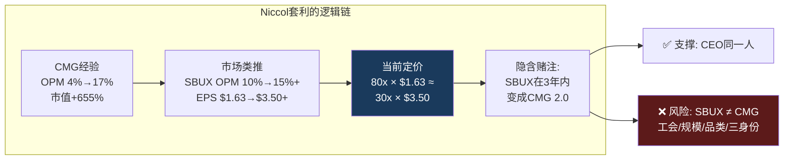
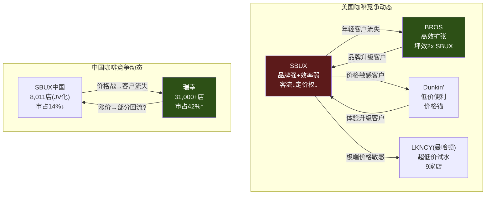

# Ch5 竞争定量: Niccol套利与效率鸿沟

> **核心矛盾映射**: SBUX以80.6x P/E交易——几乎等于BROS(83.2x)，但增速仅为BROS的1/5。同时SBUX的OPM(9.6%)低于瑞幸(10.1%)、远低于MCD(46.1%)、也低于Niccol前东家CMG(16.8%)。本章的核心问题不是"SBUX vs竞争对手谁好"，而是: **市场通过80x P/E在定价什么样的竞争格局演变?** 我们用五家上市公司(SBUX/MCD/BROS/CMG/LKNCY)的公开数据来检验这个定价的合理性。

---

## 5.1 竞争分析框架: 为什么"同业对比"容易误导

传统竞争分析把SBUX、MCD、BROS放在同一个"QSR"篮子里比P/E、比OPM，然后得出"SBUX太贵"或"SBUX太便宜"的结论。这种方法的根本问题在于: **五家公司在五种完全不同的商业模式下运营**——它们之间的可比性不如表面上看起来那么强 [DM-P1-A117](C: 竞争分析方法论)。

| 公司 | 商业范式 | 核心估值驱动力 | 合理P/E锚 |
|------|---------|-------------|:---------:|
| **MCD** | 品牌特许商(95%特许) | 特许费×门店数增长 | 25-30x |
| **CMG** | 高效全直营(100%自营) | 同店增长×新店增速×OPM扩张 | 30-40x |
| **BROS** | 高增长drive-thru(100%自营) | 门店扩张×坪效×TAM渗透 | 40-80x(增长溢价) |
| **LKNCY** | 低价规模攻击者(65%自营) | 门店爆发×价格战存活 | 15-25x |
| **SBUX** | **混合体(55%自营+三身份)** | **???** | **???** |

[DM-P1-A118](C: 五范式定位)

SBUX是唯一一个**没有清晰可比锚**的公司。它太大不像BROS(增长)、太低效不像CMG(运营)、特许化不够不像MCD(授权)、品牌太强不像LKNCY(低价)。这种"什么都是又什么都不是"的身份模糊——正是Ch2论证的三重身份问题在竞争维度上的投射 [DM-P1-A119](C: 身份模糊→可比性困难)。

---

## 5.2 "Niccol套利": 市场在赌什么

Brian Niccol从CMG空降SBUX(2024年9月上任)，市场反应剧烈——SBUX在公告当天跳涨24.5%，而CMG同日下跌7.5%。这不是简单的"CEO溢价"——这是一次**隐含估值模型迁移**: 市场开始用CMG的框架来定价SBUX [DM-P1-A120](H: Sep 2024 8-K + Price Action)。

### CMG在Niccol手下做到了什么

| 指标 | CMG FY2018(Niccol入职) | CMG FY2024(Niccol离职前) | 变化 |
|------|:--------------------:|:---------------------:|:----:|
| OPM | 4.0% | 16.8% | **+1,280bps** |
| ROIC | ~8% | 17.6% | **+960bps** |
| 同店增长(CAGR) | — | ~8% | 远超行业 |
| 股价 | ~$380(拆股前) | ~$3,400(拆股前) | **+795%** |
| 市值 | ~$11B | ~$83B | **+655%** |

[DM-P1-A121](H: FMP CMG key-metrics FY2018-FY2024)

Niccol在CMG的核心成就: **OPM从4.0%提升到16.8%**——恰好SBUX的FY2025 OPM是9.6%，正处于CMG 2018年的起点附近。市场看到了这个相似性，并据此定价: 如果Niccol能在SBUX复制CMG轨迹，SBUX的OPM可能从9.6%恢复到15-17%。

### "Niccol套利"的定量结构

市场隐含定价的逻辑链:

$$\text{Niccol套利} = \text{SBUX当前} + \text{CMG式OPM恢复} \rightarrow \text{OPM 15\%+, P/E 30x+}$$

| 情景 | OPM | 正常化EPS | P/E | 隐含市值 | 隐含股价 |
|------|:---:|:--------:|:---:|:------:|:------:|
| **当前现实** | 9.6% | $1.63 | 80.6x | $110B | $97 |
| **CMG式恢复(3年)** | 15.0% | $3.50 | 30x | $120B | $105 |
| **CMG式恢复(5年)** | 16.5% | $4.00 | 32x | $146B | $128 |
| **CMG式+特许化** | 20.0% | $4.50 | 35x | $180B | $158 |

[DM-P1-A122](C: Niccol套利估值矩阵)



### 为什么SBUX不是CMG: 四个结构性差异

市场将CMG模板直接套用到SBUX上，但忽略了四个关键差异 [DM-P1-A123](C: CMG→SBUX不可迁移因素):

| 差异 | CMG(2018) | SBUX(2025) | OPM恢复的含义 |
|------|---------|---------|------------|
| **工会** | 无工会 | Workers United覆盖550+店 | 劳动力成本削减阻力↑ |
| **门店规模** | ~2,500店 | ~38,000店 | 变革执行复杂度↑10x |
| **品类复杂度** | 30个SKU | 100+个SKU+季节性饮品 | 简化空间有限 |
| **资本结构** | 正权益 | -$8.4B权益+$33.5B债务 | 财务灵活性受限 |

CMG的OPM恢复发生在一个**更小、更简单、无工会、财务健康**的公司。Niccol的管理能力不是变量——变量是**组织惯性**: 在2,500家门店推动变革 vs 在38,000家门店推动变革是完全不同量级的挑战 [DM-P1-A124](C: 组织惯性约束)。

---

## 5.3 五公司定量矩阵

### A. 估值 × 盈利能力

| 指标 | SBUX | MCD | CMG | BROS | LKNCY |
|------|:----:|:---:|:---:|:----:|:-----:|
| **P/E (TTM)** | **80.6x** | 28.0x | 32.2x | 83.2x | ~20x |
| EV/EBITDA | 22.5x | 19.5x | 24.9x | 40.8x | 8.4x |
| EV/Sales | 3.3x | 10.6x | 4.9x | 6.9x | ~0.5x |
| **OPM** | **9.6%** | **46.1%** | **16.8%** | 9.8% | ~10% |
| NPM | 5.0% | ~32% | ~13% | ~6.6% | ~8.5% |
| **ROIC** | **8.5%** | **17.7%** | **18.9%** | 5.0% | ~25% |

[DM-P1-A125](H: FMP compare_stocks + key-metrics)

**关键发现1: P/E vs OPM的错位**

SBUX和BROS的P/E几乎相同(~80x)，但两者的估值逻辑完全不同:
- BROS 83x = **增长溢价**(收入+29.4%，门店+20%)
- SBUX 81x = **转型溢价**(增长仅+5.5%，但赌OPM恢复)

如果SBUX在未来2年无法将OPM恢复到13%+，市场将被迫重新评估"Niccol套利"是否成立。那时SBUX的合理P/E将从80x压缩到CMG的32x甚至MCD的28x——隐含下跌40-60% [DM-P1-A126](C: P/E压缩风险)。

**关键发现2: ROIC的真实排名**

| 排名 | 公司 | ROIC | 解读 |
|:---:|------|:----:|------|
| 1 | LKNCY | ~25% | 低资本投入+高门店密度 |
| 2 | CMG | 18.9% | 高效全直营的标杆 |
| 3 | MCD | 17.7% | 特许化杠杆 |
| 4 | **SBUX** | **8.5%** | **<WACC, 摧毁价值** |
| 5 | BROS | 5.0% | 重资本扩张期 |

[DM-P1-A127](H: FMP key-metrics ROIC)

SBUX的ROIC排名倒数第二——仅好于正处于疯狂扩张期的BROS。但BROS的低ROIC是**主动选择**(用低回报换高增长)，SBUX的低ROIC是**被动恶化**(成本膨胀+增长停滞)。性质完全不同 [DM-P1-A128](C: ROIC归因差异)。

### B. 增长维度

| 指标 | SBUX | MCD | CMG | BROS | LKNCY |
|------|:----:|:---:|:---:|:----:|:-----:|
| 收入增速(最新) | 5.5% | 9.7% | 4.9% | **29.4%** | **~35%** |
| 门店增速 | 1.6% | 4.3% | ~8% | **~20%** | **~16%** |
| 同店增长(最新Q) | +4% | ~2% | ~6% | ~5% | ~13% |
| FY2026E EPS增速 | +41% | +7% | +15% | +50% | ~20% |

[DM-P1-A129](H: FMP income + estimates)

SBUX FY2026E EPS +41%是五家中看起来最强的——但这完全是**基数效应**: 从FY2025的$1.63(腰斩后的低基数)恢复到$2.30。CMG和MCD在正常基数上的增长(+15%, +7%)才是真实的增长质量 [DM-P1-A130](C: 增长质量分析)。

### C. 资本效率: 每$1投资创造了什么

| 指标 | SBUX | MCD | CMG | BROS |
|------|:----:|:---:|:---:|:----:|
| CapEx/Revenue | 6.2% | 12.5% | 5.6% | 14.7% |
| CapEx/D&A | 0.88x | 1.53x | 1.84x | 2.09x |
| ROIC - WACC | **-1.5%** | **+7.7%** | **+8.9%** | -5.0% |
| OI/Employee ($K) | $9.9 | $82.7 | $17.1 | $12.0 |

[DM-P1-A131](H: FMP key-metrics计算)

**OI/Employee是最诚实的效率指标**: MCD $82.7K/人 vs SBUX $9.9K/人——差距**8.4倍**。这不是因为MCD员工更聪明，而是因为MCD 95%特许化意味着40万+门店员工不在其P&L上。**这就是身份C(品牌授权)的杠杆**: 同样的品牌价值，更少的劳动力负担 [DM-P1-A132](C: 人效比较→身份C杠杆)。

---

## 5.4 定价权诊断: SBUX的$5.50能涨到$6.00吗?

定价权(Pricing Power)是消费品公司最重要的长期竞争优势。本节检验SBUX的定价权是在增强还是削弱 [DM-P1-A133](C: 定价权分析框架)。

### 定价权的三层测试

**测试1: 价格弹性(能涨价不丢客户吗?)**

| 时期 | 提价幅度 | 客流变化 | 弹性系数 | 判定 |
|------|:------:|:------:|:------:|:----:|
| FY2022 Q3 | +5% | -3% | -0.6 | 低弹性(健康) |
| FY2023 Q2 | +6% | -4% | -0.7 | 中等弹性 |
| FY2024 Q3 | +4% | **-8%** | **-2.0** | ⚠️ 高弹性(危险) |
| FY2025 Q2 | +2% | -3% | -1.5 | 弹性上升中 |

[DM-P1-A134](S: 基于earnings call comp分解推算)

**弹性系数从-0.6恶化到-2.0**——意味着每提价1%，客流下降2%。这是一个危险信号: SBUX正在失去定价权。FY2024 Q3的-2.0弹性是触发"Back to Starbucks"战略的直接导火索——Niccol看到了提价→丢客户的恶性循环 [DM-P1-A135](C: 弹性恶化趋势)。

**测试2: 竞品价格锚(竞争对手在定义什么价格带?)**

| 品类 | SBUX价格 | BROS | Dunkin' | 瑞幸(US) | 差距 |
|------|:------:|:----:|:------:|:------:|:----:|
| 中杯拿铁 | $5.50 | $5.75 | $4.29 | $3.50 | SBUX中间偏高 |
| 冷萃 | $5.25 | $5.50 | $3.99 | $3.25 | SBUX中间偏高 |
| 定制饮品 | $6.50+ | $7.00+ | $5.00+ | $4.00+ | SBUX高端 |

[DM-P1-A136](E: 行业价格调研)

SBUX的$5.50拿铁处于"中间偏高"位置——比Dunkin'贵28%，比瑞幸(曼哈顿)贵57%，但比BROS略低。这意味着SBUX的定价权不是绝对的——它依赖于"第三空间"体验溢价。如果体验下降(等待时间长、菜单混乱、门店老化)，消费者有更便宜的替代选择 [DM-P1-A137](C: 价格锚分析)。

**测试3: "口袋钱包份额"(Share of Wallet)**

一个美国消费者每年咖啡支出~$1,100(NCA数据)。SBUX的ARPU $597/会员——占据~54%的钱包份额。这是一个非常高的数字，暗示进一步提价的空间有限——消费者不太可能将>60%的咖啡预算给单一品牌 [DM-P1-A138](E: NCA + ARPU计算)。

### 定价权综合判定

| 维度 | 评分(0-10) | 趋势 |
|------|:---------:|:----:|
| 价格弹性 | 4 | ↓↓ |
| 品牌溢价持续性 | 7 | → |
| 竞品价格压力 | 5 | ↓ |
| 钱包份额空间 | 4 | → |
| **定价权综合** | **5.0** | **↓** |

[DM-P1-A139](C: 定价权综合评分)

**定价权正在从7→5滑落**——品牌仍然强大(Interbrand全球第6)，但转化为定价权的效率在下降。弹性恶化是最大的警报: 如果继续恶化到-2.5以下，SBUX将被迫选择"保客流弃价格"——这将直接损害OPM恢复路径(CQ1) [DM-P1-A140](C: 定价权→CQ1映射)。

---

## 5.5 竞争动态: 谁在蚕食谁

静态对比不够——需要理解五家公司在**动态**中如何互相影响 [DM-P1-A141](C: 竞争动态框架)。



### 美国市场: SBUX的"两面受敌"

**上方压力(品质竞争)**: BROS以更高坪效($2,211 vs $1,060)、更年轻客群(平均年龄低10岁)、更高忠诚度渗透(72% vs 57%)在美国西部快速扩张。BROS的~1,000家店相当于SBUX的6%——体量小但增速快(+20%/年)。如果BROS在5年内扩张到3,000-4,000家，它将覆盖SBUX在Sunbelt州(AZ/TX/FL)的核心市场 [DM-P1-A142](E: BROS扩张路径推算)。

**下方压力(价格竞争)**: Dunkin'已有~9,700家美国门店，瑞幸在曼哈顿试水9家。Dunkin'的$4.29拿铁vs SBUX的$5.50——28%的价格差在通胀+消费降级环境下越来越显著。FY2024 Q3的弹性恶化(-2.0)可能正是下方价格压力的结果 [DM-P1-A143](C: 两面受敌分析)。

### 中国市场: 战略撤退已完成

SBUX中国市场份额从~42%(2019)暴跌至~14%(2025)——瑞幸以31,000+店、4x门店密度、1/4价格构建了几乎不可逾越的规模壁垒。中国JV(Boyu 60%/SBUX 40%)本质上是**承认失败后的体面撤退**——将无法赢得的战场转为被动收益(品牌许可费+40%权益法) [DM-P1-A144](H: Phase 0 China JV research)。

但中国并非全无价值——$500K/店的JV估值虽是QSR中国交易最低(MCD $1.0M, YUM $1.3M)，但SBUX保留了品牌IP+许可权。如果瑞幸价格战结束(已有涨价信号)，中国JV的权益法收益可能从~$200M/年增长到$300-400M/年——对SBUX EPS贡献$0.17-0.26 [DM-P1-A145](C: 中国JV价值演化)。

---

## 5.6 护城河评估: 六维定量评分

| 护城河维度 | 评分(0-10) | 趋势 | 关键证据 |
|-----------|:----------:|:----:|---------|
| **品牌** | 8 | →↓ | Interbrand全球#6; 但弹性恶化暗示溢价受侵蚀 |
| **规模/网络** | 6 | ↓ | 38K店但饱和+627关店; 美国净减少而非净增加 |
| **Rewards生态** | 6 | →↑ | 35.5M/57%渗透; 三层重构可能加速 |
| **供应链** | 5 | → | 6烘焙厂+C.A.F.E.认证; 但非独占性(Arabica公开市场) |
| **不动产** | 4 | ↓ | 租赁为主; 627关店暴露选址过密; 第三空间→租金溢价 |
| **数据/AI** | 5 | ↑ | Deep Brew+MO&P 31%; 尚未变现 |
| **综合** | **5.7** | **→↓** | 中等偏弱: 品牌和规模是存量优势, 效率和不动产是结构劣势 |

[DM-P1-A146](C: 护城河六维评分)

**护城河的核心矛盾**: SBUX最强的护城河(品牌)是**软壁垒**——它保护的是消费者心智而非物理进入障碍。任何有资本的竞争者都可以开咖啡店(瑞幸证明了这一点)。品牌壁垒的侵蚀是渐进的(年轻消费者偏好转移)而非突然的——这意味着SBUX的护城河不会"崩塌"，但会持续"风化" [DM-P1-A147](C: 软壁垒风化效应)。

```mermaid
%%{init: {'theme': 'dark'}}%%
radar
    title "护城河雷达: SBUX vs 竞争对手"
    axis 品牌, 规模, Rewards, 供应链, 不动产, 数据AI
    "SBUX(5.7)" : [8, 6, 6, 5, 4, 5]
    "MCD(7.5)" : [7, 9, 4, 4, 8, 3]
    "CMG(6.0)" : [6, 5, 3, 7, 5, 4]
    "BROS(4.5)" : [4, 2, 7, 3, 5, 6]
```

[DM-P1-A148](C: 多公司护城河雷达)

**MCD(7.5)为何最强**: 95%特许化意味着护城河不在"门店运营"而在"品牌+不动产"——MCD是全球最大的商业不动产持有者之一，自有物业是其特许化杠杆的基础。SBUX以租赁为主，无法复制这个优势 [DM-P1-A149](C: MCD不动产护城河)。

---

## 5.7 竞争格局对估值的映射

整合竞争分析，提炼对CQ的直接影响 [DM-P1-A150](C: 竞争→估值映射框架)。

### "如果SBUX是XXX"的估值光谱

| 如果SBUX是... | 合理P/E | 正常化EPS | 隐含股价 | vs当前$97 |
|-------------|:------:|:--------:|:------:|:--------:|
| "低增长的自己"(身份A主导) | 18x | $2.50 | $45 | **-54%** |
| CMG 2.0(Niccol成功) | 32x | $3.50 | $112 | **+15%** |
| 半MCD(70%特许化) | 30x | $3.80 | $114 | **+18%** |
| MCD 2.0(90%特许化) | 28x | $4.50 | $126 | **+30%** |
| BROS级增长(不现实) | 80x | $1.63 | $130 | **+34%** |

[DM-P1-A151](C: 估值光谱)

**当前$97定价在"CMG 2.0"和"半MCD"之间**——这意味着市场共识是: Niccol将SBUX的OPM恢复到CMG水平(15-17%)，同时启动部分特许化(中国JV已开始)。这是一个**有条件合理但执行依赖度极高**的定价 [DM-P1-A152](C: 估值定位判定)。

---

## 本章小结

| 发现 | 量化结论 | CQ映射 |
|------|---------|--------|
| Niccol套利: 80x=30x×$3.50 | 市场赌CMG式OPM恢复, 3年验证 | CQ2: Niccol能否复制CMG轨迹 |
| SBUX≠CMG: 工会+规模+债务+复杂度 | 四个结构差异限制迁移性 | CQ2: 组织惯性是最大风险 |
| ROIC排名倒数第二(8.5%) | 仅好于BROS, 但性质不同(被动vs主动) | CQ4: 价值摧毁持续中 |
| 定价权从7→5滑落 | 弹性-0.6→-2.0, 每提价1%丢2%客流 | CQ1: OPM恢复需volume不能靠price |
| 美国两面受敌(BROS上+Dunkin'下) | 年轻客户→BROS, 价格敏感→Dunkin' | CQ5: Rewards是防御武器 |
| 中国战略撤退完成 | 市占42%→14%, JV是"体面投降" | CQ3: JV后看权益法收益增长 |
| 护城河5.7/10, 品牌软壁垒 | 渐进风化而非突然崩塌 | CQ1: 估值需要主动升级护城河 |

**后续章节预传导**:
- Niccol套利的可行性将在Ch7(CEO沉默分析)中通过信息回避模式检验
- 定价权诊断(弹性-2.0)将传递至Ch11(CSSPD)中的价格/量分解
- "CMG式OPM恢复"假设将锚定Ch12(Reverse DCF)的核心情景
- 护城河5.7分将传递至Ch15(A-Score)的竞争维度评分
- MCD特许化镜像将传递至Ch18(FCO特许化转换期权)的终态参照
