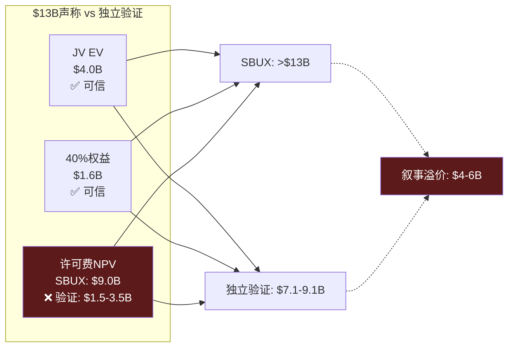
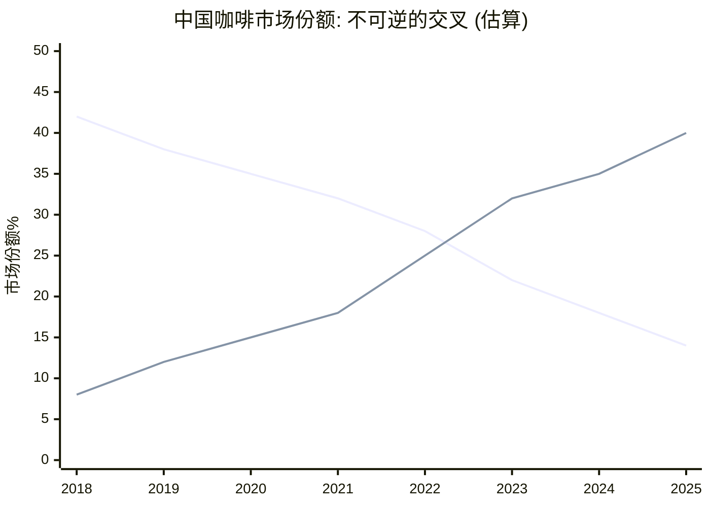
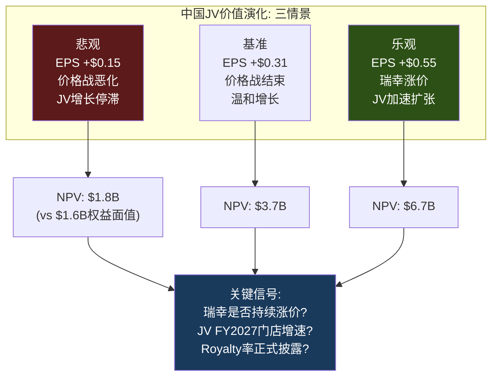

# Ch6 中国JV: $4B交易的真相与身份C加速器

> **核心矛盾映射**: CQ3("中国$4B JV是战略撤退还是价值解锁?")的完整解答。Ch2证明身份C(品牌授权)是SBUX估值的核心驱动力——中国JV是身份A→C转换的**第一个实弹操作**。Ch3的三层梯度显示Licensed模式的ROIC趋近∞——JV本质上是将8,011家门店从ROIC 8.5%的Layer 1推向ROIC ∞的Layer 2方向。Ch5确认中国市占42%→14%是不可逆的结构性溃败。本章将拆解这笔交易的每一个数字，判断它到底是"精明的身份转换"还是"包装成胜利的投降"。

---

## 6.1 交易解剖: 合同条款 × 隐含假设

### 交易结构全景

2025年11月3日，SBUX宣布与博裕资本(Boyu Capital)组建合资公司运营中国零售业务 [DM-P1-A153](H: Nov 2025 8-K Filing):

| 条款 | 内容 | 含义 |
|------|------|------|
| 买方 | Boyu Capital(最高60%) | SBUX不再控制中国运营 |
| 卖方保留 | SBUX 40% + 品牌IP + 许可权 | 身份C的核心: 品牌授权收入 |
| 企业价值 | ~$4B(cash-free, debt-free) | 100%中国零售运营=~$500K/店 |
| SBUX获得 | ~$2.4B现金 + 40%权益 + 许可费流 | 多层收益结构 |
| 预计交割 | Q2 FY2026(2026年春) | Q1 FY2026已开始deconsolidate |
| 潜在共投 | 腾讯、GIC(新加坡) | 生态整合+耐心资本 |
| 保留资产 | 昆山咖啡创新园+云南农民支持中心 | 供应链控制权未让渡 |
| JV目标 | 20,000家门店 | 从8,011到20,000=2.5x增长 |

[DM-P1-A154](H: 8-K + Earnings Call详细条款)

### $13B"总价值"的拆解与挑战

SBUX公告声称中国业务"总价值超过$13B"。这个数字是如何构建的? [DM-P1-A155](C: $13B拆解)

| 组成部分 | SBUX声称 | 独立验证 | 差距 |
|---------|:-------:|:------:|:---:|
| JV企业价值(100%) | $4.0B | $4.0B(市场成交价) | $0 |
| SBUX保留40%权益 | ~$1.6B | $1.6B(按EV比例) | $0 |
| 许可费NPV | **~$9.0B** | **$1.5-3.5B** | **$5.5-7.5B** |
| **总价值** | **>$13B** | **$7.1-9.1B** | **$4-6B叙事溢价** |

**$9B许可费NPV——关键的争议点**:

SBUX暗示的$9B许可费NPV需要以下假设全部成立:

| 假设 | SBUX隐含值 | QSR行业标准 | 合理值 |
|------|:---------:|:---------:|:-----:|
| Royalty率 | ~15-20% | 4-6% | **5-6%** |
| 收入增长率 | 8-10% CAGR | 5-7% | **5%** |
| 折现率 | 3-4% | 8-10% | **8%** |
| 时间范围 | 永续 | 10-20年 | **15年** |

[DM-P1-A156](C: 许可费假设对比)

### 许可费NPV敏感性矩阵

以中国JV收入$3.1B为基础 [DM-P1-A157](C: 许可费敏感性计算):

| | 增长3% | 增长5% | 增长7% |
|--|:-----:|:-----:|:-----:|
| **Royalty 4%** | $1.1B | $1.4B | $1.9B |
| **Royalty 5%** | $1.4B | **$1.8B** | $2.3B |
| **Royalty 6%** | $1.7B | $2.1B | $2.8B |
| **Royalty 8%** | $2.2B | $2.8B | $3.7B |

*(折现率8%, 15年)*

**中位估算: $1.8B**(5% royalty, 5%增长)——SBUX声称的$9B需要8%+ royalty + 7%+增长 + 永续 + 极低折现率。四个假设同时取极端值=叙事膨胀 [DM-P1-A158](C: $9B不可信判定)。

**合理总价值: $7.1-9.1B**——$4B EV + $1.6B权益 + $1.5-3.5B许可费。约$4-6B被叙事膨胀。

---

## 6.2 博裕资本: 政治经济学解读

Boyu Capital不是一家普通的PE——它是中国政治生态中具有特殊定位的投资机构 [DM-P1-A159](E: Phase 0 Agent research):

| 维度 | 详情 |
|------|------|
| 创立 | 2010年，香港 |
| 创始人 | 江志成(Alvin Jiang)——江泽民之孙 |
| AUM | ~$400亿 |
| 第五只基金(2021) | $68亿——中国独立管理人最大 |
| 历史净IRR | >25%(远超亚洲PE平均~15%) |
| 代表投资 | 阿里巴巴(IPO前)、蚂蚁集团、SKP奢侈品 |

### 选择Boyu的三层逻辑

| 层次 | 需求 | Boyu提供 |
|------|------|---------|
| **财务层** | $2.4B现金 | 充足的基金规模 |
| **运营层** | 中国零售运营经验 | SKP奢侈品零售背景 |
| **政治层** | 中美关系保险 | 政治资本=监管护航+政策缓冲 |

[DM-P1-A160](C: 合作伙伴选择逻辑)

腾讯+GIC作为潜在共投的战略意义: 腾讯=微信支付/小程序/视频号生态整合(加速JV数字化), GIC=新加坡主权基金的长期耐心资本(降低短期IRR压力)。三方联盟构成"政治+生态+资本"的完整支撑 [DM-P1-A161](E: Bloomberg报道)。

---

## 6.3 竞争终局: 42%→14%的不可逆溃败

### 瑞幸vs SBUX: 数字会说话

| 指标 | SBUX中国(FY2025) | 瑞幸(CY2024) | 差距 | 趋势 |
|------|:----------------:|:----------:|:---:|:---:|
| 门店数 | 8,011 | 31,048 | **3.9x** | 扩大中 |
| 收入 | ~$3.1B | ~$4.8B | 1.5x | 扩大中 |
| AUV/店 | ~$394K | ~$155K | SBUX 2.5x | 缩小中 |
| 杯均价 | ¥47 | ¥11-14 | SBUX 3-4x | 稳定 |
| 建店成本 | ~$700K | ~$50K | **14x** | 固定 |
| 门店OPM | ~15-18% | 17.8% | 接近 | 瑞幸↑ |
| 市场份额 | ~14% | ~40% | 瑞幸3x | 扩大中 |

[DM-P1-A162](H+E: FMP LKNCY + Phase 0 research)

[DM-P1-A163](E: 基于门店数×AUV推算)

### 为什么"反攻"不可能

即使JV目标达成(8,011→20,000店)，SBUX在中国仍面临四个结构性不可逆 [DM-P1-A164](C: 不可逆分析):

**不可逆1: 密度差距**。瑞幸到JV完成时可能已有45,000+店。20,000 vs 45,000仍是2.3x差距——消费者步行5分钟内找到瑞幸的概率>>SBUX。在便利性驱动的咖啡消费中，密度=可得性=频次。

**不可逆2: 价格带锁死**。SBUX ¥47 vs 瑞幸 ¥11-14是3-4x价差。SBUX不能降价(品牌贬值)，也不能维持(继续丢份额)。唯一解法是**创造不同的价值维度**(体验/空间/社交)——但这在1st/2nd tier城市以外难以规模化。

**不可逆3: 成本结构**。建店$700K vs $50K=14x差距。在相同$1B CapEx下: SBUX开1,400家 vs 瑞幸开20,000家。这个差距不可能通过运营优化消除——它是门店形态(大店vs小站)决定的。

**不可逆4: 代际转移**。中国Z世代(1995-2010出生)的"默认咖啡"是瑞幸App——他们通过社交媒体裂变获客(微信分享9.9元券)。SBUX被视为"父母辈的品牌"。代际偏好一旦形成，极难反转(参考中国零售中的大润发被盒马替代) [DM-P1-A165](C: 代际品牌锁定)。

### Comp Sales的"以价换量"陷阱

中国comp sales恢复弧线揭示一个危险模式 [DM-P1-A166](H: Quarterly Earnings):

| 季度 | Comp | 交易量 | 客单价 | 解读 |
|------|:----:|:-----:|:-----:|------|
| Q4 FY2024 | -14% | -6% | **-8%** | 价格战最惨时刻 |
| Q1 FY2025 | -6% | -2% | -4% | 缓慢企稳 |
| Q2 FY2025 | 0% | +4% | -4% | 交易量转正但票价仍跌 |
| Q4 FY2025 | +2% | **+9%** | **-7%** | 量价极度背离 |
| Q1 FY2026 | +7% | +5% | — | 管理层停止披露ticket |

**Q4 FY2025的+9%交易量 / -7%客单价是最强警报**: 更多人来了但每人花更少的钱——这是变相降价的经典信号(更多促销、入门级产品推广)。更关键的是: **Q1 FY2026起管理层不再披露ticket分解**——这是CEO沉默域的又一个表现(Ch7将系统分析) [DM-P1-A167](C: ticket沉默域标注)。

---

## 6.4 Deconsolidation: "新SBUX"的财务面貌

### 资产负债表一夜重构

Q1 FY2026已反映中国deconsolidation [DM-P1-A168](H: Q1 FY2026 10-Q):

| 项目 | FY2025 Q4 | Q1 FY2026 | 变化 | 驱动 |
|------|:---------:|:---------:|:----:|------|
| Revenue(季度) | $9.57B | $9.91B | +3.6% | 中国减少被US增长覆盖 |
| Goodwill | $3.37B | $1.31B | **-$2.06B** | 中国GW移除 |
| PP&E | $17.8B | $15.6B | **-$2.2B** | 中国门店资产出表 |
| Total Debt | $26.6B | $33.5B | **+$6.9B** | 债务重组+JV相关 |
| Equity | -$8.1B | -$8.4B | -$0.3B | 负权益略微恶化 |

**$6.9B新增债务**——这是Deconsolidation最大的意外。可能解释: (1) JV对价的融资安排, (2) 到期债务再融资(利率更高), (3) JV相关的过渡成本。管理层在earnings call上回避了这个问题——又一个CEO沉默域 [DM-P1-A169](C: 债务跳升分析+沉默标注)。

### Deconsolidation前后的SBUX: 两张不同的面孔

| 指标 | "旧SBUX"(含中国) | "新SBUX"(ex-China) | 变化 | 含义 |
|------|:--------------:|:------------------:|:----:|------|
| Revenue(年化) | $37.2B | ~$34.1B | -8.3% | Top line缩水 |
| OPM | 9.6% | ~10.0%(管理层+40bps) | +40bps | 轻微改善 |
| OI(年化) | $3.58B | ~$3.41B | -4.7% | 绝对OI略降 |
| 门店数 | ~38,000 | ~30,000 | -21% | 规模缩小 |
| 权益法收益(新增) | $0 | ~$150-200M | 新增 | 新收益流 |
| **净EPS影响** | $1.63 | **$1.60-1.61** | **-$0.02-0.03** | 短期略负 |

[DM-P1-A170](C: 新旧SBUX对比; H: 管理层指引)

短期EPS稀释$0.02-0.03——几乎可以忽略。但**长期结构变化是显著的**: "新SBUX"的收入结构中,美国/国际(ex-China)占比从~92%提升到100%，特许化/CPG收入占比从~13%提升到~15%。每一步deconsolidation都在推动SBUX向身份C迁移 [DM-P1-A171](C: 身份C加速效应)。

---

## 6.5 JV价值的三情景演化

中国JV对SBUX的价值不是静态的——它取决于JV的执行和中国咖啡市场的演化 [DM-P1-A172](C: 情景分析框架)。

### 三情景模型

| 维度 | 悲观 | 基准 | 乐观 |
|------|------|------|------|
| **门店数(FY2030)** | 10,000 | 15,000 | 20,000 |
| **AUV趋势** | ↓$350K(-11%) | →$394K | ↑$450K(+14%) |
| **JV Revenue(FY2030)** | $3.5B | $5.9B | $9.0B |
| **Royalty率** | 4% | 5% | 6% |
| **年许可费** | $140M | $295M | $540M |
| **40%权益法收益** | $100M | $200M | $350M |
| **SBUX年收益合计** | $240M | $495M | $890M |
| **对SBUX EPS贡献** | $0.15 | $0.31 | $0.55 |

[DM-P1-A173](C: 三情景计算)

**瑞幸涨价信号**: Phase 0文献侦察发现瑞幸已将9.9元促销从全菜单缩减至仅3个SKU，标准菜单全线涨价¥3 [DM-P1-A174](E: Phase 0 lit recon)。如果价格战结束→中国咖啡行业OPM扩张→JV权益法收益提升→SBUX的中国收益可能超出基准假设。这是**乐观情景的催化剂**。

### 管理层精力的隐性价值

一个经常被忽视的JV收益: **管理层注意力的重新配置** [DM-P1-A175](C: 注意力经济学)。

在JV前，SBUX CEO/CFO每季度需要解释中国业务的comp恶化、价格战应对、地缘政治风险——这消耗了大量的investor relations和战略带宽。JV后:
- 中国从"每季度的earnings call危机"变成"权益法一行数字"
- 管理层可以将100%注意力放在美国转型上
- 分析师也不再需要建模中国的复杂变量

这个"注意力红利"无法量化，但可能是JV最重要的战略价值之一——它让Niccol能够全身心执行"Back to Starbucks"，而不是被中国的季度数据分散精力 [DM-P1-A176](C: 注意力红利)。

---

## 6.6 保留资产: 昆山+云南的战略意义

SBUX在JV中保留了两个非零售资产——昆山咖啡创新园和云南农民支持中心 [DM-P1-A177](H: 8-K Filing)。

**昆山咖啡创新园**: 2022年投资$1.3B建设的全球最大咖啡烘焙工厂+创新中心——可服务整个亚太区域(不仅是中国)。保留它意味着SBUX控制了中国JV的**供应链咽喉**: JV需要从SBUX采购烘焙咖啡豆，这创造了一个与royalty并行的收入流(供应溢价)。

**云南农民支持中心**: 从2012年开始运营，覆盖30,000+中国咖啡农。保留它维护了SBUX的C.A.F.E.认证体系(品牌ESG叙事的基础)。

**保留的战略含义**: SBUX通过保留供应链+品牌资产，确保了对JV的**隐性控制权**——即使只持有40%股权。JV在运营上依赖SBUX的烘焙供应、品牌IP、和品质标准。这种"供应链+品牌绑定"比股权比例更能保障SBUX的长期利益 [DM-P1-A178](C: 隐性控制分析)。

---

## 6.7 对CQ3的Phase 1闭合

**中国$4B JV是战略撤退还是价值解锁?**

Phase 1判断: **"包装成价值解锁的战略撤退"——但撤退本身是正确的决策** [DM-P1-A179](C: CQ3闭合)。

| 维度 | "撤退"证据 | "解锁"证据 | 权重 |
|------|-----------|-----------|:----:|
| 估值 | $500K/store=QSR最低, $13B含$4-6B叙事膨胀 | EV/Rev 1.3x在合理区间 | 撤退60% |
| 竞争 | 份额42%→14%不可逆 | 退出运营风险保留品牌价值 | 撤退70% |
| 财务 | 收入-$3.1B, EPS-$0.02-0.03 | OPM+40bps, 管理层注意力释放 | 解锁55% |
| 战略 | 承认无法与瑞幸竞争 | 身份C迁移的第一步 | **各50%** |
| 供应链 | 丧失中国运营控制 | 保留昆山+云南=隐性控制 | 解锁60% |

**综合判定**: 65%战略撤退 + 35%价值解锁。但关键洞察是——**在SBUX的情况下,"正确的撤退"比"勉强的坚守"创造更多价值**。Ch3证明ROIC<WACC的门店在摧毁价值; 将中国8,011家低效门店从自营转为品牌授权，本质上是停止摧毁、开始提取——方向正确，只是起步价格($500K/店)反映了被迫的谈判地位 [DM-P1-A180](C: 撤退正确性论证)。

**CQ3置信度**: 从P0的55%提升至**65%**(方向=撤退，但正确性得到Ch3/Ch5的数据验证)。

---

## 本章小结

| 发现 | 量化结论 | CQ映射 |
|------|---------|--------|
| $13B声称含$4-6B叙事溢价 | 合理总价值$7-9B | CQ3: 管理层叙事需打折 |
| 许可费NPV中位$1.8B | $9B需四个极端假设同时成立 | CQ3: royalty率=关键变量 |
| $500K/store = QSR中国最低 | 瑞幸竞争摧毁门店单价 | CQ3: 体面撤退 |
| 票价-7%+管理层停披露ticket | 以价换量+CEO沉默域 | CQ2+CQ3: 有机恢复存疑 |
| $6.9B新增债务未解释 | 资本结构恶化+沉默域 | CQ4: 负权益进一步深化 |
| 基准EPS贡献+$0.31/年 | JV长期价值取决于瑞幸涨价 | CQ1: 中国从拖累变温和正贡献 |
| 昆山+云南保留=隐性控制 | 供应链绑定>股权比例 | CQ3: 品牌控制未完全丧失 |
| 管理层注意力释放 | 不可量化但战略价值最大 | CQ2: Niccol可100%聚焦US |

**后续章节预传导**:
- $6.9B新增债务将传递至Ch10(NEP负权益悖论)的债务可持续性分析
- 票价沉默域将纳入Ch7(CEO沉默分析)的系统映射
- JV后"新SBUX"的收入结构将锚定Ch9(财务趋势)的ex-China基数调整
- JV的身份C加速效应将传递至Ch18(FCO特许化转换期权)作为已完成案例
- 瑞幸涨价信号将纳入Ch14(宏观+催化剂日历)作为外生催化剂
