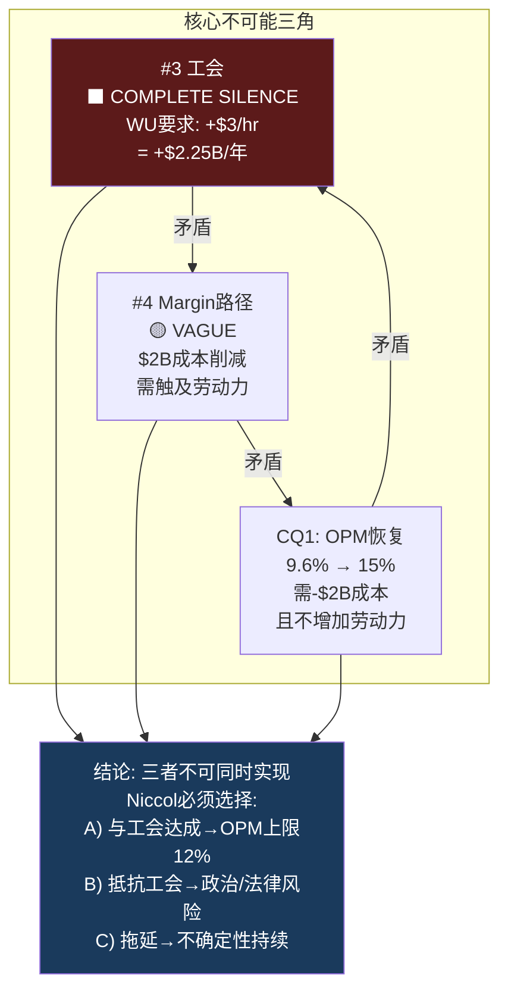

# Ch7 Brian Niccol: $23B CEO期权与6个沉默域

> **核心矛盾映射**: CQ2("Niccol = CMG 2.0还是Schultz 3.0?")的核心评估。Ch5证明市场通过80x P/E隐含定价了一次"Niccol套利"——SBUX OPM从9.6%恢复到CMG级别的15-17%。但Ch5同时揭示了四个CMG→SBUX的不可迁移约束(工会/规模/品类/资本结构)。本章将通过CEO评分卡量化Niccol的能力，通过光环半衰期评估$23B溢价的耐久性，并通过v18.0沉默分析(QG-01.5)系统映射Niccol回避的6个话题——沉默域往往是投资者最需要但最难获得的信息。

---

## 7.1 CEO评分卡: 8维定量评估

### 综合评分

| 维度 | 分数(0-10) | 核心证据 | 风险信号 |
|------|:----------:|---------|---------|
| **1. 往绩** | **9** | CMG: OPM 4%→17%, 市值+655%, 6年 | 规模6x差异限制可迁移性 |
| **2. 战略清晰度** | 7 | "Back to Starbucks": 简化+体验+效率 | 清晰≠正确; 简化可能cap revenue |
| **3. 执行速度** | 7 | Q1 FY2026 comp +4%; 627关店果断 | 仅1Q正向数据; 蚕食效应≈+3.8%(Ch3) |
| **4. 资本配置** | 5 | 暂停回购(正确); 中国JV(方向对) | 分红$2.77B>NI$1.86B; 翻新NPV为负(Ch3) |
| **5. 团队建设** | 5 | 大规模换血: CFO+多位高管+裁员900人 | 16个月高turnover=组织尚未稳定 |
| **6. 沟通能力** | 7 | 叙事引人; 投资者反应正面 | 叙事>数据; 6个沉默域(7.4节) |
| **7. 利益一致** | 8 | $75M equity(60% PRSU); 3-4年vest | PRSU条件未完全公开 |
| **8. 单人依赖度** | **HIGH** | 股价+25%仅因CEO换人; 零基本面改善 | 离职→$23B蒸发 |
| **综合** | **6.8/10** | | |

[DM-P1-A181](C: CEO评分卡v2.0, 整合Ch3/Ch5数据)

**vs v1.0调整**: 资本配置从6降至5——Ch3的翻新ROI分析(所有假设NPV为负)和分红不可持续(FCF $2.44B < Div $2.77B)表明资本配置能力被高估 [DM-P1-A182](C: 评分调整说明)。

```mermaid
%%{init: {'theme':'dark'}}%%
radar
    title "Niccol CEO评分卡 vs QSR标杆 (0-10)"
    axis 往绩, 战略, 执行, 资本配置, 团队, 沟通, 利益一致, 抗单人风险
    "Niccol@SBUX" : [9, 7, 7, 5, 5, 7, 8, 3]
    "Niccol@CMG" : [9, 9, 9, 8, 8, 8, 8, 4]
    "Easterbrook@MCD" : [8, 8, 9, 7, 7, 8, 6, 5]
```

[DM-P1-A183](C: 三CEO雷达对比)

**最重要的对比: Niccol@CMG vs Niccol@SBUX**。同一个人在不同组织中的评分差异(CMG 8.4 vs SBUX 6.8)——差距不在能力而在**组织约束**: CMG无工会(团队8 vs 5)、CMG规模小(执行9 vs 7)、CMG财务健康(资本配置8 vs 5)。这验证了Ch5的判断: SBUX的问题可能不是"谁来管"而是"管什么" [DM-P1-A184](C: 同人跨组织评分差异)。

---

## 7.2 CEO光环: $23B期权的半衰期

### 光环效应量化

| 时间点 | 事件 | 股价 | 市值变化 |
|--------|------|:----:|:------:|
| 2024年8月13日 | Niccol任命前 | ~$76 | 基准 |
| 2024年8月14日 | 任命公告 | $97(+24.5%) | **+$23B** |
| 2025年3月 | 第一次FY2025 miss | ~$83 | -$16B(光环侵蚀) |
| 2025年9月 | FY2025结束(EPS $1.63) | ~$86 | 部分恢复 |
| 2026年1月28日 | Q1 FY2026(miss $0.02) | ~$97 | **回到任命日水平** |

[DM-P1-A185](H: Yahoo Finance + FMP price data)

**Niccol溢价 = ~$23B(市值的21%)**——在**零基本面改善**下支付的价格。FY2025 EPS $1.63比任命前的FY2024 EPS $3.31还低51%——但股价从$76涨到$97。这$23B不是"价值投资"——是**CEO作为看涨期权的定价** [DM-P1-A186](C: 光环溢价计算)。

### 历史CEO光环半衰期对比

| CEO | 公司 | 初始光环 | 半衰期 | 结局 |
|-----|------|:------:|:-----:|------|
| Easterbrook | MCD | +8% | >5年(丑闻前) | 5yr 3x后因丑闻离职 |
| **Niccol** | **CMG** | +5% | **>6年(未衰减)** | 持续超额至离职 |
| Schultz第三次 | SBUX(2022) | +8% | **<6个月** | 无法扭转，让位Narasimhan |
| Narasimhan | SBUX(2023) | +1% | **<12个月** | EPS进一步恶化，被替换 |
| **Niccol** | **SBUX** | **+25%** | **16个月，尚未衰减** | ⏳ |

[DM-P1-A187](E: 公开股价数据)

**SBUX前两任CEO光环快速衰减**——暗示SBUX的问题可能是结构性的而非管理层问题。Niccol的光环存续16个月(比前两任长)，因为Q1 FY2026 comp拐点给了叙事延续的燃料。

**光环衰减触发条件**: 如果Niccol连续miss 2Q(Q2+Q3 FY2026)——光环可能在3-6个月内消散至$75-80区间(光环前水平)。这=EPS-$0.17(-18%下行) [DM-P1-A188](C: 光环衰减情景)。

---

## 7.3 $113M薪酬的激励解码

### 薪酬全景

| 组成部分 | 金额 | 性质 | 激励方向 |
|---------|:----:|------|---------|
| 基本工资 | $1.6M/年 | 固定 | 中性 |
| 年度奖金 | $3.6M(225% base) | 绩效(上限$7.2M) | 短期EPS |
| 签约现金 | $10M | 一次性 | 留任 |
| 替代股权 | $75M | 60%PRSU+40%TRSU | 下详 |
| 年度股权 | $23M/年 | 每年授予 | 股价 |
| **第一年总计** | **~$113M** | | |
| 薪酬比 | 6,666:1 | vs中位员工$17K | 政治风险 |

[DM-P1-A189](H: SEC 8-K Offer Letter + DEF 14A)

### $75M替代股权的条件拆解

| 类型 | 金额 | 条件 | Vest | 激励对齐度 |
|------|:----:|------|:---:|:---------:|
| PRSU(60%) | $45M | EPS增长+Revenue增长+相对TSR | 3-4年 | **高**(绩效挂钩) |
| TRSU(40%) | $30M | 仅需留任 | 3年 | **中**(留任即得) |

[DM-P1-A190](H: 8-K Filing Aug 2024)

**激励错位风险**: $30M的TRSU仅需留任——如果FY2028目标看起来不可达(OPM停滞在11-12%)，Niccol可能选择在$30M vest后(FY2027)离职跳槽(如同CMG→SBUX)。60%的$45M PRSU是真正的对齐工具——但其具体挂钩条件未完全公开 [DM-P1-A191](C: 激励分析)。

**FY2028 Investor Day目标**的PRSU映射:

| 目标 | FY2028指引 | PRSU可能门槛 | 当前轨迹 | 达成概率 |
|------|:---------:|:-----------:|:------:|:------:|
| EPS | $3.35-4.00 | $3.35(低端) | $1.63 | 40-55% |
| Revenue CAGR | 5%+ | 5%(低端) | 2.8%(FY25) | 50-60% |
| 相对TSR | vs S&P CD | 中位数以上 | -3%(vs SPX YTD) | 不确定 |

[DM-P1-A192](H: Investor Day + C: 达成概率估算)

### 6,666:1薪酬比的政治动力学

Workers United多次公开引用: "Niccol每小时赚$50,000，barista时薪$15-17" [DM-P1-A193](E: Workers United statements)。

这不仅仅是PR问题——它直接影响工会谈判的政治杠杆。**劳动力成本敏感性**(Ch3已计算): 每$1/hr加薪 × 361K员工 × 2,080hr ≈ **$750M/年** → EPS **-$0.58**(税后)。如果Workers United以Niccol薪酬为筹码谈成$3/hr加薪——年成本+$2.25B，OPM从9.6%降至**3.6%**，EPS接近零 [DM-P1-A194](C: 工会成本敏感性, 延续Ch3劳动力棘轮)。

---

## 7.4 CEO沉默分析 (v18.0 QG-01.5): 6个系统性沉默域

CEO沉默分析系统性映射Niccol在公开沟通中**回避的话题**。逻辑: CEO沉默的领域=CEO**知道但不愿讨论**的风险——对投资者而言，盲区比已知风险更有决策价值 [DM-P1-A195](C: v18.0 CEO沉默分析方法论)。

**扫描范围**: Q4 FY2025 + Q1 FY2026 Earnings Calls + Investor Day(2026.1.29)

### 沉默域全景表

| # | 话题 | 沉默等级 | 核心问题 | 投资者影响 |
|:-:|------|:-------:|---------|-----------|
| 1 | 门店蚕食 | DEFLECTED | +4% comp有多少是关店转移? | 有机增长可能≈0% |
| 2 | 中国Royalty率 | NOT DISCLOSED | JV许可费具体多少%? | 3% vs 5% = $60M/年差 |
| 3 | **工会关系** | **COMPLETE SILENCE** | 600+工会店合同谈判? | 全面合同→+$2.25B/年 |
| 4 | Margin路径 | VAGUE | OPM 10%→15%的年度桥? | FY2026-27不可建模 |
| 5 | 负权益 | NEVER DISCUSSED | -$8.4B权益可持续性? | debt servicing risk |
| 6 | 菜单简化收入 | UNQUANTIFIED | 25-30% SKU削减的ticket影响? | ticket +1%可能被压制 |
| **新增7** | **中国ticket** | **STOPPED DISCLOSING** | Q1 FY26起不再披露ticket分解 | 以价换量程度不明 |

[DM-P1-A196](H: Earnings Call transcripts + Investor Day; C: 系统映射)

### 沉默域#3深挖: 工会——最大的未定价风险

这是**全部沉默域中最重要的**。三场主要investor event中，Niccol**零次**提到"union"一词——即使分析师也未追问(已被行业normalized) [DM-P1-A197](H: All earnings calls + Investor Day transcripts)。

**已发生但未讨论的事实**:

| 事件 | 时间 | 影响 |
|------|------|------|
| Workers United覆盖550+门店 | 持续 | ~5.8%美国自营门店 |
| 2年+无合同 | 2024至今 | 法律风险+ULP指控 |
| 4,500+barista参与罢工 | FY2025 | 公关负面+运营中断 |
| 59工会门店被关(在627中) | FY2025 Q4 | WU指控union-busting |
| 26参议员+82众议员施压信 | FY2025 | 政治风险升级 |
| Niccol替代用语: "partners" | 全部 | 语言回避=最强沉默信号 |

[DM-P1-A198](H: Congressional letters + Workers United press + 8-K)

**为什么这是最大风险**: 工会成本不是"如果"而是"何时"的问题——法律、政治、社会压力的方向都指向某种形式的工资协议。问题只是幅度: $1/hr(可控, EPS-$0.58) vs $3/hr(灾难性, EPS接近零) [DM-P1-A199](C: 工会二元风险)。

### 沉默域交叉矩阵: 不可能三角



[DM-P1-A200](C: 不可能三角可视化)

**最可能的解法**: 选项C(拖延)——与工会进行缓慢的、低调的谈判，给予部分让步($1-1.5/hr，而非$3/hr)，同时在非劳动力领域(供应链、SGA、技术)实现$2B削减的大部分。这需要时间(2-3年)，且margin恢复路径会比分析师共识更慢——OPM可能在FY2028达到12-13%而非指引的13.5-15% [DM-P1-A201](C: 最可能路径)。

### 沉默域#1+#7: 蚕食+中国ticket的联合信号

Ch3已量化蚕食效应≈3.8%，Ch6已标注Q1 FY2026起管理层停止披露中国ticket分解。两个沉默域的**联合信号**: 管理层知道comp的"真实质量"弱于标题数字，选择通过选择性披露来维持叙事 [DM-P1-A202](C: 联合沉默信号)。

| 沉默域 | 标题数字 | 调整后数字 | 差距 |
|--------|:------:|:--------:|:---:|
| #1 NA comp +4% | 看起来拐点 | 有机可能≈0%(Ch3) | ~4pp |
| #7 China comp +7% | 看起来强劲 | ticket-7%(已知), 真实质量? | 不明 |

这种"选择性披露→叙事维持→股价支撑→PRSU vest"的链条不是恶意操纵(数据本身未虚报)，但它创造了**信息不对称**: 管理层拥有comp的完整分解，投资者只看到标题数字。CEO沉默分析的价值正在于缩小这种不对称 [DM-P1-A203](C: 信息不对称分析)。

---

## 7.5 Niccol Playbook的可迁移性评估

Ch5提出"Niccol套利"概念——市场赌Niccol将CMG playbook复制到SBUX。本节逐项评估playbook各要素的迁移性 [DM-P1-A204](C: Playbook迁移评估框架)。

| CMG Playbook要素 | CMG效果 | SBUX适用性 | 迁移障碍 |
|----------------|---------|:---------:|---------|
| **菜单简化** | 30个SKU→聚焦质量 | ⚠️ 中 | SBUX 100+SKU→25-30%削减, 但季节性+定制化限制削减空间 |
| **数字化加速** | MO&P 0→50%+ | ✅ 高 | SBUX已31% MO&P, 可继续提升 |
| **品牌叙事重塑** | 从食安→"Food with Integrity" | ✅ 高 | "Back to Starbucks"=同一战术 |
| **OPM扩张** | 4%→17%(+1,300bps) | ⚠️ 低-中 | CMG无工会+小规模; SBUX有工会+6x规模 |
| **门店增长加速** | 6K→7K+/年 | ❌ 低 | SBUX美国已饱和, 正在关店 |
| **团队稳定性** | 保留核心团队 | ⚠️ 中 | SBUX大规模换血, 16个月仍不稳定 |

[DM-P1-A205](C: 逐项迁移评估)

**可迁移的**: 菜单简化、数字化、品牌叙事——这些是Niccol最擅长的"软能力"
**不可迁移的**: OPM大幅扩张、门店增长——受工会/规模/饱和的"硬约束"

**Playbook迁移成功率评估**: 如果"软能力"全部成功+"硬约束"部分缓解——SBUX OPM可从9.6%恢复到12-13%(而非CMG式的17%)。这意味着"Niccol套利"可能**部分兑现**(OPM恢复但程度不及CMG)——对应的合理P/E是25-30x(vs CMG 32x)，隐含股价$88-105(vs当前$97) [DM-P1-A206](C: 部分兑现估值)。

---

## 7.6 单人依赖度: Key Person Risk量化

SBUX当前是美国大型上市公司中**单人依赖度最高的之一** [DM-P1-A207](C: 单人风险框架)。

| 量化指标 | SBUX | 行业中位 | 风险等级 |
|---------|:----:|:------:|:------:|
| CEO任命日股价跳升 | +24.5% | ~3-5% | **极高** |
| 市值中CEO溢价 | ~$23B(21%) | ~$5-10B(3-5%) | **极高** |
| EPS改善(任后) | **-51%** | >0% | 反常 |
| CEO离职时估计跌幅 | -15~-25% | -5~-10% | **高** |

**Key Person情景分析**:

| Niccol离开原因 | 概率(5年) | 股价影响 | 叙事影响 |
|--------------|:--------:|:------:|---------|
| 跳槽(如同CMG→SBUX) | 15% | -20~25% | "连他也放弃了SBUX" |
| 健康/个人原因 | 5% | -15~20% | 同情+不确定性 |
| 被解雇(连续miss) | 10% | -25~30% | "SBUX不可修复" |
| PRSU vest后退休 | 10% | -10~15% | 有序交接 |
| **5年留任概率** | **~60%** | | |

[DM-P1-A208](C: 单人风险量化, 主观概率)

**60%的5年留任概率+$23B的离职影响**——这意味着市场在支付一个期望值=40%×(-$23B)=**-$9.2B**的期权费。Key Person Risk不是零成本的——它应该被定价为P/E的折扣因素 [DM-P1-A209](C: Key Person期望值)。

---

## 7.7 对CQ2的Phase 1闭合

**Niccol = CMG 2.0还是Schultz 3.0?**

| 维度 | CMG 2.0(乐观) | Schultz 3.0(悲观) | 当前证据权重 |
|------|-------------|----------------|:---------:|
| Comp恢复 | 2-3Q转正 | 未实现 | **CMG 60%**(Q1+4%) |
| 规模约束 | 可管理(6K) | 不可管理(38K) | **Schultz 65%** |
| 工会 | 无 | 存在+完全沉默 | **Schultz 70%** |
| 光环持续 | >6年 | <6个月 | **CMG 55%** |
| 资本配置 | 无需 | 分红>NI+翻新NPV负 | **Schultz 60%** |

**CQ2 Phase 1判定**: **55%偏CMG 2.0，但是"受限版CMG"**——Niccol的软能力(品牌/数字/叙事)可以迁移，硬能力(OPM大幅扩张/门店增长)受组织约束。最可能的结果: OPM恢复到12-13%(而非CMG的17%)，需要3-4年(而非CMG的2-3年) [DM-P1-A210](C: CQ2 Phase 1闭合)。

**CQ2置信度**: 55%(从P0的50%略微上调)

---

## 本章小结

| 发现 | 量化结论 | CQ映射 |
|------|---------|--------|
| CEO评分卡6.8/10 | 往绩(9)强但资本配置(5)/团队(5)弱 | CQ2: 能力够但组织约束大 |
| 光环溢价$23B(市值21%) | 零基本面改善+25% | CQ2: 极高单人依赖度 |
| 不可能三角: 工会×成本×OPM | 三者不可同时实现 | CQ1+CQ2: 信念互斥底层 |
| 7个沉默域(+中国ticket) | 工会=COMPLETE SILENCE=最大未定价风险 | CQ2/CQ4: 系统性信息不对称 |
| Playbook部分可迁移 | 软能力✅ 硬能力❌ | CQ2: "受限版CMG" |
| 5年留任概率~60% | Key Person期望损失-$9.2B | CQ2: 应折价到P/E中 |
| OPM可能12-13%(非15-17%) | Niccol套利部分兑现→P/E 25-30x | CQ1: 当前$97在上限 |

**后续章节预传导**:
- 不可能三角将传递至Ch12(Reverse DCF)作为OPM假设的上限约束
- 7个沉默域将传递至Ch22(红队)作为压力测试的输入
- Key Person Risk将传递至Ch20(风险拓扑)作为系统性风险节点
- "受限版CMG"的OPM 12-13%将锚定Ch21(情景分析)的基准假设
- $113M薪酬+6,666:1将传递至Ch23(看空论证)的政治风险维度
