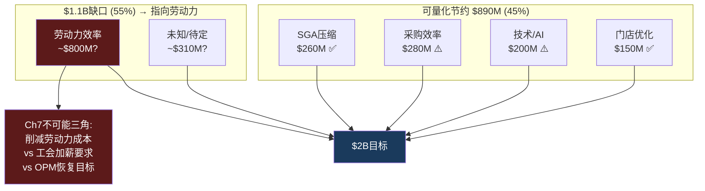

# Ch8 供应链: $5.50的成本解剖与$2B削减的可行性

> **核心矛盾映射**: Ch3证明门店经济学恶化是结构性的(ROIC<WACC)，Ch7的"不可能三角"显示$2B成本削减与工会加薪不可兼得。本章从供应链端完成成本分析的最后一块拼图: 一杯$5.50拿铁的成本到底去哪了? $2B削减承诺的可量化路径仅覆盖45%——剩余55%指向什么? Arabica历史高位($4.39/lb)和乳制品通胀如何叠加劳动力棘轮? 这些问题共同决定了OPM恢复路径的真实约束。

---

## 8.1 一杯$5.50 Grande Latte的成本解剖

这是SBUX成本分析的原子单元——将一杯拿铁的零售价拆解到每一分钱的去向 [DM-P1-A211](C: 单杯成本方法论, 基于FY2025 10-K逆推)。

```
┌───────────────────────────────────────────────────┐
│     一杯 $5.50 Grande Latte 的完整成本解剖        │
├──────────────────┬──────────┬─────────────────────┤
│ 成本项           │   金额    │  占比              │
├──────────────────┼──────────┼─────────────────────┤
│ 咖啡豆           │  $0.30   │  5.5%   ← 不是主角 │
│ 乳制品           │  $0.50   │  9.1%   ← 替代奶↑  │
│ 其他原料+包装    │  $0.20   │  3.6%              │
├──────────────────┼──────────┼─────────────────────┤
│ 小计: 原料       │  $1.00   │ 18.2%              │
├──────────────────┼──────────┼─────────────────────┤
│ 劳动力(Barista)  │  $1.65   │ 30.0%   ← 最大项   │
│ 租金+门店折旧    │  $0.83   │ 15.1%              │
│ 其他门店运营     │  $0.64   │ 11.6%              │
├──────────────────┼──────────┼─────────────────────┤
│ 小计: 门店成本   │  $3.12   │ 56.7%              │
├──────────────────┼──────────┼─────────────────────┤
│ SGA(总部/行政)   │  $0.38   │  6.9%              │
│ D&A(非门店)      │  $0.10   │  1.8%              │
│ 利息费用         │  $0.08   │  1.5%              │
│ 税前利润         │  $0.47   │  8.5%              │
│ 所得税(正常化)   │  $0.11   │  2.0%              │
│ ✅ 净利润         │  $0.36   │  6.5%              │
│ 其他/调整        │  $0.26   │  4.7%              │
└──────────────────┴──────────┴─────────────────────┘
```

[DM-P1-A212](C: 基于FY2025 income statement逆推至单杯; NPM 5.0%→$0.28/杯, 但正常化税率下≈$0.36)

**三个反直觉发现**:

1. **咖啡豆仅占5.5%($0.30)**——即使Arabica价格翻倍(+$0.30)，对净利润的冲击也仅-$0.30/杯(-8.5pp NPM)。市场叙事过度聚焦咖啡豆价格，但它不是成本的主角
2. **劳动力占30%($1.65)**——这是Ch3"劳动力棘轮"的单杯体现。每$1/hr加薪(假设每杯1.5分钟工时)→+$0.025/杯→年化+$750M
3. **"第三空间"成本=$2.48(45%)**——劳动力($1.65)+租金/折旧($0.83)是为空间体验支付的溢价。瑞幸在相同功能项上仅~$0.25(Ch5已对比)——差距10x

[DM-P1-A213](C: 单杯成本三个反直觉)

---

## 8.2 供应链上游: 从种植园到烘焙厂

### 采购网络

SBUX的咖啡供应链始于30+国家的40万+农户。核心采购来源: 拉美(巴西/哥伦比亚/危地马拉)、非洲(埃塞/肯尼亚)、亚太(印尼/云南) [DM-P1-A214](H: FY2025 10-K Supply Chain)。

C.A.F.E. Practices认证体系(2004年与Conservation International合作开发)覆盖SBUX 98%+采购。其真正价值不在ESG叙事而在**供应链可追溯性**: 与产地农户的长期直接贸易关系允许SBUX绕过部分期货市场波动 [DM-P1-A215](H: 10-K + Corporate Responsibility Report)。

### 烘焙产能: 7座工厂的区域化布局

| 工厂 | 位置 | 战略角色 | JV后状态 |
|------|------|---------|---------|
| Kent, WA | 美国 | 美洲旗舰 | 不变 |
| Augusta, GA | 美国 | 东海岸 | 不变 |
| 其他3座 | 美国各地 | 区域补充 | 不变 |
| Amsterdam | 荷兰 | EMEA服务 | 不变 |
| **昆山** | **中国** | **亚太旗舰** | **SBUX保留(未入JV)** |

[DM-P1-A216](H: 10-K + China JV 8-K)

年合计产能>10亿磅(~45万吨)。区域化烘焙的核心逻辑: 新鲜烘焙的最佳风味窗口2-4周，跨洲运输降低品质。昆山工厂($1.3B投资, 2023年投产)使亚太区运输成本降低~12%/磅 [DM-P1-A217](H: 10-K Disclosures)。

**昆山保留的战略含义**(Ch6已初步分析): SBUX通过保留昆山烘焙厂控制了中国JV的**供应链咽喉**——JV必须从SBUX采购烘焙咖啡豆，创造与royalty并行的供应收入流。这种"供应链绑定"比40%股权更能保障SBUX的长期利益 [DM-P1-A218](C: 延续Ch6保留资产分析)。

---

## 8.3 大宗商品风险: Arabica历史高位的传导

### Arabica价格: 47年高点

ICE Coffee C期货在2025年2月触及$4.39/lb——1977年巴西霜冻以来的47年新高(上次$3.39/lb)。截至2026年3月回落至$2.80-3.60/lb区间，但仍远高于FY2021-22锁定的采购价 [DM-P1-A219](E: ICE Futures + 行业数据)。

驱动因素:
1. 巴西连续两年(2023-2024)产量低于预期
2. 全球咖啡库存降至数十年最低
3. 气候变化收窄种植带(适宜Arabica的温度/海拔区间缩小)
4. 关税政策不确定性

**缓解信号**: 巴西2026年产量预计创纪录——6,620万袋(+17.2% YoY)，其中Arabica +23.2%。如果兑现，FY2026下半年可能开始缓解SBUX的采购成本压力 [DM-P1-A220](E: USDA/CONAB产量预测)。

### 乳制品: 被忽视的成本隐雷

美国全脂牛奶从FY2021的$3.50/gal升至FY2024的$4.90/gal(+40%)，2025年回落至$4.20-4.50 [DM-P1-A221](E: USDA Dairy Price Index)。

**替代奶的成本陷阱**: 燕麦奶渗透率从2021年~5%升至2025年~20%+，但单位成本是牛奶的2-3x($8-12/gal vs $4-5/gal)。Niccol在Investor Day宣布**取消替代奶加价**(作为B2S战略)——短期提升traffic但长期压缩GPM约30-50bps [DM-P1-A222](H: Investor Day 2026)。

### 成本传导时间表

SBUX通过6-18个月远期合同和期货套保平滑波动。传导滞后~2-3个季度:

| 时期 | Arabica均价 | SBUX COGS影响 | 管理层评论 |
|------|:---------:|:-----------:|---------|
| FY2024 | $1.80-2.20/lb | 轻微 | "Manageable" |
| FY2025 H2 | $2.50-3.50/lb | +120-150bps GPM | "Elevated coffee costs" |
| FY2026 Q1-Q2 | $3.00-4.39/lb | **峰值压力** | "Q2 will be peak" |
| FY2026 H2 | $2.80-3.20/lb(预) | 开始缓解 | 取决于巴西丰产兑现 |

[DM-P1-A223](H: Earnings Call + E: ICE Futures)

---

## 8.4 Nestle CPG通道: 品牌授权的零成本收租

### 交易结构与当前状态

2018年Nestle以$7.15B获取SBUX全球CPG永久经营权——覆盖零售包装咖啡、Nespresso/Dolce Gusto胶囊、速溶咖啡(VIA)、RTD冷饮 [DM-P1-A224](H: 2018 Nestle Press Release + 10-K)。

会计处理: $7.15B记为递延收入，按40年直线摊销。FY2025余额~$5.8B(非当期)。年确认~$178M——对SBUX**零运营成本投入** [DM-P1-A225](H: FY2025 10-K Balance Sheet Notes)。

### Channel Development表现

| 指标 | FY2023 | FY2024 | FY2025 | 趋势 |
|------|:-----:|:-----:|:-----:|:----:|
| 收入 | $1.85B | $1.82B | $1.92B | 温和增长 |
| 收入占比 | 5.1% | 5.0% | 5.2% | 稳定 |
| OPM(估) | ~50%+ | ~50%+ | ~50%+ | 极高 |
| OI贡献 | ~$0.9B | ~$0.9B | ~$1.0B | |

[DM-P1-A226](H: FMP segment data + 10-K)

**Channel Development是SBUX最"轻松"的收入来源**: Nestle承担全部生产/分销/营销，SBUX仅收取品牌使用费。~50%+的OPM使其对公司整体OPM贡献约1.5-2.0pp——在OPM仅9.6%的当前环境下，Channel Dev实际贡献了SBUX总OI的~25-28% [DM-P1-A227](C: Channel Dev利润贡献)。

**身份C的最纯粹体现**: 如果SBUX完全按Channel Dev模式运营(纯品牌授权，零运营)，OPM将是50%+。这是Ch2身份C估值的现实锚点——它证明SBUX品牌独立于门店的货币化能力是真实的 [DM-P1-A228](C: 身份C验证)。

---

## 8.5 $2B成本削减: 可量化路径仅覆盖45%

### 逐项可行性审计

整合Ch3(门店经济学)、Ch7(不可能三角)的数据，审计$2B承诺的实现路径 [DM-P1-A229](C: $2B审计框架)。

| 削减来源 | 估计金额 | 可行性 | 依赖条件 |
|---------|:-------:|:-----:|---------|
| **SGA压缩** | ~$260M | ✅ 高 | 裁员900人+组织简化已启动 |
| **采购效率** | ~$280M | ⚠️ 有条件 | 需Arabica价格配合(巴西丰产) |
| **技术/自动化** | ~$200M | ⚠️ 中期 | 需$500M-1B前置CapEx, 2-3年见效 |
| **门店网络优化** | ~$150M | ✅ 执行中 | 627关店已释放亏损门店 |
| **小计(可量化)** | **~$890M** | | **占$2B的45%** |
| **缺口** | **~$1,110M** | ❌ 指向劳动力 | **Ch7不可能三角** |

[DM-P1-A230](C: $2B审计结果, 整合Ch3+Ch7)



### $1.1B缺口的不可能三角

Ch7已论证: Niccol不能同时(1)削减$2B成本(需触及劳动力), (2)满足工会加薪($3/hr=+$2.25B/年), (3)恢复OPM至15%。$1.1B缺口**直接落在这个三角内** [DM-P1-A231](C: 缺口→不可能三角映射)。

最可能路径(Ch7已预判): 部分让步工会($1-1.5/hr, +$750M-1.1B/年成本) + 非劳动力领域实现$890M + 效率提升抵消部分工会成本 → **净节约~$800M-1.2B**(非$2B)→ OPM恢复至12-13%(非指引的13.5-15%) [DM-P1-A232](C: 最可能路径估算)。

### 对OPM恢复路径的净影响

| 情景 | 净节约 | OPM提升 | FY2028 OPM | FY2028 EPS |
|------|:-----:|:------:|:---------:|:---------:|
| **管理层目标** | $2.0B | +5.0pp | **14.6%** | **$3.63** |
| **乐观(价格配合+工会温和)** | $1.4B | +3.5pp | 13.1% | $3.10 |
| **基准(部分让步+巴西丰产)** | $1.0B | +2.5pp | **12.1%** | **$2.80** |
| **悲观(Arabica高位+工会$3/hr)** | $0.3B | +0.8pp | 10.4% | $2.10 |

[DM-P1-A233](C: OPM情景矩阵)

**共识FY2028 EPS $3.63需要$2B全部实现+有利外部环境**——在基准情景下OPM仅恢复到12.1%, EPS ~$2.80(比共识低23%)。这是Ch12 Reverse DCF的关键约束输入 [DM-P1-A234](C: 共识vs现实差距)。

---

## 8.6 供应链韧性与长期风险

### 气候变化: 种植带收窄

Arabica最佳种植条件: 15-24°C, 海拔1,200-2,200m。研究预测到2050年适宜面积可能减少50%。SBUX通过实验农场(哥斯达黎加/危地马拉)投资耐旱品种，但商业化需10-15年 [DM-P1-A235](E: Climate & Coffee研究)。

**财务传导**: 如果Arabica价格中枢从$1.50/lb永久上移至$3.00/lb，仅咖啡豆成本压缩GPM约150-200bps。套保可平滑短期但无法对冲结构性供给收缩 [DM-P1-A236](C: 气候→成本传导)。

### 供应链护城河评估

| 维度 | 评分(0-10) | 证据 |
|------|:---------:|------|
| 采购多元化 | 8 | 30+国家, 无单一>30%依赖 |
| 烘焙规模经济 | 7 | 10亿磅产能, 区域化布局 |
| C.A.F.E.认证体系 | 6 | 质量控制+品牌叙事, 但非独占 |
| 冷链/RTD物流 | 5 | 增量成本2-3x, 但margin更高 |
| 对JV的供应链绑定 | 8 | 昆山保留=咽喉控制 |
| **综合** | **6.8** | 上游强, 下游(门店)弱 |

[DM-P1-A237](C: 供应链护城河评分)

供应链是SBUX少数**上游有真实竞争优势**的领域: 采购多元化(8/10)、烘焙规模(7/10)、JV绑定(8/10)。但这些优势不直接传递到门店层面的效率——上游优势被下游的劳动力/租金/第三空间成本完全淹没 [DM-P1-A238](C: 上游vs下游断层)。

---

## 本章小结

| 发现 | 量化结论 | CQ映射 |
|------|---------|--------|
| 咖啡豆仅占$5.50的5.5% | 市场过度聚焦豆价, 劳动力30%才是主角 | CQ1: 成本问题的真实构成 |
| "第三空间"成本=$2.48/杯(45%) | vs瑞幸~$0.25(10x差距) | CQ1: 身份A的效率天花板 |
| $2B削减可量化仅$890M(45%) | $1.1B缺口指向劳动力=不可能三角 | CQ2: Niccol的核心执行约束 |
| 基准OPM 12.1%(非共识14.6%) | EPS $2.80(vs共识$3.63, -23%) | CQ1: Reverse DCF的约束 |
| Arabica Q2 FY2026达峰 | 巴西2026丰产(+17%)=缓解信号 | CQ1: 外部有利条件 |
| Channel Dev贡献~25-28% OI | 身份C(品牌授权)最纯粹验证 | CQ3: 轻资产模式的真实OPM |
| 供应链护城河6.8/10 | 上游强(采购/烘焙)+下游弱(门店) | CQ1: 上游优势被下游淹没 |

**后续章节预传导**:
- 基准OPM 12.1%将锚定Ch12(Reverse DCF)的关键margin假设
- $2B实际净效果$1.0B将传递至Ch9(财务趋势)的margin bridge
- Arabica传导时间表将纳入Ch14(催化剂日历)
- Channel Dev利润结构将传递至Ch18(FCO)中"如果更多收入转为授权"的情景
- 供应链护城河6.8将纳入Ch15(A-Score)的供应链维度
