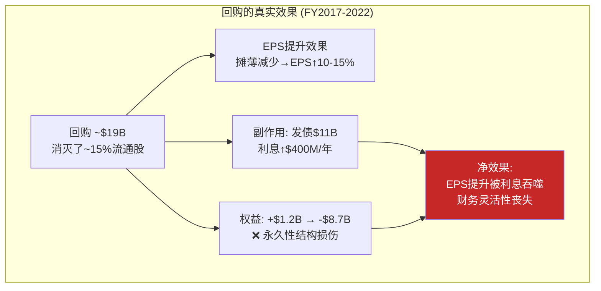
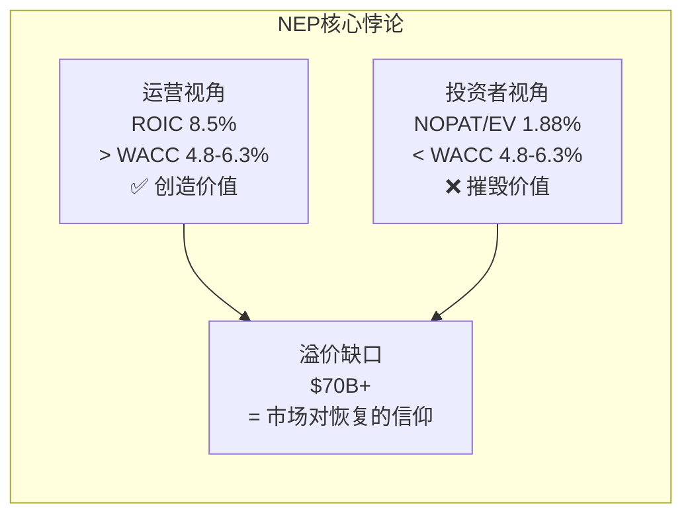
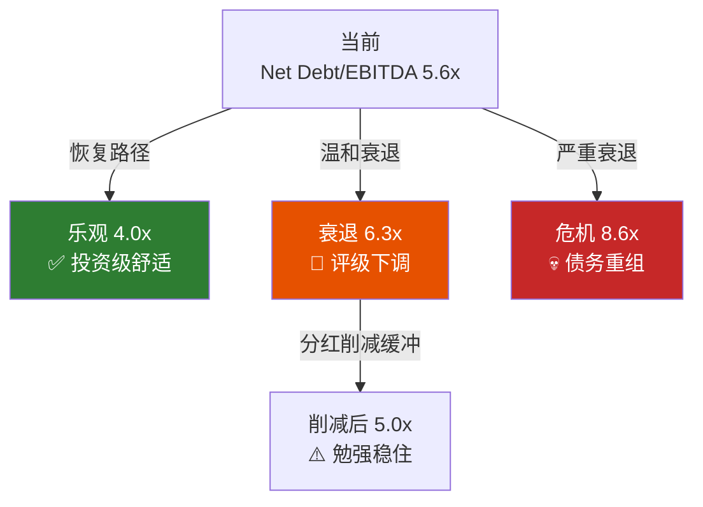

# Ch10 负权益悖论: $8.4B的会计黑洞与价值摧毁的真相

> **核心矛盾映射**: SBUX的股东权益为-$8.4B——这意味着如果清算，股东不仅拿不到一分钱，还"欠"债权人$8.4B。然而市值$97.6B。这个$106B的差距($97.6B市值 - (-$8.4B权益))不是一个错误，而是一面镜子——它映射出市场对SBUX**未来现金流生成能力**的信念。本章将构建NEP(Negative Equity Paradox)框架，回答: 这面镜子是否照出了真相?

---

## 10.1 负权益的起源: $19B回购的遗产

SBUX的负权益不是因为经营亏损——公司从FY2015至今**没有一年净亏损**。负权益完全是资本回报政策的产物。

### 权益消耗时间线

| 年度 | 期初权益($B) | +净利润 | -分红 | -回购 | ±其他 | 期末权益($B) |
|------|:----------:|:------:|:-----:|:-----:|:----:|:-----------:|
| FY2018 | 1.2 | 4.52 | -1.74 | -7.12 | -0.5 | **-3.6** |
| FY2019 | -3.6 | 3.60 | -1.86 | -10.20 | +0.8 | -11.2 |
| FY2020 | -11.2 | 0.93 | -1.97 | -2.01 | +0.5 | -6.2* |
| FY2021 | -6.2 | 4.20 | -2.12 | 0 | -1.2 | -5.3 |
| FY2022 | -5.3 | 3.28 | -2.26 | -4.01 | +0.6 | -8.7 |
| FY2023 | -8.7 | 4.12 | -2.43 | -0.98 | -0.0 | -8.0 |
| FY2024 | -8.0 | 3.76 | -2.59 | -1.27 | +0.7 | -7.4 |
| FY2025 | -7.4 | 1.86 | -2.77 | 0 | +0.2 | -8.1 |
| Q1'26 | -8.1 | 0.29 | -0.69* | 0 | +0.1 | -8.4 |

*FY2020权益"改善"因COVID暂停回购; Q1'26分红估算 [DM-P2-B01](H: FMP BS历史权益 + S: FY2018-2019基于10-K回溯)

**FY2018-FY2019两年间回购$17.3B**——这超过了两年合计净利润$8.1B的**两倍**。差额$9.2B完全靠发债和消耗历史积累的留存收益。这不是一个"高效资本回报"的故事——**这是一个用未来现金流抵押来人为提升EPS的决策** [DM-P2-B02](C: FY2018-19回购分析)。

### 谁做的决策?

| CEO | 任期 | 累计回购($B) | 特征 |
|-----|------|:----------:|------|
| Howard Schultz I | -FY2017 | ~$12 | 温和回购，维持正权益 |
| Kevin Johnson | FY2017-FY2022 | ~$19 | **激进回购，权益转负** |
| Howard Schultz II | FY2022 Q3-Q4 | ~$4 | 延续激进路线 |
| Laxman Narasimhan | FY2023-FY2024 | ~$2.3 | 减速但未停止 |
| Brian Niccol | FY2025- | **$0** | **完全暂停** |

[DM-P2-B03](H: 10-K/Proxy历史回购数据 + S: CEO任期对照)

**Kevin Johnson时代(FY2017-2022)的资本配置是SBUX当前困境的根源**。他的$19B+回购:
1. 将股本从+$1.2B推至-$8.7B
2. 将总债务从~$13B推至~$24B
3. 每年节省的股息(因股本减少)约$200-300M，但每年新增利息$400-500M→**净效果为负**

[DM-P2-B04](C: 回购净效果分析)

---

## 10.2 NEP框架: 负权益公司的三重估值扭曲

负权益不仅是一个会计数字——它创造了三种系统性估值扭曲，任何分析SBUX的投资者都必须意识到:

### 扭曲1: 传统倍数失效

| 指标 | SBUX数值 | 解读 | 可用性 |
|------|:-------:|------|:------:|
| P/B | -12.1x | 负数无意义 | ❌ |
| ROE | -22.9% | 盈利公司负回报率 | ❌ |
| D/E | -3.29x | 负数无意义 | ❌ |
| Graham Number | N/A | 无法计算(负BV) | ❌ |
| Altman Z-Score | 2.82 | 灰色区域(BV为负时Z-Score失真) | ⚠️ |
| P/E | 52.6x | 可用但受税务异常影响 | ⚠️ |
| EV/EBITDA | 22.5x | ✅ 不受权益影响 | ✅ |
| P/FCF | 40.0x | ✅ 现金流不受权益影响 | ✅ |

[DM-P2-B05](H: FMP Ratios + C: 指标可用性评估)

**实际影响**: 大量量化筛选系统(如Graham Net-Net、低P/B策略、Piotroski F-Score)会自动**排除SBUX**——这意味着整个价值投资者群体被系统性地排斥在SBUX投资者基础之外。SBUX的投资者画像被人为地偏向成长型/动量型投资者——这放大了股价的波动性 [DM-P2-B06](C: 负权益的投资者筛选效应)。

### 扭曲2: 信用风险的悖论性"改善"

负权益通常意味着资不抵债——但SBUX仍持有投资级评级(Baa1/BBB+)。这不是评级机构的错误:

| 信用指标 | FY2021 | FY2023 | FY2025 | 趋势 |
|---------|:------:|:------:|:------:|:----:|
| Interest Coverage | 10.4x | 10.7x | 6.6x | ⬇ 恶化 |
| Debt Service Coverage | 4.22x | 2.55x | 2.00x | ⬇ 恶化 |
| Net Debt/EBITDA | 2.33x | 2.84x | 4.35x | ⬇ 恶化 |
| OCF/Total Debt | 25.4% | 24.4% | 17.8% | ⬇ 恶化 |
| Current Ratio | 1.20x | 0.78x | 0.72x | ⬇ 恶化 |

[DM-P2-B07](H: FMP Key-Metrics + Ratios)

**所有信用指标都在恶化**——但仍在投资级门槛之上(Interest Coverage >4x一般安全，6.6x虽然下降但仍有缓冲)。关键问题是:
- Q1'26净债务$30.1B / 年化EBITDA ~$5.4B = **5.6x**——如果维持在此水平，可能触发评级下调关注(outlook negative)
- **评级下调的传导链**: BBB+→BBB→BBB-→BB+(垃圾级) = 借贷成本可能从~4%跳升至6-7%，每年增加$300-500M利息 [DM-P2-B08](C: 信用评级传导分析)

### 扭曲3: ROIC vs WACC的"虚假"价值创造

Ch9已经展示FY2025 ROIC 8.5% vs WACC 4.8-6.3%——看似仍在创造价值。但这里有一个隐藏的陷阱:

**ROIC计算中的"投资资本"是经济投资资本($18.5B)——但SBUX的企业价值(EV = 市值+净债务)是$127.7B**。如果用EV作为真实的投资者成本:

$$\text{真实回报率} = \frac{\text{NOPAT}}{\text{EV}} = \frac{\$2,396M(正常化)}{\$127,700M} = 1.88\%$$

**1.88%回报率 vs 4.8-6.3% WACC = 在EV基础上，SBUX正在大幅摧毁价值** [DM-P2-B09](C: EV基准ROIC计算)。

这揭示了NEP的核心悖论: **从运营角度看ROIC > WACC(创造价值)，但从投资者角度看NOPAT/EV < WACC(摧毁价值)**。两者的差异来源于市场给予的$70B+估值溢价——这个溢价只有在NOPAT大幅增长(回到正常化$3.5-4.0B+)时才能被合理化。

[DM-P2-B10](C: NEP双视角悖论)

---

## 10.3 债务结构纵深: $33.5B的到期墙

### 债务到期分布(估算)

SBUX的债务以长期固定利率债券为主。基于公开信息:

| 到期窗口 | 估算金额($B) | 利率区间 | 再融资风险 |
|---------|:----------:|:-------:|:---------:|
| FY2026 (≤1年) | ~$3.5-4.0 | 3.0-3.5% | 中(需以更高利率再融资) |
| FY2027-2028 | ~$6.0-7.0 | 3.5-4.0% | 中 |
| FY2029-2033 | ~$12.0-14.0 | 4.0-4.5% | 低(时间缓冲) |
| FY2034+ | ~$8.0-10.0 | 4.5-5.0% | 低 |
| 经营租赁负债 | ~$8.0-10.0 | 隐含 | 不可展期 |

[DM-P2-B11](S: 基于10-K债务附注和同业对比推算，需验证)

**关键发现**: Q1 FY2026的$33.5B总债务中，约$8-10B可能是经营租赁负债(因ASC 842纳入)。扣除后的金融债务约$23-25B，利息覆盖6.6x仍可管理。

但**再融资风险在上升**: FY2026-2028到期的~$10B债务需要以4.5-5.5%的利率(vs 原始3.0-4.0%)再融资——每年增加$50-150M利息成本 [DM-P2-B12](C: 再融资成本增量估算)。

---

## 10.4 资本配置效率审计: 回购是否摧毁了价值?

这是CQ4的核心问题。框架:

### 回购价值测试

**测试方法**: 如果SBUX没有回购，而是用这些现金偿还债务或支付特别股息，投资者的终身回报会更高还是更低?

| 情景 | FY2018-2024累计 | 股东回报 |
|------|:-------------:|---------|
| **实际(回购+债务)** | 回购$23.5B + 分红$16B = $39.5B | 股价从$58→$97(+67%), 总回报~+95%(含分红) |
| **反事实A(无回购+还债)** | 分红$16B + 还债$23.5B | 零债务公司，权益$15B+，股本未减少→EPS更低但P/E可能更高(无杠杆溢价) |
| **反事实B(无回购+特别股息)** | 分红$16B + 特别股息$23.5B | 股东直接收到$39.5B现金(含税后~$33B) |

[DM-P2-B13](C: 回购反事实分析框架)

**粗略估算**:
- 实际路径: $58→$97 + $16B分红 / 1.16B股(初始) ≈ $97 + $13.8/股 = ~$111总值/股 vs $58买入 = **+91%**
- 反事实B(全部现金分配): $39.5B / 1.16B = $34.1/股现金 + 假设股价$65(无回购→更多流通→EPS更低) = ~$99总值/股 vs $58 = **+71%**

**回购在事后看创造了约20pp的超额回报**——但这建立在一个关键假设上: 股价在回购期间($58-95区间)低于内在价值。如果SBUX在FY2025-2028无法恢复到$3.00+ EPS，那么在$75-95区间的回购就是在高估时买入——**价值摧毁** [DM-P2-B14](C: 回购价值判断取决于未来EPS)。

### Niccol的资本配置信号

| 决策 | 信号解读 | 影响 |
|------|---------|------|
| 暂停回购 | 承认当前EPS不支持回购(ROIC接近WACC) | 正确 |
| 维持分红$2.77B | 不愿发出削减信号(管理层信心?) | 冒险(FCF不覆盖) |
| 中国JV | 释放资本($4B对价)但增加复杂度 | 中性偏积极 |
| 627关店 | 短期减值但长期释放租金现金流 | 积极(FY2027+) |

[DM-P2-B15](C: Niccol资本配置评估)

---

## 10.5 负权益的估值哲学: 从"净资产"到"现金流机器"

### 传统估值 vs 现金流估值

SBUX的负权益迫使投资者做一个范式切换:

| 传统框架 | 现金流框架 |
|---------|----------|
| 公司值多少=净资产+增长 | 公司值多少=未来FCF现值 |
| P/B是锚 | P/FCF是锚 |
| 清算价值是底部 | 无清算价值(负权益→清算为0) |
| 安全边际=价格折让于BV | 安全边际=FCF yield高于WACC |

对SBUX而言:
- **清算价值 = $0**(负权益意味着债权人都无法全额回收)
- **持续经营价值 = FCF的永续贴现** = 核心$2.5B FCF / 6.3% WACC ≈ $39.7B(假设零增长)
- **加增长期权: $39.7B + 增长PV ≈ $60-80B**(取决于恢复速度)
- **当前EV: $127.7B → 隐含增长PV = $48-88B**

[DM-P2-B16](C: 持续经营估值vs清算估值)

**$48-88B的"增长价值"需要什么来支撑?**

如果增长价值=$68B(中位数)，反推所需的FCF增长率:

$$\text{EV} = \frac{FCF_0 \times (1+g)}{WACC - g} \implies \$127.7B = \frac{\$2.5B \times (1+g)}{6.3\% - g}$$

求解: g ≈ **4.3%**

也就是说，$97/股的价格隐含SBUX的FCF需要以**4.3%永续增长率**增长——这对于一个成熟的咖啡连锁来说是偏高的(名义GDP增长~4-5%,但SBUX的FCF在近4年是下降趋势) [DM-P2-B17](C: 隐含FCF增长率4.3%)。

---

## 10.6 杠杆极限测试: SBUX能承受多大的压力?

### 压力测试矩阵

| 情景 | 触发条件 | EBITDA影响 | Net Debt/EBITDA | 结果 |
|------|---------|:---------:|:--------------:|------|
| **基准** | 当前运营 | $5.4B | 5.6x | ⚠️ 偏高 |
| **乐观** | OPM恢复至13%+comp+5% | $7.5B | 4.0x | ✅ 舒适 |
| **温和衰退** | Comp -3%, OPM 8% | $4.8B | 6.3x | 🚨 评级威胁 |
| **严重衰退** | Comp -8%, OPM 5% | $3.5B | 8.6x | 💀 潜在违约 |
| **分红削减** | 削减50%至~$1.4B | 无影响 | 5.6x | 释放$1.4B/年 |

[DM-P2-B18](C: 杠杆压力测试矩阵)

**关键结论**: SBUX的杠杆目前处于**"可管理但无缓冲"**的状态。恢复路径(OPM回到13%)将自动解决杠杆问题。但如果恢复失败+经济衰退，分红削减是唯一的安全阀——而管理层目前不愿触碰这个阀门 [DM-P2-B19](C: 杠杆风险评估)。

---

## 10.7 本章发现总结

### NEP核心判断

| 维度 | 评估 | 置信度 |
|------|------|:------:|
| 负权益原因 | 人为回购导致(非经营亏损)——不影响持续经营 | 90% |
| 债务可管理性 | 当前偏紧(5.6x)但投资级维持概率>80% | 70% |
| 分红可持续性 | FY2026-27可维持(靠借债)，FY2028+取决于恢复 | 55% |
| ROIC vs WACC | 运营层面微创造价值；EV层面大幅摧毁价值 | 80% |
| 回购决策质量 | Johnson时代摧毁价值；Niccol暂停正确 | 75% |

[DM-P2-B20](C: NEP综合评估)

### CQ4置信度更新

CQ4: "负$8.4B权益 + ROIC<WACC = 回购摧毁价值?"

**Phase 2答案**: **部分正确**。
- Johnson时代的激进回购确实在高估值时摧毁了$3-5B股东价值(事后看)
- 但ROIC(8.5%) > WACC(4.8-6.3%)——运营层面仍在创造价值
- 核心风险不是ROIC，而是**杠杆对恢复失败的脆弱性**——如果OPM无法恢复至12%+，债务将从"可管理"滑向"危险"

**置信度**: 65% → **70%**(+5pp，因杠杆风险更清晰)

[DM-P2-B21](C: CQ4 Phase 2置信度更新)

---

> **交叉引用**: Ch9 ROIC/WACC数据 → 本章NEP框架验证 | Ch6中国JV → $4B对价改善杠杆 | Ch4 Rewards浮存金 → $1.8B是隐性负债而非资产(在负权益框架下)
> **前向引用**: Ch12 Reverse DCF将使用本章的WACC和正常化NOPAT | Ch10发现的4.3%隐含增长率将在Ch12被正面检验
