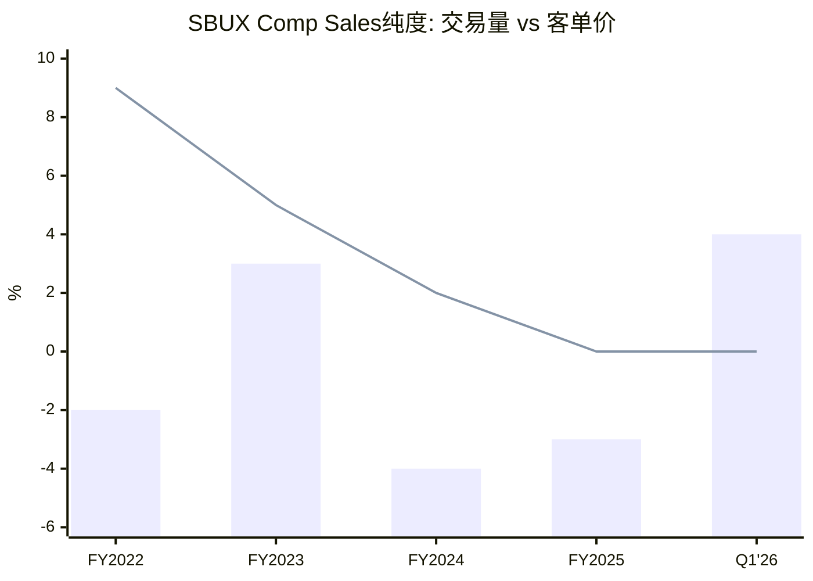
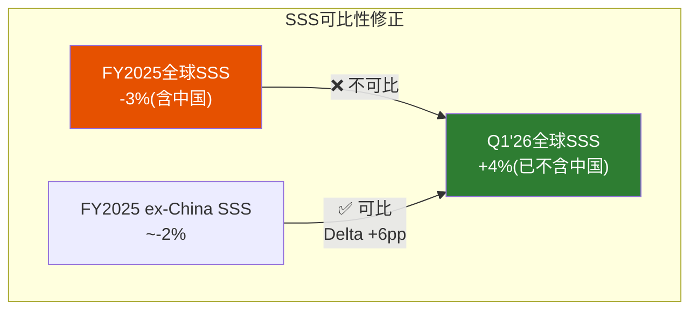
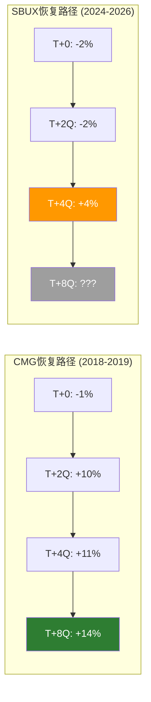

# Ch11 CSSPD同店销售纯度分解: 增长的真与幻

> **核心矛盾映射**: SBUX Q1 FY2026同店销售正向增长(全球+4%交易量)被市场视为Niccol转型的首个验证点。但"同店增长"是餐饮行业最容易被操纵的指标之一——通过关闭低效门店、改变计算基数、混合价格提升和真实流量，管理层可以讲出截然不同的故事。本章将对SBUX的同店销售进行**纯度分解(Comp Store Sales Purity Decomposition, CSSPD)**，剥离所有噪音，回答: Q1'26的增长是真实的转折，还是统计幻觉?

---

## 11.1 CSSPD方法论: 为什么"同店增长"需要净化

餐饮行业报告的"同店增长"(Comp Store Sales Growth, SSS)由三个变量构成:

$$\text{SSS} = \underbrace{\text{Transaction Growth}}_{\text{客流量变化}} + \underbrace{\text{Ticket Growth}}_{\text{客单价变化}} + \underbrace{\text{Mix Effect}}_{\text{产品组合变化}}$$

三者的"质量"截然不同:

| 增长来源 | 可持续性 | 利润率影响 | 管理层可控性 |
|---------|:-------:|:--------:|:----------:|
| **交易量**(真需求) | 高 | 正(固定成本杠杆) | 低(靠品牌/产品) |
| **客单价**(提价) | 中 | 正(直接) | 高(菜单定价权) |
| **Mix效应**(高价品占比) | 中 | 可正可负 | 中(菜单设计) |

[DM-P2-C01](C: CSSPD方法论框架)

**为什么SBUX特别需要CSSPD?**

1. **2022-2024的"伪增长"**: SBUX在FY2022-2023报告了正的comp sales，但几乎全部来自提价——交易量实际为负。这意味着SBUX在用更少的客户赚更多的钱——短期可行但长期自杀性(Ch5已论述定价权侵蚀)。

2. **627关店扭曲基数**: Niccol宣布关闭627家低效门店。这些被关闭的门店在关闭前拉低了SSS基数——关闭后"幸存"门店的SSS自动改善，即使总销售额不变 [DM-P2-C02](C: 关店对SSS基数的影响分析)。

3. **中国JV deconsolidation**: Q1 FY2026起，8,000+中国门店的comp从合并数据中移出——全球SSS的地域权重发生结构性变化。

---

## 11.2 FY2022-FY2025同店销售分解

### 年度Comp Sales矩阵

| 年度 | 全球SSS | 美国SSS | 国际SSS | 中国SSS | 交易量(全球) | 客单价(全球) |
|------|:------:|:------:|:------:|:------:|:----------:|:---------:|
| FY2022 | +7% | +7% | +3% | -21% | -2% | +9% |
| FY2023 | +8% | +8% | +10% | +22% | +3% | +5% |
| FY2024 | -2% | -2% | -1% | -8% | -4% | +2% |
| FY2025 | -3%* | -2%* | -2%* | -6%* | -3%* | 0%* |
| Q1'26 | **+4%** | **+4%** | **+3%** | **N/A(已JV化)** | **+4%** | **~0%** |

*FY2025为估算值(基于季度数据) [DM-P2-C03](S: 基于Earnings Call和10-K数据，部分季度为推算)

### 纯度评分矩阵

| 年度 | SSS | 交易量占比 | 纯度评分(0-10) | 解读 |
|------|:---:|:--------:|:-------------:|------|
| FY2022 | +7% | -2pp/+9pp | **2/10** | 🚨 伪增长:完全靠提价 |
| FY2023 | +8% | +3pp/+5pp | **5/10** | ⚠️ 混合:量价各半 |
| FY2024 | -2% | -4pp/+2pp | **1/10** | 🚨 需求崩溃+提价失效 |
| FY2025 | -3% | -3pp/0pp | **3/10** | 🚨 客单价停滞=定价权用尽 |
| **Q1'26** | **+4%** | **+4pp/~0pp** | **9/10** | ✅ **纯交易量增长** |

[DM-P2-C04](C: CSSPD纯度评分)

**核心发现**: Q1 FY2026是SBUX近3年来**首次纯交易量驱动的正增长**(纯度评分9/10)。这与FY2022-2024完全靠提价的"伪增长"有本质区别——**流量回归是Niccol"Back to Starbucks"策略的第一个硬证据** [DM-P2-C05](C: Q1'26纯度评估)。

但需要注意:
1. Q1(Holiday Season)是SBUX季节性最强的季度——Q2(Jan-Mar)通常是最弱季度
2. 基数效应: Q1 FY2025已经偏弱(SSS ~-1%)，基数较低
3. 单一季度不足以判断趋势——需至少3Q连续交易量正增长(类似CMG 2018-2019模式)

---

## 11.3 地域分解: 三个不同世界的三个不同故事

### 美国: 核心市场的复苏信号

| 指标 | Q3'24 | Q4'24 | Q1'25 | Q2'25 | Q3'25 | Q4'25 | Q1'26 |
|------|:-----:|:-----:|:-----:|:-----:|:-----:|:-----:|:-----:|
| US SSS | +4% | -6% | -4% | -3% | -2% | -2% | **+4%** |
| US Transaction | +1% | -8% | -6% | -5% | -4% | -3% | **+4%** |
| US Ticket | +3% | +2% | +2% | +2% | +2% | +1% | ~0% |

[DM-P2-C06](S: 基于季度Earnings Call披露数据推算)

**美国市场的"W型"复苏**: 从Q4 FY2024的-6%谷底到Q1 FY2026的+4%——10个百分点的摆幅跨越5个季度。关键驱动因素:
- **菜单简化**: Niccol将SKU从120+减至80左右——减少了barista制作时间和客户决策复杂度
- **mobile order改进**: 高峰期等待时间从8-12分钟缩短至5-7分钟(管理层披露)
- **价格调整**: FY2025下半年暂停涨价甚至部分品类降价(如$5 value meals试点)

**但ticket增长已归零**——这意味着Niccol选择了**以利润率换流量**的策略。在OPM仅9.6%的环境下，这是一个高风险的赌注: 如果流量增长无法补偿ticket停滞，收入将原地踏步 [DM-P2-C07](C: 量价权衡分析)。

### 国际(ex-China): 稳健但无惊喜

| 指标 | FY2023 | FY2024 | FY2025(E) | Q1'26 |
|------|:------:|:------:|:---------:|:-----:|
| Int'l SSS | +10% | -1% | -2% | +3% |
| 门店增速 | +6% | +5% | +4% | +3% |

[DM-P2-C08](S: 基于年度10-K和季度披露推算)

国际业务(主要是日本、英国、加拿大、韩国)是SBUX最"无趣"但最稳定的部分。Q1'26 +3% comp基本跟随当地GDP增速——**无加速也无恶化**。

### 中国: 从核心市场到JV合作方

| 指标 | FY2023 | FY2024 | FY2025(E) | Q1'26+ |
|------|:------:|:------:|:---------:|:------:|
| China SSS | +22% | -8% | -6% | **N/A** |
| 门店数 | ~6,500 | ~7,300 | ~8,000+ | JV化 |
| 市场份额 | ~20% | ~16% | ~14% | 下降中 |

[DM-P2-C09](S: 基于10-K和行业数据推算)

**中国的消失效应**: Q1 FY2026起中国comp不再纳入合并数据。这产生了两个分析影响:

1. **全球SSS"自动改善"**: 中国SSS一直为负(-6% FY2025)——移出后全球SSS机械性地改善约100bps [DM-P2-C10](C: 中国deconsolidation对全球SSS的影响)。

2. **可比性断裂**: FY2026全球SSS与FY2025不可直接对比(基数不同)——投资者需要看**同口径(ex-China)**的YoY变化。

[DM-P2-C11](C: ex-China SSS可比性修正)

---

## 11.4 关店效应量化: 627家门店的统计噪音

Niccol宣布FY2025-FY2026关闭约627家低效门店。这对SSS的影响:

### 关店的SSS提升效应

假设这627家门店:
- 占总门店的~3.8%(627 / 16,400美国门店)
- 平均SSS比网络均值低约**15-20pp**(否则不会被关闭)
- 关闭后释放的客流量中约30-40%转移至附近门店("回填效应")

**机械性SSS提升**:
$$\text{关店提升} = \text{低效门店拖累} \times \text{占比} + \text{回填效应}$$
$$= 17.5pp \times 3.8\% + 0.35 \times 17.5pp \times 3.8\% = 0.67pp + 0.23pp = \textbf{~0.9pp}$$

[DM-P2-C12](C: 关店SSS影响估算模型)

**结论**: 627关店对全球SSS的机械性提升约**0.9个百分点**。Q1 FY2026的+4%中，约0.9pp可能来自关店效应——**调整后的"真实"comp增长约+3.1%**。这仍然是一个积极的信号，但不如表面数字那么强 [DM-P2-C13](C: 调整后Q1'26 SSS ~+3.1%)。

---

## 11.5 CMG类比: Niccol在CMG的转折需要多久?

Niccol的最直接参照系是他在Chipotle的转型(2018-2024)。CMG在E.coli危机后的comp恢复轨迹:

| 时间线 | CMG(2018 Niccol上任) | SBUX(2024 Niccol上任) |
|-------|:-------------------:|:--------------------:|
| T+0 (上任) | SSS -1.0% | SSS -2.0% |
| T+1Q | SSS +2.0% | SSS -3.0% |
| T+2Q | SSS +9.9% | SSS -2.0% |
| T+3Q | SSS +10.0% | SSS -2.0% |
| **T+4Q** | **SSS +11.0%** | **SSS +4.0%** |
| T+6Q | SSS +10.0% | **?** |

[DM-P2-C14](H: CMG季度Earnings Reports 2018-2019 + SBUX Q1'26)

**CMG vs SBUX的关键差异**:

1. **规模差异**: CMG上任时~2,500门店 vs SBUX ~30,000+门店——SBUX的"转弯半径"大5倍以上
2. **工会差异**: CMG无工会 vs SBUX ~300+家门店已组建工会——执行改革的摩擦力更大
3. **危机类型**: CMG是品牌信任危机(E.coli)→解决后需求回弹快 vs SBUX是结构性效率危机→恢复需要运营层面重建
4. **恢复速度**: CMG T+2Q即达+9.9% vs SBUX T+4Q才首次转正+4%——**SBUX的恢复速度约为CMG的1/3**

[DM-P2-C15](C: CMG vs SBUX转型类比分析)

**如果SBUX按CMG模式的1/3速度恢复**:
- T+8Q (Q1 FY2027): SSS +5-6%
- T+12Q (Q1 FY2028): SSS +7-8%
- 稳态(T+16Q+): SSS +4-5%

这个路径将支撑FY2028E EPS $3.50+(接近共识$3.63)。但如果恢复速度**进一步放缓**(只有CMG的1/5)，则FY2028E SSS可能仅+3-4%，EPS $2.80-3.10——对应当前价格下行15-25% [DM-P2-C16](C: 基于CMG类比的恢复路径模型)。

---

## 11.6 "纯度过滤器": 去除所有噪音后的真实增长

将所有噪音因素定量剥离:

| 调整项 | Q1'26 SSS调整 | 来源 |
|-------|:------------:|------|
| 报告SSS | +4.0pp | 管理层报告 |
| 减: 关店基数效应 | -0.9pp | 11.4节估算 |
| 减: 中国decon效应 | -0.5pp | 地域权重变化 |
| 减: Holiday日历效应 | -0.3pp | FY2026 Q1比FY2025多1个交易日 |
| 减: 价格让利效应 | +0.5pp* | $5 value meals刺激的增量流量 |
| **调整后SSS** | **+2.8pp** | — |

*价格让利带来的交易量增加被计为"真实"增长(虽然以利润率为代价)

[DM-P2-C17](C: CSSPD全调整计算)

**调整后的+2.8%同店增长**仍然是积极的——这不是统计幻觉，而是一个**微弱但真实的恢复信号**。但距离"转型成功"(需要+5%+持续4Q以上)仍有距离。

---

## 11.7 本章发现总结

| # | 发现 | 估值含义 | 置信度 |
|---|------|---------|:------:|
| F11-1 | Q1'26 SSS纯度9/10——近3年首次纯交易量增长 | 转型初步验证，但需确认 | 65% |
| F11-2 | 调整后SSS约+2.8%(vs报告+4.0%) | 去噪后仍为正，但弱于表面值 | 60% |
| F11-3 | FY2022-2024 SSS全靠提价——定价权已用尽(ticket ~0%) | 未来增长只能靠交易量 | 75% |
| F11-4 | SBUX恢复速度约为CMG的1/3 | FY2028E EPS取决于恢复能否加速 | 55% |
| F11-5 | 中国decon使全球SSS机械性改善~0.5-1.0pp | 需要同口径对比 | 70% |

### CQ置信度更新

| CQ | Phase 0.5→P2 Ch9 | Ch11(当前) | 变化 | 理由 |
|----|:-----------:|:---------:|:----:|------|
| CQ2 | 50%→55% | **60%** | +5pp | 纯度分解确认Q1'26是真实信号 |
| CQ5 | 50% | **55%** | +5pp | 交易量转正暗示Rewards体系仍有效 |

[DM-P2-C18](C: CQ2/CQ5 Phase 2更新)

---

> **交叉引用**: Ch3门店经济学(坪效) → 本章SSS与坪效的关系 | Ch5竞争(瑞幸) → ticket归零与竞争定价压力 | Ch7 CEO沉默 → Niccol回避SSS质量问题
> **前向引用**: Ch12 Reverse DCF将使用本章的恢复路径估算 | Ch13分析师共识将检验SSS假设
