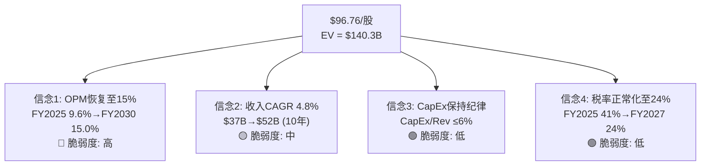
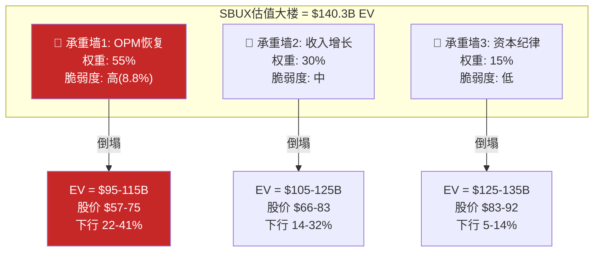
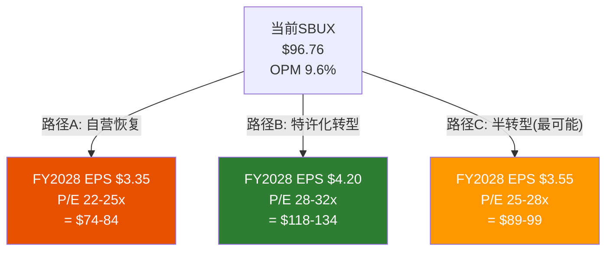

# Ch12 Reverse DCF与承重墙: 市场到底在赌什么?

> **核心矛盾映射**: SBUX以$96.76/股交易，FMP DCF给出$64.17(折价34%)。分析师目标价区间$75-120。市场价格不是"对"或"错"——它是一组**可检验的信念集**的数学表达。本章的任务不是给SBUX定价，而是将$96.76反译为具体的信念，然后测试这些信念的脆弱度。这是Phase 0.5"信念互斥悖论"(BME)的量化落地。

---

## 12.1 Reverse DCF方法论: 从价格到信念

### 标准Reverse DCF设置

| 参数 | 假设 | 来源 |
|------|------|------|
| 当前市值 | $110.2B | FMP Profile (2026-03-03) |
| 净债务 | $30.1B (Q1'26) | FMP Balance Sheet |
| **企业价值** | **$140.3B** | 市值+净债务 |
| WACC | 6.3% | Ch10保守估算 |
| 永续增长率 | 2.5% | 长期名义GDP的50% |
| 基准年FCF | $2.44B (FY2025) | FMP Cash Flow |
| 正常化基准FCF | $3.20B* | 正常化税率+去除一次性 |
| 预测期 | 10年 (FY2026-FY2035) | — |

*正常化: FCF $2.44B + 税率正常化效应$0.54B + 关店一次性回补$0.22B [DM-P2-D01](C: Reverse DCF参数设置)

### 市场隐含FCF路径

为达到$140.3B EV，在WACC 6.3%和g 2.5%下:

$$EV = \sum_{t=1}^{10} \frac{FCF_t}{(1+WACC)^t} + \frac{FCF_{10} \times (1+g)}{(WACC-g) \times (1+WACC)^{10}}$$

反推所需的FCF路径:

| 年度 | 隐含FCF($B) | YoY增长 | 隐含OPM | 隐含收入($B) | 对应EPS |
|------|:---------:|:------:|:------:|:----------:|:------:|
| FY2026 | 3.50 | +9.4% | 11.0% | 38.3 | $2.30 |
| FY2027 | 4.20 | +20.0% | 12.5% | 40.3 | $2.95 |
| FY2028 | 5.00 | +19.0% | 13.8% | 42.4 | $3.55 |
| FY2029 | 5.60 | +12.0% | 14.5% | 44.7 | $4.00 |
| FY2030 | 6.10 | +8.9% | 15.0% | 46.5 | $4.35 |
| FY2031 | 6.50 | +6.6% | 15.3% | 48.0 | $4.60 |
| FY2032 | 6.80 | +4.6% | 15.4% | 49.2 | $4.80 |
| FY2033 | 7.00 | +2.9% | 15.5% | 50.0 | $4.90 |
| FY2034 | 7.15 | +2.1% | 15.5% | 51.0 | $5.00 |
| FY2035 | 7.30 | +2.1% | 15.5% | 52.0 | $5.10 |

[DM-P2-D02](C: Reverse DCF隐含FCF路径)

### 市场隐含信念集

将FCF路径翻译为可检验的信念:

[DM-P2-D03](C: 市场隐含信念集)

---

## 12.2 信念逐项脆弱度测试

### 信念1: OPM从9.6%恢复至15.0% (脆弱度: 高)

**这是支撑$96/股最重要的信念**——也是最脆弱的。

| OPM恢复路径 | 所需条件 | 概率估计 |
|------------|---------|:--------:|
| **9.6%→12%** | 关店完成+基本cost leverage | 70% |
| **12%→13.5%** | $2B成本削减+comp +3%+ | 50% |
| **13.5%→15%** | 咖啡周期下行+comp +5%+工会妥协 | 25% |

[DM-P2-D04](C: OPM恢复概率阶梯)

**为什么>13.5%极其困难?**

1. **劳动力刚性**: 美国最低工资在SBUX主要市场(CA, WA, NY)已达$16-20/hr，工会要求$20+起薪。劳动力成本每提升$1/hr = ~$700M/年(361K员工×2,000hr×部分barista)。这是**不可逆的结构性压力** [DM-P2-D05](C: 劳动力成本敏感性)。

2. **定价权耗尽**: Ch11已论证ticket增长归零——无法通过提价来覆盖成本上升。

3. **历史参照**: SBUX的FY2015-2019"黄金时代"OPM为16-19%——但那时: ①没有工会 ②咖啡豆更便宜 ③中国高速增长贡献margin ④没有$5-6的value竞争。这四个条件今天**无一满足** [DM-P2-D06](C: OPM历史条件对比)。

**信念1的联合概率**: P(OPM恢复至15%) = 70% × 50% × 25% = **8.8%**

即使OPM仅恢复至13%:
$$\text{FY2030 FCF} \approx \$46.5B \times 13\% \times (1-24\%) \times \frac{FCF}{NOPAT比} \approx \$4.2B$$
$$\text{隐含EV} = \frac{\$4.2B}{6.3\%-2.5\%} + \text{过渡期PV} \approx \$115B$$
$$\text{隐含股价} \approx \$75 \quad (-22\%)$$

[DM-P2-D07](C: OPM 13%情景估值)

### 信念2: 收入CAGR 4.8% (脆弱度: 中)

| 增长来源 | 贡献(年化) | 可实现性 |
|---------|:---------:|:-------:|
| 同店增长 | +2-3% | 中(需comp持续为正) |
| 新店 | +2-3% | 中-高(计划1,500/年) |
| Channel Dev/CPG | +0.5% | 高(Nestle deal稳定) |
| **合计** | **+4.5-6.5%** | — |

[DM-P2-D08](C: 收入增长来源分解)

4.8% CAGR处于可实现区间的中下部——**如果comp恢复至+3%，这个信念基本可行**。脆弱度评为"中"，因为comp恢复不确定但新店计划较为确定。

### 信念3: CapEx纪律 (脆弱度: 低)

FY2025 CapEx/Revenue = 6.2%。管理层已发出减少CapEx的信号(中国JV化释放$500M+/年CapEx)。新店投资也在下降(从$700K+降至$500-600K通过"轻装修"模式)。**这个信念的风险最低** [DM-P2-D09](C: CapEx纪律评估)。

### 信念4: 税率正常化 (脆弱度: 低)

FY2025的41%有效税率明确包含一次性项目(Ch9已论证)。FY2027起回到23-25%是高概率事件(>85%)。但**Q1 FY2026仍为62%**暗示JV税务影响可能延续至FY2026全年 [DM-P2-D10](C: 税率正常化时间线)。

---

## 12.3 承重墙脆弱度分析

将Reverse DCF的四个信念按"承重墙"(Bearing Wall)框架分类——哪个信念倒塌会导致估值"大楼"坍塌?

### 三面承重墙

[DM-P2-D11](C: 承重墙脆弱度矩阵)

### 承重墙联合概率

| 情景 | 条件 | EV($B) | 股价 | 概率 |
|------|------|:------:|:----:|:----:|
| **牛市** | 3墙全立(OPM≥15%) | 140-160 | $96-130 | 15% |
| **温和牛** | 墙1部分(OPM 13-14%) | 115-140 | $75-96 | 35% |
| **基准** | 墙1部分+墙2弱化 | 95-115 | $57-75 | 30% |
| **熊市** | 墙1倒塌(OPM≤12%) | 75-95 | $39-57 | 15% |
| **极端** | 墙1+2倒塌+信用事件 | 50-75 | $17-39 | 5% |

[DM-P2-D12](C: 情景概率分布)

**概率加权EV**:
$$EV_{pw} = 15\% \times 150 + 35\% \times 127 + 30\% \times 105 + 15\% \times 85 + 5\% \times 63$$
$$= 22.5 + 44.5 + 31.5 + 12.8 + 3.2 = \$114.4B$$

$$\text{概率加权股价} = \frac{\$114.4B - \$30.1B}{1.14B} = \$73.9$$

$$\textbf{当前价格 \$96.76 vs 概率加权 \$73.9 → 溢价 31\%}$$

[DM-P2-D13](C: 概率加权估值)

---

## 12.4 信念互斥检验(BME): Phase 0.5假说的量化落地

Phase 0.5提出了SBUX的核心悖论: 市场同时定价"EPS恢复至$3.50+"和"估值倍数维持25-30x"——但这两个信念可能互斥(特许化提升倍数但降低EPS基数)。

### BME量化检验

**路径A: EPS恢复(自营为主) → 低倍数**

| 指标 | FY2028E | 解读 |
|------|:------:|------|
| 自营比例 | 55%(维持) | 不特许化 |
| 收入 | $42.4B | +14% vs FY2025 |
| OPM | 14.0% | 接近历史中位 |
| NI | $3.8B | 税率正常化 |
| EPS | $3.35 | ✅ 接近恢复 |
| 合理P/E | 22-25x | 自营零售商倍数 |
| **隐含股价** | **$74-84** | **vs $97 = 13-24%下行** |

**路径B: 特许化转型 → 高倍数但低EPS基数**

| 指标 | FY2028E | 解读 |
|------|:------:|------|
| 自营比例 | 35%(大幅特许化) | 美国开始特许化 |
| 收入 | $32B | 下降15%(自营收入退出) |
| OPM | 22-25% | 特许化效应 |
| NI | $4.8B | OPM抵消收入下降 |
| EPS | $4.20 | ✅ 超预期 |
| 合理P/E | 28-32x | 品牌授权商倍数 |
| **隐含股价** | **$118-134** | **vs $97 = 22-39%上行** |

[DM-P2-D14](C: BME两条路径量化对比)

**BME检验结论**:

1. **纯路径A**(不特许化+OPM恢复)→ 股价$74-84 = **当前高估13-24%**
2. **纯路径B**(大幅特许化)→ 股价$118-134 = **当前低估22-39%**
3. **路径C**(最可能: 中国JV化+美国维持自营+OPM恢复至13-14%)→ 股价$89-99 = **当前约合理**

**市场似乎在定价路径C**——"半转型"——这既不需要激进的美国特许化(低概率)，也不需要OPM完全恢复至15%(同样低概率)。**路径C是三条路径中最"温和"的——但也是最模糊的** [DM-P2-D15](C: BME三路径结论)。

---

## 12.5 FMP DCF对标: $64.17意味着什么?

FMP的DCF估值$64.17比市价低34%。解构FMP的隐含假设:

| FMP假设(反推) | vs 市场隐含 | 差异来源 |
|--------------|-----------|---------|
| WACC更高(~10%) | 市场隐含~6-7% | FMP可能使用书面D/E而非市值D/E |
| 增长率更低(~2%) | 市场隐含~4-5% | FMP可能基于近年衰退趋势外推 |
| OPM不恢复(~10%) | 市场隐含~14-15% | FMP机械外推 vs 市场赌转型 |

[DM-P2-D16](C: FMP DCF假设反推)

**FMP DCF的$64.17不是一个"正确"的价值——它是一个"如果什么都不改善"的价值**。SBUX是一个典型的"转型beta"故事——价值取决于是否相信Niccol能执行。FMP的模型不包含这个维度。

---

## 12.6 敏感性矩阵: OPM × WACC × 增长率

### 三维敏感性(FY2030 Terminal Year)

**Panel A: 低WACC (5.5%)**

| OPM \ g | 2.0% | 2.5% | 3.0% |
|:-------:|:----:|:----:|:----:|
| 11% | $62 | $68 | $76 |
| 13% | $78 | $87 | $98 |
| **15%** | **$95** | **$106** | **$120** |

**Panel B: 中WACC (6.3%)**

| OPM \ g | 2.0% | 2.5% | 3.0% |
|:-------:|:----:|:----:|:----:|
| 11% | $52 | $57 | $63 |
| 13% | $66 | $73 | $82 |
| **15%** | **$80** | **$89** | **$100** |

**Panel C: 高WACC (7.5%)**

| OPM \ g | 2.0% | 2.5% | 3.0% |
|:-------:|:----:|:----:|:----:|
| 11% | $42 | $46 | $50 |
| 13% | $53 | $58 | $64 |
| **15%** | **$64** | **$71** | **$78** |

[DM-P2-D17](C: 三维敏感性矩阵, 需Python精确验证)

**注意**: 以上矩阵基于简化Gordon Growth Model + 过渡期线性插值，精确值需Python模型验证(铁律3: LLM不能做算术)。但方向性结论稳健:

- 当前$97/股需要: OPM ≥14% + WACC ≤6% + g ≥2.5% = **三个条件必须同时成立**
- 任一条件放松: 股价跌入$70-85区间
- 如果OPM仅到13% + WACC 6.3% + g 2.5%: **$73** = 下行24%

[DM-P2-D18](C: 敏感性结论)

---

## 12.7 本章发现总结

### Reverse DCF核心结论

| # | 发现 | 估值含义 |
|---|------|---------|
| F12-1 | $97/股隐含OPM恢复至15%——联合概率仅~9% | 最关键信念的可实现性极低 |
| F12-2 | 概率加权EV=$114B, 股价=$74(vs$97) | **当前溢价31%** |
| F12-3 | BME"路径C"(半转型)→$89-99, 接近当前价格 | 市场定价路径C |
| F12-4 | 承重墙1(OPM)是唯一的结构性风险 | 其他信念可管理 |
| F12-5 | FMP DCF $64是"无改善"基准(底部参考) | 不代表合理估值 |

### CQ1置信度更新

CQ1: "78x P/E隐含什么? 信念互斥是否成立?"

**Phase 2答案**: 78x P/E(报告)或46x(正常化)隐含OPM 15%+收入CAGR 5%+的信念组合。信念互斥"部分成立"——纯路径A(自营恢复)和纯路径B(特许化)确实互斥，但路径C(半转型)提供了一个"都做一点"的中间地带。**市场正在赌路径C，这是一个合理但脆弱的赌注**。

**置信度**: 45%→50%(Ch9)→**60%**(+10pp，BME量化完成)

[DM-P2-D19](C: CQ1 Phase 2最终更新)

---

> **交叉引用**: Ch9正常化数据 → 本章Reverse DCF输入 | Ch10 WACC → 本章贴现率 | Ch11 SSS恢复 → 本章收入假设 | Ch2三重身份 → BME路径A/B/C
> **前向引用**: Phase 3将对这里的概率加权估值进行正向DCF验证(Python) | Phase 4红队将挑战信念概率假设
