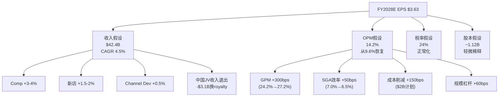
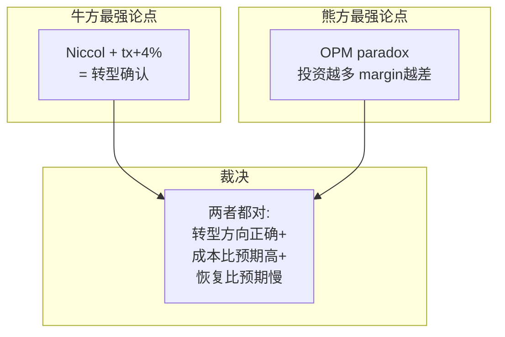

# Ch13 分析师共识解构: 街头的叙事与数字的裂缝

> **核心矛盾映射**: 22-30位分析师覆盖SBUX，共识评级"买入"，均值目标价$98-104——几乎等于当前价格$96.76。但目标价区间$69.69-$131.25(1.9x spread)揭示了**极端的分歧**。本章将用第一性原理解构共识EPS路径，找出"标题数字"(FY2028E $3.63)与"底层假设"之间的裂缝。

---

## 13.1 共识评级全景

### 评级分布

| 评级 | 占比 | 人数 | 隐含信念 |
|------|:---:|:---:|---------|
| Strong Buy | 14% | ~3 | Niccol=CMG 2.0，路径B可行 |
| Buy | 50% | ~11 | 转型可行但需时间 |
| Hold | 32% | ~7 | 估值偏高，等待确认 |
| Sell | 5% | ~1 | 结构性衰退 |
| Strong Sell | 0% | 0 | — |

[DM-P2-E01](H: MarketBeat/StockAnalysis分析师评级，2026年2月)

**64% Buy vs 5% Sell = 极端偏多**。但在餐饮行业中，卖方偏多是常态(投行关系维护)。更有意义的信号是**目标价离散度**:

$$\text{离散度} = \frac{High - Low}{Mean} = \frac{\$131.25 - \$69.69}{\$101} = 61\%$$

61%的离散度远高于S&P 500中位数(~30-35%)——**市场对SBUX的分歧程度接近早期科技股** [DM-P2-E02](C: 分析师离散度分析)。

### 近期评级变动

| 日期 | 机构 | 动作 | 目标价 | 信号 |
|------|------|------|:------:|------|
| 2026.01.23 | William Blair | ↑ Outperform | — | Q1'26交易量转正催化 |
| 2026.01.15 | BWG Global | ↑ Positive | — | Investor Day预期 |
| 2026.01 | Barclays | 维持OW | $95→$110 | BTS计划认可 |
| 2026.01 | Piper Sandler | 维持OW | $105→$100 | ↓ margin concerns |
| 2026.01 | Guggenheim | 维持Buy | $90 | 保守估值 |
| 2025.12 | DBS Bank | ↓ **Strong Sell** | — | 结构性熊派 |

[DM-P2-E03](H: Benzinga/TipRanks评级数据)

**一个关键信号**: Piper Sandler维持"超配"但**下调目标价**($105→$100)——这是"保持面子但降低预期"的经典动作。当看多机构开始降目标而不是降评级时，意味着**乐观情绪正在分层瓦解** [DM-P2-E04](C: Piper Sandler降目标信号分析)。

---

## 13.2 共识EPS路径的第一性原理重建

### 标题数字 vs 底层假设

| 年度 | 共识EPS | 隐含OPM | 隐含收入($B) | 隐含NI($B) | 年化增速 |
|------|:------:|:------:|:----------:|:---------:|:-------:|
| FY2025(实际) | $1.63 GAAP / $2.13 Non-GAAP | 9.6% / 9.9% | 37.2 | 1.86 / 2.43 | — |
| FY2026E | $2.30 | 11.0% | 38.3 | 2.64 | +41%(GAAP) |
| FY2027E | $2.95 | 12.5% | 40.3 | 3.33 | +28% |
| FY2028E | $3.63 | 14.2% | 42.4 | 4.06 | +23% |
| FY2029E | $4.24 | 15.0% | 44.7 | 4.84 | +17% |

[DM-P2-E05](H: FMP Estimates)

### 重建: FY2028E EPS $3.63需要什么?

将$3.63逆向分解为可独立检验的子假设:

[DM-P2-E06](C: EPS $3.63第一性原理分解)

### 子假设检验矩阵

| # | 子假设 | 共识值 | 第一性原理评估 | 偏差方向 |
|---|-------|:-----:|-------------|:-------:|
| S1 | Comp Sales +3-4% CAGR | 合理 | Q1'26已达+4%，但需持续 | ⚠️ 偏乐观 |
| S2 | 新店贡献+1.5-2%/年 | 合理 | 管理层确认2,000+新店 | ✅ 可实现 |
| S3 | 中国JV净影响 | EPS -$0.15/年 | 取决于royalty rate(未披露) | ⚠️ 不确定 |
| S4 | GPM恢复300bps | 偏乐观 | 咖啡价格下行有助，但劳动力永久上升 | ❌ 偏乐观 |
| S5 | $2B成本削减实现 | 半信半疑 | 对冲工会要求($240M anti-union) | ⚠️ 50-60%实现 |
| S6 | 税率回归24% | 合理 | FY2027起高概率实现 | ✅ 可实现 |
| S7 | 无回购稀释 | 合理 | SBC~$300M/年=~0.3%年稀释 | ✅ 可忽略 |

[DM-P2-E07](C: 子假设检验矩阵)

### OPM恢复的第一性原理挑战

共识隐含OPM从9.6%恢复至14.2%——**460bps的margin回归**。逐项来源:

| 来源 | 管理层声称 | 第一性原理评估 | 可信OPM贡献 |
|------|-----------|-------------|:----------:|
| 关店627家 | +120bps | 合理(一次性费用消除) | +100bps |
| $2B成本削减 | +150bps | 60%实现→$1.2B/$42B收入 | +90bps |
| 咖啡价格下行 | +80bps | 巴西增产17%支撑 | +60bps |
| Comp leverage | +110bps | 需要comp +4%+持续 | +70bps |
| 中国JV混合效应 | +50bps | 低margin中国退出 | +40bps |
| **共识合计** | **+510bps** | — | — |
| **第一性原理合计** | — | — | **+360bps** |
| **缺口** | — | — | **-150bps** |

[DM-P2-E08](C: OPM恢复第一性原理重建)

**结论: 共识隐含OPM恢复至14.2%，但第一性原理重建仅支持~13.0%** [DM-P2-E09](C: 第一性原理OPM ~13.0% vs 共识14.2%)。

$$\text{第一性原理EPS} = \frac{\$42.4B \times 13.0\% \times (1-24\%)}{1.12B} = \frac{\$4.19B}{1.12B} \approx \$3.05$$

**vs 共识$3.63——偏差-16%** [DM-P2-E10](C: 第一性原理EPS $3.05)。

与Ch12 Reverse DCF的路径C($89-99)高度一致——**共识可能系统性高估OPM恢复幅度约150bps**。

---

## 13.3 管理层FY2028框架: 保守还是激进?

### Investor Day目标(2026年1月29日)

| 指标 | FY2028目标 | vs共识 | 评估 |
|------|:---------:|:-----:|------|
| EPS | $3.35-$4.00 | 共识$3.63在区间内 | 区间宽($0.65差) |
| Revenue Growth | 5%+ | 共识4.5% | 管理层偏乐观 |
| Comp Sales | 3%+ | 合理 | 底线目标 |
| OPM | 13.5-15.0% | 共识~14.2% | 区间合理 |
| 长期OPM | 17-18% | 远超共识 | 需要结构性转变 |
| 净新开门店 | 2,000+ | 合理 | 偏保守(vs历史1,500+/年) |

[DM-P2-E11](H: Starbucks IR Investor Day 2026-01-29)

**多位分析师认为FY2028目标"可达成且保守"(beatable)**——但这个判断本身可能反映了对Niccol的**锚定偏差**: CMG在Niccol治下consistently beat guidance，分析师正在将这个模式外推到SBUX。

**锚定陷阱**: CMG在Niccol入主时OPM已经是~15%+且上升中——而SBUX是9.6%且下降中。"beat guidance"在上升期和转型期是完全不同的概率事件 [DM-P2-E12](C: CMG锚定偏差分析)。

---

## 13.4 牛熊案例的隐含假设拆解

### 牛方叙事(64%分析师)

| 牛方论点 | 隐含假设 | 脆弱度 |
|---------|---------|:------:|
| "转型动能在加速" | Q1'26 +4%将持续加速至+5-6% | 高(Q2是弱季) |
| "Investor Day目标可超越" | Niccol = CMG再现 | 中(规模不同) |
| "5,000家美国新店机会" | 饱和市场仍有空间 | 中-高 |
| "中国简化故事" | JV去风险+royalty抵消 | 中(royalty未披露) |
| "Niccol信用" | CEO个人能力可跨公司迁移 | 高(制度因素) |

### 熊方叙事(5%分析师)

| 熊方论点 | 隐含假设 | 脆弱度 |
|---------|---------|:------:|
| "Margin悖论" | BTS投资年将延长 | 中(有终止日) |
| "估值脱节" | 42x FY2026E不可持续 | 低(如恢复则自动降) |
| "分红风险" | FCF无法覆盖$2.77B div | 低(数据支持) |
| "劳动力颠覆" | 3,800+罢工将扩大 | 中(历史解决率高) |
| "咖啡成本" | 大宗商品头风 | 高(已在消退) |
| "中国结构性衰退" | 份额14%不可逆 | 低(已JV化隔离) |

[DM-P2-E13](C: 牛熊叙事脆弱度对比)

**非共识洞见**: 牛方和熊方争论的焦点是"速度"而非"方向"——几乎所有分析师(包括DBS的Strong Sell)都认同**Niccol的战略方向正确**。分歧在于:

1. **恢复需要多久?** 牛方: FY2028 | 熊方: FY2030+
2. **成本多高?** 牛方: $2B削减够 | 熊方: 工会+通胀吞掉$2B
3. **终态OPM是多少?** 牛方: 15%+ | 熊方: 11-12%

[DM-P2-E14](C: 核心分歧本质分析)

---

## 13.5 "4分钟悖论": 被忽视的辩论

研究中发现一个多位分析师私下讨论但共识中未充分定价的风险:

**"4分钟目标在规模化后是否可持续? 还是永久性更高的劳动力成本?"**

- SmartQueue已经使80%的堂食订单在4分钟内完成——但这需要**增加staffing**(Green Apron全面推出=更多barista/shift)
- 650家试点门店comp高出200bps——但**margin数据未披露**
- 如果4分钟服务需要永久性+10-15%的劳动力投入(每店+2.5人×20hr/wk×$17/hr = ~$4,500/月/店):
$$\text{全网络成本} = \$4,500 \times 12 \times 16,800 = \sim\$900M/年$$

[DM-P2-E15](C: 4分钟服务成本估算)

$900M/年占FY2025收入的2.4%——**如果这个数字正确，它将吞掉$2B成本削减计划中45%的效果**。这是共识模型中最大的潜在缺口——因为共识将$2B视为"净"节省，但可能是"毛"节省 [DM-P2-E16](C: $2B净 vs 毛效应分析)。

---

## 13.6 GAAP vs Non-GAAP: 哪个是"真"EPS?

FY2025的两个EPS数字讲述了截然不同的故事:

| 指标 | GAAP | Non-GAAP | 差异 | 差异来源 |
|------|:----:|:-------:|:----:|---------|
| FY2025 EPS | $1.63 | $2.13 | $0.50 (31%) | 重组+税务一次性 |
| Q1'26 EPS | $0.26 | $0.56 | $0.30 (115%) | 税务+JV deconsolidation |
| FY2026E EPS | ~$1.85* | $2.30 | $0.45 (24%) | 重组尾巴 |

*FY2026 GAAP EPS假设持续的非经常性项目

[DM-P2-E17](H: Starbucks Earnings Release GAAP vs Non-GAAP)

**GAAP与Non-GAAP的差距在扩大**——这是一个警告信号。"非经常性"项目已经连续3个财年出现(FY2023重组、FY2024 CEO离任补偿、FY2025关店+税务)——**当"非经常性"变成"经常性"时，Non-GAAP就失去了分析意义** [DM-P2-E18](C: Non-GAAP质量评估)。

共识主要锚定Non-GAAP——但如果GAAP EPS持续在$1.60-1.90区间(反映真实的现金成本)，那么42x Non-GAAP P/E实际上是**52-60x GAAP P/E**——与任何餐饮公司的历史交易区间都不匹配。

---

## 13.7 本章发现总结

| # | 发现 | 估值含义 |
|---|------|---------|
| F13-1 | 共识FY2028E OPM 14.2%超出第一性原理支持的13.0%约120bps | 共识EPS可能高估16%($3.63 vs $3.05) |
| F13-2 | 分析师对Niccol存在CMG锚定偏差 | "beatable"判断可能过度外推 |
| F13-3 | 4分钟悖论可能吞掉$2B成本削减计划的45% | $2B"净"节省可能仅$1.1B |
| F13-4 | GAAP与Non-GAAP裂缝扩大至31% | Non-GAAP锚可能误导估值 |
| F13-5 | 目标价离散度61%=极端分歧 | 定价信息含量低 |

[DM-P2-E19](C: Ch13发现汇总)

---

> **交叉引用**: Ch9 OPM分解 → 本章OPM恢复路径检验 | Ch11 comp纯度 → 支撑S1子假设 | Ch12 路径C → 与第一性原理EPS $3.05高度一致
> **前向引用**: Phase 4红队将测试"4分钟悖论"假说 | Phase 3正向估值将使用13.0% OPM而非14.2%
