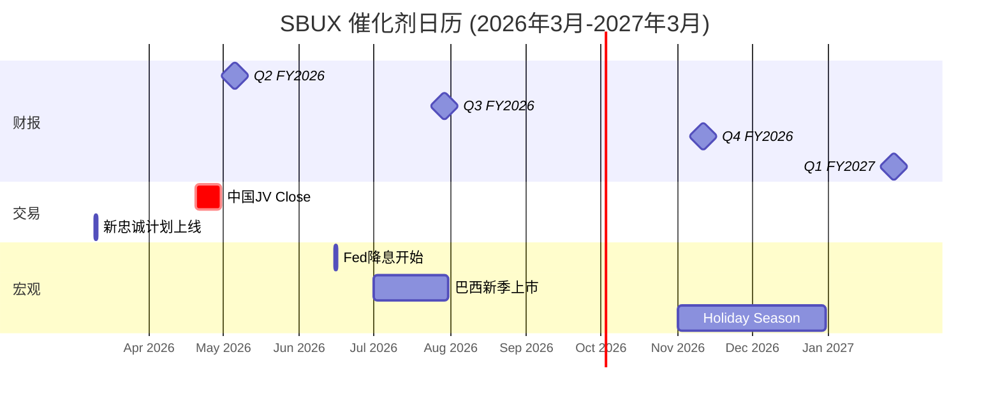

# Ch14 宏观环境与催化剂日历: 什么能改变叙事?

> **核心矛盾映射**: SBUX的投资论题高度依赖宏观变量——消费信心决定客流、咖啡期货决定COGS、利率决定估值倍数、劳动力市场决定成本刚性。本章将这些外部变量从"背景噪音"提升为"可量化的情景驱动因素"，并构建催化剂日历，回答: 未来12个月内，什么事件能打破当前的均衡?

---

## 14.1 消费者信心: 分裂的美国

### 双速消费环境

| 指标 | 值(2026.02) | 趋势 | SBUX影响 |
|------|:----------:|:----:|---------|
| Conference Board CCI | 91.2 | ⬆ +2.2 | 整体改善 |
| 预期指数 | 72 | ⬇ 13个月<80 | 🚨 衰退信号 |
| 现状指数 | 120 | ⬇ -1.8 | 消费降级风险 |
| 密歇根消费者信心 | 56.6 | ⬆ +0.2 | 低位企稳 |

[DM-P2-F01](H: Conference Board CCI 2026年2月, 密歇根指数)

**关键洞见: 消费者信心出现"K型分裂"**:

| 群体 | 信心趋势 | SBUX核心客群? | 含义 |
|------|:-------:|:----------:|------|
| 高收入/高教育 | ⬆ 改善 | ✅ 核心 | 支撑premium定价 |
| 低收入/低教育 | ⬇ 恶化 | ❌ 非核心(但是增长来源) | 阻碍value客群获取 |
| 持股者 | ⬆ 改善 | ✅ 重叠 | 财富效应正面 |
| 非持股者 | ⬇ 恶化 | ⚠️ 部分重叠 | 消费降级风险 |

[DM-P2-F02](H: FOMC 2026年1月会议纪要 "disparity between higher and lower-income")

**对SBUX的双面影响**: Niccol的"Back to Starbucks"策略试图**同时**服务两个群体——premium体验(吸引高收入)和$5 value meals(争取低收入)。但K型分裂意味着**这两个目标可能相互矛盾**: 追求value客群的价格让利会稀释premium定位，而坚持premium则放弃最大的增量客群 [DM-P2-F03](C: K型分裂对SBUX双重策略的影响)。

---

## 14.2 咖啡大宗商品: 从历史高点回落

### Arabica期货走势

| 时间 | 价格($/lb) | 背景 |
|------|:---------:|------|
| 2024年1月 | $1.80-2.00 | 基准线 |
| 2024年12月 | $3.50+ | 供应恐慌+60% YoY |
| 2025年1月 | **$4.00+** | **47年新高** |
| 2025年12月 | $3.50 | 高位盘整 |
| 2026年2-3月 | **$3.00-3.20** | **15个月低点，-25%峰值** |

[DM-P2-F04](H: Trading Economics Arabica Futures)

**供应侧转向利好**:
- 巴西2026年产量预测: **6,620万袋(+17.2% YoY)**，其中Arabica 4,410万袋——创历史纪录(CONAB 2月数据)
- 全球2026/27产季: **1.80亿袋**(+800万袋 YoY)——供应过剩概率上升
- 价格下行压力在积累 [DM-P2-F05](H: CONAB巴西咖啡产量预测)

### SBUX的套保缺口

**一个令人不安的发现**: SBUX将咖啡套保从$1B(2019年)削减至**不到$200M**(FY2025年末)——这意味着SBUX几乎完全暴露在现货市场波动中 [DM-P2-F06](H: CTOL Starbucks hedging report)。

| 套保策略 | FY2019 | FY2025 | 变化 |
|---------|:------:|:------:|:----:|
| 固定价格合约 | ~$1.0B | <$200M | -80%+ |
| 暴露度 | 低 | 高 | ⬆⬆⬆ |

**影响时序**:
- **FY2026 H1**: 最大成本压力(以$3.50+购买的库存正在消耗)
- **FY2026 H2**: 成本压力缓解(新季巴西豆供应+价格回落至$3.00)
- **FY2027**: 如果$3.00价格维持→GPM改善100-150bps

管理层在Q1'26 earnings call中确认:"咖啡通胀的头风将在H2 FY2026缓解"——这与巴西增产数据一致 [DM-P2-F07](C: 咖啡成本时序影响)。

**但套保缺口意味着**: 如果2026年出现巴西霜冻(类似2021年7月)或其他供应中断，SBUX的COGS将直接承受全部冲击——**没有对冲缓冲** [DM-P2-F08](C: 套保缺口风险评估)。

---

## 14.3 利率环境: 从压力到助力?

### Fed Funds路径预期

| 时间 | 利率预期 | SBUX影响 |
|------|:-------:|---------|
| 2026年1月(现状) | 4.25-4.50% | 高利率压制消费+估值 |
| 2026年6月 | 4.00%(首次降息) | 边际改善 |
| 2026年12月 | **2.75-3.00%** | 显著利好(降息150bps) |
| 2027年 | 2.50-2.75%(中性) | 最大利好区间 |

[DM-P2-F09](H: CME FedWatch + 市场预期)

**利率对SBUX的三重传导**:

1. **债务成本**: $33.5B总债务中FY2026-2028到期约$10B，再融资利率从4.5-5.5%可能降至3.5-4.0%——节省$50-100M/年利息 [DM-P2-F10](C: 利率下行对利息成本影响)

2. **估值倍数**: 低利率→Risk-Free Rate下降→WACC下降→DCF估值上升。如果10年美债从4.3%降至3.5%:
$$\Delta WACC \approx -0.8\% \times 27\% \text{(equity weight)} \approx -0.2pp$$
$$\text{影响}: EV \uparrow 3-5\%$$

3. **消费者支出**: 低利率→房贷/信用卡成本下降→可支配收入增加→咖啡支出更宽松

**净效果**: 利率下行对SBUX是**纯正面因素**——但已经部分被市场定价(股价从$75.50的52周低点已反弹28%)。

---

## 14.4 劳动力市场: 最顽固的逆风

### 工会形势

| 指标 | 当前状况 | 趋势 |
|------|---------|:----:|
| 工会化门店 | 500+ | ⬆ 增加中 |
| 2025年12月罢工 | 3,800+人/180+门店/130+城市 | 🚨 史上最大 |
| 工会薪资要求 | +65%(3年+77%) | 极端 |
| SBUX反工会支出 | $240M (since 2021) | 高 |
| 集体协议 | **无** | 僵局 |

[DM-P2-F11](H: NRN/Al Jazeera工会报道)

**劳动力的结构性约束**:
- Barista中位时薪$14.73，平均每周仅19小时(恰好低于联邦福利门槛20hr)
- 工会要求+65%加薪——如果按$14.73基准=$24.10/hr(超过很多市场的最低管理层薪资)
- 即使最终妥协在+20-25%(行业中位数)，也意味着每年+$600-800M劳动力成本
- **$2B成本削减计划中多少能净过劳动力通胀?** 如果工会妥协在+25%/3年，约$700M/年被吞掉→净节省仅$1.3B(65%) [DM-P2-F12](C: 工会妥协情景对$2B计划影响)

---

## 14.5 催化剂日历: 未来12个月的关键节点

[DM-P2-F13](C: 催化剂日历)

### 催化剂影响矩阵

| 事件 | 日期 | 概率 | 正面影响 | 负面影响 | 股价敏感度 |
|------|------|:----:|---------|---------|:---------:|
| **新忠诚计划上线** | 2026.03.10 | 95% | 会员增长+frequency | 促销成本上升 | ±3-5% |
| **中国JV交割** | 2026.04-05 | 85% | 去风险+一次性利得 | 收入断崖 | ±5-8% |
| **Q2 FY2026** | 2026.05.05 | 100% | 如comp +3%=趋势确认 | 如comp <2%=假信号 | ±8-12% |
| **Fed降息** | 2026.06 | 75% | 估值支撑+消费改善 | 如不降=risk-off | ±3-5% |
| **Q3 FY2026** | 2026.07.29 | 100% | 季节性旺季comp | OPM是否开始恢复 | ±8-12% |
| **工会协议** | 不确定 | 30%(年内) | 消除不确定性 | 高成本锁定 | ±5-10% |
| **Holiday Season** | 2026.11-12 | 100% | Q1 FY2027 comp预期 | 消费降级风险 | ±5-8% |

[DM-P2-F14](C: 催化剂影响矩阵)

### 最关键催化剂: Q2 FY2026 (2026年5月5日)

Q2是SBUX最弱季度(post-holiday)。Q2的comp数据将:
- **如果 ≥+3%**: 确认Q1不是假信号→可能触发升级周期→股价$105+
- **如果 +1-2%**: 温和减速，符合季节性→维持现价$90-100
- **如果 ≤0%**: 转型叙事破裂→可能触发降级周期→股价$80-85

[DM-P2-F15](C: Q2 FY2026三情景分析)

---

## 14.6 Polymarket与事件概率

SBUX直接相关的Polymarket市场有限，但间接相关的宏观事件概率:

| 事件 | 市场概率 | SBUX影响 |
|------|:-------:|---------|
| 美国衰退(2026年内) | ~25-30% | 🚨 comp -5%+, 股价-20-30% |
| Fed降息≥100bps(2026年) | ~65% | 估值+5-8% |
| 中美贸易升级 | ~20% | 中国JV交割风险 |
| 咖啡供应中断(霜冻) | ~10% | COGS冲击(无套保) |

[DM-P2-F16](S: 基于Polymarket宏观市场和历史概率推算)

---

## 14.7 宏观情景矩阵: 三个世界的SBUX

| 情景 | 概率 | 宏观环境 | SBUX FY2027E EPS | 股价区间 |
|------|:---:|---------|:----------------:|:-------:|
| **黄金路径** | 25% | 软着陆+Fed降息+咖啡↓ | $3.20-3.50 | $100-120 |
| **泥泞前行** | 50% | 温和增长+混合信号 | $2.70-3.00 | $80-100 |
| **衰退冲击** | 20% | 衰退+消费崩溃 | $2.00-2.50 | $55-75 |
| **滞胀陷阱** | 5% | 高通胀+低增长+高利率 | $1.80-2.20 | $45-65 |

[DM-P2-F17](C: 宏观情景矩阵)

**概率加权FY2027E EPS**:
$$EPS_{pw} = 25\% \times 3.35 + 50\% \times 2.85 + 20\% \times 2.25 + 5\% \times 2.00 = \$2.81$$

**vs 共识$2.95——偏差-4.7%** [DM-P2-F18](C: 宏观调整后共识EPS)。

---

## 14.8 本章发现总结

| # | 发现 | 估值含义 |
|---|------|---------|
| F14-1 | K型分裂使SBUX双重策略面临矛盾 | premium vs value不可兼得 |
| F14-2 | 咖啡价格从$4+降至$3=FY2027 GPM利好100-150bps | 正面催化剂(已在进行) |
| F14-3 | 套保缺口($1B→$200M)=供应中断无缓冲 | 尾部风险↑ |
| F14-4 | Q2 FY2026(5月5日)是最关键催化剂 | comp ≥3%=升级周期 |
| F14-5 | 利率下行对SBUX纯正面(债务+估值+消费) | 已部分定价 |

[DM-P2-F19](C: Ch14发现汇总)

---

> **交叉引用**: Ch5竞争(瑞幸定价锚) → 本章K型分裂下的定价困境 | Ch8供应链 → 套保策略的历史演变 | Ch7 CEO沉默 → Niccol未讨论工会妥协底线
> **前向引用**: Phase 3估值将使用本章宏观情景权重 | Phase 4红队将测试"巴西霜冻"尾部场景
