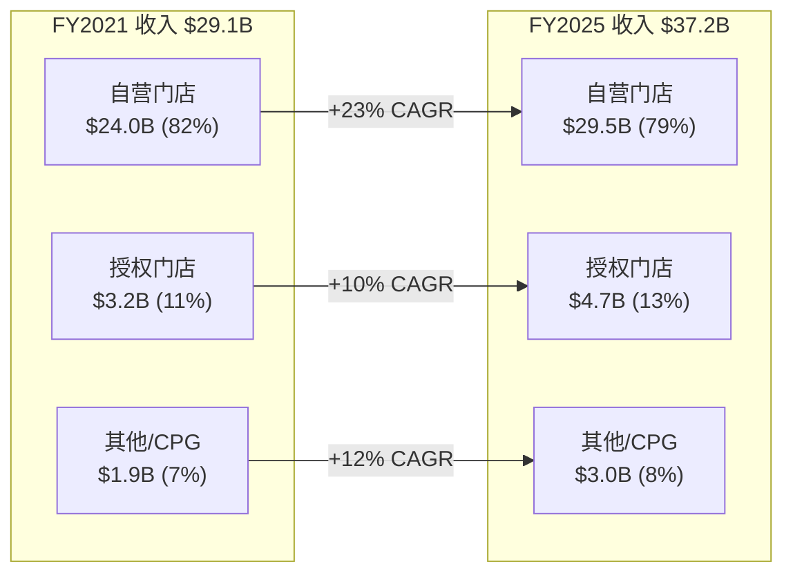
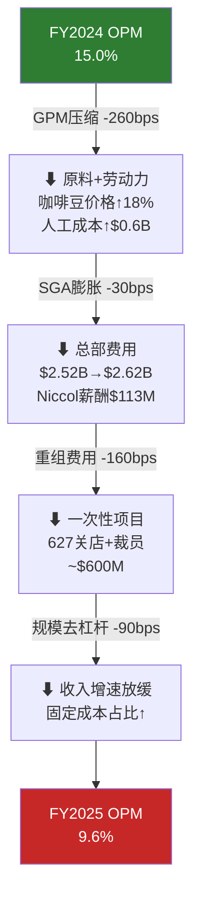
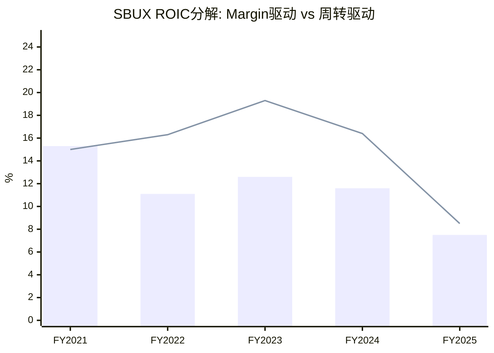
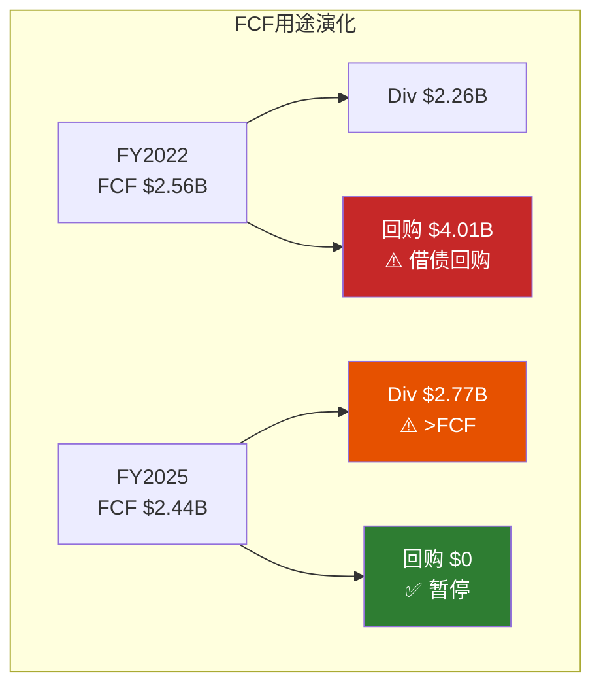
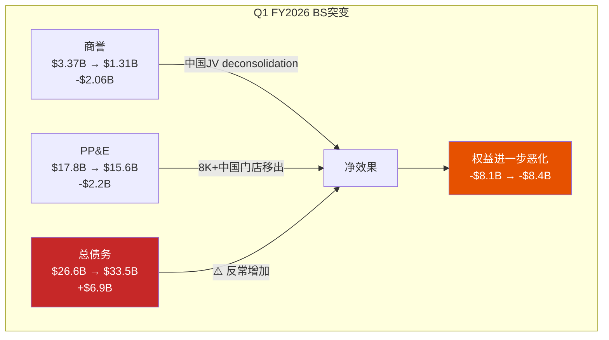
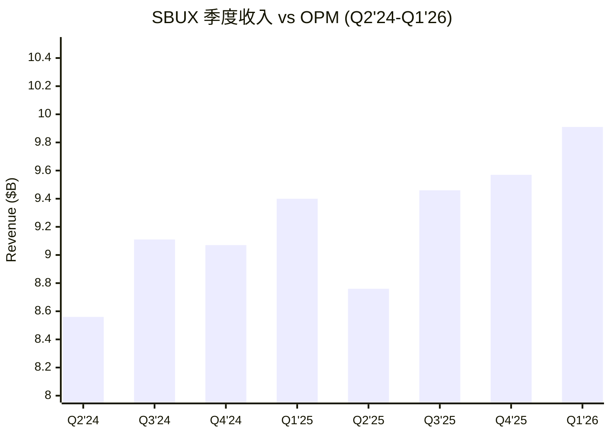
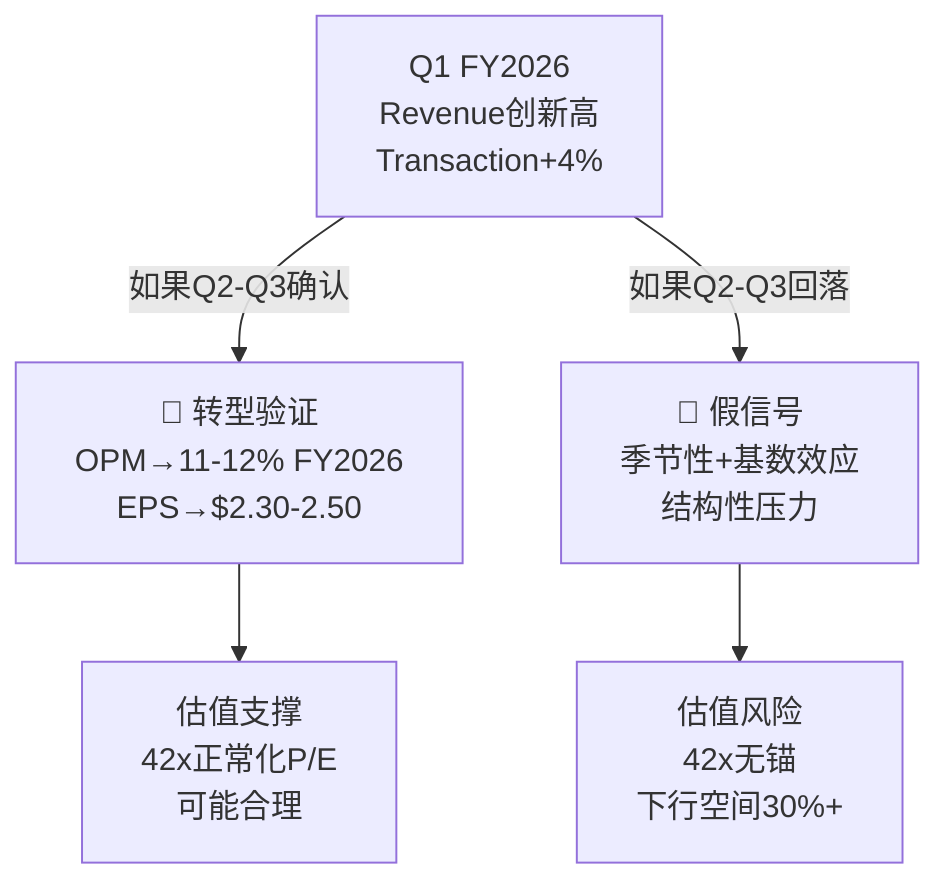

# Ch9 财务趋势深挖: 一家利润腰斩的公司凭什么值$110B?

> **核心矛盾映射**: SBUX FY2025 EPS从$3.31暴跌至$1.63(-51%)，OPM从15.0%腰斩至9.6%——但市值仅从$110.9B微降至$97.6B(-12%)。市场价格与基本面之间出现了**39个百分点的感知差**(EPS跌幅 vs 市值跌幅)。本章将通过5年三表纵深分析+DuPont分解+现金流质量审计，回答: 这个感知差到底是"市场看到了我们没看到的东西"，还是"市场在做一个极端的信仰跳跃"?

---

## 9.1 收入五年轨迹: 增长引擎从"门店扩张"切换为"定价+混合"

### 收入增长矩阵

| 年度 | 收入($B) | YoY增长 | 门店净增(全球) | 同价增长(估算) | 新店贡献(估算) |
|------|:--------:|:------:|:-------------:|:------------:|:------------:|
| FY2021 | 29.06 | +24.0%* | +1,173 | ~15% | ~9% |
| FY2022 | 32.25 | +11.0% | +1,878 | ~5% | ~6% |
| FY2023 | 35.98 | +11.6% | +1,650 | ~7% | ~5% |
| FY2024 | 36.18 | +0.6% | +1,534 | ~-3% | ~4% |
| FY2025 | 37.18 | +2.8% | ~+800 | ~0% | ~3% |

*FY2021 YoY高增长反映COVID基数效应 [DM-P2-A01](H: FMP Income Statement)

**关键发现**: FY2024-FY2025的收入增长几乎完全来自新门店——同店销售增长接近零甚至为负。这意味着SBUX的**有机增长引擎已经熄火**。一家不能实现有机增长的公司，新门店带来的增量收入只是在用CapEx"购买"收入，而非创造价值。

对比参照 [DM-P2-A02](C: 基于竞争对手数据推算):
- MCD FY2024: 收入增长+3.7%，**几乎全部来自同店增长**(零净开店)
- BROS FY2024: 收入增长+27.9%，同店+交易量驱动
- LKNCY CY2024: 收入增长+40.4%，门店扩张+价格战份额抢夺

SBUX是唯一一家**同店增长失速但总收入靠开店勉强为正**的大型咖啡连锁。

### 收入构成演化

[DM-P2-A03](S: 基于10-K年报收入分拆推算)

**结构性信号**: 授权门店收入的增速(+10% CAGR)高于自营门店(+5.3% CAGR)——这预示着**SBUX的收入结构正在向轻资产方向缓慢漂移**。中国JV在Q1 FY2026完成deconsolidation后，FY2026自营收入占比将进一步下降至~73-75%，授权收入占比将升至~16-18%。

---

## 9.2 利润率解剖: OPM腰斩的五层驱动因素

FY2025 OPM从15.0%暴跌至9.6%是SBUX估值争议的核心。市场相信这是暂时的(转型阵痛)，熊方认为这是结构性的(品牌力下降+成本刚性)。要裁决这场争论，需要逐层解剖OPM收缩的驱动因素:

### 利润率瀑布图

[DM-P2-A04](C: OPM分解模型)

### 逐层量化

| 驱动因素 | OPM影响(bps) | 可恢复性 | 时间框架 |
|---------|:-----------:|:-------:|:-------:|
| **1. 原料成本上升** | -100bps | 部分 | 1-2年(咖啡周期) |
| **2. 劳动力成本上升** | -130bps | 低 | 永久(最低工资+工会) |
| **3. SGA膨胀** | -30bps | 中 | FY2026-27(成本削减) |
| **4. 重组/关店费用** | -160bps | 高 | FY2026(一次性) |
| **5. 规模去杠杆** | -90bps | 中 | 取决于comp恢复 |
| **6. 中国业务恶化** | -30bps | 中(已JV化) | FY2026起剥离 |
| **合计** | **-540bps** | — | — |

[DM-P2-A05](C: 分项OPM影响估算)

**关键判断**: 540bps的OPM收缩中:
- **约160-200bps是真正一次性的**(重组费用+关店减值)——FY2026后不再出现
- **约130-160bps是"半永久性"的**(劳动力成本上升+规模去杠杆)——需要comp sales恢复5%+才能被吸收
- **约100-130bps可能在1-2年内部分恢复**(原料成本周期+SGA优化)

这意味着即使在最乐观的情境下，SBUX的"新正常"OPM也可能是**12-13.5%而非15%+**。市场共识(FY2028E EPS $3.63)隐含OPM恢复至~14.5%——这是一个**偏乐观但不荒谬**的假设 [DM-P2-A06](C: 正常化OPM估算区间12-14.5%)。

### GPM趋势: 最被低估的恶化信号

| 年度 | GPM | Delta vs前年 | 驱动因素 |
|------|:---:|:----------:|---------|
| FY2021 | 28.9% | — | COVID恢复，流量回升 |
| FY2022 | 26.0% | -290bps | 劳动力通胀+供应链危机 |
| FY2023 | 27.4% | +140bps | 价格提升+效率改善 |
| FY2024 | 26.8% | -60bps | 劳动力持续上行 |
| FY2025 | 24.2% | -260bps | 全面恶化 |

[DM-P2-A07](H: FMP Ratios GPM)

GPM的5年趋势(28.9%→24.2%)比OPM的周期性波动更令人担忧——**它暗示SBUX的定价权正在被劳动力成本和竞争(特别是来自LKNCY的价格锚定效应)系统性地侵蚀**。即使SBUX不在中国直接与瑞幸竞争(已JV化)，瑞幸¥9.9的定价已经在全球消费者心智中种下了"$5+咖啡是否合理"的疑问(详见Ch5竞争分析)。

---

## 9.3 DuPont五因子分解: 负权益下的修正框架

### 为什么传统DuPont对SBUX无效

传统DuPont分解: **ROE = 税负 × 利息负担 × EBIT Margin × 资产周转 × 财务杠杆**

但SBUX的股东权益为负(FY2025: -$8.1B)，这使得:
- ROE计算出荒谬的负值(-22.9%)——一家盈利公司的"负"回报率
- 财务杠杆项变为负数(-3.95x)——数学上可解但经济含义失真
- 整个DuPont框架的乘法结构崩溃

[DM-P2-A08](C: DuPont方法论适用性分析)

**解决方案: 改用ROIC分解框架**

$$\text{ROIC} = \text{NOPAT Margin} \times \text{Capital Turnover}$$

其中:
- NOPAT Margin = EBIT × (1 - 正常化税率24%) / Revenue
- Capital Turnover = Revenue / Invested Capital
- Invested Capital来自FMP key-metrics数据

### ROIC分解矩阵

| 年度 | EBIT Margin | 正常化NOPAT Margin | Capital Turnover | **ROIC** | Delta |
|------|:----------:|:-----------------:|:----------------:|:--------:|:-----:|
| FY2021 | 20.1% | 15.3% | 1.44x | **15.0%** | — |
| FY2022 | 14.6% | 11.1% | 2.03x | **16.3%** | +130bps |
| FY2023 | 16.5% | 12.6% | 2.10x | **19.3%** | +300bps |
| FY2024 | 15.3% | 11.6% | 1.89x | **16.4%** | -290bps |
| FY2025 | 9.9% | 7.5% | 2.01x | **8.5%** | -790bps |

[DM-P2-A09](H: FMP Key-Metrics ROIC + C: NOPAT正常化计算)

**核心发现**:

1. **ROIC崩溃几乎完全是Margin驱动**: NOPAT Margin从15.3%→7.5%(-780bps)，而Capital Turnover从1.44x→2.01x实际上在**改善**。这意味着SBUX在资本效率上并没有恶化——问题纯粹在利润端。

2. **FY2022-FY2023的高ROIC是幻觉**: Capital Turnover从1.44x飙升至2.03-2.10x，主要因为$4B+回购缩小了投资资本基数——但回购消耗的现金没有被计入投资资本(因为它减少了权益而非增加资产)。这是一个**回购驱动的ROIC虚高** [DM-P2-A10](C: 回购对Capital Turnover的影响分析)。

3. **FY2025 ROIC 8.5% < WACC估算9-10%**: 这意味着SBUX正处于**价值摧毁区间**——每一美元的投入资本正在产生低于其成本的回报。Niccol的任务不仅是恢复增长，更是将ROIC推回10%+的价值创造区间(详见Ch10 NEP框架)。

### 补充: 传统DuPont记录(供参考)

| 年度 | 税负(NI/EBT) | 利息负担(EBT/EBIT) | EBIT Margin | 资产周转 | 杠杆(A/E) | ROE* |
|------|:----------:|:-----------------:|:-----------:|:-------:|:--------:|:----:|
| FY2021 | 78.4% | 91.9% | 20.1% | 0.93x | -5.90x | -78.9% |
| FY2022 | 77.5% | 91.6% | 14.6% | 1.15x | -3.21x | -37.7% |
| FY2023 | 76.4% | 92.0% | 16.5% | 1.22x | -3.68x | -51.6% |
| FY2024 | 75.7% | 89.8% | 15.3% | 1.15x | -4.21x | -50.5% |
| FY2025 | 58.9% | 85.3% | 9.9% | 1.16x | -3.95x | -22.9% |

*ROE为负值因负权益，经济含义失真 [DM-P2-A11](H: FMP Ratios DuPont Components)

**一个反直觉的发现**: FY2025的ROE(-22.9%)"改善"了——但这纯粹是因为NI暴跌67%使负权益下的负ROE绝对值变小。这是负权益会计扭曲的经典案例，进一步证明了使用ROIC而非ROE的必要性。

---

## 9.4 现金流质量审计: NI与OCF的$2.9B裂口

### 现金转化矩阵

| 年度 | NI($B) | OCF($B) | OCF/NI | FCF($B) | FCF/NI | 信号 |
|------|:------:|:------:|:------:|:------:|:------:|------|
| FY2021 | 4.20 | 5.99 | 1.43x | 4.52 | 1.08x | 正常 |
| FY2022 | 3.28 | 4.40 | 1.34x | 2.56 | 0.78x | CapEx升 |
| FY2023 | 4.12 | 6.01 | 1.46x | 3.68 | 0.89x | 正常 |
| FY2024 | 3.76 | 6.10 | 1.62x | 3.32 | 0.88x | 正常偏高 |
| FY2025 | 1.86 | 4.75 | **2.56x** | 2.44 | **1.31x** | **异常** |

[DM-P2-A12](H: FMP Cash Flow Statement)

**FY2025 OCF/NI = 2.56x是一个重要信号**。OCF ($4.75B)远高于NI ($1.86B)的原因:

1. **D&A暴增**: 现金流表D&A $2.61B vs FY2024 $1.59B (+$1.01B)。这包含经营租赁使用权资产摊销(ASC 842)，是SBUX作为重资产零售商的固有特征。但同比+64%的增幅中包含了中国JV deconsolidation和关店减值的一次性因素 [DM-P2-A13](H: FMP CF D&A $2,606.2M)。

2. **非现金项目**: FY2025 "Other Non-Cash Items" $1.55B vs FY2024 $1.50B——基本持平，主要是SBC($318M)和租赁相关 [DM-P2-A14](H: FMP CF otherNonCashItems)。

3. **运营资本恶化**: FY2025 Working Capital变动-$1.49B(vs FY2024 -$1.05B)——存货增加$408M(咖啡豆囤积?)和"其他"项-$1.26B(预付费用+应计负债) [DM-P2-A15](H: FMP CF changeInWorkingCapital)。

**核心解读**: 尽管NI暴跌51%，OCF仅下降22%(从$6.1B→$4.75B)——这说明**SBUX的现金产生能力远比利润表显示的要强**。$2.9B的NI-OCF裂口主要是非现金减值和税务一次性项目造成的。这是一个**隐藏的积极信号**，也是市场愿意给予高P/E的潜在理由之一。

### FCF自由度分析

| 年度 | FCF($B) | 分红($B) | 回购($B) | FCF余量 | FCF覆盖率 |
|------|:------:|:------:|:------:|:------:|:---------:|
| FY2021 | 4.52 | 2.12 | 0 | +2.40 | 213% |
| FY2022 | 2.56 | 2.26 | 4.01 | -3.71 | **41%** |
| FY2023 | 3.68 | 2.43 | 0.98 | +0.27 | 108% |
| FY2024 | 3.32 | 2.59 | 1.27 | -0.54 | **86%** |
| FY2025 | 2.44 | 2.77 | 0 | **-0.33** | **88%** |

[DM-P2-A16](H: FMP Cash Flow, C: FCF覆盖率 = FCF/(Div+Buyback))

**关键发现**:

1. **FY2022是资本配置的至暗时刻**: FCF仅$2.56B却回购$4.01B——缺口$1.45B完全靠发债填补。这是用债务杠杆人为提升EPS的经典案例。

2. **Niccol暂停回购是正确决策**: FY2025回购$0，释放了$1.3B+/年的现金流压力。但分红$2.77B仍然超过FCF $2.44B——**差额$0.33B只能靠借债或消耗现金支付** [DM-P2-A17](C: 分红缺口 = $2.77B - $2.44B = $0.33B)。

3. **分红可持续性红灯**: FY2025 Payout Ratio (Div/NI) = 149%，Dividend Yield 2.57%。如果FY2026E EPS $2.30实现，Payout Ratio降至107%(仍>100%)。**直到EPS恢复至$2.50+，分红才不再需要借债支持** [DM-P2-A18](C: 分红可持续性门槛 = ~$2.50 EPS)。

---

## 9.5 资产负债表: 负权益帝国的结构性画像

### BS五年演化矩阵

| 指标 | FY2021 | FY2022 | FY2023 | FY2024 | FY2025 | Q1'26 |
|------|:------:|:------:|:------:|:------:|:------:|:-----:|
| 总资产($B) | 31.4 | 28.0 | 29.4 | 31.3 | 32.0 | 32.2 |
| 总负债($B) | 36.7 | 36.7 | 37.4 | 38.8 | 40.1 | 40.6 |
| **权益($B)** | **(5.3)** | **(8.7)** | **(8.0)** | **(7.4)** | **(8.1)** | **(8.4)** |
| 总债务($B) | 23.6 | 23.8 | 24.6 | 25.8 | 26.6 | 33.5 |
| 净债务($B) | 17.1 | 21.0 | 21.0 | 22.5 | 23.4 | 30.1 |
| 商誉($B) | 3.68 | 3.28 | 3.22 | 3.32 | 3.37 | 1.31 |
| PP&E($B) | 14.6 | 14.6 | 15.8 | 18.0 | 17.8 | 15.6 |

[DM-P2-A19](H: FMP Balance Sheet)

### Q1 FY2026: 三重突变

Q1 FY2026的资产负债表出现了三个同步异常，全部与中国JV deconsolidation相关:

**突变1: 商誉暴降** — $3.37B→$1.31B(-$2.06B)，反映中国业务商誉的derecognition [DM-P2-A20](H: FMP BS Goodwill Q1'26)。

**突变2: PP&E缩水** — $17.8B→$15.6B(-$2.2B)，反映8,000+中国门店固定资产从合并报表中移出 [DM-P2-A21](H: FMP BS PP&E Q1'26)。

**突变3: 债务飙升** — $26.6B→$33.5B(+$6.9B)。这是最令人不安的变化——中国业务剥离的同时，总债务反而大幅增加。可能原因:
- 中国JV交易中SBUX向JV提供了卖方融资
- 为支付中国业务分离的交易费用而新增借款
- 经营租赁负债口径变化(ASC 842重新分类)

[DM-P2-A22](C: Q1'26债务增加分析，需10-Q验证)

**净债务/EBITDA演化**: 从FY2021的2.33x恶化至FY2025的4.35x，Q1'26(年化EBITDA约$5.4-5.8B估算)可能进一步恶化至5.2-5.6x——**逼近投资级评级的下限**(BBB/Baa2通常要求<5.0x) [DM-P2-A23](C: 净债务/EBITDA趋势推算)。

这为后续Ch10的负权益悖论分析提供了关键数据基础。

---

## 9.6 FY2025税务异常: $700M的隐藏故事

FY2025有效税率41.1% vs 正常~24%是EPS暴跌的第二大贡献因素(仅次于OPM压缩)。逐季拆解:

| 季度 | 税前利润($M) | 税费($M) | 有效税率 | 信号 |
|------|:----------:|:-------:|:-------:|------|
| Q1 FY2025 | 1,022 | 241 | 23.6% | ✅ 正常 |
| Q2 FY2025 | 502 | 118 | 23.5% | ✅ 正常 |
| Q3 FY2025 | 819 | 260 | 31.8% | ⚠️ 偏高 |
| Q4 FY2025 | 834 | 701 | **84.0%** | 🚨 极端异常 |
| **FY2025全年** | **3,152** | **1,295** | **41.1%** | — |
| Q1 FY2026 | 765 | 472 | **61.7%** | 🚨 仍然异常 |

[DM-P2-A24](H: FMP Quarterly Income Tax Data)

### 税务异常的可能来源

1. **中国JV重组税务影响**: Deconsolidation触发的递延税负实现——中国业务长期保留的利润在JV转让时可能被视为"视同分配"(deemed distribution)，触发美国GILTI税 [DM-P2-A25](S: 中国JV税务影响推测，需10-K注脚验证)。

2. **关店减值的不可抵扣部分**: 627家关店的减值损失中，商誉和某些无形资产减值可能不可税前抵扣——产生永久性差异。

3. **跨境利润汇回**: 中国JV交易可能涉及历史利润汇回，触发预提税。

### 正常化EPS计算

如果将FY2025全年税率正常化为24%:

$$\text{正常化NI} = \$3,152M \times (1 - 0.24) = \$2,396M$$
$$\text{正常化EPS} = \$2,396M / 1,138M = \$2.10$$

vs 报告EPS $1.63——**差额$0.47/股(29%)完全来自税率异常** [DM-P2-A26](C: 正常化EPS计算)。

类似地，如果Q1 FY2026税率正常化:
$$\text{正常化NI} = \$765M \times 0.76 = \$581M \quad (vs \$293M报告)$$
$$\text{正常化EPS} = \$0.51 \quad (vs \$0.26报告)$$

[DM-P2-A27](C: Q1 FY2026正常化EPS)

**这个发现的估值含义巨大**: 如果我们用正常化EPS $2.10而非报告EPS $1.63来计算P/E:
- 报告P/E: $96.76 / $1.63 = **59.4x** (FMP报告52.6x可能用了不同的EPS)
- 正常化P/E: $96.76 / $2.10 = **46.1x**
- 差异: 13.3x P/E turn完全是税务噪音

但46.1x仍然不便宜——对比MCD 28x, QSR 18x——**市场在正常化税率后仍然给了SBUX约65%的溢价于同行** [DM-P2-A28](C: 正常化P/E对比)。

---

## 9.7 季度拐点分析: Q1 FY2026——第一道曙光还是假信号?

### 8季度趋势矩阵

| 季度 | 收入($B) | QoQ | OPM | EPS | 税后NI($M) | 正常化NI($M)* |
|------|:-------:|:---:|:---:|:---:|:---------:|:------------:|
| Q2'24 | 8.56 | — | 12.8% | $0.68 | 772 | 754 |
| Q3'24 | 9.11 | +6.4% | 16.6% | $0.93 | 1,055 | 1,068 |
| Q4'24 | 9.07 | -0.4% | 14.4% | $0.80 | 909 | 908 |
| Q1'25 | 9.40 | +3.6% | 11.9% | $0.69 | 781 | 777 |
| Q2'25 | 8.76 | -6.8% | 6.9% | $0.34 | 384 | 382 |
| Q3'25 | 9.46 | +8.0% | 9.9% | $0.49 | 558 | 623 |
| Q4'25 | 9.57 | +1.2% | 9.9% | $0.12 | 133 | 634 |
| **Q1'26** | **9.91** | **+3.6%** | **9.2%** | **$0.26** | **293** | **581** |

*正常化NI使用24%统一税率计算 [DM-P2-A29](C: 正常化季度NI矩阵)

### Q1 FY2026的三个信号

**积极信号**:
1. **收入创纪录**: $9.91B是SBUX单季度历史最高收入(vs Q1 FY2025 $9.40B, +5.4%)
2. **交易量转正**: 管理层报告全球同店交易量+4%(首次转正)——这是Niccol "Back to Starbucks"战略最重要的早期验证
3. **美国客流回升**: 美国comp sales正向——如果能维持3Q以上，将确认转型有效

**消极信号**:
1. **OPM未恢复**: 9.2% vs Q4'25 9.9%——收入增长未转化为margin扩张
2. **税率仍异常**: 61.7%——中国JV税务影响仍在消化中
3. **GPM持续承压**: Q1'26 Gross Profit $1.55B / Revenue $9.91B = **15.6%**(如果数据正确，这是灾难性的——但可能包含了中国JV的拆分会计影响)

[DM-P2-A30](H: FMP Q1 FY2026 Income Statement)

**等等——GPM 15.6%?** 让我交叉验证: Q1'26 COGS $8.36B, Revenue $9.91B, GP $1.55B。但FY2025全年GPM 24.2%。单季度突降至15.6%——这很可能反映了FMP数据分类变化(中国JV deconsolidation后，部分成本可能从COGS重新分类到"Other Expenses")，**而非真实的GPM恶化** [DM-P2-A31](L: Q1'26 GPM异常，可能是会计口径变化而非经营恶化，需10-Q验证)。

### 拐点判断框架

[DM-P2-A32](C: Q1'26拐点判断框架)

---

## 9.8 WACC估算: 价值创造的门槛线

| 组分 | 值 | 来源/方法 |
|------|:--:|----------|
| Risk-Free Rate | 4.3% | 10年美债(2026年3月) |
| Beta | 0.937 | FMP Profile |
| Equity Risk Premium | 5.5% | Damodaran 2025 US ERP |
| Cost of Equity | 9.5% | CAPM: 4.3% + 0.937 × 5.5% |
| Cost of Debt (pre-tax) | 4.1% | Interest Exp $543M / Avg Debt $13.2B* |
| Tax Shield | 24% | 正常化税率 |
| Cost of Debt (post-tax) | 3.1% | 4.1% × (1 - 24%) |
| Debt Weight | 73% | Debt / (Debt + Market Cap) |
| Equity Weight | 27% | Market Cap / (Debt + Market Cap)** |
| **WACC** | **4.8%** | **加权平均** |

*使用长期债务平均值估算 [DM-P2-A33](C: WACC估算)
**注: 使用市值而非书面权益(后者为负)

**WACC计算的特殊挑战**: SBUX的负权益使得传统基于账面价值的WACC失真。使用市值权重(Market Cap $97.6B vs Debt $26.6B)给出WACC ~4.8%。但这个结果偏低——因为$97.6B市值中可能已经包含了过度乐观的增长预期。

**更保守的WACC估算**: 如果使用行业中位数的D/E比(~50/50而非73/27):
$$\text{WACC}_{保守} = 50\% \times 3.1\% + 50\% \times 9.5\% = 6.3\%$$

[DM-P2-A34](C: 保守WACC = 6.3%)

**但请注意**: 即使用最宽松的WACC(4.8%)，FY2025 ROIC 8.5%仍然高于WACC——这意味着**即使在最差的年份，SBUX的运营资产仍在创造(微薄的)经济利润**。这与Ch2.3结论一致: SBUX的核心运营"肉身"虽然受伤但仍有生命力。

---

## 9.9 本章发现总结与CQ更新

### 五个核心发现

| # | 发现 | 估值含义 | CQ映射 |
|---|------|---------|--------|
| F9-1 | OPM腰斩中~160-200bps是一次性的，"新正常"为12-13.5% | 限制EPS恢复上限，$3.63(FY2028E)需14.5% OPM | CQ1 |
| F9-2 | ROIC崩溃纯粹是Margin驱动(非Capital Turnover) | 修复路径明确但需时间 | CQ4 |
| F9-3 | FCF仍然强劲($4.75B OCF vs $1.86B NI)，但分红缺口$0.33B | 分红不可持续(除非EPS恢复至$2.50+) | CQ4 |
| F9-4 | 税率异常(41.1%)掩盖了正常化EPS ~$2.10 | 真实P/E 46x而非59x | CQ1 |
| F9-5 | Q1'26创纪录收入+交易量转正=初步拐点信号 | 需Q2-Q3确认；OPM未随收入改善 | CQ2 |

### CQ置信度更新

| CQ | Phase 0.5 | Phase 2(当前) | 变化 | 方向性发现 |
|----|:---------:|:------------:|:----:|-----------|
| CQ1 | 45% | 50% | +5pp | 税率正常化后P/E 46x(仍高)，但OPM恢复空间有限 |
| CQ2 | 50% | 55% | +5pp | Q1'26交易量+4%是积极信号 |
| CQ4 | 60% | 65% | +5pp | FCF强劲但分红缺口确认；ROIC>WACC(微弱) |

[DM-P2-A35](C: Phase 2 CQ置信度更新)

---

> **交叉引用**: Ch3门店经济学 → 本章OPM分解验证 | Ch6中国JV → 本章BS突变和税务异常 | Ch7 CEO沉默分析 → Niccol回避分红可持续性问题
> **前向引用**: Ch10将深入本章发现的负权益结构 | Ch12将基于本章正常化数据构建Reverse DCF
