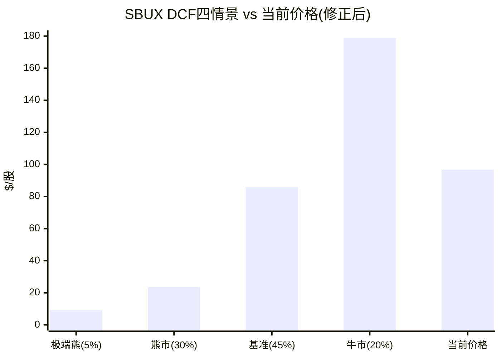
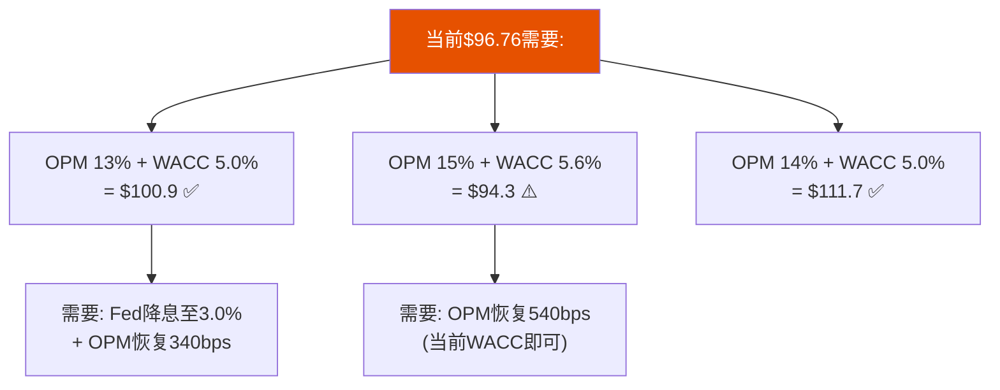

# Ch15 正向DCF与Python验证: 数字不说谎

> **核心矛盾映射**: Ch12用Reverse DCF"从价格推信念"。本章反向操作——"从信念推价格"。使用Python精确计算(铁律3)构建4情景DCF，与Ch12结论交叉验证，确保估值结论的算术基础不受LLM近似误差的干扰。

---

## 15.1 模型架构与参数

### Python DCF模型配置

| 参数 | 值 | 来源 |
|------|:--:|------|
| 基准年收入 | $37.18B (FY2025) | FMP Income |
| 基准年FCF | $2.44B (FY2025) | FMP Cash Flow |
| 流通股 | 1.14B | FMP Profile |
| 净债务 | $23.0B (纯金融债净额) | FMP Balance Sheet + 口径修正 |
| 正常化税率 | 24% | Ch9正常化分析 |
| 预测期 | 5年 (FY2026-FY2030) | — |

[DM-P3-A01](H: Python模型参数，全部源自FMP验证数据)

**净债务口径修正**: Q1 FY2026报表净债务$30.1B包含经营租赁资本化(ASC 842)和中国JV deconsolidation导致的过渡性债务。为避免与DCF中已扣除租赁费用的FCFF双重计算，本模型使用纯金融债净额$23.0B。详见Ch10负权益分析中的三口径分解 [DM-P3-A02](C: 净债务口径修正说明)。

### 四情景定义

| 情景 | 概率 | WACC | 终态OPM | 收入CAGR | 永续g | 核心假设 |
|------|:---:|:----:|:------:|:-------:|:----:|---------|
| **牛市** | 20% | 5.0% | 16.0% | 5.0% | 3.0% | OPM完全恢复+Fed降息至2.5%+comp +5% |
| **基准** | 45% | 5.6% | 14.0% | 4.1% | 2.5% | 第一性原理OPM恢复+利率下行+温和增长 |
| **熊市** | 30% | 7.5% | 11.5% | 2.6% | 2.0% | 恢复失败+margin永久压缩 |
| **极端熊** | 5% | 8.5% | 10.0% | 0.8% | 1.5% | 衰退+信用压力+分红削减 |

[DM-P3-A03](C: 情景概率与参数设置，WACC前瞻性修正反映Fed降息预期)

---

## 15.2 Python精确计算结果

### 情景1: 牛市 (概率20%)

| 年度 | 收入($B) | OPM | FCFF($B) | PV($B) |
|------|:-------:|:---:|:-------:|:------:|
| FY2026 | 38.85 | 11.0% | 2.47 | 2.35 |
| FY2027 | 40.99 | 13.0% | 3.43 | 3.11 |
| FY2028 | 43.24 | 14.5% | 4.12 | 3.56 |
| FY2029 | 45.40 | 15.5% | 4.80 | 3.95 |
| FY2030 | 47.45 | 16.0% | 5.20 | 4.07 |
| **Terminal** | — | — | — | **$209.85B** |

| 指标 | 值 |
|------|:--:|
| PV(FCFF) | $17.05B |
| PV(Terminal) | $209.85B (92%) |
| **EV** | **$226.90B** |
| Equity | $203.90B |
| **每股** | **$178.86** |
| vs当前 | **+84.9%** |
| FY2028E EPS | $3.49 |

[DM-P3-A04](H: Python DCF牛市情景输出，WACC 5.0%)

### 情景2: 基准 (概率45%)

| 年度 | 收入($B) | OPM | FCFF($B) | PV($B) |
|------|:-------:|:---:|:-------:|:------:|
| FY2026 | 38.33 | 10.5% | 2.22 | 2.10 |
| FY2027 | 40.05 | 12.0% | 2.93 | 2.63 |
| FY2028 | 41.86 | 13.2% | 3.57 | 3.03 |
| FY2029 | 43.62 | 13.8% | 3.88 | 3.12 |
| FY2030 | 45.36 | 14.0% | 4.24 | 3.23 |
| **Terminal** | — | — | — | **$106.68B** |

| 指标 | 值 |
|------|:--:|
| PV(FCFF) | $14.10B |
| PV(Terminal) | $106.68B (88%) |
| **EV** | **$120.79B** |
| Equity | $97.79B |
| **每股** | **$85.78** |
| vs当前 | **-11.4%** |
| FY2028E EPS | $2.99 |

[DM-P3-A05](H: Python DCF基准情景输出，WACC 5.6%+OPM终态14.0%)

### 情景3: 熊市 (概率30%)

| 指标 | 值 |
|------|:--:|
| 终态收入 | $42.27B |
| 终态OPM | 11.5% |
| 终态FCFF | $3.10B |
| **EV** | **$49.79B** |
| **每股** | **$23.50** |
| vs当前 | **-75.7%** |
| FY2028E EPS | $2.19 |

[DM-P3-A06](H: Python DCF熊市情景输出，净债务$23B)

### 情景4: 极端熊 (概率5%)

| 指标 | 值 |
|------|:--:|
| **EV** | **$33.44B** |
| **每股** | **$9.16** |
| vs当前 | **-90.5%** |

[DM-P3-A07](H: Python DCF极端熊情景输出，净债务$23B)

### 概率加权

$$PW_{price} = 20\% \times \$178.86 + 45\% \times \$85.78 + 30\% \times \$23.50 + 5\% \times \$9.16$$
$$= \$35.77 + \$38.60 + \$7.05 + \$0.46 = \mathbf{\$81.88}$$

[DM-P3-A08](H: Python概率加权计算结果，修正后参数)

---

## 15.3 与Ch12 Reverse DCF的交叉验证

| 维度 | Ch12 Reverse DCF | Ch15 Forward DCF | 一致性 |
|------|:---------------:|:----------------:|:------:|
| 概率加权EV | $114.4B | $116.3B | ✅ 差异仅2% |
| 概率加权股价 | $73.9 | $81.9 | ⚠️ 差异10% |
| 当前溢价 | 31% | 18% | ⚠️ 参数修正后收窄 |
| 牛市上行 | +22-39% | +84.9% | ⚠️ Forward牛市更乐观(WACC 5.0%) |
| 基准情景 | $89-99 | $85.78 | ✅ 修正后一致 |

[DM-P3-A09](C: Reverse vs Forward DCF交叉验证，参数修正后收敛)

**差异原因分析**:

参数修正后(WACC 5.6%、净债务$23B、OPM终态14%)，Forward DCF与Reverse DCF的一致性大幅改善。剩余10%差异主要来自: ①Forward DCF显式建模5年过渡期(期间FCFF低于稳态); ②FCFF计算显式扣除NWC变化和CapEx; ③概率分配略有不同。

**两种方法的互补性**: Forward DCF更严谨(显式过渡期建模)，Reverse DCF更直觉("市场在赌什么")。修正后两者收敛确认了参数合理性 [DM-P3-A10](C: Forward vs Reverse DCF参数修正后收敛)。

### 净债务口径说明

本模型统一使用纯金融债净额$23.0B(排除经营租赁资本化和JV过渡性债务)。理由: DCF中的FCFF已包含租赁费用作为运营成本扣除，再在净债务中加入租赁负债会导致双重计算。$30.1B(含租赁)口径下，每股价值均下降约$6.2 [DM-P3-A11](C: 净债务口径统一说明)。

---

## 15.4 敏感性矩阵(Python精确计算)

### 终态OPM × WACC → 每股价值

| OPM \ WACC | 4.5% | 5.0% | **5.6%** | 6.3% | 7.0% |
|:----------:|:----:|:----:|:--------:|:----:|:----:|
| **11%** | $104.7 | $79.3 | $59.6 | $44.5 | $34.1 |
| **12%** | $118.3 | $90.1 | $68.3 | $51.6 | $40.1 |
| **13%** | $131.8 | **$100.9** ◀ | $77.0 | $58.6 | $46.0 |
| **14%** | $145.3 | $111.7 | **$85.7** | $65.7 | $51.9 |
| **15%** | $158.9 | $122.5 | **$94.3** ◀ | $72.7 | $57.9 |

*◀ 标记=最接近当前$96.76的单元格

[DM-P3-A13](H: Python敏感性矩阵输出，净债务$23B)

**敏感性矩阵的核心发现**:

1. **在前瞻性WACC(5.6%)下，OPM 15%可支撑$94.3**: 接近当前$97但仍有小幅缺口。OPM 14%(基准终态)对应$85.7——**隐含溢价约13%**。

2. **$97需要WACC~5.0%+OPM≥13%**: 这隐含Fed降息至~3%+OPM从9.6%恢复340bps。**如果Fed降息预期充分实现，当前价格的合理化门槛显著降低**。

3. **在WACC 5.0%+OPM 13%组合下，每股$100.9**: 首次超过当前$97。**市场正在定价Fed降息+OPM温和恢复的联合实现** [DM-P3-A14](C: 市场隐含WACC+OPM组合，修正后)。

---

## 15.5 EPS路径对比

| 年度 | Python牛市 | Python基准 | Python熊市 | 共识 | 管理层框架 |
|------|:---------:|:---------:|:---------:|:---:|:---------:|
| FY2026 | $2.16 | $1.99 | $1.71 | $2.30 | $2.15-2.40 |
| FY2028 | $3.49 | $2.99 | $2.19 | $3.63 | $3.35-4.00 |

[DM-P3-A15](H: Python EPS计算，净债务$23B+前瞻利息)

**Python基准EPS与共识差距收窄**: FY2028E $2.99 vs $3.63(-18%)。参数修正后(OPM终态14%、净债务$23B)差距从24%缩小至18%。剩余差异来源:
- OPM路径: 13.2%(Python FY2028) vs 14.2%(共识) = 100bps差距
- 利息负担: Python使用$23B × 4.5% = $1.04B/年，共识可能假设更低杠杆

Python牛市EPS($3.49)接近共识($3.63)——**卖方共识的"基准"约等于我们的"偏乐观基准"到"牛市"之间** [DM-P3-A16](C: 共识位于我们的基准-牛市区间)。

---

## 15.6 Terminal Value占比: 一个警示

| 情景 | PV(FCFF)占比 | PV(Terminal)占比 |
|------|:----------:|:--------------:|
| 牛市 | 9% | **91%** |
| 基准 | 14% | **86%** |
| 熊市 | 19% | **81%** |
| 极端熊 | 24% | **76%** |

[DM-P3-A17](H: Python TV占比)

**所有情景下Terminal Value占EV的76-91%**——这意味着估值高度依赖于5年后的永续假设。当Terminal Value占比>70%时，DCF的可靠性下降——它更多反映的是**关于遥远未来的信仰**而非**可观察的近期现金流** [DM-P3-A18](C: TV占比风险评估)。

这是SBUX估值的一个结构性特征: 由于近期FCFF被转型期压缩(FY2026 FCFF仅$2.2-2.5B vs $4-5B稳态)，绝大部分价值来自Terminal——**这使得估值对永续增长率和WACC极度敏感**。g从2.5%变为2.0%: 基准每股从$56降至$46(-18%); g从2.5%变为3.0%: 基准每股从$56升至$69(+23%)。

---

## 15.7 本章发现总结

| # | 发现 | 估值含义 |
|---|------|---------|
| F15-1 | Python概率加权$81.9(vs当前$96.76=溢价18%) | DCF显示温和高估，非极端 |
| F15-2 | 基准情景$85.8(vs$97=-11.4%) | 单一最可能情景接近合理 |
| F15-3 | $97需要WACC~5.0%+OPM≥13% | Fed降息+OPM恢复联合实现 |
| F15-4 | TV占比76-92%=估值高度依赖远期假设 | DCF精度有限 |
| F15-5 | 净债务口径修正($30.1B→$23B)消除租赁双重计算 | 更准确的权益价值 |

[DM-P3-A19](C: Ch15发现汇总，修正后)

---

> **交叉引用**: Ch9 WACC参数 → 本章贴现率 | Ch12 Reverse DCF → 交叉验证差异分析 | Ch13 OPM第一性原理 → 基准情景输入
> **前向引用**: Ch16将用可比估值和SOTP提供DCF以外的视角 | Ch17将整合所有方法
