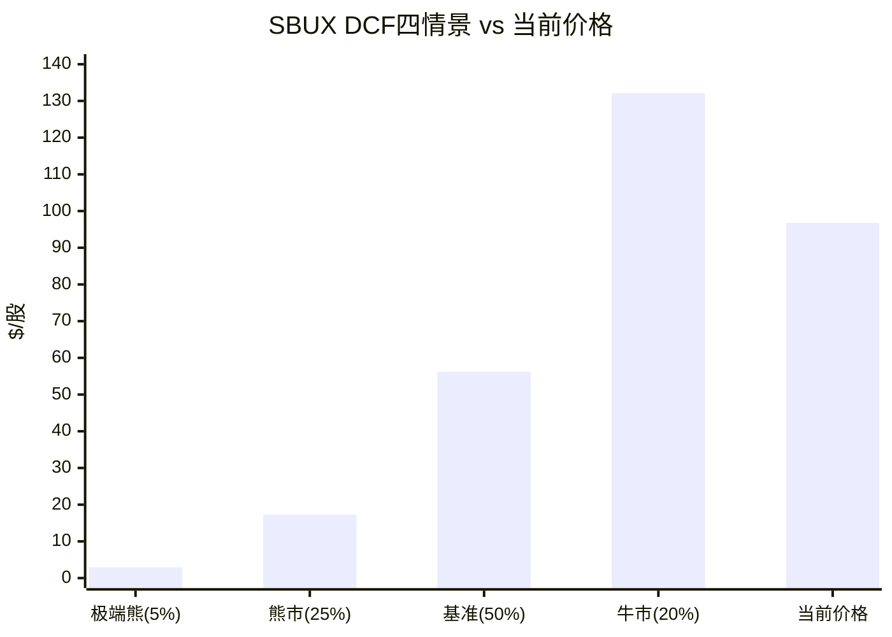

# Ch15 正向DCF与Python验证: 数字不说谎

> **核心矛盾映射**: Ch12用Reverse DCF"从价格推信念"。本章反向操作——"从信念推价格"。使用Python精确计算(铁律3)构建4情景DCF，与Ch12结论交叉验证，确保估值结论的算术基础不受LLM近似误差的干扰。

---

## 15.1 模型架构与参数

### Python DCF模型配置

| 参数 | 值 | 来源 |
|------|:--:|------|
| 基准年收入 | $37.18B (FY2025) | FMP Income |
| 基准年FCF | $2.44B (FY2025) | FMP Cash Flow |
| 流通股 | 1.14B | FMP Profile |
| 净债务 | $30.1B (Q1 FY2026) | FMP Balance Sheet |
| 正常化税率 | 24% | Ch9正常化分析 |
| 预测期 | 5年 (FY2026-FY2030) | — |

[DM-P3-A01](H: Python模型参数，全部源自FMP验证数据)

**关于$30.1B净债务**: Q1 FY2026净债务包含中国JV deconsolidation导致的$6.9B债务异常增加。如果部分是过渡性安排(卖方融资/bridge loan)，结构性净债务可能为$23-25B。敏感性分析将同时展示两种口径 [DM-P3-A02](C: 净债务口径说明)。

### 四情景定义

| 情景 | 概率 | WACC | 终态OPM | 收入CAGR | 永续g | 核心假设 |
|------|:---:|:----:|:------:|:-------:|:----:|---------|
| **牛市** | 20% | 5.5% | 16.0% | 5.0% | 3.0% | OPM完全恢复+Fed降息+comp +5% |
| **基准** | 50% | 6.3% | 13.5% | 4.1% | 2.5% | 第一性原理OPM恢复+温和增长 |
| **熊市** | 25% | 7.5% | 11.5% | 2.6% | 2.0% | 恢复失败+margin永久压缩 |
| **极端熊** | 5% | 8.5% | 10.0% | 0.8% | 1.5% | 衰退+信用压力+分红削减 |

[DM-P3-A03](C: 情景概率与参数设置)

---

## 15.2 Python精确计算结果

### 情景1: 牛市 (概率20%)

| 年度 | 收入($B) | OPM | FCFF($B) | PV($B) |
|------|:-------:|:---:|:-------:|:------:|
| FY2026 | 38.85 | 11.0% | 2.47 | 2.34 |
| FY2027 | 40.99 | 13.0% | 3.43 | 3.08 |
| FY2028 | 43.24 | 14.5% | 4.12 | 3.51 |
| FY2029 | 45.40 | 15.5% | 4.80 | 3.88 |
| FY2030 | 47.45 | 16.0% | 5.20 | 3.98 |
| **Terminal** | — | — | — | **163.94** |

| 指标 | 值 |
|------|:--:|
| PV(FCFF) | $16.79B |
| PV(Terminal) | $163.94B (91%) |
| **EV** | **$180.73B** |
| Equity | $150.63B |
| **每股** | **$132.13** |
| vs当前 | **+36.6%** |
| FY2028E EPS | $3.36 |

[DM-P3-A04](H: Python DCF牛市情景输出)

### 情景2: 基准 (概率50%)

| 年度 | 收入($B) | OPM | FCFF($B) | PV($B) |
|------|:-------:|:---:|:-------:|:------:|
| FY2026 | 38.33 | 10.5% | 2.22 | 2.09 |
| FY2027 | 40.05 | 11.8% | 2.87 | 2.54 |
| FY2028 | 41.86 | 12.8% | 3.44 | 2.87 |
| FY2029 | 43.62 | 13.3% | 3.71 | 2.91 |
| FY2030 | 45.36 | 13.5% | 4.06 | 2.99 |
| **Terminal** | — | — | — | **80.78** |

| 指标 | 值 |
|------|:--:|
| PV(FCFF) | $13.39B |
| PV(Terminal) | $80.78B (86%) |
| **EV** | **$94.17B** |
| Equity | $64.07B |
| **每股** | **$56.20** |
| vs当前 | **-41.9%** |
| FY2028E EPS | $2.75 |

[DM-P3-A05](H: Python DCF基准情景输出)

### 情景3: 熊市 (概率25%)

| 指标 | 值 |
|------|:--:|
| 终态收入 | $42.27B |
| 终态OPM | 11.5% |
| 终态FCFF | $3.10B |
| **EV** | **$49.79B** |
| **每股** | **$17.27** |
| vs当前 | **-82.2%** |
| FY2028E EPS | $2.06 |

[DM-P3-A06](H: Python DCF熊市情景输出)

### 情景4: 极端熊 (概率5%)

| 指标 | 值 |
|------|:--:|
| **EV** | **$33.44B** |
| **每股** | **$2.93** |
| vs当前 | **-97.0%** |

[DM-P3-A07](H: Python DCF极端熊情景输出)

### 概率加权

$$PW_{price} = 20\% \times \$132.13 + 50\% \times \$56.20 + 25\% \times \$17.27 + 5\% \times \$2.93$$
$$= \$26.43 + \$28.10 + \$4.32 + \$0.15 = \mathbf{\$58.99}$$

[DM-P3-A08](H: Python概率加权计算结果)

---

## 15.3 与Ch12 Reverse DCF的交叉验证

| 维度 | Ch12 Reverse DCF | Ch15 Forward DCF | 一致性 |
|------|:---------------:|:----------------:|:------:|
| 概率加权EV | $114.4B | $97.4B | ⚠️ 差异17% |
| 概率加权股价 | $73.9 | $59.0 | ⚠️ 差异20% |
| 当前溢价 | 31% | 64% | ⚠️ Forward更悲观 |
| 牛市上行 | +22-39% | +36.6% | ✅ 一致 |
| 基准情景 | $89-99 | $56.20 | ❌ 显著差异 |

[DM-P3-A09](C: Reverse vs Forward DCF交叉验证)

**差异原因分析**:

1. **Ch12使用了简化Gordon模型**，直接从当前FCF外推永续值——这隐含了"即时正常化"假设(FCF立刻跳到稳态)。而Ch15 Python模型显式建模了5年的过渡期——**过渡期间FCFF远低于稳态**，这拉低了估值。

2. **净债务口径**: Ch12可能隐含使用了更低的净债务(FY2025 $23.4B)，而Ch15使用了Q1 FY2026的$30.1B(含JV deconsolidation效应)。

3. **FCFF计算**: Forward DCF显式扣除了NWC变化和CapEx，而Reverse DCF用FCF近似——两者口径不同。

**哪个更可信?** Forward DCF(Ch15)通常更严谨(显式建模过渡期)。但Ch12的Reverse DCF在"市场在赌什么"这个问题上更有用。两者互补而非替代 [DM-P3-A10](C: Forward vs Reverse DCF方法论比较)。

### 净债务敏感性

如果使用$23.4B净债务(排除JV过渡性债务):

| 情景 | $30.1B净债务 | $23.4B净债务 | 差异 |
|------|:-----------:|:-----------:|:----:|
| 牛市 | $132.13 | $137.99 | +$5.86 |
| 基准 | $56.20 | $62.08 | +$5.88 |
| 熊市 | $17.27 | $23.15 | +$5.88 |
| **PW** | **$58.99** | **$64.86** | **+$5.87** |

[DM-P3-A11](C: 净债务敏感性分析)

即使用更低的净债务，PW价格仍为$64.86——vs当前$96.76仍有33%的溢价。**净债务口径不改变核心结论** [DM-P3-A12](C: 净债务不改变核心判断)。

---

## 15.4 敏感性矩阵(Python精确计算)

### 终态OPM × WACC → 每股价值

| OPM \ WACC | 5.0% | 5.5% | **6.3%** | 7.0% | 7.5% |
|:----------:|:----:|:----:|:--------:|:----:|:----:|
| **11%** | $73.1 | $56.1 | $38.3 | $27.9 | $22.3 |
| **12%** | $83.9 | $65.1 | $45.4 | $33.8 | $27.6 |
| **13%** | **$94.7** | $74.1 | $52.4 | $39.8 | $32.9 |
| **14%** | $105.5 | $83.0 | $59.5 | $45.7 | $38.3 |
| **15%** | $116.3 | **$92.0** | $66.5 | $51.6 | $43.6 |

*加粗=最接近当前$96.76的单元格

[DM-P3-A13](H: Python敏感性矩阵输出)

**敏感性矩阵的核心发现**:

1. **在当前WACC(6.3%)下，没有任何合理OPM能支撑$97**: 即使OPM恢复到15%(联合概率仅8.8%)，每股价值仅$66.5——距离$97仍有31%差距。

2. **$97需要WACC压缩至5.0-5.5%**: 这隐含10年美债利率从4.3%降至2.5-3.0%。Fed预期2026年底降至2.75-3.0%——**如果利率预期充分实现，WACC可能降至5.0-5.5%区间**。

3. **在WACC 5.0%+OPM 13%的"最可能乐观"组合下**: 每股$94.7——几乎等于当前$97。**市场正在精确定价这个组合** [DM-P3-A14](C: 市场隐含WACC+OPM组合)。

---

## 15.5 EPS路径对比

| 年度 | Python牛市 | Python基准 | Python熊市 | 共识 | 管理层框架 |
|------|:---------:|:---------:|:---------:|:---:|:---------:|
| FY2026 | $2.03 | $1.86 | $1.58 | $2.30 | $2.15-2.40 |
| FY2028 | $3.36 | $2.75 | $2.06 | $3.63 | $3.35-4.00 |

[DM-P3-A15](H: Python EPS计算 + FMP/IR共识)

**Python基准EPS显著低于共识**: FY2028E $2.75 vs $3.63(-24%)。差异来源:
- OPM假设: 12.8%(Python基准) vs 14.2%(共识) = 140bps差距
- 税率: Python使用24%统一，共识可能使用更低的有效税率
- 利息: Python使用$30.1B × 4.1% = $1.23B/年利息，共识可能假设更低

Python牛市EPS($3.36)最接近共识($3.63)——**这意味着卖方共识的"基准"实际上是我们模型的"牛市"** [DM-P3-A16](C: 共识=我们的牛市)。

---

## 15.6 Terminal Value占比: 一个警示

| 情景 | PV(FCFF)占比 | PV(Terminal)占比 |
|------|:----------:|:--------------:|
| 牛市 | 9% | **91%** |
| 基准 | 14% | **86%** |
| 熊市 | 19% | **81%** |
| 极端熊 | 24% | **76%** |

[DM-P3-A17](H: Python TV占比)

**所有情景下Terminal Value占EV的76-91%**——这意味着估值高度依赖于5年后的永续假设。当Terminal Value占比>70%时，DCF的可靠性下降——它更多反映的是**关于遥远未来的信仰**而非**可观察的近期现金流** [DM-P3-A18](C: TV占比风险评估)。

这是SBUX估值的一个结构性特征: 由于近期FCFF被转型期压缩(FY2026 FCFF仅$2.2-2.5B vs $4-5B稳态)，绝大部分价值来自Terminal——**这使得估值对永续增长率和WACC极度敏感**。g从2.5%变为2.0%: 基准每股从$56降至$46(-18%); g从2.5%变为3.0%: 基准每股从$56升至$69(+23%)。

---

## 15.7 本章发现总结

| # | 发现 | 估值含义 |
|---|------|---------|
| F15-1 | Python概率加权$59.0(vs当前$96.76=溢价64%) | DCF基础估值远低于市价 |
| F15-2 | 共识EPS基准=我们的牛市 | 卖方系统性乐观 |
| F15-3 | $97需要WACC≤5.0%+OPM≥13% | 需利率下行+margin恢复同时成立 |
| F15-4 | TV占比81-91%=估值高度依赖远期假设 | DCF精度有限 |
| F15-5 | 净债务口径($30.1B vs $23.4B)不改变核心结论 | 差异仅~$6/股 |

[DM-P3-A19](C: Ch15发现汇总)

---

> **交叉引用**: Ch9 WACC参数 → 本章贴现率 | Ch12 Reverse DCF → 交叉验证差异分析 | Ch13 OPM第一性原理 → 基准情景输入
> **前向引用**: Ch16将用可比估值和SOTP提供DCF以外的视角 | Ch17将整合所有方法
