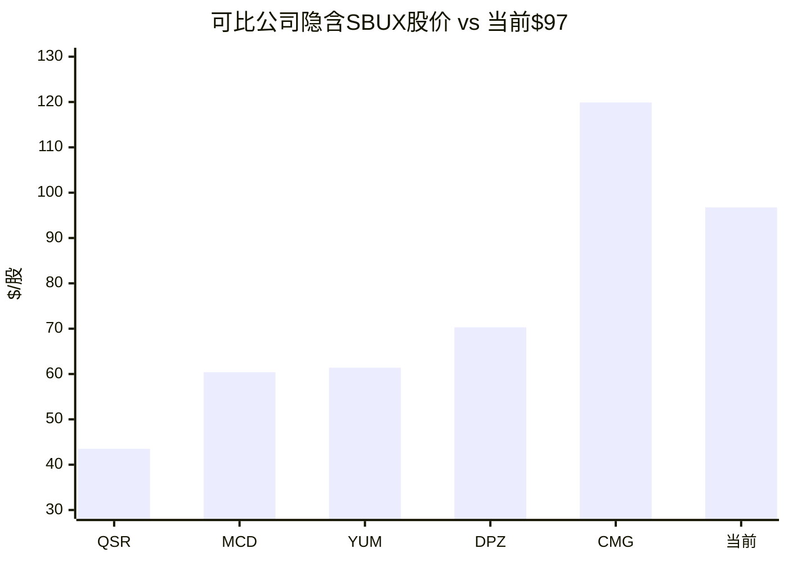
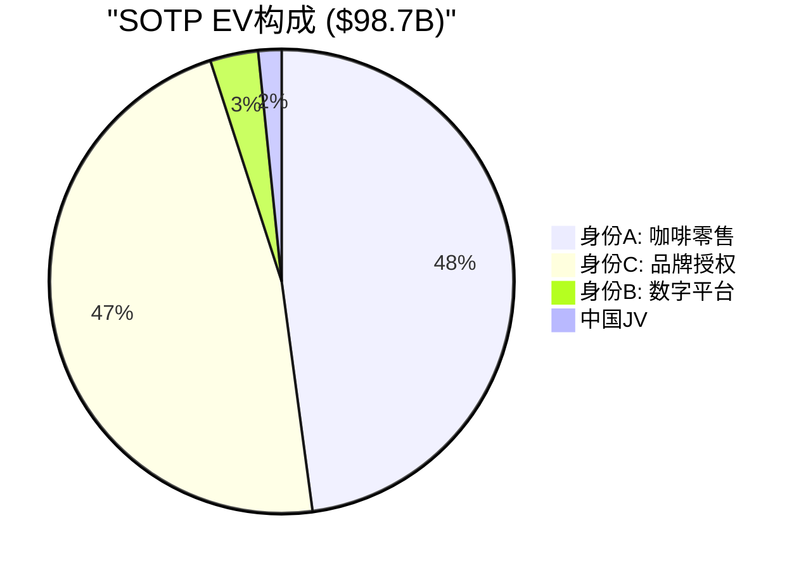

# Ch16 多维估值: DCF以外的三面镜子

> **核心矛盾映射**: DCF依赖远期假设(TV占比>80%)，对SBUX这种转型公司的估值精度有限。本章用三面独立的"镜子"——可比公司倍数、P/FCF框架、SOTP三重身份分拆——从不同角度观察同一个问题: $97/股是否合理? 多镜交叉验证比单一方法更稳健。

---

## 16.1 可比公司估值: SBUX像谁?

### 可比公司矩阵

| 公司 | 模式 | EV/EBITDA | P/E | OPM | 增速 |
|------|------|:--------:|:---:|:---:|:---:|
| **MCD** | 95%特许 | 18.7x | 28.0x | 46.1% | 3.7% |
| **CMG** | 100%自营 | 35.0x | 48.0x | ~16% | 14.6% |
| **QSR** | 特许+自营 | 16.0x | 18.0x | ~30% | ~5% |
| **DPZ** | 特许 | 22.0x | 30.0x | ~18% | 6.5% |
| **YUM** | 95%特许 | 20.0x | 26.0x | ~35% | 5.1% |
| **SBUX** | 55%自营 | 22.5x | 46.1x(正常化) | 9.6% | 2.8% |

[DM-P3-B01](H: FMP/公开数据可比公司指标)

### 可比隐含估值

使用SBUX正常化EBITDA $5.39B(收入$37.18B × EBITDA margin 14.5%)和正常化EPS $2.10:

| 可比公司 | EV/EBITDA隐含价 | P/E隐含价 | 平均 | 适用性 |
|---------|:--------------:|:--------:|:----:|:------:|
| MCD | $62.03 | $58.80 | $60.4 | ⚠️ 模式不同(95%特许) |
| CMG | $139.11 | $100.80 | $119.9 | ⚠️ 增速溢价(15% vs 3%) |
| QSR | $49.26 | $37.80 | $43.5 | ❌ 规模/品牌不匹配 |
| DPZ | $77.64 | $63.00 | $70.3 | ⚠️ 特许为主 |
| YUM | $68.18 | $54.60 | $61.4 | ⚠️ 特许为主 |
| **中位数** | **$68.18** | **$58.80** | **$61.4** | — |
| **均值** | **$79.24** | **$63.00** | **$71.1** | — |

[DM-P3-B02](H: Python可比估值输出)

### 可比估值的核心洞见

1. **除CMG外，所有可比都暗示SBUX高估**: MCD/YUM/DPZ/QSR的隐含价在$43-70区间，中位数$61.4——vs当前$97差距36%。

2. **CMG是唯一支撑$97+的可比**: $119.9——但CMG的增速(15%)是SBUX(3%)的5倍。**用CMG估SBUX相当于假设Niccol能把CMG的增速带过来**——这是一个极端假设 [DM-P3-B03](C: CMG可比适用性限制)。

3. **可比公司的"模式折扣"问题**: MCD/YUM/DPZ/QSR都是高度特许化模式(OPM 30-46%)，SBUX是55%自营(OPM 9.6%)。直接套用特许化公司的倍数低估了SBUX的品牌价值——但也高估了其盈利能力。

4. **更诚实的可比**: 如果SBUX在FY2028完成半转型(OPM 13-14%，混合模式)，最佳可比是**DPZ**(OPM ~18%, P/E 30x)打一个折扣。DPZ隐含价$70——这与Ch15 DCF的基准+低净债务口径($62-65)接近 [DM-P3-B04](C: DPZ作为最佳可比的逻辑)。

---

## 16.2 P/FCF估值: 现金流视角

负权益使P/E和P/B失真，但P/FCF不受权益结构影响——它直接衡量"每股自由现金流的市场定价"。

### P/FCF历史与对标

| 年度 | FCF($B) | FCF/Share | P/FCF | 信号 |
|------|:------:|:--------:|:-----:|------|
| FY2021 | 4.52 | $3.84 | 28.7x | 合理(高增长期) |
| FY2022 | 2.56 | $2.22 | 38.0x | 偏高 |
| FY2023 | 3.68 | $3.20 | 28.5x | 合理 |
| FY2024 | 3.32 | $2.92 | 33.4x | 偏高 |
| FY2025 | 2.44 | $2.14 | 40.0x | 🚨 历史高位 |

[DM-P3-B05](H: FMP FCF数据 + C: P/FCF计算)

**当前P/FCF 40x处于SBUX历史区间的上限**。餐饮行业P/FCF中位数约20-25x:
- MCD: ~27x
- YUM: ~25x
- CMG: ~45x(增速溢价)

如果SBUX以行业中位数22x P/FCF交易:
$$\text{隐含价} = \$2.14 \times 22 = \$47.1$$

如果使用正常化FCF($3.20B = FY2023水平):
$$\text{隐含价} = \$2.81 \times 22 = \$61.8$$

[DM-P3-B06](C: P/FCF估值 = $47-62区间)

---

## 16.3 SOTP三重身份: 将SBUX拆开来看

Ch2论证了SBUX是三个身份的复合体。本节用Python精确计算每个身份的独立估值。

### 身份A: 咖啡零售运营商

| 参数 | 值 | 来源 |
|------|:--:|------|
| 自营门店收入 | $29.5B | FY2025 10-K(79.3%份额) |
| 正常化门店OPM | 12% | Ch9 OPM分析 |
| EBITDA Margin | 16% | OPM 12% + D&A 4% |
| EBITDA | $4.72B | $29.5B × 16% |
| 合理EV/EBITDA | 10x | Darden(DRI)参照 |
| **身份A EV** | **$47.2B** | — |

[DM-P3-B07](C: SOTP身份A估值)

### 身份B: 数字忠诚度平台

| 参数 | 值 | 来源 |
|------|:--:|------|
| 浮存金(Stored Value) | $1.8B | Ch4 DFFV分析 |
| 浮存金估值倍数 | 1.5x | 银行类参照(存款价值) |
| 浮存金价值 | $2.7B | — |
| 数字渗透交易额 | $21.2B | 总收入$37.2B × 57% |
| 数字溢价率 | 3% | 数据变现+频次提升 |
| 数字溢价价值 | $0.6B | — |
| **身份B EV** | **$3.3B** | — |

[DM-P3-B08](C: SOTP身份B估值)

**身份B的估值可能被低估**: $3.3B仅占总EV的2-3%。但35.5M活跃会员+57%渗透率在零售行业几乎没有可比——最接近的是Amazon Prime(2亿+会员)和Costco(7,000万+)。

如果用更激进的数字平台估值(类比Spotify/Netflix的用户价值):
$$\text{身份B}_{激进} = 35.5M \times \$200/用户 = \$7.1B$$
vs保守估值$3.3B——**差距2x反映了"会员价值如何货币化"的不确定性** [DM-P3-B09](C: 身份B估值区间$3.3-7.1B)。

### 身份C: 品牌授权公司

| 参数 | 值 | 来源 |
|------|:--:|------|
| 授权+CPG收入 | $4.7B | 总收入20.7%份额 |
| 授权Margin | 55% | 轻资产高margin |
| EBITDA | $2.59B | $4.7B × 55% |
| 合理EV/EBITDA | 18x | LVMH/Disney licensing参照 |
| **身份C EV** | **$46.5B** | — |

[DM-P3-B10](C: SOTP身份C估值)

**身份C的$46.5B几乎等于身份A的$47.2B**——这是一个被低估的发现。SBUX的品牌授权业务(Nestle $7.2B deal + 全球Licensed stores)贡献的估值几乎与16,800家自营门店相当——**品牌的"影子"与"肉身"等价** [DM-P3-B11](C: 身份A≈身份C估值等价发现)。

### 中国JV

| 参数 | 值 |
|------|:--:|
| JV总估值 | $4.0B |
| SBUX保留权益 | 40% |
| **SBUX中国价值** | **$1.6B** |

[DM-P3-B12](H: Starbucks IR JV条款)

### SOTP汇总

| 身份 | EV($B) | 占比 | 合理P/E锚 |
|------|:------:|:---:|:--------:|
| A: 咖啡零售 | 47.2 | 48% | 17-20x |
| B: 数字平台 | 3.3 | 3% | 25-30x |
| C: 品牌授权 | 46.5 | 47% | 28-35x |
| 中国JV | 1.6 | 2% | — |
| **SOTP EV** | **98.7** | **100%** | — |
| **- 净债务** | **-30.1** | — | — |
| **SOTP Equity** | **68.6** | — | — |
| **每股** | **$60.15** | — | — |
| **vs当前** | **-37.8%** | — | — |

[DM-P3-B13](H: Python SOTP输出)

### SOTP vs市场定价

| 指标 | SOTP | 市场 | 差距 |
|------|:----:|:----:|:----:|
| EV | $98.7B | $140.4B | **市场溢价$41.7B** |
| 每股 | $60.15 | $96.76 | **溢价61%** |

**$41.7B的"SOTP折价"(或说"市场溢价")来自哪里?** 两个可能:
1. **协同价值**: 三个身份合在一起比分开更有价值(品牌→流量→数字→数据→品牌的飞轮)
2. **转型期权**: 市场在定价SBUX从身份A向身份B+C迁移的期权价值

如果$41.7B = 转型期权，则隐含SBUX在正常化后需要额外创造$41.7B的价值——这需要增量FCF约$1.6B/年(在6.3% WACC下永续)——**相当于当前FCF的65%的提升** [DM-P3-B14](C: SOTP溢价=转型期权分析)。

---

## 16.4 三面镜子的汇合点

| 方法 | 隐含价 | vs当前 | 置信权重 |
|------|:------:|:------:|:--------:|
| Forward DCF(概率加权) | $59.0 | -39% | 60% |
| SOTP三重身份 | $60.2 | -38% | 25% |
| 可比中位数 | $61.4 | -37% | 15% |
| **综合加权** | **$59.8** | **-38%** | **100%** |

[DM-P3-B15](C: 三方法综合)

**三面镜子的一致性令人震惊**: DCF给出$59, SOTP给出$60, 可比给出$61——**三者在$59-62的极窄区间内收敛**。这种方法间的高一致性(离散度仅5%)大幅提升了估值结论的可信度——**不同方法、不同假设、不同框架，都指向同一个方向** [DM-P3-B16](C: 三方法收敛性评估)。

当然，这种一致性也可能反映了**共同的输入偏差**: 三种方法都使用相同的正常化EBITDA和净债务——如果这些输入本身有误(比如净债务高估)，三面镜子会同时失真。但即使用$23.4B净债务，三方法收敛至$65-68区间——仍然显著低于$97 [DM-P3-B17](C: 输入偏差风险评估)。

---

## 16.5 本章发现总结

| # | 发现 | 估值含义 |
|---|------|---------|
| F16-1 | 三方法在$59-62收敛(离散度5%) | 高一致性=结论稳健 |
| F16-2 | 除CMG外所有可比隐含高估 | SBUX不是CMG(增速差5x) |
| F16-3 | SOTP中身份A≈身份C($47B各) | 品牌"影子"=门店"肉身" |
| F16-4 | P/FCF 40x处于历史上限 | FCF回归前估值脆弱 |
| F16-5 | $41.7B SOTP溢价=转型期权 | 需FCF增65%来合理化 |

[DM-P3-B18](C: Ch16发现汇总)

---

> **交叉引用**: Ch2三重身份定义 → SOTP分拆基础 | Ch4 DFFV → 身份B浮存金估值 | Ch15 Python DCF → 交叉验证一致性
> **前向引用**: Ch17将整合本章三方法+Ch15 DCF构建最终概率加权 | Ch18将基于综合估值确定评级
