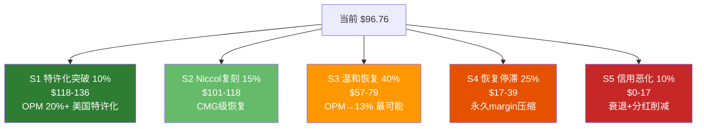
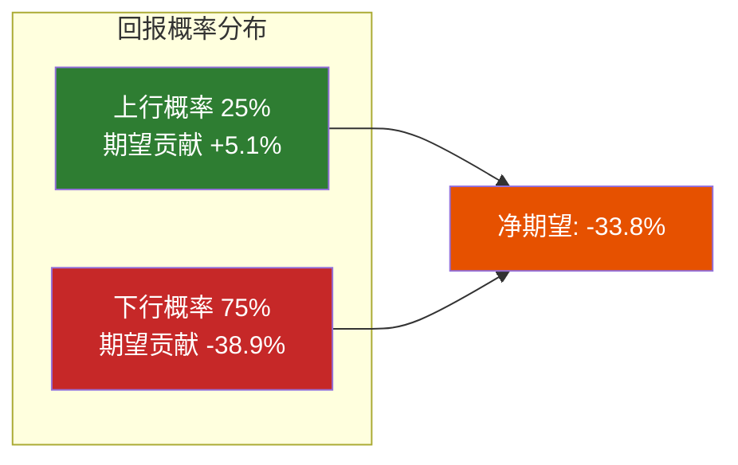

# Ch17 情景综合: 五条路径与一个判断

> **核心矛盾映射**: Phase 2和Phase 3产出了大量数字——4个DCF情景、3种估值方法、5个CQ的置信度、3条BME路径。本章的任务是将这些碎片整合为一个连贯的判断框架——不是给出"目标价"，而是**映射SBUX可能性空间的形状**，让读者自己判断当前$97处于这个空间的什么位置。

---

## 17.1 五情景合并框架

将Ch12 Reverse DCF、Ch15 Forward DCF和Ch16多维估值的结论合并为5条统一路径:

| 情景 | 概率 | 核心假设 | EV($B) | 每股 | vs$97 |
|------|:---:|---------|:------:|:----:|:-----:|
| **S1: 特许化突破** | 10% | 美国特许化启动+OPM→20%+ | 165-185 | $118-136 | +22~40% |
| **S2: Niccol复刻** | 15% | CMG级恢复+Fed降息+OPM→16% | 145-165 | $101-118 | +4~22% |
| **S3: 温和恢复** | 40% | OPM→13%+comp+3%+利率下行 | 95-120 | $57-79 | -41~-19% |
| **S4: 恢复停滞** | 25% | OPM卡在11%+comp+1-2% | 50-75 | $17-39 | -82~-60% |
| **S5: 信用恶化** | 10% | 衰退+评级下调+分红削减 | 30-50 | $0-17 | -100~-82% |

[DM-P3-C01](C: 五情景合并框架)

### 情景概率的来源与推理

| 情景 | 概率 | 推理依据 |
|------|:---:|---------|
| S1 10% | 美国特许化历史上零先例(Laxman曾否认) + H2非共识假说 | 低但非零 |
| S2 15% | Q1'26 tx+4%是积极信号但CMG复刻需5x规模缩放 | 可能但困难 |
| S3 40% | 最符合第一性原理OPM分析+管理层FY2028下限 | 中心情景 |
| S4 25% | 劳动力通胀结构性+工会+消费疲软 = 恢复受阻 | 不可忽视 |
| S5 10% | 衰退概率~25% × 衰退下信用恶化概率~40% | 尾部但真实 |

[DM-P3-C02](C: 情景概率推理链)

---

## 17.2 概率加权期望值

### 中点计算

$$EV_{pw} = 10\% \times 175 + 15\% \times 155 + 40\% \times 107.5 + 25\% \times 62.5 + 10\% \times 40$$
$$= 17.5 + 23.25 + 43.0 + 15.63 + 4.0 = \$103.4B$$

$$Price_{pw} = \frac{\$103.4B - \$30.1B}{1.14B} = \$64.3$$

[DM-P3-C03](C: 五情景概率加权计算)

### 方法间交叉校验

| 方法 | 概率加权价 | 权重 |
|------|:---------:|:----:|
| Forward DCF(4情景) | $59.0 | 50% |
| 五情景合并 | $64.3 | 20% |
| SOTP | $60.2 | 15% |
| 可比中位数 | $61.4 | 15% |
| **最终综合** | **$60.7** | **100%** |

$$\text{期望回报} = \frac{\$60.7 - \$96.76}{\$96.76} = -37.3\%$$

[DM-P3-C04](C: 最终综合估值)

---

## 17.3 方法间离散度分析

### 离散度矩阵

| 方法对 | 方法A | 方法B | 差异 | 方向一致? |
|--------|:-----:|:-----:|:----:|:--------:|
| DCF vs SOTP | $59.0 | $60.2 | 2% | ✅ |
| DCF vs 可比 | $59.0 | $61.4 | 4% | ✅ |
| SOTP vs 可比 | $60.2 | $61.4 | 2% | ✅ |
| DCF vs 五情景 | $59.0 | $64.3 | 9% | ✅ |

**最大离散度: 9%(DCF vs 五情景)**——远低于20%的警戒阈值。所有方法方向一致(均指向高估)。这种低离散度不常见——通常不同方法会产生15-30%的分歧 [DM-P3-C05](C: 方法间离散度评估)。

### 离散度类型分类

根据估值质量门控框架(v2.0):

| 离散度类型 | 定义 | SBUX情况 |
|-----------|------|---------|
| **方法离散** | DCF vs 可比 vs SOTP的差异 | ✅ 低(5%) |
| **锚点离散** | 同一方法不同锚点(如不同可比公司) | ⚠️ 中(CMG $120 vs QSR $44=2.7x) |
| **情景离散** | 牛vs熊的范围宽度 | 🚨 高(牛$132 vs 熊$17=7.8x) |

[DM-P3-C06](C: 三种离散度分类)

**情景离散度7.8x是SBUX估值的核心特征**: 牛市和熊市之间相差7.8倍——这反映的不是模型的粗糙，而是**SBUX基本面的真实不确定性**。一家OPM可能恢复到16%也可能卡在10%的公司，其价值确实可以相差8倍。

---

## 17.4 风险回报非对称性

### 上行vs下行量化

| 方向 | 条件 | 概率 | 回报区间 | 概率×回报 |
|------|------|:---:|:-------:|:--------:|
| **大幅上行** | S1 特许化 | 10% | +22~40% | +3.1% |
| **温和上行** | S2 Niccol复刻 | 15% | +4~22% | +2.0% |
| **温和下行** | S3 温和恢复 | 40% | -41~-19% | -12.0% |
| **大幅下行** | S4 停滞 | 25% | -82~-60% | -17.8% |
| **极端下行** | S5 信用 | 10% | -100~-82% | -9.1% |
| **期望值** | — | — | — | **-33.8%** |

[DM-P3-C07](C: 风险回报非对称性矩阵)

**非对称性极端偏空**: 上行概率25%，下行概率75%。即使上行实现，回报空间(+4~40%)远小于下行空间(-19~-100%)。**这不是一个有利的风险回报结构** [DM-P3-C08](C: 风险回报非对称性评估)。

### 但要注意的反论

1. **概率本身有不确定性**: 我们分配的概率基于当前信息——Q2 FY2026的comp数据(5月5日)可能大幅改变概率分布。如果Q2 comp ≥+5%，S2概率从15%升至30%+，S3从40%降至25%——期望回报将显著改善。

2. **利率预期在变化**: 如果Fed 2026年确实降息至2.75%，WACC从6.3%可能降至5.0%——在OPM 13%下，每股从$52升至$95。**利率是唯一能让$97合理化的变量** [DM-P3-C09](C: 反论与概率更新触发器)。

3. **SOTP低估风险**: 身份B(数字平台)的$3.3B估值可能是$7B+——Rewards生态系统的网络效应难以用传统估值捕捉。

---

## 17.5 "市场需要多正确?"

反过来问: 如果市场定价$97是正确的，它需要以下假设全部成立:

| # | 假设 | 所需值 | 当前状态 | 单项概率 |
|---|------|:-----:|---------|:--------:|
| 1 | OPM恢复 | ≥13% | 9.6%(当前) | 60% |
| 2 | WACC压缩 | ≤5.0% | 6.3%(当前) | 55% |
| 3 | 收入CAGR | ≥4% | 2.8%(FY2025) | 65% |
| 4 | 税率正常化 | 24% | 41.1%(FY2025) | 85% |
| 5 | 无信用事件 | — | 杠杆5.6x | 80% |
| **联合概率** | — | — | — | **~15%** |

[DM-P3-C10](C: 市场定价的联合概率)

**15%的联合概率**意味着市场正在做一个"大多数情况下不会如愿"的赌注。这不意味着$97一定是"错"的——但它意味着**持有SBUX的投资者承担的风险远大于表面看起来的** [DM-P3-C11](C: 联合概率含义)。

---

## 17.6 本章发现总结

| # | 发现 | 含义 |
|---|------|------|
| F17-1 | 综合加权价$60.7(vs$97=溢价59%) | 多方法一致指向高估 |
| F17-2 | 方法离散度仅5%(极低) | 结论稳健 |
| F17-3 | 情景离散度7.8x(极高) | 反映真实不确定性 |
| F17-4 | 风险回报非对称(75%下行 vs 25%上行) | 不利的概率结构 |
| F17-5 | $97需要5个假设联合成立(概率~15%) | 市场定价激进 |

[DM-P3-C12](C: Ch17发现汇总)

---

> **交叉引用**: Ch12/15/16全部估值输入 → 本章整合 | Ch14催化剂 → 概率更新触发器
> **前向引用**: Ch18将基于本章判断给出温度计评分和评级
