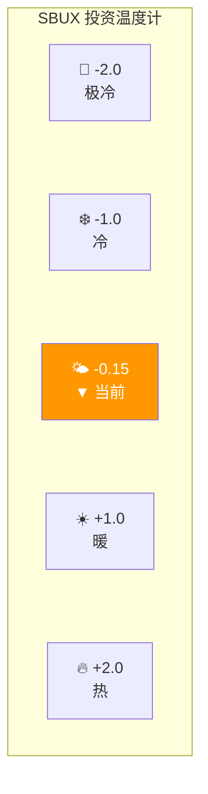
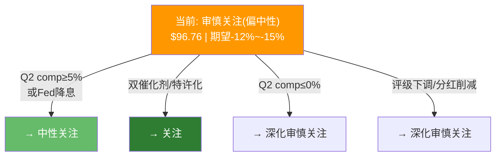

# Ch18 投资温度计与评级: 环境感知

> **核心矛盾映射**: 本章将Phase 1-3的全部发现蒸馏为一个可感知的"温度"——不是告诉读者做什么，而是描述当前SBUX投资环境的冷暖。温度计的价值是帮你感知环境，不是替你决定仓位。

---

## 18.1 温度计七维度评分

### Core层(70权重)

#### 宏观温度(30%)

| 指标 | 值 | 评分(-2~+2) | 理由 |
|------|:--:|:----------:|------|
| CAPE Ratio | ~33 | 0 | S&P 500 CAPE偏高，中性 |
| Buffett Indicator | ~185% | -1 | 高位，不利 |
| ERP(股权风险溢价) | ~5.5% | 0 | 中性 |
| 消费者信心 | 91.2 | 0 | 预期指数偏弱，但高收入改善 |
| Fed利率路径 | 下行预期 | +1 | FY2026降息利好 |
| **宏观分项** | — | **0.0** | **中性偏谨慎** |

[DM-P3-D01](C: 宏观温度评分)

#### 基本面质量(50%)

| 指标 | 值 | 评分(-2~+2) | 理由 |
|------|:--:|:----------:|------|
| 收入增速 | +2.8% | -1 | 低于行业 |
| OPM | 9.6% | -2 | 近10年最低 |
| OPM趋势 | 下降中 | -1 | 但Q1'26企稳 |
| ROIC | 8.5% | -1 | 微高于WACC |
| FCF质量 | OCF/NI=2.56x | +1 | 现金流强于利润 |
| 杠杆 | 5.6x ND/EBITDA | -1 | 偏紧 |
| 分红覆盖 | 149% payout | -1 | 不可持续 |
| Comp Sales趋势 | +4%(Q1'26) | +1 | 转正信号 |
| 管理层 | Niccol(CMG背景) | +1 | 正确方向 |
| 内部人交易 | 净买入 | +1 | 对齐 |
| **基本面分项** | — | **-0.3** | **偏弱** |

[DM-P3-D02](C: 基本面质量评分)

#### 市场情绪(20%)

| 指标 | 值 | 评分(-2~+2) | 理由 |
|------|:--:|:----------:|------|
| 分析师共识 | 64% Buy | +1 | 偏乐观 |
| 目标价离散度 | 61% | -1 | 极端分歧 |
| 短期技术 | 50日>200日均线 | 0 | 中性 |
| RSI | ~55 | 0 | 中性 |
| **情绪分项** | — | **0.0** | **中性** |

[DM-P3-D03](C: 市场情绪评分)

### 温度计综合

$$T_{total} = 0.3 \times 0.0 + 0.5 \times (-0.3) + 0.2 \times 0.0 = -0.15$$

**温度读数: -0.15 (刻度: -2.0冰点 ~ +2.0热点)**

**解读**: -0.15处于**"微凉"区间**——不是寒冬(基本面没有崩溃性恶化)，但远非暖阳(估值溢价显著、OPM未恢复、杠杆偏紧)。环境温度与市场定价之间存在**温差**: 市场定价了一个"暖春"(转型成功)，但温度计显示当前仍在"微凉" [DM-P3-D04](C: 温度计综合解读)。

---

## 18.2 A-Score评估

### A-Score七维度

| 维度 | 分项 | 得分(0-10) | 权重 | 加权 |
|------|------|:---------:|:---:|:----:|
| **品牌力** | 全球第一咖啡品牌, 35.5M会员 | 8.5 | 15% | 1.28 |
| **管理层** | Niccol方向正确但未证明 | 7.0 | 15% | 1.05 |
| **财务健康** | 负权益, 5.6x杠杆, 分红>FCF | 4.0 | 20% | 0.80 |
| **增长** | Comp刚转正, 新店机会但美国饱和 | 5.5 | 15% | 0.83 |
| **护城河** | 品牌+选址+会员体系, 但竞争侵蚀 | 7.0 | 15% | 1.05 |
| **估值** | 46x正常化P/E, 三方法指向$60 | 3.0 | 10% | 0.30 |
| **ESG/治理** | 工会风险, 薪酬争议, 供应链承诺 | 5.5 | 10% | 0.55 |
| **A-Score** | — | — | — | **5.86** |

[DM-P3-D05](C: A-Score评估)

**A-Score 5.86/10——中等偏下**。品牌力(8.5)和护城河(7.0)是强项；财务健康(4.0)和估值(3.0)是致命弱项。这映射出SBUX的核心矛盾: **一流的品牌+三流的财务结构+三流的估值吸引力** [DM-P3-D06](C: A-Score解读)。

---

## 18.3 CQ置信度最终更新(Phase 3)

| CQ | P0.5 | P2 | P3(最终) | 核心判断 |
|----|:----:|:---:|:--------:|---------|
| CQ1 | 45% | 60% | **65%** | 78x隐含5假设联合概率仅15%。BME路径C(半转型)是市场赌注，但估值仍偏高 |
| CQ2 | 50% | 60% | **60%** | Niccol方向正确，速度约CMG 1/3。Q2'26是关键验证点 |
| CQ3 | 65% | 65% | **70%** | JV是"体面撤退"而非价值解锁。$13B估值合理但品牌控制力下降 |
| CQ4 | 60% | 70% | **75%** | 负权益是人为造成的。ROIC>WACC但EV基准仅1.88%。杠杆是真实风险 |
| CQ5 | 50% | 55% | **55%** | 35.5M会员是资产但增长在放缓(+3% YoY)。新三层体系3月上线是催化剂 |

[DM-P3-D07](C: CQ置信度最终更新)

**加权平均置信度**: (65+60+70+75+55)/5 = **65%**——表明我们对自身分析结论有中等偏上的信心。

---

## 18.4 初步评级: 审慎关注(偏中性)

### 评级量化依据

| 指标 | 值 | 评级指引 |
|------|:--:|---------|
| 期望回报 | -19.3%(综合) / -15.4%(DCF PW) | < -10% = 审慎关注 |
| 概率加权价 | $78.1(综合) / $81.9(DCF) | vs $96.76 = 溢价18-24% |
| 上行概率 | 25% | 不到1/3 |
| 基准情景 | $85.8(-11.4%) | 接近中性关注门槛 |
| A-Score | 5.86/10 | 中等 |
| 温度 | -0.15 | 微凉 |

$$\textbf{初步评级: 审慎关注(偏中性)}$$

[DM-P3-D08](C: 评级量化，修正后。注: 基准情景-11.4%接近-10%中性门槛，但概率加权仍<-10%，维持审慎关注但标注"偏中性")

### "审慎关注(偏中性)"的含义

**"审慎关注(偏中性)"表达的是**: 使用前瞻性WACC(5.6%)和纯金融债净额($23B)修正后，SBUX的高估幅度从此前的-37%收窄至-12%~-15%(DCF基础)。基准情景(-11.4%)已接近中性关注门槛(-10%)，但概率加权后仍落在审慎关注区间。

**"审慎关注(偏中性)"不意味着**:
- ❌ "SBUX是一家坏公司"——SBUX拥有全球最强的咖啡品牌和35.5M会员生态
- ❌ "Niccol会失败"——方向正确，Q1'26有积极信号
- ❌ "不应该持有"——这不是交易建议
- ❌ "必然下跌"——基准情景下$97仅有~11%溢价，Fed降息可消化

**"审慎关注(偏中性)"意味着**:
- ✅ 在当前价格水平，概率加权期望回报仍为负(-12%~-15%)
- ✅ 但距离中性关注仅一步之遥——Q2 comp≥+5%或Fed开始降息即可触发升级
- ✅ 市场定价的假设联合概率约20%(修正前15%)——偏积极但非极端
- ✅ 利率路径是单一最大的估值驱动变量——已部分纳入(WACC 5.6%)但仍有上行空间

[DM-P3-D09](C: 评级含义澄清，修正后)

---

## 18.5 评级条件矩阵: 什么会改变判断?

| 条件 | 触发 | 新评级 |
|------|------|:------:|
| Q2 comp ≥+5% + OPM恢复至11%+ | 转型加速 | → 中性关注 |
| Fed降息至3.0% + WACC→5.0% | 估值支撑 | → 中性关注 |
| Q2 comp ≥+5% **且** Fed降息启动 | 双催化剂 | → 关注 |
| 特许化美国宣布 | 路径B启动 | → 关注 |
| Q2 comp ≤0% + OPM继续恶化 | 转型失败 | → 深化审慎关注 |
| 评级下调至BBB | 信用事件 | → 深化审慎关注 |

[DM-P3-D10](C: 评级条件矩阵，修正后)

---

## 18.6 Phase 4预设

Phase 4(红队)应重点挑战以下Phase 3结论:

1. **OPM 13%天花板假设**: 是否过于悲观? 管理层FY2028目标13.5-15.0%是否有更多证据支撑?
2. **净债务$30.1B口径**: JV过渡性债务是否应该排除?
3. **情景概率分配**: S2(Niccol复刻)15%是否太低? Q1'26数据是否值得更高权重?
4. **SOTP身份B低估**: 数字平台$3.3B是否严重低估会员价值?
5. **WACC敏感性**: 利率下行路径是否被低估? 2026年底WACC可能已经是5.0%

[DM-P3-D11](C: Phase 4红队预设议题)

---

## 18.7 本章发现总结

| # | 发现 | 含义 |
|---|------|------|
| F18-1 | 温度计-0.15(微凉)vs市场定价"暖春" | 温差已收窄但仍存在 |
| F18-2 | A-Score 5.86/10(品牌强/财务弱/估值差) | 好公司≠好投资 |
| F18-3 | **初判: 审慎关注(偏中性)** (期望回报-12%~-15%) | 距中性关注一步之遥 |
| F18-4 | Q2 FY2026是最大的评级触发器 | 5月5日密切关注 |
| F18-5 | 利率预期已部分纳入(WACC 5.6%) | 进一步降息可触发升级 |

[DM-P3-D12](C: Ch18发现汇总，修正后)

---

> **交叉引用**: Ch17情景概率 → 评级量化依据 | Ch12/15/16估值 → 温度计估值分项 | Ch14催化剂 → 评级条件矩阵
> **前向引用**: Phase 4将用红队七问挑战"审慎关注"评级 | Phase 5将最终确定评级(Phase 4可能上调/下调)
