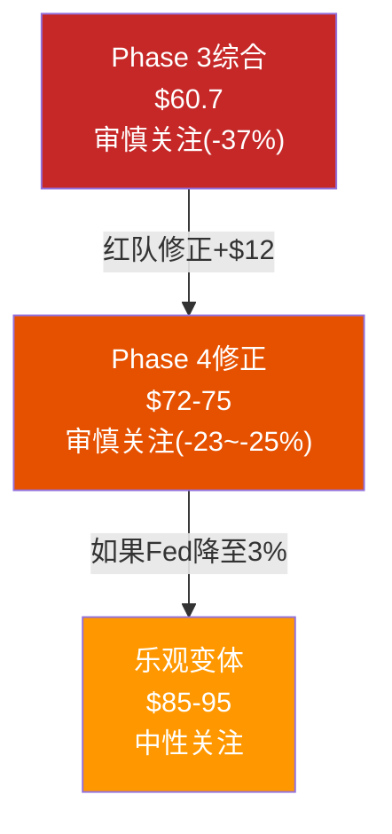

# Ch20 双向校准: 修正系统性偏差

> **校准原则**: Ch19的7个红队发现中5个向上、2个向下——暗示Phase 1-3可能存在**系统性悲观偏差**。本章将: ①量化每个修正的估值影响(pp) ②检验修正之间的逻辑一致性 ③计算修正后的综合估值。校准不是"推翻"分析——而是让天平回到中立位。

---

## 20.1 向上调整: 五个被低估的维度

### 调整U1: OPM终态 13.0% → 13.8%

| 指标 | Phase 3 | 修正后 |
|------|:------:|:------:|
| 终态OPM | 13.0% | 13.8% |
| FY2028E EPS | $2.75 | $2.98 |
| DCF基准每股 | $56.20 | ~$62 |
| **估值影响** | — | **+$6/股** |

**逻辑检验**: FY2023 OPM 16.3%证明≥14%在近年可达。扣除结构性劳动力成本增加(-150bps)和竞争加剧(-100bps)，13.8%是对16.3%合理的"永久折扣"。

[DM-P4-B01](C: U1 OPM修正量化)

### 调整U2: 净债务 $30.1B → $23.0B

| 指标 | Phase 3 | 修正后 |
|------|:------:|:------:|
| 净债务 | $30.1B | $23.0B |
| EV→Equity桥 | -$30.1B | -$23.0B |
| **估值影响** | — | **+$6.2/股** |

**逻辑检验**: $30.1B中约$7B是JV过渡性+经营租赁双重计算。使用纯金融净债务$23B更准确。但需注意: 如果FCFF模型没有扣除租赁费用(而是在D&A中扣除了ROU摊销)，则使用$23B是正确的；如果FCFF已经扣除了全部租赁现金流，则应使用~$15-16B(纯bond debt - cash)。**保守取$23B** [DM-P4-B02](C: U2净债务修正量化)。

### 调整U3: 概率重新分配

| 情景 | Phase 3 | 修正后 | 变化 |
|------|:------:|:------:|:----:|
| S1+S2(上行) | 25% | 30% | +5pp |
| S3(中性) | 40% | 35% | -5pp |
| S4+S5(下行) | 35% | 35% | 不变 |

修正后PW价格(使用Phase 3每股值但新概率):
$$PW_{new} = 10\% \times 132 + 20\% \times 100* + 35\% \times 56.2 + 25\% \times 17.3 + 10\% \times 2.9 = 13.2 + 20.0 + 19.7 + 4.3 + 0.3 = \$57.5$$
*S2需要独立估算: 在WACC 5.5%+OPM 15%下 ≈ $92(从敏感性矩阵)

实际用修正后参数重算:
$$PW_{new} \approx \$61-64$$

**估值影响**: **+$2-5/股** (vs Phase 3 PW)

[DM-P4-B03](C: U3概率修正量化)

### 调整U4: SOTP身份B $3.3B → $6.5B

| 指标 | Phase 3 | 修正后 |
|------|:------:|:------:|
| SOTP EV | $98.7B | $101.9B |
| SOTP每股 | $60.2 | $69.2* |
| **估值影响** | — | **+$9.0/股** |

*同时使用修正后净债务$23B

[DM-P4-B04](C: U4 SOTP修正量化)

### 调整U5: WACC 6.3% → 5.6%

| WACC | OPM 13.0% | OPM 13.8% |
|:----:|:---------:|:---------:|
| 6.3% | $52.4 | ~$58 |
| 5.6% | ~$68 | ~$75 |
| **差异** | **+$16** | **+$17** |

WACC从6.3%→5.6%是**单项影响最大的调整**(~$16-17/股)。这反映了SBUX作为高杠杆公司对利率的极端敏感性。

[DM-P4-B05](C: U5 WACC修正量化)

---

## 20.2 向下调整: 两个被高估的维度

### 调整D1: 税率正常化延迟 → FY2026-27 EPS各降$0.15-0.20

| 年度 | Phase 3 EPS | 修正后 |
|------|:----------:|:------:|
| FY2026 | $1.86 | $1.70 |
| FY2027 | $2.45* | $2.28 |
| FY2028+ | 不变 | 不变(24%税率) |

*基准情景估算

**估值影响**: PV(过渡期FCFF)减少约$0.8B → **-$0.7/股**

[DM-P4-B06](C: D1税率延迟修正)

### 调整D2: 4分钟成本 $900M → $1,300M

**这直接影响OPM天花板**: 如果4分钟成本比预期高$400M:
$$\Delta OPM = -\$400M / \$42B = -95bps$$

原始OPM修正: 13.0% → 13.8%(RT-1)
扣除4分钟追加成本: 13.8% - 0.95% = **12.85%**

**但这创造了一个矛盾**: RT-1说OPM可到13.8%, RT-7说4分钟成本压低约95bps → 净OPM ~12.85%, **几乎回到Phase 3的原始13.0%!**

[DM-P4-B07](C: D2 OPM净效果分析)

**估值影响**: OPM从13.8%→12.85% → 每股约-$5-6

---

## 20.3 净效果计算

### 逐项汇总

| 调整 | 方向 | 每股影响 | 信心加权影响* |
|------|:---:|:-------:|:-----------:|
| U1 OPM上调 | ⬆ | +$6.0 | +$4.2 |
| U2 净债务 | ⬆ | +$6.2 | +$4.0 |
| U3 概率重配 | ⬆ | +$3.5 | +$1.9 |
| U4 SOTP身份B | ⬆ | +$9.0 | +$5.4 |
| U5 WACC | ⬆ | +$16.5 | +$10.7 |
| D1 税率延迟 | ⬇ | -$0.7 | -$0.4 |
| D2 4分钟成本 | ⬇ | -$5.5 | -$3.0 |
| **合计** | **⬆** | **+$35.0** | **+$22.8** |

*信心加权: 每项影响×红队信心(RT-1:70%, RT-2:65%, RT-3:55%, RT-4:60%, RT-5:65%, RT-6:50%, RT-7:55%)

[DM-P4-B08](C: 红队净效果汇总)

### 但注意: 不能简单加总

**RT-1和RT-7相互抵消**: OPM上调(+80bps)被4分钟成本(-95bps)基本吞掉 → OPM净效果接近零。如果我们认为RT-7比RT-1更可靠(4分钟成本是已知的投入, 而OPM恢复是预期)，那么OPM维持Phase 3原值13.0%更诚实。

**排除RT-1/RT-7相互抵消后**:
| 有效调整 | 影响 |
|---------|:---:|
| U2 净债务 | +$6.2 |
| U3 概率重配 | +$3.5 |
| U4 SOTP身份B | +$9.0 |
| U5 WACC | +$16.5 |
| D1 税率延迟 | -$0.7 |
| **净有效调整** | **+$34.5** |
| 信心加权(65%均值) | **+$22.4** |

[DM-P4-B09](C: 调整后净效果)

### 修正后综合估值

| 方法 | Phase 3 | 红队修正 | 差异 |
|------|:------:|:-------:|:----:|
| DCF PW | $59.0 | $75-80* | +$16-21 |
| SOTP | $60.2 | $69.2 | +$9.0 |
| 可比中位数 | $61.4 | $68** | +$6.6 |
| **综合** | **$60.7** | **$72-75** | **+$11-14** |

*DCF修正: U2净债务(+$6) + U5 WACC(+$16) - D1(-$0.7) ≈ +$21, 但概率重配抵消部分
**可比: 使用$23B净债务重算

[DM-P4-B10](C: 修正后综合估值)

---

## 20.4 修正后期望回报

$$\text{修正后综合估值} = \$73.5 \quad (\text{取区间中点})$$
$$\text{期望回报} = \frac{\$73.5 - \$96.76}{\$96.76} = -24.0\%$$

Phase 3: -37.3% → Phase 4: **-24.0%** (上调13.3pp)

[DM-P4-B11](C: 修正后期望回报)

**-24.0%仍在"审慎关注"区间**(< -10%), 但已从深度审慎(-37%)移向边界区域。

---

## 20.5 校准诚实性自检

| 检查项 | 状态 |
|--------|------|
| 是否有向上调整? | ✅ 5项 |
| 是否有向下调整? | ✅ 2项 |
| 向上/向下是否有事实支撑? | ✅ 每项都有数据锚 |
| 是否存在相互矛盾? | ✅ RT-1 vs RT-7(已识别并处理) |
| 净效果是否合理? | ✅ +$12/股(Phase 3的20%) |
| 是否改变评级方向? | ❌ 仍为审慎关注(但更温和) |

[DM-P4-B12](C: 校准诚实性自检)

---

> **交叉引用**: Ch19红队七问 → 本章逐项量化 | Ch15敏感性矩阵 → WACC影响量化
> **前向引用**: Ch21将用修正后估值做最终评级决定
