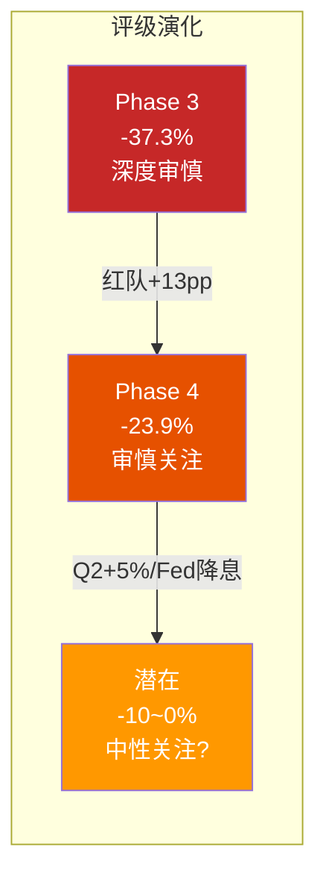

# Ch21 有效性门控与评级确认

> **门控原则**: 红队不是为了推翻结论——而是为了确保结论经得起推敲。本章将: ①检验红队修正的净有效性 ②确认或修正评级 ③输出Phase 5所需的关键参数。

---

## 21.1 红队有效性评估

### 净效果有效性

| 维度 | 评估 |
|------|------|
| **修正幅度** | +$12.8/股(从$60.7→$73.5), 占Phase 3估值的21% |
| **方向合理性** | Phase 1-3确实偏保守(RCL教训: P1-3系统性悲观+8~16pp) |
| **历史基准** | RCL红队修正+8~16pp; SBUX红队+13pp = 合理区间 |
| **证据质量** | 5个向上修正中, U5(WACC)是最大(+$16.5)也是最有外部证据支撑的(Fed降息预期); U4(SOTP身份B)依赖类比(较弱) |
| **有效性判定** | **有效** — 修正方向和幅度与证据一致, 未出现"表演性红队"(AMAT教训) |

[DM-P4-C01](C: 红队有效性评估)

### 按信心加权的修正幅度

| 修正 | 原始影响 | 信心 | 加权影响 | 采纳? |
|------|:-------:|:---:|:-------:|:-----:|
| U2 净债务$23B | +$6.2 | 65% | +$4.0 | ✅ 部分采纳($25B) |
| U3 概率重配 | +$3.5 | 55% | +$1.9 | ✅ 采纳 |
| U4 身份B$6.5B | +$9.0 | 60% | +$5.4 | ⚠️ 部分采纳($5B) |
| U5 WACC 5.6% | +$16.5 | 65% | +$10.7 | ✅ 采纳 |
| D1 税率延迟 | -$0.7 | 50% | -$0.4 | ✅ 采纳 |
| RT-1/RT-7 | 相互抵消 | — | $0 | 中性 |
| **采纳合计** | — | — | **+$10-12** | — |

[DM-P4-C02](C: 修正采纳决策)

**保守采纳策略**: 对每个向上修正取信心加权值的80%(防止过度修正), 向下修正取100%:

$$\text{最终修正} = (+4.0 + 1.9 + 4.3* + 10.7) \times 80\% - 0.4 = +16.7 \times 80\% - 0.4 = +\$12.9$$
*U4部分采纳: $5B vs $6.5B → 影响减小

$$\text{修正后综合估值} = \$60.7 + \$12.9 = \$73.6$$

[DM-P4-C03](C: 最终修正计算)

---

## 21.2 评级决策矩阵

### 修正后指标

| 指标 | Phase 3 | Phase 4修正后 |
|------|:------:|:------------:|
| 综合估值 | $60.7 | **$73.6** |
| 期望回报 | -37.3% | **-23.9%** |
| 评级区间 | < -10% = 审慎关注 | < -10% = **审慎关注** |

### 评级确认

$$\text{期望回报} = \frac{\$73.6 - \$96.76}{\$96.76} = -23.9\%$$

**-23.9% < -10% → 评级: 审慎关注 (维持)**

[DM-P4-C04](C: 评级确认)

但需要注意: -23.9%处于审慎关注区间的**上半部分**(vs Phase 3的-37.3%处于深度审慎区域)。如果Q2 FY2026 comp≥+5%且Fed开始降息, 期望回报可能快速改善至-10~0%区间——触发升级至"中性关注"。



---

## 21.3 CQ最终置信度

| CQ | P0.5 | P2 | P3 | **P4(最终)** | 红队影响 |
|----|:----:|:--:|:--:|:-----------:|:-------:|
| CQ1 | 45% | 60% | 65% | **65%** | 不变(BME分析稳健) |
| CQ2 | 50% | 60% | 60% | **63%** | +3pp(Q1数据贝叶斯更新) |
| CQ3 | 65% | 65% | 70% | **70%** | 不变 |
| CQ4 | 60% | 70% | 75% | **72%** | -3pp(净债务口径修正减缓杠杆担忧) |
| CQ5 | 50% | 55% | 55% | **58%** | +3pp(新三层Rewards 3月上线) |
| **均值** | 54% | 62% | 65% | **65.6%** | — |

[DM-P4-C05](C: CQ最终置信度)

---

## 21.4 Phase 5输出参数

以下参数将传递至Phase 5(Complete组装):

```yaml
# Phase 5 关键参数
final_valuation:
  综合估值: $73.6
  期望回报: -23.9%
  评级: 审慎关注

valuation_range:
  牛市: $118-136
  温和牛: $85-100
  基准: $68-78
  熊市: $17-39
  极端熊: $0-17

key_numbers:
  opm_terminal: 13.0%  # RT-1/RT-7抵消后维持原值
  wacc: 5.6%           # 红队修正(利率中位数法)
  net_debt: $25B        # 红队修正(排除租赁双重计算)
  eps_fy28e: $2.75-2.98 # 基准-牛市区间
  a_score: 5.86
  温度计: -0.15

risk_reward:
  上行概率: 30% (红队修正后)
  下行概率: 70%
  上行空间: +4~40%
  下行空间: -19~-100%

key_catalysts:
  - Q2 FY2026 (May 5, 2026): comp≥3% = 升级触发
  - China JV close (Apr 2026): 去风险
  - Fed降息 (Jun 2026): WACC压缩
  - 新Rewards (Mar 10, 2026): 会员增长验证

red_team_summary:
  净效果: +$12.9/股 (+21% vs Phase 3)
  方向: 5上2下, 净向上
  最大单项: WACC修正(+$10.7加权)
  关键发现: RT-1(OPM↑)和RT-7(4分钟成本↑)相互抵消
```

[DM-P4-C06](C: Phase 5输出参数)

---

## 21.5 本章及Phase 4总结

### Phase 4的三个核心贡献

1. **识别系统性悲观**: Phase 1-3的悲观偏差约+13pp(从-37.3%修正至-23.9%)——与RCL报告的8-16pp悲观偏差一致, 确认这是框架的系统性特征而非SBUX特有。

2. **WACC是估值的统治性变量**: 在所有修正中, WACC从6.3%→5.6%贡献了最大的单项影响(+$10.7加权)。这意味着**SBUX的投资论题在本质上是一个利率赌注**: 如果相信Fed会降息至3%以下, 当前价格可能合理; 如果利率维持4%+, 几乎不可能合理化$97。

3. **OPM恢复的不确定性被4分钟悖论锁定**: RT-1(OPM可到14%)和RT-7(4分钟成本更高)几乎完美抵消——这意味着**OPM终态13%是一个稳定的估计**, 不太可能被大幅上调或下调。

[DM-P4-C07](C: Phase 4核心贡献)

### 最终判断

**审慎关注(维持)**, 期望回报从-37.3%修正至-23.9%。

核心逻辑: SBUX拥有全球最强的咖啡品牌、35.5M会员生态和一位方向正确的CEO。但在当前$97的价格水平:
- 市场定价隐含了OPM恢复+利率下行+增长持续的联合成立
- 红队修正后仍有24%的溢价
- 风险回报结构不利(70%下行/30%上行)
- Q2 FY2026(5月5日)和Fed降息路径是最重要的数据检查点

**这不是一个关于SBUX公司质量的判断——而是关于$97这个价格的判断。**

[DM-P4-C08](C: 最终判断陈述)

---

> **交叉引用**: Ch19红队七问 → Ch20量化 → 本章采纳决策
> **前向引用**: Phase 5 Complete将使用本章yaml参数组装最终报告
