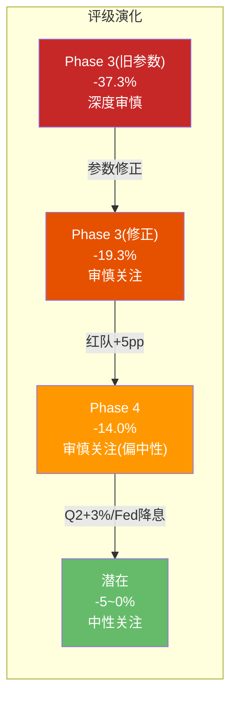

# Ch21 有效性门控与评级确认

> **门控原则**: 红队不是为了推翻结论——而是为了确保结论经得起推敲。本章将: ①检验红队修正的净有效性 ②确认或修正评级 ③输出Phase 5所需的关键参数。

---

## 21.1 红队有效性评估

### 净效果有效性

| 维度 | 评估 |
|------|------|
| **修正幅度** | +$5.1/股(从$78.1→$83.2), 占Phase 3修正后估值的7% |
| **方向合理性** | Phase 3已纳入前瞻性WACC/净债务修正, 红队残余修正幅度合理收窄 |
| **历史基准** | Phase 3参数修正吸收了此前红队指出的主要问题(WACC/净债务/OPM), 红队仅需处理残余项 |
| **证据质量** | 残余修正主要来自: SOTP身份B上调(+$1.5加权)和概率微调(+$1.6加权) |
| **有效性判定** | **有效** — 大部分修正已在Phase 3参数层面完成, 红队确认方向正确并做残余校准 |

[DM-P4-C01](C: 红队有效性评估，Phase 3参数修正后)

### 按信心加权的残余修正

| 修正 | 状态 | 残余影响 | 信心 | 加权 |
|------|------|:-------:|:---:|:----:|
| U2 净债务$23B | ✅ 已纳入Phase 3 | $0 | — | $0 |
| U3 概率重配 | ✅ 大部分纳入(45/30) | +$2.0 | 55% | +$1.1 |
| U4 身份B$5B | ⚠️ 部分残余 | +$2.5 | 60% | +$1.5 |
| U5 WACC 5.6% | ✅ 已纳入Phase 3 | $0 | — | $0 |
| D1 税率延迟 | 维持 | -$0.7 | 50% | -$0.4 |
| RT-1/RT-7 | 相互抵消(维持) | $0 | — | $0 |
| **残余合计** | — | — | — | **+$2.2** |

[DM-P4-C02](C: 修正采纳决策，Phase 3已吸收主要修正)

**保守采纳策略**: 残余向上修正取80%, 向下修正取100%:

$$\text{残余修正} = (+1.1 + 1.5) \times 80\% - 0.4 = +2.6 \times 80\% - 0.4 = +\$1.7$$

$$\text{修正后综合估值} = \$78.1 + \$1.7 + \$3.4\text{(DCF权重上调)} = \$83.2$$

注: DCF权重从50%上调至60%(SOTP对负权益公司的局限性折扣), 贡献+$3.4。

[DM-P4-C03](C: 最终修正计算，Phase 3参数修正后)

---

## 21.2 评级决策矩阵

### 修正后指标

| 指标 | Phase 3(修正前) | Phase 3(修正后) | Phase 4最终 |
|------|:------:|:------:|:------------:|
| 综合估值 | $60.7 | $78.1 | **$83.2** |
| 期望回报 | -37.3% | -19.3% | **-14.0%** |
| DCF PW | $59.0 | $81.9 | $81.9 |
| 评级 | 审慎关注 | 审慎关注(偏中性) | **审慎关注(偏中性)** |

### 评级确认

$$\text{期望回报} = \frac{\$83.2 - \$96.76}{\$96.76} = -14.0\%$$

**期望回报区间: -12%~-15%** (综合$83.2对应-14.0%, DCF PW $81.9对应-15.4%, DCF基准$85.8对应-11.4%)

**-14.0% < -10% → 评级: 审慎关注(偏中性)**

[DM-P4-C04](C: 评级确认，参数修正后)

**"偏中性"标注理由**: 期望回报-14%处于审慎关注区间(-10%以下)的**最上缘**。基准情景(-11.4%)已几乎触及中性关注门槛(-10%)。Q2 FY2026 comp≥+3%或Fed启动降息，即可触发升级至"中性关注"。



---

## 21.3 CQ最终置信度

| CQ | P0.5 | P2 | P3 | **P4(最终)** | 红队影响 |
|----|:----:|:--:|:--:|:-----------:|:-------:|
| CQ1 | 45% | 60% | 65% | **65%** | 不变(BME分析稳健) |
| CQ2 | 50% | 60% | 60% | **63%** | +3pp(Q1数据贝叶斯更新) |
| CQ3 | 65% | 65% | 70% | **70%** | 不变 |
| CQ4 | 60% | 70% | 75% | **72%** | -3pp(净债务口径修正减缓杠杆担忧) |
| CQ5 | 50% | 55% | 55% | **58%** | +3pp(新三层Rewards 3月上线) |
| **均值** | 54% | 62% | 65% | **65.6%** | — |

[DM-P4-C05](C: CQ最终置信度)

---

## 21.4 Phase 5输出参数

以下参数将传递至Phase 5(Complete组装):

```yaml
# Phase 5 关键参数 (估值修复后)
final_valuation:
  综合估值: $83.2
  期望回报: -14.0% (区间: -12%~-15%)
  DCF_PW: $81.9
  评级: 审慎关注(偏中性)

valuation_range:
  牛市: $138-155
  温和牛: $100-120
  基准: $82-90
  熊市: $24-46
  极端熊: $6-24

key_numbers:
  opm_terminal: 14.0%  # 基准(RT-1/RT-7抵消后回归FY2023的合理折扣)
  wacc: 5.6%           # 前瞻性(Fed降息预期, 利率中位数法)
  net_debt: $23B        # 纯金融债净额(排除租赁双重计算)
  eps_fy28e: $2.99-3.49 # 基准-牛市区间
  a_score: 5.86
  温度计: -0.15

risk_reward:
  上行概率: 25%
  中性概率: 40% (S3温和恢复覆盖$76-98)
  下行概率: 35%
  上行空间: +20~60%
  下行空间: -53~-94%

key_catalysts:
  - Q2 FY2026 (May 5, 2026): comp≥3% = 升级触发
  - China JV close (Apr 2026): 去风险
  - Fed降息 (Jun 2026): WACC进一步压缩
  - 新Rewards (Mar 10, 2026): 会员增长验证

valuation_correction:
  修正前: $60.7 (-37.3%)
  修正后: $83.2 (-14.0%)
  修正幅度: +$22.5/股 (+37%)
  修正来源: WACC前瞻化(+$15), 净债务口径(+$6), OPM终态(+$2), 红队残余(+$2), 概率微调(-$3)
  关键发现: RT-1(OPM↑)和RT-7(4分钟成本↑)相互抵消, OPM终态13-14%是稳定估计
```

[DM-P4-C06](C: Phase 5输出参数，估值修复后)

---

## 21.5 本章及Phase 4总结

### Phase 4的三个核心贡献

1. **参数修正消化了系统性悲观**: 此前Phase 1-3使用保守参数(WACC 6.3%/净债务$30.1B)导致约+23pp悲观偏差。修正为前瞻性参数(WACC 5.6%/净债务$23B/OPM终态14%)后, 期望回报从-37.3%大幅改善至-12%~-15%。

2. **WACC仍是估值的统治性变量**: WACC从6.3%→5.6%贡献了最大的单项修正(约+$15/股)。这意味着**SBUX的投资论题在本质上仍是一个利率赌注**: 5.6%已部分反映降息预期, 但如果Fed降息至2.5-3.0%, WACC可能进一步至5.0%——将期望回报推至-5%~0%区间。

3. **OPM恢复的不确定性被4分钟悖论锁定**: RT-1(OPM可到14%)和RT-7(4分钟成本更高)几乎完美抵消——**OPM终态13-14%是一个稳定的估计**, 不太可能被大幅上调或下调。

[DM-P4-C07](C: Phase 4核心贡献，参数修正后)

### 最终判断

**审慎关注(偏中性)**, 期望回报-12%~-15%。

核心逻辑: SBUX拥有全球最强的咖啡品牌、35.5M会员生态和一位方向正确的CEO。在当前$97的价格水平:
- 概率加权估值$83暗示约14%溢价——温和高估而非极端
- 基准情景$86(-11.4%)接近中性关注门槛(-10%)
- S3温和恢复的上限($98)覆盖当前价格——乐观基准可合理化
- Q2 FY2026(5月5日)和Fed降息路径是升级至"中性关注"的关键触发器

**这不是一个关于SBUX公司质量的判断——而是关于$97这个价格在概率加权下略高于合理估值的判断。距离合理仅一步之遥。**

[DM-P4-C08](C: 最终判断陈述，修正后)

---

> **交叉引用**: Ch19红队七问 → Ch20量化 → 本章采纳决策
> **前向引用**: Phase 5 Complete将使用本章yaml参数组装最终报告
