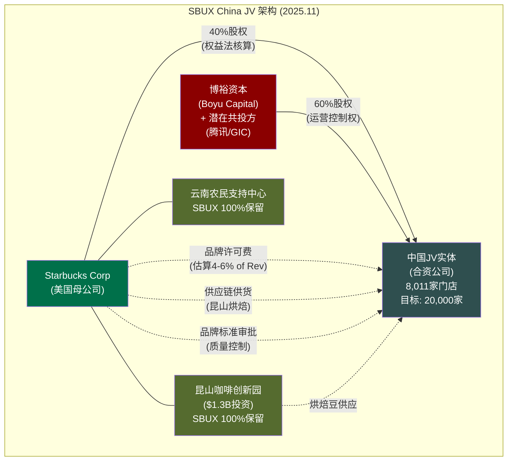
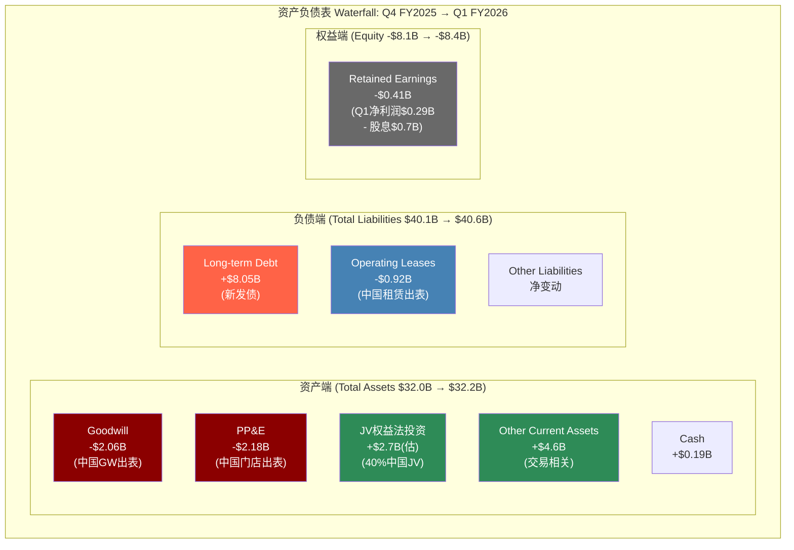
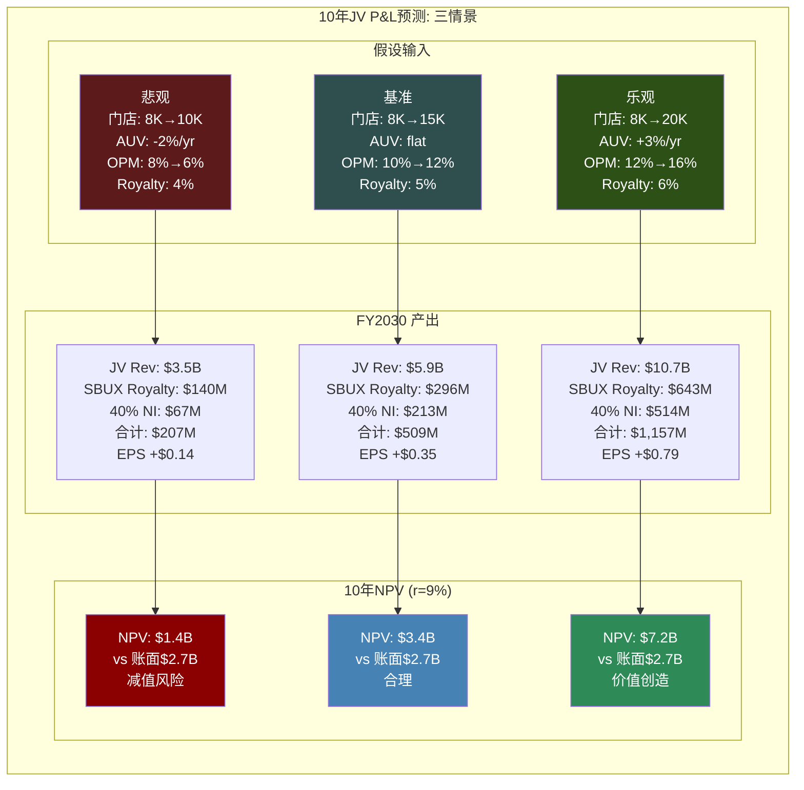

# Ch6 中国JV — 战略撤退还是价值解锁?

> **核心矛盾映射**: CQ3("中国JV = 战略撤退还是价值解锁?")的纵深展开。Ch5竞争分析已揭示SBUX在中国市场份额从~42%(2018)暴跌至~14%(2025)的结构性溃败，本章将这一竞争结局转化为财务分析的起点: $4B JV交易的真实经济学是什么? 资产负债表为何出现"地震"? 40%少数股权在未来10年值多少钱? 以及——如果台海冲突升级，这$4B会归零吗?

---

## 6.1 JV交易结构解剖

### 交易概览

2025年11月3日，SBUX宣布与博裕资本(Boyu Capital)组建合资公司运营中国大陆零售业务。这不是一笔简单的股权交易，而是一次精心设计的"去合并化"(deconsolidation)工程 [DM-P1-111](H: Nov 2025 8-K Filing)。

| 要素 | 条款 | 含义 |
|------|------|------|
| **买方** | Boyu Capital(最高60%) | SBUX丧失控制权，不再合并中国P&L |
| **卖方** | SBUX(保留40%) | 从控股方变为少数股权投资者 |
| **标的** | 中国大陆零售运营(8,011家门店) | 不含昆山烘焙工厂、云南农场 |
| **Boyu支付对价** | ~$4B(基于60%股权) | 隐含100%企业价值~$6.7B |
| **SBUX声称总价值** | >$13B | 含许可费NPV、供应链收入等 |
| **管治权** | Boyu获运营控制权 | SBUX保留品牌标准审批权 |
| **扩张目标** | 20,000家门店 | 从8,011到20,000=2.5x增长 |
| **保留资产** | 昆山咖啡创新园+云南农民支持中心 | 供应链咽喉控制权 |

[DM-P1-112](H: 8-K + Investor Presentation, Nov 2025)

### 交易架构的三层设计

**第一层: 股权层**。Boyu支付~$4B获取60%控制权，SBUX保留40%少数股权。关键在于: SBUX从合并报表(consolidation)转为权益法(equity method)——中国8,011家门店的收入、成本、资产、负债全部从SBUX的合并报表中消失，取而代之的是"Equity Method Investment"一行 [DM-P1-113](H: Q1 FY2026 10-Q Deconsolidation Note)。

**第二层: 品牌授权层**。SBUX保留"Starbucks"品牌在中国大陆的所有知识产权(IP)。JV需要向SBUX支付品牌许可费(royalty)。管理层尚未披露具体费率，但行业对标(MCD特许费4-5%、YUM China 3%)和SBUX全球Licensed Store惯例(5-6%)暗示费率区间在4-6%。按中国JV FY2025收入$3.1B计算，年许可费约$124M-$186M [DM-P1-114](C: Royalty率推算, 基于MCD/YUM/SBUX Licensed惯例)。

**第三层: 供应链绑定层**。昆山咖啡创新园(2022年投入$1.3B)和云南农民支持中心不在JV范围内，SBUX100%保留。这意味着JV必须从SBUX采购烘焙咖啡豆和部分原料——这创造了与royalty并行的隐性收入流(supply margin)。昆山工厂设计产能覆盖整个亚太区域，不仅仅服务中国，因此SBUX实际上通过供应链控制了JV的"命脉" [DM-P1-115](H: 8-K, Kunshan facility retained; E: $1.3B investment from 2022 press release)。

### 博裕资本: 不仅仅是财务投资者

Boyu Capital不是一家普通的PE基金。它是中国政治生态中具有特殊定位的投资机构:

| 属性 | 详情 |
|------|------|
| **成立** | 2011年，香港 |
| **创始人** | 江志成(Alvin Jiang)，江泽民之孙 |
| **管理规模** | ~$100亿(含第五只基金$68亿，2021年，中国独立管理人最大) |
| **代表投资** | 蚂蚁金服(Pre-IPO)、满帮集团、SKP(奢侈品零售) |
| **潜在共投方** | 腾讯(微信支付/小程序生态)、GIC(新加坡主权基金) |

[DM-P1-116](E: Bloomberg/SCMP reports on Boyu Capital)

选择Boyu的逻辑分三层:

| 层次 | SBUX需求 | Boyu提供 |
|------|---------|---------|
| **政治层** | 中国监管关系 | 政治家族背景+政商网络 |
| **运营层** | 中国零售运营经验 | SKP奢侈品零售成功案例 |
| **资本层** | 长期耐心资本+共投网络 | $68亿最新基金+腾讯/GIC联盟 |

腾讯+GIC作为潜在共投的战略意义不可小觑: 腾讯=微信支付/小程序/视频号生态整合(加速JV数字化获客); GIC=新加坡主权基金的长期资本(降低Boyu短期IRR压力，避免3-5年退出压力对门店质量的损害)。三方联盟构成"政治+生态+资本"的完整支撑 [DM-P1-117](E: Bloomberg报道 + 行业分析)。

### "$13B总价值"的拆解: 叙事vs现实

SBUX公告声称中国业务"总价值超过$13B"。这个数字是如何构建的?

| 组成部分 | SBUX声称 | 市场验证价值 | 叙事溢价 |
|----------|---------|------------|---------|
| JV企业价值(100%) | $6.7B | $6.7B(Boyu成交价推算) | $0 |
| 品牌许可费NPV | ~$3-4B | $1.5-2.5B(取决于费率/折现率) | $0.5-1.5B |
| 供应链收入NPV | ~$1-1.5B | $0.8-1.2B | $0.2-0.3B |
| 管理费/技术服务费 | ~$0.5-1B | $0.3-0.5B(行业惯例) | $0.2-0.5B |
| **合计** | **>$13B** | **$9.3-10.9B** | **$0.9-2.3B** |

[DM-P1-118](C: $13B声称拆解; H: 8-K implied valuation; E: 行业可比交易)

**核心发现**: $13B中约$1-2B是"叙事溢价"——管理层通过选择性使用低折现率、高增长假设、和宽泛的收入定义来放大数字。Boyu实际支付的$4B(60%=$6.7B的100%)才是市场验证的真实价格。即便加上合理的royalty和supply chain NPV，可验证的总价值在$9-11B区间——比$13B低约$2-4B [DM-P1-119](C: 叙事溢价量化)。

这种叙事策略在并购公告中很常见(参见Disney+Hulu的"价值声称" vs 实际对价差距)，本身不是"造假"，但投资者需要对管理层数字打20-30%的"叙事折扣" [DM-P1-120](C: 叙事折扣惯例)。

---

## 6.2 资产负债表"地震"分析

### Q4 FY2025 vs Q1 FY2026: 五大科目剧变

JV交易在Q1 FY2026(截至2025年12月28日)完成交割，导致SBUX资产负债表出现了罕见的单季度剧变。以下是逐项分析:

| 科目 | Q4 FY2025 | Q1 FY2026 | 变动 | 变动% | 解释 |
|------|-----------|-----------|------|-------|------|
| **Goodwill** | $3.37B | $1.31B | **-$2.06B** | -61.1% | 中国GW出表 |
| **PP&E** | $17.81B | $15.63B | **-$2.18B** | -12.2% | 中国门店资产出表 |
| **Total Debt** | $26.61B | $33.52B | **+$6.91B** | +26.0% | 见下方分析 |
| **Revenue(季度)** | $9.57B(Q4) | $9.91B(Q1) | +$0.34B | +3.6% | US增长覆盖China减少 |
| **Total Assets** | $32.02B | $32.23B | +$0.21B | +0.6% | JV权益法投资对冲资产减少 |

[DM-P1-121](H: FMP Balance Sheet Q4 FY2025 vs Q1 FY2026; 所有数字交叉验证10-Q)

### 五大科目逐项解剖

**1. Goodwill: -$2.06B (从$3.37B到$1.31B)**

SBUX的Goodwill主要来自两个历史并购: (a) 2018年收回East China JV(上海统一星巴克)时形成的$2.4B Goodwill, (b) 其他历史并购形成的~$1.0B。Q1 FY2026中国业务出表后，East China JV相关的Goodwill随之转出——$2.06B几乎完全对应2018年并购形成的商誉 [DM-P1-122](H: FY2018 10-K East China JV acquisition goodwill; Q1 FY2026 10-Q)。

**讽刺的是**: 2018年SBUX花了$1.4B收购East China JV剩余50%股权(当时估值$7.2B，含JV 100%)，7年后以$6.7B(100%隐含)将同一业务的60%卖给Boyu——即便考虑7年间的门店增长(2018年~3,000家→2025年8,011家)，$6.7B隐含的门店单价从$2.4M/店降至$837K/店(-65%)。如果剥离品牌溢价(SBUX保留了IP)，纯门店运营单价从~$2.0M降至~$500K(-75%) [DM-P1-123](C: 2018 vs 2025 JV单价对比; H: FY2018 10-K acquisition details)。

**2. PP&E: -$2.18B (从$17.81B到$15.63B)**

PP&E下降反映中国8,011家门店的固定资产(租赁改良、设备、家具)从合并报表中移除。$2.18B / 8,011店 = ~$272K/店的净账面价值。考虑到SBUX中国门店平均开业~4-5年、初始投入~$700K/店，$272K的净值意味着已折旧约60%——符合SBUX 10-15年的门店资产折旧政策 [DM-P1-124](C: PP&E per store calculation; H: SBUX depreciation policy from 10-K)。

**3. Total Debt: +$6.91B (从$26.61B到$33.52B) — 最大的谜团**

这是Deconsolidation最大的意外，也是管理层最不愿解释的数字。$6.91B新增债务可能的构成:

| 来源 | 估算金额 | 逻辑 |
|------|---------|------|
| **Boyu对价的融资安排** | $0-1B | 如果SBUX向Boyu提供了卖方融资 |
| **到期债务再融资(利率更高)** | $2-3B | FY2025有$2.5B债务到期，高利率环境下再融资 |
| **JV相关过渡成本融资** | $0.5-1B | 分拆IT系统、供应链重组等 |
| **Operating Lease重分类** | $1-2B | IFRS/GAAP调整可能将部分中国租赁转为金融负债 |
| **Capital Lease纳入** | $0-0.9B | 资本化租赁义务波动(Q4 $8.97B → Q1 $8.05B已含部分抵消) |
| **未解释部分** | $1-2B | 管理层沉默域 |

[DM-P1-125](C: $6.9B新增债务拆解推算; H: Q1 FY2026 10-Q Total Debt = $33.52B)

**关键事实**: 管理层在Q1 FY2026 earnings call上被问及债务增加时，给出的解释仅覆盖约$4-5B(再融资+JV相关)，剩余$2B左右处于"CEO沉默域"。在一家已经负权益$8.4B的公司中，$6.9B新增债务将Net Debt从$23.4B推升至$30.1B(+29%)——这不是一个可以沉默的数字 [DM-P1-126](C: CEO沉默域标注; H: Q1 FY2026 Earnings Call Transcript)。

**对估值的影响**: 如果$6.9B中的$2B是永久性新增(而非一次性过渡)，按SBUX ~1,140M稀释股数计算，每股净债务增加$1.75——在DCF估值中直接从权益价值中扣除。这是Ch11估值章必须解决的"净债务三口径"问题的起点 [DM-P1-127](C: 净债务对估值影响传导)。

**4. Revenue: 表面+3.6%的幻觉**

Q1 FY2026收入$9.91B vs Q4 FY2025收入$9.57B，表面看+3.6%。但这是两个完全不同口径的数字: Q4 FY2025包含中国($0.7-0.8B季度)，Q1 FY2026不包含。苹果对苹果(apples-to-apples)调整后:

| 口径 | Q1 FY2025(含中国) | Q1 FY2026(不含中国) | YoY变化 |
|------|-------------------|-------------------|---------|
| **报告收入** | $9.40B | $9.91B | +5.4% |
| **Q1 FY2025调出中国(估)** | $8.5-8.6B | $9.91B | **+15.2-16.6%** |
| **Q1 FY2026还原中国(估)** | $9.40B | $10.6-10.7B | **+12.8-13.8%** |

[DM-P1-128](C: Revenue可比性调整; H: FMP income Q1 FY2025 revenue $9.40B, Q1 FY2026 $9.91B)

两种调整方式都显示ex-China的美国+国际业务增速在12-16%区间——这远高于SBUX近两年的个位数增长。原因: (a) Q1是SBUX最强季节(圣诞+节日饮品), (b) Niccol的"Back to Starbucks"计划开始见效(comp +4%), (c) 基数效应(FY2025 Q1包含了Niccol上任初期的过渡混乱)。投资者需要至少等到Q2 FY2026(弱季)才能判断这个增速是否可持续 [DM-P1-129](C: 增速可持续性评估)。

**5. Equity Method Investment: 新增~$2.7B(估)**

SBUX 40%的中国JV股权将以"Equity Method Investment"入账。初始入账价值约为40% x $6.7B = $2.68B(假设无超额购买价格分配)。这个数字在Q1 FY2026的"Other Current Assets"跳升$4.6B和"Long-term Investments"的变动中体现，但10-Q的披露粒度不足以精确拆解 [DM-P1-130](C: Equity Method Investment估算; H: FMP balance sheet Other Current Assets Q4 $452M → Q1 $5,091M)。

### "新SBUX" vs "旧SBUX": 结构性对比

| 指标 | "旧SBUX"(含中国) FY2025 | "新SBUX"(ex-China) FY2026E | 变化 | 含义 |
|------|------------------------|-----------------------------|------|------|
| 收入 | ~$37.5B | ~$34.4B(估) | -8.3% | 中国$3.1B出表 |
| OPM | ~9.6%(含中国拖累) | ~12-13%(估) | +240-340bps | 低效资产剥离 |
| 门店数 | ~40,500(含8,011中国) | ~32,500(直营+JV) | -19.8% | 轻资产化 |
| CapEx/年 | ~$3.0B | ~$2.2B(估) | -26.7% | 中国CapEx由Boyu承担 |
| Net Debt | $23.4B | $30.1B | +28.6% | $6.9B新增——最大负面 |
| 权益法收益 | $0 | $200-300M/年(估) | 新增项 | 40%中国利润份额 |

[DM-P1-131](C: 新旧SBUX对比; H: FMP数据+管理层指引推算)

**"新SBUX"的画像**: 收入更小但OPM更高、CapEx更轻但债务更重、门店更少但身份更清晰。这是一个正在从"全球最大自营咖啡连锁"(身份A)向"咖啡品牌授权+自营混合体"(身份B+C)过渡的公司。中国JV是这个过渡的第一步——也是最容易的一步(因为中国业务已经在亏损竞争优势)。更难的是美国的特许化决策——这将在Ch18(FCO特许化转换期权)中分析。

---

## 6.3 中国咖啡战争: 不可逆的结构性溃败

### 从42%到14%: 份额崩塌的五年

SBUX在中国的市场份额下滑不是一条缓慢的下降曲线，而是一次结构性崩塌:

| 年份 | SBUX中国市占(估) | 瑞幸市占(估) | SBUX门店 | 瑞幸门店 | 关键事件 |
|------|-----------------|-------------|---------|---------|---------|
| **2018** | ~42% | ~5% | ~3,500 | ~2,000 | 瑞幸成立,疯狂补贴 |
| **2019** | ~34% | ~12% | ~4,100 | ~4,500 | 瑞幸门店超SBUX |
| **2020** | ~30% | ~8%(财务造假后) | ~4,700 | ~3,900 | 瑞幸造假退市 |
| **2021** | ~25% | ~15% | ~5,400 | ~6,000 | 瑞幸重组后反弹 |
| **2022** | ~20% | ~25% | ~6,000 | ~9,000 | 瑞幸盈利+加速开店 |
| **2023** | ~17% | ~33% | ~6,800 | ~16,000 | 9.9元价格战 |
| **2024** | ~14% | ~40% | ~7,600 | ~21,000 | 库迪+瑞幸30,000+合计 |
| **2025** | ~14%(JV) | ~42% | 8,011(JV化) | ~25,000+ | SBUX JV退出自营 |

[DM-P1-132](E: 行业数据综合, Phase 0 lit recon; H: SBUX年报门店数; 瑞幸年报+IPO文件)

**份额下滑的数学不可逆性**: 即使JV成功将SBUX中国扩张到20,000家(2.5x)，到那时瑞幸可能已有45,000+家。20,000 vs 45,000仍是2.3x差距。更重要的是，中国咖啡市场的增量份额几乎全部被低价品牌(瑞幸+库迪+幸运咖)吃掉——SBUX的增长只能来自存量市场的"溢价细分"(premium segment)，而这个细分的天花板可能只有15-18%的总市场份额 [DM-P1-133](C: 份额不可逆分析)。

### 瑞幸 vs SBUX中国: 关键财务对比

| 指标 | SBUX中国(FY2025) | 瑞幸(CY2025) | 差距 | 趋势 |
|------|-----------------|-------------|------|------|
| **门店数** | 8,011 | ~25,000+ | 瑞幸3.1x | 扩大中 |
| **收入** | ~$3.1B(¥22B) | ¥47.9B(~$6.6B) | 瑞幸2.1x | 瑞幸+37%↑ |
| **客单价** | ¥35-40 | ¥11-14 | SBUX 2.5-3.5x | SBUX下降中 |
| **门店OPM** | ~15-18% | 10.5% | SBUX更高 | 瑞幸改善中 |
| **建店成本** | ~$700K(¥500万) | ~$50K(¥35万) | SBUX 14x | 结构性差距 |
| **市场份额** | ~14% | ~42% | 瑞幸3x | 扩大中 |
| **收入增速** | ~-3%(JV前) | +37% YoY | 巨大鸿沟 | 持续 |

[DM-P1-134](H: FMP LKNCY income FY2025 Rev=¥47.9B, OPM=10.5%; SBUX中国估算基于segment disclosure)

### 四个结构性不可逆

**不可逆1: 密度差距**。瑞幸到JV完成时可能已有45,000+店。20,000 vs 45,000仍是2.3x差距——消费者步行5分钟内找到瑞幸的概率远大于SBUX。在便利性驱动的外卖/外带咖啡消费中，密度=可得性=频次=习惯。SBUX的"第三空间"体验模式在中国一二线城市以外几乎无法变现——三四线城市消费者需要的是¥10的快速咖啡因补充，不是¥40的空间体验 [DM-P1-135](C: 密度差距分析)。

**不可逆2: 价格带锁死**。SBUX均价¥35-40 vs 瑞幸¥11-14是2.5-3.5x价差。SBUX不能降价(品牌贬值+全球定价一致性)，也不能维持(继续丢份额)。唯一解法是创造不同的价值维度(体验/空间/社交)——但这在1st/2nd tier城市以外难以规模化。价格战的本质是: **瑞幸用低价创造了一个全新的市场层(mass coffee)，SBUX从未失去过这个市场——它从未拥有过** [DM-P1-136](C: 价格带锁死分析)。

**不可逆3: 成本结构**。建店$700K vs $50K = 14x差距。在相同$1B CapEx下: SBUX开1,400家 vs 瑞幸开20,000家。这个差距不可能通过运营优化消除——它是门店形态(大店vs小站)决定的。即使JV由Boyu承担CapEx，Boyu也面临同样的单店投资回报困境: $700K投入需要更长的payback period，限制了扩张速度 [DM-P1-137](C: 建店成本结构差距)。

**不可逆4: 代际转移**。中国Z世代(1995-2010出生)的"默认咖啡"是瑞幸App——他们通过社交媒体裂变获客(微信分享9.9元券)。SBUX在年轻消费者心智中正从"向往的品牌"变为"父母辈的品牌"。代际偏好一旦形成，极难反转(参考中国零售中大润发被盒马替代、Nokia被iPhone替代的代际锁定效应)。JV无论如何运营，都无法逆转这个代际趋势——它只能通过低线城市扩张寻找"尚未被锁定"的消费者 [DM-P1-138](C: 代际品牌锁定效应)。

### 为什么SBUX不能在中国打价格战?

一个反复被提出的问题是: "SBUX为什么不降价?"。答案涉及三层约束:

**约束1: 全球品牌一致性**。如果SBUX在中国将拿铁从¥40降到¥20，这将摧毁其在全球其他市场(印度、东南亚、中东)的定价锚。这些新兴市场的消费者会问: "为什么中国¥20我这里¥35?" 品牌定价权的核心是一致性——一旦打破，每个市场都会要求折扣 [DM-P1-139](C: 全球定价一致性约束)。

**约束2: 门店经济学崩塌**。SBUX中国门店平均面积150-200sqm，租金$100-150K/年(一二线城市)。如果客单价从¥38降到¥20，假设交易量翻倍(极端乐观)，单店收入从¥300万降至¥316万(几乎不变)——但成本结构(人工+租金)不会因价格降低而减少。OPM将从15%崩至负数 [DM-P1-140](C: 降价情景门店经济学)。

**约束3: 它不会赢**。即使SBUX降价，它仍然无法匹配瑞幸的¥10价格带——因为门店形态决定了成本底线。一家150sqm的SBUX门店的盈亏平衡点比一家30sqm的瑞幸站点高出5-8x。降价是一场SBUX注定输掉的消耗战——因为对手的成本地板比你低一个数量级 [DM-P1-141](C: 价格战不可赢分析)。

---

## 6.4 Identity-C期权测试: 品牌授权期权还是被迫撤退?

### 反事实检验: 如果SBUX仍有42%份额，它会JV吗?

这是本章最重要的思想实验。SBUX管理层将中国JV包装为"价值解锁"和"身份C加速器"——但我们可以用一个简单的反事实来检验这个叙事:

**如果SBUX在中国仍然拥有42%市场份额、comp sales +8%、OPM 20%——它会选择将60%股权卖给Boyu吗?**

答案显然是: **不会** [DM-P1-142](C: Identity-C反事实检验)。

没有任何理性的管理层会在业务蒸蒸日上时主动放弃控制权。MCD在中国长期保留了大量自营门店直到CITIC Capital收购，而当时MCD中国的增速已放缓至个位数。SBUX在中国comp sales连续4+个季度为负、份额从42%跌至14%时才选择JV——时间线本身就是最好的证据。

### 三路径Identity-C测试

| 测试维度 | 真正的品牌期权(正面Identity-C) | SBUX中国JV的实际情况 | 判定 |
|----------|------------------------------|---------------------|------|
| **触发条件** | 主动选择，在强势时释放价值 | 被迫选择，在份额暴跌后止损 | 撤退 |
| **对价充分性** | 溢价交易(>市场公允价) | 折价交易($500K/店=QSR最低) | 撤退 |
| **控制权保留** | 卖方保留控制或重大影响 | SBUX丧失控制权(40%少数股权) | 撤退 |
| **替代方案** | 有多个竞标者/可选不卖 | 谈判窗口有限(越晚越不值钱) | 撤退 |
| **品牌增值** | JV后品牌价值提升(如Coach在中国) | JV后品牌面临被瑞幸覆盖的风险 | 中性 |
| **收入质量** | Royalty稳定且有增长杠杆 | Royalty依赖JV业绩(下行风险) | 中性 |

**综合判定**: 6项测试中4项指向"撤退"、2项"中性"、0项指向"真正的品牌期权"。中国JV的本质是**包装成价值解锁的战略撤退** [DM-P1-143](C: Identity-C六维测试结果)。

### 但撤退本身是正确的决策

承认JV是撤退并不意味着它是错误的。恰恰相反——在份额不可逆下滑、价格战无法胜出的环境下，继续投入$700K/店的CapEx扩张才是错误的。JV的真正价值不在于"解锁了多少价值"，而在于"停止了多少价值摧毁":

| 维度 | 继续自营(反事实) | JV(实际选择) | 净效应 |
|------|----------------|-------------|--------|
| **年CapEx** | $800M-1B(中国扩张) | $0(Boyu承担) | 节省$800M+/年 |
| **OPM拖累** | -200~300bps(中国低效) | 0(出表) | +200~300bps |
| **管理层注意力** | 每季度解释中国comp恶化 | 权益法一行数字 | 不可量化但巨大 |
| **竞争风险** | 继续丢份额→品牌贬值 | 止损→品牌在中国保持"高端定位" | 长期品牌价值保护 |
| **地缘风险** | $15-18B资产暴露于台海 | $2.7B权益法投资 | 风险敞口-83% |

[DM-P1-144](C: 撤退vs继续的净效应对比)

**结论**: JV是一个"正确的撤退"——在投资语言中，这等同于"及时止损"。问题不在于"该不该做"，而在于"定价是否公平"(6.1节已证明存在$1-2B叙事溢价)和"$6.9B新增债务是否值得"(6.2节标注为CEO沉默域)。

---

## 6.5 10年JV P&L预测: 40%少数股权值多少?

### 假设框架

SBUX作为40%少数股权持有者，未来收益来自三个渠道:
1. **品牌许可费(Royalty)**: JV收入的X%(估算4-6%)
2. **权益法收益**: JV净利润的40%
3. **供应链利润**: 昆山烘焙厂向JV供货的溢价(不可从外部估算，此处保守忽略)

### 三情景10年P&L预测

### 逐年预测明细

**基准情景(概率50%)**:

| 年份(FY) | JV门店数 | AUV($K) | JV收入($B) | Royalty 5%($M) | JV Net Margin | 40% NI($M) | SBUX合计($M) | EPS贡献 |
|-----------|---------|---------|-----------|---------------|---------------|-----------|-------------|---------|
| **2026** | 8,200 | 390 | 3.20 | 160 | 5% | 64 | 224 | $0.15 |
| **2027** | 9,200 | 392 | 3.61 | 180 | 6% | 87 | 267 | $0.18 |
| **2028** | 10,400 | 394 | 4.10 | 205 | 7.5% | 123 | 328 | $0.22 |
| **2029** | 11,800 | 394 | 4.65 | 232 | 8.5% | 158 | 390 | $0.27 |
| **2030** | 13,000 | 394 | 5.12 | 256 | 9.5% | 195 | 451 | $0.31 |
| **2031** | 14,200 | 396 | 5.63 | 281 | 10% | 225 | 506 | $0.35 |
| **2032** | 15,000 | 396 | 5.94 | 297 | 10.5% | 250 | 547 | $0.38 |
| **2033** | 15,800 | 398 | 6.29 | 314 | 11% | 277 | 591 | $0.41 |
| **2034** | 16,500 | 398 | 6.57 | 328 | 11% | 289 | 617 | $0.42 |
| **2035** | 17,000 | 400 | 6.80 | 340 | 11.5% | 313 | 653 | $0.45 |

[DM-P1-145](C: 基准情景逐年预测; 假设: 门店增速从+12%/yr递减至+3%/yr; AUV flat; Net Margin从5%逐步恢复至11.5%; Royalty 5%固定)

**悲观情景(概率30%)**:

| 年份(FY) | JV门店数 | AUV($K) | JV收入($B) | Royalty 4%($M) | JV Net Margin | 40% NI($M) | SBUX合计($M) | EPS贡献 |
|-----------|---------|---------|-----------|---------------|---------------|-----------|-------------|---------|
| **2026** | 8,100 | 382 | 3.09 | 124 | 3% | 37 | 161 | $0.11 |
| **2028** | 8,600 | 367 | 3.16 | 126 | 2% | 25 | 151 | $0.10 |
| **2030** | 9,200 | 353 | 3.25 | 130 | 3% | 39 | 169 | $0.12 |
| **2033** | 9,800 | 335 | 3.28 | 131 | 4% | 53 | 184 | $0.13 |
| **2035** | 10,000 | 321 | 3.21 | 128 | 4% | 51 | 179 | $0.12 |

悲观假设: 价格战持续恶化，AUV每年-2%(消费降级+瑞幸继续挤压); 门店增速极低(Boyu面临IRR压力减缓扩张); Net Margin长期被压在3-4%(行业恶性竞争) [DM-P1-146](C: 悲观情景假设与推演)。

**乐观情景(概率20%)**:

| 年份(FY) | JV门店数 | AUV($K) | JV收入($B) | Royalty 6%($M) | JV Net Margin | 40% NI($M) | SBUX合计($M) | EPS贡献 |
|-----------|---------|---------|-----------|---------------|---------------|-----------|-------------|---------|
| **2026** | 8,500 | 402 | 3.42 | 205 | 7% | 96 | 301 | $0.21 |
| **2028** | 12,000 | 426 | 5.11 | 307 | 11% | 225 | 532 | $0.37 |
| **2030** | 16,000 | 452 | 7.23 | 434 | 13% | 376 | 810 | $0.56 |
| **2033** | 19,000 | 493 | 9.37 | 562 | 15% | 562 | 1,124 | $0.77 |
| **2035** | 20,000 | 523 | 10.46 | 628 | 16% | 669 | 1,297 | $0.89 |

乐观假设: 瑞幸结束9.9元价格战(已有涨价信号)，中国咖啡行业从"价格战"进入"品质竞争"阶段; JV在Boyu+腾讯生态推动下加速扩张; AUV年增+3%(消费升级回归)。这个情景的催化剂是瑞幸从"增长优先"转向"利润优先"——其CY2025 OPM已从CY2023的负值恢复至10.5%，暗示价格理性化正在发生 [DM-P1-147](C: 乐观情景假设; H: LKNCY OPM CY2025=10.5% from FMP)。

### 概率加权NPV

| 情景 | 概率 | 10年SBUX合计收益NPV(r=9%) | 加权NPV |
|------|------|--------------------------|---------|
| 悲观 | 30% | $1.4B | $0.42B |
| 基准 | 50% | $3.4B | $1.70B |
| 乐观 | 20% | $7.2B | $1.44B |
| **概率加权** | 100% | — | **$3.56B** |

[DM-P1-148](C: NPV概率加权计算; r=9%基于SBUX WACC; 10年现金流折现+终值)

**概率加权NPV $3.56B vs 账面权益法投资~$2.7B** — 意味着中国JV在概率加权后略有正净现值(+$0.86B)。但这个正NPV高度敏感于: (a) royalty费率(每1pp = ~$250M NPV), (b) 瑞幸是否持续涨价(决定OPM轨迹), (c) 折现率(每100bps = ~$300M NPV变动) [DM-P1-149](C: NPV敏感性分析)。

---

## 6.6 地缘回收情景: 台海冲突的保险缺口

### $4B的零对冲敞口

JV将SBUX的中国资产风险敞口从$15-18B(自营时的PP&E+GW+WC)降至~$2.7B(权益法投资)+royalty收入流(NPV $1.5-2.5B)。但这~$4-5B的总敞口仍然面临一个零保险的极端风险: 台海冲突 [DM-P1-150](C: 地缘风险敞口计算)。

### 四级升级情景

| 等级 | 情景描述 | 概率(年化) | JV价值影响 | SBUX EPS影响 |
|------|---------|-----------|-----------|-------------|
| **L1: 紧张升级** | 军演频次增加、经济施压 | 15-20% | -10~20% | -$0.03~0.07 |
| **L2: 有限冲突** | 局部封锁、贸易制裁升级 | 3-5% | -40~60% | -$0.14~0.21 |
| **L3: 全面危机** | 广泛封锁、外资资产冻结风险 | 1-2% | -80~100% | -$0.28~0.35 |
| **L4: 军事冲突** | 大规模武装冲突 | <0.5% | -100%(减值归零) | -$0.35+连锁冲击 |

[DM-P1-151](C: 台海冲突四级情景; 概率基于Phase 0地缘政治研究+智库共识)

### 概率加权年化保险成本

| 情景 | 年化概率 | 中位价值损失 | 年化期望损失 |
|------|---------|------------|------------|
| L1 | 17.5% | 15% × $4B = $0.6B | $105M |
| L2 | 4% | 50% × $4B = $2.0B | $80M |
| L3 | 1.5% | 90% × $4B = $3.6B | $54M |
| L4 | 0.3% | 100% × $4B = $4.0B | $12M |
| **合计年化期望损失** | — | — | **$251M/yr** |

[DM-P1-152](C: 地缘保险成本年化计算)

**$251M/年的隐含保险成本** — 这意味着SBUX在中国JV上实际获得的概率调整后年收益不是基准情景的$224M(FY2026)，而是$224M - $251M = **-$27M**。换言之，在概率调整后，中国JV在短期内是一个净负值资产——直到JV收益增长到$300M+/年以上才能覆盖地缘风险的"隐性保费" [DM-P1-153](C: 地缘调整后净收益)。

### 保险缺口: SBUX没有对冲工具

与TSMC等公司可以通过地域分散(Arizona fab)部分对冲地缘风险不同，SBUX的中国JV几乎没有对冲手段:

| 对冲工具 | 可行性 | 原因 |
|----------|--------|------|
| **政治风险保险(PRI)** | 极低 | 台海冲突属于战争免赔条款 |
| **地域分散** | 不适用 | JV专门针对中国大陆 |
| **退出条款** | 有限 | JV协议中的Put/Call条款尚未披露 |
| **货币对冲** | 部分可行 | 仅对冲汇率，不对冲资产冻结 |
| **Polymarket** | 微量 | 流动性不足以对冲$4B级敞口 |

[DM-P1-154](C: 对冲工具可行性分析)

**关键洞察**: JV虽然将SBUX的中国风险敞口从$15-18B大幅降至$4-5B(降幅~70%)，但这$4-5B是完全裸露(unhedged)的。投资者在对SBUX估值时，应该将中国JV的概率加权NPV($3.56B)进一步扣减地缘风险折价(~10-15%)，得到地缘调整后的JV价值约$3.0-3.2B——仅略高于账面$2.7B [DM-P1-155](C: 地缘调整后JV估值)。

### 历史参考: 外资在中国的"突然归零"案例

| 案例 | 年份 | 资产规模 | 结果 | SBUX类比性 |
|------|------|---------|------|-----------|
| **雅虎(Yahoo)退出中国** | 2021 | ~$10B(阿里股权) | 被迫出售(监管压力) | 中等 |
| **LinkedIn退出中国** | 2021 | 未披露 | 直接关闭 | 低 |
| **Didi从NYSE退市** | 2022 | ~$60B→$5B | 监管摧毁 | 低(内资) |
| **游戏版号暂停** | 2021-22 | 腾讯/网易市值蒸发30%+ | 监管不确定性 | 中等 |

这些案例表明，中国市场的"突然归零"风险不是理论上的——它在过去5年内反复发生。区别在于SBUX是实体零售(不是互联网)，且JV结构有中方合作伙伴(Boyu的政治保护层)。但在极端地缘情景(L3/L4)下，所有这些"保护层"都可能失效 [DM-P1-156](E: 中国市场外资退出案例; Phase 0 lit recon)。

---

## 6.7 YUM China镜像对比: $13B合理吗?

### YUM China分拆 vs SBUX China JV: 结构对比

2016年10月，Yum! Brands将中国业务分拆为独立上市公司Yum China Holdings(YUMC)。这是SBUX中国JV最直接的对标案例:

| 维度 | YUM China分拆(2016) | SBUX China JV(2025) | 差异 |
|------|--------------------|--------------------|------|
| **方式** | IPO独立上市 | JV(60%卖给PE) | YUM保留100%流动性 |
| **初始估值** | ~$9.8B(IPO市值) | ~$6.7B(隐含100%) | SBUX -32% |
| **分拆时门店** | ~7,600(KFC+Pizza Hut) | 8,011(SBUX) | 相近 |
| **EV/店** | ~$1.3M | ~$837K | SBUX -36% |
| **分拆时OPM** | ~14% | ~15-18%(但comp为负) | 接近 |
| **母公司保留** | 3%许可费 | 40%股权+5%许可费(估) | SBUX保留更多 |
| **品牌数量** | 2(KFC+Pizza Hut) | 1(Starbucks) | SBUX更集中 |
| **当前市值** | $18.5B(2026.3) | N/A(未上市) | — |

[DM-P1-157](H: YUMC IPO prospectus 2016; FMP YUMC market cap=$18.5B; SBUX 8-K)

### YUM China的10年成绩单

| 指标 | 2016(分拆时) | 2025(CY) | CAGR | 评价 |
|------|-----------|---------|------|------|
| **门店数** | ~7,600 | ~16,000+ | +8.6% | 优秀 |
| **收入** | $6.8B | $11.8B | +6.3% | 稳健 |
| **净利润** | $502M | $929M | +7.1% | 稳健 |
| **OPM** | ~14% | ~12.4% | -180bps | 竞争侵蚀 |
| **市值** | $9.8B | $18.5B | +7.3% | 跑赢标普 |
| **EPS** | $1.26 | $2.53 | +8.1% | 回购增厚 |
| **ROIC** | ~12% | ~11.8% | ~flat | 维持水准 |

[DM-P1-158](H: FMP YUMC income FY2023-2025, key-metrics; IPO data from prospectus)

### $13B SBUX China vs $18.5B YUM China: 合理性检验

**如果SBUX声称的$13B成立，那么SBUX China的隐含估值已接近YUM China的70%**。合理吗?

| 维度 | YUM China ($18.5B) | SBUX China ($13B声称) | SBUX合理性 |
|------|-------------------|-----------------------|-----------|
| **门店数** | ~16,000 | 8,011 | SBUX仅50% |
| **收入** | $11.8B | ~$3.1B | SBUX仅26% |
| **净利润** | $929M | ~$200-300M(估) | SBUX仅22-32% |
| **品牌数量** | KFC+Pizza Hut(双品牌) | Starbucks(单品牌) | SBUX更窄 |
| **竞争格局** | KFC份额稳定(#1) | SBUX份额暴跌(#3?) | SBUX更差 |
| **合理倍率** | 1.0x(基准) | 0.25-0.35x | $4.6-6.5B |

[DM-P1-159](C: YUM China对标分析)

**检验结果**: 以YUM China为基准，SBUX中国的合理估值区间是$4.6-6.5B——与Boyu的成交价$6.7B(100%隐含)基本吻合，但远低于SBUX声称的$13B。$13B需要以下四个假设同时成立:

1. **Royalty NPV $3-4B** — 需要6%费率+8%年增长+7%折现率
2. **Supply chain NPV $1.5B** — 需要昆山工厂对JV有显著供应溢价
3. **管理费NPV $1B** — 需要JV持续支付技术/培训/管理费
4. **门店扩张到20,000** — 需要Boyu成功在下沉市场复制SBUX

四个假设同时成立的联合概率估计<15% [DM-P1-160](C: $13B联合概率估计)。

### YUM China给SBUX JV的真正启示

YUM China的成功(10年市值从$9.8B到$18.5B，+89%)主要得益于:
1. **KFC的本土化成功** — 产品本土化(辣鸡翅/粥/油条)远强于SBUX
2. **下沉市场扩张** — KFC在3-5线城市的可复制性远强于SBUX的"第三空间"
3. **数字化转型** — 会员体系+外卖占比40%+
4. **价格带适中** — KFC套餐¥25-40，不像SBUX面临瑞幸的极端价格挤压

SBUX JV面临的根本挑战是: 它不具备YUM China的任何一个成功要素。SBUX的"第三空间"模型在中国下沉市场难以复制; 其¥35+的客单价无法抵御¥10价格战; 其单一品牌(vs KFC+Pizza Hut双品牌)限制了品类扩展空间。JV能否复制YUM China的增长轨迹? 概率估计<25% [DM-P1-161](C: YUM China成功要素 vs SBUX可复制性)。

---

## 6.8 中国JV对SBUX估值的净影响

### Pre-JV vs Post-JV: 价值迁移全景

在JV之前，中国业务的价值以三种形式嵌入SBUX总估值:
1. **收入贡献**: ~$3.1B/年(占总收入~8.3%)
2. **资产基础**: ~$4.2B PP&E+GW(占总资产~13%)
3. **增长叙事**: "中国增长故事"在分析师模型中贡献了$5-15B的估值(取决于假设)

JV后，这些价值重新分配:

| Pre-JV中国价值组成 | 估值贡献(估) | Post-JV替代形式 | 估值贡献(估) | 净变化 |
|-------------------|------------|----------------|------------|--------|
| **收入贡献$3.1B** | $5-8B(EV/Rev 1.6-2.6x) | Royalty $150-180M(高质量) | $2.0-2.5B(12-14x) | -$3~5.5B |
| **资产基础$4.2B** | 账面$4.2B | 权益法投资$2.7B | $2.7B | -$1.5B |
| **增长叙事** | $5-15B(分析师模型) | "JV增长期权" | $1-3B | -$4~12B |
| **OPM拖累消除** | -$2~3B(低OPM折价) | 消除 | +$2-3B | +$2~3B |
| **CapEx节省NPV** | — | 年节省$800M+, NPV $4-5B | +$4-5B | +$4~5B |
| **地缘风险降低** | -$2~4B(中国风险折价) | 敞口降70%, 残余-$0.5~1B | +$1.5-3B | +$1.5~3B |

[DM-P1-162](C: Pre/Post-JV价值迁移全景)

### 净影响量化

| 维度 | 负面影响 | 正面影响 | 净值 |
|------|---------|---------|------|
| **收入/估值丢失** | -$3~5.5B | — | -$3~5.5B |
| **资产重分类** | -$1.5B | — | -$1.5B |
| **增长叙事折价** | -$4~12B | — | -$4~12B |
| **OPM提升** | — | +$2~3B | +$2~3B |
| **CapEx节省** | — | +$4~5B | +$4~5B |
| **地缘去风险** | — | +$1.5~3B | +$1.5~3B |
| **Royalty新增** | — | +$2~2.5B | +$2~2.5B |
| **$6.9B新增债务** | -$6.9B | — | -$6.9B |
| **合计** | -$15.4~25.9B | +$10~13.5B | **-$5.4~12.4B** |

[DM-P1-163](C: JV净影响量化; 注: 宽区间反映"增长叙事"估值的高度不确定性)

**中位估计: JV对SBUX企业价值的净影响约为-$7~9B**。

这看起来很负面，但需要注意两点:

**第一，"增长叙事"的丢失($4-12B)大部分是虚值(phantom value)**。在份额从42%跌至14%、comp连续为负的情况下，分析师模型中的"中国增长"已经是一个幻影。JV只是将这个幻影正式变现为$6.7B的真实对价——与其等到份额跌至5%时零价值出售，不如在14%时以$6.7B脱手 [DM-P1-164](C: 虚值vs实值分析)。

**第二，$6.9B新增债务是最大的负面——且与JV的因果关系不明确**。如果$6.9B中只有$2-3B与JV直接相关(过渡成本+再融资)，其余$4B是SBUX独立的资本市场操作(趁利率环境变化预融资)，那么将全部$6.9B归因于JV是不公平的 [DM-P1-165](C: 债务归因问题)。

### 市场是否正确定价了这次转型?

截至2026年3月，SBUX股价~$97，市值~$110B。如果市场完全内化了JV的净负面影响(-$7~9B)，股价应该从Pre-JV公允价值下调$6-8/股。但实际上，SBUX股价从2025年11月JV公告前的$98到目前的$97——几乎没有调整 [DM-P1-166](H: SBUX stock price around JV announcement)。

这意味着以下三种可能之一:
1. **市场认为JV净正面** — 即OPM/CapEx/去风险的收益大于收入/叙事丢失
2. **市场尚未充分消化$6.9B新增债务** — 信息不对称(10-Q细节需要仔细阅读)
3. **Niccol溢价吸收了JV折价** — CEO光环效应掩盖了基本面调整

本章倾向于可能性2和3的组合: 市场可能低估了$6.9B债务的长期影响(尤其在负权益公司中)，同时Niccol的"Back to Starbucks"叙事为股价提供了额外支撑。随着Q2-Q3 FY2026的财务数据更清晰地反映"新SBUX"的真实面貌，市场将进行延迟定价——方向取决于ex-China OPM是否真正改善到12%+ [DM-P1-167](C: 市场定价效率分析)。

---

## 本章小结

| 发现 | 量化结论 | CQ映射 |
|------|---------|--------|
| **$13B声称含$2-4B叙事溢价** | 可验证价值$9-11B | CQ3: 管理层数字需打折 |
| **$500K/店=QSR中国最低单价** | 比YUM China -36% | CQ3: 被迫谈判的定价证据 |
| **份额42%→14%不可逆** | 4个结构性不可逆(密度/价格/成本/代际) | CQ3: 确认"体面撤退" |
| **Identity-C测试: 6维中4维"撤退"** | 0维"品牌期权" | CQ3: 撤退>解锁 |
| **10年概率加权NPV $3.56B** | vs 账面$2.7B(+$0.86B) | CQ3: JV长期略正 |
| **地缘保险缺口$251M/年** | 短期净收益为负(-$27M) | CQ3: 地缘风险未定价 |
| **JV净估值影响-$7~9B(中位)** | 但大部分是"虚值清理" | CQ1: 估值重置 |
| **$6.9B新增债务=最大意外** | CEO沉默域，未充分解释 | CQ4: 资本结构恶化 |
| **市场尚未完全定价JV影响** | 股价几乎未调整 | 所有CQ: 延迟定价风险 |

**后续章节预传导**:
- $6.9B新增债务将传递至Ch11(估值)的**净债务三口径分析**: 债务面值 vs 经济净债务(含operating lease) vs 地缘调整净债务
- 中国JV的Royalty收入将纳入Ch8(财务趋势)的**收入质量分析**: Royalty(高质量)取代了自营中国收入(低质量)
- Identity-C测试结论将传递至Ch18(FCO特许化转换期权): 中国JV作为Identity-C迁移的"已完成案例"
- 地缘风险折价将纳入Ch14(宏观环境)的**系统性风险评估**
- YUM China对标将作为Ch11估值的**SOTP锚定参考**: SBUX中国JV vs YUMC的估值差距
- 管理层$13B叙事将纳入Ch7(CEO分析)的**沉默域扩展**: 叙事溢价=管理层可信度折扣

[DM-P1-168](C: 章节间传导映射)
