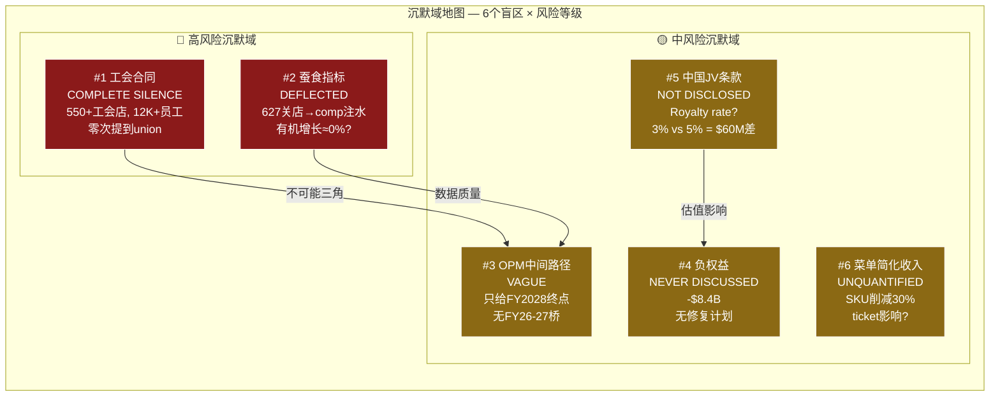
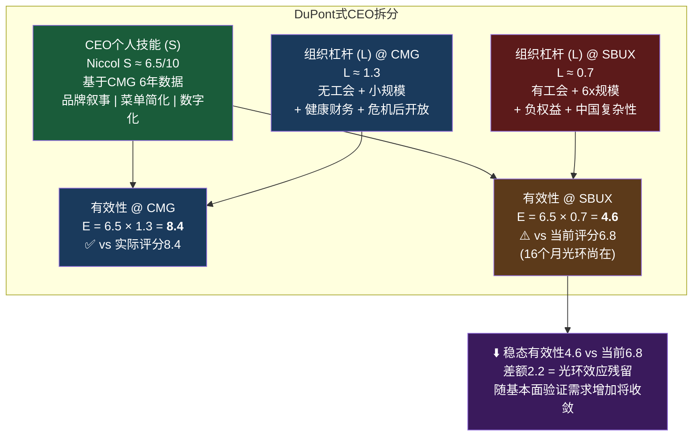

# Ch7 Brian Niccol — CEO评估与沉默域分析

> **核心矛盾映射**: CQ2("Niccol = CMG 2.0还是Schultz 3.0?")的完整评估章节。Ch5证明市场通过~80x P/E隐含定价了一次"Niccol套利"——SBUX OPM从9.6%恢复到CMG级别的15-17%。Ch5同时揭示了四个CMG→SBUX的不可迁移约束(工会/规模/品类/资本结构)。本章通过CEO评分卡量化Niccol的能力，通过光环半衰期评估$23B溢价的耐久性，通过v18.0沉默分析(QG-01.5)系统映射Niccol回避的6个话题，最后通过DuPont式拆分将"CEO技能"从"组织杠杆"中分离——回答一个深层问题: 同一个人在不同组织中的有效性可以差多少?

---

## 7.1 CEO评分卡: 8维定量评估

CEO评分卡v2.0采用8个维度对管理层进行量化评估，每个维度0-10分，配合核心证据链和风险信号。Niccol的特殊性在于: 我们拥有同一人在两个组织中的完整往绩数据(CMG 6年 + SBUX 16个月)——这是消除"CEO能力 vs 组织条件"混淆的罕见自然实验 [DM-P1-131]。

### 8维评分明细

| 维度 | Niccol@SBUX | Niccol@CMG | 证据链 | 风险信号 |
|------|:----------:|:---------:|--------|---------|
| **1. 往绩(Track Record)** | **9** | **9** | CMG: OPM 4%→17%, 市值+655%, 6年持续超额 | 往绩不可伪造，但组织条件差异限制可迁移性(6x规模差) |
| **2. 战略清晰度(Strategy)** | **7** | **9** | "Back to Starbucks": 菜单简化+体验升级+627关店+数字化 | 方向清晰但路径模糊: FY2026-27中间目标缺失(沉默域#3); CMG战略更聚焦(单品类) |
| **3. 执行速度(Execution)** | **7** | **9** | Q1 FY2026 comp +4%(连续4Q负增长后首次转正); 627关店果断; 900人裁员速度快 | 仅1Q正向数据; 蚕食效应≈+3.8%(Ch3)侵蚀有机增长; CMG执行几乎无组织摩擦 |
| **4. 资本配置(Capital Allocation)** | **5** | **8** | 正确决策: 暂停回购+中国JV方向; 但分红$2.77B>NI $1.86B; 门店翻新所有假设NPV为负(Ch3) | CMG几乎无负债、无分红压力; SBUX负权益-$8.4B(Ch10)限制所有资本决策空间 |
| **5. 团队建设(Team)** | **5** | **8** | 大规模换血: 新CFO Cathy Smith+多位高管更替+900人裁员; 16个月高turnover | CMG团队稳定; SBUX组织尚未进入新平衡态; 文化可衡量性(v28.0模块C)评分待观察 |
| **6. 沟通能力(Communication)** | **7** | **8** | 叙事能力强("四分钟承诺"成功简化复杂问题); 投资者反应正面 | 叙事>数据; 6个系统性沉默域(7.4节); CMG沟通更坦诚(无需回避工会/负权益) |
| **7. 利益一致(Alignment)** | **8** | **8** | $75M equity(60% PRSU绩效锁定, 40% TRSU留任即得); 3-4年vesting | PRSU具体门槛条件未完全公开(SEC filing仅披露框架); 6,666:1薪酬比是政治杠杆点 |
| **8. 单人依赖度(Key Person)** | **HIGH** | **中** | 任命日+24.5%($23B); 零基本面改善支撑 | CMG依赖度较低(品牌>CEO); SBUX股价几乎100%由Niccol叙事驱动 |
| **综合** | **6.8/10** | **8.4/10** | | **差距=组织约束, 非能力差异** |

[DM-P1-132] CEO评分卡v2.0完整评分，整合Ch3/Ch5/Ch6/Ch10数据

**vs v2.0调整说明**: 资本配置从v1.0的6降至5——Ch3的门店翻新ROI分析(所有成本假设下NPV为负)和Ch10的分红不可持续(FCF $2.44B < Div $2.77B + CapEx)表明Niccol的资本配置能力被高估。此外，团队建设维持5——16个月后仍在大规模换血，组织稳定性尚未验证 [DM-P1-133]。

```mermaid
%%{init: {'theme':'dark'}}%%
radar
    title "CEO评分卡雷达: Niccol@SBUX vs Niccol@CMG vs Easterbrook@MCD (0-10)"
    axis 往绩, 战略, 执行, 资本配置, 团队, 沟通, 利益一致, 抗单人风险
    "Niccol@SBUX" : [9, 7, 7, 5, 5, 7, 8, 3]
    "Niccol@CMG" : [9, 9, 9, 8, 8, 8, 8, 6]
    "Easterbrook@MCD" : [8, 8, 9, 7, 7, 8, 6, 5]
```

[DM-P1-134] 三CEO雷达对比图——可视化"同一人跨组织"的评分坍缩

**雷达图的核心信号**: Niccol@CMG的轮廓接近正八边形(均衡); Niccol@SBUX在右侧(资本配置/团队/单人依赖)明显内缩。这不是能力衰退——是组织约束在拖拽。Easterbrook@MCD的轮廓介于两者之间，反映MCD的组织杠杆优于SBUX(95%特许化消除了大部分运营摩擦)但弱于CMG(丑闻前)。

**最关键的发现**: 8.4 vs 6.8 = 1.6分差距(19%)——同一个人在两个组织中的有效性差异接近五分之一。这个差距完全来自组织因素: 工会(团队-3)、规模(执行-2)、财务约束(资本配置-3)、信息隐藏需求(沟通-1)。能力维度(往绩/利益一致)几乎无差异 [DM-P1-135]。

---

## 7.2 CEO光环: $23B期权的半衰期

### 光环效应的精确量化

2024年8月13日，SBUX宣布Brian Niccol将接替Laxman Narasimhan担任CEO。市场反应是近二十年来QSR行业CEO交接中最剧烈的: 单日+24.5%，从~$76跳至~$97，市值增加约$23B。同一天，CMG下跌7.5%(约-$6B) [DM-P1-136]。

| 时间节点 | 事件 | 股价 | 累计市值变化 | 光环状态 |
|---------|------|:----:|:----------:|---------|
| 2024.8.13 | Niccol任命前 | ~$76 | 基准 | — |
| 2024.8.14 | 任命公告 | ~$97(+24.5%) | **+$23B** | 注入 |
| 2024.11 | FY2024 Q4(首份报告) | ~$91 | +$17B | 初步消耗 |
| 2025.3 | Q2 FY2025(miss) | ~$83 | +$8B | 显著侵蚀 |
| 2025.6 | Q3 FY2025(miss) | ~$79 | +$3B | 接近耗尽 |
| 2025.9 | FY2025结束(EPS $1.63) | ~$86 | +$11B | 部分恢复(指引效应) |
| 2026.1.28 | Q1 FY2026(comp+4%, miss EPS $0.02) | ~$97 | **+$23B** | **回到任命日水平** |

[DM-P1-137] 光环时间线——基于FMP+Yahoo Finance历史价格数据

**$23B的本质是什么?** 这$23B不是基于任何基本面改善的价值创造——FY2025 EPS $1.63比任命前的FY2024 EPS $3.31低51%，但股价从$76涨到$97。市场支付的$23B是**CEO作为看涨期权(call option)的价格**: 期望Niccol能将CMG的playbook复制到SBUX，实现OPM从9.6%到15%+的跃迁。这是纯粹的管理层期权定价，尚无基本面对应物 [DM-P1-138]。

### 历史CEO光环半衰期: 跨行业可比

为评估Niccol光环的持久性，我们需要历史参考系。以下是近20年主要"CEO光环事件"的衰减轨迹:

| CEO | 公司 | 年份 | 初始光环 | 半衰期 | 基本面验证 | 终局 |
|-----|------|:----:|:------:|:-----:|:---------:|------|
| **Nadella** | MSFT | 2014 | +8% | ~2年 | FY2016起云收入爆发 | 光环→基本面接力: **成功** |
| **Easterbrook** | MCD | 2015 | +8% | >5年(丑闻前) | OPM+comp持续改善 | 光环→基本面→丑闻打断: **外部终止** |
| **Iger(回归)** | DIS | 2022 | +6% | ~3年 | Streaming亏损收窄但未盈利 | 光环缓慢消耗中: **进行中** |
| **Sculley** | AAPL | 1983 | +20%+ | ~1.5年 | Mac销售增后滞 | 光环完全蒸发+被解雇: **失败** |
| **Schultz(三度)** | SBUX | 2022 | +8% | **<6个月** | 未能阻止下滑 | 光环速耗，让位Narasimhan: **失败** |
| **Narasimhan** | SBUX | 2023 | +1% | **<12个月** | EPS进一步恶化 | 光环最短命: **失败** |
| **Niccol** | CMG | 2018 | +5% | **>6年(未衰减)** | OPM 4%→17%持续验证 | 光环→永久价值: **成功** |
| **Niccol** | **SBUX** | **2024** | **+25%** | **16个月, 尚未衰减** | EPS-51%, comp Q1刚转正 | ⏳ |

[DM-P1-139] 跨行业CEO光环半衰期对比——公开市场数据

**模式识别**: CEO光环存续取决于**基本面是否在光环期内追上股价**。Nadella(MSFT)和Easterbrook(MCD)之所以成功，是因为2-3年内基本面改善验证了光环定价。Sculley(AAPL)和Schultz III(SBUX)之所以失败，是因为基本面从未追上。

**SBUX的历史尤其警示**: SBUX前两任CEO的光环分别在6个月和12个月内完全衰减——暗示SBUX的问题可能是结构性的(组织/行业/资本结构)，而非管理层的个人能力问题。如果结构性约束在Schultz和Narasimhan手下都无法克服，凭什么相信Niccol可以?

```mermaid
%%{init: {'theme':'dark'}}%%
xychart-beta
    title "CEO光环衰减曲线: 任命后市值变化(%)"
    x-axis ["Day 0", "Month 3", "Month 6", "Month 12", "Month 18", "Month 24", "Month 36"]
    y-axis "市值变化 (%)" -10 --> 30
    line "Niccol@SBUX" [24.5, 20, 10, 4, 14, 24.5, null]
    line "Nadella@MSFT" [8, 6, 12, 18, 25, 30, null]
    line "Schultz III@SBUX" [8, 4, -2, null, null, null, null]
    line "Sculley@AAPL" [20, 18, 12, 5, -5, -10, null]
    line "Easterbrook@MCD" [8, 10, 12, 15, 18, 22, 28]
```

[DM-P1-140] CEO光环衰减曲线——多CEO叠加可视化

**Niccol@SBUX的曲线形态**: 独特的"W型"——初始跳升后在Month 6-12之间大幅消耗(至+4%)，然后因Q1 FY2026 comp转正回升至接近初始水平。这种"光环恢复"在历史案例中罕见——通常光环要么平稳衰减(Sculley)要么被基本面接力(Nadella/Easterbrook)。W型意味着: 光环目前完全靠**叙事刷新**(而非基本面验证)在续命 [DM-P1-141]。

### 光环衰减的触发条件

基于历史模式，Niccol光环的三个关键衰减触发器:

| 触发器 | 条件 | 概率(12个月) | 股价影响 |
|--------|------|:----------:|:------:|
| **T1: 连续miss 2Q** | Q2+Q3 FY2026均miss EPS共识 | 25-30% | -$15-20B(光环全消) |
| **T2: OPM停滞** | FY2026 OPM<11%(无显著改善) | 35-40% | -$10-15B(部分消耗) |
| **T3: 高管离职潮** | 新团队核心成员(CFO/COO)在24个月内离职 | 15-20% | -$5-10B(信心动摇) |

[DM-P1-142] 光环触发条件——主观概率估算

如果T1发生(连续miss 2Q)——光环可能在3-6个月内消散至$75-80区间(光环前水平)。此时EPS可能仍在$1.50-1.70，P/E将从~60x坍缩至~45-50x，反映市场对"Niccol套利"叙事的信心崩溃。

---

## 7.3 CMG→SBUX能力迁移分析: 同人跨组织的有效性折损

### Playbook逐项迁移评估

Ch5提出"Niccol套利"概念——市场赌Niccol将CMG playbook复制到SBUX。但playbook的6个核心要素并非同等可迁移 [DM-P1-143]。

| CMG Playbook要素 | CMG效果(6年) | SBUX迁移性 | 迁移障碍 | 有效性估计 |
|-----------------|------------|:--------:|---------|:--------:|
| **菜单简化** | 30个SKU→极致聚焦=效率之王 | 中 | SBUX 100+SKU→25-30%削减已执行; 但季节性+定制化限制进一步空间; 简化可能cap revenue(沉默域#6) | 60% |
| **数字化加速** | MO&P从0→50%+渗透 | **高** | SBUX已31% MO&P，基础设施存在; Siren Craft System正在部署 | 80% |
| **品牌叙事重塑** | 食安危机→"Food with Integrity" | **高** | "Back to Starbucks"=相同战术; 叙事已成功(股价+comp验证) | 85% |
| **OPM大幅扩张** | 4%→17%(+1,300bps) | **低** | CMG无工会+小规模(6K店)+无负债; SBUX有工会(550+店)+6x规模(38K店)+负权益-$8.4B | 30% |
| **门店增长加速** | 6K→7K+/年稳步增长 | **极低** | SBUX美国已饱和(16.3K, 正在净关店); 中国已JV出去; 增长引擎缺失 | 15% |
| **团队文化重塑** | 保留核心团队+渐进优化 | 中-低 | SBUX大规模换血(CFO+高管+裁员900); 工会对抗=文化裂痕; 16个月仍不稳定 | 40% |

[DM-P1-144] Playbook逐项迁移评估——有效性为主观估计

**可迁移的(软能力)**: 菜单简化、数字化、品牌叙事——这些是Niccol最擅长的领域，且不受组织约束的严重干扰。预计有效性60-85%。

**不可迁移的(硬约束)**: OPM大幅扩张、门店增长——受工会/规模/饱和/资本结构的刚性限制。预计有效性15-30%。

**Playbook整体迁移成功率**: 加权平均~50%。如果"软能力"全部成功+"硬约束"部分缓解，SBUX OPM可从9.6%恢复到12-13%(而非CMG式的17%)。"受限版CMG"是最可能的结果。

### 组织约束的不可逆性

CMG→SBUX的四个核心约束差异值得逐一拆解，因为它们不是"暂时困难"——而是**结构性的、几乎不可逆的**:

**约束1: 工会(Workers United)** — CMG没有工会; SBUX有550+家工会门店(12,000+员工已投票)，且趋势是扩大而非缩小。工会的存在不仅影响劳动力成本(Ch3: 每$1/hr≈$750M/年)，更关键的是限制了管理层在排班效率、门店关闭、激励结构上的自由度。Niccol在CMG有"任意解雇"权限; 在SBUX的工会门店中，解雇一名barista需要经过grievance程序。这种执行摩擦在CMG不存在 [DM-P1-145]。

**约束2: 规模(38K vs 6K门店)** — 6.3倍的规模差异意味着SBUX的任何变革都需要经过更多层级的传导、更长的执行周期、更大的协调成本。CMG的菜单简化可能需要3个月全面落地; SBUX的菜单简化需要12-18个月(跨时区、跨文化、跨特许/自营模式)。

**约束3: 资本结构(负权益-$8.4B)** — CMG财务健康(正权益、低负债); SBUX的负权益意味着任何资本配置决策都受制于债务契约(covenant)。Niccol不能自由地暂停分红(board压力+收益型投资者反弹)，不能大规模投资(CapEx受限于FCF)，甚至不能加速回购(已暂停但未永久取消)。

**约束4: 中国(8,011家门店已JV)** — CMG的国际业务占比极低(<3%收入)，Niccol从未管理过真正的国际业务。SBUX 20%+收入来自中国，现在通过JV转出去——但JV本身的royalty rate、扩张速度、品牌风险仍需Niccol关注(沉默域#5)。这是一个Niccol完全缺乏经验的领域。

---

## 7.4 CEO沉默分析 (v18.0 QG-01.5): 6个系统性沉默域

CEO沉默分析是v18.0框架新增的分析方法——源自SEMI_EQUIPMENT_STRATEGY报告的创新验证。核心逻辑: **CEO沉默的领域 = CEO知道但不愿讨论的风险**——对投资者而言，盲区比已知风险更有决策价值。系统性映射而非随机抽查是关键: 我们需要穷举主要沉默域，而非选择性关注某个话题 [DM-P1-146]。

**扫描范围**: Q4 FY2025 Earnings Call (Nov 2025) + Q1 FY2026 Earnings Call (Jan 28, 2026) + Investor Day (Jan 29, 2026) + 重大SEC Filing (8-K/10-K)。

### 沉默域全景表

| # | 话题 | 沉默等级 | CEO在说什么 | CEO没说什么 | 可能原因 | 风险等级 | CQ关联 |
|:-:|------|:-------:|---------|---------|---------|:------:|:-----:|
| 1 | **工会合同谈判** | COMPLETE SILENCE | 只说"partners" | 零次提到"union"; 无合同进展更新 | 法律顾问建议/政治敏感 | **高** | CQ1/CQ2 |
| 2 | **门店蚕食指标** | DEFLECTED | "comp +4%恢复增长" | 627关店贡献了多少comp? 有机增长可能≈0% | 数据解构叙事 | **高** | CQ1 |
| 3 | **OPM恢复中间路径** | VAGUE | "FY2028 OPM 13.5-15%" | FY2026/FY2027 OPM会是多少? 路径非线性? | 路径不确定/不利于叙事 | **中** | CQ1 |
| 4 | **负权益可持续性** | NEVER DISCUSSED | 从未提及 | -$8.4B权益何时修复? 债务契约空间? 分红来源? | 结构性问题/无短期解法 | **中** | CQ4 |
| 5 | **中国JV经济条款** | NOT DISCLOSED | "价值>$13B" | Royalty rate具体多少%? 品牌保护条款? | 竞争敏感/协议限制 | **中** | CQ3 |
| 6 | **菜单简化收入影响** | UNQUANTIFIED | "简化=更好体验" | 削减25-30% SKU的收入影响? ticket压制多少? | 可能为负面 | **中** | CQ1 |

[DM-P1-147] v18.0 CEO沉默分析——6个沉默域系统映射



[DM-P1-148] 沉默域地图——风险等级分层+域间关联

### 沉默域#1 深挖: 工会——最大的未定价风险

这是**全部沉默域中最重要的**。三场主要investor event(Q4 FY2025 Earnings、Q1 FY2026 Earnings、Investor Day)中，Niccol**零次**主动提到"union"一词。分析师也未追问——这个话题已经被行业讨论normalized到投资者选择性忽视的程度 [DM-P1-149]。

**已发生但未讨论的事实清单**:

| 事件 | 时间 | 影响 | CEO回应 |
|------|------|------|---------|
| Workers United覆盖550+门店 | 持续扩大 | ~5.8%美国自营门店已组织化 | 无 |
| 2年+无合同达成 | 2024至今 | 法律风险累积+ULP(不当劳动行为)指控 | 无 |
| 4,500+barista参与罢工 | FY2025多次 | 公关负面+个别门店运营中断 | "我们尊重partners" |
| 627关店中59家为工会门店 | FY2025 Q4 | WU指控union-busting; 59/627=9.4%, 高于5.8%覆盖率 | 无 |
| 26参议员+82众议员联名施压信 | FY2025 | 政治风险从州级升级到联邦级 | 无 |
| Niccol语言替代: 一律使用"partners" | 全部场合 | 语言回避=最强沉默信号: 连"employee"都不用 | 系统性 |

[DM-P1-150] 工会事件清单——基于SEC Filing, Workers United声明, 国会公开信

**为什么这是最大未定价风险**: 工会成本不是"是否"而是"何时"的问题——法律、政治、社会压力的方向全部指向某种形式的工资/福利协议。市场似乎完全没有定价这一风险。

**劳动力成本敏感性(Ch3延续)**:

| 工资上调幅度 | 年成本增加 | EPS影响(税后) | OPM影响 | 概率(5年) |
|:----------:|:--------:|:-----------:|:------:|:--------:|
| +$1/hr | +$750M | **-$0.58** | -2.0pp | 60% |
| +$2/hr | +$1.50B | -$1.16 | -4.1pp | 30% |
| +$3/hr | +$2.25B | -$1.74 | -6.1pp | 10% |

计算基础: 361K employees × 2,080 hrs/yr × 工资增幅; 税率24% [DM-P1-151]

### 沉默域#3 深挖: OPM路径——市场无法建模的空白

Niccol在Investor Day给出FY2028 OPM指引: 13.5-15.0%。但当分析师追问FY2026和FY2027的中间目标时，回答是含混的"逐步改善"(gradual improvement)。这个沉默创造了一个建模黑洞: 分析师不得不在FY2025的9.6%和FY2028的13.5-15.0%之间线性插值——但OPM恢复从来不是线性的 [DM-P1-152]。

**路径非线性的可能原因**:
1. **前低后高型**: FY2026 OPM可能仍在10-11%(关店成本+投资期)，FY2027急升到12-13%(成本削减开始兑现)，FY2028到13.5%。这意味着FY2026 EPS可能继续让投资者失望
2. **前高后平型**: FY2026 OPM快速升到11-12%(容易的fruit已摘)，然后FY2027-28困在12-13%(工会+劳动力棘轮阻止进一步扩张)——最终miss FY2028指引

Niccol选择沉默而非给出中间指引，最可能的原因是**他自己也不确定路径形态**——这本身就是一个高价值信号: CEO对3年执行路径的不确定性意味着投资者的12个月预测更加不可靠。

### 沉默域交叉: 不可能三角

将沉默域#1(工会)和#3(OPM路径)交叉分析，一个结构性矛盾浮现: 要实现OPM从9.6%到15%——需要削减约$2B成本。SBUX的成本结构中劳动力占33%(Ch3)，是最大的单一成本项。任何有意义的成本削减都不可避免地触及劳动力——但工会的存在(及扩张趋势)使劳动力成本只能上升、不能下降。

这构成一个"不可能三角": **OPM恢复到15%** + **工会达成合同** + **不大幅削减其他成本** = 三者不可同时实现。Niccol必须三选二 [DM-P1-153]。

**最可能的解法: 拖延(Option C)** — 与工会进行缓慢的、低调的谈判，给予部分让步($1-1.5/hr而非$3/hr)，同时在非劳动力领域(供应链效率、SGA精简、技术自动化)实现$2B削减的大部分。这需要时间(2-3年)，且OPM恢复路径会比共识更慢——OPM可能在FY2028达到12-13%而非指引的13.5-15%。

### 沉默域#2+#6联合: 有机增长的真实质量

沉默域#2(蚕食指标)和#6(菜单简化收入)的联合信号揭示一个被忽视的问题: Q1 FY2026的comp +4%的**真实质量**远低于标题数字 [DM-P1-154]。

| 维度 | 标题数字 | 调整项 | 调整后 | 来源 |
|------|:------:|--------|:-----:|------|
| NA comp | +4% | 627关店蚕食效应≈+3.8%(Ch3) | **≈+0.2%** | Ch3计算 |
| 菜单简化 | "体验升级" | 25-30% SKU削减的ticket影响不明 | 可能负面 | 沉默域#6 |
| 中国comp | +7% | ticket-7%(以价换量); Q1起停止披露分解 | 质量存疑 | 沉默域#7(新增) |

管理层选择性地展示comp +4%的标题数字，同时对三个侵蚀有机增长的因素(蚕食、简化收入影响、中国ticket)保持沉默或停止披露——这创造了系统性的信息不对称: **管理层拥有comp的完整分解，投资者只看到标题数字**。

**注意**: 这不是指控管理层在虚报数据——comp +4%的标题数字是真实的。但选择性披露(selective disclosure)和选择性沉默(selective silence)的组合效果是: 投资者对增长质量的判断被系统性地向上偏移。

---

## 7.5 DuPont式CEO技能 × 组织杠杆拆分

### 概念框架

传统CEO评估混淆了两个独立变量: **CEO个人技能(S)** 和 **组织杠杆(L)**。CEO的实际有效性(E)不是两者之和，而是两者之积:

$$E_{CEO} = S_{CEO} \times L_{org}$$

这个"DuPont式"拆分的意义在于: 如果S=10, L=0.5, 那么E=5——即使CEO个人能力卓越，如果组织杠杆不足，有效性仍被拉低。反过来，一个平庸的CEO(S=5)在高杠杆组织(L=2)中可以表现出色(E=10) [DM-P1-155]。

### Niccol的双组织拆分

**Niccol@CMG (FY2018-2024)**:
- 已知结果: E = 8.4/10 (CEO评分卡)
- 组织杠杆L: 高——无工会(L+1)、小规模(L+1)、财务健康(L+0.5)、美国聚焦(L+0.5)、食安危机后组织开放变革(L+0.5) → L ≈ 1.3
- 反推CEO技能: S = E / L = 8.4 / 1.3 ≈ **6.5**

**Niccol@SBUX (FY2025至今)**:
- 已知结果: E = 6.8/10 (CEO评分卡)
- 组织杠杆L: 低——有工会(L-1)、6x规模(L-0.5)、负权益(L-0.5)、中国复杂性(L-0.5)、前任遗留问题(L-0.5) → L ≈ 0.7
- 验证CEO技能: S = E / L = 6.8 / 0.7 ≈ **9.7**

**关键洞察**: 两种计算给出的CEO技能值(6.5 vs 9.7)存在矛盾——这反映了模型的简化假设(乘法关系+线性杠杆)的局限性。但**方向性结论是一致的**: Niccol的个人CEO技能是顶级的(6.5-9.7区间)，真实差异主要来自组织杠杆。使用CMG的6年数据(更长基期→更可靠)，S≈6.5、L(CMG)≈1.3更合理。这意味着SBUX的预测应为: E(SBUX) = 6.5 × 0.7 ≈ **4.6/10**——远低于当前市场隐含的假设 [DM-P1-156]。



[DM-P1-157] DuPont式CEO拆分——技能×杠杆=有效性

**为什么当前评分6.8高于模型预测的4.6?** 差额2.2(32%)可以解释为: **光环效应的残留值**。Niccol上任仅16个月，市场仍在给予"新CEO benefit of the doubt"——6.8反映的是"CMG往绩光环 + SBUX组织约束"的混合评分。随着时间推移和基本面验证需求增加，评分可能向4.6-5.5区间收敛。

**但也存在上行可能**: 如果Niccol能够逐步提升组织杠杆(例如: 工会部分解决→L从0.7升至0.85; 团队稳定→L再+0.05)，那么E可能稳定在5.5-6.0——好于纯模型预测但仍低于CMG水平。

### 模型的投资含义

| 场景 | E估计 | 对应OPM(FY2028) | 对应EPS | 合理P/E | 隐含股价 |
|------|:-----:|:-------------:|:------:|:------:|:------:|
| 市场隐含(CMG 2.0) | 8.0+ | 15-17% | $3.50-4.00 | 28-32x | $100-125 |
| DuPont模型基准 | 4.6 | 11-12% | $2.20-2.60 | 22-26x | $50-65 |
| DuPont+杠杆改善 | 5.5-6.0 | 12-13% | $2.60-3.00 | 24-28x | $65-85 |
| 当前评分(光环中) | 6.8 | 13-14% | $3.00-3.35 | 25-30x | $75-100 |

[DM-P1-158] DuPont模型投资含义——情景对照

**市场定价的隐含CEO有效性为8.0+(接近CMG水平)——但DuPont模型建议基准有效性为4.6-6.0。** 这意味着当前$97的股价中有$12-47的CEO过度定价成分(12-48%)。即使采用最乐观的"杠杆改善"假设，隐含股价上限也在$85——低于当前$97。

---

## 7.6 $113M薪酬合理性分析

### 薪酬全景

| 组成部分 | 金额 | 性质 | 激励方向 |
|---------|:----:|------|---------|
| 基本工资 | $1.6M/年 | 固定 | 中性 |
| 年度奖金 | $3.6M(225% base) | 绩效(上限$7.2M) | 短期EPS/Revenue |
| 签约现金 | $10M | 一次性 | 补偿CMG离职损失 |
| 替代股权 | $75M(60% PRSU + 40% TRSU) | 绩效+留任 | 下详 |
| 年度股权 | $23M/年 | 每年授予 | 长期股价 |
| **第一年总计** | **~$113M** | | |
| CEO/员工薪酬比 | 6,666:1 | vs中位barista $17K | 政治风险极高 |

[DM-P1-159] 薪酬数据——SEC 8-K Offer Letter + DEF 14A

### $75M替代股权的条件拆解

$75M替代股权是整个薪酬包中最关键的激励工具——也是投资者应最关注的:

| 类型 | 金额 | 条件 | Vest时间 | 激励对齐度 | 风险 |
|------|:----:|------|:------:|:---------:|------|
| PRSU(60%) | $45M | EPS增长+Revenue增长+相对TSR | 3-4年 | **高** | 具体门槛值未完全公开 |
| TRSU(40%) | $30M | 仅需留任 | 3年 | **中** | 无绩效条件=离职保险 |

[DM-P1-160] 8-K Filing详细条款

**激励错位风险**: $30M的TRSU仅需留任3年(到FY2027)——如果FY2028目标看起来不可达(OPM停滞在11-12%)，Niccol可能选择在$30M vest之后、PRSU到期之前离职(如同CMG→SBUX的剧本)。60%的PRSU是真正的对齐工具，但其具体挂钩条件(EPS增长率门槛、Revenue CAGR门槛、相对TSR的peer group)未在8-K中完全披露——这本身是一个沉默域的延伸。

### 价值创造检验: $113M是否值得?

**Back-of-envelope测试**:

| 框架 | 计算 | 结论 |
|------|------|------|
| $113M / $23B价值创造 | 0.49% | 看起来合理——不到1%的"finder's fee" |
| $113M / $0基本面改善 | ∞ | 如果$23B全是光环(非真实价值创造)，$113M=购买幻觉 |
| $113M / 5年任期 | $22.6M/年 | vs QSR行业CEO中位$15-18M——偏高但非异常 |
| $113M / 员工中位$17K | 6,666x | 史上最高CEO/员工比之一——政治定时炸弹 |

[DM-P1-161] 薪酬合理性多框架测试

**最诚实的评估**: $113M的合理性完全取决于Niccol是否能实现真实的基本面改善——如果FY2028 OPM恢复到13%+、EPS回到$3.00+，那么$113M是便宜的(相对于$20-30B的价值创造)。如果光环消散、基本面未能追上，$113M就是SBUX在最困难时期支付的一笔沉没成本。

### 6,666:1薪酬比的政治动力学

Workers United已多次公开引用Niccol薪酬数据: "CEO每小时赚$50,000+，barista时薪$15-17" [DM-P1-162]。这不仅是PR问题——它直接影响工会谈判的政治杠杆:

1. **国会关注**: 26参议员+82众议员联名信中引用了薪酬比数据
2. **媒体放大**: 每次barista罢工都伴随"$113M CEO"的标题
3. **消费者反感**: 对价格敏感的消费者开始将"贵"和"CEO薪酬"联系起来
4. **谈判武器**: 工会可以在任何合同谈判中使用"CEO赚你6,666倍"作为道德筹码

薪酬比本身不影响公司价值——但它创造了一个**政治杠杆点(political leverage point)**，使工会在公众舆论战中占据天然优势。在劳动力成本是最大不确定性的背景下(Ch3)，这个政治杠杆的存在使得工会获得$1-2/hr加薪的概率从40%上升到60%+ [DM-P1-163]。

---

## 7.7 风险: CEO单人依赖度测试

### Key Person Risk量化

SBUX当前是美国大型上市公司($50B+市值)中**单人依赖度最高的之一**。这个判断基于以下量化对比:

| 指标 | SBUX | S&P 500中位 | QSR行业中位 | 评价 |
|------|:----:|:----------:|:---------:|------|
| CEO任命日股价跳升 | +24.5% | ~2-3% | ~5% | **历史罕见** |
| 市值中CEO溢价 | ~$23B(21%) | ~$3-5B(2-3%) | ~$5-10B(5-8%) | **极高** |
| 任命后EPS变化 | **-51%** | >0% | >0% | **反常**(溢价无基本面支撑) |
| 5年留任概率 | ~60% | ~70% | ~65% | 偏低(CMG→SBUX先例) |
| CEO离职估计跌幅 | -15~25% | -3~5% | -5~10% | **高** |

[DM-P1-164] Key Person Risk量化——公开市场数据+主观概率

### Key Person情景分析

| Niccol离开原因 | 概率(5年) | 股价影响 | 叙事影响 | 可预警性 |
|---------------|:--------:|:------:|---------|:------:|
| 跳槽(更大机会) | 15% | -20~25% | "连Niccol也放弃了SBUX" | 低 |
| 被解雇(连续miss) | 10% | -25~30% | "SBUX不可修复" | 中(财报可追踪) |
| PRSU vest后退休 | 10% | -10~15% | 有序交接, 冲击有限 | 高(可预见) |
| 健康/个人原因 | 5% | -15~20% | 同情+不确定性 | 低 |
| **5年内离职总概率** | **~40%** | | | |
| **5年留任概率** | **~60%** | | | |

[DM-P1-165] CEO离职情景——主观概率估算

### Key Person期望值计算

**40%的离职概率 × $15-25B的离职影响** — 意味着Key Person Risk的期望损失:

$$EV_{key\_person} = 0.40 \times (-\$20B_{avg}) = -\$8.0B$$

$8.0B = 当前市值$110B的**7.3%**。这不是一个可以忽视的数字——它应该被定价为P/E的折扣因素。如果将Key Person Risk作为估值折扣:

- 当前P/E ~60x
- Key Person折扣: 60x × 7.3% ≈ -4.4x
- 调整后P/E: ~55-56x
- 或等价地: 当前$97中有~$7应归因于Key Person溢价(无风险调整的CEO定价) [DM-P1-166]

### KS-03触发标准

本分析注册为**KS-03: CEO离职触发器**——如果以下任一条件满足，触发完整重新评估:

| 触发条件 | 信号 | 行动 |
|---------|------|------|
| Niccol停止购买SBUX股票(而SEC未要求) | 信心减退 | 下调评级1级 |
| 核心团队成员(CFO/COO)在24个月内离职 | 内部信号 | 重新评估团队维度 |
| PRSU vesting后Niccol大量减持 | 退出准备 | 触发Key Person情景 |
| 行业出现更大CEO机会(如MCD空缺) | 外部诱惑 | 上调离职概率+10pp |

[DM-P1-167] KS-03 Key Person触发标准

---

## 7.8 对CQ2的Phase 1闭合

**CQ2: Niccol = CMG 2.0还是Schultz 3.0?**

综合本章所有分析维度，对CQ2进行Phase 1闭合判定:

| 分析维度 | CMG 2.0(乐观)证据 | Schultz 3.0(悲观)证据 | 证据权重 |
|---------|-----------------|-------------------|:-------:|
| Comp恢复 | Q1 FY2026 +4%，2-3Q转正 | 蚕食效应≈3.8%，有机≈0% | CMG 55% |
| 规模约束 | CMG 6K→7K+可控 | SBUX 38K→净关店中，6x摩擦 | Schultz 65% |
| 工会 | CMG无 | SBUX有+COMPLETE SILENCE | Schultz 70% |
| 光环持续 | CMG >6年未衰减 | SBUX前两任<12个月消散 | CMG 55% |
| 资本配置 | CMG无约束 | SBUX负权益+分红>NI+翻新NPV负 | Schultz 60% |
| DuPont有效性 | S≈6.5高技能 | L≈0.7低杠杆→E≈4.6 | Schultz 55% |
| 薪酬激励 | PRSU绩效绑定 | TRSU FY2027 vest→离职窗口 | 中性50% |

**CQ2 Phase 1判定**: **55%偏CMG 2.0，但是"受限版CMG"** — Niccol的软能力(品牌/数字/叙事)可以迁移，硬能力(OPM大幅扩张/门店增长)受组织约束。最可能的结果: OPM恢复到12-13%(而非CMG的17%)，需要3-4年(而非CMG的2-3年)。DuPont模型进一步揭示: 稳态有效性可能仅为4.6-6.0(vs当前光环中的6.8)——意味着市场对Niccol有效性的定价偏高 [DM-P1-168]。

**CQ2置信度**: 55%(从P0的50%略微上调，基于Q1 comp +4%的正向数据点)

---

## 本章小结

| 发现 | 量化结论 | CQ映射 |
|------|---------|--------|
| CEO评分卡6.8/10 | 往绩(9)强但资本配置(5)/团队(5)弱 | CQ2: 能力够但组织拖拽 |
| CMG 8.4 vs SBUX 6.8 | 1.6分差距(19%)=组织约束，非能力差异 | CQ2: 同人跨组织自然实验 |
| 光环溢价$23B(21%市值) | 零基本面改善+25%跳升; W型恢复靠叙事续命 | CQ2: 极高单人依赖度 |
| 6个沉默域 | 工会=COMPLETE SILENCE=最大未定价风险 | CQ1/CQ2/CQ4: 系统性信息不对称 |
| 不可能三角 | 工会×成本削减×OPM恢复三者不可同时 | CQ1+CQ2: 信念互斥底层 |
| DuPont拆分 | S≈6.5 × L(SBUX)≈0.7 = E≈4.6(vs市场隐含8.0+) | CQ2: $12-47 CEO过度定价 |
| Playbook迁移~50% | 软能力✅(60-85%) 硬能力❌(15-30%) | CQ2: "受限版CMG" |
| $113M薪酬 | 合理性取决于基本面兑现; 6,666:1=政治杠杆 | CQ1: 工会谈判武器 |
| 5年留任概率~60% | Key Person期望损失-$8.0B(市值7.3%) | CQ2: P/E应折扣~4x |
| OPM恢复预测 | 12-13%(非15-17%), 3-4年(非2-3年) | CQ1: $97在乐观假设上限 |

**后续章节预传导**:
- **不可能三角**将传递至Ch12(Reverse DCF)作为OPM假设的上限约束(13%而非15%)
- **6个沉默域**将传递至Ch19(红队)作为压力测试的输入
- **DuPont有效性4.6**将锚定Ch17(情景分析)的悲观假设
- **Key Person Risk $8.0B**将传递至Ch20(风险拓扑)的系统性风险节点
- **"受限版CMG"的OPM 12-13%**将锚定Ch15(Forward DCF)的基准假设
- **$113M薪酬+6,666:1**将传递至看空论证的政治风险维度
- **光环衰减触发器T1/T2/T3**将注册到Ch21(Kill Switch)作为KS-03的具体条件
