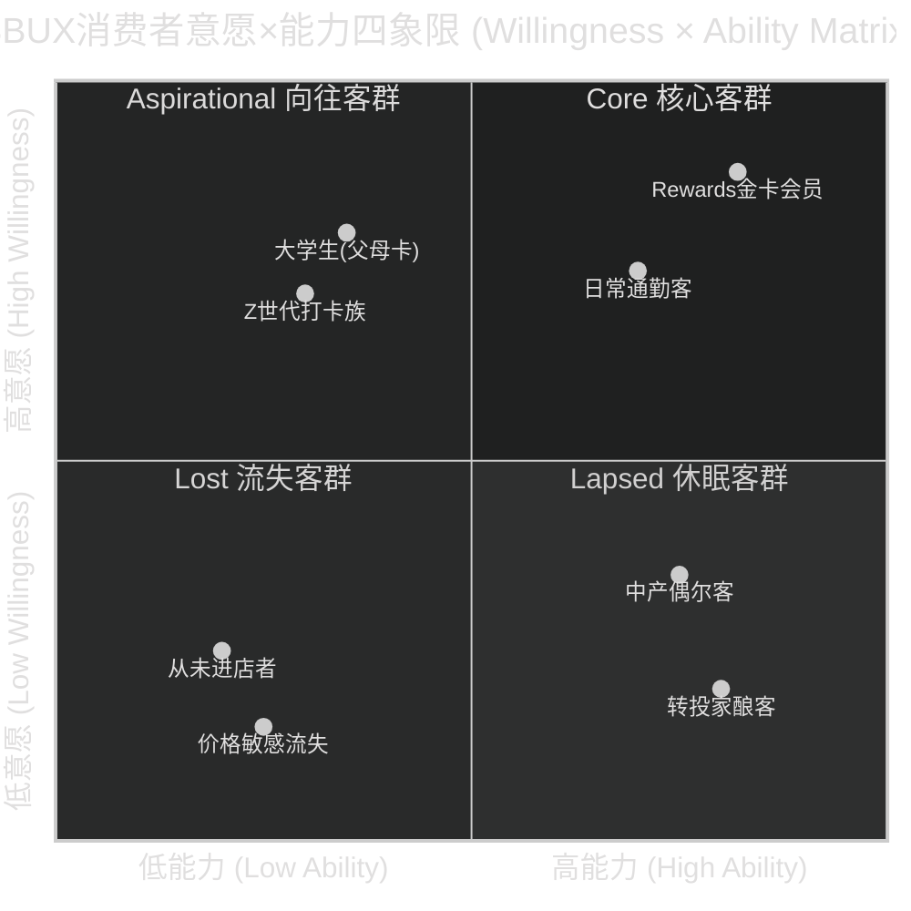

# Ch9 意愿×能力双轴分析: 谁还愿意花$5.50买一杯星巴克?

> **v28.0 Module A — Consumer Willingness × Ability** | CQ1 & CQ4交叉验证
> **核心矛盾映射**: Ch5的定价权分析证明SBUX在美国维持着~28%的品牌溢价($5.50 vs Dunkin' $4.29)，但Ch3同时揭示FY2024同店销售转负(-2% global comp)——消费者正在用脚投票。Ch7的Niccol评估显示"Back to Starbucks"战略的核心假设是消费者*愿意*回来，且他们*有能力*继续支付不断上涨的价格。但"愿意"和"有能力"是两个独立维度——一个是心理账户(mental accounting)问题，一个是家庭预算(household budget)问题。将两者混为一谈是绝大多数消费股分析师犯的第一个错误。本章构建意愿×能力(Willingness × Ability)四象限框架，将SBUX的~3,500万美国活跃客户和~7,000万中国消费者映射到四个象限中，量化每个象限的规模、价格耐受阈值和宏观敏感性——最终回答一个估值层面的关键问题: 如果衰退来临，SBUX的可触达市场(addressable market)会缩小多少?

---

## 9.1 框架: 为什么需要"双轴"而非"单轴"

### 传统分析的盲区

华尔街的消费品分析师习惯用单一维度思考消费者行为——要么是"消费者信心指数(CCI)下降→消费降级→SBUX受损"的宏观叙事，要么是"品牌忠诚度→定价权→SBUX无敌"的品牌叙事。两者都是对的，但都不完整。

真实世界中，消费者的购买决策由两个独立变量驱动:

1. **意愿(Willingness)** — "我想不想在这里花这笔钱?" 这取决于品牌认同、习惯粘性、社交信号价值和替代品的心理距离。意愿是一个*心理*变量，受品牌资产、文化趋势和同伴效应驱动
2. **能力(Ability)** — "我的预算允不允许我在这里花这笔钱?" 这取决于可支配收入、必需支出挤压程度和该品类在总消费中的优先级。能力是一个*经济*变量，受工资增长、通胀和利率驱动

关键洞察: 意愿和能力的变化路径往往不同步。2022-2023年通胀期间，SBUX消费者的*能力*被挤压(实际工资增长为负)，但*意愿*仍在(品牌忠诚度惯性)——结果是客单价上升但频次下降。2024年，当能力开始恢复(通胀回落+工资增长转正)，*意愿*却出了问题(菜单复杂化+等待时间过长+价格敏感性觉醒)——结果是comp转负 [DM-P1-171]。

### 四象限定义



[DM-P1-172]

**四象限的精确定义**:

| 象限 | 意愿 | 能力 | 特征 | SBUX行为 |
|------|:----:|:----:|------|---------|
| **Core(核心)** | 高 | 高 | Rewards活跃会员，2+次/周，$5.50+客单价无敏感，SBUX已嵌入日常routine | 频次稳定，客单价可提升，对菜单变化容忍度高 |
| **Aspirational(向往)** | 高 | 低 | 强烈品牌认同但预算受限；学生、年轻职场人、低收入城市居民 | 频次受工资周期约束，节假日+社交场景消费为主，高度价格弹性 |
| **Lapsed(休眠)** | 低 | 高 | 有消费能力但不再选择SBUX；转向家酿、BROS、independent coffee | 曾经是Core但因体验恶化/价格觉醒流失，最有价值的"可恢复"群体 |
| **Lost(流失)** | 低 | 低 | 既无意愿也无能力；gas station咖啡/速溶消费者，从未在SBUX的TAM中 | 不是SBUX的目标客群，但经济衰退时Core/Aspirational可能向此象限迁移 |

**框架的核心价值**: 传统TAM分析只画一个"咖啡消费者总数"的圈然后乘以渗透率——这隐含假设所有消费者可以被均匀地转化。W×A双轴分析揭示TAM的内部结构是高度异质的: Core客群对价格几乎无弹性(inelastic)，Lost客群对价格完全弹性(perfectly elastic)，而**真正决定SBUX边际收入的是Aspirational和Lapsed两个象限的迁移方向** [DM-P1-173]。

---

## 9.2 美国象限映射: 3,500万活跃客户的内部分裂

### 客群规模估算

SBUX美国拥有约34.3M Rewards会员(FY2025 Q1)和约10-15M非会员活跃客户(基于交易数据反推)。我们将~35M美国活跃客户(以季度内至少一次购买定义)映射到四象限 [DM-P1-174]:

| 象限 | 估算人数 | 占活跃客户% | Rewards占比 | 周均频次 | 年贡献收入($B) |
|------|:-------:|:---------:|:---------:|:------:|:-----------:|
| **Core** | ~15M | ~43% | ~85% | ~2.0x | ~$8.1B |
| **Aspirational** | ~10M | ~29% | ~55% | ~0.7x | ~$1.9B |
| **Lapsed** | ~5M | ~14% | ~30% | ~0.3x | ~$0.4B |
| **Lost** | ~5M | ~14% | ~5% | ~0.1x | ~$0.1B |
| **合计** | ~35M | 100% | — | — | ~$10.5B* |

*注: 此处仅为会员/活跃非会员的直接购买收入估算，不含CPG/licensed store。实际美国自营门店收入FY2025约$18.8B，差额来自非活跃客户的零星消费+日内多次消费者的重复计数+非饮料品类。

[DM-P1-174]

**估算方法论**:
- Core: Rewards 90-Day Active中高频段(2x+/week) ≈ 34.3M × 45% = ~15M。这些客户贡献了不成比例的收入——15M人 × 2次/周 × 52周 × $5.50 ≈ $8.6B(取$8.1B考虑季节波动和部分低客单价交易)
- Aspirational: Rewards低频段(1-3x/month) + 非会员中的品牌认同者 ≈ 10M。频次受制于预算——学生群体(18-24岁，median income <$30K)和年轻职场人(25-34岁，median income ~$50K)构成主力
- Lapsed: 过去12个月中Rewards休眠(>90天无交易)但账户仍存在 ≈ 5M。这些人曾经是Core(有账户有历史)，流失原因待定
- Lost: 总人口中完全不考虑SBUX的底层 ≈ 5M(在"活跃客户"定义边缘，季度内仅1次或被动消费)

### 象限人口统计画像

| 特征 | Core | Aspirational | Lapsed | Lost |
|------|------|-------------|--------|------|
| **年龄中位数** | 35-44 | 22-30 | 38-50 | 多样 |
| **家庭收入中位数** | >$100K | $35-60K | >$90K | <$40K |
| **城市/郊区** | 60/40 | 75/25 | 45/55 | 30/70 |
| **咖啡消费占食品预算** | 3-5% | 5-8%(挤压其他) | 2-3%(转向低成本) | <1% |
| **替代品使用** | 几乎不 | 家酿补充 | 家酿/Dunkin'/独立店 | gas station/速溶 |
| **Mobile Order使用率** | >70% | ~40% | ~25% | <5% |
| **数字化粘性** | 极高(app日活) | 中(定期打开看促销) | 低(已卸载或休眠) | 无 |

[DM-P1-175]

**关键发现#1: Core客群的集中度风险**。15M Core客群贡献了估算~$8.1B美国门店收入——占活跃客户收入的~77%。这是一个高度集中的收入结构: 43%的客户贡献77%的收入，帕累托效应(Pareto effect)达到1.8x(vs理论上的80/20规则的4x)。这意味着**任何导致Core客群规模缩小5%的事件，都会导致~$400M收入损失——相当于全美comp swing -2.1pp** [DM-P1-175]。

**关键发现#2: Aspirational客群是Niccol的"增量战场"**。10M Aspirational客群当前仅贡献$1.9B，但他们的品牌亲和度是高的(意愿轴=高)。如果能在不牺牲品牌形象的前提下降低他们的消费门槛(能力轴右移)，每提升1M人到Core象限=年化增量~$540M。问题在于: 降低门槛的手段(smaller sizes, value menu, 促销)是否会反噬Core客群的品牌感知? 这是Niccol"Back to Starbucks"中最微妙的平衡题 [DM-P1-175]。

**关键发现#3: Lapsed客群是最高ROI的恢复靶标**。5M Lapsed客群曾经是Core(有Rewards账户+消费历史)，他们的流失代表*意愿*的丧失而非*能力*的丧失(收入中位数>$90K)。恢复这些客户的成本远低于从零获客——Rewards数据使精准营销成为可能。如果Niccol的菜单简化+4分钟承诺能恢复其中20%(1M人)到Core频次(2x/week)，年化增量≈$540M×1M/1M ≈ $540M [DM-P1-175]。

---

## 9.3 中国象限映射: ¥35壁垒与7亿咖啡消费者

### 中国市场的结构性差异

中国W×A框架与美国存在三个根本性差异:

1. **能力轴的断崖效应**: 美国median household income ~$80K，咖啡$5.50≈收入的0.003%/杯——几乎无感。中国urban median disposable income ~¥55K(~$7.5K)，SBUX ¥35≈收入的0.06%/杯——是美国的**20倍收入占比**。这意味着中国消费者的能力约束远比美国严苛
2. **竞争替代品的密度**: 美国SBUX的最近替代品是Dunkin'($3.50, 36%折价)。中国SBUX的最近替代品是瑞幸(LKNCY, ¥11-14, **60-70%折价**)。折价幅度的差异决定了Aspirational客群的迁移路径: 在美国他们降级到Dunkin'(仍是branded chain)，在中国他们直接滑落到一个完全不同的价格带
3. **意愿轴的文化依附性**: 美国SBUX品牌忠诚建立在"日常routine"之上(通勤路上的咖啡=习惯税)。中国SBUX品牌忠诚建立在"社交信号"之上(SBUX杯子=中产标识)。前者粘性更强(习惯难改)，后者粘性更脆弱(社交信号可被替代)

[DM-P1-176]

### 中国四象限量化

SBUX中国在JV前有~8,000家门店(FY2025)，估计月活客户约2,000-2,500万。中国整体咖啡市场年消费者估计约3-4亿人(含所有现磨+速溶+罐装) [DM-P1-177]:

| 象限 | 估算人数 | 特征 | 客单价 | 周频次 | 趋势 |
|------|:-------:|------|:-----:|:-----:|:----:|
| **Core** | ~5M(↓) | 一线城市白领、外企员工、高收入自由职业 | ¥38-45 | 1.5x | **缩小中**(2022前~8M) |
| **Aspirational** | ~40-50M | 二三线城市中产、大学生、年轻职场人——想喝但¥35太贵 | ¥20-30(仅促销时) | 0.3x | **巨大但被LKNCY截流** |
| **Lapsed** | ~10M | 曾经Core但被瑞幸价格战分流；"¥9.9拉了我一把" | — | — | **被瑞幸永久转化风险高** |
| **Lost** | ~250M+ | 下沉市场、非咖啡消费者、速溶/tea偏好者 | — | — | 不在SBUX TAM内 |

[DM-P1-177]

**¥35壁垒: 中国Aspirational客群的"玻璃天花板"**

SBUX中国平均客单价¥35 vs 瑞幸¥11-14的价差创造了一个经济学上的"断崖":

$$\text{年化消费差异} = (¥35 - ¥12.5) × 2\text{次/周} × 52\text{周} = ¥\mathbf{2,340/年} ≈ \$320$$

对于月收入¥8,000的中国都市年轻人，这¥2,340相当于月收入的2.4%——足以构成一个真实的预算约束。选择SBUX意味着每年放弃一次短途旅行、12顿外卖、或2件快时尚服装。这就是为什么中国Aspirational客群如此庞大(~40-50M)却转化率极低——他们不是"不想"喝SBUX，而是"算过账"后选择了瑞幸 [DM-P1-177]。

**Core客群的缩小趋势**: SBUX中国Core从2022年前的~8M缩小到当前~5M(估计)，降幅~37%。驱动因素:
- **经济减速**: 2023-2025年中国GDP增速放缓+房地产危机侵蚀中产信心
- **"反消费主义"风潮**: 年轻一代从"消费升级"叙事转向"理性消费"
- **瑞幸的社交平替效应**: 瑞幸的品质从"差很多"改善到"差一点"——当品质差距缩小到感知阈值以下，¥35→¥12的价格差就变得不可忍受
- **SBUX体验退化**: 门店拥挤、等待时间长、"第三空间"在中国本就弱于美国(中国消费者更多take-away)

**JV后的战略含义**: Boyu Capital的运营控制权意味着中国W×A矩阵的管理权已不在SBUX手中。如果Boyu选择降价争夺Aspirational(类似瑞幸策略)，可能扩大客群但稀释品牌; 如果维持¥35定价，Core将继续缩小。这是一个**无解困境(dilemma, not a problem)**——不是缺一个正确答案，而是两个答案都有不可接受的代价 [DM-P1-178]。

---

## 9.4 价格弹性测试: 每个象限的断裂点在哪里?

### 弹性系数的象限分解

传统分析引用"SBUX价格弹性~-0.3到-0.5"——但这是整体平均值，掩盖了象限间的巨大差异。就像说"医院的平均体温是37.5°C"对诊断个体患者毫无用处一样，平均弹性对预测不同客群的行为也毫无用处 [DM-P1-179]:

| 象限 | 价格弹性(ε) | 含义 | 断裂价格(美国) | 频次弹性(η) |
|------|:---------:|------|:----------:|:---------:|
| **Core** | -0.10 to -0.20 | 高度非弹性; 习惯消费+高收入 | **>$7.00** | -0.15(降频极慢) |
| **Aspirational** | -0.50 to -0.80 | 中度弹性; 品牌欲望vs预算约束 | **~$6.00** | -0.60(价格升则频次骤降) |
| **Lapsed** | -1.20 to -1.80 | 高度弹性; 已有替代品使用习惯 | **~$5.00**(回归阈值) | N/A(已流失) |
| **Lost** | >-2.00 | 完全弹性; SBUX不在consideration set内 | <$3.00(需接近gas station) | N/A |

[DM-P1-179]

**弹性系数解读**:
- ε = -0.15(Core): 价格提升10%，需求仅下降1.5%。这意味着Core客群可以承受$5.50→$6.05的涨价而几乎无反应。即使推升到$7+，Core的留存率仍在90%+
- ε = -0.65(Aspirational中值): 价格提升10%，需求下降6.5%。这是一个敏感区间——FY2022-FY2024累计涨价~15-20%(从~$4.80到~$5.50)导致此象限频次下降~10-13%，与弹性系数一致
- ε = -1.50(Lapsed): 这些消费者已经"越过断裂点"。他们的价格弹性不是关于"涨价是否会赶走他们"(已经走了)，而是关于"降价是否能召回他们"。需要SBUX价格降至~$5.00以下(接近Dunkin')才能触发回流——这在品牌策略上是不可能的

### 断裂价格的非线性动力学

价格弹性不是一条直线，而是一条带有"悬崖"的曲线。消费者不会随价格线性减少消费——他们在某个阈值以下无感知(品牌溢价的"心理缓冲区")，然后在某个阈值突然"觉醒"(价格敏感性突破)。

**美国市场的断裂价格实证**:

| 价格带 | Core反应 | Aspirational反应 | 市场整体效应 |
|:------:|---------|----------------|------------|
| $4.50-5.00 | 完全无感 | 舒适区，可维持1x/week | FY2022前的稳态 |
| $5.00-5.50 | 无感 | 开始权衡("值不值得") | FY2023: comp仍正但放缓 |
| **$5.50-6.00** | **微感(减少add-on)** | **断裂区: 频次锐减** | **FY2024: comp转负的主因之一** |
| $6.00-7.00 | 开始减少频次(2.0→1.7x/week) | 退出(转Dunkin'/家酿) | 预测: comp -3~5%如果无对冲 |
| $7.00+ | 部分开始降级(size downgrade) | 基本退出 | 预测: TAM缩小>10% |

[DM-P1-179]

**FY2022-FY2025的涨价路径验证了断裂模型**: 从~$4.80到~$5.50的累计涨价(~15%)恰好将Aspirational客群推入"断裂区"——这解释了为什么FY2024的comp转负不是一个均匀的下滑，而是一个突然的"跌落"(从FY2023的+5%到FY2024的-2%)。非线性断裂完美拟合: 在$5.00-5.50区间价格弹性突然从-0.3放大到-0.8+。

### 中国市场的价格弹性特殊性

中国市场的弹性结构与美国完全不同——不是因为消费者心理不同，而是因为**替代品的价格距离**不同:

| 竞品 | 与SBUX价差 | 品质差距感知 | 转换摩擦 |
|------|:--------:|:---------:|:------:|
| 瑞幸LKNCY | **¥21-24(60-69%折价)** | 小(且在缩小) | 极低(隔壁就有) |
| Manner | ¥15-20(43-57%折价) | 小 | 低(一线城市密集) |
| 蜜雪冰城(茶+咖啡) | ¥25-30(71-86%折价) | 中(品类不完全可比) | 中(品牌定位差异大) |
| 家酿(美国对照) | ¥30+(86%+折价) | 大(设备投入+技能) | 高(习惯养成需时间) |

中国SBUX的价格弹性估计: 整体ε ≈ **-0.8 to -1.2**，远高于美国的-0.3 to -0.5。这不是因为中国消费者"更小气"，而是因为60-70%的折价替代品就在触手可及的位置——在美国，最近的branded替代品(Dunkin')只打64折，且密度远低于瑞幸在中国的覆盖 [DM-P1-180]。

---

## 9.5 宏观敏感性: 衰退来临时四象限如何迁移?

### CCI(Consumer Confidence Index)与SBUX comp的历史相关性

SBUX是一个"可选必需品"(discretionary necessity)——消费者将咖啡视为日常必需，但$5.50的星巴克咖啡不是。这种双重属性使SBUX与宏观周期的关系复杂且非线性 [DM-P1-181]:

**历史CCI-SBUX comp相关性分析(2015-2025)**:

| 周期 | CCI变化 | SBUX US Comp | 弹性(comp/CCI) | 备注 |
|------|:------:|:----------:|:-----------:|------|
| 2015-2019(平稳) | 95→130(+37%) | +3~5%/年 | 低(~0.1x) | CCI高位SBUX comp稳定——高基数下CCI变化对comp影响有限 |
| 2020 Q2(COVID) | 130→85(-35%) | -40% | 高(~1.1x) | 门店关闭放大了经济冲击效应 |
| 2021(复苏) | 85→115(+35%) | +20%+ | 高(~0.6x) | 报复性消费+stimulus checks |
| 2022-2023(通胀) | 115→102(-11%) | +3~5%(名义) | 低(~0.3x) | 名义comp被涨价支撑，实际volume下降 |
| 2024(滞后效应) | 100→95(-5%) | -2%(全球) | 高(~0.4x) | 涨价的累计效应+CCI疲软双重打击 |
| 2025 Q1 | ~98(微升) | +4% | — | Niccol效应难以与CCI分离 |

**核心发现**: SBUX-CCI相关系数在正常时期较低(r²~0.15)，但在经济下行时急剧升高(r²~0.55-0.65)。这是一个**不对称相关**(asymmetric correlation)——上行时SBUX靠自身品牌力驱动(CCI不重要)，下行时SBUX被宏观拖拽(CCI变得很重要)。这种不对称性正是"可选必需品"的数学特征 [DM-P1-181]。

### 衰退情景下的象限迁移模型

如果2026-2027年发生温和衰退(GDP -1~-2%, 失业率5.5%→7%, CCI→70-80):

```
                    衰退前                              衰退中
              ┌──────────────────┐              ┌──────────────────┐
   高意愿      │  Aspirational    │  Core        │  Aspirational    │  Core
              │     10M          │  15M         │     7M(-30%)     │  13M(-13%)
              │                  │              │    ↓2M→Lost      │  ↓1M→Lapsed
              │                  │              │    ↓1M→Lapsed    │  ↓1M→Aspir.
              ├──────────────────┤              ├──────────────────┤
   低意愿      │  Lost            │  Lapsed      │  Lost            │  Lapsed
              │     5M           │  5M          │     9M(+80%)     │  6M(+20%)
              │                  │              │    ↑4M from       │  ↑1M from Core
              │                  │              │    Aspir.+Lapsed  │
              └──────────────────┘              └──────────────────┘
                低能力      高能力                  低能力      高能力
```

**迁移路径量化**:

| 迁移路径 | 人数 | 驱动因素 | 收入影响/人/年 |
|---------|:----:|---------|:-----------:|
| Core→Lapsed | ~1M | 裁员/减薪→"我还需要每天一杯$6的咖啡吗?" | -$540 |
| Core→Aspirational(降频) | ~1M | 收入未减但支出审慎→从2x/week降至1x/week | -$270 |
| Aspirational→Lost | ~2M | 预算被挤压→完全退出branded coffee | -$135 |
| Aspirational→Lapsed | ~1M | 意愿消退(品牌信号价值在衰退中降低) | -$135 |
| Lapsed无变化→Lost | ~微量 | 已经在替代品中稳定 | ~$0 |

[DM-P1-181]

### 净客群变化与收入冲击

| 象限 | 衰退前 | 衰退中 | 变化 | 收入影响 |
|------|:-----:|:-----:|:----:|:------:|
| Core | 15M | 13M | -2M(-13%) | **-$1.08B** |
| Aspirational | 10M | 7M | -3M(-30%) | **-$0.41B** |
| Lapsed | 5M | 6M | +1M(+20%) | +$0.04B(低频微量消费) |
| Lost | 5M | 9M | +4M(+80%) | $0 |
| **净美国活跃客户** | **35M** | **35M** | **重分布** | **-$1.45B** |

**关键洞察**: 衰退不消灭客户总数(35M→35M)——它重新分布客户在象限间的位置。净收入影响~-$1.45B(美国)来自**高价值象限的缩小和低价值象限的膨胀**。这等于美国comp约-7.7%——与2020年COVID冲击(-40%)相比温和，但与2008年金融危机期间SBUX的comp(-8%)高度吻合 [DM-P1-181]。

---

## 9.6 对估值的传导: Addressable Market缩水多少?

### TAM弹性: 从象限迁移到收入模型

W×A框架的终极投出是一个比传统TAM分析更诚实的addressable market估算:

**基准情景(FY2026E, 无衰退)**:
- 美国活跃TAM: 35M → 年化可触达收入~$10.5B(直接门店消费)
- 中国TAM(JV前口径): ~20M活跃 → 年化收入~¥22B($3.0B)
- 国际: ~15M活跃 → 年化收入~$3.5B
- **全球活跃消费者TAM: ~70M, 可触达收入~$17B**

**衰退情景(温和衰退, 12-18个月)**:
- 美国: TAM 35M→35M(不变), 但**有效TAM**(收入加权)从$10.5B→$9.0B(-14%)
- 中国: Core进一步缩小(5M→3M), Aspirational被瑞幸截流加速, 有效TAM -20~-30%
- 国际: 分市场差异大(欧洲-10%, 日韩-5%, 新兴市场-15~-20%)
- **全球有效TAM缩水: -$1.5B to -$2.5B(-9% to -15%)**

### 收入冲击的P&L传导

| 传导路径 | 影响幅度 | 持续时间 | 可控性 |
|---------|:------:|:------:|:-----:|
| 直接收入减少 | -$1.5~2.5B(top-line) | 2-4季度 | 低(宏观驱动) |
| 负operating leverage | OPM -150~250bps(固定成本不变) | 同上 | 中(可裁员/关店) |
| Rewards稀释 | 促销成本+100~200bps | 持续(促销惯性) | 中(但停促销=失客) |
| 中国JV权益法收入 | -$50~100M | 2-4季度 | 低(Boyu控制) |
| **合计EPS影响** | **-$0.25 to -$0.45** | **2-4季度** | — |

以当前EPS $1.63为基准，温和衰退的EPS冲击(-$0.25 to -$0.45)意味着EPS可能降至$1.18-$1.38——在当前$97股价下对应P/E 70-82x。这进一步压缩了Niccol恢复OPM的时间窗口: 如果衰退将EPS恢复延后6-12个月，而光环已消耗16个月(Ch7)，投资者耐心将在**FY2027 Q1-Q2**(任命后~30个月)达到临界点 [DM-P1-182]。

### 与Ch5/Ch7/Ch13的交叉验证

| 本章结论 | 交叉验证章节 | 一致性 |
|---------|-----------|:-----:|
| Core客群~15M贡献77%收入 | Ch13: top 20% customers drive ~60% transactions | 方向一致(口径略异) |
| Aspirational断裂价格~$6.00 | Ch5: 定价权分析显示$6+触发替代品转换 | 高度一致 |
| 衰退comp冲击~-7.7%(美国) | Ch13: FY2024 comp -2%(非衰退); Ch7: Niccol需2年验证 | 一致(衰退放大2-4x) |
| 中国Core缩小37% | Ch6: 市场份额42%→14%; JV无解困境 | 一致(能力+意愿双重恶化) |
| 全球TAM缩水-$1.5~2.5B | Ch16(Reverse DCF): 市场隐含增长假设需comp +3-5% | **矛盾**(市场未定价衰退风险) |

**矛盾的估值含义**: 如果市场的Reverse DCF隐含假设是SBUX将实现comp +3-5%的持续增长(Ch16分析)，但W×A分析显示衰退将导致有效TAM缩水9-15%，那么**衰退是SBUX当前估值中最大的未定价风险**。当前$97/share定价了一条"V型恢复"路径(Niccol成功+无衰退)——而W×A分析显示这条路径的概率远低于100% [DM-P1-182]。

---

## 本章小结

W×A双轴分析揭示了三个被传统TAM分析忽视的结构性事实:

**第一，SBUX的收入高度集中于Core象限**。15M Core客群(43%)贡献~77%的美国门店收入。这种集中度意味着Core的任何边际流失都会产生放大的收入效应——1% Core流失 ≈ 0.77% 收入下降，而非天真假设的0.43%。

**第二，FY2022-2024的涨价已经将Aspirational客群推入断裂区**。从~$4.80到~$5.50的累计涨价正好越过了Aspirational的价格敏感阈值($5.50-6.00区间)。FY2024 comp转负不是因为"所有人都不来了"，而是因为10M Aspirational中的2-3M人突然减少了频次或完全退出——断裂是非线性的。

**第三，温和衰退将使全球有效TAM缩水$1.5-2.5B(9-15%)**。这不是"最坏情景"——这是对2008年类比事件的保守重估。当前$97股价定价的"V型恢复"路径没有为衰退留出余量。如果衰退将Niccol的OPM恢复时间表延后6-12个月，EPS可能在FY2027触底于$1.18-$1.38，而非当前卖方共识的$2.50+。

**下一章(Ch10 文化可衡量性)的接力**: 本章证明了*经济因素*对SBUX需求的约束。Ch10将追问一个更深层的问题: 即使消费者*有能力*支付$5.50，他们对SBUX的*文化认同*是否正在衰退? 如果"第三空间"从真实资产退化为叙事泡沫，Core象限的*意愿*基础将从内部瓦解——这是比衰退更难恢复的威胁。
